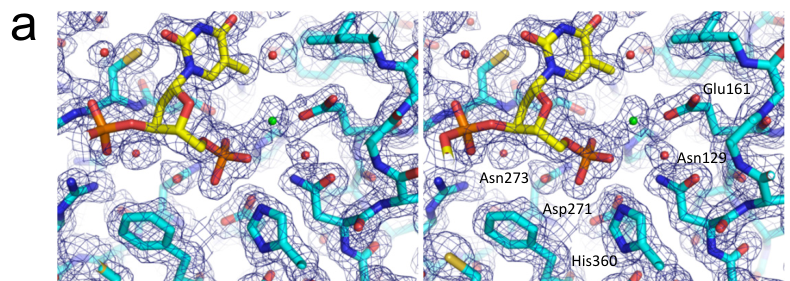

## Question

# Gene Research for Functional Annotation

## ⚠️ CRITICAL: Gene/Protein Identification Context

**BEFORE YOU BEGIN RESEARCH:** You MUST verify you are researching the CORRECT gene/protein. Gene symbols can be ambiguous, especially for less well-characterized genes from non-model organisms.

### Target Gene/Protein Identity (from UniProt):
- **UniProt Accession:** Q5XJA0
- **Protein Description:** RecName: Full=Tyrosyl-DNA phosphodiesterase 2; Short=Tyr-DNA phosphodiesterase 2; EC=3.1.4.- {ECO:0000250|UniProtKB:Q9JJX7}; AltName: Full=5'-tyrosyl-DNA phosphodiesterase; Short=5'-Tyr-DNA phosphodiesterase; AltName: Full=TRAF and TNF receptor-associated protein homolog;
- **Gene Information:** Name=tdp2; Synonyms=ttrap, ttrapl; ORFNames=si:ch211-81e5.5, si:dkey-218n20.5;
- **Organism (full):** Danio rerio (Zebrafish) (Brachydanio rerio).
- **Protein Family:** Belongs to the CCR4/nocturin family. TTRAP/TDP2 subfamily.
- **Key Domains:** Endo/exonu/phosph_ase_sf. (IPR036691); Endo/exonuclease/phosphatase. (IPR005135); TDP2-like. (IPR051547); UBA-like_sf. (IPR009060); Exo_endo_phos (PF03372)

### MANDATORY VERIFICATION STEPS:

1. **Check if the gene symbol "tdp2" matches the protein description above**
2. **Verify the organism is correct:** Danio rerio (Zebrafish) (Brachydanio rerio).
3. **Check if protein family/domains align with what you find in literature**
4. **If you find literature for a DIFFERENT gene with the same or similar symbol, STOP**

### If Gene Symbol is Ambiguous or You Cannot Find Relevant Literature:

**DO NOT PROCEED WITH RESEARCH ON A DIFFERENT GENE.** Instead:
- State clearly: "The gene symbol 'tdp2' is ambiguous or literature is limited for this specific protein"
- Explain what you found (e.g., "Found extensive literature on a different gene with the same symbol in a different organism")
- Describe the protein based ONLY on the UniProt information provided above
- Suggest that the protein function can be inferred from domain/family information

### Research Target:

Please provide a comprehensive research report on the gene **tdp2** (gene ID: tdp2, UniProt: Q5XJA0) in DANRE.

The research report should be a detailed narrative explaining the function, biological processes, and localization of the gene product. Citations should be given for all claims.

You should prioritize authoritative reviews and primary scientific literature when conducting research. You can supplement
this with annotations you find in gene/protein databases, but these can be outdated or inaccurate.

We are specifically interested in the primary function of the gene - for enzymes, what reaction is catalyzed, and what is the substrate specificity? For transporters, what is the substrate? For structural proteins or adapters, what is the broader structural role? For signaling molecules, what is the role in the pathway.

We are interested in where in or outside the cell the gene product carries out its function.

We are also interested in the signaling or biochemical pathways in which the gene functions. We are less interested in broad pleiotropic effects, except where these elucidate the precise role.

Include evidence where possible. We are interested in both experimental evidence as well as inference from structure, evolution, or bioinformatic analysis. Precise studies should be prioritized over high-throughput, where available.

## Output

Question: You are an expert researcher providing comprehensive, well-cited information.

Provide detailed information focusing on:
1. Key concepts and definitions with current understanding
2. Recent developments and latest research (prioritize 2023-2024 sources)
3. Current applications and real-world implementations
4. Expert opinions and analysis from authoritative sources
5. Relevant statistics and data from recent studies

Format as a comprehensive research report with proper citations. Include URLs and publication dates where available.
Always prioritize recent, authoritative sources and provide specific citations for all major claims.

# Gene Research for Functional Annotation

## ⚠️ CRITICAL: Gene/Protein Identification Context

**BEFORE YOU BEGIN RESEARCH:** You MUST verify you are researching the CORRECT gene/protein. Gene symbols can be ambiguous, especially for less well-characterized genes from non-model organisms.

### Target Gene/Protein Identity (from UniProt):
- **UniProt Accession:** Q5XJA0
- **Protein Description:** RecName: Full=Tyrosyl-DNA phosphodiesterase 2; Short=Tyr-DNA phosphodiesterase 2; EC=3.1.4.- {ECO:0000250|UniProtKB:Q9JJX7}; AltName: Full=5'-tyrosyl-DNA phosphodiesterase; Short=5'-Tyr-DNA phosphodiesterase; AltName: Full=TRAF and TNF receptor-associated protein homolog;
- **Gene Information:** Name=tdp2; Synonyms=ttrap, ttrapl; ORFNames=si:ch211-81e5.5, si:dkey-218n20.5;
- **Organism (full):** Danio rerio (Zebrafish) (Brachydanio rerio).
- **Protein Family:** Belongs to the CCR4/nocturin family. TTRAP/TDP2 subfamily.
- **Key Domains:** Endo/exonu/phosph_ase_sf. (IPR036691); Endo/exonuclease/phosphatase. (IPR005135); TDP2-like. (IPR051547); UBA-like_sf. (IPR009060); Exo_endo_phos (PF03372)

### MANDATORY VERIFICATION STEPS:

1. **Check if the gene symbol "tdp2" matches the protein description above**
2. **Verify the organism is correct:** Danio rerio (Zebrafish) (Brachydanio rerio).
3. **Check if protein family/domains align with what you find in literature**
4. **If you find literature for a DIFFERENT gene with the same or similar symbol, STOP**

### If Gene Symbol is Ambiguous or You Cannot Find Relevant Literature:

**DO NOT PROCEED WITH RESEARCH ON A DIFFERENT GENE.** Instead:
- State clearly: "The gene symbol 'tdp2' is ambiguous or literature is limited for this specific protein"
- Explain what you found (e.g., "Found extensive literature on a different gene with the same symbol in a different organism")
- Describe the protein based ONLY on the UniProt information provided above
- Suggest that the protein function can be inferred from domain/family information

### Research Target:

Please provide a comprehensive research report on the gene **tdp2** (gene ID: tdp2, UniProt: Q5XJA0) in DANRE.

The research report should be a detailed narrative explaining the function, biological processes, and localization of the gene product. Citations should be given for all claims.

You should prioritize authoritative reviews and primary scientific literature when conducting research. You can supplement
this with annotations you find in gene/protein databases, but these can be outdated or inaccurate.

We are specifically interested in the primary function of the gene - for enzymes, what reaction is catalyzed, and what is the substrate specificity? For transporters, what is the substrate? For structural proteins or adapters, what is the broader structural role? For signaling molecules, what is the role in the pathway.

We are interested in where in or outside the cell the gene product carries out its function.

We are also interested in the signaling or biochemical pathways in which the gene functions. We are less interested in broad pleiotropic effects, except where these elucidate the precise role.

Include evidence where possible. We are interested in both experimental evidence as well as inference from structure, evolution, or bioinformatic analysis. Precise studies should be prioritized over high-throughput, where available.

## Research report: Danio rerio **tdp2 / ttrap** (UniProt **Q5XJA0**) — functional annotation

### 1) Identity verification and scope control (mandatory)
**Target identity (verified):** The UniProt accession **Q5XJA0** is annotated as **tyrosyl‑DNA phosphodiesterase 2 (Tdp2)**, also referred to as **TTRAP** (TRAF and TNF receptor‑associated protein) in vertebrates, from **Danio rerio** (zebrafish). This matches the canonical biochemical role of TDP2 as a **5′‑tyrosyl‑DNA phosphodiesterase** that resolves **5′‑phosphotyrosyl** adducts on DNA ends (shi2012structuralbasisfor pages 1-5, rao2016noveltdp2ubiquitininteractions pages 1-2).

**Important zebrafish nuance (ortholog duplication):** Recent zebrafish work reports **two tdp2 orthologs (tdp2a and tdp2b)** in zebrafish embryos and adults (anticevic2024tyrosyldnaphosphodiesterase2 pages 1-2). Thus, “tdp2” in zebrafish literature may refer to either paralog or to the shared function; the 2024 in vivo embryo work identifies **tdp2b** as the dominant embryonic activity (anticevic2024tyrosyldnaphosphodiesterase2 pages 14-15). Where paralog‑specific data exist, it is stated explicitly.

### 2) Key concepts and definitions (current understanding)

#### 2.1 DNA–protein crosslinks (DPCs) and topoisomerase cleavage complexes
DNA–protein crosslinks (DPCs) are covalent adducts between DNA and proteins that can block replication and transcription; **topoisomerase cleavage complexes (TOPcc)** are a major biologically important subset where the catalytic tyrosine of a topoisomerase is covalently linked to a DNA phosphate (anticevic2024tyrosyldnaphosphodiesterase2 pages 1-2). 

For **TOP2**, abortive TOP2 cleavage can leave TOP2 covalently attached to the **5′ DNA ends** of a double‑strand break as a **5′‑phosphotyrosyl linkage**. Resolution of this adduct is required to produce ends that can be ligated by classical double‑strand break repair (zagnolivieira2023inactivatingtdp2missense pages 1-2, rao2016noveltdp2ubiquitininteractions pages 1-2).

#### 2.2 What Tdp2 does (definition of enzymatic activity)
**Tdp2/TTRAP is a metal‑dependent phosphodiesterase** that hydrolyzes the **5′‑phosphotyrosyl bond** linking a topoisomerase‑derived peptide (classically from TOP2) to the 5′ end of DNA, thereby “cleaning” the DNA terminus for repair (rao2016noveltdp2ubiquitininteractions pages 1-2, kwah2024mutationsintyrosyldna pages 53-59). Structural evidence from zebrafish Tdp2 bound to a 5′‑phosphotyrosyl DNA substrate shows the tyrosine moiety removed in the active site and density consistent with a metal ion at the 5′ phosphate, supporting metal‑assisted hydrolysis (shi2012structuralbasisfor pages 1-5).

### 3) Molecular function: reaction catalyzed, substrate specificity, and mechanism

#### 3.1 Catalyzed reaction and substrate preference
**Primary substrate class:** **5′‑phosphotyrosyl DNA adducts**, particularly those produced by abortive **TOP2** activity (TOP2‑DPC/TOP2cc), are the canonical substrates for TDP2 in vertebrates (zagnolivieira2023inactivatingtdp2missense pages 1-2, rao2016noveltdp2ubiquitininteractions pages 1-2). 

**Mechanistic role in DSB repair:** By removing the covalently attached topoisomerase peptide/tyrosine adduct from a **5′ DNA end**, TDP2 generates a 5′ terminus compatible with **error‑free ligation by non‑homologous end joining (NHEJ)** (anticevic2024tyrosyldnaphosphodiesterase2 pages 15-16, zagnolivieira2023inactivatingtdp2missense pages 1-2).

#### 3.2 Structural basis (zebrafish evidence) and catalytic residues
A high‑resolution crystal structure of **zebrafish Tdp2** bound to a 5′‑phosphotyrosyl DNA substrate defined a deep binding groove that accommodates the 5′ end of single‑stranded DNA and positions the phosphotyrosyl linkage in the catalytic pocket (publication date **2012‑10**, URL: https://doi.org/10.1038/nsmb.2423) (shi2012structuralbasisfor pages 1-5). 

Key active‑site residues in zebrafish Tdp2 reported in the structure include **Asn129, Glu161, Asp271, and His360**, consistent with conserved catalytic architecture across TDP2 orthologs (shi2012structuralbasisfor pages 1-5). Active‑site close‑ups and DNA‑positioning interactions are shown in cropped panels from the paper’s supplementary figure (shi2012structuralbasisfor media 382b4469, shi2012structuralbasisfor media 9c70ff0f, shi2012structuralbasisfor media 6724093a).

### 4) Biological processes and pathways

#### 4.1 TOP2‑DPC/TOP2cc repair and coupling to NHEJ
The zebrafish in vivo study frames Tdp2’s core function as processing TOP2‑linked lesions to promote **error‑free NHEJ**, noting that TOP2 cleavage can create **4‑base 5′ overhang “sticky ends”** whose accurate restoration is supported by TDP2‑mediated end cleaning (publication date **2024‑08**, URL: https://doi.org/10.3389/fcell.2024.1394531) (anticevic2024tyrosyldnaphosphodiesterase2 pages 15-16). 

Human genetic evidence similarly emphasizes that TDP2 resolves **TOP2‑DNA adducts** to permit direct ligation by NHEJ; catalytically inactive TDP2 is associated with reduced repair of TOP2‑induced damage and etoposide hypersensitivity (publication date **2023‑08**, URL: https://doi.org/10.1007/s00439-023-02589-3) (zagnolivieira2023inactivatingtdp2missense pages 1-2).

#### 4.2 Regulation and processing context: proteolysis, SUMO/ubiquitin, and the UBA domain
TDP2 is composed of a C‑terminal catalytic phosphodiesterase domain and an N‑terminal region containing a **ubiquitin‑associated (UBA) domain**. Disrupting the UBA–ubiquitin binding interface strongly compromises repair of TOP2‑mediated DNA damage while **not affecting nuclear import**, supporting a functional role for ubiquitin signaling in recruiting/activating TDP2 at damage sites (publication date **2016‑08**, URL: https://doi.org/10.1093/nar/gkw719) (rao2016noveltdp2ubiquitininteractions pages 1-2).

In zebrafish organismal discussion, the relative contributions of **proteolysis** and factors such as **ZATT/ZNF451‑mediated processing** versus direct phosphodiesterase cleavage in TOP2‑DPC repair are described as not fully resolved (anticevic2024tyrosyldnaphosphodiesterase2 pages 15-16).

### 5) Cellular and subcellular localization
Direct, zebrafish‑specific subcellular localization (e.g., microscopy‑validated nuclear vs cytosolic distribution across tissues) was not captured in the retrieved zebrafish 2024 in vivo evidence excerpts; however, vertebrate TDP2 is described as undergoing **nuclear import** and UBA‑domain mutations that disrupt ubiquitin binding do **not** alter nuclear import, suggesting that nuclear localization per se is separable from ubiquitin‑mediated repair function (rao2016noveltdp2ubiquitininteractions pages 1-2). 

At the organism/tissue level in zebrafish, **tdp2b** is reported as highly expressed early in development (from **6 hpf**) and in adult **brain and ovaries**, while **tdp2a** shows more moderate expression and enrichment in **testis** (anticevic2024tyrosyldnaphosphodiesterase2 pages 14-15). These data support a broad requirement for Tdp2 activity in proliferative and post‑mitotic contexts, but do not, by themselves, define subcellular compartmentalization.

### 6) Zebrafish-specific functional evidence (strongest organismal data; 2024 priority)

#### 6.1 Paralog specialization and embryonic requirement
A 2024 zebrafish study identified two paralogs (**tdp2a** and **tdp2b**) and found **tdp2b** to be the major embryonic ortholog (phylogenetically closer to human TDP2) (anticevic2024tyrosyldnaphosphodiesterase2 pages 1-2). 

**Functional perturbation:** Morpholino silencing of **tdp2b** caused an approximately **50% decrease in measured Tdp2 enzymatic activity** and increased DNA damage signaling. Specifically, γH2AX levels increased **1.8‑fold** with tdp2b silencing and **1.9‑fold** with combined tdp2a/tdp2b knockdown (anticevic2024tyrosyldnaphosphodiesterase2 pages 14-15). 

**DPC accumulation:** Silencing of tdp2b increased total DPCs spanning **10–250 kDa** (especially **40–150 kDa**), consistent with accumulation of large TOP2‑linked adducts (TOP2‑DPCs ≈176 kDa in zebrafish) (anticevic2024tyrosyldnaphosphodiesterase2 pages 15-16).

#### 6.2 Rescue experiments support enzyme activity as causal
Overexpression of recombinant **Tdp2b** rescued DPC accumulation and restored γH2AX toward wild‑type levels, whereas a **catalytically inactive D285A** mutant failed to rescue—supporting that the phosphodiesterase activity is the key protective function in vivo (anticevic2024tyrosyldnaphosphodiesterase2 pages 14-15).

#### 6.3 Benchmarking magnitude of DSB induction
The same study reports positive‑control DNA damage conditions that help interpret effect sizes: **10 mM formaldehyde for 30 min** increased DSB marker readouts **2.5‑fold**, while **50 µM etoposide for 1 h** increased them **2.1‑fold** (anticevic2024tyrosyldnaphosphodiesterase2 pages 14-15). These benchmarks situate the tdp2 knockdown‑induced γH2AX increase (~1.8–1.9×) as biologically meaningful but smaller than acute chemical DSB induction.

### 7) Recent developments (2023–2024 emphasis)

#### 7.1 2024: in vivo zebrafish evidence for DPC/DSB protection
The 2024 zebrafish study provides organism‑level evidence that Tdp2 prevents accumulation of DPCs and DSBs during development, with paralog specificity (tdp2b dominant in embryos) and catalytic‑activity dependence shown by rescue with WT but not inactive mutant (anticevic2024tyrosyldnaphosphodiesterase2 pages 15-16, anticevic2024tyrosyldnaphosphodiesterase2 pages 14-15, anticevic2024tyrosyldnaphosphodiesterase2 pages 1-2).

#### 7.2 2024: transcriptional regulation linked to TOP2 physiology
A 2024 NAR Cancer study reports that TDP2 regulates estrogen‑responsive transcription programs: loss of TDP2 prolongs estrogen‑induced **MYC** activation, and bulk plus single‑cell RNA‑seq implicate **MYC** and **CCND1** as oncogenes whose estrogen response dynamics are tightly controlled by TDP2 (publication date **2024‑04**, URL: https://doi.org/10.1093/narcan/zcae016) (manguso2024tdp2isa pages 1-2, manguso2024tdp2isa pages 1-1). This supports a current view that TDP2 not only repairs abortive TOP2 events but can shape gene expression outcomes when TOP2 activity is part of regulated transcription.

#### 7.3 2023: human genetics extends phenotype spectrum and pathway connections
A 2023 Human Genetics report describes a catalytically inactive missense mutation (**E152K**) with clinical overlap reminiscent of Fanconi anemia features, and shows that TDP2‑mutated and Fanconi anemia cells both exhibit increased chromosome breakage in response to **etoposide**, suggesting functional interplay between TOP2 lesion responses and the FA pathway (publication date **2023‑08**, URL: https://doi.org/10.1007/s00439-023-02589-3) (zagnolivieira2023inactivatingtdp2missense pages 1-2).

### 8) Current applications and real-world implementations

#### 8.1 Chemical biology / oncology: TDP2 inhibition to modulate topoisomerase poison response
Because TDP2 counteracts the cytotoxicity of TOP2 poisons by repairing TOP2cc/TOP2‑DPC lesions, it is being explored as a drug target or co‑target in cancer therapy. A 2023 study reports **(−)-usnic acid derivatives** that inhibit human Tdp2 with **IC50 = 6–9 µM**, while also inhibiting Tdp1 more potently (IC50 0.02–0.2 µM) (publication date **2023‑10**, URL: https://doi.org/10.3390/genes14101931) (zakharenko2023usnicacidderivatives pages 1-2).

In cell assays with etoposide, these compounds produced differential outcomes depending on Tdp2 status: they increased etoposide **CC50** in HEK293FT wild‑type cells to **3.0–3.9 µM** (vs **2.4 µM** with DMSO) but decreased CC50 in **Tdp2 knockout** cells to **1.2–1.6 µM** (vs **2.3 µM** with DMSO), consistent with functional redundancy/compensation between TDP1 and TDP2 and context‑dependent pharmacology (zakharenko2023usnicacidderivatives pages 1-2).

#### 8.2 Structural framework for inhibitor development
The zebrafish Tdp2 crystal structure with phosphotyrosyl DNA provides a template for structure‑guided inhibitor design by exposing the narrow, basic DNA‑binding groove and catalytic pocket geometry (shi2012structuralbasisfor pages 1-5, shi2012structuralbasisfor media 382b4469).

### 9) Expert synthesis and interpretation (evidence-weighted)

1. **Primary function is conserved and well supported:** Across vertebrates, the strongest and most consistent evidence supports Tdp2 as the enzyme that directly resolves **5′‑phosphotyrosyl DNA adducts**, particularly TOP2‑derived DPCs, thereby promoting accurate DSB repair by NHEJ (anticevic2024tyrosyldnaphosphodiesterase2 pages 15-16, zagnolivieira2023inactivatingtdp2missense pages 1-2, rao2016noveltdp2ubiquitininteractions pages 1-2).
2. **Zebrafish evidence is now strong and paralog-aware:** The 2024 zebrafish in vivo results provide direct organismal evidence that loss of embryonic **tdp2b** increases DPC accumulation and DSB signaling, with rescue requiring catalytic activity (anticevic2024tyrosyldnaphosphodiesterase2 pages 14-15).
3. **Regulatory layers likely matter in vivo:** The requirement for an intact ubiquitin‑binding UBA domain for effective TOP2 lesion repair (without changing nuclear import) suggests that recruitment/retention at ubiquitin‑marked lesions is a key determinant of functional repair capacity (rao2016noveltdp2ubiquitininteractions pages 1-2).
4. **Expanding biology into transcription:** 2024 data linking TDP2 to estrogen‑responsive oncogene expression support a model in which TDP2 can influence transcriptional dynamics by resolving TOP2‑associated cleavage intermediates at specific loci (manguso2024tdp2isa pages 1-2).

### 10) Consolidated evidence table
The following table compiles major annotation points, quantitative outcomes, and primary sources.

| Claim | Key quantitative/statistical details | Source (citation id) | Publication year | URL |
|---|---|---|---|---|
| **Enzymatic activity / substrate**: Danio rerio Tdp2 is a **5′-tyrosyl-DNA phosphodiesterase** that hydrolyzes the phosphotyrosyl bond linking trapped topoisomerase-derived peptides to the **5′ end of DNA**, especially TOP2-DPC/TOP2cc intermediates. | Zebrafish embryo knockdown data support Tdp2b as the main embryonic 5′-end processing activity; tdp2b silencing caused an approximately **50% decrease** in measured Tdp2 activity. Structural/biochemical work used **1.66 Å** zebrafish Tdp2 crystal structure and a **10 mM T5PNP** hydrolysis assay with **1.0 µM enzyme**, **1 mM MgCl2**. | (anticevic2024tyrosyldnaphosphodiesterase2 pages 14-15, shi2012structuralbasisfor pages 1-5) | 2024, 2012 | https://doi.org/10.3389/fcell.2024.1394531 ; https://doi.org/10.1038/nsmb.2423 |
| **Structural domains / residues**: Tdp2 contains a catalytic **EEP/endonuclease-exonuclease-phosphatase** domain and an N-terminal **UBA-like** region; conserved catalytic residues support metal-dependent hydrolysis. | Zebrafish catalytic/active-site residues reported include **Asn129, Glu161, Asp271, His360**; human/domain-comparative work describes an N-terminal **UBA** domain with preference for **K48/K63-linked polyubiquitin** and a distinct fold lacking the canonical MGF motif. | (shi2012structuralbasisfor pages 1-5, rao2016noveltdp2ubiquitininteractions pages 1-2, kwah2024mutationsintyrosyldna pages 53-59) | 2012, 2016, 2024 | https://doi.org/10.1038/nsmb.2423 ; https://doi.org/10.1093/nar/gkw719 ; https://doi.org/10.1016/j.jbc.2024.107446 |
| **Zebrafish embryo evidence (tdp2a vs tdp2b)**: Zebrafish has two orthologs, **tdp2a** and **tdp2b**; **tdp2b** is the primary embryonic ortholog and is phylogenetically closer to human TDP2. | tdp2b knockdown caused loss of Tdp2 activity, a **1.8-fold increase** in γH2AX; combined **tdp2a/tdp2b** knockdown caused a **1.9-fold increase**. Positive controls: **10 mM formaldehyde, 30 min** caused **2.5-fold** DSB increase; **50 µM etoposide, 1 h** caused **2.1-fold** increase. Tdp2b overexpression rescued DPC accumulation and restored γH2AX toward WT; inactive **D285A** failed to rescue. DPCs accumulating after knockdown ranged **10–250 kDa**, especially **40–150 kDa**. | (anticevic2024tyrosyldnaphosphodiesterase2 pages 15-16, anticevic2024tyrosyldnaphosphodiesterase2 pages 14-15, anticevic2024tyrosyldnaphosphodiesterase2 pages 1-2) | 2024 | https://doi.org/10.3389/fcell.2024.1394531 |
| **Pathways / partners**: Tdp2 acts in repair of **TOP2 cleavage complexes (TOP2cc/TOP2-DPCs)** and channels repaired ends toward **error-free NHEJ**, with links to **Ku/Ku70** and DSB-repair machinery. | TDP2 restores clean 5′ DNA ends, including **4-base sticky ends** generated by TOP2, promoting direct ligation by NHEJ. Comparative evidence places TDP2 in a Ku-associated NHEJ pathway and shows TOP2-induced DSBs are preferentially repaired by NHEJ in mitotic cells; keywords and mechanistic context in zebrafish paper include **Ku80**. | (anticevic2024tyrosyldnaphosphodiesterase2 pages 15-16, anticevic2024tyrosyldnaphosphodiesterase2 pages 1-2, zagnolivieira2023inactivatingtdp2missense pages 1-2, kwah2024mutationsintyrosyldna pages 50-53) | 2024, 2023, 2024 | https://doi.org/10.3389/fcell.2024.1394531 ; https://doi.org/10.1007/s00439-023-02589-3 ; https://doi.org/10.1016/j.jbc.2024.107446 |
| **Regulation (ubiquitin / UBA, SUMO / ZATT context)**: Tdp2 function is modulated by ubiquitin-binding through its N-terminal UBA domain, and TOP2-DPC processing can involve **SUMOylation by ZATT/ZNF451** before or alongside TDP2 action. | UBA-domain mutations impaired repair of Top2-mediated DNA damage without affecting nuclear import; the UBA binds monoUb but prefers **K48- and K63-linked polyUb**. Recent zebrafish review/discussion notes unresolved interplay between **proteolysis**, **ZATT**, and direct TDP2 cleavage in TOP2-DPC repair. | (anticevic2024tyrosyldnaphosphodiesterase2 pages 15-16, rao2016noveltdp2ubiquitininteractions pages 1-2, kwah2024mutationsintyrosyldna pages 53-59, kwah2024mutationsintyrosyldna pages 50-53) | 2024, 2016, 2024 | https://doi.org/10.3389/fcell.2024.1394531 ; https://doi.org/10.1093/nar/gkw719 ; https://doi.org/10.1016/j.jbc.2024.107446 |
| **Non-DNA repair roles (transcriptional regulation)**: Beyond DNA repair, TDP2/TTRAP can regulate transcription, including **estrogen-responsive oncogene expression**, likely by resolving TOP2-linked transcription-associated DNA breaks. | In 2024 work, loss of TDP2 prolonged estrogen-induced **MYC** activation; bulk and single-cell RNA-seq identified **MYC** and **CCND1** as loci whose estrogen responses are tightly regulated by TDP2. Earlier work also linked TDP2/TTRAP/EAPII to transcription/signaling pathways (e.g., NF-κB/MAPK context). | (rao2016noveltdp2ubiquitininteractions pages 1-2, manguso2024tdp2isa pages 1-2, manguso2024tdp2isa pages 1-1) | 2016, 2024 | https://doi.org/10.1093/nar/gkw719 ; https://doi.org/10.1093/narcan/zcae016 |
| **Applications (inhibitors / IC50 / cellular CC50 effects)**: TDP2 is being explored as a therapeutic target to potentiate topoisomerase poisons; dual TDP1/TDP2 inhibitors have been reported. | 2023 usnic-acid derivatives inhibited human Tdp2 with **IC50 6–9 µM**; in HEK293FT cells they increased etoposide **CC50 to 3.0–3.9 µM** in WT versus **2.4 µM** DMSO, but **decreased CC50 to 1.2–1.6 µM** in **Tdp2-KO** cells versus **2.3 µM** DMSO. 2024 sulfide/sulfoxide/sulfone derivatives inhibited TDP2 with **IC50 138–421 µM**; lead compounds showed **4× synergy** with topotecan in HeLa cells. | (zakharenko2023usnicacidderivatives pages 1-2, zakharenko2023usnicacidderivatives pages 11-12) | 2023, 2024 | https://doi.org/10.3390/genes14101931 ; https://doi.org/10.3390/chemistry6060101 |

*Table: This table compiles the main functional-annotation points for Danio rerio Tdp2 in the UniProt Q5XJA0 context, integrating zebrafish-specific evidence with conserved mechanistic studies. It is useful for quickly mapping enzyme function, pathways, regulation, phenotypes, and translational relevance.*

### 11) Evidence gaps and recommendations for functional annotation

* **Subcellular localization in zebrafish**: The retrieved sources support nuclear import in vertebrate cells but provide limited zebrafish‑specific subcellular localization details. A high‑confidence zebrafish annotation would benefit from immunofluorescence or tagged knock‑in localization of the specific paralog corresponding to Q5XJA0 (rao2016noveltdp2ubiquitininteractions pages 1-2).
* **Paralog mapping to Q5XJA0**: Because zebrafish has **tdp2a/tdp2b**, ensuring which UniProt entry corresponds to which paralog is important for precise annotation in DANRE; functional claims should be tied to the appropriate paralog when possible (anticevic2024tyrosyldnaphosphodiesterase2 pages 1-2).

## Key cited sources (URLs; publication dates)
* Anticevic et al. Frontiers in Cell and Developmental Biology (**2024-08**) https://doi.org/10.3389/fcell.2024.1394531 (anticevic2024tyrosyldnaphosphodiesterase2 pages 15-16, anticevic2024tyrosyldnaphosphodiesterase2 pages 14-15, anticevic2024tyrosyldnaphosphodiesterase2 pages 1-2)
* Shi et al. Nature Structural & Molecular Biology (**2012-10**) https://doi.org/10.1038/nsmb.2423 (shi2012structuralbasisfor pages 1-5, shi2012structuralbasisfor media 382b4469)
* Rao et al. Nucleic Acids Research (**2016-08**) https://doi.org/10.1093/nar/gkw719 (rao2016noveltdp2ubiquitininteractions pages 1-2)
* Zagnoli‑Vieira et al. Human Genetics (**2023-08**) https://doi.org/10.1007/s00439-023-02589-3 (zagnolivieira2023inactivatingtdp2missense pages 1-2)
* Manguso et al. NAR Cancer (**2024-04**) https://doi.org/10.1093/narcan/zcae016 (manguso2024tdp2isa pages 1-2)
* Zakharenko et al. Genes (**2023-10**) https://doi.org/10.3390/genes14101931 (zakharenko2023usnicacidderivatives pages 1-2)

References

1. (shi2012structuralbasisfor pages 1-5): Ke Shi, Kayo Kurahashi, Rui Gao, Susan E Tsutakawa, John A Tainer, Yves Pommier, and Hideki Aihara. Structural basis for recognition of 5′-phosphotyrosine adducts by tdp2. Oct 2012. URL: https://doi.org/10.1038/nsmb.2423, doi:10.1038/nsmb.2423. This article has 83 citations and is from a highest quality peer-reviewed journal.

2. (rao2016noveltdp2ubiquitininteractions pages 1-2): Timsi Rao, Rui Gao, Saeko Takada, Muthana Al Abo, Xiang Chen, Kylie J. Walters, Yves Pommier, and Hideki Aihara. Novel tdp2-ubiquitin interactions and their importance for the repair of topoisomerase ii-mediated dna damage. Nucleic Acids Research, 44:10201-10215, Aug 2016. URL: https://doi.org/10.1093/nar/gkw719, doi:10.1093/nar/gkw719. This article has 39 citations and is from a highest quality peer-reviewed journal.

3. (anticevic2024tyrosyldnaphosphodiesterase2 pages 1-2): Ivan Anticevic, Cecile Otten, and Marta Popovic. Tyrosyl-dna phosphodiesterase 2 (tdp2) repairs dna-protein crosslinks and protects against double strand breaks in vivo. Frontiers in Cell and Developmental Biology, Aug 2024. URL: https://doi.org/10.3389/fcell.2024.1394531, doi:10.3389/fcell.2024.1394531. This article has 3 citations.

4. (anticevic2024tyrosyldnaphosphodiesterase2 pages 14-15): Ivan Anticevic, Cecile Otten, and Marta Popovic. Tyrosyl-dna phosphodiesterase 2 (tdp2) repairs dna-protein crosslinks and protects against double strand breaks in vivo. Frontiers in Cell and Developmental Biology, Aug 2024. URL: https://doi.org/10.3389/fcell.2024.1394531, doi:10.3389/fcell.2024.1394531. This article has 3 citations.

5. (zagnolivieira2023inactivatingtdp2missense pages 1-2): Guido Zagnoli-Vieira, Jan Brazina, Kris Van Den Bogaert, Wim Huybrechts, Guy Molenaers, Keith W. Caldecott, and Hilde Van Esch. Inactivating tdp2 missense mutation in siblings with congenital abnormalities reminiscent of fanconi anemia. Human Genetics, 142:1417-1427, Aug 2023. URL: https://doi.org/10.1007/s00439-023-02589-3, doi:10.1007/s00439-023-02589-3. This article has 10 citations and is from a peer-reviewed journal.

6. (kwah2024mutationsintyrosyldna pages 53-59): Ji Kent Kwah, Nirajan Bhandari, Christine Rourke, Gabriella Gassaway, and Aimee Jaramillo-Lambert. Mutations in tyrosyl-dna phosphodiesterase 2 suppress top-2 induced chromosome segregation defects during caenorhabditis elegans spermatogenesis. Journal of Biological Chemistry, 300:107446, Jul 2024. URL: https://doi.org/10.1016/j.jbc.2024.107446, doi:10.1016/j.jbc.2024.107446. This article has 1 citations and is from a domain leading peer-reviewed journal.

7. (anticevic2024tyrosyldnaphosphodiesterase2 pages 15-16): Ivan Anticevic, Cecile Otten, and Marta Popovic. Tyrosyl-dna phosphodiesterase 2 (tdp2) repairs dna-protein crosslinks and protects against double strand breaks in vivo. Frontiers in Cell and Developmental Biology, Aug 2024. URL: https://doi.org/10.3389/fcell.2024.1394531, doi:10.3389/fcell.2024.1394531. This article has 3 citations.

8. (shi2012structuralbasisfor media 382b4469): Ke Shi, Kayo Kurahashi, Rui Gao, Susan E Tsutakawa, John A Tainer, Yves Pommier, and Hideki Aihara. Structural basis for recognition of 5′-phosphotyrosine adducts by tdp2. Oct 2012. URL: https://doi.org/10.1038/nsmb.2423, doi:10.1038/nsmb.2423. This article has 83 citations and is from a highest quality peer-reviewed journal.

9. (shi2012structuralbasisfor media 9c70ff0f): Ke Shi, Kayo Kurahashi, Rui Gao, Susan E Tsutakawa, John A Tainer, Yves Pommier, and Hideki Aihara. Structural basis for recognition of 5′-phosphotyrosine adducts by tdp2. Oct 2012. URL: https://doi.org/10.1038/nsmb.2423, doi:10.1038/nsmb.2423. This article has 83 citations and is from a highest quality peer-reviewed journal.

10. (shi2012structuralbasisfor media 6724093a): Ke Shi, Kayo Kurahashi, Rui Gao, Susan E Tsutakawa, John A Tainer, Yves Pommier, and Hideki Aihara. Structural basis for recognition of 5′-phosphotyrosine adducts by tdp2. Oct 2012. URL: https://doi.org/10.1038/nsmb.2423, doi:10.1038/nsmb.2423. This article has 83 citations and is from a highest quality peer-reviewed journal.

11. (manguso2024tdp2isa pages 1-2): Nicholas Manguso, Minhyung Kim, Neeraj Joshi, Md Rasel Al Mahmud, Juan Aldaco, Ryusuke Suzuki, Felipe Cortes-Ledesma, Xiaojiang Cui, Shintaro Yamada, Shunichi Takeda, Armando Giuliano, Sungyong You, and Hisashi Tanaka. Tdp2 is a regulator of estrogen-responsive oncogene expression. NAR Cancer, Apr 2024. URL: https://doi.org/10.1093/narcan/zcae016, doi:10.1093/narcan/zcae016. This article has 2 citations and is from a peer-reviewed journal.

12. (manguso2024tdp2isa pages 1-1): Nicholas Manguso, Minhyung Kim, Neeraj Joshi, Md Rasel Al Mahmud, Juan Aldaco, Ryusuke Suzuki, Felipe Cortes-Ledesma, Xiaojiang Cui, Shintaro Yamada, Shunichi Takeda, Armando Giuliano, Sungyong You, and Hisashi Tanaka. Tdp2 is a regulator of estrogen-responsive oncogene expression. NAR Cancer, Apr 2024. URL: https://doi.org/10.1093/narcan/zcae016, doi:10.1093/narcan/zcae016. This article has 2 citations and is from a peer-reviewed journal.

13. (zakharenko2023usnicacidderivatives pages 1-2): Alexandra L. Zakharenko, Nadezhda S. Dyrkheeva, Olga A. Luzina, Aleksandr S. Filimonov, Evgenii S. Mozhaitsev, Anastasia A. Malakhova, Sergey P. Medvedev, Suren M. Zakian, Nariman F. Salakhutdinov, and Olga I. Lavrik. Usnic acid derivatives inhibit dna repair enzymes tyrosyl-dna phosphodiesterases 1 and 2 and act as potential anticancer agents. Genes, 14:1931, Oct 2023. URL: https://doi.org/10.3390/genes14101931, doi:10.3390/genes14101931. This article has 3 citations.

14. (kwah2024mutationsintyrosyldna pages 50-53): Ji Kent Kwah, Nirajan Bhandari, Christine Rourke, Gabriella Gassaway, and Aimee Jaramillo-Lambert. Mutations in tyrosyl-dna phosphodiesterase 2 suppress top-2 induced chromosome segregation defects during caenorhabditis elegans spermatogenesis. Journal of Biological Chemistry, 300:107446, Jul 2024. URL: https://doi.org/10.1016/j.jbc.2024.107446, doi:10.1016/j.jbc.2024.107446. This article has 1 citations and is from a domain leading peer-reviewed journal.

15. (zakharenko2023usnicacidderivatives pages 11-12): Alexandra L. Zakharenko, Nadezhda S. Dyrkheeva, Olga A. Luzina, Aleksandr S. Filimonov, Evgenii S. Mozhaitsev, Anastasia A. Malakhova, Sergey P. Medvedev, Suren M. Zakian, Nariman F. Salakhutdinov, and Olga I. Lavrik. Usnic acid derivatives inhibit dna repair enzymes tyrosyl-dna phosphodiesterases 1 and 2 and act as potential anticancer agents. Genes, 14:1931, Oct 2023. URL: https://doi.org/10.3390/genes14101931, doi:10.3390/genes14101931. This article has 3 citations.

## Artifacts

- [Edison artifact artifact-00](tdp2-deep-research-falcon_artifacts/artifact-00.md)

## Citations

1. shi2012structuralbasisfor pages 1-5
2. zakharenko2023usnicacidderivatives pages 1-2
3. kwah2024mutationsintyrosyldna pages 53-59
4. kwah2024mutationsintyrosyldna pages 50-53
5. zakharenko2023usnicacidderivatives pages 11-12
6. https://doi.org/10.1038/nsmb.2423
7. https://doi.org/10.3389/fcell.2024.1394531
8. https://doi.org/10.1007/s00439-023-02589-3
9. https://doi.org/10.1093/nar/gkw719
10. https://doi.org/10.1093/narcan/zcae016
11. https://doi.org/10.3390/genes14101931
12. https://doi.org/10.1016/j.jbc.2024.107446
13. https://doi.org/10.3390/chemistry6060101
14. https://doi.org/10.1038/nsmb.2423,
15. https://doi.org/10.1093/nar/gkw719,
16. https://doi.org/10.3389/fcell.2024.1394531,
17. https://doi.org/10.1007/s00439-023-02589-3,
18. https://doi.org/10.1016/j.jbc.2024.107446,
19. https://doi.org/10.1093/narcan/zcae016,
20. https://doi.org/10.3390/genes14101931,