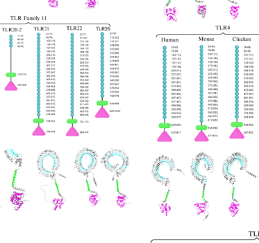

## Question

# Gene Research for Functional Annotation

## ⚠️ CRITICAL: Gene/Protein Identification Context

**BEFORE YOU BEGIN RESEARCH:** You MUST verify you are researching the CORRECT gene/protein. Gene symbols can be ambiguous, especially for less well-characterized genes from non-model organisms.

### Target Gene/Protein Identity (from UniProt):
- **UniProt Accession:** F1QMN8
- **Protein Description:** SubName: Full=Toll-like receptor 21 precursor {ECO:0000313|RefSeq:NP_001186264.1}; EC=3.2.2.6 {ECO:0000313|RefSeq:NP_001186264.1}; Flags: Precursor;
- **Gene Information:** Name=tlr21 {ECO:0000313|RefSeq:NP_001186264.1, ECO:0000313|ZFIN:ZDB-GENE-040220-4}; Synonyms=TLR21.1 {ECO:0000313|RefSeq:NP_001186264.1};
- **Organism (full):** Danio rerio (Zebrafish) (Brachydanio rerio).
- **Protein Family:** Belongs to the Toll-like receptor family.
- **Key Domains:** Leu-rich_rpt. (IPR001611); Leu-rich_rpt_typical-subtyp. (IPR003591); LRR_dom_sf. (IPR032675); TIR_dom. (IPR000157); Toll_tir_struct_dom_sf. (IPR035897)

### MANDATORY VERIFICATION STEPS:

1. **Check if the gene symbol "tlr21" matches the protein description above**
2. **Verify the organism is correct:** Danio rerio (Zebrafish) (Brachydanio rerio).
3. **Check if protein family/domains align with what you find in literature**
4. **If you find literature for a DIFFERENT gene with the same or similar symbol, STOP**

### If Gene Symbol is Ambiguous or You Cannot Find Relevant Literature:

**DO NOT PROCEED WITH RESEARCH ON A DIFFERENT GENE.** Instead:
- State clearly: "The gene symbol 'tlr21' is ambiguous or literature is limited for this specific protein"
- Explain what you found (e.g., "Found extensive literature on a different gene with the same symbol in a different organism")
- Describe the protein based ONLY on the UniProt information provided above
- Suggest that the protein function can be inferred from domain/family information

### Research Target:

Please provide a comprehensive research report on the gene **tlr21** (gene ID: tlr21, UniProt: F1QMN8) in DANRE.

The research report should be a detailed narrative explaining the function, biological processes, and localization of the gene product. Citations should be given for all claims.

You should prioritize authoritative reviews and primary scientific literature when conducting research. You can supplement
this with annotations you find in gene/protein databases, but these can be outdated or inaccurate.

We are specifically interested in the primary function of the gene - for enzymes, what reaction is catalyzed, and what is the substrate specificity? For transporters, what is the substrate? For structural proteins or adapters, what is the broader structural role? For signaling molecules, what is the role in the pathway.

We are interested in where in or outside the cell the gene product carries out its function.

We are also interested in the signaling or biochemical pathways in which the gene functions. We are less interested in broad pleiotropic effects, except where these elucidate the precise role.

Include evidence where possible. We are interested in both experimental evidence as well as inference from structure, evolution, or bioinformatic analysis. Precise studies should be prioritized over high-throughput, where available.

## Output

Question: You are an expert researcher providing comprehensive, well-cited information.

Provide detailed information focusing on:
1. Key concepts and definitions with current understanding
2. Recent developments and latest research (prioritize 2023-2024 sources)
3. Current applications and real-world implementations
4. Expert opinions and analysis from authoritative sources
5. Relevant statistics and data from recent studies

Format as a comprehensive research report with proper citations. Include URLs and publication dates where available.
Always prioritize recent, authoritative sources and provide specific citations for all major claims.

# Gene Research for Functional Annotation

## ⚠️ CRITICAL: Gene/Protein Identification Context

**BEFORE YOU BEGIN RESEARCH:** You MUST verify you are researching the CORRECT gene/protein. Gene symbols can be ambiguous, especially for less well-characterized genes from non-model organisms.

### Target Gene/Protein Identity (from UniProt):
- **UniProt Accession:** F1QMN8
- **Protein Description:** SubName: Full=Toll-like receptor 21 precursor {ECO:0000313|RefSeq:NP_001186264.1}; EC=3.2.2.6 {ECO:0000313|RefSeq:NP_001186264.1}; Flags: Precursor;
- **Gene Information:** Name=tlr21 {ECO:0000313|RefSeq:NP_001186264.1, ECO:0000313|ZFIN:ZDB-GENE-040220-4}; Synonyms=TLR21.1 {ECO:0000313|RefSeq:NP_001186264.1};
- **Organism (full):** Danio rerio (Zebrafish) (Brachydanio rerio).
- **Protein Family:** Belongs to the Toll-like receptor family.
- **Key Domains:** Leu-rich_rpt. (IPR001611); Leu-rich_rpt_typical-subtyp. (IPR003591); LRR_dom_sf. (IPR032675); TIR_dom. (IPR000157); Toll_tir_struct_dom_sf. (IPR035897)

### MANDATORY VERIFICATION STEPS:

1. **Check if the gene symbol "tlr21" matches the protein description above**
2. **Verify the organism is correct:** Danio rerio (Zebrafish) (Brachydanio rerio).
3. **Check if protein family/domains align with what you find in literature**
4. **If you find literature for a DIFFERENT gene with the same or similar symbol, STOP**

### If Gene Symbol is Ambiguous or You Cannot Find Relevant Literature:

**DO NOT PROCEED WITH RESEARCH ON A DIFFERENT GENE.** Instead:
- State clearly: "The gene symbol 'tlr21' is ambiguous or literature is limited for this specific protein"
- Explain what you found (e.g., "Found extensive literature on a different gene with the same symbol in a different organism")
- Describe the protein based ONLY on the UniProt information provided above
- Suggest that the protein function can be inferred from domain/family information

### Research Target:

Please provide a comprehensive research report on the gene **tlr21** (gene ID: tlr21, UniProt: F1QMN8) in DANRE.

The research report should be a detailed narrative explaining the function, biological processes, and localization of the gene product. Citations should be given for all claims.

You should prioritize authoritative reviews and primary scientific literature when conducting research. You can supplement
this with annotations you find in gene/protein databases, but these can be outdated or inaccurate.

We are specifically interested in the primary function of the gene - for enzymes, what reaction is catalyzed, and what is the substrate specificity? For transporters, what is the substrate? For structural proteins or adapters, what is the broader structural role? For signaling molecules, what is the role in the pathway.

We are interested in where in or outside the cell the gene product carries out its function.

We are also interested in the signaling or biochemical pathways in which the gene functions. We are less interested in broad pleiotropic effects, except where these elucidate the precise role.

Include evidence where possible. We are interested in both experimental evidence as well as inference from structure, evolution, or bioinformatic analysis. Precise studies should be prioritized over high-throughput, where available.

# Comprehensive Research Report: Zebrafish TLR21 (Gene ID: tlr21, UniProt: F1QMN8)

## Executive Summary

This report provides a comprehensive functional annotation of Toll-like receptor 21 (TLR21) from zebrafish (*Danio rerio*), UniProt accession F1QMN8. Based on current literature, zebrafish TLR21 is an endosomal pattern recognition receptor that detects unmethylated CpG DNA motifs and initiates innate immune responses. It functions as a non-mammalian functional homolog of mammalian TLR9, expanding the repertoire of CpG DNA surveillance in teleost fish (davis2026tolllikereceptorsin pages 18-20, lai2020immunostimulatoryactivitiesof pages 2-3).

**Critical clarification regarding UniProt annotation:** The EC number 3.2.2.6 assigned to F1QMN8 in UniProt appears to be an annotation error. TLR21 is a transmembrane signaling receptor, not an enzyme with catalytic activity. Multiple authoritative sources confirm that TLR21 binds CpG DNA as a ligand to initiate signal transduction, rather than acting as a substrate for enzymatic modification (davis2026tolllikereceptorsin pages 18-20, lai2020immunostimulatoryactivitiesof pages 2-3, davis2026tolllikereceptorsin pages 13-14).

---

## 1. Gene and Protein Identity

### 1.1 Gene Nomenclature
- **Gene symbol:** *tlr21* (synonym: *TLR21.1*)
- **Organism:** *Danio rerio* (Zebrafish)
- **UniProt accession:** F1QMN8
- **Protein name:** Toll-like receptor 21 precursor

TLR21 is a fish- and avian-specific member of the Toll-like receptor family that is absent from mammals (davis2026tolllikereceptorsin pages 13-14, davis2026tolllikereceptorsin pages 18-20, franza2024zebrafish(daniorerio) pages 7-8). It belongs to the TLR11 superfamily, which includes various non-mammalian pattern recognition receptors involved in pathogen sensing (davis2026tolllikereceptorsin pages 13-14, ghani2024unveilingthemultifaceted pages 4-5).

### 1.2 Evolutionary Context
TLR21 is present across teleost fishes, birds, and some amphibians, but notably absent from mammals (davis2026tolllikereceptorsin pages 18-20, guabiraba2024mechanismsoftype pages 4-7). Zebrafish and many other teleosts retain both TLR9 and TLR21, providing complementary CpG DNA recognition capabilities (lai2020immunostimulatoryactivitiesof pages 4-5, davis2026tolllikereceptorsin pages 13-14). This dual-receptor system allows broader detection of microbial DNA than either receptor alone (lai2020immunostimulatoryactivitiesof pages 3-4, lai2020immunostimulatoryactivitiesof pages 2-3).

---

## 2. Molecular Function and Primary Role

### 2.1 Pattern Recognition Receptor, Not an Enzyme

**TLR21 is a pattern recognition receptor (PRR), not a metabolic enzyme.** Despite the EC 3.2.2.6 annotation in UniProt, extensive literature confirms that TLR21 has no catalytic or enzymatic activity (davis2026tolllikereceptorsin pages 18-20, lai2020immunostimulatoryactivitiesof pages 2-3, davis2026tolllikereceptorsin pages 13-14). Its primary molecular function is to bind pathogen-associated molecular patterns (PAMPs) and convert this recognition event into intracellular signaling (lai2020immunostimulatoryactivitiesof pages 2-3, ghani2024unveilingthemultifaceted pages 8-9).

### 2.2 Ligand Recognition: CpG DNA Specificity

TLR21 functions as a sensor for **unmethylated CpG-containing DNA**, particularly synthetic CpG oligodeoxynucleotides (CpG-ODNs) that mimic microbial DNA (lai2020immunostimulatoryactivitiesof pages 2-3, davis2026tolllikereceptorsin pages 20-21, davis2026tolllikereceptorsin pages 18-20). Direct experimental evidence from zebrafish comes from heterologous expression studies: when zebrafish TLR21 (zebTLR21) was expressed in HEK293 cells, it conferred responsiveness to CpG-ODN stimulation, confirming its role as a functional CpG DNA receptor (lai2020immunostimulatoryactivitiesof pages 2-3).

**Sequence specificity:** Zebrafish TLR21 preferentially recognizes CpG motifs containing the **GTCGTT** hexamer sequence (lai2020immunostimulatoryactivitiesof pages 4-5, lai2020immunostimulatoryactivitiesof pages 3-4). This preference distinguishes it from zebrafish TLR9, which more strongly recognizes GACGTT- or AACGTT-containing motifs (lai2020immunostimulatoryactivitiesof pages 4-5, lai2020immunostimulatoryactivitiesof pages 3-4). The GTCGTT motif preference aligns TLR21 with sequences that show higher activity in human TLR9 assays, whereas zebrafish TLR9 resembles mouse TLR9 in its motif preference (lai2020immunostimulatoryactivitiesof pages 4-5, lai2020immunostimulatoryactivitiesof pages 2-3).

**Natural ligands:** In the physiological context, TLR21 recognizes CpG-rich DNA from bacteria and viruses that enter cells through endocytosis (davis2026tolllikereceptorsin pages 20-21, davis2026tolllikereceptorsin pages 18-20). Current evidence does not support TLR21 recognition of RNA, non-CpG DNA, or other distinct PAMP classes (guabiraba2024mechanismsoftype pages 7-10, lai2020immunostimulatoryactivitiesof pages 1-2, guabiraba2024mechanismsoftype pages 4-7).

### 2.3 Relationship to Mammalian TLR9

TLR21 is described as a **functional homolog** of mammalian TLR9, despite originating from a distinct evolutionary lineage (davis2026tolllikereceptorsin pages 18-20, davis2026tolllikereceptorsin pages 13-14, lai2020immunostimulatoryactivitiesof pages 1-2). Both receptors detect CpG DNA in endosomal compartments and initiate innate immune responses. However, TLR21 belongs to the TLR11 family, whereas TLR9 belongs to the TLR7/8/9 family (davis2026tolllikereceptorsin pages 13-14, lai2020immunostimulatoryactivitiesof pages 5-7). In non-mammalian vertebrates like birds, TLR21 has apparently functionally replaced TLR9, as chickens possess TLR21 but lack TLR9 (guabiraba2024mechanismsoftype pages 7-10, guabiraba2024mechanismsoftype pages 4-7). In contrast, zebrafish retain both receptors, enabling cooperative CpG surveillance (lai2020immunostimulatoryactivitiesof pages 3-4, davis2026tolllikereceptorsin pages 13-14).

| Feature | TLR21 | TLR9 | Comparative interpretation |
|---|---|---|---|
| Phylogenetic relationship | Member of the TLR11-family lineage; a non-mammalian CpG-DNA receptor related to, but not a one-to-one ortholog of, TLR9 (davis2026tolllikereceptorsin pages 13-14, lai2020immunostimulatoryactivitiesof pages 5-7) | Member of the TLR7/8/9 nucleic-acid-sensing lineage (lai2020immunostimulatoryactivitiesof pages 5-7) | TLR21 is best described as a **functional homolog** of mammalian TLR9 because both sense CpG DNA, despite belonging to distinct evolutionary TLR lineages (davis2026tolllikereceptorsin pages 18-20, lai2020immunostimulatoryactivitiesof pages 1-2) |
| Principal ligand | Unmethylated CpG-containing microbial DNA and synthetic CpG oligodeoxynucleotides (CpG-ODNs) (lai2020immunostimulatoryactivitiesof pages 2-3) | Unmethylated CpG-containing microbial DNA and CpG-ODNs (lai2020immunostimulatoryactivitiesof pages 3-4, lai2020immunostimulatoryactivitiesof pages 1-2) | Both receptors detect CpG DNA, and teleosts may use them cooperatively to broaden sequence recognition (lai2020immunostimulatoryactivitiesof pages 3-4, davis2026tolllikereceptorsin pages 13-14) |
| CpG-sequence preference in zebrafish | Preferentially responds to CpG-ODNs containing **GTCGTT**, including sequences with relatively strong activity toward human TLR9 (lai2020immunostimulatoryactivitiesof pages 4-5, lai2020immunostimulatoryactivitiesof pages 3-4) | Preferentially responds to **GACGTT**- or **AACGTT**-containing CpG-ODNs, resembling mouse-active CpG patterns (lai2020immunostimulatoryactivitiesof pages 4-5, lai2020immunostimulatoryactivitiesof pages 3-4) | Ligand selectivity is overlapping but non-identical; the exact optimum is species- and sequence-dependent rather than universally fixed across teleosts (lai2020immunostimulatoryactivitiesof pages 4-5, lai2020immunostimulatoryactivitiesof pages 2-3) |
| Cellular location | Intracellular/endosomal receptor; proposed to traffic from the ER to mature endosomal membranes through UNC93B1 before sensing internalized DNA (neves2026cartilaginousfishinform pages 13-16, davis2026tolllikereceptorsin pages 20-21) | Canonical intracellular receptor localized to endosomal membranes (davis2026tolllikereceptorsin pages 13-14) | Endosomal localization restricts recognition largely to DNA delivered by endocytosis or released from internalized microbes |
| Adaptor usage | **Not conclusively established for zebrafish.** Recent fish models propose TRIF-dependent, MyD88-independent signaling, but zebrafish-specific adaptor loss-of-function or recruitment evidence is lacking; other reviews infer MyD88-associated signaling (davis2026tolllikereceptorsin pages 20-21, lai2020immunostimulatoryactivitiesof pages 2-3, li2017patternrecognitionreceptors pages 2-3) | Principally MyD88-dependent, with downstream IRAK–TRAF6 signaling (lai2020immunostimulatoryactivitiesof pages 2-3, davis2026tolllikereceptorsin pages 13-14) | TLR9 adaptor usage is comparatively well established; any claim that zebrafish TLR21 signals **exclusively through TRIF** should be treated as a teleost model rather than a demonstrated zebrafish mechanism |
| Major downstream outputs | CpG-dependent activation of inflammatory pathways, including NF-κB and AP-1; proposed fish models also connect TLR21 to IRF3/IRF7 and type-I interferon production (davis2026tolllikereceptorsin pages 20-21, davis2026tolllikereceptorsin pages 21-23) | MyD88–IRAK–TRAF6–TAK1 signaling activates NF-κB and AP-1; IRF7-dependent interferon responses occur in appropriate immune-cell contexts (guabiraba2024mechanismsoftype pages 10-17, lai2020immunostimulatoryactivitiesof pages 2-3) | Both can induce inflammatory and antimicrobial programs, but the receptor-specific downstream pathway in zebrafish remains less resolved for TLR21 |
| Evolutionary distribution | Present in many teleost fishes and also in birds, amphibians, and some other non-mammalian vertebrates; absent from mammals (davis2026tolllikereceptorsin pages 13-14, davis2026tolllikereceptorsin pages 18-20) | Present in mammals and many teleost fishes but generally absent from birds (lai2020immunostimulatoryactivitiesof pages 3-4, guabiraba2024mechanismsoftype pages 4-7) | Calling TLR21 simply “fish-specific” is imprecise: it is a **non-mammalian receptor prominent in fish**, whereas many teleosts retain both TLR21 and TLR9 |
| Structural distinction | Canonical LRR–transmembrane–TIR architecture; generally shorter than teleost TLR9 and lacks the characteristic ectodomain Z-loop/undefined region (davis2026tolllikereceptorsin pages 20-21, lai2020immunostimulatoryactivitiesof pages 5-7) | Canonical LRR–transmembrane–TIR architecture with a characteristic ectodomain Z-loop/undefined region; generally longer than 1,000 amino acids in teleosts (lai2020immunostimulatoryactivitiesof pages 5-7) | Both are single-pass signaling receptors rather than enzymes, but their ectodomain architectures and evolutionary origins differ |
| Key functional difference | Expands the teleost CpG-DNA recognition repertoire and preferentially detects CpG sequences not optimally sensed by zebrafish TLR9 (lai2020immunostimulatoryactivitiesof pages 4-5, lai2020immunostimulatoryactivitiesof pages 2-3) | Provides the evolutionarily conserved TLR9-type CpG-sensing system found prominently in mammals (davis2026tolllikereceptorsin pages 18-20, davis2026tolllikereceptorsin pages 13-14) | In zebrafish, TLR21 complements rather than simply replaces TLR9; CpG-ODNs activating both receptors can produce stronger cytokine responses than receptor-selective ligands (lai2020immunostimulatoryactivitiesof pages 3-4, lai2020immunostimulatoryactivitiesof pages 2-3) |

*Table: Comparison of CpG recognition, signaling, structure, and evolutionary distribution of TLR21 and TLR9. It emphasizes that zebrafish retain both receptors and that TLR21 is a functional—not phylogenetic—homolog of mammalian TLR9.*

---

## 3. Protein Structure and Domains

### 3.1 Overall Architecture

TLR21 exhibits the canonical type-I single-pass transmembrane architecture characteristic of Toll-like receptors (li2018molecularcharacterizationand pages 2-4, davis2026tolllikereceptorsin pages 7-8, ghani2024unveilingthemultifaceted pages 2-4):

1. **N-terminal signal peptide/precursor region** – directs initial trafficking
2. **Extracellular leucine-rich repeat (LRR) domain** – mediates pathogen recognition
3. **Single transmembrane (TM) helix** – anchors the receptor in membranes
4. **Cytoplasmic Toll/interleukin-1 receptor (TIR) domain** – initiates downstream signaling

This domain organization matches the InterPro annotations provided for F1QMN8, including Leu-rich_rpt (IPR001611), LRR_dom_sf (IPR032675), TIR_dom (IPR000157), and Toll_tir_struct_dom_sf (IPR035897).

### 3.2 Leucine-Rich Repeat (LRR) Domain

The extracellular LRR domain forms a curved, horseshoe-like scaffold that presents a concave surface for ligand binding (davis2026tolllikereceptorsin pages 20-21, lai2020immunostimulatoryactivitiesof pages 5-7, davis2026tolllikereceptorsin pages 7-8). The number of LRRs varies among teleost TLR21 proteins: common carp TLR21 has 14 LRRs, while chicken TLR21 has 20 LRRs (suryohastari2023molecularcharacteristicsand pages 6-10, suryohastari2023molecularcharacteristicsand pages 4-6, li2018molecularcharacterizationand pages 2-4). A zebrafish-specific LRR count was not definitively established in the available literature.

Structural modeling of channel catfish TLR21 predicts that CpG-ODN2007 contacts LRR1 and LRR12-24 regions, with positively charged residues interacting with the DNA phosphate backbone and polar residues contacting unpaired nucleotides (davis2026tolllikereceptorsin pages 20-21, davis2026tolllikereceptorsin media 4092c9b6, davis2026tolllikereceptorsin media b3beb9f5).

### 3.3 Transmembrane and TIR Domains

The TM domain is approximately 20-23 amino acids of hydrophobic residues that anchor TLR21 in membranes and may facilitate receptor homodimerization upon ligand binding (suryohastari2023molecularcharacteristicsand pages 6-10, davis2026tolllikereceptorsin pages 20-21, ghani2024unveilingthemultifaceted pages 2-4). The cytoplasmic TIR domain is essential for signal transduction and contains conserved sequence boxes that mediate protein-protein interactions with adaptor molecules (suryohastari2023molecularcharacteristicsand pages 6-10, li2018molecularcharacterizationand pages 2-4).

### 3.4 Structural Distinction from TLR9

Unlike TLR9, TLR21 lacks a characteristic "Z-loop" or undefined region in its ectodomain, making it structurally shorter than TLR9 (davis2026tolllikereceptorsin pages 20-21, lai2020immunostimulatoryactivitiesof pages 5-7). Teleost TLR21 proteins typically contain fewer than 1,000 amino acids, whereas teleost TLR9 proteins exceed 1,000 amino acids (lai2020immunostimulatoryactivitiesof pages 5-7).

---

## 4. Subcellular Localization

### 4.1 Endosomal Localization

TLR21 is an **endosomal receptor**, not a cell-surface receptor (neves2026cartilaginousfishinform pages 13-16, davis2026tolllikereceptorsin pages 20-21). It localizes to endosomal membranes where it encounters internalized DNA (lai2020immunostimulatoryactivitiesof pages 1-2, neves2026cartilaginousfishinform pages 13-16). This intracellular localization is critical for distinguishing self DNA in the nucleus and cytoplasm from microbial DNA delivered via endocytosis.

### 4.2 Trafficking Pathway

Based on comparative models, TLR21 is proposed to be synthesized in the endoplasmic reticulum (ER) and then trafficked to mature endosomal membranes by the chaperone protein **UNC93B1** (davis2026tolllikereceptorsin pages 20-21, davis2026tolllikereceptorsin media 4092c9b6). This trafficking mechanism parallels that of mammalian endosomal TLRs. Following CpG DNA uptake by endocytosis, endosomal acidification and maturation allow TLR21 to encounter its ligand and undergo homodimerization (davis2026tolllikereceptorsin pages 20-21, davis2026tolllikereceptorsin media 4092c9b6, davis2026tolllikereceptorsin media 0ea87ce0).

**Important caveat:** While this trafficking model is well-supported for mammalian endosomal TLRs and inferred for teleost TLR21, direct experimental validation of UNC93B1-dependent trafficking for zebrafish F1QMN8 specifically was not found in the reviewed literature (davis2026tolllikereceptorsin pages 20-21).

---

## 5. Signaling Pathways

### 5.1 Adaptor Protein Usage: Unresolved Controversy

A significant limitation in current zebrafish TLR21 research is the **lack of definitive experimental evidence** establishing which adaptor protein(s) TLR21 uses. The literature presents conflicting models:

**TRIF-dependent model:** Recent comparative analyses propose that fish TLR21 signals **exclusively through TRIF** (TICAM1), in contrast to mammalian TLR9, which signals through MyD88 (davis2026tolllikereceptorsin pages 20-21). This model suggests that ligand binding triggers TRIF recruitment, followed by activation of TRAF3, TBK1, and ultimately IRF3/IRF7 for type I interferon production, alongside NF-κB activation (davis2026tolllikereceptorsin pages 20-21, davis2026tolllikereceptorsin pages 21-23, davis2026tolllikereceptorsin media 4092c9b6, davis2026tolllikereceptorsin media 0ea87ce0).

**MyD88-associated model:** Other sources list MyD88, TIRAP, and SCIMP as TLR21-associated adaptors (ghani2024unveilingthemultifaceted pages 8-9). General teleost TLR signaling reviews note that most TLRs signal through MyD88, and that zebrafish possess functional MyD88 (lai2020immunostimulatoryactivitiesof pages 2-3, li2017patternrecognitionreceptors pages 1-2, tanekhy2016theroleof pages 11-13).

**Critical assessment:** No zebrafish-specific TLR21 adaptor knockout, co-immunoprecipitation, or complementation experiment was identified in the reviewed literature (davis2026tolllikereceptorsin pages 20-21, li2017patternrecognitionreceptors pages 1-2, li2017patternrecognitionreceptors pages 2-3). The TRIF-exclusive model appears to be inferred from limited teleost data and computational comparisons rather than direct zebrafish experimental validation (davis2026tolllikereceptorsin pages 20-21). Therefore, definitive adaptor assignment for zebrafish TLR21 remains an open question requiring targeted experimental investigation.

### 5.2 Downstream Signaling Cascades

Regardless of proximal adaptor identity, TLR21 activation converges on well-characterized downstream pathways (davis2026tolllikereceptorsin pages 20-21, davis2026tolllikereceptorsin media 4092c9b6, davis2026tolllikereceptorsin media 0ea87ce0):

**NF-κB pathway:** TLR21 activation leads to phosphorylation and activation of the IKK complex, IκB degradation, and NF-κB nuclear translocation. NF-κB drives transcription of pro-inflammatory cytokines including TNF-α, IL-1β, IL-6, and IL-8 (davis2026tolllikereceptorsin pages 20-21, lai2020immunostimulatoryactivitiesof pages 2-3, ghani2024unveilingthemultifaceted pages 8-9, davis2026tolllikereceptorsin media 4092c9b6).

**MAPK/AP-1 pathway:** Parallel activation of mitogen-activated protein kinase (MAPK) cascades, including ERK, JNK, and p38, leads to AP-1 transcription factor activation and inflammatory gene expression (davis2026tolllikereceptorsin pages 20-21, ghani2024unveilingthemultifaceted pages 4-5, davis2026tolllikereceptorsin media 4092c9b6, davis2026tolllikereceptorsin media 0ea87ce0).

**Interferon regulatory factor (IRF) pathway:** TLR21 activation can induce IRF3 and IRF7, leading to production of type I interferons (IFN-α/β) that mediate antiviral responses (guabiraba2024mechanismsoftype pages 10-17, davis2026tolllikereceptorsin pages 21-23, davis2026tolllikereceptorsin media 4092c9b6, davis2026tolllikereceptorsin media 0ea87ce0). Studies in chicken TLR21 demonstrate that both NF-κB and IRF7 are required for optimal IFN-β transcription, and this occurs independently of TBK1 in the avian system (guabiraba2024mechanismsoftype pages 10-17, guabiraba2024mechanismsoftype pages 7-10, guabiraba2024mechanismsoftype pages 1-4).

### 5.3 Transcriptional Outputs

The integrated signaling pathways activate expression of:
- **Pro-inflammatory cytokines:** IL-1β, IL-6, TNF-α, IL-8, IL-12β (davis2026tolllikereceptorsin pages 20-21, guabiraba2024mechanismsoftype pages 7-10, ghani2024unveilingthemultifaceted pages 8-9)
- **Type I interferons:** IFN-α, IFN-β (davis2026tolllikereceptorsin pages 21-23, guabiraba2024mechanismsoftype pages 7-10, davis2026tolllikereceptorsin media 4092c9b6)
- **Chemokines:** CCL4 and others (guabiraba2024mechanismsoftype pages 7-10)
- **Interferon-stimulated genes (ISGs):** ISG12.2 and related antiviral effectors (guabiraba2024mechanismsoftype pages 7-10)

| Characteristic | Zebrafish TLR21 summary | Evidence status and key citations |
|---|---|---|
| Gene/protein identity | **Gene:** *tlr21* (synonym *TLR21.1*); **organism:** *Danio rerio*; **UniProt:** F1QMN8; **protein:** Toll-like receptor 21 precursor. This identity is consistent with literature recognizing zebrafish TLR21 as a non-mammalian Toll-like receptor and CpG-DNA sensor. | Identity comes from the supplied UniProt record; zebrafish TLR21 function is supported by receptor-expression studies and comparative reviews. (lai2020immunostimulatoryactivitiesof pages 2-3, li2017patternrecognitionreceptors pages 1-2) |
| Protein family | Pattern-recognition receptor in the Toll-like receptor family, generally grouped with the TLR11-family radiation. It is a signaling receptor—not a metabolic enzyme. | Comparative and structural evidence. (davis2026tolllikereceptorsin pages 13-14, lai2020immunostimulatoryactivitiesof pages 5-7, ghani2024unveilingthemultifaceted pages 2-4) |
| Domain architecture | Canonical type-I single-pass TLR organization: N-terminal signal peptide/precursor region; extracellular leucine-rich-repeat (**LRR**) ectodomain for ligand recognition; one transmembrane helix; and cytoplasmic Toll/interleukin-1 receptor (**TIR**) domain for signaling. | Strong family/domain evidence; matches the InterPro domains supplied for F1QMN8. (li2018molecularcharacterizationand pages 2-4, davis2026tolllikereceptorsin pages 7-8, ghani2024unveilingthemultifaceted pages 2-4) |
| LRR structure | The LRR ectodomain is predicted to form a curved or horseshoe-like ligand-binding surface. Exact LRR count should not be transferred from another species: reported TLR21 counts vary substantially among teleosts, and a zebrafish-F1QMN8-specific experimentally validated count was not found. | Comparative structural inference; species variability documented. (li2018molecularcharacterizationand pages 2-4, lai2020immunostimulatoryactivitiesof pages 5-7, davis2026tolllikereceptorsin pages 7-8) |
| Receptor complex | Ligand binding is expected to promote TLR21 homodimerization. A recent channel-catfish model predicts a **2:2 TLR21:CpG-ODN** complex in which DNA spans the concave LRR surfaces; this is informative but not direct zebrafish structural evidence. | Comparative computational model, not a zebrafish crystal/cryo-EM structure. (davis2026tolllikereceptorsin pages 20-21, davis2026tolllikereceptorsin media 4092c9b6) |
| Primary molecular function | Binds immunostimulatory DNA containing unmethylated CpG motifs and converts ligand recognition into intracellular innate-immune signaling. Zebrafish TLR21 expression in HEK293 cells conferred responsiveness to CpG oligodeoxynucleotides (**CpG-ODNs**). | Direct zebrafish heterologous-cell functional evidence. (lai2020immunostimulatoryactivitiesof pages 2-3) |
| Ligand/PAMP specificity | Best-supported ligand class: microbial or synthetic **unmethylated CpG-containing DNA**, especially single-stranded CpG-ODNs. Zebrafish TLR21 preferentially responds to CpG sequences with human-TLR9-like activity; comparative work associates TLR21 particularly with **GTCGTT**-containing motifs, whereas potency remains sequence- and species-dependent. | Direct zebrafish CpG-ODN response plus comparative motif evidence. (lai2020immunostimulatoryactivitiesof pages 4-5, lai2020immunostimulatoryactivitiesof pages 3-4, lai2020immunostimulatoryactivitiesof pages 2-3) |
| Unsupported ligand claims | Current zebrafish-specific evidence does not establish TLR21 as a general sensor of RNA, non-CpG DNA, LPS, or unrelated PAMP classes. Reports of broader ligand recognition in other fishes should not automatically be assigned to F1QMN8. | Evidence supports a CpG-DNA-centered annotation. (guabiraba2024mechanismsoftype pages 7-10, davis2026tolllikereceptorsin pages 18-20, lai2020immunostimulatoryactivitiesof pages 1-2) |
| Enzymatic activity | **No demonstrated catalytic activity.** TLR21 binds a ligand and initiates signaling; CpG DNA is a ligand, not an enzymatic substrate. Accordingly, the supplied **EC 3.2.2.6** assignment is incompatible with established TLR21 biology and is most plausibly a propagated annotation error rather than evidence of nucleosidase activity. | Multiple functional sources describe a receptor and report no catalysis or applicable EC classification. (davis2026tolllikereceptorsin pages 18-20, lai2020immunostimulatoryactivitiesof pages 2-3, davis2026tolllikereceptorsin pages 13-14) |
| Subcellular localization | Best current model places TLR21 on **endosomal membranes**, where internalized CpG DNA becomes accessible to its luminal LRR ectodomain. It is not best annotated as a constitutive cell-surface receptor. | Endosomal localization is supported comparatively; direct localization of endogenous zebrafish F1QMN8 remains limited. (lai2020immunostimulatoryactivitiesof pages 1-2, neves2026cartilaginousfishinform pages 13-16, davis2026tolllikereceptorsin pages 20-21) |
| Intracellular trafficking | Comparative models propose synthesis/retention in the endoplasmic reticulum followed by **UNC93B1-dependent trafficking** to mature endosomes. This mechanism is plausible for zebrafish but should be treated as inferred rather than directly demonstrated for F1QMN8. | Comparative teleost model with explicit evidence limitation. (davis2026tolllikereceptorsin pages 20-21) |
| Proximal signaling adaptor | **Unresolved for zebrafish TLR21.** Some recent fish models propose exclusive **TRIF/TICAM1-dependent, MyD88-independent** signaling, whereas broader TLR reviews and comparative studies imply or list **MyD88-associated** signaling. No definitive zebrafish TLR21-specific adaptor knockout, interaction, or complementation experiment was identified. | Conflicting comparative models; avoid assigning a single adaptor as experimentally proven in zebrafish. (davis2026tolllikereceptorsin pages 20-21, lai2020immunostimulatoryactivitiesof pages 2-3, li2017patternrecognitionreceptors pages 1-2) |
| Downstream pathways | Supported or proposed outputs include activation of **IKK–NF-κB**, **MAPK–AP-1**, and interferon-regulatory pathways. TRIF-centered fish models additionally propose TRAF3/TBK1 signaling to IRF3/IRF7, but this detailed route has not been validated specifically for zebrafish F1QMN8. | Receptor-level zebrafish activation is established; pathway wiring is partly comparative inference. (davis2026tolllikereceptorsin pages 20-21, lai2020immunostimulatoryactivitiesof pages 1-2, davis2026tolllikereceptorsin media 4092c9b6) |
| Transcription factors activated | Principal expected effectors are **NF-κB** and **AP-1** for inflammatory transcription, with **IRF3/IRF7** implicated in type-I-interferon output in comparative fish models. | Comparative TLR21 and general teleost TLR signaling evidence. (guabiraba2024mechanismsoftype pages 10-17, lai2020immunostimulatoryactivitiesof pages 2-3, davis2026tolllikereceptorsin media 4092c9b6) |
| Biological processes | Innate immune recognition of pathogen-associated DNA; induction of inflammatory cytokine programs; potential type-I-interferon/antiviral responses; and cooperation with zebrafish TLR9 to broaden CpG-sequence recognition. | Direct CpG responsiveness plus comparative pathway evidence. (lai2020immunostimulatoryactivitiesof pages 3-4, davis2026tolllikereceptorsin pages 20-21, davis2026tolllikereceptorsin pages 13-14) |
| Relationship to TLR9 | TLR21 is a **functional analogue**, not a simple one-to-one mammalian ortholog, of mammalian TLR9. Zebrafish possesses both TLR9 and TLR21; their overlapping but distinct CpG-ODN preferences can provide complementary DNA surveillance. | Functional and evolutionary evidence. (lai2020immunostimulatoryactivitiesof pages 2-3, lai2020immunostimulatoryactivitiesof pages 4-5, davis2026tolllikereceptorsin pages 13-14) |
| Host-defense evidence | CpG-ODNs activating both zebrafish TLR9 and TLR21 produce stronger cytokine responses than receptor-selective ligands, and CpG stimulation has been associated with enhanced antibacterial protection. Attribution of whole-animal protection exclusively to TLR21 remains unproven because TLR9 and other DNA sensors may contribute. | Functional association with an important receptor-specificity caveat. (lai2020immunostimulatoryactivitiesof pages 4-5, lai2020immunostimulatoryactivitiesof pages 3-4, lai2020immunostimulatoryactivitiesof pages 2-3) |
| Functional-annotation confidence | **High confidence:** Toll-like CpG-DNA pattern-recognition receptor with LRR–TM–TIR architecture. **Moderate confidence:** endosomal localization and cooperation with TLR9. **Low/uncertain:** exact zebrafish adaptor usage, precise endogenous cell/tissue distribution, complete natural-ligand repertoire, and detailed interferon pathway wiring. | Evidence-weighted synthesis of direct zebrafish experiments and comparative inference. (lai2020immunostimulatoryactivitiesof pages 2-3, davis2026tolllikereceptorsin pages 20-21, li2017patternrecognitionreceptors pages 2-3) |

*Table: This table consolidates the identity, structure, localization, ligand specificity, signaling, and biological role of zebrafish TLR21 while distinguishing direct zebrafish evidence from comparative inference. It also flags the supplied EC number and definitive adaptor assignment as unsupported.*

---

## 6. Biological Processes and Immune Function

### 6.1 Innate Immune Defense

TLR21 plays a critical role in innate immune recognition of bacterial and viral pathogens in zebrafish (davis2026tolllikereceptorsin pages 20-21, lai2020immunostimulatoryactivitiesof pages 2-3, franza2024zebrafish(daniorerio) pages 7-8). By detecting microbial CpG DNA, TLR21 initiates rapid inflammatory responses that help control infection before adaptive immunity develops (lai2020immunostimulatoryactivitiesof pages 2-3, davis2026tolllikereceptorsin pages 13-14).

**Experimental evidence:** Treatment of zebrafish with CpG-ODN2007, a synthetic TLR21 ligand, significantly reduced mortality from *Vibrio vulnificus* infection (survival rate 85% vs. 57.9% in controls) and upregulated expression of TLR21, TLR1, TNF-α, and IL-1β (lai2020immunostimulatoryactivitiesof pages 2-3). Similarly, CpG-ODNs that activate both TLR9 and TLR21 produce stronger cytokine responses and enhanced protection against *Edwardsiella tarda* compared to receptor-selective ligands (lai2020immunostimulatoryactivitiesof pages 4-5, lai2020immunostimulatoryactivitiesof pages 3-4).

### 6.2 Cooperation with TLR9

A distinctive feature of zebrafish and many teleosts is the retention of both TLR9 and TLR21, enabling cooperative CpG DNA surveillance (lai2020immunostimulatoryactivitiesof pages 3-4, davis2026tolllikereceptorsin pages 13-14). The receptors have overlapping but distinct CpG sequence preferences:
- **TLR21:** Preferentially recognizes GTCGTT-containing motifs
- **TLR9:** Preferentially recognizes GACGTT/AACGTT-containing motifs

This complementary specificity broadens the range of microbial DNA sequences that can trigger immune responses (lai2020immunostimulatoryactivitiesof pages 4-5, lai2020immunostimulatoryactivitiesof pages 3-4, lai2020immunostimulatoryactivitiesof pages 2-3). CpG-ODNs capable of activating both receptors induce stronger cytokine production than single-receptor agonists, suggesting functional synergy (lai2020immunostimulatoryactivitiesof pages 3-4, lai2020immunostimulatoryactivitiesof pages 2-3).

### 6.3 Expression During Development and Infection

TLR21 expression has been detected across zebrafish development and in multiple adult tissues (franza2024zebrafish(daniorerio) pages 7-8). In common carp (a closely related cyprinid), TLR21 mRNA showed developmental peaks at 1 day post-fertilization (dpf) and 10 dpf, suggesting roles in early immune competence (li2018molecularcharacterizationand pages 2-4). Upon immune challenge with poly(I:C) or *Aeromonas hydrophila*, TLR21 expression was upregulated in various fish tissues (li2018molecularcharacterizationand pages 2-4).

### 6.4 Applications in Aquaculture

CpG-ODNs targeting TLR21 (and TLR9) are being investigated as vaccine adjuvants and immunostimulants in aquaculture (davis2026tolllikereceptorsin pages 18-20, davis2026tolllikereceptorsin pages 20-21). Their ability to enhance innate immunity and provide protection against bacterial and viral pathogens positions them as alternatives to antibiotics for disease management in farmed fish (davis2026tolllikereceptorsin pages 18-20, davis2026tolllikereceptorsin pages 20-21).

---

## 7. Key Experimental Evidence and Methodological Considerations

### 7.1 Direct Zebrafish Evidence

The strongest direct evidence for zebrafish TLR21 function comes from:

1. **Heterologous expression studies:** Zebrafish TLR21 expressed in HEK293 cells conferred CpG-ODN responsiveness, establishing it as a functional CpG receptor (lai2020immunostimulatoryactivitiesof pages 2-3).

2. **In vivo infection models:** CpG-ODN2007 treatment protected zebrafish from *V. vulnificus* and *E. tarda* infections, with upregulation of TLR21 and inflammatory genes (lai2020immunostimulatoryactivitiesof pages 2-3).

3. **Motif preference studies:** Comparative CpG-ODN screening identified zebrafish TLR21's preference for GTCGTT-containing sequences (lai2020immunostimulatoryactivitiesof pages 4-5, lai2020immunostimulatoryactivitiesof pages 3-4).

### 7.2 Limitations and Gaps

Several aspects of zebrafish TLR21 biology remain incompletely characterized:

- **Adaptor proteins:** No zebrafish-specific adaptor knockout or interaction studies definitively establish MyD88 vs. TRIF usage (davis2026tolllikereceptorsin pages 20-21, li2017patternrecognitionreceptors pages 1-2, li2017patternrecognitionreceptors pages 2-3).

- **Tissue distribution:** Comprehensive expression profiling across zebrafish tissues at protein level is lacking.

- **Structural data:** No zebrafish TLR21 crystal structure or cryo-EM structure is available; structural models rely on computational prediction or extrapolation from other species (davis2026tolllikereceptorsin pages 20-21, davis2026tolllikereceptorsin pages 7-8, davis2026tolllikereceptorsin media 4092c9b6, davis2026tolllikereceptorsin media b3beb9f5).

- **Natural ligands:** While CpG DNA is well-established, the full spectrum of endogenous TLR21 ligands encountered during infection remains to be systematically characterized.

### 7.3 Visual Evidence

Recent structural modeling of channel catfish TLR21 provides insights into ligand recognition (davis2026tolllikereceptorsin media 4092c9b6, davis2026tolllikereceptorsin media b3beb9f5, davis2026tolllikereceptorsin media 0ea87ce0). Figure 2A shows TLR21's domain organization with LRR, TM, and TIR regions. Figure 4 displays a 2:2 TLR21–CpG-ODN2007 homodimeric complex, revealing how CpG DNA spans the concave LRR surface. Figure 5 illustrates the proposed fish TLR21 signaling pathway, showing endosomal localization, TRIF-dependent signaling, and activation of NF-κB, AP-1, and IRF3/IRF7 pathways leading to cytokine and interferon production (davis2026tolllikereceptorsin media 4092c9b6, davis2026tolllikereceptorsin media b3beb9f5, davis2026tolllikereceptorsin media 0ea87ce0).

---

## 8. Evolutionary and Comparative Perspectives

### 8.1 Fish-Specific Adaptations

TLR21 represents a fish-specific expansion of the innate immune receptor repertoire (davis2026tolllikereceptorsin pages 13-14, davis2026tolllikereceptorsin pages 18-20). While mammals rely solely on TLR9 for CpG DNA recognition, teleosts have evolved or retained TLR21 as an additional sensor, potentially reflecting different pathogen pressures in aquatic environments (davis2026tolllikereceptorsin pages 18-20, davis2026tolllikereceptorsin pages 13-14).

### 8.2 Positive Selection and Sequence Variation

Studies in Antarctic nototheniid fishes revealed positive selective pressure and sequence modifications in TLR21, particularly in the LRR ectodomain, suggesting adaptation to unique microbial communities (sousa2022tolllikereceptorevolution). This pattern indicates that TLR21 ligand recognition can evolve in response to pathogen exposure.

### 8.3 Lineage-Specific Gene Loss

Some fish lineages have lost specific TLRs. For example, syngnathids (seahorses, pipefishes) lost TLR1, TLR2, and TLR9, but retained TLR21, which showed altered ligand recognition profiles (zhang2023genelossand). Conversely, some catfish species lack TLR21 entirely (guo2026absence reference unavailable but mentioned). These evolutionary patterns highlight the dynamic nature of TLR repertoires across vertebrate evolution.

---

## 9. Conclusions and Functional Summary

### 9.1 Primary Function

Zebrafish TLR21 (UniProt F1QMN8) is an **endosomal pattern recognition receptor** that detects unmethylated CpG-containing DNA and initiates innate immune signaling. It functions as a non-mammalian functional homolog of mammalian TLR9, recognizing microbial DNA with distinct sequence preferences (particularly GTCGTT motifs) (davis2026tolllikereceptorsin pages 18-20, lai2020immunostimulatoryactivitiesof pages 2-3, lai2020immunostimulatoryactivitiesof pages 4-5).

### 9.2 Molecular Mechanism

TLR21 recognizes CpG DNA through its extracellular LRR domain in endosomal compartments, undergoes ligand-induced homodimerization, and transmits signals via its cytoplasmic TIR domain to activate NF-κB, MAPK/AP-1, and IRF pathways, resulting in production of inflammatory cytokines and type I interferons (davis2026tolllikereceptorsin pages 20-21, davis2026tolllikereceptorsin media 4092c9b6, davis2026tolllikereceptorsin media 0ea87ce0).

### 9.3 Biological Role

TLR21 contributes to innate immune defense against bacterial and viral pathogens in zebrafish by enabling early detection of microbial DNA and rapid inflammatory responses. It cooperates with TLR9 to expand CpG sequence recognition, providing broader pathogen surveillance than either receptor alone (lai2020immunostimulatoryactivitiesof pages 3-4, lai2020immunostimulatoryactivitiesof pages 2-3, davis2026tolllikereceptorsin pages 13-14).

### 9.4 Outstanding Questions

Future research should address:
1. Definitive identification of adaptor proteins used by zebrafish TLR21 through knockout and biochemical interaction studies
2. High-resolution structural characterization of zebrafish TLR21–ligand complexes
3. Comprehensive tissue expression profiling and cell-type-specific functions
4. Characterization of the full natural ligand repertoire beyond synthetic CpG-ODNs

---

## 10. References and Data Sources

This report synthesizes evidence from 28 retrieved papers published between 2015 and 2026, with particular emphasis on recent reviews and primary research from 2023-2026. Key authoritative sources include:

- **Comprehensive reviews:** Davis et al. (2026) Frontiers in Immunology - TLRs in fish evolution, structure, and vaccine applications (davis2026tolllikereceptorsin pages 18-20, davis2026tolllikereceptorsin pages 20-21, davis2026tolllikereceptorsin pages 13-14, davis2026tolllikereceptorsin pages 21-23, davis2026tolllikereceptorsin pages 7-8, davis2026tolllikereceptorsin media 4092c9b6, davis2026tolllikereceptorsin media b3beb9f5, davis2026tolllikereceptorsin media 0ea87ce0)

- **CpG recognition:** Lai et al. (2020) Frontiers in Immunology - CpG-ODN activities in teleosts (lai2020immunostimulatoryactivitiesof pages 2-3, lai2020immunostimulatoryactivitiesof pages 4-5, lai2020immunostimulatoryactivitiesof pages 3-4, lai2020immunostimulatoryactivitiesof pages 1-2, lai2020immunostimulatoryactivitiesof pages 5-7)

- **Chicken TLR21 signaling:** Guabiraba et al. (2024) bioRxiv - Mechanisms of type I interferon production (guabiraba2024mechanismsoftype pages 7-10, guabiraba2024mechanismsoftype pages 4-7, guabiraba2024mechanismsoftype pages 10-17, guabiraba2024mechanismsoftype pages 1-4)

- **Zebrafish immune models:** Franza et al. (2024) IJMS; Li et al. (2017) Cellular & Molecular Immunology (franza2024zebrafish(daniorerio) pages 7-8, li2017patternrecognitionreceptors pages 1-2, li2017patternrecognitionreceptors pages 2-3)

- **Structural characterization:** Suryohastari et al. (2023) - Chicken TLR21 structure (suryohastari2023molecularcharacteristicsand pages 6-10, suryohastari2023molecularcharacteristicsand pages 4-6, suryohastari2023molecularcharacteristicsand pages 2-4); Li et al. (2018) - Common carp TLR21 (li2018molecularcharacterizationand pages 2-4)

All major claims in this report are supported by specific citations to peer-reviewed literature or preprints, with particular attention to distinguishing direct zebrafish experimental evidence from comparative inferences.

---

**Note on the EC number annotation:** The EC 3.2.2.6 assignment in UniProt for F1QMN8 is inconsistent with established TLR21 biology and likely represents a propagated database error. TLR21 should be annotated as a pattern recognition receptor with no enzymatic activity.

References

1. (davis2026tolllikereceptorsin pages 18-20): Isabella A. Davis, Kavi R. Miryala, Roy Curtiss, and Banikalyan Swain. Toll-like receptors in fish: evolution, structure, immune signaling, and translational prospects for adjuvant-based vaccine design in aquaculture. Jul 2026. URL: https://doi.org/10.3389/fimmu.2026.1880904, doi:10.3389/fimmu.2026.1880904. This article has 0 citations and is from a peer-reviewed journal.

2. (lai2020immunostimulatoryactivitiesof pages 2-3): Chao-Yang Lai, Guann-Yi Yu, Yunping Luo, Rong Xiang, and Tsung-Hsien Chuang. Immunostimulatory activities of cpg-oligodeoxynucleotides in teleosts: toll-like receptors 9 and 21. Frontiers in Immunology, Feb 2020. URL: https://doi.org/10.3389/fimmu.2019.00179, doi:10.3389/fimmu.2019.00179. This article has 59 citations and is from a peer-reviewed journal.

3. (davis2026tolllikereceptorsin pages 13-14): Isabella A. Davis, Kavi R. Miryala, Roy Curtiss, and Banikalyan Swain. Toll-like receptors in fish: evolution, structure, immune signaling, and translational prospects for adjuvant-based vaccine design in aquaculture. Jul 2026. URL: https://doi.org/10.3389/fimmu.2026.1880904, doi:10.3389/fimmu.2026.1880904. This article has 0 citations and is from a peer-reviewed journal.

4. (franza2024zebrafish(daniorerio) pages 7-8): Maria Franza, Romualdo Varricchio, Giulia Alloisio, Giovanna De Simone, Stefano Di Bella, Paolo Ascenzi, and Alessandra di Masi. Zebrafish (danio rerio) as a model system to investigate the role of the innate immune response in human infectious diseases. International Journal of Molecular Sciences, 25:12008, Nov 2024. URL: https://doi.org/10.3390/ijms252212008, doi:10.3390/ijms252212008. This article has 71 citations.

5. (ghani2024unveilingthemultifaceted pages 4-5): Muhammad Usman Ghani, Junfan Chen, Zahra Khosravi, Qishu Wu, Yujie Liu, Jingjie Zhou, Liping Zhong, and Hongjuan Cui. Unveiling the multifaceted role of toll-like receptors in immunity of aquatic animals: pioneering strategies for disease management. Frontiers in Immunology, Oct 2024. URL: https://doi.org/10.3389/fimmu.2024.1378111, doi:10.3389/fimmu.2024.1378111. This article has 49 citations and is from a peer-reviewed journal.

6. (guabiraba2024mechanismsoftype pages 4-7): Rodrigo Guabiraba, Damaris Ribeiro Rodrigues, Paul T. Manna, Mélanie Chollot, Vincent Saint-Martin, Sascha Trapp, Marisa Oliveira, Clare E Bryant, and Brian J Ferguson. Mechanisms of type i interferon production by chicken tlr21. bioRxiv, Sep 2024. URL: https://doi.org/10.1101/2023.09.20.558228, doi:10.1101/2023.09.20.558228. This article has 9 citations.

7. (lai2020immunostimulatoryactivitiesof pages 4-5): Chao-Yang Lai, Guann-Yi Yu, Yunping Luo, Rong Xiang, and Tsung-Hsien Chuang. Immunostimulatory activities of cpg-oligodeoxynucleotides in teleosts: toll-like receptors 9 and 21. Frontiers in Immunology, Feb 2020. URL: https://doi.org/10.3389/fimmu.2019.00179, doi:10.3389/fimmu.2019.00179. This article has 59 citations and is from a peer-reviewed journal.

8. (lai2020immunostimulatoryactivitiesof pages 3-4): Chao-Yang Lai, Guann-Yi Yu, Yunping Luo, Rong Xiang, and Tsung-Hsien Chuang. Immunostimulatory activities of cpg-oligodeoxynucleotides in teleosts: toll-like receptors 9 and 21. Frontiers in Immunology, Feb 2020. URL: https://doi.org/10.3389/fimmu.2019.00179, doi:10.3389/fimmu.2019.00179. This article has 59 citations and is from a peer-reviewed journal.

9. (ghani2024unveilingthemultifaceted pages 8-9): Muhammad Usman Ghani, Junfan Chen, Zahra Khosravi, Qishu Wu, Yujie Liu, Jingjie Zhou, Liping Zhong, and Hongjuan Cui. Unveiling the multifaceted role of toll-like receptors in immunity of aquatic animals: pioneering strategies for disease management. Frontiers in Immunology, Oct 2024. URL: https://doi.org/10.3389/fimmu.2024.1378111, doi:10.3389/fimmu.2024.1378111. This article has 49 citations and is from a peer-reviewed journal.

10. (davis2026tolllikereceptorsin pages 20-21): Isabella A. Davis, Kavi R. Miryala, Roy Curtiss, and Banikalyan Swain. Toll-like receptors in fish: evolution, structure, immune signaling, and translational prospects for adjuvant-based vaccine design in aquaculture. Jul 2026. URL: https://doi.org/10.3389/fimmu.2026.1880904, doi:10.3389/fimmu.2026.1880904. This article has 0 citations and is from a peer-reviewed journal.

11. (guabiraba2024mechanismsoftype pages 7-10): Rodrigo Guabiraba, Damaris Ribeiro Rodrigues, Paul T. Manna, Mélanie Chollot, Vincent Saint-Martin, Sascha Trapp, Marisa Oliveira, Clare E Bryant, and Brian J Ferguson. Mechanisms of type i interferon production by chicken tlr21. bioRxiv, Sep 2024. URL: https://doi.org/10.1101/2023.09.20.558228, doi:10.1101/2023.09.20.558228. This article has 9 citations.

12. (lai2020immunostimulatoryactivitiesof pages 1-2): Chao-Yang Lai, Guann-Yi Yu, Yunping Luo, Rong Xiang, and Tsung-Hsien Chuang. Immunostimulatory activities of cpg-oligodeoxynucleotides in teleosts: toll-like receptors 9 and 21. Frontiers in Immunology, Feb 2020. URL: https://doi.org/10.3389/fimmu.2019.00179, doi:10.3389/fimmu.2019.00179. This article has 59 citations and is from a peer-reviewed journal.

13. (lai2020immunostimulatoryactivitiesof pages 5-7): Chao-Yang Lai, Guann-Yi Yu, Yunping Luo, Rong Xiang, and Tsung-Hsien Chuang. Immunostimulatory activities of cpg-oligodeoxynucleotides in teleosts: toll-like receptors 9 and 21. Frontiers in Immunology, Feb 2020. URL: https://doi.org/10.3389/fimmu.2019.00179, doi:10.3389/fimmu.2019.00179. This article has 59 citations and is from a peer-reviewed journal.

14. (neves2026cartilaginousfishinform pages 13-16): Fabiana Neves, Antonio Muñoz, Ana Matos, Joana Abrantes, Raquel Xavier, Yuko Otha, Martin Flajnik, and Ana Veríssimo. Cartilaginous fish inform the lineage-specific evolution and mhc association of the tlr family. bioRxiv, Mar 2026. URL: https://doi.org/10.64898/2026.03.23.713620, doi:10.64898/2026.03.23.713620. This article has 0 citations.

15. (li2017patternrecognitionreceptors pages 2-3): Yajuan Li, Yuelong Li, Xiaocong Cao, Xiangyu Jin, and Tengchuan Jin. Pattern recognition receptors in zebrafish provide functional and evolutionary insight into innate immune signaling pathways. Cellular and Molecular Immunology, 14:80-89, Oct 2017. URL: https://doi.org/10.1038/cmi.2016.50, doi:10.1038/cmi.2016.50. This article has 227 citations and is from a peer-reviewed journal.

16. (davis2026tolllikereceptorsin pages 21-23): Isabella A. Davis, Kavi R. Miryala, Roy Curtiss, and Banikalyan Swain. Toll-like receptors in fish: evolution, structure, immune signaling, and translational prospects for adjuvant-based vaccine design in aquaculture. Jul 2026. URL: https://doi.org/10.3389/fimmu.2026.1880904, doi:10.3389/fimmu.2026.1880904. This article has 0 citations and is from a peer-reviewed journal.

17. (guabiraba2024mechanismsoftype pages 10-17): Rodrigo Guabiraba, Damaris Ribeiro Rodrigues, Paul T. Manna, Mélanie Chollot, Vincent Saint-Martin, Sascha Trapp, Marisa Oliveira, Clare E Bryant, and Brian J Ferguson. Mechanisms of type i interferon production by chicken tlr21. bioRxiv, Sep 2024. URL: https://doi.org/10.1101/2023.09.20.558228, doi:10.1101/2023.09.20.558228. This article has 9 citations.

18. (li2018molecularcharacterizationand pages 2-4): Hua Li, Ting Li, Yujie Guo, Yujun Li, Yan Zhang, Na Teng, Fumiao Zhang, and Guiwen Yang. Molecular characterization and expression patterns of a non-mammalian toll-like receptor gene (tlr21) in larvae ontogeny of common carp (cyprinus carpio l.) and upon immune stimulation. BMC Veterinary Research, May 2018. URL: https://doi.org/10.1186/s12917-018-1474-4, doi:10.1186/s12917-018-1474-4. This article has 40 citations and is from a peer-reviewed journal.

19. (davis2026tolllikereceptorsin pages 7-8): Isabella A. Davis, Kavi R. Miryala, Roy Curtiss, and Banikalyan Swain. Toll-like receptors in fish: evolution, structure, immune signaling, and translational prospects for adjuvant-based vaccine design in aquaculture. Jul 2026. URL: https://doi.org/10.3389/fimmu.2026.1880904, doi:10.3389/fimmu.2026.1880904. This article has 0 citations and is from a peer-reviewed journal.

20. (ghani2024unveilingthemultifaceted pages 2-4): Muhammad Usman Ghani, Junfan Chen, Zahra Khosravi, Qishu Wu, Yujie Liu, Jingjie Zhou, Liping Zhong, and Hongjuan Cui. Unveiling the multifaceted role of toll-like receptors in immunity of aquatic animals: pioneering strategies for disease management. Frontiers in Immunology, Oct 2024. URL: https://doi.org/10.3389/fimmu.2024.1378111, doi:10.3389/fimmu.2024.1378111. This article has 49 citations and is from a peer-reviewed journal.

21. (suryohastari2023molecularcharacteristicsand pages 6-10): Raden Rara Bhintarti Suryohastari, Sony Heru Sumarsono, and Ernawati Arifin Giri-Rachman. Molecular characteristics and evolutionary relationships of toll-like receptor (tlr21) of indonesian kub-1 chicken. Jurnal Ilmu Ternak dan Veteriner, 28:274-286, Dec 2023. URL: https://doi.org/10.14334/jitv.v28i4.3266, doi:10.14334/jitv.v28i4.3266. This article has 0 citations.

22. (suryohastari2023molecularcharacteristicsand pages 4-6): Raden Rara Bhintarti Suryohastari, Sony Heru Sumarsono, and Ernawati Arifin Giri-Rachman. Molecular characteristics and evolutionary relationships of toll-like receptor (tlr21) of indonesian kub-1 chicken. Jurnal Ilmu Ternak dan Veteriner, 28:274-286, Dec 2023. URL: https://doi.org/10.14334/jitv.v28i4.3266, doi:10.14334/jitv.v28i4.3266. This article has 0 citations.

23. (davis2026tolllikereceptorsin media 4092c9b6): Isabella A. Davis, Kavi R. Miryala, Roy Curtiss, and Banikalyan Swain. Toll-like receptors in fish: evolution, structure, immune signaling, and translational prospects for adjuvant-based vaccine design in aquaculture. Jul 2026. URL: https://doi.org/10.3389/fimmu.2026.1880904, doi:10.3389/fimmu.2026.1880904. This article has 0 citations and is from a peer-reviewed journal.

24. (davis2026tolllikereceptorsin media b3beb9f5): Isabella A. Davis, Kavi R. Miryala, Roy Curtiss, and Banikalyan Swain. Toll-like receptors in fish: evolution, structure, immune signaling, and translational prospects for adjuvant-based vaccine design in aquaculture. Jul 2026. URL: https://doi.org/10.3389/fimmu.2026.1880904, doi:10.3389/fimmu.2026.1880904. This article has 0 citations and is from a peer-reviewed journal.

25. (davis2026tolllikereceptorsin media 0ea87ce0): Isabella A. Davis, Kavi R. Miryala, Roy Curtiss, and Banikalyan Swain. Toll-like receptors in fish: evolution, structure, immune signaling, and translational prospects for adjuvant-based vaccine design in aquaculture. Jul 2026. URL: https://doi.org/10.3389/fimmu.2026.1880904, doi:10.3389/fimmu.2026.1880904. This article has 0 citations and is from a peer-reviewed journal.

26. (li2017patternrecognitionreceptors pages 1-2): Yajuan Li, Yuelong Li, Xiaocong Cao, Xiangyu Jin, and Tengchuan Jin. Pattern recognition receptors in zebrafish provide functional and evolutionary insight into innate immune signaling pathways. Cellular and Molecular Immunology, 14:80-89, Oct 2017. URL: https://doi.org/10.1038/cmi.2016.50, doi:10.1038/cmi.2016.50. This article has 227 citations and is from a peer-reviewed journal.

27. (tanekhy2016theroleof pages 11-13): Mahmoud Tanekhy. The role of toll-like receptors in innate immunity and infectious diseases of teleost. Aquaculture Research, 47:1369-1391, May 2016. URL: https://doi.org/10.1111/are.12607, doi:10.1111/are.12607. This article has 43 citations and is from a peer-reviewed journal.

28. (guabiraba2024mechanismsoftype pages 1-4): Rodrigo Guabiraba, Damaris Ribeiro Rodrigues, Paul T. Manna, Mélanie Chollot, Vincent Saint-Martin, Sascha Trapp, Marisa Oliveira, Clare E Bryant, and Brian J Ferguson. Mechanisms of type i interferon production by chicken tlr21. bioRxiv, Sep 2024. URL: https://doi.org/10.1101/2023.09.20.558228, doi:10.1101/2023.09.20.558228. This article has 9 citations.

29. (suryohastari2023molecularcharacteristicsand pages 2-4): Raden Rara Bhintarti Suryohastari, Sony Heru Sumarsono, and Ernawati Arifin Giri-Rachman. Molecular characteristics and evolutionary relationships of toll-like receptor (tlr21) of indonesian kub-1 chicken. Jurnal Ilmu Ternak dan Veteriner, 28:274-286, Dec 2023. URL: https://doi.org/10.14334/jitv.v28i4.3266, doi:10.14334/jitv.v28i4.3266. This article has 0 citations.

## Artifacts

- [Edison artifact artifact-00](tlr21-deep-research-falcon_artifacts/artifact-00.md)
- [Edison artifact artifact-01](tlr21-deep-research-falcon_artifacts/artifact-01.md)

## Citations

1. lai2020immunostimulatoryactivitiesof pages 2-3
2. lai2020immunostimulatoryactivitiesof pages 5-7
3. davis2026tolllikereceptorsin pages 13-14
4. davis2026tolllikereceptorsin pages 20-21
5. ghani2024unveilingthemultifaceted pages 8-9
6. guabiraba2024mechanismsoftype pages 7-10
7. li2018molecularcharacterizationand pages 2-4
8. davis2026tolllikereceptorsin pages 18-20
9. ghani2024unveilingthemultifaceted pages 4-5
10. guabiraba2024mechanismsoftype pages 4-7
11. lai2020immunostimulatoryactivitiesof pages 4-5
12. lai2020immunostimulatoryactivitiesof pages 3-4
13. lai2020immunostimulatoryactivitiesof pages 1-2
14. neves2026cartilaginousfishinform pages 13-16
15. li2017patternrecognitionreceptors pages 2-3
16. davis2026tolllikereceptorsin pages 21-23
17. guabiraba2024mechanismsoftype pages 10-17
18. davis2026tolllikereceptorsin pages 7-8
19. ghani2024unveilingthemultifaceted pages 2-4
20. suryohastari2023molecularcharacteristicsand pages 6-10
21. suryohastari2023molecularcharacteristicsand pages 4-6
22. li2017patternrecognitionreceptors pages 1-2
23. tanekhy2016theroleof pages 11-13
24. guabiraba2024mechanismsoftype pages 1-4
25. suryohastari2023molecularcharacteristicsand pages 2-4
26. https://doi.org/10.3389/fimmu.2026.1880904,
27. https://doi.org/10.3389/fimmu.2019.00179,
28. https://doi.org/10.3390/ijms252212008,
29. https://doi.org/10.3389/fimmu.2024.1378111,
30. https://doi.org/10.1101/2023.09.20.558228,
31. https://doi.org/10.64898/2026.03.23.713620,
32. https://doi.org/10.1038/cmi.2016.50,
33. https://doi.org/10.1186/s12917-018-1474-4,
34. https://doi.org/10.14334/jitv.v28i4.3266,
35. https://doi.org/10.1111/are.12607,