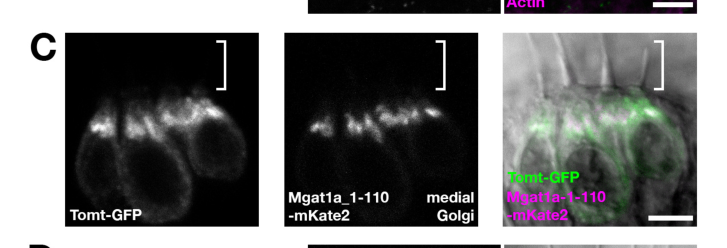

## Question

# Gene Research for Functional Annotation

## ⚠️ CRITICAL: Gene/Protein Identification Context

**BEFORE YOU BEGIN RESEARCH:** You MUST verify you are researching the CORRECT gene/protein. Gene symbols can be ambiguous, especially for less well-characterized genes from non-model organisms.

### Target Gene/Protein Identity (from UniProt):
- **UniProt Accession:** A0A193KX02
- **Protein Description:** RecName: Full=Transmembrane O-methyltransferase homolog {ECO:0000305}; EC=2.1.1.6 {ECO:0000250|UniProtKB:P21964}; AltName: Full=Protein mercury {ECO:0000303|PubMed:9491988};
- **Gene Information:** Name=tomt {ECO:0000303|PubMed:28534737}; Synonyms=mrc {ECO:0000303|PubMed:9491988};
- **Organism (full):** Danio rerio (Zebrafish) (Brachydanio rerio).
- **Protein Family:** Belongs to the class I-like SAM-binding methyltransferase
- **Key Domains:** SAM-dependent_MTases_sf. (IPR029063); SAM_O-MeTrfase. (IPR002935); Methyltransf_3 (PF01596)

### MANDATORY VERIFICATION STEPS:

1. **Check if the gene symbol "tomt" matches the protein description above**
2. **Verify the organism is correct:** Danio rerio (Zebrafish) (Brachydanio rerio).
3. **Check if protein family/domains align with what you find in literature**
4. **If you find literature for a DIFFERENT gene with the same or similar symbol, STOP**

### If Gene Symbol is Ambiguous or You Cannot Find Relevant Literature:

**DO NOT PROCEED WITH RESEARCH ON A DIFFERENT GENE.** Instead:
- State clearly: "The gene symbol 'tomt' is ambiguous or literature is limited for this specific protein"
- Explain what you found (e.g., "Found extensive literature on a different gene with the same symbol in a different organism")
- Describe the protein based ONLY on the UniProt information provided above
- Suggest that the protein function can be inferred from domain/family information

### Research Target:

Please provide a comprehensive research report on the gene **tomt** (gene ID: tomt, UniProt: A0A193KX02) in DANRE.

The research report should be a detailed narrative explaining the function, biological processes, and localization of the gene product. Citations should be given for all claims.

You should prioritize authoritative reviews and primary scientific literature when conducting research. You can supplement
this with annotations you find in gene/protein databases, but these can be outdated or inaccurate.

We are specifically interested in the primary function of the gene - for enzymes, what reaction is catalyzed, and what is the substrate specificity? For transporters, what is the substrate? For structural proteins or adapters, what is the broader structural role? For signaling molecules, what is the role in the pathway.

We are interested in where in or outside the cell the gene product carries out its function.

We are also interested in the signaling or biochemical pathways in which the gene functions. We are less interested in broad pleiotropic effects, except where these elucidate the precise role.

Include evidence where possible. We are interested in both experimental evidence as well as inference from structure, evolution, or bioinformatic analysis. Precise studies should be prioritized over high-throughput, where available.

## Output

Question: You are an expert researcher providing comprehensive, well-cited information.

Provide detailed information focusing on:
1. Key concepts and definitions with current understanding
2. Recent developments and latest research (prioritize 2023-2024 sources)
3. Current applications and real-world implementations
4. Expert opinions and analysis from authoritative sources
5. Relevant statistics and data from recent studies

Format as a comprehensive research report with proper citations. Include URLs and publication dates where available.
Always prioritize recent, authoritative sources and provide specific citations for all major claims.

# Gene Research for Functional Annotation

## ⚠️ CRITICAL: Gene/Protein Identification Context

**BEFORE YOU BEGIN RESEARCH:** You MUST verify you are researching the CORRECT gene/protein. Gene symbols can be ambiguous, especially for less well-characterized genes from non-model organisms.

### Target Gene/Protein Identity (from UniProt):
- **UniProt Accession:** A0A193KX02
- **Protein Description:** RecName: Full=Transmembrane O-methyltransferase homolog {ECO:0000305}; EC=2.1.1.6 {ECO:0000250|UniProtKB:P21964}; AltName: Full=Protein mercury {ECO:0000303|PubMed:9491988};
- **Gene Information:** Name=tomt {ECO:0000303|PubMed:28534737}; Synonyms=mrc {ECO:0000303|PubMed:9491988};
- **Organism (full):** Danio rerio (Zebrafish) (Brachydanio rerio).
- **Protein Family:** Belongs to the class I-like SAM-binding methyltransferase
- **Key Domains:** SAM-dependent_MTases_sf. (IPR029063); SAM_O-MeTrfase. (IPR002935); Methyltransf_3 (PF01596)

### MANDATORY VERIFICATION STEPS:

1. **Check if the gene symbol "tomt" matches the protein description above**
2. **Verify the organism is correct:** Danio rerio (Zebrafish) (Brachydanio rerio).
3. **Check if protein family/domains align with what you find in literature**
4. **If you find literature for a DIFFERENT gene with the same or similar symbol, STOP**

### If Gene Symbol is Ambiguous or You Cannot Find Relevant Literature:

**DO NOT PROCEED WITH RESEARCH ON A DIFFERENT GENE.** Instead:
- State clearly: "The gene symbol 'tomt' is ambiguous or literature is limited for this specific protein"
- Explain what you found (e.g., "Found extensive literature on a different gene with the same symbol in a different organism")
- Describe the protein based ONLY on the UniProt information provided above
- Suggest that the protein function can be inferred from domain/family information

### Research Target:

Please provide a comprehensive research report on the gene **tomt** (gene ID: tomt, UniProt: A0A193KX02) in DANRE.

The research report should be a detailed narrative explaining the function, biological processes, and localization of the gene product. Citations should be given for all claims.

You should prioritize authoritative reviews and primary scientific literature when conducting research. You can supplement
this with annotations you find in gene/protein databases, but these can be outdated or inaccurate.

We are specifically interested in the primary function of the gene - for enzymes, what reaction is catalyzed, and what is the substrate specificity? For transporters, what is the substrate? For structural proteins or adapters, what is the broader structural role? For signaling molecules, what is the role in the pathway.

We are interested in where in or outside the cell the gene product carries out its function.

We are also interested in the signaling or biochemical pathways in which the gene functions. We are less interested in broad pleiotropic effects, except where these elucidate the precise role.

Include evidence where possible. We are interested in both experimental evidence as well as inference from structure, evolution, or bioinformatic analysis. Precise studies should be prioritized over high-throughput, where available.

# Research Report: Functional annotation of **tomt** (Danio rerio) / UniProt **A0A193KX02**

## Executive summary
The zebrafish gene **tomt** (synonym **mrc**, historically linked to the *mercury* mutant) encodes a membrane-anchored, SAM-dependent methyltransferase–domain protein that is **essential for hair-cell mechano-electrical transduction (MET)**. Experimental evidence indicates Tomt functions primarily in the **secretory pathway (Golgi/ER)** to enable **trafficking and bundle targeting of Tmc1/Tmc2 (MET channel subunits)**, rather than acting as a stereocilia-resident structural component of the MET channel. Although Tomt is annotated as an O-methyltransferase homolog (EC 2.1.1.6), **its physiological methyl-acceptor substrate remains unknown**; key data suggest canonical catechol-O-methyltransferase chemistry is **not strictly required** for its MET role. (erickson2017integrationoftmc12 pages 1-2, erickson2017integrationoftmc12 pages 12-13, erickson2017integrationoftmc12 pages 13-16, jung2023mechanoelectricaltransductionrelatedgenetic pages 1-3)

## 1) Identity verification and definitions (critical disambiguation)
### 1.1 Gene/protein identity matches the UniProt target
Experimental zebrafish work explicitly describes **tomt** as the gene mutated in *mercury* alleles (also referred to as **mrc**) and as an ortholog of human **LRTOMT/TOMT**, the gene responsible for autosomal recessive nonsyndromic deafness **DFNB63** (publication date: **Jun 2017**; URL https://doi.org/10.17863/cam.24577). (erickson2017integrationoftmc12 pages 1-2, erickson2017integrationoftmc12 pages 2-4)

### 1.2 Key concept definitions
- **Mechano-electrical transduction (MET)**: the process by which hair-cell stereocilia deflection opens a mechanosensitive ion channel, generating receptor current; in vertebrates the pore-forming channel subunits are widely attributed to **TMC1/TMC2**. (jung2023mechanoelectricaltransductionrelatedgenetic pages 1-3)
- **Tmc proteins (Tmc1/Tmc2)**: transmembrane channel-like proteins that are central subunits of the MET channel complex and must be properly trafficked into stereocilia bundles for MET to occur. (erickson2017integrationoftmc12 pages 1-2, jung2023mechanoelectricaltransductionrelatedgenetic pages 4-6)
- **Tomt/TOMT (transmembrane O-methyltransferase)**: a membrane-associated protein with a predicted SAM-dependent methyltransferase fold, genetically linked to deafness, that functions in the secretory pathway to enable TMC trafficking and MET competency. (erickson2017integrationoftmc12 pages 2-4, jung2023mechanoelectricaltransductionrelatedgenetic pages 4-6)

## 2) Current understanding of tomt function in zebrafish hair cells
### 2.1 Tomt is required for mechanotransduction (cell physiology)
In zebrafish, loss-of-function of **tomt** results in **absence of MET function** in hair cells, supported by multiple readouts: failure of MET-permeant FM dye uptake and electrophysiological absence of evoked MET currents. Importantly, other ionic currents characteristic of hair cells (e.g., K+ currents; inward Ca2+ currents used for cell identification) remain detectable, consistent with a specific MET defect rather than general hair-cell loss. (erickson2017integrationoftmc12 pages 16-18, erickson2017integrationoftmc12 pages 6-8)

### 2.2 Subcellular localization: Tomt is a secretory pathway protein
A functional Tomt-GFP fusion is reported to be **enriched in the Golgi** of zebrafish hair cells and excluded from the stereocilia bundle, placing Tomt in a compartment consistent with protein processing/trafficking rather than being a bundle-resident MET channel subunit. (erickson2017integrationoftmc12 pages 6-8, erickson2017integrationoftmc12 media 79e17c54)

### 2.3 Mechanistic role: selective trafficking/integration of Tmc1/Tmc2 into stereocilia
A central mechanistic finding is that **Tmc1 and Tmc2b fail to localize to hair bundles** in tomt-deficient hair cells; instead, tagged Tmc proteins remain in the cell body. In contrast, the paper reports that other MET-complex proteins can still localize to bundles, supporting a **selective requirement** for Tomt in Tmc trafficking/bundle targeting. (erickson2017integrationoftmc12 pages 13-16, erickson2017integrationoftmc12 media 1e07c0cf, erickson2017integrationoftmc12 media 85c8124b)

### 2.4 Rescue experiments: Tomt is necessary beyond development
Hair-cell expression of Tomt rescues MET function in tomt mutants, and acute induction experiments indicate Tomt can restore MET in mature mutant hair cells within **~4 hours**, implying Tomt has an ongoing role in enabling/maintaining MET competency (e.g., via continued trafficking or turnover of MET components). (erickson2017integrationoftmc12 pages 12-13, erickson2017integrationoftmc12 pages 8-12)

### 2.5 Physical interaction with TMC1 supports a chaperone/trafficking model
Biochemical assays in heterologous cells support a direct physical interaction between **TOMT and TMC1**, consistent with a model where TOMT acts as a chaperone/escort or trafficking facilitator in the secretory pathway. (erickson2017integrationoftmc12 pages 13-16, erickson2017integrationoftmc12 pages 16-18)

## 3) Enzymatic activity, substrates, and the unresolved methyltransferase question
### 3.1 What is known
Tomt is described as a transmembrane O-methyltransferase homolog with a predicted SAM-dependent methyltransferase domain related to COMT-like enzymes, and truncation experiments indicate that the **transmembrane domain and the enzymatic (methyltransferase-like) region are required** for full rescue in the zebrafish functional assays. (erickson2017integrationoftmc12 pages 8-12, erickson2017integrationoftmc12 pages 1-2)

### 3.2 What is not yet established (critical limitation)
Despite domain annotations and the EC label, the available primary evidence does **not** identify a physiological Tomt substrate in hair cells, nor does it establish that **catalytic methyl transfer** (as opposed to a structural role of the methyltransferase fold) is the essential biochemical activity. Indeed, several results argue against a simple catecholamine-metabolism function: COMT cannot rescue tomt mutants, TOMT has only modest activity toward norepinephrine in vitro, and an active-site histidine mutation (H183A) can still support rescue in vivo. Collectively, these data support the interpretation that Tomt’s principal role in hair cells is **Tmc trafficking/integration**, and that its precise methyl-acceptor substrate specificity (if any) remains unknown. (erickson2017integrationoftmc12 pages 2-4, erickson2017integrationoftmc12 pages 12-13, erickson2017integrationoftmc12 pages 18-19)

## 4) Pathway context: Tomt in the MET assembly/trafficking pathway
The best-supported pathway placement for zebrafish Tomt is upstream of stereocilia-localized MET machinery: Tomt resides in the Golgi/secretory pathway, promotes trafficking of Tmc subunits to the bundle, and thereby enables assembly of a functional MET complex in stereocilia. This aligns with expert synthesis in a 2023 review, which frames TOMT as an ER/secretory-pathway protein required for transport of TMC1 into stereocilia and as a factor affecting MET function indirectly. (erickson2017integrationoftmc12 pages 18-19, jung2023mechanoelectricaltransductionrelatedgenetic pages 4-6)

## 5) Recent developments (2023–2024 prioritized)
### 5.1 2023 expert review perspective (authoritative synthesis)
A 2023 review of genetic forms of MET-related hearing loss discusses TOMT/LRTOMT mutations as the cause of DFNB63 and highlights evidence that TOMT is localized to the ER/secretory pathway and is required for **TMC1 transport into stereocilia**, supporting a trafficking/chaperone-like role rather than a stereocilia structural role. (Publication date: **Apr 2023**; URL https://doi.org/10.1016/j.cophys.2023.100632). (jung2023mechanoelectricaltransductionrelatedgenetic pages 1-3, jung2023mechanoelectricaltransductionrelatedgenetic pages 4-6)

### 5.2 2024 research and review context
Recent work on Tmc subunits in zebrafish vestibular function provides contemporary context for why Tomt-mediated trafficking of Tmcs is biologically consequential (Tmc subunit combinations tune vestibular frequency sensitivity). While this 2024 paper is not centered on Tomt, it exemplifies ongoing, current interest in Tmc-dependent MET properties in zebrafish and cites tomt mutants as a reference point for disrupted MET. (Publication date: **Nov 2024**; URL https://doi.org/10.1523/jneurosci.1298-23.2023). (jung2023mechanoelectricaltransductionrelatedgenetic pages 7-9)

## 6) Current applications and real-world implementations
### 6.1 Hearing-loss genetics and diagnostic interpretation
TOMT/LRTOMT is established in the hearing-loss genetics landscape as the DFNB63 gene, and zebrafish tomt mutants serve as a mechanistic disease model demonstrating that TOMT deficiency can cause deafness by preventing TMC channel subunits from reaching stereocilia. This provides a mechanistically grounded interpretive framework for TOMT variants identified in human genetic testing: pathogenic alleles are expected to impair MET by disrupting TMC trafficking rather than (or in addition to) altering catecholamine metabolism. (erickson2017integrationoftmc12 pages 1-2, jung2023mechanoelectricaltransductionrelatedgenetic pages 4-6)

### 6.2 Zebrafish models as functional annotation platforms
The tomt/*mercury* zebrafish line functions as an in vivo platform for:
- testing genetic rescue with orthologs (mouse TOMT rescues zebrafish),
- mapping secretory-pathway steps required for MET complex assembly,
- assessing stereocilia targeting determinants for Tmc proteins.
These are direct, real-world experimental implementations of tomt biology in sensory neuroscience research. (erickson2017integrationoftmc12 pages 12-13, erickson2017integrationoftmc12 pages 13-16)

## 7) Quantitative/statistical data points from retrieved studies
- **Time-to-functional restoration**: heat-shock induction of Tomt-GFP restored MET function in previously silent mutant hair cells within approximately **4 hours**. (erickson2017integrationoftmc12 pages 12-13, erickson2017integrationoftmc12 pages 8-12)
- **Imaging-based trafficking phenotype**: Tmc1-GFP and Tmc2b-GFP are present in wild-type bundles but absent from mutant bundles (qualitative but direct phenotype), documented in extracted figure panels. (erickson2017integrationoftmc12 media 1e07c0cf, erickson2017integrationoftmc12 media 85c8124b)

## 8) Expert analysis and open questions
### 8.1 Consensus model supported by current evidence
The strongest experimentally supported model is that Tomt is a **Golgi/ER-associated trafficking factor** that enables incorporation of Tmc subunits into stereocilia, thereby allowing MET. This model is supported by localization data, selective Tmc mislocalization, rescue experiments, and TOMT–TMC1 interaction data, and it is echoed by authoritative review literature. (erickson2017integrationoftmc12 pages 13-16, erickson2017integrationoftmc12 pages 18-19, jung2023mechanoelectricaltransductionrelatedgenetic pages 4-6)

### 8.2 Key unresolved questions
- **Physiological methyl-acceptor substrate**: No definitive endogenous substrate for Tomt in hair cells is identified in the retrieved evidence; whether Tomt performs methyl transfer on a protein/lipid/small molecule in the secretory pathway remains unknown. (erickson2017integrationoftmc12 pages 18-19)
- **Catalysis vs. scaffold**: Active-site perturbation (H183A) not abolishing rescue suggests Tomt’s methyltransferase fold may serve a binding/chaperone function, or that catalysis involves non-canonical residues/substrates; resolving this requires direct biochemical identification of Tomt-dependent methylation events. (erickson2017integrationoftmc12 pages 12-13, erickson2017integrationoftmc12 pages 18-19)

## Evidence summary table
| Claim/Observation | Biological level (molecular/cellular/organism) | Evidence type (genetics, imaging, electrophysiology, biochemistry, review) | Key details (include quantitative where available) | Source (authors, year) | DOI/URL | Citation ID |
|---|---|---|---|---|---|---|
| Zebrafish **tomt** is the gene disrupted in the classic **mercury/mrc** mutant and is orthologous to human **LRTOMT/TOMT (DFNB63)** | Molecular/organism | Genetics | mercury alleles are nonsense mutations predicted to truncate Tomt before or within the putative O-methyltransferase domain; links zebrafish locus to human deafness gene ortholog | Erickson et al., 2017 | https://doi.org/10.17863/cam.24577 | (erickson2017integrationoftmc12 pages 1-2, erickson2017integrationoftmc12 pages 2-4) |
| Tomt is essential for hair-cell mechanotransduction; tomt mutants have auditory/vestibular dysfunction | Cellular/organism | Genetics, electrophysiology | tomt-deficient hair cells lack mechanotransduction (MET); mutants show auditory and vestibular phenotypes consistent with loss of sensory hair-cell function | Erickson et al., 2017 | https://doi.org/10.17863/cam.24577 | (erickson2017integrationoftmc12 pages 1-2, erickson2017integrationoftmc12 pages 6-8) |
| Tomt localizes to the secretory pathway rather than the hair bundle | Cellular | Imaging | GFP-tagged Tomt is enriched in the Golgi and excluded from stereociliary bundles; partial co-localization shown with medial Golgi marker Mgat1a_1–110-mKate2 | Erickson et al., 2017 | https://doi.org/10.17863/cam.24577 | (erickson2017integrationoftmc12 pages 1-2, erickson2017integrationoftmc12 pages 12-13, erickson2017integrationoftmc12 pages 6-8, erickson2017integrationoftmc12 media 79e17c54) |
| Loss of Tomt selectively disrupts Tmc trafficking to the hair bundle | Cellular | Imaging, genetics | In tomt/mercury mutants, **Tmc1-GFP** and **Tmc2b-GFP** are absent from bundles and remain in the cell body, while other MET-complex proteins can still localize to bundles | Erickson et al., 2017 | https://doi.org/10.17863/cam.24577 | (erickson2017integrationoftmc12 pages 1-2, erickson2017integrationoftmc12 pages 2-4, erickson2017integrationoftmc12 pages 13-16, erickson2017integrationoftmc12 media 1e07c0cf, erickson2017integrationoftmc12 media 85c8124b) |
| Tomt acts cell-autonomously and can restore Tmc localization/MET when re-expressed | Cellular | Genetics, imaging, functional rescue | Mosaic Tomt expression restores Tmc2b-GFP bundle localization; hair-cell-specific Tomt-GFP rescues FM dye uptake and MET activity in mutants | Erickson et al., 2017 | https://doi.org/10.17863/cam.24577 | (erickson2017integrationoftmc12 pages 8-12, erickson2017integrationoftmc12 pages 13-16) |
| Tomt is required not only during development but also in mature hair cells | Cellular | Genetics, functional rescue | Heat-shock induction of Tomt-GFP restored previously silent mutant hair cells within **~4 h**, indicating an ongoing role in maintaining/assembling MET function | Erickson et al., 2017 | https://doi.org/10.17863/cam.24577 | (erickson2017integrationoftmc12 pages 12-13, erickson2017integrationoftmc12 pages 8-12) |
| Tomt-deficient hair cells lack MET currents despite otherwise recognizable hair-cell ionic properties | Cellular | Electrophysiology | mercury/tomt mutant hair cells show no detectable evoked MET currents and loss of FM 1–43/FM 4–64 uptake, but retain normal K+ currents and intact inward Ca2+ current used to verify cell identity | Erickson et al., 2017 | https://doi.org/10.17863/cam.24577 | (erickson2017integrationoftmc12 pages 6-8, erickson2017integrationoftmc12 pages 16-18) |
| Mouse TOMT can substitute for zebrafish Tomt, but COMT cannot | Molecular/cellular | Genetics, rescue | Mouse TOMT-GFP restores mechanotransduction/FM dye uptake in mercury mutants, whereas zebrafish Comta-GFP does not rescue, arguing against a simple catecholamine-metabolism explanation | Erickson et al., 2017 | https://doi.org/10.17863/cam.24577 | (erickson2017integrationoftmc12 pages 2-4, erickson2017integrationoftmc12 pages 12-13, erickson2017integrationoftmc12 pages 18-19) |
| TOMT physically interacts with TMC1 | Molecular | Biochemistry | HEK293 co-immunoprecipitation supports direct TOMT–TMC1 interaction; supports a trafficking/chaperone-like role in the secretory pathway | Erickson et al., 2017 | https://doi.org/10.17863/cam.24577 | (erickson2017integrationoftmc12 pages 1-2, erickson2017integrationoftmc12 pages 13-16, erickson2017integrationoftmc12 pages 16-18) |
| The putative catalytic histidine is not strictly required for Tomt-mediated rescue | Molecular/cellular | Mutagenesis, functional rescue, biochemistry | **H183A** in TOMT enhanced TOMT–TMC1 interaction in co-IP and did not abolish rescue in zebrafish assays; suggests canonical COMT-like active-site chemistry is not essential for hair-cell function | Erickson et al., 2017 | https://doi.org/10.17863/cam.24577 | (erickson2017integrationoftmc12 pages 12-13, erickson2017integrationoftmc12 pages 16-18, erickson2017integrationoftmc12 pages 18-19) |
| The enzymatic domain is functionally important, but the physiological substrate remains unknown | Molecular | Structure-function, biochemistry | Predicted SAM-dependent methyltransferase domain is required for rescue in truncation tests, yet no in vivo substrate is identified; only modest in vitro catechol O-methyltransferase activity toward norepinephrine reported, so true substrate specificity remains unresolved | Erickson et al., 2017 | https://doi.org/10.17863/cam.24577 | (erickson2017integrationoftmc12 pages 2-4, erickson2017integrationoftmc12 pages 8-12, erickson2017integrationoftmc12 pages 18-19, erickson2017integrationoftmc12 pages 1-2) |
| Recent expert reviews frame TOMT primarily as a TMC trafficking factor in MET biology | Molecular/cellular | Review | 2023 review states TOMT/LRTOMT mutations cause DFNB63, places TOMT in ER/secretory-pathway trafficking of TMC1 into stereocilia, and treats TOMT as affecting MET indirectly rather than as a pore-forming channel component | Jung & Müller, 2023 | https://doi.org/10.1016/j.cophys.2023.100632 | (jung2023mechanoelectricaltransductionrelatedgenetic pages 1-3, jung2023mechanoelectricaltransductionrelatedgenetic pages 4-6, jung2023mechanoelectricaltransductionrelatedgenetic pages 7-9) |

*Table: This table compiles the core evidence linking zebrafish tomt/Tomt to hair-cell mechanotransduction, emphasizing gene identity, localization, Tmc trafficking, rescue experiments, and the unresolved question of catalytic methyltransferase activity.*

## Key figure evidence (visual)
- Tomt-GFP Golgi co-localization panel supporting secretory-pathway localization. (erickson2017integrationoftmc12 media 79e17c54)
- Tmc1/2-GFP bundle exclusion in tomt mutants supporting the trafficking defect mechanism. (erickson2017integrationoftmc12 media 1e07c0cf, erickson2017integrationoftmc12 media 85c8124b)

## Bibliography (retrieved sources; publication dates and URLs)
1. Erickson T, Morgan CP, Olt J, et al. **Integration of tmc1/2 into the mechanotransduction complex in zebrafish hair cells is regulated by Transmembrane O-methyltransferase (Tomt).** *eLife* (posted/available Jun 2017). https://doi.org/10.17863/cam.24577 (erickson2017integrationoftmc12 pages 1-2)
2. Jung J, Müller U. **Mechanoelectrical transduction-related genetic forms of hearing loss.** *Current Opinion in Physiology.* **Apr 2023**. https://doi.org/10.1016/j.cophys.2023.100632 (jung2023mechanoelectricaltransductionrelatedgenetic pages 1-3)
3. Sun P, Smith E, Nicolson T. **Transmembrane Channel-Like (Tmc) Subunits Contribute to Frequency Sensitivity in the Zebrafish Utricle.** *J Neurosci.* **Nov 2024**. https://doi.org/10.1523/jneurosci.1298-23.2023 (jung2023mechanoelectricaltransductionrelatedgenetic pages 7-9)

## Limitations of this report
Within the accessible corpus for this run, I did not retrieve 2023–2024 primary human cohort papers reporting TOMT variant frequencies, penetrance estimates, or large-scale genotype–phenotype statistics for DFNB63; therefore, real-world quantitative epidemiology for TOMT-related hearing loss is not comprehensively covered here. The mechanistic and functional annotation for zebrafish Tomt is strongly supported by primary experimental evidence and recent authoritative synthesis. (jung2023mechanoelectricaltransductionrelatedgenetic pages 4-6, erickson2017integrationoftmc12 pages 18-19)

References

1. (erickson2017integrationoftmc12 pages 1-2): Timothy Erickson, Clive P Morgan, Jennifer Olt, Katherine Hardy, Elisabeth Busch-Nentwich, Reo Maeda, Rachel Clemens, Jocelyn F Krey, Alex Nechiporuk, Peter G Barr-Gillespie, Walter Marcotti, and Teresa Nicolson. Integration of tmc1/2 into the mechanotransduction complex in zebrafish hair cells is regulated by transmembrane o-methyltransferase (tomt). JournalArticle, Jun 2017. URL: https://doi.org/10.17863/cam.24577, doi:10.17863/cam.24577. This article has 69 citations.

2. (erickson2017integrationoftmc12 pages 12-13): Timothy Erickson, Clive P Morgan, Jennifer Olt, Katherine Hardy, Elisabeth Busch-Nentwich, Reo Maeda, Rachel Clemens, Jocelyn F Krey, Alex Nechiporuk, Peter G Barr-Gillespie, Walter Marcotti, and Teresa Nicolson. Integration of tmc1/2 into the mechanotransduction complex in zebrafish hair cells is regulated by transmembrane o-methyltransferase (tomt). JournalArticle, Jun 2017. URL: https://doi.org/10.17863/cam.24577, doi:10.17863/cam.24577. This article has 69 citations.

3. (erickson2017integrationoftmc12 pages 13-16): Timothy Erickson, Clive P Morgan, Jennifer Olt, Katherine Hardy, Elisabeth Busch-Nentwich, Reo Maeda, Rachel Clemens, Jocelyn F Krey, Alex Nechiporuk, Peter G Barr-Gillespie, Walter Marcotti, and Teresa Nicolson. Integration of tmc1/2 into the mechanotransduction complex in zebrafish hair cells is regulated by transmembrane o-methyltransferase (tomt). JournalArticle, Jun 2017. URL: https://doi.org/10.17863/cam.24577, doi:10.17863/cam.24577. This article has 69 citations.

4. (jung2023mechanoelectricaltransductionrelatedgenetic pages 1-3): Jinsei Jung and Ulrich Müller. Mechanoelectrical transduction-related genetic forms of hearing loss. Current Opinion in Physiology, 32:100632, Apr 2023. URL: https://doi.org/10.1016/j.cophys.2023.100632, doi:10.1016/j.cophys.2023.100632. This article has 13 citations and is from a peer-reviewed journal.

5. (erickson2017integrationoftmc12 pages 2-4): Timothy Erickson, Clive P Morgan, Jennifer Olt, Katherine Hardy, Elisabeth Busch-Nentwich, Reo Maeda, Rachel Clemens, Jocelyn F Krey, Alex Nechiporuk, Peter G Barr-Gillespie, Walter Marcotti, and Teresa Nicolson. Integration of tmc1/2 into the mechanotransduction complex in zebrafish hair cells is regulated by transmembrane o-methyltransferase (tomt). JournalArticle, Jun 2017. URL: https://doi.org/10.17863/cam.24577, doi:10.17863/cam.24577. This article has 69 citations.

6. (jung2023mechanoelectricaltransductionrelatedgenetic pages 4-6): Jinsei Jung and Ulrich Müller. Mechanoelectrical transduction-related genetic forms of hearing loss. Current Opinion in Physiology, 32:100632, Apr 2023. URL: https://doi.org/10.1016/j.cophys.2023.100632, doi:10.1016/j.cophys.2023.100632. This article has 13 citations and is from a peer-reviewed journal.

7. (erickson2017integrationoftmc12 pages 16-18): Timothy Erickson, Clive P Morgan, Jennifer Olt, Katherine Hardy, Elisabeth Busch-Nentwich, Reo Maeda, Rachel Clemens, Jocelyn F Krey, Alex Nechiporuk, Peter G Barr-Gillespie, Walter Marcotti, and Teresa Nicolson. Integration of tmc1/2 into the mechanotransduction complex in zebrafish hair cells is regulated by transmembrane o-methyltransferase (tomt). JournalArticle, Jun 2017. URL: https://doi.org/10.17863/cam.24577, doi:10.17863/cam.24577. This article has 69 citations.

8. (erickson2017integrationoftmc12 pages 6-8): Timothy Erickson, Clive P Morgan, Jennifer Olt, Katherine Hardy, Elisabeth Busch-Nentwich, Reo Maeda, Rachel Clemens, Jocelyn F Krey, Alex Nechiporuk, Peter G Barr-Gillespie, Walter Marcotti, and Teresa Nicolson. Integration of tmc1/2 into the mechanotransduction complex in zebrafish hair cells is regulated by transmembrane o-methyltransferase (tomt). JournalArticle, Jun 2017. URL: https://doi.org/10.17863/cam.24577, doi:10.17863/cam.24577. This article has 69 citations.

9. (erickson2017integrationoftmc12 media 79e17c54): Timothy Erickson, Clive P Morgan, Jennifer Olt, Katherine Hardy, Elisabeth Busch-Nentwich, Reo Maeda, Rachel Clemens, Jocelyn F Krey, Alex Nechiporuk, Peter G Barr-Gillespie, Walter Marcotti, and Teresa Nicolson. Integration of tmc1/2 into the mechanotransduction complex in zebrafish hair cells is regulated by transmembrane o-methyltransferase (tomt). JournalArticle, Jun 2017. URL: https://doi.org/10.17863/cam.24577, doi:10.17863/cam.24577. This article has 69 citations.

10. (erickson2017integrationoftmc12 media 1e07c0cf): Timothy Erickson, Clive P Morgan, Jennifer Olt, Katherine Hardy, Elisabeth Busch-Nentwich, Reo Maeda, Rachel Clemens, Jocelyn F Krey, Alex Nechiporuk, Peter G Barr-Gillespie, Walter Marcotti, and Teresa Nicolson. Integration of tmc1/2 into the mechanotransduction complex in zebrafish hair cells is regulated by transmembrane o-methyltransferase (tomt). JournalArticle, Jun 2017. URL: https://doi.org/10.17863/cam.24577, doi:10.17863/cam.24577. This article has 69 citations.

11. (erickson2017integrationoftmc12 media 85c8124b): Timothy Erickson, Clive P Morgan, Jennifer Olt, Katherine Hardy, Elisabeth Busch-Nentwich, Reo Maeda, Rachel Clemens, Jocelyn F Krey, Alex Nechiporuk, Peter G Barr-Gillespie, Walter Marcotti, and Teresa Nicolson. Integration of tmc1/2 into the mechanotransduction complex in zebrafish hair cells is regulated by transmembrane o-methyltransferase (tomt). JournalArticle, Jun 2017. URL: https://doi.org/10.17863/cam.24577, doi:10.17863/cam.24577. This article has 69 citations.

12. (erickson2017integrationoftmc12 pages 8-12): Timothy Erickson, Clive P Morgan, Jennifer Olt, Katherine Hardy, Elisabeth Busch-Nentwich, Reo Maeda, Rachel Clemens, Jocelyn F Krey, Alex Nechiporuk, Peter G Barr-Gillespie, Walter Marcotti, and Teresa Nicolson. Integration of tmc1/2 into the mechanotransduction complex in zebrafish hair cells is regulated by transmembrane o-methyltransferase (tomt). JournalArticle, Jun 2017. URL: https://doi.org/10.17863/cam.24577, doi:10.17863/cam.24577. This article has 69 citations.

13. (erickson2017integrationoftmc12 pages 18-19): Timothy Erickson, Clive P Morgan, Jennifer Olt, Katherine Hardy, Elisabeth Busch-Nentwich, Reo Maeda, Rachel Clemens, Jocelyn F Krey, Alex Nechiporuk, Peter G Barr-Gillespie, Walter Marcotti, and Teresa Nicolson. Integration of tmc1/2 into the mechanotransduction complex in zebrafish hair cells is regulated by transmembrane o-methyltransferase (tomt). JournalArticle, Jun 2017. URL: https://doi.org/10.17863/cam.24577, doi:10.17863/cam.24577. This article has 69 citations.

14. (jung2023mechanoelectricaltransductionrelatedgenetic pages 7-9): Jinsei Jung and Ulrich Müller. Mechanoelectrical transduction-related genetic forms of hearing loss. Current Opinion in Physiology, 32:100632, Apr 2023. URL: https://doi.org/10.1016/j.cophys.2023.100632, doi:10.1016/j.cophys.2023.100632. This article has 13 citations and is from a peer-reviewed journal.

## Artifacts

- [Edison artifact artifact-00](tomt-deep-research-falcon_artifacts/artifact-00.md)

## Citations

1. jung2023mechanoelectricaltransductionrelatedgenetic pages 1-3
2. jung2023mechanoelectricaltransductionrelatedgenetic pages 7-9
3. jung2023mechanoelectricaltransductionrelatedgenetic pages 4-6
4. https://doi.org/10.17863/cam.24577
5. https://doi.org/10.1016/j.cophys.2023.100632
6. https://doi.org/10.1523/jneurosci.1298-23.2023
7. https://doi.org/10.17863/cam.24577,
8. https://doi.org/10.1016/j.cophys.2023.100632,