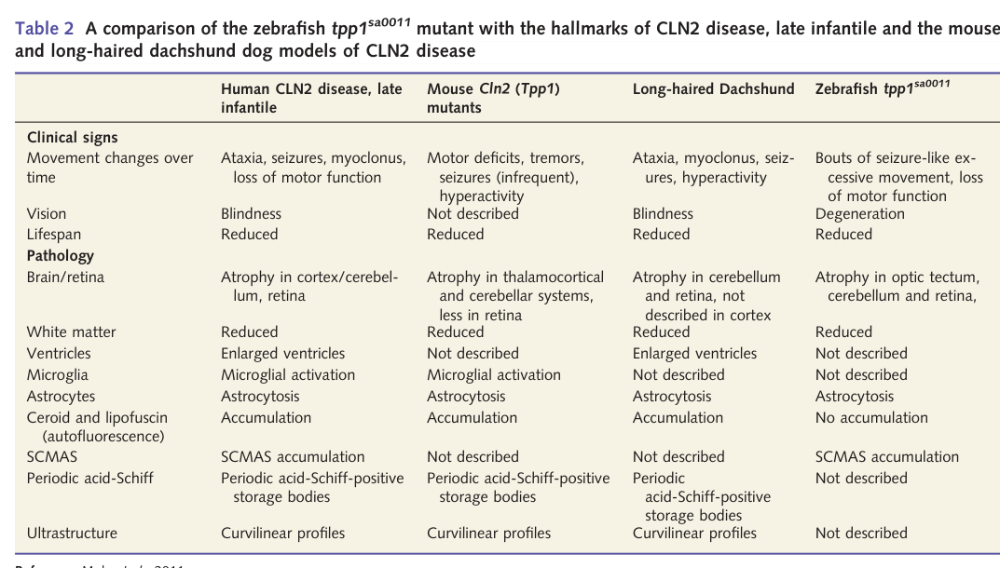

## Question

# Gene Research for Functional Annotation

## ⚠️ CRITICAL: Gene/Protein Identification Context

**BEFORE YOU BEGIN RESEARCH:** You MUST verify you are researching the CORRECT gene/protein. Gene symbols can be ambiguous, especially for less well-characterized genes from non-model organisms.

### Target Gene/Protein Identity (from UniProt):
- **UniProt Accession:** F8W2M8
- **Protein Description:** RecName: Full=Tripeptidyl-peptidase 1 {ECO:0000303|PubMed:23587805}; Short=TPP-1 {ECO:0000303|PubMed:23587805}; EC=3.4.14.9 {ECO:0000269|PubMed:23587805}; AltName: Full=Tripeptidyl aminopeptidase; AltName: Full=Tripeptidyl-peptidase I; Short=TPP-I; Flags: Precursor;
- **Gene Information:** Name=tpp1 {ECO:0000303|PubMed:23587805};
- **Organism (full):** Danio rerio (Zebrafish) (Brachydanio rerio).
- **Protein Family:** Not specified in UniProt
- **Key Domains:** Peptidase_S8/S53_dom. (IPR000209); Peptidase_S8/S53_dom_sf. (IPR036852); S53_propep. (IPR015366); Sedolisin_dom. (IPR030400); Tripeptidyl-peptidase_I. (IPR050819)

### MANDATORY VERIFICATION STEPS:

1. **Check if the gene symbol "tpp1" matches the protein description above**
2. **Verify the organism is correct:** Danio rerio (Zebrafish) (Brachydanio rerio).
3. **Check if protein family/domains align with what you find in literature**
4. **If you find literature for a DIFFERENT gene with the same or similar symbol, STOP**

### If Gene Symbol is Ambiguous or You Cannot Find Relevant Literature:

**DO NOT PROCEED WITH RESEARCH ON A DIFFERENT GENE.** Instead:
- State clearly: "The gene symbol 'tpp1' is ambiguous or literature is limited for this specific protein"
- Explain what you found (e.g., "Found extensive literature on a different gene with the same symbol in a different organism")
- Describe the protein based ONLY on the UniProt information provided above
- Suggest that the protein function can be inferred from domain/family information

### Research Target:

Please provide a comprehensive research report on the gene **tpp1** (gene ID: tpp1, UniProt: F8W2M8) in DANRE.

The research report should be a detailed narrative explaining the function, biological processes, and localization of the gene product. Citations should be given for all claims.

You should prioritize authoritative reviews and primary scientific literature when conducting research. You can supplement
this with annotations you find in gene/protein databases, but these can be outdated or inaccurate.

We are specifically interested in the primary function of the gene - for enzymes, what reaction is catalyzed, and what is the substrate specificity? For transporters, what is the substrate? For structural proteins or adapters, what is the broader structural role? For signaling molecules, what is the role in the pathway.

We are interested in where in or outside the cell the gene product carries out its function.

We are also interested in the signaling or biochemical pathways in which the gene functions. We are less interested in broad pleiotropic effects, except where these elucidate the precise role.

Include evidence where possible. We are interested in both experimental evidence as well as inference from structure, evolution, or bioinformatic analysis. Precise studies should be prioritized over high-throughput, where available.

## Output

Question: You are an expert researcher providing comprehensive, well-cited information.

Provide detailed information focusing on:
1. Key concepts and definitions with current understanding
2. Recent developments and latest research (prioritize 2023-2024 sources)
3. Current applications and real-world implementations
4. Expert opinions and analysis from authoritative sources
5. Relevant statistics and data from recent studies

Format as a comprehensive research report with proper citations. Include URLs and publication dates where available.
Always prioritize recent, authoritative sources and provide specific citations for all major claims.

# Gene Research for Functional Annotation

## ⚠️ CRITICAL: Gene/Protein Identification Context

**BEFORE YOU BEGIN RESEARCH:** You MUST verify you are researching the CORRECT gene/protein. Gene symbols can be ambiguous, especially for less well-characterized genes from non-model organisms.

### Target Gene/Protein Identity (from UniProt):
- **UniProt Accession:** F8W2M8
- **Protein Description:** RecName: Full=Tripeptidyl-peptidase 1 {ECO:0000303|PubMed:23587805}; Short=TPP-1 {ECO:0000303|PubMed:23587805}; EC=3.4.14.9 {ECO:0000269|PubMed:23587805}; AltName: Full=Tripeptidyl aminopeptidase; AltName: Full=Tripeptidyl-peptidase I; Short=TPP-I; Flags: Precursor;
- **Gene Information:** Name=tpp1 {ECO:0000303|PubMed:23587805};
- **Organism (full):** Danio rerio (Zebrafish) (Brachydanio rerio).
- **Protein Family:** Not specified in UniProt
- **Key Domains:** Peptidase_S8/S53_dom. (IPR000209); Peptidase_S8/S53_dom_sf. (IPR036852); S53_propep. (IPR015366); Sedolisin_dom. (IPR030400); Tripeptidyl-peptidase_I. (IPR050819)

### MANDATORY VERIFICATION STEPS:

1. **Check if the gene symbol "tpp1" matches the protein description above**
2. **Verify the organism is correct:** Danio rerio (Zebrafish) (Brachydanio rerio).
3. **Check if protein family/domains align with what you find in literature**
4. **If you find literature for a DIFFERENT gene with the same or similar symbol, STOP**

### If Gene Symbol is Ambiguous or You Cannot Find Relevant Literature:

**DO NOT PROCEED WITH RESEARCH ON A DIFFERENT GENE.** Instead:
- State clearly: "The gene symbol 'tpp1' is ambiguous or literature is limited for this specific protein"
- Explain what you found (e.g., "Found extensive literature on a different gene with the same symbol in a different organism")
- Describe the protein based ONLY on the UniProt information provided above
- Suggest that the protein function can be inferred from domain/family information

### Research Target:

Please provide a comprehensive research report on the gene **tpp1** (gene ID: tpp1, UniProt: F8W2M8) in DANRE.

The research report should be a detailed narrative explaining the function, biological processes, and localization of the gene product. Citations should be given for all claims.

You should prioritize authoritative reviews and primary scientific literature when conducting research. You can supplement
this with annotations you find in gene/protein databases, but these can be outdated or inaccurate.

We are specifically interested in the primary function of the gene - for enzymes, what reaction is catalyzed, and what is the substrate specificity? For transporters, what is the substrate? For structural proteins or adapters, what is the broader structural role? For signaling molecules, what is the role in the pathway.

We are interested in where in or outside the cell the gene product carries out its function.

We are also interested in the signaling or biochemical pathways in which the gene functions. We are less interested in broad pleiotropic effects, except where these elucidate the precise role.

Include evidence where possible. We are interested in both experimental evidence as well as inference from structure, evolution, or bioinformatic analysis. Precise studies should be prioritized over high-throughput, where available.

# Research Report: Functional Annotation of **tpp1** (UniProt **F8W2M8**) in *Danio rerio* (zebrafish)

## 0) Target verification (critical disambiguation)
The target is *Danio rerio* **tpp1**, encoding **tripeptidyl-peptidase 1 (TPP1/TPP-1; EC 3.4.14.9)**, a lysosomal serine protease of the sedolisin (S53) lineage. A primary zebrafish study explicitly identifies zebrafish **tpp1** (Ensembl **ENSDARG00000042793**) as homologous to human TPP1/CLN2 and characterizes a loss-of-function allele (**tpp1sa0011**) with loss of enzyme activity and lysosomal storage phenotypes, matching the UniProt description and expected domain class (sedolisin/Peptidase_S8/S53). (mahmood2013azebrafishmodel pages 2-2, mahmood2013azebrafishmodel pages 2-3)

## 1) Key concepts and definitions (current understanding)

### 1.1 What TPP1 is
TPP1 is a **lysosomal serine protease** that functions primarily as an **N-terminal exopeptidase**, removing **tripeptides** from the N-termini of polypeptide substrates, with some **limited endopeptidase activity**. (mahmood2013azebrafishmodel pages 2-3)

### 1.2 Enzyme classification and catalytic mechanism
TPP1 is annotated as **EC 3.4.14.9**. Mechanistically, it is described as a serine protease with a catalytic triad consistent with sedolisin-family enzymes (reported as **Glu–Asp–Ser** in the vertebrate TPP1 literature summarized in the zebrafish model paper). (mahmood2013azebrafishmodel pages 2-3)

### 1.3 Processing, maturation, and lysosomal targeting
In vertebrates, TPP1 is synthesized as a higher-molecular-weight **precursor (~66–68 kDa)** that is proteolytically processed to a **mature (~46–48 kDa) lysosomal enzyme**, and is trafficked to lysosomes via the **mannose-6-phosphate** pathway (a standard lysosomal hydrolase targeting route described in the zebrafish CLN2 model paper). (mahmood2013azebrafishmodel pages 2-3)

For zebrafish specifically, **tpp1 encodes a 557-aa pro-peptide** derived from **13 exons**, and is **predicted to be targeted to the lysosome after removal of a 19-aa signal peptide**. (mahmood2013azebrafishmodel pages 2-2)

## 2) Zebrafish *tpp1* molecular function and evidence (biochemistry-oriented)

### 2.1 Substrate specificity and how it is measured experimentally in zebrafish
A practical operational definition of Tpp1 activity in zebrafish embryos is cleavage of the fluorogenic tripeptidyl substrate **Arg-Ala-Phe-ACC** at **acidic pH (pH 4.0)**, consistent with a lysosomal enzyme. (mahmood2013azebrafishmodel pages 5-6, mahmood2013azebrafishmodel pages 3-4)

**Assay parameters reported for zebrafish embryos (96 hpf) include**: homogenization in buffer (150 mM NaCl, 100 mM sodium citrate, 1 g/L Triton X-100, **pH 4.0**), addition of crude protein to **0.25 mM Arg-Ala-Phe-ACC** in a **50 µL** reaction, incubation **90 min**, and termination with SDS. (mahmood2013azebrafishmodel pages 3-4)

### 2.2 Evidence of loss-of-function in zebrafish mutants
In the **tpp1sa0011** homozygous zebrafish model, **Tpp1 enzymatic activity is significantly reduced** in embryo extracts using the Arg-Ala-Phe-ACC assay. (mahmood2013azebrafishmodel pages 5-6)

## 3) Cellular localization and pathway context in zebrafish

### 3.1 Subcellular site of action
TPP1 is a **lysosomal** protease; the zebrafish model emphasizes lysosomal pathology and storage consistent with loss of lysosomal proteolytic capacity. (mahmood2013azebrafishmodel pages 2-3)

The authors note an important experimental nuance: **maternally derived Tpp1** may persist early and be **present in lysosomes**, while a zygotically derived mutant product lacking a signal sequence would fail to reach lysosomes. (mahmood2013azebrafishmodel pages 5-6)

### 3.2 Pathway context: lysosomal proteostasis and storage pathology
Loss of Tpp1 produces classic lysosomal storage phenotypes including **enlarged/hypertrophic lysosomes** and storage material accumulation, positioning Tpp1 within **lysosome-dependent proteostasis** and degradative pathways. (mahmood2013azebrafishmodel pages 2-3)

A widely used biomarker in CLN2/TPP1 deficiency models is accumulation of **subunit c of mitochondrial ATP synthase (SCMAS)** as storage material, which is reported as a hallmark in the zebrafish model. (mahmood2013azebrafishmodel pages 16-17, mahmood2013azebrafishmodel pages 1-2)

## 4) Zebrafish loss-of-function phenotypes (organism-level functional annotation)

### 4.1 Neurodegeneration and retinal degeneration
Homozygous **tpp1sa0011** mutants show an early-onset, progressive neurodegenerative phenotype with prominent defects in **retina**, **optic tectum**, and **cerebellum**. (mahmood2013azebrafishmodel pages 1-2, mahmood2013azebrafishmodel pages 16-17)

### 4.2 Cell death and reduced proliferation
Mutants show an early increase in **apoptosis** (assayed by TUNEL) and a **sustained reduction in proliferation**, particularly affecting the **retina** and **midbrain–hindbrain boundary**. (mahmood2013azebrafishmodel pages 16-17, mahmood2013azebrafishmodel pages 3-4)

### 4.3 Axon tract and motor phenotypes; seizure-like behavior
The zebrafish model reports disorganization of axon pathways (e.g., optic nerve and spinal motor nerves) and behavioral phenotypes featuring a phase of **increased locomotion consistent with seizures**, followed by progressive motor impairment. (mahmood2013azebrafishmodel pages 2-3, mahmood2013azebrafishmodel pages 1-2)

### 4.4 Survival statistics (zebrafish)
The zebrafish model reports markedly shortened survival, with mutants dying in early larval stages (reported as reduced median survival around **5 dpf** in the phenotype summary, and survival curves extending to death by approximately **8 dpf** in figure-based summaries). (mahmood2013azebrafishmodel pages 1-2, mahmood2013azebrafishmodel media 97a62347)

### Visual evidence from the primary zebrafish paper
The primary zebrafish study contains figure/table panels summarizing **reduced Tpp1 enzymatic activity**, **survival curves**, **retinal degeneration quantification**, and **lysosomal enlargement**, and a comparative table of cross-species CLN2 features. (mahmood2013azebrafishmodel media 97a62347, mahmood2013azebrafishmodel media a79a33ad, mahmood2013azebrafishmodel media e597a90c, mahmood2013azebrafishmodel media 008308d6)

## 5) Current applications and real-world implementations

### 5.1 Zebrafish as a disease-model platform for CLN2/TPP1 biology
The zebrafish **tpp1** loss-of-function line is positioned as a tractable vertebrate model for lysosomal storage disease biology, with quantifiable endpoints (SCMAS storage, lysosome size, apoptosis/proliferation, and automated locomotion assays) that can be used for mechanistic studies and compound screening. (mahmood2013azebrafishmodel pages 2-3, mahmood2013azebrafishmodel pages 1-2)

### 5.2 Clinical implementation: enzyme replacement therapy for CLN2 (human translational context)
Although the user’s gene target is zebrafish, **TPP1 is directly actionable clinically in humans**: CLN2 disease is caused by TPP1 deficiency, and **enzyme replacement therapy (ERT) with cerliponase alfa (recombinant human TPP1)** is implemented by intracerebroventricular administration because recombinant enzyme does not cross the blood–brain barrier. (takahashi2024investigatingtheinvolvement pages 16-20)

### 5.3 Addressing retinal disease: intravitreal rhTPP1 (2024)
A key 2024 development is a first-in-human study testing **intravitreal rhTPP1** for CLN2-associated retinopathy, motivated by the limitation that intracerebroventricular ERT slows neurologic decline but **does not prevent retinal dystrophy**. In the reported single-center compassionate-use protocol, **8 children** (ages 5–9) received unilateral intravitreal rhTPP1 (right eye) with the left eye as paired control; dosing included **0.2 mg in 0.05 mL** injections and follow-up over **12–18 months**. (wawrzynski2024firstinman pages 1-2, wawrzynski2024firstinman pages 2-3)

## 6) Expert opinions / authoritative guidance (2023–2024 prioritized)

### 6.1 2023 Brazilian expert consensus (diagnosis and management)
A 2023 Brazilian expert consensus (nine pediatric neurologists; 92-question panel) emphasizes that CLN2 should be suspected in children roughly **2–4 years old** presenting with **language delay/regression** and **new-onset epilepsy**, and recommends EEG and MRI as key investigations, with confirmatory **TPP1 enzyme activity testing** plus biallelic pathogenic variants for diagnosis and to enable ERT prescribing. (sampaio2023clinicalmanagementand pages 1-2, sampaio2023clinicalmanagementand pages 6-7, sampaio2023clinicalmanagementand pages 3-6)

This consensus also provides practical clinical-management recommendations (e.g., antiseizure and symptomatic management approaches), and highlights system-level barriers such as limited access to genetic testing in some settings, reinforcing that therapeutic availability increases the value of early diagnosis. (sampaio2023clinicalmanagementand pages 1-2, sampaio2023clinicalmanagementand pages 10-11)

### 6.2 Expert framing of ERT limitations
Expert summaries emphasize that cerliponase alfa requires **intracerebroventricular** delivery due to blood–brain barrier limitations and that, even with ERT, progressive neurological features (including difficult-to-control seizures) remain a major unmet need. (takahashi2024investigatingtheinvolvement pages 16-20)

## 7) Relevant recent statistics and quantitative findings (recent studies emphasized)

### 7.1 Real-world safety signals for cerliponase alfa (2024)
A 2024 analysis of spontaneous reports and open-label study safety data summarized outcomes in **38 children (ages 1–9)** treated with cerliponase alfa, with follow-up up to **309 weeks**. Reported frequencies included: **convulsion-related events** in **31/38 (82%)** patients (with only **4%** of convulsion events judged drug-related) and **hypersensitivity** in **19/38 (50%)** (including **6** CTCAE grade 3 reactions without discontinuations). (ammendolia2024adversereactionsto pages 7-10)

### 7.2 Intravitreal rhTPP1 retinal outcomes (2024)
In the 2024 intravitreal rhTPP1 report, among the subgroup with progressive retinal thinning, the mean decline rates in paracentral macular volume were approximately **0.168 mm³/year (treated)** vs **0.254 mm³/year (untreated)**, and no severe inflammatory ocular adverse events (uveitis/media opacity/sustained IOP rise) were observed; however, notable procedure-related events included transient central retinal artery occlusions in two patients requiring intervention. (wawrzynski2024firstinman pages 2-3)

## 8) Summary interpretation for functional annotation (zebrafish-focused)

**Primary molecular function:** zebrafish Tpp1 is a **lysosomal, acid-active sedolisin-family serine protease** whose core activity is **tripeptidyl N-terminal exopeptidase cleavage**, experimentally assayed using fluorogenic tripeptide substrates (e.g., Arg-Ala-Phe-ACC). (mahmood2013azebrafishmodel pages 2-3, mahmood2013azebrafishmodel pages 3-4)

**Subcellular localization:** the enzyme is targeted to and functions in the **lysosome**, supported by predicted signal peptide and lysosomal storage phenotypes when absent. (mahmood2013azebrafishmodel pages 2-2, mahmood2013azebrafishmodel pages 2-3)

**Pathway and biological process context:** Tpp1 contributes to **lysosomal proteolysis/proteostasis**; loss of function yields lysosomal enlargement and storage material accumulation (including SCMAS), consistent with impaired lysosomal degradation. (mahmood2013azebrafishmodel pages 16-17, mahmood2013azebrafishmodel pages 1-2)

**Organism-level role and phenotypes:** in zebrafish, tpp1 loss causes early developmental/larval onset **retinal and CNS degeneration**, increased apoptosis, reduced proliferation, seizure-like hyperactivity and motor deficits, and early lethality—making it a practical whole-organism platform for mechanistic studies and screening. (mahmood2013azebrafishmodel pages 1-2, mahmood2013azebrafishmodel pages 16-17, mahmood2013azebrafishmodel pages 2-3)

---

## Evidence summary table
| Category | Key points | Best supporting citations |
|---|---|---|
| Enzyme activity / substrate | - tpp1 encodes lysosomal tripeptidyl-peptidase 1 (EC 3.4.14.9), a sedolisin-family serine protease that acts mainly as an **N-terminal exopeptidase** releasing tripeptides, with limited endopeptidase activity. - Conserved catalytic residues reported for zebrafish/homologous TPP1 include **Glu, Asp, Ser**; zebrafish protein is homologous to human TPP1 and was assayed with the fluorogenic substrate **Arg-Ala-Phe-ACC**. - In zebrafish mutants, Tpp1 activity is significantly reduced in embryo extracts, supporting true loss of enzymatic function. | (mahmood2013azebrafishmodel pages 2-3, mahmood2013azebrafishmodel pages 5-6, mahmood2013azebrafishmodel pages 2-2, mahmood2013azebrafishmodel pages 3-4) |
| Processing & localization | - Zebrafish Tpp1 is a **557 aa** precursor encoded by **13 exons** and is predicted to enter the secretory pathway via a **19 aa signal peptide** before lysosomal delivery. - TPP1 is synthesized as a ~**66–68 kDa precursor** and processed to a ~**46–48 kDa mature enzyme**; trafficking is via the **mannose-6-phosphate** pathway in vertebrate TPP1 literature. - Mahmood et al. note maternally derived Tpp1 persists in lysosomes early, whereas a zygotically derived mutant product lacking signal sequence would fail to reach lysosomes. | (mahmood2013azebrafishmodel pages 2-3, mahmood2013azebrafishmodel pages 5-6, mahmood2013azebrafishmodel pages 2-2) |
| Zebrafish LOF phenotypes & biomarkers | - Homozygous **tpp1sa0011** zebrafish show early progressive neurodegeneration: small retina/head, curved body, absent swim bladder, retinal/cerebellar/tectal defects, axon disorganization, and motor decline. - Quantifiable disease biomarkers include **SCMAS accumulation**, **hypertrophic/enlarged lysosomes**, localized **TUNEL-positive apoptosis**, reduced proliferation in retina and midbrain-hindbrain boundary, and seizure-like hyperactivity preceding motor failure. - Survival is markedly shortened: mutants die around **5 dpf** in the main phenotype summary, with survival curves showing death by about **8 dpf**. | (mahmood2013azebrafishmodel pages 2-3, kiani2025wholeorganismscreeningin pages 1-6, mahmood2013azebrafishmodel pages 16-17, mahmood2013azebrafishmodel pages 1-2, mahmood2013azebrafishmodel media 97a62347) |
| Assays | - Enzyme assay conditions in zebrafish embryos: homogenates in acidic buffer (**150 mM NaCl, 100 mM sodium citrate, 1 g/L Triton X-100, pH 4.0**); **6 µg** crude protein incubated with **0.25 mM Arg-Ala-Phe-ACC** in **50 µL** for **90 min**. - Additional functional/pathology assays: RT-PCR genotyping/splice analysis, Western blot, anti-TPP1 immunofluorescence, **LysoTracker** for lysosomal enlargement, **SCMAS** staining, **TUNEL**, and automated locomotor tracking. - Recent zebrafish screening work adds **Lamp1 lysosomal reporters**, EEG for epileptiform activity, RNA-seq, and high-content imaging. | (mahmood2013azebrafishmodel pages 5-6, mahmood2013azebrafishmodel pages 3-4, kiani2025wholeorganismscreeningin pages 1-6, mahmood2013azebrafishmodel media 97a62347) |
| Applications / therapeutics | - Zebrafish tpp1 mutants are used as a **CLN2/Batten disease model** for mechanistic study and whole-organism drug screening because early seizure-like and neurodegenerative phenotypes are machine-quantifiable. - A 640-compound zebrafish screen identified **pregnenolone** as a candidate that suppresses seizures and cell death and improves lysosomal architecture (preprint evidence). - In human CLN2 translational work, CNS-directed **cerliponase alfa** slows neurologic decline but does **not adequately prevent retinal degeneration**; a first-in-human retinal approach used **intravitreal rhTPP1 0.2 mg in 0.05 mL**, unilateral, every 8 weeks / over 12–18 months in 8 children. | (kiani2025wholeorganismscreeningin pages 1-6, wawrzynski2024firstinman pages 1-2, wawrzynski2024firstinman pages 2-3, sampaio2023clinicalmanagementand pages 1-2, takahashi2024investigatingtheinvolvement pages 16-20) |
| Key quantitative data | - Identity/structure: **62% identity**, **67% homology** to human TPP1; **557 aa** protein; **13 exons**; **19 aa** signal peptide; mature human/vertebrate TPP1 half-life reported as ~**20 h**. - Zebrafish phenotype timing: pathology detectable from **2 dpf** in later work; progressive eye defects by larval stages; death by **5–8 dpf** depending on readout/study panel. - Human therapeutic numbers: intravitreal rhTPP1 trial enrolled **8 children aged 5–9 years**; PMV decline in progressing patients averaged **0.168 mm3/yr treated vs 0.254 mm3/yr untreated**; cerliponase alfa safety data in **38 children** showed **convulsion-related events in 31/38 (82%)**, only **4%** considered drug-related, and **hypersensitivity in 19/38 (50%)** with **6 grade-3** reactions. | (mahmood2013azebrafishmodel pages 2-2, mahmood2013azebrafishmodel pages 16-17, wawrzynski2024firstinman pages 1-2, wawrzynski2024firstinman pages 2-3, ammendolia2024adversereactionsto pages 7-10) |

*Table: This table condenses the most relevant functional annotation points for Danio rerio tpp1/TPP1, including enzyme function, lysosomal localization, zebrafish loss-of-function phenotypes, assays, and translational therapeutic context. It is useful as a quick evidence-linked summary for annotation and disease-model interpretation.*

## Key sources (with URLs and publication dates)
- Mahmood F. et al. **Brain** (May 2013). “A zebrafish model of CLN2 disease is deficient in tripeptidyl peptidase 1…” https://doi.org/10.1093/brain/awt043 (mahmood2013azebrafishmodel pages 2-3)
- de Brito Sampaio L.P. et al. **Arquivos de Neuro-Psiquiatria** (Mar 2023). “Clinical management and diagnosis of CLN2 disease: consensus…” https://doi.org/10.1055/s-0043-1761434 (sampaio2023clinicalmanagementand pages 1-2)
- Ammendolia I. et al. **Pharmaceuticals** (Nov 2024). “Adverse Reactions to… Cerliponase Alfa…” https://doi.org/10.3390/ph17111513 (ammendolia2024adversereactionsto pages 7-10)
- Wawrzynski J. et al. **Eye** (Dec 2024). “First in man study of intravitreal tripeptidyl peptidase 1 for CLN2 retinopathy” https://doi.org/10.1038/s41433-023-02859-4 (wawrzynski2024firstinman pages 1-2)

## Limitations of the available evidence for *Danio rerio* **tpp1**
Direct zebrafish molecular-biochemistry literature for Tpp1 (e.g., detailed physiological substrates beyond model fluorogenic substrates) remains relatively sparse in the retrieved corpus, and much mechanistic detail is derived from vertebrate TPP1 knowledge summarized within the zebrafish CLN2 model paper. (mahmood2013azebrafishmodel pages 2-3, mahmood2013azebrafishmodel pages 3-4)

References

1. (mahmood2013azebrafishmodel pages 2-2): Fahad Mahmood, Sonia Fu, Jennifer Cooke, Stephen W. Wilson, Jonathan D. Cooper, and Claire Russell. A zebrafish model of cln2 disease is deficient in tripeptidyl peptidase 1 and displays progressive neurodegeneration accompanied by a reduction in proliferation. Brain : a journal of neurology, 136 Pt 5:1488-507, May 2013. URL: https://doi.org/10.1093/brain/awt043, doi:10.1093/brain/awt043. This article has 81 citations.

2. (mahmood2013azebrafishmodel pages 2-3): Fahad Mahmood, Sonia Fu, Jennifer Cooke, Stephen W. Wilson, Jonathan D. Cooper, and Claire Russell. A zebrafish model of cln2 disease is deficient in tripeptidyl peptidase 1 and displays progressive neurodegeneration accompanied by a reduction in proliferation. Brain : a journal of neurology, 136 Pt 5:1488-507, May 2013. URL: https://doi.org/10.1093/brain/awt043, doi:10.1093/brain/awt043. This article has 81 citations.

3. (mahmood2013azebrafishmodel pages 5-6): Fahad Mahmood, Sonia Fu, Jennifer Cooke, Stephen W. Wilson, Jonathan D. Cooper, and Claire Russell. A zebrafish model of cln2 disease is deficient in tripeptidyl peptidase 1 and displays progressive neurodegeneration accompanied by a reduction in proliferation. Brain : a journal of neurology, 136 Pt 5:1488-507, May 2013. URL: https://doi.org/10.1093/brain/awt043, doi:10.1093/brain/awt043. This article has 81 citations.

4. (mahmood2013azebrafishmodel pages 3-4): Fahad Mahmood, Sonia Fu, Jennifer Cooke, Stephen W. Wilson, Jonathan D. Cooper, and Claire Russell. A zebrafish model of cln2 disease is deficient in tripeptidyl peptidase 1 and displays progressive neurodegeneration accompanied by a reduction in proliferation. Brain : a journal of neurology, 136 Pt 5:1488-507, May 2013. URL: https://doi.org/10.1093/brain/awt043, doi:10.1093/brain/awt043. This article has 81 citations.

5. (mahmood2013azebrafishmodel pages 16-17): Fahad Mahmood, Sonia Fu, Jennifer Cooke, Stephen W. Wilson, Jonathan D. Cooper, and Claire Russell. A zebrafish model of cln2 disease is deficient in tripeptidyl peptidase 1 and displays progressive neurodegeneration accompanied by a reduction in proliferation. Brain : a journal of neurology, 136 Pt 5:1488-507, May 2013. URL: https://doi.org/10.1093/brain/awt043, doi:10.1093/brain/awt043. This article has 81 citations.

6. (mahmood2013azebrafishmodel pages 1-2): Fahad Mahmood, Sonia Fu, Jennifer Cooke, Stephen W. Wilson, Jonathan D. Cooper, and Claire Russell. A zebrafish model of cln2 disease is deficient in tripeptidyl peptidase 1 and displays progressive neurodegeneration accompanied by a reduction in proliferation. Brain : a journal of neurology, 136 Pt 5:1488-507, May 2013. URL: https://doi.org/10.1093/brain/awt043, doi:10.1093/brain/awt043. This article has 81 citations.

7. (mahmood2013azebrafishmodel media 97a62347): Fahad Mahmood, Sonia Fu, Jennifer Cooke, Stephen W. Wilson, Jonathan D. Cooper, and Claire Russell. A zebrafish model of cln2 disease is deficient in tripeptidyl peptidase 1 and displays progressive neurodegeneration accompanied by a reduction in proliferation. Brain : a journal of neurology, 136 Pt 5:1488-507, May 2013. URL: https://doi.org/10.1093/brain/awt043, doi:10.1093/brain/awt043. This article has 81 citations.

8. (mahmood2013azebrafishmodel media a79a33ad): Fahad Mahmood, Sonia Fu, Jennifer Cooke, Stephen W. Wilson, Jonathan D. Cooper, and Claire Russell. A zebrafish model of cln2 disease is deficient in tripeptidyl peptidase 1 and displays progressive neurodegeneration accompanied by a reduction in proliferation. Brain : a journal of neurology, 136 Pt 5:1488-507, May 2013. URL: https://doi.org/10.1093/brain/awt043, doi:10.1093/brain/awt043. This article has 81 citations.

9. (mahmood2013azebrafishmodel media e597a90c): Fahad Mahmood, Sonia Fu, Jennifer Cooke, Stephen W. Wilson, Jonathan D. Cooper, and Claire Russell. A zebrafish model of cln2 disease is deficient in tripeptidyl peptidase 1 and displays progressive neurodegeneration accompanied by a reduction in proliferation. Brain : a journal of neurology, 136 Pt 5:1488-507, May 2013. URL: https://doi.org/10.1093/brain/awt043, doi:10.1093/brain/awt043. This article has 81 citations.

10. (mahmood2013azebrafishmodel media 008308d6): Fahad Mahmood, Sonia Fu, Jennifer Cooke, Stephen W. Wilson, Jonathan D. Cooper, and Claire Russell. A zebrafish model of cln2 disease is deficient in tripeptidyl peptidase 1 and displays progressive neurodegeneration accompanied by a reduction in proliferation. Brain : a journal of neurology, 136 Pt 5:1488-507, May 2013. URL: https://doi.org/10.1093/brain/awt043, doi:10.1093/brain/awt043. This article has 81 citations.

11. (takahashi2024investigatingtheinvolvement pages 16-20): Investigating the Involvement of GABAergic Interneurons and a Gene Therapy Strategy for Epilepsy in CLN2 Disease This article has 0 citations.

12. (wawrzynski2024firstinman pages 1-2): James Wawrzynski, Ana Rodriguez Martinez, Dorothy Ann Thompson, Dipak Ram, Richard Bowman, Rebecca Whiteley, Chin Gan, Louise Harding, Amanda Mortensen, Philippa Mills, Paul Gissen, and Robert H. Henderson. First in man study of intravitreal tripeptidyl peptidase 1 for cln2 retinopathy. Eye, 38:1176-1182, Dec 2024. URL: https://doi.org/10.1038/s41433-023-02859-4, doi:10.1038/s41433-023-02859-4. This article has 8 citations and is from a peer-reviewed journal.

13. (wawrzynski2024firstinman pages 2-3): James Wawrzynski, Ana Rodriguez Martinez, Dorothy Ann Thompson, Dipak Ram, Richard Bowman, Rebecca Whiteley, Chin Gan, Louise Harding, Amanda Mortensen, Philippa Mills, Paul Gissen, and Robert H. Henderson. First in man study of intravitreal tripeptidyl peptidase 1 for cln2 retinopathy. Eye, 38:1176-1182, Dec 2024. URL: https://doi.org/10.1038/s41433-023-02859-4, doi:10.1038/s41433-023-02859-4. This article has 8 citations and is from a peer-reviewed journal.

14. (sampaio2023clinicalmanagementand pages 1-2): Leticia Pereira de Brito Sampaio, Maria Luiza Giraldes de Manreza, André Pessoa, Juliana Gurgel-Giannetti, Ana Carolina Coan, Hélio van der Linden Júnior, Emília Katiane Embiruçu, Adélia Maria de Miranda Henriques-Souza, and Fernando Kok. Clinical management and diagnosis of cln2 disease: consensus of the brazilian experts group. Arquivos de Neuro-Psiquiatria, 81:284-295, Mar 2023. URL: https://doi.org/10.1055/s-0043-1761434, doi:10.1055/s-0043-1761434. This article has 16 citations and is from a peer-reviewed journal.

15. (sampaio2023clinicalmanagementand pages 6-7): Leticia Pereira de Brito Sampaio, Maria Luiza Giraldes de Manreza, André Pessoa, Juliana Gurgel-Giannetti, Ana Carolina Coan, Hélio van der Linden Júnior, Emília Katiane Embiruçu, Adélia Maria de Miranda Henriques-Souza, and Fernando Kok. Clinical management and diagnosis of cln2 disease: consensus of the brazilian experts group. Arquivos de Neuro-Psiquiatria, 81:284-295, Mar 2023. URL: https://doi.org/10.1055/s-0043-1761434, doi:10.1055/s-0043-1761434. This article has 16 citations and is from a peer-reviewed journal.

16. (sampaio2023clinicalmanagementand pages 3-6): Leticia Pereira de Brito Sampaio, Maria Luiza Giraldes de Manreza, André Pessoa, Juliana Gurgel-Giannetti, Ana Carolina Coan, Hélio van der Linden Júnior, Emília Katiane Embiruçu, Adélia Maria de Miranda Henriques-Souza, and Fernando Kok. Clinical management and diagnosis of cln2 disease: consensus of the brazilian experts group. Arquivos de Neuro-Psiquiatria, 81:284-295, Mar 2023. URL: https://doi.org/10.1055/s-0043-1761434, doi:10.1055/s-0043-1761434. This article has 16 citations and is from a peer-reviewed journal.

17. (sampaio2023clinicalmanagementand pages 10-11): Leticia Pereira de Brito Sampaio, Maria Luiza Giraldes de Manreza, André Pessoa, Juliana Gurgel-Giannetti, Ana Carolina Coan, Hélio van der Linden Júnior, Emília Katiane Embiruçu, Adélia Maria de Miranda Henriques-Souza, and Fernando Kok. Clinical management and diagnosis of cln2 disease: consensus of the brazilian experts group. Arquivos de Neuro-Psiquiatria, 81:284-295, Mar 2023. URL: https://doi.org/10.1055/s-0043-1761434, doi:10.1055/s-0043-1761434. This article has 16 citations and is from a peer-reviewed journal.

18. (ammendolia2024adversereactionsto pages 7-10): Ilaria Ammendolia, Maria Sframeli, Emanuela Esposito, Luigi Cardia, Alberto Noto, Mariaconcetta Currò, Gioacchino Calapai, Maria De Pasquale, Carmen Mannucci, and Fabrizio Calapai. Adverse reactions to the orphan drug cerliponase alfa in the treatment of neurolipofuscinosis type 2 (cln2). Pharmaceuticals, 17:1513, Nov 2024. URL: https://doi.org/10.3390/ph17111513, doi:10.3390/ph17111513. This article has 3 citations.

19. (kiani2025wholeorganismscreeningin pages 1-6): Lisa N. Kiani, Gabriele Civiletto, Giulia Lizzo, Anselm Zdebik, Gini Brickell, Fahad Mahmood, Dionysios D. Nalkos, Lucas Michaelides, Philip Eldridge, Emily M. Young, Hazel McPherson, Michelangelo Campanella, Philipp Gut, and Claire Russell. Whole-organism screening in a zebrafish model of cln2 disease identifies pregnenolone as a modulator of lysosomal functions with anti-epileptic properties. BioRxiv, Aug 2025. URL: https://doi.org/10.1101/2025.08.26.670480, doi:10.1101/2025.08.26.670480. This article has 0 citations.

## Artifacts

- [Edison artifact artifact-00](tpp1-deep-research-falcon_artifacts/artifact-00.md)

## Citations

1. mahmood2013azebrafishmodel pages 2-3
2. mahmood2013azebrafishmodel pages 2-2
3. mahmood2013azebrafishmodel pages 3-4
4. mahmood2013azebrafishmodel pages 5-6
5. takahashi2024investigatingtheinvolvement pages 16-20
6. ammendolia2024adversereactionsto pages 7-10
7. wawrzynski2024firstinman pages 2-3
8. sampaio2023clinicalmanagementand pages 1-2
9. wawrzynski2024firstinman pages 1-2
10. mahmood2013azebrafishmodel pages 16-17
11. mahmood2013azebrafishmodel pages 1-2
12. sampaio2023clinicalmanagementand pages 6-7
13. sampaio2023clinicalmanagementand pages 3-6
14. sampaio2023clinicalmanagementand pages 10-11
15. kiani2025wholeorganismscreeningin pages 1-6
16. https://doi.org/10.1093/brain/awt043
17. https://doi.org/10.1055/s-0043-1761434
18. https://doi.org/10.3390/ph17111513
19. https://doi.org/10.1038/s41433-023-02859-4
20. https://doi.org/10.1093/brain/awt043,
21. https://doi.org/10.1038/s41433-023-02859-4,
22. https://doi.org/10.1055/s-0043-1761434,
23. https://doi.org/10.3390/ph17111513,
24. https://doi.org/10.1101/2025.08.26.670480,