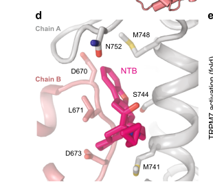

## Question

# Gene Research for Functional Annotation

## ⚠️ CRITICAL: Gene/Protein Identification Context

**BEFORE YOU BEGIN RESEARCH:** You MUST verify you are researching the CORRECT gene/protein. Gene symbols can be ambiguous, especially for less well-characterized genes from non-model organisms.

### Target Gene/Protein Identity (from UniProt):
- **UniProt Accession:** Q563W7
- **Protein Description:** RecName: Full=non-specific serine/threonine protein kinase {ECO:0000256|ARBA:ARBA00012513}; EC=2.7.11.1 {ECO:0000256|ARBA:ARBA00012513};
- **Gene Information:** Name=trpm7 {ECO:0000313|RefSeq:NP_001025232.1, ECO:0000313|ZFIN:ZDB-GENE-021115-2}; Synonyms=cb495 {ECO:0000313|RefSeq:NP_001025232.1}, tct {ECO:0000313|RefSeq:NP_001025232.1};
- **Organism (full):** Danio rerio (Zebrafish) (Brachydanio rerio).
- **Protein Family:** In the C-terminal section; belongs to the protein kinase
- **Key Domains:** a-kinase_dom. (IPR004166); Ion_trans_dom. (IPR005821); Kinase-like_dom_sf. (IPR011009); TRPM. (IPR050927); TRPM7_a-kinase_dom. (IPR029601)

### MANDATORY VERIFICATION STEPS:

1. **Check if the gene symbol "trpm7" matches the protein description above**
2. **Verify the organism is correct:** Danio rerio (Zebrafish) (Brachydanio rerio).
3. **Check if protein family/domains align with what you find in literature**
4. **If you find literature for a DIFFERENT gene with the same or similar symbol, STOP**

### If Gene Symbol is Ambiguous or You Cannot Find Relevant Literature:

**DO NOT PROCEED WITH RESEARCH ON A DIFFERENT GENE.** Instead:
- State clearly: "The gene symbol 'trpm7' is ambiguous or literature is limited for this specific protein"
- Explain what you found (e.g., "Found extensive literature on a different gene with the same symbol in a different organism")
- Describe the protein based ONLY on the UniProt information provided above
- Suggest that the protein function can be inferred from domain/family information

### Research Target:

Please provide a comprehensive research report on the gene **trpm7** (gene ID: trpm7, UniProt: Q563W7) in DANRE.

The research report should be a detailed narrative explaining the function, biological processes, and localization of the gene product. Citations should be given for all claims.

You should prioritize authoritative reviews and primary scientific literature when conducting research. You can supplement
this with annotations you find in gene/protein databases, but these can be outdated or inaccurate.

We are specifically interested in the primary function of the gene - for enzymes, what reaction is catalyzed, and what is the substrate specificity? For transporters, what is the substrate? For structural proteins or adapters, what is the broader structural role? For signaling molecules, what is the role in the pathway.

We are interested in where in or outside the cell the gene product carries out its function.

We are also interested in the signaling or biochemical pathways in which the gene functions. We are less interested in broad pleiotropic effects, except where these elucidate the precise role.

Include evidence where possible. We are interested in both experimental evidence as well as inference from structure, evolution, or bioinformatic analysis. Precise studies should be prioritized over high-throughput, where available.

## Output

Question: You are an expert researcher providing comprehensive, well-cited information.

Provide detailed information focusing on:
1. Key concepts and definitions with current understanding
2. Recent developments and latest research (prioritize 2023-2024 sources)
3. Current applications and real-world implementations
4. Expert opinions and analysis from authoritative sources
5. Relevant statistics and data from recent studies

Format as a comprehensive research report with proper citations. Include URLs and publication dates where available.
Always prioritize recent, authoritative sources and provide specific citations for all major claims.

# Gene Research for Functional Annotation

## ⚠️ CRITICAL: Gene/Protein Identification Context

**BEFORE YOU BEGIN RESEARCH:** You MUST verify you are researching the CORRECT gene/protein. Gene symbols can be ambiguous, especially for less well-characterized genes from non-model organisms.

### Target Gene/Protein Identity (from UniProt):
- **UniProt Accession:** Q563W7
- **Protein Description:** RecName: Full=non-specific serine/threonine protein kinase {ECO:0000256|ARBA:ARBA00012513}; EC=2.7.11.1 {ECO:0000256|ARBA:ARBA00012513};
- **Gene Information:** Name=trpm7 {ECO:0000313|RefSeq:NP_001025232.1, ECO:0000313|ZFIN:ZDB-GENE-021115-2}; Synonyms=cb495 {ECO:0000313|RefSeq:NP_001025232.1}, tct {ECO:0000313|RefSeq:NP_001025232.1};
- **Organism (full):** Danio rerio (Zebrafish) (Brachydanio rerio).
- **Protein Family:** In the C-terminal section; belongs to the protein kinase
- **Key Domains:** a-kinase_dom. (IPR004166); Ion_trans_dom. (IPR005821); Kinase-like_dom_sf. (IPR011009); TRPM. (IPR050927); TRPM7_a-kinase_dom. (IPR029601)

### MANDATORY VERIFICATION STEPS:

1. **Check if the gene symbol "trpm7" matches the protein description above**
2. **Verify the organism is correct:** Danio rerio (Zebrafish) (Brachydanio rerio).
3. **Check if protein family/domains align with what you find in literature**
4. **If you find literature for a DIFFERENT gene with the same or similar symbol, STOP**

### If Gene Symbol is Ambiguous or You Cannot Find Relevant Literature:

**DO NOT PROCEED WITH RESEARCH ON A DIFFERENT GENE.** Instead:
- State clearly: "The gene symbol 'trpm7' is ambiguous or literature is limited for this specific protein"
- Explain what you found (e.g., "Found extensive literature on a different gene with the same symbol in a different organism")
- Describe the protein based ONLY on the UniProt information provided above
- Suggest that the protein function can be inferred from domain/family information

### Research Target:

Please provide a comprehensive research report on the gene **trpm7** (gene ID: trpm7, UniProt: Q563W7) in DANRE.

The research report should be a detailed narrative explaining the function, biological processes, and localization of the gene product. Citations should be given for all claims.

You should prioritize authoritative reviews and primary scientific literature when conducting research. You can supplement
this with annotations you find in gene/protein databases, but these can be outdated or inaccurate.

We are specifically interested in the primary function of the gene - for enzymes, what reaction is catalyzed, and what is the substrate specificity? For transporters, what is the substrate? For structural proteins or adapters, what is the broader structural role? For signaling molecules, what is the role in the pathway.

We are interested in where in or outside the cell the gene product carries out its function.

We are also interested in the signaling or biochemical pathways in which the gene functions. We are less interested in broad pleiotropic effects, except where these elucidate the precise role.

Include evidence where possible. We are interested in both experimental evidence as well as inference from structure, evolution, or bioinformatic analysis. Precise studies should be prioritized over high-throughput, where available.

## Research report: **trpm7** (Danio rerio) functional annotation (UniProt **Q563W7**)

### 0) Target verification and disambiguation
The research target is **Danio rerio trpm7** (UniProt **Q563W7**), a TRP melastatin-family **cation channel fused to a C-terminal serine/threonine α-kinase** (EC 2.7.11.1). Zebrafish genetics papers explicitly connect **trpm7** to classic mutant alleles/aliases including **touchdown/touchtone (tct)** and describe the expected channel-kinase architecture, matching the UniProt description and domain composition (TRPM ion transport domain plus α-kinase domain). (low2011trpm7isrequired pages 1-2, elizondo2010trpm7regulationof pages 1-2, mcneill2007celldeathof pages 1-2)

### 1) Key concepts and definitions (current understanding)

#### 1.1 TRPM7 as a “chanzyme”
TRPM7 is often described as a **bifunctional channel-enzyme (chanzyme)**: (i) a **nonselective cation channel** with strong **divalent permeability**, and (ii) a cytosolic **α-kinase** domain that phosphorylates protein substrates on Ser/Thr residues and also autophosphorylates. (okada2023celldeathinduction pages 4-5, decker2015trpm7functionin pages 21-25)

#### 1.2 Domain architecture
High-level domain organization (per subunit): a large **N-terminal TRPM homology region (MHR1–4)**; a **6-transmembrane channel domain (S1–S6) with a pore loop between S5–S6**; a **TRP helix** and coiled-coil elements; and a C-terminal **α-kinase domain** (plus an autophosphorylation-rich Ser/Thr region). Cryo-EM shows the tetrameric channel and extensive bound lipids/cholesterol-like densities around the transmembrane region. (nadezhdin2023structuralmechanismsof pages 2-3, okada2023celldeathinduction pages 4-5, nadezhdin2023structuralmechanismsof pages 1-2)

### 2) Molecular function: ion transport and kinase activity

#### 2.1 Ion channel function: transported substrates and selectivity
**Primary transport function:** TRPM7 forms a plasma-membrane cation channel permeable to **Mg2+**, **Ca2+**, and **Zn2+**, with broader permeability to other divalent cations (e.g., Ba2+, Sr2+, Cd2+; and in some contexts other transition metals). (decker2015trpm7functionin pages 17-21, okada2023celldeathinduction pages 4-5)

A reported permeability ranking is **Zn2+ ≈ Ni2+ >> Ba2+ > Co2+ > Mg2+ ≥ Mn2+ ≥ Sr2+ ≥ Cd2+ ≥ Ca2+**, and the channel is not permeable to the trivalent blockers **La3+** or **Gd3+**. (mittermeier2019thekinasecoupledtrpm7 pages 8-11)

**Quantitative electrophysiology:** a review summarizing primary measurements reports **single-channel unitary conductance ~40 pS at ~−70 mV** when extracellular Mg2+ is absent. (okada2023celldeathinduction pages 4-5)

#### 2.2 Channel gating/regulation (what controls activity)
TRPM7 is **constitutively active but strongly regulated** by intracellular divalents and phosphoinositides:
- **Intracellular Mg2+ and Mg·ATP** act as negative regulators. (mittermeier2019thekinasecoupledtrpm7 pages 8-11, sturgeon2020theroleof pages 15-18)
- Channel opening requires **PIP2**; receptor pathways that deplete PIP2 reduce TRPM7 activity. (decker2015trpm7functionin pages 17-21, mittermeier2019thekinasecoupledtrpm7 pages 8-11)
- **Extracellular divalents (especially Mg2+)** cause strong outward rectification in macroscopic currents via open-channel block. (okada2023celldeathinduction pages 4-5)
- TRPM7 is also described as **pH-sensitive** (including voltage-dependent pH effects) and responsive to osmotic/mechanical perturbations in some systems. (decker2015trpm7functionin pages 17-21, decker2015trpm7functionin pages 21-25)

#### 2.3 Structural determinants of permeation and gating (latest structural view)
A major recent advance is high-resolution cryo-EM defining **open/closed gating rearrangements** and druggable ligand pockets.

**Open-state mechanics:** In a gain-of-function open structure, the pore widens near **N1097/N1098** (reported pore radius change from **<0.5 Å** closed to **>2.3 Å** open), and the narrowest open constriction is near a ring of **Y1085** residues (~**1.4 Å**). Mutational analysis indicates Y1085 hydroxyl chemistry is important for function. (nadezhdin2023structuralmechanismsof pages 4-5)

**Key pore electrostatics:** acidic vestibule residues are implicated in divalent attraction/selectivity (reviewed with reference to residues such as D1054/E1052 in human TRPM7), with D1054 affecting proton conduction. (okada2023celldeathinduction pages 4-5)

#### 2.4 Kinase activity (EC 2.7.11.1): reaction and substrate specificity
**Catalyzed reaction:** TRPM7’s α-kinase domain transfers phosphate from ATP to **serine/threonine residues** on protein substrates and on TRPM7 itself (autophosphorylation). (okada2023celldeathinduction pages 4-5, decker2015trpm7functionin pages 21-25)

**Representative substrates** (reported across systems; used here as mechanistic inference relevant to zebrafish ortholog): **annexin 1/ANXA1**, **myosin II / myosin IIA heavy chain**, **eEF2 kinase**, and **STIM2** (linking to store-operated Ca2+ entry regulation). (decker2015trpm7functionin pages 21-25, mittermeier2019thekinasecoupledtrpm7 pages 8-11)

**Domain separability:** In zebrafish, at least one core behavioral function (touch-evoked escape) depends on TRPM7 **channel activity**, whereas TRPM7’s **kinase activity** and strict preference for divalents over monovalents were reported to be **dispensable** for that behavior. (low2011trpm7isrequired pages 1-2)

### 3) Subcellular localization and expression (where it acts)

#### 3.1 Subcellular localization
TRPM7 localizes to the **plasma membrane** and also to intracellular pools described as **tubulovesicular/synaptic vesicle-like compartments**. A mechanistic source also describes a population of **acidic, glutathione-rich vesicles** implicated in Zn2+ storage and redox-triggered Zn2+ release (not zebrafish-specific but relevant to inferred cellular roles of TRPM7). (decker2015trpm7functionin pages 21-25, mittermeier2019thekinasecoupledtrpm7 pages 8-11, mcneill2007celldeathof pages 1-2)

#### 3.2 Tissue/cell-type expression in zebrafish
In zebrafish, **trpm7 mRNA is broadly expressed**, with particularly high abundance in **kidney tubules** (pronephric/mesonephric) and in the **corpuscles of Stannius** (an endocrine organ involved in ionic homeostasis), supporting a primary role in systemic divalent-cation regulation and renal physiology. (elizondo2010trpm7regulationof pages 1-2)

Functionally, TRPM7 is required **within sensory neurons** for normal activation of touch-evoked escape behavior. (low2011trpm7isrequired pages 1-2)

### 4) Zebrafish biological roles, pathways, and phenotypes (organism-specific functional annotation)

#### 4.1 Sensory-neuron function and touch-evoked escape behavior
Zebrafish **touchdown** alleles of **trpm7** carry mutations that abolish channel activity. Mutants show a **transient deficit** in touch-evoked escape: they **do not respond between 52 and 63 hours post-fertilization (hpf)** (reported **n = 24 embryos from three clutches**). Sensory neurons are present and tactile-responsive, suggesting the behavioral deficit arises downstream (consistent with altered synaptic neurotransmitter release). Elevated extracellular **divalent cations** can restore escape behavior, supporting a divalent-dependent synaptic mechanism. (low2011trpm7isrequired pages 1-2)

#### 4.2 Pigment cell (melanophore) survival and melanin-linked toxicity
In **trpm7 mutant embryos**, melanophore loss results from **cell death with necrotic features** (not caspase-dependent apoptosis). Importantly, **inhibition of melanin synthesis largely prevents melanophore death**, supporting a model where Trpm7-dependent ionic homeostasis buffers pigment cells against toxic melanin-synthesis intermediates or associated stress. (mcneill2007celldeathof pages 1-2)

#### 4.3 Systemic cation homeostasis, kidney function, and endocrine signaling (stc1/fgf23)
Zebrafish **trpm7 mutants** show reduced whole-embryo **total magnesium** and **total calcium** by early larval stages, consistent with TRPM7 acting as an in vivo regulator of organismal divalent-cation balance. Mutants also exhibit **kidney stone formation** and altered endocrine programs involving **stanniocalcin 1 (stc1)** and **fgf23**; mechanistically, **fgf23 knockdown reduces kidney stones**, linking Trpm7 to endocrine control of mineral homeostasis and renal mineralization. (elizondo2010trpm7regulationof pages 1-2)

#### 4.4 Broader developmental roles (context)
Comparative developmental evidence across vertebrates supports that TRPM7 channel function is essential for early morphogenesis and cellular Mg2+ homeostasis, and that channel vs kinase contributions can be separable in some developmental contexts. This supports interpreting zebrafish phenotypes as primarily originating from **divalent-cation homeostasis and associated signaling**. (nethramangalath2024investigationofthe pages 16-20, sturgeon2020theroleof pages 15-18)

### 5) Recent developments and latest research (prioritizing 2023–2024)

#### 5.1 2023 high-resolution structures establish druggable pockets and gating motions
A major 2023 advance is a suite of TRPM7 cryo-EM structures (2.17–2.99 Å), including **closed** and **open** conformations and ligand-bound states. These structures link specific conformational changes (S6/TRP rearrangements and pore dilation) to activation and inhibition mechanisms and provide atomic details of lipid interactions. (nadezhdin2023structuralmechanismsof pages 1-2, nadezhdin2023structuralmechanismsof pages 2-3, nadezhdin2023structuralmechanismsof pages 4-5)

#### 5.2 Mechanism-based pharmacology: naltriben activation and inhibitor sites
The 2023 structural work mapped:
- An **intersubunit naltriben (NTB) binding/activation site** involving residues **D670, L671, M741, S744, N752**, where mutations weaken NTB activation. (nadezhdin2023structuralmechanismsof pages 4-5, nadezhdin2023structuralmechanismsof media 0122cc1d)
- A **vanilloid-like inhibitor pocket** in the transmembrane domain for inhibitors such as **VER155008** and **NS8593**, with key residues including **A981, M991, W1111, F1118**; these inhibitors stabilize a closed state (and compete with endogenous lipid occupancy in the pocket). (nadezhdin2023structuralmechanismsof media 0122cc1d, nadezhdin2023structuralmechanismsof media a1a7982d)

These findings are directly relevant to zebrafish trpm7 annotation because they provide a mechanistic basis for using agonists/antagonists to probe channel function in vivo (including in zebrafish). (nadezhdin2023structuralmechanismsof pages 1-2, nadezhdin2023structuralmechanismsof media 0122cc1d)

#### 5.3 2023 synthesis on TRPM7 roles in cell stress and death
A 2023 review focusing on TRPM7 (in the context of stress and cell death) summarizes core biophysical properties (e.g., outward rectification with divalents; monovalent/divalent conduction; proton conduction) and emphasizes separability of channel and kinase functions. This reinforces TRPM7’s role as a broadly expressed stress- and homeostasis-relevant cation pathway. (okada2023celldeathinduction pages 4-5)

### 6) Current applications and real-world implementations

#### 6.1 Zebrafish as an in vivo platform for TRPM7 functional dissection
Zebrafish **trpm7/tct** mutants provide a tractable model to:
- Test how **divalent-cation availability** modulates **neural circuit output** (touch-evoked escape) in a defined developmental window. (low2011trpm7isrequired pages 1-2)
- Study **pigment-cell survival** and metabolic/ionic toxicity coupling (melanin-synthesis-dependent death). (mcneill2007celldeathof pages 1-2)
- Model **renal mineralization/kidney stone formation** and endocrine control of mineral homeostasis (stc1/fgf23 pathways). (elizondo2010trpm7regulationof pages 1-2)

#### 6.2 Pharmacological probing guided by 2023 structures
The structurally mapped compounds **naltriben (agonist)** and inhibitors **NS8593** and **VER155008** provide mechanistically interpretable tools for perturbing TRPM7 gating, enabling sharper causal tests than older, less-specific modulators. (nadezhdin2023structuralmechanismsof pages 2-3, nadezhdin2023structuralmechanismsof media 0122cc1d)

### 7) Expert opinions and analysis (authoritative interpretations from the literature)

1. **Channel function is central for core organismal roles.** Zebrafish behavioral genetics show that abolishing channel activity yields discrete neurobehavioral defects, and rescue experiments indicate kinase activity is not required for that specific output—supporting the view that **ion flux (especially divalent flux) is the proximal effector** in certain in vivo contexts. (low2011trpm7isrequired pages 1-2)
2. **TRPM7 links systemic mineral balance to endocrine control and kidney pathology.** The zebrafish physiology work places trpm7 upstream of **stc1/fgf23** responses and kidney stone formation, arguing for a coherent physiological module: **Trpm7-mediated cation handling → endocrine compensation → renal mineralization phenotypes**. (elizondo2010trpm7regulationof pages 1-2)
3. **Modern structures validate TRPM7 as druggable.** Atomic-resolution maps showing discrete agonist and inhibitor pockets provide strong evidence that TRPM7 can be targeted with specific small molecules that stabilize defined conformational states. (nadezhdin2023structuralmechanismsof pages 1-2, nadezhdin2023structuralmechanismsof media 0122cc1d)

### 8) Relevant statistics and quantitative data points from included studies
- **Touch-evoked escape deficit window:** **52–63 hpf**, **n = 24 embryos** from three clutches (touchdown mutants). (low2011trpm7isrequired pages 1-2)
- **Single-channel conductance:** ~**40 pS** at ~−70 mV without extracellular Mg2+ (summarized from electrophysiology literature). (okada2023celldeathinduction pages 4-5)
- **Permeability ranking (reported):** **Zn2+ ≈ Ni2+ >> Ba2+ > Co2+ > Mg2+ ≥ Mn2+ ≥ Sr2+ ≥ Cd2+ ≥ Ca2+**; impermeable to La3+/Gd3+. (mittermeier2019thekinasecoupledtrpm7 pages 8-11)
- **Structural pore metric:** open-state pore radius near N1097 reported to increase from **<0.5 Å** (closed) to **>2.3 Å** (open) in a gain-of-function mutant structure. (nadezhdin2023structuralmechanismsof pages 4-5)

### Summary table
The following table consolidates key annotation elements (domains, transport/kinase functions, localization, zebrafish phenotypes, and 2023 structural pharmacology).

| Aspect | Summary for zebrafish **trpm7** (UniProt Q563W7) | Key evidence sources |
|---|---|---|
| Verified target identity | **Danio rerio trpm7** corresponds to the zebrafish TRPM7 channel-kinase associated with classic mutant aliases **touchdown/touchtone (tct)** and **cb495**; literature describes a TRP melastatin family cation channel with a **C-terminal serine/threonine α-kinase**, matching UniProt Q563W7 domain architecture. | (elizondo2010trpm7regulationof pages 1-2, low2011trpm7isrequired pages 1-2, mcneill2007celldeathof pages 1-2) |
| Domain architecture | TRPM7 is a **tetrameric plasma-membrane channel** whose subunits contain an **N-terminal TRPM homology region (MHR1-4/NTD)**, **6 transmembrane helices (S1-S6)** with a **pore loop between S5-S6**, a **TRP helix**, **coiled-coil region**, **serine/threonine-rich autophosphorylation/substrate domain**, and a **C-terminal α-kinase catalytic domain**. Structural work places the CTD after the TMD and resolves extensive lipid interactions around the TMD. | (mittermeier2019thekinasecoupledtrpm7 pages 8-11, nadezhdin2023structuralmechanismsof pages 1-2, nadezhdin2023structuralmechanismsof pages 2-3, okada2023celldeathinduction pages 4-5) |
| Ion permeability / selectivity | TRPM7 is a **divalent-permeable nonselective cation channel** conducting **Mg2+, Ca2+, Zn2+** and additional divalents; broader literature cited in the retrieved evidence also notes permeability to Fe2+, Cu2+, Mn2+, Co2+, Ba2+, Sr2+, Cd2+ and monovalents under some conditions. A reported permeability ranking is **Zn2+ ≈ Ni2+ >> Ba2+ > Co2+ > Mg2+ ≥ Mn2+ ≥ Sr2+ ≥ Cd2+ ≥ Ca2+**; the channel is not permeable to **La3+ or Gd3+**. Single-channel conductance is about **40 pS at ~−70 mV** in the absence of extracellular Mg2+. | (decker2015trpm7functionin pages 17-21, mittermeier2019thekinasecoupledtrpm7 pages 8-11, sturgeon2020theroleof pages 15-18, okada2023celldeathinduction pages 4-5) |
| Key gating / regulation | Channel activity is **constitutive but strongly regulated**. Important negative regulators include **intracellular Mg2+**, **Mg·ATP**, and **acidic extracellular pH**; activation/opening requires **PIP2**. In whole-cell recordings, extracellular divalents produce **strong outward rectification** via open-channel block. TRPM7 is also reported as sensitive to **pH**, **osmolarity/stretch/swelling**, and receptor pathways that deplete PIP2. | (decker2015trpm7functionin pages 17-21, mittermeier2019thekinasecoupledtrpm7 pages 8-11, decker2015trpm7functionin pages 21-25, sturgeon2020theroleof pages 15-18, okada2023celldeathinduction pages 4-5) |
| Pore / permeation determinants | Acidic vestibule residues help attract permeant cations; **D1054** and **E1052** are highlighted as important for Mg2+/Ca2+ binding/selectivity in human TRPM7, and **D1054A** abolishes proton conductance. 2023 structural work found the closed-to-open transition widens the gate near **N1097/N1098**, with the narrowest open constriction near **Y1085**; **Y1085F/S** are loss-of-function, supporting a key permeation role. | (nadezhdin2023structuralmechanismsof pages 4-5, okada2023celldeathinduction pages 4-5) |
| Kinase activity | TRPM7 is a **protein kinase EC 2.7.11.1** with a cytosolic **α-kinase** domain that autophosphorylates and phosphorylates serine/threonine residues on downstream targets. Genetic studies indicate channel and kinase functions can be partially separable, with some zebrafish behavioral phenotypes depending mainly on channel function rather than kinase catalytic activity. | (decker2015trpm7functionin pages 21-25, low2011trpm7isrequired pages 1-2, okada2023celldeathinduction pages 4-5) |
| Representative kinase substrates | Reported substrates in the retrieved evidence include **annexin A1/annexin 1**, **myosin II / myosin IIA heavy chain**, **eEF2 kinase**, **STIM2**, and histones after cleavage/nuclear translocation of the kinase fragment in some systems. These data mostly come from non-zebrafish mechanistic studies but are relevant to inferred molecular function of zebrafish Trpm7. | (mittermeier2019thekinasecoupledtrpm7 pages 8-11, decker2015trpm7functionin pages 21-25) |
| Subcellular localization | TRPM7 localizes primarily to the **plasma membrane**, but also to **intracellular tubulovesicular/synaptic vesicle-like compartments**; some evidence describes **acidic glutathione-rich vesicles (M7V)** implicated in Zn2+ storage/release. The kinase fragment has been reported to **translocate to the nucleus** after cleavage in some systems. | (mittermeier2019thekinasecoupledtrpm7 pages 8-11, decker2015trpm7functionin pages 21-25, mcneill2007celldeathof pages 1-2) |
| Zebrafish expression | In zebrafish, **trpm7 mRNA is broadly expressed**, with particularly strong expression in **pronephric/mesonephric kidney tubules** and the **corpuscles of Stannius**, consistent with roles in systemic cation homeostasis and renal physiology. | (elizondo2010trpm7regulationof pages 1-2) |
| Zebrafish role: ion homeostasis / kidney | Zebrafish mutants show reduced whole-embryo **total magnesium and calcium** by early larval stages, supporting a direct role in organismal divalent-cation balance. Mutants also show **kidney stone formation** and altered endocrine responses involving **stanniocalcin 1 (stc1)** and **fgf23**; **fgf23 knockdown reduces stones**. | (elizondo2010trpm7regulationof pages 1-2) |
| Zebrafish role: melanophore survival | **trpm7 homozygous mutants** lose melanophores during embryogenesis; melanophore death shows **necrotic features** rather than caspase-dependent apoptosis. Inhibition of **melanin synthesis largely prevents melanophore death**, suggesting Trpm7 is needed to maintain ionic/metabolic conditions that protect pigment cells from toxic melanin-synthesis intermediates. | (mcneill2007celldeathof pages 1-2) |
| Zebrafish role: touch-evoked escape | In **touchdown/tct** mutants, sensory neurons are present and can respond to tactile stimulation, but the animals fail to activate normal escape behavior during a defined developmental window: mutants **do not respond between 52 and 63 hpf**, based on **n = 24 embryos from three clutches**. Rescue experiments indicate **channel activity**, but not kinase activity or strict divalent-over-monovalent selectivity, is required for this behavior. Elevated extracellular divalents can restore escape behavior, consistent with a role in **synaptic transmitter release/modulation**. | (low2011trpm7isrequired pages 1-2) |
| Additional zebrafish phenotypes | Beyond pigmentation and touch behavior, zebrafish trpm7 mutants show **impaired growth**, **defective skeletogenesis**, and broader developmental abnormalities consistent with disrupted Mg2+/Ca2+ homeostasis. Maternal transcript contribution likely buffers the earliest stages, contributing to later onset/recovery of some phenotypes. | (elizondo2010trpm7regulationof pages 1-2, mcneill2007celldeathof pages 1-2) |
| Developmental significance across vertebrates | Comparative evidence supports TRPM7 as essential for **embryogenesis, gastrulation/cell movements, proliferation, and Mg2+ homeostasis**. In vertebrate embryos, channel function is often more critical than kinase catalytic activity for early morphogenesis, which helps interpret zebrafish phenotypes mechanistically. | (nethramangalath2024investigationofthe pages 16-20, sturgeon2020theroleof pages 15-18) |
| 2023 structural highlight: open-state mechanism | Cryo-EM structures in 2023 resolved TRPM7 at **2.17-2.99 Å**, including a **2.19 Å apo closed state** and open conformations. A gain-of-function mutant (**N1098Q**) produced an open state in which the pore radius at **N1097** increased from **<0.5 Å** to **>2.3 Å**; the narrowest constriction (~**1.4 Å**) is at **Y1085**. Gating involves **S6 lengthening**, **TRP helix shortening/rotation**, and a **π-bulge in S6**. | (nadezhdin2023structuralmechanismsof pages 1-2, nadezhdin2023structuralmechanismsof pages 4-5, nadezhdin2023structuralmechanismsof pages 2-3) |
| 2023 pharmacology highlight: naltriben activation site | The agonist **naltriben (NTB)** binds at an **intersubunit site** formed by the **MHR4/Pre-S1 region** of one subunit and the **α21/α22 loop** of the neighboring subunit. Key coordinating residues include **D670, L671, M741, S744, N752**; mutating these residues weakens NTB activation, defining a tractable activation pocket. | (nadezhdin2023structuralmechanismsof pages 4-5, nadezhdin2023structuralmechanismsof media 0122cc1d, nadezhdin2023structuralmechanismsof media c43cdd43, nadezhdin2023structuralmechanismsof media 5bbe4004, nadezhdin2023structuralmechanismsof media a1a7982d) |
| 2023 pharmacology highlight: inhibitor site | **VER155008** and **NS8593** were mapped to a **vanilloid-like pocket** in the TMD at the interface of the **S1-S4 domain and pore domain**, contributed by the **N-terminal part of S3**, **C-terminal part of S4**, **S4-S5 linker**, and **TRP helix**. Key residues include **A981, M991, W1111, F1118**. These inhibitors stabilize the **closed state**, supporting TRPM7 druggability. | (nadezhdin2023structuralmechanismsof pages 1-2, nadezhdin2023structuralmechanismsof pages 2-3, nadezhdin2023structuralmechanismsof media 0122cc1d, nadezhdin2023structuralmechanismsof media c43cdd43, nadezhdin2023structuralmechanismsof media 5bbe4004, nadezhdin2023structuralmechanismsof media a1a7982d) |
| Practical application / implementation | Zebrafish **trpm7/tct mutants** are a practical in vivo model for dissecting **divalent-cation homeostasis**, **synaptic transmission**, **pigment-cell survival**, and **renal mineralization**. Recent structural mapping of **NTB**, **VER155008**, and **NS8593** provides a mechanistic framework for using pharmacologic probes in comparative TRPM7 studies, including zebrafish-based functional annotation. | (elizondo2010trpm7regulationof pages 1-2, low2011trpm7isrequired pages 1-2, nadezhdin2023structuralmechanismsof pages 1-2, nadezhdin2023structuralmechanismsof media 0122cc1d) |

*Table: This table condenses the main functional annotation points for zebrafish trpm7/Q563W7, combining zebrafish-specific genetics with broader TRPM7 mechanistic and 2023 structural pharmacology evidence. It is useful as a quick-reference map linking domains, ion/kinase function, localization, phenotypes, and modern druggable sites.*

### Key recent/authoritative sources (with publication dates and URLs)
- Low et al. **2011-08**. *TRPM7 Is Required within Zebrafish Sensory Neurons for the Activation of Touch-Evoked Escape Behaviors.* **J Neurosci**. https://doi.org/10.1523/jneurosci.4950-10.2011 (low2011trpm7isrequired pages 1-2)
- Elizondo et al. **2010-12**. *trpm7 regulation of in vivo cation homeostasis and kidney function involves stanniocalcin 1 and fgf23.* **Endocrinology**. https://doi.org/10.1210/en.2010-0853 (elizondo2010trpm7regulationof pages 1-2)
- McNeill et al. **2007-08**. *Cell death of melanophores in zebrafish trpm7 mutant embryos depends on melanin synthesis.* **J Invest Dermatol**. https://doi.org/10.1038/sj.jid.5700710 (mcneill2007celldeathof pages 1-2)
- Nadezhdin et al. **2023-05**. *Structural mechanisms of TRPM7 activation and inhibition.* **Nat Commun**. https://doi.org/10.1038/s41467-023-38362-3 (nadezhdin2023structuralmechanismsof pages 1-2, nadezhdin2023structuralmechanismsof media 0122cc1d)
- Okada et al. **2023-09**. *Cell death induction and protection… Part 3: the roles and properties of TRPM2 and TRPM7.* **Front Cell Dev Biol**. https://doi.org/10.3389/fcell.2023.1246955 (okada2023celldeathinduction pages 4-5)

### Notes on evidence limitations
Although the report prioritizes 2023 structural advances and zebrafish primary genetics/physiology, some detailed kinase-substrate assignments and intracellular vesicle models are derived from mechanistic studies in other systems and are used here as **inference for the zebrafish ortholog** (consistent with strong conservation of TRPM7 channel-kinase architecture). Where zebrafish-specific biochemical substrate validation is required, additional targeted zebrafish phosphoproteomics or in vivo substrate assays would be needed beyond the current evidence set. (decker2015trpm7functionin pages 21-25, mittermeier2019thekinasecoupledtrpm7 pages 8-11)

References

1. (low2011trpm7isrequired pages 1-2): Sean E. Low, Kimberly Amburgey, Eric Horstick, Jeremy Linsley, Shawn M. Sprague, Wilson W. Cui, Weibin Zhou, Hiromi Hirata, Louis Saint-Amant, Richard I. Hume, and John Y. Kuwada. Trpm7 is required within zebrafish sensory neurons for the activation of touch-evoked escape behaviors. The Journal of Neuroscience, 31:11633-11644, Aug 2011. URL: https://doi.org/10.1523/jneurosci.4950-10.2011, doi:10.1523/jneurosci.4950-10.2011. This article has 71 citations.

2. (elizondo2010trpm7regulationof pages 1-2): Michael R. Elizondo, Erine H. Budi, and David M. Parichy. Trpm7 regulation of in vivo cation homeostasis and kidney function involves stanniocalcin 1 and fgf23. Endocrinology, 151 12:5700-9, Dec 2010. URL: https://doi.org/10.1210/en.2010-0853, doi:10.1210/en.2010-0853. This article has 64 citations and is from a domain leading peer-reviewed journal.

3. (mcneill2007celldeathof pages 1-2): Matthew S. McNeill, Jennifer Paulsen, Gregory Bonde, Erin Burnight, Mei-Yu Hsu, and Robert A. Cornell. Cell death of melanophores in zebrafish trpm7 mutant embryos depends on melanin synthesis. The Journal of investigative dermatology, 127 8:2020-30, Aug 2007. URL: https://doi.org/10.1038/sj.jid.5700710, doi:10.1038/sj.jid.5700710. This article has 114 citations.

4. (okada2023celldeathinduction pages 4-5): Yasunobu Okada, Tomohiro Numata, Ravshan Z. Sabirov, Makiko Kashio, Peter G. Merzlyak, and Kaori Sato-Numata. Cell death induction and protection by activation of ubiquitously expressed anion/cation channels. part 3: the roles and properties of trpm2 and trpm7. Frontiers in Cell and Developmental Biology, Sep 2023. URL: https://doi.org/10.3389/fcell.2023.1246955, doi:10.3389/fcell.2023.1246955. This article has 7 citations.

5. (decker2015trpm7functionin pages 21-25): Amanda R. Decker. Trpm7 function in zebrafish dopaminergic neurons. ArXiv, 2015. URL: https://doi.org/10.17077/etd.7i42ocad, doi:10.17077/etd.7i42ocad. This article has 1 citations.

6. (nadezhdin2023structuralmechanismsof pages 2-3): Kirill D. Nadezhdin, Leonor Correia, Chamali Narangoda, Dhilon S. Patel, Arthur Neuberger, Thomas Gudermann, Maria G. Kurnikova, Vladimir Chubanov, and Alexander I. Sobolevsky. Structural mechanisms of trpm7 activation and inhibition. Nature Communications, May 2023. URL: https://doi.org/10.1038/s41467-023-38362-3, doi:10.1038/s41467-023-38362-3. This article has 81 citations and is from a highest quality peer-reviewed journal.

7. (nadezhdin2023structuralmechanismsof pages 1-2): Kirill D. Nadezhdin, Leonor Correia, Chamali Narangoda, Dhilon S. Patel, Arthur Neuberger, Thomas Gudermann, Maria G. Kurnikova, Vladimir Chubanov, and Alexander I. Sobolevsky. Structural mechanisms of trpm7 activation and inhibition. Nature Communications, May 2023. URL: https://doi.org/10.1038/s41467-023-38362-3, doi:10.1038/s41467-023-38362-3. This article has 81 citations and is from a highest quality peer-reviewed journal.

8. (decker2015trpm7functionin pages 17-21): Amanda R. Decker. Trpm7 function in zebrafish dopaminergic neurons. ArXiv, 2015. URL: https://doi.org/10.17077/etd.7i42ocad, doi:10.17077/etd.7i42ocad. This article has 1 citations.

9. (mittermeier2019thekinasecoupledtrpm7 pages 8-11): Lorenz Mittermeier. The kinase-coupled trpm7 channel is the central gatekeeper of intestinal mineral absorption. Dissertation, Jan 2019. URL: https://doi.org/10.5282/edoc.24107, doi:10.5282/edoc.24107. This article has 0 citations.

10. (sturgeon2020theroleof pages 15-18): The role of magnesium homeostasis in embryonic melanocytes and dopamine neurons

11. (nadezhdin2023structuralmechanismsof pages 4-5): Kirill D. Nadezhdin, Leonor Correia, Chamali Narangoda, Dhilon S. Patel, Arthur Neuberger, Thomas Gudermann, Maria G. Kurnikova, Vladimir Chubanov, and Alexander I. Sobolevsky. Structural mechanisms of trpm7 activation and inhibition. Nature Communications, May 2023. URL: https://doi.org/10.1038/s41467-023-38362-3, doi:10.1038/s41467-023-38362-3. This article has 81 citations and is from a highest quality peer-reviewed journal.

12. (nethramangalath2024investigationofthe pages 16-20): Thushara Nethramangalath. Investigation of the trpm7 complex in mouse embryonic stem cells. Text, Jan 2024. URL: https://doi.org/10.7282/t3-7gay-vw34, doi:10.7282/t3-7gay-vw34. This article has 0 citations and is from a peer-reviewed journal.

13. (nadezhdin2023structuralmechanismsof media 0122cc1d): Kirill D. Nadezhdin, Leonor Correia, Chamali Narangoda, Dhilon S. Patel, Arthur Neuberger, Thomas Gudermann, Maria G. Kurnikova, Vladimir Chubanov, and Alexander I. Sobolevsky. Structural mechanisms of trpm7 activation and inhibition. Nature Communications, May 2023. URL: https://doi.org/10.1038/s41467-023-38362-3, doi:10.1038/s41467-023-38362-3. This article has 81 citations and is from a highest quality peer-reviewed journal.

14. (nadezhdin2023structuralmechanismsof media a1a7982d): Kirill D. Nadezhdin, Leonor Correia, Chamali Narangoda, Dhilon S. Patel, Arthur Neuberger, Thomas Gudermann, Maria G. Kurnikova, Vladimir Chubanov, and Alexander I. Sobolevsky. Structural mechanisms of trpm7 activation and inhibition. Nature Communications, May 2023. URL: https://doi.org/10.1038/s41467-023-38362-3, doi:10.1038/s41467-023-38362-3. This article has 81 citations and is from a highest quality peer-reviewed journal.

15. (nadezhdin2023structuralmechanismsof media c43cdd43): Kirill D. Nadezhdin, Leonor Correia, Chamali Narangoda, Dhilon S. Patel, Arthur Neuberger, Thomas Gudermann, Maria G. Kurnikova, Vladimir Chubanov, and Alexander I. Sobolevsky. Structural mechanisms of trpm7 activation and inhibition. Nature Communications, May 2023. URL: https://doi.org/10.1038/s41467-023-38362-3, doi:10.1038/s41467-023-38362-3. This article has 81 citations and is from a highest quality peer-reviewed journal.

16. (nadezhdin2023structuralmechanismsof media 5bbe4004): Kirill D. Nadezhdin, Leonor Correia, Chamali Narangoda, Dhilon S. Patel, Arthur Neuberger, Thomas Gudermann, Maria G. Kurnikova, Vladimir Chubanov, and Alexander I. Sobolevsky. Structural mechanisms of trpm7 activation and inhibition. Nature Communications, May 2023. URL: https://doi.org/10.1038/s41467-023-38362-3, doi:10.1038/s41467-023-38362-3. This article has 81 citations and is from a highest quality peer-reviewed journal.

## Artifacts

- [Edison artifact artifact-00](trpm7-deep-research-falcon_artifacts/artifact-00.md)

## Citations

1. okada2023celldeathinduction pages 4-5
2. nadezhdin2023structuralmechanismsof pages 4-5
3. mcneill2007celldeathof pages 1-2
4. nadezhdin2023structuralmechanismsof pages 2-3
5. nadezhdin2023structuralmechanismsof pages 1-2
6. sturgeon2020theroleof pages 15-18
7. nethramangalath2024investigationofthe pages 16-20
8. https://doi.org/10.1523/jneurosci.4950-10.2011
9. https://doi.org/10.1210/en.2010-0853
10. https://doi.org/10.1038/sj.jid.5700710
11. https://doi.org/10.1038/s41467-023-38362-3
12. https://doi.org/10.3389/fcell.2023.1246955
13. https://doi.org/10.1523/jneurosci.4950-10.2011,
14. https://doi.org/10.1210/en.2010-0853,
15. https://doi.org/10.1038/sj.jid.5700710,
16. https://doi.org/10.3389/fcell.2023.1246955,
17. https://doi.org/10.17077/etd.7i42ocad,
18. https://doi.org/10.1038/s41467-023-38362-3,
19. https://doi.org/10.5282/edoc.24107,
20. https://doi.org/10.7282/t3-7gay-vw34,