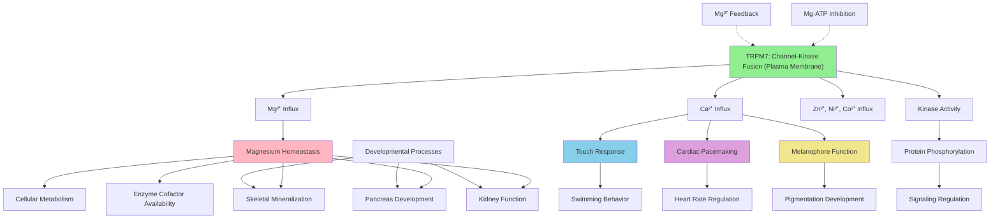

# Pathway Summary for trpm7

## Overview
TRPM7 is a unique ion channel-kinase fusion protein that functions as a calcium- and magnesium-permeable cation channel with an intrinsic serine/threonine protein kinase domain [file:DANRE/trpm7/trpm7-deep-research.md]. This bifunctional protein is essential for cellular ion homeostasis, particularly magnesium regulation, and plays critical roles in multiple developmental processes including melanophore survival, mechanosensory neuron function, cardiac pacemaking, and skeletal mineralization [PMID:27628598, file:DANRE/trpm7/trpm7-deep-research.md].

## Magnesium and Divalent Cation Homeostasis Pathway
TRPM7 serves as a primary mechanism for cellular magnesium homeostasis by conducting Mg2+ and other divalent cations across the plasma membrane [PMID:27628598]. The channel exhibits broad selectivity for metal ions, with zinc and nickel showing the highest permeability, followed by barium, cobalt, magnesium, manganese, strontium, cadmium, and calcium [file:DANRE/trpm7/trpm7-deep-research.md]. The channel activity is negatively regulated by intracellular Mg2+ and Mg·ATP, creating a feedback mechanism that maintains appropriate cellular magnesium levels [PMID:27628598].

## Mechanosensory and Touch Response Pathway
TRPM7 is essential for mechanosensory neuron function and touch-evoked escape behaviors in zebrafish [PMID:21832193]. The protein localizes to primary sensory neurons where it is required for proper neuronal firing and development of touch-sensitive responses [file:DANRE/trpm7/trpm7-deep-research.md]. Mutant larvae exhibit transient unresponsiveness to touch stimuli during early development and show compromised motility with reduced movement distance and swimming velocity [PMID:38970357, file:DANRE/trpm7/trpm7-deep-research.md].

## Melanophore Survival and Pigmentation Pathway
TRPM7 plays a crucial role in melanophore survival by preventing toxic accumulation of melanin synthetic intermediates [PMID:17290233]. The protein's ion transport function is essential for maintaining the cellular environment required for safe melanin synthesis [file:DANRE/trpm7/trpm7-deep-research.md]. Loss of TRPM7 function leads to extensive melanophore cell death during development, with abnormal melanosome structure and eventual loss of pigmentation [PMID:9007256, file:DANRE/trpm7/trpm7-deep-research.md].

## Cardiac Pacemaking and Heart Rate Regulation
TRPM7 is required for maintaining cardiac automaticity and normal heart rate regulation [PMID:23878236]. The protein's calcium channel activity in cardiac pacemaker cells contributes to the ionic currents necessary for spontaneous action potential generation [file:DANRE/trpm7/trpm7-deep-research.md]. Zebrafish trpm7 mutants exhibit bradycardia during larval stages, and TRPM7 knockdown has been used as a model of sinoatrial node dysfunction [file:DANRE/trpm7/trpm7-deep-research.md].

## Pathway Diagram

## Skeletal Mineralization and Bone Development
TRPM7 is essential for proper skeletal development through its regulation of calcium and magnesium homeostasis [PMID:15823540]. Mutants develop ectopic calcifications including kidney stones and aberrant bone calcification due to disrupted ion handling [file:DANRE/trpm7/trpm7-deep-research.md]. The protein's function is critical for normal ossification processes and prevention of pathological mineralization in inappropriate locations [PMID:20881241].

## Pancreatic Development and Epithelial Proliferation
TRPM7 regulates exocrine pancreatic epithelial proliferation through magnesium-sensitive Socs3a signaling pathways [PMID:21183474]. The protein's magnesium transport function influences cellular proliferation and differentiation in endodermal tissues [file:DANRE/trpm7/trpm7-deep-research.md]. This regulatory mechanism links cellular ion homeostasis directly to developmental growth control and tissue patterning.

## Renal System Function and Ion Balance
TRPM7 plays a critical role in kidney function and systemic ion balance regulation [PMID:20881241]. The protein is highly expressed in the Corpuscles of Stannius, specialized endocrine glands in the zebrafish kidney that regulate calcium homeostasis [file:DANRE/trpm7/trpm7-deep-research.md]. Mutants develop kidney stones and have dysregulated calcium and magnesium levels in bodily fluids, demonstrating the protein's importance in organismal ion homeostasis.

## Alpha-Kinase Signaling Pathway
The C-terminal alpha-kinase domain of TRPM7 phosphorylates serine and threonine residues within alpha-helical regions of target proteins [file:DANRE/trpm7/trpm7-deep-research.md]. This atypical kinase activity provides an additional regulatory mechanism that may coordinate ion channel function with downstream signaling cascades. The kinase domain can autophosphorylate and phosphorylate other substrates, utilizing ATP as a cofactor for its catalytic activity [file:DANRE/trpm7/trpm7-deep-research.md].

## Channel Assembly and Tetrameric Structure
TRPM7 functions as a homo-tetrameric channel complex assembled through a coiled-coil domain near the C-terminus [file:DANRE/trpm7/trpm7-deep-research.md]. This quaternary structure is essential for proper channel function, with each subunit contributing six transmembrane helices to form the complete ion-conducting pore. The tetrameric assembly allows for cooperative regulation and may enable the integration of channel and kinase activities within the same macromolecular complex.

## Evolutionary and Physiological Significance
TRPM7 represents a unique evolutionary solution for coupling ion homeostasis with cellular signaling through its dual channel-kinase architecture. The protein's essential roles in diverse physiological processes highlight the fundamental importance of magnesium homeostasis in vertebrate development and function. Understanding TRPM7's mechanisms may inform therapeutic approaches for disorders involving ion dysregulation, cardiac arrhythmias, and developmental abnormalities.