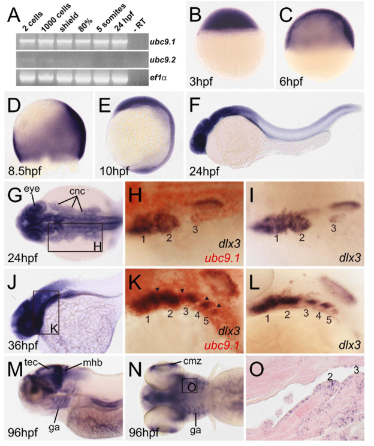

## Question

# Gene Research for Functional Annotation

## ⚠️ CRITICAL: Gene/Protein Identification Context

**BEFORE YOU BEGIN RESEARCH:** You MUST verify you are researching the CORRECT gene/protein. Gene symbols can be ambiguous, especially for less well-characterized genes from non-model organisms.

### Target Gene/Protein Identity (from UniProt):
- **UniProt Accession:** Q9DDJ0
- **Protein Description:** RecName: Full=SUMO-conjugating enzyme UBC9-B; EC=2.3.2.-; AltName: Full=RING-type E3 SUMO transferase UBC9-B; AltName: Full=SUMO-protein ligase B; AltName: Full=Ubiquitin carrier protein 9-B; AltName: Full=Ubiquitin carrier protein I-B; AltName: Full=Ubiquitin-conjugating enzyme E2 I-B; AltName: Full=Ubiquitin-protein ligase I-B;
- **Gene Information:** Name=ube2ib; Synonyms=ubc9b, ube2i2;
- **Organism (full):** Danio rerio (Zebrafish) (Brachydanio rerio).
- **Protein Family:** Belongs to the ubiquitin-conjugating enzyme family.
- **Key Domains:** Ub_conjugating_enzyme. (IPR050113); UBC. (IPR000608); UBQ-conjugating_AS. (IPR023313); UBQ-conjugating_enzyme/RWD. (IPR016135); UQ_con (PF00179)

### MANDATORY VERIFICATION STEPS:

1. **Check if the gene symbol "ube2ib" matches the protein description above**
2. **Verify the organism is correct:** Danio rerio (Zebrafish) (Brachydanio rerio).
3. **Check if protein family/domains align with what you find in literature**
4. **If you find literature for a DIFFERENT gene with the same or similar symbol, STOP**

### If Gene Symbol is Ambiguous or You Cannot Find Relevant Literature:

**DO NOT PROCEED WITH RESEARCH ON A DIFFERENT GENE.** Instead:
- State clearly: "The gene symbol 'ube2ib' is ambiguous or literature is limited for this specific protein"
- Explain what you found (e.g., "Found extensive literature on a different gene with the same symbol in a different organism")
- Describe the protein based ONLY on the UniProt information provided above
- Suggest that the protein function can be inferred from domain/family information

### Research Target:

Please provide a comprehensive research report on the gene **ube2ib** (gene ID: ube2ib, UniProt: Q9DDJ0) in DANRE.

The research report should be a detailed narrative explaining the function, biological processes, and localization of the gene product. Citations should be given for all claims.

You should prioritize authoritative reviews and primary scientific literature when conducting research. You can supplement
this with annotations you find in gene/protein databases, but these can be outdated or inaccurate.

We are specifically interested in the primary function of the gene - for enzymes, what reaction is catalyzed, and what is the substrate specificity? For transporters, what is the substrate? For structural proteins or adapters, what is the broader structural role? For signaling molecules, what is the role in the pathway.

We are interested in where in or outside the cell the gene product carries out its function.

We are also interested in the signaling or biochemical pathways in which the gene functions. We are less interested in broad pleiotropic effects, except where these elucidate the precise role.

Include evidence where possible. We are interested in both experimental evidence as well as inference from structure, evolution, or bioinformatic analysis. Precise studies should be prioritized over high-throughput, where available.

## Output

Question: You are an expert researcher providing comprehensive, well-cited information.

Provide detailed information focusing on:
1. Key concepts and definitions with current understanding
2. Recent developments and latest research (prioritize 2023-2024 sources)
3. Current applications and real-world implementations
4. Expert opinions and analysis from authoritative sources
5. Relevant statistics and data from recent studies

Format as a comprehensive research report with proper citations. Include URLs and publication dates where available.
Always prioritize recent, authoritative sources and provide specific citations for all major claims.

# Gene Research for Functional Annotation

## ⚠️ CRITICAL: Gene/Protein Identification Context

**BEFORE YOU BEGIN RESEARCH:** You MUST verify you are researching the CORRECT gene/protein. Gene symbols can be ambiguous, especially for less well-characterized genes from non-model organisms.

### Target Gene/Protein Identity (from UniProt):
- **UniProt Accession:** Q9DDJ0
- **Protein Description:** RecName: Full=SUMO-conjugating enzyme UBC9-B; EC=2.3.2.-; AltName: Full=RING-type E3 SUMO transferase UBC9-B; AltName: Full=SUMO-protein ligase B; AltName: Full=Ubiquitin carrier protein 9-B; AltName: Full=Ubiquitin carrier protein I-B; AltName: Full=Ubiquitin-conjugating enzyme E2 I-B; AltName: Full=Ubiquitin-protein ligase I-B;
- **Gene Information:** Name=ube2ib; Synonyms=ubc9b, ube2i2;
- **Organism (full):** Danio rerio (Zebrafish) (Brachydanio rerio).
- **Protein Family:** Belongs to the ubiquitin-conjugating enzyme family.
- **Key Domains:** Ub_conjugating_enzyme. (IPR050113); UBC. (IPR000608); UBQ-conjugating_AS. (IPR023313); UBQ-conjugating_enzyme/RWD. (IPR016135); UQ_con (PF00179)

### MANDATORY VERIFICATION STEPS:

1. **Check if the gene symbol "ube2ib" matches the protein description above**
2. **Verify the organism is correct:** Danio rerio (Zebrafish) (Brachydanio rerio).
3. **Check if protein family/domains align with what you find in literature**
4. **If you find literature for a DIFFERENT gene with the same or similar symbol, STOP**

### If Gene Symbol is Ambiguous or You Cannot Find Relevant Literature:

**DO NOT PROCEED WITH RESEARCH ON A DIFFERENT GENE.** Instead:
- State clearly: "The gene symbol 'ube2ib' is ambiguous or literature is limited for this specific protein"
- Explain what you found (e.g., "Found extensive literature on a different gene with the same symbol in a different organism")
- Describe the protein based ONLY on the UniProt information provided above
- Suggest that the protein function can be inferred from domain/family information

### Research Target:

Please provide a comprehensive research report on the gene **ube2ib** (gene ID: ube2ib, UniProt: Q9DDJ0) in DANRE.

The research report should be a detailed narrative explaining the function, biological processes, and localization of the gene product. Citations should be given for all claims.

You should prioritize authoritative reviews and primary scientific literature when conducting research. You can supplement
this with annotations you find in gene/protein databases, but these can be outdated or inaccurate.

We are specifically interested in the primary function of the gene - for enzymes, what reaction is catalyzed, and what is the substrate specificity? For transporters, what is the substrate? For structural proteins or adapters, what is the broader structural role? For signaling molecules, what is the role in the pathway.

We are interested in where in or outside the cell the gene product carries out its function.

We are also interested in the signaling or biochemical pathways in which the gene functions. We are less interested in broad pleiotropic effects, except where these elucidate the precise role.

Include evidence where possible. We are interested in both experimental evidence as well as inference from structure, evolution, or bioinformatic analysis. Precise studies should be prioritized over high-throughput, where available.

## Research report: *Danio rerio* **ube2ib** (UniProt **Q9DDJ0**) – functional annotation of SUMO-conjugating enzyme UBC9-B

### 0) Scope, identity verification, and ambiguity handling
The requested protein (UniProt accession **Q9DDJ0**) is annotated as **SUMO-conjugating enzyme UBC9-B** (E2 enzyme in SUMOylation; UBC/ubiquitin-conjugating domain family) from **zebrafish (*Danio rerio*)**, with gene name **ube2ib** (synonyms **ubc9b, ube2i2**) per the user-provided UniProt context. The biochemical properties described in authoritative 2023–2024 SUMO pathway reviews—**a single SUMO E2 (UBC9/UBE2I)** using an **active-site cysteine (Cys93 in UBC9)**, forming a **UBC9~SUMO thioester intermediate**, and transferring SUMO to substrate lysines in **ψKxD/E (or ΨKXE)** motifs—match the UniProt-described enzyme class and domains for Q9DDJ0, supporting that the target is a bona fide SUMO E2 enzyme. (huang2024mechanismsandfunctions pages 1-2, wang2023functionandregulation pages 2-3, xie2024tissueadaptationto pages 1-2)

However, **within the retrieved literature corpus**, zebrafish experimental studies typically refer to two paralogs as **ubc9.1** and **ubc9.2**, and **no retrieved source explicitly maps** those older names onto the current gene symbol **ube2ib/ubc9b** or the UniProt accession **Q9DDJ0**. Therefore, zebrafish developmental phenotypes summarized below should be interpreted as **paralog-level evidence for the zebrafish UBC9 family**, not as uniquely proven for Q9DDJ0/ube2ib. (nowak2006ubc9regulatesmitosis pages 3-4, nowak2006ubc9regulatesmitosis pages 2-3)

### 1) Key concepts and current understanding
#### 1.1 Definitions: SUMOylation and the role of UBC9/UBE2I (E2)
**SUMOylation** is a reversible post-translational modification in which a small ubiquitin-like modifier (**SUMO**) is covalently attached to lysine residues on target proteins, altering protein–protein interactions, stability, DNA binding, and **subcellular localization**. (xie2024tissueadaptationto pages 1-2)

The core enzymatic cascade is:
1) **SUMO maturation**: SUMO precursors are processed by **SENP** proteases to expose a C-terminal **Gly–Gly** motif. (huang2024mechanismsandfunctions pages 1-2, han2024newinsightsinto pages 2-4)
2) **E1 activation**: the heterodimer **SAE1/SAE2** activates SUMO in an ATP-dependent reaction, producing an **E1~SUMO thioester** on SAE2’s catalytic cysteine. (huang2024mechanismsandfunctions pages 1-2, wang2023functionandregulation pages 2-3, xie2024tissueadaptationto pages 1-2)
3) **E2 transfer**: SUMO is transferred to **UBC9/UBE2I** to form a **UBC9~SUMO thioester**, with UBC9’s **catalytic cysteine (Cys93)** highlighted in 2024 reviews. (wang2023functionandregulation pages 2-3, xie2024tissueadaptationto pages 1-2)
4) **Substrate conjugation**: UBC9 catalyzes formation of an **isopeptide bond** between the SUMO C-terminus and a **substrate lysine**, often within the consensus **ψ-K-x-D/E** (or **ΨKXE**) motif; phosphorylation-dependent variants (e.g., PDSM) occur for some substrates. (wang2023functionandregulation pages 2-3, han2024newinsightsinto pages 2-4, huang2024mechanismsandfunctions pages 2-4)
5) **E3 ligases**: E3 SUMO ligases (e.g., **PIAS family**, **RanBP2/Nup358**, **Pc2**) typically enhance specificity/efficiency by stabilizing E2–substrate interactions or orienting the acceptor lysine; purely E3-independent sumoylation is generally considered uncommon in vivo. (huang2024mechanismsandfunctions pages 1-2, xie2024tissueadaptationto pages 1-2, huang2024mechanismsandfunctions pages 2-4)

**Functional implication for ube2ib/Q9DDJ0**: as a UBC9 family member, the primary biochemical function is **transfer of SUMO** (SUMO1/2/3 in vertebrates) from the **E2 thioester intermediate** to substrate lysines, thereby catalyzing **protein SUMOylation**. (wang2023functionandregulation pages 2-3, xie2024tissueadaptationto pages 1-2)

#### 1.2 Subcellular localization: where the enzyme acts
Recent reviews emphasize that SUMOylation is strongly associated with **nuclear and subnuclear compartments** (e.g., nucleoplasm and nuclear bodies). For example, SUMO2/3 are enriched in nucleoplasm and PML bodies, while SUMO1 can also be present in nucleoli, nuclear envelope, and some cytoplasmic foci—consistent with UBC9 activity largely concentrated in the nucleus but not strictly limited to it. (huang2024mechanismsandfunctions pages 1-2)

### 2) Zebrafish evidence relevant to ube2ib (paralog-level, not uniquely mapped to Q9DDJ0)
#### 2.1 Two zebrafish Ubc9 paralogs with distinct developmental expression
A key zebrafish study reports two Ubc9 paralogs, **ubc9.1** and **ubc9.2**, encoding ~158 aa proteins with only a few amino-acid differences. **ubc9.1** mRNA is both **maternally deposited and zygotically expressed**, with ubiquitous expression early (blastula/gastrula) and later enrichment in **proliferative zones** (brain ventricular zones, eye ciliary marginal zone) and cranial neural crest. In contrast, **ubc9.2** transcript is detectable at low levels early (pregastrula) but is largely absent later, consistent with **maternal-only** expression and little/no zygotic expression detectable by in situ. (nowak2006ubc9regulatesmitosis pages 3-4, nowak2006ubc9regulatesmitosis pages 2-3)

#### 2.2 Enzymatic function in vivo: dominant-negative C93A disrupts global sumoylation
Consistent with Ubc9’s expected E2 role, overexpression of wild-type zebrafish **Ubc9.1** increased global protein SUMOylation, while expression of a **catalytic-site mutant C93A** reduced global sumoylation and caused widespread apoptosis—supporting that the catalytic cysteine is essential for in vivo function and that SUMO conjugation capacity is required for cell survival. (nowak2006ubc9regulatesmitosis pages 3-4, nowak2006ubc9regulatesmitosis pages 1-2, nowak2006ubc9regulatesmitosis pages 2-3)

#### 2.3 Developmental roles: mitosis, polyploidy, and tissue-restricted defects with zygotic knockdown
Zygote-focused reduction of ubc9.1 led to tissue-restricted defects in late-proliferating structures (notably craniofacial cartilage and eyes), with evidence for a **mitotic defect**: fewer mitotic chondrocyte precursors (pH3), unchanged S-phase labeling (BrdU), and accumulation of head cells with increased DNA content consistent with impaired G2/M progression and endoreduplication. (nowak2006ubc9regulatesmitosis pages 1-2, nowak2006ubc9regulatesmitosis pages 8-10)

A representative image panel set from this study includes figures for expression patterns and FACS DNA-content phenotypes (2n/4n/8n shifts), which visually supports the mechanistic interpretation that loss of Ubc9 activity perturbs mitotic progression in developing tissues. (nowak2006ubc9regulatesmitosis media 0e441b00)

#### 2.4 Functional redundancy between paralogs (rescue)
Although ubc9.2 shows limited zygotic expression, experimental co-injection of ubc9.2 cDNA could rescue ubc9.1 morphants, supporting biochemical redundancy between the paralogs at the protein-function level (i.e., they can substitute enzymatically under forced expression). (nowak2006ubc9regulatesmitosis pages 4-5)

### 3) Recent developments (prioritizing 2023–2024)
#### 3.1 Refined mechanistic view of substrate selection (2024)
A 2024 review focusing on immune cells emphasizes that E3 ligases often control site selection not by providing catalytic activity per se, but by **positioning the UBC9~SUMO thioester** relative to the target lysine and integrating context-dependent motifs (e.g., PDSM) to enhance specificity. This modern framing is directly relevant for annotating UBC9 family enzymes, including zebrafish ube2ib, as broadly acting E2s whose substrate repertoire is tuned by E3s and regulatory signals. (huang2024mechanismsandfunctions pages 2-4)

#### 3.2 Physiological/disease contexts highlighted in 2023–2024 reviews
Recent reviews connect SUMOylation (and thus UBC9 activity) to metabolic stress adaptation and fibrosis, emphasizing that SUMOylation influences protein interactions and localization and that the cascade relies on UBC9’s catalytic cysteine (Cys93) and E3 cooperation. (xie2024tissueadaptationto pages 1-2, han2024newinsightsinto pages 2-4)

A 2023 review in cardiac biology summarizes genetic evidence indicating that SUMO isoforms are not equally dispensable (e.g., **SUMO2 deficiency is embryonic lethal**; **SUMO1 knockout** has reported high mortality due to septal defects in some studies), supporting the broader expert consensus that SUMO cycling enzymes (including UBC9) often occupy essential nodes in development and organ physiology. (wang2023functionandregulation pages 2-3)

### 4) Current applications and real-world implementations
#### 4.1 Pharmacological modulation of the SUMO system (example primary study, 2024)
A 2024 colorectal cancer study provides an example of how SUMOylation (including UBC9-mediated global SUMOylation) is leveraged experimentally and therapeutically: resistant CRC cells showed elevated SUMO2/3-modified proteins under 5-FU exposure, and combining 5-FU with the SUMOylation inhibitor **ML-792** increased sensitivity of resistant cells and reduced colony formation. The study also implicates transcriptional upregulation of **UBC9** by **RREB1** as part of a chemoresistance mechanism. This demonstrates a real-world implementation pattern: **SUMO pathway inhibition** as an adjuvant strategy to re-sensitize drug-resistant tumors. (deng2024rreb1mediatedsumoylationenhancement pages 1-2)

#### 4.2 Expert perspective: why UBC9 is an attractive node
Across 2023–2024 reviews, a recurring expert point is that there is a **single E2 (UBC9)** for SUMOylation, implying that modulation of UBC9 or upstream steps can have broad, system-level effects—useful for experimental perturbation but potentially associated with toxicity/pleiotropy. This informs functional annotation: UBC9 family enzymes are central hubs rather than pathway-specific components. (wang2023functionandregulation pages 2-3, xie2024tissueadaptationto pages 1-2)

### 5) Relevant statistics and data extracted from studies
#### 5.1 Zebrafish quantitative developmental data (primary; paralog-level)
In the zebrafish ubc9.1 knockdown study, rescue and phenotype quantitation included:
- Eye vesicle diameter: control **0.25 ± 0.009 mm**, morphant **0.19 ± 0.008 mm**, rescue **0.24 ± 0.009 mm** (n=5). (nowak2006ubc9regulatesmitosis pages 4-5)
- Head FACS DNA content at 48 hpf: **2n 75% vs 89% (control)** and **4n 14% vs 6% (control)**, with a reproducible **8n** population in morphants. (nowak2006ubc9regulatesmitosis pages 8-10)
- Cell size correlation: mean FSC increased **~1.6×** for 4n and **~2.6×** for 8n populations. (nowak2006ubc9regulatesmitosis pages 8-10)

#### 5.2 Quantitative implementation details from a 2024 SUMO-modulation study
In the 2024 CRC chemoresistance study:
- Resistant cells had an initial resistance index (RI) of approximately **10**.
- Resistance induction used stepwise 5-FU escalation **200 μM → 1,600 μM** over **~5 months**; **50 μM** 5-FU was used to maintain resistance in culture. (deng2024rreb1mediatedsumoylationenhancement pages 1-2)

### 6) Practical functional annotation for *ube2ib* (Q9DDJ0): evidence-backed statements and cautious inferences
#### 6.1 Primary molecular function (high confidence, family-level)
Based on conserved SUMO pathway biochemistry, **UBE2I/UBC9-family proteins catalyze transfer of SUMO from an E2~SUMO thioester intermediate to substrate lysine residues**, forming an isopeptide bond (often at ψKxD/E motifs), frequently assisted by E3 SUMO ligases. This is the appropriate enzymatic functional statement for zebrafish ube2ib/Q9DDJ0 given its UBC domain family membership and concordance with the sole-E2 paradigm in vertebrates. (wang2023functionandregulation pages 2-3, xie2024tissueadaptationto pages 1-2, huang2024mechanismsandfunctions pages 2-4)

#### 6.2 Cellular localization (moderate confidence, family-level)
The predominant site of SUMOylation activity is the **nucleus/subnuclear structures**, with additional cytoplasmic contexts depending on E3 ligases and targets; thus, ube2ib is expected to function mainly in nuclear SUMOylation reactions, while not excluding cytoplasmic substrates. (huang2024mechanismsandfunctions pages 1-2)

#### 6.3 Biological processes/pathways in zebrafish (moderate confidence, paralog-level)
Zebrafish Ubc9 paralogs are implicated in **cell survival**, **mitotic progression**, and development of proliferative tissues (brain/eye) and craniofacial cartilage, with evidence of mitotic defects and polyploidy upon zygotic depletion of ubc9.1, and early apoptosis upon strong catalytic disruption. These processes should be considered candidate annotations for ube2ib only with the caveat that paralog mapping is not confirmed in the retrieved corpus. (nowak2006ubc9regulatesmitosis pages 1-2, nowak2006ubc9regulatesmitosis pages 8-10, nowak2006ubc9regulatesmitosis pages 3-4)

### 7) Evidence gaps and recommendations
1) **Paralog mapping gap**: the key zebrafish functional paper uses **ubc9.1/ubc9.2** naming and does not explicitly identify **ube2ib (ubc9b)** or UniProt **Q9DDJ0**; therefore, a definitive ube2ib-specific annotation requires a mapping source (e.g., Ensembl/ZFIN cross-references or a paper explicitly using the ube2ib/ubc9b symbol).
2) **2023–2024 zebrafish-specific gap**: within retrieved texts, no 2023–2024 zebrafish primary studies were obtained for ube2ib/ubc9b; the most direct zebrafish mechanistic evidence remains earlier (2006) and pathway-level (2010). (nowak2006ubc9regulatesmitosis pages 3-4, yuan2010smallubiquitinrelatedmodifier pages 1-2)

### Summary table of key findings
| Section | Entity/Step | Key finding | Quantitative / reagent details | Source (title, year) | DOI URL | Citation |
|---|---|---|---|---|---|---|
| Zebrafish paralogs | ubc9.1 | Encodes one of two zebrafish Ubc9 paralogs; detected throughout examined stages, indicating both maternal deposition and zygotic expression. Early expression is ubiquitous; later enriched in proliferative tissues including brain, eyes, spinal cord, cranial neural crest, and pharyngeal pouches. | Protein length reported as ~158 aa for the paralogs; expression persists into larval stages for ubc9.1. | *Ubc9 regulates mitosis and cell survival during zebrafish development* (2006) | https://doi.org/10.1091/mbc.e06-05-0413 | (nowak2006ubc9regulatesmitosis pages 3-4, nowak2006ubc9regulatesmitosis pages 2-3) |
| Zebrafish paralogs | ubc9.2 | Second zebrafish Ubc9 paralog; transcript detectable mainly at low levels during pregastrula stages, consistent with maternal contribution, but little/no detectable zygotic expression later by in situ hybridization. | Used as a rescue construct because the ubc9.1 morpholino did not target ubc9.2 cDNA. | *Ubc9 regulates mitosis and cell survival during zebrafish development* (2006) | https://doi.org/10.1091/mbc.e06-05-0413 | (nowak2006ubc9regulatesmitosis pages 3-4, nowak2006ubc9regulatesmitosis pages 4-5, nowak2006ubc9regulatesmitosis pages 2-3) |
| Zebrafish function | Ubc9 as SUMO E2 | Wild-type zebrafish Ubc9 behaves as the SUMO E2-conjugating enzyme in vivo; overexpression increases global protein SUMOylation, whereas catalytic-site mutant reduces global SUMOylation and causes severe apoptosis. | HA-SUMO mRNA injected at 25 pg/embryo; ubc9.1 or ubc9.1-C93A mRNA at 75 pg/embryo. Catalytic mutant: C93A. | *Ubc9 regulates mitosis and cell survival during zebrafish development* (2006) | https://doi.org/10.1091/mbc.e06-05-0413 | (nowak2006ubc9regulatesmitosis pages 3-4, nowak2006ubc9regulatesmitosis pages 2-3) |
| Zebrafish phenotype | Dominant-negative loss of function | Broad reduction of SUMOylation by dominant-negative Ubc9 causes widespread apoptosis, indicating essential early requirement for Ubc9-mediated SUMOylation and cell survival. | Dominant-negative reagent: Ubc9.1 C93A catalytic mutant. | *Ubc9 regulates mitosis and cell survival during zebrafish development* (2006) | https://doi.org/10.1091/mbc.e06-05-0413 | (nowak2006ubc9regulatesmitosis pages 3-4, nowak2006ubc9regulatesmitosis pages 1-2) |
| Zebrafish phenotype | ubc9.1 morphants | Zygotic ubc9.1 knockdown causes later developmental defects, especially reduced brain and eye size and craniofacial/cartilage malformations, with fewer but larger chondrocytes. | Morpholino dosing: 0.5 pmol/embryo (2 nL of 0.25 mM solution). | *Ubc9 regulates mitosis and cell survival during zebrafish development* (2006) | https://doi.org/10.1091/mbc.e06-05-0413 | (nowak2006ubc9regulatesmitosis pages 1-2, nowak2006ubc9regulatesmitosis pages 2-3) |
| Zebrafish rescue | ubc9.2 rescue of ubc9.1 knockdown | ubc9.2 can functionally compensate for ubc9.1, supporting enzymatic redundancy between paralogs despite different temporal expression profiles. | Coinjection of pSGH2-ubc9.2 rescued morphology in 60% of ubc9.1 morphants at 48 hpf; rescued embryos showed strong head GFP expression. | *Ubc9 regulates mitosis and cell survival during zebrafish development* (2006) | https://doi.org/10.1091/mbc.e06-05-0413 | (nowak2006ubc9regulatesmitosis pages 4-5) |
| Zebrafish quantitative phenotype | Eye size | ubc9.1 knockdown reduces eye vesicle diameter; rescue with ubc9.2 restores near-control size. | Control 0.25 mm ± 0.009; rescue 0.24 mm ± 0.009; morphant 0.19 mm ± 0.008; n = 5. | *Ubc9 regulates mitosis and cell survival during zebrafish development* (2006) | https://doi.org/10.1091/mbc.e06-05-0413 | (nowak2006ubc9regulatesmitosis pages 4-5) |
| Zebrafish quantitative phenotype | DNA-content defects | Head cells from ubc9.1 morphants accumulate with 4n and 8n DNA content, consistent with failed G2/M transition or mitotic progression and endoreduplication. | At 48 hpf in heads: 2n cells 75% in morphants vs 89% in controls; 4n cells 14% vs 6%; reproducible small 8n population in morphants. | *Ubc9 regulates mitosis and cell survival during zebrafish development* (2006) | https://doi.org/10.1091/mbc.e06-05-0413 | (nowak2006ubc9regulatesmitosis pages 8-10) |
| Zebrafish quantitative phenotype | Cell size / ploidy correlation | Polyploid morphant cells are larger, supporting mitotic failure with continued DNA replication. | Mean FSC increased ~1.6-fold for 4n cells and ~2.6-fold for 8n cells; enlarged DAPI-positive nuclei also observed. | *Ubc9 regulates mitosis and cell survival during zebrafish development* (2006) | https://doi.org/10.1091/mbc.e06-05-0413 | (nowak2006ubc9regulatesmitosis pages 8-10) |
| Zebrafish developmental timing | Maternal buffering | Early gastrula-stage SUMOylation remains largely intact in ubc9.1 morphants because maternal Ubc9 protein persists; later depletion correlates with onset of phenotype. | Ubc9 protein becomes undetectable in ubc9.1 morphants by 48 hpf and onward. | *Ubc9 regulates mitosis and cell survival during zebrafish development* (2006) | https://doi.org/10.1091/mbc.e06-05-0413 | (nowak2006ubc9regulatesmitosis pages 4-5) |
| SUMO cascade | SUMO maturation | SUMO precursors are first processed by SENP proteases to expose the C-terminal diglycine motif required for conjugation. | Diglycine exposure is prerequisite for activation by E1. | *Mechanisms and functions of sumoylation in health and disease* (2024); *New insights into SUMOylation and NEDDylation in fibrosis* (2024) | https://doi.org/10.1186/s12929-024-01003-y ; https://doi.org/10.3389/fphar.2024.1476699 | (huang2024mechanismsandfunctions pages 1-2, han2024newinsightsinto pages 2-4, huang2024mechanismsandfunctions pages 2-4) |
| SUMO cascade | E1 activation (SAE1/SAE2) | The heterodimeric E1 enzyme SAE1/SAE2 activates mature SUMO in an ATP-dependent reaction, forming a high-energy thioester linkage with the catalytic cysteine on SAE2. | Sequential adenylation/thioester chemistry emphasized across reviews. | *Function and regulation of ubiquitin-like SUMO system in heart* (2023); *Mechanisms and functions of sumoylation in health and disease* (2024); *Tissue adaptation to metabolic stress* (2024) | https://doi.org/10.3389/fcell.2023.1294717 ; https://doi.org/10.1186/s12929-024-01003-y ; https://doi.org/10.3389/fendo.2024.1434338 | (huang2024mechanismsandfunctions pages 1-2, wang2023functionandregulation pages 2-3, xie2024tissueadaptationto pages 1-2) |
| SUMO cascade | E2 transfer to UBC9 | Activated SUMO is transferred from E1 to the sole SUMO E2 conjugase UBC9/UBE2I, creating a UBC9-SUMO thioester intermediate. | UBC9 catalytic cysteine identified as Cys93 in recent reviews. | *Function and regulation of ubiquitin-like SUMO system in heart* (2023); *Tissue adaptation to metabolic stress* (2024) | https://doi.org/10.3389/fcell.2023.1294717 ; https://doi.org/10.3389/fendo.2024.1434338 | (wang2023functionandregulation pages 2-3, xie2024tissueadaptationto pages 1-2) |
| SUMO cascade | Substrate recognition | UBC9 recognizes lysine acceptor sites often embedded in the canonical consensus motif ψKxD/E (or ΨKXE), where ψ is hydrophobic. Phosphorylation-dependent variants also exist. | Consensus motif reported as ψ-KxD/E or ΨKXE; PDSM motif also noted in review literature. | *Mechanisms and functions of sumoylation in health and disease* (2024); *Function and regulation of ubiquitin-like SUMO system in heart* (2023); *New insights into SUMOylation and NEDDylation in fibrosis* (2024) | https://doi.org/10.1186/s12929-024-01003-y ; https://doi.org/10.3389/fcell.2023.1294717 ; https://doi.org/10.3389/fphar.2024.1476699 | (wang2023functionandregulation pages 2-3, han2024newinsightsinto pages 2-4, huang2024mechanismsandfunctions pages 2-4) |
| SUMO cascade | Covalent conjugation step | UBC9 catalyzes formation of an isopeptide bond between the SUMO C-terminus and a substrate lysine; modification can be mono-, multi-, or poly-SUMOylation. | Poly-SUMOylation is especially associated with SUMO2/3. | *Mechanisms and functions of sumoylation in health and disease* (2024); *Function and regulation of ubiquitin-like SUMO system in heart* (2023) | https://doi.org/10.1186/s12929-024-01003-y ; https://doi.org/10.3389/fcell.2023.1294717 | (wang2023functionandregulation pages 2-3, huang2024mechanismsandfunctions pages 2-4) |
| SUMO cascade | E3 ligase role | E3 SUMO ligases enhance efficiency and specificity mainly by stabilizing the UBC9-SUMO/substrate interaction or correctly orienting the target lysine rather than replacing UBC9 chemistry. | Major E3 families named in recent reviews include PIAS proteins, RanBP2/Nup358, Pc2; additional examples include TOPORS, MAPL, ZATT, and TRIM28. | *Mechanisms and functions of sumoylation in health and disease* (2024); *Function and regulation of ubiquitin-like SUMO system in heart* (2023); *Tissue adaptation to metabolic stress* (2024) | https://doi.org/10.1186/s12929-024-01003-y ; https://doi.org/10.3389/fcell.2023.1294717 ; https://doi.org/10.3389/fendo.2024.1434338 | (huang2024mechanismsandfunctions pages 1-2, wang2023functionandregulation pages 2-3, xie2024tissueadaptationto pages 1-2, huang2024mechanismsandfunctions pages 2-4) |
| SUMO cascade | Typical localization / compartmentation | SUMOylation machinery is strongly associated with nuclear and subnuclear compartments, though compartment-specific E3s support broader localization. SUMO2/3 are enriched in nucleoplasm and PML bodies; SUMO1 is also found in nucleoli, nuclear envelope, and some cytoplasmic foci. | Reflects the predominant cellular context in which UBC9 acts on many substrates. | *Mechanisms and functions of sumoylation in health and disease* (2024); *Function and regulation of ubiquitin-like SUMO system in heart* (2023) | https://doi.org/10.1186/s12929-024-01003-y ; https://doi.org/10.3389/fcell.2023.1294717 | (huang2024mechanismsandfunctions pages 1-2, wang2023functionandregulation pages 2-3) |

*Table: This table summarizes zebrafish Ubc9 paralog evidence from Nowak & Hammerschmidt (2006) together with core mechanistic details of the SUMOylation cascade from recent 2023–2024 reviews. It is useful for linking paralog-specific developmental evidence in Danio rerio to the conserved biochemical function of UBC9/UBE2I.*

References

1. (huang2024mechanismsandfunctions pages 1-2): Chien-Hsin Huang, Tsan-Tzu Yang, and Kuo-I Lin. Mechanisms and functions of sumoylation in health and disease: a review focusing on immune cells. Journal of Biomedical Science, Jan 2024. URL: https://doi.org/10.1186/s12929-024-01003-y, doi:10.1186/s12929-024-01003-y. This article has 98 citations and is from a domain leading peer-reviewed journal.

2. (wang2023functionandregulation pages 2-3): Ying Wang, Zhihao Liu, Xiyun Bian, Chenxu Zhao, Xin Zhang, Xiaozhi Liu, and Nan Wang. Function and regulation of ubiquitin-like sumo system in heart. Frontiers in Cell and Developmental Biology, Nov 2023. URL: https://doi.org/10.3389/fcell.2023.1294717, doi:10.3389/fcell.2023.1294717. This article has 8 citations.

3. (xie2024tissueadaptationto pages 1-2): Hao Xie, Xin Liu, Shuo Li, Ming Wang, Ying Li, Ting Chen, Linwei Li, Faxi Wang, and Xuan Xiao. Tissue adaptation to metabolic stress: insights from sumoylation. Frontiers in Endocrinology, Nov 2024. URL: https://doi.org/10.3389/fendo.2024.1434338, doi:10.3389/fendo.2024.1434338. This article has 8 citations.

4. (nowak2006ubc9regulatesmitosis pages 3-4): Matthias Nowak and Matthias Hammerschmidt. Ubc9 regulates mitosis and cell survival during zebrafish development. Molecular biology of the cell, 17 12:5324-36, Dec 2006. URL: https://doi.org/10.1091/mbc.e06-05-0413, doi:10.1091/mbc.e06-05-0413. This article has 84 citations and is from a domain leading peer-reviewed journal.

5. (nowak2006ubc9regulatesmitosis pages 2-3): Matthias Nowak and Matthias Hammerschmidt. Ubc9 regulates mitosis and cell survival during zebrafish development. Molecular biology of the cell, 17 12:5324-36, Dec 2006. URL: https://doi.org/10.1091/mbc.e06-05-0413, doi:10.1091/mbc.e06-05-0413. This article has 84 citations and is from a domain leading peer-reviewed journal.

6. (han2024newinsightsinto pages 2-4): Jin Han, Jun Wu, Wen-Tao Kou, Li-Na Xie, Ya-Li Tang, Da-Long Zhi, Ping Li, and Dan-Qian Chen. New insights into sumoylation and neddylation in fibrosis. Frontiers in Pharmacology, Dec 2024. URL: https://doi.org/10.3389/fphar.2024.1476699, doi:10.3389/fphar.2024.1476699. This article has 5 citations.

7. (huang2024mechanismsandfunctions pages 2-4): Chien-Hsin Huang, Tsan-Tzu Yang, and Kuo-I Lin. Mechanisms and functions of sumoylation in health and disease: a review focusing on immune cells. Journal of Biomedical Science, Jan 2024. URL: https://doi.org/10.1186/s12929-024-01003-y, doi:10.1186/s12929-024-01003-y. This article has 98 citations and is from a domain leading peer-reviewed journal.

8. (nowak2006ubc9regulatesmitosis pages 1-2): Matthias Nowak and Matthias Hammerschmidt. Ubc9 regulates mitosis and cell survival during zebrafish development. Molecular biology of the cell, 17 12:5324-36, Dec 2006. URL: https://doi.org/10.1091/mbc.e06-05-0413, doi:10.1091/mbc.e06-05-0413. This article has 84 citations and is from a domain leading peer-reviewed journal.

9. (nowak2006ubc9regulatesmitosis pages 8-10): Matthias Nowak and Matthias Hammerschmidt. Ubc9 regulates mitosis and cell survival during zebrafish development. Molecular biology of the cell, 17 12:5324-36, Dec 2006. URL: https://doi.org/10.1091/mbc.e06-05-0413, doi:10.1091/mbc.e06-05-0413. This article has 84 citations and is from a domain leading peer-reviewed journal.

10. (nowak2006ubc9regulatesmitosis media 0e441b00): Matthias Nowak and Matthias Hammerschmidt. Ubc9 regulates mitosis and cell survival during zebrafish development. Molecular biology of the cell, 17 12:5324-36, Dec 2006. URL: https://doi.org/10.1091/mbc.e06-05-0413, doi:10.1091/mbc.e06-05-0413. This article has 84 citations and is from a domain leading peer-reviewed journal.

11. (nowak2006ubc9regulatesmitosis pages 4-5): Matthias Nowak and Matthias Hammerschmidt. Ubc9 regulates mitosis and cell survival during zebrafish development. Molecular biology of the cell, 17 12:5324-36, Dec 2006. URL: https://doi.org/10.1091/mbc.e06-05-0413, doi:10.1091/mbc.e06-05-0413. This article has 84 citations and is from a domain leading peer-reviewed journal.

12. (deng2024rreb1mediatedsumoylationenhancement pages 1-2): Ya-nan Deng, Ying Chen, Shan Gao, Nan Zhang, Yinheng Luo, Shu Luo, Qiu Li, Xianghui Fu, and Shufang Liang. Rreb1-mediated sumoylation enhancement promotes chemoresistance partially by transcriptionally upregulating ubc9 in colorectal cancer. Frontiers in Pharmacology, Jul 2024. URL: https://doi.org/10.3389/fphar.2024.1381860, doi:10.3389/fphar.2024.1381860. This article has 10 citations.

13. (yuan2010smallubiquitinrelatedmodifier pages 1-2): Hao Yuan, Jun Zhou, Min Deng, Xi Liu, Morgane Le Bras, Hugues de The, Sai Juan Chen, Zhu Chen, Ting Xi Liu, and Jun Zhu. Small ubiquitin-related modifier paralogs are indispensable but functionally redundant during early development of zebrafish. Cell Research, 20:185-196, Feb 2010. URL: https://doi.org/10.1038/cr.2009.101, doi:10.1038/cr.2009.101. This article has 50 citations and is from a domain leading peer-reviewed journal.

## Artifacts

- [Edison artifact artifact-00](ube2ib-deep-research-falcon_artifacts/artifact-00.md)

## Citations

1. xie2024tissueadaptationto pages 1-2
2. huang2024mechanismsandfunctions pages 1-2
3. huang2024mechanismsandfunctions pages 2-4
4. wang2023functionandregulation pages 2-3
5. han2024newinsightsinto pages 2-4
6. yuan2010smallubiquitinrelatedmodifier pages 1-2
7. https://doi.org/10.1091/mbc.e06-05-0413
8. https://doi.org/10.1186/s12929-024-01003-y
9. https://doi.org/10.3389/fphar.2024.1476699
10. https://doi.org/10.3389/fcell.2023.1294717
11. https://doi.org/10.3389/fendo.2024.1434338
12. https://doi.org/10.1186/s12929-024-01003-y,
13. https://doi.org/10.3389/fcell.2023.1294717,
14. https://doi.org/10.3389/fendo.2024.1434338,
15. https://doi.org/10.1091/mbc.e06-05-0413,
16. https://doi.org/10.3389/fphar.2024.1476699,
17. https://doi.org/10.3389/fphar.2024.1381860,
18. https://doi.org/10.1038/cr.2009.101,