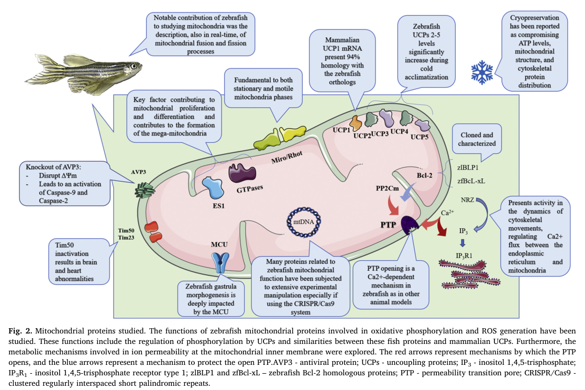

## Question

# Gene Research for Functional Annotation

## ⚠️ CRITICAL: Gene/Protein Identification Context

**BEFORE YOU BEGIN RESEARCH:** You MUST verify you are researching the CORRECT gene/protein. Gene symbols can be ambiguous, especially for less well-characterized genes from non-model organisms.

### Target Gene/Protein Identity (from UniProt):
- **UniProt Accession:** Q9W720
- **Protein Description:** RecName: Full=Dicarboxylate carrier UCP2; AltName: Full=Mitochondrial uncoupling protein 2; Short=UCP 2; AltName: Full=Solute carrier family 25 member 8;
- **Gene Information:** Name=ucp2; Synonyms=slc25a8;
- **Organism (full):** Danio rerio (Zebrafish) (Brachydanio rerio).
- **Protein Family:** Belongs to the mitochondrial carrier (TC 2.A.29) family.
- **Key Domains:** MCP. (IPR002067); MCP_dom_sf. (IPR023395); MCP_transmembrane. (IPR018108); Mito_Metabolite_Transporter. (IPR050391); Mito_carr (PF00153)

### MANDATORY VERIFICATION STEPS:

1. **Check if the gene symbol "ucp2" matches the protein description above**
2. **Verify the organism is correct:** Danio rerio (Zebrafish) (Brachydanio rerio).
3. **Check if protein family/domains align with what you find in literature**
4. **If you find literature for a DIFFERENT gene with the same or similar symbol, STOP**

### If Gene Symbol is Ambiguous or You Cannot Find Relevant Literature:

**DO NOT PROCEED WITH RESEARCH ON A DIFFERENT GENE.** Instead:
- State clearly: "The gene symbol 'ucp2' is ambiguous or literature is limited for this specific protein"
- Explain what you found (e.g., "Found extensive literature on a different gene with the same symbol in a different organism")
- Describe the protein based ONLY on the UniProt information provided above
- Suggest that the protein function can be inferred from domain/family information

### Research Target:

Please provide a comprehensive research report on the gene **ucp2** (gene ID: ucp2, UniProt: Q9W720) in DANRE.

The research report should be a detailed narrative explaining the function, biological processes, and localization of the gene product. Citations should be given for all claims.

You should prioritize authoritative reviews and primary scientific literature when conducting research. You can supplement
this with annotations you find in gene/protein databases, but these can be outdated or inaccurate.

We are specifically interested in the primary function of the gene - for enzymes, what reaction is catalyzed, and what is the substrate specificity? For transporters, what is the substrate? For structural proteins or adapters, what is the broader structural role? For signaling molecules, what is the role in the pathway.

We are interested in where in or outside the cell the gene product carries out its function.

We are also interested in the signaling or biochemical pathways in which the gene functions. We are less interested in broad pleiotropic effects, except where these elucidate the precise role.

Include evidence where possible. We are interested in both experimental evidence as well as inference from structure, evolution, or bioinformatic analysis. Precise studies should be prioritized over high-throughput, where available.

## Output

Question: You are an expert researcher providing comprehensive, well-cited information.

Provide detailed information focusing on:
1. Key concepts and definitions with current understanding
2. Recent developments and latest research (prioritize 2023-2024 sources)
3. Current applications and real-world implementations
4. Expert opinions and analysis from authoritative sources
5. Relevant statistics and data from recent studies

Format as a comprehensive research report with proper citations. Include URLs and publication dates where available.
Always prioritize recent, authoritative sources and provide specific citations for all major claims.

# Gene Research for Functional Annotation

## ⚠️ CRITICAL: Gene/Protein Identification Context

**BEFORE YOU BEGIN RESEARCH:** You MUST verify you are researching the CORRECT gene/protein. Gene symbols can be ambiguous, especially for less well-characterized genes from non-model organisms.

### Target Gene/Protein Identity (from UniProt):
- **UniProt Accession:** Q9W720
- **Protein Description:** RecName: Full=Dicarboxylate carrier UCP2; AltName: Full=Mitochondrial uncoupling protein 2; Short=UCP 2; AltName: Full=Solute carrier family 25 member 8;
- **Gene Information:** Name=ucp2; Synonyms=slc25a8;
- **Organism (full):** Danio rerio (Zebrafish) (Brachydanio rerio).
- **Protein Family:** Belongs to the mitochondrial carrier (TC 2.A.29) family.
- **Key Domains:** MCP. (IPR002067); MCP_dom_sf. (IPR023395); MCP_transmembrane. (IPR018108); Mito_Metabolite_Transporter. (IPR050391); Mito_carr (PF00153)

### MANDATORY VERIFICATION STEPS:

1. **Check if the gene symbol "ucp2" matches the protein description above**
2. **Verify the organism is correct:** Danio rerio (Zebrafish) (Brachydanio rerio).
3. **Check if protein family/domains align with what you find in literature**
4. **If you find literature for a DIFFERENT gene with the same or similar symbol, STOP**

### If Gene Symbol is Ambiguous or You Cannot Find Relevant Literature:

**DO NOT PROCEED WITH RESEARCH ON A DIFFERENT GENE.** Instead:
- State clearly: "The gene symbol 'ucp2' is ambiguous or literature is limited for this specific protein"
- Explain what you found (e.g., "Found extensive literature on a different gene with the same symbol in a different organism")
- Describe the protein based ONLY on the UniProt information provided above
- Suggest that the protein function can be inferred from domain/family information

### Research Target:

Please provide a comprehensive research report on the gene **ucp2** (gene ID: ucp2, UniProt: Q9W720) in DANRE.

The research report should be a detailed narrative explaining the function, biological processes, and localization of the gene product. Citations should be given for all claims.

You should prioritize authoritative reviews and primary scientific literature when conducting research. You can supplement
this with annotations you find in gene/protein databases, but these can be outdated or inaccurate.

We are specifically interested in the primary function of the gene - for enzymes, what reaction is catalyzed, and what is the substrate specificity? For transporters, what is the substrate? For structural proteins or adapters, what is the broader structural role? For signaling molecules, what is the role in the pathway.

We are interested in where in or outside the cell the gene product carries out its function.

We are also interested in the signaling or biochemical pathways in which the gene functions. We are less interested in broad pleiotropic effects, except where these elucidate the precise role.

Include evidence where possible. We are interested in both experimental evidence as well as inference from structure, evolution, or bioinformatic analysis. Precise studies should be prioritized over high-throughput, where available.

## Research report: Functional annotation of *Danio rerio* **ucp2** (UniProt Q9W720; synonym **slc25a8**) 

### 0) Target verification (critical identity checks)
The target protein specified by UniProt accession **Q9W720** is annotated as **Dicarboxylate carrier UCP2 / mitochondrial uncoupling protein 2**, encoded by **ucp2** (synonym **slc25a8**) in **zebrafish (*Danio rerio*)** and belonging to the **mitochondrial carrier (SLC25; TC 2.A.29) family**. This identity is consistent with peer‑reviewed mitochondrial carrier family analyses that explicitly include vertebrate ortholog sets containing *Danio rerio* and reference **SLC25A8** as a member of the mitochondrial carrier family (monne2023newinsightsinto pages 7-9). 

### 1) Key concepts and definitions (current understanding)

#### 1.1 Uncoupling proteins (UCPs) vs mitochondrial carrier family (SLC25)
UCP2 is part of the broader **mitochondrial carrier family (MC/SLC25)**, which is characterized by a conserved architecture: **triplicated sequence repeats** that form a **pseudo‑threefold symmetric, six‑transmembrane (6‑TM) α‑helical bundle** with a **central substrate‑binding site** (monne2023newinsightsinto pages 7-9). This fold is a hallmark of SLC25 carriers and is consistent with the UniProt/InterPro/Pfam “mitochondrial carrier protein (MCP)” domain classification you provided.

#### 1.2 What “uncoupling” means in mitochondria
“Mitochondrial uncoupling” refers to partial dissipation of the **protonmotive force** (Δp), typically through increased **proton conductance (‘proton leak’)** across the inner mitochondrial membrane (IMM). Reduced Δp can lower mitochondrial ATP production efficiency and can alter **reactive oxygen species (ROS)** generation, since very high membrane potential can favor superoxide formation (nesci2024ucp2amember pages 2-4).

#### 1.3 Competing biochemical models for UCP2 function
A central point in contemporary UCP2 biology is that UCP2’s **dominant biochemical activity remains debated**:

* **Model A: “mild uncoupling”/H+ leak regulator.** UCP2 is discussed as mediating a modest proton leak (a “relief valve”) that lowers membrane potential and can reduce ROS generation; regulatory concepts include activation by fatty acids and inhibition by purine nucleotides (nesci2024ucp2amember pages 2-4, nesci2024ucp2amember pages 6-7). 
* **Model B: metabolite transporter (notably C4 metabolites).** Recent syntheses emphasize evidence that UCP2 can function as a **metabolite carrier**, with a proposed role in transport of **four‑carbon (C4) metabolites** out of mitochondria, thereby rewiring cellular fuel selection (e.g., relative use of glucose/glutamine vs oxidative metabolism) (nesci2024ucp2amember pages 6-7, luby2022ucp2asa pages 18-19). 

These models are not mutually exclusive in the review literature; UCP2 is often framed as **context‑dependent**, potentially showing both mild uncoupling and metabolite transport under different metabolic states (nesci2024ucp2amember pages 6-7).

### 2) Cellular localization and topology for zebrafish UCP2 (Q9W720)

#### 2.1 Localization
Direct zebrafish localization experiments for Q9W720 were not identified in the retrieved texts. However, UCP2 is consistently described in authoritative reviews as a **mitochondrial inner membrane protein** of the SLC25 carrier family (nesci2024ucp2amember pages 6-7, nesci2024ucp2amember pages 2-4). Given the strong conservation of SLC25 carrier architecture and targeting, the most defensible functional annotation is: **UCP2 resides in the inner mitochondrial membrane**, mediating transport/uncoupling effects across the IMM (nesci2024ucp2amember pages 6-7, monne2023newinsightsinto pages 7-9).

#### 2.2 Membrane topology
Carrier-family analysis supports the canonical SLC25 topology: **six transmembrane helices** forming a transport pore, derived from the repeated symmetric segments typical of mitochondrial carriers (monne2023newinsightsinto pages 7-9). This matches the MCP/PF00153 domain family assignment (user-provided UniProt domain set) and is the expected topology for zebrafish UCP2.

### 3) Physiological roles in zebrafish: what is directly supported vs inferred
Zebrafish‑specific functional studies of **ucp2** (loss‑of‑function phenotypes, transport kinetics, or direct measurements of UCP2‑dependent proton leak) were not retrieved in the current evidence set. Therefore, zebrafish annotation is best treated as a combination of (i) direct zebrafish expression/context evidence and (ii) carefully delimited mechanistic inference from the broader UCP2 literature.

#### 3.1 Zebrafish evidence: temperature acclimatization and mitochondrial biology context
A zebrafish‑focused review reports that **“UCP 2–5 levels in zebrafish significantly increase during cold acclimatization”**, while zebrafish UCP1 is not involved in cold acclimatization (azevedo2020mitochondriaastargets pages 3-4). This supports that **non‑UCP1 UCP paralogs (including ucp2)** are inducible in physiological temperature stress and likely participate in mitochondrial bioenergetic adjustment.

#### 3.2 Zebrafish evidence: ucp2 expression as a marker of mitochondrial/neurodevelopmental perturbation
In larval zebrafish brain transcriptomics following SSRI exposure, authors report that **ucp2 was highly upregulated** and interpret this as consistent with **mitochondrial dysfunction and altered neurodevelopment**, citing UCP2’s role as a regulator of mitochondrial metabolism controlling ATP and ROS in other vertebrates (huang2020comparativetranscriptomicsimplicate pages 8-9). They explicitly note that **ucp2’s neurodevelopmental role is not yet established in zebrafish** and would require functional manipulation to confirm (huang2020comparativetranscriptomicsimplicate pages 8-9).

Quantitative statistics from this zebrafish study indicate strong enrichment of mitochondrial processes/pathways in the differential expression modules associated with exposure, including:
* Reactome **Mitochondrial translation**: corrected p = **2.09 × 10⁻⁹**
* Reactome **Respiratory electron transport**: corrected p = **0.042** for the DE gene list; and for a coexpression module, corrected p = **1.53 × 10⁻¹⁰** (huang2020comparativetranscriptomicsimplicate pages 7-8).

While these statistics are not ucp2‑specific effect sizes, they quantify that **mitochondrial bioenergetic pathways** are among the strongest transcriptomic signatures in the condition where ucp2 is induced.

#### 3.3 Mechanistic inference likely applicable to zebrafish ucp2
Based on current reviews, UCP2 is strongly tied to:
* **Redox control and ROS limitation** via lowering ΔΨm (mild uncoupling hypothesis) (nesci2024ucp2amember pages 2-4, nesci2024ucp2amember pages 6-7)
* **Metabolic rewiring** (e.g., shifting substrate oxidation patterns) via C4 metabolite exchange (nesci2024ucp2amember pages 6-7, luby2022ucp2asa pages 18-19)
* **Immunity/inflammation links** through ROS-dependent and metabolism-dependent pathways in phagocytes and other cell types (review-level synthesis) (nesci2024ucp2amember pages 6-7)

For zebrafish functional annotation, these mechanisms should be labeled as **high-confidence conservation-based hypotheses**, not yet confirmed specifically for Q9W720.

### 4) Current applications and real-world implementations (zebrafish models)

#### 4.1 Zebrafish as a platform for mitochondrial/UCP research
Zebrafish are used broadly for mitochondrial toxicology and metabolism research. A zebrafish mitochondrial methods review summarizes in vivo and ex vivo assay platforms commonly used to interrogate mitochondrial function, including **CRISPR/Cas9**, transgenic reporters (e.g., “mitoFish”), and core bioenergetics readouts such as **membrane potential (ΔΨm)**, oxygen consumption/respirometry (Clark-type electrodes), and **Seahorse extracellular flux analysis (XF24)** (azevedo2020mitochondriaastargets pages 3-4, azevedo2020mitochondriaastargets pages 4-6). These are the same classes of assays typically needed to functionally validate UCP2 activity (proton leak, ΔΨm changes, ROS effects).

A figure summarizing zebrafish mitochondrial proteins studied explicitly includes **UCPs** and notes that zebrafish studies have examined “regulation … by UCPs and similarities between these fish proteins and mammalian UCPs” (azevedo2020mitochondriaastargets media 64917e85).

#### 4.2 Toxicology/neurodevelopment implementations using ucp2 as a readout
The SSRI larval brain study uses **ucp2 induction** as part of the mechanistic interpretation of mitochondrial impairment and neurodevelopmental pathway disturbance (huang2020comparativetranscriptomicsimplicate pages 8-9). This is an example of a real-world implementation where **ucp2 functions as a molecular biomarker of mitochondrial stress/metabolic remodeling** in zebrafish toxicology and developmental neurobiology.

### 5) Expert opinions and authoritative analysis (2023–2024 prioritized)

#### 5.1 2024 review synthesis of UCP2 function
A 2024 review (“UCP2 … overview from physiological to pathological roles”) emphasizes that UCP2 differs from UCP1 (non-thermogenic role) and frames UCP2’s function as **elusive**, highlighting a strong contemporary view that UCP2 may operate as **both** (i) a mild uncoupler limiting ROS and (ii) a metabolite carrier, especially proposed **C4 metabolite exchange**, which can reprogram cellular bioenergetics (nesci2024ucp2amember pages 6-7). The review underscores that uncertainty in biochemical mechanism remains a central limitation for precise functional annotation.

#### 5.2 2023 mitochondrial carrier family evolution informs annotation confidence
A 2023 mitochondrial carrier family study describes the **conserved structural principles** (repeats, 6‑TM fold, central binding site) and uses ortholog analyses (including *Danio rerio*) to infer functional/structural relationships among carriers (monne2023newinsightsinto pages 7-9). For zebrafish ucp2, this supports high confidence in **carrier-family localization/topology** even when direct zebrafish functional assays are missing.

### 6) Summary of what is known vs unknown for zebrafish ucp2 (Q9W720)

*High-confidence annotation (supported by carrier family + UCP2 reviews):*
1. **Protein class**: mitochondrial carrier (SLC25/MCP family) (monne2023newinsightsinto pages 7-9).
2. **Likely localization**: inner mitochondrial membrane (review-level, conservation-based) (nesci2024ucp2amember pages 6-7, nesci2024ucp2amember pages 2-4).
3. **Likely role**: regulator of mitochondrial bioenergetics and redox state via ΔΨm modulation and/or metabolite exchange (nesci2024ucp2amember pages 6-7, luby2022ucp2asa pages 18-19, nesci2024ucp2amember pages 2-4).

*Zebrafish-specific supporting observations (but not direct biochemical validation):*
1. **Inducibility during cold acclimatization** (reported for UCP2–5 as a group) (azevedo2020mitochondriaastargets pages 3-4).
2. **ucp2 transcriptional upregulation in larval brain after SSRI exposure**, interpreted as part of mitochondrial dysfunction/neurodevelopmental response (huang2020comparativetranscriptomicsimplicate pages 8-9).

*Key unknowns (not resolved in retrieved zebrafish literature):*
1. Whether zebrafish UCP2 primarily mediates **H+ leak**, **C4 metabolite export**, or a **dual mode** under physiological conditions.
2. Quantitative transport/flux parameters (substrate specificity, kinetics), and definitive zebrafish phenotypes from ucp2 genetic perturbation.

### Evidence summary table
The following table consolidates the key claims, the zebrafish-specificity of evidence, and limitations.

| Claim/Topic | Zebrafish-specific evidence (yes/no) | Key details | Source (authors, year, journal) | DOI/URL | Notes/Limitations |
|---|---|---|---|---|---|
| Target identity: **ucp2 / slc25a8** encodes zebrafish mitochondrial uncoupling protein 2 in the mitochondrial carrier family | Partial | The requested target matches UniProt Q9W720 and is consistent with SLC25A8/UCP2 nomenclature used in broader UCP literature; family-level evidence places SLC25A8 within the mitochondrial carrier/SLC25 family found across vertebrates including *Danio rerio* (monne2023newinsightsinto pages 7-9, nesci2024ucp2amember pages 6-7) | Monné et al., 2023, *Molecular Biology and Evolution*; Nesci & Rubattu, 2024, *Biomedicines* | https://doi.org/10.1093/molbev/msad051 ; https://doi.org/10.3390/biomedicines12061307 | Strong family-level support, but limited zebrafish-specific biochemical characterization for Q9W720 itself |
| Subcellular localization: UCP2 is an **inner mitochondrial membrane (IMM)** carrier | No (direct zebrafish evidence not shown here) | UCP2 is described as a mitochondrial inner membrane protein of the SLC25 carrier family; mechanistic discussion centers on IMM proton leak/metabolite exchange and membrane potential regulation (nesci2024ucp2amember pages 6-7, nesci2024ucp2amember pages 2-4) | Nesci & Rubattu, 2024, *Biomedicines* | https://doi.org/10.3390/biomedicines12061307 | Localization is inferred from conserved UCP2 biology and family membership rather than a zebrafish localization experiment in the retrieved texts |
| Membrane topology/fold: canonical **mitochondrial carrier architecture** | No (for zebrafish UCP2 specifically) | Mitochondrial carriers have triplicated sequence repeats and a six-transmembrane α-helix bundle with a central substrate-binding site; vertebrate ortholog comparisons include *Danio rerio*, supporting conserved carrier topology for SLC25A8 orthologs (monne2023newinsightsinto pages 7-9) | Monné et al., 2023, *Molecular Biology and Evolution* | https://doi.org/10.1093/molbev/msad051 | Structural inference is family-based; no zebrafish UCP2 structure or transport kinetics reported here |
| Biochemical mechanism model 1: **mild uncoupling / proton leak** | No (direct zebrafish evidence not shown here) | UCP2 is discussed as dissipating proton motive force through mild uncoupling, lowering membrane potential and potentially reducing superoxide/ROS formation; fatty-acid activation and purine nucleotide inhibition are also discussed as regulatory concepts (nesci2024ucp2amember pages 2-4, nesci2024ucp2amember pages 6-7) | Nesci & Rubattu, 2024, *Biomedicines* | https://doi.org/10.3390/biomedicines12061307 | Mechanism remains debated and is not resolved specifically for zebrafish Q9W720 |
| Biochemical mechanism model 2: **C4 metabolite transport** | No (direct zebrafish evidence not shown here) | Recent synthesis of the field highlights a model in which UCP2 transports four-carbon metabolites out of mitochondria, linking UCP2 to metabolic rewiring rather than solely proton conductance (nesci2024ucp2amember pages 6-7, luby2022ucp2asa pages 18-19) | Nesci & Rubattu, 2024, *Biomedicines*; Luby & Alves-Guerra, 2022, *International Journal of Molecular Sciences* | https://doi.org/10.3390/biomedicines12061307 ; https://doi.org/10.3390/ijms232315077 | Important mechanistic background, but zebrafish-specific substrate transport assays were not identified |
| Physiological role in redox control: **ROS modulation / antioxidant function** | Indirect yes | In zebrafish brain transcriptomics after SSRI exposure, **ucp2 was highly upregulated** and interpreted as consistent with mitochondrial dysfunction/compensatory regulation because mammalian UCP2 controls ATP and ROS production; zebrafish and mammalian UCP2 were noted to share ~76–78% similarity (huang2020comparativetranscriptomicsimplicate pages 8-9) | Huang et al., 2020, *Ecotoxicology and Environmental Safety* | https://doi.org/10.1016/j.ecoenv.2020.110934 | This is expression-based and inferential; it does not directly measure zebrafish UCP2-mediated ROS flux |
| Physiological role in development/neurobiology | Indirect yes | Huang et al. linked SSRI-induced **ucp2 upregulation** with enriched mitochondrial and neurodevelopmental pathways, suggesting possible relevance to altered energy production and neural development in larval zebrafish brain (huang2020comparativetranscriptomicsimplicate pages 7-8, huang2020comparativetranscriptomicsimplicate pages 8-9) | Huang et al., 2020, *Ecotoxicology and Environmental Safety* | https://doi.org/10.1016/j.ecoenv.2020.110934 | Authors explicitly noted that neurodevelopmental roles of zebrafish **ucp2** were not yet functionally established and require experimental testing |
| Temperature response / acclimatization | Yes (family-level; not uniquely ucp2) | Review of zebrafish mitochondrial biology reports that **UCP2–5 levels significantly increase during cold acclimatization**, whereas zebrafish UCP1 is not involved in cold acclimatization (azevedo2020mitochondriaastargets pages 3-4) | Azevedo et al., 2020, *BBA - General Subjects* | https://doi.org/10.1016/j.bbagen.2020.129634 | Useful for annotation of context-dependent expression, but the statement aggregates UCP2–5 and does not isolate ucp2 alone |
| Experimental approaches relevant to zebrafish ucp2 annotation | Yes (model/methods) | Zebrafish mitochondrial/UCP-related studies use CRISPR/Cas9, transgenic fluorescent reporters, membrane potential (ΔΨm) assays, Clark-type and OX1LP electrodes, Seahorse XF24 extracellular flux analysis, and spectrophotometric respiratory measurements (azevedo2020mitochondriaastargets pages 3-4, azevedo2020mitochondriaastargets pages 4-6) | Azevedo et al., 2020, *BBA - General Subjects* | https://doi.org/10.1016/j.bbagen.2020.129634 | These are platform/method summaries for zebrafish mitochondria research, not assays shown specifically on ucp2 knockout or purified zebrafish UCP2 |
| Current annotation confidence on primary function | No (direct proof limited) | Best-supported annotation is that zebrafish UCP2 is a conserved **mitochondrial carrier family** protein likely acting in IMM bioenergetic/redox regulation, but whether its dominant biochemical activity is proton leak, C4 metabolite transport, or context-dependent dual function remains unresolved (nesci2024ucp2amember pages 6-7, luby2022ucp2asa pages 18-19, nesci2024ucp2amember pages 2-4, monne2023newinsightsinto pages 7-9) | Nesci & Rubattu, 2024, *Biomedicines*; Luby & Alves-Guerra, 2022, *IJMS*; Monné et al., 2023, *MBE* | https://doi.org/10.3390/biomedicines12061307 ; https://doi.org/10.3390/ijms232315077 ; https://doi.org/10.1093/molbev/msad051 | Most mechanistic evidence is extrapolated from mammalian or family-wide studies; zebrafish-specific transport/substrate data are sparse in the retrieved literature |

*Table: This table summarizes the strongest retrieved evidence relevant to functional annotation of zebrafish ucp2/slc25a8 (UniProt Q9W720), separating direct zebrafish observations from family-level or mammalian mechanistic inference. It is useful for identifying what is well supported versus what remains uncertain for this specific protein.*

### Key URLs and publication dates (from retrieved sources)
* Nesci S, Rubattu S. **June 2024**. *Biomedicines*. https://doi.org/10.3390/biomedicines12061307 (nesci2024ucp2amember pages 6-7)
* Monné M, et al. **March 2023**. *Molecular Biology and Evolution*. https://doi.org/10.1093/molbev/msad051 (monne2023newinsightsinto pages 7-9)
* Azevedo RDS, et al. **August 2020**. *BBA – General Subjects*. https://doi.org/10.1016/j.bbagen.2020.129634 (azevedo2020mitochondriaastargets pages 3-4)
* Huang IJ, et al. **October 2020**. *Ecotoxicology and Environmental Safety*. https://doi.org/10.1016/j.ecoenv.2020.110934 (huang2020comparativetranscriptomicsimplicate pages 7-8, huang2020comparativetranscriptomicsimplicate pages 8-9)
* Luby A, Alves-Guerra M-C. **December 2022**. *International Journal of Molecular Sciences*. https://doi.org/10.3390/ijms232315077 (luby2022ucp2asa pages 18-19)

### Recommended next experimental steps for definitive zebrafish functional annotation (actionable guidance)
To resolve zebrafish Q9W720’s primary biochemical function, the most direct assays (commonly used in zebrafish mitochondrial studies) include: (i) mitochondrial respiration and proton leak assays with ΔΨm readouts; (ii) targeted metabolomics for candidate C4 substrates coupled with genetic perturbation (CRISPR knockout/knockdown); and (iii) immune/metabolic challenge paradigms (cold acclimatization; oxidative stressors) paired with ROS measurements (azevedo2020mitochondriaastargets pages 3-4, azevedo2020mitochondriaastargets pages 4-6). These steps are consistent with the assay platforms summarized for zebrafish mitochondria research and would discriminate mild uncoupling vs metabolite transport models for ucp2.

References

1. (monne2023newinsightsinto pages 7-9): Magnus Monné, Antonia Cianciulli, Maria A Panaro, Rosa Calvello, Anna De Grassi, Luigi Palmieri, Vincenzo Mitolo, and Ferdinando Palmieri. New insights into the evolution and gene structure of the mitochondrial carrier family unveiled by analyzing the frequent and conserved intron positions. Molecular Biology and Evolution, Mar 2023. URL: https://doi.org/10.1093/molbev/msad051, doi:10.1093/molbev/msad051. This article has 6 citations and is from a highest quality peer-reviewed journal.

2. (nesci2024ucp2amember pages 2-4): Salvatore Nesci and Speranza Rubattu. Ucp2, a member of the mitochondrial uncoupling proteins: an overview from physiological to pathological roles. Biomedicines, 12:1307, Jun 2024. URL: https://doi.org/10.3390/biomedicines12061307, doi:10.3390/biomedicines12061307. This article has 49 citations.

3. (nesci2024ucp2amember pages 6-7): Salvatore Nesci and Speranza Rubattu. Ucp2, a member of the mitochondrial uncoupling proteins: an overview from physiological to pathological roles. Biomedicines, 12:1307, Jun 2024. URL: https://doi.org/10.3390/biomedicines12061307, doi:10.3390/biomedicines12061307. This article has 49 citations.

4. (luby2022ucp2asa pages 18-19): Angèle Luby and Marie-Clotilde Alves-Guerra. Ucp2 as a cancer target through energy metabolism and oxidative stress control. International Journal of Molecular Sciences, 23:15077, Dec 2022. URL: https://doi.org/10.3390/ijms232315077, doi:10.3390/ijms232315077. This article has 54 citations.

5. (azevedo2020mitochondriaastargets pages 3-4): Rafael D.S. Azevedo, Kivia V.G. Falcão, Ian P.G. Amaral, Ana C.R. Leite, and Ranilson S. Bezerra. Mitochondria as targets for toxicity and metabolism research using zebrafish. Aug 2020. URL: https://doi.org/10.1016/j.bbagen.2020.129634, doi:10.1016/j.bbagen.2020.129634. This article has 40 citations and is from a peer-reviewed journal.

6. (huang2020comparativetranscriptomicsimplicate pages 8-9): Irvin J. Huang, Nolwenn M. Dheilly, Howard I. Sirotkin, and Anne E. McElroy. Comparative transcriptomics implicate mitochondrial and neurodevelopmental impairments in larval zebrafish (danio rerio) exposed to two selective serotonin reuptake inhibitors (ssris). Ecotoxicology and environmental safety, 203:110934, Oct 2020. URL: https://doi.org/10.1016/j.ecoenv.2020.110934, doi:10.1016/j.ecoenv.2020.110934. This article has 25 citations and is from a domain leading peer-reviewed journal.

7. (huang2020comparativetranscriptomicsimplicate pages 7-8): Irvin J. Huang, Nolwenn M. Dheilly, Howard I. Sirotkin, and Anne E. McElroy. Comparative transcriptomics implicate mitochondrial and neurodevelopmental impairments in larval zebrafish (danio rerio) exposed to two selective serotonin reuptake inhibitors (ssris). Ecotoxicology and environmental safety, 203:110934, Oct 2020. URL: https://doi.org/10.1016/j.ecoenv.2020.110934, doi:10.1016/j.ecoenv.2020.110934. This article has 25 citations and is from a domain leading peer-reviewed journal.

8. (azevedo2020mitochondriaastargets pages 4-6): Rafael D.S. Azevedo, Kivia V.G. Falcão, Ian P.G. Amaral, Ana C.R. Leite, and Ranilson S. Bezerra. Mitochondria as targets for toxicity and metabolism research using zebrafish. Aug 2020. URL: https://doi.org/10.1016/j.bbagen.2020.129634, doi:10.1016/j.bbagen.2020.129634. This article has 40 citations and is from a peer-reviewed journal.

9. (azevedo2020mitochondriaastargets media 64917e85): Rafael D.S. Azevedo, Kivia V.G. Falcão, Ian P.G. Amaral, Ana C.R. Leite, and Ranilson S. Bezerra. Mitochondria as targets for toxicity and metabolism research using zebrafish. Aug 2020. URL: https://doi.org/10.1016/j.bbagen.2020.129634, doi:10.1016/j.bbagen.2020.129634. This article has 40 citations and is from a peer-reviewed journal.

## Artifacts

- [Edison artifact artifact-00](ucp2-deep-research-falcon_artifacts/artifact-00.md)

## Citations

1. monne2023newinsightsinto pages 7-9
2. azevedo2020mitochondriaastargets pages 3-4
3. huang2020comparativetranscriptomicsimplicate pages 8-9
4. huang2020comparativetranscriptomicsimplicate pages 7-8
5. azevedo2020mitochondriaastargets pages 4-6
6. https://doi.org/10.1093/molbev/msad051
7. https://doi.org/10.3390/biomedicines12061307
8. https://doi.org/10.3390/ijms232315077
9. https://doi.org/10.1016/j.ecoenv.2020.110934
10. https://doi.org/10.1016/j.bbagen.2020.129634
11. https://doi.org/10.1093/molbev/msad051,
12. https://doi.org/10.3390/biomedicines12061307,
13. https://doi.org/10.3390/ijms232315077,
14. https://doi.org/10.1016/j.bbagen.2020.129634,
15. https://doi.org/10.1016/j.ecoenv.2020.110934,