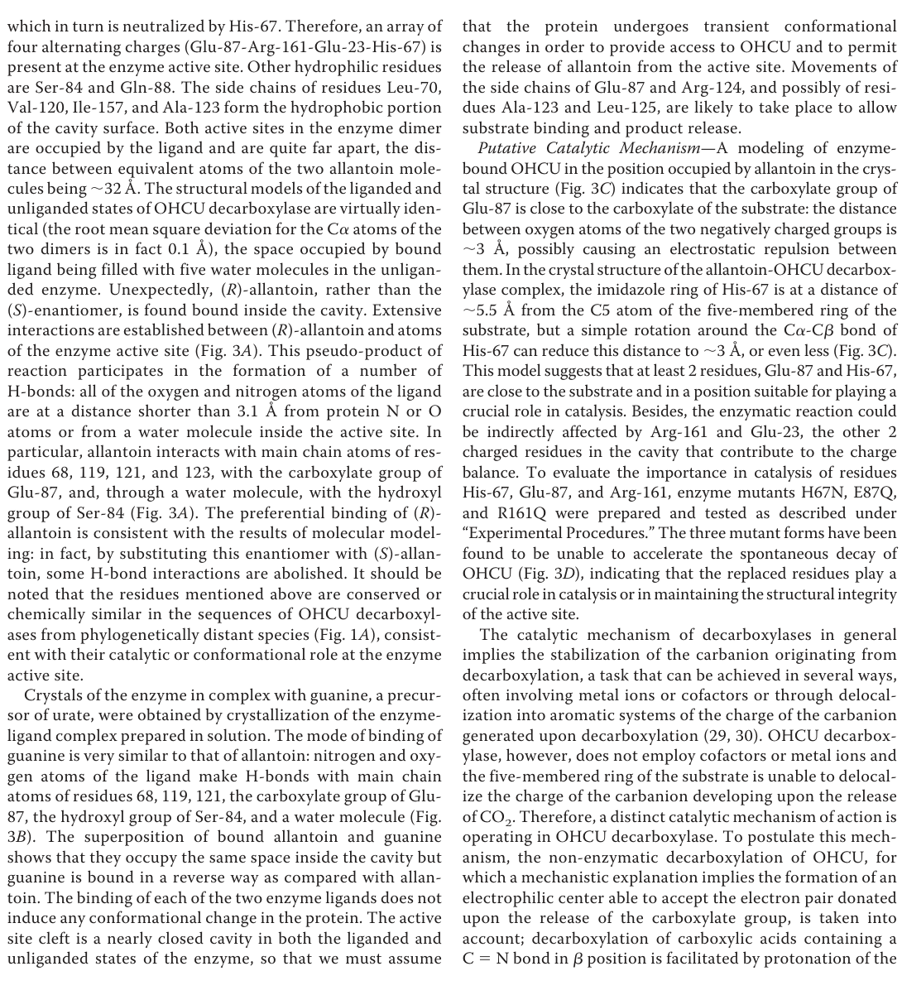

## Question

# Gene Research for Functional Annotation

## ⚠️ CRITICAL: Gene/Protein Identification Context

**BEFORE YOU BEGIN RESEARCH:** You MUST verify you are researching the CORRECT gene/protein. Gene symbols can be ambiguous, especially for less well-characterized genes from non-model organisms.

### Target Gene/Protein Identity (from UniProt):
- **UniProt Accession:** A1L259
- **Protein Description:** RecName: Full=2-oxo-4-hydroxy-4-carboxy-5-ureidoimidazoline decarboxylase; Short=OHCU decarboxylase; EC=4.1.1.97; AltName: Full=Parahox neighbor; AltName: Full=Ureidoimidazoline (2-oxo-4-hydroxy-4-carboxy-5-) decarboxylase;
- **Gene Information:** Name=urad; Synonyms=prhoxnb; ORFNames=zgc:158663;
- **Organism (full):** Danio rerio (Zebrafish) (Brachydanio rerio).
- **Protein Family:** Belongs to the OHCU decarboxylase family. .
- **Key Domains:** OHCU_decarboxylase. (IPR018020); OHCU_decarboxylase-1. (IPR017580); OHCU_decarboxylase_sf. (IPR036778); OHCU_decarbox (PF09349)

### MANDATORY VERIFICATION STEPS:

1. **Check if the gene symbol "urad" matches the protein description above**
2. **Verify the organism is correct:** Danio rerio (Zebrafish) (Brachydanio rerio).
3. **Check if protein family/domains align with what you find in literature**
4. **If you find literature for a DIFFERENT gene with the same or similar symbol, STOP**

### If Gene Symbol is Ambiguous or You Cannot Find Relevant Literature:

**DO NOT PROCEED WITH RESEARCH ON A DIFFERENT GENE.** Instead:
- State clearly: "The gene symbol 'urad' is ambiguous or literature is limited for this specific protein"
- Explain what you found (e.g., "Found extensive literature on a different gene with the same symbol in a different organism")
- Describe the protein based ONLY on the UniProt information provided above
- Suggest that the protein function can be inferred from domain/family information

### Research Target:

Please provide a comprehensive research report on the gene **urad** (gene ID: urad, UniProt: A1L259) in DANRE.

The research report should be a detailed narrative explaining the function, biological processes, and localization of the gene product. Citations should be given for all claims.

You should prioritize authoritative reviews and primary scientific literature when conducting research. You can supplement
this with annotations you find in gene/protein databases, but these can be outdated or inaccurate.

We are specifically interested in the primary function of the gene - for enzymes, what reaction is catalyzed, and what is the substrate specificity? For transporters, what is the substrate? For structural proteins or adapters, what is the broader structural role? For signaling molecules, what is the role in the pathway.

We are interested in where in or outside the cell the gene product carries out its function.

We are also interested in the signaling or biochemical pathways in which the gene functions. We are less interested in broad pleiotropic effects, except where these elucidate the precise role.

Include evidence where possible. We are interested in both experimental evidence as well as inference from structure, evolution, or bioinformatic analysis. Precise studies should be prioritized over high-throughput, where available.

## Output

Question: You are an expert researcher providing comprehensive, well-cited information.

Provide detailed information focusing on:
1. Key concepts and definitions with current understanding
2. Recent developments and latest research (prioritize 2023-2024 sources)
3. Current applications and real-world implementations
4. Expert opinions and analysis from authoritative sources
5. Relevant statistics and data from recent studies

Format as a comprehensive research report with proper citations. Include URLs and publication dates where available.
Always prioritize recent, authoritative sources and provide specific citations for all major claims.

# Gene Research for Functional Annotation

## ⚠️ CRITICAL: Gene/Protein Identification Context

**BEFORE YOU BEGIN RESEARCH:** You MUST verify you are researching the CORRECT gene/protein. Gene symbols can be ambiguous, especially for less well-characterized genes from non-model organisms.

### Target Gene/Protein Identity (from UniProt):
- **UniProt Accession:** A1L259
- **Protein Description:** RecName: Full=2-oxo-4-hydroxy-4-carboxy-5-ureidoimidazoline decarboxylase; Short=OHCU decarboxylase; EC=4.1.1.97; AltName: Full=Parahox neighbor; AltName: Full=Ureidoimidazoline (2-oxo-4-hydroxy-4-carboxy-5-) decarboxylase;
- **Gene Information:** Name=urad; Synonyms=prhoxnb; ORFNames=zgc:158663;
- **Organism (full):** Danio rerio (Zebrafish) (Brachydanio rerio).
- **Protein Family:** Belongs to the OHCU decarboxylase family. .
- **Key Domains:** OHCU_decarboxylase. (IPR018020); OHCU_decarboxylase-1. (IPR017580); OHCU_decarboxylase_sf. (IPR036778); OHCU_decarbox (PF09349)

### MANDATORY VERIFICATION STEPS:

1. **Check if the gene symbol "urad" matches the protein description above**
2. **Verify the organism is correct:** Danio rerio (Zebrafish) (Brachydanio rerio).
3. **Check if protein family/domains align with what you find in literature**
4. **If you find literature for a DIFFERENT gene with the same or similar symbol, STOP**

### If Gene Symbol is Ambiguous or You Cannot Find Relevant Literature:

**DO NOT PROCEED WITH RESEARCH ON A DIFFERENT GENE.** Instead:
- State clearly: "The gene symbol 'urad' is ambiguous or literature is limited for this specific protein"
- Explain what you found (e.g., "Found extensive literature on a different gene with the same symbol in a different organism")
- Describe the protein based ONLY on the UniProt information provided above
- Suggest that the protein function can be inferred from domain/family information

### Research Target:

Please provide a comprehensive research report on the gene **urad** (gene ID: urad, UniProt: A1L259) in DANRE.

The research report should be a detailed narrative explaining the function, biological processes, and localization of the gene product. Citations should be given for all claims.

You should prioritize authoritative reviews and primary scientific literature when conducting research. You can supplement
this with annotations you find in gene/protein databases, but these can be outdated or inaccurate.

We are specifically interested in the primary function of the gene - for enzymes, what reaction is catalyzed, and what is the substrate specificity? For transporters, what is the substrate? For structural proteins or adapters, what is the broader structural role? For signaling molecules, what is the role in the pathway.

We are interested in where in or outside the cell the gene product carries out its function.

We are also interested in the signaling or biochemical pathways in which the gene functions. We are less interested in broad pleiotropic effects, except where these elucidate the precise role.

Include evidence where possible. We are interested in both experimental evidence as well as inference from structure, evolution, or bioinformatic analysis. Precise studies should be prioritized over high-throughput, where available.

# Research Report: Functional Annotation of zebrafish **urad** (UniProt A1L259) — OHCU decarboxylase (EC 4.1.1.97)

## 0) Scope, identity verification, and limitations
The research target is the zebrafish (*Danio rerio*) gene **urad**, encoding **2-oxo-4-hydroxy-4-carboxy-5-ureidoimidazoline decarboxylase** (OHCU decarboxylase; **EC 4.1.1.97**). The retrieved primary literature explicitly studies **zebrafish OHCU decarboxylase (Urad)** biochemically and structurally, and a zebrafish peroxisome study explicitly tests **DrUrad** targeting/localization, matching the UniProt functional description of A1L259. (cendron2007thestructureof pages 1-2, kamoshita2022insightsintothe pages 14-15)

A key remaining limitation is that the retrieved full texts do **not** explicitly mention UniProt accession **A1L259** or the zebrafish gene synonyms **prhoxnb / zgc:158663**; thus, this report verifies identity at the level of *organism + enzyme name + biochemical function* rather than direct accession-string mapping. (cendron2007thestructureof pages 1-2, kamoshita2022insightsintothe pages 14-15)

## 1) Key concepts and current understanding (definitions and biochemical context)
### 1.1 Definition: what is Urad/OHCU decarboxylase?
**Urad (OHCU decarboxylase)** is an enzyme that catalyzes the **decarboxylation** of the urate-oxidation intermediate **OHCU (2-oxo-4-hydroxy-4-carboxy-5-ureidoimidazoline)** to yield **allantoin** (with release of CO2). In animals, it is the **third enzyme** in the classic three-step uricolysis pathway converting **urate → (S)-allantoin**. (doniselli2015theidentificationof pages 1-3, cendron2007thestructureof pages 1-2)

### 1.2 Pathway placement: urate degradation (uricolysis) to allantoin
In vivo urate degradation proceeds through **three consecutive enzymes**:
1) **Urate oxidase (Uox/uricase)**: urate → **5-hydroxyisourate (HIU)**
2) **HIU hydrolase (Urah/HIUase)**: HIU → **OHCU**
3) **OHCU decarboxylase (Urad)**: OHCU → **allantoin**
This organization is reiterated across primary sources and is visualized in the pathway scheme from the zebrafish Urad structure paper. (doniselli2015theidentificationof pages 1-3, cendron2007thestructureof media 1fb1cd9a)

### 1.3 Why Urad is needed: intermediate instability and stereochemistry control
The intermediates **HIU and OHCU are metastable**, with reported half-lives of **7.2 min** and **9.6 min** under physiological conditions. This chemical instability helps explain why coupling Uox with downstream enzymes is biologically important. (doniselli2015theidentificationof pages 1-3)

A central functional consequence is **stereochemical control**: in vitro, uncoupled reactions can yield **racemic allantoin**, whereas in vivo the enzymatic pathway produces the biologically relevant **dextrorotatory (S)-allantoin**. Urad is part of the enzymatic system enforcing stereospecific product formation. (doniselli2015theidentificationof pages 1-3, cendron2007thestructureof pages 1-2)

## 2) Molecular function: reaction chemistry, substrate specificity, and mechanism
### 2.1 Reaction catalyzed and substrate specificity
The zebrafish enzyme characterized structurally catalyzes the final uricolysis step: **OHCU decarboxylation** to produce **allantoin** and CO2. (cendron2007thestructureof pages 1-2)

Functionally, Urad is specific to the uricolysis intermediate **OHCU** (formed by Urah from HIU). Unlike many decarboxylases, it acts **without metal ions or organic cofactors**, consistent with a specialized, cofactorless uricolysis enzyme. (cendron2007thestructureof pages 7-8, cendron2007thestructureof pages 8-8)

### 2.2 Catalytic mechanism and key residues (structure-guided understanding)
High-resolution structural and mutational analysis of zebrafish OHCU decarboxylase supports a cofactor-free mechanism in which:
- **Glu87** is positioned to **destabilize the substrate carboxylate** (electrostatic repulsion), facilitating CO2 release.
- **His67** is proposed to act as a **proton donor** in a step that controls **stereoselective formation** of (S)-allantoin.
- **Arg161** is required for activity, consistent with an essential positively charged environment and interactions in the active-site network.
In functional assays, **H67N, E87Q, and R161Q mutants** did not accelerate OHCU decay, supporting essential catalytic roles. (cendron2007thestructureof pages 7-8, cendron2007thestructureof pages 8-8)

The active site is described as a nearly closed cavity with an alternating charged-residue array (including His67 and Glu87) and additional hydrophilic/hydrophobic contacts, consistent with precise positioning needed for stereochemical control. (cendron2007thestructureof pages 7-8)

### 2.3 Ligand binding observations in the zebrafish enzyme structures
Crystal structures include complexes with **(R)-allantoin** and **guanine**. (R)-allantoin (from a racemic soaking mixture) is observed bound in the active site and forms multiple hydrogen bonds; guanine binds in a similar pocket but in reverse orientation. These ligands were used as substrate/product analogs to probe recognition and mechanism. (cendron2007thestructureof pages 4-5, cendron2007thestructureof pages 7-8)

## 3) Protein structure: domains/fold and oligomeric state
Zebrafish OHCU decarboxylase (Urad) is a **homodimer**; each monomer comprises **ten α-helices** grouped into two domains, forming a **novel fold** (no similarity to previously known protein structures at the time of publication). The dimer contains two active sites separated by approximately **32 Å**. (cendron2007thestructureof pages 1-2, cendron2007thestructureof pages 7-8)

Crystallographic details supporting the high confidence of the structural model include:
- **1.8 Å** resolution native dataset
- Representative refinement statistics **R ≈ 0.199**, **Rfree ≈ 0.242**
- Reported PDB codes **2O70, 2O73, 2O74**
These data underlie the mechanistic proposals for His67/Glu87/Arg161. (cendron2007thestructureof pages 4-5, cendron2007thestructureof pages 2-3)

A pathway scheme and structure/active-site figure panels are available from the same source, showing (i) the uricolysis reaction sequence and (ii) the active-site architecture with the implicated residues. (cendron2007thestructureof media 1fb1cd9a, cendron2007thestructureof media e3a302fd)

## 4) Subcellular localization in zebrafish and cellular context
### 4.1 Peroxisome association of uricolysis
In animals, uricolysis is classically described as a **peroxisomal** pathway, consistent with the oxidative chemistry of Uox and H2O2 handling. (marchetti2016catalysisandstructure pages 1-2, doniselli2015theidentificationof pages 1-3)

### 4.2 Zebrafish Urad targeting: weak but functional PTS1
A zebrafish peroxisome inventory study tested peroxisomal targeting motifs and specifically reports that **D. rerio Urad** has a predicted weak PTS1 (**TKL**) and that EGFP reporter experiments showed **predominantly cytoplasmic localization** with **additional peroxisomal labeling**, indicating the motif is **weak but functional**. (kamoshita2022insightsintothe pages 14-15)

This result is important for functional annotation because it supports a model where Urad can access the peroxisomal compartment (consistent with uricolysis), yet may not be exclusively peroxisomal in zebrafish, potentially reflecting species-specific targeting efficiency. (kamoshita2022insightsintothe pages 14-15)

## 5) Recent developments and current research (prioritizing 2023–2024)
### 5.1 2023 expert synthesis: evolutionary context and gene loss patterns
A 2023 *Molecular Biology and Evolution* study emphasizes that in apes the truncation of purine degradation followed **Uox pseudogenization**, and that the downstream enzymes **Urah and Urad** also underwent pseudogenization through inactivating mutations (coding sequences and promoters), with convergent loss patterns also noted in other lineages. This provides up-to-date expert context for why uricolysis (and thus Urad activity) is retained in many vertebrates (including fish) but missing in humans. (mori2023cysteineenrichmentmediates pages 3-4)

### 5.2 2024 literature availability constraint
Within the tool-retrieved corpus, 2024 items directly focused on **OHCU decarboxylase/Urad** in zebrafish were not identified. Consequently, the most recent mechanistic/structural Urad evidence in this report is foundational (2007), complemented by 2022 localization and 2023 evolutionary synthesis. (cendron2007thestructureof pages 1-2, kamoshita2022insightsintothe pages 14-15, mori2023cysteineenrichmentmediates pages 3-4)

## 6) Current applications and real-world implementations
### 6.1 Clinical/therapeutic relevance of the uricolysis pathway
Although Urad itself is not widely deployed as a standalone therapeutic enzyme, it is part of the **complete uricolysis enzyme set** that underpins enzyme-therapy concepts for hyperuricemia.

Primary sources explicitly describe clinical use of **urate oxidase** (Uox) for severe hyperuricemia (including prevention/treatment of tumor lysis syndrome-associated hyperuricemia) and for refractory gout, framing the translational importance of the pathway. (doniselli2015theidentificationof pages 1-3, marchetti2016catalysisandstructure pages 1-2)

### 6.2 Need for downstream enzymes (Urah + Urad) in “full pathway” therapy
A key application-oriented idea is that **restoring the full pathway** beyond Uox may require inclusion of downstream enzymes (**Urah and Urad**) to avoid accumulation of unstable or potentially harmful intermediates and to complete conversion to allantoin. This rationale is developed in work on multifunctional enzyme therapeutics. (oh2018diatomallantoinsynthase pages 1-4)

### 6.3 Fusion proteins and multifunctional enzyme therapeutics (biotechnology)
A 2018 ACS Chemical Biology study reports a high-resolution structure (1.85 Å) of a **natural fusion protein** (“allantoin synthase”) found in diatoms that combines activities complementing **two human uricolysis pseudogenes** (Urah and Urad), and discusses **PEGylation** strategies and manufacturing advantages for multifunctional enzyme therapy. This provides an applied framework in which Urad activity is treated as a necessary module for therapeutic uricolysis systems. (oh2018diatomallantoinsynthase pages 1-4, oh2018diatomallantoinsynthase pages 19-21)

### 6.4 Engineering and safety considerations (H2O2 and compartmentalization)
Work identifying alternative urate oxidases underscores that canonical soluble Uox generates H2O2, which is a concern for therapeutic administration and helps motivate interest in pathway compartmentalization and alternative enzyme architectures. While this is centered on Uox, it provides system-level justification for considering complete pathway design (including Urad). (doniselli2015theidentificationof pages 1-3)

## 7) Statistics and quantitative data highlights (recent studies and key primary sources)
Key quantitative points relevant to functional annotation include:
- **Intermediate half-lives:** HIU **7.2 min**, OHCU **9.6 min** under physiological conditions. (doniselli2015theidentificationof pages 1-3)
- **Zebrafish Urad structure:** **1.8 Å** resolution; representative **R ≈ 0.199 / Rfree ≈ 0.242**; active sites ~**32 Å** apart; PDB **2O70/2O73/2O74**. (cendron2007thestructureof pages 4-5, cendron2007thestructureof pages 7-8, cendron2007thestructureof pages 2-3)
- **Localization motif:** zebrafish Urad predicted weak PTS1 = **TKL**, experimentally weak-but-functional peroxisomal targeting. (kamoshita2022insightsintothe pages 14-15)
- **Pathway-related zebrafish enzyme metrics (context):** zebrafish Urah specific activity reported as **230 ± 6 μmol·min⁻1·mg⁻1**, and a zebrafish Uox mutation (F216S) increased KM from **11 μM → 280 μM** with kcat ~4 s⁻1 unchanged; these values contextualize the kinetic tuning of the upstream pathway segment that supplies Urad’s substrate (OHCU). (marchetti2016catalysisandstructure pages 4-5)

## 8) Evidence summary table
The following table compacts the core functional-annotation claims and quantitative values with their source URLs.

| Topic | Key findings | Quantitative details | Key sources (year, journal) and URLs |
|---|---|---|---|
| Identity | The target in retrieved literature matches zebrafish Urad, the OHCU decarboxylase (EC 4.1.1.97) that catalyzes the final enzymatic step of urate degradation to allantoin; evidence is specific to *Danio rerio* OHCU decarboxylase rather than a different “urad” gene. (cendron2007thestructureof pages 1-2, kamoshita2022insightsintothe pages 14-15) | Enzyme class: decarboxylase; organism: *Danio rerio*. | Cendron et al., 2007, *Journal of Biological Chemistry* — https://doi.org/10.1074/jbc.m701297200; Kamoshita et al., 2022, *Frontiers in Physiology* — https://doi.org/10.3389/fphys.2022.822509 |
| Reaction | Urad catalyzes decarboxylation of 2-oxo-4-hydroxy-4-carboxy-5-ureidoimidazoline (OHCU) to allantoin, releasing CO2; this is the last step after urate oxidase and HIU hydrolase. (doniselli2015theidentificationof pages 1-3, cendron2007thestructureof pages 1-2) | Reaction sequence: urate → HIU → OHCU → allantoin. | Doniselli et al., 2015, *Scientific Reports* — https://doi.org/10.1038/srep13798; Cendron et al., 2007, *Journal of Biological Chemistry* — https://doi.org/10.1074/jbc.m701297200 |
| Pathway step | In animals, Urad is the third enzyme of the uricolytic pathway that converts poorly soluble urate into more soluble allantoin; the pathway is generally associated with peroxisomes. (marchetti2016catalysisandstructure pages 1-2, doniselli2015theidentificationof pages 1-3) | Third step of a 3-enzyme pathway. | Marchetti et al., 2016, *Scientific Reports* — https://doi.org/10.1038/srep38302; Doniselli et al., 2015, *Scientific Reports* — https://doi.org/10.1038/srep13798 |
| Substrate/product stereochemistry | Enzymatic uricolysis yields biologically relevant (S)-allantoin stereoselectively, whereas spontaneous uncatalyzed decay of intermediates leads to racemic allantoin; zebrafish Urad is implicated in enforcing this stereochemistry. In crystal soaking, (R)-allantoin was observed bound as a ligand analog in the active site. (doniselli2015theidentificationof pages 1-3, cendron2007thestructureof pages 1-2, cendron2007thestructureof pages 7-8, cendron2007thestructureof pages 8-8) | Product stereochemistry: (S)-allantoin; ligand observed in structure: (R)-allantoin. | Doniselli et al., 2015, *Scientific Reports* — https://doi.org/10.1038/srep13798; Cendron et al., 2007, *Journal of Biological Chemistry* — https://doi.org/10.1074/jbc.m701297200 |
| Mechanism / key residues | Structural and mutational evidence supports a cofactor-free decarboxylation mechanism. His67 is proposed to donate the proton that determines stereoselective product formation; Glu87 likely destabilizes the substrate carboxylate and promotes CO2 release; Arg161 is also required for activity. Mutants H67N, E87Q, and R161Q failed to accelerate OHCU decay. (cendron2007thestructureof pages 1-2, cendron2007thestructureof pages 7-8, cendron2007thestructureof pages 8-8) | Key residues: His67, Glu87, Arg161; no metal ions or cofactors required. | Cendron et al., 2007, *Journal of Biological Chemistry* — https://doi.org/10.1074/jbc.m701297200 |
| Structure stats | Zebrafish OHCU decarboxylase is a homodimer with a novel all-α fold; each monomer contains 10 α-helices organized into two domains. Structures were solved for apo enzyme and ligand complexes; the two active sites are separated by ~32 Å. (cendron2007thestructureof pages 1-2, cendron2007thestructureof pages 7-8, cendron2007thestructureof pages 4-5, cendron2007thestructureof pages 3-4) | Resolution: 1.8 Å; PDB entries: 2O70, 2O73, 2O74; active-site separation: ~32 Å; native refinement: R = 0.199, Rfree = 0.242; crystal space group P32 with 3 dimers/asymmetric unit. | Cendron et al., 2007, *Journal of Biological Chemistry* — https://doi.org/10.1074/jbc.m701297200 |
| Localization / PTS1 | In zebrafish, Urad carries a weak but functional C-terminal PTS1 motif (TKL). Reporter assays showed mainly cytoplasmic localization with some peroxisomal labeling, indicating partial/weak peroxisomal targeting rather than strict exclusion from peroxisomes. (kamoshita2022insightsintothe pages 14-15, kamoshita2022insightsintothe pages 3-4) | PTS1 motif: TKL; localization: predominantly cytoplasmic with detectable peroxisomal targeting. | Kamoshita et al., 2022, *Frontiers in Physiology* — https://doi.org/10.3389/fphys.2022.822509 |
| Intermediate stability data | The upstream intermediates HIU and OHCU are chemically unstable, explaining why coupling with Urah and Urad is important for efficient, stereospecific flux to allantoin in vivo. (doniselli2015theidentificationof pages 1-3) | Half-life of HIU: 7.2 min; half-life of OHCU: 9.6 min under physiological conditions. | Doniselli et al., 2015, *Scientific Reports* — https://doi.org/10.1038/srep13798 |
| Therapeutic / application relevance | Urad itself is not a current clinical drug, but it is part of the full uricolysis pathway that underpins enzyme-therapy concepts for hyperuricemia, gout, tumor lysis syndrome, and Lesch-Nyhan disease. Authors argue that downstream enzymes including Urah and Urad are important to avoid toxic intermediate accumulation; engineered fusion proteins combining Urah+Urad activities and PEGylation strategies have been proposed to support multifunctional enzyme therapy. (oh2018diatomallantoinsynthase pages 1-4, oh2018diatomallantoinsynthase pages 19-21, doniselli2015theidentificationof pages 1-3, cendron2007thestructureof pages 1-2) | Clinical context includes approved/used urate oxidases (rasburicase, pegloticase); natural fusion protein structure reported at 1.85 Å in diatoms for therapeutic design context. | Oh et al., 2018, *ACS Chemical Biology* — https://doi.org/10.1021/acschembio.8b00404; Doniselli et al., 2015, *Scientific Reports* — https://doi.org/10.1038/srep13798; Cendron et al., 2007, *Journal of Biological Chemistry* — https://doi.org/10.1074/jbc.m701297200 |

*Table: This table summarizes the experimentally supported functional annotation of zebrafish Urad/OHCU decarboxylase, including its reaction, pathway role, mechanism, structure, localization, and translational relevance. It is useful as a compact evidence map linking key claims to specific primary sources and URLs.*

## 9) Visual evidence from primary structure paper
Key figure/scheme panels from the zebrafish Urad structure paper include (i) the uricolysis pathway schematic and (ii) active-site/ligand-binding views identifying the mechanistically implicated residues (His67/Glu87/Arg161) as well as overall fold/dimer arrangement. (cendron2007thestructureof media 1fb1cd9a, cendron2007thestructureof media e3a302fd)

## 10) Practical functional annotation (concise)
**Primary molecular function:** OHCU decarboxylase converting OHCU → (S)-allantoin + CO2 in the urate degradation pathway. (doniselli2015theidentificationof pages 1-3, cendron2007thestructureof pages 1-2)

**Biological process:** Uric acid degradation/uricolysis; contributes to nitrogen handling and conversion of poorly soluble urate into more soluble allantoin in species retaining uricolysis. (doniselli2015theidentificationof pages 1-3, marchetti2016catalysisandstructure pages 1-2)

**Cellular component/localization:** Predominantly cytosolic with **partial peroxisomal** targeting mediated by a weak-but-functional **PTS1 (TKL)** in zebrafish; pathway-level association with peroxisomes is consistent with uricolysis organization in animals. (kamoshita2022insightsintothe pages 14-15, marchetti2016catalysisandstructure pages 1-2)

**Mechanistic residues:** His67 (proton donation/stereocontrol), Glu87 (promotes decarboxylation via carboxylate destabilization), Arg161 (required). (cendron2007thestructureof pages 7-8, cendron2007thestructureof pages 8-8)

## References (URLs and publication dates)
- Cendron L. et al. *Journal of Biological Chemistry* (2007-06). “The Structure of 2-Oxo-4-hydroxy-4-carboxy-5-ureidoimidazoline Decarboxylase Provides Insights into the Mechanism of Uric Acid Degradation.” https://doi.org/10.1074/jbc.m701297200 (cendron2007thestructureof pages 1-2)
- Doniselli N. et al. *Scientific Reports* (2015-09). “The identification of an integral membrane, cytochrome c urate oxidase completes the catalytic repertoire of a therapeutic enzyme.” https://doi.org/10.1038/srep13798 (doniselli2015theidentificationof pages 1-3)
- Marchetti M. et al. *Scientific Reports* (2016-12). “Catalysis and Structure of Zebrafish Urate Oxidase Provide Insights into the Origin of Hyperuricemia in Hominoids.” https://doi.org/10.1038/srep38302 (marchetti2016catalysisandstructure pages 1-2)
- Kamoshita M. et al. *Frontiers in Physiology* (2022-02). “Insights Into the Peroxisomal Protein Inventory of Zebrafish.” https://doi.org/10.3389/fphys.2022.822509 (kamoshita2022insightsintothe pages 14-15)
- Mori G. et al. *Molecular Biology and Evolution* (2023-06). “Cysteine Enrichment Mediates Co-Option of Uricase in Reptilian Skin and Transition to Uricotelism.” https://doi.org/10.1093/molbev/msad200 (mori2023cysteineenrichmentmediates pages 3-4)
- Oh J. et al. *ACS Chemical Biology* (2018-06). “Diatom Allantoin Synthase Provides Structural Insights into Natural Fusion Protein Therapeutics.” https://doi.org/10.1021/acschembio.8b00404 (oh2018diatomallantoinsynthase pages 1-4)

References

1. (cendron2007thestructureof pages 1-2): Laura Cendron, Rodolfo Berni, Claudia Folli, Ileana Ramazzina, Riccardo Percudani, and Giuseppe Zanotti. The structure of 2-oxo-4-hydroxy-4-carboxy-5-ureidoimidazoline decarboxylase provides insights into the mechanism of uric acid degradation*. Journal of Biological Chemistry, 282:18182-18189, Jun 2007. URL: https://doi.org/10.1074/jbc.m701297200, doi:10.1074/jbc.m701297200. This article has 55 citations and is from a domain leading peer-reviewed journal.

2. (kamoshita2022insightsintothe pages 14-15): Maki Kamoshita, Rechal Kumar, Marco Anteghini, Markus Kunze, Markus Islinger, Vítor Martins dos Santos, and Michael Schrader. Insights into the peroxisomal protein inventory of zebrafish. Frontiers in Physiology, Feb 2022. URL: https://doi.org/10.3389/fphys.2022.822509, doi:10.3389/fphys.2022.822509. This article has 17 citations.

3. (doniselli2015theidentificationof pages 1-3): Nicola Doniselli, Enrico Monzeglio, Alessandro Dal Palù, Angelo Merli, and Riccardo Percudani. The identification of an integral membrane, cytochrome c urate oxidase completes the catalytic repertoire of a therapeutic enzyme. Scientific Reports, Sep 2015. URL: https://doi.org/10.1038/srep13798, doi:10.1038/srep13798. This article has 28 citations and is from a peer-reviewed journal.

4. (cendron2007thestructureof media 1fb1cd9a): Laura Cendron, Rodolfo Berni, Claudia Folli, Ileana Ramazzina, Riccardo Percudani, and Giuseppe Zanotti. The structure of 2-oxo-4-hydroxy-4-carboxy-5-ureidoimidazoline decarboxylase provides insights into the mechanism of uric acid degradation*. Journal of Biological Chemistry, 282:18182-18189, Jun 2007. URL: https://doi.org/10.1074/jbc.m701297200, doi:10.1074/jbc.m701297200. This article has 55 citations and is from a domain leading peer-reviewed journal.

5. (cendron2007thestructureof pages 7-8): Laura Cendron, Rodolfo Berni, Claudia Folli, Ileana Ramazzina, Riccardo Percudani, and Giuseppe Zanotti. The structure of 2-oxo-4-hydroxy-4-carboxy-5-ureidoimidazoline decarboxylase provides insights into the mechanism of uric acid degradation*. Journal of Biological Chemistry, 282:18182-18189, Jun 2007. URL: https://doi.org/10.1074/jbc.m701297200, doi:10.1074/jbc.m701297200. This article has 55 citations and is from a domain leading peer-reviewed journal.

6. (cendron2007thestructureof pages 8-8): Laura Cendron, Rodolfo Berni, Claudia Folli, Ileana Ramazzina, Riccardo Percudani, and Giuseppe Zanotti. The structure of 2-oxo-4-hydroxy-4-carboxy-5-ureidoimidazoline decarboxylase provides insights into the mechanism of uric acid degradation*. Journal of Biological Chemistry, 282:18182-18189, Jun 2007. URL: https://doi.org/10.1074/jbc.m701297200, doi:10.1074/jbc.m701297200. This article has 55 citations and is from a domain leading peer-reviewed journal.

7. (cendron2007thestructureof pages 4-5): Laura Cendron, Rodolfo Berni, Claudia Folli, Ileana Ramazzina, Riccardo Percudani, and Giuseppe Zanotti. The structure of 2-oxo-4-hydroxy-4-carboxy-5-ureidoimidazoline decarboxylase provides insights into the mechanism of uric acid degradation*. Journal of Biological Chemistry, 282:18182-18189, Jun 2007. URL: https://doi.org/10.1074/jbc.m701297200, doi:10.1074/jbc.m701297200. This article has 55 citations and is from a domain leading peer-reviewed journal.

8. (cendron2007thestructureof pages 2-3): Laura Cendron, Rodolfo Berni, Claudia Folli, Ileana Ramazzina, Riccardo Percudani, and Giuseppe Zanotti. The structure of 2-oxo-4-hydroxy-4-carboxy-5-ureidoimidazoline decarboxylase provides insights into the mechanism of uric acid degradation*. Journal of Biological Chemistry, 282:18182-18189, Jun 2007. URL: https://doi.org/10.1074/jbc.m701297200, doi:10.1074/jbc.m701297200. This article has 55 citations and is from a domain leading peer-reviewed journal.

9. (cendron2007thestructureof media e3a302fd): Laura Cendron, Rodolfo Berni, Claudia Folli, Ileana Ramazzina, Riccardo Percudani, and Giuseppe Zanotti. The structure of 2-oxo-4-hydroxy-4-carboxy-5-ureidoimidazoline decarboxylase provides insights into the mechanism of uric acid degradation*. Journal of Biological Chemistry, 282:18182-18189, Jun 2007. URL: https://doi.org/10.1074/jbc.m701297200, doi:10.1074/jbc.m701297200. This article has 55 citations and is from a domain leading peer-reviewed journal.

10. (marchetti2016catalysisandstructure pages 1-2): Marialaura Marchetti, Anastasia Liuzzi, Beatrice Fermi, Romina Corsini, Claudia Folli, Valentina Speranzini, Francesco Gandolfi, Stefano Bettati, Luca Ronda, Laura Cendron, Rodolfo Berni, Giuseppe Zanotti, and Riccardo Percudani. Catalysis and structure of zebrafish urate oxidase provide insights into the origin of hyperuricemia in hominoids. Scientific Reports, Dec 2016. URL: https://doi.org/10.1038/srep38302, doi:10.1038/srep38302. This article has 30 citations and is from a peer-reviewed journal.

11. (mori2023cysteineenrichmentmediates pages 3-4): Giulia Mori, Anastasia Liuzzi, Luca Ronda, Michele Di Palma, Magda S. Chegkazi, Soi Bui, Mitla Garcia-Maya, Jasmine Ragazzini, Marco Malatesta, Emanuele Della Monica, Claudio Rivetti, Parker Antin, Stefano Bettati, Roberto A. Steiner, and Riccardo Percudani. Cysteine enrichment mediates co-option of uricase in reptilian skin and transition to uricotelism. Molecular Biology and Evolution, Jun 2023. URL: https://doi.org/10.1093/molbev/msad200, doi:10.1093/molbev/msad200. This article has 10 citations and is from a highest quality peer-reviewed journal.

12. (oh2018diatomallantoinsynthase pages 1-4): Juntaek Oh, Anastasia Liuzzi, Luca Ronda, Marialaura Marchetti, Romina Corsini, Claudia Folli, Stefano Bettati, Sangkee Rhee, and Riccardo Percudani. Diatom allantoin synthase provides structural insights into natural fusion protein therapeutics. ACS chemical biology, 13 8:2237-2246, Jun 2018. URL: https://doi.org/10.1021/acschembio.8b00404, doi:10.1021/acschembio.8b00404. This article has 6 citations and is from a domain leading peer-reviewed journal.

13. (oh2018diatomallantoinsynthase pages 19-21): Juntaek Oh, Anastasia Liuzzi, Luca Ronda, Marialaura Marchetti, Romina Corsini, Claudia Folli, Stefano Bettati, Sangkee Rhee, and Riccardo Percudani. Diatom allantoin synthase provides structural insights into natural fusion protein therapeutics. ACS chemical biology, 13 8:2237-2246, Jun 2018. URL: https://doi.org/10.1021/acschembio.8b00404, doi:10.1021/acschembio.8b00404. This article has 6 citations and is from a domain leading peer-reviewed journal.

14. (marchetti2016catalysisandstructure pages 4-5): Marialaura Marchetti, Anastasia Liuzzi, Beatrice Fermi, Romina Corsini, Claudia Folli, Valentina Speranzini, Francesco Gandolfi, Stefano Bettati, Luca Ronda, Laura Cendron, Rodolfo Berni, Giuseppe Zanotti, and Riccardo Percudani. Catalysis and structure of zebrafish urate oxidase provide insights into the origin of hyperuricemia in hominoids. Scientific Reports, Dec 2016. URL: https://doi.org/10.1038/srep38302, doi:10.1038/srep38302. This article has 30 citations and is from a peer-reviewed journal.

15. (cendron2007thestructureof pages 3-4): Laura Cendron, Rodolfo Berni, Claudia Folli, Ileana Ramazzina, Riccardo Percudani, and Giuseppe Zanotti. The structure of 2-oxo-4-hydroxy-4-carboxy-5-ureidoimidazoline decarboxylase provides insights into the mechanism of uric acid degradation*. Journal of Biological Chemistry, 282:18182-18189, Jun 2007. URL: https://doi.org/10.1074/jbc.m701297200, doi:10.1074/jbc.m701297200. This article has 55 citations and is from a domain leading peer-reviewed journal.

16. (kamoshita2022insightsintothe pages 3-4): Maki Kamoshita, Rechal Kumar, Marco Anteghini, Markus Kunze, Markus Islinger, Vítor Martins dos Santos, and Michael Schrader. Insights into the peroxisomal protein inventory of zebrafish. Frontiers in Physiology, Feb 2022. URL: https://doi.org/10.3389/fphys.2022.822509, doi:10.3389/fphys.2022.822509. This article has 17 citations.

## Artifacts

- [Edison artifact artifact-00](urad-deep-research-falcon_artifacts/artifact-00.md)

## Citations

1. doniselli2015theidentificationof pages 1-3
2. cendron2007thestructureof pages 1-2
3. cendron2007thestructureof pages 7-8
4. kamoshita2022insightsintothe pages 14-15
5. mori2023cysteineenrichmentmediates pages 3-4
6. oh2018diatomallantoinsynthase pages 1-4
7. marchetti2016catalysisandstructure pages 4-5
8. marchetti2016catalysisandstructure pages 1-2
9. cendron2007thestructureof pages 8-8
10. cendron2007thestructureof pages 4-5
11. cendron2007thestructureof pages 2-3
12. oh2018diatomallantoinsynthase pages 19-21
13. cendron2007thestructureof pages 3-4
14. kamoshita2022insightsintothe pages 3-4
15. https://doi.org/10.1074/jbc.m701297200;
16. https://doi.org/10.3389/fphys.2022.822509
17. https://doi.org/10.1038/srep13798;
18. https://doi.org/10.1074/jbc.m701297200
19. https://doi.org/10.1038/srep38302;
20. https://doi.org/10.1038/srep13798
21. https://doi.org/10.1021/acschembio.8b00404;
22. https://doi.org/10.1038/srep38302
23. https://doi.org/10.1093/molbev/msad200
24. https://doi.org/10.1021/acschembio.8b00404
25. https://doi.org/10.1074/jbc.m701297200,
26. https://doi.org/10.3389/fphys.2022.822509,
27. https://doi.org/10.1038/srep13798,
28. https://doi.org/10.1038/srep38302,
29. https://doi.org/10.1093/molbev/msad200,
30. https://doi.org/10.1021/acschembio.8b00404,