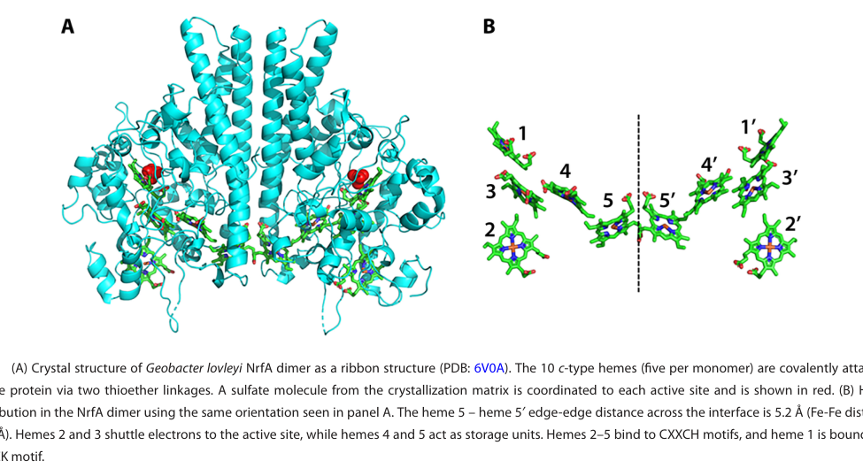

## Question

# Gene Research for Functional Annotation

## ⚠️ CRITICAL: Gene/Protein Identification Context

**BEFORE YOU BEGIN RESEARCH:** You MUST verify you are researching the CORRECT gene/protein. Gene symbols can be ambiguous, especially for less well-characterized genes from non-model organisms.

### Target Gene/Protein Identity (from UniProt):
- **UniProt Accession:** Q6ARF1
- **Protein Description:** RecName: Full=Cytochrome c-552 {ECO:0000255|HAMAP-Rule:MF_01182}; EC=1.7.2.2 {ECO:0000255|HAMAP-Rule:MF_01182}; AltName: Full=Ammonia-forming cytochrome c nitrite reductase {ECO:0000255|HAMAP-Rule:MF_01182}; Short=Cytochrome c nitrite reductase {ECO:0000255|HAMAP-Rule:MF_01182}; Flags: Precursor;
- **Gene Information:** Name=nrfA {ECO:0000255|HAMAP-Rule:MF_01182}; OrderedLocusNames=DP0344;
- **Organism (full):** Desulfotalea psychrophila (strain LSv54 / DSM 12343).
- **Protein Family:** Belongs to the cytochrome c-552 family. {ECO:0000255|HAMAP-
- **Key Domains:** Cyt_c552. (IPR003321); Cyt_c_NO2Rdtase_formate-dep. (IPR017570); Multihaem_cyt_sf. (IPR036280); Cytochrom_C552 (PF02335)

### MANDATORY VERIFICATION STEPS:

1. **Check if the gene symbol "nrfA" matches the protein description above**
2. **Verify the organism is correct:** Desulfotalea psychrophila (strain LSv54 / DSM 12343).
3. **Check if protein family/domains align with what you find in literature**
4. **If you find literature for a DIFFERENT gene with the same or similar symbol, STOP**

### If Gene Symbol is Ambiguous or You Cannot Find Relevant Literature:

**DO NOT PROCEED WITH RESEARCH ON A DIFFERENT GENE.** Instead:
- State clearly: "The gene symbol 'nrfA' is ambiguous or literature is limited for this specific protein"
- Explain what you found (e.g., "Found extensive literature on a different gene with the same symbol in a different organism")
- Describe the protein based ONLY on the UniProt information provided above
- Suggest that the protein function can be inferred from domain/family information

### Research Target:

Please provide a comprehensive research report on the gene **nrfA** (gene ID: nrfA, UniProt: Q6ARF1) in DESPS.

The research report should be a detailed narrative explaining the function, biological processes, and localization of the gene product. Citations should be given for all claims.

You should prioritize authoritative reviews and primary scientific literature when conducting research. You can supplement
this with annotations you find in gene/protein databases, but these can be outdated or inaccurate.

We are specifically interested in the primary function of the gene - for enzymes, what reaction is catalyzed, and what is the substrate specificity? For transporters, what is the substrate? For structural proteins or adapters, what is the broader structural role? For signaling molecules, what is the role in the pathway.

We are interested in where in or outside the cell the gene product carries out its function.

We are also interested in the signaling or biochemical pathways in which the gene functions. We are less interested in broad pleiotropic effects, except where these elucidate the precise role.

Include evidence where possible. We are interested in both experimental evidence as well as inference from structure, evolution, or bioinformatic analysis. Precise studies should be prioritized over high-throughput, where available.

## Output

Question: You are an expert researcher providing comprehensive, well-cited information.

Provide detailed information focusing on:
1. Key concepts and definitions with current understanding
2. Recent developments and latest research (prioritize 2023-2024 sources)
3. Current applications and real-world implementations
4. Expert opinions and analysis from authoritative sources
5. Relevant statistics and data from recent studies

Format as a comprehensive research report with proper citations. Include URLs and publication dates where available.
Always prioritize recent, authoritative sources and provide specific citations for all major claims.

# Gene Research for Functional Annotation

## ⚠️ CRITICAL: Gene/Protein Identification Context

**BEFORE YOU BEGIN RESEARCH:** You MUST verify you are researching the CORRECT gene/protein. Gene symbols can be ambiguous, especially for less well-characterized genes from non-model organisms.

### Target Gene/Protein Identity (from UniProt):
- **UniProt Accession:** Q6ARF1
- **Protein Description:** RecName: Full=Cytochrome c-552 {ECO:0000255|HAMAP-Rule:MF_01182}; EC=1.7.2.2 {ECO:0000255|HAMAP-Rule:MF_01182}; AltName: Full=Ammonia-forming cytochrome c nitrite reductase {ECO:0000255|HAMAP-Rule:MF_01182}; Short=Cytochrome c nitrite reductase {ECO:0000255|HAMAP-Rule:MF_01182}; Flags: Precursor;
- **Gene Information:** Name=nrfA {ECO:0000255|HAMAP-Rule:MF_01182}; OrderedLocusNames=DP0344;
- **Organism (full):** Desulfotalea psychrophila (strain LSv54 / DSM 12343).
- **Protein Family:** Belongs to the cytochrome c-552 family. {ECO:0000255|HAMAP-
- **Key Domains:** Cyt_c552. (IPR003321); Cyt_c_NO2Rdtase_formate-dep. (IPR017570); Multihaem_cyt_sf. (IPR036280); Cytochrom_C552 (PF02335)

### MANDATORY VERIFICATION STEPS:

1. **Check if the gene symbol "nrfA" matches the protein description above**
2. **Verify the organism is correct:** Desulfotalea psychrophila (strain LSv54 / DSM 12343).
3. **Check if protein family/domains align with what you find in literature**
4. **If you find literature for a DIFFERENT gene with the same or similar symbol, STOP**

### If Gene Symbol is Ambiguous or You Cannot Find Relevant Literature:

**DO NOT PROCEED WITH RESEARCH ON A DIFFERENT GENE.** Instead:
- State clearly: "The gene symbol 'nrfA' is ambiguous or literature is limited for this specific protein"
- Explain what you found (e.g., "Found extensive literature on a different gene with the same symbol in a different organism")
- Describe the protein based ONLY on the UniProt information provided above
- Suggest that the protein function can be inferred from domain/family information

### Research Target:

Please provide a comprehensive research report on the gene **nrfA** (gene ID: nrfA, UniProt: Q6ARF1) in DESPS.

The research report should be a detailed narrative explaining the function, biological processes, and localization of the gene product. Citations should be given for all claims.

You should prioritize authoritative reviews and primary scientific literature when conducting research. You can supplement
this with annotations you find in gene/protein databases, but these can be outdated or inaccurate.

We are specifically interested in the primary function of the gene - for enzymes, what reaction is catalyzed, and what is the substrate specificity? For transporters, what is the substrate? For structural proteins or adapters, what is the broader structural role? For signaling molecules, what is the role in the pathway.

We are interested in where in or outside the cell the gene product carries out its function.

We are also interested in the signaling or biochemical pathways in which the gene functions. We are less interested in broad pleiotropic effects, except where these elucidate the precise role.

Include evidence where possible. We are interested in both experimental evidence as well as inference from structure, evolution, or bioinformatic analysis. Precise studies should be prioritized over high-throughput, where available.

## Research report: functional annotation of **nrfA** (UniProt **Q6ARF1**; locus **DP0344**) in *Desulfotalea psychrophila* LSv54 (DSM 12343)

### Executive summary
The target gene product (UniProt Q6ARF1; *nrfA*; DP0344) is annotated as an ammonia-forming cytochrome **c-552** nitrite reductase (EC **1.7.2.2**) in *Desulfotalea psychrophila* LSv54, belonging to the multiheme cytochrome c552/NrfA family (user-provided UniProt context; summarized in | Topic | Claim | Evidence type | Support |
|---|---|---|---|
| Target identity | UniProt Q6ARF1 corresponds to **nrfA / DP0344** in **Desulfotalea psychrophila strain LSv54 (DSM 12343)** | Organism-specific (user-provided UniProt context) | User-provided UniProt context |
| Protein name | Q6ARF1 is annotated as **cytochrome c-552**; alternative names include **ammonia-forming cytochrome c nitrite reductase** and **cytochrome c nitrite reductase** | Organism-specific (user-provided UniProt context) | User-provided UniProt context |
| Enzyme class | Q6ARF1 is annotated with **EC 1.7.2.2** | Organism-specific (user-provided UniProt context) | User-provided UniProt context |
| Family/domain assignment | Q6ARF1 belongs to the **cytochrome c-552 family** and carries domains/signatures **IPR003321, IPR017570, IPR036280, PF02335** | Organism-specific (user-provided UniProt context) | User-provided UniProt context |
| Ambiguity check | Literature support for **Desulfotalea psychrophila LSv54 nrfA/DP0344** is sparse; available retrieved papers largely support **general NrfA biology** rather than direct characterization of Q6ARF1 | Mixed; direct organism-specific evidence limited | (thorup2017disguisedasa pages 7-8) |
| Core reaction | NrfA enzymes catalyze **nitrite → ammonium** as part of DNRA; the reaction is a **six-electron, eight-proton reduction** | General NrfA property | (hird2025fromgenesto pages 1-3, hird2025fromgenesto pages 15-15) |
| Cellular localization | NrfA is typically a **soluble periplasmic** multiheme **c-type cytochrome** | General NrfA property | (hird2025fromgenesto pages 3-5, hird2025fromgenesto pages 1-3, hird2025fromgenesto pages 13-15) |
| Heme architecture | Canonical NrfA is usually **pentaheme**; solved structures crystallize as **dimers** with **five hemes per monomer** | General NrfA property | (hird2025fromgenesto pages 1-3, hird2025fromgenesto media 8c8fd690) |
| Active-site motif | The catalytic heme (heme 1) commonly uses a **CXXCK** motif with **proximal Lys** ligation; hemes 2-5 usually use **CXXCH** motifs and are **bis-His ligated** | General NrfA property | (hird2025fromgenesto pages 3-5, hird2025fromgenesto pages 1-3) |
| Catalytic residues/cofactor | Conserved **Arg/Tyr/His** second-sphere residues help bind/activate nitrite; many NrfAs contain a nearby **Ca2+** required for activity, although some lineages replace this with **Arg** | General NrfA property | (hird2025fromgenesto pages 3-5) |
| Electron-transfer partners | Known redox partners include **NrfH** (membrane quinol dehydrogenase), **NrfB** (periplasmic multiheme electron shuttle linked to **NrfCD**), and in some taxa **CymA** | General NrfA property | (hird2025fromgenesto pages 3-5, hird2025fromgenesto pages 15-16) |
| Operon organization | Common genetic organizations include **nrfHA** and **nrfABCDEFG** operons; visual summary of these operon types is provided in the recent review figures/tables | General NrfA property | (hird2025fromgenesto pages 11-13, hird2025fromgenesto media 8c8fd690, hird2025fromgenesto media 9a2cca05, hird2025fromgenesto media 8addf68d) |
| Functional role | NrfA is central to **dissimilatory nitrate reduction to ammonium (DNRA)**, helping retain fixed nitrogen in ecosystems | General NrfA property | (hird2025fromgenesto pages 1-3) |
| Quantitative note | Some characterized NrfA enzymes show **very high activity**, with reported specific activities **>1,000 mol NO2- s^-1 per mol NrfA** | General NrfA property | (hird2025fromgenesto pages 1-3) |
| Comparative-genomics note for DESPS | **Desulfotalea psychrophila LSv54** was included as a reference genome in comparative work that also analyzed **nrfA** phylogeny, but the retrieved excerpt does **not** provide direct DP0344/Q6ARF1 functional or operon details | Organism-specific but indirect | (thorup2017disguisedasa pages 7-8) |

*Table: This table separates what is directly confirmed for the target protein Q6ARF1 from the user-provided UniProt context versus what is supported only by broader NrfA literature. It is useful for keeping organism-specific annotation distinct from general inference when direct Desulfotalea psychrophila evidence is limited.*). Family-level evidence indicates NrfA enzymes are periplasmic, multiheme c-type cytochromes that catalyze **nitrite (NO2−) → ammonium (NH4+)** as the second step of **DNRA** (dissimilatory nitrate reduction to ammonium), receiving electrons from membrane quinols via redox partners such as **NrfH**, **NrfB/NrfCD**, or in some lineages **CymA**. (hird2025fromgenesto pages 1-3, hird2025fromgenesto pages 3-5)

Direct, strain-specific primary literature for DP0344/Q6ARF1 (operon context, measured activity, physiology in LSv54) was not accessible in this session; thus, this report separates **confirmed target identity** from **conservative inference** based on authoritative NrfA literature. (thorup2017disguisedasa pages 7-8)

> Evidence limitation: a key organism-specific source for *Desulfotalea psychrophila* LSv54—the 2004 genome paper—was identified during search but was not obtainable in-session, so direct confirmation of the DP0344/*nrfA* locus, neighborhood, regulation, and physiology from the primary genome report could not be checked here; the accessible evidence only shows that *D. psychrophila* LSv54 was included as a comparative reference genome in later work that also analyzed *nrfA* phylogeny. (thorup2017disguisedasa pages 7-8)
>
> As a result, confidence is high that Q6ARF1 belongs to the canonical NrfA/cytochrome c-552 ammonia-forming nitrite reductase family, but confidence is lower for DESPS-specific details such as exact operon structure, electron-transfer partner usage, and experimentally demonstrated physiological role in strain LSv54. (hird2025fromgenesto pages 3-5, hird2025fromgenesto pages 1-3)
>
> Therefore, the most defensible annotation is a conservative one: Q6ARF1 should be described primarily from the UniProt-linked identity plus well-supported family-level NrfA properties, while any finer statements about localization partners, pathway context, or regulation in *D. psychrophila* should be labeled as inference rather than direct strain-specific evidence. (hird2025fromgenesto pages 3-5, hird2025fromgenesto pages 13-15, thorup2017disguisedasa pages 7-8)

*Blockquote: This blockquote summarizes the main source limitations affecting annotation of Q6ARF1 in *Desulfotalea psychrophila* LSv54. It is useful for distinguishing high-confidence family-level inference from lower-confidence strain-specific claims.*

---

## 1) Key concepts and definitions (current understanding)

### 1.1 DNRA (dissimilatory nitrate reduction to ammonium)
DNRA is a respiratory nitrogen transformation that reduces nitrate/nitrite to ammonium, retaining fixed nitrogen in ecosystems. In many bacteria, the **nitrite-to-ammonium** step is catalyzed by **NrfA** (ammonia-forming cytochrome c nitrite reductase). (hird2025fromgenesto pages 1-3)

In wastewater metagenome literature, DNRA is described as being primarily catalyzed by either **nrfA** (a periplasmic cytochrome c enzyme) or **nirB** (a soluble siroheme-containing nitrite reductase), emphasizing that multiple biochemical solutions exist for nitrite-to-ammonium reduction. (schacksen2024unravelingthegenetic pages 1-2)

### 1.2 NrfA / cytochrome c552 nitrite reductase (ammonia-forming nitrite reductase)
NrfA is a soluble **periplasmic** multiheme **c-type cytochrome** that catalyzes the reduction of nitrite to ammonium. Mechanistically, this is a **six-electron, eight-proton** reduction at a single active site. (hird2025fromgenesto pages 1-3)

NrfA is classically a **pentaheme** cytochrome (five c-type hemes per monomer) and is commonly observed as a **dimer** in solved structures. (hird2025fromgenesto pages 1-3)

### 1.3 Electron transfer partners and genetic systems
Because NrfA is periplasmic and receives electrons ultimately derived from the membrane quinone pool, it typically requires a redox partner system. Documented partner architectures include:
- **NrfH**: a membrane-anchored c-type cytochrome quinol dehydrogenase that can deliver electrons directly to NrfA. (hird2025fromgenesto pages 1-3, hird2025fromgenesto pages 15-16)
- **NrfB + NrfCD**: NrfCD forms a membrane complex (NrfD: multi-pass TM protein; NrfC: iron–sulfur protein) that transfers electrons from quinol to the periplasmic multiheme carrier NrfB, which can then reduce NrfA. (hird2025fromgenesto pages 3-5)
- **CymA** (in some taxa, e.g., *Shewanella*): a membrane-associated tetraheme cytochrome that can serve as a quinol oxidase feeding periplasmic reductases, including nitrite respiration systems. (hird2025fromgenesto pages 15-16)

Common operon organizations include **nrfHA** and larger **nrfABCDEFG** loci, as summarized visually in the NrfA review figures. (hird2025fromgenesto media 9a2cca05, hird2025fromgenesto media 8addf68d)

---

## 2) Verified identity and disambiguation for the DESPS target

### 2.1 Target gene/protein corresponds to NrfA-family ammonia-forming nitrite reductase
The user-provided UniProt record defines Q6ARF1 in *Desulfotalea psychrophila* LSv54 as **cytochrome c-552 / ammonia-forming cytochrome c nitrite reductase** (EC 1.7.2.2), gene name **nrfA**, ordered locus **DP0344**, and membership in the cytochrome c552 family with multiheme cytochrome-related domain signatures (summarized in | Topic | Claim | Evidence type | Support |
|---|---|---|---|
| Target identity | UniProt Q6ARF1 corresponds to **nrfA / DP0344** in **Desulfotalea psychrophila strain LSv54 (DSM 12343)** | Organism-specific (user-provided UniProt context) | User-provided UniProt context |
| Protein name | Q6ARF1 is annotated as **cytochrome c-552**; alternative names include **ammonia-forming cytochrome c nitrite reductase** and **cytochrome c nitrite reductase** | Organism-specific (user-provided UniProt context) | User-provided UniProt context |
| Enzyme class | Q6ARF1 is annotated with **EC 1.7.2.2** | Organism-specific (user-provided UniProt context) | User-provided UniProt context |
| Family/domain assignment | Q6ARF1 belongs to the **cytochrome c-552 family** and carries domains/signatures **IPR003321, IPR017570, IPR036280, PF02335** | Organism-specific (user-provided UniProt context) | User-provided UniProt context |
| Ambiguity check | Literature support for **Desulfotalea psychrophila LSv54 nrfA/DP0344** is sparse; available retrieved papers largely support **general NrfA biology** rather than direct characterization of Q6ARF1 | Mixed; direct organism-specific evidence limited | (thorup2017disguisedasa pages 7-8) |
| Core reaction | NrfA enzymes catalyze **nitrite → ammonium** as part of DNRA; the reaction is a **six-electron, eight-proton reduction** | General NrfA property | (hird2025fromgenesto pages 1-3, hird2025fromgenesto pages 15-15) |
| Cellular localization | NrfA is typically a **soluble periplasmic** multiheme **c-type cytochrome** | General NrfA property | (hird2025fromgenesto pages 3-5, hird2025fromgenesto pages 1-3, hird2025fromgenesto pages 13-15) |
| Heme architecture | Canonical NrfA is usually **pentaheme**; solved structures crystallize as **dimers** with **five hemes per monomer** | General NrfA property | (hird2025fromgenesto pages 1-3, hird2025fromgenesto media 8c8fd690) |
| Active-site motif | The catalytic heme (heme 1) commonly uses a **CXXCK** motif with **proximal Lys** ligation; hemes 2-5 usually use **CXXCH** motifs and are **bis-His ligated** | General NrfA property | (hird2025fromgenesto pages 3-5, hird2025fromgenesto pages 1-3) |
| Catalytic residues/cofactor | Conserved **Arg/Tyr/His** second-sphere residues help bind/activate nitrite; many NrfAs contain a nearby **Ca2+** required for activity, although some lineages replace this with **Arg** | General NrfA property | (hird2025fromgenesto pages 3-5) |
| Electron-transfer partners | Known redox partners include **NrfH** (membrane quinol dehydrogenase), **NrfB** (periplasmic multiheme electron shuttle linked to **NrfCD**), and in some taxa **CymA** | General NrfA property | (hird2025fromgenesto pages 3-5, hird2025fromgenesto pages 15-16) |
| Operon organization | Common genetic organizations include **nrfHA** and **nrfABCDEFG** operons; visual summary of these operon types is provided in the recent review figures/tables | General NrfA property | (hird2025fromgenesto pages 11-13, hird2025fromgenesto media 8c8fd690, hird2025fromgenesto media 9a2cca05, hird2025fromgenesto media 8addf68d) |
| Functional role | NrfA is central to **dissimilatory nitrate reduction to ammonium (DNRA)**, helping retain fixed nitrogen in ecosystems | General NrfA property | (hird2025fromgenesto pages 1-3) |
| Quantitative note | Some characterized NrfA enzymes show **very high activity**, with reported specific activities **>1,000 mol NO2- s^-1 per mol NrfA** | General NrfA property | (hird2025fromgenesto pages 1-3) |
| Comparative-genomics note for DESPS | **Desulfotalea psychrophila LSv54** was included as a reference genome in comparative work that also analyzed **nrfA** phylogeny, but the retrieved excerpt does **not** provide direct DP0344/Q6ARF1 functional or operon details | Organism-specific but indirect | (thorup2017disguisedasa pages 7-8) |

*Table: This table separates what is directly confirmed for the target protein Q6ARF1 from the user-provided UniProt context versus what is supported only by broader NrfA literature. It is useful for keeping organism-specific annotation distinct from general inference when direct Desulfotalea psychrophila evidence is limited.*).

### 2.2 Evidence of gene-name ambiguity and how it was handled
*nrfA* is broadly used across bacteria for ammonia-forming cytochrome c nitrite reductase. In the retrieved literature, *nrfA* is consistently used in this sense (DNRA nitrite-to-ammonium enzyme), supporting that the DESPS target name aligns with its functional class. (hird2025fromgenesto pages 1-3, schacksen2024unravelingthegenetic pages 1-2)

No evidence in the retrieved corpus suggested that *nrfA* in *Desulfotalea psychrophila* LSv54 refers to a different, non-homologous gene; however, direct LSv54-specific biochemical/genetic validation was not available here. (thorup2017disguisedasa pages 7-8)

---

## 3) Functional annotation of Q6ARF1 (DP0344) based on NrfA-family evidence

### 3.1 Primary biochemical function and substrate specificity (high-confidence family-level inference)
**Reaction catalyzed:** NrfA catalyzes reduction of **nitrite (NO2−) to ammonium (NH4+)**. (hird2025fromgenesto pages 1-3, hird2025fromgenesto pages 3-5)

**Stoichiometry/mechanism:** The reaction is described as a **six-electron, eight-proton** reduction at a single catalytic site (heme 1). (hird2025fromgenesto pages 1-3)

**Substrate specificity:** The core physiological substrate is nitrite (NO2−). The catalytic architecture is specialized for nitrite binding/activation via conserved second-sphere residues (Arg/Tyr/His) adjacent to the active-site heme. (hird2025fromgenesto pages 3-5)

### 3.2 Cofactors, domains, and catalytic architecture
**Cofactors:** NrfA is a multiheme **c-type cytochrome** (typically **five c-type hemes** per monomer). (hird2025fromgenesto pages 1-3, hird2025fromgenesto pages 3-5)

**Heme-binding motifs:** In canonical NrfA, hemes 2–5 are commonly bound via **CXXCH** motifs and are six-coordinate bis-His ligated, while the catalytic heme 1 often uses a **CXXCK** motif with proximal Lys coordination and a five-coordinate geometry that allows substrate access. (hird2025fromgenesto pages 3-5, hird2025fromgenesto pages 1-3)

**Additional conserved features:** Many NrfA enzymes contain a **Ca2+** near the active site required for activity in many homologs; some lineages replace this role with an Arg residue. (hird2025fromgenesto pages 3-5)

A representative NrfA dimer structure with heme arrangement is shown in a review figure (used here as a mechanistic reference for the family). (hird2025fromgenesto media 8c8fd690)

### 3.3 Cellular localization (high-confidence family-level inference)
NrfA is described as a **soluble periplasmic** cytochrome, consistent with its function receiving electrons from the membrane quinol pool via periplasm-facing redox partners. (hird2025fromgenesto pages 1-3, hird2025fromgenesto pages 3-5)

For Q6ARF1 in *D. psychrophila* LSv54, direct localization experiments were not found in the retrieved corpus; the periplasmic localization is therefore inferred from family-level characterization and the cytochrome c maturation logic (c-type heme attachment and export to the periplasm). (hird2025fromgenesto pages 13-15)

### 3.4 Likely pathway context in *D. psychrophila* LSv54
Given its annotation as NrfA (EC 1.7.2.2), Q6ARF1 most plausibly functions in the **DNRA nitrite ammonification** step (NO2− → NH4+). (hird2025fromgenesto pages 1-3, schacksen2024unravelingthegenetic pages 1-2)

However, whether LSv54 uses NrfA primarily for energy conservation via DNRA versus ancillary roles (e.g., nitrosative stress detoxification described for some sulfate reducers) could not be determined from the accessible strain-specific literature in this session. (hird2025fromgenesto pages 13-15, thorup2017disguisedasa pages 7-8)

---

## 4) Recent developments (prioritizing 2023–2024 sources) relevant to NrfA annotation

### 4.1 2024: Wastewater MAG survey highlights DNRA genetic prevalence and co-occurrence
Schacksen & Nielsen (Applied and Environmental Microbiology; **Sep 2024**; https://doi.org/10.1128/aem.02177-23) analyzed **1,083** high-quality MAGs from **23** full-scale wastewater treatment plants and reported **237/1,083** MAGs contained genes for the **complete DNRA pathway**; they also observed that DNRA/assimilatory nitrate reduction genes frequently co-occurred with **nosZ** (N2O reductase), suggesting potential coupling/compatibility between ammonification potential and N2O consumption potential in WWTP communities. (schacksen2024unravelingthegenetic pages 4-7)

They summarize DNRA as being primarily catalyzed by **nrfA** (periplasmic cytochrome c nitrite reductase) or **nirB** (siroheme nitrite reductase), reinforcing that nrfA-based ammonification remains a major functional marker in environmental genomics. (schacksen2024unravelingthegenetic pages 1-2)

### 4.2 2024: NrfA in nitrate/nitrite respiration linked to Fe(II) oxidation in *Shewanella*
Hou et al. (Microorganisms; **Nov 2024**; https://doi.org/10.3390/microorganisms12122454) describe NrfA in *Shewanella oneidensis* MR-1 reducing nitrite to ammonium within nitrate/nitrite respiration, in a system where nitrite production during nitrate reduction contributes to chemical and biological Fe(II) oxidation processes (NRFO), with the Mtr electron transfer pathway implicated in coupling electron flow. While not DESPS-specific, this is a contemporary example of NrfA’s integration into broader redox networks beyond “standalone” DNRA. (hou2024biologicalandchemical pages 13-15)

### 4.3 2024: Discovery of noncanonical DNRA without NrfA underscores annotation caution
Egas et al. (mSystems; **Mar 2024**; https://doi.org/10.1128/msystems.00967-23) report an acidophilic sulfate reducer (*Acididesulfobacillus acetoxydans*) that performs DNRA but **lacks canonical NrfAH** and other known nitrite reductases, identifying alternative cytoplasmic reductases as candidates with strong multi-omics support and providing quantitative physiological constraints (e.g., growth inhibition when nitrite reaches ~0.8–1 mM). This demonstrates that DNRA phenotype does not strictly require nrfA and that genome-based annotation should consider alternative architectures in some lineages. (egas2024anovelmechanism pages 2-5, egas2024anovelmechanism pages 5-7)

---

## 5) Current applications and real-world implementations

### 5.1 Wastewater treatment microbiomes and nitrogen management
Metagenome-centric monitoring of DNRA potential in WWTPs uses *nrfA* as a key functional marker. In the Danish WWTP MAG set, complete DNRA genetic capacity was found in **237/1,083** MAGs, indicating DNRA potential is common in engineered wastewater ecosystems. (schacksen2024unravelingthegenetic pages 4-7)

These findings are relevant to process control because DNRA retains nitrogen as ammonium (potentially beneficial for ammonia recovery strategies, but potentially undesirable if ammonia must be removed), and because DNRA organisms may overlap genomically with N2O-reduction potential (nosZ co-occurrence). (schacksen2024unravelingthegenetic pages 1-2, schacksen2024unravelingthegenetic pages 4-7)

### 5.2 Biogeochemical modeling and redox-coupled processes
The 2024 *Shewanella* study frames NrfA-linked nitrite reduction to ammonium within coupled iron–nitrogen transformations, relevant to sediment/soil redox cycling and remediation contexts. (hou2024biologicalandchemical pages 13-15)

---

## 6) Expert opinion and authoritative synthesis (mechanistic consensus)
A recent authoritative review (Hird et al., Applied and Environmental Microbiology; **Jul 2025**; https://doi.org/10.1128/aem.00292-25) summarizes the current consensus that NrfA is a periplasmic pentaheme cytochrome catalyzing nitrite ammonification (six-electron/eight-proton reaction) with conserved structural motifs and lineage-dependent electron-transfer partner systems (NrfH, NrfB/NrfCD, CymA). (hird2025fromgenesto pages 1-3, hird2025fromgenesto pages 3-5)

The same review provides comparative visual summaries of (i) NrfA dimer/heme arrangement, (ii) nrf operon organizations, and (iii) a table-level synthesis of operon/regulator patterns across organisms—useful as a framework for annotating Q6ARF1 once LSv54 genomic neighborhood can be inspected. (hird2025fromgenesto media 8c8fd690, hird2025fromgenesto media 9a2cca05, hird2025fromgenesto media 8addf68d)

---

## 7) Quantitative statistics and data points from recent studies

### 7.1 Enzymology-relevant quantitative point (family-level)
Some characterized NrfA enzymes exhibit very high catalytic activity, with reported specific activities **>1,000 mol NO2− s−1 per mol NrfA** (note: enzyme- and condition-dependent). (hird2025fromgenesto pages 1-3)

### 7.2 Environmental/engineering prevalence (2024 WWTP genomics)
In the Schacksen & Nielsen WWTP MAG dataset (Sep 2024): **237/1,083** MAGs contained genes for the complete DNRA pathway, and **527/1,083 (48.7%)** MAGs harbored *nosZ*. (schacksen2024unravelingthegenetic pages 4-7)

### 7.3 DNRA physiology without NrfA (2024 primary physiology)
In *A. acetoxydans* (Mar 2024), which lacks NrfAH, resting cells reduced **1 mM nitrate to ammonia in ~9 h** and reduced **0.5 mM hydroxylamine to ammonia in 3 h**; growth stalled when nitrite accumulated to **~0.8–1 mM**, and multiple candidate reductases were strongly upregulated by transcriptomics/proteomics under nitrate-reducing conditions. (egas2024anovelmechanism pages 2-5, egas2024anovelmechanism pages 5-7)

---

## 8) Practical, conservative annotation statement for Q6ARF1 (DP0344) in DESPS

**Recommended functional annotation (high confidence at family level):**
Q6ARF1 (DP0344; *nrfA*) encodes an ammonia-forming **cytochrome c552 nitrite reductase (NrfA)**, a periplasmic multiheme c-type enzyme catalyzing nitrite reduction to ammonium as part of DNRA (EC 1.7.2.2). (hird2025fromgenesto pages 1-3, hird2025fromgenesto pages 3-5)

**Recommended pathway/localization wording (explicitly inferred):**
The enzyme is expected to reside in the **periplasm** after cytochrome c maturation and to receive electrons from the membrane quinol pool via an NrfA partner system (e.g., NrfH or NrfB/NrfCD; partner identity in LSv54 should be validated by inspecting neighboring genes). (hird2025fromgenesto pages 3-5, hird2025fromgenesto pages 13-15)

**What cannot be concluded here (needs DESPS-specific genome/operon inspection or experiments):**
Exact operon organization (nrfHA vs nrfABCDEFG), the specific electron donor partner(s), and whether the primary physiological role in LSv54 is energy conservation via DNRA versus detoxification-oriented nitrite reduction were not directly supported by accessible LSv54-specific primary literature in this session. (thorup2017disguisedasa pages 7-8, hird2025fromgenesto pages 13-15)

---

## Appendix: consolidated claim map
| Topic | Claim | Evidence type | Support |
|---|---|---|---|
| Target identity | UniProt Q6ARF1 corresponds to **nrfA / DP0344** in **Desulfotalea psychrophila strain LSv54 (DSM 12343)** | Organism-specific (user-provided UniProt context) | User-provided UniProt context |
| Protein name | Q6ARF1 is annotated as **cytochrome c-552**; alternative names include **ammonia-forming cytochrome c nitrite reductase** and **cytochrome c nitrite reductase** | Organism-specific (user-provided UniProt context) | User-provided UniProt context |
| Enzyme class | Q6ARF1 is annotated with **EC 1.7.2.2** | Organism-specific (user-provided UniProt context) | User-provided UniProt context |
| Family/domain assignment | Q6ARF1 belongs to the **cytochrome c-552 family** and carries domains/signatures **IPR003321, IPR017570, IPR036280, PF02335** | Organism-specific (user-provided UniProt context) | User-provided UniProt context |
| Ambiguity check | Literature support for **Desulfotalea psychrophila LSv54 nrfA/DP0344** is sparse; available retrieved papers largely support **general NrfA biology** rather than direct characterization of Q6ARF1 | Mixed; direct organism-specific evidence limited | (thorup2017disguisedasa pages 7-8) |
| Core reaction | NrfA enzymes catalyze **nitrite → ammonium** as part of DNRA; the reaction is a **six-electron, eight-proton reduction** | General NrfA property | (hird2025fromgenesto pages 1-3, hird2025fromgenesto pages 15-15) |
| Cellular localization | NrfA is typically a **soluble periplasmic** multiheme **c-type cytochrome** | General NrfA property | (hird2025fromgenesto pages 3-5, hird2025fromgenesto pages 1-3, hird2025fromgenesto pages 13-15) |
| Heme architecture | Canonical NrfA is usually **pentaheme**; solved structures crystallize as **dimers** with **five hemes per monomer** | General NrfA property | (hird2025fromgenesto pages 1-3, hird2025fromgenesto media 8c8fd690) |
| Active-site motif | The catalytic heme (heme 1) commonly uses a **CXXCK** motif with **proximal Lys** ligation; hemes 2-5 usually use **CXXCH** motifs and are **bis-His ligated** | General NrfA property | (hird2025fromgenesto pages 3-5, hird2025fromgenesto pages 1-3) |
| Catalytic residues/cofactor | Conserved **Arg/Tyr/His** second-sphere residues help bind/activate nitrite; many NrfAs contain a nearby **Ca2+** required for activity, although some lineages replace this with **Arg** | General NrfA property | (hird2025fromgenesto pages 3-5) |
| Electron-transfer partners | Known redox partners include **NrfH** (membrane quinol dehydrogenase), **NrfB** (periplasmic multiheme electron shuttle linked to **NrfCD**), and in some taxa **CymA** | General NrfA property | (hird2025fromgenesto pages 3-5, hird2025fromgenesto pages 15-16) |
| Operon organization | Common genetic organizations include **nrfHA** and **nrfABCDEFG** operons; visual summary of these operon types is provided in the recent review figures/tables | General NrfA property | (hird2025fromgenesto pages 11-13, hird2025fromgenesto media 8c8fd690, hird2025fromgenesto media 9a2cca05, hird2025fromgenesto media 8addf68d) |
| Functional role | NrfA is central to **dissimilatory nitrate reduction to ammonium (DNRA)**, helping retain fixed nitrogen in ecosystems | General NrfA property | (hird2025fromgenesto pages 1-3) |
| Quantitative note | Some characterized NrfA enzymes show **very high activity**, with reported specific activities **>1,000 mol NO2- s^-1 per mol NrfA** | General NrfA property | (hird2025fromgenesto pages 1-3) |
| Comparative-genomics note for DESPS | **Desulfotalea psychrophila LSv54** was included as a reference genome in comparative work that also analyzed **nrfA** phylogeny, but the retrieved excerpt does **not** provide direct DP0344/Q6ARF1 functional or operon details | Organism-specific but indirect | (thorup2017disguisedasa pages 7-8) |

*Table: This table separates what is directly confirmed for the target protein Q6ARF1 from the user-provided UniProt context versus what is supported only by broader NrfA literature. It is useful for keeping organism-specific annotation distinct from general inference when direct Desulfotalea psychrophila evidence is limited.*

References

1. (thorup2017disguisedasa pages 7-8): Casper Thorup, Andreas Schramm, Alyssa J. Findlay, Kai W. Finster, and Lars Schreiber. Disguised as a sulfate reducer: growth of the deltaproteobacterium <i>desulfurivibrio alkaliphilus</i> by sulfide oxidation with nitrate. mBio, Sep 2017. URL: https://doi.org/10.1128/mbio.00671-17, doi:10.1128/mbio.00671-17. This article has 156 citations and is from a domain leading peer-reviewed journal.

2. (hird2025fromgenesto pages 1-3): Krystina Hird, Julius O. Campeciño, and Eric L. Hegg. From genes to function: regulation, maturation, and evolution of cytochrome <i>c</i> nitrite reductase in nitrate reduction to ammonium. Jul 2025. URL: https://doi.org/10.1128/aem.00292-25, doi:10.1128/aem.00292-25. This article has 6 citations and is from a peer-reviewed journal.

3. (hird2025fromgenesto pages 15-15): Krystina Hird, Julius O. Campeciño, and Eric L. Hegg. From genes to function: regulation, maturation, and evolution of cytochrome <i>c</i> nitrite reductase in nitrate reduction to ammonium. Jul 2025. URL: https://doi.org/10.1128/aem.00292-25, doi:10.1128/aem.00292-25. This article has 6 citations and is from a peer-reviewed journal.

4. (hird2025fromgenesto pages 3-5): Krystina Hird, Julius O. Campeciño, and Eric L. Hegg. From genes to function: regulation, maturation, and evolution of cytochrome <i>c</i> nitrite reductase in nitrate reduction to ammonium. Jul 2025. URL: https://doi.org/10.1128/aem.00292-25, doi:10.1128/aem.00292-25. This article has 6 citations and is from a peer-reviewed journal.

5. (hird2025fromgenesto pages 13-15): Krystina Hird, Julius O. Campeciño, and Eric L. Hegg. From genes to function: regulation, maturation, and evolution of cytochrome <i>c</i> nitrite reductase in nitrate reduction to ammonium. Jul 2025. URL: https://doi.org/10.1128/aem.00292-25, doi:10.1128/aem.00292-25. This article has 6 citations and is from a peer-reviewed journal.

6. (hird2025fromgenesto media 8c8fd690): Krystina Hird, Julius O. Campeciño, and Eric L. Hegg. From genes to function: regulation, maturation, and evolution of cytochrome <i>c</i> nitrite reductase in nitrate reduction to ammonium. Jul 2025. URL: https://doi.org/10.1128/aem.00292-25, doi:10.1128/aem.00292-25. This article has 6 citations and is from a peer-reviewed journal.

7. (hird2025fromgenesto pages 15-16): Krystina Hird, Julius O. Campeciño, and Eric L. Hegg. From genes to function: regulation, maturation, and evolution of cytochrome <i>c</i> nitrite reductase in nitrate reduction to ammonium. Jul 2025. URL: https://doi.org/10.1128/aem.00292-25, doi:10.1128/aem.00292-25. This article has 6 citations and is from a peer-reviewed journal.

8. (hird2025fromgenesto pages 11-13): Krystina Hird, Julius O. Campeciño, and Eric L. Hegg. From genes to function: regulation, maturation, and evolution of cytochrome <i>c</i> nitrite reductase in nitrate reduction to ammonium. Jul 2025. URL: https://doi.org/10.1128/aem.00292-25, doi:10.1128/aem.00292-25. This article has 6 citations and is from a peer-reviewed journal.

9. (hird2025fromgenesto media 9a2cca05): Krystina Hird, Julius O. Campeciño, and Eric L. Hegg. From genes to function: regulation, maturation, and evolution of cytochrome <i>c</i> nitrite reductase in nitrate reduction to ammonium. Jul 2025. URL: https://doi.org/10.1128/aem.00292-25, doi:10.1128/aem.00292-25. This article has 6 citations and is from a peer-reviewed journal.

10. (hird2025fromgenesto media 8addf68d): Krystina Hird, Julius O. Campeciño, and Eric L. Hegg. From genes to function: regulation, maturation, and evolution of cytochrome <i>c</i> nitrite reductase in nitrate reduction to ammonium. Jul 2025. URL: https://doi.org/10.1128/aem.00292-25, doi:10.1128/aem.00292-25. This article has 6 citations and is from a peer-reviewed journal.

11. (schacksen2024unravelingthegenetic pages 1-2): Patrick Skov Schacksen and Jeppe Lund Nielsen. Unraveling the genetic potential of nitrous oxide reduction in wastewater treatment: insights from metagenome-assembled genomes. Sep 2024. URL: https://doi.org/10.1128/aem.02177-23, doi:10.1128/aem.02177-23. This article has 15 citations and is from a peer-reviewed journal.

12. (schacksen2024unravelingthegenetic pages 4-7): Patrick Skov Schacksen and Jeppe Lund Nielsen. Unraveling the genetic potential of nitrous oxide reduction in wastewater treatment: insights from metagenome-assembled genomes. Sep 2024. URL: https://doi.org/10.1128/aem.02177-23, doi:10.1128/aem.02177-23. This article has 15 citations and is from a peer-reviewed journal.

13. (hou2024biologicalandchemical pages 13-15): Lingyu Hou, Xiangyu Bai, Zihe Sima, Jiani Zhang, Luyao Yan, Ding Li, and Yongguang Jiang. Biological and chemical processes of nitrate reduction and ferrous oxidation mediated by shewanella oneidensis mr-1. Microorganisms, 12:2454, Nov 2024. URL: https://doi.org/10.3390/microorganisms12122454, doi:10.3390/microorganisms12122454. This article has 6 citations.

14. (egas2024anovelmechanism pages 2-5): Reinier A. Egas, Julia M. Kurth, Sjef Boeren, Diana Z. Sousa, Cornelia U. Welte, and Irene Sánchez-Andrea. A novel mechanism for dissimilatory nitrate reduction to ammonium in <i>acididesulfobacillus acetoxydans</i>. mSystems, Mar 2024. URL: https://doi.org/10.1128/msystems.00967-23, doi:10.1128/msystems.00967-23. This article has 10 citations and is from a peer-reviewed journal.

15. (egas2024anovelmechanism pages 5-7): Reinier A. Egas, Julia M. Kurth, Sjef Boeren, Diana Z. Sousa, Cornelia U. Welte, and Irene Sánchez-Andrea. A novel mechanism for dissimilatory nitrate reduction to ammonium in <i>acididesulfobacillus acetoxydans</i>. mSystems, Mar 2024. URL: https://doi.org/10.1128/msystems.00967-23, doi:10.1128/msystems.00967-23. This article has 10 citations and is from a peer-reviewed journal.

## Artifacts

- [Edison artifact artifact-00](nrfA-deep-research-falcon_artifacts/artifact-00.md)
- [Edison artifact artifact-01](nrfA-deep-research-falcon_artifacts/artifact-01.md)

## Citations

1. thorup2017disguisedasa pages 7-8
2. hird2025fromgenesto pages 3-5
3. hird2025fromgenesto pages 1-3
4. schacksen2024unravelingthegenetic pages 1-2
5. hird2025fromgenesto pages 15-16
6. hird2025fromgenesto pages 13-15
7. schacksen2024unravelingthegenetic pages 4-7
8. hou2024biologicalandchemical pages 13-15
9. hird2025fromgenesto pages 15-15
10. hird2025fromgenesto pages 11-13
11. egas2024anovelmechanism pages 2-5
12. egas2024anovelmechanism pages 5-7
13. https://doi.org/10.1128/aem.02177-23
14. https://doi.org/10.3390/microorganisms12122454
15. https://doi.org/10.1128/msystems.00967-23
16. https://doi.org/10.1128/aem.00292-25
17. https://doi.org/10.1128/mbio.00671-17,
18. https://doi.org/10.1128/aem.00292-25,
19. https://doi.org/10.1128/aem.02177-23,
20. https://doi.org/10.3390/microorganisms12122454,
21. https://doi.org/10.1128/msystems.00967-23,