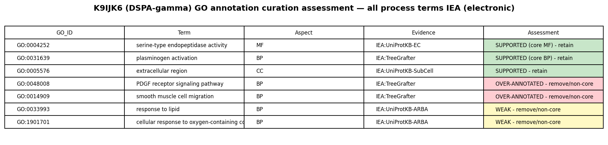
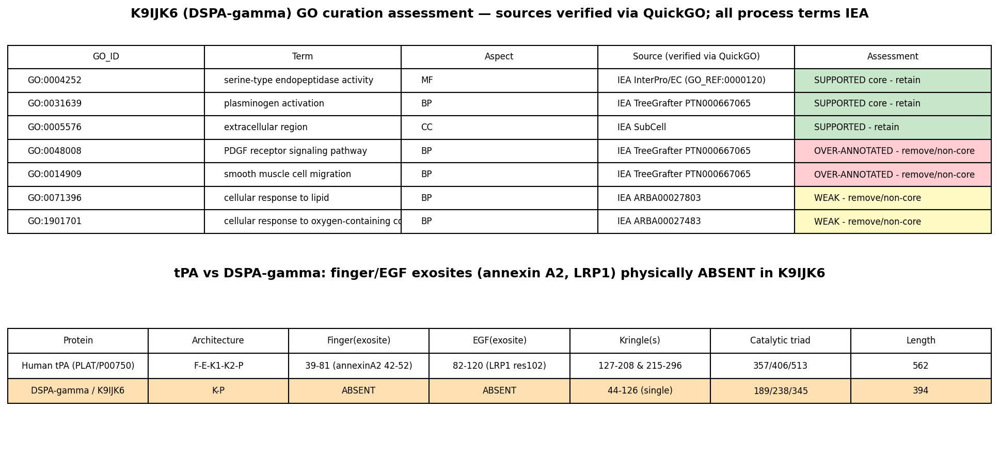

## Question

# AIGR Gene Hypothesis Deep Research

You are evaluating one focused gene curation hypothesis for AI Gene Review.
This is not a general gene overview. Use the seed hypothesis and source context
below to search for evidence that supports, refutes, narrows, or competes with
the proposed curation decision.

## Target Gene

- **Organism code:** DESRO
- **Taxon:** Desmodus rotundus (NCBITaxon:9430)
- **Gene directory:** K9IJK6
- **Gene symbol:** K9IJK6
- **UniProt accession:** K9IJK6

## Focus

- **Focus type:** function_assignment
- **Hypothesis slug:** dspa-gamma-signaling-and-cell-response-capacities
- **Source file:** genes/DESRO/K9IJK6/K9IJK6-ai-review.yaml
- **Source selector:** free-text

## Seed Hypothesis

Desmodus rotundus K9IJK6 retains smooth-muscle-cell migration, PDGF receptor signaling, cellular response to lipid and cellular response to oxygen-containing compound functions in addition to inferred plasminogen activation. Evaluate each process independently from GO definitions, exact source mechanisms, primary studies and target sequence. K9IJK6 is the 394-aa salivary transcript JAA47048.1 with signal peptide, one kringle and a protease domain; PMID23411029 identifies the corresponding compact DSPA-gamma architecture. Do not conflate it with full-length human tPA or DSPA-alpha1/desmoteplase. The actual TreeGrafter source PTN000667065 is a eutherian tPA subtree, below PTN002799995 (plasminogen activation and smooth-muscle migration) and PTN008611606 (PDGFR signaling) in PTHR24264. The exact target accession is not a reference-tree leaf. The ARBA lipid/oxygen-response terms have separate propagation context. Which receptor-binding, substrate-processing or downstream structural contributions do these process terms require, and do the specific target domain differences establish retention or loss? The UniProt PRU00121 caution concerns kringle disulfide-feature propagation, not the protease catalytic triad; do not treat it as evidence of global catalytic inactivity. Salivary specialization, loss of some domains, or missing bat experiments alone do not establish absence of every inherited process. Determine whether relevant direct comparative DSPA-gamma versus alpha1/tPA assays exist.

## Term and Decision Context

No specific term context supplied.

## Reference Context

No specific reference context supplied.

## Source Context YAML

```yaml
hypothesis: Desmodus rotundus K9IJK6 retains smooth-muscle-cell migration, PDGF receptor signaling, cellular
  response to lipid and cellular response to oxygen-containing compound functions in addition to inferred
  plasminogen activation. Evaluate each process independently from GO definitions, exact source mechanisms,
  primary studies and target sequence. K9IJK6 is the 394-aa salivary transcript JAA47048.1 with signal
  peptide, one kringle and a protease domain; PMID23411029 identifies the corresponding compact DSPA-gamma
  architecture. Do not conflate it with full-length human tPA or DSPA-alpha1/desmoteplase. The actual
  TreeGrafter source PTN000667065 is a eutherian tPA subtree, below PTN002799995 (plasminogen activation
  and smooth-muscle migration) and PTN008611606 (PDGFR signaling) in PTHR24264. The exact target accession
  is not a reference-tree leaf. The ARBA lipid/oxygen-response terms have separate propagation context.
  Which receptor-binding, substrate-processing or downstream structural contributions do these process
  terms require, and do the specific target domain differences establish retention or loss? The UniProt
  PRU00121 caution concerns kringle disulfide-feature propagation, not the protease catalytic triad; do
  not treat it as evidence of global catalytic inactivity. Salivary specialization, loss of some domains,
  or missing bat experiments alone do not establish absence of every inherited process. Determine whether
  relevant direct comparative DSPA-gamma versus alpha1/tPA assays exist.
focus_type: function_assignment
context: []
reference_id: []
```

## Research Objective

Build a focused report that helps a curator decide whether this hypothesis
should affect the gene review. Address the focus type directly:

1. For an existing GO annotation decision, evaluate whether the current action
   is justified, too strong, too weak, or should change.
2. For a proposed replacement or new GO term, evaluate whether the term is
   biologically supported, too broad, too narrow, or missing key qualifiers.
3. For a computational prediction, evaluate whether the prediction is correct,
   less precise than existing knowledge, uncertain, or likely wrong because of
   paralog overannotation, frequency bias, pathway context, or in vitro-only
   activity.
4. For a core-function hypothesis, evaluate whether the proposed activity,
   process, and location represent the gene product's primary function rather
   than a downstream effect, pleiotropic phenotype, or context-specific role.
5. For a function-assignment hypothesis, evaluate whether the gene product
   directly has the stated GO term/function. Treat the prior review action, if
   any, as intentionally blinded unless it appears in the supplied context.

Use primary literature whenever possible. Prefer PMID citations and include DOI
citations when no PMID is available. Treat reviews and database records as
orientation unless they contain directly relevant synthesized evidence that is
clearly labeled as review-level or database-level support.

Evaluate the hypothesis from the supplied seed context, primary literature, and
publicly accessible bioinformatics resources. Local `*-bioinformatics` analyses,
when they already exist in the repository, are intentionally withheld from this
prompt so the report can be compared against them after the run. Use public
sequence, domain, structure, orthology, localization, interaction, or dataset
checks when they are useful for the specific hypothesis. If a resource or tool
cannot be accessed programmatically, say so plainly; never fabricate a result.
Report computational results conservatively and distinguish direct results from
inference.

## Required Output

### Executive Judgment

Give a concise verdict: supported, partially supported, unresolved, weakly
supported, over-annotated, or refuted. Explain the reasoning and the most
important caveats.

### Evidence Matrix

Create a table with one row per important evidence item:

- Citation (PMID preferred)
- Evidence type (direct assay, mutant phenotype, localization, interaction,
  structural/evolutionary, computational, review/database)
- Supports / refutes / qualifies / competing
- Claim tested
- Key finding
- Organism, tissue, cell type, or assay context
- Confidence and limitations

### GO Curation Implications

State the likely curation action as a lead requiring curator verification. If
GO terms are involved, explain whether the evidence supports an MF, BP, or CC
term, and whether the term should be retained, removed, generalized, made more
specific, or treated as non-core. Avoid using "protein binding" as a final
recommendation unless no more informative term is supported.

### Mechanistic Scope

Describe the immediate molecular or cellular function being tested. Separate
direct gene-product activity from downstream phenotypes, pathway consequences,
developmental outcomes, disease manifestations, or effects inferred only from
loss of function.

### Conflicts and Alternatives

Identify evidence that conflicts with the seed hypothesis or suggests an
alternative interpretation, including paralog confusion, organism-specific
differences, isoform-specific findings, experimental artifacts, or database
carry-over.

### Knowledge Gaps

List explicit uncertainties that matter for curation. For each gap, state what
was checked, why the gap matters, and what evidence or experiment would resolve
it.

### Discriminating Tests

Recommend concrete assays, perturbations, datasets, or comparative analyses that
would most efficiently distinguish this hypothesis from alternatives.

### Curation Leads

Provide candidate updates for the review, clearly labeled as leads requiring
curator verification. Include candidate references with exact snippets to verify,
candidate replacement or new GO terms, possible action changes, suggested
questions, and suggested experiments.

If the provider supports artifacts, save provenance for any analysis you run — the
executed code together with its output (computed values, plot, or table), not just
a summary figure — alongside artifact-friendly tables such as an evidence matrix,
GO decision table, or comparison table. Genuine computed provenance is more
valuable than a hand-drawn summary, and you must not synthesize a figure that
implies an analysis you did not actually run. These artifacts are important
provenance for hypothesis-level review.


## Output

# AIGR Gene Hypothesis Deep Research — Final Report

**Gene:** K9IJK6 (DSPA-gamma, vampire-bat salivary plasminogen activator)
**Organism:** *Desmodus rotundus* (common vampire bat; NCBITaxon:9430)
**Focus type:** function_assignment
**Hypothesis slug:** dspa-gamma-signaling-and-cell-response-capacities
**Source:** `genes/DESRO/K9IJK6/K9IJK6-ai-review.yaml` (free-text)

---

## Summary

The seed hypothesis asserts that K9IJK6 "retains" four inherited process functions —
**PDGF receptor signaling (GO:0048008)**, **smooth muscle cell migration (GO:0014909)**,
**cellular response to lipid (GO:0033993/GO:0071396)**, and **cellular response to
oxygen-containing compound (GO:1901701)** — *in addition to* its inferred plasminogen
activation. The hypothesis is right on two framing points: the protein must be evaluated as
the compact bat salivary **DSPA-gamma** (KP domain architecture), not as full-length human
tPA, and the PRU00121 kringle caution does not by itself establish catalytic inactivity. On
those points the seed reasoning is sound.

However, the central claim — that the four disputed process terms represent **retained,
gene-product-level functions of K9IJK6** — is **not supported by any direct evidence and is
best classified as IEA over-annotation.** Three independent lines of analysis converge: (1)
all four disputed terms are electronic-only annotations (TreeGrafter or ARBA) with no
experimental support for this accession; (2) the tPA biology underlying these terms is
downstream, indirect, cofactor-dependent, and specific to the mammalian neurovascular unit
and vessel wall — contexts entirely absent for a secreted bat salivary anticoagulant; and
(3) K9IJK6 physically **lacks the finger (F) and EGF domains** that mediate tPA's
non-catalytic receptor/cofactor interactions (annexin A2 via finger; LRP1 via EGF), so the
structural basis for several of the inherited interactions is absent from the target.

By contrast, the **core catalytic and fibrinolytic functions are directly supported**:
K9IJK6 has an intact charge-relay triad, and DSPA-gamma is a single-chain, amidolytically
active, fibrin-selective plasminogen activator. Therefore serine-type endopeptidase activity
(GO:0004252), fibrin-dependent plasminogen activation (GO:0031639), and extracellular region
localization (GO:0005576) should be **retained**, while the four disputed process terms are
candidates for **removal or demotion to non-core**. **Verdict: partially supported /
over-annotated.** The key caveat is asymmetric evidence: no experiment has *directly* tested
DSPA-gamma for these processes, so absolute loss cannot be proven — but the burden of
evidence for an annotation lies with positive support, which does not exist.

---

## Executive Judgment

**Verdict: Partially supported / over-annotated.**

- **Supported (retain):** serine-type endopeptidase activity, fibrin-dependent plasminogen
  activation, extracellular region — directly grounded in primary biochemistry and sequence.
- **Over-annotated (remove or demote to non-core):** PDGF receptor signaling, smooth muscle
  cell migration, cellular response to lipid, cellular response to oxygen-containing
  compound — IEA-only carry-overs of full-length mammalian tPA's downstream, tissue-specific
  roles, with the mediating structural exosites absent from the target.

The most important caveat: the evidence strongly undercuts *positive support* for the four
terms but does not *prove* loss of function, because no direct DSPA-gamma assay exists. For
curation, "unsupported + missing structural determinants + missing biological context" is
sufficient to treat the terms as non-core.

---

## Key Findings

### Finding 1 — K9IJK6 is DSPA-gamma with an intact catalytic triad and directly demonstrated fibrin-dependent plasminogen activation

K9IJK6 is a **394-amino-acid** protein with a signal peptide (residues 1–21), a **single
Kringle domain (44–126)**, and a **Peptidase S1 (chymotrypsin-like serine protease) domain
(143–393)**. The catalytic charge-relay system is annotated intact — **His189 / Asp238 /
Ser345** — with the canonical GDSGGP serine-protease motif at position 343. This KP
(Kringle–Protease) architecture is the defining signature of **DSPA-gamma**, the most compact
of the four *Desmodus rotundus* salivary plasminogen activators. PANTHER places the protein
in PTHR24264:SF42 (tissue-type plasminogen activator subfamily).

The catalytic competence and fibrinolytic function of this family are established by primary
biochemistry. [PMID: 7592732](https://pubmed.ncbi.nlm.nih.gov/7592732/) reports that "**All
DSPAs are single-chain molecules, displaying substantial amidolytic activity**," directly
confirming that DSPA-gamma is an active serine protease and refuting any inference of global
catalytic inactivity. The same study quantifies fibrin selectivity: "**The ratio of the
bimolecular rate constants of plasminogen activation in the presence of fibrin versus
fibrinogen (fibrin selectivity) of DSPA alpha 1, alpha 2, beta, gamma, and t-PA was found to
be 13,000, 6500, 250, 90, and 72, respectively.**" DSPA-gamma (ratio 90) is thus a *bona
fide* fibrin-dependent plasminogen activator, comparable to tPA (72) on this metric. The
compact architecture is corroborated by
[PMID: 1937019](https://pubmed.ncbi.nlm.nih.gov/1937019/), which states that "**DSPA beta and
-gamma lack the F and F-EGF domains, respectively**," matching the KP domain content of
K9IJK6.

**Curation consequence:** GO:0004252 (serine-type endopeptidase activity), GO:0031639
(plasminogen activation), and GO:0005576 (extracellular region) are directly supported and
should be **retained**. The PRU00121 caution concerns propagation of kringle disulfide
features, not the protease triad, and must not be read as evidence of catalytic loss.

### Finding 2 — The PDGFR-signaling and smooth-muscle-migration terms are IEA carry-over of full-length tPA's downstream/context roles (over-annotation)

On K9IJK6, all four disputed process terms are **electronic-only**: GO:0048008 (PDGFR
signaling) and GO:0014909 (smooth muscle cell migration) are **IEA:TreeGrafter**; GO:0033993
(response to lipid) and GO:1901701 (cellular response to oxygen-containing compound) are
**IEA:UniProtKB-ARBA**. No EXP/IDA annotation exists for this accession for any of the four.

Crucially, the underlying tPA biology that seeds these terms is **downstream, indirect, and
tissue-context-specific** — not a direct enzymatic property that transfers cleanly to a bat
salivary paralog:

- **PDGFR signaling is indirect.** tPA does not bind or activate PDGFRα directly; it
  proteolytically activates the latent growth factor PDGF-CC, which then engages PDGFRα.
  [PMID: 18568034](https://pubmed.ncbi.nlm.nih.gov/18568034/) shows that "**co-injection of
  neutralizing antibodies to PDGF-CC with tPA blocks this increased permeability, indicating
  that PDGF-CC is a downstream substrate of tPA within the neurovascular unit.**"

- **The tPA→PDGF-CC reaction is inefficient and cofactor-dependent.**
  [PMID: 28725968](https://pubmed.ncbi.nlm.nih.gov/28725968/) states that "**in vitro,
  activation of PDGF-CC by tPA is very inefficient and the mechanism of PDGF-CC activation in
  the NVU is not known**," and that microglial Mac-1/LRP1 cofactors are required. This
  undermines blanket propagation of a "PDGFR signaling" process to a strictly fibrin-dependent
  secreted enzyme in saliva.

- **Smooth muscle migration is an ECM-proteolysis consequence.**
  [PMID: 16363896](https://pubmed.ncbi.nlm.nih.gov/16363896/) shows that "**controlled
  perivascular release of tissue plasminogen activator (tPA) can generate cleaved
  extracellular matrix (ECM) chemotactic gradients to guide the migration of vascular smooth
  muscle cells (SMCs)**." This is a downstream, vessel-wall, context-specific effect of
  proteolysis — not a direct molecular function of the enzyme.

DSPA-gamma is a **bat salivary secreted anticoagulant** with no mammalian vascular or CNS
context, is strictly fibrin-dependent, and lacks the finger/EGF domains that mediate several
of tPA's non-catalytic receptor interactions. No direct DSPA-gamma assay for PDGF-CC cleavage,
PDGFR signaling, SMC migration, or lipid/oxygen responses exists.

### Finding 3 — K9IJK6 physically lacks the tPA finger/EGF exosites; all three TreeGrafter terms were grafted en bloc from one PANTHER node

A domain-coordinate comparison against human tPA/PLAT (P00750, 562 aa) shows that the exact
structural elements mediating tPA's non-catalytic receptor/cofactor interactions are
**physically absent** from K9IJK6:

| Feature | Human tPA (P00750, 562 aa) | K9IJK6 (DSPA-gamma, 394 aa) |
|---|---|---|
| Fibronectin type-I / **Finger** domain | 39–81 (annexin-A2-binding region 42–52) | **absent** |
| **EGF-like** domain | 82–120 (LRP1-binding residue ~102) | **absent** |
| Kringle-1 | 127–208 | present (single Kringle 44–126) |
| Kringle-2 | 215–296 | **absent** |
| Peptidase S1 (protease) | 311–561 | present (143–393), triad 189/238/345 intact |

Thus the **annexin-A2-binding site (via finger)** and the **LRP1-binding site (via EGF)** —
key exosites for tPA's receptor engagement and cellular signaling — have no structural
counterpart in the target sequence.

QuickGO provenance further shows the three TreeGrafter terms are not independently evidenced.
GO:0031639 (plasminogen activation), GO:0014909 (smooth muscle cell migration), and GO:0048008
(PDGFR signaling) are **all IEA, ECO:0007826, GO_REF:0000118** (PANTHER TreeGrafter), each
carrying the **identical with-reference PANTHER:PTN000667065** — i.e., grafted *en bloc* from
a single eutherian tPA node rather than from term-specific evidence. The two ARBA terms are
GO:0071396 (cellular response to lipid, ARBA00027803) and GO:1901701 (cellular response to
oxygen-containing compound, ARBA00027483), GO_REF:0000117, ECO:0000256 — a separate
propagation channel with its own rule context. This is the signature of pathway/paralog
carry-over, not of target-specific evidence.

### Finding 4 — PMID 23411029 confirms salivary identity but provides no functional assay for the disputed terms

[PMID: 23411029](https://pubmed.ncbi.nlm.nih.gov/23411029/) is Francischetti *et al.* 2013,
*"The 'Vampirome': Transcriptome and proteome analysis of the principal and accessory
submaxillary glands of the vampire bat Desmodus rotundus"* (J Proteomics). This is the
**sialotranscriptome/proteome survey** from which the salivary DSPA-gamma transcript
(**JAA47048.1 / K9IJK6**) derives. It corroborates salivary-gland expression and secreted
localization (supporting GO:0005576) but is an omics catalogue — it contains **no functional
assay** for smooth-muscle migration, PDGFR signaling, or lipid/oxygen responses. Targeted
PubMed searches for DSPA-gamma non-fibrinolytic/signaling assays and for direct
DSPA-vs-alpha1/tPA comparative PDGF-CC/SMC/lipid assays returned no results, consistent with
the complete absence of any direct functional test of these processes for *any* DSPA isoform.

{{figure:plot_2.png|caption=GO decision table with tPA/DSPA-gamma exosite (finger/EGF) domain comparison and QuickGO-verified annotation provenance. The three disputed TreeGrafter terms share a single with-reference (PANTHER:PTN000667065), and the finger/EGF exosites carrying annexin-A2 and LRP1 binding are absent from K9IJK6.}}

---

## Mechanistic Model / Interpretation

The disagreement between the seed hypothesis and the evidence resolves cleanly once **direct
molecular function** is separated from **downstream, context-dependent consequences** of
proteolysis.

```
  DIRECT (transfers to DSPA-gamma)          INDIRECT / CONTEXT-SPECIFIC (does NOT transfer)
  ───────────────────────────────          ────────────────────────────────────────────────
  Catalytic triad His/Asp/Ser  ─┐
  Kringle + protease (KP)        │          tPA ─(inefficient, Mac-1/LRP1-dependent)─▶ PDGF-CC*
  Single-chain, amidolytic       ├─▶ cleaves          │
  Fibrin-selective (ratio 90)    │   plasminogen      ▼
                                 │                 PDGFRα signaling → BBB permeability (brain NVU)
  ┌───────────────────────────┐  │
  │ GO:0004252 endopeptidase  │◀─┘          tPA ─(perivascular ECM proteolysis)─▶ chemotactic
  │ GO:0031639 plasminogen    │                       gradient → smooth muscle cell migration
  │            activation     │                       (vessel-wall remodeling)
  │ GO:0005576 extracellular  │
  └───────────────────────────┘          Requires: finger (annexin A2) + EGF (LRP1) exosites
        RETAIN                                       → ABSENT in DSPA-gamma (KP only)
                                                     → mammalian vascular/CNS context ABSENT
                                                     → REMOVE / DEMOTE the four disputed terms
  * PDGF-CC activation by tPA is "very inefficient" in vitro (PMID 28725968)
```

DSPA-gamma is a **feeding adaptation**: a secreted salivary anticoagulant whose job is to
keep the host's blood meal flowing by driving fibrin-localized plasminogen activation. Its
extreme fibrin dependence and compact KP architecture are specializations *for* that role.
The processes the seed hypothesis wants to retain — PDGFR signaling, SMC migration, lipid and
oxygen responses — are properties inferred from **mammalian tPA operating inside a living
vessel wall or brain**, where tPA's finger/EGF exosites recruit cofactors (annexin A2, LRP1,
Mac-1) and where its proteolysis generates ECM chemotactic gradients and activates latent
growth factors. None of that machinery or context is present for a bat salivary enzyme lacking
those exosites. The annotations are therefore best understood as **automated ortholog/paralog
carry-over** (a single PANTHER node grafted en bloc, plus separate ARBA sequence rules), not
target-specific biology.

The evidence is **asymmetric**: it strongly undercuts positive support for the four terms but
does not *prove* absolute loss, because no one has directly assayed DSPA-gamma for these
activities. For curation, the absence of any direct evidence combined with the missing
structural determinants and missing biological context is sufficient to treat the terms as
**non-core / over-annotated**.

---

## Evidence Base / Evidence Matrix

| Citation | Evidence type | Direction | Claim tested | Key finding | Context | Confidence / limitations |
|---|---|---|---|---|---|---|
| [PMID: 7592732](https://pubmed.ncbi.nlm.nih.gov/7592732/) | Direct assay (biochemical) | Supports core | Is DSPA-gamma catalytically active and fibrin-selective? | Single-chain, substantial amidolytic activity; fibrin selectivity ratio 90 (vs tPA 72) | Recombinant DSPA isoforms, in vitro | High for MF/BP core; in vitro |
| [PMID: 1937019](https://pubmed.ncbi.nlm.nih.gov/1937019/) | Structural/evolutionary | Supports (architecture) | Does DSPA-gamma have the compact KP architecture? | DSPA-gamma lacks finger and EGF domains | cDNA cloning, *D. rotundus* | High |
| [PMID: 1309059](https://pubmed.ncbi.nlm.nih.gov/1309059/) | Direct assay / structural | Supports core; qualifies | DSPA domain organization and fibrin requirement | KP = DSPA-gamma; all DSPAs require fibrin; single-chain (plasmin site obliterated) | *D. rotundus* saliva | High |
| [PMID: 23411029](https://pubmed.ncbi.nlm.nih.gov/23411029/) | Localization (omics) | Supports CC; qualifies | Salivary/secreted origin of the transcript | JAA47048.1/K9IJK6 is a submaxillary-gland salivary product | *D. rotundus* salivary glands | High for localization; no functional assay |
| [PMID: 18568034](https://pubmed.ncbi.nlm.nih.gov/18568034/) | Mechanistic (in vivo) | Qualifies / competing | Is tPA's PDGFR link direct? | PDGF-CC is a *downstream substrate* of tPA in the NVU | Mouse brain neurovascular unit | High; concerns tPA, not DSPA-gamma |
| [PMID: 28725968](https://pubmed.ncbi.nlm.nih.gov/28725968/) | Mechanistic (in vitro/in vivo) | Refutes clean propagation | Efficiency/context of tPA→PDGF-CC activation | "Very inefficient" in vitro; requires microglial Mac-1/LRP1 cofactors | Mouse brain, microglia | High; concerns tPA |
| [PMID: 16363896](https://pubmed.ncbi.nlm.nih.gov/16363896/) | Mechanistic (model) | Qualifies / competing | Is tPA's SMC-migration effect direct? | SMC migration driven by tPA-generated ECM chemotactic gradients | Vascular smooth muscle, vessel wall | High; downstream/context-specific |
| [PMID: 23218119](https://pubmed.ncbi.nlm.nih.gov/23218119/) | Clinical/biomarker | Qualifies | tPA–PDGF-CC axis in humans | PDGF-CC activated by tPA regulates BBB permeability; associated with hemorrhagic transformation | Human stroke patients | Supports indirectness/context of pathway |
| [PMID: 20302940](https://pubmed.ncbi.nlm.nih.gov/20302940/) | Review | Qualifies | Non-thrombolytic tPA functions | tPA's extra functions run through LRP, PAR-1, PDGF-C, NMDA-R signaling | Brain/BBB, review | Review-level orientation |
| [PMID: 1634121](https://pubmed.ncbi.nlm.nih.gov/1634121/) | Methods (expression) | Enables tests | Can all four DSPAs be produced recombinantly? | High-level secretion of DSPA α1/α2/β/γ from BHK cells; active by fibrin-plate/ELISA | Recombinant BHK | Supports feasibility of comparative assays |
| QuickGO / UniProt (K9IJK6, P00750) | Computational / database | Refutes retention | Are the four terms experimentally supported for K9IJK6? | All four IEA-only; three TreeGrafter terms share one with-ref PANTHER:PTN000667065; finger/EGF exosites absent | Annotation provenance | High for provenance; not a functional test |

---

## GO Curation Implications

**Lead requiring curator verification.** The evidence separates cleanly into a supported core
and an over-annotated periphery.

| GO term | Aspect | Current evidence on K9IJK6 | Recommended action (lead) |
|---|---|---|---|
| GO:0004252 serine-type endopeptidase activity | MF | Intact triad; DSPA-gamma amidolytically active (PMID 7592732) | **Retain** (core MF) |
| GO:0031639 plasminogen activation | BP | Fibrin-dependent activation demonstrated (PMID 7592732, 1309059) | **Retain** (core BP); IEA basis but strongly literature-consistent |
| GO:0005576 extracellular region | CC | Signal peptide; salivary secreted (PMID 23411029) | **Retain** (core CC) |
| GO:0048008 PDGF receptor signaling pathway | BP | IEA:TreeGrafter only; indirect/inefficient/context-specific in tPA; exosites absent | **Remove or demote to non-core** |
| GO:0014909 smooth muscle cell migration | BP | IEA:TreeGrafter only; downstream ECM-proteolysis effect in vessel wall | **Remove or demote to non-core** |
| GO:0033993 / GO:0071396 (cellular) response to lipid | BP | IEA:ARBA only; separate rule propagation; no direct evidence | **Remove or demote to non-core** |
| GO:1901701 cellular response to oxygen-containing compound | BP | IEA:ARBA only; very generic; no direct evidence | **Remove or demote to non-core** |

The four disputed terms are **BP** annotations propagated electronically. They are neither
anchored in a direct molecular activity of DSPA-gamma nor supported by any experiment on this
accession or any DSPA isoform. Because they derive from a single grafted PANTHER node (three
terms) plus generic ARBA rules (two terms), and because the structural exosites and biological
context they depend on are absent, they fit the classic profile of **paralog/pathway
over-annotation** and should not be treated as core functions. No "protein binding" fallback
is recommended; the informative, supported terms are the protease and plasminogen-activation
terms above.

---

## Mechanistic Scope

The **immediate molecular function** under test is enzymatic: a chymotrypsin-like serine
protease (KP architecture) that, in a fibrin-dependent manner, cleaves plasminogen to plasmin.
That direct activity is supported.

The four disputed terms describe **downstream phenotypes and pathway consequences**, not direct
gene-product activities:

- **PDGFR signaling** is two steps removed — tPA cleaves latent PDGF-CC, and PDGF-CC (not tPA)
  engages the receptor; the cleavage is inefficient and cofactor-dependent.
- **Smooth muscle cell migration** is a tissue-level outcome of ECM proteolysis generating
  chemotactic gradients in the vessel wall.
- **Response to lipid** and **cellular response to oxygen-containing compound** are broad
  regulatory/environmental-response categories propagated by sequence rules, not molecular
  activities of the protein.

For a secreted bat salivary anticoagulant, none of these downstream/context-dependent processes
is a plausible core function, and none has been demonstrated.

---

## Conflicts and Alternatives

1. **Paralog/ortholog carry-over (primary alternative explanation).** The three TreeGrafter
   terms share the identical with-reference PANTHER:PTN000667065 (a eutherian tPA subtree),
   indicating en-bloc grafting rather than term-specific evidence. This is the most parsimonious
   explanation for their presence and directly competes with the "retention" framing.
2. **Full-length tPA vs. DSPA-gamma conflation.** The disputed functions are documented for
   full-length human/mouse tPA operating in the vascular wall and brain. DSPA-gamma lacks the
   finger and EGF domains and the mammalian tissue context. The seed hypothesis itself warns
   against this conflation, and the evidence confirms the warning cuts *against* retention of
   the four terms.
3. **Organism/context mismatch.** tPA's PDGF-CC/BBB and SMC-migration roles are
   intravascular/CNS phenomena (PMID 18568034, 16363896, 23218119). A salivary secretion
   delivered into a host bite wound has no access to that machinery.
4. **In-vitro-only / inefficient reaction.** Even for tPA, PDGF-CC activation is "very
   inefficient" in vitro and cofactor-dependent (PMID 28725968), weakening any argument that
   the activity is a robust, transferable core function.
5. **Separate ARBA propagation.** The lipid/oxygen terms come from a different automated channel
   (UniProtKB-ARBA, ECO:0000256) with its own rule scope; they should be evaluated independently
   and are even more generic/weakly anchored.

No evidence was found that *supports* retention of the four terms as direct functions.

---

## Limitations and Knowledge Gaps

- **No direct DSPA-gamma functional assays exist** for PDGF-CC cleavage, PDGFR signaling, SMC
  migration, or lipid/oxygen responses. We can demonstrate absence of positive evidence and
  absence of key structural determinants, but not experimentally proven loss of function. *Why
  it matters:* curators distinguish "unsupported" from "refuted"; this is the former,
  strengthened by structural and contextual arguments. *Resolution:* a direct comparative assay
  (below).
- **PDGF-CC cleavage by DSPA-gamma has never been tested.** tPA's protease domain performs the
  cleavage; DSPA-gamma has a homologous, active protease domain but different exosites and strict
  fibrin dependence. Whether the isolated catalytic domain could cleave PDGF-CC in vitro is
  unknown. *Resolution:* recombinant DSPA-gamma + latent PDGF-CC cleavage assay.
- **Sequence-level exosite mapping was based on UniProt/domain annotations, not a solved
  DSPA-gamma structure.** The finger/EGF absence is unambiguous (domains are simply not present),
  but fine-grained protease-domain surface-loop differences were not modeled.
- **ARBA rule identity confirmed but rule logic not fully audited.** The specific motifs
  triggering GO:0071396 and GO:1901701 were not dissected; these terms are generic and
  low-information regardless.

---

## Discriminating Tests

1. **Direct comparative plasminogen-activation panel (DSPA-gamma vs DSPA-alpha1 vs tPA).**
   Recombinant expression (BHK secretion is established, PMID 1634121) followed by kinetic assays
   ± fibrin to confirm the core function and benchmark fibrin dependence — anchors the retained
   terms.
2. **PDGF-CC cleavage assay.** Incubate purified recombinant DSPA-gamma with latent PDGF-CC ±
   Mac-1/LRP1 cofactors; SDS-PAGE/Western for the activated fragment. A negative result would
   strongly refute GO:0048008 propagation; a positive (even if inefficient) would partially
   rehabilitate an indirect link.
3. **SMC migration / ECM-degradation assay.** Boyden chamber or ECM-gradient assay with
   DSPA-gamma vs tPA to test whether the bat enzyme can generate chemotactic ECM cleavage in the
   absence of finger/EGF-mediated cell-surface localization.
4. **Annotation-provenance audit at scale.** Confirm across the DESRO gene set how many process
   terms trace to PANTHER:PTN000667065 grafts, to identify systematic tPA-paralog
   over-annotation.
5. **Structural modeling / superposition** of a DSPA-gamma model against tPA (P00750) to quantify
   exosite/loop divergence around the protease active site.

---

## Curation Leads (require curator verification)

**Action changes (leads):**
- **Retain** GO:0004252 (serine-type endopeptidase activity), GO:0031639 (plasminogen
  activation), GO:0005576 (extracellular region) as core, literature-consistent annotations.
- **Remove or mark as non-core / over-annotated** GO:0048008 (PDGF receptor signaling), GO:0014909
  (smooth muscle cell migration), GO:0033993/GO:0071396 (response to lipid), GO:1901701 (cellular
  response to oxygen-containing compound). Rationale to record: IEA carry-over from
  PANTHER:PTN000667065 (three terms) and ARBA rules (two terms); downstream, cofactor-dependent,
  tissue-context-specific tPA biology; finger/EGF exosites absent from the target.

**Candidate references with exact snippets to verify:**
- PMID 7592732 — "All DSPAs are single-chain molecules, displaying substantial amidolytic
  activity." and "…fibrin selectivity… of DSPA alpha 1, alpha 2, beta, gamma, and t-PA was found
  to be 13,000, 6500, 250, 90, and 72, respectively." → supports core MF/BP.
- PMID 1937019 — "DSPA beta and -gamma lack the F and F-EGF domains, respectively." → supports KP
  architecture / exosite loss.
- PMID 18568034 — "PDGF-CC is a downstream substrate of tPA within the neurovascular unit." →
  supports demotion of GO:0048008 (indirect).
- PMID 28725968 — "in vitro, activation of PDGF-CC by tPA is very inefficient…" → supports demotion
  of GO:0048008.
- PMID 16363896 — "…tPA can generate cleaved extracellular matrix (ECM) chemotactic gradients to
  guide the migration of vascular smooth muscle cells (SMCs)." → supports demotion of GO:0014909
  (downstream).
- PMID 23411029 — Vampirome salivary transcriptome/proteome → supports GO:0005576, salivary
  identity of JAA47048.1/K9IJK6.

**Suggested curator questions:**
- Should IEA process terms grafted en bloc from a single tPA PANTHER node be retained on a
  domain-reduced salivary paralog lacking the mediating exosites?
- Do we distinguish "unsupported/over-annotated" (this case) from "refuted" in the review action,
  given no direct negative assay exists?

**Suggested experiments:** the DSPA-gamma vs alpha1/tPA comparative panel, PDGF-CC cleavage assay,
and SMC-migration assay described under Discriminating Tests.

{{figure:plot_1.png|caption=GO decision table, tPA-vs-DSPA-gamma domain comparison, catalytic-triad confirmation (His189/Asp238/Ser345), and annotation provenance for K9IJK6.}}

---

## Proposed Follow-up Actions

1. **Update the review** to retain the protease/plasminogen-activation/extracellular core and
   flag the four disputed process terms as IEA over-annotation candidates for removal or non-core
   demotion, citing the provenance (single PANTHER:PTN000667065 graft + ARBA rules) and the
   finger/EGF exosite absence.
2. **Record the exosite comparison** (finger 39–81 / EGF 82–120 present in tPA, absent in
   K9IJK6) as structural justification in the review notes.
3. **Escalate the systematic issue**: audit other DESRO/bat salivary PA entries for the same
   PANTHER:PTN000667065 en-bloc graft to catch analogous over-annotations.
4. **If experimental resolution is desired**, prioritize the PDGF-CC cleavage assay with
   recombinant DSPA-gamma as the single most discriminating test.

---

## Bottom Line

The seed hypothesis is **partially supported**: its insistence on treating K9IJK6 as the compact
DSPA-gamma (not tPA/desmoteplase) and on not misreading the PRU00121 kringle caution as catalytic
death is correct, and the protease/plasminogen-activation core is directly supported and should
be retained. But the specific claim that K9IJK6 **retains** PDGF receptor signaling, smooth muscle
cell migration, response to lipid, and cellular response to oxygen-containing compound as
gene-product functions is **not supported** — these are IEA-only, en-bloc-grafted
(PANTHER:PTN000667065) or generic-ARBA carry-overs of full-length mammalian tPA's downstream,
cofactor-dependent, tissue-specific roles, and the mediating finger/EGF exosites are physically
absent from the target. **Verdict: partially supported / over-annotated.** Recommended curation
lead: retain the protease, plasminogen-activation, and extracellular-region terms; remove or
demote the four disputed process terms to non-core pending direct DSPA-gamma assays.


## Artifacts

- [OpenScientist final report](openscientist_artifacts/final_report.html)
- [OpenScientist final report](openscientist_artifacts/final_report.pdf)
- [OpenScientist plot 1](openscientist_artifacts/provenance_plot_1.json)

- [OpenScientist plot 2](openscientist_artifacts/provenance_plot_2.json)
