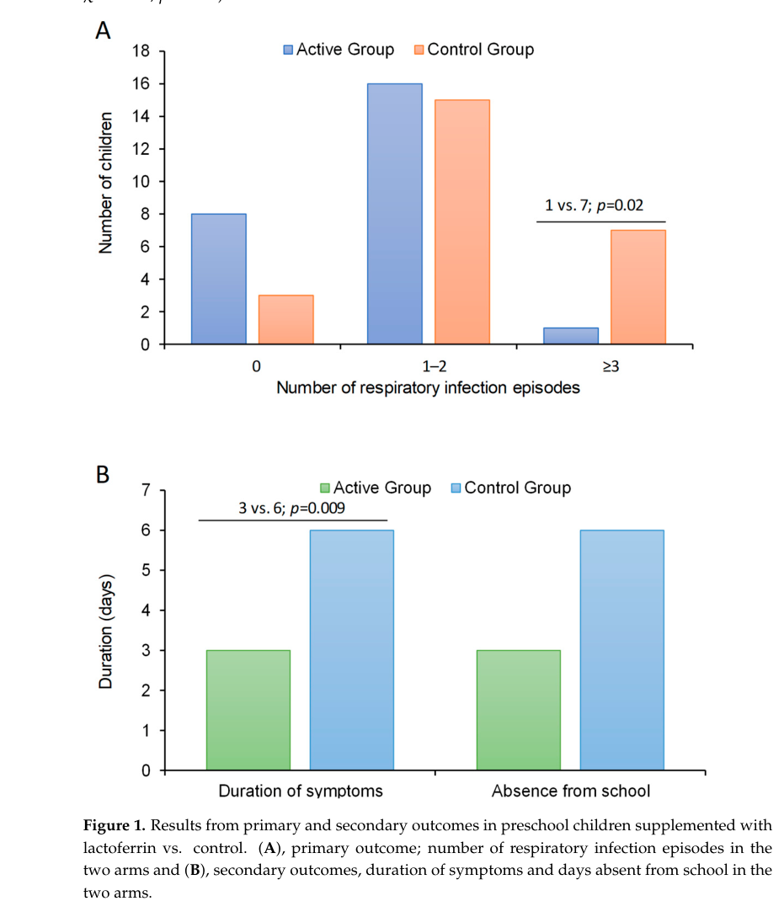

## Question

# Gene Research for Functional Annotation

## ⚠️ CRITICAL: Gene/Protein Identification Context

**BEFORE YOU BEGIN RESEARCH:** You MUST verify you are researching the CORRECT gene/protein. Gene symbols can be ambiguous, especially for less well-characterized genes from non-model organisms.

### Target Gene/Protein Identity (from UniProt):
- **UniProt Accession:** K9IMD0
- **Protein Description:** RecName: Full=Lactotransferrin {ECO:0000305}; Short=Lactoferrin {ECO:0000305}; EC=3.4.21.- {ECO:0000250|UniProtKB:P02788}; AltName: Full=Draculin {ECO:0000303|PubMed:7740503}; AltName: Full=Draculin-1 {ECO:0000303|PubMed:23748026}; Flags: Precursor;
- **Gene Information:** Name=LTF {ECO:0000250|UniProtKB:P02788};
- **Organism (full):** Desmodus rotundus (Vampire bat).
- **Protein Family:** Belongs to the transferrin family.
- **Key Domains:** Transferrin. (IPR016357); Transferrin-like_dom. (IPR001156); Transferrin_Fe_BS. (IPR018195); Transferrin (PF00405)

### MANDATORY VERIFICATION STEPS:

1. **Check if the gene symbol "LTF" matches the protein description above**
2. **Verify the organism is correct:** Desmodus rotundus (Vampire bat).
3. **Check if protein family/domains align with what you find in literature**
4. **If you find literature for a DIFFERENT gene with the same or similar symbol, STOP**

### If Gene Symbol is Ambiguous or You Cannot Find Relevant Literature:

**DO NOT PROCEED WITH RESEARCH ON A DIFFERENT GENE.** Instead:
- State clearly: "The gene symbol 'LTF' is ambiguous or literature is limited for this specific protein"
- Explain what you found (e.g., "Found extensive literature on a different gene with the same symbol in a different organism")
- Describe the protein based ONLY on the UniProt information provided above
- Suggest that the protein function can be inferred from domain/family information

### Research Target:

Please provide a comprehensive research report on the gene **LTF** (gene ID: K9IMD0, UniProt: K9IMD0) in DESRO.

The research report should be a detailed narrative explaining the function, biological processes, and localization of the gene product. Citations should be given for all claims.

You should prioritize authoritative reviews and primary scientific literature when conducting research. You can supplement
this with annotations you find in gene/protein databases, but these can be outdated or inaccurate.

We are specifically interested in the primary function of the gene - for enzymes, what reaction is catalyzed, and what is the substrate specificity? For transporters, what is the substrate? For structural proteins or adapters, what is the broader structural role? For signaling molecules, what is the role in the pathway.

We are interested in where in or outside the cell the gene product carries out its function.

We are also interested in the signaling or biochemical pathways in which the gene functions. We are less interested in broad pleiotropic effects, except where these elucidate the precise role.

Include evidence where possible. We are interested in both experimental evidence as well as inference from structure, evolution, or bioinformatic analysis. Precise studies should be prioritized over high-throughput, where available.

## Output

Question: You are an expert researcher providing comprehensive, well-cited information.

Provide detailed information focusing on:
1. Key concepts and definitions with current understanding
2. Recent developments and latest research (prioritize 2023-2024 sources)
3. Current applications and real-world implementations
4. Expert opinions and analysis from authoritative sources
5. Relevant statistics and data from recent studies

Format as a comprehensive research report with proper citations. Include URLs and publication dates where available.
Always prioritize recent, authoritative sources and provide specific citations for all major claims.

# Gene Research for Functional Annotation

## ⚠️ CRITICAL: Gene/Protein Identification Context

**BEFORE YOU BEGIN RESEARCH:** You MUST verify you are researching the CORRECT gene/protein. Gene symbols can be ambiguous, especially for less well-characterized genes from non-model organisms.

### Target Gene/Protein Identity (from UniProt):
- **UniProt Accession:** K9IMD0
- **Protein Description:** RecName: Full=Lactotransferrin {ECO:0000305}; Short=Lactoferrin {ECO:0000305}; EC=3.4.21.- {ECO:0000250|UniProtKB:P02788}; AltName: Full=Draculin {ECO:0000303|PubMed:7740503}; AltName: Full=Draculin-1 {ECO:0000303|PubMed:23748026}; Flags: Precursor;
- **Gene Information:** Name=LTF {ECO:0000250|UniProtKB:P02788};
- **Organism (full):** Desmodus rotundus (Vampire bat).
- **Protein Family:** Belongs to the transferrin family.
- **Key Domains:** Transferrin. (IPR016357); Transferrin-like_dom. (IPR001156); Transferrin_Fe_BS. (IPR018195); Transferrin (PF00405)

### MANDATORY VERIFICATION STEPS:

1. **Check if the gene symbol "LTF" matches the protein description above**
2. **Verify the organism is correct:** Desmodus rotundus (Vampire bat).
3. **Check if protein family/domains align with what you find in literature**
4. **If you find literature for a DIFFERENT gene with the same or similar symbol, STOP**

### If Gene Symbol is Ambiguous or You Cannot Find Relevant Literature:

**DO NOT PROCEED WITH RESEARCH ON A DIFFERENT GENE.** Instead:
- State clearly: "The gene symbol 'LTF' is ambiguous or literature is limited for this specific protein"
- Explain what you found (e.g., "Found extensive literature on a different gene with the same symbol in a different organism")
- Describe the protein based ONLY on the UniProt information provided above
- Suggest that the protein function can be inferred from domain/family information

### Research Target:

Please provide a comprehensive research report on the gene **LTF** (gene ID: K9IMD0, UniProt: K9IMD0) in DESRO.

The research report should be a detailed narrative explaining the function, biological processes, and localization of the gene product. Citations should be given for all claims.

You should prioritize authoritative reviews and primary scientific literature when conducting research. You can supplement
this with annotations you find in gene/protein databases, but these can be outdated or inaccurate.

We are specifically interested in the primary function of the gene - for enzymes, what reaction is catalyzed, and what is the substrate specificity? For transporters, what is the substrate? For structural proteins or adapters, what is the broader structural role? For signaling molecules, what is the role in the pathway.

We are interested in where in or outside the cell the gene product carries out its function.

We are also interested in the signaling or biochemical pathways in which the gene functions. We are less interested in broad pleiotropic effects, except where these elucidate the precise role.

Include evidence where possible. We are interested in both experimental evidence as well as inference from structure, evolution, or bioinformatic analysis. Precise studies should be prioritized over high-throughput, where available.

## Research report: Functional annotation of **LTF (lactotransferrin/lactoferrin; “draculin” scaffold)** in *Desmodus rotundus* (UniProt **K9IMD0**)

### 1) Target verification (mandatory disambiguation)
The requested target is *Desmodus rotundus* **LTF** (UniProt K9IMD0), annotated as **lactotransferrin/lactoferrin** (transferrin family) and carrying alternative names **draculin / draculin-1**. Proteomic/transcriptomic work on vampire-bat submaxillary glands recovered an extended **draculin** sequence and concluded that it is a **member of the lactotransferrin (LTF) family** secreted in submaxillary glands, with alignment to non-venom mammalian lactotransferrins (including human LTF P02788), establishing the scaffold identity required for correct gene/protein mapping. (low2013draculaschildrenmolecular pages 6-9)

A key annotation nuance is that the name “draculin” historically referred to an **anticoagulant salivary glycoprotein**, initially proposed to be lactotransferrin based on N-terminal sequencing; later studies caution that recombinant confirmation was lacking and that other bat salivary anticoagulants exist (e.g., Desmolaris), so the relationship between “draculin anticoagulant activity” and a canonical LTF-like sequence should be treated carefully in functional annotation. (ma2013desmolarisanovel pages 1-3)

### 2) Key concepts and definitions (current understanding)
#### 2.1 Lactotransferrin/lactoferrin family: structure and biochemical definition
Lactoferrin (LF/LTF) is a transferrin-family, **~80 kDa** glycoprotein of ~700 aa with **two homologous lobes (N and C)** that reversibly bind **Fe3+**; iron occupancy determines conformational state (apo/open vs holo/closed). (ohradanovarepic2023timetokill pages 1-2, coccolini2023biomedicalandnutritional pages 1-2)

A central mechanistic concept is that lactoferrin binds iron with very high affinity and can retain iron even at low pH, enabling iron sequestration and downstream antimicrobial/antioxidant effects. (eker2024thepotentialof pages 1-2, eker2024thepotentialof pages 2-4)

#### 2.2 Localization concept: secreted innate-immune effector vs tissue-specific specialization
Across mammals, lactoferrin is abundant in **exocrine and mucosal secretions** (e.g., milk/colostrum, saliva, tears) and is also stored in **neutrophil secondary granules**, where levels rise rapidly at inflammatory sites. (ohradanovarepic2023timetokill pages 1-2, coccolini2023biomedicalandnutritional pages 1-2)

In *D. rotundus*, lactotransferrin is detected in salivary gland proteomes (including accessory gland), consistent with a secreted role at the feeding lesion and/or in the oral/gastrointestinal environment. (francischetti2013the“vampirome”transcriptome pages 26-30)

### 3) Functional mechanisms and pathways (with evidence tiers)
This section distinguishes (i) **direct evidence in *D. rotundus*** from (ii) **well-supported lactoferrin-family mechanisms in mammals** that likely transfer by homology to K9IMD0.

#### 3.1 Core biochemical function: iron binding/handling and redox effects (family inference)
Recent reviews emphasize that lactoferrin is an iron-handling protein that binds **two Fe3+** reversibly and influences iron homeostasis and oxidative stress. A 2024 review describes uptake via an **Lf receptor (LfR)** in enterocytes and notes multiple receptor interactions; iron chelation maintains iron in a less reactive state and reduces Fe2+-driven ROS generation. (rasconcruz2024antioxidantpotentialof pages 3-4)

These functions are **not directly assayed** for the vampire-bat LTF/draculin sequence in the retrieved bat-specific studies; they are best treated as **high-confidence inference from the conserved lactotransferrin scaffold**. (low2013draculaschildrenmolecular pages 6-9)

#### 3.2 Antimicrobial activity (family evidence; inferred relevance in vampire bat)
Mechanistically, lactoferrin has **bacteriostatic** effects through iron sequestration and **bactericidal** effects via direct binding to bacterial surface components such as **LPS**, supported by a 2024 review focused on proteolytic and antimicrobial functions. (ongena2024lactoferrinimpairspathogen pages 1-2)

Vampire-bat saliva “vampirome” studies place lactotransferrin alongside other antimicrobial components and discuss antimicrobial peptides ingested with the blood meal as potentially limiting bacterial growth and protecting feeding lesions; however, this is presented as functional context rather than a direct assay of bat lactotransferrin activity. (francischetti2013the“vampirome”transcriptome pages 26-30)

#### 3.3 Antiviral mechanisms and host interaction (2024 updates)
A 2024 Frontiers in Immunology review highlights lactoferrin’s **cationic surface** and receptor-binding properties as central to antiviral action: lactoferrin can bind **heparan sulfate proteoglycans (HSPGs)** and viral particles/proteins, acting as a **receptor competitor** that interferes with virus–host cell attachment/entry; the review also describes intracellular impacts such as reduced infection efficiency via inhibition of certain viral enzymes in some systems. (eker2024thepotentialof pages 1-2, eker2024thepotentialof pages 2-4)

These antiviral mechanisms are **general lactoferrin biology** and are not shown directly for *D. rotundus* LTF, but are plausible functions of a secreted LTF scaffold present in saliva. (low2013draculaschildrenmolecular pages 6-9, francischetti2013the“vampirome”transcriptome pages 26-30)

#### 3.4 Immunomodulatory signaling: NF-κB pathway (quantitative synthesis, 2023)
A 2023 systematic review/meta-analysis focused on NF-κB signaling reports that lactoferrin and derived peptides modulate **TLR4/TRAF6/IKK/IκB/NF-κB** signaling. Mechanistic summaries include bovine lactoferrin internalization via **LRP1**, interaction with **TRAF6** to interfere with TRAF6 auto-ubiquitination, blockade of IKK phosphorylation and IκB degradation, and suppression of NF-κB (p65). (yami2023theimmunomodulatoryeffects pages 10-12)

Quantitatively, pooled comparisons (typically LPS-stimulated models with lactoferrin exposure/pretreatment) reported reductions in inflammatory outputs, including **TNF-α −8.73 pg/mL**, **IL‑1β −2.21 pg/mL**, and **IL‑6 −3.24 pg/mL**, and decreases in pathway markers including **NF‑κB p65 (3.88-fold)**, **IKK‑β (7.37-fold)**, and **p‑IκB (15.02-fold)**. (yami2023theimmunomodulatoryeffects pages 1-2, yami2023theimmunomodulatoryeffects pages 4-7)

These NF-κB results derive from experimental models and are **not specific to vampire bat**, but provide a current, quantitative framing of immunomodulatory pathway involvement for the lactoferrin family. (yami2023theimmunomodulatoryeffects pages 4-7)

#### 3.5 Vampire-bat-specific specialization: anticoagulant “draculin” activity (direct evidence)
Independent of canonical lactoferrin roles, vampire bat saliva contains a historically described anticoagulant glycoprotein termed **draculin**, reported to inhibit activated coagulation factors **FIXa and FXa**; non-competitive inhibition and immediate formation of an Xa–draculin complex were described as preventing prothrombin→thrombin conversion and fibrin formation, prolonging bleeding during feeding. (low2013draculaschildrenmolecular pages 2-3)

A key experimentally established biochemical requirement is that draculin’s anticoagulant activity is **strictly dependent on proper glycosylation**: active and inactive draculin preparations differ markedly in carbohydrate content and glycoform pattern, and controlled chemical deglycosylation abolishes anti-Xa activity. (fernandez1998expressionofbiological pages 4-7, fernandez1998expressionofbiological pages 1-3)

**Interpretation for K9IMD0 functional annotation:**
- Evidence supports that an LTF-like scaffold exists in bat glands and is called draculin/draculin-1 in omics studies. (low2013draculaschildrenmolecular pages 6-9)
- Evidence also supports that an anticoagulant glycoprotein named draculin inhibits FIXa/FXa and is glycosylation-dependent. (fernandez1998expressionofbiological pages 1-3, low2013draculaschildrenmolecular pages 2-3)
- However, linking these two evidence streams into a single “canonical lactoferrin protein is the anticoagulant” claim remains **non-trivial** without recombinant confirmation, and later work emphasizes other major anticoagulants in the same glands (Desmolaris). (ma2013desmolarisanovel pages 1-3)

Accordingly, the most defensible annotation is that **K9IMD0 is a secreted lactotransferrin-family protein in vampire-bat salivary glands**, with a plausible history of **neofunctionalization on the lactotransferrin scaffold** in the lineage that may relate to the “draculin” anticoagulant phenotype, but where exact molecular correspondence and catalytic/targeting determinants likely depend on **post-translational glycosylation** and remain incompletely resolved in the accessible evidence. (low2013draculaschildrenmolecular pages 6-9, fernandez1998expressionofbiological pages 1-3, ma2013desmolarisanovel pages 1-3)

#### 3.6 Proteolytic activity (family evidence; EC note)
A 2024 review highlights an “often overlooked” aspect: lactoferrin can display **proteolytic activity** that degrades bacterial virulence factors and may contribute to antibacterial effects, while emphasizing that the proteolytic active site and specific substrates/mechanisms remain incompletely understood. (ongena2024lactoferrinimpairspathogen pages 1-2)

This supports the plausibility of UniProt’s broad peptidase class flag (EC 3.4.21.-) at the family level, but it is **not shown directly** for the *D. rotundus* LTF sequence in the retrieved bat-specific papers. (ongena2024lactoferrinimpairspathogen pages 1-2, low2013draculaschildrenmolecular pages 6-9)

### 4) Recent developments (2023–2024 prioritized)
#### 4.1 Antiviral and immune-modulating framing (2024)
Recent synthesis emphasizes lactoferrin as a candidate **broad-spectrum antiviral and immune modulator** via receptor competition (HSPGs), interactions with viral particles, and cytokine modulation, with growing emphasis on mechanistic generality across multiple viral families. (eker2024thepotentialof pages 1-2, eker2024thepotentialof pages 2-4)

#### 4.2 Oxidative stress/iron-pathway expansion (2024)
A 2024 review expands the receptor/signaling landscape (multiple lectins and immune receptors) and links lactoferrin’s iron-binding to oxidative stress regulation and context-dependent effects on processes such as ferroptosis, emphasizing that outcomes can depend on iron saturation state (apo vs holo). (rasconcruz2024antioxidantpotentialof pages 3-4)

#### 4.3 Proteolysis as an antimicrobial mechanism (2024)
The 2024 review on proteolytic activity consolidates evidence that lactoferrins can degrade bacterial virulence factors and positions this as a possible route toward antibiotic-alternative strategies, while explicitly noting remaining gaps (active site, substrate mapping). (ongena2024lactoferrinimpairspathogen pages 1-2)

### 5) Current applications and real-world implementations (2023–2024)
#### 5.1 Nutritional supplementation and infectious disease prevention (2024 RCT)
A 2024 prospective randomized study in preschool children with recurrent respiratory infections tested **oral bovine lactoferrin 400 mg/day** for 4 months and reported a **50% reduction** in median infection episodes during the active phase (median 1 vs 2; p=0.02), lower odds of more frequent episodes (OR 0.20, 95% CI 0.06–0.74; p=0.015), and shorter symptom duration (3 vs 6 days). (pasinato2024lactoferrininthe pages 4-6, pasinato2024lactoferrininthe pages 6-7)

The key efficacy outcomes are also presented visually in the paper’s Figure/Table extracts. (pasinato2024lactoferrininthe media b699cbb7, pasinato2024lactoferrininthe media 5021c032)

#### 5.2 Iron-deficiency/low hemoglobin (2024 meta-analysis)
A 2024 systematic review/meta-analysis pooling seven trials in pregnant women with iron-deficiency anemia (total N≈1397 across the pooled comparison) found hemoglobin outcomes favored oral bovine lactoferrin over ferrous sulfate with a pooled **SMD ≈0.81 (95% CI 0.42–1.21; p<0.0001)**, but with **very high heterogeneity (I2≈95.8%)** and noted risks of bias (e.g., limited blinding in many trials), limiting certainty and highlighting the need for higher-quality RCTs. (christofi2024theeffectivenessof pages 8-11)

#### 5.3 Synthetic/recombinant supply chains (2024)
A 2024 review on synthetic lactoferrin biological systems highlights demand limitations of milk-derived lactoferrin and discusses recombinant production platforms for large-scale preparation, also reporting representative natural concentration ranges (e.g., cow milk 0.1–0.2 g/L; bovine colostrum ~1.5 g/L; human milk 2–4 g/L; human colostrum 6–8 g/L). (liu2024areviewdevelopment pages 1-2)

#### 5.4 Delivery technologies and formulation challenges
A 2024 review focused on pediatric airway disease highlights a key translational issue: oral lactoferrin is susceptible to **gastric degradation**, motivating **microencapsulation and PEGylation** approaches to improve delivery to intestinal absorption sites. (gori2024exploringtherole pages 20-22)

### 6) Expert interpretation and gaps specific to *D. rotundus* K9IMD0
1. **High-confidence annotation:** K9IMD0 is a **secreted lactotransferrin-family protein** produced in *D. rotundus* submaxillary glands, consistent with UniProt’s “precursor/secreted” labeling. (low2013draculaschildrenmolecular pages 6-9, low2013draculaschildrenmolecular pages 2-3)
2. **Likely conserved functions (inference):** iron binding, antimicrobial activity, and immunomodulatory receptor interactions are strongly supported for mammalian lactoferrins and are plausible for vampire-bat LTF given scaffold identity; these are currently best treated as **homology-based** rather than bat-validated. (ohradanovarepic2023timetokill pages 1-2, eker2024thepotentialof pages 1-2)
3. **Bat-specialized function (direct evidence but mapping uncertainty):** an anticoagulant glycoprotein named **draculin** inhibits **FIXa/FXa** and requires specific **glycosylation** for activity; later omics places “draculin” on an LTF scaffold, but the field still recognizes uncertainty due to lack of recombinant confirmation and the existence of other major anticoagulants (e.g., Desmolaris). (fernandez1998expressionofbiological pages 1-3, low2013draculaschildrenmolecular pages 6-9, ma2013desmolarisanovel pages 1-3)

### 7) Summary table (evidence-tiered functional annotation)
| Category | Concise statement | Evidence type | Citations |
|---|---|---|---|
| Identity/Structure | UniProt K9IMD0 is the **Desmodus rotundus LTF/lactotransferrin (lactoferrin) precursor**; vampire-bat salivary studies recovered a partial draculin-1 sequence and placed it within the **lactotransferrin family**, aligned to human/horse LTF, supporting the UniProt assignment of draculin as an LTF-like scaffold. | Experimental in *D. rotundus* (sequence/proteomics) | (low2013draculaschildrenmolecular pages 1-2, low2013draculaschildrenmolecular pages 6-9) |
| Identity/Structure | Across mammals, lactoferrin is an ~80 kDa, ~700 aa, **bilobed transferrin-family glycoprotein** with N- and C-lobes, each binding one Fe3+; glycosylation affects stability, proteolysis resistance, and receptor interactions. | Lactoferrin-family / human-bovine evidence | (ongena2024lactoferrinimpairspathogen pages 1-2, ohradanovarepic2023timetokill pages 1-2, coccolini2023biomedicalandnutritional pages 1-2) |
| Localization | In vampire bat, draculin/LTF-like protein is **secreted from submaxillary glands** and proteomically detected in salivary gland secretions; lactotransferrin is also detected in accessory gland proteomes. | Experimental in *D. rotundus* | (low2013draculaschildrenmolecular pages 6-9, low2013draculaschildrenmolecular pages 2-3, francischetti2013the“vampirome”transcriptome pages 26-30) |
| Localization | In other mammals, lactoferrin localizes to **exocrine/mucosal secretions** (milk, saliva, tears, genital and respiratory secretions) and to **neutrophil secondary granules**, where it is released at inflammatory sites. | Lactoferrin-family / human-bovine evidence | (ongena2024lactoferrinimpairspathogen pages 1-2, ohradanovarepic2023timetokill pages 1-2, coccolini2023biomedicalandnutritional pages 1-2) |
| Core biochemical activity | Canonical lactoferrin binds **two Fe3+ ions reversibly**, remains iron-bound at unusually low pH, and shifts between apo/holo conformations; this supports iron sequestration, antioxidant protection, and iron-homeostasis functions. | Lactoferrin-family / human-bovine evidence | (eker2024thepotentialof pages 1-2, eker2024thepotentialof pages 2-4, rasconcruz2024antioxidantpotentialof pages 3-4, coccolini2023biomedicalandnutritional pages 1-2) |
| Core biochemical activity | Canonical lactoferrin exerts **antimicrobial activity** by depriving microbes of iron and by direct cationic interactions with negatively charged microbial surfaces such as LPS; N-terminal peptides (e.g., lactoferricin) can retain or enhance these effects. | Lactoferrin-family / human-bovine evidence | (ongena2024lactoferrinimpairspathogen pages 1-2, eker2024thepotentialof pages 1-2, eker2024thepotentialof pages 2-4, ohradanovarepic2023timetokill pages 1-2) |
| Immune signaling/pathways | Recent evidence places lactoferrin in **TLR4/TRAF6/IKK/IκB/NF-κB** signaling control: it can bind LPS, enter via LRP1, interfere with TRAF6 auto-ubiquitination, reduce IKKβ and p-IκB, and suppress NF-κB p65 with downstream cytokine lowering. | Primarily human/bovine and model-system evidence | (yami2023theimmunomodulatoryeffects pages 10-12, yami2023theimmunomodulatoryeffects pages 1-2, yami2023theimmunomodulatoryeffects pages 9-10, yami2023theimmunomodulatoryeffects pages 4-7) |
| Immune signaling/pathways | Antiviral pathways include **competition for host HSPGs/other receptors** and direct viral binding, reducing attachment/entry; additional receptor interactions reported for lactoferrin include LfR/LRP1, TLR4, DC-SIGN, CD14, CD206, nucleolin, and others. | Lactoferrin-family / human-bovine evidence | (eker2024thepotentialof pages 1-2, eker2024thepotentialof pages 2-4, rasconcruz2024antioxidantpotentialof pages 3-4) |
| Vampire-bat-specific anticoagulant function | Historical biochemical work defines draculin as an **~88.5 kDa salivary glycoprotein anticoagulant** that inhibits activated **FIXa and FXa**; noncompetitive inhibition and immediate Xa–draculin complex formation were reported to block thrombin/fibrin generation during feeding. | Experimental in *D. rotundus* | (fernandez1998expressionofbiological pages 1-3, low2013draculaschildrenmolecular pages 2-3) |
| Vampire-bat-specific anticoagulant function | Draculin anticoagulant activity is **strictly glycosylation-dependent**: active vs inactive draculin differ markedly in carbohydrate content/composition, and controlled chemical deglycosylation abolishes anti-Xa activity; lectin and glycan analyses support glycoform-specific function. | Experimental in *D. rotundus* | (fernandez1998expressionofbiological pages 4-7, fernandez1998expressionofbiological pages 1-3, fernandez1998expressionofbiological pages 3-4, fernandez1998expressionofbiological pages 8-9) |
| Vampire-bat-specific anticoagulant function | Important annotation caveat: although later omics studies place draculin on an LTF scaffold, the exact equivalence between the **biochemically defined anticoagulant draculin** and a canonical lactoferrin-like sequence remains somewhat unresolved because recombinant confirmation is limited and another major anticoagulant, **Desmolaris**, was later identified. | Mixed: *D. rotundus* experimental + interpretive caution | (ma2013desmolarisanovel pages 1-3) |
| Proteolytic activity evidence | A 2024 review argues lactoferrin can **proteolytically degrade bacterial virulence factors**, adding to antimicrobial action, but emphasizes that the precise active site, substrates, and mechanism remain incompletely resolved. | Lactoferrin-family evidence; not directly shown in vampire bat | (ongena2024lactoferrinimpairspathogen pages 1-2) |
| Applications/implementation 2023-2024 | Real-world lactoferrin use in 2023-2024 includes **infant formula/fortification, oral supplements, nutraceuticals, cosmetics, ocular delivery systems, microencapsulation/PEGylation, nanoparticles, and recombinant/synthetic production platforms** to meet demand and improve delivery. | Human/bovine implementation evidence | (coccolini2023biomedicalandnutritional pages 17-18, gori2024exploringtherole pages 20-22, liu2024areviewdevelopment pages 1-2) |
| Applications/implementation 2023-2024 | Expert reviews portray lactoferrin as a promising **antimicrobial/antiviral adjunct** and possible alternative to some antibiotics, but emphasize that efficacy is **context-, formulation-, and dose-dependent** and that larger well-controlled trials are still needed, especially in COVID-19 and other inflammatory/infectious indications. | Expert consensus / recent reviews | (ohradanovarepic2023timetokill pages 17-19, ohradanovarepic2023timetokill pages 29-30, ongena2024lactoferrinimpairspathogen pages 1-2, eker2024thepotentialof pages 1-2) |
| Key quantitative data | 2024 meta-analysis of oral bovine lactoferrin vs ferrous sulfate for low hemoglobin found pooled benefit favoring lactoferrin: **SMD ~0.81 (95% CI 0.42–1.21, p<0.0001)**, but heterogeneity was very high (**I2=95.8%**), so certainty is limited. | Human clinical meta-analysis | (christofi2024theeffectivenessof pages 8-11, christofi2024theeffectivenessof pages 1-2, christofi2024theeffectivenessof pages 2-4) |
| Key quantitative data | 2024 preschool RCT: oral bovine lactoferrin **400 mg/day** for 4 months reduced median respiratory infection episodes by **50%** (1 vs 2), lowered odds of more infections (**OR 0.20, 95% CI 0.06–0.74, p=0.015**), shortened symptom duration (**3 vs 6 days**), and yielded **NNT = 4**; results are also visible in the retrieved figure/table images. | Human randomized controlled trial + retrieved figure/table image evidence | (pasinato2024lactoferrininthe pages 4-6, pasinato2024lactoferrininthe pages 6-7, pasinato2024lactoferrininthe pages 1-2, pasinato2024lactoferrininthe media b699cbb7, pasinato2024lactoferrininthe media 5021c032) |
| Key quantitative data | 2024 long-COVID double-blind RCT (**n=72**) found **no significant benefit** of lactoferrin over placebo for fatigue or other measured outcomes despite improvement in both arms, illustrating mixed translational evidence. | Human randomized controlled trial | (redel2024effectoflactoferrin pages 3-4) |
| Key quantitative data | 2023 NF-κB meta-analysis reported pooled decreases with lactoferrin exposure in inflammatory models: **TNF-α −8.73 pg/mL**, **IL-1β −2.21 pg/mL**, **IL-6 −3.24 pg/mL**; pathway markers also fell, including **NF-κB p65 3.88-fold**, **IKKβ 7.37-fold**, and **p-IκB 15.02-fold**. | Quantitative meta-analysis from experimental systems | (yami2023theimmunomodulatoryeffects pages 10-12, yami2023theimmunomodulatoryeffects pages 1-2, yami2023theimmunomodulatoryeffects pages 4-7) |

*Table: This table condenses the strongest evidence for the identity, function, localization, pathway context, and translational relevance of vampire-bat LTF/draculin. It distinguishes direct evidence from Desmodus rotundus studies from broader lactoferrin-family inference and includes recent quantitative clinical and meta-analytic findings.*

### Key sources (with publication dates and URLs)
- Low et al. **2013-08**. *Journal of Proteomics*. “Dracula’s children: molecular evolution of vampire bat venom.” https://doi.org/10.1016/j.jprot.2013.05.034 (low2013draculaschildrenmolecular pages 6-9)
- Fernandez et al. **1998-10**. *Biochimica et Biophysica Acta*. “Draculin… glycosylation dependence.” https://doi.org/10.1016/S0304-4165(98)00082-8 (fernandez1998expressionofbiological pages 1-3)
- Ohradanova-Repic et al. **2023-03**. *Pharmaceutics*. “Time to Kill and Time to Heal…” https://doi.org/10.3390/pharmaceutics15041056 (ohradanovarepic2023timetokill pages 1-2, ohradanovarepic2023timetokill pages 17-19)
- Yami et al. **2023-08**. *Immunity, Inflammation and Disease*. “LF on NF-κB: systematic review/meta-analysis.” https://doi.org/10.1002/iid3.972 (yami2023theimmunomodulatoryeffects pages 1-2, yami2023theimmunomodulatoryeffects pages 4-7)
- Eker et al. **2024-11**. *Frontiers in Immunology*. “Lf as antiviral/immune-modulating agent.” https://doi.org/10.3389/fimmu.2024.1402135 (eker2024thepotentialof pages 1-2, eker2024thepotentialof pages 2-4)
- Ongena et al. **2024-08**. *Frontiers in Veterinary Science*. “Lf impairs pathogen virulence through proteolysis.” https://doi.org/10.3389/fvets.2024.1428156 (ongena2024lactoferrinimpairspathogen pages 1-2)
- Pasinato et al. **2024-02**. *Children*. Preschool RCT for recurrent respiratory infections. https://doi.org/10.3390/children11020249 (pasinato2024lactoferrininthe pages 4-6, pasinato2024lactoferrininthe media b699cbb7)
- Christofi et al. **2024-01**. *BMC Nutrition*. Hb meta-analysis. https://doi.org/10.1186/s40795-023-00818-6 (christofi2024theeffectivenessof pages 8-11)

References

1. (low2013draculaschildrenmolecular pages 6-9): Dolyce H.W. Low, Kartik Sunagar, Eivind A.B. Undheim, Syed A. Ali, Alejandro C. Alagon, Tim Ruder, Timothy N.W. Jackson, Sandy Pineda Gonzalez, Glenn F. King, Alun Jones, Agostinho Antunes, and Bryan G. Fry. Dracula's children: molecular evolution of vampire bat venom. Journal of proteomics, 89:95-111, Aug 2013. URL: https://doi.org/10.1016/j.jprot.2013.05.034, doi:10.1016/j.jprot.2013.05.034. This article has 92 citations and is from a peer-reviewed journal.

2. (ma2013desmolarisanovel pages 1-3): Dongying Ma, Daniella M. Mizurini, Teresa C. F. Assumpção, Yuan Li, Yanwei Qi, Michail Kotsyfakis, José M. C. Ribeiro, Robson Q. Monteiro, and Ivo M. B. Francischetti. Desmolaris, a novel factor xia anticoagulant from the salivary gland of the vampire bat (desmodus rotundus) inhibits inflammation and thrombosis in vivo. Blood, 122 25:4094-106, Dec 2013. URL: https://doi.org/10.1182/blood-2013-08-517474, doi:10.1182/blood-2013-08-517474. This article has 86 citations and is from a highest quality peer-reviewed journal.

3. (ohradanovarepic2023timetokill pages 1-2): Anna Ohradanova-Repic, Romana Praženicová, Laura Gebetsberger, Tetiana Moskalets, Rostislav Skrabana, Ondrej Cehlar, Gabor Tajti, Hannes Stockinger, and Vladimir Leksa. Time to kill and time to heal: the multifaceted role of lactoferrin and lactoferricin in host defense. Pharmaceutics, 15:1056, Mar 2023. URL: https://doi.org/10.3390/pharmaceutics15041056, doi:10.3390/pharmaceutics15041056. This article has 64 citations.

4. (coccolini2023biomedicalandnutritional pages 1-2): Carlotta Coccolini, Elisa Berselli, Cristina Blanco-Llamero, Faezeh Fathi, M. Beatriz P. P. Oliveira, Karolline Krambeck, and Eliana B. Souto. Biomedical and nutritional applications of lactoferrin. International Journal of Peptide Research and Therapeutics, Jul 2023. URL: https://doi.org/10.1007/s10989-023-10541-2, doi:10.1007/s10989-023-10541-2. This article has 36 citations and is from a peer-reviewed journal.

5. (eker2024thepotentialof pages 1-2): Furkan Eker, Hatice Duman, Melih Ertürk, and Sercan Karav. The potential of lactoferrin as antiviral and immune-modulating agent in viral infectious diseases. Frontiers in Immunology, Nov 2024. URL: https://doi.org/10.3389/fimmu.2024.1402135, doi:10.3389/fimmu.2024.1402135. This article has 22 citations and is from a peer-reviewed journal.

6. (eker2024thepotentialof pages 2-4): Furkan Eker, Hatice Duman, Melih Ertürk, and Sercan Karav. The potential of lactoferrin as antiviral and immune-modulating agent in viral infectious diseases. Frontiers in Immunology, Nov 2024. URL: https://doi.org/10.3389/fimmu.2024.1402135, doi:10.3389/fimmu.2024.1402135. This article has 22 citations and is from a peer-reviewed journal.

7. (francischetti2013the“vampirome”transcriptome pages 26-30): Ivo M.B. Francischetti, Teresa C.F. Assumpção, Dongying Ma, Yuan Li, Eliane C. Vicente, Wilson Uieda, and José M.C. Ribeiro. The “vampirome”: transcriptome and proteome analysis of the principal and accessory submaxillary glands of the vampire bat desmodus rotundus, a vector of human rabies. Journal of Proteomics, 82:288-319, Apr 2013. URL: https://doi.org/10.1016/j.jprot.2013.01.009, doi:10.1016/j.jprot.2013.01.009. This article has 45 citations and is from a peer-reviewed journal.

8. (rasconcruz2024antioxidantpotentialof pages 3-4): Quintín Rascón-Cruz, Tania Samanta Siqueiros-Cendón, Luis Ignacio Siañez-Estrada, Celina María Villaseñor-Rivera, Lidia Esmeralda Ángel-Lerma, Joel Arturo Olivas-Espino, Dyada Blanca León-Flores, Edward Alexander Espinoza-Sánchez, Sigifredo Arévalo-Gallegos, and Blanca Flor Iglesias-Figueroa. Antioxidant potential of lactoferrin and its protective effect on health: an overview. International Journal of Molecular Sciences, 26:125, Dec 2024. URL: https://doi.org/10.3390/ijms26010125, doi:10.3390/ijms26010125. This article has 44 citations.

9. (ongena2024lactoferrinimpairspathogen pages 1-2): Ruben Ongena, Matthias Dierick, Daisy Vanrompay, Eric Cox, and Bert Devriendt. Lactoferrin impairs pathogen virulence through its proteolytic activity. Frontiers in Veterinary Science, Aug 2024. URL: https://doi.org/10.3389/fvets.2024.1428156, doi:10.3389/fvets.2024.1428156. This article has 15 citations and is from a peer-reviewed journal.

10. (yami2023theimmunomodulatoryeffects pages 10-12): Hojjat Allah Yami, Mojtaba Tahmoorespur, Ali Javadmanesh, Abbas Tazarghi, and Mohammad Hadi Sekhavati. The immunomodulatory effects of lactoferrin and its derived peptides on nf‐κb signaling pathway: a systematic review and meta‐analysis. Immunity, Inflammation and Disease, Aug 2023. URL: https://doi.org/10.1002/iid3.972, doi:10.1002/iid3.972. This article has 37 citations and is from a peer-reviewed journal.

11. (yami2023theimmunomodulatoryeffects pages 1-2): Hojjat Allah Yami, Mojtaba Tahmoorespur, Ali Javadmanesh, Abbas Tazarghi, and Mohammad Hadi Sekhavati. The immunomodulatory effects of lactoferrin and its derived peptides on nf‐κb signaling pathway: a systematic review and meta‐analysis. Immunity, Inflammation and Disease, Aug 2023. URL: https://doi.org/10.1002/iid3.972, doi:10.1002/iid3.972. This article has 37 citations and is from a peer-reviewed journal.

12. (yami2023theimmunomodulatoryeffects pages 4-7): Hojjat Allah Yami, Mojtaba Tahmoorespur, Ali Javadmanesh, Abbas Tazarghi, and Mohammad Hadi Sekhavati. The immunomodulatory effects of lactoferrin and its derived peptides on nf‐κb signaling pathway: a systematic review and meta‐analysis. Immunity, Inflammation and Disease, Aug 2023. URL: https://doi.org/10.1002/iid3.972, doi:10.1002/iid3.972. This article has 37 citations and is from a peer-reviewed journal.

13. (low2013draculaschildrenmolecular pages 2-3): Dolyce H.W. Low, Kartik Sunagar, Eivind A.B. Undheim, Syed A. Ali, Alejandro C. Alagon, Tim Ruder, Timothy N.W. Jackson, Sandy Pineda Gonzalez, Glenn F. King, Alun Jones, Agostinho Antunes, and Bryan G. Fry. Dracula's children: molecular evolution of vampire bat venom. Journal of proteomics, 89:95-111, Aug 2013. URL: https://doi.org/10.1016/j.jprot.2013.05.034, doi:10.1016/j.jprot.2013.05.034. This article has 92 citations and is from a peer-reviewed journal.

14. (fernandez1998expressionofbiological pages 4-7): Ana Z. Fernandez, Alfonso Tablante, Fulvia Bartoli, Suzette Beguin, H.C. Hemker, and Rafael Apitz-Castro. Expression of biological activity of draculin, the anticoagulant factor from vampire bat saliva, is strictly dependent on the appropriate glycosylation of the native molecule. Biochimica et biophysica acta, 1425 2:291-9, Oct 1998. URL: https://doi.org/10.1016/s0304-4165(98)00082-8, doi:10.1016/s0304-4165(98)00082-8. This article has 39 citations.

15. (fernandez1998expressionofbiological pages 1-3): Ana Z. Fernandez, Alfonso Tablante, Fulvia Bartoli, Suzette Beguin, H.C. Hemker, and Rafael Apitz-Castro. Expression of biological activity of draculin, the anticoagulant factor from vampire bat saliva, is strictly dependent on the appropriate glycosylation of the native molecule. Biochimica et biophysica acta, 1425 2:291-9, Oct 1998. URL: https://doi.org/10.1016/s0304-4165(98)00082-8, doi:10.1016/s0304-4165(98)00082-8. This article has 39 citations.

16. (pasinato2024lactoferrininthe pages 4-6): Angela Pasinato, Mario Fama, Giovanni Tripepi, Colin Gerard Egan, and Eugenio Baraldi. Lactoferrin in the prevention of recurrent respiratory infections in preschool children: a prospective randomized study. Children, 11:249, Feb 2024. URL: https://doi.org/10.3390/children11020249, doi:10.3390/children11020249. This article has 7 citations.

17. (pasinato2024lactoferrininthe pages 6-7): Angela Pasinato, Mario Fama, Giovanni Tripepi, Colin Gerard Egan, and Eugenio Baraldi. Lactoferrin in the prevention of recurrent respiratory infections in preschool children: a prospective randomized study. Children, 11:249, Feb 2024. URL: https://doi.org/10.3390/children11020249, doi:10.3390/children11020249. This article has 7 citations.

18. (pasinato2024lactoferrininthe media b699cbb7): Angela Pasinato, Mario Fama, Giovanni Tripepi, Colin Gerard Egan, and Eugenio Baraldi. Lactoferrin in the prevention of recurrent respiratory infections in preschool children: a prospective randomized study. Children, 11:249, Feb 2024. URL: https://doi.org/10.3390/children11020249, doi:10.3390/children11020249. This article has 7 citations.

19. (pasinato2024lactoferrininthe media 5021c032): Angela Pasinato, Mario Fama, Giovanni Tripepi, Colin Gerard Egan, and Eugenio Baraldi. Lactoferrin in the prevention of recurrent respiratory infections in preschool children: a prospective randomized study. Children, 11:249, Feb 2024. URL: https://doi.org/10.3390/children11020249, doi:10.3390/children11020249. This article has 7 citations.

20. (christofi2024theeffectivenessof pages 8-11): Maria-Dolores Christofi, Konstantinos Giannakou, Meropi Mpouzika, Anastasios Merkouris, Maria Vergoulidou – Stylianide, and Andreas Charalambous. The effectiveness of oral bovine lactoferrin compared to iron supplementation in patients with a low hemoglobin profile: a systematic review and meta-analysis of randomized clinical trials. BMC Nutrition, Jan 2024. URL: https://doi.org/10.1186/s40795-023-00818-6, doi:10.1186/s40795-023-00818-6. This article has 13 citations and is from a peer-reviewed journal.

21. (liu2024areviewdevelopment pages 1-2): Kun Liu, Zhen Tong, Xuanqi Zhang, Meryem Dahmani, Ming Zhao, Mengkai Hu, Xiang-fei Li, and Zhenglian Xue. A review: development of a synthetic lactoferrin biological system. Biodesign Research, 6:0040, Jul 2024. URL: https://doi.org/10.34133/bdr.0040, doi:10.34133/bdr.0040. This article has 11 citations.

22. (gori2024exploringtherole pages 20-22): Alessandra Gori, Giulia Brindisi, Maria Daglia, Michele Miraglia del Giudice, Giulio Dinardo, Alessandro Di Minno, Lorenzo Drago, Cristiana Indolfi, Matteo Naso, Chiara Trincianti, Enrico Tondina, Francesco Paolo Brunese, Hammad Ullah, Attilio Varricchio, Giorgio Ciprandi, and Anna Maria Zicari. Exploring the role of lactoferrin in managing allergic airway diseases among children: unrevealing a potential breakthrough. Nutrients, 16:1906, Jun 2024. URL: https://doi.org/10.3390/nu16121906, doi:10.3390/nu16121906. This article has 14 citations.

23. (low2013draculaschildrenmolecular pages 1-2): Dolyce H.W. Low, Kartik Sunagar, Eivind A.B. Undheim, Syed A. Ali, Alejandro C. Alagon, Tim Ruder, Timothy N.W. Jackson, Sandy Pineda Gonzalez, Glenn F. King, Alun Jones, Agostinho Antunes, and Bryan G. Fry. Dracula's children: molecular evolution of vampire bat venom. Journal of proteomics, 89:95-111, Aug 2013. URL: https://doi.org/10.1016/j.jprot.2013.05.034, doi:10.1016/j.jprot.2013.05.034. This article has 92 citations and is from a peer-reviewed journal.

24. (yami2023theimmunomodulatoryeffects pages 9-10): Hojjat Allah Yami, Mojtaba Tahmoorespur, Ali Javadmanesh, Abbas Tazarghi, and Mohammad Hadi Sekhavati. The immunomodulatory effects of lactoferrin and its derived peptides on nf‐κb signaling pathway: a systematic review and meta‐analysis. Immunity, Inflammation and Disease, Aug 2023. URL: https://doi.org/10.1002/iid3.972, doi:10.1002/iid3.972. This article has 37 citations and is from a peer-reviewed journal.

25. (fernandez1998expressionofbiological pages 3-4): Ana Z. Fernandez, Alfonso Tablante, Fulvia Bartoli, Suzette Beguin, H.C. Hemker, and Rafael Apitz-Castro. Expression of biological activity of draculin, the anticoagulant factor from vampire bat saliva, is strictly dependent on the appropriate glycosylation of the native molecule. Biochimica et biophysica acta, 1425 2:291-9, Oct 1998. URL: https://doi.org/10.1016/s0304-4165(98)00082-8, doi:10.1016/s0304-4165(98)00082-8. This article has 39 citations.

26. (fernandez1998expressionofbiological pages 8-9): Ana Z. Fernandez, Alfonso Tablante, Fulvia Bartoli, Suzette Beguin, H.C. Hemker, and Rafael Apitz-Castro. Expression of biological activity of draculin, the anticoagulant factor from vampire bat saliva, is strictly dependent on the appropriate glycosylation of the native molecule. Biochimica et biophysica acta, 1425 2:291-9, Oct 1998. URL: https://doi.org/10.1016/s0304-4165(98)00082-8, doi:10.1016/s0304-4165(98)00082-8. This article has 39 citations.

27. (coccolini2023biomedicalandnutritional pages 17-18): Carlotta Coccolini, Elisa Berselli, Cristina Blanco-Llamero, Faezeh Fathi, M. Beatriz P. P. Oliveira, Karolline Krambeck, and Eliana B. Souto. Biomedical and nutritional applications of lactoferrin. International Journal of Peptide Research and Therapeutics, Jul 2023. URL: https://doi.org/10.1007/s10989-023-10541-2, doi:10.1007/s10989-023-10541-2. This article has 36 citations and is from a peer-reviewed journal.

28. (ohradanovarepic2023timetokill pages 17-19): Anna Ohradanova-Repic, Romana Praženicová, Laura Gebetsberger, Tetiana Moskalets, Rostislav Skrabana, Ondrej Cehlar, Gabor Tajti, Hannes Stockinger, and Vladimir Leksa. Time to kill and time to heal: the multifaceted role of lactoferrin and lactoferricin in host defense. Pharmaceutics, 15:1056, Mar 2023. URL: https://doi.org/10.3390/pharmaceutics15041056, doi:10.3390/pharmaceutics15041056. This article has 64 citations.

29. (ohradanovarepic2023timetokill pages 29-30): Anna Ohradanova-Repic, Romana Praženicová, Laura Gebetsberger, Tetiana Moskalets, Rostislav Skrabana, Ondrej Cehlar, Gabor Tajti, Hannes Stockinger, and Vladimir Leksa. Time to kill and time to heal: the multifaceted role of lactoferrin and lactoferricin in host defense. Pharmaceutics, 15:1056, Mar 2023. URL: https://doi.org/10.3390/pharmaceutics15041056, doi:10.3390/pharmaceutics15041056. This article has 64 citations.

30. (christofi2024theeffectivenessof pages 1-2): Maria-Dolores Christofi, Konstantinos Giannakou, Meropi Mpouzika, Anastasios Merkouris, Maria Vergoulidou – Stylianide, and Andreas Charalambous. The effectiveness of oral bovine lactoferrin compared to iron supplementation in patients with a low hemoglobin profile: a systematic review and meta-analysis of randomized clinical trials. BMC Nutrition, Jan 2024. URL: https://doi.org/10.1186/s40795-023-00818-6, doi:10.1186/s40795-023-00818-6. This article has 13 citations and is from a peer-reviewed journal.

31. (christofi2024theeffectivenessof pages 2-4): Maria-Dolores Christofi, Konstantinos Giannakou, Meropi Mpouzika, Anastasios Merkouris, Maria Vergoulidou – Stylianide, and Andreas Charalambous. The effectiveness of oral bovine lactoferrin compared to iron supplementation in patients with a low hemoglobin profile: a systematic review and meta-analysis of randomized clinical trials. BMC Nutrition, Jan 2024. URL: https://doi.org/10.1186/s40795-023-00818-6, doi:10.1186/s40795-023-00818-6. This article has 13 citations and is from a peer-reviewed journal.

32. (pasinato2024lactoferrininthe pages 1-2): Angela Pasinato, Mario Fama, Giovanni Tripepi, Colin Gerard Egan, and Eugenio Baraldi. Lactoferrin in the prevention of recurrent respiratory infections in preschool children: a prospective randomized study. Children, 11:249, Feb 2024. URL: https://doi.org/10.3390/children11020249, doi:10.3390/children11020249. This article has 7 citations.

33. (redel2024effectoflactoferrin pages 3-4): Anne-Lotte Redel, Fatana Miry, Merel Elise Hellemons, Laurien Maria Amarentia Oswald, and Gerrit Johannes Braunstahl. Effect of lactoferrin treatment on symptoms and physical performance in long covid patients: a randomised, double-blind, placebo-controlled trial. ERJ Open Research, 10:00031-2024, Mar 2024. URL: https://doi.org/10.1183/23120541.00031-2024, doi:10.1183/23120541.00031-2024. This article has 6 citations and is from a peer-reviewed journal.

## Artifacts

- [Edison artifact artifact-00](K9IMD0-deep-research-falcon_artifacts/artifact-00.md)

## Citations

1. low2013draculaschildrenmolecular pages 6-9
2. ma2013desmolarisanovel pages 1-3
3. rasconcruz2024antioxidantpotentialof pages 3-4
4. ongena2024lactoferrinimpairspathogen pages 1-2
5. yami2023theimmunomodulatoryeffects pages 10-12
6. yami2023theimmunomodulatoryeffects pages 4-7
7. low2013draculaschildrenmolecular pages 2-3
8. christofi2024theeffectivenessof pages 8-11
9. liu2024areviewdevelopment pages 1-2
10. gori2024exploringtherole pages 20-22
11. redel2024effectoflactoferrin pages 3-4
12. fernandez1998expressionofbiological pages 1-3
13. ohradanovarepic2023timetokill pages 1-2
14. coccolini2023biomedicalandnutritional pages 1-2
15. eker2024thepotentialof pages 1-2
16. eker2024thepotentialof pages 2-4
17. yami2023theimmunomodulatoryeffects pages 1-2
18. fernandez1998expressionofbiological pages 4-7
19. pasinato2024lactoferrininthe pages 4-6
20. pasinato2024lactoferrininthe pages 6-7
21. low2013draculaschildrenmolecular pages 1-2
22. yami2023theimmunomodulatoryeffects pages 9-10
23. fernandez1998expressionofbiological pages 3-4
24. fernandez1998expressionofbiological pages 8-9
25. coccolini2023biomedicalandnutritional pages 17-18
26. ohradanovarepic2023timetokill pages 17-19
27. ohradanovarepic2023timetokill pages 29-30
28. christofi2024theeffectivenessof pages 1-2
29. christofi2024theeffectivenessof pages 2-4
30. pasinato2024lactoferrininthe pages 1-2
31. https://doi.org/10.1016/j.jprot.2013.05.034
32. https://doi.org/10.1016/S0304-4165(98
33. https://doi.org/10.3390/pharmaceutics15041056
34. https://doi.org/10.1002/iid3.972
35. https://doi.org/10.3389/fimmu.2024.1402135
36. https://doi.org/10.3389/fvets.2024.1428156
37. https://doi.org/10.3390/children11020249
38. https://doi.org/10.1186/s40795-023-00818-6
39. https://doi.org/10.1016/j.jprot.2013.05.034,
40. https://doi.org/10.1182/blood-2013-08-517474,
41. https://doi.org/10.3390/pharmaceutics15041056,
42. https://doi.org/10.1007/s10989-023-10541-2,
43. https://doi.org/10.3389/fimmu.2024.1402135,
44. https://doi.org/10.1016/j.jprot.2013.01.009,
45. https://doi.org/10.3390/ijms26010125,
46. https://doi.org/10.3389/fvets.2024.1428156,
47. https://doi.org/10.1002/iid3.972,
48. https://doi.org/10.1016/s0304-4165(98
49. https://doi.org/10.3390/children11020249,
50. https://doi.org/10.1186/s40795-023-00818-6,
51. https://doi.org/10.34133/bdr.0040,
52. https://doi.org/10.3390/nu16121906,
53. https://doi.org/10.1183/23120541.00031-2024,