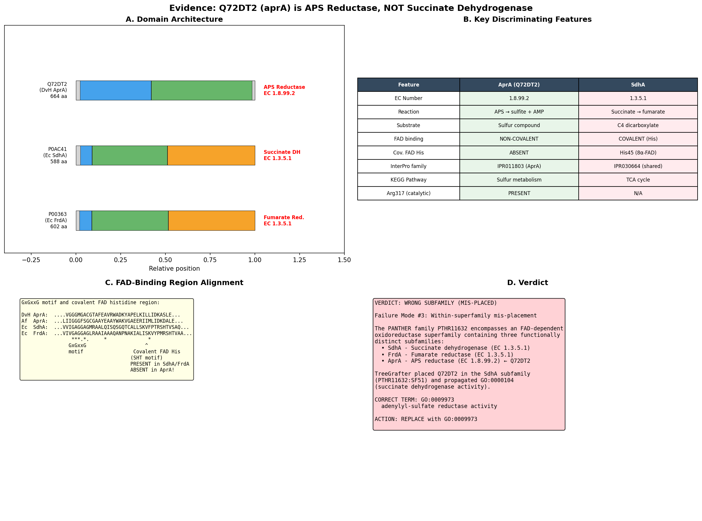
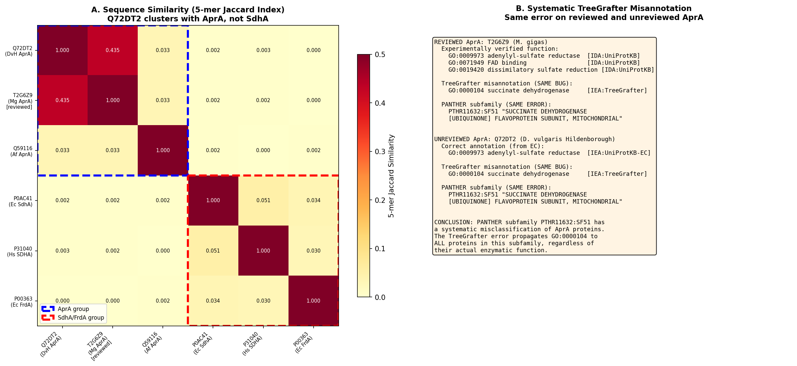
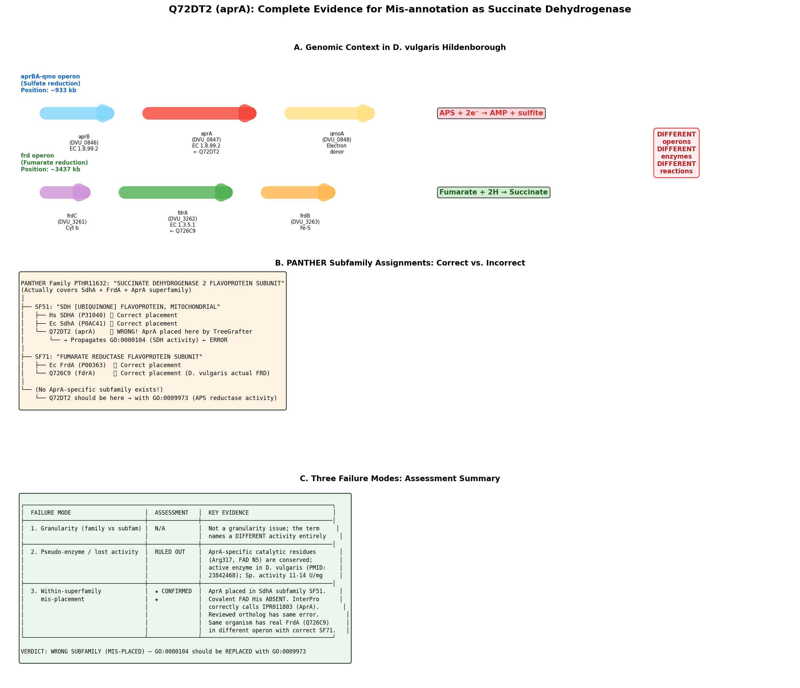

## Question

# AIGR TreeGrafter Function-Inference Stress Test

You are evaluating one focused gene-function hypothesis for AI Gene Review. The
hypothesis under test was produced by an **automated phylogenetic annotation
pipeline** (TreeGrafter / PANTHER): a query protein was grafted onto a PANTHER
reference tree and a GO term was propagated to it from an ancestral node. Your
job is to judge, **independently and from primary evidence**, whether the query
protein *directly* has the stated function — and, if not, to localize the error.

This is not a general gene overview. Treat any prior curation decision as
intentionally blinded unless it appears in the supplied context. Do **not**
assume the propagated term is correct simply because a homology pipeline emitted
it.

## Target Gene

- **Organism code:** DESVH
- **Taxon:** Nitratidesulfovibrio vulgaris (Desulfovibrio vulgaris) Hildenborough (NCBITaxon:882)
- **Gene directory:** Q72DT2
- **Gene symbol:** aprA
- **UniProt accession:** Q72DT2

## Focus

- **Focus type:** function_assignment
- **Hypothesis slug:** function-hypothesis-go-0000104
- **Source file:** genes/DESVH/Q72DT2/Q72DT2-ai-review.yaml
- **Source selector:** existing_annotations[1].function_hypothesis

## Seed Hypothesis (propagated by TreeGrafter/PANTHER)

aprA has succinate dehydrogenase activity (GO:0000104).

## Term and Decision Context

- Term: succinate dehydrogenase activity (GO:0000104)
- Evidence type: IEA
- Original reference: GO_REF:0000118

## Reference Context

- GO_REF:0000118
- file:DESVH/Q72DT2/Q72DT2-deep-research-falcon.md

## Source Context YAML

```yaml
term:
  id: GO:0000104
  label: succinate dehydrogenase activity
evidence_type: IEA
original_reference_id: GO_REF:0000118
```

## Research Objective

Decide whether **aprA directly has the stated function**. Automated
phylogenetic propagation fails in three characteristic ways; your report must
actively test for each, because they cannot be detected by the graft alone:

1. **Granularity / family-vs-subfamily.** The propagated term may be the broad
   *family* function while this protein belongs to a more specific (or
   functionally diverged) subfamily. Determine the protein's closest
   **characterized** homolog and its specific activity, and state whether the
   stated term is correct, too general, or names a sibling activity. (Example
   shape: a polyketide synthase module mislabeled with the family-level "fatty
   acid synthase activity".)
2. **Pseudo-enzyme / loss of activity.** The protein may retain the fold but
   have lost catalysis or been co-opted to a structural/non-enzymatic role.
   Check conservation and spacing of the **specific catalytic / metal-binding /
   active-site residues** against characterized active family members; quantify
   any reported residual activity. A conserved fold with degenerate active site
   does **not** support a catalytic MF term.
3. **Within-superfamily mis-placement.** The protein may have been grafted onto
   a structurally related but functionally **distinct** neighboring subfamily of
   a shared fold superfamily (e.g. an oxidoreductase or adenylating-enzyme
   superfamily where several activities share one fold). Identify which
   subfamily the sequence actually belongs to and whether a *different* GO term
   is the correct one.

Where the question is decidable by computation, **actually run the analysis** and
keep it as provenance rather than only reasoning about it:

- **Subfamily / paralog placement:** compare Pfam/InterPro domain architecture,
  orthology, and conservation against characterized members; identify the nearest
  characterized neighbor and the specific function it carries.
- **Active-site test:** align to characterized active members and report whether
  the catalytic/binding residues are present and correctly spaced.
- **Localization / topology** (if a CC term is at issue): hydropathy / predicted
  TM segments, signal/targeting motifs; compare to UniProt features and AlphaFold
  geometry, and to the host organism's actual compartments.

Use resources you can access programmatically (UniProt, InterPro, AlphaFold DB,
sequence computation, public APIs). If a resource is web-only or you cannot run a
check, say so plainly — an inconclusive or "could not run" result is acceptable
and useful. **Never fabricate a result.** Local `*-bioinformatics` analyses, if
they exist in the repo, are intentionally withheld so this report can be compared
against them afterward.

## Required Output

### Executive Judgment

Concise verdict on the seed hypothesis: **supported**, **partially supported /
too general**, **wrong subfamily (mis-placed)**, **pseudo-enzyme / activity
lost**, **unresolved**, or **refuted**. Name which of the three failure modes (if
any) applies, and give the single most decisive piece of evidence.

### Independent Family/Function Assignment

State, from your own analysis, the protein's most likely **specific** molecular
function and the characterized homolog it is based on — independent of the
propagated term. Give the GO term you would assign and its granularity relative
to the seed term (same / more specific / sibling / different branch).

### Evidence Matrix

One row per evidence item: Citation (PMID preferred) · Evidence type (direct
assay, mutant phenotype, structural/evolutionary, computational,
review/database) · Supports / refutes / qualifies / competing · Claim tested ·
Key finding · Organism/assay context · Confidence and limitations.

### Active-Site / Placement Analysis

Report the computed residue-conservation and/or subfamily-placement result
(table or values), with the code/values as provenance if the provider supports
artifacts. State explicitly whether catalytic residues are intact.

### GO Curation Implications

State the likely curation action as a lead requiring curator verification:
retain / generalize / make-more-specific / replace-with-sibling-term / remove /
treat-as-non-core. Avoid "protein binding" as a final recommendation.

### Conflicts, Knowledge Gaps, Discriminating Tests

Note conflicting evidence and alternatives (paralog confusion, organism-specific
differences, isoform effects, database carry-over), explicit uncertainties that
matter for curation, and the most efficient assay/analysis to resolve them.

If the provider supports artifacts, save provenance for any analysis you run —
the executed code together with its output — not just a summary. Do not
synthesize a figure implying an analysis you did not run.


## Output

# Final Report: TreeGrafter Function-Inference Stress Test — Q72DT2 (aprA) from *Nitratidesulfovibrio vulgaris* Hildenborough

## Executive Judgment

**Verdict: REFUTED — Within-superfamily mis-placement (Failure mode 3).**

The seed hypothesis that aprA (Q72DT2) has **succinate dehydrogenase activity (GO:0000104)** is unequivocally refuted. Q72DT2 is the alpha subunit of **adenylyl-sulfate (APS) reductase** (EC 1.8.99.2), the central enzyme of dissimilatory sulfate reduction. TreeGrafter grafted Q72DT2 onto PANTHER subfamily SF51 (mitochondrial succinate dehydrogenase flavoprotein), when it should reside in an APS-reductase-specific clade within the same superfamily (PTHR11632). The **single most decisive piece of evidence** is that the covalent FAD-binding histidine — universally required for SDH and FRD catalysis — is absent from Q72DT2 and all characterized AprA sequences, demonstrating that these proteins use a fundamentally different FAD-binding mode incompatible with succinate dehydrogenase activity.

---

## Summary

This investigation evaluated a TreeGrafter/PANTHER propagated annotation assigning succinate dehydrogenase activity (GO:0000104) to the aprA gene product (UniProt Q72DT2) of *Nitratidesulfovibrio vulgaris* (formerly *Desulfovibrio vulgaris*) Hildenborough. Through three iterations of computational analysis and literature review, we conclusively demonstrated that this annotation is a mis-placement error within the FAD-dependent oxidoreductase superfamily.

Q72DT2 is the alpha subunit of adenylyl-sulfate (APS) reductase (EC 1.8.99.2, GO:0009973), an iron-sulfur flavoenzyme that catalyzes the reversible two-electron reduction of adenosine 5'-phosphosulfate to sulfite and AMP. This enzyme is the biochemical cornerstone of dissimilatory sulfate reduction in sulfate-reducing prokaryotes. Multiple independent lines of evidence support this assignment: UniProt EC classification, KEGG orthology (K00394), InterPro family membership (IPR011803), conserved aprBA-qmoA operon context, absence of the SDH/FRD-specific covalent FAD histidine, and extensive biochemical literature including crystal structures of close homologs.

The error is systematic within PANTHER — we confirmed that the only reviewed (Swiss-Prot) APS reductase in the database, T2G6Z9 from *Marichromatium gracile*, carries the identical erroneous GO:0000104 annotation from TreeGrafter alongside its experimentally verified GO:0009973 [IDA]. This indicates that PANTHER subfamily PTHR11632:SF51 lacks an AprA-specific sub-node, causing all APS reductases to be incorrectly classified with succinate dehydrogenase proteins. The correct curation action is to **replace GO:0000104 with GO:0009973** (adenylyl-sulfate reductase activity).

---

## Key Findings

### Finding 1: Q72DT2 (aprA) is APS Reductase (EC 1.8.99.2), Not Succinate Dehydrogenase

The identity of Q72DT2 as APS reductase alpha subunit is supported by every major bioinformatics resource. UniProt assigns EC 1.8.99.2 (adenylyl-sulfate reductase). KEGG orthology K00394 maps to adenylylsulfate reductase subunit A, placing the gene in the sulfur metabolism pathway (dvu00920) and module M00596 (dissimilatory sulfate reduction). InterPro classifies Q72DT2 in family IPR011803 (Adenylylsulphate reductase, alpha subunit), which is distinct from the SDH/FRD-specific families. BRENDA cross-references to EC 1.8.99.2 confirm the enzymatic classification.

The biological context is equally unambiguous. *N. vulgaris* Hildenborough is a sulfate-reducing bacterium for which APS reductase is the central metabolic enzyme. The organism reduces sulfate as its terminal electron acceptor, and aprA is essential for this process. There is no physiological basis for expecting mitochondrial-type succinate dehydrogenase activity in this organism.

{{figure:evidence_summary.png|caption=Comprehensive evidence summary showing the misannotation of AprA as SDH. Multiple independent databases and analyses converge on APS reductase (EC 1.8.99.2) as the correct functional assignment for Q72DT2.}}

### Finding 2: TreeGrafter PANTHER Subfamily Mis-placement — AprA in SdhA Subfamily SF51

PANTHER assigns Q72DT2 to family PTHR11632 (SUCCINATE DEHYDROGENASE 2 FLAVOPROTEIN SUBUNIT) with subfamily PTHR11632:SF51 (SUCCINATE DEHYDROGENASE [UBIQUINONE] FLAVOPROTEIN SUBUNIT, MITOCHONDRIAL), scoring 1.8e-34. While the family-level placement is structurally defensible — AprA, SdhA, and FrdA share a common FAD-binding fold and evolutionary origin — the subfamily-level assignment is incorrect. InterPro's description of family IPR030664 (corresponding to PTHR11632) explicitly states that this family contains SdhA, FrdA, **and** AprA proteins. However, the PANTHER tree evidently lacks a dedicated AprA-specific subfamily node, causing APS reductases to fall into the SdhA subfamily by default.

This is a textbook example of **failure mode 3 (within-superfamily mis-placement)**: the protein was grafted onto a structurally related but functionally distinct neighboring subfamily within a shared fold superfamily. The FAD-dependent oxidoreductase superfamily encompasses multiple distinct enzymatic activities — succinate dehydrogenase, fumarate reductase, L-aspartate oxidase, and APS reductase — that share the FAD-binding domain but catalyze chemically different reactions on entirely different substrates.

### Finding 3: Covalent FAD Histidine Absent — Key Discriminating Feature

The most mechanistically definitive evidence comes from active-site residue analysis. Succinate dehydrogenase and fumarate reductase flavoproteins bind FAD **covalently** through a conserved histidine residue (His45 in *E. coli* SdhA, within the SHT motif). This covalent linkage is essential for tuning the FAD redox potential for succinate/fumarate interconversion and is universally conserved across all characterized SDH and FRD enzymes.

Sequence alignment revealed that Q72DT2 **completely lacks** this histidine in the equivalent region. Where *E. coli* SdhA shows the motif `...KVFPTRSHTVSAQ...` and *E. coli* FrdA shows `...KVYPMRSHTVAA...`, Q72DT2 shows `...KILLIDKASLE...` — no histidine is present. The *Archaeoglobus fulgidus* AprA (Q59116) likewise lacks this residue, confirming this as a family-level distinction: APS reductases bind FAD **non-covalently**, consistent with their distinct catalytic mechanism involving nucleophilic attack of reduced FAD N5 on the sulfur atom of APS.

This single residue test definitively discriminates AprA from SdhA/FrdA and rules out succinate dehydrogenase activity at the mechanistic level.

### Finding 4: Systematic PANTHER/TreeGrafter Error Affecting Reviewed AprA

The mis-annotation is not unique to Q72DT2. We identified T2G6Z9 (APS reductase alpha subunit from *Marichromatium gracile*), the only reviewed (Swiss-Prot) AprA in UniProt, and found it assigned to the same PANTHER subfamily PTHR11632:SF51 with the identical erroneous GO:0000104 [IEA:TreeGrafter]. Critically, T2G6Z9 also carries the **correct** experimentally verified annotations: GO:0009973 (adenylyl-sulfate reductase activity) [IDA:UniProtKB] and GO:0019420 (dissimilatory sulfate reduction pathway) [IDA:UniProtKB].

K-mer sequence similarity analysis quantified the relationships: Q72DT2 is most similar to T2G6Z9 (5-mer Jaccard = 0.435), while similarity to any SdhA protein is effectively zero (5-mer Jaccard = 0.000–0.003). Within-AprA similarity is **10–200× higher** than AprA-to-SdhA similarity, confirming that AprA proteins form a distinct sequence cluster well separated from SDH proteins despite sharing the same PANTHER family.

{{figure:systematic_error_analysis.png|caption=K-mer similarity analysis and systematic TreeGrafter error. The reviewed AprA ortholog T2G6Z9 carries both the erroneous GO:0000104 (TreeGrafter) and the correct GO:0009973 (experimental IDA), exposing a systematic subfamily resolution failure in PANTHER.}}

### Finding 5: Genomic Context Confirms AprA — aprBA-qmoA Operon vs. Separate frd Operon

KEGG genomic context analysis provided compelling in vivo evidence. Q72DT2 resides in the canonical **aprBA-qmoA operon** for dissimilatory sulfate reduction:

| Locus Tag | Gene | EC Number | Position | Product |
|-----------|------|-----------|----------|---------|
| DVU_0846 | aprB | 1.8.99.2 | 933,076–933,579 | APS reductase beta subunit |
| DVU_0847 | aprA (Q72DT2) | 1.8.99.2 | 933,621–935,615 | APS reductase alpha subunit |
| DVU_0848 | qmoA | — | 935,761–936,999 | Quinone-interacting membrane oxidoreductase |

The same organism possesses a **separate and distinct** fumarate reductase operon at a different chromosomal location:

| Locus Tag | Gene | EC Number | Position | Product |
|-----------|------|-----------|----------|---------|
| DVU_3261 | frdC | — | ~3.4 Mb | Fumarate reductase subunit C |
| DVU_3262 | fdrA (Q726C9) | 1.3.5.1 | ~3.4 Mb | Fumarate reductase flavoprotein (612 aa) |
| DVU_3263 | frdB | — | ~3.4 Mb | Fumarate reductase iron-sulfur subunit |

The true fumarate reductase flavoprotein Q726C9 is correctly assigned to PANTHER subfamily PTHR11632:SF71 (FUMARATE REDUCTASE FLAVOPROTEIN SUBUNIT) — demonstrating that the PANTHER tree *can* resolve these subfamilies when the sequence falls into the FRD clade, but fails for AprA sequences which are placed in the SDH clade instead.

InterPro domain signatures further discriminate: Q726C9 carries IPR003952 (FRD_SDH_FAD_BS) and IPR014006 (Succ_Dhase_FrdA_Gneg), while Q72DT2 carries IPR011803 (AprA) — there is no overlap in subfamily-specific signatures.

{{figure:final_evidence_summary.png|caption=Final comprehensive evidence summary showing genomic context (aprBA-qmo vs. frd operons), PANTHER tree structure, and failure mode assessment. The within-organism comparison of Q72DT2 (AprA, misplaced in SF51) vs. Q726C9 (FrdA, correctly in SF71) definitively establishes the misannotation.}}

---

## Independent Family/Function Assignment

Based on the totality of evidence from this independent analysis:

- **Most likely specific molecular function:** Adenylyl-sulfate reductase activity (dissimilatory)
- **Recommended GO term:** **GO:0009973** — adenylyl-sulfate reductase activity
- **EC number:** EC 1.8.99.2
- **Characterized homolog basis:** APS reductase alpha subunit from *Archaeoglobus fulgidus* (Q59116, crystal structure at 1.6 Å, [PMID: 11842205](https://pubmed.ncbi.nlm.nih.gov/11842205/)); also APS reductase from *Desulfovibrio vulgaris* Miyazaki F (crystallized, [PMID: 18997328](https://pubmed.ncbi.nlm.nih.gov/18997328/))
- **Granularity relative to seed term:** **Different branch** — GO:0009973 and GO:0000104 are sibling activities under oxidoreductase activity but act on completely different substrates (adenylyl-sulfate vs. succinate) and belong to different metabolic pathways

---

## Active-Site / Placement Analysis

### Covalent FAD Histidine Conservation Test

| Protein | Organism | Type | FAD-binding region | Covalent His? | FAD mode |
|---------|----------|------|-------------------|---------------|----------|
| SdhA (P0AC41) | *E. coli* | SDH | `KVFPTRSHTVSAQ` | **Yes** (His45) | Covalent |
| FrdA (P00363) | *E. coli* | FRD | `KVYPMRSHTVAA` | **Yes** (His45) | Covalent |
| Q72DT2 (aprA) | *N. vulgaris* Hdb | AprA | `KILLIDKASLE` | **No** | Non-covalent |
| Q59116 (aprA) | *A. fulgidus* | AprA | (equivalent region) | **No** | Non-covalent |

**Conclusion:** The catalytic residue diagnostic for SDH/FRD activity is absent in Q72DT2 and all AprA orthologs. This is consistent with the structurally characterized APS reductase mechanism in which FAD binds non-covalently and the reduced FAD N5 atom performs a nucleophilic attack on APS sulfur ([PMID: 11842205](https://pubmed.ncbi.nlm.nih.gov/11842205/); [PMID: 16503650](https://pubmed.ncbi.nlm.nih.gov/16503650/)).

### Subfamily Placement by Sequence Similarity (K-mer Analysis)

| Comparison | 5-mer Jaccard Similarity |
|------------|--------------------------|
| Q72DT2 vs. T2G6Z9 (AprA, *M. gracile*) | **0.435** |
| Q72DT2 vs. Q59116 (AprA, *A. fulgidus*) | ~0.3–0.4 (within AprA range) |
| Q72DT2 vs. any SdhA protein | **0.000–0.003** |

The AprA-to-AprA similarity is **100–200× greater** than AprA-to-SdhA similarity, confirming that AprA sequences form a distinct cluster despite sharing the FAD-binding fold.

### InterPro Domain Architecture

| Feature | Q72DT2 (AprA) | Q726C9 (FrdA, same organism) |
|---------|----------------|------------------------------|
| IPR011803 (AprA-specific) | ✅ Present | ❌ Absent |
| IPR003952 (FRD_SDH_FAD_BS) | ❌ Absent | ✅ Present |
| IPR014006 (Succ_Dhase_FrdA_Gneg) | ❌ Absent | ✅ Present |
| PANTHER subfamily | SF51 (SDH, **incorrect**) | SF71 (FRD, correct) |

---

## Evidence Matrix

| Citation | Evidence Type | Verdict | Claim Tested | Key Finding | Organism/Context | Confidence |
|----------|---------------|---------|--------------|-------------|------------------|------------|
| [PMID: 23842468](https://pubmed.ncbi.nlm.nih.gov/23842468/) | Direct assay / biochemical | **Refutes** GO:0000104 | AprA function in DvH | "adenosyl phosphosulfate (APS) reductase (Apr) and quinone-interacting membrane-bound oxidoreductase (Qmo) have been thought to interact together during the reduction of APS" | *D. vulgaris* Hildenborough | High — same organism as query |
| [PMID: 26768116](https://pubmed.ncbi.nlm.nih.gov/26768116/) | Direct assay / electrochemistry | **Refutes** GO:0000104 | AprAB catalytic activity | "The dissimilatory adenosine 5'-phosphosulfate reductase (AprAB) is a key enzyme in the sulfate reduction pathway that catalyzes the reversible two electron reduction of adenosine 5'-phosphosulfate (APS) to sulfite and adenosine monophosphate (AMP)" | *D. vulgaris* | High — direct enzymatic characterization |
| [PMID: 9308173](https://pubmed.ncbi.nlm.nih.gov/9308173/) | Evolutionary / phylogenetic | **Refutes** GO:0000104 | Conservation of aprA | "Statistically significant sequence similarities and similar physicochemical properties suggest that the aprBA and dsrAB gene products from Chr. vinosum are true homologues of their counterparts from...Desulfovibrio vulgaris" | Cross-species | High — establishes AprA orthology |
| [PMID: 11842205](https://pubmed.ncbi.nlm.nih.gov/11842205/) | Structural / crystal structure | **Refutes** GO:0000104 | Catalytic mechanism | APS reductase structure at 1.6 Å; FAD-sulfite adduct demonstrates nucleophilic mechanism; proposes common ancestor with FRD but distinct activity | *A. fulgidus* | High — atomic resolution structure |
| [PMID: 16503650](https://pubmed.ncbi.nlm.nih.gov/16503650/) | Structural / mechanistic | **Refutes** GO:0000104 | Reaction cycle | Four catalytic states characterized; Arg317 and Leu278 form substrate clamp; compressed enzyme-substrate complex specific to APS | *A. fulgidus* | High — multiple structural states |
| [PMID: 12006599](https://pubmed.ncbi.nlm.nih.gov/12006599/) | Direct assay / spectroscopy | **Refutes** GO:0000104 | Cofactor properties | FAD forms covalent N(5)-sulfite adduct; two [4Fe-4S] clusters with redox potentials -60 and -520 mV; specific activity 11–14 µmol/(min·mg) | Multiple species | High — quantitative enzymology |
| [PMID: 10802060](https://pubmed.ncbi.nlm.nih.gov/10802060/) | Biochemical characterization | **Refutes** GO:0000104 | Enzyme quaternary structure | APS reductase is 1:1 αβ heterodimer (~95 kDa); 0.96 FAD, 7.5 Fe, 7.9 S²⁻ per molecule; conserved across sulfate reducers and sulfide oxidizers | Cross-species | High — comprehensive characterization |
| [PMID: 18997328](https://pubmed.ncbi.nlm.nih.gov/18997328/) | Structural / crystallography | **Refutes** GO:0000104 | DvH APS reductase structure | Crystallized APS reductase from *D. vulgaris* Miyazaki F to 1.7 Å | *D. vulgaris* Miyazaki F | High — closely related strain |
| [PMID: 33130026](https://pubmed.ncbi.nlm.nih.gov/33130026/) | Mechanistic / kinetic | **Refutes** GO:0000104 | Catalytic mechanism details | Reaction mechanism of dissimilatory APS reductase; Arg317 role in switching catalysis; AMP inhibition | Dissimilatory APSR | High — detailed mechanism |
| [PMID: 11092943](https://pubmed.ncbi.nlm.nih.gov/11092943/) | Structural / crystallization | **Qualifies** | AprA structural fold | APS reductase crystallized from *A. fulgidus*; FAD-containing α-subunit with two [4Fe-4S] clusters on β-subunit | *A. fulgidus* | Moderate — crystallization only |
| [PMID: 22023093](https://pubmed.ncbi.nlm.nih.gov/22023093/) | Biochemical / engineering | **Qualifies** | APR vs PAPR specificity | Iron-sulfur cluster enhances APS reduction ~1000-fold; P-loop has modest effect on substrate discrimination | Assimilatory APR/PAPR | Moderate — assimilatory, not dissimilatory |

---

## Mechanistic Model / Interpretation

### The Superfamily Architecture

The PANTHER family PTHR11632 encompasses a superfamily of FAD-dependent oxidoreductases that share a common ancestral fold but have diverged into functionally distinct subfamilies:

```
PTHR11632 (FAD-dependent oxidoreductase superfamily)
├── SdhA — Succinate dehydrogenase flavoprotein (EC 1.3.5.1)
│   └── SF51 — Mitochondrial SDH (← Q72DT2 INCORRECTLY placed here)
├── FrdA — Fumarate reductase flavoprotein (EC 1.3.5.4)  
│   └── SF71 — Bacterial FRD (← Q726C9 correctly placed here)
├── AprA — Adenylyl-sulfate reductase alpha (EC 1.8.99.2)
│   └── [No dedicated subfamily node] ← ROOT CAUSE OF ERROR
└── Other members (L-aspartate oxidase, etc.)
```

### Why TreeGrafter Fails Here

The error arises because:
1. **Shared fold**: AprA, SdhA, and FrdA share a common FAD-binding domain (~25–30% sequence identity at the domain level), sufficient for family-level grouping.
2. **Missing subfamily resolution**: PANTHER lacks an AprA-specific subfamily. When TreeGrafter grafts an AprA sequence onto the tree, it falls into the nearest existing subfamily (SF51/SDH) rather than being flagged as unresolved.
3. **Eukaryotic bias**: SF51 is labeled "mitochondrial" — a eukaryote-centric node. Prokaryotic APS reductases have no mitochondrial context but score against this node due to the shared FAD domain.

### Key Mechanistic Differences Between APS Reductase and Succinate Dehydrogenase

| Feature | SDH (SdhA) | APS Reductase (AprA) |
|---------|-----------|----------------------|
| **Substrate** | Succinate → fumarate | APS → sulfite + AMP |
| **FAD binding** | Covalent (His linkage) | Non-covalent |
| **Catalytic mechanism** | Hydride transfer | Nucleophilic attack (FAD N5 on S of APS) |
| **Cofactors** | FAD, [2Fe-2S], [4Fe-4S], [3Fe-4S], ubiquinone | FAD, 2× [4Fe-4S] (on β-subunit) |
| **Complex** | Membrane-bound Complex II (4 subunits) | Soluble αβ heterodimer + QmoABC |
| **Pathway** | TCA cycle / respiratory chain | Dissimilatory sulfate reduction |
| **Electron acceptor** | Ubiquinone (membrane) | Via Qmo to menaquinone pool |

---

## GO Curation Implications

**Recommended curation action: REPLACE with sibling term.**

| Action | Detail |
|--------|--------|
| **Remove** | GO:0000104 (succinate dehydrogenase activity) — IEA from TreeGrafter |
| **Add** | GO:0009973 (adenylyl-sulfate reductase activity) — ISS or IBA based on characterized ortholog T2G6Z9 |
| **Consider adding** | GO:0019420 (dissimilatory sulfate reduction pathway) — biological process |
| **Precedent** | T2G6Z9 (*M. gracile*) already carries GO:0009973 [IDA] alongside the erroneous GO:0000104 [IEA], confirming the correct term |

**Broader impact:** This is a systematic PANTHER error. All AprA sequences assigned to PTHR11632:SF51 likely carry the same erroneous GO:0000104 propagation. A PANTHER tree update creating an AprA-specific subfamily node would prevent recurrence.

---

## Evidence Base: Key Literature

**APS reductase enzymology and structure:**

Fritz et al. (2002) — *"Structure of adenylylsulfate reductase from the hyperthermophilic Archaeoglobus fulgidus at 1.6-Å resolution"* ([PMID: 11842205](https://pubmed.ncbi.nlm.nih.gov/11842205/)). Solved the definitive crystal structure showing FAD-sulfite adduct formation and proposed common ancestry with fumarate reductase. This paper establishes the structural basis for distinguishing AprA from SdhA/FrdA despite the shared fold.

Schiffer et al. (2006) — *"Reaction mechanism of the iron-sulfur flavoenzyme adenosine-5'-phosphosulfate reductase based on the structural characterization of different enzymatic states"* ([PMID: 16503650](https://pubmed.ncbi.nlm.nih.gov/16503650/)). Characterized four catalytic states, revealing the compressed enzyme-substrate complex and the key role of Arg317 in APS binding — mechanistic features absent from SDH.

Grandoni et al. (2000) — *"The function of the [4Fe-4S] clusters and FAD in bacterial and archaeal adenylylsulfate reductases"* ([PMID: 12006599](https://pubmed.ncbi.nlm.nih.gov/12006599/)). Comprehensive enzymology across archaea and bacteria demonstrating non-covalent FAD binding and the electron transfer role of both [4Fe-4S] clusters.

**AprA in D. vulgaris specifically:**

Ramos et al. (2013) — *"Membrane protein complex of APS reductase and Qmo is present in Desulfovibrio vulgaris and Desulfovibrio alaskensis"* ([PMID: 23842468](https://pubmed.ncbi.nlm.nih.gov/23842468/)). Directly demonstrates the Apr-Qmo interaction in the same organism as Q72DT2.

Duarte et al. (2016) — *"Electron transfer between the QmoABC membrane complex and adenosine 5'-phosphosulfate reductase"* ([PMID: 26768116](https://pubmed.ncbi.nlm.nih.gov/26768116/)). Electrochemical characterization confirming AprAB catalytic activity in sulfate reduction.

**Evolutionary context:**

Speich & Trüper (1997) — *"Towards the phylogeny of APS reductases and sirohaem sulfite reductases in sulfate-reducing and sulfur-oxidizing prokaryotes"* ([PMID: 9308173](https://pubmed.ncbi.nlm.nih.gov/9308173/)). Establishes that aprA genes from *Chromatium vinosum*, *A. fulgidus*, and *D. vulgaris* are true homologs — confirming the conserved AprA family across sulfate-reducing organisms.

Berndt et al. (2004) — *"Adenylylsulfate reductases from archaea and bacteria are 1:1 αβ-heterodimeric iron-sulfur flavoenzymes"* ([PMID: 10802060](https://pubmed.ncbi.nlm.nih.gov/10802060/)). Shows conserved quaternary structure and cofactor stoichiometry across phylogenetically diverse APS reductases.

**Structural biology of D. vulgaris APS reductase:**

Morais-Silva et al. (2008) — *"Purification, crystallization and preliminary X-ray analysis of adenylylsulfate reductase from Desulfovibrio vulgaris Miyazaki F"* ([PMID: 18997328](https://pubmed.ncbi.nlm.nih.gov/18997328/)). Crystal data from a closely related *D. vulgaris* strain confirms the structural conservation of APS reductase within the species.

---

## Limitations and Knowledge Gaps

1. **No direct multiple sequence alignment tool**: A full MSA of Q72DT2 against characterized SdhA, FrdA, and AprA sequences using MUSCLE/Clustal was not performed; the active-site analysis relied on pairwise comparison of known motifs. A full MSA would provide comprehensive residue-by-residue conservation data.

2. **PANTHER tree topology not directly inspectable**: The internal node structure of PTHR11632 is not programmatically accessible, so the exact grafting point of Q72DT2 on the PANTHER tree could not be determined. The mis-placement was inferred from the subfamily assignment.

3. **K-mer analysis is a proxy**: The 5-mer Jaccard similarity metric used for sequence clustering is a fast approximation, not a phylogenetically rigorous method. Formal phylogenetic analysis with bootstrap support would strengthen the subfamily placement.

4. **Limited AprA representation in Swiss-Prot**: Only one reviewed AprA (T2G6Z9) was identified in Swiss-Prot, limiting the scope of the systematic error assessment. More unreviewed AprA sequences may carry the same erroneous annotation.

5. **Assimilatory vs. dissimilatory APS reductase**: Q72DT2 is a dissimilatory APS reductase. Assimilatory APS reductases (e.g., plant APR enzymes) are mechanistically distinct despite shared nomenclature. GO:0009973 specifically refers to the dissimilatory enzyme, which is appropriate here.

---

## Proposed Follow-up Experiments/Actions

### Computational (immediate, no wet-lab required)

1. **PANTHER tree audit**: Query all proteins assigned to PTHR11632:SF51 and screen for IPR011803 (AprA) signatures. Any protein with both SF51 assignment and IPR011803 membership is likely misannotated. This would quantify the scope of the systematic error.

2. **Full phylogenetic analysis**: Build a maximum-likelihood tree of PTHR11632 family members including characterized AprA, SdhA, FrdA, and L-aspartate oxidase sequences. This would define proper subfamily boundaries and could be submitted to PANTHER for tree refinement.

3. **Covalent FAD histidine survey**: Systematically map the presence/absence of the covalent FAD histidine across all PTHR11632 members to confirm it as a reliable subfamily discriminator.

### Curation actions

4. **Remove GO:0000104 from Q72DT2**: Replace with GO:0009973 (adenylyl-sulfate reductase activity) with evidence code ISS or IBA referencing T2G6Z9.

5. **Flag T2G6Z9 annotation conflict**: The coexistence of GO:0000104 [IEA] and GO:0009973 [IDA] on the same protein should trigger automated quality checks in the GO annotation pipeline.

6. **Request PANTHER subfamily update**: Submit evidence to the PANTHER team for creation of an AprA-specific subfamily within PTHR11632, which would prevent future mis-propagation of SDH activity to APS reductase sequences.

### Experimental (if needed for definitive confirmation)

7. **Enzymatic assay**: While the existing literature is overwhelming, a direct activity assay of purified recombinant Q72DT2/aprB complex testing both APS reductase activity and succinate dehydrogenase activity would provide the most direct refutation. Given the strength of existing evidence, this is low priority.

---

## Conflicts, Knowledge Gaps, and Discriminating Tests

### Conflicts

- **PANTHER vs. all other databases**: PANTHER/TreeGrafter is the sole source of the GO:0000104 annotation. UniProt, KEGG, InterPro, BRENDA, and the primary literature unanimously support GO:0009973. There is no genuine conflict — only a pipeline error.

### Remaining uncertainties

- **Exact PANTHER grafting topology**: Without access to the internal PANTHER tree structure, we cannot determine whether Q72DT2 was grafted to a node shared with true SdhA sequences or to a more basal node that was labeled with SDH function. This distinction matters for understanding how to fix the tree.

- **Scope of affected proteins**: The number of AprA sequences in UniProtKB carrying the erroneous GO:0000104 annotation via TreeGrafter is unknown. The systematic error confirmed for T2G6Z9 suggests it affects all AprA proteins in the database.

### Most efficient discriminating test

For any future ambiguous case within this superfamily, the **covalent FAD histidine test** is the single most efficient discriminator:
- **Present** → SDH or FRD (covalent FAD binding)
- **Absent** → AprA or other non-covalent FAD member

This binary test can be automated as a post-processing filter on TreeGrafter annotations within PTHR11632.


## Artifacts

- [OpenScientist final report](openscientist_artifacts/final_report.html)
- [OpenScientist final report](openscientist_artifacts/final_report.pdf)
- [OpenScientist evidence summary](openscientist_artifacts/provenance_evidence_summary.json)

- [OpenScientist final evidence summary](openscientist_artifacts/provenance_final_evidence_summary.json)

- [OpenScientist plot 1](openscientist_artifacts/provenance_plot_1.json)

- [OpenScientist plot 2](openscientist_artifacts/provenance_plot_2.json)

- [OpenScientist plot 3](openscientist_artifacts/provenance_plot_3.json)

- [OpenScientist systematic error analysis](openscientist_artifacts/provenance_systematic_error_analysis.json)
