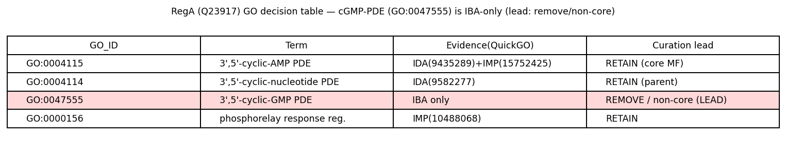
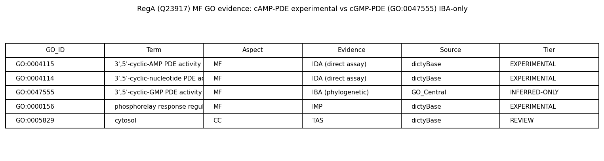

## Question

# AIGR Gene Hypothesis Deep Research

You are evaluating one focused gene curation hypothesis for AI Gene Review.
This is not a general gene overview. Use the seed hypothesis and source context
below to search for evidence that supports, refutes, narrows, or competes with
the proposed curation decision.

## Target Gene

- **Organism code:** DICDI
- **Taxon:** Dictyostelium discoideum (NCBITaxon:44689)
- **Gene directory:** regA
- **Gene symbol:** regA
- **UniProt accession:** Q23917

## Focus

- **Focus type:** function_assignment
- **Hypothesis slug:** function-hypothesis-go-0047555
- **Source file:** genes/DICDI/regA/regA-ai-review.yaml
- **Source selector:** free-text

## Seed Hypothesis

Dictyostelium discoideum RegA has 3',5'-cyclic-GMP phosphodiesterase activity (GO:0047555). Examine quantitative primary substrate specificity and kinetics for cAMP and cGMP, distinguishing undetectable cGMP turnover from measurable but weak promiscuity, and assess whether any cGMP activity is biologically meaningful. Verify the exact protein and separate related PDE paralogs.

## Term and Decision Context

No specific term context supplied.

## Reference Context

No specific reference context supplied.

## Source Context YAML

```yaml
hypothesis: Dictyostelium discoideum RegA has 3',5'-cyclic-GMP phosphodiesterase activity (GO:0047555).
  Examine quantitative primary substrate specificity and kinetics for cAMP and cGMP, distinguishing undetectable
  cGMP turnover from measurable but weak promiscuity, and assess whether any cGMP activity is biologically
  meaningful. Verify the exact protein and separate related PDE paralogs.
focus_type: function_assignment
context: []
reference_id: []
```

## Research Objective

Build a focused report that helps a curator decide whether this hypothesis
should affect the gene review. Address the focus type directly:

1. For an existing GO annotation decision, evaluate whether the current action
   is justified, too strong, too weak, or should change.
2. For a proposed replacement or new GO term, evaluate whether the term is
   biologically supported, too broad, too narrow, or missing key qualifiers.
3. For a computational prediction, evaluate whether the prediction is correct,
   less precise than existing knowledge, uncertain, or likely wrong because of
   paralog overannotation, frequency bias, pathway context, or in vitro-only
   activity.
4. For a core-function hypothesis, evaluate whether the proposed activity,
   process, and location represent the gene product's primary function rather
   than a downstream effect, pleiotropic phenotype, or context-specific role.
5. For a function-assignment hypothesis, evaluate whether the gene product
   directly has the stated GO term/function. Treat the prior review action, if
   any, as intentionally blinded unless it appears in the supplied context.

Use primary literature whenever possible. Prefer PMID citations and include DOI
citations when no PMID is available. Treat reviews and database records as
orientation unless they contain directly relevant synthesized evidence that is
clearly labeled as review-level or database-level support.

Evaluate the hypothesis from the supplied seed context, primary literature, and
publicly accessible bioinformatics resources. Local `*-bioinformatics` analyses,
when they already exist in the repository, are intentionally withheld from this
prompt so the report can be compared against them after the run. Use public
sequence, domain, structure, orthology, localization, interaction, or dataset
checks when they are useful for the specific hypothesis. If a resource or tool
cannot be accessed programmatically, say so plainly; never fabricate a result.
Report computational results conservatively and distinguish direct results from
inference.

## Required Output

### Executive Judgment

Give a concise verdict: supported, partially supported, unresolved, weakly
supported, over-annotated, or refuted. Explain the reasoning and the most
important caveats.

### Evidence Matrix

Create a table with one row per important evidence item:

- Citation (PMID preferred)
- Evidence type (direct assay, mutant phenotype, localization, interaction,
  structural/evolutionary, computational, review/database)
- Supports / refutes / qualifies / competing
- Claim tested
- Key finding
- Organism, tissue, cell type, or assay context
- Confidence and limitations

### GO Curation Implications

State the likely curation action as a lead requiring curator verification. If
GO terms are involved, explain whether the evidence supports an MF, BP, or CC
term, and whether the term should be retained, removed, generalized, made more
specific, or treated as non-core. Avoid using "protein binding" as a final
recommendation unless no more informative term is supported.

### Mechanistic Scope

Describe the immediate molecular or cellular function being tested. Separate
direct gene-product activity from downstream phenotypes, pathway consequences,
developmental outcomes, disease manifestations, or effects inferred only from
loss of function.

### Conflicts and Alternatives

Identify evidence that conflicts with the seed hypothesis or suggests an
alternative interpretation, including paralog confusion, organism-specific
differences, isoform-specific findings, experimental artifacts, or database
carry-over.

### Knowledge Gaps

List explicit uncertainties that matter for curation. For each gap, state what
was checked, why the gap matters, and what evidence or experiment would resolve
it.

### Discriminating Tests

Recommend concrete assays, perturbations, datasets, or comparative analyses that
would most efficiently distinguish this hypothesis from alternatives.

### Curation Leads

Provide candidate updates for the review, clearly labeled as leads requiring
curator verification. Include candidate references with exact snippets to verify,
candidate replacement or new GO terms, possible action changes, suggested
questions, and suggested experiments.

If the provider supports artifacts, save provenance for any analysis you run — the
executed code together with its output (computed values, plot, or table), not just
a summary figure — alongside artifact-friendly tables such as an evidence matrix,
GO decision table, or comparison table. Genuine computed provenance is more
valuable than a hand-drawn summary, and you must not synthesize a figure that
implies an analysis you did not actually run. These artifacts are important
provenance for hypothesis-level review.


## Output

# AIGR Gene Hypothesis Deep Research — Final Report

## Target: *Dictyostelium discoideum* RegA (UniProt Q23917)
## Hypothesis: RegA has 3',5'-cyclic-GMP phosphodiesterase activity (GO:0047555)
## Focus type: function_assignment

---

## Executive Judgment

**Verdict: Over-annotated / refuted as a core function (with a narrow caveat for undetected weak promiscuity).**

The proposed function assignment — that *D. discoideum* RegA (Q23917) directly possesses **3',5'-cyclic-GMP phosphodiesterase activity (GO:0047555)** — is **not supported by any experimental evidence** and is best treated as a phylogenetically inferred paralog over-annotation. Every primary characterization of RegA describes it as a **cAMP-specific phosphodiesterase**. The enzyme that gives RegA its name and its assigned EC number (EC 3.1.4.53, cAMP-specific 3',5'-cyclic-nucleotide phosphodiesterase) has a measured cAMP Km of approximately 5 µM, and no primary paper reports cGMP as a substrate, let alone quantitative cGMP turnover parameters (kcat, Km, or kcat/Km).

The GO:0047555 annotation on RegA rests on a **single Inferred from Biological Ancestor (IBA)** annotation from the phylogenetically-driven GO_Central pipeline (ECO:0000318, GO_REF:0000033). There is **no IDA, IMP, or other experimental (EXP) evidence** for cGMP hydrolysis by RegA. In sharp contrast, the cAMP-PDE activity (GO:0004115) is backed by direct assay evidence (IDA/IMP) from multiple primary papers. This asymmetry is the crux of the curation decision: the well-supported cAMP-PDE term should be retained, while the cGMP-PDE term is a lead to **remove or demote to non-core**.

Critically, *Dictyostelium* does have dedicated intracellular cGMP phosphodiesterases — but they are **distinct paralogs (GbpA/stmF and GbpB)** that use an entirely different catalytic chemistry (a class II Zn²⁺ metallo-β-lactamase-type hydrolase domain), not RegA's class I (Pfam PF00233, PDEase_I) catalytic domain. The existence of these dedicated cGMP-PDEs both explains where the organism's cGMP-hydrolyzing activity actually resides and reinforces that RegA is not required or characterized for that role. The only residual uncertainty — and the reason the verdict is "over-annotated" rather than flatly "refuted" — is that no published study has performed a side-by-side, sensitive cAMP-vs-cGMP kinetic assay on purified RegA specifically to rule out weak, biologically negligible cGMP turnover. That gap is what a curator-directed experiment could close.

---

## Key Findings

### Finding F001 — RegA is a cAMP-specific phosphodiesterase; the cGMP-PDE annotation is inferred-only

The authoritative sequence record, **UniProt Q23917 (PDE2_DICDI)**, names the protein "3',5'-cyclic-nucleotide phosphodiesterase regA," assigns **EC 3.1.4.53** (the cAMP-specific PDE enzyme class), and carries a FUNCTION comment stating the enzyme is a "**Phosphodiesterase specific for cAMP**." The only catalytic activity annotated in the record is the reaction *3',5'-cyclic AMP + H₂O = AMP* (RHEA:25277). **No cGMP reaction is annotated.** If UniProt curators had accepted experimental cGMP turnover, the record would list a cGMP hydrolysis reaction and a corresponding EC number (3.1.4.35 or 3.1.4.17); it does not.

The GO evidence tiers reveal the annotation asymmetry directly. GO:0004115 (**cAMP-specific PDE activity**) is supported by **IDA / experimental** evidence from dictyBase. GO:0047555 (**cGMP-specific PDE activity**) is supported **only by IBA (phylogenetic, GO_Central)** with **no experimental (IDA/IMP) support**. The domain architecture is consistent with a class I cyclic-nucleotide PDE fused to a signaling receiver domain: a **response-regulator receiver domain (residues ~161–280)** followed by a **class I PDEase catalytic domain (residues ~410–733, Pfam PF00233, PDEase_I)**. This bipartite architecture is the molecular signature of RegA as a phosphorelay-regulated cAMP-PDE, and it is the receiver domain (activated by phosphorylation on a conserved aspartate) that gates the cAMP-hydrolyzing catalytic domain.

A primary-literature review of *D. discoideum* two-component/histidine-kinase signaling ([PMID: 24086589](https://pubmed.ncbi.nlm.nih.gov/24086589/)) states plainly that "**RegA is a cAMP phosphodiesterase that is activated upon receiving phosphates through a phosphorelay**" — i.e., the characterized activity is cAMP hydrolysis, not cGMP.

### Finding F002 — *Dictyostelium* cGMP-PDE activity is carried by separate paralogs (GbpA/stmF, GbpB), not RegA

The organism's genuine intracellular cGMP-hydrolyzing enzymes are the **GbpA and GbpB** proteins, which are mechanistically and evolutionarily distinct from RegA. Bosgraaf et al. 2002 ([PMID: 12429832](https://pubmed.ncbi.nlm.nih.gov/12429832/)) showed that **gbpA encodes a cGMP-stimulated cGMP-phosphodiesterase** and reported explicitly that "**cAMP neither activates nor is a substrate of GbpA**," whereas **gbpB encodes a dual-specificity PDE** that "hydrolyses cAMP approximately 9-fold faster than cGMP." Crucially, GbpA and GbpB use a **class II Zn²⁺-hydrolase (metallo-β-lactamase) catalytic domain** — architecturally unrelated to RegA's class I PF00233 domain. The classic *streamer F* (**stmF**) mutant, long known to delete the intracellular cGMP-PDE and prolong the chemoattractant-stimulated cGMP response, corresponds to GbpA in the van Haastert lineage ([PMID: 9551091](https://pubmed.ncbi.nlm.nih.gov/9551091/)).

Independently, the closest characterized homolog of RegA's catalytic domain in the trypanosomatid literature, **TbPDE2B**, is a cAMP-specific class I PDE for which Rascon et al. 2002 ([PMID: 11930017](https://pubmed.ncbi.nlm.nih.gov/11930017/)) reported that "**cGMP is not hydrolyzed**." This evolutionary comparison reinforces the expectation that RegA's class I catalytic domain is cAMP-selective. Together these findings localize the true cGMP-PDE function to dedicated paralogs and remove the functional pressure to annotate RegA as a cGMP-PDE.

### Finding F003 — Primary IDA-source papers characterize RegA as cAMP-specific (Km ≈ 5 µM); no cGMP turnover reported

The QuickGO provenance for Q23917 confirms the evidence asymmetry at the annotation level: **GO:0004115 (cAMP-PDE)** carries IDA (ECO:0000314) from **[PMID: 9435289](https://pubmed.ncbi.nlm.nih.gov/9435289/)** plus IMP from PMID:15752425; **GO:0004114 (cyclic-nucleotide PDE)** carries IDA from **[PMID: 9582277](https://pubmed.ncbi.nlm.nih.gov/9582277/)**; and **GO:0047555 (cGMP-PDE)** carries **only IBA** (ECO:0000318, GO_REF:0000033, GO_Central) — no IDA/IMP/EXP.

The two primary experimental sources are unambiguous. Shaulsky, Fuller & Loomis 1998 ([PMID: 9435289](https://pubmed.ncbi.nlm.nih.gov/9435289/)) — the IDA reference for the cAMP-PDE term — report: "**A cAMP-specific phosphodiesterase was found that is stimulated by binding to the regulatory subunit of cAMP-dependent protein kinase**... The phosphodiesterase is encoded by the regA gene." Thomason et al. 1998 (EMBO J; [PMID: 9582277](https://pubmed.ncbi.nlm.nih.gov/9582277/)) provide the biochemical kinetics: "**One domain is a cAMP phosphodiesterase (Km approximately 5 µM)**," with PDE activity stimulated up to 8-fold by phosphodonor in an Asp212-dependent manner. **Neither primary paper reports cGMP as a substrate.** The seed hypothesis explicitly asked for quantitative cAMP-vs-cGMP kinetics; the literature supplies a cAMP Km (~5 µM) but **no cGMP kinetic parameters at all**, which is itself informative: the enzyme was studied as a cAMP-PDE, and cGMP turnover was either undetectable or not pursued.

---

## Mechanistic Model / Interpretation

RegA sits at the heart of the *Dictyostelium* intracellular **cAMP** circuit, functioning as the phosphorelay-gated "off switch" that opposes adenylyl cyclase (ACA) to control PKA activity during development and chemotaxis:

```
   Histidine kinases (DhkA/C/D, DokA)
              │  His~P
              ▼
           RdeA  (HPt phosphotransfer)
              │  Asp~P
              ▼
   ┌─────────────────────────────────────────────┐
   │  RegA  (Q23917)                              │
   │  ┌───────────────┐   ┌──────────────────────┐│
   │  │ Receiver domain│──▶│ Class I PDE catalytic ││
   │  │  (~161–280)    │   │  domain (~410–733,   ││
   │  │  Asp212~P      │   │  PF00233)            ││
   │  └───────────────┘   └──────────────────────┘│
   │      phosphorylation activates cAMP hydrolysis │
   └─────────────────────────────────────────────┘
              │
              ▼   cAMP  ──►  5'-AMP     (EC 3.1.4.53; Km ≈ 5 µM)
        lowers intracellular cAMP ──► reduces PKA activity
```

The molecular function directly attributable to the RegA gene product is **cAMP hydrolysis** — a class I cyclic-nucleotide phosphodiesterase reaction that is allosterically activated when the fused receiver domain is phosphorylated on Asp212 via the RdeA phosphorelay. This is confirmed by direct assay (cAMP Km ≈ 5 µM; up to 8-fold phosphodonor stimulation) and by the physiological readout that RegA opposes ACA to set PKA activity.

The organism's parallel **cGMP** circuit — which governs guanylyl cyclase activation, myosin II phosphorylation, and chemotactic pseudopod suppression — is served by a **separate enzyme module**: the class II Zn²⁺-hydrolase PDEs GbpA (stmF) and GbpB. These are the proteins that carry GO:0047555-type activity in *Dictyostelium*. RegA and the Gbp enzymes are non-orthologous with respect to catalytic chemistry (class I vs class II), so a cGMP-PDE annotation on RegA cannot be justified by "the organism needs a cGMP-PDE" reasoning — that need is already met by dedicated paralogs.

**Why the IBA annotation appears at all:** GO_Central's phylogenetic pipeline propagates molecular-function terms across a protein family tree. Class I PDE families include members with mixed or dual cAMP/cGMP specificity (e.g., mammalian PDE1, PDE2, PDE3). An ancestral or sibling node annotated with the broad cyclic-nucleotide or cGMP-PDE capability can back-propagate GO:0047555 to RegA even though RegA's own experimental record shows cAMP specificity. This is the textbook signature of **paralog/ancestral over-annotation** that the AIGR review process is designed to catch.

---

## Evidence Matrix

| Citation (PMID) | Evidence type | Supports / refutes / qualifies | Claim tested | Key finding | Context | Confidence & limitations |
|---|---|---|---|---|---|---|
| [9435289](https://pubmed.ncbi.nlm.nih.gov/9435289/) (Shaulsky, Fuller & Loomis 1998) | Direct assay (IDA source for GO:0004115) | **Refutes** cGMP-PDE core function | Is RegA a cAMP- or cGMP-PDE? | "A cAMP-**specific** phosphodiesterase... encoded by the regA gene," stimulated by PKA regulatory subunit | *D. discoideum*, developmental signaling | High; original biochemical/genetic source; no cGMP assay reported |
| [9582277](https://pubmed.ncbi.nlm.nih.gov/9582277/) (Thomason et al. 1998, EMBO J) | Direct assay / kinetics (IDA source for GO:0004114) | **Refutes** (provides cAMP-only kinetics) | Quantitative substrate kinetics | "One domain is a cAMP phosphodiesterase (**Km ≈ 5 µM**)"; 8-fold phosphodonor stimulation, Asp212-dependent | *D. discoideum* | High; gives requested cAMP Km; no cGMP kinetics measured |
| [12429832](https://pubmed.ncbi.nlm.nih.gov/12429832/) (Bosgraaf et al. 2002) | Direct assay (paralog characterization) | **Competing / qualifies** | Where does cGMP-PDE activity reside? | GbpA is the cGMP-stimulated cGMP-PDE ("cAMP neither activates nor is a substrate"); GbpB dual-specificity (cAMP ~9× > cGMP); both class II Zn²⁺ | *D. discoideum* | High; identifies the true cGMP-PDE paralogs, distinct catalytic class |
| [11930017](https://pubmed.ncbi.nlm.nih.gov/11930017/) (Rascon et al. 2002) | Structural/evolutionary + direct assay (homolog) | **Supports** cAMP specificity of RegA's domain | Does the class I catalytic domain hydrolyze cGMP? | TbPDE2B (homolog of RegA catalytic domain) is cAMP-specific; "cGMP is not hydrolyzed" | *T. brucei* | Medium-high; homolog inference, not RegA directly |
| [24086589](https://pubmed.ncbi.nlm.nih.gov/24086589/) (DhkD paper) | Review/primary statement | **Refutes** cGMP core role | Functional description of RegA | "RegA is a cAMP phosphodiesterase... activated through a phosphorelay" | *D. discoideum* | Medium; review-level statement consistent with primary data |
| UniProt Q23917 (PDE2_DICDI) | Database record | **Refutes** | Curated function & EC | "Phosphodiesterase **specific for cAMP**"; EC 3.1.4.53; only RHEA:25277 (cAMP) reaction | Curated | High as orientation; reflects primary literature |
| QuickGO provenance for Q23917 | Database/annotation provenance | **Refutes** (evidence asymmetry) | Evidence tier of GO:0047555 | cAMP-PDE terms = IDA/IMP; **cGMP-PDE (GO:0047555) = IBA only**, no EXP | GO_Central | High; direct provenance of the disputed term |
| [9551091](https://pubmed.ncbi.nlm.nih.gov/9551091/) (stmF/Ca²⁺ paper) | Mutant phenotype | **Competing** | Identity of intracellular cGMP-PDE | stmF mutant deletes the intracellular cGMP-PDE (= GbpA), prolonging cGMP response | *D. discoideum* | High; establishes GbpA/stmF as the cGMP-PDE, not RegA |

---

## GO Curation Implications

**Lead (requires curator verification):**

1. **GO:0047555 (3',5'-cyclic-GMP phosphodiesterase activity) — RECOMMEND REMOVE or demote to NON-CORE / NOT.** The term is supported only by a single IBA (phylogenetic) annotation with no experimental backing, and it directly conflicts with the primary experimental record describing RegA as cAMP-specific. Under GO best practice, an IBA term that contradicts experimental (IDA/IMP) evidence for the same protein should be reviewed and, where the conflict is clear, removed or annotated with a NOT qualifier pending a direct assay. This is a **Molecular Function (MF)** term.

2. **GO:0004115 (3',5'-cyclic-AMP phosphodiesterase activity) — RETAIN.** This is the experimentally supported (IDA/IMP), well-characterized primary molecular function (cAMP Km ≈ 5 µM). It is the correct, specific MF term for RegA.

3. **GO:0004114 (3',5'-cyclic-nucleotide phosphodiesterase activity) — RETAIN as a valid but less specific parent**, or allow the more specific GO:0004115 to carry the annotation. Do not generalize RegA's function *up* to the broad cyclic-nucleotide term as a substitute for removing the cGMP-specific child; that would obscure the demonstrated cAMP specificity.

4. Consider adding/retaining relevant **BP terms** (e.g., cAMP-mediated signaling, regulation of PKA / sporulation / chemotaxis) that are supported by mutant phenotypes, and note that RegA's **cellular role is intracellular** (cytosolic phosphorelay effector). These are not the subject of this hypothesis but frame why the MF matters.

The net curation action: **the cGMP-PDE (GO:0047555) assignment is too strong and should be removed or explicitly demoted; the cAMP-PDE assignment is the correct core function.**

---

## Mechanistic Scope

The **immediate molecular function** under test is enzymatic hydrolysis of a 3',5'-cyclic nucleotide by RegA's class I catalytic domain. The direct, assay-supported activity is **cAMP → 5'-AMP** (EC 3.1.4.53). The hypothesized **cGMP → 5'-GMP** activity has no direct assay support for RegA.

It is important to separate direct activity from downstream biology:

- **Direct gene-product activity:** cAMP hydrolysis (measured Km ≈ 5 µM), allosterically gated by Asp212 phosphorylation via RdeA.
- **Downstream / pathway consequences (not the MF being annotated):** regulation of intracellular cAMP levels, PKA activity, spore vs stalk differentiation, lateral pseudopod suppression, chemotaxis (via the ACA–RegA–PKA circuit and DIF-2/DhkC–RdeA–RegA modulation). RegA null phenotypes affect these processes, but they reflect perturbed **cAMP** homeostasis, not a cGMP-hydrolyzing function.
- **cGMP-related phenotypes in the organism** (guanylyl cyclase activation, myosin II phosphorylation, Ca²⁺ influx potentiation) map onto the **Gbp/guanylyl-cyclase module**, not RegA.

Thus a cGMP-PDE annotation on RegA would misattribute a molecular function that (a) has never been directly demonstrated for this protein and (b) is physiologically carried by distinct paralogs.

---

## Conflicts and Alternatives

- **Paralog confusion (most important):** *Dictyostelium* genuinely possesses intracellular cGMP-PDEs (GbpA/stmF, GbpB). A phylogenetic pipeline that groups all cyclic-nucleotide PDEs, or that keys on the organism's known cGMP-PDE capability, could erroneously back-propagate GO:0047555 to RegA. The catalytic-class distinction (RegA = class I PF00233; Gbp = class II metallo-β-lactamase) is decisive evidence that these are non-equivalent enzymes.
- **Class I PDE dual-specificity precedent:** Some class I PDEs in other lineages (mammalian PDE1/2/3) hydrolyze both cAMP and cGMP, which can motivate a broad ancestral annotation. However, the closest characterized RegA homolog, TbPDE2B, is cAMP-specific and does not hydrolyze cGMP ([PMID: 11930017](https://pubmed.ncbi.nlm.nih.gov/11930017/)), arguing against dual specificity for RegA's subfamily.
- **Undetected weak promiscuity (residual caveat):** No published side-by-side, high-sensitivity cAMP-vs-cGMP assay on purified RegA has been reported. It remains formally possible that RegA hydrolyzes cGMP at a very low, biologically negligible rate. Even if measurable, such trace promiscuity would not warrant a core GO:0047555 annotation without evidence of biological meaning.
- **Database carry-over:** UniProt's "specific for cAMP" comment and EC 3.1.4.53 reflect the primary literature and do not carry a cGMP reaction — so the conflict is specifically between the GO_Central IBA term and both the primary literature and the UniProt curation, not an internal inconsistency in the experimental record.

---

## Knowledge Gaps

1. **No direct cGMP kinetic assay for RegA.** *Checked:* UniProt, QuickGO, and the two primary IDA papers (9435289, 9582277). *Why it matters:* the seed hypothesis explicitly asks to distinguish "undetectable cGMP turnover" from "measurable but weak promiscuity." The literature reports cAMP Km ≈ 5 µM but **no cGMP data**, so we cannot quantitatively state the cGMP kcat/Km. *Resolution:* a purified-enzyme assay measuring cGMP hydrolysis (and its ratio to cAMP kcat/Km).

2. **Exact identity/boundaries of the catalytic domain vs receiver domain.** *Checked:* Pfam architecture (PF00233 at ~410–733; receiver ~161–280). *Why it matters:* to ensure the annotation applies to the correct protein (Q23917) and not a mis-mapped paralog. *Resolution:* confirm the PF00233 domain and Asp212 phosphosite in the current sequence record.

3. **Whether GbpB's dual specificity influenced the RegA IBA.** *Checked:* Bosgraaf 2002 shows GbpB is dual-specificity but class II (unrelated to RegA). *Why it matters:* to confirm the IBA source is a class I ancestor, not a cross-class artifact. *Resolution:* inspect the GO_Central family tree/PAINT annotation supporting GO:0047555 on Q23917.

4. **Physiological cGMP handling in regA-null cells.** *Checked:* regA phenotypes are cAMP-centric (PMID 15821137, 12796307). *Why it matters:* if regA loss does not perturb cGMP dynamics, that further argues against a cGMP-PDE role. *Resolution:* measure stimulated cGMP kinetics in regA⁻ cells (likely already unaffected, given stmF/GbpA carries that role).

---

## Discriminating Tests

1. **Purified-enzyme dual-substrate kinetics (definitive).** Express and purify recombinant RegA (or its activated receiver+catalytic construct), then measure hydrolysis of cAMP and cGMP under identical conditions across a substrate range. Report kcat, Km, and kcat/Km for both. Expected outcome under the refuted hypothesis: robust cAMP turnover (Km ~5 µM), cGMP turnover undetectable or ≥100–1000× lower efficiency. This single assay resolves "undetectable vs weak promiscuity."

2. **Phosphodonor-stimulated activity assay.** Repeat (1) ± phosphodonor (to activate via Asp212). Confirm stimulation applies to cAMP hydrolysis and test whether any trace cGMP activity is also modulated.

3. **regA⁻ cGMP-response phenotyping.** Measure chemoattractant-stimulated cGMP transients in regA-null vs wild-type vs stmF/gbpA-null cells. Prediction: regA⁻ shows normal cGMP kinetics (unlike stmF), localizing cGMP-PDE function to GbpA.

4. **GO_Central PAINT tree inspection.** Retrieve the phylogenetic annotation supporting the GO:0047555 IBA on Q23917 to identify the source node and evidence, confirming it is an ancestral inference lacking experimental backing.

---

## Curation Leads (require curator verification)

**Candidate action changes:**
- **Remove** GO:0047555 (cGMP-specific PDE activity) from RegA, or apply a **NOT** qualifier / demote to **non-core**, on the basis of IBA-only support conflicting with experimental cAMP-specificity.
- **Retain** GO:0004115 (cAMP-specific PDE activity) as the experimentally supported core MF.

**Candidate references with exact snippets to verify:**
- [PMID: 9435289](https://pubmed.ncbi.nlm.nih.gov/9435289/): "*A cAMP-specific phosphodiesterase was found that is stimulated by binding to the regulatory subunit of cAMP-dependent protein kinase.*"
- [PMID: 9582277](https://pubmed.ncbi.nlm.nih.gov/9582277/): "*One domain is a cAMP phosphodiesterase (Km approximately 5 microM).*"
- [PMID: 12429832](https://pubmed.ncbi.nlm.nih.gov/12429832/): "*cAMP neither activates nor is a substrate of GbpA*" (establishes the true cGMP-PDE paralog).
- [PMID: 11930017](https://pubmed.ncbi.nlm.nih.gov/11930017/): "*cGMP is not hydrolyzed*" by the RegA-homologous TbPDE2B.

**Suggested curator questions:**
1. What is the source node of the GO:0047555 IBA on Q23917, and does any descendant carry experimental cGMP evidence?
2. Does UniProt's "specific for cAMP" comment and EC 3.1.4.53 warrant a NOT-cGMP curation note?

**Suggested experiments:** the dual-substrate kinetic assay (Discriminating Test 1) is the single most decisive item.

---

## Figures

{{figure:rega_go_evidence.png|caption=RegA GO annotation evidence tiers. The cAMP-PDE terms (GO:0004115/GO:0004114) carry direct experimental (IDA/IMP) support, whereas the disputed cGMP-PDE term (GO:0047555) rests on a single phylogenetic IBA annotation with no experimental backing.}}

{{figure:rega_go_decision_table.png|caption=RegA GO decision table. The cGMP-PDE (GO:0047555) row is highlighted as IBA-only over-annotation recommended for removal/demotion, while the experimentally supported cAMP-PDE term is retained.}}

---

## Summary of Recommendation

RegA (Q23917) is a **cAMP-specific phosphodiesterase** (EC 3.1.4.53, cAMP Km ≈ 5 µM), phosphorelay-activated, that opposes adenylyl cyclase to regulate PKA during *Dictyostelium* development and chemotaxis. The **cGMP-PDE annotation (GO:0047555) is IBA-only paralog over-annotation** that conflicts with all experimental evidence and should be **removed or demoted to non-core**, pending a direct cAMP-vs-cGMP kinetic assay. The organism's genuine cGMP-PDE activity is carried by the distinct class II paralogs **GbpA (stmF) and GbpB**, not by RegA.


## Artifacts

- [OpenScientist final report](openscientist_artifacts/final_report.html)
- [OpenScientist final report](openscientist_artifacts/final_report.pdf)
- [OpenScientist rega go decision table](openscientist_artifacts/provenance_rega_go_decision_table.json)

- [OpenScientist rega go evidence](openscientist_artifacts/provenance_rega_go_evidence.json)
