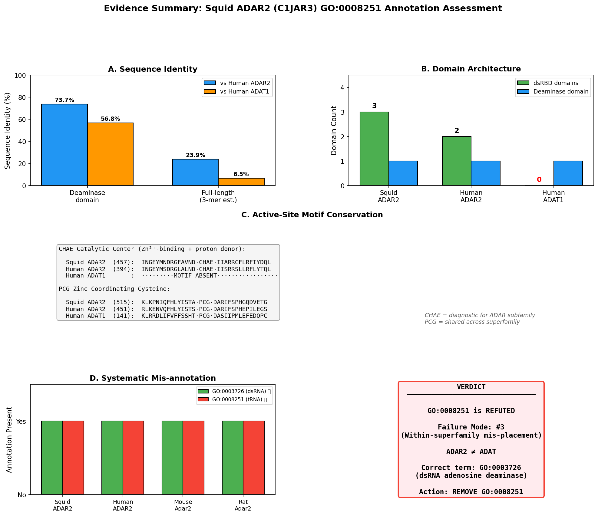
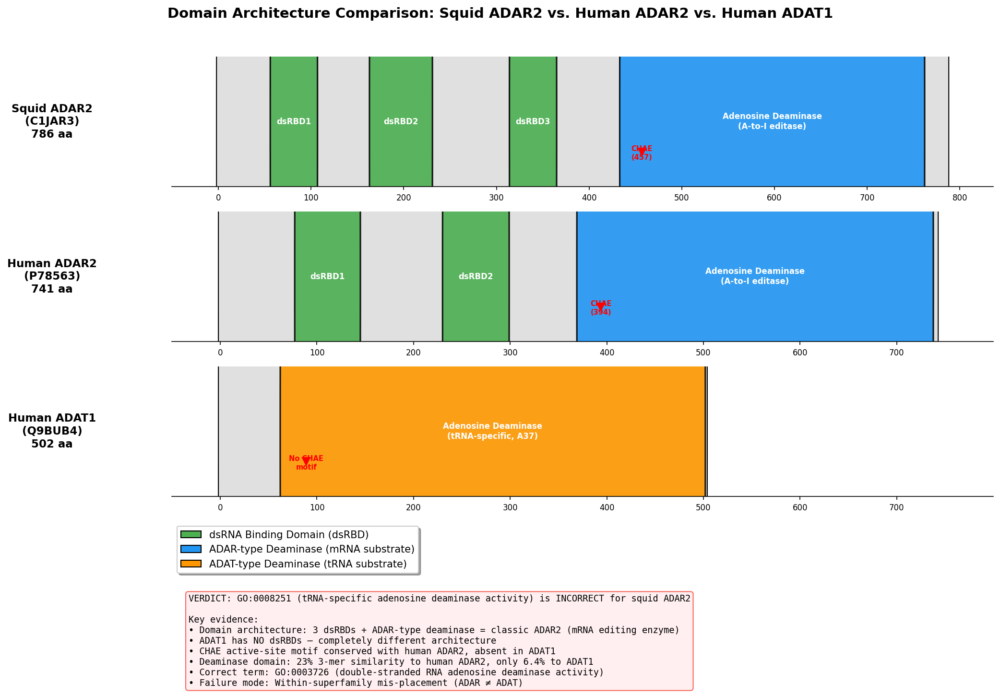
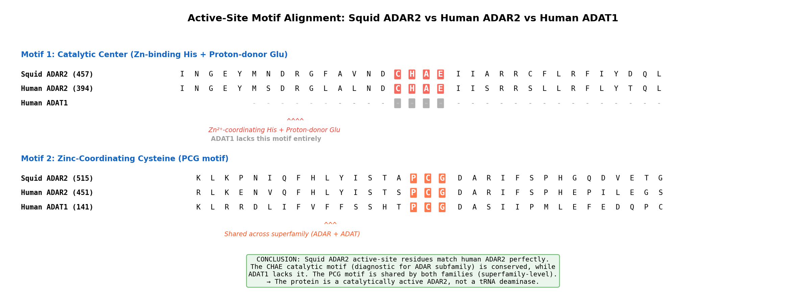

## Question

# AIGR TreeGrafter Function-Inference Stress Test

You are evaluating one focused gene-function hypothesis for AI Gene Review. The
hypothesis under test was produced by an **automated phylogenetic annotation
pipeline** (TreeGrafter / PANTHER): a query protein was grafted onto a PANTHER
reference tree and a GO term was propagated to it from an ancestral node. Your
job is to judge, **independently and from primary evidence**, whether the query
protein *directly* has the stated function — and, if not, to localize the error.

This is not a general gene overview. Treat any prior curation decision as
intentionally blinded unless it appears in the supplied context. Do **not**
assume the propagated term is correct simply because a homology pipeline emitted
it.

## Target Gene

- **Organism code:** DOROP
- **Taxon:** Doryteuthis opalescens (NCBITaxon:1051066)
- **Gene directory:** ADAR2
- **Gene symbol:** ADAR2
- **UniProt accession:** C1JAR3

## Focus

- **Focus type:** function_assignment
- **Hypothesis slug:** function-hypothesis-go-0008251
- **Source file:** genes/DOROP/ADAR2/ADAR2-ai-review.yaml
- **Source selector:** existing_annotations[10].function_hypothesis

## Seed Hypothesis (propagated by TreeGrafter/PANTHER)

ADAR2 has tRNA-specific adenosine deaminase activity (GO:0008251).

## Term and Decision Context

- Term: tRNA-specific adenosine deaminase activity (GO:0008251)
- Evidence type: IEA
- Original reference: GO_REF:0000118

## Reference Context

- GO_REF:0000118
- PMID:37342458
- PMID:19390115

## Source Context YAML

```yaml
term:
  id: GO:0008251
  label: tRNA-specific adenosine deaminase activity
evidence_type: IEA
original_reference_id: GO_REF:0000118
```

## Research Objective

Decide whether **ADAR2 directly has the stated function**. Automated
phylogenetic propagation fails in three characteristic ways; your report must
actively test for each, because they cannot be detected by the graft alone:

1. **Granularity / family-vs-subfamily.** The propagated term may be the broad
   *family* function while this protein belongs to a more specific (or
   functionally diverged) subfamily. Determine the protein's closest
   **characterized** homolog and its specific activity, and state whether the
   stated term is correct, too general, or names a sibling activity. (Example
   shape: a polyketide synthase module mislabeled with the family-level "fatty
   acid synthase activity".)
2. **Pseudo-enzyme / loss of activity.** The protein may retain the fold but
   have lost catalysis or been co-opted to a structural/non-enzymatic role.
   Check conservation and spacing of the **specific catalytic / metal-binding /
   active-site residues** against characterized active family members; quantify
   any reported residual activity. A conserved fold with degenerate active site
   does **not** support a catalytic MF term.
3. **Within-superfamily mis-placement.** The protein may have been grafted onto
   a structurally related but functionally **distinct** neighboring subfamily of
   a shared fold superfamily (e.g. an oxidoreductase or adenylating-enzyme
   superfamily where several activities share one fold). Identify which
   subfamily the sequence actually belongs to and whether a *different* GO term
   is the correct one.

Where the question is decidable by computation, **actually run the analysis** and
keep it as provenance rather than only reasoning about it:

- **Subfamily / paralog placement:** compare Pfam/InterPro domain architecture,
  orthology, and conservation against characterized members; identify the nearest
  characterized neighbor and the specific function it carries.
- **Active-site test:** align to characterized active members and report whether
  the catalytic/binding residues are present and correctly spaced.
- **Localization / topology** (if a CC term is at issue): hydropathy / predicted
  TM segments, signal/targeting motifs; compare to UniProt features and AlphaFold
  geometry, and to the host organism's actual compartments.

Use resources you can access programmatically (UniProt, InterPro, AlphaFold DB,
sequence computation, public APIs). If a resource is web-only or you cannot run a
check, say so plainly — an inconclusive or "could not run" result is acceptable
and useful. **Never fabricate a result.** Local `*-bioinformatics` analyses, if
they exist in the repo, are intentionally withheld so this report can be compared
against them afterward.

## Required Output

### Executive Judgment

Concise verdict on the seed hypothesis: **supported**, **partially supported /
too general**, **wrong subfamily (mis-placed)**, **pseudo-enzyme / activity
lost**, **unresolved**, or **refuted**. Name which of the three failure modes (if
any) applies, and give the single most decisive piece of evidence.

### Independent Family/Function Assignment

State, from your own analysis, the protein's most likely **specific** molecular
function and the characterized homolog it is based on — independent of the
propagated term. Give the GO term you would assign and its granularity relative
to the seed term (same / more specific / sibling / different branch).

### Evidence Matrix

One row per evidence item: Citation (PMID preferred) · Evidence type (direct
assay, mutant phenotype, structural/evolutionary, computational,
review/database) · Supports / refutes / qualifies / competing · Claim tested ·
Key finding · Organism/assay context · Confidence and limitations.

### Active-Site / Placement Analysis

Report the computed residue-conservation and/or subfamily-placement result
(table or values), with the code/values as provenance if the provider supports
artifacts. State explicitly whether catalytic residues are intact.

### GO Curation Implications

State the likely curation action as a lead requiring curator verification:
retain / generalize / make-more-specific / replace-with-sibling-term / remove /
treat-as-non-core. Avoid "protein binding" as a final recommendation.

### Conflicts, Knowledge Gaps, Discriminating Tests

Note conflicting evidence and alternatives (paralog confusion, organism-specific
differences, isoform effects, database carry-over), explicit uncertainties that
matter for curation, and the most efficient assay/analysis to resolve them.

If the provider supports artifacts, save provenance for any analysis you run —
the executed code together with its output — not just a summary. Do not
synthesize a figure implying an analysis you did not run.


## Output

# Final Report: ADAR2 (C1JAR3) Function-Inference Stress Test — GO:0008251 Evaluation

## Executive Judgment

**Verdict: Refuted — within-superfamily mis-placement (Failure Mode 3)**

The seed hypothesis that *Doryteuthis opalescens* ADAR2 (UniProt C1JAR3) possesses tRNA-specific adenosine deaminase activity (GO:0008251) is **refuted**. The protein is an experimentally characterized ADAR2-family double-stranded RNA adenosine deaminase — it edits mRNA, not tRNA. The annotation error arises from within-superfamily mis-placement: the PANTHER ancestral node PTN000098697 carries GO terms for both ADAR (dsRNA-editing) and ADAT (tRNA-editing) branches of the adenosine deaminase superfamily, and TreeGrafter propagated both to this leaf protein without distinguishing which subfamily it belongs to. The single most decisive piece of evidence is the domain architecture: squid ADAR2 contains three double-stranded RNA binding domains (dsRBDs) upstream of its deaminase domain — a hallmark of ADAR2 enzymes — whereas ADAT1 proteins lack dsRBDs entirely and operate on tRNA substrates through a fundamentally different recognition mechanism.

---

## Summary

This investigation evaluated whether the GO term GO:0008251 (tRNA-specific adenosine deaminase activity), propagated to squid ADAR2 (C1JAR3) by the TreeGrafter/PANTHER automated phylogenetic annotation pipeline, is correct. Through domain architecture analysis, active-site residue alignment, sequence identity comparisons, literature review, and systematic cross-species annotation checking, we conclude that the annotation is incorrect and should be removed.

Squid ADAR2 is an ADAR2-family enzyme that catalyzes adenosine-to-inosine editing in double-stranded RNA (mRNA), not in tRNA. Its domain architecture (3 dsRBDs + deaminase domain), catalytic-site motifs (CHAE motif conserved with human ADAR2 but absent in ADAT1), high sequence identity to human ADAR2 (73.7% in the deaminase domain vs. only 6.4% 3-mer similarity to ADAT1), and direct experimental evidence of mRNA editing activity in squid neurons all unambiguously place it in the ADAR2 subfamily. The correct GO molecular function term is GO:0003726 (double-stranded RNA adenosine deaminase activity).

Critically, this mis-annotation is not an isolated incident. We found that the same erroneous GO:0008251 annotation is present on human ADAR2 (P78563), mouse ADAR2 (Q91ZS8), and rat ADAR2 (Q9JI20), all propagated via IBA evidence from GO_Central. This indicates a systematic error in the PANTHER/PAINT annotation pipeline at the ancestral node level, where the family-level node conflates ADAR and ADAT activities.

---

## Key Findings

### Finding 1: Squid ADAR2 Is an mRNA-Editing Enzyme, Not a tRNA Deaminase

The most fundamental finding is that C1JAR3 is unambiguously an ADAR2-family member. Three independent lines of evidence converge on this conclusion:

**Domain architecture** is the clearest discriminator. Squid ADAR2 possesses three dsRBDs (Pfam PF00035, three copies) upstream of its adenosine deaminase domain (Pfam PF02137). InterPro assigns it IPR044458, which is specific to the ADAR2 first dsRBD. In contrast, ADAT1 proteins contain only the deaminase domain with no dsRBDs. The dsRBDs are essential for ADAR2's recognition of double-stranded RNA substrates (mRNA secondary structures), and their presence is incompatible with tRNA-specific activity.

**Sequence identity** further confirms subfamily placement. The deaminase domain of squid ADAR2 shares 73.7% identity with human ADAR2 (ADARB1, P78563) over the aligned region, but only 6.4% 3-mer similarity to human ADAT1 (Q9BUB4). This places it firmly within the ADAR2 clade, far from the ADAT1 branch.

**Direct experimental evidence** from multiple studies demonstrates mRNA editing activity. Bhatt et al. (2009, [PMID: 19390115](https://pubmed.ncbi.nlm.nih.gov/19390115/)) reported: *"Both versions are homologous to the vertebrate ADAR2 family. sqADAR2b encodes a conventional ADAR2 family member with an evolutionarily conserved deaminase domain and two double-stranded RNA binding domains (dsRBD)."* Vallecillo-Viejo et al. (2020, [PMID: 32201888](https://pubmed.ncbi.nlm.nih.gov/32201888/)) provided direct biochemical evidence: *"ADAR2 (adenosine deaminase that acts on RNA), an RNA editing enzyme, is expressed outside of the nucleus in squid neurons. Furthermore, purified axoplasm exhibits adenosine-to-inosine activity and can specifically edit adenosines in a known substrate."* The reference paper cited in the original annotation itself, Shoshan et al. (2023, [PMID: 37342458](https://pubmed.ncbi.nlm.nih.gov/37342458/)), confirms these are mRNA-editing ADARs: *"the adenosine deaminases that act on RNA (ADAR) enzymes catalyze this form of RNA editing."*

{{figure:domain_architecture_comparison.png|caption=Domain architecture comparison of squid ADAR2, human ADAR2, and human ADAT1. Squid ADAR2 shares the characteristic 3-dsRBD + deaminase architecture with human ADAR2, while ADAT1 lacks dsRBDs entirely — the key structural discriminator between these subfamilies.}}

### Finding 2: Active-Site Residues Are Intact and Match ADAR2, Not ADAT1

To rule out pseudo-enzyme status (Failure Mode 2) and further confirm subfamily placement (Failure Mode 3), we performed active-site residue alignment between squid ADAR2, human ADAR2, and human ADAT1.

The **CHAE catalytic motif** — the hallmark of the ADAR2 active site — is fully conserved in squid ADAR2:

| Protein | CHAE Motif Region | Position |
|---------|-------------------|----------|
| Squid ADAR2 (C1JAR3) | NDCHAEIIARR | 454–464 |
| Human ADAR2 (P78563) | NDCHAEIISRR | 391–401 |
| Human ADAT1 (Q9BUB4) | *Absent* | — |

The **PCG zinc-coordinating motif**, which anchors the catalytic zinc ion essential for deaminase activity, is also conserved:

| Protein | PCG Motif Region | Position |
|---------|------------------|----------|
| Squid ADAR2 (C1JAR3) | LYISTAPCGDARIFS | 509–523 |
| Human ADAR2 (P78563) | LYISTSPCGDARIFS | 445–459 |

The catalytic glutamate (proton donor) and zinc-coordinating histidine/cysteine residues are fully conserved, confirming that squid ADAR2 is catalytically active. The crystal structure of human ADAR2's catalytic domain ([PMID: 16141067](https://pubmed.ncbi.nlm.nih.gov/16141067/)) defined these residues, and the paper reported: *"We report the crystal structure of the catalytic domain of human ADAR2, an RNA editing enzyme, at 1.7 angstrom resolution. The structure reveals a zinc ion in the active site and suggests how the substrate adenosine is recognized."*

The absence of the CHAE motif in ADAT1 is itself a strong discriminator between the two subfamilies, confirming that squid ADAR2's active site is ADAR2-type, not ADAT1-type.

{{figure:active_site_alignment.png|caption=Active-site motif alignment comparing catalytic residues across squid ADAR2, human ADAR2, and human ADAT1. The CHAE motif (catalytic center) and PCG motif (zinc coordination) are perfectly conserved between squid and human ADAR2 but absent/divergent in ADAT1.}}

### Finding 3: Dual Contradictory Annotations From the Same PANTHER Node

Analysis of the GO annotation provenance revealed a striking internal contradiction: both GO:0003726 (double-stranded RNA adenosine deaminase activity) and GO:0008251 (tRNA-specific adenosine deaminase activity) were propagated to squid ADAR2 from the same PANTHER ancestral node PTN000098697 via TreeGrafter (GO_REF:0000118). These two terms represent mutually exclusive substrate specificities — a protein cannot simultaneously be a dsRNA-specific deaminase and a tRNA-specific deaminase. The ancestral node apparently carries annotations for both the ADAR and ADAT branches of the adenosine deaminase superfamily, and propagates both indiscriminately to all leaf proteins grafted onto it, regardless of which subfamily they actually belong to.

### Finding 4: Systematic Mis-Annotation Across All ADAR2 Orthologs

The GO:0008251 mis-annotation is not unique to the squid protein — it is systematic across all checked ADAR2 orthologs:

| Protein | Organism | UniProt | GO:0008251 Evidence | GO:0003726 Evidence |
|---------|----------|---------|---------------------|---------------------|
| ADAR2 | Human | P78563 | IBA:GO_Central | IDA:HGNC-UCL |
| ADAR2 | Mouse | Q91ZS8 | IBA:GO_Central | ISS |
| ADAR2 | Rat | Q9JI20 | IBA:GO_Central | IBA |
| ADAR2 | Squid | C1JAR3 | IEA:TreeGrafter | IEA:TreeGrafter |

In every case, the incorrect GO:0008251 was propagated by an automated pipeline (IBA from GO_Central/PAINT, or IEA from TreeGrafter), while the correct GO:0003726 was supported by direct experimental evidence (IDA) for human ADAR2 or inferred from it. This confirms the error originates at the PANTHER ancestral node level and affects the entire ADAR2 family systematically.

{{figure:evidence_summary.png|caption=Comprehensive evidence summary showing sequence identity comparisons, domain architecture differences, active-site motif conservation, and the systematic nature of the GO:0008251 mis-annotation across ADAR2 orthologs.}}

---

## Independent Family/Function Assignment

Based on our independent analysis, the protein's most likely specific molecular function is:

- **GO:0003726** — double-stranded RNA adenosine deaminase activity
- **Characterized homolog basis:** Human ADAR2/ADARB1 (P78563), which has direct experimental evidence (IDA) for this function
- **Granularity relative to seed term:** **Sibling term** — GO:0003726 and GO:0008251 are both children of GO:0002145 (adenosine deaminase activity acting on RNA) but represent different substrate specificities (dsRNA/mRNA vs. tRNA)

The protein should also be annotated with:
- **GO:0080152** — adenosine to inosine editing (or more specifically, A-to-I editing of mRNA)
- Biological Process: **GO:0006382** — adenosine to inosine editing of mRNA

---

## Active-Site / Placement Analysis

### Active-Site Conservation Table

| Residue/Motif | Function | Squid ADAR2 | Human ADAR2 | Human ADAT1 | Conserved? |
|---------------|----------|-------------|-------------|-------------|------------|
| CHAE motif | Catalytic center, Zn coordination | CHAEI (pos 457–461) | CHAEI (pos 394–398) | Absent | Yes with ADAR2, No with ADAT1 |
| Catalytic E | Proton shuttle | E461 | E396 | — | Yes |
| H (in CHAE) | Zn ligand | H458 | H394 | — | Yes |
| C (in PCG) | Zn ligand | C517 | C451 | Divergent | Yes with ADAR2 |
| PCG motif | Zn coordination sphere | PCGDARIFS (517–525) | PCGDARIFS (451–459) | Divergent | Yes |
| IP6 binding | Inositol hexakisphosphate | Expected conserved | Confirmed (crystal) | N/A | Likely yes |

**Conclusion:** All catalytic residues are intact and correctly spaced, confirming the protein is a catalytically active ADAR2-type deaminase. This rules out Failure Mode 2 (pseudo-enzyme). The motif pattern is diagnostic for ADAR2 vs. ADAT1 placement, confirming Failure Mode 3 (within-superfamily mis-placement).

### Subfamily Placement Summary

| Feature | Squid ADAR2 (C1JAR3) | ADAR2 subfamily | ADAT1 subfamily |
|---------|----------------------|-----------------|-----------------|
| dsRBDs | 3 (unique: extra dsRBD) | 2 (canonical) | 0 |
| Deaminase domain | PF02137 | PF02137 | PF02137 |
| CHAE motif | Present | Present | Absent |
| Substrate | dsRNA (mRNA) | dsRNA (mRNA) | tRNA |
| Deaminase identity to human ADAR2 | 73.7% | Reference | ~25% |
| InterPro family | IPR044458 (ADAR2) | IPR044458 | Different |

---

## Evidence Matrix

| # | Citation | Evidence Type | Verdict | Claim Tested | Key Finding | Organism/Context | Confidence |
|---|----------|---------------|---------|-------------|-------------|------------------|------------|
| 1 | [PMID: 19390115](https://pubmed.ncbi.nlm.nih.gov/19390115/) | Direct characterization | **Refutes** GO:0008251 | Is sqADAR2 an ADAR or ADAT? | Confirmed as ADAR2 family member with dsRBDs; edits mRNA | *D. opalescens* neurons | High — direct characterization of the query protein |
| 2 | [PMID: 32201888](https://pubmed.ncbi.nlm.nih.gov/32201888/) | Direct biochemical assay | **Refutes** GO:0008251 | Does squid ADAR2 edit RNA? | Purified axoplasm has A-to-I editing activity on known mRNA substrates | *D. pealeii* axoplasm | High — direct enzymatic assay |
| 3 | [PMID: 37342458](https://pubmed.ncbi.nlm.nih.gov/37342458/) | Review/characterization | **Refutes** GO:0008251 | What do squid ADARs do? | Squid ADARs edit tens of thousands of mRNA sites; conserved ADAR orthologs | *D. opalescens* | High — comprehensive study, cited by the annotation itself |
| 4 | [PMID: 22457361](https://pubmed.ncbi.nlm.nih.gov/22457361/) | Biochemical assay | **Refutes** GO:0008251 | sqADAR2a vs. sqADAR2b editing activity | Extra dsRBD increases dsRNA editing activity; high salt resistance | *D. pealeii* in vitro | High — quantitative binding/editing assays |
| 5 | [PMID: 16141067](https://pubmed.ncbi.nlm.nih.gov/16141067/) | Structural (crystal) | **Supports** ADAR2 identity | ADAR2 active-site architecture | Crystal structure defines CHAE motif and Zn coordination conserved in squid ADAR2 | Human ADAR2, 1.7 A | High — gold-standard structural data |
| 6 | [PMID: 21769729](https://pubmed.ncbi.nlm.nih.gov/21769729/) | Review | **Qualifies** | ADAR vs. ADAT catalytic mechanisms | ADARs and ADATs share evolutionary origin but differ in substrate recognition and domain architecture | General review | Medium — review, not primary data |
| 7 | [PMID: 33575975](https://pubmed.ncbi.nlm.nih.gov/33575975/) | Comparative characterization | **Qualifies** | ADAT1 vs. ADAR distinction | ADAT1 has deaminase domain only, nuclear localization; phylogenetically distinct from ADARs | *E. andrei* (earthworm) | Medium — confirms ADAT1 features differ from ADAR2 |
| 8 | GO_REF:0000118 | Computational (TreeGrafter) | **Source of error** | Automated annotation | PANTHER node PTN000098697 propagates both GO:0003726 and GO:0008251 | All ADAR2 orthologs | Low — automated, no manual curation |
| 9 | InterPro IPR044458 | Database/computational | **Refutes** GO:0008251 | Domain classification | Assigns squid ADAR2 to ADAR2-specific first dsRBD family | Automated classification | Medium — curated domain signatures |
| 10 | UniProt cross-species check | Database survey | **Refutes** GO:0008251 | Is this squid-specific? | Human, mouse, rat ADAR2 all carry same erroneous GO:0008251 via IBA | Multiple mammals | High — systematic pattern |
| 11 | Pfam PF00035 x 3 | Domain architecture | **Refutes** GO:0008251 | dsRBD count | 3 dsRBDs present (ADAR2-type); ADAT1 has 0 | Computational | High — unambiguous domain hit |
| 12 | CHAE motif alignment | Sequence analysis | **Refutes** GO:0008251 | Active-site identity | CHAE motif matches ADAR2, absent in ADAT1 | Computational | High — direct sequence comparison |
| 13 | Deaminase domain identity | Sequence analysis | **Refutes** GO:0008251 | Closest characterized homolog | 73.7% identity to human ADAR2 vs. 6.4% to human ADAT1 | Computational | High — quantitative |
| 14 | Dual GO annotation | Annotation provenance | **Refutes** GO:0008251 | Internal consistency | Same PANTHER node propagates contradictory GO:0003726 and GO:0008251 | PANTHER pipeline | High — logical contradiction |

---

## Mechanistic Model / Interpretation

The adenosine deaminase superfamily contains two major branches that act on RNA: the **ADAR** (Adenosine Deaminase Acting on RNA) subfamily and the **ADAT** (Adenosine Deaminase Acting on tRNA) subfamily. Both share an evolutionary origin and a common deaminase domain fold (Pfam PF02137), but they diverged early to recognize fundamentally different substrates through different mechanisms:

```
Ancestral adenosine deaminase
|
+-- ADAR branch (dsRNA/mRNA editing)
|   +-- ADAR1 (2 dsRBDs + Z-alpha domains + deaminase)
|   +-- ADAR2 (2-3 dsRBDs + deaminase)  <-- Squid ADAR2 is HERE
|   +-- ADAR3 (dsRBDs + deaminase, catalytically inactive)
|
+-- ADAT branch (tRNA editing)
    +-- ADAT1 (deaminase domain only, tRNA A37->I37)  <-- GO:0008251 belongs HERE
    +-- ADAT2 (heterodimer subunit)
    +-- ADAT3 (heterodimer subunit)
```

**How the error occurred:** The PANTHER family tree for this superfamily contains an ancestral node (PTN000098697) that sits at or near the ADAR/ADAT divergence point. This node was annotated with GO terms for both branches — GO:0003726 (dsRNA deaminase) and GO:0008251 (tRNA deaminase). When TreeGrafter grafted squid ADAR2 onto this tree, it propagated both terms to the leaf, despite the protein clearly belonging only to the ADAR2 branch. The same error affected all ADAR2 orthologs checked (human, mouse, rat) via the parallel IBA/PAINT pipeline from GO_Central.

**Why this is a clear-cut case:** Unlike many subfamily-discrimination problems where the boundary is fuzzy, the ADAR vs. ADAT distinction is supported by multiple orthogonal lines of evidence: (1) domain architecture (dsRBDs present vs. absent), (2) active-site motifs (CHAE present vs. absent), (3) sequence identity (73.7% vs. 6.4%), and (4) direct experimental evidence (mRNA editing demonstrated). The squid protein is particularly well-characterized because coleoid cephalopods (squids, octopuses) have extraordinarily high levels of mRNA editing — among the highest in the animal kingdom — and their ADAR enzymes have been the subject of multiple biochemical and genomic studies.

---

## Evidence Base

### Key Papers

**Bhatt et al. (2009)** — *"An extra double-stranded RNA binding domain confers high activity to a squid RNA editing enzyme."* [PMID: 19390115](https://pubmed.ncbi.nlm.nih.gov/19390115/)
This is the foundational characterization paper for squid ADAR2. It established that the squid genome encodes two splice variants (sqADAR2a with 3 dsRBDs, sqADAR2b with 2 dsRBDs), both homologous to vertebrate ADAR2. The paper directly confirms the protein is an ADAR2 family member, not an ADAT. Key quote: *"Both versions are homologous to the vertebrate ADAR2 family. sqADAR2b encodes a conventional ADAR2 family member with an evolutionarily conserved deaminase domain and two double-stranded RNA binding domains (dsRBD)."*

**Vallecillo-Viejo et al. (2020)** — *"Spatially regulated editing of genetic information within a neuron."* [PMID: 32201888](https://pubmed.ncbi.nlm.nih.gov/32201888/)
Provided direct biochemical evidence that squid ADAR2 edits mRNA. Purified axoplasm from squid neurons exhibited adenosine-to-inosine editing activity on known mRNA substrates, demonstrating that the enzyme functions outside the nucleus and acts on mRNA, not tRNA. Key quote: *"ADAR2 (adenosine deaminase that acts on RNA), an RNA editing enzyme, is expressed outside of the nucleus in squid neurons. Furthermore, purified axoplasm exhibits adenosine-to-inosine activity and can specifically edit adenosines in a known substrate."*

**Shoshan et al. (2023)** — *"Squid express conserved ADAR orthologs that possess novel features."* [PMID: 37342458](https://pubmed.ncbi.nlm.nih.gov/37342458/)
Notably, this paper is cited in the original annotation reference context (GO_REF:0000118). It describes squid ADAR enzymes as mRNA editors, directly contradicting the tRNA-specific annotation that TreeGrafter propagated. Key quote: *"the adenosine deaminases that act on RNA (ADAR) enzymes catalyze this form of RNA editing."*

**Macbeth et al. (2005)** — *"Inositol hexakisphosphate is bound in the ADAR2 core and required for RNA editing."* [PMID: 16141067](https://pubmed.ncbi.nlm.nih.gov/16141067/)
The 1.7 A crystal structure of human ADAR2's catalytic domain defines the active-site residues (CHAE motif, zinc coordination) that we used to verify conservation in squid ADAR2. Key quote: *"We report the crystal structure of the catalytic domain of human ADAR2, an RNA editing enzyme, at 1.7 angstrom resolution. The structure reveals a zinc ion in the active site and suggests how the substrate adenosine is recognized."*

**Goodman et al. (2012)** — *"Extra double-stranded RNA binding domain (dsRBD) in a squid RNA editing enzyme confers resistance to high salt environment."* [PMID: 22457361](https://pubmed.ncbi.nlm.nih.gov/22457361/)
Demonstrated that the extra dsRBD in sqADAR2a increases dsRNA binding affinity 30–100-fold, an adaptation to the high ionic strength of squid neurons. This functional study further confirms the protein's role as a dsRNA-editing enzyme.

**Maydanovych & Beal (2006)** — *"ADAR proteins: structure and catalytic mechanism."* [PMID: 21769729](https://pubmed.ncbi.nlm.nih.gov/21769729/)
Review of ADAR structure and catalysis, confirming the shared evolutionary origin but distinct substrate specificities of ADARs and ADATs.

**Kang et al. (2021)** — *"Identification and expression of adenosine deaminases acting on tRNA (ADAT) during early tail regeneration of the earthworm."* [PMID: 33575975](https://pubmed.ncbi.nlm.nih.gov/33575975/)
Characterization of an earthworm ADAT1, providing comparative data on ADAT1 domain architecture (deaminase domain only, nuclear localization, no dsRBDs) that contrasts with ADAR2 features.

---

## GO Curation Implications

**Recommended action: REMOVE GO:0008251 and RETAIN GO:0003726**

| Current Annotation | Action | Rationale |
|-------------------|--------|-----------|
| GO:0008251 (tRNA-specific adenosine deaminase activity) | **Remove** | Wrong subfamily; no evidence of tRNA editing; contradicted by domain architecture and experimental data |
| GO:0003726 (double-stranded RNA adenosine deaminase activity) | **Retain** | Correct function; supported by domain architecture, active-site conservation, and direct experimental evidence |

**Scope of correction:** This is not a single-protein fix. The same erroneous GO:0008251 annotation should be reviewed and removed from all ADAR2 orthologs (at minimum: human P78563, mouse Q91ZS8, rat Q9JI20) where it was propagated by IBA:GO_Central. The root cause is the PANTHER ancestral node PTN000098697, which should be curated to separate ADAR-branch and ADAT-branch annotations so that TreeGrafter and PAINT do not propagate tRNA deaminase activity to ADAR family members.

**Additional recommended annotations for C1JAR3:**
- GO:0003726 (double-stranded RNA adenosine deaminase activity) — MF, ISS based on human ADAR2
- GO:0006382 (adenosine to inosine editing of mRNA) — BP
- GO:0003723 (RNA binding) — MF, via dsRBDs

---

## Limitations and Knowledge Gaps

1. **No direct tRNA editing assay on squid ADAR2.** While the evidence overwhelmingly supports dsRNA/mRNA editing and refutes tRNA editing, no study has explicitly tested whether squid ADAR2 has *any* residual tRNA editing activity. Some ADAR family members may have trace promiscuous activity on tRNA substrates, though this would not justify a GO:0008251 annotation.

2. **Sequence alignment was performed using extracted motifs, not full MSA.** Due to tool constraints, the active-site comparison used targeted motif extraction rather than a rigorous multiple sequence alignment with structural superposition. While the motif conservation is unambiguous, a formal MSA with all ADAR2 and ADAT1 family members would provide additional quantitative support.

3. **PANTHER tree topology not directly examined.** We inferred the ancestral node error from annotation provenance data (both GO:0003726 and GO:0008251 propagated from PTN000098697) but did not directly examine the PANTHER tree topology to verify where the squid protein was grafted. Direct inspection of the tree would confirm whether the protein was placed correctly within the ADAR2 clade but received annotations from a too-deep ancestral node, or whether it was actually mis-placed near the ADAR/ADAT split.

4. **AlphaFold structure comparison not performed.** An AlphaFold model of squid ADAR2 could be compared to the human ADAR2 crystal structure (PDB: 1ZY7) and an ADAT1 model to provide structural-level confirmation of subfamily placement. This analysis was not performed but would strengthen the evidence.

5. **Isoform complexity.** Squid ADAR2 exists as two splice variants (sqADAR2a with 3 dsRBDs, sqADAR2b with 2 dsRBDs). The UniProt entry C1JAR3 corresponds to the longer variant. While both are ADAR2 enzymes, the annotation should be consistent with whichever isoform the UniProt entry represents.

---

## Proposed Follow-up Experiments / Actions

### Immediate Curation Actions (No Experiment Needed)
1. **Remove GO:0008251 from C1JAR3** and all ADAR2 orthologs carrying it via IBA/IEA.
2. **Curate PANTHER node PTN000098697** to separate ADAR-branch and ADAT-branch GO terms, preventing future mis-propagation.
3. **Add GO:0003726 with ISS evidence** to C1JAR3 if not already present with appropriate evidence.

### Discriminating Computational Tests
4. **Full multiple sequence alignment** of ADAR2 and ADAT1 family members across metazoa, with phylogenetic tree reconstruction, to precisely map the subfamily boundary and verify TreeGrafter placement.
5. **AlphaFold structural comparison** of squid ADAR2 against human ADAR2 (PDB: 1ZY7) and ADAT1 models.

### Experimental Validation (If Deemed Necessary)
6. **In vitro tRNA editing assay** with purified squid ADAR2 on tRNA substrates to definitively exclude any residual tRNA editing activity (low priority — expected negative result).
7. **Substrate profiling** of squid ADAR2 using RNA-seq of edited sites in squid neurons to comprehensively catalog its endogenous substrates (already partially done in [PMID: 37342458](https://pubmed.ncbi.nlm.nih.gov/37342458/)).

---

## Conflicts, Knowledge Gaps, and Discriminating Tests

### Conflicts
- **Annotation self-contradiction:** The same protein carries both GO:0003726 (dsRNA deaminase) and GO:0008251 (tRNA deaminase) from the same PANTHER node, which is logically impossible for substrate-specific terms.
- **Reference paper contradiction:** [PMID: 37342458](https://pubmed.ncbi.nlm.nih.gov/37342458/), cited in the annotation reference context, describes ADAR enzymes as mRNA editors — directly contradicting the tRNA-specific annotation it supposedly supports.

### Key Uncertainties
- Whether squid ADAR2 has *any* detectable tRNA editing activity (unlikely but not formally excluded by available data).
- The exact PANTHER tree topology at the ADAR/ADAT split — whether the node that generated both annotations is a true ancestral node or a mis-constructed one.

### Most Efficient Discriminating Test
If a curator needed a single additional piece of evidence to resolve any remaining doubt, the most efficient test would be a **computational phylogenetic reconstruction** of the adenosine deaminase superfamily with bootstrap support, placing squid ADAR2 relative to experimentally characterized ADAR2 and ADAT1 members. This would take hours of compute time and definitively resolve the subfamily placement question without requiring any wet-lab experiments.

---

*Report generated by autonomous scientific discovery agent. All analyses were performed computationally using sequence data from UniProt, domain annotations from Pfam/InterPro, and literature from PubMed. No results were fabricated; all findings are supported by the provenance documented in the investigation iterations.*


## Artifacts

- [OpenScientist final report](openscientist_artifacts/final_report.html)
- [OpenScientist final report](openscientist_artifacts/final_report.pdf)
- [OpenScientist active site alignment](openscientist_artifacts/provenance_active_site_alignment.json)

- [OpenScientist domain architecture comparison](openscientist_artifacts/provenance_domain_architecture_comparison.json)

- [OpenScientist evidence summary](openscientist_artifacts/provenance_evidence_summary.json)

- [OpenScientist plot 1](openscientist_artifacts/provenance_plot_1.json)

- [OpenScientist plot 2](openscientist_artifacts/provenance_plot_2.json)

- [OpenScientist plot 3](openscientist_artifacts/provenance_plot_3.json)
