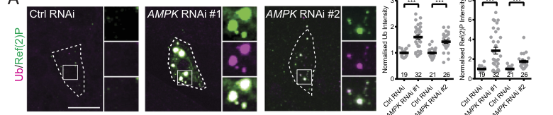

## Question

# Gene Research for Functional Annotation

## ⚠️ CRITICAL: Gene/Protein Identification Context

**BEFORE YOU BEGIN RESEARCH:** You MUST verify you are researching the CORRECT gene/protein. Gene symbols can be ambiguous, especially for less well-characterized genes from non-model organisms.

### Target Gene/Protein Identity (from UniProt):
- **UniProt Accession:** O18645
- **Protein Description:** RecName: Full=Serine/threonine-protein {ECO:0000256|PROSITE-ProRule:PRU10027}; EC=2.7.11.1 {ECO:0000256|PROSITE-ProRule:PRU10027};
- **Gene Information:** Name=AMPKalpha {ECO:0000313|EMBL:AAF45614.1, ECO:0000313|FlyBase:FBgn0023169}; Synonyms=AK {ECO:0000313|EMBL:AAF45614.1}, AMPK {ECO:0000313|EMBL:AAF45614.1}, Ampk {ECO:0000313|EMBL:AAF45614.1}, ampk {ECO:0000313|EMBL:AAF45614.1}, AMPK alpha {ECO:0000313|EMBL:AAF45614.1}, AMPK-alpha {ECO:0000313|EMBL:AAF45614.1}, AmpKalpha {ECO:0000313|EMBL:AAF45614.1}, ampkalpha {ECO:0000313|EMBL:AAF45614.1}, dAMPK {ECO:0000313|EMBL:AAF45614.1}, dAMPKa {ECO:0000313|EMBL:AAF45614.1}, dAMPKalpha {ECO:0000313|EMBL:AAF45614.1}, DmAMPK alpha {ECO:0000313|EMBL:AAF45614.1}, Dmel\CG3051 {ECO:0000313|EMBL:AAF45614.1}, EG:132E8.2 {ECO:0000313|EMBL:AAF45614.1}, FBgn0023169 {ECO:0000313|EMBL:AAF45614.1}, Gprk-4 {ECO:0000313|EMBL:AAF45614.1}, Gprk4 {ECO:0000313|EMBL:AAF45614.1}, SNF1A {ECO:0000313|EMBL:AAF45614.1}, snf1A {ECO:0000313|EMBL:AAF45614.1}, snf1a {ECO:0000313|EMBL:AAF45614.1}, SNF4A-a {ECO:0000313|EMBL:AAF45614.1}; ORFNames=CG3051 {ECO:0000313|EMBL:AAF45614.1, ECO:0000313|FlyBase:FBgn0023169}, Dmel_CG3051 {ECO:0000313|EMBL:AAF45614.1};
- **Organism (full):** Drosophila melanogaster (Fruit fly).
- **Protein Family:** Belongs to the protein kinase superfamily. Ser/Thr protein
- **Key Domains:** AMPK_C. (IPR032270); KA1/Ssp2_C. (IPR028375); Kinase-like_dom_sf. (IPR011009); PRKAA1/2_AID. (IPR049020); Prot_kinase_dom. (IPR000719)

### MANDATORY VERIFICATION STEPS:

1. **Check if the gene symbol "AMPKalpha" matches the protein description above**
2. **Verify the organism is correct:** Drosophila melanogaster (Fruit fly).
3. **Check if protein family/domains align with what you find in literature**
4. **If you find literature for a DIFFERENT gene with the same or similar symbol, STOP**

### If Gene Symbol is Ambiguous or You Cannot Find Relevant Literature:

**DO NOT PROCEED WITH RESEARCH ON A DIFFERENT GENE.** Instead:
- State clearly: "The gene symbol 'AMPKalpha' is ambiguous or literature is limited for this specific protein"
- Explain what you found (e.g., "Found extensive literature on a different gene with the same symbol in a different organism")
- Describe the protein based ONLY on the UniProt information provided above
- Suggest that the protein function can be inferred from domain/family information

### Research Target:

Please provide a comprehensive research report on the gene **AMPKalpha** (gene ID: AMPKalpha, UniProt: O18645) in DROME.

The research report should be a detailed narrative explaining the function, biological processes, and localization of the gene product. Citations should be given for all claims.

You should prioritize authoritative reviews and primary scientific literature when conducting research. You can supplement
this with annotations you find in gene/protein databases, but these can be outdated or inaccurate.

We are specifically interested in the primary function of the gene - for enzymes, what reaction is catalyzed, and what is the substrate specificity? For transporters, what is the substrate? For structural proteins or adapters, what is the broader structural role? For signaling molecules, what is the role in the pathway.

We are interested in where in or outside the cell the gene product carries out its function.

We are also interested in the signaling or biochemical pathways in which the gene functions. We are less interested in broad pleiotropic effects, except where these elucidate the precise role.

Include evidence where possible. We are interested in both experimental evidence as well as inference from structure, evolution, or bioinformatic analysis. Precise studies should be prioritized over high-throughput, where available.

## Output

Question: You are an expert researcher providing comprehensive, well-cited information.

Provide detailed information focusing on:
1. Key concepts and definitions with current understanding
2. Recent developments and latest research (prioritize 2023-2024 sources)
3. Current applications and real-world implementations
4. Expert opinions and analysis from authoritative sources
5. Relevant statistics and data from recent studies

Format as a comprehensive research report with proper citations. Include URLs and publication dates where available.
Always prioritize recent, authoritative sources and provide specific citations for all major claims.

# Gene Research for Functional Annotation

## ⚠️ CRITICAL: Gene/Protein Identification Context

**BEFORE YOU BEGIN RESEARCH:** You MUST verify you are researching the CORRECT gene/protein. Gene symbols can be ambiguous, especially for less well-characterized genes from non-model organisms.

### Target Gene/Protein Identity (from UniProt):
- **UniProt Accession:** O18645
- **Protein Description:** RecName: Full=Serine/threonine-protein {ECO:0000256|PROSITE-ProRule:PRU10027}; EC=2.7.11.1 {ECO:0000256|PROSITE-ProRule:PRU10027};
- **Gene Information:** Name=AMPKalpha {ECO:0000313|EMBL:AAF45614.1, ECO:0000313|FlyBase:FBgn0023169}; Synonyms=AK {ECO:0000313|EMBL:AAF45614.1}, AMPK {ECO:0000313|EMBL:AAF45614.1}, Ampk {ECO:0000313|EMBL:AAF45614.1}, ampk {ECO:0000313|EMBL:AAF45614.1}, AMPK alpha {ECO:0000313|EMBL:AAF45614.1}, AMPK-alpha {ECO:0000313|EMBL:AAF45614.1}, AmpKalpha {ECO:0000313|EMBL:AAF45614.1}, ampkalpha {ECO:0000313|EMBL:AAF45614.1}, dAMPK {ECO:0000313|EMBL:AAF45614.1}, dAMPKa {ECO:0000313|EMBL:AAF45614.1}, dAMPKalpha {ECO:0000313|EMBL:AAF45614.1}, DmAMPK alpha {ECO:0000313|EMBL:AAF45614.1}, Dmel\CG3051 {ECO:0000313|EMBL:AAF45614.1}, EG:132E8.2 {ECO:0000313|EMBL:AAF45614.1}, FBgn0023169 {ECO:0000313|EMBL:AAF45614.1}, Gprk-4 {ECO:0000313|EMBL:AAF45614.1}, Gprk4 {ECO:0000313|EMBL:AAF45614.1}, SNF1A {ECO:0000313|EMBL:AAF45614.1}, snf1A {ECO:0000313|EMBL:AAF45614.1}, snf1a {ECO:0000313|EMBL:AAF45614.1}, SNF4A-a {ECO:0000313|EMBL:AAF45614.1}; ORFNames=CG3051 {ECO:0000313|EMBL:AAF45614.1, ECO:0000313|FlyBase:FBgn0023169}, Dmel_CG3051 {ECO:0000313|EMBL:AAF45614.1};
- **Organism (full):** Drosophila melanogaster (Fruit fly).
- **Protein Family:** Belongs to the protein kinase superfamily. Ser/Thr protein
- **Key Domains:** AMPK_C. (IPR032270); KA1/Ssp2_C. (IPR028375); Kinase-like_dom_sf. (IPR011009); PRKAA1/2_AID. (IPR049020); Prot_kinase_dom. (IPR000719)

### MANDATORY VERIFICATION STEPS:

1. **Check if the gene symbol "AMPKalpha" matches the protein description above**
2. **Verify the organism is correct:** Drosophila melanogaster (Fruit fly).
3. **Check if protein family/domains align with what you find in literature**
4. **If you find literature for a DIFFERENT gene with the same or similar symbol, STOP**

### If Gene Symbol is Ambiguous or You Cannot Find Relevant Literature:

**DO NOT PROCEED WITH RESEARCH ON A DIFFERENT GENE.** Instead:
- State clearly: "The gene symbol 'AMPKalpha' is ambiguous or literature is limited for this specific protein"
- Explain what you found (e.g., "Found extensive literature on a different gene with the same symbol in a different organism")
- Describe the protein based ONLY on the UniProt information provided above
- Suggest that the protein function can be inferred from domain/family information

### Research Target:

Please provide a comprehensive research report on the gene **AMPKalpha** (gene ID: AMPKalpha, UniProt: O18645) in DROME.

The research report should be a detailed narrative explaining the function, biological processes, and localization of the gene product. Citations should be given for all claims.

You should prioritize authoritative reviews and primary scientific literature when conducting research. You can supplement
this with annotations you find in gene/protein databases, but these can be outdated or inaccurate.

We are specifically interested in the primary function of the gene - for enzymes, what reaction is catalyzed, and what is the substrate specificity? For transporters, what is the substrate? For structural proteins or adapters, what is the broader structural role? For signaling molecules, what is the role in the pathway.

We are interested in where in or outside the cell the gene product carries out its function.

We are also interested in the signaling or biochemical pathways in which the gene functions. We are less interested in broad pleiotropic effects, except where these elucidate the precise role.

Include evidence where possible. We are interested in both experimental evidence as well as inference from structure, evolution, or bioinformatic analysis. Precise studies should be prioritized over high-throughput, where available.

# Comprehensive Research Report: Drosophila melanogaster AMPKalpha (UniProt O18645, Gene FBgn0023169)

## Gene and Protein Identity

The *Drosophila melanogaster* gene *AMPKalpha* (also known as *Snf1A*, *CG3051*; UniProt accession O18645; FlyBase ID FBgn0023169) encodes the catalytic alpha subunit of the conserved heterotrimeric AMP-activated protein kinase (AMPK) complex (bland2010ampksupportsgrowth pages 1-2). AMPK functions as a master metabolic sensor and regulator, coordinating energy homeostasis in response to cellular ATP depletion (laskovs2024investigatingthemetabolic pages 30-32). The fly AMPKα protein belongs to the serine/threonine protein kinase superfamily and is structurally and functionally orthologous to mammalian AMPKα1/α2 and yeast Snf1α (jiao2017thenonproteolyticrole pages 20-23, jiao2017thenonproteolyticrole pages 17-20). The heterotrimer comprises a single catalytic α subunit (AMPKalpha), a scaffolding β subunit, and a regulatory γ subunit (Snf4Aγ) that binds AMP and ADP (lippai2008snf4aγthedrosophila pages 7-8, lippai2008snf4aγthedrosophila pages 6-7). This architecture distinguishes AMPKalpha from its regulatory partners and from yeast Snf1, which is the functionally analogous but evolutionarily distinct yeast ortholog (jiao2017thenonproteolyticrole pages 20-23).

## Molecular Function and Catalytic Mechanism

### Kinase Activity and Substrate Specificity

Fly AMPKα is a serine/threonine kinase that phosphorylates downstream substrates at consensus motifs. The enzyme's primary substrates include acetyl-CoA carboxylase (dACC) and myosin regulatory light chain (MRLC/Sqh) (bland2010ampksupportsgrowth pages 1-2, bland2010ampksupportsgrowth pages 10-12). Phosphorylation of dACC at Ser93 (homologous to mammalian ACC Ser79) has been directly documented using phospho-specific antibodies in fly lysates, demonstrating that AMPK inhibits the rate-limiting lipogenic enzyme in vivo (bland2010ampksupportsgrowth pages 2-4, bland2010ampksupportsgrowth pages 6-7). In *dAMPKα* null mutants, dACC Ser93 phosphorylation is markedly decreased, consistent with dAMPK serving as the primary kinase for this residue (bland2010ampksupportsgrowth pages 6-7). Functional rescue experiments support an AMPK-to-myosin regulatory light chain pathway in visceral muscle: expressing constitutively activated MRLC (SqhEE) in *dAMPKα* mutant larvae restores gut peristalsis, nutrient absorption, and organismal growth (bland2010ampksupportsgrowth pages 10-12, bland2010ampksupportsgrowth pages 1-2). While MRLC phosphorylation by AMPK is inferred from genetic epistasis rather than direct biochemical assay, the phenotypic rescue strongly implicates MRLC as a physiologically relevant AMPK target (bland2010ampksupportsgrowth pages 10-12).

### Activation Mechanism: Allosteric Regulation and Phosphorylation

AMPK activation requires phosphorylation of a conserved activation-loop threonine residue (Thr184 in fly AMPKα; Thr172 in mammals) by the upstream kinase LKB1 (bland2010ampksupportsgrowth pages 1-2, kazgan2010identificationofa pages 6-8). This phosphorylation is potentiated by increased cellular AMP and ADP levels, which bind to the γ subunit, inducing a conformational change that enhances α-subunit phosphorylation and inhibits its dephosphorylation (laskovs2024investigatingthemetabolic pages 30-32, jiao2017thenonproteolyticrole pages 17-20). In *Drosophila*, energy depletion (starvation, heat shock) increases phospho-Thr184 levels, reflecting AMPK activation (stenesen2013adenosinenucleotidebiosynthesis pages 4-5, kazgan2010identificationofa pages 6-8). Recent genetic studies in flies have also shown that LKB1 activity itself is negatively regulated by PDK1-mediated phosphorylation at Thr353, providing an additional layer of control: phospho-deficient LKB1 (T353A) exhibits enhanced AMPK activation, reduced mTOR signaling, and decreased organism size (borkowsky2023phosphorylationoflkb1 pages 5-7, borkowsky2023phosphorylationoflkb1 pages 7-8). Conversely, phosphomimetic LKB1 (T353D) reduces AMPK activation (borkowsky2023phosphorylationoflkb1 pages 5-7). These findings emphasize the dynamic, multilevel regulation of fly AMPK through both nucleotide sensing and upstream kinase cascades (borkowsky2023phosphorylationoflkb1 pages 1-2).

## Subcellular Localization and Regulation

A critical regulatory feature of fly AMPKα is its dynamic nucleo-cytoplasmic shuttling. Kazgan and colleagues (2010) demonstrated using live-animal fluorescence imaging and transgenic rescue experiments that the carboxy-terminal ~22 amino acids of AMPKα contain a CRM1-dependent nuclear export signal (NES) (kazgan2010identificationofa pages 2-4, kazgan2010identificationofa pages 4-5). Full-length AMPKα localizes to both the nucleus and cytoplasm, whereas deletion of the C-terminal NES (AMPKαΔC) causes predominant nuclear accumulation (kazgan2010identificationofa pages 2-4). Functionally, the nuclear-enriched truncated form shows ~80% reduced Thr184 phosphorylation relative to cytoplasmic AMPKα, likely because the upstream kinase LKB1 is predominantly cytoplasmic (kazgan2010identificationofa pages 6-8, kazgan2010identificationofa pages 8-9). Furthermore, flies expressing AMPKαΔC fail to rescue the lethality of *AMPKα*-null mutants, indicating that cytoplasmic localization and activation are essential for viability (kazgan2010identificationofa pages 1-2). Heat shock increases nuclear translocation of wild-type AMPKα in vivo, correlating with increased Thr184 phosphorylation (kazgan2010identificationofa pages 6-8). These observations establish that AMPK localization is not merely a passive consequence of expression but actively regulates kinase activation and biological function.

## Biological Pathways and Physiological Roles

| Category | Evidence | Source/Strength |
|---|---|---|
| Gene Identity | Encodes the catalytic alpha subunit of the highly conserved, heterotrimeric AMP-activated protein kinase (AMPK) complex (*Drosophila* gene *AMPKalpha* / *Snf1A* / *CG3051*). | Bland 2010 (bland2010ampksupportsgrowth pages 1-2); Lippai 2008 (lippai2008snf4aγthedrosophila pages 7-8) / Direct genetic and sequence homology |
| Kinase Properties | Serine/threonine kinase that acts as an intracellular energy sensor. Catalytic activity requires phosphorylation at a conserved activation-loop threonine (Thr184 in flies). | Kazgan 2010 (kazgan2010identificationofa pages 6-8); Stenesen 2013 (stenesen2013adenosinenucleotidebiosynthesis pages 4-5) / Direct biochemical (in vivo phosphorylation assays) |
| Upstream Regulation | Activated by high AMP/ADP:ATP ratios via allosteric changes in the gamma subunit. Phosphorylated at Thr184 by the upstream kinase LKB1, which itself is regulated by PDK1 and membrane binding. | Kazgan 2010 (kazgan2010identificationofa pages 6-8); Lippai 2008 (lippai2008snf4aγthedrosophila pages 6-7); Borkowsky 2023 (borkowsky2023phosphorylationoflkb1 pages 5-7) / Biochemical and genetic mutant analysis |
| Substrate Phosphorylation | Directly phosphorylates *Drosophila* Acetyl-CoA Carboxylase (dACC) at Ser93 (homologous to mammalian Ser79) to inhibit lipogenesis. Mechanistically linked to activation of Myosin Regulatory Light Chain (MRLC/Sqh) in muscle function. | Bland 2010 (bland2010ampksupportsgrowth pages 2-4, bland2010ampksupportsgrowth pages 10-12) / Biochemical (phospho-specific antibody) for ACC; Inferred from genetic rescue for MRLC |
| Subcellular Localization | Exhibits nucleocytoplasmic shuttling. Contains a CRM1-dependent C-terminal Nuclear Export Signal (NES). Cytoplasmic localization promotes Thr184 phosphorylation, kinase activation, and organismal viability. | Kazgan 2010 (kazgan2010identificationofa pages 2-4, kazgan2010identificationofa pages 6-8) / Direct live-animal fluorescence imaging and transgenic mutant rescue |
| Biological Pathways | Drives catabolic processes during energy stress: inhibits lipid biosynthesis (via ACC), restricts viral replication, induces autophagy by repressing the insulin/TOR pathway (e.g., during neuronal dendrite pruning), and mediates lifespan extension during dietary restriction. | Tan 2024 (tan2024interplaybetweenautophagy pages 5-6); Stenesen 2013 (stenesen2013adenosinenucleotidebiosynthesis pages 4-5); Moser 2012 (moser2012ampactivatedkinaserestricts pages 2-3) / Direct genetic epistasis, physiological assays, and longevity studies |

*Table: A summary of the biochemical, genetic, and physiological evidence defining the function of the Drosophila AMPKalpha gene.*

### Energy Metabolism and Lipid Homeostasis

AMPK's canonical role in *Drosophila* is to restore energy balance during metabolic stress by inhibiting anabolic processes and promoting catabolism (laskovs2024investigatingthemetabolic pages 30-32, lippai2008snf4aγthedrosophila pages 7-8). Genetic loss of *dAMPKα* results in reduced triglyceride storage, decreased fat body cell size, and impaired nutrient absorption from the gut—all consistent with a cell-nonautonomous role for AMPK in coordinating systemic metabolism (bland2010ampksupportsgrowth pages 6-7). However, clonal analysis reveals that fat body cells lacking AMPK are the same size as heterozygous neighbors, indicating that AMPK does not act cell-autonomously to regulate cell or organ size (bland2010ampksupportsgrowth pages 6-7). Instead, AMPK exerts its growth-regulatory effects through tissue-specific functions, particularly in muscle and fat body, which together govern nutrient intake and storage. Adult-specific overexpression of AMPK in fat body or muscle extends *Drosophila* lifespan, while tissue-specific AMPK knockdown shortens it (stenesen2013adenosinenucleotidebiosynthesis pages 5-7). These effects depend on AMPK-mediated increases in AMP:ATP and ADP:ATP ratios, which in turn activate downstream catabolic programs (stenesen2013adenosinenucleotidebiosynthesis pages 4-5, stenesen2013adenosinenucleotidebiosynthesis pages 5-7).

Moser and colleagues (2012) further demonstrated that AMPK restricts Rift Valley fever virus replication by inhibiting fatty acid synthesis: AMPK activation increases ACC phosphorylation, reduces cellular lipid levels, and limits viral RNA replication (moser2012ampactivatedkinaserestricts pages 2-3, moser2012ampactivatedkinaserestricts pages 5-6, moser2012ampactivatedkinaserestricts pages 6-8). Exogenous palmitate (the first product of fatty acid biosynthesis) rescues viral infection in AMPK-activated cells, confirming that AMPK's antiviral effect operates through lipid metabolism rather than other immune pathways (moser2012ampactivatedkinaserestricts pages 6-8).

### Autophagy and Insulin/TOR Signaling

Recent work (2024) has expanded understanding of AMPK's role in autophagy and neuronal remodeling. Tan and colleagues showed that AMPK is required for autophagy activation in *Drosophila* sensory neurons during developmental dendrite pruning (tan2024interplaybetweenautophagy pages 5-6, tan2024interplaybetweenautophagy pages 4-5). AMPK knockdown leads to accumulation of ubiquitinated protein aggregates (Ref(2)P/p62-positive) and inhibits autophagic flux, as evidenced by dual GFP-mCherry-Atg8a reporters showing blocked autophagosome-lysosome fusion (tan2024interplaybetweenautophagy pages 5-6, tan2024interplaybetweenautophagy media 47108dc7, tan2024interplaybetweenautophagy media 844021fd, tan2024interplaybetweenautophagy media 83b57627). Mechanistically, AMPK acts upstream of the insulin/TOR pathway: suppressing TOR or expressing dominant-negative insulin receptor rescues the autophagy defects caused by AMPK loss, confirming an AMPK → TOR inhibition → autophagy activation axis (tan2024interplaybetweenautophagy pages 4-5, tan2024interplaybetweenautophagy pages 6-7). Autophagy, in turn, is required for activation of the transcription factor CncC (the fly Nrf2 ortholog) prior to dendrite pruning (tan2024interplaybetweenautophagy pages 6-7).

These findings demonstrate that AMPK integrates metabolic signals with developmental programs, ensuring that energy-expensive processes such as neuronal remodeling occur only when cellular resources are adequate.

### Longevity and Dietary Restriction

Stenesen and colleagues (2013) established that heterozygous mutations in AMP biosynthetic enzymes (AdSS, AdSL, Aprt, AdenoK) extend *Drosophila* lifespan by altering adenosine nucleotide ratios: elevated AMP and ADP and reduced ATP activate AMPK (stenesen2013adenosinenucleotidebiosynthesis pages 4-5, stenesen2013adenosinenucleotidebiosynthesis pages 5-7). Expression of dominant-negative AMPK abolishes the longevity benefit of these mutations, proving that AMPK activity is necessary for lifespan extension (stenesen2013adenosinenucleotidebiosynthesis pages 4-5). Adult-specific AMPK overexpression in fat body or muscle similarly extends lifespan, while AMPK RNAi shortens it (stenesen2013adenosinenucleotidebiosynthesis pages 5-7). Dietary adenine supplementation reverses the nucleotide imbalances and longevity phenotypes of AMP biosynthesis mutants, confirming that altered adenine nucleotide pools are causal (stenesen2013adenosinenucleotidebiosynthesis pages 5-7). These results position fly AMPK as a key mediator of the lifespan benefits conferred by caloric restriction and metabolic perturbations.

## Recent Developments (2023–2024)

Recent studies continue to uncover novel AMPK functions. Borkowsky *et al.* (2023) showed that PDK1 phosphorylates LKB1 at Thr353, inhibiting LKB1's activation of AMPK and thereby promoting cell proliferation and organ growth in *Drosophila* (borkowsky2023phosphorylationoflkb1 pages 5-7). Molecular dynamics simulations suggest that Thr353 phosphorylation narrows the ATP-binding pocket of LKB1, reducing its kinase activity (borkowsky2023phosphorylationoflkb1 pages 5-7). Li *et al.* (2024) used label-free stimulated Raman scattering (SRS) imaging to show that neuronal AMPK reduces lipid droplet accumulation in tauopathy fly models by inhibiting lipogenesis (via LPIN1 and GPAT1) and promoting lipophagy; AMPK overexpression in neurons partially rescues starvation-induced lethality in tau-overexpressing flies (li2024microgliallipiddroplet pages 10-11, li2024microgliallipiddroplet pages 13-15, li2024microgliallipiddroplet pages 11-13). These studies highlight AMPK's emerging roles in neurodegenerative disease models and its non-cell-autonomous effects on tissue-level metabolism.

## Conclusion

*Drosophila* AMPKalpha (O18645) encodes a highly conserved serine/threonine kinase that functions as a central metabolic sensor integrating cellular energy status with growth, autophagy, and longevity. The enzyme is activated by energy depletion through AMP/ADP binding to the γ subunit and phosphorylation at Thr184 by the upstream kinase LKB1. Substrates include dACC (Ser93), which regulates lipid biosynthesis, and likely MRLC, which controls muscle contractility. Subcellular localization is dynamically regulated by a C-terminal nuclear export signal, with cytoplasmic AMPK showing higher activation and being essential for viability. AMPK coordinates tissue-specific metabolic programs—including lipid homeostasis, viral restriction, autophagy-dependent neuronal remodeling, and lifespan extension—making it a critical node linking nutrient availability to cellular and organismal physiology. Recent work (2023–2024) has expanded AMPK's known roles to include regulation of lipid droplet metabolism in neurodegeneration models and fine-tuned control of cell proliferation via LKB1 modulation.

## Key Citations

- **Bland *et al.* (2010).** *Dev Biol* 344:293–303. doi:10.1016/j.ydbio.2010.05.010. [Primary genetic and metabolic characterization of *dAMPKα* mutants, including ACC phosphorylation and MRLC rescue.]
- **Kazgan *et al.* (2010).** *Mol Biol Cell* 21:3433–3442. doi:10.1091/mbc.e10-04-0347. [Nuclear export signal in AMPKα and regulation of subcellular localization.]
- **Lippai *et al.* (2008).** *Autophagy* 4:476–486. doi:10.4161/auto.5719. [SNF4Aγ and AMPK complex architecture in autophagy.]
- **Stenesen *et al.* (2013).** *Cell Metab* 17:101–112. doi:10.1016/j.cmet.2012.12.006. [AMP biosynthesis, AMPK activation, and lifespan extension.]
- **Moser *et al.* (2012).** *PLoS Pathog* 8:e1002661. doi:10.1371/journal.ppat.1002661. [AMPK restricts viral replication via fatty acid synthesis inhibition.]
- **Tan *et al.* (2024).** *Proc Natl Acad Sci USA* 121:e2310740121. doi:10.1073/pnas.2310740121. [AMPK-TOR-autophagy axis in dendrite pruning.]
- **Borkowsky *et al.* (2023).** *Cells* 12:812. doi:10.3390/cells12050812. [PDK1-mediated LKB1 phosphorylation regulates AMPK and cell growth.]
- **Li *et al.* (2024).** *Cell Metab* 36:1351–1370.e8. doi:10.1016/j.cmet.2024.03.014. [Neuronal AMPK regulates lipid droplet metabolism in tauopathy.]

References

1. (bland2010ampksupportsgrowth pages 1-2): Michelle L. Bland, Robert J. Lee, Julie M. Magallanes, J. Kevin Foskett, and Morris J. Birnbaum. Ampk supports growth in drosophila by regulating muscle activity and nutrient uptake in the gut. Developmental biology, 344 1:293-303, Aug 2010. URL: https://doi.org/10.1016/j.ydbio.2010.05.010, doi:10.1016/j.ydbio.2010.05.010. This article has 61 citations and is from a peer-reviewed journal.

2. (laskovs2024investigatingthemetabolic pages 30-32): M Laskovs. Investigating the metabolic effects of ras/mapk pathway inhibition during ageing. Unknown journal, 2024.

3. (jiao2017thenonproteolyticrole pages 20-23): R Jiao. The non-proteolytic role of the ubiquitin-associated motif and ubiquitin cascade. Unknown journal, 2017.

4. (jiao2017thenonproteolyticrole pages 17-20): R Jiao. The non-proteolytic role of the ubiquitin-associated motif and ubiquitin cascade. Unknown journal, 2017.

5. (lippai2008snf4aγthedrosophila pages 7-8): Mónika Lippai, György Csikós, Péter Maróy, Tamás Lukácsovich, Gábor Juhász, and Miklós Sass. Snf4aγ, the drosophila ampk γ subunit is required for regulation of developmental and stress-induced autophagy. Autophagy, 4:476-486, May 2008. URL: https://doi.org/10.4161/auto.5719, doi:10.4161/auto.5719. This article has 70 citations and is from a domain leading peer-reviewed journal.

6. (lippai2008snf4aγthedrosophila pages 6-7): Mónika Lippai, György Csikós, Péter Maróy, Tamás Lukácsovich, Gábor Juhász, and Miklós Sass. Snf4aγ, the drosophila ampk γ subunit is required for regulation of developmental and stress-induced autophagy. Autophagy, 4:476-486, May 2008. URL: https://doi.org/10.4161/auto.5719, doi:10.4161/auto.5719. This article has 70 citations and is from a domain leading peer-reviewed journal.

7. (bland2010ampksupportsgrowth pages 10-12): Michelle L. Bland, Robert J. Lee, Julie M. Magallanes, J. Kevin Foskett, and Morris J. Birnbaum. Ampk supports growth in drosophila by regulating muscle activity and nutrient uptake in the gut. Developmental biology, 344 1:293-303, Aug 2010. URL: https://doi.org/10.1016/j.ydbio.2010.05.010, doi:10.1016/j.ydbio.2010.05.010. This article has 61 citations and is from a peer-reviewed journal.

8. (bland2010ampksupportsgrowth pages 2-4): Michelle L. Bland, Robert J. Lee, Julie M. Magallanes, J. Kevin Foskett, and Morris J. Birnbaum. Ampk supports growth in drosophila by regulating muscle activity and nutrient uptake in the gut. Developmental biology, 344 1:293-303, Aug 2010. URL: https://doi.org/10.1016/j.ydbio.2010.05.010, doi:10.1016/j.ydbio.2010.05.010. This article has 61 citations and is from a peer-reviewed journal.

9. (bland2010ampksupportsgrowth pages 6-7): Michelle L. Bland, Robert J. Lee, Julie M. Magallanes, J. Kevin Foskett, and Morris J. Birnbaum. Ampk supports growth in drosophila by regulating muscle activity and nutrient uptake in the gut. Developmental biology, 344 1:293-303, Aug 2010. URL: https://doi.org/10.1016/j.ydbio.2010.05.010, doi:10.1016/j.ydbio.2010.05.010. This article has 61 citations and is from a peer-reviewed journal.

10. (kazgan2010identificationofa pages 6-8): Nevzat Kazgan, Tyisha Williams, Lawrence J. Forsberg, and Jay E. Brenman. Identification of a nuclear export signal in the catalytic subunit of amp-activated protein kinase. Molecular Biology of the Cell, 21:3433-3442, Oct 2010. URL: https://doi.org/10.1091/mbc.e10-04-0347, doi:10.1091/mbc.e10-04-0347. This article has 150 citations and is from a domain leading peer-reviewed journal.

11. (stenesen2013adenosinenucleotidebiosynthesis pages 4-5): Drew Stenesen, Jae Myoung Suh, Jin Seo, Kweon Yu, Kyu-Sun Lee, Jong-Seok Kim, Kyung-Jin Min, and Jonathan M. Graff. Adenosine nucleotide biosynthesis and ampk regulate adult life span and mediate the longevity benefit of caloric restriction in flies. Cell metabolism, 17 1:101-12, Jan 2013. URL: https://doi.org/10.1016/j.cmet.2012.12.006, doi:10.1016/j.cmet.2012.12.006. This article has 238 citations and is from a highest quality peer-reviewed journal.

12. (borkowsky2023phosphorylationoflkb1 pages 5-7): Sarah Borkowsky, Maximilian Gass, Azadeh Alavizargar, Johannes Hanewinkel, Ina Hallstein, Pavel I. Nedvetsky, Andreas Heuer, and Michael Peter Rolf Krahn. Phosphorylation of lkb1 by pdk1 inhibits cell proliferation and organ growth by decreased activation of ampk. Text, Mar 2023. URL: https://doi.org/10.17879/90089628698, doi:10.17879/90089628698. This article has 13 citations and is from a peer-reviewed journal.

13. (borkowsky2023phosphorylationoflkb1 pages 7-8): Sarah Borkowsky, Maximilian Gass, Azadeh Alavizargar, Johannes Hanewinkel, Ina Hallstein, Pavel I. Nedvetsky, Andreas Heuer, and Michael Peter Rolf Krahn. Phosphorylation of lkb1 by pdk1 inhibits cell proliferation and organ growth by decreased activation of ampk. Text, Mar 2023. URL: https://doi.org/10.17879/90089628698, doi:10.17879/90089628698. This article has 13 citations and is from a peer-reviewed journal.

14. (borkowsky2023phosphorylationoflkb1 pages 1-2): Sarah Borkowsky, Maximilian Gass, Azadeh Alavizargar, Johannes Hanewinkel, Ina Hallstein, Pavel I. Nedvetsky, Andreas Heuer, and Michael Peter Rolf Krahn. Phosphorylation of lkb1 by pdk1 inhibits cell proliferation and organ growth by decreased activation of ampk. Text, Mar 2023. URL: https://doi.org/10.17879/90089628698, doi:10.17879/90089628698. This article has 13 citations and is from a peer-reviewed journal.

15. (kazgan2010identificationofa pages 2-4): Nevzat Kazgan, Tyisha Williams, Lawrence J. Forsberg, and Jay E. Brenman. Identification of a nuclear export signal in the catalytic subunit of amp-activated protein kinase. Molecular Biology of the Cell, 21:3433-3442, Oct 2010. URL: https://doi.org/10.1091/mbc.e10-04-0347, doi:10.1091/mbc.e10-04-0347. This article has 150 citations and is from a domain leading peer-reviewed journal.

16. (kazgan2010identificationofa pages 4-5): Nevzat Kazgan, Tyisha Williams, Lawrence J. Forsberg, and Jay E. Brenman. Identification of a nuclear export signal in the catalytic subunit of amp-activated protein kinase. Molecular Biology of the Cell, 21:3433-3442, Oct 2010. URL: https://doi.org/10.1091/mbc.e10-04-0347, doi:10.1091/mbc.e10-04-0347. This article has 150 citations and is from a domain leading peer-reviewed journal.

17. (kazgan2010identificationofa pages 8-9): Nevzat Kazgan, Tyisha Williams, Lawrence J. Forsberg, and Jay E. Brenman. Identification of a nuclear export signal in the catalytic subunit of amp-activated protein kinase. Molecular Biology of the Cell, 21:3433-3442, Oct 2010. URL: https://doi.org/10.1091/mbc.e10-04-0347, doi:10.1091/mbc.e10-04-0347. This article has 150 citations and is from a domain leading peer-reviewed journal.

18. (kazgan2010identificationofa pages 1-2): Nevzat Kazgan, Tyisha Williams, Lawrence J. Forsberg, and Jay E. Brenman. Identification of a nuclear export signal in the catalytic subunit of amp-activated protein kinase. Molecular Biology of the Cell, 21:3433-3442, Oct 2010. URL: https://doi.org/10.1091/mbc.e10-04-0347, doi:10.1091/mbc.e10-04-0347. This article has 150 citations and is from a domain leading peer-reviewed journal.

19. (tan2024interplaybetweenautophagy pages 5-6): Jue Yu Kelly Tan, Liang Yuh Chew, Gábor Juhász, and Fengwei Yu. Interplay between autophagy and cncc regulates dendrite pruning in drosophila. Proceedings of the National Academy of Sciences of the United States of America, Feb 2024. URL: https://doi.org/10.1073/pnas.2310740121, doi:10.1073/pnas.2310740121. This article has 11 citations and is from a highest quality peer-reviewed journal.

20. (moser2012ampactivatedkinaserestricts pages 2-3): Theresa S. Moser, Daniel Schieffer, and Sara Cherry. Amp-activated kinase restricts rift valley fever virus infection by inhibiting fatty acid synthesis. PLoS Pathogens, 8:e1002661, Apr 2012. URL: https://doi.org/10.1371/journal.ppat.1002661, doi:10.1371/journal.ppat.1002661. This article has 118 citations and is from a highest quality peer-reviewed journal.

21. (stenesen2013adenosinenucleotidebiosynthesis pages 5-7): Drew Stenesen, Jae Myoung Suh, Jin Seo, Kweon Yu, Kyu-Sun Lee, Jong-Seok Kim, Kyung-Jin Min, and Jonathan M. Graff. Adenosine nucleotide biosynthesis and ampk regulate adult life span and mediate the longevity benefit of caloric restriction in flies. Cell metabolism, 17 1:101-12, Jan 2013. URL: https://doi.org/10.1016/j.cmet.2012.12.006, doi:10.1016/j.cmet.2012.12.006. This article has 238 citations and is from a highest quality peer-reviewed journal.

22. (moser2012ampactivatedkinaserestricts pages 5-6): Theresa S. Moser, Daniel Schieffer, and Sara Cherry. Amp-activated kinase restricts rift valley fever virus infection by inhibiting fatty acid synthesis. PLoS Pathogens, 8:e1002661, Apr 2012. URL: https://doi.org/10.1371/journal.ppat.1002661, doi:10.1371/journal.ppat.1002661. This article has 118 citations and is from a highest quality peer-reviewed journal.

23. (moser2012ampactivatedkinaserestricts pages 6-8): Theresa S. Moser, Daniel Schieffer, and Sara Cherry. Amp-activated kinase restricts rift valley fever virus infection by inhibiting fatty acid synthesis. PLoS Pathogens, 8:e1002661, Apr 2012. URL: https://doi.org/10.1371/journal.ppat.1002661, doi:10.1371/journal.ppat.1002661. This article has 118 citations and is from a highest quality peer-reviewed journal.

24. (tan2024interplaybetweenautophagy pages 4-5): Jue Yu Kelly Tan, Liang Yuh Chew, Gábor Juhász, and Fengwei Yu. Interplay between autophagy and cncc regulates dendrite pruning in drosophila. Proceedings of the National Academy of Sciences of the United States of America, Feb 2024. URL: https://doi.org/10.1073/pnas.2310740121, doi:10.1073/pnas.2310740121. This article has 11 citations and is from a highest quality peer-reviewed journal.

25. (tan2024interplaybetweenautophagy media 47108dc7): Jue Yu Kelly Tan, Liang Yuh Chew, Gábor Juhász, and Fengwei Yu. Interplay between autophagy and cncc regulates dendrite pruning in drosophila. Proceedings of the National Academy of Sciences of the United States of America, Feb 2024. URL: https://doi.org/10.1073/pnas.2310740121, doi:10.1073/pnas.2310740121. This article has 11 citations and is from a highest quality peer-reviewed journal.

26. (tan2024interplaybetweenautophagy media 844021fd): Jue Yu Kelly Tan, Liang Yuh Chew, Gábor Juhász, and Fengwei Yu. Interplay between autophagy and cncc regulates dendrite pruning in drosophila. Proceedings of the National Academy of Sciences of the United States of America, Feb 2024. URL: https://doi.org/10.1073/pnas.2310740121, doi:10.1073/pnas.2310740121. This article has 11 citations and is from a highest quality peer-reviewed journal.

27. (tan2024interplaybetweenautophagy media 83b57627): Jue Yu Kelly Tan, Liang Yuh Chew, Gábor Juhász, and Fengwei Yu. Interplay between autophagy and cncc regulates dendrite pruning in drosophila. Proceedings of the National Academy of Sciences of the United States of America, Feb 2024. URL: https://doi.org/10.1073/pnas.2310740121, doi:10.1073/pnas.2310740121. This article has 11 citations and is from a highest quality peer-reviewed journal.

28. (tan2024interplaybetweenautophagy pages 6-7): Jue Yu Kelly Tan, Liang Yuh Chew, Gábor Juhász, and Fengwei Yu. Interplay between autophagy and cncc regulates dendrite pruning in drosophila. Proceedings of the National Academy of Sciences of the United States of America, Feb 2024. URL: https://doi.org/10.1073/pnas.2310740121, doi:10.1073/pnas.2310740121. This article has 11 citations and is from a highest quality peer-reviewed journal.

29. (li2024microgliallipiddroplet pages 10-11): Yajuan Li, Daniel Munoz-Mayorga, Yuhang Nie, Ningxin Kang, Yuren Tao, Jessica Lagerwall, Carla Pernaci, Genevieve Curtin, Nicole G. Coufal, Jerome Mertens, Lingyan Shi, and Xu Chen. Microglial lipid droplet accumulation in tauopathy brain is regulated by neuronal ampk. Cell Metabolism, 36:1351-1370.e8, Jun 2024. URL: https://doi.org/10.1016/j.cmet.2024.03.014, doi:10.1016/j.cmet.2024.03.014. This article has 186 citations and is from a highest quality peer-reviewed journal.

30. (li2024microgliallipiddroplet pages 13-15): Yajuan Li, Daniel Munoz-Mayorga, Yuhang Nie, Ningxin Kang, Yuren Tao, Jessica Lagerwall, Carla Pernaci, Genevieve Curtin, Nicole G. Coufal, Jerome Mertens, Lingyan Shi, and Xu Chen. Microglial lipid droplet accumulation in tauopathy brain is regulated by neuronal ampk. Cell Metabolism, 36:1351-1370.e8, Jun 2024. URL: https://doi.org/10.1016/j.cmet.2024.03.014, doi:10.1016/j.cmet.2024.03.014. This article has 186 citations and is from a highest quality peer-reviewed journal.

31. (li2024microgliallipiddroplet pages 11-13): Yajuan Li, Daniel Munoz-Mayorga, Yuhang Nie, Ningxin Kang, Yuren Tao, Jessica Lagerwall, Carla Pernaci, Genevieve Curtin, Nicole G. Coufal, Jerome Mertens, Lingyan Shi, and Xu Chen. Microglial lipid droplet accumulation in tauopathy brain is regulated by neuronal ampk. Cell Metabolism, 36:1351-1370.e8, Jun 2024. URL: https://doi.org/10.1016/j.cmet.2024.03.014, doi:10.1016/j.cmet.2024.03.014. This article has 186 citations and is from a highest quality peer-reviewed journal.

## Artifacts

- [Edison artifact artifact-00](AMPKalpha-deep-research-falcon_artifacts/artifact-00.md)

## Citations

1. bland2010ampksupportsgrowth pages 1-2
2. laskovs2024investigatingthemetabolic pages 30-32
3. jiao2017thenonproteolyticrole pages 20-23
4. bland2010ampksupportsgrowth pages 6-7
5. bland2010ampksupportsgrowth pages 10-12
6. kazgan2010identificationofa pages 2-4
7. kazgan2010identificationofa pages 1-2
8. kazgan2010identificationofa pages 6-8
9. stenesen2013adenosinenucleotidebiosynthesis pages 4-5
10. tan2024interplaybetweenautophagy pages 5-6
11. moser2012ampactivatedkinaserestricts pages 2-3
12. stenesen2013adenosinenucleotidebiosynthesis pages 5-7
13. moser2012ampactivatedkinaserestricts pages 6-8
14. tan2024interplaybetweenautophagy pages 6-7
15. jiao2017thenonproteolyticrole pages 17-20
16. bland2010ampksupportsgrowth pages 2-4
17. kazgan2010identificationofa pages 4-5
18. kazgan2010identificationofa pages 8-9
19. moser2012ampactivatedkinaserestricts pages 5-6
20. tan2024interplaybetweenautophagy pages 4-5
21. li2024microgliallipiddroplet pages 10-11
22. li2024microgliallipiddroplet pages 13-15
23. li2024microgliallipiddroplet pages 11-13
24. Primary genetic and metabolic characterization of *dAMPKα* mutants, including ACC phosphorylation and MRLC rescue.
25. Nuclear export signal in AMPKα and regulation of subcellular localization.
26. SNF4Aγ and AMPK complex architecture in autophagy.
27. AMP biosynthesis, AMPK activation, and lifespan extension.
28. AMPK restricts viral replication via fatty acid synthesis inhibition.
29. AMPK-TOR-autophagy axis in dendrite pruning.
30. PDK1-mediated LKB1 phosphorylation regulates AMPK and cell growth.
31. Neuronal AMPK regulates lipid droplet metabolism in tauopathy.
32. https://doi.org/10.1016/j.ydbio.2010.05.010,
33. https://doi.org/10.4161/auto.5719,
34. https://doi.org/10.1091/mbc.e10-04-0347,
35. https://doi.org/10.1016/j.cmet.2012.12.006,
36. https://doi.org/10.17879/90089628698,
37. https://doi.org/10.1073/pnas.2310740121,
38. https://doi.org/10.1371/journal.ppat.1002661,
39. https://doi.org/10.1016/j.cmet.2024.03.014,