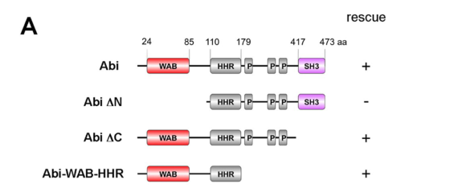

## Question

# Gene Research for Functional Annotation

## ⚠️ CRITICAL: Gene/Protein Identification Context

**BEFORE YOU BEGIN RESEARCH:** You MUST verify you are researching the CORRECT gene/protein. Gene symbols can be ambiguous, especially for less well-characterized genes from non-model organisms.

### Target Gene/Protein Identity (from UniProt):
- **UniProt Accession:** A0A0B4K774
- **Protein Description:** SubName: Full=Abelson interacting protein, isoform D {ECO:0000313|EMBL:AFH06409.1};
- **Gene Information:** Name=Abi {ECO:0000313|EMBL:AFH06409.1, ECO:0000313|FlyBase:FBgn0020510}; Synonyms=abi {ECO:0000313|EMBL:AFH06409.1}, Abi-1 {ECO:0000313|EMBL:AFH06409.1}, Ablphilin {ECO:0000313|EMBL:AFH06409.1}, dAbi {ECO:0000313|EMBL:AFH06409.1}, Dmel\CG9749 {ECO:0000313|EMBL:AFH06409.1}; ORFNames=CG9749 {ECO:0000313|EMBL:AFH06409.1, ECO:0000313|FlyBase:FBgn0020510}, Dmel_CG9749 {ECO:0000313|EMBL:AFH06409.1};
- **Organism (full):** Drosophila melanogaster (Fruit fly).
- **Protein Family:** Belongs to the ABI family. .
- **Key Domains:** ABI. (IPR028457); ABI3_SH3. (IPR028455); ABI_N. (IPR063614); Abl-interactor_HHR_dom. (IPR012849); SH3-like_dom_sf. (IPR036028)

### MANDATORY VERIFICATION STEPS:

1. **Check if the gene symbol "Abi" matches the protein description above**
2. **Verify the organism is correct:** Drosophila melanogaster (Fruit fly).
3. **Check if protein family/domains align with what you find in literature**
4. **If you find literature for a DIFFERENT gene with the same or similar symbol, STOP**

### If Gene Symbol is Ambiguous or You Cannot Find Relevant Literature:

**DO NOT PROCEED WITH RESEARCH ON A DIFFERENT GENE.** Instead:
- State clearly: "The gene symbol 'Abi' is ambiguous or literature is limited for this specific protein"
- Explain what you found (e.g., "Found extensive literature on a different gene with the same symbol in a different organism")
- Describe the protein based ONLY on the UniProt information provided above
- Suggest that the protein function can be inferred from domain/family information

### Research Target:

Please provide a comprehensive research report on the gene **Abi** (gene ID: Abi, UniProt: A0A0B4K774) in DROME.

The research report should be a detailed narrative explaining the function, biological processes, and localization of the gene product. Citations should be given for all claims.

You should prioritize authoritative reviews and primary scientific literature when conducting research. You can supplement
this with annotations you find in gene/protein databases, but these can be outdated or inaccurate.

We are specifically interested in the primary function of the gene - for enzymes, what reaction is catalyzed, and what is the substrate specificity? For transporters, what is the substrate? For structural proteins or adapters, what is the broader structural role? For signaling molecules, what is the role in the pathway.

We are interested in where in or outside the cell the gene product carries out its function.

We are also interested in the signaling or biochemical pathways in which the gene functions. We are less interested in broad pleiotropic effects, except where these elucidate the precise role.

Include evidence where possible. We are interested in both experimental evidence as well as inference from structure, evolution, or bioinformatic analysis. Precise studies should be prioritized over high-throughput, where available.

## Output

Question: You are an expert researcher providing comprehensive, well-cited information.

Provide detailed information focusing on:
1. Key concepts and definitions with current understanding
2. Recent developments and latest research (prioritize 2023-2024 sources)
3. Current applications and real-world implementations
4. Expert opinions and analysis from authoritative sources
5. Relevant statistics and data from recent studies

Format as a comprehensive research report with proper citations. Include URLs and publication dates where available.
Always prioritize recent, authoritative sources and provide specific citations for all major claims.

# Gene Research for Functional Annotation

## ⚠️ CRITICAL: Gene/Protein Identification Context

**BEFORE YOU BEGIN RESEARCH:** You MUST verify you are researching the CORRECT gene/protein. Gene symbols can be ambiguous, especially for less well-characterized genes from non-model organisms.

### Target Gene/Protein Identity (from UniProt):
- **UniProt Accession:** A0A0B4K774
- **Protein Description:** SubName: Full=Abelson interacting protein, isoform D {ECO:0000313|EMBL:AFH06409.1};
- **Gene Information:** Name=Abi {ECO:0000313|EMBL:AFH06409.1, ECO:0000313|FlyBase:FBgn0020510}; Synonyms=abi {ECO:0000313|EMBL:AFH06409.1}, Abi-1 {ECO:0000313|EMBL:AFH06409.1}, Ablphilin {ECO:0000313|EMBL:AFH06409.1}, dAbi {ECO:0000313|EMBL:AFH06409.1}, Dmel\CG9749 {ECO:0000313|EMBL:AFH06409.1}; ORFNames=CG9749 {ECO:0000313|EMBL:AFH06409.1, ECO:0000313|FlyBase:FBgn0020510}, Dmel_CG9749 {ECO:0000313|EMBL:AFH06409.1};
- **Organism (full):** Drosophila melanogaster (Fruit fly).
- **Protein Family:** Belongs to the ABI family. .
- **Key Domains:** ABI. (IPR028457); ABI3_SH3. (IPR028455); ABI_N. (IPR063614); Abl-interactor_HHR_dom. (IPR012849); SH3-like_dom_sf. (IPR036028)

### MANDATORY VERIFICATION STEPS:

1. **Check if the gene symbol "Abi" matches the protein description above**
2. **Verify the organism is correct:** Drosophila melanogaster (Fruit fly).
3. **Check if protein family/domains align with what you find in literature**
4. **If you find literature for a DIFFERENT gene with the same or similar symbol, STOP**

### If Gene Symbol is Ambiguous or You Cannot Find Relevant Literature:

**DO NOT PROCEED WITH RESEARCH ON A DIFFERENT GENE.** Instead:
- State clearly: "The gene symbol 'Abi' is ambiguous or literature is limited for this specific protein"
- Explain what you found (e.g., "Found extensive literature on a different gene with the same symbol in a different organism")
- Describe the protein based ONLY on the UniProt information provided above
- Suggest that the protein function can be inferred from domain/family information

### Research Target:

Please provide a comprehensive research report on the gene **Abi** (gene ID: Abi, UniProt: A0A0B4K774) in DROME.

The research report should be a detailed narrative explaining the function, biological processes, and localization of the gene product. Citations should be given for all claims.

You should prioritize authoritative reviews and primary scientific literature when conducting research. You can supplement
this with annotations you find in gene/protein databases, but these can be outdated or inaccurate.

We are specifically interested in the primary function of the gene - for enzymes, what reaction is catalyzed, and what is the substrate specificity? For transporters, what is the substrate? For structural proteins or adapters, what is the broader structural role? For signaling molecules, what is the role in the pathway.

We are interested in where in or outside the cell the gene product carries out its function.

We are also interested in the signaling or biochemical pathways in which the gene functions. We are less interested in broad pleiotropic effects, except where these elucidate the precise role.

Include evidence where possible. We are interested in both experimental evidence as well as inference from structure, evolution, or bioinformatic analysis. Precise studies should be prioritized over high-throughput, where available.

# Functional annotation report: *Drosophila melanogaster* Abi

## Identity and annotation scope

The specified UniProt accession [A0A0B4K774](https://www.uniprot.org/uniprotkb/A0A0B4K774/entry) identifies **Abelson interacting protein, isoform D**, encoded by fly **Abi** (CG9749; FlyBase FBgn0020510). This is an ABI-family adaptor, **not** the *Drosophila* Abl tyrosine kinase or human ABI1. Its annotated ABI, ABI_N, homeodomain-homologous-region and SH3-related domains agree with experimental descriptions of fly Abi’s N-terminal WAVE-binding region, Kette-binding region and C-terminal SH3 domain. The experiments below establish functions for the fly **Abi gene and experimentally tested constructs**; they do not independently establish that every result applies specifically to UniProt isoform D. (stephan2011membranetargetedwavemediates pages 1-2, stephan2011membranetargetedwavemediates pages 5-7)

## Primary molecular function

**Abi is a non-enzymatic adaptor and regulatory subunit of the SCAR/WAVE regulatory complex (WRC).** Its principal experimentally supported role is to stabilize SCAR/WAVE, position it at appropriate membrane-associated sites and connect upstream signals to **Arp2/3-dependent branched-actin assembly**. The other fly complex components include SCAR/WAVE, Sra-1/CYFIP, Kette/Nap1 and HSPC300. Abi does **not** itself catalyze actin polymerization or a chemical reaction: SCAR/WAVE stimulates Arp2/3, which nucleates actin filaments. (kunda2003abisra1and pages 1-2, kunda2003abisra1and pages 3-5, lin2009abiplaysan pages 1-2)

Loss-of-function experiments explain why complex membership matters. In fly S2R⁺ cells, depletion of Abi reduced SCAR protein by approximately **90%**, and proteasome inhibition partially restored SCAR abundance. It did **not** restore SCAR localization to protrusion tips or normal protrusion formation. Thus Abi has distinguishable roles in preventing SCAR degradation and enabling correctly localized SCAR activity; a simple model in which Abi only inhibits SCAR does not explain the cellular results. (kunda2003abisra1and pages 1-2, kunda2003abisra1and pages 3-5)

Domain-rescue experiments identify the relevant molecular interface in vivo. In the developing visual system, Abi lacking its C-terminal **WASP-binding SH3 domain** retained rescue activity, whereas Abi lacking the N-terminal **WAVE-binding region** did not. A fragment containing the WAVE-binding and Kette-interacting regions—approximately the first **179 amino acids**—rescued axon-targeting defects and, when ubiquitously expressed, mutant lethality. This identifies the N-terminal WRC-related function as sufficient for those tested developmental requirements, **not** as proof that Abi’s SH3-dependent interactions are universally dispensable. The reported SH3 association with WASP provides a second, context-dependent route to actin regulation. (stephan2011membranetargetedwavemediates pages 5-7, stephan2011membranetargetedwavemediates media 02ae4d6d, stephan2011membranetargetedwavemediates media 4d802fb3)

Abi also couples the WRC to other actin regulators. Fly Ena binds two noncanonical **LPPPP** motifs in Abi’s proline-rich region, at residues **311–315 and 374–378**. Disrupting Ena binding leaves Abi associated with WAVE but impairs actin-dependent behavior in fly macrophages, photoreceptors and egg chambers. Recombinant-complex experiments additionally show that Ena/VASP can cooperate with Rac-stimulated WRC to enhance Arp2/3-mediated polymerization; those purified biochemical assays should not be mistaken for a direct catalytic activity of Abi or for isoform-D-specific measurements. (chen2014enavaspproteinscooperate pages 5-7, chen2014enavaspproteinscooperate pages 1-3, chen2014enavaspproteinscooperate pages 3-5)

## Where Abi acts

Abi functions **inside cells**, particularly in cytoplasmic complexes at or near the **plasma-membrane cortex, actin-rich protrusions and trafficking membranes**; there is no evidence here for an extracellular Abi function. In S2R⁺ cells, its requirement for SCAR positioning is demonstrated by the loss of SCAR from protrusion tips after Abi depletion. In fly macrophages, disrupting Abi–Ena binding reduces lamellipodial protrusion and redistributes Ena away from lamellipodial leading edges. (kunda2003abisra1and pages 3-5, chen2014enavaspproteinscooperate pages 5-7, chen2014enavaspproteinscooperate pages 9-11)

Localization is responsive to signaling context. Cip4/Toca-1 expression relocates normally punctate Abi-EGFP onto **Cip4-induced membrane tubules**. Cip4’s SH3 domain connects to Abi, providing a route by which the Cdc42–Cip4 membrane-remodeling pathway recruits the Abi-containing WRC; Cip4 connects to WASP differently, through direct binding. Abi is also detected in photoreceptor axons and optic-lobe target tissues, although mosaic experiments place the decisive targeting requirement in **target-area neurons**, rather than in the projecting photoreceptors or glia. At larval neuromuscular junctions (NMJs), Abi occurs predominantly in punctate **presynaptic submembrane cortical** domains and participates in ligand-induced membrane ruffling and macropinocytosis. These observations support **regulated membrane association**, not permanent localization to a single organelle. (fricke2009drosophilacip4toca1integrates pages 4-5, fricke2009drosophilacip4toca1integrates pages 3-4, stephan2011membranetargetedwavemediates pages 4-5, kim2019bmpdependentsynapticdevelopment pages 2-3, kim2019bmpdependentsynapticdevelopment pages 8-9)

## Biological and signaling pathways

**Rac–SCAR/WAVE–Arp2/3 and cell shape.** In cultured fly cells, Abi, Sra-1 and Kette are needed for SCAR stability, correct localization and dynamic actin-based protrusions. These findings place Abi between local small-GTPase signaling and the membrane-proximal branched-actin machinery. Cip4-dependent Abi recruitment illustrates how membrane deformation and trafficking can be coupled to the same machinery. (kunda2003abisra1and pages 1-2, kunda2003abisra1and pages 3-5, fricke2009drosophilacip4toca1integrates pages 3-4, fricke2009drosophilacip4toca1integrates pages 6-7)

**Neuronal targeting and actin organization.** *Abi* mutants have disorganized optic-lobe target scaffolds and photoreceptor axons that overshoot their normal lamina destination. Mutants averaged **7.7 abnormal medulla axon bundles per optic lobe**, versus **0.1** in controls; **94%** of mutant brains, versus **0%** of controls, had more than 15 overshooting R2–R5 axons. WAVE, but not WASP, is required for this particular targeting response. Membrane-tethered WAVE can bypass loss of Abi in this assay, supporting the interpretation that a critical consequence of Abi-containing WRC function is productive WAVE positioning/activity at membranes. (stephan2011membranetargetedwavemediates pages 4-5, stephan2011membranetargetedwavemediates pages 1-2, stephan2011membranetargetedwavemediates pages 5-7)

Fly neuronal studies also show that Abi interacts functionally with **Abl and Enabled/Ena**, but their relationship is phenotype-dependent rather than uniformly activating or inhibitory. Reducing *abi* dosage suppresses several *Abl*-mutant axon-guidance and NMJ overgrowth phenotypes; in cultured neuronal cells, Abi overexpression redistributes peripheral F-actin into aggregates, whereas coexpression of Abl restores more peripheral actin and extended morphology. These results support a role in organizing neuronal actin, not an assertion that Abi itself is a kinase. (lin2009abiplaysan pages 1-2, lin2009abiplaysan pages 6-7)

**BMP-receptor trafficking and synaptic negative feedback.** A particularly precise pathway is established at the larval NMJ. The BMP ligand **Gbb** stimulates membrane ruffling and **macropinocytosis** through an **Abl–Abi–Rac1–SCAR**-associated response. Abl phosphorylates Abi at **Y148, Y155, Y248 and Y285**; Abi-dependent remodeling contributes to internalization and degradation of BMP receptors, including **Tkv**, limiting downstream BMP/pMad signaling and excessive synaptic growth. Loss of Abi, Abl or Rac1 impairs ligand-induced macropinocytosis, and Abi depletion blocks efficient Gbb-induced Tkv degradation. The study observed induced presynaptic macropinosomes **larger than 200 nm**; this describes the vesicles, not the dimensions of Abi. The evidence supports Abi-mediated receptor trafficking and pathway feedback, **not** direct enzymatic processing of the BMP ligand or receptor by Abi. (kim2019bmpdependentsynapticdevelopment pages 5-5, kim2019bmpdependentsynapticdevelopment pages 13-14, kim2019bmpdependentsynapticdevelopment pages 10-11, kim2019bmpdependentsynapticdevelopment pages 1-2)

**Developmental cell migration and tissue morphogenesis.** Disrupting the Abi–Ena interaction produces abnormally spiky fly macrophages with poorer lamellipodia and reduced protrusion dynamics. The same interaction is important for photoreceptor targeting and for egg-chamber cortical-actin organization, egg shape and fertility. These are experimentally observed implementations of Abi’s actin-adaptor role rather than separate established biochemical activities. (chen2014enavaspproteinscooperate pages 5-7, chen2014enavaspproteinscooperate pages 9-11, chen2014enavaspproteinscooperate pages 7-9)

The following table distinguishes direct fly Abi experiments from pathway-level inference and links each result to its primary publication.

| Experimental context | Key evidence | Precise functional inference | Evidence grade | Source |
|---|---|---|---|---|
| Drosophila S2R⁺ cells; Abi RNAi | Depleting Abi reduced SCAR protein by ~90%; proteasome inhibitors partially restored SCAR abundance but not its localization to protrusion tips or normal protrusion formation. | Abi is required both to protect SCAR/WAVE from proteasomal degradation and, independently, to localize functional SCAR/WAVE for Arp2/3-dependent cortical protrusions. | **Direct, strong**: RNAi, immunoblotting, imaging and inhibitor rescue | Kunda et al., 2003, *Current Biology*. [DOI](https://doi.org/10.1016/j.cub.2003.10.005) (kunda2003abisra1and pages 1-2, kunda2003abisra1and pages 3-5) |
| Cultured fly cells and wing epithelium; Cip4/Toca-1 pathway | Full-length Cip4 recruited normally punctate Abi-EGFP onto Cip4-induced membrane tubules. Cip4’s SH3 domain connected it to Abi and thereby indirectly to WAVE; activated Cdc42 precipitated Abi/WAVE only when Cip4 was present. | Abi links the WRC to Cip4-deformed membranes and endocytic structures, coupling Cdc42–F-BAR membrane remodeling to branched-actin assembly. Cip4 binds WASP directly but connects to WAVE through Abi. | **Direct, strong**: recruitment, pull-down, fractionation and fly genetics | Fricke et al., 2009, *Current Biology*. [DOI](https://doi.org/10.1016/j.cub.2009.07.058) (fricke2009drosophilacip4toca1integrates pages 4-5, fricke2009drosophilacip4toca1integrates pages 3-4, fricke2009drosophilacip4toca1integrates pages 5-6) |
| Developing visual system; abi-null rescue | Mutants averaged **7.7 abnormal medulla bundles versus 0.1** in wild type; **94% versus 0%** of brains had >15 overshooting R2–R5 axons. The N-terminal WAB–HHR fragment (residues 1–179) restored bundle counts to ~0.5 and rescued viability, whereas WAVE-binding-deficient AbiΔN failed; SH3-deficient Abi retained rescue activity. | Abi’s essential role in this context is WRC assembly/stabilization through its N-terminal WAVE- and Kette-binding region, not its C-terminal WASP-binding SH3 domain. Abi acts mainly in target-area neurons rather than autonomously in photoreceptors. | **Direct, very strong**: null allele, tissue-specific mosaics, domain-rescue and quantitative phenotyping | Stephan et al., 2011, *Molecular Biology of the Cell*. [DOI](https://doi.org/10.1091/mbc.e11-02-0121) (stephan2011membranetargetedwavemediates pages 4-5, stephan2011membranetargetedwavemediates pages 5-7, stephan2011membranetargetedwavemediates media 02ae4d6d) |
| Primary fly macrophages, photoreceptors and oogenesis | Ena’s EVH1 domain binds two noncanonical Abi **LPPPP** motifs at residues 311–315 and 374–378. Binding-site mutation caused spiky macrophages, reduced lamellipodial protrusion and Ena redistribution; it failed to rescue photoreceptor targeting, fertility, egg elongation and cortical-actin defects, despite preserved WRC incorporation. | Abi is a physical and functional bridge between Ena/VASP and the WRC. Ena binding tunes WRC dynamics and supports coordinated linear/branched actin assembly during migration and morphogenesis rather than being required merely for WRC assembly. | **Direct, strong**: motif mapping, mutant rescue, live-cell analysis and in-vivo phenotyping | Chen et al., 2014, *Developmental Cell*. [DOI](https://doi.org/10.1016/j.devcel.2014.08.001) (chen2014enavaspproteinscooperate pages 5-7, chen2014enavaspproteinscooperate pages 9-11, chen2014enavaspproteinscooperate pages 3-5) |
| Larval neuromuscular junction and BG2-c2 neuronal cells; Gbb/BMP signaling | Abi localized predominantly to the presynaptic submembrane cortex. Gbb induced membrane ruffles and >200-nm macropinosomes; loss of Abi, Abl or Rac1 impaired this response and blocked efficient Tkv receptor degradation. Abl phosphorylated Abi at Y148, Y155, Y248 and Y285; defective Abi–Abl–Rac1–SCAR signaling elevated BMP output and produced synaptic overgrowth/satellite boutons. | Presynaptic Abi converts BMP-receptor activation into WRC-dependent macropinocytosis, internalizing and degrading BMP receptors to provide negative feedback on pMad-dependent synaptic growth. | **Direct, very strong**: genetics, live imaging, ultrastructure, receptor-degradation and phosphosite mutants | Kim et al., 2019, *Nature Communications*. [DOI](https://doi.org/10.1038/s41467-019-08533-2) (kim2019bmpdependentsynapticdevelopment pages 5-5, kim2019bmpdependentsynapticdevelopment pages 13-14, kim2019bmpdependentsynapticdevelopment pages 2-3, kim2019bmpdependentsynapticdevelopment pages 10-11) |
| Embryonic commissural axons; Frazzled/DCC–WRC signaling | Fra’s WIRS motif bound recombinant Drosophila WRC containing Abi residues 1–170. FraΔWIRS rescued non-crossing defects less effectively than FraWT (**42% versus 13%** defective segments); fly genetics directly tested CYFIP, SCAR and HSPC300, not Abi. | The 2024 study strengthens the model that receptor WIRS motifs recruit an Abi-containing WRC during netrin-guided axon crossing, but it **does not constitute direct fly Abi perturbation evidence**; the Abi-specific assignment is complex-membership inference. | **Indirect for Abi; strong for WRC**: biochemical WRC binding and receptor/WRC-subunit genetics | Chaudhari et al., 2024, *Science Signaling*. [DOI](https://doi.org/10.1126/scisignal.adk2345) (chaudhari2024ahumandcc pages 6-8, chaudhari2024ahumandcc pages 8-9, chaudhari2024ahumandcc pages 14-16) |

*Table: Evidence-graded summary of experiments defining Drosophila Abi as a membrane-associated WAVE-regulatory-complex adaptor. The table separates direct Abi perturbation from the 2024 Frazzled result, which implicates an Abi-containing WRC without manipulating Abi itself.*

## Recent research and interpretation

A **2024** *Science Signaling* study extends the WRC pathway to **Netrin–Frazzled/DCC axon guidance**. The conserved WRC-interacting receptor sequence (*WIRS*) in fly Frazzled binds recombinant fly WRC containing an Abi N-terminal fragment; disrupting that receptor motif compromises midline-crossing rescue. In the reported fly assay, non-crossing defects were **13%** after wild-type Fra rescue versus **42%** after Fra lacking WIRS. Crucially, the study’s fly genetic perturbations tested the receptor and other WRC subunits, **not a specific Abi mutant**. It therefore strengthens the case for recruitment of an *Abi-containing complex* by Frazzled but does not independently prove which contribution Abi makes to that 2024 phenotype. (chaudhari2024ahumandcc pages 6-8, chaudhari2024ahumandcc pages 8-9, chaudhari2024ahumandcc pages 14-16)

The most informative **direct fly Abi perturbation studies identified here predate 2023–2024**. Recent reviews or studies centered on **human ABI1** and other organisms cannot establish a new biochemical function, tissue localization or disease association for this particular fly accession. An unresolved annotation question is whether isoform D differs functionally from the fly Abi forms and engineered fragments tested in the primary studies. Consequently, the most defensible primary annotation remains **intracellular WRC adaptor and regulator of spatially controlled Arp2/3-dependent actin assembly**, with demonstrable roles in membrane protrusion, neuronal targeting and BMP-receptor macropinocytosis. (stephan2011membranetargetedwavemediates pages 5-7, kunda2003abisra1and pages 3-5, kim2019bmpdependentsynapticdevelopment pages 13-14, chaudhari2024ahumandcc pages 1-3)

### Principal dated sources

- Kunda *et al.*, **28 October 2003**, *Current Biology*: [Abi, Sra1, and Kette control SCAR/WAVE stability and localization](https://doi.org/10.1016/j.cub.2003.10.005). (kunda2003abisra1and pages 1-2, kunda2003abisra1and pages 3-5)
- Fricke *et al.*, **September 2009**, *Current Biology*: [Cip4/Toca-1 couples membrane trafficking to WASP and SCAR/WAVE](https://doi.org/10.1016/j.cub.2009.07.058); Lin *et al.*, **September 2009**, *Development*: [Abi, Abl and neuronal actin phenotypes](https://doi.org/10.1242/dev.033324). (fricke2009drosophilacip4toca1integrates pages 3-4, lin2009abiplaysan pages 1-2)
- Stephan *et al.*, **November 2011**, *Molecular Biology of the Cell*: [Membrane-targeted WAVE and fly photoreceptor targeting](https://doi.org/10.1091/mbc.e11-02-0121). (stephan2011membranetargetedwavemediates pages 5-7)
- Chen *et al.*, **8 September 2014**, *Developmental Cell*: [Ena/VASP cooperation with the WRC](https://doi.org/10.1016/j.devcel.2014.08.001). (chen2014enavaspproteinscooperate pages 1-3, chen2014enavaspproteinscooperate pages 5-7)
- Kim *et al.*, **February 2019**, *Nature Communications*: [Abi–Abl–Rac signaling and BMP-receptor macropinocytosis](https://doi.org/10.1038/s41467-019-08533-2). (kim2019bmpdependentsynapticdevelopment pages 13-14, kim2019bmpdependentsynapticdevelopment pages 2-3)
- Chaudhari *et al.*, **October 2024**, *Science Signaling*: [Frazzled/DCC WIRS-dependent recruitment of the WRC](https://doi.org/10.1126/scisignal.adk2345). (chaudhari2024ahumandcc pages 1-3, chaudhari2024ahumandcc pages 8-9)

References

1. (stephan2011membranetargetedwavemediates pages 1-2): Raiko Stephan, Christina Gohl, Astrid Fleige, Christian Klämbt, and Sven Bogdan. Membrane-targeted wave mediates photoreceptor axon targeting in the absence of the wave complex in drosophila. Molecular Biology of the Cell, 22:4079-4092, Nov 2011. URL: https://doi.org/10.1091/mbc.e11-02-0121, doi:10.1091/mbc.e11-02-0121. This article has 28 citations and is from a domain leading peer-reviewed journal.

2. (stephan2011membranetargetedwavemediates pages 5-7): Raiko Stephan, Christina Gohl, Astrid Fleige, Christian Klämbt, and Sven Bogdan. Membrane-targeted wave mediates photoreceptor axon targeting in the absence of the wave complex in drosophila. Molecular Biology of the Cell, 22:4079-4092, Nov 2011. URL: https://doi.org/10.1091/mbc.e11-02-0121, doi:10.1091/mbc.e11-02-0121. This article has 28 citations and is from a domain leading peer-reviewed journal.

3. (kunda2003abisra1and pages 1-2): Patricia Kunda, Gavin Craig, Veronica Dominguez, and Buzz Baum. Abi, sra1, and kette control the stability and localization of scar/wave to regulate the formation of actin-based protrusions. Current Biology, 13:1867-1875, Oct 2003. URL: https://doi.org/10.1016/j.cub.2003.10.005, doi:10.1016/j.cub.2003.10.005. This article has 425 citations and is from a highest quality peer-reviewed journal.

4. (kunda2003abisra1and pages 3-5): Patricia Kunda, Gavin Craig, Veronica Dominguez, and Buzz Baum. Abi, sra1, and kette control the stability and localization of scar/wave to regulate the formation of actin-based protrusions. Current Biology, 13:1867-1875, Oct 2003. URL: https://doi.org/10.1016/j.cub.2003.10.005, doi:10.1016/j.cub.2003.10.005. This article has 425 citations and is from a highest quality peer-reviewed journal.

5. (lin2009abiplaysan pages 1-2): Tzu-Yang Lin, Chiu-Hui Huang, Hsiu-Hua Kao, Gan-Guang Liou, Shih-Rung Yeh, Chih-Ming Cheng, Mei-Hsin Chen, Rong-Long Pan, and Jyh-Lyh Juang. Abi plays an opposing role to abl in drosophila axonogenesis and synaptogenesis. Development, 136:3099-3107, Sep 2009. URL: https://doi.org/10.1242/dev.033324, doi:10.1242/dev.033324. This article has 53 citations and is from a domain leading peer-reviewed journal.

6. (stephan2011membranetargetedwavemediates media 02ae4d6d): Raiko Stephan, Christina Gohl, Astrid Fleige, Christian Klämbt, and Sven Bogdan. Membrane-targeted wave mediates photoreceptor axon targeting in the absence of the wave complex in drosophila. Molecular Biology of the Cell, 22:4079-4092, Nov 2011. URL: https://doi.org/10.1091/mbc.e11-02-0121, doi:10.1091/mbc.e11-02-0121. This article has 28 citations and is from a domain leading peer-reviewed journal.

7. (stephan2011membranetargetedwavemediates media 4d802fb3): Raiko Stephan, Christina Gohl, Astrid Fleige, Christian Klämbt, and Sven Bogdan. Membrane-targeted wave mediates photoreceptor axon targeting in the absence of the wave complex in drosophila. Molecular Biology of the Cell, 22:4079-4092, Nov 2011. URL: https://doi.org/10.1091/mbc.e11-02-0121, doi:10.1091/mbc.e11-02-0121. This article has 28 citations and is from a domain leading peer-reviewed journal.

8. (chen2014enavaspproteinscooperate pages 5-7): Xing Judy Chen, Anna Julia Squarr, Raiko Stephan, Baoyu Chen, Theresa E. Higgins, David J. Barry, Morag C. Martin, Michael K. Rosen, Sven Bogdan, and Michael Way. Ena/vasp proteins cooperate with the wave complex to regulate the actin cytoskeleton. Developmental Cell, 30:569-584, Sep 2014. URL: https://doi.org/10.1016/j.devcel.2014.08.001, doi:10.1016/j.devcel.2014.08.001. This article has 140 citations and is from a highest quality peer-reviewed journal.

9. (chen2014enavaspproteinscooperate pages 1-3): Xing Judy Chen, Anna Julia Squarr, Raiko Stephan, Baoyu Chen, Theresa E. Higgins, David J. Barry, Morag C. Martin, Michael K. Rosen, Sven Bogdan, and Michael Way. Ena/vasp proteins cooperate with the wave complex to regulate the actin cytoskeleton. Developmental Cell, 30:569-584, Sep 2014. URL: https://doi.org/10.1016/j.devcel.2014.08.001, doi:10.1016/j.devcel.2014.08.001. This article has 140 citations and is from a highest quality peer-reviewed journal.

10. (chen2014enavaspproteinscooperate pages 3-5): Xing Judy Chen, Anna Julia Squarr, Raiko Stephan, Baoyu Chen, Theresa E. Higgins, David J. Barry, Morag C. Martin, Michael K. Rosen, Sven Bogdan, and Michael Way. Ena/vasp proteins cooperate with the wave complex to regulate the actin cytoskeleton. Developmental Cell, 30:569-584, Sep 2014. URL: https://doi.org/10.1016/j.devcel.2014.08.001, doi:10.1016/j.devcel.2014.08.001. This article has 140 citations and is from a highest quality peer-reviewed journal.

11. (chen2014enavaspproteinscooperate pages 9-11): Xing Judy Chen, Anna Julia Squarr, Raiko Stephan, Baoyu Chen, Theresa E. Higgins, David J. Barry, Morag C. Martin, Michael K. Rosen, Sven Bogdan, and Michael Way. Ena/vasp proteins cooperate with the wave complex to regulate the actin cytoskeleton. Developmental Cell, 30:569-584, Sep 2014. URL: https://doi.org/10.1016/j.devcel.2014.08.001, doi:10.1016/j.devcel.2014.08.001. This article has 140 citations and is from a highest quality peer-reviewed journal.

12. (fricke2009drosophilacip4toca1integrates pages 4-5): Robert Fricke, Christina Gohl, Elavarasi Dharmalingam, Astrid Grevelhörster, Baharak Zahedi, Nicholas Harden, Michael Kessels, Britta Qualmann, and Sven Bogdan. Drosophila cip4/toca-1 integrates membrane trafficking and actin dynamics through wasp and scar/wave. Current Biology, 19:1429-1437, Sep 2009. URL: https://doi.org/10.1016/j.cub.2009.07.058, doi:10.1016/j.cub.2009.07.058. This article has 147 citations and is from a highest quality peer-reviewed journal.

13. (fricke2009drosophilacip4toca1integrates pages 3-4): Robert Fricke, Christina Gohl, Elavarasi Dharmalingam, Astrid Grevelhörster, Baharak Zahedi, Nicholas Harden, Michael Kessels, Britta Qualmann, and Sven Bogdan. Drosophila cip4/toca-1 integrates membrane trafficking and actin dynamics through wasp and scar/wave. Current Biology, 19:1429-1437, Sep 2009. URL: https://doi.org/10.1016/j.cub.2009.07.058, doi:10.1016/j.cub.2009.07.058. This article has 147 citations and is from a highest quality peer-reviewed journal.

14. (stephan2011membranetargetedwavemediates pages 4-5): Raiko Stephan, Christina Gohl, Astrid Fleige, Christian Klämbt, and Sven Bogdan. Membrane-targeted wave mediates photoreceptor axon targeting in the absence of the wave complex in drosophila. Molecular Biology of the Cell, 22:4079-4092, Nov 2011. URL: https://doi.org/10.1091/mbc.e11-02-0121, doi:10.1091/mbc.e11-02-0121. This article has 28 citations and is from a domain leading peer-reviewed journal.

15. (kim2019bmpdependentsynapticdevelopment pages 2-3): Najin Kim, Sungdae Kim, Minyeop Nahm, Danielle Kopke, Joohyung Kim, Eunsang Cho, Min-Jung Lee, Mihye Lee, Seung Hyun Kim, Kendal Broadie, and Seungbok Lee. Bmp-dependent synaptic development requires abi-abl-rac signaling of bmp receptor macropinocytosis. Nature Communications, Feb 2019. URL: https://doi.org/10.1038/s41467-019-08533-2, doi:10.1038/s41467-019-08533-2. This article has 44 citations and is from a highest quality peer-reviewed journal.

16. (kim2019bmpdependentsynapticdevelopment pages 8-9): Najin Kim, Sungdae Kim, Minyeop Nahm, Danielle Kopke, Joohyung Kim, Eunsang Cho, Min-Jung Lee, Mihye Lee, Seung Hyun Kim, Kendal Broadie, and Seungbok Lee. Bmp-dependent synaptic development requires abi-abl-rac signaling of bmp receptor macropinocytosis. Nature Communications, Feb 2019. URL: https://doi.org/10.1038/s41467-019-08533-2, doi:10.1038/s41467-019-08533-2. This article has 44 citations and is from a highest quality peer-reviewed journal.

17. (fricke2009drosophilacip4toca1integrates pages 6-7): Robert Fricke, Christina Gohl, Elavarasi Dharmalingam, Astrid Grevelhörster, Baharak Zahedi, Nicholas Harden, Michael Kessels, Britta Qualmann, and Sven Bogdan. Drosophila cip4/toca-1 integrates membrane trafficking and actin dynamics through wasp and scar/wave. Current Biology, 19:1429-1437, Sep 2009. URL: https://doi.org/10.1016/j.cub.2009.07.058, doi:10.1016/j.cub.2009.07.058. This article has 147 citations and is from a highest quality peer-reviewed journal.

18. (lin2009abiplaysan pages 6-7): Tzu-Yang Lin, Chiu-Hui Huang, Hsiu-Hua Kao, Gan-Guang Liou, Shih-Rung Yeh, Chih-Ming Cheng, Mei-Hsin Chen, Rong-Long Pan, and Jyh-Lyh Juang. Abi plays an opposing role to abl in drosophila axonogenesis and synaptogenesis. Development, 136:3099-3107, Sep 2009. URL: https://doi.org/10.1242/dev.033324, doi:10.1242/dev.033324. This article has 53 citations and is from a domain leading peer-reviewed journal.

19. (kim2019bmpdependentsynapticdevelopment pages 5-5): Najin Kim, Sungdae Kim, Minyeop Nahm, Danielle Kopke, Joohyung Kim, Eunsang Cho, Min-Jung Lee, Mihye Lee, Seung Hyun Kim, Kendal Broadie, and Seungbok Lee. Bmp-dependent synaptic development requires abi-abl-rac signaling of bmp receptor macropinocytosis. Nature Communications, Feb 2019. URL: https://doi.org/10.1038/s41467-019-08533-2, doi:10.1038/s41467-019-08533-2. This article has 44 citations and is from a highest quality peer-reviewed journal.

20. (kim2019bmpdependentsynapticdevelopment pages 13-14): Najin Kim, Sungdae Kim, Minyeop Nahm, Danielle Kopke, Joohyung Kim, Eunsang Cho, Min-Jung Lee, Mihye Lee, Seung Hyun Kim, Kendal Broadie, and Seungbok Lee. Bmp-dependent synaptic development requires abi-abl-rac signaling of bmp receptor macropinocytosis. Nature Communications, Feb 2019. URL: https://doi.org/10.1038/s41467-019-08533-2, doi:10.1038/s41467-019-08533-2. This article has 44 citations and is from a highest quality peer-reviewed journal.

21. (kim2019bmpdependentsynapticdevelopment pages 10-11): Najin Kim, Sungdae Kim, Minyeop Nahm, Danielle Kopke, Joohyung Kim, Eunsang Cho, Min-Jung Lee, Mihye Lee, Seung Hyun Kim, Kendal Broadie, and Seungbok Lee. Bmp-dependent synaptic development requires abi-abl-rac signaling of bmp receptor macropinocytosis. Nature Communications, Feb 2019. URL: https://doi.org/10.1038/s41467-019-08533-2, doi:10.1038/s41467-019-08533-2. This article has 44 citations and is from a highest quality peer-reviewed journal.

22. (kim2019bmpdependentsynapticdevelopment pages 1-2): Najin Kim, Sungdae Kim, Minyeop Nahm, Danielle Kopke, Joohyung Kim, Eunsang Cho, Min-Jung Lee, Mihye Lee, Seung Hyun Kim, Kendal Broadie, and Seungbok Lee. Bmp-dependent synaptic development requires abi-abl-rac signaling of bmp receptor macropinocytosis. Nature Communications, Feb 2019. URL: https://doi.org/10.1038/s41467-019-08533-2, doi:10.1038/s41467-019-08533-2. This article has 44 citations and is from a highest quality peer-reviewed journal.

23. (chen2014enavaspproteinscooperate pages 7-9): Xing Judy Chen, Anna Julia Squarr, Raiko Stephan, Baoyu Chen, Theresa E. Higgins, David J. Barry, Morag C. Martin, Michael K. Rosen, Sven Bogdan, and Michael Way. Ena/vasp proteins cooperate with the wave complex to regulate the actin cytoskeleton. Developmental Cell, 30:569-584, Sep 2014. URL: https://doi.org/10.1016/j.devcel.2014.08.001, doi:10.1016/j.devcel.2014.08.001. This article has 140 citations and is from a highest quality peer-reviewed journal.

24. (fricke2009drosophilacip4toca1integrates pages 5-6): Robert Fricke, Christina Gohl, Elavarasi Dharmalingam, Astrid Grevelhörster, Baharak Zahedi, Nicholas Harden, Michael Kessels, Britta Qualmann, and Sven Bogdan. Drosophila cip4/toca-1 integrates membrane trafficking and actin dynamics through wasp and scar/wave. Current Biology, 19:1429-1437, Sep 2009. URL: https://doi.org/10.1016/j.cub.2009.07.058, doi:10.1016/j.cub.2009.07.058. This article has 147 citations and is from a highest quality peer-reviewed journal.

25. (chaudhari2024ahumandcc pages 6-8): Karina Chaudhari, Kaiyue Zhang, Patricia T. Yam, Yixin Zang, Daniel A. Kramer, Sarah Gagnon, Sabrina Schlienger, Sara Calabretta, Jean-Francois Michaud, Meagan Collins, Junmei Wang, Myriam Srour, Baoyu Chen, Frédéric Charron, and Greg J. Bashaw. A human dcc variant causing mirror movement disorder reveals that the wave regulatory complex mediates axon guidance by netrin-1–dcc. Science Signaling, Oct 2024. URL: https://doi.org/10.1126/scisignal.adk2345, doi:10.1126/scisignal.adk2345. This article has 5 citations and is from a domain leading peer-reviewed journal.

26. (chaudhari2024ahumandcc pages 8-9): Karina Chaudhari, Kaiyue Zhang, Patricia T. Yam, Yixin Zang, Daniel A. Kramer, Sarah Gagnon, Sabrina Schlienger, Sara Calabretta, Jean-Francois Michaud, Meagan Collins, Junmei Wang, Myriam Srour, Baoyu Chen, Frédéric Charron, and Greg J. Bashaw. A human dcc variant causing mirror movement disorder reveals that the wave regulatory complex mediates axon guidance by netrin-1–dcc. Science Signaling, Oct 2024. URL: https://doi.org/10.1126/scisignal.adk2345, doi:10.1126/scisignal.adk2345. This article has 5 citations and is from a domain leading peer-reviewed journal.

27. (chaudhari2024ahumandcc pages 14-16): Karina Chaudhari, Kaiyue Zhang, Patricia T. Yam, Yixin Zang, Daniel A. Kramer, Sarah Gagnon, Sabrina Schlienger, Sara Calabretta, Jean-Francois Michaud, Meagan Collins, Junmei Wang, Myriam Srour, Baoyu Chen, Frédéric Charron, and Greg J. Bashaw. A human dcc variant causing mirror movement disorder reveals that the wave regulatory complex mediates axon guidance by netrin-1–dcc. Science Signaling, Oct 2024. URL: https://doi.org/10.1126/scisignal.adk2345, doi:10.1126/scisignal.adk2345. This article has 5 citations and is from a domain leading peer-reviewed journal.

28. (chaudhari2024ahumandcc pages 1-3): Karina Chaudhari, Kaiyue Zhang, Patricia T. Yam, Yixin Zang, Daniel A. Kramer, Sarah Gagnon, Sabrina Schlienger, Sara Calabretta, Jean-Francois Michaud, Meagan Collins, Junmei Wang, Myriam Srour, Baoyu Chen, Frédéric Charron, and Greg J. Bashaw. A human dcc variant causing mirror movement disorder reveals that the wave regulatory complex mediates axon guidance by netrin-1–dcc. Science Signaling, Oct 2024. URL: https://doi.org/10.1126/scisignal.adk2345, doi:10.1126/scisignal.adk2345. This article has 5 citations and is from a domain leading peer-reviewed journal.

## Artifacts

- [Edison artifact artifact-00](Abi-deep-research-falcon_artifacts/artifact-00.md)

## Citations

1. stephan2011membranetargetedwavemediates pages 5-7
2. stephan2011membranetargetedwavemediates pages 1-2
3. lin2009abiplaysan pages 1-2
4. chen2014enavaspproteinscooperate pages 5-7
5. chen2014enavaspproteinscooperate pages 1-3
6. chen2014enavaspproteinscooperate pages 3-5
7. chen2014enavaspproteinscooperate pages 9-11
8. stephan2011membranetargetedwavemediates pages 4-5
9. kim2019bmpdependentsynapticdevelopment pages 2-3
10. kim2019bmpdependentsynapticdevelopment pages 8-9
11. lin2009abiplaysan pages 6-7
12. kim2019bmpdependentsynapticdevelopment pages 5-5
13. kim2019bmpdependentsynapticdevelopment pages 13-14
14. kim2019bmpdependentsynapticdevelopment pages 10-11
15. kim2019bmpdependentsynapticdevelopment pages 1-2
16. chen2014enavaspproteinscooperate pages 7-9
17. chaudhari2024ahumandcc pages 6-8
18. chaudhari2024ahumandcc pages 8-9
19. chaudhari2024ahumandcc pages 14-16
20. chaudhari2024ahumandcc pages 1-3
21. A0A0B4K774
22. DOI
23. Abi, Sra1, and Kette control SCAR/WAVE stability and localization
24. Cip4/Toca-1 couples membrane trafficking to WASP and SCAR/WAVE
25. Abi, Abl and neuronal actin phenotypes
26. Membrane-targeted WAVE and fly photoreceptor targeting
27. Ena/VASP cooperation with the WRC
28. Abi–Abl–Rac signaling and BMP-receptor macropinocytosis
29. Frazzled/DCC WIRS-dependent recruitment of the WRC
30. https://www.uniprot.org/uniprotkb/A0A0B4K774/entry
31. https://doi.org/10.1016/j.cub.2003.10.005
32. https://doi.org/10.1016/j.cub.2009.07.058
33. https://doi.org/10.1091/mbc.e11-02-0121
34. https://doi.org/10.1016/j.devcel.2014.08.001
35. https://doi.org/10.1038/s41467-019-08533-2
36. https://doi.org/10.1126/scisignal.adk2345
37. https://doi.org/10.1242/dev.033324
38. https://doi.org/10.1091/mbc.e11-02-0121,
39. https://doi.org/10.1016/j.cub.2003.10.005,
40. https://doi.org/10.1242/dev.033324,
41. https://doi.org/10.1016/j.devcel.2014.08.001,
42. https://doi.org/10.1016/j.cub.2009.07.058,
43. https://doi.org/10.1038/s41467-019-08533-2,
44. https://doi.org/10.1126/scisignal.adk2345,