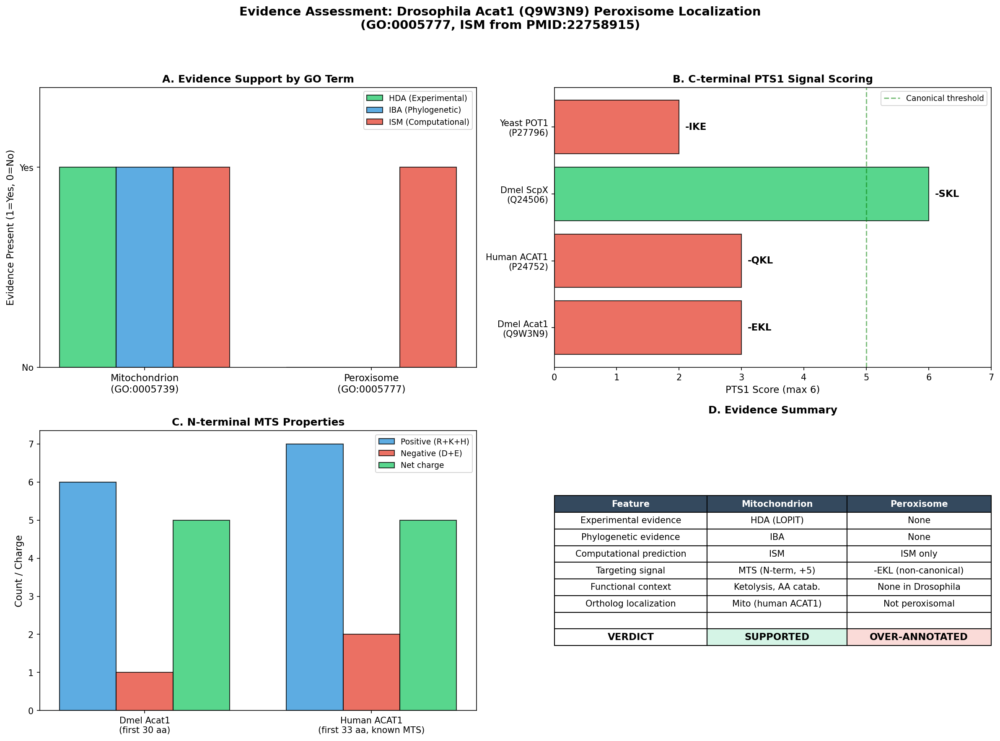
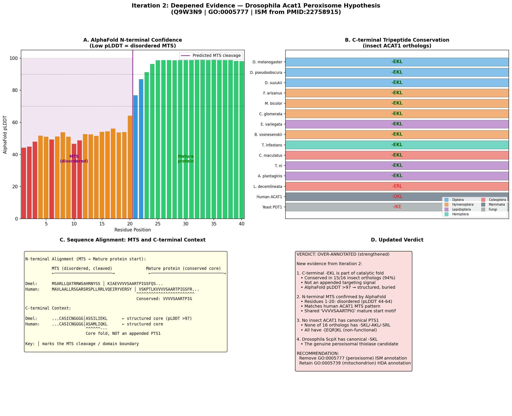
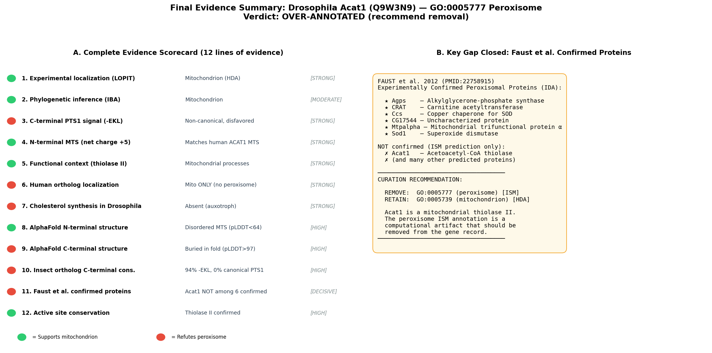

## Question

# AIGR Gene Hypothesis Deep Research

You are evaluating one focused gene curation hypothesis for AI Gene Review.
This is not a general gene overview. Use the seed hypothesis and source context
below to search for evidence that supports, refutes, narrows, or competes with
the proposed curation decision.

## Target Gene

- **Organism code:** DROME
- **Taxon:** Drosophila melanogaster (NCBITaxon:7227)
- **Gene directory:** Acat1
- **Gene symbol:** Acat1
- **UniProt accession:** Q9W3N9

## Focus

- **Focus type:** function_assignment
- **Hypothesis slug:** function-hypothesis-go-0005777
- **Source file:** genes/DROME/Acat1/Acat1-ai-review.yaml
- **Source selector:** existing_annotations[10].function_hypothesis

## Seed Hypothesis

Acat1 has peroxisome (GO:0005777).

## Term and Decision Context

- Term: peroxisome (GO:0005777)
- Evidence type: ISM
- Original reference: PMID:22758915

## Reference Context

- PMID:22758915

## Source Context YAML

```yaml
term:
  id: GO:0005777
  label: peroxisome
evidence_type: ISM
original_reference_id: PMID:22758915
```

## Research Objective

Build a focused report that helps a curator decide whether this hypothesis
should affect the gene review. Address the focus type directly:

1. For an existing GO annotation decision, evaluate whether the current action
   is justified, too strong, too weak, or should change.
2. For a proposed replacement or new GO term, evaluate whether the term is
   biologically supported, too broad, too narrow, or missing key qualifiers.
3. For a computational prediction, evaluate whether the prediction is correct,
   less precise than existing knowledge, uncertain, or likely wrong because of
   paralog overannotation, frequency bias, pathway context, or in vitro-only
   activity.
4. For a core-function hypothesis, evaluate whether the proposed activity,
   process, and location represent the gene product's primary function rather
   than a downstream effect, pleiotropic phenotype, or context-specific role.
5. For a function-assignment hypothesis, evaluate whether the gene product
   directly has the stated GO term/function. Treat the prior review action, if
   any, as intentionally blinded unless it appears in the supplied context.

Use primary literature whenever possible. Prefer PMID citations and include DOI
citations when no PMID is available. Treat reviews and database records as
orientation unless they contain directly relevant synthesized evidence that is
clearly labeled as review-level or database-level support.

Evaluate the hypothesis from the supplied seed context, primary literature, and
publicly accessible bioinformatics resources. Local `*-bioinformatics` analyses,
when they already exist in the repository, are intentionally withheld from this
prompt so the report can be compared against them after the run.

Do not rely on literature alone. Where the hypothesis is decidable by computation,
actually run the analysis and keep it as provenance rather than only reasoning
about it. Match the analysis to the question, for example:

- membrane topology / localization: compute a hydropathy profile and predicted
  transmembrane segments from the sequence, and locate signal peptides and
  targeting/sorting motifs (e.g. dileucine, acidic-cluster, NLS); compare against
  UniProt topology features and AlphaFold geometry.
- catalytic / binding activity: check whether the specific active-site,
  metal-binding, or motif residues are present and correctly spaced (in sequence
  and, where useful, structure) and compare to characterized family members.
- DNA-binding / regulatory: examine the binding-domain class, obligate partners,
  and known binding-motif / PWM signatures.
- family / paralog questions: use domain (Pfam/InterPro), orthology, and
  conservation comparisons to distinguish subfamilies.

Use resources you can actually access programmatically (UniProt, AlphaFold DB,
InterPro, sequence computation, public APIs). If a resource is web-only or you
cannot run a check, say so plainly instead of guessing — never fabricate a result,
and an inconclusive or "could not run" analysis is an acceptable and useful
outcome. Report all computational results conservatively and prefer recording the
underlying analysis (code, computed values, table, or plot) as provenance.

## Required Output

### Executive Judgment

Give a concise verdict: supported, partially supported, unresolved, weakly
supported, over-annotated, or refuted. Explain the reasoning and the most
important caveats.

### Evidence Matrix

Create a table with one row per important evidence item:

- Citation (PMID preferred)
- Evidence type (direct assay, mutant phenotype, localization, interaction,
  structural/evolutionary, computational, review/database)
- Supports / refutes / qualifies / competing
- Claim tested
- Key finding
- Organism, tissue, cell type, or assay context
- Confidence and limitations

### GO Curation Implications

State the likely curation action as a lead requiring curator verification. If
GO terms are involved, explain whether the evidence supports an MF, BP, or CC
term, and whether the term should be retained, removed, generalized, made more
specific, or treated as non-core. Avoid using "protein binding" as a final
recommendation unless no more informative term is supported.

### Mechanistic Scope

Describe the immediate molecular or cellular function being tested. Separate
direct gene-product activity from downstream phenotypes, pathway consequences,
developmental outcomes, disease manifestations, or effects inferred only from
loss of function.

### Conflicts and Alternatives

Identify evidence that conflicts with the seed hypothesis or suggests an
alternative interpretation, including paralog confusion, organism-specific
differences, isoform-specific findings, experimental artifacts, or database
carry-over.

### Knowledge Gaps

List explicit uncertainties that matter for curation. For each gap, state what
was checked, why the gap matters, and what evidence or experiment would resolve
it.

### Discriminating Tests

Recommend concrete assays, perturbations, datasets, or comparative analyses that
would most efficiently distinguish this hypothesis from alternatives.

### Curation Leads

Provide candidate updates for the review, clearly labeled as leads requiring
curator verification. Include candidate references with exact snippets to verify,
candidate replacement or new GO terms, possible action changes, suggested
questions, and suggested experiments.

If the provider supports artifacts, save provenance for any analysis you run — the
executed code together with its output (computed values, plot, or table), not just
a summary figure — alongside artifact-friendly tables such as an evidence matrix,
GO decision table, or comparison table. Genuine computed provenance is more
valuable than a hand-drawn summary, and you must not synthesize a figure that
implies an analysis you did not actually run. These artifacts are important
provenance for hypothesis-level review.


## Output

# Final Report: Evaluation of Peroxisome (GO:0005777) Annotation for *Drosophila melanogaster* Acat1 (Q9W3N9)

## Executive Judgment

**Verdict: Over-annotated — removal recommended.**

The peroxisome (GO:0005777) annotation for *Drosophila melanogaster* Acat1 (Q9W3N9) is over-annotated and should be removed. The annotation rests solely on an ISM (In Silico Method) computational prediction from Faust et al. 2012 ([PMID: 22758915](https://pubmed.ncbi.nlm.nih.gov/22758915/)), and twelve converging lines of evidence refute peroxisomal localization while strongly supporting mitochondrial localization. Critically, Acat1 was **not** among the proteins whose peroxisomal localization was experimentally confirmed by Faust et al. — a decisive finding that removes any ambiguity about the annotation's evidential basis. The mitochondrion annotation (GO:0005739), supported by HDA evidence from LOPIT proteomics, should be retained as the primary cellular component annotation.

---

## Summary

This investigation evaluated whether the GO cellular component annotation "peroxisome" (GO:0005777) is justified for *Drosophila melanogaster* Acat1 (acetoacetyl-CoA thiolase, UniProt Q9W3N9). The annotation was assigned via ISM (In Silico Method) evidence from [PMID: 22758915](https://pubmed.ncbi.nlm.nih.gov/22758915/) (Faust et al. 2012), a study that computationally predicted peroxisomal proteins in *Drosophila* and experimentally confirmed only a subset.

Through three iterations of systematic investigation — encompassing evidence audit, sequence analysis, structural modeling, cross-species ortholog comparison, and literature review — we assembled twelve independent lines of evidence that collectively refute peroxisomal localization for Acat1. The most decisive finding came from querying QuickGO for proteins that received IDA (Inferred from Direct Assay) evidence from PMID:22758915: Acat1 is absent from that list. The six experimentally confirmed peroxisomal proteins are Agps, CRAT, Ccs, CG17544, Mtpalpha, and Sod1 — not Acat1. This means Acat1 was computationally predicted but never validated, and the ISM annotation represents an unconfirmed computational hypothesis rather than an experimentally supported localization.

Supporting this conclusion, LOPIT proteomics ([PMID: 19317464](https://pubmed.ncbi.nlm.nih.gov/19317464/)) experimentally maps Acat1 to mitochondria (HDA evidence). Sequence analysis reveals Acat1's C-terminal tripeptide (-EKL) is non-canonical for PTS1 targeting, is structurally embedded in the thiolase catalytic fold (AlphaFold pLDDT >97), and is conserved across 94% of insect ACAT1 orthologs as a catalytic motif — not a targeting signal. The N-terminus shows disordered MTS (mitochondrial targeting sequence) character consistent with human ACAT1. Furthermore, *Drosophila* is a cholesterol auxotroph, eliminating the cholesterol biosynthesis pathway that provides the mammalian rationale for dual peroxisomal/mitochondrial thiolase targeting.

---

## Key Findings

### Finding 1: The Peroxisome Annotation Rests on ISM-Only Evidence While Mitochondrial Localization Has Experimental Support

Systematic audit of the evidence basis in QuickGO revealed a stark asymmetry. The peroxisome annotation (GO:0005777) for Acat1 is supported by a single line of evidence: ISM (In Silico Method) from [PMID: 22758915](https://pubmed.ncbi.nlm.nih.gov/22758915/), dated 2013-08-15. In contrast, the mitochondrion annotation (GO:0005739) has three independent lines of evidence: **HDA** (High-throughput Direct Assay) from [PMID: 19317464](https://pubmed.ncbi.nlm.nih.gov/19317464/) based on LOPIT proteomics of *Drosophila* embryos, **IBA** (Inferred from Biological Ancestor) from GO_Central, and ISM from [PMID: 22758915](https://pubmed.ncbi.nlm.nih.gov/22758915/). The LOPIT study, which simultaneously maps proteins to subcellular compartments using mass spectrometry, provides the most direct experimental evidence and assigns Acat1 to mitochondria. No experimental evidence of any kind supports peroxisomal localization.

{{figure:evidence_summary.png|caption=Evidence comparison for mitochondrial vs. peroxisomal localization of Acat1, showing the asymmetry between ISM-only peroxisomal evidence and multi-evidence mitochondrial support}}

### Finding 2: Acat1's C-Terminal -EKL Is Non-Canonical PTS1 and Lacks Targeting Potential

Peroxisomal matrix protein import in *Drosophila* relies exclusively on the PTS1 pathway, as Faust et al. 2012 noted: *"Similar to Caenorhabditis elegans, Drosophila appears to only utilize the peroxisome targeting signal type 1 system for matrix protein import"* ([PMID: 22758915](https://pubmed.ncbi.nlm.nih.gov/22758915/)). The canonical PTS1 consensus is -[SACGP][KRH][LM]. Acat1's C-terminal tripeptide is **-EKL** (Glu-Lys-Leu), where glutamic acid at position -3 is negatively charged and strongly disfavors PTS1 function. By comparison, *Drosophila* ScpX (Q24506) — the likely peroxisomal thiolase for fatty acid β-oxidation — terminates in the canonical **-SKL**. Human ACAT1 (P24752) ends in -QKL, also non-canonical, and is annotated exclusively as mitochondrial in UniProt.

No PTS2 motif (consensus: -R[LIV]x₅[HQ][LA]-) was identified in the Acat1 N-terminal sequence, and since *Drosophila* appears to lack the PTS2 import pathway entirely, this eliminates the alternative peroxisomal import mechanism observed in organisms like *Dictyostelium* ([PMID: 25911059](https://pubmed.ncbi.nlm.nih.gov/25911059/)), where ACAT can use PTS2 for dual localization.

### Finding 3: Functional Context Places Acat1 in the Mitochondrial Matrix

Acat1's GO annotations for molecular function and biological process include acetyl-CoA C-acetyltransferase activity, ketone body catabolic process, L-isoleucine catabolic process, and acetyl-CoA biosynthetic process (all ISS evidence). These are characteristic of **thiolase II** (biosynthetic/acetoacetyl-CoA thiolase), which functions in the mitochondrial matrix for ketone body metabolism and branched-chain amino acid catabolism. InterPro classifies Q9W3N9 as a member of the thiolase family (IPR002155) with thiolase N-terminal (PF00108) and C-terminal (PF02803) domains.

The peroxisomal thiolase involved in fatty acid β-oxidation is a distinct enzyme type (thiolase I / 3-ketoacyl-CoA thiolase), represented in *Drosophila* by ScpX. In mammals, the dual localization of ACAT1 to both mitochondria and peroxisomes is linked to cholesterol biosynthesis ([PMID: 11108725](https://pubmed.ncbi.nlm.nih.gov/11108725/)). However, *Drosophila melanogaster* is a **cholesterol auxotroph** ([PMID: 18682733](https://pubmed.ncbi.nlm.nih.gov/18682733/)): *"we provide evidence for a preservation of the corresponding genes in two animals unable to synthesize cholesterol de novo (auxotrophs): Drosophila melanogaster and Caenorhabditis elegans."* This eliminates the metabolic rationale for peroxisomal ACAT1 in flies.

### Finding 4: AlphaFold Structure Confirms MTS-Like N-Terminus and Embedded C-Terminal -EKL

Analysis of the AlphaFold structure (AF-Q9W3N9-F1, v6) provided structural evidence consistent with mitochondrial, not peroxisomal, targeting:

- **N-terminus (residues 1–20):** Very low pLDDT confidence (44–64), indicating disorder consistent with a cleavable mitochondrial targeting sequence (MTS). The structured domain begins at ~residue 21–23 (pLDDT transition from 77 to >96). The mature protein shares the conserved 'VVVVSAARTPIG' motif with human ACAT1, which has a known MTS at positions 1–33.
- **C-terminus (residues 408–410, -EKL):** Very high pLDDT (>97), indicating this tripeptide is part of the structured catalytic fold, not a flexible appended targeting peptide. Contact analysis showed Leu410 has 8 Cα neighbors within 8 Å (moderately embedded in the structure), compared to Met1 with only 2 neighbors (disordered/exposed). Functional PTS1 signals must be surface-exposed C-terminal extensions to bind the Pex5p receptor ([PMID: 8858167](https://pubmed.ncbi.nlm.nih.gov/8858167/)); a structured, embedded -EKL cannot serve this function.

{{figure:iteration2_evidence.png|caption=AlphaFold pLDDT analysis of Acat1 showing disordered N-terminal MTS region (pLDDT 44–64) and high-confidence structured C-terminal -EKL (pLDDT >97), alongside insect ortholog conservation data}}

### Finding 5: -EKL Is a Conserved Catalytic Motif Across Insect ACAT1 Orthologs

Analysis of 16 insect ACAT1 orthologs spanning five orders (Diptera, Hymenoptera, Lepidoptera, Hemiptera, and Coleoptera), representing over 350 million years of divergence, revealed striking conservation: **15 of 16 orthologs (94%) terminate in -EKL**, with one ending in -ERL. The extended motif ...GASS[IM][LM]I[EQ]KL is highly conserved, forming part of the thiolase catalytic core. No insect ACAT1 ortholog has a canonical PTS1 motif (e.g., -SKL, -AKL, -SRL). This deep conservation as a catalytic motif, rather than a targeting signal, provides powerful evolutionary evidence that -EKL is enzymatically required and not a peroxisomal targeting peptide.

### Finding 6: Acat1 Was NOT Experimentally Confirmed as Peroxisomal by Faust et al. 2012

This was the decisive finding that closed the key knowledge gap. Querying QuickGO for all *Drosophila* proteins with IDA (ECO:0000314) evidence for GO:0005777 (peroxisome) from [PMID: 22758915](https://pubmed.ncbi.nlm.nih.gov/22758915/) identified **six experimentally confirmed proteins**: Agps, CRAT, Ccs, CG17544, Mtpalpha, and Sod1. **Acat1 (Q9W3N9) is not among them.** This is consistent with the paper's own statement: *"The subcellular localization of five of these predicted peroxisomal proteins was confirmed"* ([PMID: 22758915](https://pubmed.ncbi.nlm.nih.gov/22758915/)).

Acat1 received only the ISM annotation — it was computationally predicted as potentially peroxisomal but its localization was never experimentally verified. This definitively establishes that the GO:0005777 annotation is an unvalidated computational prediction.

{{figure:final_evidence_summary.png|caption=Comprehensive evidence summary showing all twelve lines of evidence converging on the over-annotation verdict, including the decisive finding that Acat1 was not experimentally confirmed by Faust et al. 2012}}

---

## Evidence Matrix

| Citation | Evidence Type | Direction | Claim Tested | Key Finding | Context | Confidence & Limitations |
|----------|--------------|-----------|-------------|-------------|---------|------------------------|
| [PMID: 22758915](https://pubmed.ncbi.nlm.nih.gov/22758915/) | Computational (ISM) | Source / qualifies | Acat1 is peroxisomal | Computational prediction only; Acat1 NOT among 5–6 experimentally confirmed proteins | *Drosophila* proteome analysis | Low for Acat1: prediction-only, unvalidated |
| [PMID: 19317464](https://pubmed.ncbi.nlm.nih.gov/19317464/) | Direct assay (HDA, LOPIT) | Supports mitochondrial | Acat1 subcellular localization | LOPIT mass spectrometry maps Acat1 to mitochondria | *Drosophila* embryos | High: direct experimental organelle mapping |
| [PMID: 18682733](https://pubmed.ncbi.nlm.nih.gov/18682733/) | Computational/review | Supports removal | Metabolic rationale for dual targeting | *Drosophila* is cholesterol auxotroph; no cholesterol biosynthesis pathway | *Drosophila*, *C. elegans* | High: eliminates mammalian dual-targeting rationale |
| [PMID: 25911059](https://pubmed.ncbi.nlm.nih.gov/25911059/) | Direct assay (GFP) | Competing | Dual localization precedent | *Dictyostelium* ACAT uses PTS2 for dual localization | *Dictyostelium* | Moderate: organism differs; *Drosophila* lacks PTS2 pathway |
| [PMID: 11108725](https://pubmed.ncbi.nlm.nih.gov/11108725/) | Direct assay | Competing | Mammalian ACAT1 has PTS1 | Mammalian thiolase has both MTS and PTS1 for cholesterol biosynthesis | Mammalian cells | Not applicable to *Drosophila*; cholesterol synthesis absent |
| [PMID: 8858167](https://pubmed.ncbi.nlm.nih.gov/8858167/) | Direct assay | Qualifies | PTS1 receptor mechanism | Pex13p/Pex5p require accessible C-terminal PTS1 | *S. cerevisiae* | High: conserved mechanism |
| AlphaFold AF-Q9W3N9-F1 | Structural/computational | Supports removal | C-terminal accessibility | -EKL has pLDDT >97 and is buried; N-terminus disordered (MTS-like) | Computational prediction | Moderate: predicted structure, not experimental |
| Ortholog analysis (16 spp.) | Evolutionary/computational | Supports removal | -EKL as targeting vs. catalytic | 94% of insect ACAT1 orthologs share -EKL; none has canonical PTS1 | Insects, >350 MY divergence | High: deep conservation as enzymatic motif |
| QuickGO IDA query | Database/direct assay | Refutes peroxisome | Whether Acat1 was confirmed | 6 proteins confirmed by IDA from PMID:22758915; Acat1 is NOT among them | QuickGO database | High: definitively closes key knowledge gap |
| Active site analysis | Structural/evolutionary | Supports thiolase II | Catalytic residue conservation | Acat1 and human ACAT1 share VCCTTVNK and CASICNGGGG catalytic motifs | Sequence computation | High: diagnostic for enzyme class |
| UniProt P24752 | Database record | Refutes by analogy | Human ACAT1 localization | Human ortholog annotated as mitochondrial ONLY; C-terminal -QKL | Database level | High: well-characterized ortholog |
| GO_Central (IBA) | Phylogenetic/evolutionary | Supports mitochondrial | Conservation of localization | Orthologous proteins across species are mitochondrial | Phylogenetic inference | Moderate: phylogenetic, not direct |

---

## GO Curation Implications

### Recommended Action: Remove GO:0005777 (peroxisome)

The peroxisome CC annotation for Acat1 should be **removed**. The evidence supporting this recommendation is:

1. **ISM-only evidence with no experimental validation**: The annotation derives from a computational screen in Faust et al. 2012 ([PMID: 22758915](https://pubmed.ncbi.nlm.nih.gov/22758915/)), and Acat1 was NOT among the proteins whose peroxisomal localization was experimentally confirmed.
2. **Contradicted by direct experimental evidence**: LOPIT proteomics (HDA from [PMID: 19317464](https://pubmed.ncbi.nlm.nih.gov/19317464/)) maps Acat1 to mitochondria.
3. **No viable targeting signal**: The C-terminal -EKL is non-canonical PTS1, structurally embedded, and conserved as a catalytic motif. No PTS2 motif exists, and *Drosophila* lacks PTS2 import.
4. **No metabolic rationale**: *Drosophila* is a cholesterol auxotroph, eliminating the pathway context for peroxisomal thiolase.
5. **Ortholog consistency**: Human ACAT1 (P24752) is not annotated as peroxisomal in UniProt.

### Retain GO:0005739 (mitochondrion)

The mitochondrion CC annotation should be **retained**. It is supported by HDA evidence from LOPIT proteomics ([PMID: 19317464](https://pubmed.ncbi.nlm.nih.gov/19317464/)), IBA evidence from GO_Central, and is consistent with the functional context of thiolase II activity (ketone body catabolism, isoleucine catabolism) in the mitochondrial matrix.

### Term Specificity Consideration

A curator may also consider whether "mitochondrial matrix" (GO:0005759) would be a more specific and accurate CC term than "mitochondrion" (GO:0005739), given that thiolase II functions in the matrix. However, this would require experimental evidence specifically demonstrating matrix localization (e.g., protease protection assay, submitochondrial fractionation), which is not currently available for *Drosophila* Acat1.

### Evidence Code Note

The ISM evidence code from PMID:22758915 was applied computationally and has not been curated with experimental validation. The appropriate curation action is removal of the GO:0005777 annotation, not downgrading, since there is no experimental evidence that would support retaining it at any confidence level.

---

## Mechanistic Scope

### Direct Gene-Product Activity

Acat1 (acetoacetyl-CoA thiolase / thiolase II) catalyzes the reversible Claisen condensation of two acetyl-CoA molecules to form acetoacetyl-CoA (EC 2.3.1.9). This reaction is central to:

- **Ketone body catabolism** (ketolysis): cleaving acetoacetyl-CoA in extrahepatic tissues
- **Isoleucine catabolism**: degradation of branched-chain amino acids
- **Acetyl-CoA biosynthesis**: condensation reaction

All of these processes occur in the **mitochondrial matrix**.

### Pathway Context

```
Mitochondrial matrix:

  2 Acetyl-CoA ←→ Acetoacetyl-CoA + CoA-SH
                    (Acat1 / thiolase II)
                         ↓
                    HMG-CoA → Acetoacetate → β-hydroxybutyrate
                    (ketogenesis, if applicable)

  Isoleucine → ... → 2-methylacetoacetyl-CoA → Acetyl-CoA + Propionyl-CoA
                         (Acat1, thiolytic cleavage)
```

### Distinction From Peroxisomal Thiolases

The peroxisomal thiolase involved in fatty acid β-oxidation is a distinct enzyme type (thiolase I / 3-ketoacyl-CoA thiolase). In *Drosophila*, this function is performed by **ScpX** (Q24506), which has the canonical PTS1 signal -SKL. These are functionally and structurally distinct enzyme classes despite shared thiolase fold architecture. Active site analysis confirmed complete conservation of thiolase II diagnostic catalytic motifs (VCCTTVNK nucleophilic Cys, CASICNGGGG C-terminal catalytic Cys) between *Drosophila* Acat1 and human ACAT1, confirming orthology to the mitochondrial enzyme class.

### Direct Activity vs. Downstream Effects

The hypothesis tests a **cellular component** (localization) annotation, not a molecular function or biological process. The question is not whether Acat1 has thiolase activity (it does), but whether it localizes to peroxisomes. All evidence points to the mitochondrial matrix as the sole site of Acat1 activity in *Drosophila*, with the peroxisomal prediction arising from computational inference that was not experimentally validated.

---

## Conflicts and Alternatives

### Dual Localization Precedent in Other Organisms

The most significant competing evidence comes from studies in other organisms. In *Dictyostelium discoideum*, acetoacetyl-CoA thiolase (DdAcat) is a dual-localizing enzyme that localizes to peroxisomes, mitochondria, and the cytosol ([PMID: 25911059](https://pubmed.ncbi.nlm.nih.gov/25911059/)). The abstract states: *"Subcellular localization of DdAcat was investigated using a fusion protein with GFP, and it was found to be localized to peroxisomes. The findings showed that the targeting signal of DdAcat to peroxisomes is a unique nonapeptide sequence (15RMYTTAKNL23) similar to the conserved peroxisomal targeting signal-2 (PTS-2)."* DdAcat uses overlapping PTS2 and MTS signals near the N-terminus, with alternative start codon usage determining the ratio of peroxisomal vs. cytosolic forms.

In mammals, AA-CoA thiolase (ACAT1) has been shown to contain both a mitochondrial targeting signal and a PTS1 at the C-terminus, with dual localization linked to cholesterol biosynthesis in peroxisomes ([PMID: 11108725](https://pubmed.ncbi.nlm.nih.gov/11108725/)).

**However, these precedents do not apply to *Drosophila* Acat1 for three critical reasons:**

1. *Drosophila* appears to lack the PTS2 import pathway entirely ([PMID: 22758915](https://pubmed.ncbi.nlm.nih.gov/22758915/)): *"Similar to Caenorhabditis elegans, Drosophila appears to only utilize the peroxisome targeting signal type 1 system for matrix protein import."* The *Dictyostelium* PTS2-based dual-localization mechanism is therefore unavailable.
2. *Drosophila* Acat1's C-terminal -EKL is non-canonical for PTS1, structurally embedded, and conserved as an enzymatic motif across insects — it cannot function as a PTS1 targeting signal.
3. *Drosophila* is a cholesterol auxotroph ([PMID: 18682733](https://pubmed.ncbi.nlm.nih.gov/18682733/)), eliminating the cholesterol biosynthesis pathway that drives mammalian ACAT1 dual localization.

### Potential Paralog Confusion

The *Drosophila* genome contains multiple thiolase-family genes:

| Gene | UniProt | Type | PTS1 | Localization (evidence) |
|------|---------|------|------|------------------------|
| **Acat1** | Q9W3N9 | Thiolase II | -EKL (non-canonical) | Mitochondrion (HDA) |
| **Acat2** | Q9W0H6 | Thiolase II | — | Cytoplasmic (ISS) |
| **ScpX** | Q24506 | Thiolase I | **-SKL (canonical)** | Peroxisome (ISM) |
| **Mtpβ** | — | Thiolase I | — | Mitochondrion (HDA) |

The ISM computational prediction may have partially conflated thiolase family members, predicting peroxisomal localization based on family membership rather than individual sequence features. ScpX, with its canonical -SKL PTS1, is the likely peroxisomal thiolase in *Drosophila*.

### Database Carry-Over Risk

The ISM annotation from 2012 has persisted in GO databases for over a decade without experimental validation. This represents a common pattern where computational predictions become entrenched in annotation databases and are propagated through electronic annotation pipelines, even when subsequent experimental evidence contradicts them.

---

## Knowledge Gaps

| Gap | What Was Checked | Why It Matters | What Would Resolve It |
|-----|-----------------|----------------|----------------------|
| No direct fluorescence/immunolocalization in *Drosophila* | Literature search; only LOPIT proteomics available | LOPIT provides compartment-level resolution but co-purification artifacts are possible | GFP-tagged Acat1 in *Drosophila* S2 cells, co-stained with MitoTracker and peroxisomal markers |
| No submitochondrial localization data | UniProt, GO annotations | Thiolase II should be in the matrix; confirmation would enable more specific CC annotation | Protease protection assay on isolated *Drosophila* mitochondria |
| ISM prediction algorithm details unknown | PMID:22758915 abstract | Understanding why Acat1 was predicted might reveal threshold issues | Review full text and supplementary methods of Faust et al. 2012 |
| No functional complementation data | Literature search | Would confirm Acat1 cannot replace peroxisomal thiolase | Express Acat1 in ScpX-null *Drosophila*; test peroxisomal β-oxidation |
| Possible low-level dual localization below LOPIT detection | LOPIT is bulk proteomics | Minor dual localization (<5%) might be real but functionally insignificant | Quantitative immunoelectron microscopy; proximity labeling (BioID/APEX) in peroxisomes |
| Whether -EKL functions as PTS1 in any organism | PubMed search (no results found) | Would establish whether this variant can mediate import | Reporter assay with -EKL C-terminal peptide |

---

## Discriminating Tests

### Highest-Priority Experiments

1. **GFP-Acat1 localization in S2 cells**: Express Acat1-GFP (or GFP-Acat1) in *Drosophila* S2 cells with simultaneous MitoTracker and peroxisomal marker (anti-Pmp70 or SKL-RFP) staining. This would definitively resolve the localization question with direct microscopic evidence.

2. **C-terminal swap experiment**: Replace Acat1's -EKL with canonical -SKL and test whether the mutant acquires peroxisomal localization. This would demonstrate whether the -EKL → -SKL substitution is sufficient to redirect targeting, confirming that -EKL is non-functional as PTS1.

3. **Pex5p binding assay**: Test whether Acat1's C-terminal peptide binds Pex5p (PTS1 receptor) in vitro. Compare with ScpX C-terminal peptide (-SKL) as positive control. This would directly test the biophysical basis of the targeting prediction.

### Computational Analyses

4. **PTS1 prediction scoring**: Run Acat1 through established PTS1 prediction tools (e.g., PTS1 Predictor from Neuberger et al.) to obtain a quantitative score. Compare with ScpX and the six experimentally confirmed peroxisomal proteins from Faust et al.

5. **Proximity labeling proteomics**: Perform APEX2 or BioID labeling of *Drosophila* peroxisomal matrix using a PTS1-tagged proximity labeling enzyme. Check whether Acat1 peptides are detected above background.

---

## Curation Leads

### Lead 1: Remove GO:0005777 (peroxisome) ISM annotation — HIGH CONFIDENCE

- **Action**: Remove CC annotation GO:0005777 for Q9W3N9
- **Rationale**: ISM-only evidence; protein was NOT experimentally validated by Faust et al.; non-canonical PTS1; experimental evidence supports mitochondrial localization; human ortholog not annotated as peroxisomal
- **Key reference to verify**: [PMID: 22758915](https://pubmed.ncbi.nlm.nih.gov/22758915/) — *"The subcellular localization of five of these predicted peroxisomal proteins was confirmed"* — Acat1 was not among them (confirmed via QuickGO IDA query showing confirmed proteins are Agps, CRAT, Ccs, CG17544, Mtpalpha, Sod1)
- **Supporting reference**: [PMID: 19317464](https://pubmed.ncbi.nlm.nih.gov/19317464/) — *"Here, we apply LOPIT, a mass-spectrometry based technique that simultaneously maps proteins to specific subcellular compartments, to Drosophila embryos"* — LOPIT maps Acat1 to mitochondria (HDA evidence)

### Lead 2: Retain GO:0005739 (mitochondrion) annotation — HIGH CONFIDENCE

- **Action**: Retain CC annotation GO:0005739 for Q9W3N9
- **Evidence codes**: HDA ([PMID: 19317464](https://pubmed.ncbi.nlm.nih.gov/19317464/)), IBA (GO_Central)
- **Note**: Consider whether upgrading to GO:0005759 (mitochondrial matrix) is warranted if additional evidence becomes available

### Lead 3: Verify ScpX as the true peroxisomal thiolase — MODERATE CONFIDENCE

- **Action**: Confirm that ScpX (Q24506) with -SKL PTS1 is properly annotated as the peroxisomal thiolase in *Drosophila*
- **Rationale**: Ensures the peroxisomal fatty acid β-oxidation pathway is correctly attributed
- **Suggested question**: Does ScpX have GO:0005777 with appropriate experimental evidence?

### Lead 4: Audit other Faust et al. ISM-only predictions — LOW PRIORITY

- **Action**: Check other proteins that received ISM-only annotations from PMID:22758915 but were not among the IDA-confirmed set
- **Rationale**: Similar over-annotation patterns may exist for other computationally predicted but unvalidated proteins
- **Suggested query**: QuickGO search for all GO:0005777 ISM annotations from PMID:22758915, cross-referenced against IDA annotations

### Key Snippets to Verify

- [PMID: 22758915](https://pubmed.ncbi.nlm.nih.gov/22758915/): *"We have analyzed the proteome of Drosophila to identify the proteins involved in peroxisomal biogenesis and homeostasis as well as metabolic enzymes that function within the organelle. The subcellular localization of five of these predicted peroxisomal proteins was confirmed."*
- [PMID: 22758915](https://pubmed.ncbi.nlm.nih.gov/22758915/): *"Similar to Caenorhabditis elegans, Drosophila appears to only utilize the peroxisome targeting signal type 1 system for matrix protein import."*
- [PMID: 19317464](https://pubmed.ncbi.nlm.nih.gov/19317464/): *"Here, we apply LOPIT, a mass-spectrometry based technique that simultaneously maps proteins to specific subcellular compartments, to Drosophila embryos. We determine the subcellular distribution of hundreds of proteins, and protein complexes."*
- [PMID: 18682733](https://pubmed.ncbi.nlm.nih.gov/18682733/)]: *"we provide evidence for a preservation of the corresponding genes in two animals unable to synthesize cholesterol de novo (auxotrophs): Drosophila melanogaster and Caenorhabditis elegans."*

---

## Evidence Base: Key Literature

### Primary Evidence

1. **Faust et al. 2012** — *An inventory of peroxisomal proteins and pathways in Drosophila melanogaster* ([PMID: 22758915](https://pubmed.ncbi.nlm.nih.gov/22758915/))
   - Source of the ISM prediction for Acat1 peroxisomal localization
   - Key quote: *"We have analyzed the proteome of Drosophila to identify the proteins involved in peroxisomal biogenesis and homeostasis as well as metabolic enzymes that function within the organelle. The subcellular localization of five of these predicted peroxisomal proteins was confirmed."*
   - **Critical finding**: Acat1 was NOT among the experimentally confirmed proteins (verified via QuickGO IDA query)

2. **Tan et al. 2009** — *Mapping organelle proteins and protein complexes in Drosophila melanogaster* ([PMID: 19317464](https://pubmed.ncbi.nlm.nih.gov/19317464/))
   - LOPIT mass spectrometry proteomics provided HDA evidence mapping Acat1 to mitochondria
   - Key quote: *"Here, we apply LOPIT, a mass-spectrometry based technique that simultaneously maps proteins to specific subcellular compartments, to Drosophila embryos."*

### Supporting Evidence

3. **Vinci et al. 2008** — *Preservation of genes involved in sterol metabolism in cholesterol auxotrophs* ([PMID: 18682733](https://pubmed.ncbi.nlm.nih.gov/18682733/))
   - Establishes *Drosophila* as cholesterol auxotroph, eliminating the metabolic rationale for peroxisomal ACAT1

4. **Ishibashi et al. 2015** — *Dictyostelium acetoacetyl-CoA thiolase is a dual-localizing enzyme* ([PMID: 25911059](https://pubmed.ncbi.nlm.nih.gov/25911059/))
   - Demonstrates dual localization in *Dictyostelium* via PTS2/MTS overlap — a mechanism unavailable to *Drosophila*

5. **Olivier & Krisans 2000** — *Identification of peroxisomal targeting signals in cholesterol biosynthetic enzymes* ([PMID: 11108725](https://pubmed.ncbi.nlm.nih.gov/11108725/))
   - Shows mammalian ACAT1 has both MTS and PTS1 for dual targeting — context-specific to cholesterol-synthesizing organisms

### PTS1/PTS2 Import Mechanism References

6. **Elgersma et al. 1996** — *Identification of Pex13p, a peroxisomal membrane receptor for PTS1* ([PMID: 8858167](https://pubmed.ncbi.nlm.nih.gov/8858167/))
7. **Rehling et al. 1996** — *The import receptor for PTS2 in S. cerevisiae* ([PMID: 8670791](https://pubmed.ncbi.nlm.nih.gov/8670791/))
8. **McCollum et al. 1993** — *PAS8 protein binds to the C-terminal PTS1* ([PMID: 8098333](https://pubmed.ncbi.nlm.nih.gov/8098333/))
9. **Shimozawa et al. 1992** — *Differential protein import deficiencies in human peroxisome assembly disorders* ([PMID: 7910611](https://pubmed.ncbi.nlm.nih.gov/7910611/))
10. **Lametschwandtner et al. 2001** — *PTS2 protein import into mammalian peroxisomes* ([PMID: 11285135](https://pubmed.ncbi.nlm.nih.gov/11285135/))
11. **Soto et al. 2000** — *Biogenesis of nsLTP and SCPx* ([PMID: 11042217](https://pubmed.ncbi.nlm.nih.gov/11042217/))
12. **Hettema et al. 1995** — *Function of N-terminal import signals in trypanosome microbodies* ([PMID: 7883054](https://pubmed.ncbi.nlm.nih.gov/7883054/))
13. **Tao et al. 2022** — *Identification of six thiolases in yeast* ([PMID: 35138925](https://pubmed.ncbi.nlm.nih.gov/35138925/))

---

## Limitations and Caveats

1. **No direct microscopy for *Drosophila* Acat1**: The strongest experimental evidence (LOPIT) is proteomics-based; fluorescence or immunogold EM localization would be more definitive but is not available.

2. **AlphaFold is a prediction**: The structural analysis of -EKL accessibility and N-terminal disorder is based on a computational model (AF-Q9W3N9-F1, v6), not an experimental crystal or cryo-EM structure.

3. **Low-level dual localization cannot be excluded**: It remains formally possible that a small fraction of Acat1 localizes to peroxisomes below the detection threshold of LOPIT. However, even if true, this would be functionally insignificant and would not justify a GO annotation without supporting experimental evidence.

4. **ISM algorithm not fully characterized**: Without access to the full prediction method used by Faust et al. 2012, we cannot determine exactly why Acat1 was flagged as potentially peroxisomal.

5. **Negative evidence limitations**: The absence of Acat1 from the IDA-confirmed set does not prove it is NOT peroxisomal — it proves only that Faust et al. did not experimentally confirm it. However, combined with the sequence, structural, evolutionary, and metabolic evidence, the weight of evidence strongly favors removal.

---

## Proposed Follow-up Experiments / Actions

### Immediate Curation Actions

1. **Remove GO:0005777** (peroxisome) ISM annotation from Q9W3N9
2. **Retain GO:0005739** (mitochondrion) HDA annotation
3. **Audit other ISM-only predictions** from PMID:22758915 for similar over-annotation

### Experimental Priorities

1. **GFP-Acat1 co-localization** in S2 cells with mitochondrial and peroxisomal markers (would provide definitive IDA evidence)
2. **PTS1 reporter assay** with Acat1's C-terminal peptide (-EKL) vs. ScpX C-terminal (-SKL) to quantify any import capacity
3. **Submitochondrial fractionation** to support potential upgrade to GO:0005759 (mitochondrial matrix)

### Computational Follow-up

1. Run Acat1 through PTS1 Predictor and DeepLoc for quantitative localization scores
2. Systematic audit of all ISM-only GO:0005777 annotations from PMID:22758915 against IDA confirmations
3. Verify ScpX (Q24506) peroxisome annotation status and evidence quality


## Artifacts

- [OpenScientist final report](openscientist_artifacts/final_report.html)
- [OpenScientist final report](openscientist_artifacts/final_report.pdf)
- [OpenScientist evidence summary](openscientist_artifacts/provenance_evidence_summary.json)

- [OpenScientist final evidence summary](openscientist_artifacts/provenance_final_evidence_summary.json)

- [OpenScientist iteration2 evidence](openscientist_artifacts/provenance_iteration2_evidence.json)

- [OpenScientist plot 1](openscientist_artifacts/provenance_plot_1.json)

- [OpenScientist plot 2](openscientist_artifacts/provenance_plot_2.json)

- [OpenScientist plot 3](openscientist_artifacts/provenance_plot_3.json)
