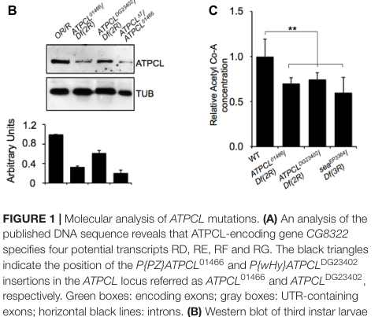

## Question

# Gene Research for Functional Annotation

## ⚠️ CRITICAL: Gene/Protein Identification Context

**BEFORE YOU BEGIN RESEARCH:** You MUST verify you are researching the CORRECT gene/protein. Gene symbols can be ambiguous, especially for less well-characterized genes from non-model organisms.

### Target Gene/Protein Identity (from UniProt):
- **UniProt Accession:** A0A0B4LFH8
- **Protein Description:** RecName: Full=ATP-citrate synthase {ECO:0000256|PIRNR:PIRNR036511}; EC=2.3.3.8 {ECO:0000256|PIRNR:PIRNR036511}; AltName: Full=ATP-citrate (pro-S-)-lyase {ECO:0000256|PIRNR:PIRNR036511}; AltName: Full=Citrate cleavage enzyme {ECO:0000256|PIRNR:PIRNR036511};
- **Gene Information:** Name=Acly {ECO:0000313|EMBL:AHN56267.1, ECO:0000313|FlyBase:FBgn0020236}; Synonyms=ACL {ECO:0000313|EMBL:AHN56267.1}, anon-WO0140519.179 {ECO:0000313|EMBL:AHN56267.1}, ATPCL {ECO:0000313|EMBL:AHN56267.1}, Atpcl {ECO:0000313|EMBL:AHN56267.1}, atpcl {ECO:0000313|EMBL:AHN56267.1}, BcDNA:LD21334 {ECO:0000313|EMBL:AHN56267.1}, CS {ECO:0000313|EMBL:AHN56267.1}, dATPCL {ECO:0000313|EMBL:AHN56267.1}, DmATPCL {ECO:0000313|EMBL:AHN56267.1}, Dmel\CG8322 {ECO:0000313|EMBL:AHN56267.1}, l(2)01466 {ECO:0000313|EMBL:AHN56267.1}, l(2)k09217 {ECO:0000313|EMBL:AHN56267.1}, n(2)k09217 {ECO:0000313|EMBL:AHN56267.1}; ORFNames=CG8322 {ECO:0000313|EMBL:AHN56267.1, ECO:0000313|FlyBase:FBgn0020236}, Dmel_CG8322 {ECO:0000313|EMBL:AHN56267.1};
- **Organism (full):** Drosophila melanogaster (Fruit fly).
- **Protein Family:** In the N-terminal section; belongs to the succinate/malate
- **Key Domains:** ATP-citrate_synthase. (IPR014608); Cit_synth/succinyl-CoA_lig_AS. (IPR017440); Citrate-bd. (IPR032263); Citrate_synth-like_lrg_a-sub. (IPR016142); Citrate_synth-like_sm_a-sub. (IPR016143)

### MANDATORY VERIFICATION STEPS:

1. **Check if the gene symbol "Acly" matches the protein description above**
2. **Verify the organism is correct:** Drosophila melanogaster (Fruit fly).
3. **Check if protein family/domains align with what you find in literature**
4. **If you find literature for a DIFFERENT gene with the same or similar symbol, STOP**

### If Gene Symbol is Ambiguous or You Cannot Find Relevant Literature:

**DO NOT PROCEED WITH RESEARCH ON A DIFFERENT GENE.** Instead:
- State clearly: "The gene symbol 'Acly' is ambiguous or literature is limited for this specific protein"
- Explain what you found (e.g., "Found extensive literature on a different gene with the same symbol in a different organism")
- Describe the protein based ONLY on the UniProt information provided above
- Suggest that the protein function can be inferred from domain/family information

### Research Target:

Please provide a comprehensive research report on the gene **Acly** (gene ID: Acly, UniProt: A0A0B4LFH8) in DROME.

The research report should be a detailed narrative explaining the function, biological processes, and localization of the gene product. Citations should be given for all claims.

You should prioritize authoritative reviews and primary scientific literature when conducting research. You can supplement
this with annotations you find in gene/protein databases, but these can be outdated or inaccurate.

We are specifically interested in the primary function of the gene - for enzymes, what reaction is catalyzed, and what is the substrate specificity? For transporters, what is the substrate? For structural proteins or adapters, what is the broader structural role? For signaling molecules, what is the role in the pathway.

We are interested in where in or outside the cell the gene product carries out its function.

We are also interested in the signaling or biochemical pathways in which the gene functions. We are less interested in broad pleiotropic effects, except where these elucidate the precise role.

Include evidence where possible. We are interested in both experimental evidence as well as inference from structure, evolution, or bioinformatic analysis. Precise studies should be prioritized over high-throughput, where available.

## Output

Question: You are an expert researcher providing comprehensive, well-cited information.

Provide detailed information focusing on:
1. Key concepts and definitions with current understanding
2. Recent developments and latest research (prioritize 2023-2024 sources)
3. Current applications and real-world implementations
4. Expert opinions and analysis from authoritative sources
5. Relevant statistics and data from recent studies

Format as a comprehensive research report with proper citations. Include URLs and publication dates where available.
Always prioritize recent, authoritative sources and provide specific citations for all major claims.

# Gene Research for Functional Annotation

## ⚠️ CRITICAL: Gene/Protein Identification Context

**BEFORE YOU BEGIN RESEARCH:** You MUST verify you are researching the CORRECT gene/protein. Gene symbols can be ambiguous, especially for less well-characterized genes from non-model organisms.

### Target Gene/Protein Identity (from UniProt):
- **UniProt Accession:** A0A0B4LFH8
- **Protein Description:** RecName: Full=ATP-citrate synthase {ECO:0000256|PIRNR:PIRNR036511}; EC=2.3.3.8 {ECO:0000256|PIRNR:PIRNR036511}; AltName: Full=ATP-citrate (pro-S-)-lyase {ECO:0000256|PIRNR:PIRNR036511}; AltName: Full=Citrate cleavage enzyme {ECO:0000256|PIRNR:PIRNR036511};
- **Gene Information:** Name=Acly {ECO:0000313|EMBL:AHN56267.1, ECO:0000313|FlyBase:FBgn0020236}; Synonyms=ACL {ECO:0000313|EMBL:AHN56267.1}, anon-WO0140519.179 {ECO:0000313|EMBL:AHN56267.1}, ATPCL {ECO:0000313|EMBL:AHN56267.1}, Atpcl {ECO:0000313|EMBL:AHN56267.1}, atpcl {ECO:0000313|EMBL:AHN56267.1}, BcDNA:LD21334 {ECO:0000313|EMBL:AHN56267.1}, CS {ECO:0000313|EMBL:AHN56267.1}, dATPCL {ECO:0000313|EMBL:AHN56267.1}, DmATPCL {ECO:0000313|EMBL:AHN56267.1}, Dmel\CG8322 {ECO:0000313|EMBL:AHN56267.1}, l(2)01466 {ECO:0000313|EMBL:AHN56267.1}, l(2)k09217 {ECO:0000313|EMBL:AHN56267.1}, n(2)k09217 {ECO:0000313|EMBL:AHN56267.1}; ORFNames=CG8322 {ECO:0000313|EMBL:AHN56267.1, ECO:0000313|FlyBase:FBgn0020236}, Dmel_CG8322 {ECO:0000313|EMBL:AHN56267.1};
- **Organism (full):** Drosophila melanogaster (Fruit fly).
- **Protein Family:** In the N-terminal section; belongs to the succinate/malate
- **Key Domains:** ATP-citrate_synthase. (IPR014608); Cit_synth/succinyl-CoA_lig_AS. (IPR017440); Citrate-bd. (IPR032263); Citrate_synth-like_lrg_a-sub. (IPR016142); Citrate_synth-like_sm_a-sub. (IPR016143)

### MANDATORY VERIFICATION STEPS:

1. **Check if the gene symbol "Acly" matches the protein description above**
2. **Verify the organism is correct:** Drosophila melanogaster (Fruit fly).
3. **Check if protein family/domains align with what you find in literature**
4. **If you find literature for a DIFFERENT gene with the same or similar symbol, STOP**

### If Gene Symbol is Ambiguous or You Cannot Find Relevant Literature:

**DO NOT PROCEED WITH RESEARCH ON A DIFFERENT GENE.** Instead:
- State clearly: "The gene symbol 'Acly' is ambiguous or literature is limited for this specific protein"
- Explain what you found (e.g., "Found extensive literature on a different gene with the same symbol in a different organism")
- Describe the protein based ONLY on the UniProt information provided above
- Suggest that the protein function can be inferred from domain/family information

### Research Target:

Please provide a comprehensive research report on the gene **Acly** (gene ID: Acly, UniProt: A0A0B4LFH8) in DROME.

The research report should be a detailed narrative explaining the function, biological processes, and localization of the gene product. Citations should be given for all claims.

You should prioritize authoritative reviews and primary scientific literature when conducting research. You can supplement
this with annotations you find in gene/protein databases, but these can be outdated or inaccurate.

We are specifically interested in the primary function of the gene - for enzymes, what reaction is catalyzed, and what is the substrate specificity? For transporters, what is the substrate? For structural proteins or adapters, what is the broader structural role? For signaling molecules, what is the role in the pathway.

We are interested in where in or outside the cell the gene product carries out its function.

We are also interested in the signaling or biochemical pathways in which the gene functions. We are less interested in broad pleiotropic effects, except where these elucidate the precise role.

Include evidence where possible. We are interested in both experimental evidence as well as inference from structure, evolution, or bioinformatic analysis. Precise studies should be prioritized over high-throughput, where available.

# Functional annotation of *Drosophila melanogaster* Acly

## Identity and principal function

**The specified protein is the fruit-fly ATP-citrate lyase, not a different gene called Acly.** The supplied UniProt accession **A0A0B4LFH8** names ATP-citrate synthase/ATP-citrate lyase (EC 2.3.3.8) in *D. melanogaster*. Independently, a fly genetic study identifies **CG8322 (FlyBase FBgn0020236)** as the ATP-citrate-lyase locus, calls its product **ATPCL**, and reports approximately **70% amino-acid identity** to human ACLY. The fly protein is also called dACLY in recent spermatogenesis research. These identifications support applying that research to the specified fly enzyme; findings from human ACLY are used below only where explicitly identified as comparative evidence. (morciano2019depletionofatpcitrate pages 1-2, morciano2019depletionofatpcitrate pages 2-3, francois2023metabolicregulationof pages 5-6)

**Primary biochemical function.** ATPCL provides an extramitochondrial source of acetyl–coenzyme A by catalyzing ATP-dependent citrate cleavage:

**Citrate + CoA + ATP → acetyl-CoA + oxaloacetate + ADP + inorganic phosphate.**

Thus its relevant carbon substrate is **citrate**, not acetate or fatty acids; CoA and ATP are required reactants, and magnesium supports the conserved enzyme reaction. The products connect citrate metabolism to fatty-acid synthesis and protein acetylation, although the dominant downstream use depends on cell type. This assignment is supported in flies by the approximately **40% reduction in measured acetyl-CoA** after ATPCL loss and by germline rescue experiments in which predicted catalytic-, citrate-binding-, and CoA-binding-defective dACLY variants fail to restore fertility. Those experiments establish a requirement for the enzyme’s catalytic function *in vivo* but are **not** purified-fly-protein substrate-specificity or kinetic measurements; relative activity toward alternative organic acids remains unmeasured in the cited fly studies. (morciano2019depletionofatpcitrate pages 1-2, morciano2019depletionofatpcitrate pages 2-3, francois2023metabolicregulationof pages 5-6, khwairakpam2020thevitalrole pages 1-2)

The supplied UniProt/InterPro annotations—an ATP-citrate-synthase domain, a citrate-binding region, and succinyl-CoA-ligase-like and citrate-synthase-like regions—fit this assignment. Structural studies **of human ACLY and other homologues, not the fly protein**, show a modular ATP/CoA-utilizing region coupled to a citrate-cleavage module related to citrate synthase. They provide a mechanistic explanation for the fly annotation, rather than an experimentally determined structure of A0A0B4LFH8. Importantly, ATPCL **cleaves** citrate outside mitochondria; it should not be confused with mitochondrial citrate synthase, which **makes** citrate. (verschueren2019structureofatp pages 2-4, verschueren2019structureofatp pages 1-2, verschueren2019structureofatp pages 11-18)

## Where the protein acts

The principal biochemical setting is **cytosolic acetyl-CoA production**. In the conventional citrate shuttle, mitochondria generate citrate, the mitochondrial citrate carrier **Scheggia/Sea** exports it, and ATPCL converts available citrate into acetyl-CoA and oxaloacetate outside mitochondria. However, **mitochondrial export is not the only physiologically relevant citrate supply**: 2023 germline experiments found that imported, circulating citrate is important for sperm differentiation even though depletion of the germline mitochondrial citrate carrier dCIC/Sea did not impair fertility. Substrate provenance must therefore be specified by tissue rather than assumed from the canonical shuttle. (morciano2019depletionofatpcitrate pages 1-2, morciano2019depletionofatpcitrate pages 2-3, francois2023metabolicregulationof pages 1-2, francois2023metabolicregulationof pages 2-3)

Direct immunofluorescence in **larval neuroblasts** detected punctate ATPCL in **both cytoplasm and nucleus during interphase**; in mitosis, staining was excluded from the chromosome-containing region and predominantly cytoplasmic. The approximately 130-kDa immunoblot band and staining both decreased in ATPCL mutants, strengthening the localization assignment. Nuclear presence is **not**, by itself, proof that nuclear ATPCL drives fly histone acetylation: bulk H3/H4 acetylation was not significantly changed in these mutants. Neither this observation nor vesicular localization reported in other species establishes that every fly tissue has the same ATPCL distribution. (morciano2019depletionofatpcitrate pages 2-3, even2021atpcitratelyasepromotes pages 5-6)

## Experimentally supported pathways and biological roles

**Citrate-to-acetyl-CoA metabolism and chromosome integrity.** The 2019 study of **CG8322/ATPCL** used independent mutant alleles, protein detection, acetyl-CoA measurements and wild-type ATPCL transgenic rescue. Severe mutants had approximately **80% less detectable ATPCL** and approximately **40% less acetyl-CoA**. Chromosome breaks occurred in **2.5–4.5%** of mutant larval neuroblasts, but in approximately **46%** of **ATPCL; sea** double-mutant cells, compared with **4.5%** for ATPCL and approximately **25%** for *sea* alone. Restoring ATPCL rescued lethality and chromosome breaks. The interaction links citrate availability and ATPCL to chromosome maintenance, but the molecular mechanism of break prevention is unresolved: bulk histone acetylation remained unchanged, and 2-Gy X irradiation did not increase the break phenotype. It would be inaccurate to annotate ATPCL as an established fly DNA-repair enzyme or an obligatory global histone-acetylation regulator. (morciano2019depletionofatpcitrate pages 2-3, morciano2019depletionofatpcitrate pages 3-4, morciano2019depletionofatpcitrate media 9c1bc399)

**A defined acetyl-CoA-dependent route to sperm maturation.** François and colleagues’ **2023 primary study** provides particularly informative functional evidence. In the male germline, citrate supplied from outside the gonad—including a gut-derived circulating source—is imported through partly redundant citrate transporters and used by **cytosolic dACLY** to generate acetyl-CoA. Combined knockdown of two or three candidate transporters reduced fertility approximately **twofold or threefold**, respectively; depletion of the mitochondrial carrier dCIC/Sea did not produce the same requirement. Germline dACLY loss blocked **late spermatid individualisation** and mature-sperm production rather than early germ-cell development. An RNAi-resistant wild-type dACLY transgene rescued sperm production and fertility, whereas expressed **H772A catalytic-site, R379A citrate-binding-region and D1038A CoA-pocket** variants failed to rescue. These are structure-guided functional assignments, not direct measurements of each mutant’s binding affinity. (francois2023metabolicregulationof pages 5-6, francois2023metabolicregulationof pages 3-3, francois2023metabolicregulationof pages 9-10, francois2023metabolicregulationof pages 2-3)

The same study traced a consequential use of this acetyl-CoA: **NatB-mediated protein N-terminal acetylation**, involving **dNAA20 and dNAA25**, protects proteins needed for spermatid differentiation against **dUBR1-dependent proteasomal degradation**. Among **44 acetyl-CoA-consuming candidate genes** screened, NatB components—not the tested fatty-acid-synthesis genes or histone/tubulin acetyltransferases—reproduced the male-sterility phenotype; dUBR1 suppression rescued NatB-deficient differentiation. Consequently, annotating ATPCL simply as a fatty-acid-synthesis enzyme would miss a directly demonstrated, tissue-specific function. The cited excerpts call this protein dACLY but do not themselves print the CG8322 locus identifier; the locus mapping comes from the separate fly ATPCL study. (francois2023metabolicregulationof pages 5-6, francois2023metabolicregulationof pages 10-11, francois2023metabolicregulationof pages 12-13, francois2023metabolicregulationof pages 9-10)

**Other cell-type-specific uses.** In larval motor neurons, **Acly knockdown** reduced α-tubulin acetylation and disrupted Synaptotagmin-GFP vesicle transport; simultaneous **Hdac6 knockdown** restored tubulin acetylation and rescued transport, consistent with acetyl-CoA supply to a tubulin-acetylation pathway. This is direct fly genetic evidence for pathway participation; the proposed vesicle-associated acetyl-CoA-supply mechanism includes localization experiments in other species and should not be treated as a demonstrated universal fly localization. In the adult midgut, a **2023** study found that enterocyte **Acly RNAi** suppressed **Acbp6-dependent intestinal stem-cell activation** during fasting-to-refeeding adaptation. That study did **not** directly quantify acetyl-CoA after Acly RNAi in the cited results, so the exact metabolic link and its effect size remain less firmly established than the germline pathway. (even2021atpcitratelyasepromotes pages 5-6, even2021atpcitratelyasepromotes pages 6-8, li2023adistinctacylcoa pages 6-6, li2023adistinctacylcoa pages 7-8)

## What 2024 research adds—and does not establish

A **2024 preprint** profiling larval fat bodies after **FASN1 depletion** found **markedly increased ATPCL protein abundance**, alongside increased citrate/isocitrate and acetyl-CoA, despite decreases in many other TCA-cycle proteins. The authors interpret ATPCL as a possible **cataplerotic** route moving citrate carbon out of the TCA cycle. This is a plausible application of fly metabolic profiling, **not a direct test of ATPCL catalytic flux or causality**: the manipulated gene was FASN1, not Acly. The study’s large glycogen increase must likewise not be attributed specifically to ATPCL. (ugrankarbanerjee2024metabolicrewiringin pages 11-15, henne2024metabolicrewiringin pages 7-9)

A separate **2024 fly amyloid/icaritin study** illustrates why validation matters. Transcriptomics suggested ATPCL downregulation in its Aβarc model, but targeted **qRT-PCR found ATPCL transcript levels unchanged** with either Aβarc expression or icaritin treatment. It therefore does not establish ATPCL regulation or an ATPCL-mediated therapeutic effect in that model. Fly ATPCL remains principally a **research target and metabolic-pathway component**, not a clinically validated intervention based on these fly experiments. (li2024icaritingreatlyattenuates pages 7-10)

The following study-by-study evidence summary separates direct fly perturbation from observational findings and cross-species inference.

| Year and source | Experimental system | ATP-citrate-lyase-specific findings and quantitative results | Evidence strength and limitations |
|---|---|---|---|
| **2019 — Morciano et al.** [Frontiers in Physiology](https://doi.org/10.3389/fphys.2019.00383), published 4 April 2019 | *D. melanogaster* **CG8322/FBgn0020236 (ATPCL)** P-element mutants; third-instar larval brains and mitotic neuroblasts; transgenic rescue | Directly identifies CG8322 as fly ATP-citrate lyase. Mutants had an approximately **40% reduction in acetyl-CoA** relative to wild type (wild-type reported as 1.30 pmol/µl), **2.5–4.5%** chromosome-break frequency, and approximately **46%** breaks in **ATPCL; sea** double mutants versus 4.5% in ATPCL and approximately 25% in *sea* alone. Wild-type UAS-ATPCL rescued lethality and chromosome breaks. Immunofluorescence showed punctate ATPCL in the **cytoplasm and nucleus during interphase**, followed by exclusion from chromatin and predominantly cytoplasmic distribution during mitosis. Bulk H3/H4 acetylation was not significantly reduced. (morciano2019depletionofatpcitrate pages 1-2, morciano2019depletionofatpcitrate pages 2-3, morciano2019depletionofatpcitrate pages 3-4, morciano2019depletionofatpcitrate media 9c1bc399) | **Highest locus-specific evidence:** direct gene identification, loss-of-function alleles, protein depletion, metabolite measurement, localization, genetic rescue, and interaction with the mitochondrial citrate carrier. Limitation: no purified fly-enzyme kinetics or direct citrate-substrate specificity assay. |
| **2021 — Even et al.** [Nature Communications](https://doi.org/10.1038/s41467-021-25786-y), published October 2021 | Third-instar larval motor neurons expressing **Acly RNAi**; α-tubulin acetylation, SYT1-GFP vesicle transport, and locomotor assays | Neuronal Acly knockdown reduced acetylated α-tubulin and impaired axonal vesicle transport. Combined **Hdac6** knockdown restored tubulin acetylation and rescued transport, while ACLY expression rescued Elp3-knockdown phenotypes. Transport experiments analyzed **nine axons per group** and **234, 422, and 182 vesicles** in control, Acly-knockdown, and Acly/Hdac6-knockdown groups, respectively; several effects had **p < 0.0001**. (even2021atpcitratelyasepromotes pages 5-6, even2021atpcitratelyasepromotes pages 6-8) | **Strong pathway-level genetic evidence** that Acly-derived acetyl-CoA supports tubulin acetylation and axonal transport. Limitations: the cited excerpt does not explicitly map the reagent to CG8322/FBgn0020236, and fly-protein vesicular localization was not established as directly as the functional phenotype. |
| **2023 — François et al.** [Nature Communications](https://doi.org/10.1038/s41467-023-42496-9), published October 2023 | Male germline-specific dACLY RNAi/shRNA, late-spermatocyte rescue, citrate-transporter perturbation, and structure-guided dACLY mutants | Germline dACLY depletion selectively blocked late **spermatid individualisation**, eliminated mature sperm, and caused sterility while sparing earlier spermatogenic stages. An RNAi-resistant wild-type dACLY transgene rescued fertility, sperm production, and waste-bag formation, whereas catalytic **H772A**, citrate-binding **R379A**, and CoA-pocket **D1038A** variants failed to rescue. Redundant germline citrate-transporter knockdowns reduced fertility approximately **twofold** (double) or **threefold** (triple), supporting use of imported, gut-derived circulating citrate rather than mitochondrial citrate. Of **44 acetyl-CoA-utilizing genes** screened, only NatB components dNAA20 and dNAA25 produced the corresponding sterility phenotype; NatB-dependent N-terminal acetylation protected differentiation proteins from dUBR1-mediated degradation. (francois2023metabolicregulationof pages 5-6, francois2023metabolicregulationof pages 3-3, francois2023metabolicregulationof pages 9-10, francois2023metabolicregulationof pages 2-3) | **Very strong mechanistic evidence:** two RNAi reagents, stage-specific rescue, binding/catalytic mutants, transporter genetics, and downstream NatB/dUBR1 epistasis. Limitations: no purified fly-enzyme kinetics or quantitative citrate-to-acetyl-CoA flux; the cited excerpts call the protein dACLY but do not explicitly print the CG8322/FBgn0020236 mapping. |
| **2023 — Li and Karpac** [Nature Communications](https://doi.org/10.1038/s41467-023-43362-4), published November 2023 | Enterocyte Acbp6 overexpression or depletion during fasting-to-refeeding; Acly or Cpt1 RNAi; midgut stem-cell assays | **Acly RNAi** strongly suppressed Acbp6-dependent intestinal stem-cell activation during a two-day fasting-to-refeeding transition, assessed by phospho-H3-positive and Delta-positive cells. Relevant immunostaining assays used **three independent experiments**. The study links ACLY to Acbp6-dependent acetyl-CoA metabolism and nutrient-responsive tissue plasticity, but acetyl-CoA concentration after Acly RNAi was not directly measured. (li2023adistinctacylcoa pages 6-7, li2023adistinctacylcoa pages 6-6, li2023adistinctacylcoa pages 7-8) | **Moderate-to-strong functional evidence** from tissue-specific genetic perturbation. Limitation: exact Acly-specific effect sizes were not recoverable from the cited text; acetyl-CoA and pan-acetylation results primarily concerned Acbp6 manipulation, so they should not be attributed directly to Acly RNAi. |
| **2024 — Ugrankar-Banerjee et al.** [bioRxiv](https://doi.org/10.1101/2024.05.13.593915), posted 13 May 2024 | Proteomics and metabolomics of larval fat bodies with tissue-specific **FASN1 RNAi** | ATPCL protein abundance was **markedly elevated** after fat-body FASN1 depletion while most TCA-cycle and oxidative-phosphorylation proteins declined; citrate/isocitrate and acetyl-CoA were also elevated. This supports ATPCL as a candidate cataplerotic response directing citrate out of the TCA cycle. (ugrankarbanerjee2024metabolicrewiringin pages 11-15, henne2024metabolicrewiringin pages 7-9) | **Associative, hypothesis-generating evidence only:** ATPCL itself was not perturbed, so causality and enzyme flux were not established. The reported **>20-fold glycogen increase** was caused by the broader FASN1-loss metabolic state and is **not an ATPCL-specific effect**. This source was a preprint in 2024. |
| **2024 — Li et al.** [CNS Neuroscience & Therapeutics](https://doi.org/10.1111/cns.14527), published 2024 | Aβarc-expressing *Drosophila* Alzheimer-like model treated with 30 µM icaritin; transcriptomics and qRT-PCR | Transcriptome profiling suggested ATPCL downregulation under Aβarc expression, but targeted **qRT-PCR found ATPCL expression unchanged** by either Aβarc or icaritin. Thus, the targeted validation did not support ATPCL transcriptional regulation in this model. Transcriptomics used **n = 3 groups**, and qRT-PCR error bars represented **four independent experiments**. (li2024icaritingreatlyattenuates pages 7-10) | **Useful negative/discordant evidence:** targeted validation appropriately tempers the high-throughput signal. It does not test ATPCL protein abundance, activity, localization, metabolite flux, or causal involvement in icaritin protection. |

*Table: Evidence specific to Drosophila Acly/ATPCL is ranked from direct locus-level genetics and metabolite measurements to associative proteomic or transcriptomic observations. The table separates ATPCL-specific results from broader metabolic phenotypes and flags where reagent mapping or direct biochemical validation remains limited.*

**Annotation conclusion.** A well-supported annotation for **A0A0B4LFH8 / CG8322** is an intracellular, predominantly cytosolic **ATP-dependent citrate:CoA lyase** producing acetyl-CoA and oxaloacetate. Its experimentally demonstrated fly functions include maintaining acetyl-CoA availability and, in defined contexts, enabling **NatB-dependent spermatid protein stability**, **neuronal tubulin acetylation/transport**, and citrate-linked chromosome integrity. Nuclear localization is observed in larval neuroblasts, but a general fly requirement for bulk histone acetylation is **not** demonstrated. Precise fly-enzyme substrate kinetics, compartment-specific catalytic flux, and the mechanism linking ATPCL to chromosome protection remain open questions. (morciano2019depletionofatpcitrate pages 2-3, morciano2019depletionofatpcitrate pages 3-4, francois2023metabolicregulationof pages 5-6, even2021atpcitratelyasepromotes pages 5-6)

### Principal sources and publication dates

- François CM *et al.* **October 2023**. “Metabolic regulation of proteome stability via N-terminal acetylation controls male germline stem cell differentiation and reproduction.” *Nature Communications*. https://doi.org/10.1038/s41467-023-42496-9. (francois2023metabolicregulationof pages 5-6, francois2023metabolicregulationof pages 9-10)
- Li X and Karpac J. **November 2023**. “A distinct Acyl-CoA binding protein (ACBP6) shapes tissue plasticity during nutrient adaptation in Drosophila.” *Nature Communications*. https://doi.org/10.1038/s41467-023-43362-4. (li2023adistinctacylcoa pages 6-6)
- Ugrankar-Banerjee R *et al.* **May 2024**, **bioRxiv preprint**. “Metabolic rewiring in fat-depleted Drosophila reveals triglyceride:glycogen crosstalk and identifies cDIP as a new regulator of energy metabolism.” https://doi.org/10.1101/2024.05.13.593915. (ugrankarbanerjee2024metabolicrewiringin pages 11-15)
- Li L *et al.* **2024**. “Icaritin greatly attenuates β-amyloid-induced toxicity in vivo.” *CNS Neuroscience & Therapeutics*. https://doi.org/10.1111/cns.14527. (li2024icaritingreatlyattenuates pages 7-10)
- Even A *et al.* **October 2021**. “ATP-citrate lyase promotes axonal transport across species.” *Nature Communications*. https://doi.org/10.1038/s41467-021-25786-y. (even2021atpcitratelyasepromotes pages 5-6)
- Morciano P *et al.* **4 April 2019**. “Depletion of ATP-Citrate Lyase (ATPCL) Affects Chromosome Integrity Without Altering Histone Acetylation in Drosophila Mitotic Cells.” *Frontiers in Physiology*. https://doi.org/10.3389/fphys.2019.00383. (morciano2019depletionofatpcitrate pages 1-2, morciano2019depletionofatpcitrate pages 2-3)
- Verschueren KHG *et al.* **April 2019**. “Structure of ATP citrate lyase and the origin of citrate synthase in the Krebs cycle.” *Nature*. **Comparative structural evidence; not a fly structure.** https://doi.org/10.1038/s41586-019-1095-5. (verschueren2019structureofatp pages 2-4, verschueren2019structureofatp pages 1-2)

References

1. (morciano2019depletionofatpcitrate pages 1-2): Patrizia Morciano, Maria Laura Di Giorgio, Antonella Porrazzo, Valerio Licursi, Rodolfo Negri, Yikang Rong, and Giovanni Cenci. Depletion of atp-citrate lyase (atpcl) affects chromosome integrity without altering histone acetylation in drosophila mitotic cells. Frontiers in Physiology, Apr 2019. URL: https://doi.org/10.3389/fphys.2019.00383, doi:10.3389/fphys.2019.00383. This article has 8 citations.

2. (morciano2019depletionofatpcitrate pages 2-3): Patrizia Morciano, Maria Laura Di Giorgio, Antonella Porrazzo, Valerio Licursi, Rodolfo Negri, Yikang Rong, and Giovanni Cenci. Depletion of atp-citrate lyase (atpcl) affects chromosome integrity without altering histone acetylation in drosophila mitotic cells. Frontiers in Physiology, Apr 2019. URL: https://doi.org/10.3389/fphys.2019.00383, doi:10.3389/fphys.2019.00383. This article has 8 citations.

3. (francois2023metabolicregulationof pages 5-6): Charlotte M. François, Thomas Pihl, Marion Dunoyer de Segonzac, Chloé Hérault, and Bruno Hudry. Metabolic regulation of proteome stability via n-terminal acetylation controls male germline stem cell differentiation and reproduction. Nature Communications, Oct 2023. URL: https://doi.org/10.1038/s41467-023-42496-9, doi:10.1038/s41467-023-42496-9. This article has 21 citations and is from a highest quality peer-reviewed journal.

4. (khwairakpam2020thevitalrole pages 1-2): Amrita Devi Khwairakpam, Kishore Banik, Sosmitha Girisa, Bano Shabnam, Mehdi Shakibaei, Lu Fan, Frank Arfuso, Javadi Monisha, Hong Wang, Xinliang Mao, Gautam Sethi, and Ajaikumar B. Kunnumakkara. The vital role of atp citrate lyase in chronic diseases. Journal of Molecular Medicine, 98:71-95, Dec 2020. URL: https://doi.org/10.1007/s00109-019-01863-0, doi:10.1007/s00109-019-01863-0. This article has 92 citations.

5. (verschueren2019structureofatp pages 2-4): Koen H. G. Verschueren, Clement Blanchet, Jan Felix, Ann Dansercoer, Dirk De Vos, Yehudi Bloch, Jozef Van Beeumen, Dmitri Svergun, Irina Gutsche, Savvas N. Savvides, and Kenneth Verstraete. Structure of atp citrate lyase and the origin of citrate synthase in the krebs cycle. Nature, 568:571-575, Apr 2019. URL: https://doi.org/10.1038/s41586-019-1095-5, doi:10.1038/s41586-019-1095-5. This article has 226 citations and is from a highest quality peer-reviewed journal.

6. (verschueren2019structureofatp pages 1-2): Koen H. G. Verschueren, Clement Blanchet, Jan Felix, Ann Dansercoer, Dirk De Vos, Yehudi Bloch, Jozef Van Beeumen, Dmitri Svergun, Irina Gutsche, Savvas N. Savvides, and Kenneth Verstraete. Structure of atp citrate lyase and the origin of citrate synthase in the krebs cycle. Nature, 568:571-575, Apr 2019. URL: https://doi.org/10.1038/s41586-019-1095-5, doi:10.1038/s41586-019-1095-5. This article has 226 citations and is from a highest quality peer-reviewed journal.

7. (verschueren2019structureofatp pages 11-18): Koen H. G. Verschueren, Clement Blanchet, Jan Felix, Ann Dansercoer, Dirk De Vos, Yehudi Bloch, Jozef Van Beeumen, Dmitri Svergun, Irina Gutsche, Savvas N. Savvides, and Kenneth Verstraete. Structure of atp citrate lyase and the origin of citrate synthase in the krebs cycle. Nature, 568:571-575, Apr 2019. URL: https://doi.org/10.1038/s41586-019-1095-5, doi:10.1038/s41586-019-1095-5. This article has 226 citations and is from a highest quality peer-reviewed journal.

8. (francois2023metabolicregulationof pages 1-2): Charlotte M. François, Thomas Pihl, Marion Dunoyer de Segonzac, Chloé Hérault, and Bruno Hudry. Metabolic regulation of proteome stability via n-terminal acetylation controls male germline stem cell differentiation and reproduction. Nature Communications, Oct 2023. URL: https://doi.org/10.1038/s41467-023-42496-9, doi:10.1038/s41467-023-42496-9. This article has 21 citations and is from a highest quality peer-reviewed journal.

9. (francois2023metabolicregulationof pages 2-3): Charlotte M. François, Thomas Pihl, Marion Dunoyer de Segonzac, Chloé Hérault, and Bruno Hudry. Metabolic regulation of proteome stability via n-terminal acetylation controls male germline stem cell differentiation and reproduction. Nature Communications, Oct 2023. URL: https://doi.org/10.1038/s41467-023-42496-9, doi:10.1038/s41467-023-42496-9. This article has 21 citations and is from a highest quality peer-reviewed journal.

10. (even2021atpcitratelyasepromotes pages 5-6): Aviel Even, Giovanni Morelli, Silvia Turchetto, Michal Shilian, Romain Le Bail, Sophie Laguesse, Nathalie Krusy, Ariel Brisker, Alexander Brandis, Shani Inbar, Alain Chariot, Frédéric Saudou, Paula Dietrich, Ioannis Dragatsis, Bert Brone, Loïc Broix, Jean-Michel Rigo, Miguel Weil, and Laurent Nguyen. Atp-citrate lyase promotes axonal transport across species. Nature Communications, Oct 2021. URL: https://doi.org/10.1038/s41467-021-25786-y, doi:10.1038/s41467-021-25786-y. This article has 29 citations and is from a highest quality peer-reviewed journal.

11. (morciano2019depletionofatpcitrate pages 3-4): Patrizia Morciano, Maria Laura Di Giorgio, Antonella Porrazzo, Valerio Licursi, Rodolfo Negri, Yikang Rong, and Giovanni Cenci. Depletion of atp-citrate lyase (atpcl) affects chromosome integrity without altering histone acetylation in drosophila mitotic cells. Frontiers in Physiology, Apr 2019. URL: https://doi.org/10.3389/fphys.2019.00383, doi:10.3389/fphys.2019.00383. This article has 8 citations.

12. (morciano2019depletionofatpcitrate media 9c1bc399): Patrizia Morciano, Maria Laura Di Giorgio, Antonella Porrazzo, Valerio Licursi, Rodolfo Negri, Yikang Rong, and Giovanni Cenci. Depletion of atp-citrate lyase (atpcl) affects chromosome integrity without altering histone acetylation in drosophila mitotic cells. Frontiers in Physiology, Apr 2019. URL: https://doi.org/10.3389/fphys.2019.00383, doi:10.3389/fphys.2019.00383. This article has 8 citations.

13. (francois2023metabolicregulationof pages 3-3): Charlotte M. François, Thomas Pihl, Marion Dunoyer de Segonzac, Chloé Hérault, and Bruno Hudry. Metabolic regulation of proteome stability via n-terminal acetylation controls male germline stem cell differentiation and reproduction. Nature Communications, Oct 2023. URL: https://doi.org/10.1038/s41467-023-42496-9, doi:10.1038/s41467-023-42496-9. This article has 21 citations and is from a highest quality peer-reviewed journal.

14. (francois2023metabolicregulationof pages 9-10): Charlotte M. François, Thomas Pihl, Marion Dunoyer de Segonzac, Chloé Hérault, and Bruno Hudry. Metabolic regulation of proteome stability via n-terminal acetylation controls male germline stem cell differentiation and reproduction. Nature Communications, Oct 2023. URL: https://doi.org/10.1038/s41467-023-42496-9, doi:10.1038/s41467-023-42496-9. This article has 21 citations and is from a highest quality peer-reviewed journal.

15. (francois2023metabolicregulationof pages 10-11): Charlotte M. François, Thomas Pihl, Marion Dunoyer de Segonzac, Chloé Hérault, and Bruno Hudry. Metabolic regulation of proteome stability via n-terminal acetylation controls male germline stem cell differentiation and reproduction. Nature Communications, Oct 2023. URL: https://doi.org/10.1038/s41467-023-42496-9, doi:10.1038/s41467-023-42496-9. This article has 21 citations and is from a highest quality peer-reviewed journal.

16. (francois2023metabolicregulationof pages 12-13): Charlotte M. François, Thomas Pihl, Marion Dunoyer de Segonzac, Chloé Hérault, and Bruno Hudry. Metabolic regulation of proteome stability via n-terminal acetylation controls male germline stem cell differentiation and reproduction. Nature Communications, Oct 2023. URL: https://doi.org/10.1038/s41467-023-42496-9, doi:10.1038/s41467-023-42496-9. This article has 21 citations and is from a highest quality peer-reviewed journal.

17. (even2021atpcitratelyasepromotes pages 6-8): Aviel Even, Giovanni Morelli, Silvia Turchetto, Michal Shilian, Romain Le Bail, Sophie Laguesse, Nathalie Krusy, Ariel Brisker, Alexander Brandis, Shani Inbar, Alain Chariot, Frédéric Saudou, Paula Dietrich, Ioannis Dragatsis, Bert Brone, Loïc Broix, Jean-Michel Rigo, Miguel Weil, and Laurent Nguyen. Atp-citrate lyase promotes axonal transport across species. Nature Communications, Oct 2021. URL: https://doi.org/10.1038/s41467-021-25786-y, doi:10.1038/s41467-021-25786-y. This article has 29 citations and is from a highest quality peer-reviewed journal.

18. (li2023adistinctacylcoa pages 6-6): Xiaotong Li and Jason Karpac. A distinct acyl-coa binding protein (acbp6) shapes tissue plasticity during nutrient adaptation in drosophila. Nature Communications, Nov 2023. URL: https://doi.org/10.1038/s41467-023-43362-4, doi:10.1038/s41467-023-43362-4. This article has 7 citations and is from a highest quality peer-reviewed journal.

19. (li2023adistinctacylcoa pages 7-8): Xiaotong Li and Jason Karpac. A distinct acyl-coa binding protein (acbp6) shapes tissue plasticity during nutrient adaptation in drosophila. Nature Communications, Nov 2023. URL: https://doi.org/10.1038/s41467-023-43362-4, doi:10.1038/s41467-023-43362-4. This article has 7 citations and is from a highest quality peer-reviewed journal.

20. (ugrankarbanerjee2024metabolicrewiringin pages 11-15): Rupali Ugrankar-Banerjee, Son Tran, Jade Bowerman, Blessy Paul, Lauren G. Zacharias, Thomas P. Mathews, Ralph J. DeBerardinis, and W Mike Henne. Metabolic rewiring in fat-depleted<i>drosophila</i>reveals triglyceride:glycogen crosstalk and identifies cdip as a new regulator of energy metabolism. BioRxiv, May 2024. URL: https://doi.org/10.1101/2024.05.13.593915, doi:10.1101/2024.05.13.593915. This article has 0 citations.

21. (henne2024metabolicrewiringin pages 7-9): W. Mike Henne, Rupali Ugrankar-Banerjee, Son Tran, Jade Bowerman, Blessy Paul, Lauren Zacharias, Thomas Mathews, and Ralph DeBerardinis. Metabolic rewiring in fat-depleted drosophila reveals triglyceride:glycogen crosstalk and identifies cdip as a new regulator of energy metabolism. Research Square, Oct 2024. URL: https://doi.org/10.21203/rs.3.rs-4505077/v1, doi:10.21203/rs.3.rs-4505077/v1. This article has 0 citations.

22. (li2024icaritingreatlyattenuates pages 7-10): Liangxian Li, Zaiwa Wei, Yafang Tang, Mingyue Jin, Hua Yao, Xia Li, Qinghua Li, Jie Tan, and Bo Xiao. Icaritin greatly attenuates β‐amyloid‐induced toxicity in vivo. CNS Neuroscience & Therapeutics, Nov 2024. URL: https://doi.org/10.1111/cns.14527, doi:10.1111/cns.14527. This article has 11 citations and is from a peer-reviewed journal.

23. (li2023adistinctacylcoa pages 6-7): Xiaotong Li and Jason Karpac. A distinct acyl-coa binding protein (acbp6) shapes tissue plasticity during nutrient adaptation in drosophila. Nature Communications, Nov 2023. URL: https://doi.org/10.1038/s41467-023-43362-4, doi:10.1038/s41467-023-43362-4. This article has 7 citations and is from a highest quality peer-reviewed journal.

## Artifacts

- [Edison artifact artifact-00](Acly-deep-research-falcon_artifacts/artifact-00.md)

## Citations

1. li2024icaritingreatlyattenuates pages 7-10
2. li2023adistinctacylcoa pages 6-6
3. ugrankarbanerjee2024metabolicrewiringin pages 11-15
4. even2021atpcitratelyasepromotes pages 5-6
5. morciano2019depletionofatpcitrate pages 1-2
6. morciano2019depletionofatpcitrate pages 2-3
7. francois2023metabolicregulationof pages 5-6
8. khwairakpam2020thevitalrole pages 1-2
9. verschueren2019structureofatp pages 2-4
10. verschueren2019structureofatp pages 1-2
11. verschueren2019structureofatp pages 11-18
12. francois2023metabolicregulationof pages 1-2
13. francois2023metabolicregulationof pages 2-3
14. morciano2019depletionofatpcitrate pages 3-4
15. francois2023metabolicregulationof pages 3-3
16. francois2023metabolicregulationof pages 9-10
17. francois2023metabolicregulationof pages 10-11
18. francois2023metabolicregulationof pages 12-13
19. even2021atpcitratelyasepromotes pages 6-8
20. li2023adistinctacylcoa pages 7-8
21. henne2024metabolicrewiringin pages 7-9
22. li2023adistinctacylcoa pages 6-7
23. Frontiers in Physiology
24. Nature Communications
25. bioRxiv
26. CNS Neuroscience & Therapeutics
27. https://doi.org/10.3389/fphys.2019.00383
28. https://doi.org/10.1038/s41467-021-25786-y
29. https://doi.org/10.1038/s41467-023-42496-9
30. https://doi.org/10.1038/s41467-023-43362-4
31. https://doi.org/10.1101/2024.05.13.593915
32. https://doi.org/10.1111/cns.14527
33. https://doi.org/10.1038/s41467-023-42496-9.
34. https://doi.org/10.1038/s41467-023-43362-4.
35. https://doi.org/10.1101/2024.05.13.593915.
36. https://doi.org/10.1111/cns.14527.
37. https://doi.org/10.1038/s41467-021-25786-y.
38. https://doi.org/10.3389/fphys.2019.00383.
39. https://doi.org/10.1038/s41586-019-1095-5.
40. https://doi.org/10.3389/fphys.2019.00383,
41. https://doi.org/10.1038/s41467-023-42496-9,
42. https://doi.org/10.1007/s00109-019-01863-0,
43. https://doi.org/10.1038/s41586-019-1095-5,
44. https://doi.org/10.1038/s41467-021-25786-y,
45. https://doi.org/10.1038/s41467-023-43362-4,
46. https://doi.org/10.1101/2024.05.13.593915,
47. https://doi.org/10.21203/rs.3.rs-4505077/v1,
48. https://doi.org/10.1111/cns.14527,