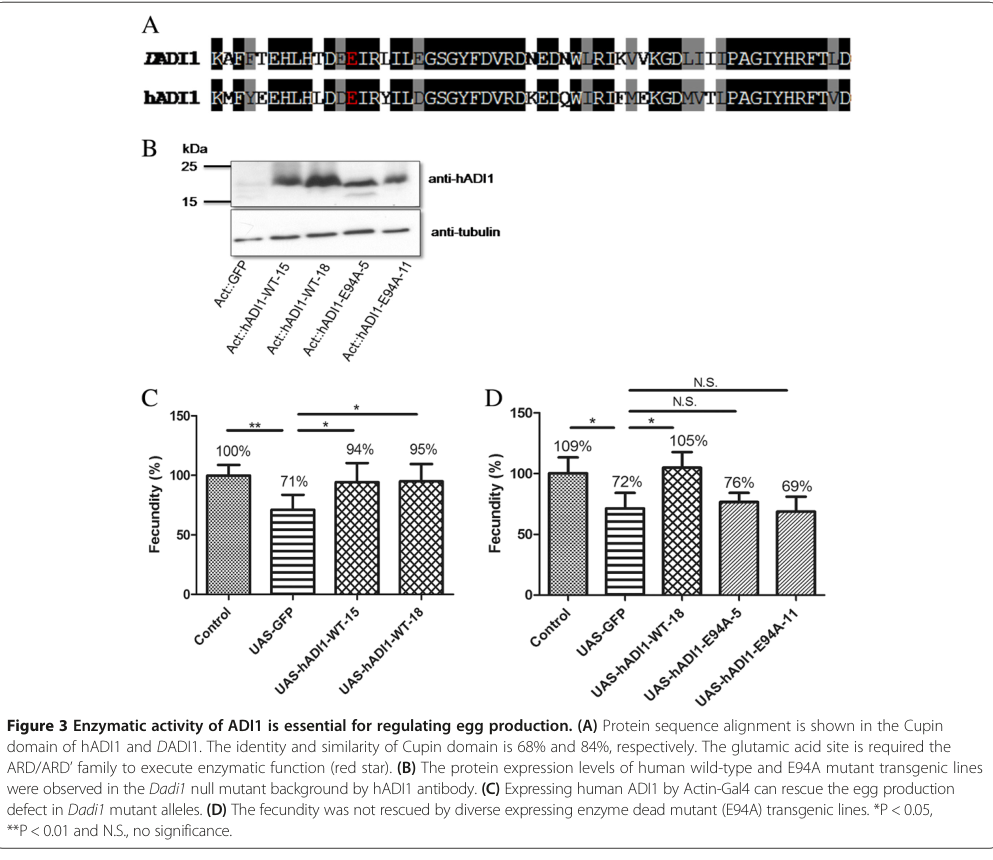

## Question

# Gene Research for Functional Annotation

## ⚠️ CRITICAL: Gene/Protein Identification Context

**BEFORE YOU BEGIN RESEARCH:** You MUST verify you are researching the CORRECT gene/protein. Gene symbols can be ambiguous, especially for less well-characterized genes from non-model organisms.

### Target Gene/Protein Identity (from UniProt):
- **UniProt Accession:** Q6AWN0
- **Protein Description:** RecName: Full=Acireductone dioxygenase {ECO:0000255|HAMAP-Rule:MF_03154}; AltName: Full=Acireductone dioxygenase (Fe(2+)-requiring) {ECO:0000255|HAMAP-Rule:MF_03154}; Short=ARD' {ECO:0000255|HAMAP-Rule:MF_03154}; Short=Fe-ARD {ECO:0000255|HAMAP-Rule:MF_03154}; EC=1.13.11.54 {ECO:0000255|HAMAP-Rule:MF_03154}; AltName: Full=Acireductone dioxygenase (Ni(2+)-requiring) {ECO:0000255|HAMAP-Rule:MF_03154}; Short=ARD {ECO:0000255|HAMAP-Rule:MF_03154}; Short=Ni-ARD {ECO:0000255|HAMAP-Rule:MF_03154}; EC=1.13.11.53 {ECO:0000255|HAMAP-Rule:MF_03154};
- **Gene Information:** Name=Adi1 {ECO:0000303|PubMed:25037729, ECO:0000312|FlyBase:FBgn0052068}; ORFNames=CG32068 {ECO:0000312|FlyBase:FBgn0052068};
- **Organism (full):** Drosophila melanogaster (Fruit fly).
- **Protein Family:** Belongs to the acireductone dioxygenase (ARD) family.
- **Key Domains:** ARD. (IPR004313); ARD_euk. (IPR027496); RmlC-like_jellyroll. (IPR014710); RmlC_Cupin_sf. (IPR011051); ARD (PF03079)

### MANDATORY VERIFICATION STEPS:

1. **Check if the gene symbol "Adi1" matches the protein description above**
2. **Verify the organism is correct:** Drosophila melanogaster (Fruit fly).
3. **Check if protein family/domains align with what you find in literature**
4. **If you find literature for a DIFFERENT gene with the same or similar symbol, STOP**

### If Gene Symbol is Ambiguous or You Cannot Find Relevant Literature:

**DO NOT PROCEED WITH RESEARCH ON A DIFFERENT GENE.** Instead:
- State clearly: "The gene symbol 'Adi1' is ambiguous or literature is limited for this specific protein"
- Explain what you found (e.g., "Found extensive literature on a different gene with the same symbol in a different organism")
- Describe the protein based ONLY on the UniProt information provided above
- Suggest that the protein function can be inferred from domain/family information

### Research Target:

Please provide a comprehensive research report on the gene **Adi1** (gene ID: Adi1, UniProt: Q6AWN0) in DROME.

The research report should be a detailed narrative explaining the function, biological processes, and localization of the gene product. Citations should be given for all claims.

You should prioritize authoritative reviews and primary scientific literature when conducting research. You can supplement
this with annotations you find in gene/protein databases, but these can be outdated or inaccurate.

We are specifically interested in the primary function of the gene - for enzymes, what reaction is catalyzed, and what is the substrate specificity? For transporters, what is the substrate? For structural proteins or adapters, what is the broader structural role? For signaling molecules, what is the role in the pathway.

We are interested in where in or outside the cell the gene product carries out its function.

We are also interested in the signaling or biochemical pathways in which the gene functions. We are less interested in broad pleiotropic effects, except where these elucidate the precise role.

Include evidence where possible. We are interested in both experimental evidence as well as inference from structure, evolution, or bioinformatic analysis. Precise studies should be prioritized over high-throughput, where available.

## Output

Question: You are an expert researcher providing comprehensive, well-cited information.

Provide detailed information focusing on:
1. Key concepts and definitions with current understanding
2. Recent developments and latest research (prioritize 2023-2024 sources)
3. Current applications and real-world implementations
4. Expert opinions and analysis from authoritative sources
5. Relevant statistics and data from recent studies

Format as a comprehensive research report with proper citations. Include URLs and publication dates where available.
Always prioritize recent, authoritative sources and provide specific citations for all major claims.

# Gene Research for Functional Annotation

## ⚠️ CRITICAL: Gene/Protein Identification Context

**BEFORE YOU BEGIN RESEARCH:** You MUST verify you are researching the CORRECT gene/protein. Gene symbols can be ambiguous, especially for less well-characterized genes from non-model organisms.

### Target Gene/Protein Identity (from UniProt):
- **UniProt Accession:** Q6AWN0
- **Protein Description:** RecName: Full=Acireductone dioxygenase {ECO:0000255|HAMAP-Rule:MF_03154}; AltName: Full=Acireductone dioxygenase (Fe(2+)-requiring) {ECO:0000255|HAMAP-Rule:MF_03154}; Short=ARD' {ECO:0000255|HAMAP-Rule:MF_03154}; Short=Fe-ARD {ECO:0000255|HAMAP-Rule:MF_03154}; EC=1.13.11.54 {ECO:0000255|HAMAP-Rule:MF_03154}; AltName: Full=Acireductone dioxygenase (Ni(2+)-requiring) {ECO:0000255|HAMAP-Rule:MF_03154}; Short=ARD {ECO:0000255|HAMAP-Rule:MF_03154}; Short=Ni-ARD {ECO:0000255|HAMAP-Rule:MF_03154}; EC=1.13.11.53 {ECO:0000255|HAMAP-Rule:MF_03154};
- **Gene Information:** Name=Adi1 {ECO:0000303|PubMed:25037729, ECO:0000312|FlyBase:FBgn0052068}; ORFNames=CG32068 {ECO:0000312|FlyBase:FBgn0052068};
- **Organism (full):** Drosophila melanogaster (Fruit fly).
- **Protein Family:** Belongs to the acireductone dioxygenase (ARD) family.
- **Key Domains:** ARD. (IPR004313); ARD_euk. (IPR027496); RmlC-like_jellyroll. (IPR014710); RmlC_Cupin_sf. (IPR011051); ARD (PF03079)

### MANDATORY VERIFICATION STEPS:

1. **Check if the gene symbol "Adi1" matches the protein description above**
2. **Verify the organism is correct:** Drosophila melanogaster (Fruit fly).
3. **Check if protein family/domains align with what you find in literature**
4. **If you find literature for a DIFFERENT gene with the same or similar symbol, STOP**

### If Gene Symbol is Ambiguous or You Cannot Find Relevant Literature:

**DO NOT PROCEED WITH RESEARCH ON A DIFFERENT GENE.** Instead:
- State clearly: "The gene symbol 'Adi1' is ambiguous or literature is limited for this specific protein"
- Explain what you found (e.g., "Found extensive literature on a different gene with the same symbol in a different organism")
- Describe the protein based ONLY on the UniProt information provided above
- Suggest that the protein function can be inferred from domain/family information

### Research Target:

Please provide a comprehensive research report on the gene **Adi1** (gene ID: Adi1, UniProt: Q6AWN0) in DROME.

The research report should be a detailed narrative explaining the function, biological processes, and localization of the gene product. Citations should be given for all claims.

You should prioritize authoritative reviews and primary scientific literature when conducting research. You can supplement
this with annotations you find in gene/protein databases, but these can be outdated or inaccurate.

We are specifically interested in the primary function of the gene - for enzymes, what reaction is catalyzed, and what is the substrate specificity? For transporters, what is the substrate? For structural proteins or adapters, what is the broader structural role? For signaling molecules, what is the role in the pathway.

We are interested in where in or outside the cell the gene product carries out its function.

We are also interested in the signaling or biochemical pathways in which the gene functions. We are less interested in broad pleiotropic effects, except where these elucidate the precise role.

Include evidence where possible. We are interested in both experimental evidence as well as inference from structure, evolution, or bioinformatic analysis. Precise studies should be prioritized over high-throughput, where available.

# Functional annotation report: *Drosophila melanogaster* Adi1

## Identity and scope

The **Adi1** examined here is the fruit-fly gene **CG32068**, corresponding to the user-specified UniProt accession **Q6AWN0**—not a similarly named gene from another organism. The primary fly study identifies CG32068 as a five-exon gene encoding a predicted 186-amino-acid acireductone dioxygenase (ARD). Its conserved cupin/ARD region is 68% identical to the corresponding region of *human* ADI1, consistent with the ARD and cupin-family domains supplied for Q6AWN0. The accession itself was supplied in the question and was **not independently stated in the retrieved primary paper**; the gene-to-protein match is supported by CG32068, organism, protein description and conserved domain. (chou2014adi1amethionine pages 2-4, chou2014adi1amethionine pages 4-6)

## Primary biochemical function and substrate specificity

**Best-supported annotation:** Drosophila ADI1 participates in the **methionine-salvage pathway**, also called the **5′-methylthioadenosine (MTA) cycle**. This pathway recycles the sulfur-containing portion of MTA, generated in connection with polyamine synthesis, into methionine. ARD acts near the end of the cycle; it is not a methionine transporter or the enzyme that directly converts the pathway’s keto-acid product into methionine. (chou2014adi1amethionine pages 1-2, chou2014adi1amethionine pages 6-7, deshpande2017themetaldrives pages 3-5)

The predicted **productive, Fe²⁺-dependent reaction** uses the pathway intermediate **acireductone**—described as 1,2-dihydroxy-3-keto-5-(methylthio)pent-1-ene—and molecular oxygen. Oxidative cleavage yields **2-keto-4-(methylthio)butyrate** (KMTB, also called MTOB), the keto-acid precursor of methionine, plus **formate**. This product specificity is established for characterized ARD-family enzymes and accords with the fly’s methionine-salvage phenotype; it has **not** been confirmed by a purified-Q6AWN0 substrate-turnover assay. (chou2014adi1amethionine pages 1-2, deshpande2017themetaldrives pages 1-3, deshpande2017themetaldrives pages 3-5)

An important qualification concerns the two EC activities in the supplied UniProt description. In biochemically studied ARDs, **Ni²⁺ loading redirects the same acireductone/O₂ reaction** toward **3-(methylthio)propionate, formate and carbon monoxide**, rather than the methionine precursor. Thus Fe-ARD and Ni-ARD describe distinct *metal-dependent reaction outcomes*, not evidence for two separately expressed fly enzymes. Whether fly ADI1 binds nickel or produces carbon monoxide **in vivo remains untested**; the Ni-dependent EC annotation should not be read as proof of a physiological nickel pathway in Drosophila. The 2017 *Chemical Reviews* analysis provides the authoritative mechanistic comparison. (deshpande2017themetaldrives pages 1-3, deshpande2017themetaldrives pages 3-5, deshpande2017themetaldrives pages 6-8)

## Experimental evidence in the fly

Chou and colleagues generated CG32068 deletion alleles, including **Dadi1⁷⁴**, which removes its entire coding region without deleting neighboring genes. The approximately **19-kDa** DADI1 immunoblot signal was absent in protein-null mutants. **More than 95%** of null animals reached adulthood, indicating that the demonstrated phenotype is not simply developmental lethality. Under a yeast-restricted diet, mutant females laid approximately **20–30% fewer eggs** than controls; restoring fly DADI1 partially rescued egg production. These experiments establish an organismal requirement for this specific gene under the tested nutritional conditions. (chou2014adi1amethionine pages 7-8, chou2014adi1amethionine pages 2-4, chou2014adi1amethionine pages 4-6)

A more discriminating test was ortholog complementation: expressed **wild-type human ADI1** nearly completely rescued the fly mutant’s egg-laying defect, whereas comparably expressed **human ADI1-E94A**, altered at a conserved catalytic-site glutamate, did not. This supports the conclusion that **conserved catalytic competence**, rather than merely the presence of an ADI1-like protein, is required for normal fecundity. It is nevertheless an *in vivo functional test*, not a direct measurement of fly ADI1’s reaction rate or bound metal. The original paper’s **Figure 3** shows the domain alignment, protein-expression control and contrasting rescue results. (chou2014adi1amethionine pages 4-6, chou2014adi1amethionine media 0b7502d5)

Metabolic and dietary evidence locates the physiological effect in methionine supply. In mutant ovaries under dietary restriction, methionine was reported **64% lower** than in controls. Phenylalanine-normalized targeted UPLC–MS/MS measurements found ovarian **S-adenosylmethionine (SAM)** at **6.733 ± 1.149 ppm** in controls versus **1.604 ± 0.535 ppm** in mutants; **methionine sulfoxide** was **15.852 ± 3.377 versus 0.392 ± 0.206 ppm**. Supplementing food with **0.7 or 1.4 mM methionine** restored mutant egg production to control levels, whereas tryptophan did not. These results strongly support a defect in methionine metabolism but do **not** establish which individual downstream metabolite is the immediate determinant of egg production. (chou2014adi1amethionine pages 7-8, chou2014adi1amethionine pages 4-6, chou2014adi1amethionine pages 6-7)

| Claim | What was directly observed | Confidence / limitation |
|---|---|---|
| **Identity and architecture:** *D. melanogaster* **Adi1 = CG32068**; 186-aa ARD/cupin-family protein (target accession Q6AWN0) | The fly study identifies CG32068 as *Dadi1*, a five-exon gene encoding a predicted 186-aa acireductone dioxygenase. Its conserved cupin/ARD region is 68% identical and 84% similar to the human ADI1 region. (chou2014adi1amethionine pages 2-4, chou2014adi1amethionine pages 4-6) | **High** for gene identity, length, and conserved domain. Q6AWN0 was supplied as the target accession but was not stated in the primary paper. |
| **Primary inferred reaction:** Fe²⁺-ARD uses acireductone and O₂ to form 2-keto-4-(methylthio)butyrate (KMTB/MTOB) and formate; KMTB is subsequently converted to methionine | This reaction is established for ARD-family enzymes, and the fly genetic/metabolomic results are consistent with impaired methionine salvage. (chou2014adi1amethionine pages 1-2, deshpande2017themetaldrives pages 1-3, deshpande2017themetaldrives pages 3-5) | **High for the ARD family; moderate for Q6AWN0 specifically.** Purified Drosophila Q6AWN0 was not directly assayed for substrate turnover or metal content. |
| **Alternative metal-dependent reaction:** Ni²⁺-ARD can generate 3-(methylthio)propionate, CO, and formate from the same substrate | Comparative biochemical studies and the authoritative ARD review establish metal-dependent dual chemistry. (deshpande2017themetaldrives pages 1-3, deshpande2017themetaldrives pages 3-5) | **Not demonstrated in flies.** Ni loading, CO production, and physiological relevance have not been shown for Drosophila Adi1. |
| **Catalytic activity supports fecundity under dietary restriction** | Adi1-null females laid approximately 20–30% fewer eggs under restricted nutrition; fly Adi1 expression rescued the phenotype. Wild-type human ADI1 nearly completely complemented the mutant, whereas equally expressed catalytic-site mutant hADI1-E94A did not. (chou2014adi1amethionine pages 7-8, chou2014adi1amethionine pages 4-6, chou2014adi1amethionine media 0b7502d5) | **High.** Null alleles, genetic rescue, ortholog complementation, and catalytic-dead controls directly establish a requirement for conserved enzyme activity; they do not by themselves measure the fly enzyme’s reaction kinetics. |
| **Ovarian methionine salvage is impaired** | Phenylalanine-normalized UPLC–MS/MS found a **64% ovarian methionine reduction** in mutants. SAM fell from **6.733 ± 1.149** to **1.604 ± 0.535 ppm**, and methionine sulfoxide from **15.852 ± 3.377** to **0.392 ± 0.206 ppm**; methionine supplementation restored fecundity and several pathway metabolites. (chou2014adi1amethionine pages 7-8, chou2014adi1amethionine pages 6-7) | **High for pathway disruption in ovaries.** Measurements were targeted metabolomics under dietary restriction; they do not establish which altered metabolite directly controls egg production. |
| **Expression and subcellular location** | An approximately 19-kDa DADI1 band was detected by immunoblot across multiple developmental stages and was absent from protein-null mutants; ovarian metabolomics demonstrates tissue-level functional relevance. (chou2014adi1amethionine pages 2-4) | **High for broad developmental expression; unresolved for localization.** No fly microscopy, organelle fractionation, or tagged-protein localization experiment establishes the exact intracellular compartment. |

*Table: Direct Drosophila evidence is separated from ARD-family biochemical inference and unresolved claims. Principal sources are Chou et al. (published July 19, 2014; DOI: https://doi.org/10.1186/s12929-014-0064-4) and Deshpande et al. (published July 2017; DOI: https://doi.org/10.1021/acs.chemrev.7b00117).*

## Biological pathway, tissue and cellular location

The **pathway assignment is stronger than the compartment assignment**. DADI1 protein was detected in extracts from multiple developmental stages, and mutant **ovaries** exhibit the measured metabolic defect; thus ovarian methionine salvage is an experimentally supported *tissue-level* context for its action. The 2014 experiments did **not** establish its exact location within ovarian cells by microscopy, organelle fractionation or localization-tagging. A cytosolic location may be plausible for a soluble salvage enzyme, but should remain an **inference**, not a demonstrated localization for Q6AWN0. There is likewise no fly-specific evidence here for an extracellular, mitochondrial or nuclear site of catalysis. Localization findings from human or plant orthologs cannot resolve this question for the fly protein. (chou2014adi1amethionine pages 2-4, chou2014adi1amethionine pages 4-6)

Methionine salvage connects ADI1 to **polyamine-associated MTA production** and, downstream, to methionine and **SAM-dependent metabolism**. The authors proposed that altered amino-acid availability could influence reproductive signaling, potentially involving **mTOR or insulin pathways**, but did **not** demonstrate that fly ADI1 directly binds or regulates either signaling system. Likewise, human ADI1 reports concerning cancer-cell migration or viral infection should not be transferred to CG32068 as established fly functions. (chou2014adi1amethionine pages 1-2, chou2014adi1amethionine pages 6-7)

## Currency, applications and outstanding questions

Targeted literature searches did **not identify a 2023–2024 primary study** directly testing Drosophila CG32068/Adi1 function or localization. The most informative retrieved fly-specific experimental work remains **Chou et al., published 19 July 2014**, with the **Deshpande–Pochapsky–Ringe review from July 2017** supplying cross-species biochemical context. The practical implementation demonstrated in the literature is a **genetically and nutritionally tractable fly model**: null alleles, transgenic complementation and methionine supplementation distinguish an enzyme-dependent salvage defect from a nonspecific egg-laying phenotype. No clinical or industrial application of the *fly* protein is established by these sources. Priorities for a more definitive annotation are purification and metal-specific product assays of Q6AWN0, plus endogenous-protein imaging or fractionation in ovarian cells. (chou2014adi1amethionine pages 2-4, chou2014adi1amethionine pages 4-6, deshpande2017themetaldrives pages 1-3)

**Principal sources:** Chou H-Y *et al.*, “ADI1, a methionine salvage pathway enzyme, is required for Drosophila fecundity,” *Journal of Biomedical Science* **21**, 64 (published **19 July 2014**), https://doi.org/10.1186/s12929-014-0064-4. Deshpande AR, Pochapsky TC and Ringe D, “The Metal Drives the Chemistry: Dual Functions of Acireductone Dioxygenase,” *Chemical Reviews* **117**, 10474–10501 (**July 2017**), https://doi.org/10.1021/acs.chemrev.7b00117. (chou2014adi1amethionine pages 7-8, deshpande2017themetaldrives pages 1-3)

References

1. (chou2014adi1amethionine pages 2-4): He-Yen Chou, Yu-Hung Lin, Guan-Lin Shiu, Hsiang-Yu Tang, Mei-Ling Cheng, Ming-Shi Shiao, and Li-Mei Pai. Adi1, a methionine salvage pathway enzyme, is required for drosophila fecundity. Journal of Biomedical Science, 21:64-64, Jul 2014. URL: https://doi.org/10.1186/s12929-014-0064-4, doi:10.1186/s12929-014-0064-4. This article has 27 citations and is from a domain leading peer-reviewed journal.

2. (chou2014adi1amethionine pages 4-6): He-Yen Chou, Yu-Hung Lin, Guan-Lin Shiu, Hsiang-Yu Tang, Mei-Ling Cheng, Ming-Shi Shiao, and Li-Mei Pai. Adi1, a methionine salvage pathway enzyme, is required for drosophila fecundity. Journal of Biomedical Science, 21:64-64, Jul 2014. URL: https://doi.org/10.1186/s12929-014-0064-4, doi:10.1186/s12929-014-0064-4. This article has 27 citations and is from a domain leading peer-reviewed journal.

3. (chou2014adi1amethionine pages 1-2): He-Yen Chou, Yu-Hung Lin, Guan-Lin Shiu, Hsiang-Yu Tang, Mei-Ling Cheng, Ming-Shi Shiao, and Li-Mei Pai. Adi1, a methionine salvage pathway enzyme, is required for drosophila fecundity. Journal of Biomedical Science, 21:64-64, Jul 2014. URL: https://doi.org/10.1186/s12929-014-0064-4, doi:10.1186/s12929-014-0064-4. This article has 27 citations and is from a domain leading peer-reviewed journal.

4. (chou2014adi1amethionine pages 6-7): He-Yen Chou, Yu-Hung Lin, Guan-Lin Shiu, Hsiang-Yu Tang, Mei-Ling Cheng, Ming-Shi Shiao, and Li-Mei Pai. Adi1, a methionine salvage pathway enzyme, is required for drosophila fecundity. Journal of Biomedical Science, 21:64-64, Jul 2014. URL: https://doi.org/10.1186/s12929-014-0064-4, doi:10.1186/s12929-014-0064-4. This article has 27 citations and is from a domain leading peer-reviewed journal.

5. (deshpande2017themetaldrives pages 3-5): Aditi R. Deshpande, Thomas C. Pochapsky, and Dagmar Ringe. The metal drives the chemistry: dual functions of acireductone dioxygenase. Chemical reviews, 117 15:10474-10501, Jul 2017. URL: https://doi.org/10.1021/acs.chemrev.7b00117, doi:10.1021/acs.chemrev.7b00117. This article has 66 citations and is from a highest quality peer-reviewed journal.

6. (deshpande2017themetaldrives pages 1-3): Aditi R. Deshpande, Thomas C. Pochapsky, and Dagmar Ringe. The metal drives the chemistry: dual functions of acireductone dioxygenase. Chemical reviews, 117 15:10474-10501, Jul 2017. URL: https://doi.org/10.1021/acs.chemrev.7b00117, doi:10.1021/acs.chemrev.7b00117. This article has 66 citations and is from a highest quality peer-reviewed journal.

7. (deshpande2017themetaldrives pages 6-8): Aditi R. Deshpande, Thomas C. Pochapsky, and Dagmar Ringe. The metal drives the chemistry: dual functions of acireductone dioxygenase. Chemical reviews, 117 15:10474-10501, Jul 2017. URL: https://doi.org/10.1021/acs.chemrev.7b00117, doi:10.1021/acs.chemrev.7b00117. This article has 66 citations and is from a highest quality peer-reviewed journal.

8. (chou2014adi1amethionine pages 7-8): He-Yen Chou, Yu-Hung Lin, Guan-Lin Shiu, Hsiang-Yu Tang, Mei-Ling Cheng, Ming-Shi Shiao, and Li-Mei Pai. Adi1, a methionine salvage pathway enzyme, is required for drosophila fecundity. Journal of Biomedical Science, 21:64-64, Jul 2014. URL: https://doi.org/10.1186/s12929-014-0064-4, doi:10.1186/s12929-014-0064-4. This article has 27 citations and is from a domain leading peer-reviewed journal.

9. (chou2014adi1amethionine media 0b7502d5): He-Yen Chou, Yu-Hung Lin, Guan-Lin Shiu, Hsiang-Yu Tang, Mei-Ling Cheng, Ming-Shi Shiao, and Li-Mei Pai. Adi1, a methionine salvage pathway enzyme, is required for drosophila fecundity. Journal of Biomedical Science, 21:64-64, Jul 2014. URL: https://doi.org/10.1186/s12929-014-0064-4, doi:10.1186/s12929-014-0064-4. This article has 27 citations and is from a domain leading peer-reviewed journal.

## Artifacts

- [Edison artifact artifact-00](Adi1-deep-research-falcon_artifacts/artifact-00.md)

## Citations

1. deshpande2017themetaldrives pages 3-5
2. deshpande2017themetaldrives pages 1-3
3. deshpande2017themetaldrives pages 6-8
4. https://doi.org/10.1186/s12929-014-0064-4
5. https://doi.org/10.1021/acs.chemrev.7b00117
6. https://doi.org/10.1186/s12929-014-0064-4.
7. https://doi.org/10.1021/acs.chemrev.7b00117.
8. https://doi.org/10.1186/s12929-014-0064-4,
9. https://doi.org/10.1021/acs.chemrev.7b00117,