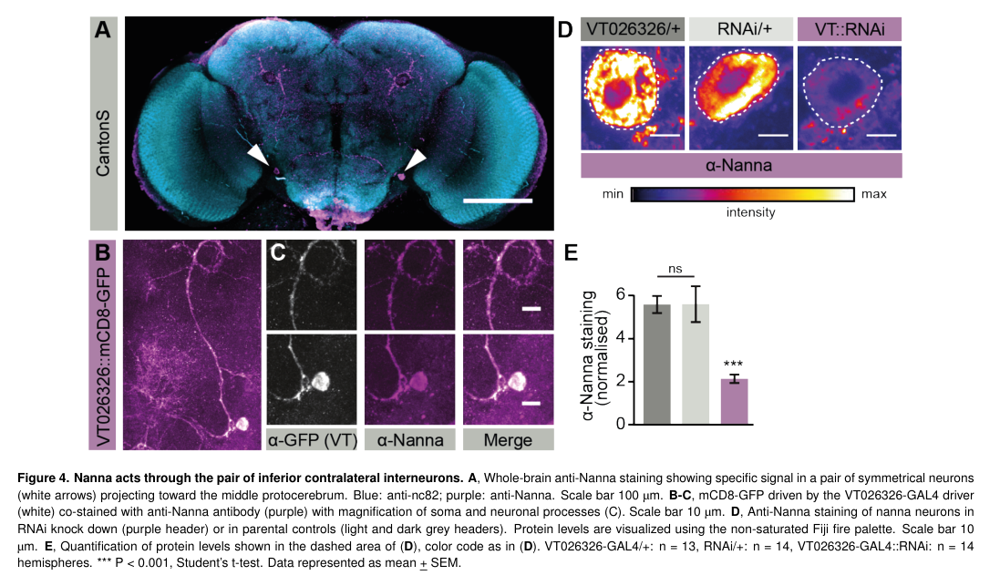

## Question

# Gene Research for Functional Annotation

## ⚠️ CRITICAL: Gene/Protein Identification Context

**BEFORE YOU BEGIN RESEARCH:** You MUST verify you are researching the CORRECT gene/protein. Gene symbols can be ambiguous, especially for less well-characterized genes from non-model organisms.

### Target Gene/Protein Identity (from UniProt):
- **UniProt Accession:** Q9VTY2
- **Protein Description:** RecName: Full=NADP-dependent oxidoreductase domain-containing protein {ECO:0000259|Pfam:PF00248};
- **Gene Information:** Name=Ar2 {ECO:0000313|FlyBase:FBgn0036290}; Synonyms=AKR {ECO:0000313|EMBL:AAF49912.1}, anon-WO0172774.89 {ECO:0000313|EMBL:AAF49912.1}, AR {ECO:0000313|EMBL:AAF49912.1}, CG32101 {ECO:0000313|EMBL:AAF49912.1}, Dmel\CG10638 {ECO:0000313|EMBL:AAF49912.1}; ORFNames=CG10638 {ECO:0000313|EMBL:AAF49912.1, ECO:0000313|FlyBase:FBgn0036290}, Dmel_CG10638 {ECO:0000313|EMBL:AAF49912.1};
- **Organism (full):** Drosophila melanogaster (Fruit fly).
- **Protein Family:** Not specified in UniProt
- **Key Domains:** AKR. (IPR020471); AKR2E. (IPR044488); Aldo/ket_reductase_CS. (IPR018170); NAD(P)_OxRdtase_dom_sf. (IPR036812); NADP_OxRdtase_dom. (IPR023210)

### MANDATORY VERIFICATION STEPS:

1. **Check if the gene symbol "Ar2" matches the protein description above**
2. **Verify the organism is correct:** Drosophila melanogaster (Fruit fly).
3. **Check if protein family/domains align with what you find in literature**
4. **If you find literature for a DIFFERENT gene with the same or similar symbol, STOP**

### If Gene Symbol is Ambiguous or You Cannot Find Relevant Literature:

**DO NOT PROCEED WITH RESEARCH ON A DIFFERENT GENE.** Instead:
- State clearly: "The gene symbol 'Ar2' is ambiguous or literature is limited for this specific protein"
- Explain what you found (e.g., "Found extensive literature on a different gene with the same symbol in a different organism")
- Describe the protein based ONLY on the UniProt information provided above
- Suggest that the protein function can be inferred from domain/family information

### Research Target:

Please provide a comprehensive research report on the gene **Ar2** (gene ID: Ar2, UniProt: Q9VTY2) in DROME.

The research report should be a detailed narrative explaining the function, biological processes, and localization of the gene product. Citations should be given for all claims.

You should prioritize authoritative reviews and primary scientific literature when conducting research. You can supplement
this with annotations you find in gene/protein databases, but these can be outdated or inaccurate.

We are specifically interested in the primary function of the gene - for enzymes, what reaction is catalyzed, and what is the substrate specificity? For transporters, what is the substrate? For structural proteins or adapters, what is the broader structural role? For signaling molecules, what is the role in the pathway.

We are interested in where in or outside the cell the gene product carries out its function.

We are also interested in the signaling or biochemical pathways in which the gene functions. We are less interested in broad pleiotropic effects, except where these elucidate the precise role.

Include evidence where possible. We are interested in both experimental evidence as well as inference from structure, evolution, or bioinformatic analysis. Precise studies should be prioritized over high-throughput, where available.

## Output

Question: You are an expert researcher providing comprehensive, well-cited information.

Provide detailed information focusing on:
1. Key concepts and definitions with current understanding
2. Recent developments and latest research (prioritize 2023-2024 sources)
3. Current applications and real-world implementations
4. Expert opinions and analysis from authoritative sources
5. Relevant statistics and data from recent studies

Format as a comprehensive research report with proper citations. Include URLs and publication dates where available.
Always prioritize recent, authoritative sources and provide specific citations for all major claims.

# Gene Research for Functional Annotation

## ⚠️ CRITICAL: Gene/Protein Identification Context

**BEFORE YOU BEGIN RESEARCH:** You MUST verify you are researching the CORRECT gene/protein. Gene symbols can be ambiguous, especially for less well-characterized genes from non-model organisms.

### Target Gene/Protein Identity (from UniProt):
- **UniProt Accession:** Q9VTY2
- **Protein Description:** RecName: Full=NADP-dependent oxidoreductase domain-containing protein {ECO:0000259|Pfam:PF00248};
- **Gene Information:** Name=Ar2 {ECO:0000313|FlyBase:FBgn0036290}; Synonyms=AKR {ECO:0000313|EMBL:AAF49912.1}, anon-WO0172774.89 {ECO:0000313|EMBL:AAF49912.1}, AR {ECO:0000313|EMBL:AAF49912.1}, CG32101 {ECO:0000313|EMBL:AAF49912.1}, Dmel\CG10638 {ECO:0000313|EMBL:AAF49912.1}; ORFNames=CG10638 {ECO:0000313|EMBL:AAF49912.1, ECO:0000313|FlyBase:FBgn0036290}, Dmel_CG10638 {ECO:0000313|EMBL:AAF49912.1};
- **Organism (full):** Drosophila melanogaster (Fruit fly).
- **Protein Family:** Not specified in UniProt
- **Key Domains:** AKR. (IPR020471); AKR2E. (IPR044488); Aldo/ket_reductase_CS. (IPR018170); NAD(P)_OxRdtase_dom_sf. (IPR036812); NADP_OxRdtase_dom. (IPR023210)

### MANDATORY VERIFICATION STEPS:

1. **Check if the gene symbol "Ar2" matches the protein description above**
2. **Verify the organism is correct:** Drosophila melanogaster (Fruit fly).
3. **Check if protein family/domains align with what you find in literature**
4. **If you find literature for a DIFFERENT gene with the same or similar symbol, STOP**

### If Gene Symbol is Ambiguous or You Cannot Find Relevant Literature:

**DO NOT PROCEED WITH RESEARCH ON A DIFFERENT GENE.** Instead:
- State clearly: "The gene symbol 'Ar2' is ambiguous or literature is limited for this specific protein"
- Explain what you found (e.g., "Found extensive literature on a different gene with the same symbol in a different organism")
- Describe the protein based ONLY on the UniProt information provided above
- Suggest that the protein function can be inferred from domain/family information

### Research Target:

Please provide a comprehensive research report on the gene **Ar2** (gene ID: Ar2, UniProt: Q9VTY2) in DROME.

The research report should be a detailed narrative explaining the function, biological processes, and localization of the gene product. Citations should be given for all claims.

You should prioritize authoritative reviews and primary scientific literature when conducting research. You can supplement
this with annotations you find in gene/protein databases, but these can be outdated or inaccurate.

We are specifically interested in the primary function of the gene - for enzymes, what reaction is catalyzed, and what is the substrate specificity? For transporters, what is the substrate? For structural proteins or adapters, what is the broader structural role? For signaling molecules, what is the role in the pathway.

We are interested in where in or outside the cell the gene product carries out its function.

We are also interested in the signaling or biochemical pathways in which the gene functions. We are less interested in broad pleiotropic effects, except where these elucidate the precise role.

Include evidence where possible. We are interested in both experimental evidence as well as inference from structure, evolution, or bioinformatic analysis. Precise studies should be prioritized over high-throughput, where available.

# Functional annotation of *Drosophila melanogaster* Ar2 (Q9VTY2)

## Identity and principal conclusion

**The target is the fly gene Ar2, also called CG10638 (FlyBase FBgn0036290), not a similarly named reductase in another organism.** The accession and synonyms supplied in the question establish that identity; independent work explicitly identifies fly CG10638 as an aldo-keto reductase (AKR)-like gene and, in 2024, names its alternatively spliced products **Ninna** and **Nanna**. The names Ar2, CG10638, and *ninna nanna* therefore refer here to the same fly locus, rather than to different enzymes. The AKR and NAD(P)-oxidoreductase domains supplied for Q9VTY2 are consistent with the published sequence and structural analyses. (petzold2017identificationandcharacterisation pages 105-108, petzold2024ninnanannalinks pages 2-3, petzold2017identificationandcharacterisation pages 146-150)

**Best-supported biological role:** CG10638 contributes to normal sleep regulation in fly neural circuits. **Best-supported molecular description:** two AKR-like proteins with *predicted* but unverified differences in nicotinamide-cofactor preference. **The physiological chemical substrate, product, catalytic reaction and precise subcellular site of action remain unknown.** The most detailed gene-specific study is a [bioRxiv preprint posted 14 May 2024](https://doi.org/10.1101/2024.05.10.593616), which its posted version identifies as **not certified by peer review**. Its mechanistic proposals should be read with that qualification. (petzold2024ninnanannalinks pages 7-9, petzold2024ninnanannalinks pages 2-3, petzold2024ninnanannalinks pages 1-2, petzold2024ninnanannalinks pages 6-7)

The evidence grades below distinguish measurements on CG10638 from predictions based on the AKR fold.

| Aspect | Observed result or prediction | Evidence and limitations |
|---|---|---|
| Identity and protein class | **Ar2 (Q9VTY2; FBgn0036290) corresponds to CG10638**, renamed **ninna nanna** in the 2024 study. Alternative splicing produces Ninna/CG10638-PA (317 aa) and Nanna/CG10638-PB (310 aa), which share 24 aa and have 57% amino-acid identity. Both are predicted aldo-keto reductase (AKR)-domain proteins. | The supplied UniProt record and CG10638-specific literature support the identity. Conserved catalytic, cofactor-binding, and substrate-pocket residues and AKR-like structural models support the classification, but neither isoform has been purified and biochemically validated as an AKR. (petzold2024ninnanannalinks pages 2-3, petzold2017identificationandcharacterisation pages 85-88, petzold2017identificationandcharacterisation pages 146-150) |
| Candidate reaction and substrate specificity | **Predicted only:** AKR-like NAD(P)H-dependent reduction of a carbonyl compound to its corresponding alcohol. The endogenous substrate, product, in-vivo reaction direction, turnover rate, and substrate spectrum are **unknown**. | The candidate reaction derives from AKR-domain homology and predicted aldehyde-reductase annotation. No CG10638 substrate-conversion, binding, kinetic, metabolomic, or product-rescue experiment was reported. Substrates established for other AKRs must not be assigned to Ar2. (petzold2017identificationandcharacterisation pages 85-88, petzold2017identificationandcharacterisation pages 146-150, petzold2024ninnanannalinks pages 6-7) |
| Ninna cofactor preference | **Predicted NADP(H) preference**, not experimentally measured. | Ninna retains canonical AKR cofactor-pocket residues and was structurally modeled against human aldose reductase with 46% sequence identity and 100% Phyre2 model confidence. No NADPH-binding, consumption, catalytic-rate, or redox-sensor assay was performed. (petzold2024ninnanannalinks pages 7-9, petzold2024ninnanannalinks pages 2-3, petzold2024ninnanannalinks pages 7-7) |
| Nanna cofactor preference | **Predicted NAD(H) preference over NADP(H)**, not experimentally measured. | Nanna contains S263A, S264A, and R268H substitutions at positions predicted to contact the phosphate group of NADP(H), providing a structural rationale for preferring unphosphorylated NAD(H). No direct cofactor-binding or catalytic comparison was performed. (petzold2024ninnanannalinks pages 2-3) |
| Cell-type localization | Isoform-specific immunostaining localized **Ninna to large ventral lateral clock neurons (l-LNvs), not s-LNvs**, including somata and medullar projections. **Nanna localized to one bilateral pair of ICLI/IPS neurons**, with projections toward the dorsolateral protocerebrum, around the mushroom-body peduncle, contralaterally, and into or above the subesophageal ganglion. | Anti-isoform antibodies, reporter colocalization, TyrR/MIP markers, and RNAi-dependent loss of Nanna signal support these assignments. Although the preprint abstract says s-LNvs, its experimental results and Supplementary Figure S3 identify Ninna expression in **l-LNvs**. (petzold2024ninnanannalinks pages 12-13, petzold2024ninnanannalinks pages 3-5, petzold2024ninnanannalinks pages 5-6, petzold2024ninnanannalinks media 4a654085) |
| Sleep-pressure response and neural circuit | Nanna transcript and protein increased with prolonged wakefulness or high sleep pressure and after 12 hours of sleep deprivation, while CaLexA activity in Nanna-positive ICLI neurons decreased. GRASP supported contact between PDF-positive clock neurons and Nanna neurons; ICLI neurons also expressed sNPFR. | The results associate Nanna with a circuit integrating circadian input and homeostatic sleep pressure. They do not establish that Nanna enzymatically senses NAD(H), identify its substrate, or prove that increased Nanna causes ICLI inhibition. Transcript assays used 7 biological replicates per condition; CaLexA used 14 control and 16 sleep-deprived hemispheres. (petzold2024ninnanannalinks pages 7-9, petzold2024ninnanannalinks pages 3-5, petzold2024ninnanannalinks pages 5-6) |
| 2024 common-exon mutant phenotype | The EP21723 insertion reduced both transcripts and reduced sleep, principally daytime sleep, while leaving the free-running circadian period intact. | This is locus-level rather than isoform-specific evidence. Sleep cohorts comprised 82 wild-type and 90 mutant flies; circadian cohorts comprised 15 wild-type and 28 mutant flies. The report was posted on May 14, 2024, as a **bioRxiv preprint not certified by peer review**. (petzold2024ninnanannalinks pages 2-3, petzold2024ninnanannalinks pages 1-2) |
| Earlier nervous-system knockdown | Two CG10638 RNAi constructs reduced daily sleep by approximately 3.5–4.3 hours and shortened sleep bouts. One preferentially affected night sleep, whereas the other more strongly affected daytime sleep. | This evidence comes from a 2017 doctoral thesis. Both RNAi constructs affected both splice forms to differing degrees, so the experiments do not cleanly establish isoform-specific function; technical RNAi effects remain possible. (petzold2017identificationandcharacterisation pages 153-156, petzold2017identificationandcharacterisation pages 169-173) |
| Molecular subcellular localization | **Unknown.** Available data localize each isoform to particular neurons and neuronal projections, not definitively to the cytosol, nucleus, plasma membrane, mitochondria, synapses, or another organelle. | Whole-mount antibody staining and genetically encoded axonal or dendritic markers resolve cells and processes but do not establish molecular-compartment localization. No biochemical fractionation, immuno-EM, organelle-colocalization, or validated endogenous fluorescent knock-in was reported. (petzold2024ninnanannalinks pages 7-9, petzold2024ninnanannalinks pages 5-6, petzold2024ninnanannalinks pages 6-7) |
| Relationship to the 2023 SREBP–Men pathway | The SREBP–malic-enzyme pathway provides independent evidence that NADP-positive/NADPH balance affects fly sleep, but **Men is not Ar2/CG10638**, and this pathway has not been experimentally connected to Ninna or Nanna. | Mariano et al. measured SREBP and Men manipulations and NADP-positive/NADPH effects but did not assay or identify CG10638/Ar2/ninna nanna. Those biochemical findings cannot be transferred to Ar2. (mariano2023srebpmodulatesthe pages 7-7, mariano2023srebpmodulatesthe pages 2-3, mariano2023srebpmodulatesthe pages 1-2) |

*Table: Evidence-graded summary of the identity, predicted biochemistry, neuronal localization, and sleep phenotype of Drosophila Ar2/CG10638. It distinguishes direct observations from untested AKR and cofactor predictions and avoids conflating Ar2 with malic enzyme.*

## Molecular function: plausible chemistry, unidentified substrate

AKRs generally use reduced nicotinamide cofactors to convert carbonyl groups—on aldehydes or ketones—to the corresponding alcohols. For Ar2, the **candidate**, not demonstrated, reaction can be written **carbonyl compound + NAD(P)H + H⁺ → corresponding alcohol + NAD(P)⁺**. Sequence comparisons find the conserved AKR catalytic-site residues in both CG10638 proteins, and structure modeling supports an AKR-like fold. A 2017 gene-ontology analysis accordingly listed cellular aldehyde metabolism and aldehyde-reductase activity as *predictions*. None of these observations establishes that a particular aldehyde, ketone, sugar, steroid or signaling molecule is an Ar2 substrate. (petzold2024ninnanannalinks pages 2-3, petzold2017identificationandcharacterisation pages 85-88, petzold2017identificationandcharacterisation pages 146-150)

The splice products are substantially different: **Ninna is 317 amino acids; Nanna is 310 amino acids; they share only 24 amino acids encoded by a common exon and have 57% overall amino-acid identity**. Ninna retains residues associated with the canonical NADP(H)-binding pocket and is **predicted** to prefer NADP(H). Nanna carries **S263A, S264A and R268H** substitutions at positions predicted to contact the phosphate group of NADP(H); the authors therefore **predict** that Nanna favors unphosphorylated NAD(H). Structural models used human aldose reductase for Ninna (46% sequence identity) and a *Schistosoma japonicum* aldose reductase for Nanna (42% identity). Structural-model confidence is **not** evidence of catalytic activity or cofactor preference. Neither isoform was reported to have a measured physiological substrate, product, cofactor-binding constant, NADH-versus-NADPH reaction rate, or kinetic parameter. (petzold2024ninnanannalinks pages 7-9, petzold2024ninnanannalinks pages 2-3, petzold2017identificationandcharacterisation pages 146-150)

Accordingly, even calling either protein an *active* aldehyde reductase remains an inference; an AKR-like fold could also support a redox-sensing function. The investigators propose nicotinamide-redox sensing in sleep regulation but did not establish whether CG10638 catalyzes carbonyl reduction *in vivo*, which metabolite it recognizes, or whether cofactor binding rather than substrate turnover mediates its phenotype. **Substrates or reactions demonstrated for mammalian aldose reductases or the distinct fly potassium-channel β-subunit Hyperkinetic cannot be transferred to Ar2.** (petzold2017identificationandcharacterisation pages 85-88, petzold2017identificationandcharacterisation pages 146-150, petzold2024ninnanannalinks pages 7-7)

## Where the proteins act

The clearest localization evidence resolves **neuronal cell types**, not organelles. Isoform-directed antibody staining identifies **Ninna in the large ventral lateral clock neurons (l-LNvs)**, including their somata and medullar projections. It identifies **Nanna in a bilateral pair of inferior contralateral interneurons (ICLI; also termed inferior posterior slope neurons)**, which project toward the dorsolateral protocerebrum, around the mushroom-body peduncle, and contralaterally toward the subesophageal region. Reporter colocalization and reduction of anti-Nanna staining after targeted RNA interference support the Nanna assignment; the latter validation used **13 driver-control, 14 RNAi-control and 14 knockdown hemispheres**. The antibody images and quantification are shown in the study’s cropped **Figure 4**. (petzold2024ninnanannalinks pages 3-5, petzold2024ninnanannalinks pages 5-6, petzold2024ninnanannalinks media 4a654085)

There is an important **internal discrepancy** in the 2024 preprint: its abstract describes Ninna in *small* lateral ventral neurons (s-LNvs), whereas its results and supplementary immunostaining explicitly report Ninna in **l-LNvs and not s-LNvs**. The experimentally described l-LNv localization is the more defensible expression assignment; the s-LNvs figure in the proposed circuit pertains to potential **input onto Nanna-positive ICLI neurons**, not demonstrated Ninna expression in s-LNvs. At the molecular scale, the reported staining and neuronal-process markers do **not** resolve whether Ar2 acts in cytosol, at a synapse, on a membrane, in the nucleus or in another compartment. A cytosolic AKR assignment is plausible by family analogy but is **not experimentally established for either isoform**. (petzold2024ninnanannalinks pages 12-13, petzold2024ninnanannalinks pages 3-5, petzold2024ninnanannalinks pages 6-7, petzold2024ninnanannalinks pages 1-2)

## Biological process and proposed pathway

**Direct genetic evidence connects the locus to sleep, especially daytime sleep.** In the 2024 study, a P-element insertion in a **shared exon** reduced expression of both splice forms and reduced sleep, while leaving the measured free-running circadian period intact. The sleep comparison included **82 wild-type and 90 mutant flies**; the circadian comparison included **15 controls and 28 mutants**. Because the insertion affects **both** transcripts, this experiment establishes a locus-level association rather than assigning the sleep phenotype exclusively to Nanna. An earlier [2017 doctoral investigation](https://doi.org/10.25560/52922) found that two nervous-system CG10638 RNAi constructs reduced daily sleep by approximately **3.5–4.3 hours** and shortened sleep bouts. Their distinct day-versus-night effects are suggestive, but both constructs reduced both transcripts to different degrees; they do not constitute a clean isoform-specific test. (petzold2017identificationandcharacterisation pages 153-156, petzold2024ninnanannalinks pages 2-3, petzold2017identificationandcharacterisation pages 169-173)

**Nanna is the more strongly implicated isoform in sleep-pressure physiology.** Its head-transcript abundance was higher after prolonged waking and rose after **12 hours of sleep deprivation**, while *ninna* transcript did not show the same deprivation response; the transcript comparison used **seven biological replicates per treatment, each comprising ten heads**. Nanna antibody signal was higher in ICLI neurons at a time of greater sleep pressure and after deprivation. In parallel, a CaLexA activity reporter in those neurons decreased after deprivation (**14 rested versus 16 deprived hemispheres**). These are associations between Nanna abundance, waking history and neuronal activity: they **do not demonstrate that Nanna enzymatically inhibits the neurons or establish its substrate**. A reported ninna-specific insertion, assessed as a heterozygote, yielded no significant sleep difference (**63 controls versus 82 insertion carriers**); that negative result should not be treated as definitive exclusion of a Ninna function. (petzold2024ninnanannalinks pages 12-13, petzold2024ninnanannalinks pages 3-5, petzold2024ninnanannalinks pages 5-6)

The proposed circuit places Ninna-positive clock neurons and Nanna-positive ICLI neurons in distinct components of **circadian timing (‘process C’) and accumulated sleep pressure (‘process S’)**. The investigators observed a GRASP contact signal between PDF-expressing clock neurons and the Nanna-positive neurons, as well as short-neuropeptide-F receptor staining in the latter. These findings provide an anatomical basis for clock-to-ICLI signaling, **not proof of neurotransmission direction, the identity of a CG10638 reaction product, or direct regulation of either PDF or sNPF signaling by the Ar2 enzyme**. The authors explicitly leave open whether Nanna itself suppresses ICLI activity and whether Ninna has a causal clock function. (petzold2024ninnanannalinks pages 7-9, petzold2024ninnanannalinks pages 6-7, petzold2024ninnanannalinks pages 5-6, petzold2024ninnanannalinks pages 7-7)

A separate, [peer-reviewed 2023 *Nature Communications* study](https://doi.org/10.1038/s41467-022-35577-8) showed that the **SREBP–malic enzyme (*Men*)** axis changes the fly NADP⁺/NADPH balance and night sleep. It supplies useful evidence that redox metabolism can affect fly sleep, **but it does not assay CG10638 or establish that Ar2 is Men, is controlled by SREBP, or participates in that pathway**. It must not be cited as direct biochemical validation of either Ninna or Nanna. (mariano2023srebpmodulatesthe pages 7-7, mariano2023srebpmodulatesthe pages 2-3, mariano2023srebpmodulatesthe pages 1-2)

## Assessment and research-use implications

The defensible functional annotation is **“AKR-domain-containing Ar2/CG10638 protein with genetically supported involvement in sleep regulation; Nanna abundance tracks sleep pressure in ICLI neurons, while Ninna is detected in l-LNv clock neurons.”** At present, the more precise enzyme label **“NADPH-dependent reduction of [named substrate]”** would overstate the evidence, particularly because one splice form is structurally predicted to favor **NAD(H)** rather than NADP(H). The immediate unresolved experiments are isoform-resolved substrate and cofactor assays, catalytic-site perturbation with behavioral rescue, and molecular-compartment localization in the identified neurons. These are **research needs**, not reported implementations or demonstrated activities. (petzold2024ninnanannalinks pages 2-3, petzold2024ninnanannalinks pages 5-6, petzold2017identificationandcharacterisation pages 146-150, petzold2024ninnanannalinks pages 6-7)

**Principal sources:** Petzold and Gilestro, *ninna nanna links circadian and homeostatic sleep drive in Drosophila*, bioRxiv, **posted 14 May 2024**, https://doi.org/10.1101/2024.05.10.593616 (gene-specific primary preprint); Petzold, *Identification and characterisation of a novel aldo-keto reductase regulating sleep in Drosophila melanogaster*, doctoral thesis, **2017**, https://doi.org/10.25560/52922 (earlier gene-specific experiments); Mariano and colleagues, *SREBP modulates the NADP⁺/NADPH cycle to control night sleep in Drosophila*, *Nature Communications*, **February 2023**, https://doi.org/10.1038/s41467-022-35577-8 (**context only**, not an Ar2 study). Gene-record identifiers: https://www.uniprot.org/uniprotkb/Q9VTY2/entry and https://flybase.org/reports/FBgn0036290.html. (petzold2024ninnanannalinks pages 2-3, petzold2024ninnanannalinks pages 1-2, petzold2017identificationandcharacterisation pages 169-173, mariano2023srebpmodulatesthe pages 1-2)

References

1. (petzold2017identificationandcharacterisation pages 105-108): Anne Petzold. Identification and characterisation of a novel aldo-keto reductase regulating sleep in drosophila melanogaster. ArXiv, 2017. URL: https://doi.org/10.25560/52922, doi:10.25560/52922. This article has 1 citations.

2. (petzold2024ninnanannalinks pages 2-3): Anne Petzold and Giorgio F. Gilestro. Ninna nanna links circadian and homeostatic sleep drive in drosophila. bioRxiv, May 2024. URL: https://doi.org/10.1101/2024.05.10.593616, doi:10.1101/2024.05.10.593616. This article has 1 citations.

3. (petzold2017identificationandcharacterisation pages 146-150): Anne Petzold. Identification and characterisation of a novel aldo-keto reductase regulating sleep in drosophila melanogaster. ArXiv, 2017. URL: https://doi.org/10.25560/52922, doi:10.25560/52922. This article has 1 citations.

4. (petzold2024ninnanannalinks pages 7-9): Anne Petzold and Giorgio F. Gilestro. Ninna nanna links circadian and homeostatic sleep drive in drosophila. bioRxiv, May 2024. URL: https://doi.org/10.1101/2024.05.10.593616, doi:10.1101/2024.05.10.593616. This article has 1 citations.

5. (petzold2024ninnanannalinks pages 1-2): Anne Petzold and Giorgio F. Gilestro. Ninna nanna links circadian and homeostatic sleep drive in drosophila. bioRxiv, May 2024. URL: https://doi.org/10.1101/2024.05.10.593616, doi:10.1101/2024.05.10.593616. This article has 1 citations.

6. (petzold2024ninnanannalinks pages 6-7): Anne Petzold and Giorgio F. Gilestro. Ninna nanna links circadian and homeostatic sleep drive in drosophila. bioRxiv, May 2024. URL: https://doi.org/10.1101/2024.05.10.593616, doi:10.1101/2024.05.10.593616. This article has 1 citations.

7. (petzold2017identificationandcharacterisation pages 85-88): Anne Petzold. Identification and characterisation of a novel aldo-keto reductase regulating sleep in drosophila melanogaster. ArXiv, 2017. URL: https://doi.org/10.25560/52922, doi:10.25560/52922. This article has 1 citations.

8. (petzold2024ninnanannalinks pages 7-7): Anne Petzold and Giorgio F. Gilestro. Ninna nanna links circadian and homeostatic sleep drive in drosophila. bioRxiv, May 2024. URL: https://doi.org/10.1101/2024.05.10.593616, doi:10.1101/2024.05.10.593616. This article has 1 citations.

9. (petzold2024ninnanannalinks pages 12-13): Anne Petzold and Giorgio F. Gilestro. Ninna nanna links circadian and homeostatic sleep drive in drosophila. bioRxiv, May 2024. URL: https://doi.org/10.1101/2024.05.10.593616, doi:10.1101/2024.05.10.593616. This article has 1 citations.

10. (petzold2024ninnanannalinks pages 3-5): Anne Petzold and Giorgio F. Gilestro. Ninna nanna links circadian and homeostatic sleep drive in drosophila. bioRxiv, May 2024. URL: https://doi.org/10.1101/2024.05.10.593616, doi:10.1101/2024.05.10.593616. This article has 1 citations.

11. (petzold2024ninnanannalinks pages 5-6): Anne Petzold and Giorgio F. Gilestro. Ninna nanna links circadian and homeostatic sleep drive in drosophila. bioRxiv, May 2024. URL: https://doi.org/10.1101/2024.05.10.593616, doi:10.1101/2024.05.10.593616. This article has 1 citations.

12. (petzold2024ninnanannalinks media 4a654085): Anne Petzold and Giorgio F. Gilestro. Ninna nanna links circadian and homeostatic sleep drive in drosophila. bioRxiv, May 2024. URL: https://doi.org/10.1101/2024.05.10.593616, doi:10.1101/2024.05.10.593616. This article has 1 citations.

13. (petzold2017identificationandcharacterisation pages 153-156): Anne Petzold. Identification and characterisation of a novel aldo-keto reductase regulating sleep in drosophila melanogaster. ArXiv, 2017. URL: https://doi.org/10.25560/52922, doi:10.25560/52922. This article has 1 citations.

14. (petzold2017identificationandcharacterisation pages 169-173): Anne Petzold. Identification and characterisation of a novel aldo-keto reductase regulating sleep in drosophila melanogaster. ArXiv, 2017. URL: https://doi.org/10.25560/52922, doi:10.25560/52922. This article has 1 citations.

15. (mariano2023srebpmodulatesthe pages 7-7): Vittoria Mariano, Alexandros K. Kanellopoulos, Giuseppe Aiello, Adrian C. Lo, Eric Legius, Tilmann Achsel, and Claudia Bagni. Srebp modulates the nadp+/nadph cycle to control night sleep in drosophila. Nature Communications, Feb 2023. URL: https://doi.org/10.1038/s41467-022-35577-8, doi:10.1038/s41467-022-35577-8. This article has 22 citations and is from a highest quality peer-reviewed journal.

16. (mariano2023srebpmodulatesthe pages 2-3): Vittoria Mariano, Alexandros K. Kanellopoulos, Giuseppe Aiello, Adrian C. Lo, Eric Legius, Tilmann Achsel, and Claudia Bagni. Srebp modulates the nadp+/nadph cycle to control night sleep in drosophila. Nature Communications, Feb 2023. URL: https://doi.org/10.1038/s41467-022-35577-8, doi:10.1038/s41467-022-35577-8. This article has 22 citations and is from a highest quality peer-reviewed journal.

17. (mariano2023srebpmodulatesthe pages 1-2): Vittoria Mariano, Alexandros K. Kanellopoulos, Giuseppe Aiello, Adrian C. Lo, Eric Legius, Tilmann Achsel, and Claudia Bagni. Srebp modulates the nadp+/nadph cycle to control night sleep in drosophila. Nature Communications, Feb 2023. URL: https://doi.org/10.1038/s41467-022-35577-8, doi:10.1038/s41467-022-35577-8. This article has 22 citations and is from a highest quality peer-reviewed journal.

## Artifacts

- [Edison artifact artifact-00](Ar2-deep-research-falcon_artifacts/artifact-00.md)

## Citations

1. petzold2024ninnanannalinks pages 2-3
2. petzold2017identificationandcharacterisation pages 105-108
3. petzold2017identificationandcharacterisation pages 146-150
4. petzold2024ninnanannalinks pages 7-9
5. petzold2024ninnanannalinks pages 1-2
6. petzold2024ninnanannalinks pages 6-7
7. petzold2017identificationandcharacterisation pages 85-88
8. petzold2024ninnanannalinks pages 7-7
9. petzold2024ninnanannalinks pages 12-13
10. petzold2024ninnanannalinks pages 3-5
11. petzold2024ninnanannalinks pages 5-6
12. petzold2017identificationandcharacterisation pages 153-156
13. petzold2017identificationandcharacterisation pages 169-173
14. mariano2023srebpmodulatesthe pages 7-7
15. mariano2023srebpmodulatesthe pages 2-3
16. mariano2023srebpmodulatesthe pages 1-2
17. bioRxiv preprint posted 14 May 2024
18. 2017 doctoral investigation
19. peer-reviewed 2023 *Nature Communications* study
20. named substrate
21. https://doi.org/10.1101/2024.05.10.593616
22. https://doi.org/10.25560/52922
23. https://doi.org/10.1038/s41467-022-35577-8
24. https://www.uniprot.org/uniprotkb/Q9VTY2/entry
25. https://flybase.org/reports/FBgn0036290.html.
26. https://doi.org/10.25560/52922,
27. https://doi.org/10.1101/2024.05.10.593616,
28. https://doi.org/10.1038/s41467-022-35577-8,