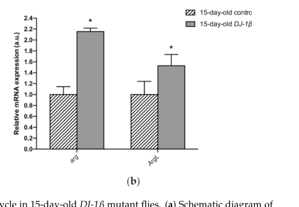

## Question

# Gene Research for Functional Annotation

## ⚠️ CRITICAL: Gene/Protein Identification Context

**BEFORE YOU BEGIN RESEARCH:** You MUST verify you are researching the CORRECT gene/protein. Gene symbols can be ambiguous, especially for less well-characterized genes from non-model organisms.

### Target Gene/Protein Identity (from UniProt):
- **UniProt Accession:** O76895
- **Protein Description:** RecName: Full=Arginase {ECO:0000255|RuleBase:RU361159}; EC=3.5.3.1 {ECO:0000255|PROSITE-ProRule:PRU00742};
- **Gene Information:** Name=Arg {ECO:0000312|FlyBase:FBgn0023535}; ORFNames=CG18104 {ECO:0000312|FlyBase:FBgn0023535};
- **Organism (full):** Drosophila melanogaster (Fruit fly).
- **Protein Family:** Belongs to the arginase family. {ECO:0000255|PROSITE-
- **Key Domains:** Arginase. (IPR014033); Ureohydrolase. (IPR006035); Ureohydrolase_dom_sf. (IPR023696); Arginase (PF00491)

### MANDATORY VERIFICATION STEPS:

1. **Check if the gene symbol "Arg" matches the protein description above**
2. **Verify the organism is correct:** Drosophila melanogaster (Fruit fly).
3. **Check if protein family/domains align with what you find in literature**
4. **If you find literature for a DIFFERENT gene with the same or similar symbol, STOP**

### If Gene Symbol is Ambiguous or You Cannot Find Relevant Literature:

**DO NOT PROCEED WITH RESEARCH ON A DIFFERENT GENE.** Instead:
- State clearly: "The gene symbol 'Arg' is ambiguous or literature is limited for this specific protein"
- Explain what you found (e.g., "Found extensive literature on a different gene with the same symbol in a different organism")
- Describe the protein based ONLY on the UniProt information provided above
- Suggest that the protein function can be inferred from domain/family information

### Research Target:

Please provide a comprehensive research report on the gene **Arg** (gene ID: Arg, UniProt: O76895) in DROME.

The research report should be a detailed narrative explaining the function, biological processes, and localization of the gene product. Citations should be given for all claims.

You should prioritize authoritative reviews and primary scientific literature when conducting research. You can supplement
this with annotations you find in gene/protein databases, but these can be outdated or inaccurate.

We are specifically interested in the primary function of the gene - for enzymes, what reaction is catalyzed, and what is the substrate specificity? For transporters, what is the substrate? For structural proteins or adapters, what is the broader structural role? For signaling molecules, what is the role in the pathway.

We are interested in where in or outside the cell the gene product carries out its function.

We are also interested in the signaling or biochemical pathways in which the gene functions. We are less interested in broad pleiotropic effects, except where these elucidate the precise role.

Include evidence where possible. We are interested in both experimental evidence as well as inference from structure, evolution, or bioinformatic analysis. Precise studies should be prioritized over high-throughput, where available.

## Output

Question: You are an expert researcher providing comprehensive, well-cited information.

Provide detailed information focusing on:
1. Key concepts and definitions with current understanding
2. Recent developments and latest research (prioritize 2023-2024 sources)
3. Current applications and real-world implementations
4. Expert opinions and analysis from authoritative sources
5. Relevant statistics and data from recent studies

Format as a comprehensive research report with proper citations. Include URLs and publication dates where available.
Always prioritize recent, authoritative sources and provide specific citations for all major claims.

# Gene Research for Functional Annotation

## ⚠️ CRITICAL: Gene/Protein Identification Context

**BEFORE YOU BEGIN RESEARCH:** You MUST verify you are researching the CORRECT gene/protein. Gene symbols can be ambiguous, especially for less well-characterized genes from non-model organisms.

### Target Gene/Protein Identity (from UniProt):
- **UniProt Accession:** O76895
- **Protein Description:** RecName: Full=Arginase {ECO:0000255|RuleBase:RU361159}; EC=3.5.3.1 {ECO:0000255|PROSITE-ProRule:PRU00742};
- **Gene Information:** Name=Arg {ECO:0000312|FlyBase:FBgn0023535}; ORFNames=CG18104 {ECO:0000312|FlyBase:FBgn0023535};
- **Organism (full):** Drosophila melanogaster (Fruit fly).
- **Protein Family:** Belongs to the arginase family. {ECO:0000255|PROSITE-
- **Key Domains:** Arginase. (IPR014033); Ureohydrolase. (IPR006035); Ureohydrolase_dom_sf. (IPR023696); Arginase (PF00491)

### MANDATORY VERIFICATION STEPS:

1. **Check if the gene symbol "Arg" matches the protein description above**
2. **Verify the organism is correct:** Drosophila melanogaster (Fruit fly).
3. **Check if protein family/domains align with what you find in literature**
4. **If you find literature for a DIFFERENT gene with the same or similar symbol, STOP**

### If Gene Symbol is Ambiguous or You Cannot Find Relevant Literature:

**DO NOT PROCEED WITH RESEARCH ON A DIFFERENT GENE.** Instead:
- State clearly: "The gene symbol 'Arg' is ambiguous or literature is limited for this specific protein"
- Explain what you found (e.g., "Found extensive literature on a different gene with the same symbol in a different organism")
- Describe the protein based ONLY on the UniProt information provided above
- Suggest that the protein function can be inferred from domain/family information

### Research Target:

Please provide a comprehensive research report on the gene **Arg** (gene ID: Arg, UniProt: O76895) in DROME.

The research report should be a detailed narrative explaining the function, biological processes, and localization of the gene product. Citations should be given for all claims.

You should prioritize authoritative reviews and primary scientific literature when conducting research. You can supplement
this with annotations you find in gene/protein databases, but these can be outdated or inaccurate.

We are specifically interested in the primary function of the gene - for enzymes, what reaction is catalyzed, and what is the substrate specificity? For transporters, what is the substrate? For structural proteins or adapters, what is the broader structural role? For signaling molecules, what is the role in the pathway.

We are interested in where in or outside the cell the gene product carries out its function.

We are also interested in the signaling or biochemical pathways in which the gene functions. We are less interested in broad pleiotropic effects, except where these elucidate the precise role.

Include evidence where possible. We are interested in both experimental evidence as well as inference from structure, evolution, or bioinformatic analysis. Precise studies should be prioritized over high-throughput, where available.

# Functional annotation of *Drosophila melanogaster* Arg (UniProt O76895)

**Identity and scope.** The target is the fruit-fly **Arg/CG18104** gene (FlyBase **FBgn0023535**), encoding a predicted **arginase**, EC 3.5.3.1—not mammalian ARG1 or ARG2, and not the adjacent neuronal gene *elav*. The supplied UniProt annotation assigns Arg to the arginase/ureohydrolase family (including InterPro IPR014033 and Pfam PF00491). Independently, the original fly-gene study identified three conserved arginase sequence signatures and found that **36 of 37** residues invariant among the arginases compared were retained in the fly sequence. Unusually, *elav* lies within Arg’s third intron and is transcribed from the opposite strand; the study genetically distinguished their functions. This establishes that the correct protein is being considered despite the ambiguity of “Arg” as a symbol or an abbreviation for arginine. [UniProt entry](https://www.uniprot.org/uniprotkb/O76895/entry); [FlyBase record](https://flybase.org/reports/FBgn0023535.html); Samson, October 2000, [DOI:10.1074/jbc.m001346200](https://doi.org/10.1074/jbc.m001346200). (samson2000drosophilaarginaseis pages 2-3, samson2000drosophilaarginaseis pages 3-3, samson2000drosophilaarginaseis pages 1-2)

## Primary biochemical function and substrate

The **best-supported functional assignment** is hydrolysis of **L-arginine + H₂O → L-ornithine + urea**. This is the defining arginase reaction and provides a route from arginine to ornithine. Conserved residues implicated in binding the two manganese ions characteristic of arginases support a manganese-dependent metalloenzyme mechanism for fly Arg. Importantly, these are **sequence- and family-based assignments**: the retrieved fly-gene study did not report purified O76895 activity, product-based assays, measured manganese dependence, kinetic constants, or a panel testing alternative substrates. L-arginine is therefore the **inferred physiological substrate**, not a quantitatively established substrate preference for purified fly Arg. Samson, October 2000, [DOI:10.1074/jbc.m001346200](https://doi.org/10.1074/jbc.m001346200). (samson2000drosophilaarginaseis pages 6-7, samson2000drosophilaarginaseis pages 2-3)

The product ornithine potentially feeds **ornithine decarboxylase → putrescine → spermidine**, or interconverts with glutamate/proline through ornithine aminotransferase and associated metabolism. Arg is thus best positioned at an **arginine-catabolism/ornithine-supply branch point**. Nitric-oxide synthase uses arginine in a competing biochemical branch, but direct demonstration that fly Arg regulates nitric-oxide production or the relative flux through these branches is lacking. A 2025 comparative-genomics analysis examined **20 metabolism-related genes in 150 insect species across 11 orders**; it found arginase broadly retained but no complete arginine-synthesizing urea cycle, notably because functional ornithine carbamoyltransferase was absent. Consequently, calling the fly reaction a “urea-cycle enzyme” must **not** be taken to imply that *Drosophila* runs the complete mammalian cyclic urea pathway or uses Arg principally to dispose of ammonia. Martins and colleagues, 2025, [DOI:10.1111/imb.12989](https://doi.org/10.1111/imb.12989). (martins2025thelossof pages 1-2, martins2025thelossof pages 2-4, martins2025thelossof pages 5-6, samson2000drosophilaarginaseis pages 2-3)

## Where the gene product acts

**Tissue evidence is substantially stronger than subcellular evidence.** RNA in-situ hybridization first detected *Arg* transcripts around embryonic stage **12** in dorsolateral cells; signal increased and spread anteriorly, resembling differentiated **fat-body** expression by stage **16**. The embryonic ventral nervous system was unlabeled. A roughly **1.3-kb** transcript was also detected in adult head preparations but was not head-specific; head detection alone does not establish neuronal expression. These observations point to the metabolically active fat body as a documented site of *Arg* expression, **not** to a demonstrated organelle in which Arg protein catalyzes the reaction. Samson, October 2000, [DOI:10.1074/jbc.m001346200](https://doi.org/10.1074/jbc.m001346200). (samson2000drosophilaarginaseis pages 3-3, samson2000drosophilaarginaseis pages 6-7, samson2000drosophilaarginaseis pages 5-6)

Some literature discusses arginase as mitochondrial and manganese-dependent, but the retrieved fly-specific evidence does **not** establish mitochondrial versus cytosolic localization of **O76895** by tagged-protein imaging or subcellular fractionation. Mammalian cytosolic ARG1 and mitochondrial ARG2 localizations should not be transferred to the single fly protein as an experimental fact. Vásquez-Procopio and colleagues’ 2020 fly manganese-depletion study discusses arginase among manganese-dependent enzymes but directly reports other manganese-responsive endpoints, rather than an Arg-specific localization or activity measurement. [DOI:10.1039/c9mt00218a](https://doi.org/10.1039/c9mt00218a). (vasquezprocopio2020intestinalresponseto pages 1-2, vasquezprocopio2020intestinalresponseto pages 8-9)

## Genetic and physiological evidence

The foundational mutant produced truncated *Arg* RNA predicted to encode a protein missing **152 C-terminal amino acids**. Flies with *elav* function supplied separately survived and were fertile, but affected males developed more slowly: **50% eclosed on days 14–15**, compared with **days 12–13** for siblings carrying normal *Arg*. The author attributed the delay *likely* to impaired arginase function, while the complex inversion underlying the allele and absence of a direct activity assay limit how definitively this phenotype can be assigned to Arg catalysis alone. The result supports a contribution to developmental rate under the tested laboratory conditions, **not** an essential viability requirement. Samson, October 2000, [DOI:10.1074/jbc.m001346200](https://doi.org/10.1074/jbc.m001346200). (samson2000drosophilaarginaseis pages 6-7, samson2000drosophilaarginaseis pages 5-6)

A later whole-fly study provides a second, narrower connection to altered metabolism. In **15-day-old DJ-1β-deficient flies**, a Parkinson’s-disease model, *Arg* and argininosuccinate-lyase transcripts were increased relative to controls; the *Arg* expression analysis reports **four independent experiments**. Metabolomics also found reduced arginine and increased fumarate in this model. The authors explicitly called for further experiments: co-occurring transcript and metabolite changes do **not** establish increased Arg protein abundance, enzymatic flux, a complete fly urea cycle, or a causal role in neuronal pathology. Solana-Manrique and colleagues, January 2022, [DOI:10.3390/cells11030331](https://doi.org/10.3390/cells11030331); see the cropped **Figure 6b** expression data. (solanamanrique2022metabolicalterationsin pages 9-12, solanamanrique2022metabolicalterationsin media f98cfaac)

The following evidence summary separates observations from inference.

| Feature | Best specific finding | Support / limitations |
|---|---|---|
| Catalytic annotation and cofactor | **Arg (O76895/CG18104)** is assigned the arginase reaction **L-arginine + H₂O → L-ornithine + urea**. Its sequence contains all three arginase-family signatures and conserved residues implicated in binding two Mn²⁺ ions. | Sequence/family-based support: 36 of 37 residues invariant across the compared arginases are conserved in the fly protein. No purified-fly-enzyme kinetics, direct Mn-dependence assay, or alternative-substrate panel was reported. Samson 2000, DOI: [10.1074/jbc.m001346200](https://doi.org/10.1074/jbc.m001346200) (samson2000drosophilaarginaseis pages 6-7, samson2000drosophilaarginaseis pages 2-3) |
| Tissue and developmental expression | **Arg RNA** first appears around embryonic stage 12 in dorsolateral cells, strengthens and spreads anteriorly, and by stage 16 matches the differentiated fat-body pattern; the embryonic ventral nervous system was unlabeled. | Direct RNA in-situ hybridization and developmental Northern evidence. This localizes the **transcript to a tissue**, not Arg protein to a subcellular organelle; mitochondrial localization remains unproven for this fly protein. Samson 2000, DOI: [10.1074/jbc.m001346200](https://doi.org/10.1074/jbc.m001346200) (samson2000drosophilaarginaseis pages 5-6) |
| Loss-of-function evidence | The 2000 allele produced truncated **Arg RNA** predicted to encode a protein missing **152 C-terminal residues**. Approximately 50% of affected males eclosed on days **14–15**, versus days **12–13** for siblings with normal Arg; final progeny frequencies were near Mendelian expectations. | Supports a developmental-rate contribution without showing lethality or directly measuring catalytic loss. The allele arose from an inversion affecting the nested **elav–Arg** region; elav function was transgenically rescued, but residual linked/background effects cannot be excluded as completely as with a modern precise Arg knockout. Samson 2000, DOI: [10.1074/jbc.m001346200](https://doi.org/10.1074/jbc.m001346200) (samson2000drosophilaarginaseis pages 6-7, samson2000drosophilaarginaseis pages 5-6) |
| Disease-model regulation | In **15-day-old whole DJ-1β-deficient flies**, Arg transcript was significantly elevated relative to controls by RT-qPCR; the figure reports **four independent experiments**. | Demonstrates transcriptional association in a Parkinson’s-disease model, not increased Arg protein, arginase activity, arginine-to-ornithine flux, or causality. Solana-Manrique et al. 2022, DOI: [10.3390/cells11030331](https://doi.org/10.3390/cells11030331) (solanamanrique2022metabolicalterationsin pages 9-12, solanamanrique2022metabolicalterationsin media f98cfaac) |
| Pathway interpretation | Comparative analysis of **150 insect species across 11 orders** found no functional complete urea cycle: ornithine carbamoyltransferase was absent or lacked the required catalytic site, whereas ARG was broadly conserved outside several hemipteran lineages. Fly Arg is therefore best interpreted as an **arginine-catabolic/ornithine-producing enzyme**, not as proof of a canonical cyclic urea pathway in *Drosophila*. | Strong comparative-genomic context but not a fly-specific catalytic assay. It supports possible downstream ornithine use in proline/glutamate and polyamine metabolism; it does not establish which branch predominates in vivo. Martins et al. 2025, received 2024-11-01 and published 2025, DOI: [10.1111/imb.12989](https://doi.org/10.1111/imb.12989) (martins2025thelossof pages 1-2, martins2025thelossof pages 2-4, martins2025thelossof pages 5-6) |
| Current intervention status | No target-specific **2023–2024** study located here directly manipulated *D. melanogaster* Arg/O76895 to demonstrate a therapeutic or applied phenotype. | Recent fly studies of spermidine or spermine metabolism concern downstream enzymes and must not be attributed directly to Arg; a 2024 arginase-RNAi vector-control study concerned *Anopheles gambiae* AGAP008783, not CG18104. |

*Table: Evidence-level summary restricted to Drosophila melanogaster Arg (O76895/CG18104), separating direct observations from sequence-based or comparative inference. It highlights major limitations in biochemical, localization, and intervention evidence.*

## Recent research and applications

**Recency does not substitute for gene identity.** Targeted searches did not identify a **2023–2024 primary study directly manipulating *D. melanogaster* Arg/O76895** to establish substrate specificity, intracellular localization, or an applied intervention. Recent fly research does demonstrate the biological relevance of the *downstream polyamine pathway*, but effects of changing spermidine or spermine metabolism cannot be assigned specifically to Arg without Arg-targeted experiments. Likewise, a 2024 arginase-knockdown study addressing malaria-vector control tested ***Anopheles gambiae* AGAP008783**, **not** fly CG18104. The most recent directly useful advance for interpreting this target is the 2025 cross-insect analysis, which strengthens the case for placing Arg in **arginine degradation and ornithine-associated metabolism**, rather than in a complete urea cycle. Martins and colleagues, 2025, [DOI:10.1111/imb.12989](https://doi.org/10.1111/imb.12989). (martins2025thelossof pages 1-2, martins2025thelossof pages 2-4, martins2025thelossof pages 5-6)

**Annotation conclusion.** Arg/O76895 is a strongly sequence-supported *Drosophila* arginase whose primary assigned reaction converts **L-arginine to L-ornithine and urea**. Embryonic fat-body transcription and a developmental-delay phenotype are experimentally documented. Its **precise intracellular catalytic location, experimentally measured substrate selectivity and kinetics, and quantitative contribution to polyamine or nitric-oxide flux remain unresolved**; neither mammalian arginase biology nor findings for other insect arginases resolve those fly-specific questions. (samson2000drosophilaarginaseis pages 6-7, martins2025thelossof pages 5-6, samson2000drosophilaarginaseis pages 5-6)

References

1. (samson2000drosophilaarginaseis pages 2-3): Marie-Laure Samson. Drosophila arginase is produced from a nonvital gene that contains the elav locus within its third intron*. The Journal of Biological Chemistry, 275:31107-31114, Oct 2000. URL: https://doi.org/10.1074/jbc.m001346200, doi:10.1074/jbc.m001346200. This article has 45 citations.

2. (samson2000drosophilaarginaseis pages 3-3): Marie-Laure Samson. Drosophila arginase is produced from a nonvital gene that contains the elav locus within its third intron*. The Journal of Biological Chemistry, 275:31107-31114, Oct 2000. URL: https://doi.org/10.1074/jbc.m001346200, doi:10.1074/jbc.m001346200. This article has 45 citations.

3. (samson2000drosophilaarginaseis pages 1-2): Marie-Laure Samson. Drosophila arginase is produced from a nonvital gene that contains the elav locus within its third intron*. The Journal of Biological Chemistry, 275:31107-31114, Oct 2000. URL: https://doi.org/10.1074/jbc.m001346200, doi:10.1074/jbc.m001346200. This article has 45 citations.

4. (samson2000drosophilaarginaseis pages 6-7): Marie-Laure Samson. Drosophila arginase is produced from a nonvital gene that contains the elav locus within its third intron*. The Journal of Biological Chemistry, 275:31107-31114, Oct 2000. URL: https://doi.org/10.1074/jbc.m001346200, doi:10.1074/jbc.m001346200. This article has 45 citations.

5. (martins2025thelossof pages 1-2): Jessica Cristina Silva Martins, Héctor Antônio Assunção Romão, Carolina Kurotusch Canettieri, Amanda Caetano Cercilian, Patrícia Rasteiro Ordiale Oliveira, Clelia Ferreira, Walter R. Terra, and Renata de Oliveira Dias. The loss of the urea cycle and ornithine metabolism in different insect orders: an omics approach. Insect molecular biology, Mar 2025. URL: https://doi.org/10.1111/imb.12989, doi:10.1111/imb.12989. This article has 8 citations and is from a peer-reviewed journal.

6. (martins2025thelossof pages 2-4): Jessica Cristina Silva Martins, Héctor Antônio Assunção Romão, Carolina Kurotusch Canettieri, Amanda Caetano Cercilian, Patrícia Rasteiro Ordiale Oliveira, Clelia Ferreira, Walter R. Terra, and Renata de Oliveira Dias. The loss of the urea cycle and ornithine metabolism in different insect orders: an omics approach. Insect molecular biology, Mar 2025. URL: https://doi.org/10.1111/imb.12989, doi:10.1111/imb.12989. This article has 8 citations and is from a peer-reviewed journal.

7. (martins2025thelossof pages 5-6): Jessica Cristina Silva Martins, Héctor Antônio Assunção Romão, Carolina Kurotusch Canettieri, Amanda Caetano Cercilian, Patrícia Rasteiro Ordiale Oliveira, Clelia Ferreira, Walter R. Terra, and Renata de Oliveira Dias. The loss of the urea cycle and ornithine metabolism in different insect orders: an omics approach. Insect molecular biology, Mar 2025. URL: https://doi.org/10.1111/imb.12989, doi:10.1111/imb.12989. This article has 8 citations and is from a peer-reviewed journal.

8. (samson2000drosophilaarginaseis pages 5-6): Marie-Laure Samson. Drosophila arginase is produced from a nonvital gene that contains the elav locus within its third intron*. The Journal of Biological Chemistry, 275:31107-31114, Oct 2000. URL: https://doi.org/10.1074/jbc.m001346200, doi:10.1074/jbc.m001346200. This article has 45 citations.

9. (vasquezprocopio2020intestinalresponseto pages 1-2): Johana Vásquez-Procopio, Beatriz Osorio, Leticia Cortés-Martínez, Fidel Hernández-Hernández, Oscar Medina-Contreras, Emmanuel Ríos-Castro, Aram Comjean, Fangge Li, Yanhui Hu, Stephanie Mohr, Norbert Perrimon, and Fanis Missirlis. Intestinal response to dietary manganese depletion in drosophila. Metallomics : integrated biometal science, 12:218-240, Dec 2020. URL: https://doi.org/10.1039/c9mt00218a, doi:10.1039/c9mt00218a. This article has 26 citations.

10. (vasquezprocopio2020intestinalresponseto pages 8-9): Johana Vásquez-Procopio, Beatriz Osorio, Leticia Cortés-Martínez, Fidel Hernández-Hernández, Oscar Medina-Contreras, Emmanuel Ríos-Castro, Aram Comjean, Fangge Li, Yanhui Hu, Stephanie Mohr, Norbert Perrimon, and Fanis Missirlis. Intestinal response to dietary manganese depletion in drosophila. Metallomics : integrated biometal science, 12:218-240, Dec 2020. URL: https://doi.org/10.1039/c9mt00218a, doi:10.1039/c9mt00218a. This article has 26 citations.

11. (solanamanrique2022metabolicalterationsin pages 9-12): Cristina Solana-Manrique, Francisco José Sanz, Isabel Torregrosa, Martina Palomino-Schätzlein, Carolina Hernández-Oliver, Antonio Pineda-Lucena, and Nuria Paricio. Metabolic alterations in a drosophila model of parkinson’s disease based on dj-1 deficiency. Cells, 11:331, Jan 2022. URL: https://doi.org/10.3390/cells11030331, doi:10.3390/cells11030331. This article has 31 citations.

12. (solanamanrique2022metabolicalterationsin media f98cfaac): Cristina Solana-Manrique, Francisco José Sanz, Isabel Torregrosa, Martina Palomino-Schätzlein, Carolina Hernández-Oliver, Antonio Pineda-Lucena, and Nuria Paricio. Metabolic alterations in a drosophila model of parkinson’s disease based on dj-1 deficiency. Cells, 11:331, Jan 2022. URL: https://doi.org/10.3390/cells11030331, doi:10.3390/cells11030331. This article has 31 citations.

## Artifacts

- [Edison artifact artifact-00](Arg-deep-research-falcon_artifacts/artifact-00.md)

## Citations

1. samson2000drosophilaarginaseis pages 5-6
2. samson2000drosophilaarginaseis pages 2-3
3. samson2000drosophilaarginaseis pages 3-3
4. samson2000drosophilaarginaseis pages 1-2
5. samson2000drosophilaarginaseis pages 6-7
6. martins2025thelossof pages 1-2
7. martins2025thelossof pages 2-4
8. martins2025thelossof pages 5-6
9. vasquezprocopio2020intestinalresponseto pages 1-2
10. vasquezprocopio2020intestinalresponseto pages 8-9
11. solanamanrique2022metabolicalterationsin pages 9-12
12. UniProt entry
13. FlyBase record
14. DOI:10.1074/jbc.m001346200
15. DOI:10.1111/imb.12989
16. DOI:10.1039/c9mt00218a
17. DOI:10.3390/cells11030331
18. 10.1074/jbc.m001346200
19. 10.3390/cells11030331
20. 10.1111/imb.12989
21. https://www.uniprot.org/uniprotkb/O76895/entry
22. https://flybase.org/reports/FBgn0023535.html
23. https://doi.org/10.1074/jbc.m001346200
24. https://doi.org/10.1111/imb.12989
25. https://doi.org/10.1039/c9mt00218a
26. https://doi.org/10.3390/cells11030331
27. https://doi.org/10.1074/jbc.m001346200,
28. https://doi.org/10.1111/imb.12989,
29. https://doi.org/10.1039/c9mt00218a,
30. https://doi.org/10.3390/cells11030331,