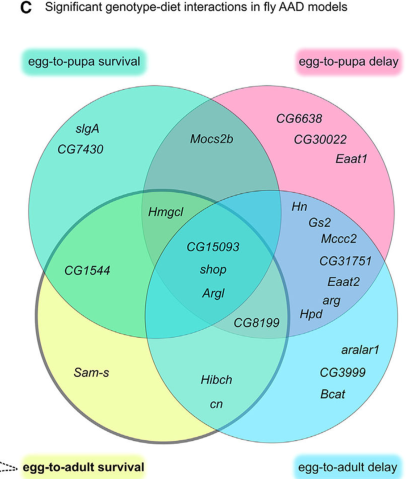

## Question

# Gene Research for Functional Annotation

## ⚠️ CRITICAL: Gene/Protein Identification Context

**BEFORE YOU BEGIN RESEARCH:** You MUST verify you are researching the CORRECT gene/protein. Gene symbols can be ambiguous, especially for less well-characterized genes from non-model organisms.

### Target Gene/Protein Identity (from UniProt):
- **UniProt Accession:** Q9VLG9
- **Protein Description:** SubName: Full=Argininosuccinate lyase, isoform B {ECO:0000313|EMBL:AAO41174.2}; SubName: Full=Argininosuccinate lyase, isoform C {ECO:0000313|EMBL:AAF52721.3}; SubName: Full=Argininosuccinate lyase, isoform D {ECO:0000313|EMBL:AHN54282.1}; EC=4.3.2.1 {ECO:0000313|EMBL:AAF52721.3, ECO:0000313|EMBL:AAO41174.2};
- **Gene Information:** Name=Argl {ECO:0000313|EMBL:AAF52721.3, ECO:0000313|FlyBase:FBgn0032076}; Synonyms=BEST:GH06087 {ECO:0000313|EMBL:AAF52721.3}, CG33085 {ECO:0000313|EMBL:AAF52721.3}, Dmel\CG9510 {ECO:0000313|EMBL:AAF52721.3}, gh06087 {ECO:0000313|EMBL:AAF52721.3}; ORFNames=CG9510 {ECO:0000313|EMBL:AAF52721.3, ECO:0000313|FlyBase:FBgn0032076}, Dmel_CG9510 {ECO:0000313|EMBL:AAF52721.3};
- **Organism (full):** Drosophila melanogaster (Fruit fly).
- **Protein Family:** Belongs to the lyase 1 family. Argininosuccinate lyase
- **Key Domains:** Arg_succ_lyase_C. (IPR029419); Argininosuccinate_lyase. (IPR009049); Fumarase/histidase_N. (IPR024083); Fumarate_lyase_CS. (IPR020557); Fumarate_lyase_fam. (IPR000362)

### MANDATORY VERIFICATION STEPS:

1. **Check if the gene symbol "Argl" matches the protein description above**
2. **Verify the organism is correct:** Drosophila melanogaster (Fruit fly).
3. **Check if protein family/domains align with what you find in literature**
4. **If you find literature for a DIFFERENT gene with the same or similar symbol, STOP**

### If Gene Symbol is Ambiguous or You Cannot Find Relevant Literature:

**DO NOT PROCEED WITH RESEARCH ON A DIFFERENT GENE.** Instead:
- State clearly: "The gene symbol 'Argl' is ambiguous or literature is limited for this specific protein"
- Explain what you found (e.g., "Found extensive literature on a different gene with the same symbol in a different organism")
- Describe the protein based ONLY on the UniProt information provided above
- Suggest that the protein function can be inferred from domain/family information

### Research Target:

Please provide a comprehensive research report on the gene **Argl** (gene ID: Argl, UniProt: Q9VLG9) in DROME.

The research report should be a detailed narrative explaining the function, biological processes, and localization of the gene product. Citations should be given for all claims.

You should prioritize authoritative reviews and primary scientific literature when conducting research. You can supplement
this with annotations you find in gene/protein databases, but these can be outdated or inaccurate.

We are specifically interested in the primary function of the gene - for enzymes, what reaction is catalyzed, and what is the substrate specificity? For transporters, what is the substrate? For structural proteins or adapters, what is the broader structural role? For signaling molecules, what is the role in the pathway.

We are interested in where in or outside the cell the gene product carries out its function.

We are also interested in the signaling or biochemical pathways in which the gene functions. We are less interested in broad pleiotropic effects, except where these elucidate the precise role.

Include evidence where possible. We are interested in both experimental evidence as well as inference from structure, evolution, or bioinformatic analysis. Precise studies should be prioritized over high-throughput, where available.

## Output

Question: You are an expert researcher providing comprehensive, well-cited information.

Provide detailed information focusing on:
1. Key concepts and definitions with current understanding
2. Recent developments and latest research (prioritize 2023-2024 sources)
3. Current applications and real-world implementations
4. Expert opinions and analysis from authoritative sources
5. Relevant statistics and data from recent studies

Format as a comprehensive research report with proper citations. Include URLs and publication dates where available.
Always prioritize recent, authoritative sources and provide specific citations for all major claims.

# Gene Research for Functional Annotation

## ⚠️ CRITICAL: Gene/Protein Identification Context

**BEFORE YOU BEGIN RESEARCH:** You MUST verify you are researching the CORRECT gene/protein. Gene symbols can be ambiguous, especially for less well-characterized genes from non-model organisms.

### Target Gene/Protein Identity (from UniProt):
- **UniProt Accession:** Q9VLG9
- **Protein Description:** SubName: Full=Argininosuccinate lyase, isoform B {ECO:0000313|EMBL:AAO41174.2}; SubName: Full=Argininosuccinate lyase, isoform C {ECO:0000313|EMBL:AAF52721.3}; SubName: Full=Argininosuccinate lyase, isoform D {ECO:0000313|EMBL:AHN54282.1}; EC=4.3.2.1 {ECO:0000313|EMBL:AAF52721.3, ECO:0000313|EMBL:AAO41174.2};
- **Gene Information:** Name=Argl {ECO:0000313|EMBL:AAF52721.3, ECO:0000313|FlyBase:FBgn0032076}; Synonyms=BEST:GH06087 {ECO:0000313|EMBL:AAF52721.3}, CG33085 {ECO:0000313|EMBL:AAF52721.3}, Dmel\CG9510 {ECO:0000313|EMBL:AAF52721.3}, gh06087 {ECO:0000313|EMBL:AAF52721.3}; ORFNames=CG9510 {ECO:0000313|EMBL:AAF52721.3, ECO:0000313|FlyBase:FBgn0032076}, Dmel_CG9510 {ECO:0000313|EMBL:AAF52721.3};
- **Organism (full):** Drosophila melanogaster (Fruit fly).
- **Protein Family:** Belongs to the lyase 1 family. Argininosuccinate lyase
- **Key Domains:** Arg_succ_lyase_C. (IPR029419); Argininosuccinate_lyase. (IPR009049); Fumarase/histidase_N. (IPR024083); Fumarate_lyase_CS. (IPR020557); Fumarate_lyase_fam. (IPR000362)

### MANDATORY VERIFICATION STEPS:

1. **Check if the gene symbol "Argl" matches the protein description above**
2. **Verify the organism is correct:** Drosophila melanogaster (Fruit fly).
3. **Check if protein family/domains align with what you find in literature**
4. **If you find literature for a DIFFERENT gene with the same or similar symbol, STOP**

### If Gene Symbol is Ambiguous or You Cannot Find Relevant Literature:

**DO NOT PROCEED WITH RESEARCH ON A DIFFERENT GENE.** Instead:
- State clearly: "The gene symbol 'Argl' is ambiguous or literature is limited for this specific protein"
- Explain what you found (e.g., "Found extensive literature on a different gene with the same symbol in a different organism")
- Describe the protein based ONLY on the UniProt information provided above
- Suggest that the protein function can be inferred from domain/family information

### Research Target:

Please provide a comprehensive research report on the gene **Argl** (gene ID: Argl, UniProt: Q9VLG9) in DROME.

The research report should be a detailed narrative explaining the function, biological processes, and localization of the gene product. Citations should be given for all claims.

You should prioritize authoritative reviews and primary scientific literature when conducting research. You can supplement
this with annotations you find in gene/protein databases, but these can be outdated or inaccurate.

We are specifically interested in the primary function of the gene - for enzymes, what reaction is catalyzed, and what is the substrate specificity? For transporters, what is the substrate? For structural proteins or adapters, what is the broader structural role? For signaling molecules, what is the role in the pathway.

We are interested in where in or outside the cell the gene product carries out its function.

We are also interested in the signaling or biochemical pathways in which the gene functions. We are less interested in broad pleiotropic effects, except where these elucidate the precise role.

Include evidence where possible. We are interested in both experimental evidence as well as inference from structure, evolution, or bioinformatic analysis. Precise studies should be prioritized over high-throughput, where available.

# Functional annotation of *Drosophila melanogaster* Argl (Q9VLG9)

## Identity and principal conclusion

**The target is the fruit-fly gene *Argl* (CG9510; FlyBase FBgn0032076), not an arginase or an argininosuccinate lyase from another organism.** A fly proteomic record explicitly pairs *Argl* with UniProt Q9VLG9, while a primary fly study identifies CG9510 as a homolog of human argininosuccinate lyase (ASL). The supplied lyase-family and fumarase/histidase-related domain annotations are consistent with that identification. Literature for human ASL or mosquito ASL expressed in flies must not be treated as direct evidence about endogenous fly Argl. (forte2024theimpactof pages 46-48, heinrichsen2014metabolicandtranscriptional pages 6-7, paul2019structuralstudieson pages 1-2)

**Best-supported molecular annotation:** Argl is an ASL-family enzyme predicted to catalyze **L-argininosuccinate ⇌ L-arginine + fumarate** (EC 4.3.2.1). L-argininosuccinate is the specifically supported substrate for the canonical ASL reaction; the reaction is reversible. Structural work on a purified bacterial ASL shows a tetramer with active sites assembled from multiple subunits, providing a mechanistic basis for the family assignment. However, the retrieved fly studies did **not** purify Q9VLG9 or directly measure its substrate specificity, catalytic rate, or oligomeric state. Thus, the exact fly reaction is a strong homology-based assignment supported by fly genetics, **not** a fly-specific enzymatic measurement. (paul2019structuralstudieson pages 1-2, heinrichsen2014metabolicandtranscriptional pages 6-7, yu2000intrageniccomplementationand pages 1-3)

The evidence hierarchy below separates experimental observations in flies from conclusions transferred from other ASL proteins. (heinrichsen2014metabolicandtranscriptional pages 4-6, martelli2024identifyingpotentialdietary pages 3-5, paul2019structuralstudieson pages 1-2, martins2025thelossof pages 2-4)

| Assertion | Evidence class and source | Key numerical result | Limitation |
|---|---|---:|---|
| Q9VLG9 is *D. melanogaster* Argl/CG9510, an ASL-family protein | Direct fly annotation/proteomic identification: Q9VLG9 is paired with Argl and argininosuccinate-lyase activity (forte2024theimpactof pages 46-48) | — | This identification does not itself demonstrate catalysis with purified fly protein. |
| Predicted primary reaction: argininosuccinate ⇌ L-arginine + fumarate | Cross-species biochemical/structural inference: ASL homologs catalyze this reversible reaction; conserved ASLs are tetramers with multichain active sites (paul2019structuralstudieson pages 1-2, yu2000intrageniccomplementationand pages 1-3) | MtASL structures: 2.2 Å apo and 2.7 Å liganded (paul2019structuralstudieson pages 1-2) | No purified-enzyme kinetics or substrate-specificity assay was found for Q9VLG9 itself. |
| Argl contributes to carbon–nitrogen metabolic homeostasis | Direct fly genetics and whole-body metabolomics: CG9510 knockdown increased fatty acids, aspartate and uric acid and decreased urea, α-ketoglutarate and citrate (heinrichsen2014metabolicandtranscriptional pages 6-7) | Metabolite directions reported, but no reliable gene-specific fold changes | Whole-body metabolomics cannot establish tissue or organelle of action; nitric oxide was not measured. |
| High-fat diet suppresses Argl, while restored expression reverses key phenotypes | Direct fly perturbation/rescue: HFD reduced CG9510; RNAi or mutation increased triglycerides and cold sensitivity, whereas transgenic expression restored RD-like values (heinrichsen2014metabolicandtranscriptional pages 4-6, heinrichsen2014metabolicandtranscriptional pages 7-9) | HFD: 2.3-fold lower expression; transgene: nearly 10-fold higher; TG: 47.6 ± 13.2 to 77.9 ± 8.6 μg/mg on HFD (heinrichsen2014metabolicandtranscriptional pages 4-6) | Phenotypes support physiological necessity and sufficiency, not direct catalytic chemistry. |
| Reduced Argl affects lifespan and cardiac function | Direct fly evidence: RNAi shortened lifespan, and CG9510-PBac reduced diastolic diameter and increased heart abnormalities (heinrichsen2014metabolicandtranscriptional pages 6-7, heinrichsen2014metabolicandtranscriptional pages 7-9) | Lifespan n=40/group, p<0.0001; heart n=30 mutant versus n=33 control, p<0.0001 for diameter and p<0.001 for defects | These are downstream systemic phenotypes and do not identify the immediate metabolite responsible. |
| Argl loss-of-function is diet sensitive | Direct 2024 fly evidence: Argl was one of three models with significant genotype–diet interactions in all four developmental/survival traits (martelli2024identifyingpotentialdietary pages 3-5, martelli2024identifyingpotentialdietary media 99e84b37) | 4/4 traits significant; overall, 25/35 models had a diet interaction | Argl-specific effect sizes and a rescuing nutrient were not reported here; the cysteine-rescue experiments concerned *shop*, not Argl. |
| Argl is most plausibly intracellular and cytosolic | Cross-species localization inference: mammalian ASL is cytosolic, and ASS/ASL support cytosolic arginine production (yu2000intrageniccomplementationand pages 1-3) | — | Endogenous fly Argl localization has not been directly demonstrated; “cytosolic” should remain provisional. |
| Fly Argl is not evidence for a complete insect urea cycle | Comparative insect genomics: 150 species across 11 orders lacked a complete canonical cycle; functional OTC was absent, while ASS/ASL retention was lineage dependent (martins2025thelossof pages 1-2, martins2025thelossof pages 2-4) | 92 species retained ASS+ASL; 12 ASS only; 3 ASL only; 43 neither | This is comparative-genomic context, not a direct assay of *D. melanogaster* flux; fly Argl may instead support citrulline-to-arginine recycling or an ASL-related shunt. |

*Table: Evidence supporting the functional annotation of Drosophila Argl/CG9510/Q9VLG9, with direct fly results separated from cross-species biochemical and localization inferences. The table also identifies key quantitative findings and unresolved limitations.*

## Biochemical pathway and site of action

Argininosuccinate synthase generates argininosuccinate from citrulline and aspartate; Argl is predicted to perform the subsequent cleavage, yielding arginine and fumarate. In flies, knocking down **CG1315**, the gene identified as homologous to the upstream synthase, also reduced cold tolerance and increased triglycerides. This independent pathway perturbation supports a role for CG9510 in argininosuccinate-linked carbon–nitrogen metabolism, although neither experiment directly measures flux through the Argl reaction. Fumarate formation connects the reaction to central-carbon metabolism; arginine production offers a route for recovering arginine from citrulline. (heinrichsen2014metabolicandtranscriptional pages 6-7, martins2025thelossof pages 2-4)

**This should not be called an intact fly urea cycle.** A comparative-genomic analysis published in 2025 examined 150 insect species across 11 orders and concluded that the analyzed insects lack the enzymes needed for a complete canonical cycle, including functional ornithine carbamoyltransferase. Across those species, 92 retained both argininosuccinate synthase and ASL homologs, whereas 12 retained only the synthase, three only ASL, and 43 neither. The defensible interpretation for fly Argl is participation in the *argininosuccinate-to-arginine/fumarate step* and potentially citrulline-to-arginine recycling—not demonstration that flies synthesize arginine de novo through the entire mammalian-style urea cycle. (martins2025thelossof pages 1-2, martins2025thelossof pages 2-4)

Arginine can supply nitric-oxide synthase, which converts it to citrulline and nitric oxide. An ASS–ASL recycling pathway could therefore replenish arginine used for NO signaling; this is a **pathway-level possibility**, not an Argl-specific signaling result. The fly CG9510 study did not measure nitric oxide, demonstrate an Argl–NOS interaction, or establish that Argl controls NO signaling in a particular tissue. (yu2000intrageniccomplementationand pages 1-3, heinrichsen2014metabolicandtranscriptional pages 6-7, martins2025thelossof pages 7-8)

**Localization:** The predicted reaction is intracellular, and a **cytosolic** location is the best-supported working hypothesis because characterized mammalian ASL and its upstream synthase operate in the cytosol. The cited fly studies tested tissue-specific knockdown—including neurons, glia, muscle, fat body and Malpighian tubules—but did not image endogenous Argl or measure its subcellular fractionation. Tissue-specific effects demonstrate sites where gene function matters, **not** protein localization; a fly-specific cytosolic assignment remains unverified. No extracellular function is established by the retrieved studies. (yu2000intrageniccomplementationand pages 1-3, heinrichsen2014metabolicandtranscriptional pages 4-6, heinrichsen2014metabolicandtranscriptional pages 6-7)

## Direct evidence in flies

In the primary high-fat-diet study by **Heinrichsen et al.** (*Molecular Metabolism*, published online 2013; February 2014 issue), high-fat feeding lowered CG9510 expression **2.3-fold**. Ubiquitous knockdown with independent RNAi lines and disruption of the CG9510-containing transcriptional unit increased stored triglycerides and sensitivity to cold. Importantly, CG9510 is transcribed together with neighboring **CG9515**, so a disruption of the shared unit alone would not uniquely implicate CG9510; expressing a CG9510 transgene rescued the mutant’s triglyceride and cold-tolerance phenotypes, strengthening the gene-specific attribution. Ubiquitous transgene expression reached nearly **10-fold** control expression and restored high-fat-fed flies toward regular-diet cold tolerance and triglyceride levels. In the diet comparison, mean triglycerides rose from **47.6 ± 13.2 to 77.9 ± 8.6 μg/mg body weight**; that comparison describes the diet effect, **not** an Argl-specific triglyceride effect size. [Article and publication details](https://doi.org/10.1016/j.molmet.2013.10.003). (heinrichsen2014metabolicandtranscriptional pages 4-6, heinrichsen2014metabolicandtranscriptional pages 7-9)

The same study found that reducing CG9510 increased whole-body fatty-acid abundance, aspartate and uric acid while decreasing urea, citrate and α-ketoglutarate; pyruvate and lactate were unchanged. These are **whole-animal metabolite abundances**, not measured Argl substrates/products or isotope-traced fluxes. They support the authors’ interpretation that CG9510 influences carbon–nitrogen metabolic balance, but they do not show precisely how the reaction changes each metabolite. Knockdown in several tissues affected cold tolerance and triglycerides, with particularly strong effects reported for dopaminergic/serotonergic neuronal knockdown; this argues against assuming that Argl matters only in a single organ. (heinrichsen2014metabolicandtranscriptional pages 6-7, heinrichsen2014metabolicandtranscriptional pages 4-6)

Additional downstream phenotypes were shorter lifespan after ubiquitous RNAi (**n = 40 per group; p < 0.0001** versus regular-diet controls), reduced diastolic heart diameter in CG9510-PBac flies (**n = 30** mutants versus **n = 33** regular-diet controls; **p < 0.0001**), and more observed cardiac defects (**p < 0.001** versus controls). These findings establish physiological relevance but do not identify the immediate biochemical cause of the heart or lifespan effects. (heinrichsen2014metabolicandtranscriptional pages 7-9)

## Recent research and applications

In **February 2024**, **Martelli et al.** included an *Argl* loss-of-function model in a 35-model *Drosophila* screen of inherited amino-acid metabolic disorders. Comparing standard sugar–yeast food with a chemically defined diet, they found *Argl* was **one of three models** with significant genotype-by-diet interactions in **all four** measured developmental and survival traits; **25 of 35 models (71%)** had at least one significant diet interaction. Figure 1C independently shows *Argl* in the intersection of those four traits. These results make Argl a practical fly model for studying diet–genotype interactions, **not** an established treatment: the paper does not identify an Argl-specific rescuing nutrient or establish the biochemical basis of its diet response. Its detailed cysteine-restriction rescue experiments were performed on the distinct gene *shop*, not *Argl*. [Martelli et al., *Cell Reports* 43, 113861 (2024)](https://doi.org/10.1016/j.celrep.2024.113861). (martelli2024identifyingpotentialdietary pages 3-5, martelli2024identifyingpotentialdietary media 99e84b37, martelli2024identifyingpotentialdietary pages 5-6)

The **2025** insect-genomics analysis sharpens interpretation of this 2024 disease model: modeling human ASL deficiency with fly Argl can test conserved enzyme-associated metabolism and nutritional sensitivity, but cannot assume that flies possess the complete human hepatic urea cycle. [Martins et al., *Insect Molecular Biology* 34, 632–644 (2025)](https://doi.org/10.1111/imb.12989). (martins2025thelossof pages 1-2, martins2025thelossof pages 2-4, martelli2024identifyingpotentialdietary pages 3-5)

**Overall assessment:** Gene-specific fly knockdown, transgenic rescue, pathway-adjacent perturbation and metabolomics provide substantial evidence that Argl supports argininosuccinate-associated arginine and carbon–nitrogen metabolism. The clearest unresolved questions are direct biochemical confirmation of Q9VLG9’s catalytic activity and substrate range, endogenous subcellular localization, and whether its arginine product measurably feeds nitric-oxide synthesis in flies. (heinrichsen2014metabolicandtranscriptional pages 4-6, heinrichsen2014metabolicandtranscriptional pages 6-7, paul2019structuralstudieson pages 1-2, yu2000intrageniccomplementationand pages 1-3)

References

1. (forte2024theimpactof pages 46-48): M FORTE. The impact of gcn2 on lifespan and proteomic changes in drosophila under phenylalanine deprivation. Unknown journal, 2024.

2. (heinrichsen2014metabolicandtranscriptional pages 6-7): Erilynn T. Heinrichsen, Hui Zhang, James E. Robinson, John Ngo, Soda Diop, Rolf Bodmer, William J. Joiner, Christian M. Metallo, and Gabriel G. Haddad. Metabolic and transcriptional response to a high-fat diet in drosophila melanogaster. Molecular Metabolism, 3:42-54, Feb 2014. URL: https://doi.org/10.1016/j.molmet.2013.10.003, doi:10.1016/j.molmet.2013.10.003. This article has 127 citations and is from a domain leading peer-reviewed journal.

3. (paul2019structuralstudieson pages 1-2): Anju Paul, Archita Mishra, Avadhesha Surolia, and Mamannamana Vijayan. Structural studies on m. tuberculosis argininosuccinate lyase and its liganded complex: insights into catalytic mechanism. IUBMB Life, 71:643-652, May 2019. URL: https://doi.org/10.1002/iub.2000, doi:10.1002/iub.2000. This article has 6 citations and is from a peer-reviewed journal.

4. (yu2000intrageniccomplementationand pages 1-3): B. Yu and P. L. Howell. Intragenic complementation and the structure and function of argininosuccinate lyase. Cellular and Molecular Life Sciences CMLS, 57:1637-1651, Oct 2000. URL: https://doi.org/10.1007/pl00000646, doi:10.1007/pl00000646. This article has 49 citations.

5. (heinrichsen2014metabolicandtranscriptional pages 4-6): Erilynn T. Heinrichsen, Hui Zhang, James E. Robinson, John Ngo, Soda Diop, Rolf Bodmer, William J. Joiner, Christian M. Metallo, and Gabriel G. Haddad. Metabolic and transcriptional response to a high-fat diet in drosophila melanogaster. Molecular Metabolism, 3:42-54, Feb 2014. URL: https://doi.org/10.1016/j.molmet.2013.10.003, doi:10.1016/j.molmet.2013.10.003. This article has 127 citations and is from a domain leading peer-reviewed journal.

6. (martelli2024identifyingpotentialdietary pages 3-5): Felipe Martelli, Jiayi Lin, Sarah Mele, Wendy Imlach, O. Kanca, Christopher K. Barlow, Jefferson Paril, Ralf B. Schittenhelm, John Christodoulou, Hugo J. Bellen, Matthew D. W. Piper, and Travis K. Johnson. Identifying potential dietary treatments for inherited metabolic disorders using drosophila nutrigenomics. Cell reports, 43:113861-113861, Feb 2024. URL: https://doi.org/10.1016/j.celrep.2024.113861, doi:10.1016/j.celrep.2024.113861. This article has 10 citations and is from a highest quality peer-reviewed journal.

7. (martins2025thelossof pages 2-4): Jessica Cristina Silva Martins, Héctor Antônio Assunção Romão, Carolina Kurotusch Canettieri, Amanda Caetano Cercilian, Patrícia Rasteiro Ordiale Oliveira, Clelia Ferreira, Walter R. Terra, and Renata de Oliveira Dias. The loss of the urea cycle and ornithine metabolism in different insect orders: an omics approach. Insect molecular biology, Mar 2025. URL: https://doi.org/10.1111/imb.12989, doi:10.1111/imb.12989. This article has 8 citations and is from a peer-reviewed journal.

8. (heinrichsen2014metabolicandtranscriptional pages 7-9): Erilynn T. Heinrichsen, Hui Zhang, James E. Robinson, John Ngo, Soda Diop, Rolf Bodmer, William J. Joiner, Christian M. Metallo, and Gabriel G. Haddad. Metabolic and transcriptional response to a high-fat diet in drosophila melanogaster. Molecular Metabolism, 3:42-54, Feb 2014. URL: https://doi.org/10.1016/j.molmet.2013.10.003, doi:10.1016/j.molmet.2013.10.003. This article has 127 citations and is from a domain leading peer-reviewed journal.

9. (martelli2024identifyingpotentialdietary media 99e84b37): Felipe Martelli, Jiayi Lin, Sarah Mele, Wendy Imlach, O. Kanca, Christopher K. Barlow, Jefferson Paril, Ralf B. Schittenhelm, John Christodoulou, Hugo J. Bellen, Matthew D. W. Piper, and Travis K. Johnson. Identifying potential dietary treatments for inherited metabolic disorders using drosophila nutrigenomics. Cell reports, 43:113861-113861, Feb 2024. URL: https://doi.org/10.1016/j.celrep.2024.113861, doi:10.1016/j.celrep.2024.113861. This article has 10 citations and is from a highest quality peer-reviewed journal.

10. (martins2025thelossof pages 1-2): Jessica Cristina Silva Martins, Héctor Antônio Assunção Romão, Carolina Kurotusch Canettieri, Amanda Caetano Cercilian, Patrícia Rasteiro Ordiale Oliveira, Clelia Ferreira, Walter R. Terra, and Renata de Oliveira Dias. The loss of the urea cycle and ornithine metabolism in different insect orders: an omics approach. Insect molecular biology, Mar 2025. URL: https://doi.org/10.1111/imb.12989, doi:10.1111/imb.12989. This article has 8 citations and is from a peer-reviewed journal.

11. (martins2025thelossof pages 7-8): Jessica Cristina Silva Martins, Héctor Antônio Assunção Romão, Carolina Kurotusch Canettieri, Amanda Caetano Cercilian, Patrícia Rasteiro Ordiale Oliveira, Clelia Ferreira, Walter R. Terra, and Renata de Oliveira Dias. The loss of the urea cycle and ornithine metabolism in different insect orders: an omics approach. Insect molecular biology, Mar 2025. URL: https://doi.org/10.1111/imb.12989, doi:10.1111/imb.12989. This article has 8 citations and is from a peer-reviewed journal.

12. (martelli2024identifyingpotentialdietary pages 5-6): Felipe Martelli, Jiayi Lin, Sarah Mele, Wendy Imlach, O. Kanca, Christopher K. Barlow, Jefferson Paril, Ralf B. Schittenhelm, John Christodoulou, Hugo J. Bellen, Matthew D. W. Piper, and Travis K. Johnson. Identifying potential dietary treatments for inherited metabolic disorders using drosophila nutrigenomics. Cell reports, 43:113861-113861, Feb 2024. URL: https://doi.org/10.1016/j.celrep.2024.113861, doi:10.1016/j.celrep.2024.113861. This article has 10 citations and is from a highest quality peer-reviewed journal.

## Artifacts

- [Edison artifact artifact-00](Argl-deep-research-falcon_artifacts/artifact-00.md)

## Citations

1. forte2024theimpactof pages 46-48
2. paul2019structuralstudieson pages 1-2
3. heinrichsen2014metabolicandtranscriptional pages 6-7
4. heinrichsen2014metabolicandtranscriptional pages 4-6
5. yu2000intrageniccomplementationand pages 1-3
6. heinrichsen2014metabolicandtranscriptional pages 7-9
7. martelli2024identifyingpotentialdietary pages 3-5
8. martins2025thelossof pages 2-4
9. martins2025thelossof pages 1-2
10. martins2025thelossof pages 7-8
11. martelli2024identifyingpotentialdietary pages 5-6
12. Article and publication details
13. Martelli et al., *Cell Reports* 43, 113861 (2024)
14. Martins et al., *Insect Molecular Biology* 34, 632–644 (2025)
15. https://doi.org/10.1016/j.molmet.2013.10.003
16. https://doi.org/10.1016/j.celrep.2024.113861
17. https://doi.org/10.1111/imb.12989
18. https://doi.org/10.1016/j.molmet.2013.10.003,
19. https://doi.org/10.1002/iub.2000,
20. https://doi.org/10.1007/pl00000646,
21. https://doi.org/10.1016/j.celrep.2024.113861,
22. https://doi.org/10.1111/imb.12989,