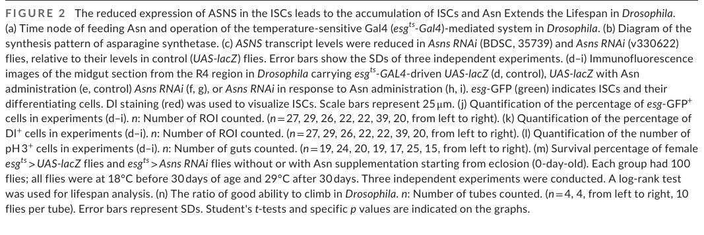

## Question

# Gene Research for Functional Annotation

## ⚠️ CRITICAL: Gene/Protein Identification Context

**BEFORE YOU BEGIN RESEARCH:** You MUST verify you are researching the CORRECT gene/protein. Gene symbols can be ambiguous, especially for less well-characterized genes from non-model organisms.

### Target Gene/Protein Identity (from UniProt):
- **UniProt Accession:** Q7KTW9
- **Protein Description:** RecName: Full=Asparagine synthetase [glutamine-hydrolyzing] {ECO:0000256|ARBA:ARBA00021389}; EC=6.3.5.4 {ECO:0000256|ARBA:ARBA00012737}; AltName: Full=Glutamine-dependent asparagine synthetase {ECO:0000256|ARBA:ARBA00030234};
- **Gene Information:** Name=AsnS {ECO:0000313|EMBL:AAS65085.1, ECO:0000313|FlyBase:FBgn0270926}; Synonyms=AS {ECO:0000313|EMBL:AAS65085.1}, asparagine-synthetase {ECO:0000313|EMBL:AAS65085.1}, Dmel\CG33486 {ECO:0000313|EMBL:AAS65085.1}; ORFNames=CG33486 {ECO:0000313|EMBL:AAS65085.1, ECO:0000313|FlyBase:FBgn0270926}, Dmel_CG33486 {ECO:0000313|EMBL:AAS65085.1};
- **Organism (full):** Drosophila melanogaster (Fruit fly).
- **Protein Family:** Not specified in UniProt
- **Key Domains:** Asn_synth_AEB. (IPR006426); Asn_synthase. (IPR001962); Asn_Synthetase. (IPR050795); AsnB_N. (IPR033738); GATase_2_dom. (IPR017932)

### MANDATORY VERIFICATION STEPS:

1. **Check if the gene symbol "AsnS" matches the protein description above**
2. **Verify the organism is correct:** Drosophila melanogaster (Fruit fly).
3. **Check if protein family/domains align with what you find in literature**
4. **If you find literature for a DIFFERENT gene with the same or similar symbol, STOP**

### If Gene Symbol is Ambiguous or You Cannot Find Relevant Literature:

**DO NOT PROCEED WITH RESEARCH ON A DIFFERENT GENE.** Instead:
- State clearly: "The gene symbol 'AsnS' is ambiguous or literature is limited for this specific protein"
- Explain what you found (e.g., "Found extensive literature on a different gene with the same symbol in a different organism")
- Describe the protein based ONLY on the UniProt information provided above
- Suggest that the protein function can be inferred from domain/family information

### Research Target:

Please provide a comprehensive research report on the gene **AsnS** (gene ID: Asns, UniProt: Q7KTW9) in DROME.

The research report should be a detailed narrative explaining the function, biological processes, and localization of the gene product. Citations should be given for all claims.

You should prioritize authoritative reviews and primary scientific literature when conducting research. You can supplement
this with annotations you find in gene/protein databases, but these can be outdated or inaccurate.

We are specifically interested in the primary function of the gene - for enzymes, what reaction is catalyzed, and what is the substrate specificity? For transporters, what is the substrate? For structural proteins or adapters, what is the broader structural role? For signaling molecules, what is the role in the pathway.

We are interested in where in or outside the cell the gene product carries out its function.

We are also interested in the signaling or biochemical pathways in which the gene functions. We are less interested in broad pleiotropic effects, except where these elucidate the precise role.

Include evidence where possible. We are interested in both experimental evidence as well as inference from structure, evolution, or bioinformatic analysis. Precise studies should be prioritized over high-throughput, where available.

## Output

Question: You are an expert researcher providing comprehensive, well-cited information.

Provide detailed information focusing on:
1. Key concepts and definitions with current understanding
2. Recent developments and latest research (prioritize 2023-2024 sources)
3. Current applications and real-world implementations
4. Expert opinions and analysis from authoritative sources
5. Relevant statistics and data from recent studies

Format as a comprehensive research report with proper citations. Include URLs and publication dates where available.
Always prioritize recent, authoritative sources and provide specific citations for all major claims.

# Gene Research for Functional Annotation

## ⚠️ CRITICAL: Gene/Protein Identification Context

**BEFORE YOU BEGIN RESEARCH:** You MUST verify you are researching the CORRECT gene/protein. Gene symbols can be ambiguous, especially for less well-characterized genes from non-model organisms.

### Target Gene/Protein Identity (from UniProt):
- **UniProt Accession:** Q7KTW9
- **Protein Description:** RecName: Full=Asparagine synthetase [glutamine-hydrolyzing] {ECO:0000256|ARBA:ARBA00021389}; EC=6.3.5.4 {ECO:0000256|ARBA:ARBA00012737}; AltName: Full=Glutamine-dependent asparagine synthetase {ECO:0000256|ARBA:ARBA00030234};
- **Gene Information:** Name=AsnS {ECO:0000313|EMBL:AAS65085.1, ECO:0000313|FlyBase:FBgn0270926}; Synonyms=AS {ECO:0000313|EMBL:AAS65085.1}, asparagine-synthetase {ECO:0000313|EMBL:AAS65085.1}, Dmel\CG33486 {ECO:0000313|EMBL:AAS65085.1}; ORFNames=CG33486 {ECO:0000313|EMBL:AAS65085.1, ECO:0000313|FlyBase:FBgn0270926}, Dmel_CG33486 {ECO:0000313|EMBL:AAS65085.1};
- **Organism (full):** Drosophila melanogaster (Fruit fly).
- **Protein Family:** Not specified in UniProt
- **Key Domains:** Asn_synth_AEB. (IPR006426); Asn_synthase. (IPR001962); Asn_Synthetase. (IPR050795); AsnB_N. (IPR033738); GATase_2_dom. (IPR017932)

### MANDATORY VERIFICATION STEPS:

1. **Check if the gene symbol "AsnS" matches the protein description above**
2. **Verify the organism is correct:** Drosophila melanogaster (Fruit fly).
3. **Check if protein family/domains align with what you find in literature**
4. **If you find literature for a DIFFERENT gene with the same or similar symbol, STOP**

### If Gene Symbol is Ambiguous or You Cannot Find Relevant Literature:

**DO NOT PROCEED WITH RESEARCH ON A DIFFERENT GENE.** Instead:
- State clearly: "The gene symbol 'AsnS' is ambiguous or literature is limited for this specific protein"
- Explain what you found (e.g., "Found extensive literature on a different gene with the same symbol in a different organism")
- Describe the protein based ONLY on the UniProt information provided above
- Suggest that the protein function can be inferred from domain/family information

### Research Target:

Please provide a comprehensive research report on the gene **AsnS** (gene ID: Asns, UniProt: Q7KTW9) in DROME.

The research report should be a detailed narrative explaining the function, biological processes, and localization of the gene product. Citations should be given for all claims.

You should prioritize authoritative reviews and primary scientific literature when conducting research. You can supplement
this with annotations you find in gene/protein databases, but these can be outdated or inaccurate.

We are specifically interested in the primary function of the gene - for enzymes, what reaction is catalyzed, and what is the substrate specificity? For transporters, what is the substrate? For structural proteins or adapters, what is the broader structural role? For signaling molecules, what is the role in the pathway.

We are interested in where in or outside the cell the gene product carries out its function.

We are also interested in the signaling or biochemical pathways in which the gene functions. We are less interested in broad pleiotropic effects, except where these elucidate the precise role.

Include evidence where possible. We are interested in both experimental evidence as well as inference from structure, evolution, or bioinformatic analysis. Precise studies should be prioritized over high-throughput, where available.

# Functional annotation of *Drosophila melanogaster* AsnS (Q7KTW9)

## Identity and principal function

**Identity verified.** The supplied UniProt record identifies Q7KTW9 as the fruit-fly gene **AsnS**, also designated **CG33486** (FlyBase FBgn0270926), and annotates its product as glutamine-dependent asparagine synthetase, EC 6.3.5.4. This identification is independently consistent with a published comparison that explicitly includes *Drosophila* Q7KTW9 among asparagine-synthetase homologs. Its supplied AsnB_N/GATase_2 and asparagine-synthetase domain annotations fit that assignment. It should **not** be confused with asparaginyl-tRNA synthetase: the latter attaches pre-existing asparagine to tRNA rather than producing free asparagine. The similar symbols used across organisms make the accession and species essential identifiers. (sacharow2018characterizationofa pages 1-3, zhu2024advancesinhuman pages 6-8)

The **predicted primary reaction** is:

**L-aspartate + L-glutamine + ATP + H₂O → L-asparagine + L-glutamate + AMP + pyrophosphate.**

In characterized homologs, an N-terminal glutaminase domain releases ammonia from glutamine; a C-terminal synthetase domain uses ATP to activate the *side-chain carboxyl group* of L-aspartate as β-aspartyl-AMP. Transfer of the ammonia-derived nitrogen then produces L-asparagine. The biochemical pathway is therefore **de novo asparagine biosynthesis**, linking aspartate, glutamine and cellular energy metabolism. Conservation of binding-pocket residues in Q7KTW9 supports this assignment, although one position corresponding to human ASNS Ile288 is valine in the fly sequence. These are strong mechanistic and sequence-based inferences **for Q7KTW9**, not measurements of purified fly enzyme activity. (sacharow2018characterizationofa pages 1-3, zhu2024advancesinhuman pages 6-8)

**Substrate-specificity qualification.** L-aspartate is the inferred carbon substrate and L-glutamine the inferred physiological amide-nitrogen donor. Free ammonia can substitute for glutamine in *human ASNS in vitro*; that observation does **not** establish ammonia use, relative efficiencies, kinetic constants or a preferred alternative substrate for fly Q7KTW9. No Q7KTW9-specific substrate panel or kinetic assay was identified. (sacharow2018characterizationofa pages 1-3, zhu2024advancesinhuman pages 8-10)

## Direct evidence in flies: biological processes and pathways

The strongest gene-specific evidence now comes from intestinal experiments published in **November 2025**. Luo and colleagues used temperature-controlled **esg-GAL4** to reduce *Asns* in esg-positive intestinal stem cells and progenitors. Two independent RNAi stocks, **BDSC 35739** and **VDRC v330622**, reduced *Asns* transcript; depletion lowered measured intestinal asparagine and caused an aging-like accumulation of intestinal stem/progenitor cells in young flies. Supplementing food with asparagine rescued the stem-cell accumulation, while *Asns* overexpression reduced age-associated overproliferation. Together, the genetic perturbation, metabolite measurement and product rescue make a compelling case that fly AsnS helps maintain the asparagine supply required for intestinal homeostasis; they do not replace a purified-enzyme assay. The source describes the overexpression construct as self-constructed but does not specify its protein-level activity. (luo2025asparaginepreventsintestinal pages 2-4, luo2025asparaginepreventsintestinal pages 4-6, luo2025asparaginepreventsintestinal pages 14-15, luo2025asparaginepreventsintestinal media 850d6804)

That study connects **asparagine availability to autophagy–lysosomal function**. AsnS depletion was associated with reduced autophagy-related signatures and lysosomal/autophagy-reporter readouts. Increasing autophagy through **Atg1 overexpression** or **spermidine** largely relieved the depletion-associated intestinal phenotype; conversely, depleting **Atg8a** prevented dietary asparagine from rescuing stem-cell accumulation. Dietary asparagine reduced phosphorylated ERK in aged intestinal cells, whereas AsnS depletion increased this MAPK readout. The authors therefore propose an asparagine–MAPK–autophagy route in this tissue, described as TOR-independent in their experimental model. These findings identify consequences **downstream of AsnS-generated asparagine**; they do not establish AsnS itself as a kinase, a direct MAPK-binding protein or a lysosomal enzyme. (luo2025asparaginepreventsintestinal pages 6-8, luo2025asparaginepreventsintestinal pages 8-10)

For scale and interpretation, flies were tested with **0.005, 0.05, 0.5 and 5 mM dietary asparagine**; **0.05 mM** gave the reported best response for aged intestinal-cell accumulation. Supplementation began around **day 26**, with aged intestines examined around **day 40**. Intestinal AsnS knockdown shortened lifespan, and dietary asparagine extended lifespan in the aging-fly experiments; importantly, dietary rescue of lifespan **in AsnS-knockdown flies was only a nonsignificant trend**, unlike the clear rescue of intestinal-cell accumulation. These feeding concentrations and age-dependent outcomes are intervention data, **not** Q7KTW9 enzyme kinetic parameters. (luo2025asparaginepreventsintestinal pages 2-4, luo2025asparaginepreventsintestinal pages 4-6, luo2025asparaginepreventsintestinal pages 10-14, luo2025asparaginepreventsintestinal pages 14-15, luo2025asparaginepreventsintestinal media 850d6804)

Earlier fly studies provide complementary, narrower evidence. In **May 2008**, CG33486 was an **upregulated transcript in abdominal tissue** of *logjam* p24-trafficking mutants, an ER-stress-associated expression finding without CG33486-specific functional manipulation. In **April 2021**, a dPerk-activation study reported AsnS transcript upregulation of **4.3-fold** and protein upregulation of **2.3-fold**. Thus AsnS is a measured component of a fly PERK-associated stress response, but neither expression experiment proves that its induction protects cells or that the protein resides in the ER. (boltz2008lossofp24 pages 4-5, popovic2021combinedtranscriptomicand pages 8-10)

A **November 2023 bioRxiv preprint, revised April 2024**, tested the human-ASNS fly ortholog with tissue-directed **AsnS RNAi (BDSC 35739)**. Pan-neuronal depletion significantly shortened lifespan in males and females; some behavioral effects were sex-specific, while muscle depletion did not produce a general motor impairment. The investigators described the AsnS phenotypes as relatively mild and noted possible incomplete RNAi or compensation by other synthetases. Because this report is a **non-peer-reviewed preprint**, its neuronal observations are less secure than the independently replicated intestinal RNAi and metabolite/rescue results. Human ASNS deficiency motivates that modeling work, but a human disease phenotype must not be attributed directly to the fly gene. (yamada2023aninvivo pages 1-5, yamada2023aninvivo pages 12-15, yamada2023aninvivo pages 8-12)

The following synthesis separates observations from annotation by inference:

| Proposition | Strongest evidence | Inference limit |
|---|---|---|
| **Identity and primary reaction:** Q7KTW9/CG33486 is a glutamine-dependent asparagine synthetase expected to catalyze L-aspartate + L-glutamine + ATP → L-asparagine + L-glutamate + AMP + PPi. | The supplied UniProt record assigns EC 6.3.5.4 and matching AsnB_N, GATase_2, and asparagine-synthetase domains. A 2018 comparison identifies Q7KTW9 as a *Drosophila* ASNS homolog with conserved substrate-pocket residues; 2024 human-ASNS biochemistry supports the two-domain glutaminase/synthetase mechanism and ATP-to-AMP chemistry (Sacharow et al., 2018; Zhu et al., 2024) (sacharow2018characterizationofa pages 1-3, zhu2024advancesinhuman pages 6-8). | **Strong homology-based annotation, not direct fly enzymology:** no purified-Q7KTW9 kinetic or substrate-specificity assay was identified. The reaction and preference for glutamine over free ammonia therefore remain inferred for this fly protein. |
| **ER-stress-associated expression:** CG33486 expression rises in a chronic p24-trafficking-stress model. | In abdominal tissue from *logjam* p24 mutants, CG33486 was among the upregulated genes in a microarray study; the authors identified it as an asparagine synthetase and related its induction to the unfolded-protein and ER-stress response (Boltz and Carney, 2008) (boltz2008lossofp24 pages 4-5). | Observational transcriptomics only: no CG33486 perturbation, metabolite measurement, protein assay, or causal protection experiment was performed. Stress responsiveness does not establish ER residence. |
| **PERK-response target:** AsnS is induced at both RNA and protein levels following dPerk activation. | dPerk overexpression increased fly AsnS transcript **4.3-fold** and protein **2.3-fold**, exceeding the study’s differential-expression threshold; transcriptome–proteome correlation across targets was *r* = 0.5 (Popovic et al., 2021) (popovic2021combinedtranscriptomicand pages 8-10). | This establishes association with PERK-driven stress signaling, not that AsnS causes protection or toxicity. Placement under an “ER proteins” table heading was not supported by localization microscopy or fractionation and is not proof of ER residence (popovic2021combinedtranscriptomicand pages 8-10). |
| **Neuronal requirement:** reducing AsnS can impair adult longevity and selected behaviors. | A 2023 bioRxiv preprint, revised in April 2024, used UAS-AsnS-RNAi stock **BDSC 35739**. Pan-neuronal knockdown significantly shortened male and female lifespan; male climbing and female open-field distance showed sex-specific effects. Muscle knockdown did not impair motor function (Yamada et al., 2023/2024) (yamada2023aninvivo pages 12-15, yamada2023aninvivo pages 8-12). | The study was not peer reviewed and used one RNAi reagent; knockdown efficiency was not established in the cited passages. The phenotypes provide no direct biochemical validation, and the authors noted possible incomplete depletion or paralog compensation. |
| **Direct intestinal function:** AsnS-generated asparagine supports intestinal stem-cell homeostasis and autophagy. | In a 2025 peer-reviewed study, esgts-GAL4-directed depletion with two independent lines—**BDSC 35739** and **VDRC v330622**—reduced Asns mRNA and intestinal asparagine, caused young flies to accumulate intestinal stem and progenitor cells, and shortened lifespan. Dietary asparagine rescued stem-cell accumulation; Atg1 overexpression or spermidine largely rescued the phenotype, whereas Atg8a depletion prevented dietary-asparagine rescue. Self-constructed UAS-Asns overexpression reduced age-associated stem-cell overproliferation (Luo et al., 2025) (luo2025asparaginepreventsintestinal pages 2-4, luo2025asparaginepreventsintestinal pages 4-6, luo2025asparaginepreventsintestinal pages 6-8, luo2025asparaginepreventsintestinal pages 8-10, luo2025asparaginepreventsintestinal pages 14-15). | This is strong genetic and metabolite-linked evidence for an AsnS-to-asparagine-to-autophagy axis in esg-positive intestinal cells, but not a purified-enzyme assay. Lifespan rescue of Asns-RNAi flies by dietary asparagine showed only a nonsignificant trend, and tissue-specific expression does not define subcellular localization (luo2025asparaginepreventsintestinal pages 10-14). |
| **Cellular compartment:** Q7KTW9 most likely acts in the cytosol, but its fly localization is unresolved. | Human ASNS is described as a cytoplasmic or cytosolic enzyme, consistent with soluble amino-acid biosynthesis; no direct evidence was found placing fly AsnS in the ER (Riaz et al., 2024; Zhu et al., 2024) (riaz2024insilicoapproaches pages 15-16, zhu2024advancesinhuman pages 8-10). | **Cross-species inference only:** no Q7KTW9-specific microscopy, fractionation, targeting-signal experiment, or definitive subcellular annotation was identified. Cytosolic localization is plausible but is not experimentally demonstrated in *Drosophila*. |

*Table: Evidence supporting the identity, biochemical role, stress regulation, physiological functions, and probable localization of Drosophila AsnS/Q7KTW9. The table separates direct fly findings from conclusions inferred through homologous ASNS proteins.*

## Where the protein acts

**Tissue is not subcellular localization.** The intestinal perturbations establish a functional requirement in esg-positive gut cells, while the neuronal RNAi results suggest a possible additional requirement in neurons. Neither experiment shows where within those cells Q7KTW9 operates. Characterized **human ASNS is described as cytoplasmic/cytosolic**, making cytosolic asparagine synthesis the most reasonable working hypothesis for fly AsnS. However, a fly-Q7KTW9-specific localization assay was not identified, so its precise compartment remains **unverified**. In particular, inclusion of fly AsnS under an “ER proteins” heading in the dPerk expression study must not be read as microscopy-based proof of ER-lumen or ER-membrane residence. No extracellular site of action has been demonstrated. (riaz2024insilicoapproaches pages 15-16, zhu2024advancesinhuman pages 8-10, popovic2021combinedtranscriptomicand pages 8-10)

## Recent mechanistic research and practical use

A **June 2024** review of human glutamine-hydrolyzing synthetases describes ASNS as a two-active-site enzyme coupling glutamine hydrolysis to ATP-dependent aspartate amidation. A **December 2024** *Nature Communications* study combined human-ASNS cryo-EM variability analysis, simulations and an **Arg142→Ile** substitution to investigate gating of an intramolecular ammonia-transfer route. Those developments refine the mechanism expected of homologous enzymes; **they did not experimentally test the fly residue or Q7KTW9 protein**. (zhu2024advancesinhuman pages 6-8, coricello20243dvariabilityanalysis pages 2-4, coricello20243dvariabilityanalysis pages 4-6, coricello20243dvariabilityanalysis pages 1-2)

Current real-world research implementations are **Drosophila genetic and nutritional experiments**, especially the available RNAi lines and dietary-asparagine rescue for distinguishing product depletion from broader gene-perturbation effects. The 2025 study additionally provides intestinal RNA-sequencing data under **BioProject PRJNA1138061**. These are research tools, not evidence of an approved treatment or of a fly-specific clinical application. Human-ASNS and mouse-organoid results provide comparative context but cannot be used as direct measurements of fly-protein chemistry. (luo2025asparaginepreventsintestinal pages 14-15, luo2025asparaginepreventsintestinal pages 8-10, yamada2023aninvivo pages 12-15)

**Overall assessment:** Q7KTW9 is convincingly identified as fly **AsnS/CG33486**, with a strongly supported **glutamine-dependent asparagine-biosynthesis annotation** and direct genetic/metabolite evidence for its role in intestinal asparagine homeostasis. The most important outstanding annotation limits are the absence of a direct Q7KTW9 substrate/kinetic study and the absence of verified fly-protein subcellular localization. (sacharow2018characterizationofa pages 1-3, luo2025asparaginepreventsintestinal pages 2-4, riaz2024insilicoapproaches pages 15-16)

### Principal sources and dates

- Boltz KA and Carney GE. “Loss of p24 function in *Drosophila melanogaster* causes a stress response…” **May 2008**. https://doi.org/10.1186/1471-2164-9-212. (boltz2008lossofp24 pages 4-5)
- Sacharow SJ *et al.* “Characterization of a novel variant in siblings with Asparagine Synthetase Deficiency.” **March 2018**. https://doi.org/10.1016/j.ymgme.2017.12.433. (sacharow2018characterizationofa pages 1-3)
- Popovic R *et al.* “Combined Transcriptomic and Proteomic Analysis of Perk Toxicity Pathways.” **April 2021**. https://doi.org/10.3390/ijms22094598. (popovic2021combinedtranscriptomicand pages 8-10)
- Yamada S *et al.* “An in vivo platform to identify pathogenic loci.” **Preprint November 2023; examined version posted April 2, 2024**. https://doi.org/10.1101/2023.11.01.565153. (yamada2023aninvivo pages 1-5, yamada2023aninvivo pages 12-15)
- Zhu W *et al.* “Advances in human glutamine-hydrolyzing synthetases and their therapeutic potential.” **June 2024**. https://doi.org/10.3389/fchbi.2024.1410435. (zhu2024advancesinhuman pages 6-8)
- Coricello A *et al.* “3D variability analysis reveals a hidden conformational change controlling ammonia transport in human asparagine synthetase.” **December 2024**. https://doi.org/10.1038/s41467-024-54912-9. (coricello20243dvariabilityanalysis pages 1-2)
- Luo T *et al.* “Asparagine prevents intestinal stem cell aging via the autophagy-lysosomal pathway.” **November 2025**. https://doi.org/10.1111/acel.14423. (luo2025asparaginepreventsintestinal pages 2-4, luo2025asparaginepreventsintestinal pages 14-15)

References

1. (sacharow2018characterizationofa pages 1-3): Stephanie J. Sacharow, Elizabeth E. Dudenhausen, Carrie L. Lomelino, Lance Rodan, Christelle Moufawad El Achkar, Heather E. Olson, Casie A. Genetti, Pankaj B. Agrawal, Robert McKenna, and Michael S. Kilberg. Characterization of a novel variant in siblings with asparagine synthetase deficiency. Molecular Genetics and Metabolism, 123:317-325, Mar 2018. URL: https://doi.org/10.1016/j.ymgme.2017.12.433, doi:10.1016/j.ymgme.2017.12.433. This article has 41 citations and is from a peer-reviewed journal.

2. (zhu2024advancesinhuman pages 6-8): Wen Zhu, Alanya. J. Nardone, and Lucciano A. Pearce. Advances in human glutamine-hydrolyzing synthetases and their therapeutic potential. Frontiers in Chemical Biology, Jun 2024. URL: https://doi.org/10.3389/fchbi.2024.1410435, doi:10.3389/fchbi.2024.1410435. This article has 2 citations.

3. (zhu2024advancesinhuman pages 8-10): Wen Zhu, Alanya. J. Nardone, and Lucciano A. Pearce. Advances in human glutamine-hydrolyzing synthetases and their therapeutic potential. Frontiers in Chemical Biology, Jun 2024. URL: https://doi.org/10.3389/fchbi.2024.1410435, doi:10.3389/fchbi.2024.1410435. This article has 2 citations.

4. (luo2025asparaginepreventsintestinal pages 2-4): Ting Luo, Liusha Zhao, Chenxi Feng, Jinhua Yan, Yu Yuan, and Haiyang Chen. Asparagine prevents intestinal stem cell aging via the autophagy‐lysosomal pathway. Aging Cell, Nov 2025. URL: https://doi.org/10.1111/acel.14423, doi:10.1111/acel.14423. This article has 23 citations and is from a domain leading peer-reviewed journal.

5. (luo2025asparaginepreventsintestinal pages 4-6): Ting Luo, Liusha Zhao, Chenxi Feng, Jinhua Yan, Yu Yuan, and Haiyang Chen. Asparagine prevents intestinal stem cell aging via the autophagy‐lysosomal pathway. Aging Cell, Nov 2025. URL: https://doi.org/10.1111/acel.14423, doi:10.1111/acel.14423. This article has 23 citations and is from a domain leading peer-reviewed journal.

6. (luo2025asparaginepreventsintestinal pages 14-15): Ting Luo, Liusha Zhao, Chenxi Feng, Jinhua Yan, Yu Yuan, and Haiyang Chen. Asparagine prevents intestinal stem cell aging via the autophagy‐lysosomal pathway. Aging Cell, Nov 2025. URL: https://doi.org/10.1111/acel.14423, doi:10.1111/acel.14423. This article has 23 citations and is from a domain leading peer-reviewed journal.

7. (luo2025asparaginepreventsintestinal media 850d6804): Ting Luo, Liusha Zhao, Chenxi Feng, Jinhua Yan, Yu Yuan, and Haiyang Chen. Asparagine prevents intestinal stem cell aging via the autophagy‐lysosomal pathway. Aging Cell, Nov 2025. URL: https://doi.org/10.1111/acel.14423, doi:10.1111/acel.14423. This article has 23 citations and is from a domain leading peer-reviewed journal.

8. (luo2025asparaginepreventsintestinal pages 6-8): Ting Luo, Liusha Zhao, Chenxi Feng, Jinhua Yan, Yu Yuan, and Haiyang Chen. Asparagine prevents intestinal stem cell aging via the autophagy‐lysosomal pathway. Aging Cell, Nov 2025. URL: https://doi.org/10.1111/acel.14423, doi:10.1111/acel.14423. This article has 23 citations and is from a domain leading peer-reviewed journal.

9. (luo2025asparaginepreventsintestinal pages 8-10): Ting Luo, Liusha Zhao, Chenxi Feng, Jinhua Yan, Yu Yuan, and Haiyang Chen. Asparagine prevents intestinal stem cell aging via the autophagy‐lysosomal pathway. Aging Cell, Nov 2025. URL: https://doi.org/10.1111/acel.14423, doi:10.1111/acel.14423. This article has 23 citations and is from a domain leading peer-reviewed journal.

10. (luo2025asparaginepreventsintestinal pages 10-14): Ting Luo, Liusha Zhao, Chenxi Feng, Jinhua Yan, Yu Yuan, and Haiyang Chen. Asparagine prevents intestinal stem cell aging via the autophagy‐lysosomal pathway. Aging Cell, Nov 2025. URL: https://doi.org/10.1111/acel.14423, doi:10.1111/acel.14423. This article has 23 citations and is from a domain leading peer-reviewed journal.

11. (boltz2008lossofp24 pages 4-5): Kara A Boltz and Ginger E Carney. Loss of p24 function in drosophila melanogaster causes a stress response and increased levels of nf-κb-regulated gene products. BMC Genomics, 9:212-212, May 2008. URL: https://doi.org/10.1186/1471-2164-9-212, doi:10.1186/1471-2164-9-212. This article has 38 citations and is from a peer-reviewed journal.

12. (popovic2021combinedtranscriptomicand pages 8-10): Rebeka Popovic, Ivana Celardo, Yizhou Yu, Ana C. Costa, Samantha H. Y. Loh, and L. Miguel Martins. Combined transcriptomic and proteomic analysis of perk toxicity pathways. International Journal of Molecular Sciences, 22:4598, Apr 2021. URL: https://doi.org/10.3390/ijms22094598, doi:10.3390/ijms22094598. This article has 16 citations.

13. (yamada2023aninvivo pages 1-5): Shigehiro Yamada, Tiffany Ou, Sibani Nachadalingam, Shuo Yang, and Aaron N. Johnson. An in vivo platform to identify pathogenic loci. bioRxiv, Nov 2023. URL: https://doi.org/10.1101/2023.11.01.565153, doi:10.1101/2023.11.01.565153. This article has 0 citations.

14. (yamada2023aninvivo pages 12-15): Shigehiro Yamada, Tiffany Ou, Sibani Nachadalingam, Shuo Yang, and Aaron N. Johnson. An in vivo platform to identify pathogenic loci. bioRxiv, Nov 2023. URL: https://doi.org/10.1101/2023.11.01.565153, doi:10.1101/2023.11.01.565153. This article has 0 citations.

15. (yamada2023aninvivo pages 8-12): Shigehiro Yamada, Tiffany Ou, Sibani Nachadalingam, Shuo Yang, and Aaron N. Johnson. An in vivo platform to identify pathogenic loci. bioRxiv, Nov 2023. URL: https://doi.org/10.1101/2023.11.01.565153, doi:10.1101/2023.11.01.565153. This article has 0 citations.

16. (riaz2024insilicoapproaches pages 15-16): Anam Riaz, Afshan Kaleem, Roheena Abdullah, Mehwish Iqtedar, Daniel C. Hoessli, and Mahwish Aftab. In silico approaches to study the human asparagine synthetase: an insight of the interaction between the enzyme active sites and its substrates. PLOS ONE, 19:e0307448, Aug 2024. URL: https://doi.org/10.1371/journal.pone.0307448, doi:10.1371/journal.pone.0307448. This article has 10 citations and is from a peer-reviewed journal.

17. (coricello20243dvariabilityanalysis pages 2-4): Adriana Coricello, Alanya J. Nardone, Antonio Lupia, Carmen Gratteri, Matthijn Vos, Vincent Chaptal, Stefano Alcaro, Wen Zhu, Yuichiro Takagi, and Nigel G. J. Richards. 3d variability analysis reveals a hidden conformational change controlling ammonia transport in human asparagine synthetase. Nature Communications, Dec 2024. URL: https://doi.org/10.1038/s41467-024-54912-9, doi:10.1038/s41467-024-54912-9. This article has 9 citations and is from a highest quality peer-reviewed journal.

18. (coricello20243dvariabilityanalysis pages 4-6): Adriana Coricello, Alanya J. Nardone, Antonio Lupia, Carmen Gratteri, Matthijn Vos, Vincent Chaptal, Stefano Alcaro, Wen Zhu, Yuichiro Takagi, and Nigel G. J. Richards. 3d variability analysis reveals a hidden conformational change controlling ammonia transport in human asparagine synthetase. Nature Communications, Dec 2024. URL: https://doi.org/10.1038/s41467-024-54912-9, doi:10.1038/s41467-024-54912-9. This article has 9 citations and is from a highest quality peer-reviewed journal.

19. (coricello20243dvariabilityanalysis pages 1-2): Adriana Coricello, Alanya J. Nardone, Antonio Lupia, Carmen Gratteri, Matthijn Vos, Vincent Chaptal, Stefano Alcaro, Wen Zhu, Yuichiro Takagi, and Nigel G. J. Richards. 3d variability analysis reveals a hidden conformational change controlling ammonia transport in human asparagine synthetase. Nature Communications, Dec 2024. URL: https://doi.org/10.1038/s41467-024-54912-9, doi:10.1038/s41467-024-54912-9. This article has 9 citations and is from a highest quality peer-reviewed journal.

## Artifacts

- [Edison artifact artifact-00](Asns-deep-research-falcon_artifacts/artifact-00.md)

## Citations

1. popovic2021combinedtranscriptomicand pages 8-10
2. luo2025asparaginepreventsintestinal pages 10-14
3. sacharow2018characterizationofa pages 1-3
4. zhu2024advancesinhuman pages 6-8
5. zhu2024advancesinhuman pages 8-10
6. luo2025asparaginepreventsintestinal pages 2-4
7. luo2025asparaginepreventsintestinal pages 4-6
8. luo2025asparaginepreventsintestinal pages 14-15
9. luo2025asparaginepreventsintestinal pages 6-8
10. luo2025asparaginepreventsintestinal pages 8-10
11. yamada2023aninvivo pages 1-5
12. yamada2023aninvivo pages 12-15
13. yamada2023aninvivo pages 8-12
14. riaz2024insilicoapproaches pages 15-16
15. glutamine-hydrolyzing
16. https://doi.org/10.1186/1471-2164-9-212.
17. https://doi.org/10.1016/j.ymgme.2017.12.433.
18. https://doi.org/10.3390/ijms22094598.
19. https://doi.org/10.1101/2023.11.01.565153.
20. https://doi.org/10.3389/fchbi.2024.1410435.
21. https://doi.org/10.1038/s41467-024-54912-9.
22. https://doi.org/10.1111/acel.14423.
23. https://doi.org/10.1016/j.ymgme.2017.12.433,
24. https://doi.org/10.3389/fchbi.2024.1410435,
25. https://doi.org/10.1111/acel.14423,
26. https://doi.org/10.1186/1471-2164-9-212,
27. https://doi.org/10.3390/ijms22094598,
28. https://doi.org/10.1101/2023.11.01.565153,
29. https://doi.org/10.1371/journal.pone.0307448,
30. https://doi.org/10.1038/s41467-024-54912-9,