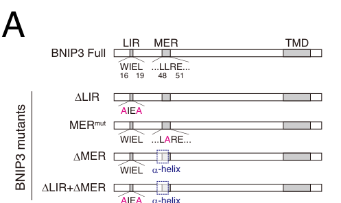

## Question

# Gene Research for Functional Annotation

## ⚠️ CRITICAL: Gene/Protein Identification Context

**BEFORE YOU BEGIN RESEARCH:** You MUST verify you are researching the CORRECT gene/protein. Gene symbols can be ambiguous, especially for less well-characterized genes from non-model organisms.

### Target Gene/Protein Identity (from UniProt):
- **UniProt Accession:** Q9VPD6
- **Protein Description:** SubName: Full=BNIP3, isoform A {ECO:0000313|EMBL:AAF51619.1};
- **Gene Information:** Name=BNIP3 {ECO:0000313|EMBL:AAF51619.1, ECO:0000313|FlyBase:FBgn0037007}; Synonyms=BBH1 {ECO:0000313|EMBL:AAF51619.1}, Bnip3 {ECO:0000313|EMBL:AAF51619.1}, Dmel\CG5059 {ECO:0000313|EMBL:AAF51619.1}; ORFNames=CG5059 {ECO:0000313|EMBL:AAF51619.1, ECO:0000313|FlyBase:FBgn0037007}, Dmel_CG5059 {ECO:0000313|EMBL:AAF51619.1};
- **Organism (full):** Drosophila melanogaster (Fruit fly).
- **Protein Family:** Belongs to the NIP3 family.
- **Key Domains:** BNIP3. (IPR010548); BNIP3 (PF06553)

### MANDATORY VERIFICATION STEPS:

1. **Check if the gene symbol "BNIP3" matches the protein description above**
2. **Verify the organism is correct:** Drosophila melanogaster (Fruit fly).
3. **Check if protein family/domains align with what you find in literature**
4. **If you find literature for a DIFFERENT gene with the same or similar symbol, STOP**

### If Gene Symbol is Ambiguous or You Cannot Find Relevant Literature:

**DO NOT PROCEED WITH RESEARCH ON A DIFFERENT GENE.** Instead:
- State clearly: "The gene symbol 'BNIP3' is ambiguous or literature is limited for this specific protein"
- Explain what you found (e.g., "Found extensive literature on a different gene with the same symbol in a different organism")
- Describe the protein based ONLY on the UniProt information provided above
- Suggest that the protein function can be inferred from domain/family information

### Research Target:

Please provide a comprehensive research report on the gene **BNIP3** (gene ID: BNIP3, UniProt: Q9VPD6) in DROME.

The research report should be a detailed narrative explaining the function, biological processes, and localization of the gene product. Citations should be given for all claims.

You should prioritize authoritative reviews and primary scientific literature when conducting research. You can supplement
this with annotations you find in gene/protein databases, but these can be outdated or inaccurate.

We are specifically interested in the primary function of the gene - for enzymes, what reaction is catalyzed, and what is the substrate specificity? For transporters, what is the substrate? For structural proteins or adapters, what is the broader structural role? For signaling molecules, what is the role in the pathway.

We are interested in where in or outside the cell the gene product carries out its function.

We are also interested in the signaling or biochemical pathways in which the gene functions. We are less interested in broad pleiotropic effects, except where these elucidate the precise role.

Include evidence where possible. We are interested in both experimental evidence as well as inference from structure, evolution, or bioinformatic analysis. Precise studies should be prioritized over high-throughput, where available.

## Output

Question: You are an expert researcher providing comprehensive, well-cited information.

Provide detailed information focusing on:
1. Key concepts and definitions with current understanding
2. Recent developments and latest research (prioritize 2023-2024 sources)
3. Current applications and real-world implementations
4. Expert opinions and analysis from authoritative sources
5. Relevant statistics and data from recent studies

Format as a comprehensive research report with proper citations. Include URLs and publication dates where available.
Always prioritize recent, authoritative sources and provide specific citations for all major claims.

# Gene Research for Functional Annotation

## ⚠️ CRITICAL: Gene/Protein Identification Context

**BEFORE YOU BEGIN RESEARCH:** You MUST verify you are researching the CORRECT gene/protein. Gene symbols can be ambiguous, especially for less well-characterized genes from non-model organisms.

### Target Gene/Protein Identity (from UniProt):
- **UniProt Accession:** Q9VPD6
- **Protein Description:** SubName: Full=BNIP3, isoform A {ECO:0000313|EMBL:AAF51619.1};
- **Gene Information:** Name=BNIP3 {ECO:0000313|EMBL:AAF51619.1, ECO:0000313|FlyBase:FBgn0037007}; Synonyms=BBH1 {ECO:0000313|EMBL:AAF51619.1}, Bnip3 {ECO:0000313|EMBL:AAF51619.1}, Dmel\CG5059 {ECO:0000313|EMBL:AAF51619.1}; ORFNames=CG5059 {ECO:0000313|EMBL:AAF51619.1, ECO:0000313|FlyBase:FBgn0037007}, Dmel_CG5059 {ECO:0000313|EMBL:AAF51619.1};
- **Organism (full):** Drosophila melanogaster (Fruit fly).
- **Protein Family:** Belongs to the NIP3 family.
- **Key Domains:** BNIP3. (IPR010548); BNIP3 (PF06553)

### MANDATORY VERIFICATION STEPS:

1. **Check if the gene symbol "BNIP3" matches the protein description above**
2. **Verify the organism is correct:** Drosophila melanogaster (Fruit fly).
3. **Check if protein family/domains align with what you find in literature**
4. **If you find literature for a DIFFERENT gene with the same or similar symbol, STOP**

### If Gene Symbol is Ambiguous or You Cannot Find Relevant Literature:

**DO NOT PROCEED WITH RESEARCH ON A DIFFERENT GENE.** Instead:
- State clearly: "The gene symbol 'BNIP3' is ambiguous or literature is limited for this specific protein"
- Explain what you found (e.g., "Found extensive literature on a different gene with the same symbol in a different organism")
- Describe the protein based ONLY on the UniProt information provided above
- Suggest that the protein function can be inferred from domain/family information

### Research Target:

Please provide a comprehensive research report on the gene **BNIP3** (gene ID: BNIP3, UniProt: Q9VPD6) in DROME.

The research report should be a detailed narrative explaining the function, biological processes, and localization of the gene product. Citations should be given for all claims.

You should prioritize authoritative reviews and primary scientific literature when conducting research. You can supplement
this with annotations you find in gene/protein databases, but these can be outdated or inaccurate.

We are specifically interested in the primary function of the gene - for enzymes, what reaction is catalyzed, and what is the substrate specificity? For transporters, what is the substrate? For structural proteins or adapters, what is the broader structural role? For signaling molecules, what is the role in the pathway.

We are interested in where in or outside the cell the gene product carries out its function.

We are also interested in the signaling or biochemical pathways in which the gene functions. We are less interested in broad pleiotropic effects, except where these elucidate the precise role.

Include evidence where possible. We are interested in both experimental evidence as well as inference from structure, evolution, or bioinformatic analysis. Precise studies should be prioritized over high-throughput, where available.

# Functional annotation of *Drosophila melanogaster* BNIP3

## Identity and principal function

**The protein examined here is fly BNIP3, also called CG5059 or BBH1, rather than human BNIP3.** The supplied UniProt record identifies accession [Q9VPD6](https://www.uniprot.org/uniprotkb/Q9VPD6/entry) with FlyBase identifier [FBgn0037007](https://flybase.org/reports/FBgn0037007) as a *D. melanogaster* NIP3-family protein annotated with BNIP3-family domains (InterPro IPR010548; Pfam PF06553). Independent fly experiments explicitly identify BBH1 RNAi as targeting **CG5059**; a later study describes fly BNIP3 as the single fly ortholog of mammalian BNIP3 and BNIP3L/NIX. Thus, findings about either mammalian protein should not automatically be assigned to Q9VPD6. (sheel2020acheronlarp6isa pages 6-9, taoka2025transcriptionaldynamicsuncover pages 7-8)

**Best-supported primary annotation:** BNIP3 is an **outer-mitochondrial-membrane-associated receptor for selective autophagy of mitochondria (mitophagy)**. It is an adaptor, not a characterized enzyme or transporter: its relevant “cargo” is the mitochondrion, which it helps connect to autophagosome-forming machinery for eventual lysosomal degradation. Fly knockout, organelle-flux, ultrastructural, interaction, and rescue experiments support this assignment. Its effects on cell survival or death depend on developmental and tissue context; a universal pro-apoptotic role is not established. (taoka2025transcriptionaldynamicsuncover pages 7-8, taoka2025transcriptionaldynamicsuncover pages 9-11, wang2023pink1keap1and pages 5-6, fages2023pink1andbnip3 pages 14-17)

## Molecular mechanism and localization

The clearest localization evidence comes from the **2025 *eLife* study of remodeling dorsal internal oblique muscles (DIOMs)**. Its GFP-tagged BNIP3 constructs retain a C-terminal transmembrane domain and were shown to localize to the **outer mitochondrial membrane**. This places BNIP3 at the mitochondrial surface, where its cytosol-facing interaction regions can recruit autophagy proteins; the evidence does not imply secretion or an extracellular function. (taoka2025transcriptionaldynamicsuncover pages 9-11, taoka2025transcriptionaldynamicsuncover pages 11-12)

Two regions help specify that recruitment. A fly BNIP3 **LC3-interacting region (LIR)** contains residues **W16 and L19** and is associated with interaction with the autophagosome protein **Atg8a**. A separate **minimal essential region (MER), residues 42–53**, is implicated in recruitment of **Atg18a**. AlphaFold 3 modeling places this MER at an Atg18a-binding interface; in a co-immunoprecipitation experiment, deleting residues 42–53 weakened recovery of Atg18a with BNIP3. Modeling is predictive, and co-immunoprecipitation supports association rather than, by itself, proving direct purified-protein binding. The residue-level model and mutant phenotypes together make a stronger functional case than either alone. (taoka2025transcriptionaldynamicsuncover pages 1-2, taoka2025transcriptionaldynamicsuncover pages 7-8, taoka2025transcriptionaldynamicsuncover pages 11-12)

The **genetic rescue resolves an important nuance**. Full-length BNIP3 nearly eliminated the mitochondrial accumulation seen in BNIP3-null DIOMs. Mutation of the LIR residues **W16A/L19A alone** rescued comparably to full-length protein, whereas **L49A in the MER** or deletion of the MER did not; simultaneous LIR and MER disruption approximated the knockout phenotype. Thus, it would be inaccurate to claim that an intact LIR is individually indispensable in this muscle context. The results support a particularly important MER–Atg18a-associated route, with partially overlapping contributions from the two regions. Figure 5 reports **46–55 muscle samples per construct group**, rather than a measured biochemical affinity or a general effect size across tissues. (taoka2025transcriptionaldynamicsuncover pages 9-11, taoka2025transcriptionaldynamicsuncover pages 11-12, taoka2025transcriptionaldynamicsuncover media 267aa281)

## Biological processes: what fly experiments demonstrate

**Developmental muscle remodeling.** At **one day after puparium formation (APF)**, BNIP3 was the only surveyed known mitophagy regulator robustly expressed in DIOMs; expression alone is not proof of function, but subsequent perturbations were decisive. RNAi and deletion of all BNIP3 exons caused mitochondrial accumulation by **four days APF**. Electron microscopy found fewer mitochondria-containing autophagosomes when BNIP3 knockout was added to a **Stx17** fusion-blocking condition, while the *total* autophagosome count was not significantly changed. This distinguishes a role in mitochondrial capture/mitophagosome formation from a blanket requirement for autophagosome production. In independent readouts, BNIP3 knockout sharply reduced **Mito-QC** mitophagy flux at one day APF, and mitochondria labeled specifically during larval life persisted at four days APF instead of being cleared. Mitochondrial buildup was accompanied by defective myofibrillar remodeling; it is a phenotype of failed cargo clearance, not evidence that BNIP3 itself is a contractile structural protein. (taoka2025transcriptionaldynamicsuncover pages 7-8, taoka2025transcriptionaldynamicsuncover pages 9-11)

**Cargo specificity in intestinal development.** A **2023 *Cell* study** used somatic BNIP3 gRNA/Cas9 in metamorphosing fly enterocytes. BNIP3-deficient cells accumulated the mitochondrial marker **ATP5A**, whereas the ER marker **Sec61α–GFP decreased** and an ER-phagy reporter indicated *increased*, not impaired, ER clearance. In the same tissue, established ER-phagy receptors had different cargo-specific effects. These measurements independently support assigning BNIP3 primarily to **mitochondrial**, rather than ER, clearance; an increase in mitochondrial-marker abundance alone should not be mistaken for proof that BNIP3 directly binds that marker. (wang2023pink1keap1and pages 5-6)

**Mitochondrial-genome quality control.** In a **2019 *Nature* germline study**, mitochondrial fragmentation separated genomes before selection against deleterious mitochondrial DNA (mtDNA). The reported selection required **Atg1 and BNIP3**: reducing either decreased the proportion of wild-type mtDNA. This links BNIP3-dependent mitochondrial turnover to maternal mtDNA quality control, but does not establish that BNIP3 reads mtDNA sequence directly. The complete article text was unavailable for verification here, so no effect-size estimate or finer mechanistic claim is warranted. (fages2023pink1andbnip3 pages 14-17)

**Response to nutrient restriction.** A **2025 *Nature Communications* study** reported increased **CG5059/BNIP3** transcript and BNIP3–GFP signal in pre-checkpoint-starved larval prothoracic glands. Gland-specific BNIP3 RNAi **partially** reduced starvation-associated mitophagy, alongside contributions from Pink1/Parkin-associated mechanisms. Severe mitophagy in this setting coincided with disrupted mitochondrial homeostasis, steroidogenesis, and developmental progression. BNIP3 is therefore one contributor to this stress response, **not** an experimentally established sole cause of starvation-induced arrest or a steroidogenic enzyme. (zhang2025nutrientstatusalters pages 8-9, zhang2025nutrientstatusalters pages 7-8)

**Cell-death phenotypes are context-dependent.** In a **December 2023 bioRxiv preprint**, BNIP3 knockdown reduced basal mitophagy in larval wing discs and increased apoptosis caused by **Rbf1 overexpression**, assessed in part by cleaved Dcp-1 staining. Yet Rbf1-induced mitophagy itself was not detectably reduced by BNIP3 depletion in the tested assays, consistent with separate basal BNIP3-associated and induced PINK1-associated responses. BNIP3 knockdown also exacerbated an adult wing phenotype caused by **Debcl**, without significantly increasing Debcl-induced apoptosis measured in larval discs. These RNAi/overexpression results suggest a protective role in that model, but do not demonstrate a direct BNIP3–Debcl or other BCL-2-family physical interaction; **the work was a preprint**. (fages2023pink1andbnip3 pages 7-11, fages2023pink1andbnip3 pages 11-14, fages2023pink1andbnip3 pages 14-17)

A different, **2020 peer-reviewed** experiment found that muscle-directed RNAi against **CG5059/BBH1** allowed flies to eclose but prevented the normal disappearance of **ptilinal muscles by 36 hours after eclosion**, implicating this same fly gene in a specialized developmental muscle-death program. The authors’ proposed Acheron–BBH1 mitochondrial-death sequence drew partly on experiments in the *Manduca* moth and explicitly left direct mitochondrial pore formation and cytochrome-*c* release by fly CG5059 untested. This pro-death phenotype should neither be discarded nor generalized to all tissues, particularly given the independent mitophagy and pro-survival observations. (sheel2020acheronlarp6isa pages 6-9, sheel2020acheronlarp6isa pages 9-10)

The following study comparison separates direct observations from interpretive limits.

| Tissue / study date | Manipulation and assay | BNIP3-specific finding | Evidentiary caveat |
|---|---|---|---|
| Remodeling dorsal internal oblique muscle — [Taoka et al., eLife, 13 Aug 2025](https://doi.org/10.7554/eLife.105834) | Complete **BNIP3** knockout; TEM and Mito-QC flux assays; rescue with full-length or LIR/MER-mutant BNIP3 | BNIP3 is required for mitophagosome formation and larval-mitochondrial clearance. Full-length BNIP3 rescued mitochondrial accumulation; the MER/Atg18a-binding region was especially important, while LIR and MER had partly redundant contributions. (taoka2025transcriptionaldynamicsuncover pages 9-11, taoka2025transcriptionaldynamicsuncover pages 7-8, taoka2025transcriptionaldynamicsuncover pages 11-12) | Strong peer-reviewed in-vivo evidence, but derived mainly from one developmentally remodeling muscle type; wider physiological significance remains to be established. |
| Metamorphosing intestinal enterocytes — [Wang et al., Cell, 14 Sep 2023](https://doi.org/10.1016/j.cell.2023.08.008) | Somatic **BNIP3** gRNA/Cas9; mitochondrial ATP5A, ER Sec61α-GFP, and ER-phagy-flux measurements | BNIP3-deficient cells accumulated mitochondrial ATP5A but not ER cargo; ER-phagy instead increased. Thus, fly BNIP3 selectively supports mitochondrial rather than ER clearance in these cells. (wang2023pink1keap1and pages 5-6) | Establishes cargo specificity genetically, but does not itself resolve BNIP3's molecular contacts with Atg proteins. |
| Female germline / oogenesis — [Lieber et al., Nature, 15 May 2019](https://doi.org/10.1038/s41586-019-1213-4) | Reduced **BNIP3/CG5059** or Atg1 during heteroplasmic mtDNA selection; allele-specific mtDNA measurements | BNIP3 and Atg1 were required for efficient selection against deleterious mtDNA after mitochondrial fragmentation, linking mitochondrial turnover to germline genome quality control. (fages2023pink1andbnip3 pages 14-17) | The accessible evidence here is limited to the article abstract and later discussion; exact effect sizes and whether BNIP3 directly recognizes dysfunctional mitochondria could not be independently verified from full text. |
| Larval wing imaginal disc — [Fages et al., bioRxiv, 31 Dec 2023](https://doi.org/10.1101/2023.12.10.568976) | BNIP3 RNAi with Rbf1 or Debcl overexpression; Mito-Keima/Mito-QC, cleaved Dcp-1, TUNEL, and adult-wing phenotyping | BNIP3 depletion reduced basal mitophagy and enhanced Rbf1-induced apoptosis. It worsened Debcl-associated adult tissue loss without significantly increasing larval Debcl-induced apoptosis; Rbf1-induced mitophagy was BNIP3-independent. (fages2023pink1andbnip3 pages 7-11, fages2023pink1andbnip3 pages 11-14, fages2023pink1andbnip3 pages 14-17) | Unreviewed preprint using RNAi and overexpression; the proposed position upstream of Debcl and possible BCL-2-family interactions remain hypothetical. |
| Adult ecdysial/ptilinal muscle — [Sheel et al., Frontiers in Cell and Developmental Biology, 16 Jul 2020](https://doi.org/10.3389/fcell.2020.00622) | Muscle-directed RNAi against **CG5059**, termed BBH1; post-eclosion muscle-retention and eclosion assays | CG5059 depletion allowed normal eclosion but prevented the normal post-eclosion disappearance of ptilinal muscles, supporting a pro-death role in this specialized developmental context. (sheel2020acheronlarp6isa pages 6-9) | Direct mitochondrial insertion, pore formation, and cytochrome-c release by fly CG5059 were not tested; those mechanistic steps were inferred from sequence similarity and non-fly observations. (sheel2020acheronlarp6isa pages 9-10) |

*Table: Five key studies define tissue-specific roles of Drosophila CG5059/BNIP3 (Q9VPD6) in selective mitophagy, mitochondrial quality control, and developmental cell death. The table separates direct fly evidence from context-dependent or unverified mechanistic interpretations.*

## Evidence appraisal and annotation conclusion

An authoritative assessment accompanying the **2025 version of record** called the BNIP3–ATG18-associated muscle-mitophagy pathway compelling *in vivo* evidence, while noting that its wider physiological significance still needs investigation. This accurately reflects the current balance: **mitochondrial localization, selective cargo recruitment, and developmental mitochondrial clearance are strongly supported for fly Q9VPD6**; effects on apoptosis are demonstrated only in particular experimental contexts, and direct mitochondrial permeabilization, a fly-specific BH3-mediated interaction, or a universal requirement for PINK1/Parkin have **not** been established for this protein. Mammalian BNIP3 or NIX literature is useful for evolutionary comparison, not as substitute evidence for fly CG5059. (taoka2025transcriptionaldynamicsuncover pages 1-2, taoka2025transcriptionaldynamicsuncover pages 7-8, wang2023pink1keap1and pages 5-6, fages2023pink1andbnip3 pages 14-17, sheel2020acheronlarp6isa pages 9-10)

**Key dated primary sources:** Wang *et al.*, *Cell* (September 2023), [doi:10.1016/j.cell.2023.08.008](https://doi.org/10.1016/j.cell.2023.08.008); Fages *et al.*, **bioRxiv preprint** (posted 31 December 2023), [doi:10.1101/2023.12.10.568976](https://doi.org/10.1101/2023.12.10.568976); Taoka *et al.*, *eLife* (**version of record 13 August 2025**; initial preprint posted December 2024), [doi:10.7554/eLife.105834](https://doi.org/10.7554/eLife.105834); Zhang *et al.*, *Nature Communications* (February 2025), [doi:10.1038/s41467-025-56528-z](https://doi.org/10.1038/s41467-025-56528-z); Lieber *et al.*, *Nature* (May 2019), [doi:10.1038/s41586-019-1213-4](https://doi.org/10.1038/s41586-019-1213-4); Sheel *et al.*, *Frontiers in Cell and Developmental Biology* (July 2020), [doi:10.3389/fcell.2020.00622](https://doi.org/10.3389/fcell.2020.00622). (wang2023pink1keap1and pages 5-6, fages2023pink1andbnip3 pages 7-11, taoka2025transcriptionaldynamicsuncover pages 1-2, zhang2025nutrientstatusalters pages 8-9, fages2023pink1andbnip3 pages 14-17, sheel2020acheronlarp6isa pages 6-9)

References

1. (sheel2020acheronlarp6isa pages 6-9): Ankur Sheel, Rong Shao, Christine Brown, Joanne Johnson, Alexandra Hamilton, Danhui Sun, Julia Oppenheimer, Wendy Smith, Pablo E. Visconti, Michele Markstein, Carol Bigelow, and Lawrence M. Schwartz. Acheron/larp6 is a survival protein that protects skeletal muscle from programmed cell death during development. Frontiers in Cell and Developmental Biology, Jul 2020. URL: https://doi.org/10.3389/fcell.2020.00622, doi:10.3389/fcell.2020.00622. This article has 18 citations.

2. (taoka2025transcriptionaldynamicsuncover pages 7-8): Hiroki Taoka, Tadayoshi Murakawa, Kohei Kawaguchi, Michiko Koizumi, Tatsuya Kaminishi, Yuriko Sakamaki, Kaori Tanaka, Akihito Harada, Keiichi Inoue, Tomotake Kanki, Yasuyuki Ohkawa, and Naonobu Fujita. Transcriptional dynamics uncover the role of bnip3 in mitophagy during muscle remodeling in drosophila. ArXiv, Jul 2025. URL: https://doi.org/10.7554/elife.105834.2, doi:10.7554/elife.105834.2. This article has 4 citations.

3. (taoka2025transcriptionaldynamicsuncover pages 9-11): Hiroki Taoka, Tadayoshi Murakawa, Kohei Kawaguchi, Michiko Koizumi, Tatsuya Kaminishi, Yuriko Sakamaki, Kaori Tanaka, Akihito Harada, Keiichi Inoue, Tomotake Kanki, Yasuyuki Ohkawa, and Naonobu Fujita. Transcriptional dynamics uncover the role of bnip3 in mitophagy during muscle remodeling in drosophila. ArXiv, Jul 2025. URL: https://doi.org/10.7554/elife.105834.2, doi:10.7554/elife.105834.2. This article has 4 citations.

4. (wang2023pink1keap1and pages 5-6): Ruoxi Wang, Tina M. Fortier, Fei Chai, Guangyan Miao, James L. Shen, Lucas J. Restrepo, Jeromy J. DiGiacomo, Panagiotis D. Velentzas, and Eric H. Baehrecke. Pink1, keap1, and rtnl1 regulate selective clearance of endoplasmic reticulum during development. Cell, 186:4172-4188.e18, Sep 2023. URL: https://doi.org/10.1016/j.cell.2023.08.008, doi:10.1016/j.cell.2023.08.008. This article has 61 citations and is from a highest quality peer-reviewed journal.

5. (fages2023pink1andbnip3 pages 14-17): Mélanie Fages, Vincent Ruby, Mégane Brusson, Aurore Arnold-Rincheval, Christine Wintz, Sylvina Bouleau, and Isabelle Guénal. Pink1 and bnip3 mitophagy inducers have an antagonistic effect on rbf1-induced apoptosis in drosophila. bioRxiv, Dec 2023. URL: https://doi.org/10.1101/2023.12.10.568976, doi:10.1101/2023.12.10.568976. This article has 1 citations.

6. (taoka2025transcriptionaldynamicsuncover pages 11-12): Hiroki Taoka, Tadayoshi Murakawa, Kohei Kawaguchi, Michiko Koizumi, Tatsuya Kaminishi, Yuriko Sakamaki, Kaori Tanaka, Akihito Harada, Keiichi Inoue, Tomotake Kanki, Yasuyuki Ohkawa, and Naonobu Fujita. Transcriptional dynamics uncover the role of bnip3 in mitophagy during muscle remodeling in drosophila. ArXiv, Jul 2025. URL: https://doi.org/10.7554/elife.105834.2, doi:10.7554/elife.105834.2. This article has 4 citations.

7. (taoka2025transcriptionaldynamicsuncover pages 1-2): Hiroki Taoka, Tadayoshi Murakawa, Kohei Kawaguchi, Michiko Koizumi, Tatsuya Kaminishi, Yuriko Sakamaki, Kaori Tanaka, Akihito Harada, Keiichi Inoue, Tomotake Kanki, Yasuyuki Ohkawa, and Naonobu Fujita. Transcriptional dynamics uncover the role of bnip3 in mitophagy during muscle remodeling in drosophila. ArXiv, Jul 2025. URL: https://doi.org/10.7554/elife.105834.2, doi:10.7554/elife.105834.2. This article has 4 citations.

8. (taoka2025transcriptionaldynamicsuncover media 267aa281): Hiroki Taoka, Tadayoshi Murakawa, Kohei Kawaguchi, Michiko Koizumi, Tatsuya Kaminishi, Yuriko Sakamaki, Kaori Tanaka, Akihito Harada, Keiichi Inoue, Tomotake Kanki, Yasuyuki Ohkawa, and Naonobu Fujita. Transcriptional dynamics uncover the role of bnip3 in mitophagy during muscle remodeling in drosophila. ArXiv, Jul 2025. URL: https://doi.org/10.7554/elife.105834.2, doi:10.7554/elife.105834.2. This article has 4 citations.

9. (zhang2025nutrientstatusalters pages 8-9): Jie Zhang, Suning Liu, Yang Li, Guanfeng Xu, Huimin Deng, Kirst King-Jones, and Sheng Li. Nutrient status alters developmental fates via a switch in mitochondrial homeodynamics. Nature Communications, Feb 2025. URL: https://doi.org/10.1038/s41467-025-56528-z, doi:10.1038/s41467-025-56528-z. This article has 8 citations and is from a highest quality peer-reviewed journal.

10. (zhang2025nutrientstatusalters pages 7-8): Jie Zhang, Suning Liu, Yang Li, Guanfeng Xu, Huimin Deng, Kirst King-Jones, and Sheng Li. Nutrient status alters developmental fates via a switch in mitochondrial homeodynamics. Nature Communications, Feb 2025. URL: https://doi.org/10.1038/s41467-025-56528-z, doi:10.1038/s41467-025-56528-z. This article has 8 citations and is from a highest quality peer-reviewed journal.

11. (fages2023pink1andbnip3 pages 7-11): Mélanie Fages, Vincent Ruby, Mégane Brusson, Aurore Arnold-Rincheval, Christine Wintz, Sylvina Bouleau, and Isabelle Guénal. Pink1 and bnip3 mitophagy inducers have an antagonistic effect on rbf1-induced apoptosis in drosophila. bioRxiv, Dec 2023. URL: https://doi.org/10.1101/2023.12.10.568976, doi:10.1101/2023.12.10.568976. This article has 1 citations.

12. (fages2023pink1andbnip3 pages 11-14): Mélanie Fages, Vincent Ruby, Mégane Brusson, Aurore Arnold-Rincheval, Christine Wintz, Sylvina Bouleau, and Isabelle Guénal. Pink1 and bnip3 mitophagy inducers have an antagonistic effect on rbf1-induced apoptosis in drosophila. bioRxiv, Dec 2023. URL: https://doi.org/10.1101/2023.12.10.568976, doi:10.1101/2023.12.10.568976. This article has 1 citations.

13. (sheel2020acheronlarp6isa pages 9-10): Ankur Sheel, Rong Shao, Christine Brown, Joanne Johnson, Alexandra Hamilton, Danhui Sun, Julia Oppenheimer, Wendy Smith, Pablo E. Visconti, Michele Markstein, Carol Bigelow, and Lawrence M. Schwartz. Acheron/larp6 is a survival protein that protects skeletal muscle from programmed cell death during development. Frontiers in Cell and Developmental Biology, Jul 2020. URL: https://doi.org/10.3389/fcell.2020.00622, doi:10.3389/fcell.2020.00622. This article has 18 citations.

## Artifacts

- [Edison artifact artifact-00](BNIP3-deep-research-falcon_artifacts/artifact-00.md)

## Citations

1. taoka2025transcriptionaldynamicsuncover pages 7-8
2. taoka2025transcriptionaldynamicsuncover pages 9-11
3. taoka2025transcriptionaldynamicsuncover pages 11-12
4. taoka2025transcriptionaldynamicsuncover pages 1-2
5. zhang2025nutrientstatusalters pages 8-9
6. zhang2025nutrientstatusalters pages 7-8
7. Q9VPD6
8. FBgn0037007
9. Taoka et al., eLife, 13 Aug 2025
10. Wang et al., Cell, 14 Sep 2023
11. Lieber et al., Nature, 15 May 2019
12. Fages et al., bioRxiv, 31 Dec 2023
13. Sheel et al., Frontiers in Cell and Developmental Biology, 16 Jul 2020
14. doi:10.1016/j.cell.2023.08.008
15. doi:10.1101/2023.12.10.568976
16. doi:10.7554/eLife.105834
17. doi:10.1038/s41467-025-56528-z
18. doi:10.1038/s41586-019-1213-4
19. doi:10.3389/fcell.2020.00622
20. https://www.uniprot.org/uniprotkb/Q9VPD6/entry
21. https://flybase.org/reports/FBgn0037007
22. https://doi.org/10.7554/eLife.105834
23. https://doi.org/10.1016/j.cell.2023.08.008
24. https://doi.org/10.1038/s41586-019-1213-4
25. https://doi.org/10.1101/2023.12.10.568976
26. https://doi.org/10.3389/fcell.2020.00622
27. https://doi.org/10.1038/s41467-025-56528-z
28. https://doi.org/10.3389/fcell.2020.00622,
29. https://doi.org/10.7554/elife.105834.2,
30. https://doi.org/10.1016/j.cell.2023.08.008,
31. https://doi.org/10.1101/2023.12.10.568976,
32. https://doi.org/10.1038/s41467-025-56528-z,