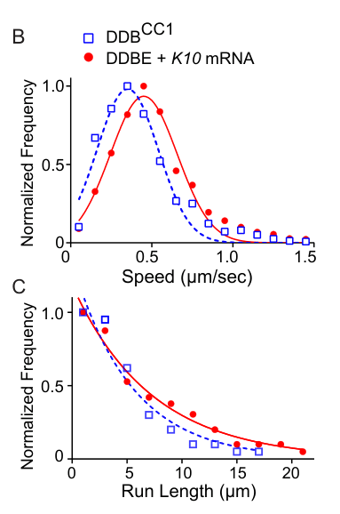

## Question

# Gene Research for Functional Annotation

## ⚠️ CRITICAL: Gene/Protein Identification Context

**BEFORE YOU BEGIN RESEARCH:** You MUST verify you are researching the CORRECT gene/protein. Gene symbols can be ambiguous, especially for less well-characterized genes from non-model organisms.

### Target Gene/Protein Identity (from UniProt):
- **UniProt Accession:** P16568
- **Protein Description:** RecName: Full=Protein bicaudal D {ECO:0000312|FlyBase:FBgn0000183};
- **Gene Information:** Name=BicD {ECO:0000312|FlyBase:FBgn0000183}; ORFNames=CG6605 {ECO:0000312|FlyBase:FBgn0000183};
- **Organism (full):** Drosophila melanogaster (Fruit fly).
- **Protein Family:** Belongs to the BicD family. .
- **Key Domains:** BICD. (IPR018477); BicD (PF09730)

### MANDATORY VERIFICATION STEPS:

1. **Check if the gene symbol "BicD" matches the protein description above**
2. **Verify the organism is correct:** Drosophila melanogaster (Fruit fly).
3. **Check if protein family/domains align with what you find in literature**
4. **If you find literature for a DIFFERENT gene with the same or similar symbol, STOP**

### If Gene Symbol is Ambiguous or You Cannot Find Relevant Literature:

**DO NOT PROCEED WITH RESEARCH ON A DIFFERENT GENE.** Instead:
- State clearly: "The gene symbol 'BicD' is ambiguous or literature is limited for this specific protein"
- Explain what you found (e.g., "Found extensive literature on a different gene with the same symbol in a different organism")
- Describe the protein based ONLY on the UniProt information provided above
- Suggest that the protein function can be inferred from domain/family information

### Research Target:

Please provide a comprehensive research report on the gene **BicD** (gene ID: BicD, UniProt: P16568) in DROME.

The research report should be a detailed narrative explaining the function, biological processes, and localization of the gene product. Citations should be given for all claims.

You should prioritize authoritative reviews and primary scientific literature when conducting research. You can supplement
this with annotations you find in gene/protein databases, but these can be outdated or inaccurate.

We are specifically interested in the primary function of the gene - for enzymes, what reaction is catalyzed, and what is the substrate specificity? For transporters, what is the substrate? For structural proteins or adapters, what is the broader structural role? For signaling molecules, what is the role in the pathway.

We are interested in where in or outside the cell the gene product carries out its function.

We are also interested in the signaling or biochemical pathways in which the gene functions. We are less interested in broad pleiotropic effects, except where these elucidate the precise role.

Include evidence where possible. We are interested in both experimental evidence as well as inference from structure, evolution, or bioinformatic analysis. Precise studies should be prioritized over high-throughput, where available.

## Output

Question: You are an expert researcher providing comprehensive, well-cited information.

Provide detailed information focusing on:
1. Key concepts and definitions with current understanding
2. Recent developments and latest research (prioritize 2023-2024 sources)
3. Current applications and real-world implementations
4. Expert opinions and analysis from authoritative sources
5. Relevant statistics and data from recent studies

Format as a comprehensive research report with proper citations. Include URLs and publication dates where available.
Always prioritize recent, authoritative sources and provide specific citations for all major claims.

# Gene Research for Functional Annotation

## ⚠️ CRITICAL: Gene/Protein Identification Context

**BEFORE YOU BEGIN RESEARCH:** You MUST verify you are researching the CORRECT gene/protein. Gene symbols can be ambiguous, especially for less well-characterized genes from non-model organisms.

### Target Gene/Protein Identity (from UniProt):
- **UniProt Accession:** P16568
- **Protein Description:** RecName: Full=Protein bicaudal D {ECO:0000312|FlyBase:FBgn0000183};
- **Gene Information:** Name=BicD {ECO:0000312|FlyBase:FBgn0000183}; ORFNames=CG6605 {ECO:0000312|FlyBase:FBgn0000183};
- **Organism (full):** Drosophila melanogaster (Fruit fly).
- **Protein Family:** Belongs to the BicD family. .
- **Key Domains:** BICD. (IPR018477); BicD (PF09730)

### MANDATORY VERIFICATION STEPS:

1. **Check if the gene symbol "BicD" matches the protein description above**
2. **Verify the organism is correct:** Drosophila melanogaster (Fruit fly).
3. **Check if protein family/domains align with what you find in literature**
4. **If you find literature for a DIFFERENT gene with the same or similar symbol, STOP**

### If Gene Symbol is Ambiguous or You Cannot Find Relevant Literature:

**DO NOT PROCEED WITH RESEARCH ON A DIFFERENT GENE.** Instead:
- State clearly: "The gene symbol 'BicD' is ambiguous or literature is limited for this specific protein"
- Explain what you found (e.g., "Found extensive literature on a different gene with the same symbol in a different organism")
- Describe the protein based ONLY on the UniProt information provided above
- Suggest that the protein function can be inferred from domain/family information

### Research Target:

Please provide a comprehensive research report on the gene **BicD** (gene ID: BicD, UniProt: P16568) in DROME.

The research report should be a detailed narrative explaining the function, biological processes, and localization of the gene product. Citations should be given for all claims.

You should prioritize authoritative reviews and primary scientific literature when conducting research. You can supplement
this with annotations you find in gene/protein databases, but these can be outdated or inaccurate.

We are specifically interested in the primary function of the gene - for enzymes, what reaction is catalyzed, and what is the substrate specificity? For transporters, what is the substrate? For structural proteins or adapters, what is the broader structural role? For signaling molecules, what is the role in the pathway.

We are interested in where in or outside the cell the gene product carries out its function.

We are also interested in the signaling or biochemical pathways in which the gene functions. We are less interested in broad pleiotropic effects, except where these elucidate the precise role.

Include evidence where possible. We are interested in both experimental evidence as well as inference from structure, evolution, or bioinformatic analysis. Precise studies should be prioritized over high-throughput, where available.

# Functional annotation report: *Drosophila melanogaster* **BicD** (UniProt P16568)

## Executive conclusion

The requested target is correctly identified: **BicD/CG6605 from *Drosophila melanogaster*** is Bicaudal-D, the founding member of the BICD family. It is not the related fly protein BicDR and not mammalian BICD1 or BICD2. The literature’s predominantly α-helical, coiled-coil architecture—including CC1, CC2 and CC3 and a conserved BICD-family region in CC3—is consistent with the supplied InterPro IPR018477 and Pfam PF09730 annotations. Thus, the symbol, organism, family and domains all align; research did not proceed on a similarly named protein from another organism. (hoogenraad2016bicaudaldfamily pages 4-5, hoogenraad2016bicaudaldfamily pages 2-4)

**Primary annotation:** BicD is a **non-enzymatic, dimeric activating cargo adaptor for cytoplasmic dynein–dynactin**. It couples selected cargoes—most securely demonstrated for Egalitarian-bound messenger ribonucleoprotein particles—to minus-end-directed microtubule transport. It has no catalytic reaction or small-molecule substrate. Its relevant “specificity” is instead determined by cargo receptors and localization signals, especially Egl recognition of structured elements in target RNAs. (hoogenraad2016bicaudaldfamily pages 4-5, cassella2021landscapeandfunctions pages 43-46, sladewski2018recruitmentoftwo pages 2-4)

| Aspect | Best-supported annotation | Evidence type | Representative source/date |
|---|---|---|---|
| Identity | **Drosophila melanogaster** Bicaudal-D (**BicD**; UniProt **P16568**), the founding member of the BICD adaptor family; distinct from fly BicDR and mammalian BICD1/BICD2. | Species-specific literature and comparative family analysis | Hoogenraad & Akhmanova, May 2016 (hoogenraad2016bicaudaldfamily pages 4-5, hoogenraad2016bicaudaldfamily pages 2-4) |
| Coiled-coil architecture | Predominantly α-helical, dimeric protein organized into N-terminal **CC1**, middle **CC2**, and C-terminal **CC3**; the conserved BICD domain lies within CC3. | Sequence/structure analysis and review synthesis | Hoogenraad & Akhmanova, May 2016 (hoogenraad2016bicaudaldfamily pages 4-5, hoogenraad2016bicaudaldfamily pages 7-9) |
| Dynein/dynactin binding | The N-terminal motor-binding region—principally CC1—engages dynein and dynactin and promotes processive, microtubule-minus-end-directed transport. | Biochemistry, genetics, and reconstituted motility | Hoogenraad & Akhmanova, May 2016; Baker et al., September 2023 preprint (baker2023thebicaudaldegalitariancomplex pages 1-2, hoogenraad2016bicaudaldfamily pages 2-4) |
| CC3 cargo binding | C-terminal CC3 is the cargo/partner-binding region. The conserved **K730M** substitution disrupts association with Egl, Rab6, and FMRP, supporting a shared or overlapping cargo-binding surface. | Mutational interaction analysis | Hoogenraad & Akhmanova, May 2016 (hoogenraad2016bicaudaldfamily pages 7-9) |
| Autoinhibition | Cargo-free full-length BicD adopts a folded/looped state in which CC3 contacts the N-terminal region and occludes productive dynein–dynactin binding; cargo engagement opens the adaptor. | Electron microscopy, biochemistry, and single-molecule reconstitution | Sladewski et al., February 2018; Hoogenraad & Akhmanova, May 2016 (hoogenraad2016bicaudaldfamily pages 4-5, sladewski2018recruitmentoftwo pages 2-4, sladewski2018recruitmentoftwo pages 6-7) |
| Egl/K10 activation | Egalitarian (**Egl**) links localization-signal-containing RNA to BicD. Egl alone is insufficient for robust activation; **Egl plus K10 mRNA** disrupts BicD autoinhibition and strongly recruits/activates dynein–dynactin. Removing the K10 TLS localization element reduces complex association and motility by about twofold; adding K10 increases run frequency about fivefold. | Purified-complex EM, pull-down, and TIRF single-molecule assays | Sladewski et al., February 2018 (sladewski2018recruitmentoftwo pages 2-4, sladewski2018recruitmentoftwo pages 6-7) |
| Quantitative motility | Reconstituted dynein–dynactin–BicD–Egl–K10 mRNPs moved at **0.45 ± 0.21 µm/s** with **7.2 ± 0.5 µm** run lengths. Two-dynein complexes moved at **0.63 ± 0.26 µm/s** and **8.9 ± 0.5 µm**, versus **0.40 ± 0.14 µm/s** and **5.8 ± 1.1 µm** for the comparison population; two-dynein runs were about **53% longer**. | Figure-level TIRF motility measurements | Sladewski et al., February 2018 (sladewski2018recruitmentoftwo media 34de6169, sladewski2018recruitmentoftwo media 4a018585) |
| RNA cargo and localization | BicD/Egl transports developmentally regulated RNAs—including **K10, bicoid, gurken, oskar**, pair-rule RNAs, and other localization-element-bearing transcripts—toward microtubule minus ends, notably from nurse cells into the oocyte and to apical embryonic domains. | Genetics, RNA-localization assays, and transport studies | Cassella, January 2021; Baker et al., September 2023 preprint (cassella2021landscapeandfunctions pages 43-46, baker2023thebicaudaldegalitariancomplex pages 7-8) |
| Rab6, clathrin, and FMRP partners | BicD associates with **Rab6**, supporting Golgi/exocytotic-vesicle transport; with **clathrin heavy chain**, supporting spindle and trafficking functions; and with **FMRP/Fmr1**, linking BicD to additional ribonucleoprotein cargo. Whether every partner directly activates BicD in vivo is not equally established. | Interaction genetics/biochemistry and review synthesis | Hoogenraad & Akhmanova, May 2016; Baker et al., September 2023 preprint (baker2023thebicaudaldegalitariancomplex pages 1-2, hoogenraad2016bicaudaldfamily pages 4-5, hoogenraad2016bicaudaldfamily pages 2-4) |
| Meiosis II and pronuclear fusion | Acute BicD depletion in newly laid eggs disrupts normal female meiosis-II products, polar-body metaphase arrest, and pronuclear fusion. BicD is required to localize **Mad2, BubR1, clathrin, D-TACC, and Msps** appropriately; BicD and clathrin occur at centrosomes and mitotic/meiosis-II spindles. | Acute protein degradation, localization, interaction, and developmental phenotyping | Vazquez-Pianzola et al., July 2022 (vazquezpianzola2022femalemeiosisii pages 1-3) |
| Latest target-specific model | In the female germline, Egl depletion leaves many BicD–cargo associations intact but reduces BicD–dynein association, suggesting that Egl functions chiefly as an activation/linkage factor rather than as BicD’s only cargo receptor. This remains **preprint evidence**. | Co-immunoprecipitation, proximity labeling, depletion, and mutant analysis | Baker et al., September 2023 **bioRxiv preprint** (baker2023thebicaudaldegalitariancomplex pages 1-2, baker2023thebicaudaldegalitariancomplex pages 8-10) |

*Table: Evidence matrix for Drosophila melanogaster BicD (UniProt P16568), integrating molecular architecture, cargo-dependent dynein activation, localization, quantitative motility, and developmental functions. It explicitly separates the fly protein from mammalian BICD2 and labels the 2023 Baker study as preprint evidence.*

## 1. Molecular architecture and mechanism

BicD is a long, rod-like coiled-coil dimer. Its N-terminal region, particularly **CC1**, binds dynein and dynactin; **CC2** occupies the middle of the molecule; and the C-terminal **CC3/cargo-binding domain** binds cargo-associated partners. This arrangement makes BicD a molecular bridge that both attaches cargo and promotes assembly of a processive motor complex. The conserved BICD domain lies within CC3, agreeing with the supplied family/domain annotation. (baker2023thebicaudaldegalitariancomplex pages 1-2, hoogenraad2016bicaudaldfamily pages 4-5)

Full-length BicD is regulated by **autoinhibition**. In the absence of activating cargo, CC3 folds back toward the N-terminal motor-binding region, producing a looped conformation that suppresses productive dynein–dynactin association. Cargo-receptor engagement opens or remodels this conformation and exposes the motor-binding region. The general model is supported by mutational, biochemical and structural observations, although some detailed conformational interpretations originated from BICD-family comparisons and should not all be treated as direct atomic-resolution evidence for fly BicD. (hoogenraad2016bicaudaldfamily pages 4-5, hoogenraad2016bicaudaldfamily pages 7-9, sladewski2018recruitmentoftwo pages 2-4)

Several fly mutations support this domain assignment. **K730M** in the conserved C-terminal region impairs binding to Egl, Rab6 and FMRP, whereas the dominant **F684I** CC3 mutation retains cargo binding but increases association of full-length BicD with dynein, consistent with disrupted autoinhibition. The N-terminal hypomorph **A40V** lies in a conserved motor-interaction region. (hoogenraad2016bicaudaldfamily pages 7-9)

## 2. Egl-dependent mRNA transport—the best-defined BicD pathway

The strongest cargo-specific mechanism is the **Egalitarian–BicD pathway**. Egl is the RNA-recognition component: it binds RNA localization elements and associates through its N-terminal region with BicD’s cargo-binding domain. BicD then recruits/activates dynein–dynactin. Accordingly, BicD should not itself be annotated as the principal sequence-specific RNA-binding protein; it is the motor adaptor downstream of Egl. (cassella2021landscapeandfunctions pages 43-46)

Purified-complex experiments provide unusually precise mechanistic evidence. Full-length BicD plus Egl alone remained largely looped and was inefficiently recruited to microtubule-bound dynein–dynactin. Addition of **K10 mRNA** opened the complex and produced robust minus-end-directed motility. K10 lacking its TLS localization element reduced motor-associated BicD–Egl complexes and motility by approximately twofold, while adding intact K10 increased run frequency approximately fivefold. Neither BicD nor Egl could simply be omitted without losing productive transport. Thus, activation is coupled to the simultaneous presence of adaptor, RNA receptor and appropriate RNA cargo. (sladewski2018recruitmentoftwo pages 2-4, sladewski2018recruitmentoftwo pages 6-7)

The reconstituted dynein–dynactin–BicD–Egl–K10 complex moved at **0.45 ± 0.21 µm s⁻¹** and had a mean run length of **7.2 ± 0.5 µm**, compared with **0.35 ± 0.19 µm s⁻¹** and **5.4 ± 0.7 µm** for the minimal motor complex containing the constitutively active BicD CC1 construct. The displayed speed datasets included 1,126 and 1,147 trajectories, respectively. (sladewski2018recruitmentoftwo media 34de6169, sladewski2018recruitmentoftwo media b476fa39)

BicD-containing mRNPs can recruit **two dimeric dyneins**. Dual-dynein complexes traveled at **0.63 ± 0.26 µm s⁻¹** with runs of **8.9 ± 0.5 µm**, compared with **0.40 ± 0.14 µm s⁻¹** and **5.8 ± 1.1 µm** for the comparison population; the dual-dynein runs were approximately **53% longer**. A representative movie showed a two-dynein mRNP moving 12.2 µm in 20.4 s at 0.6 µm s⁻¹, versus 4.5 µm at 0.36 µm s⁻¹ for a single-dynein example. These results show that cargo assembly controls not only motor recruitment but also transport performance. (sladewski2018recruitmentoftwo pages 6-7, sladewski2018recruitmentoftwo media 4a018585, sladewski2018recruitmentoftwo media a8cda9f0)

## 3. Cargo specificity and interacting proteins

Documented BicD/Egl-associated RNA cargoes include **K10, bicoid, gurken, oskar**, pair-rule transcripts such as *fushi tarazu* and *hairy*, and additional localized RNAs. These transcripts are not necessarily recognized by a simple shared primary sequence; operational specificity lies in localization elements interpreted by Egl and in assembly of the complete mRNP. Loss of BicD impairs oocyte accumulation or correct localization of multiple maternal transcripts. (cassella2021landscapeandfunctions pages 43-46)

Other reported BicD partners include:

- **Rab6**, connecting BicD with Golgi-associated and exocytotic vesicle transport;
- **clathrin heavy chain (Chc)**, implicated in trafficking, spindle organization and pole-plasm-associated processes;
- **FMRP/Fmr1**, connecting BicD to additional ribonucleoprotein cargo;
- **Nup358/RANBP2**, reported as a BicD-associated cargo or localization target. (baker2023thebicaudaldegalitariancomplex pages 1-2, hoogenraad2016bicaudaldfamily pages 4-5, hoogenraad2016bicaudaldfamily pages 2-4)

The strength and mechanistic completeness of these assignments are unequal. Egl–RNA transport has direct reconstitution, genetics and localization evidence; some other partners are established by interaction or localization evidence without equivalent full-complex reconstitution.

## 4. Cellular localization and sites of action

BicD is a cytoplasmic transport adaptor whose localization follows the microtubule network, motor complex and cargo rather than a single permanent organelle. Its best-established sites of action are:

1. **Oogenesis:** in nurse cells, ring canals and the developing oocyte, where it supports dynein-mediated delivery toward oocyte-enriched microtubule minus ends during early stages. BicD/Egl-dependent transport is essential for oocyte specification and accumulation of maternal RNAs. (cassella2021landscapeandfunctions pages 43-46, baker2023thebicaudaldegalitariancomplex pages 1-2)
2. **Embryonic blastoderm:** at apically localized mRNPs transported toward minus ends, including pair-rule transcripts. (cassella2021landscapeandfunctions pages 43-46)
3. **Centrosomes and spindles:** BicD and clathrin localize to centrosomes, mitotic spindles and tandem meiosis-II spindles in eggs. BicD is required for correct spindle localization of clathrin, D-TACC and Msps. (vazquezpianzola2022femalemeiosisii pages 1-3)
4. **Nuclear-positioning contexts:** fly genetics connects BicD-dependent dynein transport with positioning of oocyte and photoreceptor nuclei. (hoogenraad2016bicaudaldfamily pages 2-4)
5. **Somatic and neuronal tissues:** BicD-family transport contributes to neuronal morphogenesis, neuromuscular-junction function and membrane/cargo transport, although Egl is most prominent in the female germline and embryo and other receptors probably activate BicD somatically. (hoogenraad2016bicaudaldfamily pages 4-5, baker2023thebicaudaldegalitariancomplex pages 8-10)

## 5. Biological processes and pathway placement

### Oocyte specification, polarity and embryonic patterning

BicD and Egl form a functional complex required for selection and maintenance of the oocyte. Their transport pathway concentrates maternal determinants and polarity-regulating mRNAs in appropriate egg-chamber compartments. Disruption can produce a 16-nurse-cell phenotype or loss/mislocalization of oocyte-enriched transcripts. Dominant BicD alleles can also redirect *oskar* toward the anterior rather than allowing its normal kinesin-dependent posterior transport, illustrating that excessive or mistimed dynein engagement can be as disruptive as loss of transport. (cassella2021landscapeandfunctions pages 43-46, hoogenraad2016bicaudaldfamily pages 7-9)

### Female meiosis II and pronuclear fusion

Acute BicD degradation in freshly laid eggs demonstrated post-oogenesis functions that are not merely secondary consequences of earlier patterning defects. BicD is required for normal meiosis-II products, prevention of female meiotic products from re-entering the cell cycle, and pronuclear fusion. It supports localization of the spindle-assembly-checkpoint proteins **Mad2 and BubR1** to female meiotic products and positions clathrin, D-TACC and Msps on meiosis-II spindles. This places BicD at the intersection of microtubule transport, spindle stability and checkpoint control. (vazquezpianzola2022femalemeiosisii pages 1-3)

### Vesicle and organelle transport

Rab6 binding supports a broader role in Golgi/exocytotic-vesicle transport, while clathrin binding connects BicD to membrane trafficking and spindle-associated clathrin functions. These are adaptor functions, not enzymatic activities. (hoogenraad2016bicaudaldfamily pages 4-5, hoogenraad2016bicaudaldfamily pages 2-4, vazquezpianzola2022femalemeiosisii pages 1-3)

## 6. Recent developments and expert interpretation

The most directly target-relevant recent source retrieved was the **Baker et al. bioRxiv preprint, posted September 12, 2023**, DOI/URL: https://doi.org/10.1101/2023.09.11.557182. It proposes a refined division of labor: after Egl depletion, BicD retains many cargo associations but loses efficient dynein association. Egl may therefore serve principally as an activating/linkage factor in the female germline rather than being BicD’s only cargo receptor. BicD mutants further suggest that increased dynein engagement does not guarantee correct localization: R688A associates strongly with RNA yet fails to rescue *bicoid* localization and disrupts *gurken*, consistent with defects in transport termination or anchoring. Because this study was a preprint in the retrieved record, its conclusions should be considered provisional relative to peer-reviewed evidence. (baker2023thebicaudaldegalitariancomplex pages 1-2, baker2023thebicaudaldegalitariancomplex pages 7-8, baker2023thebicaudaldegalitariancomplex pages 8-10)

The most authoritative integrated review remains Hoogenraad and Akhmanova, **May 2016**, *Trends in Cell Biology*, DOI/URL: https://doi.org/10.1016/j.tcb.2016.01.001. Its central interpretation—that BICD proteins combine cargo recognition with regulated dynein activation—is strongly supported in fly BicD by later full-length reconstitution. (hoogenraad2016bicaudaldfamily pages 4-5, hoogenraad2016bicaudaldfamily pages 2-4, sladewski2018recruitmentoftwo pages 2-4)

A major peer-reviewed developmental advance was Vazquez-Pianzola et al., **July 2022**, *Development*, DOI/URL: https://doi.org/10.1242/dev.199944, which established acute BicD requirements during meiosis II and pronuclear fusion. (vazquezpianzola2022femalemeiosisii pages 1-3)

No 2024 primary study retrieved here provided a stronger direct functional revision for **this exact fly protein**. Recent papers about mammalian BICD2, including disease or pathogen-hijacking studies, were deliberately excluded from the target-specific annotation except where they might supply explicitly labeled family-level context.

## 7. Functional-annotation recommendation

A concise curated annotation would be:

> **Bicaudal-D is a dimeric coiled-coil activating adaptor for cytoplasmic dynein–dynactin. Its N-terminal coiled coils engage the motor complex, whereas its C-terminal CC3/BICD region binds cargo-associated proteins. Cargo assembly relieves intramolecular autoinhibition. In the female germline and embryo, BicD binds Egalitarian-associated localized mRNAs and drives their microtubule-minus-end transport, thereby supporting oocyte specification, polarity and embryonic patterning. BicD additionally participates in Rab6/clathrin-associated transport, spindle/checkpoint-protein localization during female meiosis II, nuclear positioning and pronuclear fusion.**

### Confidence assessment

- **High confidence:** species/identity; BICD-family coiled-coil architecture; non-enzymatic dynein–dynactin adaptor function; Egl-dependent mRNA transport; cargo-regulated autoinhibition; oogenesis and embryonic RNA localization.
- **High-to-moderate confidence:** meiosis-II spindle/checkpoint and pronuclear-fusion functions, supported by acute-degradation and localization experiments.
- **Moderate confidence:** exact activation mechanism used by every non-Egl cargo and the universality of Egl-like activation in somatic tissues.
- **Provisional:** the 2023 model that Egl chiefly activates cargo-loaded BicD assemblies while most cargo remains attached independently of Egl, because the retrieved source is a preprint. (baker2023thebicaudaldegalitariancomplex pages 1-2, vazquezpianzola2022femalemeiosisii pages 1-3, sladewski2018recruitmentoftwo pages 2-4)

References

1. (hoogenraad2016bicaudaldfamily pages 4-5): Casper C. Hoogenraad and Anna Akhmanova. Bicaudal d family of motor adaptors: linking dynein motility to cargo binding. Trends in cell biology, 26 5:327-340, May 2016. URL: https://doi.org/10.1016/j.tcb.2016.01.001, doi:10.1016/j.tcb.2016.01.001. This article has 135 citations and is from a domain leading peer-reviewed journal.

2. (hoogenraad2016bicaudaldfamily pages 2-4): Casper C. Hoogenraad and Anna Akhmanova. Bicaudal d family of motor adaptors: linking dynein motility to cargo binding. Trends in cell biology, 26 5:327-340, May 2016. URL: https://doi.org/10.1016/j.tcb.2016.01.001, doi:10.1016/j.tcb.2016.01.001. This article has 135 citations and is from a domain leading peer-reviewed journal.

3. (cassella2021landscapeandfunctions pages 43-46): Lucia Cassella. Landscape and functions of rna localization in the drosophila follicular epithelium. Text, Jan 2021. URL: https://doi.org/10.11588/heidok.00028914, doi:10.11588/heidok.00028914. This article has 0 citations and is from a peer-reviewed journal.

4. (sladewski2018recruitmentoftwo pages 2-4): Thomas E. Sladewski, Neil Billington, M. Yusuf Ali, Carol S. Bookwalter, Hailong Lu, Elena B. Krementsova, Trina A. Schroer, and Kathleen M. Trybus. Recruitment of two dyneins to an mrna-dependent bicaudal d transport complex. eLife, Feb 2018. URL: https://doi.org/10.1101/273755, doi:10.1101/273755. This article has 98 citations and is from a domain leading peer-reviewed journal.

5. (hoogenraad2016bicaudaldfamily pages 7-9): Casper C. Hoogenraad and Anna Akhmanova. Bicaudal d family of motor adaptors: linking dynein motility to cargo binding. Trends in cell biology, 26 5:327-340, May 2016. URL: https://doi.org/10.1016/j.tcb.2016.01.001, doi:10.1016/j.tcb.2016.01.001. This article has 135 citations and is from a domain leading peer-reviewed journal.

6. (baker2023thebicaudaldegalitariancomplex pages 1-2): Frederick C. Baker, Wen Lu, M. Lakonishok, Hannah Neiswender, Rajalakshmi Veeranan-Karmegam, Phylicia Allen, S. Badieyan, M. Cianfrocco, Vladimir I. Gelfand, and Graydon B. Gonsalvez. The bicaudal-d/egalitarian complex defines the specificity of cargo transport by dynein. bioRxiv, Sep 2023. URL: https://doi.org/10.1101/2023.09.11.557182, doi:10.1101/2023.09.11.557182. This article has 0 citations.

7. (sladewski2018recruitmentoftwo pages 6-7): Thomas E. Sladewski, Neil Billington, M. Yusuf Ali, Carol S. Bookwalter, Hailong Lu, Elena B. Krementsova, Trina A. Schroer, and Kathleen M. Trybus. Recruitment of two dyneins to an mrna-dependent bicaudal d transport complex. eLife, Feb 2018. URL: https://doi.org/10.1101/273755, doi:10.1101/273755. This article has 98 citations and is from a domain leading peer-reviewed journal.

8. (sladewski2018recruitmentoftwo media 34de6169): Thomas E. Sladewski, Neil Billington, M. Yusuf Ali, Carol S. Bookwalter, Hailong Lu, Elena B. Krementsova, Trina A. Schroer, and Kathleen M. Trybus. Recruitment of two dyneins to an mrna-dependent bicaudal d transport complex. eLife, Feb 2018. URL: https://doi.org/10.1101/273755, doi:10.1101/273755. This article has 98 citations and is from a domain leading peer-reviewed journal.

9. (sladewski2018recruitmentoftwo media 4a018585): Thomas E. Sladewski, Neil Billington, M. Yusuf Ali, Carol S. Bookwalter, Hailong Lu, Elena B. Krementsova, Trina A. Schroer, and Kathleen M. Trybus. Recruitment of two dyneins to an mrna-dependent bicaudal d transport complex. eLife, Feb 2018. URL: https://doi.org/10.1101/273755, doi:10.1101/273755. This article has 98 citations and is from a domain leading peer-reviewed journal.

10. (baker2023thebicaudaldegalitariancomplex pages 7-8): Frederick C. Baker, Wen Lu, M. Lakonishok, Hannah Neiswender, Rajalakshmi Veeranan-Karmegam, Phylicia Allen, S. Badieyan, M. Cianfrocco, Vladimir I. Gelfand, and Graydon B. Gonsalvez. The bicaudal-d/egalitarian complex defines the specificity of cargo transport by dynein. bioRxiv, Sep 2023. URL: https://doi.org/10.1101/2023.09.11.557182, doi:10.1101/2023.09.11.557182. This article has 0 citations.

11. (vazquezpianzola2022femalemeiosisii pages 1-3): Paula Vazquez-Pianzola, Dirk Beuchle, Gabriella Saro, Greco Hernández, Giovanna Maldonado, Dominique Brunßen, Peter Meister, and Beat Suter. Female meiosis ii and pronuclear fusion require the microtubule transport factor bicaudal d. Development, Jul 2022. URL: https://doi.org/10.1242/dev.199944, doi:10.1242/dev.199944. This article has 16 citations and is from a domain leading peer-reviewed journal.

12. (baker2023thebicaudaldegalitariancomplex pages 8-10): Frederick C. Baker, Wen Lu, M. Lakonishok, Hannah Neiswender, Rajalakshmi Veeranan-Karmegam, Phylicia Allen, S. Badieyan, M. Cianfrocco, Vladimir I. Gelfand, and Graydon B. Gonsalvez. The bicaudal-d/egalitarian complex defines the specificity of cargo transport by dynein. bioRxiv, Sep 2023. URL: https://doi.org/10.1101/2023.09.11.557182, doi:10.1101/2023.09.11.557182. This article has 0 citations.

13. (sladewski2018recruitmentoftwo media b476fa39): Thomas E. Sladewski, Neil Billington, M. Yusuf Ali, Carol S. Bookwalter, Hailong Lu, Elena B. Krementsova, Trina A. Schroer, and Kathleen M. Trybus. Recruitment of two dyneins to an mrna-dependent bicaudal d transport complex. eLife, Feb 2018. URL: https://doi.org/10.1101/273755, doi:10.1101/273755. This article has 98 citations and is from a domain leading peer-reviewed journal.

14. (sladewski2018recruitmentoftwo media a8cda9f0): Thomas E. Sladewski, Neil Billington, M. Yusuf Ali, Carol S. Bookwalter, Hailong Lu, Elena B. Krementsova, Trina A. Schroer, and Kathleen M. Trybus. Recruitment of two dyneins to an mrna-dependent bicaudal d transport complex. eLife, Feb 2018. URL: https://doi.org/10.1101/273755, doi:10.1101/273755. This article has 98 citations and is from a domain leading peer-reviewed journal.

## Artifacts

- [Edison artifact artifact-00](BicD-deep-research-falcon_artifacts/artifact-00.md)

## Citations

1. hoogenraad2016bicaudaldfamily pages 7-9
2. vazquezpianzola2022femalemeiosisii pages 1-3
3. cassella2021landscapeandfunctions pages 43-46
4. hoogenraad2016bicaudaldfamily pages 2-4
5. hoogenraad2016bicaudaldfamily pages 4-5
6. sladewski2018recruitmentoftwo pages 2-4
7. baker2023thebicaudaldegalitariancomplex pages 1-2
8. sladewski2018recruitmentoftwo pages 6-7
9. baker2023thebicaudaldegalitariancomplex pages 7-8
10. baker2023thebicaudaldegalitariancomplex pages 8-10
11. https://doi.org/10.1101/2023.09.11.557182.
12. https://doi.org/10.1016/j.tcb.2016.01.001.
13. https://doi.org/10.1242/dev.199944,
14. https://doi.org/10.1016/j.tcb.2016.01.001,
15. https://doi.org/10.11588/heidok.00028914,
16. https://doi.org/10.1101/273755,
17. https://doi.org/10.1101/2023.09.11.557182,