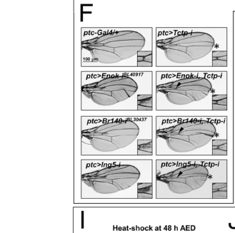

## Question

# Gene Research for Functional Annotation

## ⚠️ CRITICAL: Gene/Protein Identification Context

**BEFORE YOU BEGIN RESEARCH:** You MUST verify you are researching the CORRECT gene/protein. Gene symbols can be ambiguous, especially for less well-characterized genes from non-model organisms.

### Target Gene/Protein Identity (from UniProt):
- **UniProt Accession:** Q7JVP4
- **Protein Description:** RecName: Full=Bromodomain-containing protein homolog {ECO:0000305}; AltName: Full=Protein Br140 {ECO:0000305};
- **Gene Information:** Name=Br140 {ECO:0000312|FlyBase:FBgn0033155}; ORFNames=CG1845 {ECO:0000312|FlyBase:FBgn0033155};
- **Organism (full):** Drosophila melanogaster (Fruit fly).
- **Protein Family:** Not specified in UniProt
- **Key Domains:** Bromodomain. (IPR001487); Bromodomain-like_sf. (IPR036427); Enhancer_polycomb-like_N. (IPR019542); EPHD. (IPR034732); Histone_Mod_Regulator. (IPR050701)

### MANDATORY VERIFICATION STEPS:

1. **Check if the gene symbol "Br140" matches the protein description above**
2. **Verify the organism is correct:** Drosophila melanogaster (Fruit fly).
3. **Check if protein family/domains align with what you find in literature**
4. **If you find literature for a DIFFERENT gene with the same or similar symbol, STOP**

### If Gene Symbol is Ambiguous or You Cannot Find Relevant Literature:

**DO NOT PROCEED WITH RESEARCH ON A DIFFERENT GENE.** Instead:
- State clearly: "The gene symbol 'Br140' is ambiguous or literature is limited for this specific protein"
- Explain what you found (e.g., "Found extensive literature on a different gene with the same symbol in a different organism")
- Describe the protein based ONLY on the UniProt information provided above
- Suggest that the protein function can be inferred from domain/family information

### Research Target:

Please provide a comprehensive research report on the gene **Br140** (gene ID: Br140, UniProt: Q7JVP4) in DROME.

The research report should be a detailed narrative explaining the function, biological processes, and localization of the gene product. Citations should be given for all claims.

You should prioritize authoritative reviews and primary scientific literature when conducting research. You can supplement
this with annotations you find in gene/protein databases, but these can be outdated or inaccurate.

We are specifically interested in the primary function of the gene - for enzymes, what reaction is catalyzed, and what is the substrate specificity? For transporters, what is the substrate? For structural proteins or adapters, what is the broader structural role? For signaling molecules, what is the role in the pathway.

We are interested in where in or outside the cell the gene product carries out its function.

We are also interested in the signaling or biochemical pathways in which the gene functions. We are less interested in broad pleiotropic effects, except where these elucidate the precise role.

Include evidence where possible. We are interested in both experimental evidence as well as inference from structure, evolution, or bioinformatic analysis. Precise studies should be prioritized over high-throughput, where available.

## Output

Question: You are an expert researcher providing comprehensive, well-cited information.

Provide detailed information focusing on:
1. Key concepts and definitions with current understanding
2. Recent developments and latest research (prioritize 2023-2024 sources)
3. Current applications and real-world implementations
4. Expert opinions and analysis from authoritative sources
5. Relevant statistics and data from recent studies

Format as a comprehensive research report with proper citations. Include URLs and publication dates where available.
Always prioritize recent, authoritative sources and provide specific citations for all major claims.

# Gene Research for Functional Annotation

## ⚠️ CRITICAL: Gene/Protein Identification Context

**BEFORE YOU BEGIN RESEARCH:** You MUST verify you are researching the CORRECT gene/protein. Gene symbols can be ambiguous, especially for less well-characterized genes from non-model organisms.

### Target Gene/Protein Identity (from UniProt):
- **UniProt Accession:** Q7JVP4
- **Protein Description:** RecName: Full=Bromodomain-containing protein homolog {ECO:0000305}; AltName: Full=Protein Br140 {ECO:0000305};
- **Gene Information:** Name=Br140 {ECO:0000312|FlyBase:FBgn0033155}; ORFNames=CG1845 {ECO:0000312|FlyBase:FBgn0033155};
- **Organism (full):** Drosophila melanogaster (Fruit fly).
- **Protein Family:** Not specified in UniProt
- **Key Domains:** Bromodomain. (IPR001487); Bromodomain-like_sf. (IPR036427); Enhancer_polycomb-like_N. (IPR019542); EPHD. (IPR034732); Histone_Mod_Regulator. (IPR050701)

### MANDATORY VERIFICATION STEPS:

1. **Check if the gene symbol "Br140" matches the protein description above**
2. **Verify the organism is correct:** Drosophila melanogaster (Fruit fly).
3. **Check if protein family/domains align with what you find in literature**
4. **If you find literature for a DIFFERENT gene with the same or similar symbol, STOP**

### If Gene Symbol is Ambiguous or You Cannot Find Relevant Literature:

**DO NOT PROCEED WITH RESEARCH ON A DIFFERENT GENE.** Instead:
- State clearly: "The gene symbol 'Br140' is ambiguous or literature is limited for this specific protein"
- Explain what you found (e.g., "Found extensive literature on a different gene with the same symbol in a different organism")
- Describe the protein based ONLY on the UniProt information provided above
- Suggest that the protein function can be inferred from domain/family information

### Research Target:

Please provide a comprehensive research report on the gene **Br140** (gene ID: Br140, UniProt: Q7JVP4) in DROME.

The research report should be a detailed narrative explaining the function, biological processes, and localization of the gene product. Citations should be given for all claims.

You should prioritize authoritative reviews and primary scientific literature when conducting research. You can supplement
this with annotations you find in gene/protein databases, but these can be outdated or inaccurate.

We are specifically interested in the primary function of the gene - for enzymes, what reaction is catalyzed, and what is the substrate specificity? For transporters, what is the substrate? For structural proteins or adapters, what is the broader structural role? For signaling molecules, what is the role in the pathway.

We are interested in where in or outside the cell the gene product carries out its function.

We are also interested in the signaling or biochemical pathways in which the gene functions. We are less interested in broad pleiotropic effects, except where these elucidate the precise role.

Include evidence where possible. We are interested in both experimental evidence as well as inference from structure, evolution, or bioinformatic analysis. Precise studies should be prioritized over high-throughput, where available.

# Functional annotation report: *Drosophila melanogaster* Br140

## Identity and principal function

**The target is fly Br140 (CG1845; FlyBase FBgn0033155; UniProt Q7JVP4), not fly Brahma (*brm*) or human BRPF1, which is also called BR140.** Fly studies identify Br140 as a bromodomain-containing protein associated with Enok, the catalytic subunit of a histone acetyltransferase complex. The supplied UniProt annotation also lists bromodomain, Enhancer-of-Polycomb-like N-terminal, EPHD, and histone-modification-regulator signatures; experimental work and comparisons with BRPF-family proteins are consistent with a multidomain chromatin-regulatory role. Human BRPF1 findings are useful for interpreting Br140, but are not automatically fly-specific evidence. (kang2017bivalentcomplexesof pages 1-2, berger2008systematicidentificationof pages 8-9, yan2017mutationsinthe pages 1-2, huang2016regulationofkat6 pages 5-9)

**Best-supported primary function:** Br140 is a *noncatalytic regulatory and probable scaffolding/chromatin-targeting subunit* of the Enok–Br140–Ing5–Eaf6 complex. Enok, **not Br140**, catalyzes histone acetylation, with histone H3 lysine 23 (H3K23) a major physiological substrate in flies. Br140 supports Enok abundance and activity and broadens its substrate specificity *in vitro*. Accordingly, the biochemical reaction attributable to the **complex**, rather than to Br140 itself, is acetyl-group transfer to histone lysine, prominently H3K23; no independent catalytic reaction or substrate has been established for Br140. An expert review reports that H3K23 acetylation occurs on about **47% of fly histone H3** in the investigated setting and that Enok depletion reduces global H3-plus-H4 acetylation by about **35%**. These are **Enok/complex-level measurements**, not Br140-specific effect sizes. (huang2016regulationofkat6 pages 5-9, huang2016regulationofkat6 pages 1-5)

Br140’s domain architecture suggests a means of coupling complex assembly to chromatin recognition. A Br140 allele substituting a conserved proline in its **PWWP domain** causes an axon-targeting phenotype similar to that of an *enok* allele truncated within its acetyltransferase domain. H3K36me3 recognition by a related PWWP domain motivates the proposed connection between this domain and Enok function, but the matching fly phenotypes alone do **not** prove that the Br140 mutation abolishes H3K36me3 binding or specify the histone residue acetylated at those axon-guidance genes. Likewise, a 2021 fly nuclear-extract experiment enriched Br140 with an H3K14ac peptide, but did not measure binding by purified Br140 or its isolated bromodomain. Direct H3K14ac binding in that study was characterized for the **different protein Brm**, not Br140. (berger2008systematicidentificationof pages 8-9, huang2016regulationofkat6 pages 5-9, regadas2021auniquehistone pages 11-13, regadas2021auniquehistone pages 9-11)

## Complexes, pathways, and cellular location

**Enok acetyltransferase and chromatin regulation.** Reciprocal affinity purification from fly embryos recovered **Enok, Eaf6, and Ing5** with functional, tagged Br140; the tagged transgene rescued Br140-mutant recessive lethality. Br140-associated material also contained Elg1 and the trithorax-group protein Ash1. These experiments establish participation in the Enok assembly more directly than orthology alone does. Br140-associated histones and genomic DNA place an experimentally detectable fraction of the protein on **nuclear chromatin** in embryos and cultured S2 cells. They do not establish that Br140 is exclusively nuclear in every tissue or measure its cytoplasmic fraction. Its documented work is intracellular, at chromatin-associated regulatory loci; no extracellular function is supported. (kang2017bivalentcomplexesof pages 2-3, kang2017bivalentcomplexesof pages 4-6)

**Polycomb/trithorax-associated developmental transcription.** Embryonic Br140 purifications specifically enriched PRC1 components, including Psc, Su(z)2, and Ph-p/Ph-d, but not PRC2 components. Chromatin mapping found **more than 2,000 genes** associated with both Br140 and the PRC1 protein Pc; **447 of 483** stringently called Pc peaks also overlapped Br140. Among the cobound embryonic genes, one cluster of **406** was enriched for repressive H3K27me3 and another of **1,621** for active H3K27ac; both had promoter-associated H3K4me3. These observations support a role at developmental genes in both active and potentially poised chromatin states. The authors caution that chromatin-mark co-occurrence in mixed embryonic cells does not prove that every mark—and every interacting protein—occupies the same locus in the same cell. A reversible PRC1–Enok transcriptional switch remains a **model**, not an established Br140-catalyzed pathway. (kang2017bivalentcomplexesof pages 3-4, kang2017bivalentcomplexesof pages 2-3, kang2017bivalentcomplexesof pages 4-6)

**Replication and cell cycle.** Br140 purifications recover **Elg1**, and work synthesized in a KAT6-complex review indicates that the *Enok complex* interacts with the Elg1 PCNA-unloader complex, restricts PCNA unloading, and promotes the **G1/S transition**. This is a plausible additional function of Br140-containing assemblies; the evidence cited here should not be read as establishing that isolated Br140 unloads PCNA, binds PCNA directly, or catalyzes DNA replication. (kang2017bivalentcomplexesof pages 2-3, huang2016regulationofkat6 pages 5-9)

**Notch-responsive blood-cell differentiation: an important noncatalytic exception.** A **2020 bioRxiv preprint**, rather than a verified peer-reviewed article in the material examined, reports that hemizygous *Br140*^S781^ mutant larvae lose H3K23ac in circulating hemocytes and that Notch-responsive precursors fail to express the RUNX factor **Lozenge (Lz)** and mature into crystal cells. In the same experiments, catalytically impaired *enok*^KAT^ mutants showed H3K23ac reduced to approximately *enok*-null levels **without** losing crystal-cell differentiation; deletion of *Ing5* or *Eaf6* likewise did not prevent differentiation. Thus, the Br140–Enok requirement for this **Notch → *lozenge* → crystal-cell** response is not explained solely by Enok-mediated H3K23 acetylation or by a requirement for every canonical complex subunit. Enok was measured at a *lozenge* intronic enhancer, but a precise Br140-dependent biochemical action there has not been established. Because the genetic comparison is from a preprint, its mechanistic interpretation merits particular caution. (genais2020thedrosophilamoz pages 8-11, genais2020thedrosophilamoz pages 21-24)

## Direct developmental evidence and recent research

An earlier fly genetic study demonstrated that *Br140* mutant eye clones misroute **dorsal photoreceptor axons ventrally** along the optic-lobe surface; appropriate eye-disc expression of Br140 rescues dorsal targeting. The defects resemble *enok* mutant defects, while reported controls argue against a simple explanation based on abolished dorsal identity or widespread failure of eye-disc mitosis. These are strong gene-specific developmental data, but similarity of phenotypes did not itself prove complex formation—the later purification experiments supply that separate evidence. (berger2008systematicidentificationof pages 8-9, berger2008systematicidentificationof pages 5-8, kang2017bivalentcomplexesof pages 2-3)

The most directly relevant **2023** primary study investigated regulation of the Enok assembly by **Tctp and Ing5**. In S2-cell co-immunoprecipitations involving tagged Br140 and other complex subunits, increasing Tctp reduced Ing5-associated interactions. Reducing Tctp also suppressed the **anterior-crossvein thickening** caused by Br140 knockdown in wings; the relevant cropped experimental panel is Figure 7F. In contrast, the reported approximately **2.4-fold** increase in nuclear Enok in Tctp-depleted wing discs and approximately **2.8-fold** increase in larval H3K23ac in a Tctp mutant measure **Enok localization and a complex-level histone mark**, respectively. They are not measurements of Br140 nuclear accumulation or Br140 catalytic activity. The authors’ model is that Tctp restrains Ing5 entry or engagement with the nuclear Enok complex, thereby limiting Enok’s chromatin association and H3K23 acetylation. (kim2023tctpaunique pages 9-10, kim2023tctpaunique pages 7-9, kim2023tctpaunique media b0dbd4ef)

| Molecular/biological role | Direct evidence in *D. melanogaster* Br140 | Evidence grade and limits | Primary dated source |
|---|---|---|---|
| Visual-system topographic wiring | Br140 mutant eye clones misrouted dorsal photoreceptor axons ventrally at the optic-lobe surface; eye-specific Br140 expression rescued targeting. Mitotic pattern and dorsal identity remained largely normal, supporting a guidance-choice rather than general growth defect. (berger2008systematicidentificationof pages 8-9, berger2008systematicidentificationof pages 5-8) | **Strong genetic evidence.** Similarity to *enok* phenotypes supports a shared chromatin pathway, but the experiment did not demonstrate physical interaction or identify an acetylated substrate. | Berger et al., *PLoS Genetics*, 30 May 2008. [DOI](https://doi.org/10.1371/journal.pgen.1000085) |
| Regulatory subunit of the Enok KAT complex; association with PRC1 | Functional BioTAP-Br140 rescued recessive lethality. Br140 affinity purification recovered Enok, Eaf6, Ing5, Elg1, and Ash1; PRC1 proteins Psc, Su(z)2, and Ph-p/Ph-d were among the top 1% of reciprocal enrichment, whereas PRC2 was not enriched. Embryonic ChIP-seq identified more than 2,000 Pc-Br140 target genes and Br140 at **447 of 483** stringent Pc peaks. (kang2017bivalentcomplexesof pages 2-3, kang2017bivalentcomplexesof pages 4-6) | **Strong biochemical and chromatin-occupancy evidence.** Establishes complex membership and nuclear chromatin association, but not direct contact at every overlapping locus or a stable soluble complex. Proposed bivalency remains partly inferential because embryos contain heterogeneous cells. | Kang et al., *Genes & Development*, October 2017. [DOI](https://doi.org/10.1101/gad.305987.117) |
| Enok-complex integrity, activity, and substrate selection | Fly studies summarized in an authoritative review indicate that Br140 stimulates Enok activity, broadens its in-vitro substrate specificity, maintains Enok abundance, and contributes to H3K23 acetylation. A PWWP-domain Br140 mutation produced an axon phenotype resembling catalytic-domain disruption of Enok. (huang2016regulationofkat6 pages 5-9) | **Moderate-to-strong complex-level evidence.** Br140 is a noncatalytic regulator or scaffold; Enok, not Br140, catalyzes lysine acetylation. H3K23ac is therefore an Enok-complex output rather than an enzymatic activity of Br140. | Huang, Abmayr, and Workman, *Molecular and Cellular Biology*, July 2016. [DOI](https://doi.org/10.1128/MCB.00055-16) |
| Notch-responsive crystal-cell differentiation through *lozenge* | Hemizygous Br140-S781 reduced H3K23ac in circulating hemocytes and prevented Notch-responsive precursors from expressing Lz and differentiating into crystal cells. Catalytically inactive enok-KAT reduced H3K23ac to approximately null levels yet retained normal differentiation, while *Ing5* and *Eaf6* deletion was dispensable. (genais2020thedrosophilamoz pages 8-11, genais2020thedrosophilamoz pages 21-24) | **Direct genetic evidence, but from a preprint.** Supports a Br140-Enok regulatory function that can be independent of Enok catalysis. It does not define Br140's precise biochemical action at the *lz* enhancer. | Genais et al., bioRxiv, 28 July 2020. [DOI](https://doi.org/10.1101/2020.07.27.222620) |
| Candidate association with H3K14-acetylated chromatin | Br140 was preferentially recovered from S2 nuclear extract by an H3K14ac peptide relative to unmodified H3 in affinity-purification and mass-spectrometry experiments. (regadas2021auniquehistone pages 11-13, regadas2021auniquehistone pages 9-11) | **Preliminary association only.** No purified Br140 or isolated-bromodomain affinity assay, domain mutation, or Br140-specific binding constant was reported. Direct H3K14ac recognition was demonstrated for the distinct protein Brahma/Brm, not Br140. | Regadas et al., *Molecular Cell*, 15 April 2021. [DOI](https://doi.org/10.1016/j.molcel.2021.01.041) |
| Tctp-sensitive Enok-complex regulation during wing development | Br140 participated in Ing5 co-immunoprecipitation with Enok-complex subunits, and increasing Tctp reduced these associations. Tctp RNAi suppressed anterior-crossvein thickening caused by Br140 RNAi, as it did for Enok or Ing5 RNAi. (kim2023tctpaunique pages 9-10, kim2023tctpaunique media b0dbd4ef) | **Moderate direct Br140 evidence; stronger complex-level mechanism.** The measured **2.8-fold** H3K23ac increase in Tctp-mutant larvae and the Enok nuclear/chromatin changes concern the Ing5-Enok complex, not Br140 specifically. No Br140-specific subcellular-fraction or chromatin-localization measurement was reported. | Kim et al., *PNAS*, April 2023. [DOI](https://doi.org/10.1073/pnas.2218361120) |

*Table: Evidence-grading summary for Drosophila Br140 (Q7JVP4), separating direct gene-specific findings from Enok-complex outputs and cross-species inference. The table highlights key experimental limitations and the most recent fly-specific evidence.*

**Assessment and limits.** Fly Br140 is best annotated as a chromatin-associated regulatory subunit that enables or modulates Enok-containing assemblies, participates in developmental gene regulation and visual-system wiring, and can support a noncatalytic Notch-responsive transcriptional function. Direct fly measurements of Br140’s isolated bromodomain affinity, site-specific histone substrate preference, tissue-resolved nuclear-versus-cytoplasmic distribution, and mechanism at the *lozenge* enhancer remain limited. Human BRPF1 disease phenotypes and biochemical properties should not be reported as experimentally demonstrated phenotypes or activities of fly Br140. The latest directly pertinent peer-reviewed fly study retrieved was published in **2023**; no independently verified **2024 fly-Br140-specific** primary result was found, so recency should not override the more decisive older gene-specific experiments. (kim2023tctpaunique pages 9-10, yan2017mutationsinthe pages 1-2, regadas2021auniquehistone pages 11-13, genais2020thedrosophilamoz pages 8-11)

### Principal sources and publication dates

- Kim et al., “Tctp, a unique Ing5-binding partner, inhibits the chromatin binding of Enok in Drosophila,” *PNAS*, **April 2023**. https://doi.org/10.1073/pnas.2218361120. (kim2023tctpaunique pages 9-10)
- Regadas et al., “A unique histone 3 lysine 14 chromatin signature underlies tissue-specific gene regulation,” *Molecular Cell*, **April 2021**. https://doi.org/10.1016/j.molcel.2021.01.041. (regadas2021auniquehistone pages 11-13)
- Genais et al., “The Drosophila MOZ homolog Enok controls Notch-dependent induction of the RUNX gene lozenge independently of its histone-acetyl transferase activity,” **bioRxiv preprint posted July 28, 2020**. https://doi.org/10.1101/2020.07.27.222620. (genais2020thedrosophilamoz pages 8-11)
- Kang et al., “Bivalent complexes of PRC1 with orthologs of BRD4 and MOZ/MORF target developmental genes in Drosophila,” *Genes & Development*, **October 2017**. https://doi.org/10.1101/gad.305987.117. (kang2017bivalentcomplexesof pages 2-3)
- Huang, Abmayr, and Workman, “Regulation of KAT6 Acetyltransferases and Their Roles in Cell Cycle Progression, Stem Cell Maintenance, and Human Disease,” *Molecular and Cellular Biology*, **July 2016**; expert review of original Enok-complex experiments. https://doi.org/10.1128/MCB.00055-16. (huang2016regulationofkat6 pages 5-9)
- Berger et al., “Systematic Identification of Genes that Regulate Neuronal Wiring in the Drosophila Visual System,” *PLoS Genetics*, **May 2008**. https://doi.org/10.1371/journal.pgen.1000085. (berger2008systematicidentificationof pages 8-9)

References

1. (kang2017bivalentcomplexesof pages 1-2): Hyuckjoon Kang, Youngsook L. Jung, Kyle A. McElroy, Barry M. Zee, Heather A. Wallace, Jessica L. Woolnough, Peter J. Park, and Mitzi I. Kuroda. Bivalent complexes of prc1 with orthologs of brd4 and moz/morf target developmental genes in drosophila. Genes & Development, 31:1988-2002, Oct 2017. URL: https://doi.org/10.1101/gad.305987.117, doi:10.1101/gad.305987.117. This article has 49 citations and is from a highest quality peer-reviewed journal.

2. (berger2008systematicidentificationof pages 8-9): Jürg Berger, Kirsten-André Senti, Gabriele Senti, Timothy P. Newsome, Bengt Åsling, Barry J. Dickson, and Takashi Suzuki. Systematic identification of genes that regulate neuronal wiring in the drosophila visual system. PLoS Genetics, 4:e1000085, May 2008. URL: https://doi.org/10.1371/journal.pgen.1000085, doi:10.1371/journal.pgen.1000085. This article has 81 citations and is from a domain leading peer-reviewed journal.

3. (yan2017mutationsinthe pages 1-2): Kezhi Yan, Justine Rousseau, Rebecca Okashah Littlejohn, Courtney Kiss, Anna Lehman, Jill A. Rosenfeld, Constance T.R. Stumpel, Alexander P.A. Stegmann, Laurie Robak, Fernando Scaglia, Thi Tuyet Mai Nguyen, He Fu, Norbert F. Ajeawung, Maria Vittoria Camurri, Lin Li, Alice Gardham, Bianca Panis, Mohammed Almannai, Maria J. Guillen Sacoto, Berivan Baskin, Claudia Ruivenkamp, Fan Xia, Weimin Bi, Megan T. Cho, Thomas P. Potjer, Gijs W.E. Santen, Michael J. Parker, Natalie Canham, Margaret McKinnon, Lorraine Potocki, Jennifer J. MacKenzie, Elizabeth R. Roeder, Philippe M. Campeau, and Xiang-Jiao Yang. Mutations in the chromatin regulator gene brpf1 cause syndromic intellectual disability and deficient histone acetylation. American journal of human genetics, 100 1:91-104, Jan 2017. URL: https://doi.org/10.1016/j.ajhg.2016.11.011, doi:10.1016/j.ajhg.2016.11.011. This article has 110 citations and is from a highest quality peer-reviewed journal.

4. (huang2016regulationofkat6 pages 5-9): Fu Huang, Susan M. Abmayr, and Jerry L. Workman. Regulation of kat6 acetyltransferases and their roles in cell cycle progression, stem cell maintenance, and human disease. Molecular and Cellular Biology, 36:1900-1907, Jul 2016. URL: https://doi.org/10.1128/mcb.00055-16, doi:10.1128/mcb.00055-16. This article has 113 citations and is from a domain leading peer-reviewed journal.

5. (huang2016regulationofkat6 pages 1-5): Fu Huang, Susan M. Abmayr, and Jerry L. Workman. Regulation of kat6 acetyltransferases and their roles in cell cycle progression, stem cell maintenance, and human disease. Molecular and Cellular Biology, 36:1900-1907, Jul 2016. URL: https://doi.org/10.1128/mcb.00055-16, doi:10.1128/mcb.00055-16. This article has 113 citations and is from a domain leading peer-reviewed journal.

6. (regadas2021auniquehistone pages 11-13): Isabel Regadas, Olle Dahlberg, Roshan Vaid, Oanh Ho, Sergey Belikov, Gunjan Dixit, Sebastian Deindl, Jiayu Wen, and Mattias Mannervik. A unique histone 3 lysine 14 chromatin signature underlies tissue-specific gene regulation. Molecular Cell, 81:1766-1780.e10, Apr 2021. URL: https://doi.org/10.1016/j.molcel.2021.01.041, doi:10.1016/j.molcel.2021.01.041. This article has 66 citations and is from a highest quality peer-reviewed journal.

7. (regadas2021auniquehistone pages 9-11): Isabel Regadas, Olle Dahlberg, Roshan Vaid, Oanh Ho, Sergey Belikov, Gunjan Dixit, Sebastian Deindl, Jiayu Wen, and Mattias Mannervik. A unique histone 3 lysine 14 chromatin signature underlies tissue-specific gene regulation. Molecular Cell, 81:1766-1780.e10, Apr 2021. URL: https://doi.org/10.1016/j.molcel.2021.01.041, doi:10.1016/j.molcel.2021.01.041. This article has 66 citations and is from a highest quality peer-reviewed journal.

8. (kang2017bivalentcomplexesof pages 2-3): Hyuckjoon Kang, Youngsook L. Jung, Kyle A. McElroy, Barry M. Zee, Heather A. Wallace, Jessica L. Woolnough, Peter J. Park, and Mitzi I. Kuroda. Bivalent complexes of prc1 with orthologs of brd4 and moz/morf target developmental genes in drosophila. Genes & Development, 31:1988-2002, Oct 2017. URL: https://doi.org/10.1101/gad.305987.117, doi:10.1101/gad.305987.117. This article has 49 citations and is from a highest quality peer-reviewed journal.

9. (kang2017bivalentcomplexesof pages 4-6): Hyuckjoon Kang, Youngsook L. Jung, Kyle A. McElroy, Barry M. Zee, Heather A. Wallace, Jessica L. Woolnough, Peter J. Park, and Mitzi I. Kuroda. Bivalent complexes of prc1 with orthologs of brd4 and moz/morf target developmental genes in drosophila. Genes & Development, 31:1988-2002, Oct 2017. URL: https://doi.org/10.1101/gad.305987.117, doi:10.1101/gad.305987.117. This article has 49 citations and is from a highest quality peer-reviewed journal.

10. (kang2017bivalentcomplexesof pages 3-4): Hyuckjoon Kang, Youngsook L. Jung, Kyle A. McElroy, Barry M. Zee, Heather A. Wallace, Jessica L. Woolnough, Peter J. Park, and Mitzi I. Kuroda. Bivalent complexes of prc1 with orthologs of brd4 and moz/morf target developmental genes in drosophila. Genes & Development, 31:1988-2002, Oct 2017. URL: https://doi.org/10.1101/gad.305987.117, doi:10.1101/gad.305987.117. This article has 49 citations and is from a highest quality peer-reviewed journal.

11. (genais2020thedrosophilamoz pages 8-11): Thomas Genais, Delhia Gigan, Benoit Augé, Douaa Moussalem, Lucas Waltzer, Marc Haenlin, and Vanessa Gobert. The drosophila moz homolog enok controls notch-dependent induction of the runx gene lozenge independently of its histone-acetyl transferase activity. bioRxiv, Jul 2020. URL: https://doi.org/10.1101/2020.07.27.222620, doi:10.1101/2020.07.27.222620. This article has 2 citations.

12. (genais2020thedrosophilamoz pages 21-24): Thomas Genais, Delhia Gigan, Benoit Augé, Douaa Moussalem, Lucas Waltzer, Marc Haenlin, and Vanessa Gobert. The drosophila moz homolog enok controls notch-dependent induction of the runx gene lozenge independently of its histone-acetyl transferase activity. bioRxiv, Jul 2020. URL: https://doi.org/10.1101/2020.07.27.222620, doi:10.1101/2020.07.27.222620. This article has 2 citations.

13. (berger2008systematicidentificationof pages 5-8): Jürg Berger, Kirsten-André Senti, Gabriele Senti, Timothy P. Newsome, Bengt Åsling, Barry J. Dickson, and Takashi Suzuki. Systematic identification of genes that regulate neuronal wiring in the drosophila visual system. PLoS Genetics, 4:e1000085, May 2008. URL: https://doi.org/10.1371/journal.pgen.1000085, doi:10.1371/journal.pgen.1000085. This article has 81 citations and is from a domain leading peer-reviewed journal.

14. (kim2023tctpaunique pages 9-10): Lee-Hyang Kim, Ja-Young Kim, Yu-Ying Xu, Mi Ae Lim, Bon Seok Koo, Jung Hae Kim, Sung-Eun Yoon, Young-Joon Kim, Kwang-Wook Choi, Jae Won Chang, and Sung-Tae Hong. Tctp, a unique ing5-binding partner, inhibits the chromatin binding of enok in drosophila. Proceedings of the National Academy of Sciences of the United States of America, Apr 2023. URL: https://doi.org/10.1073/pnas.2218361120, doi:10.1073/pnas.2218361120. This article has 5 citations and is from a highest quality peer-reviewed journal.

15. (kim2023tctpaunique pages 7-9): Lee-Hyang Kim, Ja-Young Kim, Yu-Ying Xu, Mi Ae Lim, Bon Seok Koo, Jung Hae Kim, Sung-Eun Yoon, Young-Joon Kim, Kwang-Wook Choi, Jae Won Chang, and Sung-Tae Hong. Tctp, a unique ing5-binding partner, inhibits the chromatin binding of enok in drosophila. Proceedings of the National Academy of Sciences of the United States of America, Apr 2023. URL: https://doi.org/10.1073/pnas.2218361120, doi:10.1073/pnas.2218361120. This article has 5 citations and is from a highest quality peer-reviewed journal.

16. (kim2023tctpaunique media b0dbd4ef): Lee-Hyang Kim, Ja-Young Kim, Yu-Ying Xu, Mi Ae Lim, Bon Seok Koo, Jung Hae Kim, Sung-Eun Yoon, Young-Joon Kim, Kwang-Wook Choi, Jae Won Chang, and Sung-Tae Hong. Tctp, a unique ing5-binding partner, inhibits the chromatin binding of enok in drosophila. Proceedings of the National Academy of Sciences of the United States of America, Apr 2023. URL: https://doi.org/10.1073/pnas.2218361120, doi:10.1073/pnas.2218361120. This article has 5 citations and is from a highest quality peer-reviewed journal.

## Artifacts

- [Edison artifact artifact-00](Br140-deep-research-falcon_artifacts/artifact-00.md)

## Citations

1. kim2023tctpaunique pages 9-10
2. regadas2021auniquehistone pages 11-13
3. genais2020thedrosophilamoz pages 8-11
4. kang2017bivalentcomplexesof pages 2-3
5. berger2008systematicidentificationof pages 8-9
6. kang2017bivalentcomplexesof pages 1-2
7. yan2017mutationsinthe pages 1-2
8. regadas2021auniquehistone pages 9-11
9. kang2017bivalentcomplexesof pages 4-6
10. kang2017bivalentcomplexesof pages 3-4
11. genais2020thedrosophilamoz pages 21-24
12. berger2008systematicidentificationof pages 5-8
13. kim2023tctpaunique pages 7-9
14. DOI
15. https://doi.org/10.1371/journal.pgen.1000085
16. https://doi.org/10.1101/gad.305987.117
17. https://doi.org/10.1128/MCB.00055-16
18. https://doi.org/10.1101/2020.07.27.222620
19. https://doi.org/10.1016/j.molcel.2021.01.041
20. https://doi.org/10.1073/pnas.2218361120
21. https://doi.org/10.1073/pnas.2218361120.
22. https://doi.org/10.1016/j.molcel.2021.01.041.
23. https://doi.org/10.1101/2020.07.27.222620.
24. https://doi.org/10.1101/gad.305987.117.
25. https://doi.org/10.1128/MCB.00055-16.
26. https://doi.org/10.1371/journal.pgen.1000085.
27. https://doi.org/10.1101/gad.305987.117,
28. https://doi.org/10.1371/journal.pgen.1000085,
29. https://doi.org/10.1016/j.ajhg.2016.11.011,
30. https://doi.org/10.1128/mcb.00055-16,
31. https://doi.org/10.1016/j.molcel.2021.01.041,
32. https://doi.org/10.1101/2020.07.27.222620,
33. https://doi.org/10.1073/pnas.2218361120,