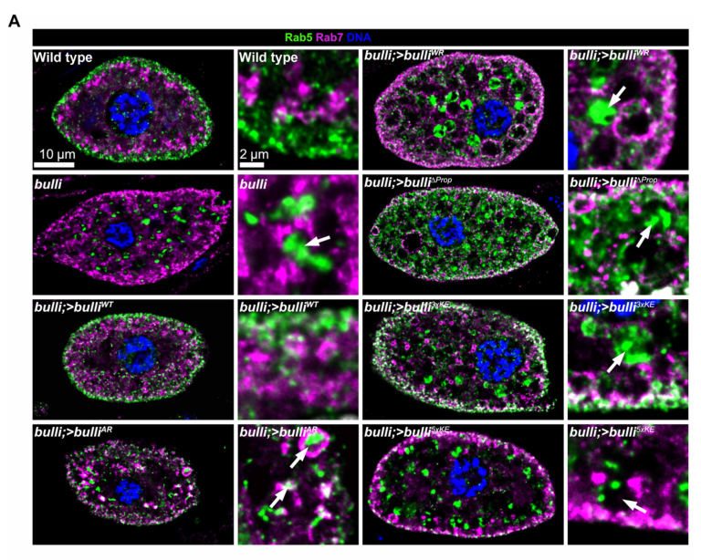

## Question

# Gene Research for Functional Annotation

## ⚠️ CRITICAL: Gene/Protein Identification Context

**BEFORE YOU BEGIN RESEARCH:** You MUST verify you are researching the CORRECT gene/protein. Gene symbols can be ambiguous, especially for less well-characterized genes from non-model organisms.

### Target Gene/Protein Identity (from UniProt):
- **UniProt Accession:** Q9VRX1
- **Protein Description:** RecName: Full=Regulator of MON1-CCZ1 complex {ECO:0000305}; AltName: Full=Protein Bulli {ECO:0000303|PubMed:32499409};
- **Gene Information:** Name=Bulli {ECO:0000303|PubMed:32499409, ECO:0000312|FlyBase:FBgn0035703}; ORFNames=CG8270 {ECO:0000312|FlyBase:FBgn0035703};
- **Organism (full):** Drosophila melanogaster (Fruit fly).
- **Protein Family:** Belongs to the RMC1 family. .
- **Key Domains:** RMC1. (IPR040371); RMC1_C. (IPR009755); RMC1_N. (IPR049040); RMC1_C (PF07035); RMC1_N (PF21029)

### MANDATORY VERIFICATION STEPS:

1. **Check if the gene symbol "Bulli" matches the protein description above**
2. **Verify the organism is correct:** Drosophila melanogaster (Fruit fly).
3. **Check if protein family/domains align with what you find in literature**
4. **If you find literature for a DIFFERENT gene with the same or similar symbol, STOP**

### If Gene Symbol is Ambiguous or You Cannot Find Relevant Literature:

**DO NOT PROCEED WITH RESEARCH ON A DIFFERENT GENE.** Instead:
- State clearly: "The gene symbol 'Bulli' is ambiguous or literature is limited for this specific protein"
- Explain what you found (e.g., "Found extensive literature on a different gene with the same symbol in a different organism")
- Describe the protein based ONLY on the UniProt information provided above
- Suggest that the protein function can be inferred from domain/family information

### Research Target:

Please provide a comprehensive research report on the gene **Bulli** (gene ID: Bulli, UniProt: Q9VRX1) in DROME.

The research report should be a detailed narrative explaining the function, biological processes, and localization of the gene product. Citations should be given for all claims.

You should prioritize authoritative reviews and primary scientific literature when conducting research. You can supplement
this with annotations you find in gene/protein databases, but these can be outdated or inaccurate.

We are specifically interested in the primary function of the gene - for enzymes, what reaction is catalyzed, and what is the substrate specificity? For transporters, what is the substrate? For structural proteins or adapters, what is the broader structural role? For signaling molecules, what is the role in the pathway.

We are interested in where in or outside the cell the gene product carries out its function.

We are also interested in the signaling or biochemical pathways in which the gene functions. We are less interested in broad pleiotropic effects, except where these elucidate the precise role.

Include evidence where possible. We are interested in both experimental evidence as well as inference from structure, evolution, or bioinformatic analysis. Precise studies should be prioritized over high-throughput, where available.

## Output

Question: You are an expert researcher providing comprehensive, well-cited information.

Provide detailed information focusing on:
1. Key concepts and definitions with current understanding
2. Recent developments and latest research (prioritize 2023-2024 sources)
3. Current applications and real-world implementations
4. Expert opinions and analysis from authoritative sources
5. Relevant statistics and data from recent studies

Format as a comprehensive research report with proper citations. Include URLs and publication dates where available.
Always prioritize recent, authoritative sources and provide specific citations for all major claims.

# Gene Research for Functional Annotation

## ⚠️ CRITICAL: Gene/Protein Identification Context

**BEFORE YOU BEGIN RESEARCH:** You MUST verify you are researching the CORRECT gene/protein. Gene symbols can be ambiguous, especially for less well-characterized genes from non-model organisms.

### Target Gene/Protein Identity (from UniProt):
- **UniProt Accession:** Q9VRX1
- **Protein Description:** RecName: Full=Regulator of MON1-CCZ1 complex {ECO:0000305}; AltName: Full=Protein Bulli {ECO:0000303|PubMed:32499409};
- **Gene Information:** Name=Bulli {ECO:0000303|PubMed:32499409, ECO:0000312|FlyBase:FBgn0035703}; ORFNames=CG8270 {ECO:0000312|FlyBase:FBgn0035703};
- **Organism (full):** Drosophila melanogaster (Fruit fly).
- **Protein Family:** Belongs to the RMC1 family. .
- **Key Domains:** RMC1. (IPR040371); RMC1_C. (IPR009755); RMC1_N. (IPR049040); RMC1_C (PF07035); RMC1_N (PF21029)

### MANDATORY VERIFICATION STEPS:

1. **Check if the gene symbol "Bulli" matches the protein description above**
2. **Verify the organism is correct:** Drosophila melanogaster (Fruit fly).
3. **Check if protein family/domains align with what you find in literature**
4. **If you find literature for a DIFFERENT gene with the same or similar symbol, STOP**

### If Gene Symbol is Ambiguous or You Cannot Find Relevant Literature:

**DO NOT PROCEED WITH RESEARCH ON A DIFFERENT GENE.** Instead:
- State clearly: "The gene symbol 'Bulli' is ambiguous or literature is limited for this specific protein"
- Explain what you found (e.g., "Found extensive literature on a different gene with the same symbol in a different organism")
- Describe the protein based ONLY on the UniProt information provided above
- Suggest that the protein function can be inferred from domain/family information

### Research Target:

Please provide a comprehensive research report on the gene **Bulli** (gene ID: Bulli, UniProt: Q9VRX1) in DROME.

The research report should be a detailed narrative explaining the function, biological processes, and localization of the gene product. Citations should be given for all claims.

You should prioritize authoritative reviews and primary scientific literature when conducting research. You can supplement
this with annotations you find in gene/protein databases, but these can be outdated or inaccurate.

We are specifically interested in the primary function of the gene - for enzymes, what reaction is catalyzed, and what is the substrate specificity? For transporters, what is the substrate? For structural proteins or adapters, what is the broader structural role? For signaling molecules, what is the role in the pathway.

We are interested in where in or outside the cell the gene product carries out its function.

We are also interested in the signaling or biochemical pathways in which the gene functions. We are less interested in broad pleiotropic effects, except where these elucidate the precise role.

Include evidence where possible. We are interested in both experimental evidence as well as inference from structure, evolution, or bioinformatic analysis. Precise studies should be prioritized over high-throughput, where available.

# Functional annotation report: *Drosophila melanogaster* Bulli (CG8270; UniProt Q9VRX1)

## Identity and principal function

**Identity verified.** The experimental literature explicitly identifies the fruit-fly gene **CG8270 as *bulli*** and its product as the fly counterpart of RMC1. This agrees with the supplied Q9VRX1 annotation and RMC1-family designation; the studies discussed below concern this protein, not a similarly named gene in another organism. Bulli is a 642-amino-acid protein with an N-terminal β-propeller and C-terminal α-solenoid architecture. (dehnen2020atrimericmetazoan pages 3-5)

**Best-supported molecular annotation:** Bulli is a **membrane-recruitment and positioning subunit of the Mon1–Ccz1–Bulli complex**, which activates the small GTPase Rab7 during endosome maturation. Its broader role is to help place the Rab7 guanine-nucleotide-exchange factor (GEF) at the appropriate endosomal membrane, enabling the transition from Rab5-associated early-endosomal identity toward Rab7-associated late-endosomal identity. Bulli is **not itself an enzyme, transporter, or the indispensable Rab7-exchange catalytic core**: purified Mon1–Ccz1 still catalyzes Rab7 nucleotide exchange without it. (dehnen2020atrimericmetazoan pages 5-7, langemeyer2020aconservedand pages 6-8, wilmes2025mechanisticadaptationof pages 3-5)

The evidence can be read at several levels—purified complex, cellular localization, fly genetics, and comparative evolution:

| Evidence category | Fly Bulli/CG8270 finding | Strength / qualification | Primary study DOI and year |
|---|---|---|---|
| Complex and Rab7 nucleotide exchange | Bulli associates with Mon1–Ccz1 to form a trimeric Rab7 GEF complex. Both the Mon1–Ccz1 dimer and Bulli-containing trimer catalyze Rab7 exchange: Dehnen et al. observed a modest trimer advantage in solution and about 40% greater activity on model membranes, whereas a Rab5-recruiter assay found roughly comparable dimer and trimer activities. (dehnen2020atrimericmetazoan pages 5-7, langemeyer2020aconservedand pages 6-8) | Direct interaction and purified-protein evidence. The dimer remains catalytically competent, and Bulli’s apparent enhancement is assay-dependent; Bulli is therefore not part of the indispensable catalytic core. | [10.1242/jcs.247080](https://doi.org/10.1242/jcs.247080) (2020); [10.7554/eLife.56090](https://doi.org/10.7554/eLife.56090) (2020) |
| Cellular localization | Overexpressed Bulli::GFP localized preferentially to Rab7-positive compartments in nephrocytes: Pearson coefficient approximately 0.80 with Rab7, versus 0.28 with Rab5 and 0.26 with the early-endosome/CORVET marker Vps8. (dehnen2020atrimericmetazoan pages 5-7) | Direct imaging supports localization to maturing or late endosomes, but the fusion protein was transgenically expressed and endogenous Bulli antibodies were unavailable. | [10.1242/jcs.247080](https://doi.org/10.1242/jcs.247080) (2020) |
| Genetic and cellular phenotype | Multiple bulli loss-of-function alleles produced enlarged late-endosomal alpha-vacuoles: median areas were 2.4 µm² in controls and 5.6–14.6 µm² in three CRISPR alleles. Enlarged compartments accumulated Rab5; the most enlarged Rab7-negative class was also LysoTracker-negative, indicating failed acidification or maturation. (dehnen2020atrimericmetazoan pages 36-40, dehnen2020atrimericmetazoan pages 9-12) | Direct genetics, ultrastructure, immunostaining, and acidification evidence across multiple alleles. Initial uptake machinery remained morphologically intact, so the principal defect lies in endosomal maturation rather than vesicle internalization itself. | [10.1242/jcs.247080](https://doi.org/10.1242/jcs.247080) (2020) |
| Membrane-recruitment mechanism | The purified fly trimer bound an anionic supported bilayer with an apparent KD of approximately 1.5 µM. Separately, the Xenopus Mon1–Ccz1 dimer showed no detectable binding, whereas its Bulli-containing trimer bound; the dimer result therefore must not be attributed directly to fly protein. In flies, wild-type Bulli rescued Rab5 mislocalization, while beta-propeller deletion, Ccz1-interface substitutions, and basic-patch charge inversions impaired rescue. (wilmes2025mechanisticadaptationof pages 3-5, wilmes2025mechanisticadaptationof pages 5-7, wilmes2025mechanisticadaptationof media e6187da3) | Strong biochemical-plus-genetic support that Bulli’s conserved basic beta-propeller patch recruits or orients the metazoan GEF on anionic membranes. The approximately 1.5-µM affinity is fly-specific; the dimer-versus-trimer comparison used Xenopus proteins. | [10.1126/sciadv.adx2893](https://doi.org/10.1126/sciadv.adx2893) (2025) |
| Evolution and family interpretation | A broad phylogenomic survey found RMC1 in most sampled genomes together with MON1 and CCZ1, supporting an ancient, paneukaryotic origin rather than a strictly metazoan innovation. However, sensitive profile searches did not establish sequence homology between RMC1 and HPS6; their beta-propeller/alpha-solenoid resemblance remains an architectural analogy, not a proven family relationship. (more2024evolutionaryoriginsof pages 6-7) | Comparative-genomics inference rather than fly functional experimentation. It updates earlier restricted-distribution assumptions but does not change the experimentally supported assignment of Drosophila CG8270 to the RMC1 family. | [10.1073/pnas.2403601121](https://doi.org/10.1073/pnas.2403601121) (2024) |

*Table: This table integrates biochemical, localization, genetic, membrane-binding, and evolutionary evidence for Drosophila Bulli/CG8270. It distinguishes direct fly findings from Xenopus experiments and qualified evolutionary inference.*

## Biochemical mechanism and pathway

Affinity purification of Bulli::GFP from flies enriched Mon1 and Ccz1, and purified Bulli bound the Mon1–Ccz1 dimer. The proteins could be isolated as a Bulli-containing trimer; the Mon1–Ccz1 dimer was also stable on its own. In fluorescent MANT-GDP exchange assays, **both assemblies promoted nucleotide exchange on Rab7**, the substrate GTPase. Dehnen and colleagues found a small trimer advantage in solution and approximately **40% higher activity** than the dimer in one artificial-membrane assay. A separate reconstitution using membrane-bound, prenylated fly Rab5 found roughly comparable dimer and trimer activity, including at lower Rab5 concentrations. The apparent contribution of Bulli to exchange rate is therefore **assay-dependent**, whereas the conclusion that Mon1–Ccz1 supplies the core catalytic activity is consistent across experiments. (dehnen2020atrimericmetazoan pages 5-7, langemeyer2020aconservedand pages 6-8)

In the reconstituted endosomal Rab cascade, membrane-associated **Rab5 acts upstream of Mon1–Ccz1-dependent Rab7 activation**. Neither fly complex had detectable activity without a recruiter GTPase under the recruiter-assay conditions. These results connect Bulli’s role to the spatial control of a Rab5-to-Rab7 transition; they do not show that Bulli directly catalyzes GDP release or independently binds Rab5 in a physiologically productive interaction. (langemeyer2020aconservedand pages 6-8)

Subsequent structural interpretation places Bulli/RMC1 on the side of Mon1–Ccz1 **opposite the Rab7-binding catalytic site**. The 2024 structural review describes its β-propeller and α-solenoid and reports that accommodation of this third subunit changes portions of the Mon1–Ccz1 assembly without replacing the catalytic core. The relevant 2023 structural primary report is Herrmann and colleagues, *Structure of the metazoan Rab7 GEF complex Mon1–Ccz1–Bulli* ([PNAS, 2023; DOI: 10.1073/pnas.2301908120](https://doi.org/10.1073/pnas.2301908120)); the structural details here are supported by the accessible review and later experimental analysis rather than an independently examined full text of that primary report. (diao2024molecularstructuresand pages 9-11, wilmes2025mechanisticadaptationof pages 12-13, wilmes2025mechanisticadaptationof pages 1-2)

**Membrane targeting is now the most specific explanation of Bulli’s contribution.** In 2025, Wilmes and colleagues measured binding of purified fly Mon1–Ccz1–Bulli to a negatively charged supported lipid bilayer, obtaining an apparent dissociation constant of approximately **1.5 µM**. A *Xenopus* Bulli-containing complex bound the model membrane, whereas its **Bulli-free *Xenopus* dimer** showed no detectable binding under those conditions; this dimer comparison is *Xenopus* evidence, not a direct fly-dimer measurement. Charge inversion of four lysines in the *Xenopus* Bulli β-propeller abolished detectable binding. Together with the fly experiments below, the data identify a conserved basic β-propeller surface as an important membrane-interaction element. The experiments used mixed model bilayers and do **not** establish one uniquely required lipid species or an exclusive phosphoinositide substrate for fly Bulli. (wilmes2025mechanisticadaptationof pages 3-5, wilmes2025mechanisticadaptationof pages 5-7)

## Site of action and biological consequences

In pericardial nephrocytes, transgenically expressed Bulli::GFP appeared on intracellular vesicular compartments and colocalized strongly with **Rab7-positive maturing or late endosomes**: the reported Pearson coefficient was approximately **0.80** for Rab7, versus **0.28** for Rab5 and **0.26** for the early-endosome-associated protein Vps8. Thus, the experimentally observed site of Bulli action is the **cytosolic face of endosomal membranes**, as a peripheral component of the membrane-associated GEF complex; it is not identified as secreted cargo or a membrane-spanning transporter. Localization was measured with expressed Bulli::GFP because suitable endogenous-protein antibodies were unavailable, an important qualification when interpreting its precise distribution. (dehnen2020atrimericmetazoan pages 5-7, dehnen2020atrimericmetazoan pages 3-5, wilmes2025mechanisticadaptationof pages 3-5)

Fly genetics links that molecular role to **endosome maturation and nephrocyte scavenging**. Across several *bulli* loss-of-function alleles, late-endosomal α-vacuoles were enlarged: reported median areas were **2.4 µm² in controls**, compared with **7.5, 5.6, and 14.6 µm²** in three CRISPR alleles, respectively. Rab5 accumulated in enlarged compartments, Rab7 became less properly localized, and the most enlarged **Rab7-negative** compartment class was also **LysoTracker-negative**, consistent with failed progression to an acidified late compartment. Initial cargo internalization remained possible, but FITC-albumin uptake was impaired with age; the evidence points more specifically to defective endosomal processing than to an absolute inability to form endocytic vesicles. (dehnen2020atrimericmetazoan pages 36-40, dehnen2020atrimericmetazoan pages 9-12, dehnen2020atrimericmetazoan pages 7-9)

The mutants were viable and fertile, but one reported comparison found median adult survival of **33.5 days for *bulli* mutants versus 57 days for controls**. Reduced survival is a whole-animal consequence, not proof that Bulli has a separate longevity-specific biochemical activity. Nephrocytes provide a practical implementation of the fly model: their high endocytic activity makes Rab localization, cargo handling, acidification, and compartment ultrastructure measurable readouts of Bulli function. (dehnen2020atrimericmetazoan pages 44-48, wilmes2025mechanisticadaptationof pages 3-5)

Importantly, the 2025 study tested causality rather than relying only on the deletion phenotype. Re-expression of wild-type fly Bulli improved the abnormal Rab5 distribution in mutant nephrocytes. Mutations disrupting its Ccz1-contacting α-solenoid interface, deletion of the β-propeller, and charge inversions in the β-propeller basic patch impaired functional rescue; the more extensively charge-inverted **5xKE** variant produced a stronger defect than **3xKE**. The study’s cropped Rab5/Rab7 staining and phenotype chart provide visual evidence for this comparison. These results connect **complex assembly and membrane recognition** to Bulli’s cellular function, although Rab5 distribution is the scored rescue readout rather than a direct measurement of local Rab7 nucleotide loading. (wilmes2025mechanisticadaptationof pages 3-5, wilmes2025mechanisticadaptationof pages 5-7, wilmes2025mechanisticadaptationof media e6187da3)

## Evolution, recent developments, and limits of inference

The proposed β-propeller/α-solenoid organization fits Bulli’s supplied **RMC1-family/domain annotation** and explains why it was initially noticed as resembling subunits of membrane-trafficking assemblies. Architectural resemblance should **not** be taken to mean that Bulli is a HOPS, CORVET, or BLOC subunit. In particular, a 2024 phylogenomic analysis found RMC1-related proteins across a much wider range of eukaryotes than a strictly metazoan designation suggests, but sensitive sequence-profile searches **did not establish RMC1–HPS6 sequence homology**. This updates the evolutionary picture without changing the experimentally demonstrated Mon1–Ccz1 association of fly CG8270. (dehnen2020atrimericmetazoan pages 3-5, more2024evolutionaryoriginsof pages 6-7)

The key recent functional advance is therefore **the 2025 combination of lipid-binding measurements, interface mutations, and rescue in flies**, building on the **2023 structural studies** and the **2024 synthesis of the structural mechanism**. The available fly evidence does not determine precisely how Bulli’s lipid interaction, Rab5-dependent recruitment, and other endosomal cues are integrated at each maturation stage. Nor does a phenotype observed for mammalian RMC1 or another Mon1–Ccz1 subunit automatically establish the same biological application for fly Bulli. The defensible annotation is **an endosome-associated regulatory/scaffolding subunit that enables effective membrane-localized Mon1–Ccz1 signaling to Rab7**, rather than a Rab7 GEF acting alone. (wilmes2025mechanisticadaptationof pages 3-5, wilmes2025mechanisticadaptationof pages 5-7, langemeyer2020aconservedand pages 6-8, more2024evolutionaryoriginsof pages 6-7)

### Selected sources and publication dates

- Dehnen *et al.*, “A trimeric metazoan Rab7 GEF complex is crucial for endocytosis and scavenger function,” *Journal of Cell Science*, **July 2020**. [https://doi.org/10.1242/jcs.247080](https://doi.org/10.1242/jcs.247080). (dehnen2020atrimericmetazoan pages 5-7)
- Langemeyer *et al.*, “A conserved and regulated mechanism drives endosomal Rab transition,” *eLife*, **May 2020**. [https://doi.org/10.7554/eLife.56090](https://doi.org/10.7554/eLife.56090). (langemeyer2020aconservedand pages 6-8)
- Herrmann *et al.*, “Structure of the metazoan Rab7 GEF complex Mon1–Ccz1–Bulli,” *PNAS*, **May 2023**. [https://doi.org/10.1073/pnas.2301908120](https://doi.org/10.1073/pnas.2301908120); structural description cross-checked against the accessible review. (wilmes2025mechanisticadaptationof pages 12-13, diao2024molecularstructuresand pages 9-11)
- Diao, Yip and Zhong, “Molecular structures and function of the autophagosome-lysosome fusion machinery,” *Autophagy Reports*, **February 2024**. [https://doi.org/10.1080/27694127.2024.2305594](https://doi.org/10.1080/27694127.2024.2305594). (diao2024molecularstructuresand pages 9-11)
- More *et al.*, “Evolutionary origins of the lysosome-related organelle sorting machinery reveal ancient homology in post-endosome trafficking pathways,” *PNAS*, **October 2024**. [https://doi.org/10.1073/pnas.2403601121](https://doi.org/10.1073/pnas.2403601121). (more2024evolutionaryoriginsof pages 6-7)
- Wilmes *et al.*, “Mechanistic adaptation of the metazoan RabGEFs Mon1–Ccz1 and Fuzzy–Inturned,” *Science Advances*, **27 August 2025**. [https://doi.org/10.1126/sciadv.adx2893](https://doi.org/10.1126/sciadv.adx2893). (wilmes2025mechanisticadaptationof pages 3-5, wilmes2025mechanisticadaptationof pages 5-7)

References

1. (dehnen2020atrimericmetazoan pages 3-5): Lena Dehnen, Maren Janz, Jitender Kumar Verma, Olympia Ekaterini Psathaki, Lars Langemeyer, Florian Fröhlich, Jürgen J. Heinisch, Heiko Meyer, Christian Ungermann, and Achim Paululat. A trimeric metazoan rab7 gef complex is crucial for endocytosis and scavenger function. Journal of Cell Science, Jul 2020. URL: https://doi.org/10.1242/jcs.247080, doi:10.1242/jcs.247080. This article has 31 citations and is from a domain leading peer-reviewed journal.

2. (dehnen2020atrimericmetazoan pages 5-7): Lena Dehnen, Maren Janz, Jitender Kumar Verma, Olympia Ekaterini Psathaki, Lars Langemeyer, Florian Fröhlich, Jürgen J. Heinisch, Heiko Meyer, Christian Ungermann, and Achim Paululat. A trimeric metazoan rab7 gef complex is crucial for endocytosis and scavenger function. Journal of Cell Science, Jul 2020. URL: https://doi.org/10.1242/jcs.247080, doi:10.1242/jcs.247080. This article has 31 citations and is from a domain leading peer-reviewed journal.

3. (langemeyer2020aconservedand pages 6-8): Lars Langemeyer, Ann-Christin Borchers, Eric Herrmann, Nadia Füllbrunn, Yaping Han, Angela Perz, Kathrin Auffarth, Daniel Kümmel, and Christian Ungermann. A conserved and regulated mechanism drives endosomal rab transition. eLife, May 2020. URL: https://doi.org/10.7554/elife.56090, doi:10.7554/elife.56090. This article has 95 citations and is from a domain leading peer-reviewed journal.

4. (wilmes2025mechanisticadaptationof pages 3-5): Stephan Wilmes, Jesse Tönjes, Maik Drechsler, Anita Ruf, Jan-Hannes Schäfer, Anna Lürick, Dovile Januliene, Steven Apelt, Daniele Di Iorio, Seraphine V. Wegner, Martin Loose, Arne Moeller, Achim Paululat, and Daniel Kümmel. Mechanistic adaptation of the metazoan rabgefs mon1-ccz1 and fuzzy-inturned. Science Advances, Aug 2025. URL: https://doi.org/10.1126/sciadv.adx2893, doi:10.1126/sciadv.adx2893. This article has 4 citations and is from a highest quality peer-reviewed journal.

5. (dehnen2020atrimericmetazoan pages 36-40): Lena Dehnen, Maren Janz, Jitender Kumar Verma, Olympia Ekaterini Psathaki, Lars Langemeyer, Florian Fröhlich, Jürgen J. Heinisch, Heiko Meyer, Christian Ungermann, and Achim Paululat. A trimeric metazoan rab7 gef complex is crucial for endocytosis and scavenger function. Journal of Cell Science, Jul 2020. URL: https://doi.org/10.1242/jcs.247080, doi:10.1242/jcs.247080. This article has 31 citations and is from a domain leading peer-reviewed journal.

6. (dehnen2020atrimericmetazoan pages 9-12): Lena Dehnen, Maren Janz, Jitender Kumar Verma, Olympia Ekaterini Psathaki, Lars Langemeyer, Florian Fröhlich, Jürgen J. Heinisch, Heiko Meyer, Christian Ungermann, and Achim Paululat. A trimeric metazoan rab7 gef complex is crucial for endocytosis and scavenger function. Journal of Cell Science, Jul 2020. URL: https://doi.org/10.1242/jcs.247080, doi:10.1242/jcs.247080. This article has 31 citations and is from a domain leading peer-reviewed journal.

7. (wilmes2025mechanisticadaptationof pages 5-7): Stephan Wilmes, Jesse Tönjes, Maik Drechsler, Anita Ruf, Jan-Hannes Schäfer, Anna Lürick, Dovile Januliene, Steven Apelt, Daniele Di Iorio, Seraphine V. Wegner, Martin Loose, Arne Moeller, Achim Paululat, and Daniel Kümmel. Mechanistic adaptation of the metazoan rabgefs mon1-ccz1 and fuzzy-inturned. Science Advances, Aug 2025. URL: https://doi.org/10.1126/sciadv.adx2893, doi:10.1126/sciadv.adx2893. This article has 4 citations and is from a highest quality peer-reviewed journal.

8. (wilmes2025mechanisticadaptationof media e6187da3): Stephan Wilmes, Jesse Tönjes, Maik Drechsler, Anita Ruf, Jan-Hannes Schäfer, Anna Lürick, Dovile Januliene, Steven Apelt, Daniele Di Iorio, Seraphine V. Wegner, Martin Loose, Arne Moeller, Achim Paululat, and Daniel Kümmel. Mechanistic adaptation of the metazoan rabgefs mon1-ccz1 and fuzzy-inturned. Science Advances, Aug 2025. URL: https://doi.org/10.1126/sciadv.adx2893, doi:10.1126/sciadv.adx2893. This article has 4 citations and is from a highest quality peer-reviewed journal.

9. (more2024evolutionaryoriginsof pages 6-7): Kiran J. More, Jonathan G. G. Kaufman, Joel B. Dacks, and Paul T. Manna. Evolutionary origins of the lysosome-related organelle sorting machinery reveal ancient homology in post-endosome trafficking pathways. Proceedings of the National Academy of Sciences of the United States of America, Oct 2024. URL: https://doi.org/10.1073/pnas.2403601121, doi:10.1073/pnas.2403601121. This article has 18 citations and is from a highest quality peer-reviewed journal.

10. (diao2024molecularstructuresand pages 9-11): Jiajie Diao, Calvin K. Yip, and Qing Zhong. Molecular structures and function of the autophagosome-lysosome fusion machinery. Autophagy Reports, Feb 2024. URL: https://doi.org/10.1080/27694127.2024.2305594, doi:10.1080/27694127.2024.2305594. This article has 27 citations.

11. (wilmes2025mechanisticadaptationof pages 12-13): Stephan Wilmes, Jesse Tönjes, Maik Drechsler, Anita Ruf, Jan-Hannes Schäfer, Anna Lürick, Dovile Januliene, Steven Apelt, Daniele Di Iorio, Seraphine V. Wegner, Martin Loose, Arne Moeller, Achim Paululat, and Daniel Kümmel. Mechanistic adaptation of the metazoan rabgefs mon1-ccz1 and fuzzy-inturned. Science Advances, Aug 2025. URL: https://doi.org/10.1126/sciadv.adx2893, doi:10.1126/sciadv.adx2893. This article has 4 citations and is from a highest quality peer-reviewed journal.

12. (wilmes2025mechanisticadaptationof pages 1-2): Stephan Wilmes, Jesse Tönjes, Maik Drechsler, Anita Ruf, Jan-Hannes Schäfer, Anna Lürick, Dovile Januliene, Steven Apelt, Daniele Di Iorio, Seraphine V. Wegner, Martin Loose, Arne Moeller, Achim Paululat, and Daniel Kümmel. Mechanistic adaptation of the metazoan rabgefs mon1-ccz1 and fuzzy-inturned. Science Advances, Aug 2025. URL: https://doi.org/10.1126/sciadv.adx2893, doi:10.1126/sciadv.adx2893. This article has 4 citations and is from a highest quality peer-reviewed journal.

13. (dehnen2020atrimericmetazoan pages 7-9): Lena Dehnen, Maren Janz, Jitender Kumar Verma, Olympia Ekaterini Psathaki, Lars Langemeyer, Florian Fröhlich, Jürgen J. Heinisch, Heiko Meyer, Christian Ungermann, and Achim Paululat. A trimeric metazoan rab7 gef complex is crucial for endocytosis and scavenger function. Journal of Cell Science, Jul 2020. URL: https://doi.org/10.1242/jcs.247080, doi:10.1242/jcs.247080. This article has 31 citations and is from a domain leading peer-reviewed journal.

14. (dehnen2020atrimericmetazoan pages 44-48): Lena Dehnen, Maren Janz, Jitender Kumar Verma, Olympia Ekaterini Psathaki, Lars Langemeyer, Florian Fröhlich, Jürgen J. Heinisch, Heiko Meyer, Christian Ungermann, and Achim Paululat. A trimeric metazoan rab7 gef complex is crucial for endocytosis and scavenger function. Journal of Cell Science, Jul 2020. URL: https://doi.org/10.1242/jcs.247080, doi:10.1242/jcs.247080. This article has 31 citations and is from a domain leading peer-reviewed journal.

## Artifacts

- [Edison artifact artifact-00](Bulli-deep-research-falcon_artifacts/artifact-00.md)

## Citations

1. dehnen2020atrimericmetazoan pages 3-5
2. dehnen2020atrimericmetazoan pages 5-7
3. more2024evolutionaryoriginsof pages 6-7
4. langemeyer2020aconservedand pages 6-8
5. diao2024molecularstructuresand pages 9-11
6. wilmes2025mechanisticadaptationof pages 3-5
7. dehnen2020atrimericmetazoan pages 36-40
8. dehnen2020atrimericmetazoan pages 9-12
9. wilmes2025mechanisticadaptationof pages 5-7
10. wilmes2025mechanisticadaptationof pages 12-13
11. wilmes2025mechanisticadaptationof pages 1-2
12. dehnen2020atrimericmetazoan pages 7-9
13. dehnen2020atrimericmetazoan pages 44-48
14. 10.1242/jcs.247080
15. 10.7554/eLife.56090
16. 10.1126/sciadv.adx2893
17. 10.1073/pnas.2403601121
18. PNAS, 2023; DOI: 10.1073/pnas.2301908120
19. https://doi.org/10.1242/jcs.247080
20. https://doi.org/10.7554/eLife.56090
21. https://doi.org/10.1073/pnas.2301908120
22. https://doi.org/10.1080/27694127.2024.2305594
23. https://doi.org/10.1073/pnas.2403601121
24. https://doi.org/10.1126/sciadv.adx2893
25. https://doi.org/10.1242/jcs.247080](https://doi.org/10.1242/jcs.247080
26. https://doi.org/10.7554/eLife.56090](https://doi.org/10.7554/eLife.56090
27. https://doi.org/10.1073/pnas.2301908120](https://doi.org/10.1073/pnas.2301908120
28. https://doi.org/10.1080/27694127.2024.2305594](https://doi.org/10.1080/27694127.2024.2305594
29. https://doi.org/10.1073/pnas.2403601121](https://doi.org/10.1073/pnas.2403601121
30. https://doi.org/10.1126/sciadv.adx2893](https://doi.org/10.1126/sciadv.adx2893
31. https://doi.org/10.1242/jcs.247080,
32. https://doi.org/10.7554/elife.56090,
33. https://doi.org/10.1126/sciadv.adx2893,
34. https://doi.org/10.1073/pnas.2403601121,
35. https://doi.org/10.1080/27694127.2024.2305594,