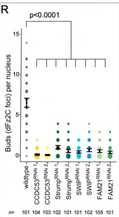

## Question

# Gene Research for Functional Annotation

## ⚠️ CRITICAL: Gene/Protein Identification Context

**BEFORE YOU BEGIN RESEARCH:** You MUST verify you are researching the CORRECT gene/protein. Gene symbols can be ambiguous, especially for less well-characterized genes from non-model organisms.

### Target Gene/Protein Identity (from UniProt):
- **UniProt Accession:** Q9VLT8
- **Protein Description:** RecName: Full=WASH complex subunit 3 {ECO:0000250|UniProtKB:Q9Y3C0}; AltName: Full=Coiled-coil domain-containing protein 53 homolog {ECO:0000305};
- **Gene Information:** Name=CCDC53 {ECO:0000312|FlyBase:FBgn0031979}; ORFNames=CG7429 {ECO:0000312|FlyBase:FBgn0031979};
- **Organism (full):** Drosophila melanogaster (Fruit fly).
- **Protein Family:** Belongs to the CCDC53 family. .
- **Key Domains:** WASHC3. (IPR019309); CCDC53 (PF10152)

### MANDATORY VERIFICATION STEPS:

1. **Check if the gene symbol "CCDC53" matches the protein description above**
2. **Verify the organism is correct:** Drosophila melanogaster (Fruit fly).
3. **Check if protein family/domains align with what you find in literature**
4. **If you find literature for a DIFFERENT gene with the same or similar symbol, STOP**

### If Gene Symbol is Ambiguous or You Cannot Find Relevant Literature:

**DO NOT PROCEED WITH RESEARCH ON A DIFFERENT GENE.** Instead:
- State clearly: "The gene symbol 'CCDC53' is ambiguous or literature is limited for this specific protein"
- Explain what you found (e.g., "Found extensive literature on a different gene with the same symbol in a different organism")
- Describe the protein based ONLY on the UniProt information provided above
- Suggest that the protein function can be inferred from domain/family information

### Research Target:

Please provide a comprehensive research report on the gene **CCDC53** (gene ID: CCDC53, UniProt: Q9VLT8) in DROME.

The research report should be a detailed narrative explaining the function, biological processes, and localization of the gene product. Citations should be given for all claims.

You should prioritize authoritative reviews and primary scientific literature when conducting research. You can supplement
this with annotations you find in gene/protein databases, but these can be outdated or inaccurate.

We are specifically interested in the primary function of the gene - for enzymes, what reaction is catalyzed, and what is the substrate specificity? For transporters, what is the substrate? For structural proteins or adapters, what is the broader structural role? For signaling molecules, what is the role in the pathway.

We are interested in where in or outside the cell the gene product carries out its function.

We are also interested in the signaling or biochemical pathways in which the gene functions. We are less interested in broad pleiotropic effects, except where these elucidate the precise role.

Include evidence where possible. We are interested in both experimental evidence as well as inference from structure, evolution, or bioinformatic analysis. Precise studies should be prioritized over high-throughput, where available.

## Output

Question: You are an expert researcher providing comprehensive, well-cited information.

Provide detailed information focusing on:
1. Key concepts and definitions with current understanding
2. Recent developments and latest research (prioritize 2023-2024 sources)
3. Current applications and real-world implementations
4. Expert opinions and analysis from authoritative sources
5. Relevant statistics and data from recent studies

Format as a comprehensive research report with proper citations. Include URLs and publication dates where available.
Always prioritize recent, authoritative sources and provide specific citations for all major claims.

# Gene Research for Functional Annotation

## ⚠️ CRITICAL: Gene/Protein Identification Context

**BEFORE YOU BEGIN RESEARCH:** You MUST verify you are researching the CORRECT gene/protein. Gene symbols can be ambiguous, especially for less well-characterized genes from non-model organisms.

### Target Gene/Protein Identity (from UniProt):
- **UniProt Accession:** Q9VLT8
- **Protein Description:** RecName: Full=WASH complex subunit 3 {ECO:0000250|UniProtKB:Q9Y3C0}; AltName: Full=Coiled-coil domain-containing protein 53 homolog {ECO:0000305};
- **Gene Information:** Name=CCDC53 {ECO:0000312|FlyBase:FBgn0031979}; ORFNames=CG7429 {ECO:0000312|FlyBase:FBgn0031979};
- **Organism (full):** Drosophila melanogaster (Fruit fly).
- **Protein Family:** Belongs to the CCDC53 family. .
- **Key Domains:** WASHC3. (IPR019309); CCDC53 (PF10152)

### MANDATORY VERIFICATION STEPS:

1. **Check if the gene symbol "CCDC53" matches the protein description above**
2. **Verify the organism is correct:** Drosophila melanogaster (Fruit fly).
3. **Check if protein family/domains align with what you find in literature**
4. **If you find literature for a DIFFERENT gene with the same or similar symbol, STOP**

### If Gene Symbol is Ambiguous or You Cannot Find Relevant Literature:

**DO NOT PROCEED WITH RESEARCH ON A DIFFERENT GENE.** Instead:
- State clearly: "The gene symbol 'CCDC53' is ambiguous or literature is limited for this specific protein"
- Explain what you found (e.g., "Found extensive literature on a different gene with the same symbol in a different organism")
- Describe the protein based ONLY on the UniProt information provided above
- Suggest that the protein function can be inferred from domain/family information

### Research Target:

Please provide a comprehensive research report on the gene **CCDC53** (gene ID: CCDC53, UniProt: Q9VLT8) in DROME.

The research report should be a detailed narrative explaining the function, biological processes, and localization of the gene product. Citations should be given for all claims.

You should prioritize authoritative reviews and primary scientific literature when conducting research. You can supplement
this with annotations you find in gene/protein databases, but these can be outdated or inaccurate.

We are specifically interested in the primary function of the gene - for enzymes, what reaction is catalyzed, and what is the substrate specificity? For transporters, what is the substrate? For structural proteins or adapters, what is the broader structural role? For signaling molecules, what is the role in the pathway.

We are interested in where in or outside the cell the gene product carries out its function.

We are also interested in the signaling or biochemical pathways in which the gene functions. We are less interested in broad pleiotropic effects, except where these elucidate the precise role.

Include evidence where possible. We are interested in both experimental evidence as well as inference from structure, evolution, or bioinformatic analysis. Precise studies should be prioritized over high-throughput, where available.

# Functional annotation report: *Drosophila melanogaster* CCDC53 (Q9VLT8)

## Identity and principal function

The specified target is **fly CCDC53/CG7429, UniProt Q9VLT8**, annotated as WASH complex subunit 3 and assigned to the CCDC53 family (WASHC3/InterPro IPR019309; Pfam PF10152). The organism and accession distinguish it from human CCDC53/WASHC3. Independent *Drosophila* experiments identify CCDC53 as a member of the **WASH regulatory complex** (SHRC), together with Wash, FAM21, Strumpellin and SWIP; thus the gene symbol is consistent with the supplied protein identity rather than pointing to an unrelated protein. The CG7429–Q9VLT8 accession mapping and domain identifiers here are from the supplied UniProt record, whereas complex membership is supported experimentally. (verboon2020drosophilawashand pages 4-6, verboon2020drosophilawashand pages 6-8, verboon2020drosophilawashand pages 8-9)

**Best-supported molecular annotation:** CCDC53 is a **coiled-coil architectural and assembly subunit of an actin-regulatory complex**, not an enzyme, transporter or established direct cargo receptor. The complex positions and regulates Wash, the nucleation-promoting factor that stimulates Arp2/3-dependent branched-actin assembly during membrane remodeling. Accordingly, no catalytic reaction, transported substrate or substrate specificity should be assigned to CCDC53 itself. Its strongest *fly-specific* functional evidence is for SHRC-dependent **nuclear-envelope budding**; an endosomal-sorting role is well supported for Wash and orthologous WASH complexes but is less directly demonstrated for fly CCDC53 individually. (verboon2020drosophilawashand pages 6-8, verboon2020drosophilawashand pages 8-9, nagel2017drosophilawashis pages 1-4, visweshwaran2018thetrimericcoiled‐coil pages 88-91)

The following evidence summary separates measurements on CCDC53 itself from experiments on Wash or proteins in other organisms. The images examined include cropped regions of the 2020 study’s Figure 3 showing CCDC53 at nuclear-envelope buds and the associated perturbation measurements. (verboon2020drosophilawashand media 93bc200f, verboon2020drosophilawashand media 42990efd, verboon2020drosophilawashand media 23fcc7f4)

| Observation / location | Experimental evidence and numbers | Confidence / applicability to fly CCDC53 | DOI URL and year |
|---|---|---|---|
| Nuclear localization; enriched at the neck/base of nuclear-envelope (NE) buds in larval salivary-gland nuclei | Immunofluorescence detected all four SHRC subunits in nuclei and specifically enriched CCDC53 at NE-bud necks (verboon2020drosophilawashand pages 6-8, verboon2020drosophilawashand media 93bc200f) | **High—direct fly CCDC53 evidence.** Supports localization at a membrane-remodeling site, but localization alone does not establish the precise molecular action. | [10.1242/jcs.243576](https://doi.org/10.1242/jcs.243576), 2020 |
| Requirement for NE-bud formation | Two independent RNAi lines were tested for each SHRC subunit, including CCDC53. Across all SHRC RNAi lines, nuclei had **0.1–1.1 ± 0.1 buds per nucleus**, versus **6.6 ± 0.3** in controls; **n > 100** and **p < 0.0001** for each line. The publication does not assign the individual CCDC53 lines exact values within this range (verboon2020drosophilawashand pages 6-8) | **High—direct fly perturbation evidence.** Two RNAi reagents reduce off-target concern, although a CCDC53-specific rescue or null-mutant test was not reported. | [10.1242/jcs.243576](https://doi.org/10.1242/jcs.243576), 2020 |
| Adult indirect-flight-muscle mitochondrial phenotype after CCDC53 depletion | In 21-day-old flies, two CCDC53 RNAi lines reduced ATP-synthetase-α fluorescence/activity **3.8-fold** and **2.9-fold** relative to wild type (**n = 50** and **57**; **p < 0.0001**); polyubiquitin aggregates also increased (verboon2020drosophilawashand pages 6-8) | **High for the phenotype; moderate for its mechanism.** This is direct fly CCDC53 evidence, but mitochondrial impairment is a downstream consequence associated with defective NE budding rather than CCDC53's primary molecular activity. | [10.1242/jcs.243576](https://doi.org/10.1242/jcs.243576), 2020 |
| Nuclear WASH-complex membership | Blue-native PAGE placed CCDC53, Strumpellin, and FAM21 with Wash in an approximately **900-kDa** nuclear complex. Immunoprecipitation showed SHRC components co-immunoprecipitating with Wash and one another (verboon2020drosophilawashand pages 8-9) | **High—direct fly biochemical evidence.** Establishes CCDC53 as a nuclear SHRC component, although the apparent native mass does not define exact stoichiometry. | [10.1242/jcs.243576](https://doi.org/10.1242/jcs.243576), 2020 |
| Separation from the Wash–lamin pathway | CCDC53 RNAi did not visibly disturb Lamin B/Lamin C organization. SHRC subunits did not co-immunoprecipitate with Lamin B or Lamin C, whereas Wash occupied a distinct approximately **450-kDa** Lamin-B-associated complex (verboon2020drosophilawashand pages 8-9) | **High—direct fly negative and pathway-partitioning evidence.** Supports an SHRC-dependent role in bud formation distinct from Wash's SHRC-independent regulation of the nuclear lamina; transient proximity cannot be excluded. | [10.1242/jcs.243576](https://doi.org/10.1242/jcs.243576), 2020 |
| Endosomal integrin recycling and lysosomal neutralization | Fly **Wash**, not CCDC53, generated actin patches on Rab7-positive late endosomes and lysosomes; wash loss impaired βPS-integrin recycling, macrophage spreading and migration, Vha55/V-ATPase-associated lysosome neutralization, and starvation survival (nagel2017drosophilawashis pages 1-4, nagel2017drosophilawashis pages 13-16) | **Indirect for Q9VLT8.** The findings are consistent with conserved SHRC biology, but this study did not perturb CCDC53 and therefore is not direct CG7429 evidence. | [10.1242/jcs.193086](https://doi.org/10.1242/jcs.193086), 2017 |
| Coiled-coil role in WASH-complex assembly | In human cells and *Dictyostelium*, CCDC53 forms a homotrimeric precursor. HSBP1 binds and remodels this precursor into a mixed trimer, enabling one CCDC53 molecule to enter a CCDC53–WASH–FAM21 assembly intermediate; HSBP1 localized at centrosomes, and its depletion phenocopied WASH loss (visweshwaran2018thetrimericcoiled‐coil pages 78-88, visweshwaran2018thetrimericcoiled‐coil pages 98-103, visweshwaran2018thetrimericcoiled‐coil pages 88-91) | **Strong conserved mechanistic inference, not direct fly evidence.** This agrees with the CCDC53/PF10152 coiled-coil-family annotation and indicates an architectural assembly role rather than enzymatic activity. | [10.15252/embj.201797706](https://doi.org/10.15252/embj.201797706), 2018 |
| Recruitment of the WASH complex to endosomal retromer | Structural and binding studies identified two FAM21 regions engaging VPS35 and an R21 peptide forming a sharp bend in a conserved VPS29 hydrophobic pocket. VPS35 D620N did not significantly impair direct FAM21 binding *in vitro*, despite cellular reports of reduced WASH recruitment (romano‐moreno2024retromer‐mediatedrecruitmentof pages 1-2, romano‐moreno2024retromer‐mediatedrecruitmentof pages 8-10) | **High for the mammalian retromer–FAM21 mechanism; indirect for fly CCDC53.** CCDC53 is an architectural subunit rather than the demonstrated retromer-binding interface; recruitment is principally mediated through FAM21. | [10.1002/pro.4980](https://doi.org/10.1002/pro.4980), 2024 |

*Table: Evidence supporting functional annotation of Drosophila Q9VLT8/CCDC53, separated into direct fly findings and conserved mechanistic inference. The table distinguishes CCDC53-specific results from studies that tested Wash or orthologous complexes only.*

## Direct *Drosophila* evidence: location and mechanism

**Nucleus and nuclear envelope.** In larval salivary-gland nuclei, investigators detected CCDC53 and the other SHRC components in the nucleus. CCDC53 is enriched at nuclear-envelope buds, particularly at the **base or neck** of a bud. This identifies an experimentally observed site of action rather than merely a predicted cellular compartment. In fly nuclear extracts, CCDC53, Strumpellin and FAM21 migrated with Wash in an apparent **~900-kDa** complex; immunoprecipitations showed association among Wash and SHRC members. Apparent native mass and co-immunoprecipitation support complex membership but do not establish direct pairwise contact or exact stoichiometry. (verboon2020drosophilawashand pages 6-8, verboon2020drosophilawashand pages 8-9, verboon2020drosophilawashand media 93bc200f)

**Functional requirement for budding.** Two independent RNAi reagents targeting each SHRC subunit, including CCDC53, were tested in salivary glands. Every SHRC knockdown reduced the number of dFz2C-marked nuclear-envelope foci/buds: the **range across all SHRC RNAi lines** was **0.1–1.1 ± 0.1 buds per nucleus**, versus **6.6 ± 0.3** in controls (**more than 100 nuclei per line; P < 0.0001**). The reported range must not be mistaken for separately published values for the two CCDC53 lines. Together with CCDC53 enrichment at bud necks, these perturbations support a requirement for the protein in bud formation. A CCDC53-specific rescue, purified budding reconstitution and direct demonstration of how its coiled coil produces membrane force were not established by these experiments. (verboon2020drosophilawashand pages 6-8, verboon2020drosophilawashand media 93bc200f)

**Placement in the pathway.** The authors propose the sequence **aPKC-associated lamin modification → Wash–SHRC/Arp2/3-dependent early bud formation → Torsin-associated bud scission**. Supporting the ordering, CCDC53 foci disappear when aPKC is depleted but remain associated with buds that accumulate after Torsin knockdown. Independent interference with Arp3 or Arpc1 lowers bud counts from **6.6 ± 0.3** in controls to **0.8 ± 0.1** or **1.0 ± 0.1**, respectively; disruption of the Wash–Arp2/3 interaction gives **0.5 ± 0.1** buds per nucleus. These latter numbers are measurements of *other pathway components*, not direct measurements of CCDC53 catalytic activity. They support a model in which CCDC53-containing SHRC helps enable localized, Wash-driven actin assembly during nuclear-membrane remodeling; the precise physical contribution of CCDC53 at the bud neck remains unresolved. (verboon2020drosophilawashand pages 9-11, verboon2020drosophilawashand pages 11-14)

**A necessary mechanistic distinction:** Wash also forms a separate apparent **~450-kDa** Lamin-B-associated nuclear complex. Unlike Wash depletion, CCDC53 RNAi did **not** visibly separate the Lamin B and Lamin C meshes, and SHRC subunits did not co-immunoprecipitate with Lamin B or Lamin C. A Wash variant defective in SHRC association produced **0.5 ± 0.1** buds per nucleus despite near-normal nuclear morphology, whereas disruption of Wash–Lamin B association gave **1.5 ± 0.1** and altered lamin organization; the corresponding wild-type Wash rescue gave **6.6 ± 0.3**. Consequently, Wash’s direct lamin-associated function **should not be assigned to CCDC53**. (verboon2020drosophilawashand pages 8-9, verboon2020drosophilawashand pages 9-11)

As a downstream observation, two CCDC53 RNAi lines reduced ATP-synthetase-α-associated mitochondrial signal in **21-day-old adult indirect-flight muscle** by **3.8-fold** and **2.9-fold**, respectively, relative to controls (**n = 50 and 57; P < 0.0001**); polyubiquitin aggregates increased. These phenotypes are consistent with the study’s proposed consequences of impaired nuclear-envelope budding, but they do not make CCDC53 a mitochondrial protein or establish a direct mitochondrial biochemical function. (verboon2020drosophilawashand pages 6-8)

## Conserved structural role and endosomal pathway

Work in **human cells and *Dictyostelium*** provides a more molecular account of CCDC53-family function. An EMBO Journal study found a **homotrimeric coiled-coil CCDC53 precursor** and identified HSBP1 as an assembly factor that remodels that precursor, permitting incorporation of one CCDC53 molecule into a **CCDC53–WASH–FAM21 assembly intermediate**. HSBP1 was associated with centrosomes, a proposed assembly site, and its depletion impaired WASH-dependent functions. This explains why a conserved CCDC53/WASHC3 domain is consistent with a *structural assembly role*. It is **ortholog-based inference**, however: those experiments do not establish an HSBP1-dependent assembly mechanism or centrosomal localization for **fly Q9VLT8** directly. (visweshwaran2018thetrimericcoiled‐coil pages 88-91, visweshwaran2018thetrimericcoiled‐coil pages 78-88, fokin2021assemblyandactivity pages 2-4)

For the **endosomal** activity of the assembled complex, the established model is recruitment to endosomal sorting domains, locally stimulated Arp2/3 branched-actin formation, and support of membrane-domain organization and transport-carrier generation. A 2024 structural/biochemical study refined the recruitment step: separate regions of **FAM21**, rather than a demonstrated CCDC53 cargo-binding surface, contact retromer subunits **VPS35 and VPS29**; a FAM21-derived peptide inserts into a VPS29 pocket. Thus the appropriate proposed role for CCDC53 is to **support the WASH machine** operating at endosomes, not to label CCDC53 the direct retromer-binding or integrin-binding subunit. Notably, the Parkinson-associated VPS35 D620N substitution did not significantly weaken the tested direct FAM21 interactions *in vitro*, despite earlier cellular observations of disturbed WASH recruitment; this limits overly simple explanations of retromer–WASH coupling. These are predominantly non-fly mechanistic results. (romano‐moreno2024retromer‐mediatedrecruitmentof pages 1-2, romano‐moreno2024retromer‐mediatedrecruitmentof pages 8-10)

In flies specifically, a **Wash-loss**, rather than CCDC53-loss, study observed Wash-dependent actin patches on **Rab7-positive late endosomes and lysosomes**, altered βPS-integrin-associated recycling in macrophages, and impaired cell spreading and migration. Wash also associated with the V-ATPase subunit Vha55; its loss compromised lysosomal neutralization and increased starvation-associated autolysosomal acidification. These findings make endosomal and lysosomal SHRC function plausible for CCDC53 but **do not establish that depleting CG7429 causes each phenotype**. Similarly, a separate fly hemocyte study found a **Rho1→Wash→Arp2/3 migration pathway independent of SHRC**; assigning that pathway to CCDC53 would contradict the reported distinction. (nagel2017drosophilawashis pages 1-4, nagel2017drosophilawashis pages 13-16, verboon2015washfunctionsdownstream pages 2-3)

## Assessment and research use

**High-confidence annotation** is participation in the *Drosophila* Wash regulatory complex and a requirement for its nuclear-envelope-budding function, with observed enrichment at bud necks. **Mechanistically supported, but partly extrapolated**, is a coiled-coil role in assembling/stabilizing WASH and enabling spatially controlled Arp2/3-dependent actin remodeling. **Not yet gene-specifically established in flies** are CCDC53’s direct endosomal cargo preferences, an endosomal CCDC53 loss-of-function trafficking phenotype, or a unique enzymatic activity. The fly work offers a practical experimental implementation of this annotation—CCDC53 RNAi, bud imaging and nuclear-complex assays—rather than a clinical application. The directly informative fly CCDC53 study located here dates to **2020**; the particularly relevant **2024** advance resolves a *different subunit’s* retromer-binding mechanism and should not be presented as a new fly Q9VLT8 experiment. (verboon2020drosophilawashand pages 6-8, verboon2020drosophilawashand pages 8-9, romano‐moreno2024retromer‐mediatedrecruitmentof pages 1-2, visweshwaran2018thetrimericcoiled‐coil pages 88-91)

### Principal sources and publication dates

- Verboon *et al.*, **July 2020**, “*Drosophila* Wash and the Wash regulatory complex function in nuclear envelope budding,” *Journal of Cell Science*. https://doi.org/10.1242/jcs.243576. **Primary, direct fly CCDC53 evidence.** (verboon2020drosophilawashand pages 6-8, verboon2020drosophilawashand pages 8-9)
- Romano-Moreno *et al.*, **April 2024**, “Retromer-mediated recruitment of the WASH complex involves discrete interactions between VPS35, VPS29, and FAM21,” *Protein Science*. https://doi.org/10.1002/pro.4980. **Recent mechanistic work, not direct fly CCDC53 evidence.** (romano‐moreno2024retromer‐mediatedrecruitmentof pages 1-2)
- Visweshwaran *et al.*, **May 2018**, “The trimeric coiled-coil HSBP1 protein promotes WASH complex assembly at centrosomes,” *The EMBO Journal*. https://doi.org/10.15252/embj.201797706. **Comparative CCDC53 assembly mechanism.** (visweshwaran2018thetrimericcoiled‐coil pages 88-91, visweshwaran2018thetrimericcoiled‐coil pages 98-103)
- Nagel *et al.*, **January 2017**, “Drosophila WASH is required for integrin-mediated cell adhesion, cell motility and lysosomal neutralization,” *Journal of Cell Science*. https://doi.org/10.1242/jcs.193086. **Fly Wash experiments; not CCDC53-specific perturbation.** (nagel2017drosophilawashis pages 1-4, nagel2017drosophilawashis pages 13-16)
- Fokin and Gautreau, **April 2021**, “Assembly and Activity of the WASH Molecular Machine,” *Frontiers in Cell and Developmental Biology*. https://doi.org/10.3389/fcell.2021.658865. **Expert synthesis of assembly and endosomal actin mechanisms.** (fokin2021assemblyandactivity pages 2-4)

References

1. (verboon2020drosophilawashand pages 4-6): Jeffrey M. Verboon, Mitsutoshi Nakamura, Kerri A. Davidson, Jacob R. Decker, Vivek Nandakumar, and Susan M. Parkhurst. <i>drosophila</i> wash and the wash regulatory complex function in nuclear envelope budding. Journal of Cell Science, Jul 2020. URL: https://doi.org/10.1242/jcs.243576, doi:10.1242/jcs.243576. This article has 16 citations and is from a domain leading peer-reviewed journal.

2. (verboon2020drosophilawashand pages 6-8): Jeffrey M. Verboon, Mitsutoshi Nakamura, Kerri A. Davidson, Jacob R. Decker, Vivek Nandakumar, and Susan M. Parkhurst. <i>drosophila</i> wash and the wash regulatory complex function in nuclear envelope budding. Journal of Cell Science, Jul 2020. URL: https://doi.org/10.1242/jcs.243576, doi:10.1242/jcs.243576. This article has 16 citations and is from a domain leading peer-reviewed journal.

3. (verboon2020drosophilawashand pages 8-9): Jeffrey M. Verboon, Mitsutoshi Nakamura, Kerri A. Davidson, Jacob R. Decker, Vivek Nandakumar, and Susan M. Parkhurst. <i>drosophila</i> wash and the wash regulatory complex function in nuclear envelope budding. Journal of Cell Science, Jul 2020. URL: https://doi.org/10.1242/jcs.243576, doi:10.1242/jcs.243576. This article has 16 citations and is from a domain leading peer-reviewed journal.

4. (nagel2017drosophilawashis pages 1-4): Benedikt M. Nagel, Meike Bechtold, Luis Garcia Rodriguez, and Sven Bogdan. Drosophila wash is required for integrin-mediated cell adhesion, cell motility and lysosomal neutralization. Journal of Cell Science, 130:344-359, Jan 2017. URL: https://doi.org/10.1242/jcs.193086, doi:10.1242/jcs.193086. This article has 49 citations and is from a domain leading peer-reviewed journal.

5. (visweshwaran2018thetrimericcoiled‐coil pages 88-91): Sai P Visweshwaran, Peter A Thomason, Raphael Guerois, Sophie Vacher, Evgeny V Denisov, Lubov A Tashireva, Maria E Lomakina, Christine Lazennec‐Schurdevin, Goran Lakisic, Sergio Lilla, Nicolas Molinie, Veronique Henriot, Yves Mechulam, Antonina Y Alexandrova, Nadezhda V Cherdyntseva, Ivan Bièche, Emmanuelle Schmitt, Robert H Insall, and Alexis Gautreau. The trimeric coiled‐coil hsbp1 protein promotes wash complex assembly at centrosomes. The EMBO Journal, May 2018. URL: https://doi.org/10.15252/embj.201797706, doi:10.15252/embj.201797706. This article has 39 citations.

6. (verboon2020drosophilawashand media 93bc200f): Jeffrey M. Verboon, Mitsutoshi Nakamura, Kerri A. Davidson, Jacob R. Decker, Vivek Nandakumar, and Susan M. Parkhurst. <i>drosophila</i> wash and the wash regulatory complex function in nuclear envelope budding. Journal of Cell Science, Jul 2020. URL: https://doi.org/10.1242/jcs.243576, doi:10.1242/jcs.243576. This article has 16 citations and is from a domain leading peer-reviewed journal.

7. (verboon2020drosophilawashand media 42990efd): Jeffrey M. Verboon, Mitsutoshi Nakamura, Kerri A. Davidson, Jacob R. Decker, Vivek Nandakumar, and Susan M. Parkhurst. <i>drosophila</i> wash and the wash regulatory complex function in nuclear envelope budding. Journal of Cell Science, Jul 2020. URL: https://doi.org/10.1242/jcs.243576, doi:10.1242/jcs.243576. This article has 16 citations and is from a domain leading peer-reviewed journal.

8. (verboon2020drosophilawashand media 23fcc7f4): Jeffrey M. Verboon, Mitsutoshi Nakamura, Kerri A. Davidson, Jacob R. Decker, Vivek Nandakumar, and Susan M. Parkhurst. <i>drosophila</i> wash and the wash regulatory complex function in nuclear envelope budding. Journal of Cell Science, Jul 2020. URL: https://doi.org/10.1242/jcs.243576, doi:10.1242/jcs.243576. This article has 16 citations and is from a domain leading peer-reviewed journal.

9. (nagel2017drosophilawashis pages 13-16): Benedikt M. Nagel, Meike Bechtold, Luis Garcia Rodriguez, and Sven Bogdan. Drosophila wash is required for integrin-mediated cell adhesion, cell motility and lysosomal neutralization. Journal of Cell Science, 130:344-359, Jan 2017. URL: https://doi.org/10.1242/jcs.193086, doi:10.1242/jcs.193086. This article has 49 citations and is from a domain leading peer-reviewed journal.

10. (visweshwaran2018thetrimericcoiled‐coil pages 78-88): Sai P Visweshwaran, Peter A Thomason, Raphael Guerois, Sophie Vacher, Evgeny V Denisov, Lubov A Tashireva, Maria E Lomakina, Christine Lazennec‐Schurdevin, Goran Lakisic, Sergio Lilla, Nicolas Molinie, Veronique Henriot, Yves Mechulam, Antonina Y Alexandrova, Nadezhda V Cherdyntseva, Ivan Bièche, Emmanuelle Schmitt, Robert H Insall, and Alexis Gautreau. The trimeric coiled‐coil hsbp1 protein promotes wash complex assembly at centrosomes. The EMBO Journal, May 2018. URL: https://doi.org/10.15252/embj.201797706, doi:10.15252/embj.201797706. This article has 39 citations.

11. (visweshwaran2018thetrimericcoiled‐coil pages 98-103): Sai P Visweshwaran, Peter A Thomason, Raphael Guerois, Sophie Vacher, Evgeny V Denisov, Lubov A Tashireva, Maria E Lomakina, Christine Lazennec‐Schurdevin, Goran Lakisic, Sergio Lilla, Nicolas Molinie, Veronique Henriot, Yves Mechulam, Antonina Y Alexandrova, Nadezhda V Cherdyntseva, Ivan Bièche, Emmanuelle Schmitt, Robert H Insall, and Alexis Gautreau. The trimeric coiled‐coil hsbp1 protein promotes wash complex assembly at centrosomes. The EMBO Journal, May 2018. URL: https://doi.org/10.15252/embj.201797706, doi:10.15252/embj.201797706. This article has 39 citations.

12. (romano‐moreno2024retromer‐mediatedrecruitmentof pages 1-2): Miguel Romano‐Moreno, Elsa N. Astorga‐Simón, Adriana L. Rojas, and Aitor Hierro. Retromer‐mediated recruitment of the <scp>wash</scp> complex involves discrete interactions between <scp>vps35</scp>, <scp>vps29,</scp> and <scp>fam21</scp>. Protein Science, Apr 2024. URL: https://doi.org/10.1002/pro.4980, doi:10.1002/pro.4980. This article has 15 citations and is from a peer-reviewed journal.

13. (romano‐moreno2024retromer‐mediatedrecruitmentof pages 8-10): Miguel Romano‐Moreno, Elsa N. Astorga‐Simón, Adriana L. Rojas, and Aitor Hierro. Retromer‐mediated recruitment of the <scp>wash</scp> complex involves discrete interactions between <scp>vps35</scp>, <scp>vps29,</scp> and <scp>fam21</scp>. Protein Science, Apr 2024. URL: https://doi.org/10.1002/pro.4980, doi:10.1002/pro.4980. This article has 15 citations and is from a peer-reviewed journal.

14. (verboon2020drosophilawashand pages 9-11): Jeffrey M. Verboon, Mitsutoshi Nakamura, Kerri A. Davidson, Jacob R. Decker, Vivek Nandakumar, and Susan M. Parkhurst. <i>drosophila</i> wash and the wash regulatory complex function in nuclear envelope budding. Journal of Cell Science, Jul 2020. URL: https://doi.org/10.1242/jcs.243576, doi:10.1242/jcs.243576. This article has 16 citations and is from a domain leading peer-reviewed journal.

15. (verboon2020drosophilawashand pages 11-14): Jeffrey M. Verboon, Mitsutoshi Nakamura, Kerri A. Davidson, Jacob R. Decker, Vivek Nandakumar, and Susan M. Parkhurst. <i>drosophila</i> wash and the wash regulatory complex function in nuclear envelope budding. Journal of Cell Science, Jul 2020. URL: https://doi.org/10.1242/jcs.243576, doi:10.1242/jcs.243576. This article has 16 citations and is from a domain leading peer-reviewed journal.

16. (fokin2021assemblyandactivity pages 2-4): Artem I. Fokin and Alexis M. Gautreau. Assembly and activity of the wash molecular machine: distinctive features at the crossroads of the actin and microtubule cytoskeletons. Frontiers in Cell and Developmental Biology, Apr 2021. URL: https://doi.org/10.3389/fcell.2021.658865, doi:10.3389/fcell.2021.658865. This article has 34 citations.

17. (verboon2015washfunctionsdownstream pages 2-3): Jeffrey M. Verboon, Travis K. Rahe, Evelyn Rodriguez-Mesa, and Susan M. Parkhurst. Wash functions downstream of rho1 gtpase in a subset of drosophila immune cell developmental migrations. Molecular Biology of the Cell, 26:1665-1674, May 2015. URL: https://doi.org/10.1091/mbc.e14-08-1266, doi:10.1091/mbc.e14-08-1266. This article has 25 citations and is from a domain leading peer-reviewed journal.

## Artifacts

- [Edison artifact artifact-00](CCDC53-deep-research-falcon_artifacts/artifact-00.md)

## Citations

1. verboon2020drosophilawashand pages 6-8
2. verboon2020drosophilawashand pages 8-9
3. fokin2021assemblyandactivity pages 2-4
4. verboon2020drosophilawashand pages 4-6
5. nagel2017drosophilawashis pages 1-4
6. nagel2017drosophilawashis pages 13-16
7. verboon2020drosophilawashand pages 9-11
8. verboon2020drosophilawashand pages 11-14
9. verboon2015washfunctionsdownstream pages 2-3
10. 10.1242/jcs.243576
11. 10.1242/jcs.193086
12. 10.15252/embj.201797706
13. 10.1002/pro.4980
14. https://doi.org/10.1242/jcs.243576
15. https://doi.org/10.1242/jcs.193086
16. https://doi.org/10.15252/embj.201797706
17. https://doi.org/10.1002/pro.4980
18. https://doi.org/10.1242/jcs.243576.
19. https://doi.org/10.1002/pro.4980.
20. https://doi.org/10.15252/embj.201797706.
21. https://doi.org/10.1242/jcs.193086.
22. https://doi.org/10.3389/fcell.2021.658865.
23. https://doi.org/10.1242/jcs.243576,
24. https://doi.org/10.1242/jcs.193086,
25. https://doi.org/10.15252/embj.201797706,
26. https://doi.org/10.1002/pro.4980,
27. https://doi.org/10.3389/fcell.2021.658865,
28. https://doi.org/10.1091/mbc.e14-08-1266,