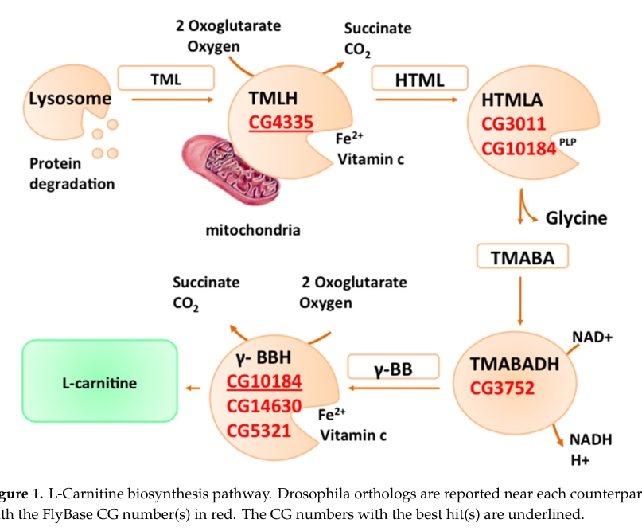

## Question

# Gene Research for Functional Annotation

## ⚠️ CRITICAL: Gene/Protein Identification Context

**BEFORE YOU BEGIN RESEARCH:** You MUST verify you are researching the CORRECT gene/protein. Gene symbols can be ambiguous, especially for less well-characterized genes from non-model organisms.

### Target Gene/Protein Identity (from UniProt):
- **UniProt Accession:** Q9VCK6
- **Protein Description:** RecName: Full=Aromatic amino acid beta-eliminating lyase/threonine aldolase domain-containing protein {ECO:0000259|Pfam:PF01212};
- **Gene Information:** Name=Dmel\CG10184 {ECO:0000313|EMBL:AAF56152.1}; Synonyms=HTMLA {ECO:0000313|EMBL:AAF56152.1}; ORFNames=CG10184 {ECO:0000313|EMBL:AAF56152.1, ECO:0000313|FlyBase:FBgn0039094}, Dmel_CG10184 {ECO:0000313|EMBL:AAF56152.1};
- **Organism (full):** Drosophila melanogaster (Fruit fly).
- **Protein Family:** Belongs to the threonine aldolase family.
- **Key Domains:** ArAA_b-elim_lyase/Thr_aldolase. (IPR001597); Low_specificity_L-TA-like. (IPR023603); PyrdxlP-dep_Trfase. (IPR015424); PyrdxlP-dep_Trfase_major. (IPR015421); PyrdxlP-dep_Trfase_small. (IPR015422)

### MANDATORY VERIFICATION STEPS:

1. **Check if the gene symbol "Dmel\CG10184" matches the protein description above**
2. **Verify the organism is correct:** Drosophila melanogaster (Fruit fly).
3. **Check if protein family/domains align with what you find in literature**
4. **If you find literature for a DIFFERENT gene with the same or similar symbol, STOP**

### If Gene Symbol is Ambiguous or You Cannot Find Relevant Literature:

**DO NOT PROCEED WITH RESEARCH ON A DIFFERENT GENE.** Instead:
- State clearly: "The gene symbol 'Dmel\CG10184' is ambiguous or literature is limited for this specific protein"
- Explain what you found (e.g., "Found extensive literature on a different gene with the same symbol in a different organism")
- Describe the protein based ONLY on the UniProt information provided above
- Suggest that the protein function can be inferred from domain/family information

### Research Target:

Please provide a comprehensive research report on the gene **Dmel\CG10184** (gene ID: CG10184, UniProt: Q9VCK6) in DROME.

The research report should be a detailed narrative explaining the function, biological processes, and localization of the gene product. Citations should be given for all claims.

You should prioritize authoritative reviews and primary scientific literature when conducting research. You can supplement
this with annotations you find in gene/protein databases, but these can be outdated or inaccurate.

We are specifically interested in the primary function of the gene - for enzymes, what reaction is catalyzed, and what is the substrate specificity? For transporters, what is the substrate? For structural proteins or adapters, what is the broader structural role? For signaling molecules, what is the role in the pathway.

We are interested in where in or outside the cell the gene product carries out its function.

We are also interested in the signaling or biochemical pathways in which the gene functions. We are less interested in broad pleiotropic effects, except where these elucidate the precise role.

Include evidence where possible. We are interested in both experimental evidence as well as inference from structure, evolution, or bioinformatic analysis. Precise studies should be prioritized over high-throughput, where available.

## Output

Question: You are an expert researcher providing comprehensive, well-cited information.

Provide detailed information focusing on:
1. Key concepts and definitions with current understanding
2. Recent developments and latest research (prioritize 2023-2024 sources)
3. Current applications and real-world implementations
4. Expert opinions and analysis from authoritative sources
5. Relevant statistics and data from recent studies

Format as a comprehensive research report with proper citations. Include URLs and publication dates where available.
Always prioritize recent, authoritative sources and provide specific citations for all major claims.

# Gene Research for Functional Annotation

## ⚠️ CRITICAL: Gene/Protein Identification Context

**BEFORE YOU BEGIN RESEARCH:** You MUST verify you are researching the CORRECT gene/protein. Gene symbols can be ambiguous, especially for less well-characterized genes from non-model organisms.

### Target Gene/Protein Identity (from UniProt):
- **UniProt Accession:** Q9VCK6
- **Protein Description:** RecName: Full=Aromatic amino acid beta-eliminating lyase/threonine aldolase domain-containing protein {ECO:0000259|Pfam:PF01212};
- **Gene Information:** Name=Dmel\CG10184 {ECO:0000313|EMBL:AAF56152.1}; Synonyms=HTMLA {ECO:0000313|EMBL:AAF56152.1}; ORFNames=CG10184 {ECO:0000313|EMBL:AAF56152.1, ECO:0000313|FlyBase:FBgn0039094}, Dmel_CG10184 {ECO:0000313|EMBL:AAF56152.1};
- **Organism (full):** Drosophila melanogaster (Fruit fly).
- **Protein Family:** Belongs to the threonine aldolase family.
- **Key Domains:** ArAA_b-elim_lyase/Thr_aldolase. (IPR001597); Low_specificity_L-TA-like. (IPR023603); PyrdxlP-dep_Trfase. (IPR015424); PyrdxlP-dep_Trfase_major. (IPR015421); PyrdxlP-dep_Trfase_small. (IPR015422)

### MANDATORY VERIFICATION STEPS:

1. **Check if the gene symbol "Dmel\CG10184" matches the protein description above**
2. **Verify the organism is correct:** Drosophila melanogaster (Fruit fly).
3. **Check if protein family/domains align with what you find in literature**
4. **If you find literature for a DIFFERENT gene with the same or similar symbol, STOP**

### If Gene Symbol is Ambiguous or You Cannot Find Relevant Literature:

**DO NOT PROCEED WITH RESEARCH ON A DIFFERENT GENE.** Instead:
- State clearly: "The gene symbol 'Dmel\CG10184' is ambiguous or literature is limited for this specific protein"
- Explain what you found (e.g., "Found extensive literature on a different gene with the same symbol in a different organism")
- Describe the protein based ONLY on the UniProt information provided above
- Suggest that the protein function can be inferred from domain/family information

### Research Target:

Please provide a comprehensive research report on the gene **Dmel\CG10184** (gene ID: CG10184, UniProt: Q9VCK6) in DROME.

The research report should be a detailed narrative explaining the function, biological processes, and localization of the gene product. Citations should be given for all claims.

You should prioritize authoritative reviews and primary scientific literature when conducting research. You can supplement
this with annotations you find in gene/protein databases, but these can be outdated or inaccurate.

We are specifically interested in the primary function of the gene - for enzymes, what reaction is catalyzed, and what is the substrate specificity? For transporters, what is the substrate? For structural proteins or adapters, what is the broader structural role? For signaling molecules, what is the role in the pathway.

We are interested in where in or outside the cell the gene product carries out its function.

We are also interested in the signaling or biochemical pathways in which the gene functions. We are less interested in broad pleiotropic effects, except where these elucidate the precise role.

Include evidence where possible. We are interested in both experimental evidence as well as inference from structure, evolution, or bioinformatic analysis. Precise studies should be prioritized over high-throughput, where available.

# Functional annotation of *Drosophila melanogaster* CG10184 (UniProt Q9VCK6)

## Identity and principal conclusion

**The gene symbol ‘Dmel\CG10184’ is unambiguous in the supplied UniProt record, but literature is limited for this specific protein.** The supplied record identifies a *D. melanogaster* protein in the threonine-aldolase family, with aromatic-amino-acid β-eliminating-lyase/threonine-aldolase and pyridoxal-phosphate-dependent enzyme domains. Independently, a review of fly carnitine metabolism calls CG10184 an **uncharacterized** putative ortholog of mouse Tha1/GLY1. Family membership supports a hypothesis that CG10184 catalyzes a pyridoxal-5′-phosphate (PLP)-dependent reaction involving a β-hydroxy amino acid; it does **not** establish its physiological substrate, reaction rate, pathway, or location in the cell. (carillo2020lcarnitineindrosophila pages 3-5, fesko2018bioinformaticanalysisof pages 1-2)

The distinction between annotation and demonstrated function is central to this report:

| Claim | Evidence level | Interpretation |
|---|---|---|
| **Identity:** CG10184 (UniProt Q9VCK6) is an uncharacterized *Drosophila melanogaster* protein assigned to the threonine-aldolase/PLP-dependent enzyme family and described as a putative ortholog of mouse Tha1/GLY1. | **Database-supported comparative annotation** (carillo2020lcarnitineindrosophila pages 3-5) | The gene, organism, and broad protein family are consistent, but a specific enzymatic function has not been demonstrated experimentally in the fly. |
| **Canonical threonine-aldolase reaction:** L-threonine or L-allo-threonine ⇌ glycine + acetaldehyde. | **Enzyme-class inference; not measured for CG10184** (fesko2018bioinformaticanalysisof pages 1-2, fesko2016threoninealdolasesperspectives pages 1-2) | This is a plausible candidate activity based on family membership, not a demonstrated CG10184 reaction. Related PLP enzymes differ substantially in substrate and stereoisomer specificity. |
| **Candidate carnitine-pathway reaction:** 3-hydroxy-N6-trimethyllysine (HTML) → 4-trimethylaminobutyraldehyde (TMABA) + glycine. | **Pathway-level hypothesis only** (carillo2020lcarnitineindrosophila pages 3-5) | A 2020 review identified CG10184 as a possible HTML aldolase-related candidate but expressly stated that no experimental evidence connects it to *Drosophila* carnitine biosynthesis. |
| **Cellular localization of CG10184 protein.** | **Unknown; no direct evidence retrieved** | No gene-specific microscopy, fractionation, targeting-sequence validation, or other localization experiment was found. Cytosolic, mitochondrial, and other assignments therefore remain unsubstantiated. |
| **γ-Butyrobetaine hydroxylase assignment:** CG10184 was also listed with CG14630 and CG5321 as a candidate for the terminal carnitine-biosynthesis enzyme. | **Conflicting annotation** (carillo2020lcarnitineindrosophila pages 3-5, carillo2020lcarnitineindrosophila media 5fa6a7ac) | The same review places CG10184 in both the PLP-dependent HTML-aldolase branch and the chemically distinct γ-butyrobetaine-hydroxylase branch. This inconsistency means the hydroxylase designation should not be accepted without biochemical validation. |
| **Recent threonine-aldolase engineering:** a 2023 study screened more than 4,000 mutants; about 10% retained activity, and the best *Pseudomonas putida* variant achieved 72% conversion and 86% diastereoselectivity. | **Direct bacterial experiment; not CG10184 evidence** (li2023comprehensivescreeningstrategy pages 1-2) | The study illustrates threonine-aldolase catalytic plasticity and application potential, but its results do not establish CG10184 activity, specificity, localization, or physiological function in *Drosophila*. |

*Table: Evidence-tier summary separating supported identity and family annotation from reaction hypotheses, conflicting pathway assignments, and non-fly research. It highlights the lack of direct biochemical and localization evidence for CG10184.*

## Candidate biochemical functions and pathways

**Threonine-aldolase hypothesis.** Characterized members of this enzyme class catalyze reversible retro-aldol cleavage, **L-threonine or L-allo-threonine ⇌ glycine + acetaldehyde**. In the reverse direction, glycine and an aldehyde form a β-hydroxy-α-amino acid. These reactions explain the family annotation for CG10184, but the retrieved studies do not demonstrate either reaction for purified CG10184. In particular, they do not determine whether it prefers L-threonine, L-allo-threonine, another β-hydroxy amino acid, or a different substrate. Work on other PLP-dependent aldolases shows that active-site differences can substantially change reaction and stereochemical preferences; a domain label alone cannot resolve CG10184 substrate specificity. (fesko2018bioinformaticanalysisof pages 1-2, fesko2016threoninealdolasesperspectives pages 1-2)

**Carnitine-biosynthesis hypothesis.** In the chemically characterized carnitine pathway, trimethyllysine is hydroxylated to **3-hydroxy-N6-trimethyllysine (HTML)**. An HTML aldolase then cleaves HTML into **4-trimethylaminobutyraldehyde (TMABA) and glycine**; subsequent oxidation and hydroxylation yield carnitine. Because threonine aldolases can perform related carbon–carbon bond cleavage, CG10184 has been proposed as a candidate for the HTML-aldolase step. The fly-focused review explicitly states, however, that there is **no experimental evidence that CG10184 participates in fly carnitine biosynthesis** and that a functional carnitine-biosynthesis pathway had not been demonstrated in *D. melanogaster*. Thus, HTML cleavage should be reported as a pathway hypothesis, not the protein’s established primary reaction. (carillo2020lcarnitineindrosophila pages 3-5, laranjeira2021characterizationofageing pages 29-34)

There is an important **conflicting assignment within that same review**: its HTML-aldolase discussion places CG10184 with the threonine-aldolase candidate, while its later γ-butyrobetaine-hydroxylase discussion also lists CG10184 alongside CG14630 and CG5321. Inspection of the review’s Figure 1 confirms that CG10184 appears at **both** pathway steps. The latter is a different reaction—the terminal hydroxylation of γ-butyrobetaine to carnitine—and the dual assignment does not demonstrate that CG10184 performs either reaction. It should not be treated as biochemical evidence that CG10184 is a γ-butyrobetaine hydroxylase or that CG14630 and CG5321 share CG10184’s threonine-aldolase-family function. (carillo2020lcarnitineindrosophila pages 3-5, carillo2020lcarnitineindrosophila media 5fa6a7ac)

## Biological process and cellular localization

At present, **amino-acid-related PLP enzyme activity is the defensible family-level functional annotation**. A role in threonine-to-glycine metabolism is plausible by analogy with characterized aldolases; a role in the HTML-cleavage branch of carnitine production is more specifically proposed but remains untested for this gene. Neither hypothesis warrants assigning a confirmed flux contribution or downstream fatty-acid-oxidation phenotype to CG10184. The evidence reviewed here also does not establish its subcellular localization: there is no CG10184-specific localization experiment in the retrieved sources. Its site of action should therefore be recorded as **unknown**, rather than designated cytosolic or mitochondrial from pathway context. (carillo2020lcarnitineindrosophila pages 3-5, fesko2018bioinformaticanalysisof pages 1-2, fesko2016threoninealdolasesperspectives pages 1-2)

## Recent research and practical implications

Recent work strengthens the **methodological caution**, not the functional assignment of the fly protein. In a primary study published **30 January 2023**, researchers screened **more than 4,000 mutants** of a *Pseudomonas putida* L-threonine aldolase; approximately **10%** retained activity toward the tested aromatic aldehyde. An engineered variant achieved **72% conversion** and **86% diastereoselectivity** in synthesis of a β-hydroxy amino acid. These are bacterial biocatalysis results, **not measurements of CG10184**. They illustrate both a real-world application of characterized threonine aldolases—as catalysts for valuable amino-acid building blocks—and why homologous-enzyme specificity must be tested rather than assumed. No CG10184-specific implementation or validated application was established by the literature reviewed. (li2023comprehensivescreeningstrategy pages 1-2)

**Research priority.** The decisive experiments would express and purify CG10184, compare PLP-dependent activity and kinetics with L-threonine, L-allo-threonine and HTML, identify reaction products, and test whether a CG10184 perturbation changes fly carnitine-pathway metabolites. Protein-localization measurements would independently establish where any activity occurs. These are proposed validation steps, **not reported results for CG10184**. (carillo2020lcarnitineindrosophila pages 3-5, fesko2018bioinformaticanalysisof pages 1-2, fesko2016threoninealdolasesperspectives pages 1-2)

### Principal sources and dates

- Carillo MR *et al.* **December 2020**. “L-Carnitine in *Drosophila*: A Review.” *Antioxidants* 9:1310. https://doi.org/10.3390/antiox9121310 — target-specific comparative annotation and explicit limits on fly-pathway evidence. (carillo2020lcarnitineindrosophila pages 3-5, carillo2020lcarnitineindrosophila media 5fa6a7ac)
- Fesko K. **Published online 26 January 2016**. “Threonine aldolases: perspectives in engineering and screening the enzymes with enhanced substrate and stereo specificities.” *Applied Microbiology and Biotechnology* 100:2579–2590. https://doi.org/10.1007/s00253-015-7218-5 — enzyme-class chemistry and specificity. (fesko2016threoninealdolasesperspectives pages 1-2)
- Fesko K, Suplatov D, Švedas V. **2018**. “Bioinformatic analysis of the fold type I PLP-dependent enzymes reveals determinants of reaction specificity in L-threonine aldolase from *Aeromonas jandaei*.” *FEBS Open Bio* 8:1013–1028. https://doi.org/10.1002/2211-5463.12441 — primary non-fly structure–function evidence. (fesko2018bioinformaticanalysisof pages 1-2)
- Li L *et al.* **30 January 2023**. “Comprehensive screening strategy coupled with structure-guided engineering of L-threonine aldolase from *Pseudomonas putida*.” *Frontiers in Bioengineering and Biotechnology* 11:1117890. https://doi.org/10.3389/fbioe.2023.1117890 — recent primary biocatalysis results, not fly-gene validation. (li2023comprehensivescreeningstrategy pages 1-2)

References

1. (carillo2020lcarnitineindrosophila pages 3-5): Maria Rosaria Carillo, Carla Bertapelle, Filippo Scialò, Mario Siervo, Gianrico Spagnuolo, Michele Simeone, Gianfranco Peluso, and Filomena Anna Digilio. L-carnitine in drosophila: a review. Antioxidants, 9:1310, Dec 2020. URL: https://doi.org/10.3390/antiox9121310, doi:10.3390/antiox9121310. This article has 42 citations.

2. (fesko2018bioinformaticanalysisof pages 1-2): Kateryna Fesko, Dmitry Suplatov, and Vytas Švedas. Bioinformatic analysis of the fold type i plp‐dependent enzymes reveals determinants of reaction specificity in l‐threonine aldolase from aeromonas jandaei. FEBS Open Bio, 8:1013-1028, May 2018. URL: https://doi.org/10.1002/2211-5463.12441, doi:10.1002/2211-5463.12441. This article has 56 citations and is from a peer-reviewed journal.

3. (fesko2016threoninealdolasesperspectives pages 1-2): Kateryna Fesko. Threonine aldolases: perspectives in engineering and screening the enzymes with enhanced substrate and stereo specificities. Applied Microbiology and Biotechnology, 100:2579-2590, Jan 2016. URL: https://doi.org/10.1007/s00253-015-7218-5, doi:10.1007/s00253-015-7218-5. This article has 108 citations and is from a domain leading peer-reviewed journal.

4. (carillo2020lcarnitineindrosophila media 5fa6a7ac): Maria Rosaria Carillo, Carla Bertapelle, Filippo Scialò, Mario Siervo, Gianrico Spagnuolo, Michele Simeone, Gianfranco Peluso, and Filomena Anna Digilio. L-carnitine in drosophila: a review. Antioxidants, 9:1310, Dec 2020. URL: https://doi.org/10.3390/antiox9121310, doi:10.3390/antiox9121310. This article has 42 citations.

5. (li2023comprehensivescreeningstrategy pages 1-2): Lihong Li, Rongzhen Zhang, Yan Xu, and Wenchi Zhang. Comprehensive screening strategy coupled with structure-guided engineering of l-threonine aldolase from pseudomonas putida for enhanced catalytic efficiency towards l-threo-4-methylsulfonylphenylserine. Frontiers in Bioengineering and Biotechnology, Jan 2023. URL: https://doi.org/10.3389/fbioe.2023.1117890, doi:10.3389/fbioe.2023.1117890. This article has 17 citations.

6. (laranjeira2021characterizationofageing pages 29-34): A Folgado Laranjeira, P Callaerts, J Schulz, and C Dotti. Characterization of ageing genes in the drosophila nervous system. Unknown journal, 2021.

## Artifacts

- [Edison artifact artifact-00](CG10184-deep-research-falcon_artifacts/artifact-00.md)

## Citations

1. carillo2020lcarnitineindrosophila pages 3-5
2. li2023comprehensivescreeningstrategy pages 1-2
3. fesko2016threoninealdolasesperspectives pages 1-2
4. fesko2018bioinformaticanalysisof pages 1-2
5. laranjeira2021characterizationofageing pages 29-34
6. https://doi.org/10.3390/antiox9121310
7. https://doi.org/10.1007/s00253-015-7218-5
8. https://doi.org/10.1002/2211-5463.12441
9. https://doi.org/10.3389/fbioe.2023.1117890
10. https://doi.org/10.3390/antiox9121310,
11. https://doi.org/10.1002/2211-5463.12441,
12. https://doi.org/10.1007/s00253-015-7218-5,
13. https://doi.org/10.3389/fbioe.2023.1117890,