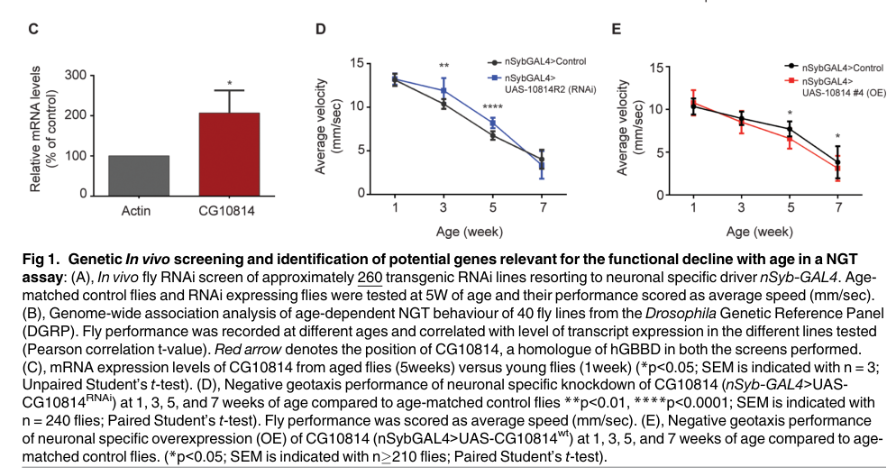

## Question

# Gene Research for Functional Annotation

## ⚠️ CRITICAL: Gene/Protein Identification Context

**BEFORE YOU BEGIN RESEARCH:** You MUST verify you are researching the CORRECT gene/protein. Gene symbols can be ambiguous, especially for less well-characterized genes from non-model organisms.

### Target Gene/Protein Identity (from UniProt):
- **UniProt Accession:** A1Z9C1
- **Protein Description:** SubName: Full=Uncharacterized protein {ECO:0000313|EMBL:AAF58383.1};
- **Gene Information:** Name=Dmel\CG10814 {ECO:0000313|EMBL:AAF58383.1}; Synonyms=dGBBD {ECO:0000313|EMBL:AAF58383.1}, gamma-BBH {ECO:0000313|EMBL:AAF58383.1}; ORFNames=CG10814 {ECO:0000313|EMBL:AAF58383.1}, Dmel_CG10814 {ECO:0000313|EMBL:AAF58383.1};
- **Organism (full):** Drosophila melanogaster (Fruit fly).
- **Protein Family:** Belongs to the gamma-BBH/TMLD family.
- **Key Domains:** AlphaKG_dependent_hydroxylases. (IPR050411); GBBH-like_N. (IPR010376); GBBH-like_N_sf. (IPR038492); GlaH-like_sf. (IPR042098); TauD/TfdA-like. (IPR003819)

### MANDATORY VERIFICATION STEPS:

1. **Check if the gene symbol "Dmel\CG10814" matches the protein description above**
2. **Verify the organism is correct:** Drosophila melanogaster (Fruit fly).
3. **Check if protein family/domains align with what you find in literature**
4. **If you find literature for a DIFFERENT gene with the same or similar symbol, STOP**

### If Gene Symbol is Ambiguous or You Cannot Find Relevant Literature:

**DO NOT PROCEED WITH RESEARCH ON A DIFFERENT GENE.** Instead:
- State clearly: "The gene symbol 'Dmel\CG10814' is ambiguous or literature is limited for this specific protein"
- Explain what you found (e.g., "Found extensive literature on a different gene with the same symbol in a different organism")
- Describe the protein based ONLY on the UniProt information provided above
- Suggest that the protein function can be inferred from domain/family information

### Research Target:

Please provide a comprehensive research report on the gene **Dmel\CG10814** (gene ID: CG10814, UniProt: A1Z9C1) in DROME.

The research report should be a detailed narrative explaining the function, biological processes, and localization of the gene product. Citations should be given for all claims.

You should prioritize authoritative reviews and primary scientific literature when conducting research. You can supplement
this with annotations you find in gene/protein databases, but these can be outdated or inaccurate.

We are specifically interested in the primary function of the gene - for enzymes, what reaction is catalyzed, and what is the substrate specificity? For transporters, what is the substrate? For structural proteins or adapters, what is the broader structural role? For signaling molecules, what is the role in the pathway.

We are interested in where in or outside the cell the gene product carries out its function.

We are also interested in the signaling or biochemical pathways in which the gene functions. We are less interested in broad pleiotropic effects, except where these elucidate the precise role.

Include evidence where possible. We are interested in both experimental evidence as well as inference from structure, evolution, or bioinformatic analysis. Precise studies should be prioritized over high-throughput, where available.

## Output

Question: You are an expert researcher providing comprehensive, well-cited information.

Provide detailed information focusing on:
1. Key concepts and definitions with current understanding
2. Recent developments and latest research (prioritize 2023-2024 sources)
3. Current applications and real-world implementations
4. Expert opinions and analysis from authoritative sources
5. Relevant statistics and data from recent studies

Format as a comprehensive research report with proper citations. Include URLs and publication dates where available.
Always prioritize recent, authoritative sources and provide specific citations for all major claims.

# Gene Research for Functional Annotation

## ⚠️ CRITICAL: Gene/Protein Identification Context

**BEFORE YOU BEGIN RESEARCH:** You MUST verify you are researching the CORRECT gene/protein. Gene symbols can be ambiguous, especially for less well-characterized genes from non-model organisms.

### Target Gene/Protein Identity (from UniProt):
- **UniProt Accession:** A1Z9C1
- **Protein Description:** SubName: Full=Uncharacterized protein {ECO:0000313|EMBL:AAF58383.1};
- **Gene Information:** Name=Dmel\CG10814 {ECO:0000313|EMBL:AAF58383.1}; Synonyms=dGBBD {ECO:0000313|EMBL:AAF58383.1}, gamma-BBH {ECO:0000313|EMBL:AAF58383.1}; ORFNames=CG10814 {ECO:0000313|EMBL:AAF58383.1}, Dmel_CG10814 {ECO:0000313|EMBL:AAF58383.1};
- **Organism (full):** Drosophila melanogaster (Fruit fly).
- **Protein Family:** Belongs to the gamma-BBH/TMLD family.
- **Key Domains:** AlphaKG_dependent_hydroxylases. (IPR050411); GBBH-like_N. (IPR010376); GBBH-like_N_sf. (IPR038492); GlaH-like_sf. (IPR042098); TauD/TfdA-like. (IPR003819)

### MANDATORY VERIFICATION STEPS:

1. **Check if the gene symbol "Dmel\CG10814" matches the protein description above**
2. **Verify the organism is correct:** Drosophila melanogaster (Fruit fly).
3. **Check if protein family/domains align with what you find in literature**
4. **If you find literature for a DIFFERENT gene with the same or similar symbol, STOP**

### If Gene Symbol is Ambiguous or You Cannot Find Relevant Literature:

**DO NOT PROCEED WITH RESEARCH ON A DIFFERENT GENE.** Instead:
- State clearly: "The gene symbol 'Dmel\CG10814' is ambiguous or literature is limited for this specific protein"
- Explain what you found (e.g., "Found extensive literature on a different gene with the same symbol in a different organism")
- Describe the protein based ONLY on the UniProt information provided above
- Suggest that the protein function can be inferred from domain/family information

### Research Target:

Please provide a comprehensive research report on the gene **Dmel\CG10814** (gene ID: CG10814, UniProt: A1Z9C1) in DROME.

The research report should be a detailed narrative explaining the function, biological processes, and localization of the gene product. Citations should be given for all claims.

You should prioritize authoritative reviews and primary scientific literature when conducting research. You can supplement
this with annotations you find in gene/protein databases, but these can be outdated or inaccurate.

We are specifically interested in the primary function of the gene - for enzymes, what reaction is catalyzed, and what is the substrate specificity? For transporters, what is the substrate? For structural proteins or adapters, what is the broader structural role? For signaling molecules, what is the role in the pathway.

We are interested in where in or outside the cell the gene product carries out its function.

We are also interested in the signaling or biochemical pathways in which the gene functions. We are less interested in broad pleiotropic effects, except where these elucidate the precise role.

Include evidence where possible. We are interested in both experimental evidence as well as inference from structure, evolution, or bioinformatic analysis. Precise studies should be prioritized over high-throughput, where available.

# Functional annotation of *Drosophila melanogaster* CG10814

**Identity and principal conclusion.** This report concerns *D. melanogaster* **CG10814** (also called **dGBBD** or γ-BBH), corresponding to the user-specified UniProt accession **A1Z9C1**—not human **BBOX1** or fly **dHNF4/CG9310**. The fly primary study identifies CG10814 as a *putative* counterpart of human γ-butyrobetaine dioxygenase, consistent with the γ-BBH/TMLD and Fe(II)/2-oxoglutarate-oxygenase family/domain annotations supplied for A1Z9C1. The gene symbol is identifiable in the fly literature, but that literature is limited for the protein’s precise molecular function: its enzymatic activity, substrate specificity, and subcellular location have **not been directly established** in the studies retrieved. (laranjeira2016genesrelatedto pages 6-7, carillo2020lcarnitineindrosophila pages 3-5, laranjeira2016genesrelatedto pages 4-6)

The following evidence summary separates measurements on CG10814 from properties inferred from other members of its protein family.

| Topic | Observed evidence | Interpretation / limitation |
|---|---|---|
| Identity | The target is *Drosophila melanogaster* **CG10814**, reported as **dGBBD**; UniProt **A1Z9C1** was specified by the user. The 2016 study identifies CG10814 as a putative fly orthologue of human γ-butyrobetaine dioxygenase/hydroxylase (BBOX/GBBD) (laranjeira2016genesrelatedto pages 6-7). | The species and gene match the requested target. The accession was not independently established by the retrieved paper. CG10814 must not be conflated with **dHNF4/CG9310**, a separate transcriptional regulator examined in the same study (laranjeira2016genesrelatedto pages 4-6). |
| Proposed primary reaction | Experimentally characterized **human** BBOX is an Fe(II)/2-oxoglutarate oxygenase catalysing stereoselective C-3 hydroxylation: γ-butyrobetaine + 2-oxoglutarate + O₂ → L-carnitine + succinate + CO₂. The substrate C-3 pro-R C–H bond faces the metal, and the γ-butyrobetaine carboxylate is essential for binding (leung2010structuralandmechanistic pages 1-2, leung2010structuralandmechanistic pages 5-7, leung2010structuralandmechanistic pages 3-5). | This is the best family-based prediction for CG10814 and agrees with its γ-BBH/TMLD and 2OG-dependent oxygenase domains. No retrieved study purified fly CG10814 or directly measured γ-butyrobetaine turnover, L-carnitine formation, cofactor dependence, kinetics, or substrate specificity. |
| Alternative fly candidates and pathway status | A 2020 review lists **CG14630, CG5321, and CG10184** as other putative human γ-BBH1-related genes while identifying CG10814 as the candidate favoured by the ageing study. The review states that a functional carnitine-biosynthesis pathway had not been demonstrated in *D. melanogaster* (carillo2020lcarnitineindrosophila pages 3-5). | Orthology does not establish which paralogue performs the terminal biosynthetic step in vivo. The complete fly pathway and assignment of γ-BBH activity to CG10814 remain unresolved. |
| Age-related brain expression | RT-qPCR on dissected brain plus thoracic ganglion material found a significant, described as “drastic,” increase in CG10814 transcript at 5 versus 1 week, with **n = 3** and *p* < 0.05. Other candidate homologues did not show a comparable change (laranjeira2016genesrelatedto pages 6-7, laranjeira2016genesrelatedto pages 4-6). | This is direct evidence for age-associated neural-tissue transcription. The small sample count and absence of protein, activity, substrate, or product measurements prevent inference of increased γ-BBH catalytic flux. |
| Neuronal knockdown | Neuron-specific RNAi improved age-dependent negative geotaxis at 3 and 5 weeks; an independent RNAi line reproduced improvement at 5 and 7 weeks. No effect at 1 week argued against a gross developmental explanation. The main assay used approximately **240 flies** (laranjeira2016genesrelatedto pages 6-7, laranjeira2016genesrelatedto pages 4-6). | Strong genetic evidence shows that neuronal CG10814 abundance modifies ageing-related locomotor function, but it does not identify the underlying molecular reaction. |
| Neuronal overexpression | Neuron-specific wild-type CG10814 overexpression reduced negative-geotaxis performance at 5 and 7 weeks, with approximately **210 flies** (laranjeira2016genesrelatedto pages 6-7, laranjeira2016genesrelatedto pages 4-6). | Reciprocal gain- and loss-of-function phenotypes support an age-dependent neuronal role. They remain compatible with catalytic and non-catalytic mechanisms. |
| Downstream lipid-metabolism transcripts | At 5 weeks, neuronal CG10814 RNAi reduced brain transcripts of **dHNF4/CG9310 by 33%**, **dAkh by 51%**, and **bmm by 20%**. Aged wild-type brains had increased dHNF4, dAkh, bmm, and head triacylglyceride (laranjeira2016genesrelatedto pages 9-10). | CG10814 dosage is associated with a fatty-acid-mobilization and β-oxidation-related transcriptional state. Directionality and molecular mechanism remain unresolved; **CG10814 is not dHNF4/CG9310**. |
| Cellular and subcellular localization | CG10814 transcript was measured in neural tissue, and phenotypes followed neuron-targeted GAL4 manipulation. Sequence analysis predicts no mitochondrial targeting peptide, paralleling human BBOX (laranjeira2016genesrelatedto pages 6-7). | Endogenous protein localization has not been established by tagging, microscopy, fractionation, or proteomics. Neuronal manipulation is not localization evidence, and absence of a predicted transit peptide does not prove cytosolic residence. Mitochondrial β-oxidation is downstream and is not the demonstrated site of CG10814 action. |
| Newer carnitine evidence | A **13 December 2025 bioRxiv preprint** reported diet-related changes in CG10814 expression and depletion of free carnitine, acetylcarnitine, and long-chain acylcarnitines under choline deficiency. Bacterial phosphatidylcholine synthesis partly restored transcriptional and metabolite changes (fujita2025dualmetaboliccompensation pages 6-8, fujita2025dualmetaboliccompensation pages 1-3). | This non-peer-reviewed evidence connects CG10814 transcription with fly carnitine physiology, but CG10814 was not specifically knocked out or biochemically assayed. The metabolomics results do not prove that CG10814 produces L-carnitine. No directly validating 2023–2024 gene-specific biochemical study was retrieved. |

*Table: Gene-specific evidence separating demonstrated neuronal phenotypes from the inferred γ-butyrobetaine-hydroxylase assignment. It highlights unresolved catalysis, paralogue ambiguity, localization, and newer metabolomic context.*

## Proposed reaction and biochemical pathway

**Best-supported functional hypothesis:** CG10814 participates in the terminal step of **L-carnitine biosynthesis**, hydroxylating γ-butyrobetaine (GBB). For experimentally characterized **human** BBOX, the expected overall reaction is **γ-butyrobetaine + 2-oxoglutarate + O₂ → L-carnitine + succinate + CO₂**, with Fe(II) serving as a catalytic cofactor. Human-enzyme structural and biochemical work shows that its substrate’s C-3 pro-*R* C–H bond is positioned for stereoselective hydroxylation and that the GBB carboxylate is important for binding. These are strong mechanistic precedents **for a prediction**, not measurements of CG10814. The same human study found that some related substrate analogues can also react; its specificity profile must not be transferred to the fly protein as an experimental result. (leung2010structuralandmechanistic pages 1-2, leung2010structuralandmechanistic pages 3-5, leung2010structuralandmechanistic pages 5-7)

In the proposed biosynthetic sequence, trimethyllysine is hydroxylated, cleaved to trimethylaminobutyraldehyde, and oxidized to GBB before the candidate γ-BBH step forms L-carnitine. A review explicitly noted that a **functional, complete carnitine-biosynthesis pathway had not been demonstrated in *D. melanogaster***. It lists other putative γ-BBH-related fly genes—**CG14630, CG5321, and CG10184**—alongside the ageing study’s preference for CG10814. Thus neither orthology nor the presence of carnitine in flies establishes which candidate performs this reaction *in vivo*. No retrieved experiment measured GBB-to-carnitine conversion by purified CG10814, its cofactor requirements or kinetic constants, or its substrate preference over trimethyllysine or other potential substrates. (carillo2020lcarnitineindrosophila pages 3-5, laranjeira2016genesrelatedto pages 6-7)

Carnitine’s established *pathway-level* role is to support the shuttle that transfers long-chain fatty-acyl groups into mitochondria for β-oxidation; **CG10814 is proposed to supply a metabolite used by that shuttle**, not to be a fatty-acid transporter or β-oxidation enzyme itself. The fly study described its relationship to fatty-acid β-oxidation as potentially **indirect**. It separately investigated the lipid-metabolism regulator **dHNF4/CG9310**; dHNF4 must not be treated as an alternative name for CG10814. (laranjeira2016genesrelatedto pages 9-10, laranjeira2016genesrelatedto pages 4-6, carillo2020lcarnitineindrosophila pages 10-12)

## Direct evidence for biological role

The strongest CG10814-specific evidence comes from Laranjeira, Schulz and Dotti’s fly study, published **12 August 2016** in *PLOS ONE* ([doi:10.1371/journal.pone.0161143](https://doi.org/10.1371/journal.pone.0161143)). In dissected neural preparations, **CG10814 mRNA was higher at five weeks than at one week** (*n* = 3, *p* < 0.05); the authors describe a pronounced increase relative to other candidate homologues. An initial neuron-targeted RNAi screen covered approximately **260 lines**. Separately, across **40** Drosophila Genetic Reference Panel lines, higher CG10814 transcript abundance correlated with poorer age-dependent negative-geotaxis performance. The association does not establish the enzyme’s biochemical role. (laranjeira2016genesrelatedto pages 4-6, laranjeira2016genesrelatedto pages 6-7, laranjeira2016genesrelatedto media b86f5021)

With the neuronal **nSyb-GAL4** driver, CG10814 knockdown improved climbing performance at **three and five weeks**; a second RNAi line showed improvement at **five and seven weeks**. Neither showed a difference at one week. Conversely, neuronal overexpression impaired performance at **five and seven weeks**. The principal knockdown and overexpression comparisons involved approximately **240** and **210** flies, respectively. Neuronal knockdown also reduced daytime sleep fragmentation and age-associated insoluble ubiquitinated proteins and 4-HNE–protein adducts; measured food intake was unchanged. These reciprocal interventions provide substantial evidence that **CG10814 dosage affects age-related neural function**, but they do not show that changing carnitine synthesis caused those effects. (laranjeira2016genesrelatedto pages 6-7, laranjeira2016genesrelatedto pages 7-9, laranjeira2016genesrelatedto media b86f5021)

For a closer pathway link, neuronal CG10814 knockdown at five weeks was associated with lower brain transcript levels of **dHNF4 (33%)**, **dAkh (51%)**, and **bmm (20%)**, genes implicated in lipid mobilization or fatty-acid-metabolism regulation. These are downstream transcriptional measurements, **not** direct assays of fatty-acid oxidation flux, GBB consumption, or CG10814-dependent carnitine production. The investigators’ interpretation that carnitine availability might alter mitochondrial fatty-acid metabolism remains a mechanistic hypothesis. (laranjeira2016genesrelatedto pages 9-10)

## Where does CG10814 act?

**Tissue-level evidence:** CG10814 transcripts were detectable in dissected fly neural preparations, and neuron-targeted manipulation produced phenotypes. This supports a role sensitive to neuronal gene expression, but an nSyb-GAL4 experiment does **not**, by itself, map all tissues expressing endogenous CG10814 protein or show that the protein’s action is exclusively neuronal. **Subcellular localization remains unknown:** sequence analysis found **no predicted mitochondrial targeting sequence**, a reason the original authors favored CG10814 among several GBBD candidates. That prediction does not prove cytosolic residence or exclude every mitochondrial association. In particular, the mitochondrial location of the *downstream carnitine shuttle and β-oxidation* must not be assigned to the CG10814 protein. No protein-tag imaging or biochemical fractionation establishing its compartment was identified. (laranjeira2016genesrelatedto pages 6-7, carillo2020lcarnitineindrosophila pages 3-5, laranjeira2016genesrelatedto pages 4-6)

## Recent work, applications, and assessment

No directly validating **2023–2024** biochemical or localization study of this specific fly protein was identified in the retrieved literature. A newer study by **Fujita and colleagues**, posted **13 December 2025** as a **non-peer-reviewed bioRxiv preprint** ([doi:10.64898/2025.12.11.693343](https://doi.org/10.64898/2025.12.11.693343)), adds *Drosophila* metabolic context. Under dietary choline deficiency, it measured declines in free carnitine, acetylcarnitine and long-chain acylcarnitines, and reported CG10814 among genes whose transcriptional response was altered by a bacterial phosphatidylcholine-production intervention. Carnitine supplementation mitigated several choline-deficiency phenotypes. These are metabolomic, nutritional and transcriptomic findings; **the paper did not demonstrate that CG10814 itself synthesizes the measured carnitine**. (fujita2025dualmetaboliccompensation pages 6-8, fujita2025dualmetaboliccompensation pages 1-3)

Accordingly, CG10814 is currently useful as a **genetic handle for studying neural ageing and a candidate entry point into fly carnitine metabolism**, not as a biochemically validated fly γ-butyrobetaine hydroxylase or an established therapeutic target. The most discriminating next test would couple CG10814 loss and rescue—including a catalytic-site mutant—to direct measurements of GBB and L-carnitine, followed by purified-protein reaction assays and endogenous protein localization. This proposed validation follows from the specific evidence gaps above; it is not a claim that those experiments have been performed. (carillo2020lcarnitineindrosophila pages 3-5, laranjeira2016genesrelatedto pages 6-7, fujita2025dualmetaboliccompensation pages 6-8)

References

1. (laranjeira2016genesrelatedto pages 6-7): António Laranjeira, Joachim Schulz, and Carlos G. Dotti. Genes related to fatty acid β-oxidation play a role in the functional decline of the drosophila brain with age. PLoS ONE, 11:e0161143, Aug 2016. URL: https://doi.org/10.1371/journal.pone.0161143, doi:10.1371/journal.pone.0161143. This article has 15 citations and is from a peer-reviewed journal.

2. (carillo2020lcarnitineindrosophila pages 3-5): Maria Rosaria Carillo, Carla Bertapelle, Filippo Scialò, Mario Siervo, Gianrico Spagnuolo, Michele Simeone, Gianfranco Peluso, and Filomena Anna Digilio. L-carnitine in drosophila: a review. Antioxidants, 9:1310, Dec 2020. URL: https://doi.org/10.3390/antiox9121310, doi:10.3390/antiox9121310. This article has 42 citations.

3. (laranjeira2016genesrelatedto pages 4-6): António Laranjeira, Joachim Schulz, and Carlos G. Dotti. Genes related to fatty acid β-oxidation play a role in the functional decline of the drosophila brain with age. PLoS ONE, 11:e0161143, Aug 2016. URL: https://doi.org/10.1371/journal.pone.0161143, doi:10.1371/journal.pone.0161143. This article has 15 citations and is from a peer-reviewed journal.

4. (leung2010structuralandmechanistic pages 1-2): Ivanhoe K.H. Leung, Tobias J. Krojer, Grazyna T. Kochan, Luc Henry, Frank von Delft, Timothy D.W. Claridge, Udo Oppermann, Michael A. McDonough, and Christopher J. Schofield. Structural and mechanistic studies on γ-butyrobetaine hydroxylase. Chemistry & biology, 17 12:1316-24, Dec 2010. URL: https://doi.org/10.1016/j.chembiol.2010.09.016, doi:10.1016/j.chembiol.2010.09.016. This article has 128 citations.

5. (leung2010structuralandmechanistic pages 5-7): Ivanhoe K.H. Leung, Tobias J. Krojer, Grazyna T. Kochan, Luc Henry, Frank von Delft, Timothy D.W. Claridge, Udo Oppermann, Michael A. McDonough, and Christopher J. Schofield. Structural and mechanistic studies on γ-butyrobetaine hydroxylase. Chemistry & biology, 17 12:1316-24, Dec 2010. URL: https://doi.org/10.1016/j.chembiol.2010.09.016, doi:10.1016/j.chembiol.2010.09.016. This article has 128 citations.

6. (leung2010structuralandmechanistic pages 3-5): Ivanhoe K.H. Leung, Tobias J. Krojer, Grazyna T. Kochan, Luc Henry, Frank von Delft, Timothy D.W. Claridge, Udo Oppermann, Michael A. McDonough, and Christopher J. Schofield. Structural and mechanistic studies on γ-butyrobetaine hydroxylase. Chemistry & biology, 17 12:1316-24, Dec 2010. URL: https://doi.org/10.1016/j.chembiol.2010.09.016, doi:10.1016/j.chembiol.2010.09.016. This article has 128 citations.

7. (laranjeira2016genesrelatedto pages 9-10): António Laranjeira, Joachim Schulz, and Carlos G. Dotti. Genes related to fatty acid β-oxidation play a role in the functional decline of the drosophila brain with age. PLoS ONE, 11:e0161143, Aug 2016. URL: https://doi.org/10.1371/journal.pone.0161143, doi:10.1371/journal.pone.0161143. This article has 15 citations and is from a peer-reviewed journal.

8. (fujita2025dualmetaboliccompensation pages 6-8): Yuka Fujita, Satoshi Morozumi, Hina Kosakamoto, Makoto Arita, and Fumiaki Obata. Dual metabolic compensation to dietary choline deficiency by the <i>drosophila</i> hologenome. bioRxiv, Dec 2025. URL: https://doi.org/10.64898/2025.12.11.693343, doi:10.64898/2025.12.11.693343. This article has 0 citations.

9. (fujita2025dualmetaboliccompensation pages 1-3): Yuka Fujita, Satoshi Morozumi, Hina Kosakamoto, Makoto Arita, and Fumiaki Obata. Dual metabolic compensation to dietary choline deficiency by the <i>drosophila</i> hologenome. bioRxiv, Dec 2025. URL: https://doi.org/10.64898/2025.12.11.693343, doi:10.64898/2025.12.11.693343. This article has 0 citations.

10. (carillo2020lcarnitineindrosophila pages 10-12): Maria Rosaria Carillo, Carla Bertapelle, Filippo Scialò, Mario Siervo, Gianrico Spagnuolo, Michele Simeone, Gianfranco Peluso, and Filomena Anna Digilio. L-carnitine in drosophila: a review. Antioxidants, 9:1310, Dec 2020. URL: https://doi.org/10.3390/antiox9121310, doi:10.3390/antiox9121310. This article has 42 citations.

11. (laranjeira2016genesrelatedto media b86f5021): António Laranjeira, Joachim Schulz, and Carlos G. Dotti. Genes related to fatty acid β-oxidation play a role in the functional decline of the drosophila brain with age. PLoS ONE, 11:e0161143, Aug 2016. URL: https://doi.org/10.1371/journal.pone.0161143, doi:10.1371/journal.pone.0161143. This article has 15 citations and is from a peer-reviewed journal.

12. (laranjeira2016genesrelatedto pages 7-9): António Laranjeira, Joachim Schulz, and Carlos G. Dotti. Genes related to fatty acid β-oxidation play a role in the functional decline of the drosophila brain with age. PLoS ONE, 11:e0161143, Aug 2016. URL: https://doi.org/10.1371/journal.pone.0161143, doi:10.1371/journal.pone.0161143. This article has 15 citations and is from a peer-reviewed journal.

## Artifacts

- [Edison artifact artifact-00](CG10814-deep-research-falcon_artifacts/artifact-00.md)

## Citations

1. laranjeira2016genesrelatedto pages 6-7
2. laranjeira2016genesrelatedto pages 4-6
3. carillo2020lcarnitineindrosophila pages 3-5
4. laranjeira2016genesrelatedto pages 9-10
5. leung2010structuralandmechanistic pages 1-2
6. leung2010structuralandmechanistic pages 5-7
7. leung2010structuralandmechanistic pages 3-5
8. fujita2025dualmetaboliccompensation pages 6-8
9. fujita2025dualmetaboliccompensation pages 1-3
10. carillo2020lcarnitineindrosophila pages 10-12
11. laranjeira2016genesrelatedto pages 7-9
12. doi:10.1371/journal.pone.0161143
13. doi:10.64898/2025.12.11.693343
14. https://doi.org/10.1371/journal.pone.0161143
15. https://doi.org/10.64898/2025.12.11.693343
16. https://doi.org/10.1371/journal.pone.0161143,
17. https://doi.org/10.3390/antiox9121310,
18. https://doi.org/10.1016/j.chembiol.2010.09.016,
19. https://doi.org/10.64898/2025.12.11.693343,