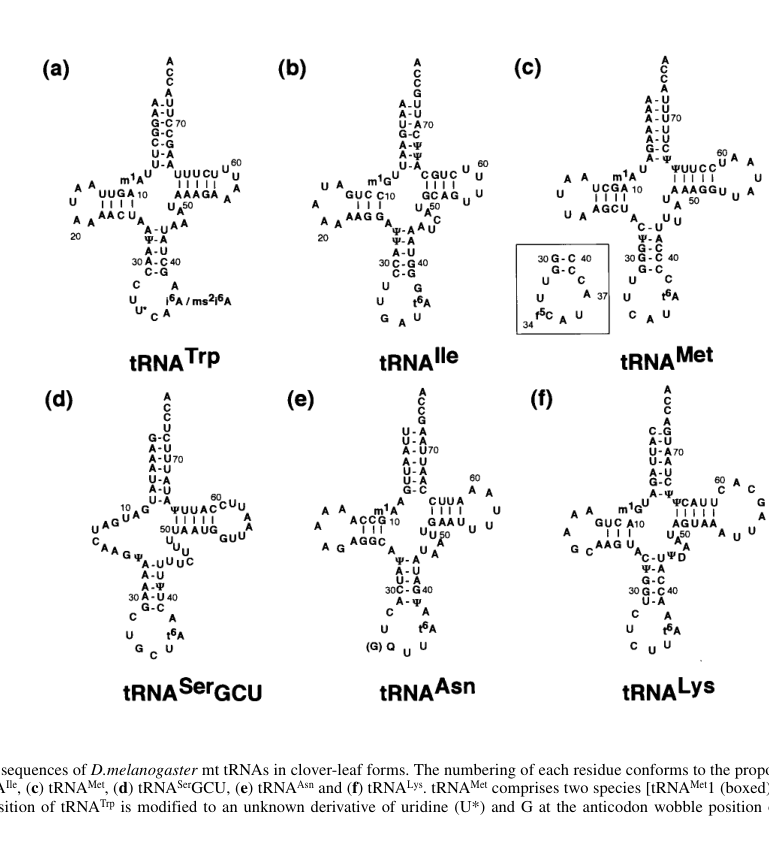

## Question

# Gene Research for Functional Annotation

## ⚠️ CRITICAL: Gene/Protein Identification Context

**BEFORE YOU BEGIN RESEARCH:** You MUST verify you are researching the CORRECT gene/protein. Gene symbols can be ambiguous, especially for less well-characterized genes from non-model organisms.

### Target Gene/Protein Identity (from UniProt):
- **UniProt Accession:** Q9VC87
- **Protein Description:** RecName: Full=tRNA modification GTPase GTPBP3, mitochondrial {ECO:0008006|Google:ProtNLM};
- **Gene Information:** Name=Dmel\CG18528 {ECO:0000313|EMBL:AAF56288.3}; ORFNames=CG18528 {ECO:0000313|EMBL:AAF56288.3, ECO:0000313|FlyBase:FBgn0039189}, Dmel_CG18528 {ECO:0000313|EMBL:AAF56288.3};
- **Organism (full):** Drosophila melanogaster (Fruit fly).
- **Protein Family:** Belongs to the TRAFAC class TrmE-Era-EngA-EngB-Septin-like
- **Key Domains:** G_TrmE. (IPR031168); GTP-bd. (IPR006073); GTP-bd_TrmE_N. (IPR018948); GTPase_MnmE. (IPR004520); MnmE_dom2. (IPR027368)

### MANDATORY VERIFICATION STEPS:

1. **Check if the gene symbol "Dmel\CG18528" matches the protein description above**
2. **Verify the organism is correct:** Drosophila melanogaster (Fruit fly).
3. **Check if protein family/domains align with what you find in literature**
4. **If you find literature for a DIFFERENT gene with the same or similar symbol, STOP**

### If Gene Symbol is Ambiguous or You Cannot Find Relevant Literature:

**DO NOT PROCEED WITH RESEARCH ON A DIFFERENT GENE.** Instead:
- State clearly: "The gene symbol 'Dmel\CG18528' is ambiguous or literature is limited for this specific protein"
- Explain what you found (e.g., "Found extensive literature on a different gene with the same symbol in a different organism")
- Describe the protein based ONLY on the UniProt information provided above
- Suggest that the protein function can be inferred from domain/family information

### Research Target:

Please provide a comprehensive research report on the gene **Dmel\CG18528** (gene ID: CG18528, UniProt: Q9VC87) in DROME.

The research report should be a detailed narrative explaining the function, biological processes, and localization of the gene product. Citations should be given for all claims.

You should prioritize authoritative reviews and primary scientific literature when conducting research. You can supplement
this with annotations you find in gene/protein databases, but these can be outdated or inaccurate.

We are specifically interested in the primary function of the gene - for enzymes, what reaction is catalyzed, and what is the substrate specificity? For transporters, what is the substrate? For structural proteins or adapters, what is the broader structural role? For signaling molecules, what is the role in the pathway.

We are interested in where in or outside the cell the gene product carries out its function.

We are also interested in the signaling or biochemical pathways in which the gene functions. We are less interested in broad pleiotropic effects, except where these elucidate the precise role.

Include evidence where possible. We are interested in both experimental evidence as well as inference from structure, evolution, or bioinformatic analysis. Precise studies should be prioritized over high-throughput, where available.

## Output

Question: You are an expert researcher providing comprehensive, well-cited information.

Provide detailed information focusing on:
1. Key concepts and definitions with current understanding
2. Recent developments and latest research (prioritize 2023-2024 sources)
3. Current applications and real-world implementations
4. Expert opinions and analysis from authoritative sources
5. Relevant statistics and data from recent studies

Format as a comprehensive research report with proper citations. Include URLs and publication dates where available.
Always prioritize recent, authoritative sources and provide specific citations for all major claims.

# Gene Research for Functional Annotation

## ⚠️ CRITICAL: Gene/Protein Identification Context

**BEFORE YOU BEGIN RESEARCH:** You MUST verify you are researching the CORRECT gene/protein. Gene symbols can be ambiguous, especially for less well-characterized genes from non-model organisms.

### Target Gene/Protein Identity (from UniProt):
- **UniProt Accession:** Q9VC87
- **Protein Description:** RecName: Full=tRNA modification GTPase GTPBP3, mitochondrial {ECO:0008006|Google:ProtNLM};
- **Gene Information:** Name=Dmel\CG18528 {ECO:0000313|EMBL:AAF56288.3}; ORFNames=CG18528 {ECO:0000313|EMBL:AAF56288.3, ECO:0000313|FlyBase:FBgn0039189}, Dmel_CG18528 {ECO:0000313|EMBL:AAF56288.3};
- **Organism (full):** Drosophila melanogaster (Fruit fly).
- **Protein Family:** Belongs to the TRAFAC class TrmE-Era-EngA-EngB-Septin-like
- **Key Domains:** G_TrmE. (IPR031168); GTP-bd. (IPR006073); GTP-bd_TrmE_N. (IPR018948); GTPase_MnmE. (IPR004520); MnmE_dom2. (IPR027368)

### MANDATORY VERIFICATION STEPS:

1. **Check if the gene symbol "Dmel\CG18528" matches the protein description above**
2. **Verify the organism is correct:** Drosophila melanogaster (Fruit fly).
3. **Check if protein family/domains align with what you find in literature**
4. **If you find literature for a DIFFERENT gene with the same or similar symbol, STOP**

### If Gene Symbol is Ambiguous or You Cannot Find Relevant Literature:

**DO NOT PROCEED WITH RESEARCH ON A DIFFERENT GENE.** Instead:
- State clearly: "The gene symbol 'Dmel\CG18528' is ambiguous or literature is limited for this specific protein"
- Explain what you found (e.g., "Found extensive literature on a different gene with the same symbol in a different organism")
- Describe the protein based ONLY on the UniProt information provided above
- Suggest that the protein function can be inferred from domain/family information

### Research Target:

Please provide a comprehensive research report on the gene **Dmel\CG18528** (gene ID: CG18528, UniProt: Q9VC87) in DROME.

The research report should be a detailed narrative explaining the function, biological processes, and localization of the gene product. Citations should be given for all claims.

You should prioritize authoritative reviews and primary scientific literature when conducting research. You can supplement
this with annotations you find in gene/protein databases, but these can be outdated or inaccurate.

We are specifically interested in the primary function of the gene - for enzymes, what reaction is catalyzed, and what is the substrate specificity? For transporters, what is the substrate? For structural proteins or adapters, what is the broader structural role? For signaling molecules, what is the role in the pathway.

We are interested in where in or outside the cell the gene product carries out its function.

We are also interested in the signaling or biochemical pathways in which the gene functions. We are less interested in broad pleiotropic effects, except where these elucidate the precise role.

Include evidence where possible. We are interested in both experimental evidence as well as inference from structure, evolution, or bioinformatic analysis. Precise studies should be prioritized over high-throughput, where available.

# Functional annotation of *Drosophila melanogaster* CG18528 (UniProt Q9VC87)

## Identity and strength of evidence

**The gene symbol ‘Dmel\CG18528’ is ambiguous or literature is limited for this specific protein.** The identifiers supplied with the question—CG18528, FlyBase FBgn0039189 and UniProt [Q9VC87](https://www.uniprot.org/uniprotkb/Q9VC87/entry)—identify a *D. melanogaster* protein annotated as mitochondrial tRNA-modification GTPase GTPBP3. Its specified TrmE/MnmE-family GTP-binding domains agree with the domain organization described for human GTPBP3, the MnmE/MSS1 homolog. This is an identity and **family-based functional annotation**, not an independently demonstrated reaction for the fly protein. Searches for the exact fly identifiers did not establish a published assay of CG18528’s activity, localization, interaction partners or loss-of-function phenotype; the mechanistic enzyme studies below concern homologs and must not be presented as experiments on CG18528. (peng2021thehumantrna pages 1-2, asano2018metabolicandchemical pages 2-4)

The distinction matters because mitochondrial tRNA substrates differ between species. A primary study of purified *Drosophila* mitochondrial tRNAs provides relevant **fly-specific substrate information**, although it does not identify CG18528 as the modifying enzyme. (tomita1999codonreadingpatterns pages 1-2, tomita1999codonreadingpatterns pages 2-4)

The evidence comparison below separates observations in flies from measurements in human cells.

| Question | Evidence in *Drosophila* CG18528 or *Drosophila* mt-tRNA | Evidence in human homolog | Interpretation for CG18528 |
|---|---|---|---|
| Identity/family | Supplied UniProt record Q9VC87 maps CG18528/FBgn0039189 to a *D. melanogaster* mitochondrial GTPBP3-like protein with MnmE-family GTPase domains; no retrieved primary paper directly validates its enzymatic function. | Human GTPBP3 is the MnmE/MSS1 homolog and MTO1 partner in mitochondrial wobble-uridine modification (asano2018metabolicandchemical pages 2-4). | Orthology and domain architecture strongly support a mitochondrial tRNA-modification GTPase annotation, but this remains homology-based for CG18528. |
| Biochemical activity and cofactors | No direct assay of purified CG18528, GTP hydrolysis, or a fly CG18528–MTO1 reaction was found. | Mature human GTPBP3 is a dimeric GTPase with *k*cat = 1.49 ± 0.06 min⁻¹ and *K*m = 9.5 ± 1.5 µM. The GTPBP3–MTO1 reaction uses taurine, 5,10-methylene-THF, GTP and additional cofactors (peng2021thehumantrna pages 5-6, asano2018metabolicandchemical pages 2-4). | GTPase activity and comparable cofactor use are plausible predictions, not demonstrated properties of Q9VC87. |
| Target tRNAs and substrate specificity | Direct fly analysis found mt-tRNA^Lys has unmodified **C34**, not U34; it therefore cannot be assumed to be the human-like Lys-U34 substrate. Fly mt-tRNA^Trp contained modified **U\*34**, but its chemical identity was unknown—not established as τm⁵U (tomita1999codonreadingpatterns pages 2-4, tomita1999codonreadingpatterns pages 4-5). | Human GTPBP3–MTO1 modifies U34 in mt-tRNA^Leu(UUR) and mt-tRNA^Trp to τm⁵U, and in mt-tRNA^Lys, mt-tRNA^Gln and mt-tRNA^Glu to the precursor of τm⁵s²U (asano2018metabolicandchemical pages 2-4). | Fly substrate specificity must not be copied wholesale from humans. mt-tRNA^Trp is a plausible candidate, whereas fly mt-tRNA^Lys is directly excluded from the analogous U34 substrate class. |
| Localization | UniProt describes Q9VC87 as mitochondrial, but no retrieved CG18528 localization experiment was found. | Human GTPBP3 is imported and processed in mitochondria; cleavage between residues 20–21 produces the mature protein (peng2021thehumantrna pages 5-6). | Mitochondrial-matrix localization is strongly predicted for CG18528 but requires fly-specific imaging or fractionation. |
| 2023 functional rescue | No CG18528 knockout/rescue experiment or fly biochemical phenotype was found. | In MELAS myoblasts, mt-tRNA^Leu(UUR) τm⁵U rose from **16.3%** to **94.8–97.3%** with MTO1 overexpression, versus **27.3%** with GTPBP3 overexpression; mitochondrial protein synthesis recovered to **79–92% of wild type** (tomoda2023restorationofmitochondrial pages 7-9, tomoda2023restorationofmitochondrial pages 9-11). | These are human patient-cell results—not fly data. They demonstrate pathway actionability but do not establish a CG18528 phenotype or application. |

*Table: Direct fly evidence is separated from mechanistic and rescue data obtained with human GTPBP3. The comparison highlights why CG18528’s precise substrates and localization remain predictions requiring fly-specific validation.*

## Predicted biochemical function and biological pathway

The **best-supported functional hypothesis** is that CG18528 is the fly counterpart of GTPBP3: a GTP-dependent factor in the pathway that modifies the anticodon *wobble uridine* (U34) of selected mitochondrial tRNAs. In human cells, GTPBP3 acts with MTO1 to install a 5-taurinomethyl group, producing 5-taurinomethyluridine (τm⁵U); mitochondrial one-carbon metabolism supplies the carbon through 5,10-methylenetetrahydrofolate, and taurine supplies the taurine-containing moiety. A separate enzyme, MTU1/TRMU, adds sulfur at uridine position 2 to produce τm⁵s²U on appropriate tRNAs. Human GTPBP3/MTO1-dependent U34 modification was reconstituted in vitro with taurine, methylenetetrahydrofolate, GTP and other cofactors, while gene knockout eliminated the modification from the examined mitochondrial tRNAs. These results establish the **homologous pathway**, not the precise chemistry of Q9VC87. (asano2018metabolicandchemical pages 2-4, asano2018metabolicandchemical pages 4-5, peng2021thehumantrna pages 1-2)

GTP is itself a biochemical substrate of the GTPBP3 GTPase. Purified, mature **human** GTPBP3 hydrolyzed GTP with *k*cat = **1.49 ± 0.06 min⁻¹** and *K*m = **9.5 ± 1.5 µM** under the study’s optimized conditions; experiments on human GTPBP3 variants linked impaired GTP hydrolysis to loss of tRNA-modification function. Neither kinetic value has been measured for CG18528. The GTPase-domain annotation therefore supports a prediction of GTP binding and hydrolysis, but not a fly-specific rate or proof that CG18528 alone catalyzes the entire RNA-modification reaction. (peng2021thehumantrna pages 5-6, peng2021thehumantrna pages 17-18)

The immediate pathway is **mitochondrial tRNA maturation and codon decoding**, rather than a demonstrated fly signaling cascade. In the established human system, wobble modification helps tRNAs decode their cognate codons, supporting mitochondrial translation and, downstream, production of respiratory-chain subunits and oxidative phosphorylation. Loss of human GTPBP3 reduces the tRNA modification, mitochondrial protein synthesis and respiration. No equivalent causal chain has been demonstrated by perturbing CG18528 in flies. (asano2018metabolicandchemical pages 2-4, delaunay2024rnamodificationsin pages 6-8)

### Substrate specificity: a consequential fly–human difference

Five **human** mitochondrial tRNAs carry the relevant taurine-containing wobble modifications: tRNA^Leu(UUR) and tRNA^Trp contain τm⁵U34; tRNA^Glu, tRNA^Lys and tRNA^Gln contain τm⁵s²U34. **This five-tRNA list is not a verified substrate list for CG18528.** (asano2018metabolicandchemical pages 2-4)

Tomita and colleagues directly purified and sequenced six *D. melanogaster* mitochondrial tRNAs. Crucially, **fly mt-tRNA^Lys has an unmodified cytidine, C34, rather than U34**. Sequencing, a test for possible C-to-U editing, RNase-H-assisted nucleotide analysis and mass spectrometry supported that assignment. Accordingly, fly mt-tRNA^Lys should **not** be assigned the human GTPBP3-dependent *uridine-34* modification merely because human mt-tRNA^Lys receives one. Fly mt-tRNA^Trp, by contrast, contained a **modified U34**, recorded as U*, but the investigators did **not** establish that its chemical identity was τm⁵U or show that CG18528 produced it. Other possible fly U34 substrates likewise require direct mapping. The study’s tRNA structures and wobble-position analyses illustrate these contrasting Lys and Trp findings. (tomita1999codonreadingpatterns pages 2-4, tomita1999codonreadingpatterns pages 4-5, tomita1999codonreadingpatterns pages 5-6, tomita1999codonreadingpatterns media 71eea2b8, tomita1999codonreadingpatterns media e0becb71)

This difference also limits extrapolation of **nutrient specificity**. In mammalian cells deprived of taurine, glycine can substitute in the modification pathway, yielding 5-carboxymethylaminomethyluridine (cmnm⁵U) instead of τm⁵U; one study detected glycine-substituted modifications in approximately **5–23%** of examined mitochondrial tRNAs under depletion conditions. This demonstrates metabolic flexibility of the homologous pathway, not that fly CG18528 necessarily uses taurine, glycine or the same tRNA set. (asano2018metabolicandchemical pages 8-10, kazuhito2020posttranscriptionalmodificationsin pages 17-18)

## Subcellular localization

The supplied UniProt description places Q9VC87 in **mitochondria**. That localization is mechanistically consistent with its predicted mitochondrial-tRNA substrates and with experiments on human GTPBP3: human protein is imported into mitochondria and processed to a mature form, with an N-terminal sequence consistent with cleavage between residues 20 and 21. **No retrieved fly-specific microscopy, protease-protection or fractionation experiment establishes where CG18528 resides within mitochondria**; assignment to the mitochondrial matrix, where the tRNA-modification reaction would be expected to occur, remains an inference for Q9VC87 rather than an observed compartment. A cytoplasmic isoform reported for *human* GTPBP3 should not be assigned to the fly gene. (peng2021thehumantrna pages 5-6, peng2021thehumantrna pages 17-18, peng2021thehumantrna pages 16-17)

## Recent research and applications: relevant but not fly-specific

A **2023** human patient-cell study provides a quantitative demonstration that this modification pathway can be manipulated. In MELAS patient-derived myoblasts, the τm⁵U34 modification frequency of mutant mt-tRNA^Leu(UUR) was **16.3%** in control cells. Overexpressing **MTO1** increased it to **97.3%** and **94.8%** in two cell lines; overexpressing **GTPBP3** alone increased it only to **27.3%** in the tested line. With MTO1 overexpression, total mitochondrial protein synthesis reached **79–92% of wild-type**, and several respiration measures improved but remained below wild-type. The mutant tRNA’s steady-state abundance was not restored, showing that correcting modification does not necessarily correct tRNA stability. These were **cultured human-cell interventions**, not clinical treatments or implementations involving CG18528. (tomoda2023restorationofmitochondrial pages 7-9, tomoda2023restorationofmitochondrial pages 9-11, tomoda2023restorationofmitochondrial pages 1-2)

Authoritative reviews published in **2024** place GTPBP3/MTO1-mediated wobble modification within the broader control of mitochondrial decoding and disease associated with impaired mitochondrial protein synthesis. Their pathway interpretation supports the functional *hypothesis* for CG18528, but neither review supplies a fly-specific enzymatic assay or establishes a therapeutic application for this gene. (delaunay2024rnamodificationsin pages 6-8)

**Conclusion.** CG18528/Q9VC87 is most defensibly annotated as a **putative mitochondrial MnmE/GTPBP3-family GTPase involved in wobble-U34 modification of a subset of fly mitochondrial tRNAs**. The enzyme’s precise fly reaction product, individual tRNA substrates, GTPase kinetics, MTO1 partnership, intramitochondrial location and physiological requirement remain unverified in the retrieved primary literature. Direct fly tRNA chemistry already rules out uncritical transfer of the human mt-tRNA^Lys substrate assignment. (peng2021thehumantrna pages 1-2, tomita1999codonreadingpatterns pages 4-5, asano2018metabolicandchemical pages 4-5)

**Key primary sources and dates:** Tomita *et al.*, *Nucleic Acids Research*, **November 1999**, [doi:10.1093/nar/27.21.4291](https://doi.org/10.1093/nar/27.21.4291) (fly mitochondrial tRNAs); Asano *et al.*, *Nucleic Acids Research*, **January 2018**, [doi:10.1093/nar/gky068](https://doi.org/10.1093/nar/gky068) (human-pathway chemistry); Peng *et al.*, *Nucleic Acids Research*, **February 2021**, [doi:10.1093/nar/gkab104](https://doi.org/10.1093/nar/gkab104) (human GTPase); and Tomoda *et al.*, *Nucleic Acids Research*, **published online 17 March 2023**, [doi:10.1093/nar/gkad139](https://doi.org/10.1093/nar/gkad139) (patient-cell rescue). (tomita1999codonreadingpatterns pages 1-2, asano2018metabolicandchemical pages 1-2, peng2021thehumantrna pages 5-6, tomoda2023restorationofmitochondrial pages 1-2)

References

1. (peng2021thehumantrna pages 1-2): Gui-Xin Peng, Yong Zhang, Qin-Qin Wang, Qing-Run Li, Hong Xu, En-Duo Wang, and Xiao-Long Zhou. The human trna taurine modification enzyme gtpbp3 is an active gtpase linked to mitochondrial diseases. Nucleic Acids Research, 49:2816-2834, Feb 2021. URL: https://doi.org/10.1093/nar/gkab104, doi:10.1093/nar/gkab104. This article has 47 citations and is from a highest quality peer-reviewed journal.

2. (asano2018metabolicandchemical pages 2-4): Kana Asano, Takeo Suzuki, Ayaka Saito, Fan-Yan Wei, Yoshiho Ikeuchi, Tomoyuki Numata, Ryou Tanaka, Yoshihisa Yamane, Takeshi Yamamoto, Takanobu Goto, Yoshihito Kishita, Kei Murayama, Akira Ohtake, Yasushi Okazaki, Kazuhito Tomizawa, Yuriko Sakaguchi, and Tsutomu Suzuki. Metabolic and chemical regulation of trna modification associated with taurine deficiency and human disease. Nucleic Acids Research, 46:1565-1583, Jan 2018. URL: https://doi.org/10.1093/nar/gky068, doi:10.1093/nar/gky068. This article has 192 citations and is from a highest quality peer-reviewed journal.

3. (tomita1999codonreadingpatterns pages 1-2): K. Tomita, T. Ueda, Sadao Ishiwa, P. F. Crain, J. McCloskey, and Kimitsuna Watanabe. Codon reading patterns in drosophila melanogaster mitochondria based on their trna sequences: a unique wobble rule in animal mitochondria. Nucleic acids research, 27 21:4291-7, Nov 1999. URL: https://doi.org/10.1093/nar/27.21.4291, doi:10.1093/nar/27.21.4291. This article has 59 citations and is from a highest quality peer-reviewed journal.

4. (tomita1999codonreadingpatterns pages 2-4): K. Tomita, T. Ueda, Sadao Ishiwa, P. F. Crain, J. McCloskey, and Kimitsuna Watanabe. Codon reading patterns in drosophila melanogaster mitochondria based on their trna sequences: a unique wobble rule in animal mitochondria. Nucleic acids research, 27 21:4291-7, Nov 1999. URL: https://doi.org/10.1093/nar/27.21.4291, doi:10.1093/nar/27.21.4291. This article has 59 citations and is from a highest quality peer-reviewed journal.

5. (peng2021thehumantrna pages 5-6): Gui-Xin Peng, Yong Zhang, Qin-Qin Wang, Qing-Run Li, Hong Xu, En-Duo Wang, and Xiao-Long Zhou. The human trna taurine modification enzyme gtpbp3 is an active gtpase linked to mitochondrial diseases. Nucleic Acids Research, 49:2816-2834, Feb 2021. URL: https://doi.org/10.1093/nar/gkab104, doi:10.1093/nar/gkab104. This article has 47 citations and is from a highest quality peer-reviewed journal.

6. (tomita1999codonreadingpatterns pages 4-5): K. Tomita, T. Ueda, Sadao Ishiwa, P. F. Crain, J. McCloskey, and Kimitsuna Watanabe. Codon reading patterns in drosophila melanogaster mitochondria based on their trna sequences: a unique wobble rule in animal mitochondria. Nucleic acids research, 27 21:4291-7, Nov 1999. URL: https://doi.org/10.1093/nar/27.21.4291, doi:10.1093/nar/27.21.4291. This article has 59 citations and is from a highest quality peer-reviewed journal.

7. (tomoda2023restorationofmitochondrial pages 7-9): Ena Tomoda, Asuteka Nagao, Yuki Shirai, Kana Asano, Takeo Suzuki, Brendan J Battersby, and Tsutomu Suzuki. Restoration of mitochondrial function through activation of hypomodified trnas with pathogenic mutations associated with mitochondrial diseases. Nucleic Acids Research, 51:7563-7579, Mar 2023. URL: https://doi.org/10.1093/nar/gkad139, doi:10.1093/nar/gkad139. This article has 42 citations and is from a highest quality peer-reviewed journal.

8. (tomoda2023restorationofmitochondrial pages 9-11): Ena Tomoda, Asuteka Nagao, Yuki Shirai, Kana Asano, Takeo Suzuki, Brendan J Battersby, and Tsutomu Suzuki. Restoration of mitochondrial function through activation of hypomodified trnas with pathogenic mutations associated with mitochondrial diseases. Nucleic Acids Research, 51:7563-7579, Mar 2023. URL: https://doi.org/10.1093/nar/gkad139, doi:10.1093/nar/gkad139. This article has 42 citations and is from a highest quality peer-reviewed journal.

9. (asano2018metabolicandchemical pages 4-5): Kana Asano, Takeo Suzuki, Ayaka Saito, Fan-Yan Wei, Yoshiho Ikeuchi, Tomoyuki Numata, Ryou Tanaka, Yoshihisa Yamane, Takeshi Yamamoto, Takanobu Goto, Yoshihito Kishita, Kei Murayama, Akira Ohtake, Yasushi Okazaki, Kazuhito Tomizawa, Yuriko Sakaguchi, and Tsutomu Suzuki. Metabolic and chemical regulation of trna modification associated with taurine deficiency and human disease. Nucleic Acids Research, 46:1565-1583, Jan 2018. URL: https://doi.org/10.1093/nar/gky068, doi:10.1093/nar/gky068. This article has 192 citations and is from a highest quality peer-reviewed journal.

10. (peng2021thehumantrna pages 17-18): Gui-Xin Peng, Yong Zhang, Qin-Qin Wang, Qing-Run Li, Hong Xu, En-Duo Wang, and Xiao-Long Zhou. The human trna taurine modification enzyme gtpbp3 is an active gtpase linked to mitochondrial diseases. Nucleic Acids Research, 49:2816-2834, Feb 2021. URL: https://doi.org/10.1093/nar/gkab104, doi:10.1093/nar/gkab104. This article has 47 citations and is from a highest quality peer-reviewed journal.

11. (delaunay2024rnamodificationsin pages 6-8): Sylvain Delaunay, Mark Helm, and Michaela Frye. Rna modifications in physiology and disease: towards clinical applications. Nature Reviews Genetics, 25:104-122, Sep 2024. URL: https://doi.org/10.1038/s41576-023-00645-2, doi:10.1038/s41576-023-00645-2. This article has 422 citations and is from a domain leading peer-reviewed journal.

12. (tomita1999codonreadingpatterns pages 5-6): K. Tomita, T. Ueda, Sadao Ishiwa, P. F. Crain, J. McCloskey, and Kimitsuna Watanabe. Codon reading patterns in drosophila melanogaster mitochondria based on their trna sequences: a unique wobble rule in animal mitochondria. Nucleic acids research, 27 21:4291-7, Nov 1999. URL: https://doi.org/10.1093/nar/27.21.4291, doi:10.1093/nar/27.21.4291. This article has 59 citations and is from a highest quality peer-reviewed journal.

13. (tomita1999codonreadingpatterns media 71eea2b8): K. Tomita, T. Ueda, Sadao Ishiwa, P. F. Crain, J. McCloskey, and Kimitsuna Watanabe. Codon reading patterns in drosophila melanogaster mitochondria based on their trna sequences: a unique wobble rule in animal mitochondria. Nucleic acids research, 27 21:4291-7, Nov 1999. URL: https://doi.org/10.1093/nar/27.21.4291, doi:10.1093/nar/27.21.4291. This article has 59 citations and is from a highest quality peer-reviewed journal.

14. (tomita1999codonreadingpatterns media e0becb71): K. Tomita, T. Ueda, Sadao Ishiwa, P. F. Crain, J. McCloskey, and Kimitsuna Watanabe. Codon reading patterns in drosophila melanogaster mitochondria based on their trna sequences: a unique wobble rule in animal mitochondria. Nucleic acids research, 27 21:4291-7, Nov 1999. URL: https://doi.org/10.1093/nar/27.21.4291, doi:10.1093/nar/27.21.4291. This article has 59 citations and is from a highest quality peer-reviewed journal.

15. (asano2018metabolicandchemical pages 8-10): Kana Asano, Takeo Suzuki, Ayaka Saito, Fan-Yan Wei, Yoshiho Ikeuchi, Tomoyuki Numata, Ryou Tanaka, Yoshihisa Yamane, Takeshi Yamamoto, Takanobu Goto, Yoshihito Kishita, Kei Murayama, Akira Ohtake, Yasushi Okazaki, Kazuhito Tomizawa, Yuriko Sakaguchi, and Tsutomu Suzuki. Metabolic and chemical regulation of trna modification associated with taurine deficiency and human disease. Nucleic Acids Research, 46:1565-1583, Jan 2018. URL: https://doi.org/10.1093/nar/gky068, doi:10.1093/nar/gky068. This article has 192 citations and is from a highest quality peer-reviewed journal.

16. (kazuhito2020posttranscriptionalmodificationsin pages 17-18): Tomizawa Kazuhito and Fan-Yan Wei. Posttranscriptional modifications in mitochondrial trna and its implication in mitochondrial translation and disease. Journal of biochemistry, 168:435-444, Aug 2020. URL: https://doi.org/10.1093/jb/mvaa098, doi:10.1093/jb/mvaa098. This article has 33 citations and is from a peer-reviewed journal.

17. (peng2021thehumantrna pages 16-17): Gui-Xin Peng, Yong Zhang, Qin-Qin Wang, Qing-Run Li, Hong Xu, En-Duo Wang, and Xiao-Long Zhou. The human trna taurine modification enzyme gtpbp3 is an active gtpase linked to mitochondrial diseases. Nucleic Acids Research, 49:2816-2834, Feb 2021. URL: https://doi.org/10.1093/nar/gkab104, doi:10.1093/nar/gkab104. This article has 47 citations and is from a highest quality peer-reviewed journal.

18. (tomoda2023restorationofmitochondrial pages 1-2): Ena Tomoda, Asuteka Nagao, Yuki Shirai, Kana Asano, Takeo Suzuki, Brendan J Battersby, and Tsutomu Suzuki. Restoration of mitochondrial function through activation of hypomodified trnas with pathogenic mutations associated with mitochondrial diseases. Nucleic Acids Research, 51:7563-7579, Mar 2023. URL: https://doi.org/10.1093/nar/gkad139, doi:10.1093/nar/gkad139. This article has 42 citations and is from a highest quality peer-reviewed journal.

19. (asano2018metabolicandchemical pages 1-2): Kana Asano, Takeo Suzuki, Ayaka Saito, Fan-Yan Wei, Yoshiho Ikeuchi, Tomoyuki Numata, Ryou Tanaka, Yoshihisa Yamane, Takeshi Yamamoto, Takanobu Goto, Yoshihito Kishita, Kei Murayama, Akira Ohtake, Yasushi Okazaki, Kazuhito Tomizawa, Yuriko Sakaguchi, and Tsutomu Suzuki. Metabolic and chemical regulation of trna modification associated with taurine deficiency and human disease. Nucleic Acids Research, 46:1565-1583, Jan 2018. URL: https://doi.org/10.1093/nar/gky068, doi:10.1093/nar/gky068. This article has 192 citations and is from a highest quality peer-reviewed journal.

## Artifacts

- [Edison artifact artifact-00](CG18528-deep-research-falcon_artifacts/artifact-00.md)

## Citations

1. asano2018metabolicandchemical pages 2-4
2. peng2021thehumantrna pages 5-6
3. delaunay2024rnamodificationsin pages 6-8
4. peng2021thehumantrna pages 1-2
5. tomita1999codonreadingpatterns pages 1-2
6. tomita1999codonreadingpatterns pages 2-4
7. tomita1999codonreadingpatterns pages 4-5
8. tomoda2023restorationofmitochondrial pages 7-9
9. tomoda2023restorationofmitochondrial pages 9-11
10. asano2018metabolicandchemical pages 4-5
11. peng2021thehumantrna pages 17-18
12. tomita1999codonreadingpatterns pages 5-6
13. asano2018metabolicandchemical pages 8-10
14. kazuhito2020posttranscriptionalmodificationsin pages 17-18
15. peng2021thehumantrna pages 16-17
16. tomoda2023restorationofmitochondrial pages 1-2
17. asano2018metabolicandchemical pages 1-2
18. Q9VC87
19. doi:10.1093/nar/27.21.4291
20. doi:10.1093/nar/gky068
21. doi:10.1093/nar/gkab104
22. doi:10.1093/nar/gkad139
23. https://www.uniprot.org/uniprotkb/Q9VC87/entry
24. https://doi.org/10.1093/nar/27.21.4291
25. https://doi.org/10.1093/nar/gky068
26. https://doi.org/10.1093/nar/gkab104
27. https://doi.org/10.1093/nar/gkad139
28. https://doi.org/10.1093/nar/gkab104,
29. https://doi.org/10.1093/nar/gky068,
30. https://doi.org/10.1093/nar/27.21.4291,
31. https://doi.org/10.1093/nar/gkad139,
32. https://doi.org/10.1038/s41576-023-00645-2,
33. https://doi.org/10.1093/jb/mvaa098,