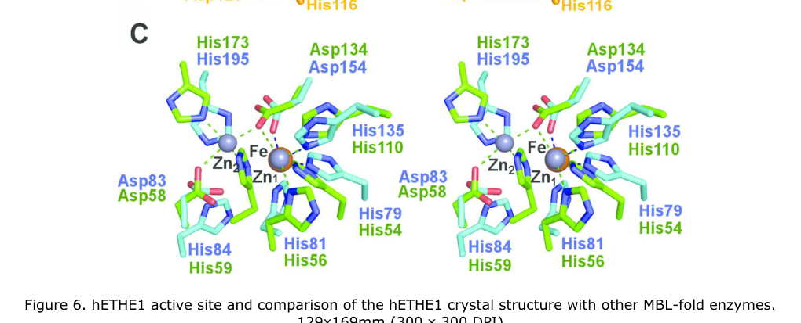

## Question

# Gene Research for Functional Annotation

## ⚠️ CRITICAL: Gene/Protein Identification Context

**BEFORE YOU BEGIN RESEARCH:** You MUST verify you are researching the CORRECT gene/protein. Gene symbols can be ambiguous, especially for less well-characterized genes from non-model organisms.

### Target Gene/Protein Identity (from UniProt):
- **UniProt Accession:** A0ACM8PZC4
- **Protein Description:** RecName: Full=Persulfide dioxygenase ETHE1, mitochondrial {ECO:0000256|ARBA:ARBA00067300}; EC=1.13.11.18 {ECO:0000256|ARBA:ARBA00066686}; AltName: Full=Sulfur dioxygenase ETHE1 {ECO:0000256|ARBA:ARBA00077964};
- **Gene Information:** Name=CG9026 {ECO:0000313|EMBL:AAF58646.3}; Synonyms=BcDNA:RE56416 {ECO:0000313|EMBL:AAF58646.3}, Dmel\CG30022 {ECO:0000313|EMBL:AAF58646.3}; ORFNames=CG30022 {ECO:0000313|EMBL:AAF58646.3}, Dmel_CG30022 {ECO:0000313|EMBL:AAF58646.3};
- **Organism (full):** Drosophila melanogaster (Fruit fly).
- **Protein Family:** Belongs to the metallo-beta-lactamase superfamily.
- **Key Domains:** Metallo-B-lactamas. (IPR001279); Mito_Persulfide_Diox. (IPR051682); POD-like_MBL-fold. (IPR044528); RibonucZ/Hydroxyglut_hydro. (IPR036866); Lactamase_B (PF00753)

### MANDATORY VERIFICATION STEPS:

1. **Check if the gene symbol "CG9026" matches the protein description above**
2. **Verify the organism is correct:** Drosophila melanogaster (Fruit fly).
3. **Check if protein family/domains align with what you find in literature**
4. **If you find literature for a DIFFERENT gene with the same or similar symbol, STOP**

### If Gene Symbol is Ambiguous or You Cannot Find Relevant Literature:

**DO NOT PROCEED WITH RESEARCH ON A DIFFERENT GENE.** Instead:
- State clearly: "The gene symbol 'CG9026' is ambiguous or literature is limited for this specific protein"
- Explain what you found (e.g., "Found extensive literature on a different gene with the same symbol in a different organism")
- Describe the protein based ONLY on the UniProt information provided above
- Suggest that the protein function can be inferred from domain/family information

### Research Target:

Please provide a comprehensive research report on the gene **CG9026** (gene ID: CG30022, UniProt: A0ACM8PZC4) in DROME.

The research report should be a detailed narrative explaining the function, biological processes, and localization of the gene product. Citations should be given for all claims.

You should prioritize authoritative reviews and primary scientific literature when conducting research. You can supplement
this with annotations you find in gene/protein databases, but these can be outdated or inaccurate.

We are specifically interested in the primary function of the gene - for enzymes, what reaction is catalyzed, and what is the substrate specificity? For transporters, what is the substrate? For structural proteins or adapters, what is the broader structural role? For signaling molecules, what is the role in the pathway.

We are interested in where in or outside the cell the gene product carries out its function.

We are also interested in the signaling or biochemical pathways in which the gene functions. We are less interested in broad pleiotropic effects, except where these elucidate the precise role.

Include evidence where possible. We are interested in both experimental evidence as well as inference from structure, evolution, or bioinformatic analysis. Precise studies should be prioritized over high-throughput, where available.

## Output

Question: You are an expert researcher providing comprehensive, well-cited information.

Provide detailed information focusing on:
1. Key concepts and definitions with current understanding
2. Recent developments and latest research (prioritize 2023-2024 sources)
3. Current applications and real-world implementations
4. Expert opinions and analysis from authoritative sources
5. Relevant statistics and data from recent studies

Format as a comprehensive research report with proper citations. Include URLs and publication dates where available.
Always prioritize recent, authoritative sources and provide specific citations for all major claims.

# Gene Research for Functional Annotation

## ⚠️ CRITICAL: Gene/Protein Identification Context

**BEFORE YOU BEGIN RESEARCH:** You MUST verify you are researching the CORRECT gene/protein. Gene symbols can be ambiguous, especially for less well-characterized genes from non-model organisms.

### Target Gene/Protein Identity (from UniProt):
- **UniProt Accession:** A0ACM8PZC4
- **Protein Description:** RecName: Full=Persulfide dioxygenase ETHE1, mitochondrial {ECO:0000256|ARBA:ARBA00067300}; EC=1.13.11.18 {ECO:0000256|ARBA:ARBA00066686}; AltName: Full=Sulfur dioxygenase ETHE1 {ECO:0000256|ARBA:ARBA00077964};
- **Gene Information:** Name=CG9026 {ECO:0000313|EMBL:AAF58646.3}; Synonyms=BcDNA:RE56416 {ECO:0000313|EMBL:AAF58646.3}, Dmel\CG30022 {ECO:0000313|EMBL:AAF58646.3}; ORFNames=CG30022 {ECO:0000313|EMBL:AAF58646.3}, Dmel_CG30022 {ECO:0000313|EMBL:AAF58646.3};
- **Organism (full):** Drosophila melanogaster (Fruit fly).
- **Protein Family:** Belongs to the metallo-beta-lactamase superfamily.
- **Key Domains:** Metallo-B-lactamas. (IPR001279); Mito_Persulfide_Diox. (IPR051682); POD-like_MBL-fold. (IPR044528); RibonucZ/Hydroxyglut_hydro. (IPR036866); Lactamase_B (PF00753)

### MANDATORY VERIFICATION STEPS:

1. **Check if the gene symbol "CG9026" matches the protein description above**
2. **Verify the organism is correct:** Drosophila melanogaster (Fruit fly).
3. **Check if protein family/domains align with what you find in literature**
4. **If you find literature for a DIFFERENT gene with the same or similar symbol, STOP**

### If Gene Symbol is Ambiguous or You Cannot Find Relevant Literature:

**DO NOT PROCEED WITH RESEARCH ON A DIFFERENT GENE.** Instead:
- State clearly: "The gene symbol 'CG9026' is ambiguous or literature is limited for this specific protein"
- Explain what you found (e.g., "Found extensive literature on a different gene with the same symbol in a different organism")
- Describe the protein based ONLY on the UniProt information provided above
- Suggest that the protein function can be inferred from domain/family information

### Research Target:

Please provide a comprehensive research report on the gene **CG9026** (gene ID: CG30022, UniProt: A0ACM8PZC4) in DROME.

The research report should be a detailed narrative explaining the function, biological processes, and localization of the gene product. Citations should be given for all claims.

You should prioritize authoritative reviews and primary scientific literature when conducting research. You can supplement
this with annotations you find in gene/protein databases, but these can be outdated or inaccurate.

We are specifically interested in the primary function of the gene - for enzymes, what reaction is catalyzed, and what is the substrate specificity? For transporters, what is the substrate? For structural proteins or adapters, what is the broader structural role? For signaling molecules, what is the role in the pathway.

We are interested in where in or outside the cell the gene product carries out its function.

We are also interested in the signaling or biochemical pathways in which the gene functions. We are less interested in broad pleiotropic effects, except where these elucidate the precise role.

Include evidence where possible. We are interested in both experimental evidence as well as inference from structure, evolution, or bioinformatic analysis. Precise studies should be prioritized over high-throughput, where available.

# Functional annotation report: *Drosophila melanogaster* CG9026 / CG30022

## Identity and evidence standard

**The gene symbol ‘CG9026’ is ambiguous or literature is limited for this specific protein.** The supplied UniProt record [A0ACM8PZC4](https://www.uniprot.org/uniprotkb/A0ACM8PZC4/entry) associates CG9026 with CG30022 and annotates the product as mitochondrial persulfide dioxygenase ETHE1. Independently, fly literature explicitly identifies **CG30022 as dEthe1**, the *D. melanogaster* homolog of ETHE1, with a metallo-β-lactamase-like fold. I did not find a publication independently establishing the *CG9026* alias or testing the protein identified by that accession; the functional assessment below therefore follows the independently identified **CG30022/dEthe1**, not another similarly named gene. (fernandezayala2010geneexpressionin pages 7-8, re2011drosophilamelanogasteras pages 78-81)

**Principal annotation:** CG30022 most likely encodes a mitochondrial **glutathione-persulfide dioxygenase** in the sulfide-oxidation pathway. The precise chemical reaction, metal cofactor and matrix location are well established for characterized ETHE1 orthologs but have **not been directly demonstrated for purified fly CG30022** in the sources located. Thus, the enzyme annotation is a strong conservation-based inference, supplemented by fly genetic evidence of sensitivity to sulfide. (re2011drosophilamelanogasteras pages 88-92, pettinati2015crystalstructureof pages 1-3, goudarzi2018spectroscopicandelectronic pages 1-3)

The following summary distinguishes observations made in flies from results transferred from characterized orthologs.

| Claim | Evidence in *Drosophila melanogaster* | Ortholog evidence / limitation |
|---|---|---|
| **Identity and protein family** | CG30022 is explicitly identified as **dEthe1**, the fly homolog of ETHE1. The reported 279-aa protein shares 58% identity and 72% similarity with human ETHE1 and contains the characteristic metallo-β-lactamase fold. The alias **CG9026** and accession **A0ACM8PZC4** were supplied by UniProt but were not independently confirmed in the located literature. (re2011drosophilamelanogasterasc pages 78-81, re2011drosophilamelanogasteras pages 78-81) | Sequence and fold conservation strongly support orthology, but do not alone prove identical catalytic specificity. |
| **Reaction and direct substrate** | No purified dETHE1 assay establishing substrate specificity was found. Accordingly, the fly enzyme’s direct reaction remains an orthology-based annotation rather than a demonstrated biochemical result. | Experimentally characterized human ETHE1 oxidizes **glutathione persulfide (GSSH), not free H₂S**, yielding GSH and sulfite: GSSH + O₂ + H₂O → GSH + SO₃²⁻ + 2H⁺. H₂S is an upstream pathway input converted to a persulfide by SQOR. (giordano2024nitricoxideand pages 28-33, goudarzi2018spectroscopicandelectronic pages 1-3, hou2025sulfideregulationand pages 4-5) |
| **Metal cofactor** | The 2011 fly thesis inferred a two-zinc site from conserved metallo-β-lactamase motifs; this should be treated as a historical prediction, not a validated property of dETHE1. (re2011drosophilamelanogasteras pages 78-81) | Human biochemical analysis found approximately one iron per protein and no zinc; crystallography subsequently resolved a single iron coordinated by His79, His135 and Asp154. These results supersede the old di-zinc model, although fly metal stoichiometry has not been measured directly. (henriques2014ethylmalonicencephalopathyethe1 pages 1-2, pettinati2015crystalstructureof pages 6-8) |
| **Subcellular localization** | The first approximately 50 residues were predicted to form a mitochondrial targeting sequence. No fly-specific microscopy, fractionation or import assay was found, so mitochondrial—and especially matrix—localization is strongly inferred rather than directly demonstrated for CG30022. (re2011drosophilamelanogasterasc pages 78-81, re2011drosophilamelanogasteras pages 78-81) | Human ETHE1 is a mitochondrial-matrix enzyme, and the conserved targeting sequence and sulfur-oxidation pathway make the same localization likely in flies. Ortholog localization cannot substitute fully for direct fly evidence. (pettinati2015crystalstructureof pages 3-4, hou2025sulfideregulationand pages 4-5) |
| **Fly functional evidence** | The EMS-derived **P157S line 2788**, homozygous or hemizygous over a deficiency, showed markedly decreased complex-IV/COX activity. NaHS inhibited COX in isolated fly mitochondria without comparable effects on complex I or citrate synthase, and line 2788 flies died earlier during low-dose NaHS exposure. These findings support a sulfide-protective role but do not constitute direct enzyme assays; EMS background variants remain a potential confound. (re2011drosophilamelanogasteras pages 88-92) | A targeted deletion also removed the host gene **Sprite**, producing an **Ethe1⁻/⁻; Sprite⁻/⁻** double deletion. Its reduced COX activity and NaHS sensitivity therefore cannot be assigned uniquely to dEthe1 without a dEthe1-specific rescue or clean single-gene allele. (re2011drosophilamelanogasterasb pages 64-78, re2011drosophilamelanogasteras pages 64-78) |
| **Expression under mitochondrial stress** | CG30022 was upregulated in the mitochondrial-translation-defective *tko*²⁵ᵗ model and interpreted as a possible sulfide-detoxification response. This was transcriptomic association, not direct evidence of sulfur flux or catalytic activity. (fernandezayala2010geneexpressionin pages 7-8) | The interpretation is biologically consistent with ETHE1 ortholog function, but stress-responsive expression does not prove the reaction or substrate. |
| **2024 research context** | No 2023–2024 study directly characterizing CG30022/dETHE1 was located. The prominent 2024 Drosophila sulfur-metabolism study investigated **shop**, the fly **SUOX/sulfite-oxidase** model, not CG30022/ETHE1; its dietary-cysteine rescue therefore must not be attributed to dETHE1. (martelli2024identifyingpotentialdietary pages 3-5, martelli2024identifyingpotentialdietary pages 1-3) | Recent reactive-sulfur work supports the broader SQOR→GSSH→ETHE1 pathway, but extrapolation to fly CG30022 remains necessary until direct localization, metal analysis and purified-enzyme kinetics are reported. |

*Table: Evidence-grade summary separating direct Drosophila findings from conclusions inferred through experimentally characterized ETHE1 orthologs. It highlights the direct GSSH substrate, mononuclear iron cofactor, limitations of the fly genetic evidence, and absence of CG30022-specific research in 2023–2024.*

## Molecular function and substrate specificity

The important distinction is between **the pathway input, hydrogen sulfide (H₂S), and ETHE1’s direct substrate, glutathione persulfide (GSSH)**. In the characterized human enzyme, ETHE1 uses molecular oxygen to oxidize GSSH, releasing glutathione (GSH) and sulfite. It should not be annotated as directly oxidizing free H₂S simply because its loss causes sulfide accumulation. Spectroscopic experiments show binding of the persulfide sulfur at the catalytic iron and support an additional hydrolysis step that cleaves the substrate’s S–S bond. GSSH is the best-supported substrate to assign provisionally to fly dETHE1; its substrate preference and kinetic constants in flies have not been measured in the located work. (giordano2024nitricoxideand pages 28-33, goudarzi2018spectroscopicandelectronic pages 1-3, hou2025sulfideregulationand pages 4-5)

The supplied UniProt EC annotation, **EC 1.13.11.18**, and its metallo-β-lactamase, mitochondrial-persulfide-dioxygenase and POD-like fold annotations are consistent with that proposed function. The fold is **not evidence that ETHE1 is an antibiotic-hydrolyzing β-lactamase**. An important correction to early fly comparisons is the cofactor: the 2011 thesis proposed a two-zinc site by analogy with other members of the fold, whereas subsequent **human** protein measurements found approximately **one iron per protein and no zinc**, and a 2.6-Å crystal structure resolved a **single iron** coordinated by two histidines and one aspartate. The corresponding metal stoichiometry has not been determined directly for the fly protein. The published structural comparison, including the iron-versus-di-zinc active sites and a channel capable of accommodating GSSH, illustrates why fold similarity alone cannot settle metal identity. (re2011drosophilamelanogasteras pages 78-81, henriques2014ethylmalonicencephalopathyethe1 pages 1-2, pettinati2015crystalstructureof pages 1-3, pettinati2015crystalstructureof pages 6-8, pettinati2015crystalstructureof media 9f70a77a)

## Biological process and site of action

The best-supported pathway assignment is **mitochondrial sulfide oxidation**. In the pathway described for characterized animal systems, sulfide:quinone oxidoreductase (SQOR) initially oxidizes H₂S and transfers its sulfur to an acceptor such as GSH, yielding GSSH. ETHE1 oxidizes that persulfide to sulfite and regenerates GSH. Rhodanese/thiosulfate sulfurtransferase can channel sulfur between persulfides, sulfite and thiosulfate; sulfite can also proceed toward sulfate. These are biochemical pathway relationships, **not** evidence that CG30022 is itself a sulfur transporter, signaling receptor, or direct H₂S oxidase. (hou2025sulfideregulationand pages 4-5, goudarzi2018spectroscopicandelectronic pages 1-3)

For **fly** CG30022, the reported 279-amino-acid sequence has an approximately 50-residue N-terminal region predicted to target mitochondria; its protein sequence was reported to be **58% identical and 72% similar** to human ETHE1. Together with the established mitochondrial-matrix localization of ETHE1 in other eukaryotes, this supports a **probable mitochondrial-matrix site of catalysis**. I did not find a fly CG30022 imaging, import, or subfractionation experiment that directly establishes matrix localization, so ‘matrix’ remains an inference for this particular protein. (re2011drosophilamelanogasteras pages 78-81, hirabayashi2026enzymesthatgenerate pages 10-12)

## Direct evidence in *Drosophila* and its limits

A peer-reviewed transcriptomic study by **Fernández-Ayala and colleagues, January 2010**, identified CG30022 as the fly ETHE1 ortholog and reported its induction in *tko*²⁵ᵗ flies with defective mitochondrial translation. This is consistent with a compensatory detoxification response, but expression change alone does not demonstrate a reaction, substrate, or change in sulfide flux. [Article and DOI](https://doi.org/10.1371/journal.pone.0008549). (fernandezayala2010geneexpressionin pages 7-8)

A **2011 research thesis by C. Da Re**, *Drosophila melanogaster as a model to study mitochondrial diseases*, reports fly-specific functional experiments. An EMS-derived **P157S dEthe1 line (2788)**, tested homozygously and over a deficiency, showed markedly reduced **complex IV/cytochrome-c oxidase (COX)** activity relative to controls; the thesis states that the activity assay used duplicate experiments with **at least 200 flies per group**. In isolated fly mitochondria, the sulfide donor NaHS inhibited COX in a concentration-dependent fashion, while complex I and citrate synthase were not comparably affected. P157S flies were more sensitive than controls to NaHS poisoning. These results link dEthe1 genetically to protection against sulfide-associated respiratory inhibition; they do **not** measure purified dETHE1 dioxygenase activity. The source is a thesis rather than a peer-reviewed enzyme-characterization paper. (re2011drosophilamelanogasteras pages 64-78, re2011drosophilamelanogasteras pages 88-92)

Genetic attribution also needs care. The reported targeted deletion removed **both dEthe1 and the surrounding *Sprite* gene**, so phenotypes of the resulting double-deficient flies cannot be assigned uniquely to CG30022. The EMS line may contain background variants. A clean single-gene allele with appropriate rescue, fly-protein localization, and purified-enzyme testing would establish the annotation more decisively. These are limitations of the available experiments, not evidence against the proposed sulfide-oxidation role. (re2011drosophilamelanogasteras pages 64-78, re2011drosophilamelanogasteras pages 88-92)

## Recent research and practical relevance

**Recent publications should not be mistaken for new CG30022-specific validation.** For example, **Martelli and colleagues, published March 26, 2024**, studied dietary interventions across fly models of inherited metabolic disease and pursued a sulfur-pathway example involving ***shop*/sulfite oxidase (SUOX)**. Their reported dietary-cysteine rescue concerns that **different enzyme and pathway step**; it is not an ETHE1/CG30022 rescue or a measurement of its substrate specificity. [*Cell Reports* article](https://doi.org/10.1016/j.celrep.2024.113861). The fly dEthe1 work is useful as a **research model of sulfide-related mitochondrial dysfunction**, but the identified studies do not establish a CG30022-targeted clinical intervention. (martelli2024identifyingpotentialdietary pages 3-5, martelli2024identifyingpotentialdietary pages 1-3, re2011drosophilamelanogasteras pages 88-92)

**Conclusion.** The most defensible functional annotation for UniProt A0ACM8PZC4/CG30022 is **a probable mitochondrial-matrix, iron-dependent persulfide dioxygenase that oxidizes GSSH in sulfide catabolism**, thereby helping prevent sulfide-associated COX inhibition. Its **direct substrate, iron occupancy and precise localization in flies remain predictions supported by ortholog biochemistry, sequence conservation and limited fly functional genetics**, rather than independently verified properties of the fly protein. (re2011drosophilamelanogasteras pages 88-92, pettinati2015crystalstructureof pages 1-3, goudarzi2018spectroscopicandelectronic pages 1-3, re2011drosophilamelanogasteras pages 78-81)

References

1. (fernandezayala2010geneexpressionin pages 7-8): Daniel J. M. Fernández-Ayala, Shanjun Chen, Esko Kemppainen, Kevin M. C. O'Dell, and Howard T. Jacobs. Gene expression in a drosophila model of mitochondrial disease. PLoS ONE, 5:e8549, Jan 2010. URL: https://doi.org/10.1371/journal.pone.0008549, doi:10.1371/journal.pone.0008549. This article has 90 citations and is from a peer-reviewed journal.

2. (re2011drosophilamelanogasteras pages 78-81): C Da Re. Drosophila melanogaster as a model to study mitochondrial diseases. Unknown journal, 2011.

3. (re2011drosophilamelanogasteras pages 88-92): C Da Re. Drosophila melanogaster as a model to study mitochondrial diseases. Unknown journal, 2011.

4. (pettinati2015crystalstructureof pages 1-3): I. Pettinati, J. Brem, M. McDonough, and Christopher J. Schofield. Crystal structure of human persulfide dioxygenase: structural basis of ethylmalonic encephalopathy. Human Molecular Genetics, 24:2458-2469, Jan 2015. URL: https://doi.org/10.1093/hmg/ddv007, doi:10.1093/hmg/ddv007. This article has 79 citations and is from a domain leading peer-reviewed journal.

5. (goudarzi2018spectroscopicandelectronic pages 1-3): Serra Goudarzi, Jeffrey T. Babicz, Omer Kabil, Ruma Banerjee, and Edward I. Solomon. Spectroscopic and electronic structure study of ethe1: elucidating the factors influencing sulfur oxidation and oxygenation in mononuclear nonheme iron enzymes. Journal of the American Chemical Society, 140 44:14887-14902, Oct 2018. URL: https://doi.org/10.1021/jacs.8b09022, doi:10.1021/jacs.8b09022. This article has 46 citations and is from a highest quality peer-reviewed journal.

6. (re2011drosophilamelanogasterasc pages 78-81): C Da Re. Drosophila melanogaster as a model to study mitochondrial diseases. Unknown journal, 2011.

7. (giordano2024nitricoxideand pages 28-33): F Giordano. Nitric oxide and hydrogen sulfide interplay and tolerance in pseudomonas aeruginosa: role of sulfide catabolism and aerobic respiration. Unknown journal, 2024.

8. (hou2025sulfideregulationand pages 4-5): Yuanyuan Hou, Boyang Lv, Junbao Du, Min Ye, Hongfang Jin, Yang Yi, and Yaqian Huang. Sulfide regulation and catabolism in health and disease. Signal Transduction and Targeted Therapy, May 2025. URL: https://doi.org/10.1038/s41392-025-02231-w, doi:10.1038/s41392-025-02231-w. This article has 65 citations and is from a peer-reviewed journal.

9. (henriques2014ethylmalonicencephalopathyethe1 pages 1-2): Bárbara J. Henriques, Tânia G. Lucas, João V. Rodrigues, Jane H. Frederiksen, Miguel S. Teixeira, Valeria Tiranti, Peter Bross, and Cláudio M. Gomes. Ethylmalonic encephalopathy ethe1 r163w/r163q mutations alter protein stability and redox properties of the iron centre. PLoS ONE, 9:e107157, Sep 2014. URL: https://doi.org/10.1371/journal.pone.0107157, doi:10.1371/journal.pone.0107157. This article has 29 citations and is from a peer-reviewed journal.

10. (pettinati2015crystalstructureof pages 6-8): I. Pettinati, J. Brem, M. McDonough, and Christopher J. Schofield. Crystal structure of human persulfide dioxygenase: structural basis of ethylmalonic encephalopathy. Human Molecular Genetics, 24:2458-2469, Jan 2015. URL: https://doi.org/10.1093/hmg/ddv007, doi:10.1093/hmg/ddv007. This article has 79 citations and is from a domain leading peer-reviewed journal.

11. (pettinati2015crystalstructureof pages 3-4): I. Pettinati, J. Brem, M. McDonough, and Christopher J. Schofield. Crystal structure of human persulfide dioxygenase: structural basis of ethylmalonic encephalopathy. Human Molecular Genetics, 24:2458-2469, Jan 2015. URL: https://doi.org/10.1093/hmg/ddv007, doi:10.1093/hmg/ddv007. This article has 79 citations and is from a domain leading peer-reviewed journal.

12. (re2011drosophilamelanogasterasb pages 64-78): C Da Re. Drosophila melanogaster as a model to study mitochondrial diseases. Unknown journal, 2011.

13. (re2011drosophilamelanogasteras pages 64-78): C Da Re. Drosophila melanogaster as a model to study mitochondrial diseases. Unknown journal, 2011.

14. (martelli2024identifyingpotentialdietary pages 3-5): Felipe Martelli, Jiayi Lin, Sarah Mele, Wendy Imlach, O. Kanca, Christopher K. Barlow, Jefferson Paril, Ralf B. Schittenhelm, John Christodoulou, Hugo J. Bellen, Matthew D. W. Piper, and Travis K. Johnson. Identifying potential dietary treatments for inherited metabolic disorders using drosophila nutrigenomics. Cell reports, 43:113861-113861, Feb 2024. URL: https://doi.org/10.1016/j.celrep.2024.113861, doi:10.1016/j.celrep.2024.113861. This article has 10 citations and is from a highest quality peer-reviewed journal.

15. (martelli2024identifyingpotentialdietary pages 1-3): Felipe Martelli, Jiayi Lin, Sarah Mele, Wendy Imlach, O. Kanca, Christopher K. Barlow, Jefferson Paril, Ralf B. Schittenhelm, John Christodoulou, Hugo J. Bellen, Matthew D. W. Piper, and Travis K. Johnson. Identifying potential dietary treatments for inherited metabolic disorders using drosophila nutrigenomics. Cell reports, 43:113861-113861, Feb 2024. URL: https://doi.org/10.1016/j.celrep.2024.113861, doi:10.1016/j.celrep.2024.113861. This article has 10 citations and is from a highest quality peer-reviewed journal.

16. (pettinati2015crystalstructureof media 9f70a77a): I. Pettinati, J. Brem, M. McDonough, and Christopher J. Schofield. Crystal structure of human persulfide dioxygenase: structural basis of ethylmalonic encephalopathy. Human Molecular Genetics, 24:2458-2469, Jan 2015. URL: https://doi.org/10.1093/hmg/ddv007, doi:10.1093/hmg/ddv007. This article has 79 citations and is from a domain leading peer-reviewed journal.

17. (hirabayashi2026enzymesthatgenerate pages 10-12): Ko Hirabayashi, Eita Sasaki, Hisashi Ohno, Orie Takayama, Sota Yamada, and Kenjiro Hanaoka. Enzymes that generate and regulate intracellular persulfides and polysulfides: mechanistic insights and inhibitors. Frontiers in Physiology, Feb 2026. URL: https://doi.org/10.3389/fphys.2026.1764165, doi:10.3389/fphys.2026.1764165. This article has 3 citations.

## Artifacts

- [Edison artifact artifact-00](CG30022-deep-research-falcon_artifacts/artifact-00.md)

## Citations

1. re2011drosophilamelanogasteras pages 78-81
2. re2011drosophilamelanogasteras pages 88-92
3. fernandezayala2010geneexpressionin pages 7-8
4. pettinati2015crystalstructureof pages 1-3
5. goudarzi2018spectroscopicandelectronic pages 1-3
6. re2011drosophilamelanogasterasc pages 78-81
7. giordano2024nitricoxideand pages 28-33
8. hou2025sulfideregulationand pages 4-5
9. pettinati2015crystalstructureof pages 6-8
10. pettinati2015crystalstructureof pages 3-4
11. re2011drosophilamelanogasterasb pages 64-78
12. re2011drosophilamelanogasteras pages 64-78
13. martelli2024identifyingpotentialdietary pages 3-5
14. martelli2024identifyingpotentialdietary pages 1-3
15. hirabayashi2026enzymesthatgenerate pages 10-12
16. A0ACM8PZC4
17. Article and DOI
18. *Cell Reports* article
19. https://www.uniprot.org/uniprotkb/A0ACM8PZC4/entry
20. https://doi.org/10.1371/journal.pone.0008549
21. https://doi.org/10.1016/j.celrep.2024.113861
22. https://doi.org/10.1371/journal.pone.0008549,
23. https://doi.org/10.1093/hmg/ddv007,
24. https://doi.org/10.1021/jacs.8b09022,
25. https://doi.org/10.1038/s41392-025-02231-w,
26. https://doi.org/10.1371/journal.pone.0107157,
27. https://doi.org/10.1016/j.celrep.2024.113861,
28. https://doi.org/10.3389/fphys.2026.1764165,