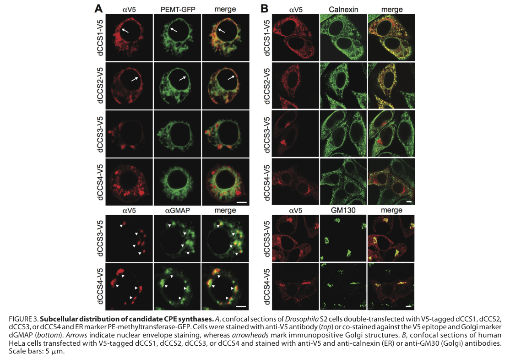

## Question

# Gene Research for Functional Annotation

## ⚠️ CRITICAL: Gene/Protein Identification Context

**BEFORE YOU BEGIN RESEARCH:** You MUST verify you are researching the CORRECT gene/protein. Gene symbols can be ambiguous, especially for less well-characterized genes from non-model organisms.

### Target Gene/Protein Identity (from UniProt):
- **UniProt Accession:** Q9VIU4
- **Protein Description:** RecName: Full=Ethanolaminephosphotransferase 1 {ECO:0008006|Google:ProtNLM};
- **Gene Information:** Name=Dmel\CG33116 {ECO:0000313|EMBL:AAF53821.2}; Synonyms=CG10355 {ECO:0000313|EMBL:AAF53821.2}, dCCS1 {ECO:0000313|EMBL:AAF53821.2}; ORFNames=CG33116 {ECO:0000313|EMBL:AAF53821.2, ECO:0000313|FlyBase:FBgn0053116}, Dmel_CG33116 {ECO:0000313|EMBL:AAF53821.2};
- **Organism (full):** Drosophila melanogaster (Fruit fly).
- **Protein Family:** Belongs to the CDP-alcohol phosphatidyltransferase class-I
- **Key Domains:** CDP-OH_P_trans. (IPR000462); CDP-OH_PTrfase_TM_dom. (IPR043130); CDP_ALCOHOL_P_TRANSF_CS. (IPR048254); CHOPT. (IPR014472); CDP-OH_P_transf (PF01066)

### MANDATORY VERIFICATION STEPS:

1. **Check if the gene symbol "Dmel\CG33116" matches the protein description above**
2. **Verify the organism is correct:** Drosophila melanogaster (Fruit fly).
3. **Check if protein family/domains align with what you find in literature**
4. **If you find literature for a DIFFERENT gene with the same or similar symbol, STOP**

### If Gene Symbol is Ambiguous or You Cannot Find Relevant Literature:

**DO NOT PROCEED WITH RESEARCH ON A DIFFERENT GENE.** Instead:
- State clearly: "The gene symbol 'Dmel\CG33116' is ambiguous or literature is limited for this specific protein"
- Explain what you found (e.g., "Found extensive literature on a different gene with the same symbol in a different organism")
- Describe the protein based ONLY on the UniProt information provided above
- Suggest that the protein function can be inferred from domain/family information

### Research Target:

Please provide a comprehensive research report on the gene **Dmel\CG33116** (gene ID: CG33116, UniProt: Q9VIU4) in DROME.

The research report should be a detailed narrative explaining the function, biological processes, and localization of the gene product. Citations should be given for all claims.

You should prioritize authoritative reviews and primary scientific literature when conducting research. You can supplement
this with annotations you find in gene/protein databases, but these can be outdated or inaccurate.

We are specifically interested in the primary function of the gene - for enzymes, what reaction is catalyzed, and what is the substrate specificity? For transporters, what is the substrate? For structural proteins or adapters, what is the broader structural role? For signaling molecules, what is the role in the pathway.

We are interested in where in or outside the cell the gene product carries out its function.

We are also interested in the signaling or biochemical pathways in which the gene functions. We are less interested in broad pleiotropic effects, except where these elucidate the precise role.

Include evidence where possible. We are interested in both experimental evidence as well as inference from structure, evolution, or bioinformatic analysis. Precise studies should be prioritized over high-throughput, where available.

## Output

Question: You are an expert researcher providing comprehensive, well-cited information.

Provide detailed information focusing on:
1. Key concepts and definitions with current understanding
2. Recent developments and latest research (prioritize 2023-2024 sources)
3. Current applications and real-world implementations
4. Expert opinions and analysis from authoritative sources
5. Relevant statistics and data from recent studies

Format as a comprehensive research report with proper citations. Include URLs and publication dates where available.
Always prioritize recent, authoritative sources and provide specific citations for all major claims.

# Gene Research for Functional Annotation

## ⚠️ CRITICAL: Gene/Protein Identification Context

**BEFORE YOU BEGIN RESEARCH:** You MUST verify you are researching the CORRECT gene/protein. Gene symbols can be ambiguous, especially for less well-characterized genes from non-model organisms.

### Target Gene/Protein Identity (from UniProt):
- **UniProt Accession:** Q9VIU4
- **Protein Description:** RecName: Full=Ethanolaminephosphotransferase 1 {ECO:0008006|Google:ProtNLM};
- **Gene Information:** Name=Dmel\CG33116 {ECO:0000313|EMBL:AAF53821.2}; Synonyms=CG10355 {ECO:0000313|EMBL:AAF53821.2}, dCCS1 {ECO:0000313|EMBL:AAF53821.2}; ORFNames=CG33116 {ECO:0000313|EMBL:AAF53821.2, ECO:0000313|FlyBase:FBgn0053116}, Dmel_CG33116 {ECO:0000313|EMBL:AAF53821.2};
- **Organism (full):** Drosophila melanogaster (Fruit fly).
- **Protein Family:** Belongs to the CDP-alcohol phosphatidyltransferase class-I
- **Key Domains:** CDP-OH_P_trans. (IPR000462); CDP-OH_PTrfase_TM_dom. (IPR043130); CDP_ALCOHOL_P_TRANSF_CS. (IPR048254); CHOPT. (IPR014472); CDP-OH_P_transf (PF01066)

### MANDATORY VERIFICATION STEPS:

1. **Check if the gene symbol "Dmel\CG33116" matches the protein description above**
2. **Verify the organism is correct:** Drosophila melanogaster (Fruit fly).
3. **Check if protein family/domains align with what you find in literature**
4. **If you find literature for a DIFFERENT gene with the same or similar symbol, STOP**

### If Gene Symbol is Ambiguous or You Cannot Find Relevant Literature:

**DO NOT PROCEED WITH RESEARCH ON A DIFFERENT GENE.** Instead:
- State clearly: "The gene symbol 'Dmel\CG33116' is ambiguous or literature is limited for this specific protein"
- Explain what you found (e.g., "Found extensive literature on a different gene with the same symbol in a different organism")
- Describe the protein based ONLY on the UniProt information provided above
- Suggest that the protein function can be inferred from domain/family information

### Research Target:

Please provide a comprehensive research report on the gene **Dmel\CG33116** (gene ID: CG33116, UniProt: Q9VIU4) in DROME.

The research report should be a detailed narrative explaining the function, biological processes, and localization of the gene product. Citations should be given for all claims.

You should prioritize authoritative reviews and primary scientific literature when conducting research. You can supplement
this with annotations you find in gene/protein databases, but these can be outdated or inaccurate.

We are specifically interested in the primary function of the gene - for enzymes, what reaction is catalyzed, and what is the substrate specificity? For transporters, what is the substrate? For structural proteins or adapters, what is the broader structural role? For signaling molecules, what is the role in the pathway.

We are interested in where in or outside the cell the gene product carries out its function.

We are also interested in the signaling or biochemical pathways in which the gene functions. We are less interested in broad pleiotropic effects, except where these elucidate the precise role.

Include evidence where possible. We are interested in both experimental evidence as well as inference from structure, evolution, or bioinformatic analysis. Precise studies should be prioritized over high-throughput, where available.

# Functional annotation report: *Drosophila melanogaster* CG33116/Q9VIU4

## Executive conclusion

The target is correctly identified as *Drosophila melanogaster* **CG33116** (FBgn0053116; UniProt Q9VIU4), termed **dCCS1** in the principal biochemical study. It is a CEPT-related, integral-membrane member of the class-I CDP-alcohol phosphotransferase family and is best annotated as an **endoplasmic-reticulum ethanolamine phosphotransferase** participating in the Kennedy pathway of phosphatidylethanolamine (PE) synthesis. Its probable reaction is:

**CDP-ethanolamine + 1,2-diacyl-sn-glycerol → CMP + phosphatidylethanolamine.**

However, this exact reaction and lipid-substrate specificity have **not been directly reconstituted or kinetically characterized for CG33116 itself** in the literature retrieved. The enzymatic assignment rests on homology, conserved catalytic motifs, ER localization, and its accepted placement in the fly PE-biosynthetic pathway. Importantly, CG33116/dCCS1 is **not** the Drosophila bulk ceramide phosphoethanolamine synthase: that enzyme is dCCS4/CG4585. (vacaru2013ceramidephosphoethanolaminebiosynthesis pages 3-4, tsai2019transcriptionalfeedbacklinks pages 1-4, vacaru2013ceramidephosphoethanolaminebiosynthesis pages 4-6)

| Annotation aspect | Best-supported conclusion | Evidence type | Confidence / caveat |
|---|---|---|---|
| Identity | *D. melanogaster* CG33116/Q9VIU4 corresponds to **dCCS1**, not dCCS4/CG4585. (vacaru2013ceramidephosphoethanolaminebiosynthesis pages 3-4, vacaru2013ceramidephosphoethanolaminebiosynthesis pages 4-6) | Primary-study gene mapping and phylogenetic classification | **High**; prevents conflation with the experimentally identified CPE synthase dCCS4. |
| Family/domain | CEPT-related, integral-membrane **CDP-alcohol phosphotransferase** containing the conserved CAPT motif. (vacaru2013ceramidephosphoethanolaminebiosynthesis pages 3-4) | Sequence similarity and conserved-motif analysis | **High** for family membership; motif conservation supports catalysis but does not establish exact substrates. |
| Predicted primary reaction | **CDP-ethanolamine + diacylglycerol → phosphatidylethanolamine + CMP**, corresponding to ethanolamine phosphotransferase activity. (tsai2019transcriptionalfeedbacklinks pages 1-4, vacaru2013ceramidephosphoethanolaminebiosynthesis pages 3-4) | Pathway annotation, homology to CEPT/EPT enzymes, and conserved catalytic motif | **Moderate**; the reaction is strongly inferred but was not directly demonstrated with purified CG33116. |
| Localization | CG33116/dCCS1 is an **endoplasmic-reticulum membrane protein**: tagged protein showed reticular and nuclear-envelope staining that overlapped ER markers in S2 and HeLa cells. (vacaru2013ceramidephosphoethanolaminebiosynthesis pages 4-6, vacaru2013ceramidephosphoethanolaminebiosynthesis media 8d6cae59) | Tagged-protein confocal colocalization | **High** for expressed tagged protein; endogenous-protein localization and membrane orientation remain unverified. |
| Biochemical pathway | Functions most plausibly in the terminal membrane-associated step of **Kennedy-pathway phosphatidylethanolamine synthesis**. (tsai2019transcriptionalfeedbacklinks pages 1-4, vacaru2013ceramidephosphoethanolaminebiosynthesis pages 3-4) | Comparative biochemistry and pathway placement | **Moderate–high**; pathway assignment is accepted in later literature but lacks a CG33116-specific reconstitution study. |
| Substrate specificity | CDP-ethanolamine and diacylglycerol are predicted donor and acceptor; selectivity among diacylglycerol molecular species and possible choline-phosphotransferase activity are unknown. | Absence of direct CG33116 substrate-panel or kinetic assays | **Unresolved**; no CG33116-specific kinetic constants or lipid-species preferences were found. |
| Exclusion as bulk CPE synthase | CG33116 is **not** the principal CDP-ethanolamine:ceramide phosphotransferase: its depletion did not substantially reduce CPE synthesis, whereas dCCS4 depletion reduced activity by about 60% and radiolabeled CPE to about 25% of control. (vacaru2013ceramidephosphoethanolaminebiosynthesis pages 4-6) | Candidate-specific RNAi and cellular enzyme assays | **High**; CPE-synthase activity demonstrated for dCCS4 must not be transferred to CG33116. |
| Physiological context | PE synthesis supports neuronal membrane and synaptic-vesicle homeostasis; immune activation also raises PE/PC and expands ER, but these findings are **pathway-level**, not direct CG33116 phenotypes. (tsai2019transcriptionalfeedbacklinks pages 1-4, tsai2019transcriptionalfeedbacklinks pages 5-7, martinez2020innateimmunesignaling pages 8-10, martinez2020innateimmunesignaling pages 3-5) | Genetic, lipidomic, ultrastructural, and immune-metabolic studies of other Kennedy-pathway components | **Contextual only**; CG33116 itself was not shown to cause the reported synaptic or immune phenotypes, and its transcript was not Toll-induced. |

*Table: Evidence-calibrated functional annotation of *Drosophila melanogaster* CG33116/Q9VIU4, separating direct observations from homology-based inference and pathway-level context.*

## 1. Identity verification and nomenclature

The supplied identity is consistent with the literature: CG33116 is a *D. melanogaster* protein and was designated **dCCS1** when Vacaru and colleagues compared four candidate CDP-ethanolamine-dependent enzymes. That study explicitly mapped dCCS1 to CG33116 and grouped it with two other fly proteins related to choline/ethanolamine phosphotransferases: CG6016/dCCS2 and CG7149/dCCS3. CG33116 and CG7149 share 46% identity and were interpreted as products of a fly-lineage duplication. (vacaru2013ceramidephosphoethanolaminebiosynthesis pages 3-4, vacaru2013ceramidephosphoethanolaminebiosynthesis pages 4-6)

The synonym “dCCS1” can cause a critical annotation error. In the candidate screen, it meant “Drosophila candidate CPE synthase 1”; it did **not** mean that CG33116 was ultimately shown to synthesize ceramide phosphoethanolamine. The experimentally identified bulk CPE synthase was **dCCS4/CG4585**, a different gene and protein. Reports assigning the Golgi-luminal CPES reaction to CG33116/Q9VIU4 therefore conflate two candidates. (vacaru2013ceramidephosphoethanolaminebiosynthesis pages 4-6, vacaru2013ceramidephosphoethanolaminebiosynthesis pages 3-4)

## 2. Protein family, domains, and catalytic implications

CG33116 belongs to the **CDP-alcohol phosphatidyltransferase/CDP-alcohol phosphotransferase class-I superfamily**, agreeing with the supplied InterPro and Pfam assignments—CDP-OH_P_trans, CDP-OH_PTrfase_TM_dom, CHOPT, and PF01066. Members are hydrophobic membrane enzymes that transfer a phosphobase from a CDP-alcohol donor to a lipid acceptor.

The relevant family signature is the conserved CAPT sequence pattern **D(X)₂DG(X)₂(A/Y)R(X)₈–₁₆G(X)₃D(X)₃D**. Work discussed by Vacaru et al. notes that the final two aspartates in human CEPT1 are essential for catalysis, whereas other conserved residues contribute to substrate affinity or structural stability. Thus, the domains and motif strongly support a catalytically active CDP-alcohol phosphotransferase, but do not alone prove whether a particular enzyme prefers ethanolamine versus choline donors or which diacylglycerol molecular species it accepts. (vacaru2013ceramidephosphoethanolaminebiosynthesis pages 3-4)

## 3. Primary biochemical function and substrate specificity

### Best-supported reaction

Later Drosophila pathway literature annotates CG33116 and CG7149 as ethanolamine phosphotransferases acting after:

1. **Easily shocked/Eas:** ethanolamine → phosphoethanolamine;
2. **Pect:** phosphoethanolamine → CDP-ethanolamine;
3. **CG33116 or CG7149:** transfer of phosphoethanolamine from CDP-ethanolamine to diacylglycerol, producing PE and CMP. (tsai2019transcriptionalfeedbacklinks pages 1-4)

This is the terminal membrane-associated reaction of the **CDP-ethanolamine branch of the Kennedy pathway**. PE is a major glycerophospholipid whose small headgroup and propensity for non-bilayer curvature influence membrane packing, fusion, vesicle formation, and organelle morphology.

### What has and has not been demonstrated

Direct CG33116-specific evidence remains limited. The available papers did not report purified CG33116, turnover rates, Michaelis constants, headgroup-donor competition, a diacylglycerol-species panel, or loss-and-rescue lipidomics uniquely attributable to CG33116. Consequently:

- **CDP-ethanolamine** is the strongly predicted phosphoethanolamine donor.
- **Diacylglycerol** is the strongly predicted lipid acceptor.
- Preference for particular acyl-chain lengths or unsaturation is unknown.
- Possible residual choline phosphotransferase activity has not been excluded experimentally.
- Functional redundancy or specialization relative to CG7149 remains unresolved.

Accordingly, “ethanolaminephosphotransferase 1” is a well-supported functional annotation, but substrate-level precision remains inferential rather than directly measured. (vacaru2013ceramidephosphoethanolaminebiosynthesis pages 3-4, tsai2019transcriptionalfeedbacklinks pages 1-4)

## 4. Critical exclusion: CG33116 is not the bulk CPE synthase

Vacaru et al. tested whether CG33116 might instead use ceramide as its lipid acceptor to produce CPE. RNAi depletion of dCCS1/CG33116 did not cause the major loss of CDP-ethanolamine-dependent CPE synthesis. In contrast, depletion of dCCS4/CG4585 reduced fluorescent CPES activity by approximately **60%** and reduced radiolabeled CPE synthesis to approximately **25% of control**. Heterologous-expression and topology assays then directly established dCCS4—not CG33116—as CDP-ethanolamine:ceramide ethanolamine phosphotransferase. (vacaru2013ceramidephosphoethanolaminebiosynthesis pages 4-6)

The two reactions should therefore be kept separate:

- **CG33116, inferred EPT:** CDP-ethanolamine + diacylglycerol → PE + CMP.
- **CG4585/dCCS4, demonstrated CPES:** CDP-ethanolamine + ceramide → CPE + CMP.

Likewise, Golgi localization, a luminal active site, six-transmembrane topology, Mn²⁺-dependent CPE production, and ceramide specificity demonstrated for dCCS4 must not be transferred to Q9VIU4. (vacaru2013ceramidephosphoethanolaminebiosynthesis pages 8-9, vacaru2013ceramidephosphoethanolaminebiosynthesis pages 6-8, vacaru2013ceramidephosphoethanolaminebiosynthesis pages 4-6)

## 5. Subcellular localization

The best direct evidence places CG33116/dCCS1 in the **endoplasmic reticulum**. V5-tagged dCCS1 expressed in Drosophila S2 cells showed reticular and nuclear-envelope staining that extensively overlapped an ER marker. It did not show the punctate Golgi pattern of dCCS3 and dCCS4. The same ER-restricted distribution was reproduced in human HeLa cells, where dCCS1 colocalized with calnexin. (vacaru2013ceramidephosphoethanolaminebiosynthesis pages 4-6)

Figure 3 of Vacaru et al. visually confirms this localization: the dCCS1-V5 signal overlaps ER markers in both S2 and HeLa cells, whereas the lower panels distinguish Golgi-associated candidates. (vacaru2013ceramidephosphoethanolaminebiosynthesis media 8d6cae59)

This localization is biochemically coherent because the Kennedy pathway’s terminal phosphotransferase reaction is membrane-associated and consumes diacylglycerol within the ER membrane. Nevertheless, the evidence used overexpressed, epitope-tagged protein. Endogenous-protein imaging, organelle fractionation, and experimental mapping of CG33116’s catalytic-side membrane topology remain unavailable in the retrieved literature.

## 6. Pathways and biological processes

### Kennedy-pathway PE synthesis

The most defensible pathway assignment is de novo PE production through the CDP-ethanolamine/Kennedy pathway. CG33116 acts—or is predicted to act—at the final step, converting the soluble activated intermediate CDP-ethanolamine and membrane-resident diacylglycerol into PE. CG7149 may provide a partly redundant or context-specific terminal activity. (tsai2019transcriptionalfeedbacklinks pages 1-4)

### Neuronal and synaptic membrane homeostasis

PE is enriched in synaptic-vesicle membranes. Tsai et al. placed CG33116 and CG7149 in the PE pathway while demonstrating that disruption of the upstream cytidylyltransferase **Pect** changes retinal phospholipid composition, lowers synaptic-vesicle density to approximately **55% of control** shortly after eclosion, and produces progressive photoreceptor-terminal degeneration by day 5. Control retinal glycerophospholipids were approximately 76% PC and 24% PE; pect mutants were 81% PC and 19% PE, although this overall shift was not significant. More specific decreases occurred in PE 34:1 and PE 36:2. (tsai2019transcriptionalfeedbacklinks pages 4-5, tsai2019transcriptionalfeedbacklinks pages 5-7)

These results establish that adequate Kennedy-pathway flux and specific PE species are important for synaptic-vesicle pools and mature photoreceptor maintenance. They do **not**, however, establish a CG33116-specific neuronal phenotype: the causal mutations were in pect, and the paper did not provide selective CG33116 loss-of-function lipidomics or ultrastructure. The neuronal findings should therefore be interpreted as physiological context for the pathway rather than direct functional validation of Q9VIU4.

### Immune-associated membrane biogenesis

In larval fat body, constitutive Toll activation increased total PE and PC, with most major species rising approximately **1.5–2-fold**; mass-spectrometric comparisons used six samples per group and gave p=0.0417 for total PE and p=0.0080 for total PC. The response was associated with Xbp1-dependent induction of selected Kennedy-pathway enzymes and ER expansion, supporting a model in which phospholipid synthesis supplies membrane for antimicrobial-protein secretion. (martinez2020innateimmunesignaling pages 8-10, martinez2020innateimmunesignaling pages 10-12, martinez2020innateimmunesignaling pages 3-5)

CG33116 itself was specifically reported **not to be induced by Toll signaling**. Eas and CG7149 increased, whereas Pect, Pcyt2, bbc, and CG33116 did not. Thus, CG33116 may contribute constitutive PE-synthetic capacity in fat body, but it is not supported as a transcriptionally induced effector of this immune-metabolic program. (martinez2020innateimmunesignaling pages 8-10)

## 7. Current applications and real-world implementation

CG33116 has no established clinical or industrial application. Its practical importance is as a **Drosophila functional-genomics target** for dissecting membrane-lipid synthesis, enzyme redundancy, ER biology, and tissue-specific PE requirements. Relevant implementations include:

- RNAi or CRISPR perturbation to distinguish CG33116 from CG7149;
- tissue-restricted manipulation in photoreceptors, fat body, muscle, or germline;
- isotope tracing from ethanolamine into CDP-ethanolamine and PE;
- targeted lipidomics to identify acyl-chain preferences;
- ER-localization and membrane-topology mapping with endogenous tags;
- heterologous reconstitution to determine donor and acceptor specificity.

These are research uses rather than deployed biomedical applications.

## 8. Recent research status and expert assessment

Target-specific literature is sparse. Searches prioritizing 2023–2024 did not identify a recent mechanistic study that directly purified, structurally solved, or kinetically characterized CG33116. The strongest direct target evidence remains the 2013 localization and candidate-exclusion work, supplemented by pathway placement in 2019 and immune-metabolic context in 2020.

The current expert interpretation should therefore be conservative:

1. **High confidence:** correct identity as D. melanogaster CG33116/Q9VIU4/dCCS1; membership in the CEPT-related CDP-alcohol phosphotransferase family; localization of tagged protein to the ER; exclusion as the principal CPE synthase.
2. **Moderate-to-high confidence:** function as a terminal Kennedy-pathway ethanolamine phosphotransferase producing PE from CDP-ethanolamine and diacylglycerol.
3. **Low or unresolved confidence:** endogenous membrane orientation, exact diacylglycerol species preference, quantitative kinetics, possible choline-donor activity, tissue-specific essentiality, and division of labor with CG7149.

## 9. Priority experiments for definitive annotation

The decisive experiment would be reconstitution of purified CG33116 in proteoliposomes containing defined diacylglycerol species, followed by LC–MS measurement of PE formation using CDP-ethanolamine versus CDP-choline. Catalytic-motif mutants should serve as negative controls. Complementary endogenous knockout/rescue studies with CG7149 single and double mutants would resolve redundancy, while organelle-resolved lipidomics would test whether loss of CG33116 selectively changes ER PE species.

## References

- Vacaru AM, van den Dikkenberg J, Ternes P, Holthuis JCM. **Ceramide Phosphoethanolamine Biosynthesis in Drosophila Is Mediated by a Unique Ethanolamine Phosphotransferase in the Golgi Lumen.** *Journal of Biological Chemistry*. Published April 19, 2013. https://doi.org/10.1074/jbc.M113.460972 (vacaru2013ceramidephosphoethanolaminebiosynthesis pages 3-4, vacaru2013ceramidephosphoethanolaminebiosynthesis pages 4-6)
- Tsai JW et al. **Transcriptional Feedback Links Lipid Synthesis to Synaptic Vesicle Pools in Drosophila Photoreceptors.** *Neuron*. Published February 20, 2019. https://doi.org/10.1016/j.neuron.2019.01.015 (tsai2019transcriptionalfeedbacklinks pages 1-4, tsai2019transcriptionalfeedbacklinks pages 4-5, tsai2019transcriptionalfeedbacklinks pages 5-7)
- Martínez BA et al. **Innate immune signaling in Drosophila shifts anabolic lipid metabolism from triglyceride storage to phospholipid synthesis to support immune function.** *PLOS Genetics*. Published November 23, 2020. https://doi.org/10.1371/journal.pgen.1009192 (martinez2020innateimmunesignaling pages 8-10, martinez2020innateimmunesignaling pages 10-12, martinez2020innateimmunesignaling pages 3-5)

References

1. (vacaru2013ceramidephosphoethanolaminebiosynthesis pages 3-4): Ana M. Vacaru, Joep van den Dikkenberg, Philipp Ternes, and Joost C.M. Holthuis. Ceramide phosphoethanolamine biosynthesis in drosophila is mediated by a unique ethanolamine phosphotransferase in the golgi lumen. Apr 2013. URL: https://doi.org/10.1074/jbc.m113.460972, doi:10.1074/jbc.m113.460972. This article has 92 citations and is from a domain leading peer-reviewed journal.

2. (tsai2019transcriptionalfeedbacklinks pages 1-4): Jessica W. Tsai, Ripsik Kostyleva, Pei-Ling Chen, Irma Magaly Rivas-Serna, M. Thomas Clandinin, Ian A. Meinertzhagen, and Thomas R. Clandinin. Transcriptional feedback links lipid synthesis to synaptic vesicle pools in drosophila photoreceptors. Neuron, 101:721-737.e4, Feb 2019. URL: https://doi.org/10.1016/j.neuron.2019.01.015, doi:10.1016/j.neuron.2019.01.015. This article has 28 citations and is from a highest quality peer-reviewed journal.

3. (vacaru2013ceramidephosphoethanolaminebiosynthesis pages 4-6): Ana M. Vacaru, Joep van den Dikkenberg, Philipp Ternes, and Joost C.M. Holthuis. Ceramide phosphoethanolamine biosynthesis in drosophila is mediated by a unique ethanolamine phosphotransferase in the golgi lumen. Apr 2013. URL: https://doi.org/10.1074/jbc.m113.460972, doi:10.1074/jbc.m113.460972. This article has 92 citations and is from a domain leading peer-reviewed journal.

4. (vacaru2013ceramidephosphoethanolaminebiosynthesis media 8d6cae59): Ana M. Vacaru, Joep van den Dikkenberg, Philipp Ternes, and Joost C.M. Holthuis. Ceramide phosphoethanolamine biosynthesis in drosophila is mediated by a unique ethanolamine phosphotransferase in the golgi lumen. Apr 2013. URL: https://doi.org/10.1074/jbc.m113.460972, doi:10.1074/jbc.m113.460972. This article has 92 citations and is from a domain leading peer-reviewed journal.

5. (tsai2019transcriptionalfeedbacklinks pages 5-7): Jessica W. Tsai, Ripsik Kostyleva, Pei-Ling Chen, Irma Magaly Rivas-Serna, M. Thomas Clandinin, Ian A. Meinertzhagen, and Thomas R. Clandinin. Transcriptional feedback links lipid synthesis to synaptic vesicle pools in drosophila photoreceptors. Neuron, 101:721-737.e4, Feb 2019. URL: https://doi.org/10.1016/j.neuron.2019.01.015, doi:10.1016/j.neuron.2019.01.015. This article has 28 citations and is from a highest quality peer-reviewed journal.

6. (martinez2020innateimmunesignaling pages 8-10): Brittany A. Martínez, Rosalie G. Hoyle, Scott Yeudall, Mitchell E. Granade, Thurl E. Harris, J. David Castle, Norbert Leitinger, and Michelle L. Bland. Innate immune signaling in drosophila shifts anabolic lipid metabolism from triglyceride storage to phospholipid synthesis to support immune function. Nov 2020. URL: https://doi.org/10.1371/journal.pgen.1009192, doi:10.1371/journal.pgen.1009192. This article has 96 citations and is from a domain leading peer-reviewed journal.

7. (martinez2020innateimmunesignaling pages 3-5): Brittany A. Martínez, Rosalie G. Hoyle, Scott Yeudall, Mitchell E. Granade, Thurl E. Harris, J. David Castle, Norbert Leitinger, and Michelle L. Bland. Innate immune signaling in drosophila shifts anabolic lipid metabolism from triglyceride storage to phospholipid synthesis to support immune function. Nov 2020. URL: https://doi.org/10.1371/journal.pgen.1009192, doi:10.1371/journal.pgen.1009192. This article has 96 citations and is from a domain leading peer-reviewed journal.

8. (vacaru2013ceramidephosphoethanolaminebiosynthesis pages 8-9): Ana M. Vacaru, Joep van den Dikkenberg, Philipp Ternes, and Joost C.M. Holthuis. Ceramide phosphoethanolamine biosynthesis in drosophila is mediated by a unique ethanolamine phosphotransferase in the golgi lumen. Apr 2013. URL: https://doi.org/10.1074/jbc.m113.460972, doi:10.1074/jbc.m113.460972. This article has 92 citations and is from a domain leading peer-reviewed journal.

9. (vacaru2013ceramidephosphoethanolaminebiosynthesis pages 6-8): Ana M. Vacaru, Joep van den Dikkenberg, Philipp Ternes, and Joost C.M. Holthuis. Ceramide phosphoethanolamine biosynthesis in drosophila is mediated by a unique ethanolamine phosphotransferase in the golgi lumen. Apr 2013. URL: https://doi.org/10.1074/jbc.m113.460972, doi:10.1074/jbc.m113.460972. This article has 92 citations and is from a domain leading peer-reviewed journal.

10. (tsai2019transcriptionalfeedbacklinks pages 4-5): Jessica W. Tsai, Ripsik Kostyleva, Pei-Ling Chen, Irma Magaly Rivas-Serna, M. Thomas Clandinin, Ian A. Meinertzhagen, and Thomas R. Clandinin. Transcriptional feedback links lipid synthesis to synaptic vesicle pools in drosophila photoreceptors. Neuron, 101:721-737.e4, Feb 2019. URL: https://doi.org/10.1016/j.neuron.2019.01.015, doi:10.1016/j.neuron.2019.01.015. This article has 28 citations and is from a highest quality peer-reviewed journal.

11. (martinez2020innateimmunesignaling pages 10-12): Brittany A. Martínez, Rosalie G. Hoyle, Scott Yeudall, Mitchell E. Granade, Thurl E. Harris, J. David Castle, Norbert Leitinger, and Michelle L. Bland. Innate immune signaling in drosophila shifts anabolic lipid metabolism from triglyceride storage to phospholipid synthesis to support immune function. Nov 2020. URL: https://doi.org/10.1371/journal.pgen.1009192, doi:10.1371/journal.pgen.1009192. This article has 96 citations and is from a domain leading peer-reviewed journal.

## Artifacts

- [Edison artifact artifact-00](CG33116-deep-research-falcon_artifacts/artifact-00.md)

## Citations

1. vacaru2013ceramidephosphoethanolaminebiosynthesis pages 3-4
2. vacaru2013ceramidephosphoethanolaminebiosynthesis pages 4-6
3. tsai2019transcriptionalfeedbacklinks pages 1-4
4. martinez2020innateimmunesignaling pages 8-10
5. tsai2019transcriptionalfeedbacklinks pages 5-7
6. martinez2020innateimmunesignaling pages 3-5
7. vacaru2013ceramidephosphoethanolaminebiosynthesis pages 8-9
8. vacaru2013ceramidephosphoethanolaminebiosynthesis pages 6-8
9. tsai2019transcriptionalfeedbacklinks pages 4-5
10. martinez2020innateimmunesignaling pages 10-12
11. https://doi.org/10.1074/jbc.M113.460972
12. https://doi.org/10.1016/j.neuron.2019.01.015
13. https://doi.org/10.1371/journal.pgen.1009192
14. https://doi.org/10.1074/jbc.m113.460972,
15. https://doi.org/10.1016/j.neuron.2019.01.015,
16. https://doi.org/10.1371/journal.pgen.1009192,