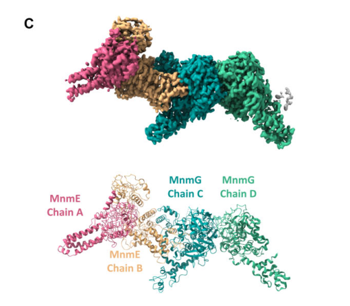

## Question

# Gene Research for Functional Annotation

## ⚠️ CRITICAL: Gene/Protein Identification Context

**BEFORE YOU BEGIN RESEARCH:** You MUST verify you are researching the CORRECT gene/protein. Gene symbols can be ambiguous, especially for less well-characterized genes from non-model organisms.

### Target Gene/Protein Identity (from UniProt):
- **UniProt Accession:** Q9W245
- **Protein Description:** RecName: Full=tRNA uridine 5-carboxymethylaminomethyl modification enzyme C-terminal subdomain domain-containing protein {ECO:0000259|SMART:SM01228};
- **Gene Information:** Name=Dmel\CG4610 {ECO:0000313|EMBL:AAF46854.1}; ORFNames=CG4610 {ECO:0000313|EMBL:AAF46854.1, ECO:0000313|FlyBase:FBgn0034735}, Dmel_CG4610 {ECO:0000313|EMBL:AAF46854.1};
- **Organism (full):** Drosophila melanogaster (Fruit fly).
- **Protein Family:** Belongs to the MnmG family.
- **Key Domains:** FAD/NAD-bd_sf. (IPR036188); GIDA_C_N. (IPR049312); MnmG. (IPR004416); MnmG-rel. (IPR002218); MnmG-rel_CS. (IPR020595)

### MANDATORY VERIFICATION STEPS:

1. **Check if the gene symbol "Dmel\CG4610" matches the protein description above**
2. **Verify the organism is correct:** Drosophila melanogaster (Fruit fly).
3. **Check if protein family/domains align with what you find in literature**
4. **If you find literature for a DIFFERENT gene with the same or similar symbol, STOP**

### If Gene Symbol is Ambiguous or You Cannot Find Relevant Literature:

**DO NOT PROCEED WITH RESEARCH ON A DIFFERENT GENE.** Instead:
- State clearly: "The gene symbol 'Dmel\CG4610' is ambiguous or literature is limited for this specific protein"
- Explain what you found (e.g., "Found extensive literature on a different gene with the same symbol in a different organism")
- Describe the protein based ONLY on the UniProt information provided above
- Suggest that the protein function can be inferred from domain/family information

### Research Target:

Please provide a comprehensive research report on the gene **Dmel\CG4610** (gene ID: CG4610, UniProt: Q9W245) in DROME.

The research report should be a detailed narrative explaining the function, biological processes, and localization of the gene product. Citations should be given for all claims.

You should prioritize authoritative reviews and primary scientific literature when conducting research. You can supplement
this with annotations you find in gene/protein databases, but these can be outdated or inaccurate.

We are specifically interested in the primary function of the gene - for enzymes, what reaction is catalyzed, and what is the substrate specificity? For transporters, what is the substrate? For structural proteins or adapters, what is the broader structural role? For signaling molecules, what is the role in the pathway.

We are interested in where in or outside the cell the gene product carries out its function.

We are also interested in the signaling or biochemical pathways in which the gene functions. We are less interested in broad pleiotropic effects, except where these elucidate the precise role.

Include evidence where possible. We are interested in both experimental evidence as well as inference from structure, evolution, or bioinformatic analysis. Precise studies should be prioritized over high-throughput, where available.

## Output

Question: You are an expert researcher providing comprehensive, well-cited information.

Provide detailed information focusing on:
1. Key concepts and definitions with current understanding
2. Recent developments and latest research (prioritize 2023-2024 sources)
3. Current applications and real-world implementations
4. Expert opinions and analysis from authoritative sources
5. Relevant statistics and data from recent studies

Format as a comprehensive research report with proper citations. Include URLs and publication dates where available.
Always prioritize recent, authoritative sources and provide specific citations for all major claims.

# Gene Research for Functional Annotation

## ⚠️ CRITICAL: Gene/Protein Identification Context

**BEFORE YOU BEGIN RESEARCH:** You MUST verify you are researching the CORRECT gene/protein. Gene symbols can be ambiguous, especially for less well-characterized genes from non-model organisms.

### Target Gene/Protein Identity (from UniProt):
- **UniProt Accession:** Q9W245
- **Protein Description:** RecName: Full=tRNA uridine 5-carboxymethylaminomethyl modification enzyme C-terminal subdomain domain-containing protein {ECO:0000259|SMART:SM01228};
- **Gene Information:** Name=Dmel\CG4610 {ECO:0000313|EMBL:AAF46854.1}; ORFNames=CG4610 {ECO:0000313|EMBL:AAF46854.1, ECO:0000313|FlyBase:FBgn0034735}, Dmel_CG4610 {ECO:0000313|EMBL:AAF46854.1};
- **Organism (full):** Drosophila melanogaster (Fruit fly).
- **Protein Family:** Belongs to the MnmG family.
- **Key Domains:** FAD/NAD-bd_sf. (IPR036188); GIDA_C_N. (IPR049312); MnmG. (IPR004416); MnmG-rel. (IPR002218); MnmG-rel_CS. (IPR020595)

### MANDATORY VERIFICATION STEPS:

1. **Check if the gene symbol "Dmel\CG4610" matches the protein description above**
2. **Verify the organism is correct:** Drosophila melanogaster (Fruit fly).
3. **Check if protein family/domains align with what you find in literature**
4. **If you find literature for a DIFFERENT gene with the same or similar symbol, STOP**

### If Gene Symbol is Ambiguous or You Cannot Find Relevant Literature:

**DO NOT PROCEED WITH RESEARCH ON A DIFFERENT GENE.** Instead:
- State clearly: "The gene symbol 'Dmel\CG4610' is ambiguous or literature is limited for this specific protein"
- Explain what you found (e.g., "Found extensive literature on a different gene with the same symbol in a different organism")
- Describe the protein based ONLY on the UniProt information provided above
- Suggest that the protein function can be inferred from domain/family information

### Research Target:

Please provide a comprehensive research report on the gene **Dmel\CG4610** (gene ID: CG4610, UniProt: Q9W245) in DROME.

The research report should be a detailed narrative explaining the function, biological processes, and localization of the gene product. Citations should be given for all claims.

You should prioritize authoritative reviews and primary scientific literature when conducting research. You can supplement
this with annotations you find in gene/protein databases, but these can be outdated or inaccurate.

We are specifically interested in the primary function of the gene - for enzymes, what reaction is catalyzed, and what is the substrate specificity? For transporters, what is the substrate? For structural proteins or adapters, what is the broader structural role? For signaling molecules, what is the role in the pathway.

We are interested in where in or outside the cell the gene product carries out its function.

We are also interested in the signaling or biochemical pathways in which the gene functions. We are less interested in broad pleiotropic effects, except where these elucidate the precise role.

Include evidence where possible. We are interested in both experimental evidence as well as inference from structure, evolution, or bioinformatic analysis. Precise studies should be prioritized over high-throughput, where available.

# Functional-annotation research report: *Drosophila melanogaster* CG4610

## Identity and evidentiary limit

**The gene symbol ‘Dmel\CG4610’ is ambiguous or literature is limited for this specific protein.** For this report, the target is **CG4610 (FBgn0034735; UniProt [Q9W245](https://www.uniprot.org/uniprotkb/Q9W245/entry)) in *Drosophila melanogaster***, as specified in the question—not a similarly named gene in another organism. The supplied UniProt description calls it a *tRNA uridine 5-carboxymethylaminomethyl modification enzyme C-terminal subdomain domain-containing protein* and assigns it to the MnmG family, with FAD/NAD-binding, MnmG-related and GidA C-terminal domain annotations. These are **sequence/domain annotations**, not a demonstration that purified fly CG4610 catalyzes a particular reaction. Searches for Q9W245, CG4610 and FBgn0034735 did not identify a locus-specific study establishing its catalytic activity, tRNA substrates, binding partner or subcellular location; the mechanistic studies below concern **other organisms**. (maes2025cryoemstructuresof pages 1-2)

## Most defensible functional interpretation

**A role in wobble-uridine modification of tRNA is a family-based hypothesis for CG4610, not a verified fly-gene function.** In the experimentally characterized bacterial system, MnmG (also called GidA) works with the GTPase MnmE to modify uridine at anticodon position 34 (U34). For the glycine-dependent reaction, the complex adds a **5-carboxymethylaminomethyl group**, yielding **cmnm⁵U34**. MnmE binds 5,10-methylenetetrahydrofolate, which supplies the one-carbon unit; MnmG binds FAD and NADH and is the principal tRNA-binding component. An alternative bacterial reaction uses ammonium rather than glycine to produce an aminomethyl-derived modification. This chemistry provides a plausible *class* of reaction for CG4610, but does not establish which reaction—or whether this reaction—occurs in flies. (maes2025cryoemstructuresof pages 1-2)

The strongest caution about **substrate specificity** comes from differences among characterized relatives: yeast mitochondrial MSS1–MTO1 installs glycine-derived **cmnm⁵U34**, whereas human mitochondrial GTPBP3–MTO1 uses **taurine** to produce **5-taurinomethyluridine (τm⁵U34)**. In mammalian mitochondria, taurine depletion can instead lead to glycine-derived cmnm⁵U species. Thus, neither the *carboxymethylaminomethyl* wording in the CG4610 annotation nor the human MTO1 reaction proves that **glycine or taurine is the physiological substrate of CG4610**. That distinction requires direct analysis of fly tRNAs or reconstitution with fly proteins. (maes2025cryoemstructuresof pages 1-2, chujo2025mitochondrialtrnamodifications pages 6-10)

The table separates annotations for the requested protein from experimental findings in related systems.

| System / claim | Reaction or product | Localization / partner | Evidence tier and relevance to CG4610 | Source |
|---|---|---|---|---|
| **D. melanogaster CG4610 (Q9W245; FBgn0034735)** | Annotated as an MnmG-family, FAD/NAD-binding, GidA-C-terminal-domain protein; no CG4610-specific reaction has been demonstrated | **Untested specifically:** intracellular compartment and MnmE/GTPBP3-like partner are not experimentally established | **Database annotation supplied in the query, not direct experimental evidence.** Exact-identifier literature searches did not independently verify fly orthology or biochemical function; family-based inference only | [UniProt Q9W245](https://www.uniprot.org/uniprotkb/Q9W245/entry) |
| **Bacterial E. coli MnmE–MnmG** | Adds **cmnm⁵** to tRNA wobble U34 using glycine and 5,10-methylene-THF; MnmG binds FAD, NADH and tRNA | Cytosolic bacterial complex; MnmG partners with the GTPase MnmE | **Direct biochemical and structural evidence for homologous family machinery, not CG4610.** Cryo-EM resolved α₂β₂ and α₄β₂ complexes and implicated movement of an MnmE helix toward MnmG’s FAD pocket (maes2025cryoemstructuresof pages 2-4, maes2025cryoemstructuresof pages 1-2, maes2025cryoemstructuresof media e621674a) | [Maes et al., 2025](https://doi.org/10.1093/nar/gkaf824) |
| **Yeast mitochondrial MSS1–MTO1** | Produces glycine-derived **cmnm⁵U34** in mitochondrial tRNAs | Mitochondrial MSS1–MTO1 complex | **Comparative family evidence**, reported in the recent structural synthesis; it supports possible mitochondrial specialization but does not establish fly substrate choice or localization (maes2025cryoemstructuresof pages 1-2) | [Maes et al., 2025](https://doi.org/10.1093/nar/gkaf824) |
| **Mammalian mitochondrial GTPBP3–MTO1** | Installs taurine-derived **τm⁵U34** in mt-tRNA^Leu(UUR), mt-tRNA^Gln, mt-tRNA^Lys, mt-tRNA^Glu and mt-tRNA^Trp; glycine-derived cmnm⁵U species appear during taurine depletion | Mitochondrial complex; MTU1 separately installs 2-thiolation in τm⁵s²U | **Direct mammalian biochemical/genetic evidence, not fly evidence.** The modification supports NNR codon decoding; Mto1-knockout mice are embryonic lethal before E9 (chujo2025mitochondrialtrnamodifications pages 6-10, biffo2024thecrosstalkbetween pages 9-11, chujo2025mitochondrialtrnamodifications pages 1-6) | [Biffo et al., 2024](https://doi.org/10.1016/j.cmet.2024.07.022); [Chujo & Tomizawa, 2025](https://doi.org/10.1261/rna.080257.124) |
| **Outstanding CG4610 tests** | Whether the fly enzyme uses **glycine, taurine, ammonium or another substrate**, and which fly tRNA U34 residues it modifies, remain unknown | Mitochondrial versus cytosolic localization and the identity of an MnmE/GTPBP3-like partner remain untested | **No locus-specific evidence found.** Needed tests include endogenous tagging and colocalization, organellar proteomics, partner pulldown, knockout followed by LC–MS tRNA-modification mapping, and purified-enzyme reconstitution | Family mechanism provides assay design only (maes2025cryoemstructuresof pages 1-2) |

*Table: Evidence-tier comparison separating the supplied CG4610 database annotation from experimentally established bacterial, yeast, and mammalian MnmG/MTO1 systems. It highlights that CG4610 localization, partner, tRNA targets, and glycine-versus-taurine specificity remain untested.*

## Biological process, pathway and cellular location

The plausible pathway is **post-transcriptional maturation of tRNA for accurate translation**, rather than a conventional receptor-mediated signaling pathway. U34 chemistry affects recognition of codons ending in A or G. In mammals, τm⁵U or its separately 2-thiolated derivative occurs on five mitochondrial tRNAs—tRNA^Leu(UUR), tRNA^Gln, tRNA^Lys, tRNA^Glu and tRNA^Trp. **MTU1, not MTO1, installs the 2-thio group** on the applicable tRNAs. These five substrates and the thiolation division of labor are established for the mammalian system; they should **not** be listed as experimentally confirmed CG4610 substrates or activities. (chujo2025mitochondrialtrnamodifications pages 1-6, chujo2025mitochondrialtrnamodifications pages 6-10)

For **CG4610 specifically, the intracellular site of action is undetermined** by the literature found. A mitochondrial tRNA-modification role is plausible because the characterized yeast and human eukaryotic MnmG-family systems act in mitochondria, but that comparison is not localization evidence for the fly protein. Consequently, neither a mitochondrial-matrix assignment nor association with a fly MnmE/GTPBP3-like partner should be presented as demonstrated. Likewise, no fly-specific effects on mitochondrial translation, respiratory complexes, development or disease can be attributed to CG4610 from the evidence reviewed. (maes2025cryoemstructuresof pages 1-2)

The pathway has a well-resolved **functional consequence in human mitochondria**: loss of τm⁵U from mitochondrial tRNA^Leu(UUR) impairs UUG decoding and can slow translation of ND6, a respiratory-complex-I subunit. This explains why testing translation and respiration would be informative *after* establishing CG4610’s molecular role, but it is **not** a reported CG4610 phenotype. (chujo2025mitochondrialtrnamodifications pages 6-10)

## Recent research and practical relevance

A **September 2024** review in *Cell Metabolism* describes how taurine availability and folate-derived one-carbon metabolism feed the mammalian GTPBP3–MTO1 reaction, linking metabolic inputs to mitochondrial translation. Its conclusions concern the mammalian pathway, not a demonstrated nutritional response of CG4610. [Biffo, Ruggero and Santoro, 2024; DOI: 10.1016/j.cmet.2024.07.022](https://doi.org/10.1016/j.cmet.2024.07.022). (biffo2024thecrosstalkbetween pages 9-11)

A **2025** primary structural study resolved bacterial MnmE–MnmG assemblies in **α₂β₂ and α₄β₂ states**, at reported resolutions of **3.2 Å and 4.1 Å**, respectively. It observed movement of an MnmE C-terminal helix from the folate-binding region toward MnmG’s FAD-binding region, providing a structural proposal for coupling one-carbon chemistry to tRNA modification. The structures are of ***E. coli* proteins**, not CG4610; their application to the fly protein remains a testable evolutionary inference. [Maes *et al*., 2025; DOI: 10.1093/nar/gkaf824](https://doi.org/10.1093/nar/gkaf824). (maes2025cryoemstructuresof pages 2-4, maes2025cryoemstructuresof pages 1-2, maes2025cryoemstructuresof media e621674a)

An authoritative mitochondrial-tRNA review reports that the mammalian MTO1–GTPBP3 complex installs τm⁵U using taurine and a folate-derived methylene group; in mice, **Mto1 knockout causes embryonic lethality before embryonic day 9**. This is evidence for the biological importance of the *mammalian* modification system, **not a fly CG4610 loss-of-function result**. [Chujo and Tomizawa, *RNA*, 2025; DOI: 10.1261/rna.080257.124](https://doi.org/10.1261/rna.080257.124). (chujo2025mitochondrialtrnamodifications pages 6-10)

**Current application and evidence gap.** The established bacterial and mammalian reactions supply an experimentally actionable annotation strategy, but the reviewed evidence does **not** support a CG4610-specific clinical application or an implemented fly intervention. The decisive experiments would be endogenous CG4610 tagging to determine localization; identification of any protein partner; CG4610 perturbation followed by chemical profiling of purified fly tRNAs at U34; and biochemical reconstitution comparing glycine, taurine and ammonium. Until such results exist, the appropriately qualified primary annotation is **“MnmG-family protein; candidate tRNA wobble-uridine modification factor, with reaction, substrate specificity and localization unverified in *D. melanogaster*.”** (maes2025cryoemstructuresof pages 1-2, chujo2025mitochondrialtrnamodifications pages 6-10)

References

1. (maes2025cryoemstructuresof pages 1-2): Laila Maes, Israel Mares-Mejía, Ella Martin, David Bickel, Siemen Claeys, Wim Vranken, Marcus Fislage, Christian Galicia, and Wim Versées. Cryo-em structures of the mnme–mnmg complex reveal large conformational changes and provide new insights into the mechanism of trna modification. Nucleic Acids Research, Aug 2025. URL: https://doi.org/10.1093/nar/gkaf824, doi:10.1093/nar/gkaf824. This article has 6 citations and is from a highest quality peer-reviewed journal.

2. (chujo2025mitochondrialtrnamodifications pages 6-10): Takeshi Chujo and Kazuhito Tomizawa. Mitochondrial trna modifications: functions, diseases caused by their loss, and treatment strategies. RNA, 31:382-394, Dec 2025. URL: https://doi.org/10.1261/rna.080257.124, doi:10.1261/rna.080257.124. This article has 13 citations and is from a domain leading peer-reviewed journal.

3. (maes2025cryoemstructuresof pages 2-4): Laila Maes, Israel Mares-Mejía, Ella Martin, David Bickel, Siemen Claeys, Wim Vranken, Marcus Fislage, Christian Galicia, and Wim Versées. Cryo-em structures of the mnme–mnmg complex reveal large conformational changes and provide new insights into the mechanism of trna modification. Nucleic Acids Research, Aug 2025. URL: https://doi.org/10.1093/nar/gkaf824, doi:10.1093/nar/gkaf824. This article has 6 citations and is from a highest quality peer-reviewed journal.

4. (maes2025cryoemstructuresof media e621674a): Laila Maes, Israel Mares-Mejía, Ella Martin, David Bickel, Siemen Claeys, Wim Vranken, Marcus Fislage, Christian Galicia, and Wim Versées. Cryo-em structures of the mnme–mnmg complex reveal large conformational changes and provide new insights into the mechanism of trna modification. Nucleic Acids Research, Aug 2025. URL: https://doi.org/10.1093/nar/gkaf824, doi:10.1093/nar/gkaf824. This article has 6 citations and is from a highest quality peer-reviewed journal.

5. (biffo2024thecrosstalkbetween pages 9-11): Stefano Biffo, Davide Ruggero, and Massimo Mattia Santoro. The crosstalk between metabolism and translation. Cell metabolism, 36 9:1945-1962, Sep 2024. URL: https://doi.org/10.1016/j.cmet.2024.07.022, doi:10.1016/j.cmet.2024.07.022. This article has 69 citations and is from a highest quality peer-reviewed journal.

6. (chujo2025mitochondrialtrnamodifications pages 1-6): Takeshi Chujo and Kazuhito Tomizawa. Mitochondrial trna modifications: functions, diseases caused by their loss, and treatment strategies. RNA, 31:382-394, Dec 2025. URL: https://doi.org/10.1261/rna.080257.124, doi:10.1261/rna.080257.124. This article has 13 citations and is from a domain leading peer-reviewed journal.

## Artifacts

- [Edison artifact artifact-00](CG4610-deep-research-falcon_artifacts/artifact-00.md)

## Citations

1. maes2025cryoemstructuresof pages 1-2
2. chujo2025mitochondrialtrnamodifications pages 6-10
3. biffo2024thecrosstalkbetween pages 9-11
4. maes2025cryoemstructuresof pages 2-4
5. chujo2025mitochondrialtrnamodifications pages 1-6
6. Q9W245
7. UniProt Q9W245
8. Maes et al., 2025
9. Biffo et al., 2024
10. Chujo & Tomizawa, 2025
11. Biffo, Ruggero and Santoro, 2024; DOI: 10.1016/j.cmet.2024.07.022
12. Maes *et al*., 2025; DOI: 10.1093/nar/gkaf824
13. Chujo and Tomizawa, *RNA*, 2025; DOI: 10.1261/rna.080257.124
14. https://www.uniprot.org/uniprotkb/Q9W245/entry
15. https://doi.org/10.1093/nar/gkaf824
16. https://doi.org/10.1016/j.cmet.2024.07.022
17. https://doi.org/10.1261/rna.080257.124
18. https://doi.org/10.1093/nar/gkaf824,
19. https://doi.org/10.1261/rna.080257.124,
20. https://doi.org/10.1016/j.cmet.2024.07.022,