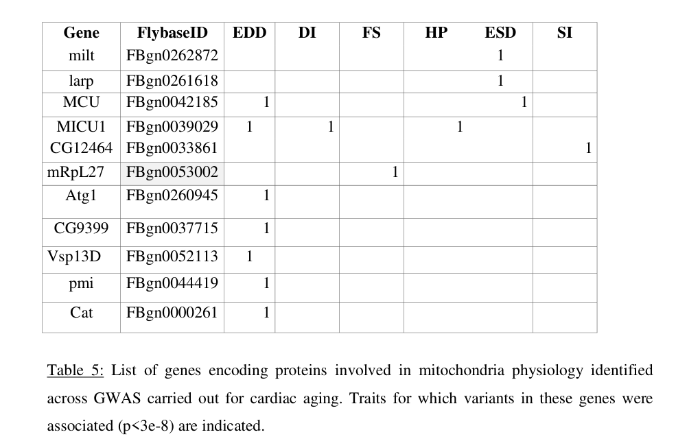

## Question

# Gene Research for Functional Annotation

## ⚠️ CRITICAL: Gene/Protein Identification Context

**BEFORE YOU BEGIN RESEARCH:** You MUST verify you are researching the CORRECT gene/protein. Gene symbols can be ambiguous, especially for less well-characterized genes from non-model organisms.

### Target Gene/Protein Identity (from UniProt):
- **UniProt Accession:** Q9VCT5
- **Protein Description:** RecName: Full=EF-hand domain-containing protein {ECO:0000259|PROSITE:PS50222};
- **Gene Information:** Name=Dmel\CG4704 {ECO:0000313|EMBL:AAF56070.1}; ORFNames=CG4704 {ECO:0000313|EMBL:AAF56070.1, ECO:0000313|FlyBase:FBgn0039029}, Dmel_CG4704 {ECO:0000313|EMBL:AAF56070.1};
- **Organism (full):** Drosophila melanogaster (Fruit fly).
- **Protein Family:** Belongs to the MICU1 family. MICU1 subfamily.
- **Key Domains:** EF-hand-dom_pair. (IPR011992); EF_Hand_1_Ca_BS. (IPR018247); EF_hand_dom. (IPR002048); MICU1/2/3. (IPR039800); EF-hand_8 (PF13833)

### MANDATORY VERIFICATION STEPS:

1. **Check if the gene symbol "Dmel\CG4704" matches the protein description above**
2. **Verify the organism is correct:** Drosophila melanogaster (Fruit fly).
3. **Check if protein family/domains align with what you find in literature**
4. **If you find literature for a DIFFERENT gene with the same or similar symbol, STOP**

### If Gene Symbol is Ambiguous or You Cannot Find Relevant Literature:

**DO NOT PROCEED WITH RESEARCH ON A DIFFERENT GENE.** Instead:
- State clearly: "The gene symbol 'Dmel\CG4704' is ambiguous or literature is limited for this specific protein"
- Explain what you found (e.g., "Found extensive literature on a different gene with the same symbol in a different organism")
- Describe the protein based ONLY on the UniProt information provided above
- Suggest that the protein function can be inferred from domain/family information

### Research Target:

Please provide a comprehensive research report on the gene **Dmel\CG4704** (gene ID: CG4704, UniProt: Q9VCT5) in DROME.

The research report should be a detailed narrative explaining the function, biological processes, and localization of the gene product. Citations should be given for all claims.

You should prioritize authoritative reviews and primary scientific literature when conducting research. You can supplement
this with annotations you find in gene/protein databases, but these can be outdated or inaccurate.

We are specifically interested in the primary function of the gene - for enzymes, what reaction is catalyzed, and what is the substrate specificity? For transporters, what is the substrate? For structural proteins or adapters, what is the broader structural role? For signaling molecules, what is the role in the pathway.

We are interested in where in or outside the cell the gene product carries out its function.

We are also interested in the signaling or biochemical pathways in which the gene functions. We are less interested in broad pleiotropic effects, except where these elucidate the precise role.

Include evidence where possible. We are interested in both experimental evidence as well as inference from structure, evolution, or bioinformatic analysis. Precise studies should be prioritized over high-throughput, where available.

## Output

Question: You are an expert researcher providing comprehensive, well-cited information.

Provide detailed information focusing on:
1. Key concepts and definitions with current understanding
2. Recent developments and latest research (prioritize 2023-2024 sources)
3. Current applications and real-world implementations
4. Expert opinions and analysis from authoritative sources
5. Relevant statistics and data from recent studies

Format as a comprehensive research report with proper citations. Include URLs and publication dates where available.
Always prioritize recent, authoritative sources and provide specific citations for all major claims.

# Gene Research for Functional Annotation

## ⚠️ CRITICAL: Gene/Protein Identification Context

**BEFORE YOU BEGIN RESEARCH:** You MUST verify you are researching the CORRECT gene/protein. Gene symbols can be ambiguous, especially for less well-characterized genes from non-model organisms.

### Target Gene/Protein Identity (from UniProt):
- **UniProt Accession:** Q9VCT5
- **Protein Description:** RecName: Full=EF-hand domain-containing protein {ECO:0000259|PROSITE:PS50222};
- **Gene Information:** Name=Dmel\CG4704 {ECO:0000313|EMBL:AAF56070.1}; ORFNames=CG4704 {ECO:0000313|EMBL:AAF56070.1, ECO:0000313|FlyBase:FBgn0039029}, Dmel_CG4704 {ECO:0000313|EMBL:AAF56070.1};
- **Organism (full):** Drosophila melanogaster (Fruit fly).
- **Protein Family:** Belongs to the MICU1 family. MICU1 subfamily.
- **Key Domains:** EF-hand-dom_pair. (IPR011992); EF_Hand_1_Ca_BS. (IPR018247); EF_hand_dom. (IPR002048); MICU1/2/3. (IPR039800); EF-hand_8 (PF13833)

### MANDATORY VERIFICATION STEPS:

1. **Check if the gene symbol "Dmel\CG4704" matches the protein description above**
2. **Verify the organism is correct:** Drosophila melanogaster (Fruit fly).
3. **Check if protein family/domains align with what you find in literature**
4. **If you find literature for a DIFFERENT gene with the same or similar symbol, STOP**

### If Gene Symbol is Ambiguous or You Cannot Find Relevant Literature:

**DO NOT PROCEED WITH RESEARCH ON A DIFFERENT GENE.** Instead:
- State clearly: "The gene symbol 'Dmel\CG4704' is ambiguous or literature is limited for this specific protein"
- Explain what you found (e.g., "Found extensive literature on a different gene with the same symbol in a different organism")
- Describe the protein based ONLY on the UniProt information provided above
- Suggest that the protein function can be inferred from domain/family information

### Research Target:

Please provide a comprehensive research report on the gene **Dmel\CG4704** (gene ID: CG4704, UniProt: Q9VCT5) in DROME.

The research report should be a detailed narrative explaining the function, biological processes, and localization of the gene product. Citations should be given for all claims.

You should prioritize authoritative reviews and primary scientific literature when conducting research. You can supplement
this with annotations you find in gene/protein databases, but these can be outdated or inaccurate.

We are specifically interested in the primary function of the gene - for enzymes, what reaction is catalyzed, and what is the substrate specificity? For transporters, what is the substrate? For structural proteins or adapters, what is the broader structural role? For signaling molecules, what is the role in the pathway.

We are interested in where in or outside the cell the gene product carries out its function.

We are also interested in the signaling or biochemical pathways in which the gene functions. We are less interested in broad pleiotropic effects, except where these elucidate the precise role.

Include evidence where possible. We are interested in both experimental evidence as well as inference from structure, evolution, or bioinformatic analysis. Precise studies should be prioritized over high-throughput, where available.

# Functional annotation of *Drosophila melanogaster* CG4704 (Q9VCT5)

## Identity check: an unresolved MICU1 naming conflict

**The gene symbol `Dmel\CG4704` has limited and conflicting functional literature for this specific protein.** The supplied UniProt record identifies Q9VCT5 as the *D. melanogaster* CG4704 product, an EF-hand-domain protein assigned to the MICU1 family and subfamily. That family assignment is consistent with the supplied EF-hand and MICU1/2/3 domain annotations, but it does **not** establish that CG4704 is the fly protein characterized experimentally under the name MICU1. The accession-to-gene and domain information here comes from the record supplied in the question; it was not independently verified against a current UniProt release. [UniProt Q9VCT5](https://www.uniprot.org/uniprotkb/Q9VCT5/entry).

There is a material discrepancy between primary sources. In the methods of a fly uniporter genetics study, **MICU1 is explicitly CG4495**, whereas MCU—the pore-forming gene—is **CG18769**, EMRE is CG17680, and MICU3 is CG4662. In contrast, a 2024 cardiac-aging preprint calls **CG4704/FBgn0039029** the fly MICU1 ortholog; its Table 5 labels that identifier “MICU1” while listing MCU separately as FBgn0042185. These are distinct identifiers, and the retrieved studies do not provide a sequence analysis or synonym history that reconciles the assignments. In the older study, “MCU1” is an **MCU mutant-allele designation**, not evidence that MCU, MICU1 and CG4704 are the same gene. Consequently, experimental results on CG4495 or MCU must not be presented as results for Q9VCT5/CG4704. (tufi2018acomprehensivegenetic pages 9-12, audouin2024naturalvariationsof pages 11-14, audouin2024naturalvariationsof media a609249a)

## What can be said about the protein and its pathway

On the **supplied protein annotation alone**, CG4704 is a putative EF-hand Ca²⁺-binding or Ca²⁺-sensing protein. MICU-family membership makes a role in mitochondrial Ca²⁺ regulation a *hypothesis*, not a demonstrated molecular function for Q9VCT5. An EF-hand is a candidate Ca²⁺-binding module; the domain call does not demonstrate ion binding by this particular protein, identify binding affinity, or show how Ca²⁺ might alter its activity. CG4704 should **not** be annotated as an enzyme catalyzing a reaction or as the Ca²⁺-conducting MCU channel on this evidence. (tufi2018acomprehensivegenetic pages 9-12, audouin2024naturalvariationsof pages 11-14)

The mechanistic pathway invoked by the cardiac-aging authors is mitochondrial Ca²⁺ uptake through the MCU-containing complex: they describe MCU as its pore-forming component and CG4704, under their MICU1 assignment, as a possible accessory regulator. That is the authors’ interpretation of CG4704’s identity, **not a CG4704-specific demonstration of complex membership or gatekeeping**. Although the uniporter acts at the inner mitochondrial membrane, the retrieved evidence does **not** establish where Q9VCT5 itself resides—in mitochondria, a submitochondrial compartment, or elsewhere. No CG4704-specific substrate specificity, physical interaction with MCU, Ca²⁺-flux effect, or biochemical activity can therefore be stated. (audouin2024naturalvariationsof pages 11-14, tufi2018acomprehensivegenetic pages 9-12)

## CG4704-specific experimental literature

The strongest retrieved evidence directly naming CG4704 concerns **genetic association rather than protein function**. In a peer-reviewed longitudinal analysis of fly cardiac aging, Saha and colleagues examined heart-period measurements at one and four weeks across **165 Drosophila Genetic Reference Panel lines**, with **12 flies per line at four weeks**. Their initial selection used **1,682 SNPs** meeting a nominal longitudinal-GWAS threshold of *p* < 10⁻⁵. In the resulting epistasis network, **one SNP within CG4704 statistically interacted with 10 variants in nine other genes**. This identifies a candidate locus involved in variation of heart-period aging; it does not identify the causal variant, prove a CG4704 protein mechanism, or measure mitochondrial Ca²⁺ transport. The article calls CG4704 a fly ortholog of human “MCU1,” terminology that should not be used to override the conflicting fly-gene assignments above. [Saha *et al.*, *Nucleic Acids Research*, September 2022, doi:10.1093/nar/gkac715](https://doi.org/10.1093/nar/gkac715). (saha2022epimeifdetectinghigher pages 10-11)

A **preprint posted October 1, 2024** extends the cardiac-aging context. Audouin and colleagues analyzed **193 inbred lines** and report phenotyping **more than 4,000 flies overall**. Their Table 5 associates the locus labeled **MICU1/FBgn0039029** with aging-related **end-diastolic diameter (EDD), diastolic interval (DI), and heart period (HP)** under the table’s stated criterion of *p* < 3 × 10⁻⁸; the text explicitly identifies a retrieved variant as being in **CG4704**. The study’s functional manipulations instead targeted **Pdp1 and MCU**. In particular, its MCU–Pdp1 genetic-interaction result is **not a CG4704 perturbation experiment**. These observations support CG4704 as a **candidate cardiac-aging-associated locus**, but do not validate its protein function or settle the MICU1 naming conflict. [Audouin *et al.*, bioRxiv preprint, October 1, 2024, doi:10.1101/2024.09.30.615759](https://doi.org/10.1101/2024.09.30.615759). (audouin2024naturalvariationsof pages 1-3, audouin2024naturalvariationsof pages 11-14, audouin2024naturalvariationsof media a609249a)

The evidence tiers and gene identities are summarized below.

| Source and year | Gene identity examined | Evidence and key data | Supported conclusion |
|---|---|---|---|
| UniProt Q9VCT5 information supplied in the query | *D. melanogaster* **CG4704**, Dmel_CG4704, FBgn0039029, Q9VCT5 | Database annotation describes an EF-hand-domain protein in the MICU1 family or subfamily, with an EF-hand pair, a predicted Ca²⁺-binding site and PF13833. This supplied annotation is not independent experimental evidence. | Supports family- and domain-based inference of Ca²⁺ binding or sensing, but does not establish mitochondrial localization, MCU-complex membership, gatekeeping activity or ion transport by CG4704. |
| [Tufi et al., bioRxiv, October 2018](https://doi.org/10.1101/458174) | Experimentally studied fly **MICU1 is CG4495**; **MCU is CG18769**, **EMRE is CG17680**, and **MICU3 is CG4662** | The methods explicitly map these identifiers and describe MICU1 mutants, transgenic rescue and mitochondrial Ca²⁺-flux assays. CG4704 was not the MICU1 locus tested. “MCU1” denotes an MCU mutant allele, not MICU1 or CG4704. (tufi2018acomprehensivegenetic pages 9-12) | Direct MICU1 findings from this study must not be assigned to CG4704. CG4495 and CG4704 are distinct loci, and neither is the MCU pore gene CG18769. |
| [Saha et al., *Nucleic Acids Research*, September 2022](https://doi.org/10.1093/nar/gkac715) | **CG4704**, described by the authors as a fly orthologue of human “MCU1” | Observational longitudinal DGRP analysis used 165 lines and 12 flies per line at four weeks. From 1,682 SNPs selected at nominal GWAS *p* < 10⁻⁵, one CG4704 SNP interacted statistically with 10 variants in nine genes in the heart-period-aging network. No CG4704 perturbation, localization assay or mitochondrial Ca²⁺-flux measurement was reported in the retrieved text. (saha2022epimeifdetectinghigher pages 10-11) | Establishes a statistical epistasis association with cardiac aging, not proof that CG4704 is MICU1, localizes to mitochondria or regulates the MCU channel. |
| [Audouin et al., bioRxiv, posted October 1, 2024](https://doi.org/10.1101/2024.09.30.615759) | **CG4704 or FBgn0039029**, labeled “MICU1” by the authors; MCU is separately listed as FBgn0042185 | In a cardiac-aging GWAS covering 193 DGRP lines and more than 4,000 individuals overall, Table 5 associates FBgn0039029 with EDD, DI and HP at *p* < 3 × 10⁻⁸. CG4704 was not knocked down, overexpressed or tested for Ca²⁺ flux or localization; functional experiments instead concerned Pdp1 and MCU. (audouin2024naturalvariationsof pages 1-3, audouin2024naturalvariationsof pages 11-14, audouin2024naturalvariationsof media a609249a) | Links CG4704 variation to cardiac-aging traits, but the evidence is associational and preprint-level. The MICU1 label conflicts with Tufi et al.’s explicit assignment of fly MICU1 to CG4495 and requires independent curation before mechanistic annotation. |

*Table: This table separates CG4704-specific observations from family-based inference and experiments on the distinct MICU1 locus CG4495. It highlights the unresolved nomenclature conflict and avoids conflation with the MCU pore.*

## Assessment and practical significance

**Best-supported annotation:** CG4704/Q9VCT5 is an *EF-hand-containing, MICU1-family candidate Ca²⁺-responsive protein*, with genetic associations to fly cardiac-aging traits. **Unresolved:** whether it binds Ca²⁺, regulates the mitochondrial uniporter, physically associates with any channel component, and where its protein localizes. The conflicting designation of fly MICU1 as **CG4495** in a direct uniporter study versus **CG4704/FBgn0039029** in the 2024 preprint is a prerequisite curation problem, not a discrepancy that can safely be resolved by merging the genes. The present real-world use of CG4704 in the retrieved literature is as a **candidate locus in fly cardiac genetics**, not as a validated therapeutic target or an experimentally established MCU regulator. Establishing its precise function would require identifier and sequence reconciliation followed by CG4704-specific localization, perturbation and Ca²⁺-binding or flux experiments. (tufi2018acomprehensivegenetic pages 9-12, audouin2024naturalvariationsof pages 11-14, saha2022epimeifdetectinghigher pages 10-11, audouin2024naturalvariationsof media a609249a)

References

1. (tufi2018acomprehensivegenetic pages 9-12): Roberta Tufi, Thomas P. Gleeson, Sophia von Stockum, Victoria L. Hewitt, Juliette J. Lee, Ana Terriente-Felix, Alvaro Sanchez-Martinez, Elena Ziviani, and Alexander J. Whitworth. A comprehensive genetic characterisation of the mitochondrial ca2+ uniporter in drosophila. bioRxiv, Oct 2018. URL: https://doi.org/10.1101/458174, doi:10.1101/458174. This article has 3 citations.

2. (audouin2024naturalvariationsof pages 11-14): Katell Audouin, Saswati Saha, Laurence Röder, Sallouha Krifa, Nathalie Arquier, and Laurent Perrin. Natural variations of aging of cardiac performance in drosophila identifies a central function for the par domain bzip transcription factor pdp1/dhlf in cardiac senescence. bioRxiv, Oct 2024. URL: https://doi.org/10.1101/2024.09.30.615759, doi:10.1101/2024.09.30.615759. This article has 0 citations.

3. (audouin2024naturalvariationsof media a609249a): Katell Audouin, Saswati Saha, Laurence Röder, Sallouha Krifa, Nathalie Arquier, and Laurent Perrin. Natural variations of aging of cardiac performance in drosophila identifies a central function for the par domain bzip transcription factor pdp1/dhlf in cardiac senescence. bioRxiv, Oct 2024. URL: https://doi.org/10.1101/2024.09.30.615759, doi:10.1101/2024.09.30.615759. This article has 0 citations.

4. (saha2022epimeifdetectinghigher pages 10-11): Saswati Saha, Laurent Perrin, Laurence Röder, Christine Brun, and Lionel Spinelli. Epi-meif: detecting higher order epistatic interactions for complex traits using mixed effect conditional inference forests. Nucleic Acids Research, 50:e114-e114, Sep 2022. URL: https://doi.org/10.1093/nar/gkac715, doi:10.1093/nar/gkac715. This article has 16 citations and is from a highest quality peer-reviewed journal.

5. (audouin2024naturalvariationsof pages 1-3): Katell Audouin, Saswati Saha, Laurence Röder, Sallouha Krifa, Nathalie Arquier, and Laurent Perrin. Natural variations of aging of cardiac performance in drosophila identifies a central function for the par domain bzip transcription factor pdp1/dhlf in cardiac senescence. bioRxiv, Oct 2024. URL: https://doi.org/10.1101/2024.09.30.615759, doi:10.1101/2024.09.30.615759. This article has 0 citations.

## Artifacts

- [Edison artifact artifact-00](CG4704-deep-research-falcon_artifacts/artifact-00.md)

## Citations

1. saha2022epimeifdetectinghigher pages 10-11
2. tufi2018acomprehensivegenetic pages 9-12
3. audouin2024naturalvariationsof pages 11-14
4. audouin2024naturalvariationsof pages 1-3
5. UniProt Q9VCT5
6. Saha *et al.*, *Nucleic Acids Research*, September 2022, doi:10.1093/nar/gkac715
7. Audouin *et al.*, bioRxiv preprint, October 1, 2024, doi:10.1101/2024.09.30.615759
8. Tufi et al., bioRxiv, October 2018
9. Saha et al., *Nucleic Acids Research*, September 2022
10. Audouin et al., bioRxiv, posted October 1, 2024
11. https://www.uniprot.org/uniprotkb/Q9VCT5/entry
12. https://doi.org/10.1093/nar/gkac715
13. https://doi.org/10.1101/2024.09.30.615759
14. https://doi.org/10.1101/458174
15. https://doi.org/10.1101/458174,
16. https://doi.org/10.1101/2024.09.30.615759,
17. https://doi.org/10.1093/nar/gkac715,