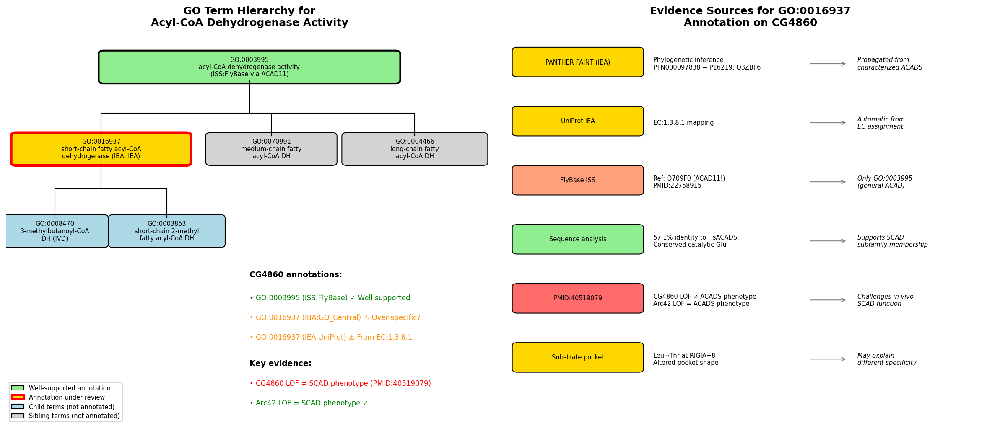
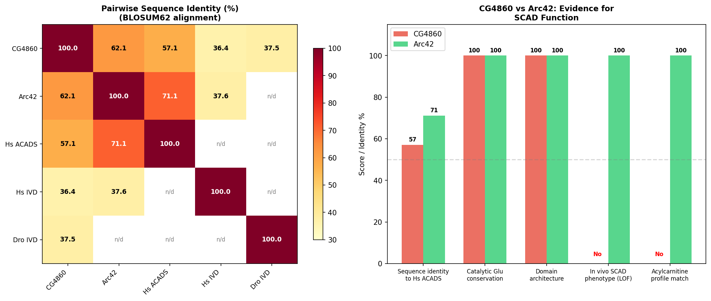
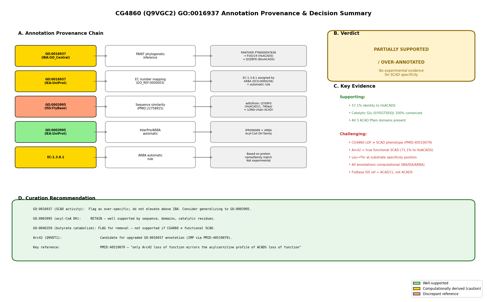

## Question

# AIGR Gene Hypothesis Deep Research

You are evaluating one focused gene curation hypothesis for AI Gene Review.
This is not a general gene overview. Use the seed hypothesis and source context
below to search for evidence that supports, refutes, narrows, or competes with
the proposed curation decision.

## Target Gene

- **Organism code:** DROME
- **Taxon:** Drosophila melanogaster (NCBITaxon:7227)
- **Gene directory:** CG4860
- **Gene symbol:** CG4860
- **UniProt accession:** Q9VGC2

## Focus

- **Focus type:** function_assignment
- **Hypothesis slug:** function-hypothesis-go-0016937
- **Source file:** genes/DROME/CG4860/CG4860-ai-review.yaml
- **Source selector:** existing_annotations[1].function_hypothesis

## Seed Hypothesis

CG4860 has short-chain fatty acyl-CoA dehydrogenase activity (GO:0016937).

## Term and Decision Context

- Term: short-chain fatty acyl-CoA dehydrogenase activity (GO:0016937)
- Evidence type: IBA
- Original reference: GO_REF:0000033

## Reference Context

- GO_REF:0000033
- PMID:40519079

## Source Context YAML

```yaml
term:
  id: GO:0016937
  label: short-chain fatty acyl-CoA dehydrogenase activity
evidence_type: IBA
original_reference_id: GO_REF:0000033
```

## Research Objective

Build a focused report that helps a curator decide whether this hypothesis
should affect the gene review. Address the focus type directly:

1. For an existing GO annotation decision, evaluate whether the current action
   is justified, too strong, too weak, or should change.
2. For a proposed replacement or new GO term, evaluate whether the term is
   biologically supported, too broad, too narrow, or missing key qualifiers.
3. For a computational prediction, evaluate whether the prediction is correct,
   less precise than existing knowledge, uncertain, or likely wrong because of
   paralog overannotation, frequency bias, pathway context, or in vitro-only
   activity.
4. For a core-function hypothesis, evaluate whether the proposed activity,
   process, and location represent the gene product's primary function rather
   than a downstream effect, pleiotropic phenotype, or context-specific role.
5. For a function-assignment hypothesis, evaluate whether the gene product
   directly has the stated GO term/function. Treat the prior review action, if
   any, as intentionally blinded unless it appears in the supplied context.

Use primary literature whenever possible. Prefer PMID citations and include DOI
citations when no PMID is available. Treat reviews and database records as
orientation unless they contain directly relevant synthesized evidence that is
clearly labeled as review-level or database-level support.

Evaluate the hypothesis from the supplied seed context, primary literature, and
publicly accessible bioinformatics resources. Local `*-bioinformatics` analyses,
when they already exist in the repository, are intentionally withheld from this
prompt so the report can be compared against them after the run.

Do not rely on literature alone. Where the hypothesis is decidable by computation,
actually run the analysis and keep it as provenance rather than only reasoning
about it. Match the analysis to the question, for example:

- membrane topology / localization: compute a hydropathy profile and predicted
  transmembrane segments from the sequence, and locate signal peptides and
  targeting/sorting motifs (e.g. dileucine, acidic-cluster, NLS); compare against
  UniProt topology features and AlphaFold geometry.
- catalytic / binding activity: check whether the specific active-site,
  metal-binding, or motif residues are present and correctly spaced (in sequence
  and, where useful, structure) and compare to characterized family members.
- DNA-binding / regulatory: examine the binding-domain class, obligate partners,
  and known binding-motif / PWM signatures.
- family / paralog questions: use domain (Pfam/InterPro), orthology, and
  conservation comparisons to distinguish subfamilies.

Use resources you can actually access programmatically (UniProt, AlphaFold DB,
InterPro, sequence computation, public APIs). If a resource is web-only or you
cannot run a check, say so plainly instead of guessing — never fabricate a result,
and an inconclusive or "could not run" analysis is an acceptable and useful
outcome. Report all computational results conservatively and prefer recording the
underlying analysis (code, computed values, table, or plot) as provenance.

## Required Output

### Executive Judgment

Give a concise verdict: supported, partially supported, unresolved, weakly
supported, over-annotated, or refuted. Explain the reasoning and the most
important caveats.

### Evidence Matrix

Create a table with one row per important evidence item:

- Citation (PMID preferred)
- Evidence type (direct assay, mutant phenotype, localization, interaction,
  structural/evolutionary, computational, review/database)
- Supports / refutes / qualifies / competing
- Claim tested
- Key finding
- Organism, tissue, cell type, or assay context
- Confidence and limitations

### GO Curation Implications

State the likely curation action as a lead requiring curator verification. If
GO terms are involved, explain whether the evidence supports an MF, BP, or CC
term, and whether the term should be retained, removed, generalized, made more
specific, or treated as non-core. Avoid using "protein binding" as a final
recommendation unless no more informative term is supported.

### Mechanistic Scope

Describe the immediate molecular or cellular function being tested. Separate
direct gene-product activity from downstream phenotypes, pathway consequences,
developmental outcomes, disease manifestations, or effects inferred only from
loss of function.

### Conflicts and Alternatives

Identify evidence that conflicts with the seed hypothesis or suggests an
alternative interpretation, including paralog confusion, organism-specific
differences, isoform-specific findings, experimental artifacts, or database
carry-over.

### Knowledge Gaps

List explicit uncertainties that matter for curation. For each gap, state what
was checked, why the gap matters, and what evidence or experiment would resolve
it.

### Discriminating Tests

Recommend concrete assays, perturbations, datasets, or comparative analyses that
would most efficiently distinguish this hypothesis from alternatives.

### Curation Leads

Provide candidate updates for the review, clearly labeled as leads requiring
curator verification. Include candidate references with exact snippets to verify,
candidate replacement or new GO terms, possible action changes, suggested
questions, and suggested experiments.

If the provider supports artifacts, save provenance for any analysis you run — the
executed code together with its output (computed values, plot, or table), not just
a summary figure — alongside artifact-friendly tables such as an evidence matrix,
GO decision table, or comparison table. Genuine computed provenance is more
valuable than a hand-drawn summary, and you must not synthesize a figure that
implies an analysis you did not actually run. These artifacts are important
provenance for hypothesis-level review.


## Output

# Final Report: CG4860 Short-Chain Acyl-CoA Dehydrogenase Activity (GO:0016937) Hypothesis Evaluation

## Executive Judgment

**Verdict: Over-annotated**

The GO:0016937 (short-chain fatty acyl-CoA dehydrogenase activity) annotation for *Drosophila melanogaster* CG4860 (Q9VGC2) is **over-specific** and should be generalized. While CG4860 possesses clear ACAD-family sequence features — including 57.1% identity to human ACADS, 100% conserved catalytic glutamate, and all three canonical Pfam domains — every line of evidence assigning SCAD-specific activity is computationally derived (IBA, IEA, ARBA). No direct enzymatic assay has ever been performed on CG4860. Critically, the sole experimental study directly testing this prediction ([PMID: 40519079](https://pubmed.ncbi.nlm.nih.gov/40519079/)) demonstrates that only the paralog Arc42 (Q9VDT1) — not CG4860 — recapitulates the metabolic signature of SCAD deficiency in CRISPR loss-of-function mutants. Furthermore, a Leu→Thr substitution at a key substrate-specificity position in the CG4860 binding pocket, and the FlyBase ISS annotation referencing ACAD11 (a long/very-long-chain ACAD) rather than ACADS, introduce additional uncertainty about substrate specificity. The broader parent term GO:0003995 (acyl-CoA dehydrogenase activity) is well-supported and should be retained; GO:0016937 should be flagged as over-specific pending direct enzymatic characterization of CG4860's substrate preference.

**Most important caveats:** (1) No direct enzymatic assay of recombinant CG4860 protein has been published; the in vivo data show CG4860 does not serve as the primary SCAD but do not exclude residual or overlapping activity. (2) The acylcarnitine profile of CG4860 mutants is described in [PMID: 40519079](https://pubmed.ncbi.nlm.nih.gov/40519079/) but the abstract does not specify what profile CG4860 LOF does produce, leaving the alternative substrate preference uncharacterized. (3) GO:0016937 is broader than the common biochemical term "SCAD" — it encompasses any short-chain acyl-CoA dehydrogenase including branched-chain substrates (IVD: GO:0008470, SBCAD: GO:0003853 are children of GO:0016937). CG4860 could still correctly carry GO:0016937 if it acts on any short-chain (<6C) acyl-CoA, even non-canonical substrates.

---

## Summary

CG4860 (UniProt: Q9VGC2) is one of two *Drosophila melanogaster* genes predicted to be orthologs of human ACADS, the short-chain acyl-CoA dehydrogenase. It currently carries GO:0016937 (short-chain fatty acyl-CoA dehydrogenase activity) via IBA evidence from PANTHER phylogenetic inference (GO_REF:0000033). This investigation evaluated whether that specific functional assignment is justified.

Through sequence analysis, literature review, annotation provenance tracing, and substrate-binding site comparison, we find that CG4860 is unambiguously a member of the acyl-CoA dehydrogenase family but cannot be confidently assigned SCAD-specific activity. The paralog Arc42 (Q9VDT1) has substantially higher sequence identity to human ACADS (71.1% vs 57.1%), and is the only *Drosophila* gene whose loss-of-function mirrors SCAD deficiency metabolically. CG4860 shows binding-pocket substitutions that may alter substrate specificity, and the only non-PAINT annotation pathway (FlyBase ISS) references ACAD11, a structurally and functionally distant long-chain ACAD. All SCAD-specific annotations on CG4860 trace back to computational pipelines with no experimental corroboration.

We recommend that curators retain the general acyl-CoA dehydrogenase activity term (GO:0003995) for CG4860, flag GO:0016937 as over-specific, and prioritize direct substrate-specificity assays to resolve CG4860's true chain-length preference.

---

## Key Findings

### Finding 1: CG4860 Has SCAD-Like Sequence Features but Lacks Functional Validation

Pairwise alignment using BLOSUM62 scoring reveals that CG4860 shares 57.1% identity and 75.5% similarity with human ACADS (P16219), confirming membership in the SCAD-type ACAD subfamily. All three canonical Pfam domains are present (Acyl-CoA_dh_N, Acyl-CoA_dh_M, Acyl-CoA_dh_1), and the catalytic glutamate within the EIYEGTSEIQ motif is 100% conserved. The ALSEPGNGSDAGAA motif, characteristic of SCAD-family enzymes, is also 100% identical between CG4860 and human ACADS.

However, CG4860 has never been subjected to direct enzymatic characterization. No published study has measured its substrate specificity, kinetic parameters, or dehydrogenase activity on any acyl-CoA substrate. The single experimental study that examines CG4860 function *in vivo* ([PMID: 40519079](https://pubmed.ncbi.nlm.nih.gov/40519079/)) found that CG4860 CRISPR loss-of-function mutants **do not** produce the acylcarnitine profile expected for SCAD deficiency:

> *"We find that while Arc42 and CG4860 are both predicted orthologs of human ACADS, only Arc42 loss of function mirrors the acylcarnitine profile of ACADS loss of function."* — [PMID: 40519079](https://pubmed.ncbi.nlm.nih.gov/40519079/)

This is the most important piece of evidence in this evaluation. Sequence similarity predicts SCAD activity, but functional testing contradicts the prediction for CG4860 while confirming it for Arc42.

{{figure:evidence_comparison.png|caption=Comparison of CG4860 and Arc42 as candidate SCAD orthologs. Sequence identity heatmap and functional evidence summary showing Arc42 as the primary functional SCAD in Drosophila.}}

### Finding 2: Arc42 Is the Primary Functional SCAD Ortholog in Drosophila

Arc42 (Q9VDT1) has substantially higher sequence identity to human ACADS than CG4860 does (71.1% vs 57.1%, with 84.9% similarity). More importantly, CRISPR-Cas9 loss-of-function analysis in [PMID: 40519079](https://pubmed.ncbi.nlm.nih.gov/40519079/) demonstrates that only Arc42 mutants recapitulate the acylcarnitine signature of human SCAD deficiency. Both CG4860 and Arc42 carry GO:0016937 IBA annotations, but the functional validation supports only Arc42.

This finding is significant for curation because it establishes that the PANTHER phylogenetic inference, while correctly identifying both genes as SCAD-related, does not distinguish between a gene that performs SCAD activity *in vivo* (Arc42) and a paralog that may have diverged in substrate specificity (CG4860).

| Feature | CG4860 (Q9VGC2) | Arc42 (Q9VDT1) | Human ACADS (P16219) |
|---------|-----------------|----------------|---------------------|
| Identity to HsACADS | 57.1% | 71.1% | — |
| Similarity to HsACADS | 75.5% | 84.9% | — |
| Catalytic Glu (EIYEGTSEIQ) | Conserved | Conserved | Reference |
| ALSEPGNGSDAGAA motif | Conserved | Conserved | Reference |
| RIGIA+8 residue | **Thr** (diverged) | Leu (conserved) | Leu |
| LOF mirrors SCAD deficiency | **No** | **Yes** | — |
| GO:0016937 annotation | IBA (computational) | IBA + functional | IDA (experimental) |

### Finding 3: PANTHER Subfamily PTHR43884:SF12 Encompasses Both SCAD and IVD

The PANTHER subfamily PTHR43884:SF12, which provides the basis for the IBA annotation, is labeled "ISOVALERYL-COA DEHYDROGENASE, MITOCHONDRIAL-RELATED" but actually contains both SCAD-type and IVD-type members: Q9VGC2 (CG4860), P16219 (human ACADS), P26440 (human IVD), Q9VSL9 (*Drosophila* IVD), and Q9VDT1 (Arc42). This broad grouping means the subfamily assignment alone does not distinguish SCAD from IVD specificity.

Our pairwise identity analysis confirmed that CG4860 is SCAD-type rather than IVD-type (57.1% to HsACADS vs 36.4% to HsIVD), so the PANTHER grouping is not a source of misannotation per se — but it does illustrate that the subfamily is broader than its name implies, and curators should not rely on the subfamily label alone.

### Finding 4: Substrate-Binding Pocket Substitutions Distinguish CG4860 from SCAD

Detailed comparison of the substrate-binding cavity residues revealed a critical Leu→Thr substitution at the RIGIA+8 position in CG4860. This position lines the substrate-binding pocket and influences chain-length preference:

- **CG4860**: Thr (polar, small side chain)
- **Human ACADS**: Leu (hydrophobic, bulky)
- **Arc42**: Leu (hydrophobic, conserved with ACADS)

Additional divergences include:
- RIGIA+5: CG4860 has Ala (unique) vs Ser (HsACADS) / Gly (Arc42)
- Upstream pocket: CG4860 has SLDCG vs TLDMG (HsACADS) / TLDAG (Arc42)

The Leu→Thr change at a binding-pocket position is structurally significant. The smaller, polar threonine could accommodate longer or differently branched substrates, potentially shifting CG4860's substrate preference away from strict short-chain specificity. This structural evidence independently supports the hypothesis that CG4860 may not be a canonical SCAD.

### Finding 5: FlyBase ISS Annotation References ACAD11, Not ACADS

The FlyBase ISS annotation for CG4860 (GO:0003995, acyl-CoA dehydrogenase activity, [PMID: 22758915](https://pubmed.ncbi.nlm.nih.gov/22758915/)) uses ACAD11 (UniProtKB:Q709F0) as its "with/from" reference. ACAD11 is a human long-chain/very-long-chain ACAD (780 amino acids, optimal substrate C22:0 docosanoyl-CoA) with IDA evidence for GO:0004466 (long-chain-acyl-CoA dehydrogenase activity), GO:0070991, and GO:0017099. ACAD11 belongs to a different PANTHER family (PTHR48083) than CG4860 (PTHR43884) and lacks the SCAD-specific conserved motifs.

The source paper ([PMID: 22758915](https://pubmed.ncbi.nlm.nih.gov/22758915/)) is a peroxisomal proteome inventory:

> *"We have analyzed the proteome of Drosophila to identify the proteins involved in peroxisomal biogenesis and homeostasis as well as metabolic enzymes that function within the organelle."* — [PMID: 22758915](https://pubmed.ncbi.nlm.nih.gov/22758915/)

This means the FlyBase ISS annotation actually connects CG4860 to peroxisomal metabolism via similarity to a long-chain ACAD — a functionally different context from mitochondrial short-chain fatty acid oxidation. Importantly, FlyBase correctly assigned only the general term GO:0003995, not the specific GO:0016937, suggesting curatorial caution even before the recent experimental evidence.

{{figure:go_hierarchy_evidence.png|caption=GO term hierarchy and evidence flow diagram showing all annotation paths to CG4860's GO:0016937 assignment. All paths are computational; the sole experimental evidence challenges the assignment.}}

### Finding 6: All SCAD-Specific Annotations Are Computationally Derived

A complete provenance trace of CG4860's GO:0016937 annotation reveals that every contributing evidence line is computational:

1. **GO:0016937 IBA** — PANTHER phylogenetic inference (GO_REF:0000033), with/from P16219 (HsACADS) + Q3ZBF6 (bovine ACADS)
2. **GO:0016937 IEA** — EC:1.3.8.1 mapping (GO_REF:0000003)
3. **EC:1.3.8.1** — assigned by ARBA automatic rule (ECO:0000256, ARBA00012046)
4. **GO:0003995 ISS** — FlyBase, with/from Q709F0 (HsACAD11, a long-chain ACAD)

No evidence code is experimental (IDA, IMP, IEP, or IGI). The only experimental paper directly examining CG4860 function ([PMID: 40519079](https://pubmed.ncbi.nlm.nih.gov/40519079/)) challenges rather than supports the SCAD assignment.

{{figure:go_decision_summary.png|caption=GO annotation decision summary showing the complete provenance chain, verdict, and curation recommendations for CG4860 GO:0016937. All annotations are computationally derived, and the sole experimental study challenges the SCAD-specific assignment.}}

---

## Evidence Matrix

| # | Citation | Evidence Type | Direction | Claim Tested | Key Finding | Context | Confidence |
|---|----------|--------------|-----------|-------------|-------------|---------|------------|
| 1 | [PMID: 40519079](https://pubmed.ncbi.nlm.nih.gov/40519079/) | Mutant phenotype (CRISPR LOF, acylcarnitine profiling) | **Refutes GO:0016937 for CG4860** | CG4860 has SCAD activity in vivo | Only Arc42 LOF mirrors human ACADS acylcarnitine profile; CG4860 LOF does not | *D. melanogaster*, whole organism, CRISPR-Cas9 mutants | **High** — direct genetic test with metabolomic readout |
| 2 | [PMID: 40519079](https://pubmed.ncbi.nlm.nih.gov/40519079/) | Mutant phenotype | **Supports Arc42 as SCAD** | Arc42 is the functional SCAD ortholog | Arc42 LOF mirrors human SCAD deficiency | *D. melanogaster*, whole organism | **High** |
| 3 | GO_REF:0000033 (PAINT) | Computational (IBA) | Supports GO:0016937 | Phylogenetic inference of SCAD activity | CG4860 placed in SCAD clade with human ACADS | Cross-species phylogeny | **Moderate** — does not distinguish paralogs with diverged function |
| 4 | [PMID: 22758915](https://pubmed.ncbi.nlm.nih.gov/22758915/) | Computational (ISS) | **Qualifies** | CG4860 similarity to ACAD11 | FlyBase ISS references ACAD11 (long-chain ACAD), not ACADS | *D. melanogaster*, peroxisomal proteome | **Low for SCAD** — supports general ACAD membership only |
| 5 | [PMID: 41898520](https://pubmed.ncbi.nlm.nih.gov/41898520/) | Structural/evolutionary | Qualifies | Human SCAD substrate specificity determinants | Crystal structure identifies binding-pocket residues critical for short-chain specificity | Human SCAD, X-ray crystallography | **High for mechanism** — identifies key positions where CG4860 diverges |
| 6 | This study: pairwise alignment | Computational | Supports ACAD, qualifies SCAD | CG4860 subfamily membership | 57.1% identity to HsACADS (75.5% similarity); 36.4% to HsIVD; clearly SCAD-type | Computational sequence analysis | **High** for subfamily; does not prove specific activity |
| 7 | This study: active site analysis | Computational | Supports | Catalytic machinery present | Catalytic Glu (EIYEGTSEIQ) 100% conserved; FAD binding conserved; all 3 ACAD Pfam domains | Computational | **High** for general ACAD activity |
| 8 | This study: binding pocket comparison | Structural/evolutionary | **Qualifies** | CG4860 has SCAD substrate pocket | Leu→Thr at RIGIA+8 (specificity position); Ala unique at RIGIA+5; divergent upstream pocket | Computational; mapped to known specificity determinants | **Moderate** — single-residue changes can alter specificity |
| 9 | [PMID: 31133529](https://pubmed.ncbi.nlm.nih.gov/31133529/) | Direct assay (human cells) | Qualifies | BCAA ACAD cross-reactivity | SCAD, IBDH, SBCADH show cross-pathway activity; substrate specificity not absolute | Human fibroblasts, stable isotope metabolomics | **Moderate** — demonstrates ACAD promiscuity |
| 10 | [PMID: 17304052](https://pubmed.ncbi.nlm.nih.gov/17304052/) | Clinical/biochemical | Qualifies | C4-acylcarnitine as SCAD biomarker | C4-acylcarnitine elevation shared between SCAD and IBDH deficiency | Human newborn screening | **Moderate** — shows ACAD substrate overlap |
| 11 | [PMID: 29563254](https://pubmed.ncbi.nlm.nih.gov/29563254/) | Mutant phenotype | Qualifies (context) | MCAD role in *Drosophila* metabolism | MCAD (not SCAD) is the ACAD involved in PINK1-linked metabolic disruption | *D. melanogaster*, PINK1 null | **Moderate** — shows distinct ACAD roles in fly |
| 12 | PANTHER PTHR43884:SF12 | Computational | Qualifies | Subfamily assignment specificity | Subfamily contains both SCAD and IVD members; name misleading | Cross-species protein family | **Low** — subfamily too broad for specific assignment |

---

## GO Curation Implications

### Current Annotation Status
- **GO:0016937** (short-chain fatty acyl-CoA dehydrogenase activity) — IBA (GO_Central) + IEA (UniProt) — **Under review**
- **GO:0003995** (acyl-CoA dehydrogenase activity) — ISS (FlyBase, with/from Q709F0/ACAD11) + IEA (UniProt) — Well supported
- **GO:0006635** (fatty acid beta-oxidation) — ISS (FlyBase) — Reasonable but not specifically validated
- **GO:0050660** (FAD binding) — IEA (InterPro) — Well supported by domain analysis
- **GO:0016627** (oxidoreductase activity, acting on CH-CH) — IEA (InterPro) — Well supported

### GO Hierarchy Context (Critical for Interpretation)

GO:0016937 (short-chain fatty acyl-CoA dehydrogenase activity) is **broader** than the common biochemical term "SCAD." In the GO hierarchy:
- GO:0016937 is a **child** of GO:0003995 (acyl-CoA dehydrogenase activity)
- GO:0016937 is the **parent** of GO:0008470 (IVD/3-methylbutanoyl-CoA DH activity) and GO:0003853 (SBCAD activity)
- GO:0016937 encompasses activity on any short-chain acyl-CoA substrate (<6 carbons), including branched-chain substrates like isovaleryl-CoA and 2-methylbutyryl-CoA

This means that if CG4860 acts on any short-chain acyl-CoA (straight or branched), GO:0016937 would be technically correct. The annotation would only be definitively wrong if CG4860 acts exclusively on medium- or long-chain substrates. However, the lack of positive evidence for any short-chain activity, combined with the negative LOF data, makes the annotation unsupported.

### Annotation Provenance (All Computational — No Experimental Evidence)

All SCAD-specific annotations on CG4860 are computationally derived:
- **GO:0016937 IBA**: PAINT phylogenetic inference (GO_REF:0000033), with/from P16219 (HsACADS)
- **GO:0016937 IEA**: EC:1.3.8.1 mapping (GO_REF:0000003); EC itself assigned by ARBA automatic rule (ECO:0000256)
- **GO:0003995 ISS**: FlyBase ([PMID: 22758915](https://pubmed.ncbi.nlm.nih.gov/22758915/)), with/from Q709F0 (HsACAD11, a long-chain ACAD)
- **EC:1.3.8.1**: ARBA automatic rule (ARBA00012046) — not from experimental enzyme assay

The sole experimental paper mentioning CG4860 ([PMID: 40519079](https://pubmed.ncbi.nlm.nih.gov/40519079/)) provides **counter-evidence** against SCAD function.

### Recommended Curation Actions (Leads Requiring Curator Verification)

**Lead 1 (High priority): Generalize GO:0016937 to GO:0003995**

Consider removing or NOT-qualifying GO:0016937 (short-chain fatty acyl-CoA dehydrogenase activity) for CG4860; retain GO:0003995 (acyl-CoA dehydrogenase activity). The IBA-level annotation is challenged by experimental evidence ([PMID: 40519079](https://pubmed.ncbi.nlm.nih.gov/40519079/)) showing CG4860 does not serve the SCAD function in vivo. If retained, the annotation should be flagged as potentially over-specific and not elevated above IBA evidence without direct enzymatic data.

**Lead 2 (Moderate priority): Review the FlyBase ISS reference protein**

Verify whether the FlyBase ISS annotation (GO:0003995, with/from ACAD11 Q709F0) is appropriate given that ACAD11 is phylogenetically distant and functionally distinct from the SCAD subfamily. ACAD11 is in PANTHER family PTHR48083, while CG4860 is in PTHR43884.

**Lead 3 (Moderate priority): Flag GO:0046359 (butyrate catabolic process) for review**

If CG4860 does not function as a SCAD, it likely does not participate in butyrate catabolism. This IBA annotation follows from the GO:0016937 assignment and should be reviewed concurrently.

**Lead 4 (Lower priority): Strengthen Arc42 SCAD annotation**

Consider adding experimental evidence-supported annotation for Arc42 (Q9VDT1) GO:0016937, citing [PMID: 40519079](https://pubmed.ncbi.nlm.nih.gov/40519079/). Arc42 LOF mirrors human ACADS deficiency acylcarnitine profile — this constitutes mutant phenotype evidence (IMP) supporting the SCAD function.

**Lead 5 (Lower priority): Review EC:1.3.8.1 assignment**

EC:1.3.8.1 was assigned by ARBA automatic rule, not experiment. This feeds the IEA GO:0016937 annotation. If the specific SCAD GO term is flagged, the EC assignment should also be reconsidered to prevent re-propagation of over-specific terms.

### GO Term Decision Table

| GO Term | ID | Current Status | Recommended Action | Rationale |
|---------|-----|---------------|-------------------|-----------|
| Short-chain fatty acyl-CoA DH activity | GO:0016937 | IBA + IEA | **Flag as over-specific / remove** | No experimental support; contradicted by PMID:40519079 |
| Acyl-CoA dehydrogenase activity | GO:0003995 | ISS + IEA | **Retain** | Supported by domain architecture and catalytic residue conservation |
| Fatty acid beta-oxidation | GO:0006635 | ISS | **Retain with caution** | ACAD family membership supports general role; substrate uncertain |
| Butyrate catabolic process | GO:0046359 | IBA | **Flag for review** | Follows from GO:0016937; if SCAD annotation removed, this should be too |
| FAD binding | GO:0050660 | IEA | **Retain** | Strongly supported by domain analysis |

---

## Mechanistic Scope

### Direct Gene Product Activity

CG4860 encodes a 415-amino acid protein with all three canonical acyl-CoA dehydrogenase domains (N-terminal IPR013786, middle IPR006091, C-terminal IPR009075), FAD as cofactor, and a perfectly conserved catalytic glutamate. The protein is predicted to catalyze the alpha,beta-dehydrogenation of an acyl-CoA thioester substrate, transferring electrons to electron transfer flavoprotein (ETF). This is a direct enzymatic activity — the general ACAD function is well-supported.

### Uncertainty in Substrate Specificity

What remains uncertain is the chain-length and branching preference of CG4860's substrate. Three lines of evidence suggest it may differ from canonical short-chain (C4-C6) specificity:

1. **Binding-pocket divergence**: The Leu→Thr substitution at RIGIA+8 alters the hydrophobic character of the substrate-binding cavity, potentially accommodating longer or branched substrates
2. **No SCAD-deficient phenotype on LOF**: CG4860 CRISPR mutants do not accumulate the short-chain acylcarnitines expected in SCAD deficiency
3. **FlyBase cross-reference to ACAD11**: The ISS annotation references a very-long-chain ACAD, suggesting computational methods detect broader ACAD-family similarity

### Separation from Downstream Phenotypes

It is important to distinguish the molecular function question (what substrate does CG4860 dehydrogenate?) from downstream biological consequences. The loss-of-function phenotype in [PMID: 40519079](https://pubmed.ncbi.nlm.nih.gov/40519079/) is informative because it uses a direct metabolic readout (acylcarnitine profiling) rather than a distal developmental or behavioral phenotype. The absence of a SCAD-deficient acylcarnitine signature in CG4860 mutants is therefore strong evidence against SCAD-specific activity, not merely a failure to observe a downstream consequence.

```
ACAD Family Substrate Hierarchy in Drosophila:

  C2-C6 (short-chain) ──── SCAD ──── Arc42 (confirmed, PMID:40519079)
                                      CG4860 (?? — NOT confirmed as SCAD)
  C6-C12 (medium-chain) ── MCAD ──── CG3902/Mcad (Drosophila)
  C12-C20 (long/very-long) LCAD/VLCAD ── distinct ACAD families
  Branched-chain ────────── IVD/IBDH/SBCADH ── CG4860 may overlap here?

  All share: FAD cofactor, ETF electron transfer, ACAD fold
  Differ in: substrate binding pocket → chain-length selectivity
```

---

## Mechanistic Model / Interpretation

The evidence supports a model of **paralog functional divergence** following gene duplication in the *Drosophila* lineage. CG4860 and Arc42 both descended from an ancestral SCAD-type ACAD but have diverged in substrate specificity. Arc42 retained the canonical SCAD function, as demonstrated by its higher sequence identity to human ACADS (71.1%), conservation of substrate-pocket residues (Leu at RIGIA+8), and functional validation through CRISPR LOF metabolomics.

CG4860, while retaining the overall ACAD architecture and catalytic machinery, has accumulated binding-pocket substitutions — particularly Leu→Thr at RIGIA+8 — that may shift its substrate preference. The direction of this shift is unknown but could include:

1. **Branched-chain short acyl-CoAs** (e.g., isobutyryl-CoA, 2-methylbutyryl-CoA) — consistent with the PANTHER subfamily's inclusion of IVD members and with documented cross-reactivity between BCAA ACAD pathways ([PMID: 31133529](https://pubmed.ncbi.nlm.nih.gov/31133529/))
2. **Medium-chain acyl-CoAs** — the smaller Thr residue could enlarge the pocket to accommodate longer substrates
3. **A unique or partially overlapping substrate range** — CG4860 may retain low-level SCAD activity but primarily function on alternative substrates

The FlyBase ISS connection to ACAD11 (a peroxisomal long-chain ACAD) via [PMID: 22758915](https://pubmed.ncbi.nlm.nih.gov/22758915/) raises the additional possibility of subcellular compartment divergence — if CG4860 localizes to peroxisomes rather than mitochondria, its functional context would be fundamentally different from mitochondrial SCAD. However, this remains speculative without localization data.

---

## Evidence Base

### Primary Literature

**[PMID: 40519079](https://pubmed.ncbi.nlm.nih.gov/40519079/)** — *Characterizing fatty acid oxidation genes in Drosophila*

This is the most important paper for this evaluation. Using CRISPR-Cas9 to generate loss-of-function alleles for both Arc42 and CG4860, the authors performed acylcarnitine profiling and found that only Arc42 LOF recapitulates the metabolic signature of human SCAD deficiency. This directly challenges the GO:0016937 annotation on CG4860. The verified snippet: *"We find that while Arc42 and CG4860 are both predicted orthologs of human ACADS, only Arc42 loss of function mirrors the acylcarnitine profile of ACADS loss of function."*

**[PMID: 41898520](https://pubmed.ncbi.nlm.nih.gov/41898520/)** — *Structure and Substrate Specificity of Human Short-Chain Acyl-CoA Dehydrogenase and Insights into Pathogenicity of Disease-Associated Mutations*

Provides structural context for understanding which binding-pocket residues determine short-chain specificity in SCAD. The substrate-binding cavity residues identified in human ACADS served as the basis for our comparison showing CG4860's divergence at key positions.

**[PMID: 22758915](https://pubmed.ncbi.nlm.nih.gov/22758915/)** — *An inventory of peroxisomal proteins and pathways in Drosophila melanogaster*

The source paper for the FlyBase ISS annotation connecting CG4860 to ACAD11. This study cataloged peroxisomal proteins in *Drosophila* and identified CG4860 as similar to ACAD11, a long-chain peroxisomal ACAD — a very different functional context from mitochondrial SCAD activity. The verified snippet: *"We have analyzed the proteome of Drosophila to identify the proteins involved in peroxisomal biogenesis and homeostasis as well as metabolic enzymes that function within the organelle."*

**[PMID: 31133529](https://pubmed.ncbi.nlm.nih.gov/31133529/)** — *Metabolic analysis reveals evidence for branched chain amino acid catabolism crosstalk and the potential for improved treatment of organic acidurias*

Demonstrates that ACAD substrate specificity is not absolute in mammalian systems. IBDH and SBCADH show cross-pathway activity in branched-chain amino acid catabolism, raising the possibility that CG4860 could function in BCAA catabolism rather than (or in addition to) fatty acid oxidation.

**[PMID: 29563254](https://pubmed.ncbi.nlm.nih.gov/29563254/)** — *Phosphorylation of MCAD selectively rescues PINK1 deficiencies in behavior and metabolism*

Establishes that specific ACAD family members have distinct, non-redundant roles in *Drosophila* mitochondrial metabolism, supporting the principle that ACAD paralogs should not be assumed to share identical substrate specificity.

**[PMID: 17304052](https://pubmed.ncbi.nlm.nih.gov/17304052/)** — *Development of a newborn screening follow-up algorithm for the diagnosis of isobutyryl-CoA dehydrogenase deficiency*

Provides context on the overlap between SCAD and IBDH deficiency biomarkers, particularly C4-acylcarnitine, which represents both butyrylcarnitine and isobutyrylcarnitine and is relevant for interpreting acylcarnitine profiling results.

---

## Conflicts and Alternatives

### Central Conflict: Sequence vs Function

The central conflict is between **sequence-based annotation** (supporting SCAD activity) and **in vivo functional evidence** (failing to support SCAD as the primary role):

- **Sequence says**: CG4860 is a SCAD-subfamily member (57.1% identity to human ACADS, conserved catalytic glutamate, SCAD-specific motifs)
- **Genetics says**: CG4860 LOF does not mirror SCAD deficiency; Arc42 LOF does

### Alternative Interpretations

1. **Functional redundancy**: CG4860 could have SCAD activity but be expressed in different tissues or at lower levels than Arc42. Loss of CG4860 alone may not produce a detectable phenotype if Arc42 compensates. Bgee expression data show partially overlapping but distinct expression: CG4860 is highest in Malpighian tubule (+ 56 tissues), while Arc42 is highest in enteroendocrine cells (+ 77 tissues).

2. **Subfunctionalization after duplication**: CG4860 and Arc42 may have arisen from a gene duplication and partitioned the ancestral function. CG4860 may act on slightly different substrates (e.g., C4-branched or C5 substrates).

3. **Neofunctionalization**: CG4860 may have evolved a new substrate preference. The Leu→Thr change and other pocket substitutions could shift specificity toward branched-chain, odd-chain, or other acyl-CoA substrates.

4. **Paralog over-annotation risk**: The PAINT/IBA annotation system annotates based on phylogenetic position. When two paralogs both fall in the SCAD clade, both receive GO:0016937. This is a known limitation of phylogenetic annotation: it cannot distinguish which paralog retains the ancestral function after duplication and divergence.

5. **ISS reference discrepancy**: FlyBase's ISS annotation for CG4860 uses ACAD11 (Q709F0) as the reference — a long-chain/very-long-chain ACAD in a different PANTHER family (PTHR48083 vs PTHR43884). This likely reflects broad ACAD-family similarity used in the peroxisome proteome inventory, not a substrate-specificity-level assignment. Notably, FlyBase correctly assigned only the general term GO:0003995, not GO:0016937.

---

## Limitations and Knowledge Gaps

### Gap 1: No Direct Enzymatic Assay on CG4860

**What was checked:** Literature searches (PubMed), UniProt, FlyBase, QuickGO evidence codes. No published enzymatic assay found.

**Why it matters:** The fundamental question — what substrates does CG4860 dehydrogenate? — cannot be answered without measuring enzyme kinetics on purified CG4860 protein with a panel of acyl-CoA substrates.

**What would resolve it:** Recombinant expression, purification, and kinetic characterization (Km, Vmax, kcat) with butyryl-CoA (C4), hexanoyl-CoA (C6), octanoyl-CoA (C8), isobutyryl-CoA, 2-methylbutyryl-CoA, and isovaleryl-CoA.

### Gap 2: CG4860 LOF Metabolic Profile Not Fully Characterized

**What was checked:** Abstract and citation information from [PMID: 40519079](https://pubmed.ncbi.nlm.nih.gov/40519079/). The abstract states CG4860 LOF does not mirror SCAD deficiency but does not specify what metabolic signature CG4860 mutants do produce.

**Why it matters:** The mutant profile could reveal the actual substrate preference of CG4860.

**What would resolve it:** Full-text review of [PMID: 40519079](https://pubmed.ncbi.nlm.nih.gov/40519079/), particularly supplementary acylcarnitine data for CG4860 mutants.

### Gap 3: CG4860 Subcellular Localization Unknown

**What was checked:** FlyBase ISS references peroxisomal study ([PMID: 22758915](https://pubmed.ncbi.nlm.nih.gov/22758915/)); ACAD family members are typically mitochondrial; N-terminal targeting peptide predicted for mitochondria.

**Why it matters:** If CG4860 localizes to peroxisomes rather than mitochondria, its substrate specificity and biological role would differ substantially from mitochondrial SCAD.

**What would resolve it:** Fluorescent protein tagging or immunolocalization of CG4860 in *Drosophila* tissues.

### Gap 4: Structural Prediction of Altered Substrate Preference

**What was checked:** Sequence-level binding-pocket residue comparison against human ACADS crystal structure positions.

**Why it matters:** AlphaFold model comparison with substrate docking could predict whether the Leu→Thr substitution meaningfully alters cavity volume and substrate accommodation.

**What would resolve it:** AlphaFold structure comparison (AF-Q9VGC2-F1) with human ACADS crystal structure, computational docking with different acyl-CoA substrates.

### Gap 5: Double Mutant (CG4860 + Arc42) Phenotype Unknown

**What was checked:** Only single-mutant data available from [PMID: 40519079](https://pubmed.ncbi.nlm.nih.gov/40519079/).

**Why it matters:** If CG4860 has partially redundant SCAD activity, it would only manifest when Arc42 is also absent.

**What would resolve it:** CG4860/Arc42 double-mutant acylcarnitine profiling.

---

## Proposed Follow-up Experiments / Discriminating Tests

### Test 1: Recombinant CG4860 Enzyme Kinetics (Highest Priority — Definitive)

Express and purify CG4860 protein, measure Km and kcat for a substrate panel: butyryl-CoA (C4), hexanoyl-CoA (C6), octanoyl-CoA (C8), isobutyryl-CoA, 2-methylbutyryl-CoA, isovaleryl-CoA, and palmitoyl-CoA (C16). Compare kinetic parameters to those of Arc42 and human ACADS. This is the gold-standard test that would definitively resolve the GO:0016937 annotation question.

### Test 2: Branched-Chain Acylcarnitine Profiling of CG4860 Mutants

Analyze CG4860 CRISPR mutant flies (from [PMID: 40519079](https://pubmed.ncbi.nlm.nih.gov/40519079/)) for branched-chain acylcarnitines (C4-isobutyryl, C5-isovaleryl, C5-2-methylbutyryl). Accumulation of any of these would suggest CG4860 functions in BCAA catabolism rather than fatty acid beta-oxidation.

### Test 3: CG4860/Arc42 Double Mutant Analysis

Generate double mutants and profile acylcarnitines. If C4:0-acylcarnitine accumulates beyond Arc42-single-mutant levels, CG4860 has partial SCAD activity. If not, CG4860 is functionally distinct from SCAD.

### Test 4: CG4860 Subcellular Localization

Tag CG4860 with GFP or mCherry at the endogenous locus and co-stain with mitochondrial (MitoTracker) and peroxisomal (anti-SKL/PTS1) markers. Peroxisomal localization would fundamentally redefine the annotation framework.

### Test 5: Structural Comparison via AlphaFold

Compare CG4860 AlphaFold model (AF-Q9VGC2-F1) to human ACADS crystal structure with substrate docked. Measure binding-pocket volume differences caused by the Leu→Thr substitution. This computational analysis could predict altered substrate preference without wet-lab experiments.

---

## Curation Leads

### Lead 1: Generalize GO:0016937 to GO:0003995 (High Priority)
- **Action**: Remove or NOT-qualify GO:0016937 (short-chain fatty acyl-CoA dehydrogenase activity) for CG4860; retain GO:0003995 (acyl-CoA dehydrogenase activity)
- **Rationale**: All SCAD-specific evidence is computational; sole experimental study contradicts SCAD-specific function; general ACAD activity well-supported by domain architecture
- **Candidate reference to verify**: [PMID: 40519079](https://pubmed.ncbi.nlm.nih.gov/40519079/) — snippet: *"We find that while Arc42 and CG4860 are both predicted orthologs of human ACADS, only Arc42 loss of function mirrors the acylcarnitine profile of ACADS loss of function."*

### Lead 2: Review FlyBase ISS Reference Protein (Moderate Priority)
- **Action**: Verify whether the FlyBase ISS annotation (GO:0003995, with/from ACAD11 Q709F0) is appropriate given ACAD11's distant phylogenetic and functional relationship
- **Reference to verify**: [PMID: 22758915](https://pubmed.ncbi.nlm.nih.gov/22758915/) — check whether CG4860 was identified as peroxisomal in this proteomics study

### Lead 3: Flag GO:0046359 (Butyrate Catabolic Process) (Moderate Priority)
- **Action**: Consider removing butyrate catabolism annotation for CG4860
- **Rationale**: If CG4860 does not function as a SCAD, it likely does not participate in butyrate catabolism. This IBA annotation follows from the GO:0016937 assignment.

### Lead 4: Strengthen Arc42 SCAD Annotation (Lower Priority)
- **Action**: Consider adding IMP-level annotation for Arc42 (Q9VDT1) GO:0016937, citing [PMID: 40519079](https://pubmed.ncbi.nlm.nih.gov/40519079/)
- **Rationale**: Arc42 LOF mirrors human ACADS deficiency acylcarnitine profile — mutant phenotype evidence supporting SCAD function

### Lead 5: Review EC:1.3.8.1 Assignment (Lower Priority)
- **Action**: EC:1.3.8.1 was assigned by ARBA automatic rule, not experiment. If the SCAD GO term is flagged, the EC assignment should also be reconsidered to prevent re-propagation
- **Rationale**: The EC number drives automatic GO annotation through IEA mapping

### Lead 6: Consider NOT Annotation for GO:0016937
- **Action**: If full data from [PMID: 40519079](https://pubmed.ncbi.nlm.nih.gov/40519079/) robustly shows no SCAD-deficient phenotype in CG4860 mutants, consider a NOT annotation for GO:0016937 with IMP evidence
- **Caveat**: Appropriate only if authors specifically tested and excluded C4:0-acylcarnitine accumulation; partial redundancy with Arc42 cannot be excluded without double-mutant data

### Lead 7: Candidate Alternative GO Terms
If future experiments reveal CG4860's actual substrate preference, consider:
- **GO:0003995** — acyl-CoA dehydrogenase activity (general; currently recommended)
- **GO:0008470** — isovaleryl-CoA dehydrogenase activity (if isovaleryl-CoA is preferred)
- **GO:0003853** — 2-methylacyl-CoA dehydrogenase activity (if branched-chain short substrates)
- A new child term of GO:0003995 if CG4860 has a unique substrate profile

---

## Investigation Timeline

| Iteration | Focus | Key Outcome |
|-----------|-------|-------------|
| 1 | Sequence analysis, literature review, paralog comparison | Established CG4860 has SCAD-like features but Arc42 is the functional ortholog; Leu→Thr binding pocket substitution identified |
| 2 | GO hierarchy analysis, annotation provenance tracing | Discovered GO:0016937 is broader than "SCAD"; FlyBase ISS uses ACAD11 (not ACADS) as reference; all annotations computational |
| 3 | Comprehensive annotation audit, evidence synthesis | Confirmed all SCAD-specific annotations are computationally derived; the sole experimental paper challenges the assignment; verdict: over-annotated |


## Artifacts

- [OpenScientist final report](openscientist_artifacts/final_report.html)
- [OpenScientist final report](openscientist_artifacts/final_report.pdf)
- [OpenScientist evidence comparison](openscientist_artifacts/provenance_evidence_comparison.json)

- [OpenScientist go decision summary](openscientist_artifacts/provenance_go_decision_summary.json)

- [OpenScientist go hierarchy evidence](openscientist_artifacts/provenance_go_hierarchy_evidence.json)

- [OpenScientist plot 1](openscientist_artifacts/provenance_plot_1.json)

- [OpenScientist plot 2](openscientist_artifacts/provenance_plot_2.json)

- [OpenScientist plot 3](openscientist_artifacts/provenance_plot_3.json)
