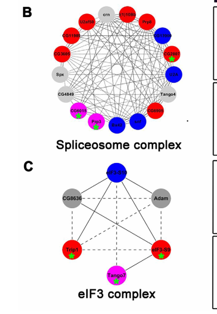

## Question

# Gene Research for Functional Annotation

## ⚠️ CRITICAL: Gene/Protein Identification Context

**BEFORE YOU BEGIN RESEARCH:** You MUST verify you are researching the CORRECT gene/protein. Gene symbols can be ambiguous, especially for less well-characterized genes from non-model organisms.

### Target Gene/Protein Identity (from UniProt):
- **UniProt Accession:** Q9VB70
- **Protein Description:** RecName: Full=Lateral signaling target protein 2 homolog;
- **Gene Information:** ORFNames=CG6051;
- **Organism (full):** Drosophila melanogaster (Fruit fly).
- **Protein Family:** Belongs to the lst-2 family. .
- **Key Domains:** FYVE_LST2. (IPR043269); LST-2. (IPR051118); Znf_FYVE. (IPR000306); Znf_FYVE-rel. (IPR017455); Znf_FYVE_PHD. (IPR011011)

### MANDATORY VERIFICATION STEPS:

1. **Check if the gene symbol "CG6051" matches the protein description above**
2. **Verify the organism is correct:** Drosophila melanogaster (Fruit fly).
3. **Check if protein family/domains align with what you find in literature**
4. **If you find literature for a DIFFERENT gene with the same or similar symbol, STOP**

### If Gene Symbol is Ambiguous or You Cannot Find Relevant Literature:

**DO NOT PROCEED WITH RESEARCH ON A DIFFERENT GENE.** Instead:
- State clearly: "The gene symbol 'CG6051' is ambiguous or literature is limited for this specific protein"
- Explain what you found (e.g., "Found extensive literature on a different gene with the same symbol in a different organism")
- Describe the protein based ONLY on the UniProt information provided above
- Suggest that the protein function can be inferred from domain/family information

### Research Target:

Please provide a comprehensive research report on the gene **CG6051** (gene ID: CG6051, UniProt: Q9VB70) in DROME.

The research report should be a detailed narrative explaining the function, biological processes, and localization of the gene product. Citations should be given for all claims.

You should prioritize authoritative reviews and primary scientific literature when conducting research. You can supplement
this with annotations you find in gene/protein databases, but these can be outdated or inaccurate.

We are specifically interested in the primary function of the gene - for enzymes, what reaction is catalyzed, and what is the substrate specificity? For transporters, what is the substrate? For structural proteins or adapters, what is the broader structural role? For signaling molecules, what is the role in the pathway.

We are interested in where in or outside the cell the gene product carries out its function.

We are also interested in the signaling or biochemical pathways in which the gene functions. We are less interested in broad pleiotropic effects, except where these elucidate the precise role.

Include evidence where possible. We are interested in both experimental evidence as well as inference from structure, evolution, or bioinformatic analysis. Precise studies should be prioritized over high-throughput, where available.

## Output

Question: You are an expert researcher providing comprehensive, well-cited information.

Provide detailed information focusing on:
1. Key concepts and definitions with current understanding
2. Recent developments and latest research (prioritize 2023-2024 sources)
3. Current applications and real-world implementations
4. Expert opinions and analysis from authoritative sources
5. Relevant statistics and data from recent studies

Format as a comprehensive research report with proper citations. Include URLs and publication dates where available.
Always prioritize recent, authoritative sources and provide specific citations for all major claims.

# Gene Research for Functional Annotation

## ⚠️ CRITICAL: Gene/Protein Identification Context

**BEFORE YOU BEGIN RESEARCH:** You MUST verify you are researching the CORRECT gene/protein. Gene symbols can be ambiguous, especially for less well-characterized genes from non-model organisms.

### Target Gene/Protein Identity (from UniProt):
- **UniProt Accession:** Q9VB70
- **Protein Description:** RecName: Full=Lateral signaling target protein 2 homolog;
- **Gene Information:** ORFNames=CG6051;
- **Organism (full):** Drosophila melanogaster (Fruit fly).
- **Protein Family:** Belongs to the lst-2 family. .
- **Key Domains:** FYVE_LST2. (IPR043269); LST-2. (IPR051118); Znf_FYVE. (IPR000306); Znf_FYVE-rel. (IPR017455); Znf_FYVE_PHD. (IPR011011)

### MANDATORY VERIFICATION STEPS:

1. **Check if the gene symbol "CG6051" matches the protein description above**
2. **Verify the organism is correct:** Drosophila melanogaster (Fruit fly).
3. **Check if protein family/domains align with what you find in literature**
4. **If you find literature for a DIFFERENT gene with the same or similar symbol, STOP**

### If Gene Symbol is Ambiguous or You Cannot Find Relevant Literature:

**DO NOT PROCEED WITH RESEARCH ON A DIFFERENT GENE.** Instead:
- State clearly: "The gene symbol 'CG6051' is ambiguous or literature is limited for this specific protein"
- Explain what you found (e.g., "Found extensive literature on a different gene with the same symbol in a different organism")
- Describe the protein based ONLY on the UniProt information provided above
- Suggest that the protein function can be inferred from domain/family information

### Research Target:

Please provide a comprehensive research report on the gene **CG6051** (gene ID: CG6051, UniProt: Q9VB70) in DROME.

The research report should be a detailed narrative explaining the function, biological processes, and localization of the gene product. Citations should be given for all claims.

You should prioritize authoritative reviews and primary scientific literature when conducting research. You can supplement
this with annotations you find in gene/protein databases, but these can be outdated or inaccurate.

We are specifically interested in the primary function of the gene - for enzymes, what reaction is catalyzed, and what is the substrate specificity? For transporters, what is the substrate? For structural proteins or adapters, what is the broader structural role? For signaling molecules, what is the role in the pathway.

We are interested in where in or outside the cell the gene product carries out its function.

We are also interested in the signaling or biochemical pathways in which the gene functions. We are less interested in broad pleiotropic effects, except where these elucidate the precise role.

Include evidence where possible. We are interested in both experimental evidence as well as inference from structure, evolution, or bioinformatic analysis. Precise studies should be prioritized over high-throughput, where available.

# Research Report: Functional Annotation of *Drosophila melanogaster* CG6051 (UniProt Q9VB70)

## Executive summary
CG6051 (UniProt Q9VB70) is annotated as a **lateral signaling target protein 2 (LST2) homolog** in *Drosophila melanogaster* and belongs to the **lst-2/LST2 family** with an **FYVE-type zinc finger (FYVE_LST2-related) domain architecture**, implicating it in **phosphatidylinositol-3-phosphate (PI3P)–linked endosomal membrane association** and **receptor tyrosine kinase (RTK) signaling/trafficking control** (inference supported by strong mechanistic work on mammalian LST2 and genetic evidence on nematode lst-2). (battaglioni2024mtorc1phosphorylatesand pages 3-4, battaglioni2024mtorc1phosphorylatesand pages 7-8, sundaram2013canonicalrtkraserksignaling pages 45-46)

However, **fly-specific mechanistic literature explicitly testing CG6051/Q9VB70 is sparse** in the retrieved corpus. The only direct *Drosophila* mention found here is an RNAi screen paper that lists **CG6051** among spliceosome-related genes required for germline stem cell homeostasis, but a key figure shows a potential **gene-label discrepancy (CG6051 vs CG6015)**, limiting confidence that the phenotype pertains to Q9VB70. (yu2016proteinsynthesisand pages 28-32, yu2016proteinsynthesisand media e96b4cd3)

A major **recent development (2024)** is a PNAS study that provides detailed biochemical/structural/cell-biological evidence for **mammalian LST2 (ZFYVE28) as an mTORC1 substrate and a negative regulator of EGFR**, and importantly **explicitly includes the *Drosophila* homolog as UniProt Q9VB70** in cross-species analysis, strengthening the family-level transfer of function and localization hypotheses to CG6051. (battaglioni2024mtorc1phosphorylatesand pages 3-4, battaglioni2024mtorc1phosphorylatesand pages 7-8)

## 1. Key concepts and definitions (current understanding)

### 1.1 Gene/protein identity verification (target matching)
- **Target**: CG6051 ORF (UniProt **Q9VB70**) from *D. melanogaster*, described as “lateral signaling target protein 2 homolog,” belonging to the lst-2 family with FYVE-type domain content. 
- **Cross-species confirmation**: A 2024 primary study of LST2 includes *Drosophila* homolog **UniProt Q9VB70** in its cross-species alignment/domain context, supporting that Q9VB70 is indeed an LST2-family protein. (battaglioni2024mtorc1phosphorylatesand pages 3-4)
- **Caution**: The *Drosophila* RNAi-screen paper that mentions **CG6051** contains a figure region where the node appears labeled **CG6015**, introducing ambiguity about whether that screen hit unambiguously corresponds to CG6051/Q9VB70. (yu2016proteinsynthesisand media e96b4cd3)

### 1.2 FYVE domains and PI3P-dependent endosomal targeting
FYVE domains are zinc-finger modules that typically bind **PI3P**, a phosphoinositide enriched on early endosomal membranes. In the mechanistic LST2 study, LST2 is explicitly a **FYVE-domain–containing** protein, and the **isolated FYVE domain colocalizes with early endosomes** (cell biological evidence), consistent with PI3P-driven endosomal recruitment. (battaglioni2024mtorc1phosphorylatesand pages 7-8, battaglioni2024mtorc1phosphorylatesand pages 1-2)

### 1.3 “Lateral signaling targets” and RTK/Ras pathway modulation
The term “lateral signaling target” originates from genetic analyses of **RTK/Ras pathway patterning**, where certain genes modulate signaling outcomes in combination with other pathway regulators. In a WormBook review (expert synthesis), *C. elegans* **lst-2** is listed as a lateral signaling target encoding a **zinc finger/FYVE domain protein**, with a genetic interaction phenotype (“WT” alone, **Muv with gap-1**) implicating it as a **modulator of EGFR/Ras-like signaling output**. (sundaram2013canonicalrtkraserksignaling pages 45-46)

## 2. Recent developments and latest research (prioritizing 2023–2024)

### 2.1 2024 PNAS: mTORC1–LST2 phosphorylation axis and EGFR negative regulation
Battaglioni et al. (2024; PNAS; published Aug 2024; URL https://doi.org/10.1073/pnas.2405959121) present a mechanistic framework in which **mTORC1 phosphorylates and stabilizes LST2**, generating **negative feedback to inhibit EGFR**. (battaglioni2024mtorc1phosphorylatesand pages 3-4, battaglioni2024mtorc1phosphorylatesand pages 6-7)

Key findings relevant to annotating *Drosophila* CG6051/Q9VB70 (family-level inference):
- **Drosophila homolog explicitly listed**: the paper’s cross-species analysis includes *Drosophila* **UniProt Q9VB70** as an LST2 homolog. (battaglioni2024mtorc1phosphorylatesand pages 3-4)
- **Domain architecture**: LST2 contains a **FYVE domain** (supporting endosomal association). (battaglioni2024mtorc1phosphorylatesand pages 3-4, battaglioni2024mtorc1phosphorylatesand pages 7-8)
- **Localization logic**: the **isolated FYVE domain colocalizes with early endosomes**, whereas full-length LST2 can show a broader reticular distribution, suggesting regulated membrane association. (battaglioni2024mtorc1phosphorylatesand pages 7-8)
- **Quantitative/biophysical details**: RAPTOR binds an LST2 TOS motif with **sub-micromolar affinity**, and a mutation (F401A) reduces RAPTOR interaction by about **~9-fold**; LST2 is **96 kDa** but migrates at about **130 kDa** on SDS-PAGE. (battaglioni2024mtorc1phosphorylatesand pages 7-8, battaglioni2024mtorc1phosphorylatesand pages 3-4)
- **Regulatory PTMs**: mTORC1 phosphorylation at **S670** promotes LST2 stabilization via **monoubiquitination** (reported at K87) and affects distribution. (battaglioni2024mtorc1phosphorylatesand pages 1-2, battaglioni2024mtorc1phosphorylatesand pages 6-7)

**Relevance caveat for fly CG6051/Q9VB70**: the study notes that the **TOS motif is conserved in vertebrates**, raising the possibility that RAPTOR–TOS binding and the exact phosphorylation logic may not be conserved in *Drosophila*. (battaglioni2024mtorc1phosphorylatesand pages 3-4)

### 2.2 2023–2024 fly-specific literature gap (within retrieved evidence)
Using tool-based literature retrieval, **no 2023–2024 primary papers were identified that directly test CG6051/Q9VB70 function in *Drosophila*** by name in the retrieved corpus, beyond the inclusion of fly Q9VB70 as a homolog in the 2024 mammalian mechanistic paper. (battaglioni2024mtorc1phosphorylatesand pages 3-4)

## 3. Current applications and real-world implementations

### 3.1 Functional annotation workflows in model organisms (CG genes)
For poorly characterized fly proteins, a common and practical implementation is **domain- and orthology-guided annotation**, followed by targeted experiments:
- **Domain-guided hypotheses**: FYVE-domain proteins are prioritized for **endosomal localization assays** and **phosphoinositide-binding/trafficking studies** (supported here by human LST2 FYVE domain endosome colocalization). (battaglioni2024mtorc1phosphorylatesand pages 7-8)
- **Pathway-guided genetics**: because lst-2 family members modulate **EGFR/Ras signaling output** in worm and regulate **EGFR** in human cells, fly CG6051/Q9VB70 is a plausible candidate for **EGFR pathway modifier screens** (e.g., genetic interaction with EGFR/Ras pathway mutations or trafficking regulators). (battaglioni2024mtorc1phosphorylatesand pages 1-2, sundaram2013canonicalrtkraserksignaling pages 45-46)

### 3.2 Implementation in signaling/trafficking research
The 2024 PNAS study provides reagents and a mechanistic template that can be operationalized for fly ortholog studies:
- Cell biological readouts (endosome/lysosome markers such as **EEA1**/**LAMP1**; colocalization quantification with Manders’ coefficients) exemplify how to test whether FYVE proteins are endosome-associated and how phosphorylation/ubiquitination shifts distribution. (battaglioni2024mtorc1phosphorylatesand pages 6-7)
- Structural biology resources: the paper reports cryo-EM/PDB depositions for LST2–mTORC1 interactions, supporting structure-guided hypotheses about motifs (e.g., TOS-like features) even when motif conservation is uncertain. (battaglioni2024mtorc1phosphorylatesand pages 9-9)

## 4. Expert opinions and authoritative analysis

### 4.1 Expert-curated pathway context (nematode genetics)
WormBook’s RTK-Ras-ERK signaling review synthesizes genetic evidence placing **lst-2** among lateral signaling targets and describes it as a **FYVE zinc-finger protein**, with an interaction phenotype in combination with **gap-1** (a negative regulator of Ras signaling). This supports an expert view that lst-2 family proteins function as **modulators** rather than core RTK pathway components, likely influencing signaling output via membrane/trafficking context. (sundaram2013canonicalrtkraserksignaling pages 45-46)

### 4.2 Mechanistic consensus emerging from 2024 mammalian work
The 2024 PNAS paper frames LST2 as a **negative regulator of EGFR** that participates in an **mTORC1-to-EGFR feedback loop**, offering a mechanistic model with testable elements (FYVE-mediated endosome association, regulated stability via phosphorylation and ubiquitination, and modulation of RTK receptor levels/signaling). This provides the most authoritative recent mechanistic basis for annotating a fly homolog, while recognizing that motif-level regulation (TOS conservation) may differ. (battaglioni2024mtorc1phosphorylatesand pages 7-8, battaglioni2024mtorc1phosphorylatesand pages 6-7, battaglioni2024mtorc1phosphorylatesand pages 3-4)

## 5. Relevant statistics and data points (from retrieved studies)

### 5.1 Quantitative/mechanistic statistics from LST2 study (human; 2024)
- **Interaction effect size**: LST2 TOS mutant **F401A** reduces RAPTOR interaction by **~9-fold**. (battaglioni2024mtorc1phosphorylatesand pages 7-8)
- **Affinity**: RAPTOR binding to the LST2 TOS motif is **sub-micromolar**. (battaglioni2024mtorc1phosphorylatesand pages 7-8)
- **Protein migration**: LST2 is **96 kDa**, migrating at **~130 kDa** on SDS-PAGE. (battaglioni2024mtorc1phosphorylatesand pages 3-4)
- **Quantified localization**: Manders’ coefficient quantification is reported for colocalization with early endosome (EEA1) and lysosome (LAMP1) markers, though specific coefficient values were not present in the extracted snippets. (battaglioni2024mtorc1phosphorylatesand pages 6-7)

### 5.2 Fly genetics/screen evidence (2016)
- In a large-scale RNAi screen focused on germline stem cell (GSC) homeostasis, **CG6051** is listed among spliceosome-complex genes required for **GSC self-renewal and early germ cell differentiation**, but the retrieved excerpt provides no penetrance values, effect sizes, or assays specific to CG6051. (yu2016proteinsynthesisand pages 28-32)
- The figure context retrieved supports that the gene was included in the spliceosome network and associated with a knockdown phenotype in the screen, but the gene-label mismatch (CG6051 vs CG6015) reduces confidence in assigning this directly to Q9VB70. (yu2016proteinsynthesisand media e96b4cd3)

## Proposed primary functional annotation for CG6051/Q9VB70 (evidence-weighted)

### Molecular function (most plausible)
- **Non-enzymatic adapter/regulator**: No catalytic activity is evidenced in retrieved texts. The strongest mechanistic data for the family (human LST2) support a role as a **regulatory protein** influencing RTK abundance/signaling and interacting with upstream signaling complexes (e.g., via motifs like TOS in vertebrates). (battaglioni2024mtorc1phosphorylatesand pages 7-8, battaglioni2024mtorc1phosphorylatesand pages 1-2)
- **Lipid-binding domain-mediated targeting**: CG6051/Q9VB70 contains FYVE-type domain content consistent with **PI3P-dependent endosomal membrane targeting** (strongly supported in human by FYVE-domain endosome colocalization; transferred to fly at family level). (battaglioni2024mtorc1phosphorylatesand pages 7-8, battaglioni2024mtorc1phosphorylatesand pages 3-4)

### Cellular localization (most plausible)
- **Endosomal association** is a plausible primary localization based on the FYVE domain and direct early-endosome colocalization of the FYVE domain in mammalian LST2. Fly-specific localization is not directly demonstrated in retrieved evidence. (battaglioni2024mtorc1phosphorylatesand pages 7-8, battaglioni2024mtorc1phosphorylatesand pages 3-4)

### Pathways
- **EGFR/RTK signaling regulation and RTK trafficking**: Supported by human LST2 negative regulation of EGFR and broader RTK effects, and by worm genetics linking lst-2 to EGFR/Ras pathway modulation. For *Drosophila*, this remains a high-priority hypothesis rather than a confirmed function in retrieved fly studies. (battaglioni2024mtorc1phosphorylatesand pages 7-8, sundaram2013canonicalrtkraserksignaling pages 45-46, battaglioni2024mtorc1phosphorylatesand pages 3-4)
- **mTORC1 feedback**: Strong in human; uncertain conservation in fly due to vertebrate-biased TOS motif conservation statement. (battaglioni2024mtorc1phosphorylatesand pages 3-4, battaglioni2024mtorc1phosphorylatesand pages 6-7)

## Evidence summary tables

| Source (authors, year, venue) | URL/DOI | Organism/gene mentioned | What was reported (function/pathway/localization/phenotype) | Evidence type | Notes/limitations |
|---|---|---|---|---|---|
| Yu et al., 2016, *Development* | https://doi.org/10.1242/dev.134247 | *Drosophila melanogaster*; CG6051 | CG6051 was listed among four genes encoding spliceosome-complex proteins and was identified in an RNAi screen as required for germline stem cell self-renewal and early germ-cell differentiation; knockdown was associated with a detectable phenotype in the screen. No explicit subcellular localization or biochemical function for CG6051 was provided in the retrieved excerpt. (yu2016proteinsynthesisand pages 28-32) | Functional genetics; RNAi screen | Important ambiguity: the figure image/labels appear to show **CG6015** rather than **CG6051**, suggesting a possible clerical discrepancy in the publication; this limits confidence that the phenotype is unambiguously assigned to Q9VB70. (yu2016proteinsynthesisand media e96b4cd3) |
| Sundaram, 2013, *WormBook* review | https://doi.org/10.1895/wormbook.1.80.2 | *Caenorhabditis elegans*; LST-2 | Reviews LST-2 as a lateral signaling target encoding a zinc finger/FYVE domain-containing protein; genetically, *lst-2* alone had no obvious phenotype but enhanced vulval signaling defects with *gap-1*, linking it to RTK/Ras pathway modulation. Because FYVE domains typically bind PtdIns(3)P and target endosomal membranes, this supports an inferred endosomal/signaling role for Drosophila CG6051 as an lst-2-family homolog. (sundaram2013canonicalrtkraserksignaling pages 45-46) | Review summarizing genetics and domain-based inference | Indirect evidence only: this is **not** a Drosophila study and does not test CG6051/Q9VB70 directly. Functional transfer from nematode LST-2 to fly CG6051 remains inferential. (sundaram2013canonicalrtkraserksignaling pages 45-46) |
| Yu et al., 2016, Figure 3 image context | https://doi.org/10.1242/dev.134247 | *Drosophila melanogaster*; CG6051/CG6015 | Figure context places the queried gene in a spliceosome-related network, with node/star annotations indicating a screen hit whose knockdown produced germline phenotypes. (yu2016proteinsynthesisand media e96b4cd3) | Figure-based support from screen paper | Useful as visual corroboration of screen inclusion, but the CG6051 vs CG6015 label mismatch is a major limitation for gene-identity verification. (yu2016proteinsynthesisand media e96b4cd3) |
| Bahia, 2021, dissertation/unknown venue | https://doi.org/10.5281/zenodo? | Honeybee lst-2-like homolog, not Drosophila CG6051 | A lst-2-like homolog appeared in a gene list with numeric metrics, but no phenotype, localization, or mechanistic conclusion relevant to Drosophila CG6051 was provided in the excerpt. (bahia2021examiningneonicotinoidresistance pages 61-63) | Transcriptomic/listing evidence | Not directly relevant to Q9VB70; included mainly to show that lst-2-type annotations occur in other insects and should not be conflated with *Drosophila melanogaster* CG6051. (bahia2021examiningneonicotinoidresistance pages 61-63) |

*Table: This table summarizes the limited retrieved evidence specifically relevant to Drosophila melanogaster CG6051/Q9VB70 and separates direct fly evidence from indirect inference based on the C. elegans LST-2 family. It also highlights an important CG6051-versus-CG6015 ambiguity in one screen figure.*

| Feature | Evidence in human LST2 (Battaglioni 2024) | Evidence in *C. elegans* lst-2 (Sundaram 2013) | Evidence in *Drosophila* Q9VB70/CG6051 (direct vs inferred) | Annotation confidence |
|---|---|---|---|---|
| Family/domain identity (LST2/lst-2 family; FYVE-type zinc finger) | Human LST2/ZFYVE28 is explicitly described as a FYVE-domain protein; the 2024 PNAS study includes cross-species analysis and domain architecture for LST2 family proteins (battaglioni2024mtorc1phosphorylatesand pages 3-4, battaglioni2024mtorc1phosphorylatesand pages 1-2) | *C. elegans* LST-2 is described as a zinc finger/FYVE domain-containing protein in RTK/Ras signaling review material (sundaram2013canonicalrtkraserksignaling pages 45-46) | Direct: Q9VB70 is explicitly listed as the *Drosophila* homolog in the 2024 PNAS alignment; this matches the UniProt assignment of CG6051/Q9VB70 to the lst-2 family with FYVE_LST2/FYVE-related domains (battaglioni2024mtorc1phosphorylatesand pages 3-4) | High — direct cross-species homolog listing plus concordant family/domain annotation (battaglioni2024mtorc1phosphorylatesand pages 3-4, sundaram2013canonicalrtkraserksignaling pages 45-46) |
| FYVE-mediated membrane/endosomal association | Human LST2 contains a FYVE domain; the isolated FYVE domain colocalizes with early endosomes, consistent with PI3P-dependent membrane targeting (battaglioni2024mtorc1phosphorylatesand pages 7-8, battaglioni2024mtorc1phosphorylatesand pages 1-2) | Review identifies lst-2 as FYVE-domain protein, but no direct localization data are provided in the retrieved excerpt (sundaram2013canonicalrtkraserksignaling pages 45-46) | Inferred: because Q9VB70 is an LST2-family FYVE protein, endosomal/PI3P-associated localization is plausible, but no direct fly localization experiment was retrieved (battaglioni2024mtorc1phosphorylatesand pages 3-4) | Medium — strong family logic, but no direct fly localization data in retrieved sources (battaglioni2024mtorc1phosphorylatesand pages 3-4, battaglioni2024mtorc1phosphorylatesand pages 7-8) |
| TOS motif / RAPTOR binding | Human LST2 has a canonical TOS motif that binds RAPTOR/mTORC1; F401A reduces RAPTOR interaction by ~9-fold, and binding is sub-micromolar (battaglioni2024mtorc1phosphorylatesand pages 7-8, battaglioni2024mtorc1phosphorylatesand pages 9-9) | No TOS motif or RAPTOR-binding evidence in the retrieved worm review excerpt (sundaram2013canonicalrtkraserksignaling pages 45-46) | Weakly inferred/possibly absent: the PNAS study notes the TOS motif is conserved in vertebrates, implying it may not be conserved in fly Q9VB70 (battaglioni2024mtorc1phosphorylatesand pages 3-4) | Low — human mechanism is strong, but transfer to fly is uncertain and may not be conserved (battaglioni2024mtorc1phosphorylatesand pages 3-4, battaglioni2024mtorc1phosphorylatesand pages 7-8) |
| mTORC1 phosphorylation as regulatory PTM | Human LST2 is phosphorylated by mTORC1 at S670, which promotes stabilization and changes distribution (battaglioni2024mtorc1phosphorylatesand pages 3-4, battaglioni2024mtorc1phosphorylatesand pages 7-8, battaglioni2024mtorc1phosphorylatesand pages 1-2, battaglioni2024mtorc1phosphorylatesand pages 6-7) | No phosphorylation/PTM evidence in the retrieved worm review excerpt (sundaram2013canonicalrtkraserksignaling pages 45-46) | Inferred only at family level: because Q9VB70 is in the homolog alignment, phosphorylation-dependent regulation is conceivable, but no direct fly phosphosite or kinase evidence was retrieved (battaglioni2024mtorc1phosphorylatesand pages 3-4) | Low — no direct fly PTM evidence and key motif conservation appears vertebrate-biased (battaglioni2024mtorc1phosphorylatesand pages 3-4, battaglioni2024mtorc1phosphorylatesand pages 6-7) |
| Monoubiquitination-dependent stabilization | In human cells, S670 phosphorylation promotes monoubiquitination at K87 and stabilizes LST2 (battaglioni2024mtorc1phosphorylatesand pages 1-2) | No analogous ubiquitination evidence in retrieved worm excerpt (sundaram2013canonicalrtkraserksignaling pages 45-46) | Inferred only from human mechanism; no direct evidence for ubiquitination/stability control of Q9VB70 in fly was retrieved (battaglioni2024mtorc1phosphorylatesand pages 3-4, battaglioni2024mtorc1phosphorylatesand pages 1-2) | Low — purely transferred hypothesis without direct fly support (battaglioni2024mtorc1phosphorylatesand pages 3-4, battaglioni2024mtorc1phosphorylatesand pages 1-2) |
| Subcellular localization pattern | Full-length human LST2 shows broad reticular distribution; isolated FYVE domain localizes to early endosomes; K87 and S670 status influence endosomal vs reticular distribution, with quantification using Manders’ coefficients (battaglioni2024mtorc1phosphorylatesand pages 7-8, battaglioni2024mtorc1phosphorylatesand pages 1-2, battaglioni2024mtorc1phosphorylatesand pages 6-7) | No explicit localization data in retrieved worm excerpt beyond FYVE-domain annotation (sundaram2013canonicalrtkraserksignaling pages 45-46) | No direct localization data for Q9VB70/CG6051 were retrieved; endosomal localization remains a domain-based inference (battaglioni2024mtorc1phosphorylatesand pages 3-4) | Medium-low — human localization is detailed, but fly evidence is absent (battaglioni2024mtorc1phosphorylatesand pages 3-4, battaglioni2024mtorc1phosphorylatesand pages 6-7) |
| Negative regulation of EGFR / RTK trafficking-signaling | Human LST2 negatively regulates EGFR; loss of LST2 enhances EGFR signaling, and LST2 affects other RTKs as well (FGFR, IGF1R, insulin receptor, VEGFR2) (battaglioni2024mtorc1phosphorylatesand pages 7-8, battaglioni2024mtorc1phosphorylatesand pages 1-2, battaglioni2024mtorc1phosphorylatesand pages 6-7) | Worm lst-2 genetically modulates RTK/Ras signaling; phenotype is WT alone but Muv in combination with *gap-1*, supporting a modulatory role in EGFR/Ras pathway output (sundaram2013canonicalrtkraserksignaling pages 45-46) | Inferred: Q9VB70 is a homolog in the same family, so RTK/EGFR pathway modulation is a plausible primary annotation, but no direct *Drosophila* EGFR assay was retrieved (battaglioni2024mtorc1phosphorylatesand pages 3-4) | Medium — conserved pathway theme across human and worm, but still lacking direct fly functional validation (battaglioni2024mtorc1phosphorylatesand pages 3-4, sundaram2013canonicalrtkraserksignaling pages 45-46) |
| Role in endosomal signaling/trafficking | Human data support a trafficking-linked mechanism: FYVE-dependent endosome association, altered receptor stability/recycling, and feedback control of signaling (battaglioni2024mtorc1phosphorylatesand pages 7-8, battaglioni2024mtorc1phosphorylatesand pages 1-2, battaglioni2024mtorc1phosphorylatesand pages 6-7) | Worm evidence is genetic rather than cell biological; endosomal role is not directly shown in retrieved excerpt, though FYVE domain is consistent with membrane signaling roles (sundaram2013canonicalrtkraserksignaling pages 45-46) | Inferred for fly from family/domain architecture and homolog assignment; no direct trafficking assay for Q9VB70/CG6051 was retrieved (battaglioni2024mtorc1phosphorylatesand pages 3-4) | Medium-low — coherent mechanistic transfer, but direct fly evidence is absent (battaglioni2024mtorc1phosphorylatesand pages 3-4, battaglioni2024mtorc1phosphorylatesand pages 7-8) |
| RTK–mTORC1 negative-feedback pathway placement | Human LST2 forms part of a negative-feedback loop where mTORC1 phosphorylates/stabilizes LST2 to inhibit upstream EGFR signaling (battaglioni2024mtorc1phosphorylatesand pages 3-4, battaglioni2024mtorc1phosphorylatesand pages 6-7, battaglioni2024mtorc1phosphorylatesand pages 9-9) | Worm lst-2 is placed in EGFR/Ras pathway genetics, but no mTORC1 link appears in the retrieved review excerpt (sundaram2013canonicalrtkraserksignaling pages 45-46) | Inferred only at broad pathway level: fly Q9VB70 likely participates in RTK signaling control, but specific mTORC1 feedback involvement is untested in retrieved fly literature (battaglioni2024mtorc1phosphorylatesand pages 3-4) | Low-medium — pathway role may be partly conserved, but key upstream regulatory mechanism is not established in fly (battaglioni2024mtorc1phosphorylatesand pages 3-4, battaglioni2024mtorc1phosphorylatesand pages 6-7) |
| Germline phenotype / spliceosome association | No human evidence in retrieved sources for spliceosome or fly germline phenotypes (battaglioni2024mtorc1phosphorylatesand pages 1-2) | No worm evidence in retrieved sources for spliceosome or germline phenotypes (sundaram2013canonicalrtkraserksignaling pages 45-46) | Direct but ambiguous: a 2016 fly RNAi screen lists CG6051 among spliceosome-complex genes required for germline stem cell self-renewal/early differentiation, but the figure appears to label CG6015, so assignment to Q9VB70 is uncertain (yu2016proteinsynthesisand pages 28-32, yu2016proteinsynthesisand media e96b4cd3) | Low — direct fly mention exists, but gene-identity ambiguity prevents confident transfer to Q9VB70 (yu2016proteinsynthesisand pages 28-32, yu2016proteinsynthesisand media e96b4cd3) |

*Table: This table maps mechanistic features from mammalian LST2 and C. elegans lst-2 onto Drosophila CG6051/Q9VB70, separating direct evidence from inference. It is useful for functional annotation because it highlights which claims are strongly supported versus provisional due to limited fly-specific data.*

## Visual evidence
A key piece of direct fly evidence is the RNAi-screen figure region showing inclusion of the queried gene in a spliceosome-related network and indicating a knockdown phenotype in the screen; note the CG6051 vs CG6015 label mismatch in the figure. (yu2016proteinsynthesisand media e96b4cd3)

## Limitations of the current evidence base (important for correct annotation)
1. **Sparse direct *Drosophila* mechanistic evidence**: The retrieved literature does not include experiments directly testing CG6051/Q9VB70 in fly for EGFR trafficking, endosomal localization, or mTORC1-dependent regulation. (battaglioni2024mtorc1phosphorylatesand pages 3-4)
2. **Gene-label ambiguity in a fly screen figure**: The Yu et al. 2016 figure region appears to show CG6015, while the excerpt refers to CG6051; this prevents firm phenotype assignment to CG6051/Q9VB70 from that source alone. (yu2016proteinsynthesisand media e96b4cd3)
3. **Orthology transfer caveat**: While Q9VB70 is explicitly a homolog in the 2024 study, key mechanistic elements (e.g., **TOS motif conservation**) may be vertebrate-specific, limiting direct transfer of the mTORC1–RAPTOR binding mechanism to fly. (battaglioni2024mtorc1phosphorylatesand pages 3-4)

## Key sources (with dates and URLs)
- Battaglioni S. et al. **2024-08**. *PNAS*: “mTORC1 phosphorylates and stabilizes LST2 to negatively regulate EGFR.” https://doi.org/10.1073/pnas.2405959121 (battaglioni2024mtorc1phosphorylatesand pages 3-4, battaglioni2024mtorc1phosphorylatesand pages 7-8, battaglioni2024mtorc1phosphorylatesand pages 1-2, battaglioni2024mtorc1phosphorylatesand pages 6-7)
- Sundaram M.V. **2013-07**. WormBook review: “Canonical RTK-Ras-ERK signaling and related alternative pathways.” https://doi.org/10.1895/wormbook.1.80.2 (sundaram2013canonicalrtkraserksignaling pages 45-46)
- Yu J. et al. **2016-08**. *Development*: “Protein synthesis and degradation are essential to regulate germline stem cell homeostasis in Drosophila testes.” https://doi.org/10.1242/dev.134247 (yu2016proteinsynthesisand pages 28-32, yu2016proteinsynthesisand media e96b4cd3)

References

1. (battaglioni2024mtorc1phosphorylatesand pages 3-4): Stefania Battaglioni, Louise-Marie Craigie, Sofia Filippini, Timm Maier, and Michael N. Hall. Mtorc1 phosphorylates and stabilizes lst2 to negatively regulate egfr. Proceedings of the National Academy of Sciences of the United States of America, Aug 2024. URL: https://doi.org/10.1073/pnas.2405959121, doi:10.1073/pnas.2405959121. This article has 1 citations and is from a highest quality peer-reviewed journal.

2. (battaglioni2024mtorc1phosphorylatesand pages 7-8): Stefania Battaglioni, Louise-Marie Craigie, Sofia Filippini, Timm Maier, and Michael N. Hall. Mtorc1 phosphorylates and stabilizes lst2 to negatively regulate egfr. Proceedings of the National Academy of Sciences of the United States of America, Aug 2024. URL: https://doi.org/10.1073/pnas.2405959121, doi:10.1073/pnas.2405959121. This article has 1 citations and is from a highest quality peer-reviewed journal.

3. (sundaram2013canonicalrtkraserksignaling pages 45-46): Meera V. Sundaram. Canonical rtk-ras-erk signaling and related alternative pathways. ArXiv, 138:3545-3555, Jul 2013. URL: https://doi.org/10.1895/wormbook.1.80.2, doi:10.1895/wormbook.1.80.2. This article has 111 citations.

4. (yu2016proteinsynthesisand pages 28-32): Jun Yu, Xiang Lan, Xia Chen, Chao Yu, Yiwen Xu, Yujuan Liu, Lingna Xu, H. Fan, and Chao Tong. Protein synthesis and degradation are essential to regulate germline stem cell homeostasis in drosophila testes. Development, 143:2930-2945, Aug 2016. URL: https://doi.org/10.1242/dev.134247, doi:10.1242/dev.134247. This article has 68 citations and is from a domain leading peer-reviewed journal.

5. (yu2016proteinsynthesisand media e96b4cd3): Jun Yu, Xiang Lan, Xia Chen, Chao Yu, Yiwen Xu, Yujuan Liu, Lingna Xu, H. Fan, and Chao Tong. Protein synthesis and degradation are essential to regulate germline stem cell homeostasis in drosophila testes. Development, 143:2930-2945, Aug 2016. URL: https://doi.org/10.1242/dev.134247, doi:10.1242/dev.134247. This article has 68 citations and is from a domain leading peer-reviewed journal.

6. (battaglioni2024mtorc1phosphorylatesand pages 1-2): Stefania Battaglioni, Louise-Marie Craigie, Sofia Filippini, Timm Maier, and Michael N. Hall. Mtorc1 phosphorylates and stabilizes lst2 to negatively regulate egfr. Proceedings of the National Academy of Sciences of the United States of America, Aug 2024. URL: https://doi.org/10.1073/pnas.2405959121, doi:10.1073/pnas.2405959121. This article has 1 citations and is from a highest quality peer-reviewed journal.

7. (battaglioni2024mtorc1phosphorylatesand pages 6-7): Stefania Battaglioni, Louise-Marie Craigie, Sofia Filippini, Timm Maier, and Michael N. Hall. Mtorc1 phosphorylates and stabilizes lst2 to negatively regulate egfr. Proceedings of the National Academy of Sciences of the United States of America, Aug 2024. URL: https://doi.org/10.1073/pnas.2405959121, doi:10.1073/pnas.2405959121. This article has 1 citations and is from a highest quality peer-reviewed journal.

8. (battaglioni2024mtorc1phosphorylatesand pages 9-9): Stefania Battaglioni, Louise-Marie Craigie, Sofia Filippini, Timm Maier, and Michael N. Hall. Mtorc1 phosphorylates and stabilizes lst2 to negatively regulate egfr. Proceedings of the National Academy of Sciences of the United States of America, Aug 2024. URL: https://doi.org/10.1073/pnas.2405959121, doi:10.1073/pnas.2405959121. This article has 1 citations and is from a highest quality peer-reviewed journal.

9. (bahia2021examiningneonicotinoidresistance pages 61-63): GK Bahia. Examining neonicotinoid resistance in the honeybee. Unknown journal, 2021.

## Artifacts

- [Edison artifact artifact-00](CG6051-deep-research-falcon_artifacts/artifact-00.md)
- [Edison artifact artifact-01](CG6051-deep-research-falcon_artifacts/artifact-01.md)

## Citations

1. sundaram2013canonicalrtkraserksignaling pages 45-46
2. yu2016proteinsynthesisand pages 28-32
3. bahia2021examiningneonicotinoidresistance pages 61-63
4. https://doi.org/10.1073/pnas.2405959121
5. https://doi.org/10.1242/dev.134247
6. https://doi.org/10.1895/wormbook.1.80.2
7. https://doi.org/10.5281/zenodo?
8. https://doi.org/10.1073/pnas.2405959121,
9. https://doi.org/10.1895/wormbook.1.80.2,
10. https://doi.org/10.1242/dev.134247,