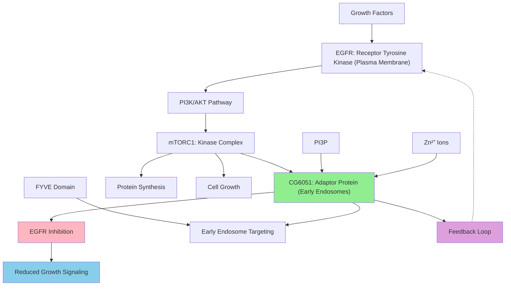

# Pathway Summary for CG6051

## Overview
CG6051 encodes the Drosophila ortholog of human ZFYVE28/LST2 (Lateral Signaling Target protein 2), a FYVE zinc finger domain-containing protein that functions as a molecular adaptor in growth factor signaling pathways [file:fly/CG6051/CG6051-deep-research.md]. The protein localizes to early endosomes via PI3P binding and serves as a critical negative regulator of EGFR signaling, providing feedback inhibition downstream of mTORC1 activation [GO_REF:0000033].

## EGFR Signaling Negative Regulation Pathway
CG6051 acts as a key negative regulator of the epidermal growth factor receptor (EGFR) signaling pathway, functioning as a substrate of mTORC1 kinase [file:fly/CG6051/CG6051-deep-research.md]. When phosphorylated by mTORC1, the protein becomes active and helps inhibit upstream EGFR activity, creating a feedback mechanism that prevents excessive growth factor signaling [file:fly/CG6051/CG6051-deep-research.md]. Loss of CG6051 function leads to heightened EGFR activity, demonstrating its crucial role in maintaining signaling homeostasis.

## mTORC1 Feedback Regulation Pathway
CG6051 serves as a critical component of the mTORC1 feedback loop, acting as both a substrate and effector of mTORC1 signaling [file:fly/CG6051/CG6051-deep-research.md]. The protein integrates growth factor signals with nutrient sensing pathways, ensuring that cellular growth responses are appropriately modulated based on both external growth stimuli and internal metabolic status. This dual regulation allows cells to balance growth factor responsiveness with nutrient availability.

## Endosomal Trafficking and Membrane Targeting
Through its C-terminal FYVE domain (residues 909-969), CG6051 specifically binds to phosphatidylinositol-3-phosphate (PI3P) on early endosomal membranes [Q9VB70]. The FYVE domain coordinates two zinc ions through conserved cysteine and histidine residues, enabling stable membrane association and proper subcellular localization [Q9VB70]. This endosomal targeting positions the protein optimally to regulate growth factor receptor trafficking and signal attenuation.

## Pathway Diagram

## Growth Factor Signal Integration
CG6051 functions as a molecular hub that integrates multiple signaling inputs including growth factor receptor activation, mTORC1 activity, and endosomal membrane composition [file:fly/CG6051/CG6051-deep-research.md]. The protein's positioning at early endosomes allows it to monitor and regulate the trafficking of activated growth factor receptors, influencing both the duration and intensity of growth factor signals. This integration ensures appropriate cellular responses to changing growth conditions.

## Zinc Coordination and Structural Stability
The FYVE domain of CG6051 coordinates zinc ions at multiple binding sites (positions 915, 918, 931, 934, 939, 942, 961, 964), which are essential for proper protein folding and membrane binding activity [Q9VB70]. This zinc finger structure provides both structural stability and specific recognition of PI3P-containing membranes. The coordination of two zinc ions creates a stable platform for membrane association and potential protein-protein interactions.

## Receptor Trafficking and Signal Termination
By localizing to early endosomes, CG6051 likely participates in the trafficking and downregulation of activated EGFR and other growth factor receptors [file:fly/CG6051/CG6051-deep-research.md]. The protein may facilitate receptor internalization, sorting, or degradation processes that terminate growth factor signals. This function is crucial for preventing prolonged growth factor signaling that could lead to cellular transformation or inappropriate growth.

## Developmental and Physiological Significance
CG6051 represents an evolutionarily conserved mechanism for fine-tuning growth factor signaling during development and tissue homeostasis. The protein's dual function as both an mTORC1 substrate and EGFR negative regulator provides a sophisticated feedback system that links metabolic status with growth factor responsiveness. This integration is essential for coordinating cellular growth with nutrient availability and developmental cues.

## Cross-talk with Other Pathways
CG6051 likely interfaces with multiple signaling pathways beyond EGFR and mTORC1, potentially including other receptor tyrosine kinase pathways and endosomal trafficking systems. The protein's endosomal localization positions it to influence the trafficking and signaling of numerous membrane receptors. Understanding these broader interactions may reveal additional roles for CG6051 in cellular signaling networks and disease processes.