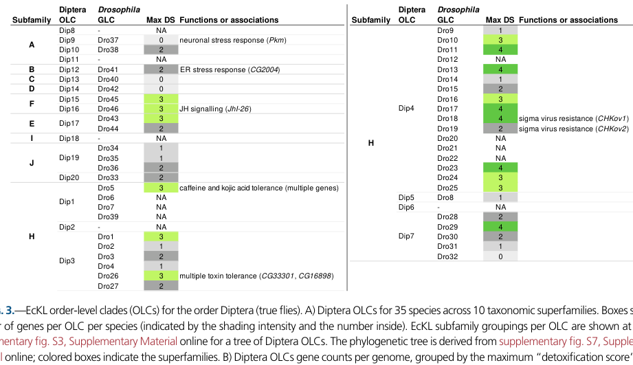

## Question

# Gene Research for Functional Annotation

## ⚠️ CRITICAL: Gene/Protein Identification Context

**BEFORE YOU BEGIN RESEARCH:** You MUST verify you are researching the CORRECT gene/protein. Gene symbols can be ambiguous, especially for less well-characterized genes from non-model organisms.

### Target Gene/Protein Identity (from UniProt):
- **UniProt Accession:** Q9VGJ8
- **Protein Description:** RecName: Full=CHK kinase-like domain-containing protein {ECO:0000259|SMART:SM00587};
- **Gene Information:** Name=Dmel\CG6830 {ECO:0000313|EMBL:AAF54681.1}; Synonyms=Dro24-1 {ECO:0000313|EMBL:AAF54681.1}; ORFNames=CG6830 {ECO:0000313|EMBL:AAF54681.1, ECO:0000313|FlyBase:FBgn0037934}, Dmel_CG6830 {ECO:0000313|EMBL:AAF54681.1};
- **Organism (full):** Drosophila melanogaster (Fruit fly).
- **Protein Family:** Not specified in UniProt
- **Key Domains:** CHK_kinase-like. (IPR015897); EcKL. (IPR004119); Kinase-like_dom_sf. (IPR011009); EcKL (PF02958)

### MANDATORY VERIFICATION STEPS:

1. **Check if the gene symbol "Dmel\CG6830" matches the protein description above**
2. **Verify the organism is correct:** Drosophila melanogaster (Fruit fly).
3. **Check if protein family/domains align with what you find in literature**
4. **If you find literature for a DIFFERENT gene with the same or similar symbol, STOP**

### If Gene Symbol is Ambiguous or You Cannot Find Relevant Literature:

**DO NOT PROCEED WITH RESEARCH ON A DIFFERENT GENE.** Instead:
- State clearly: "The gene symbol 'Dmel\CG6830' is ambiguous or literature is limited for this specific protein"
- Explain what you found (e.g., "Found extensive literature on a different gene with the same symbol in a different organism")
- Describe the protein based ONLY on the UniProt information provided above
- Suggest that the protein function can be inferred from domain/family information

### Research Target:

Please provide a comprehensive research report on the gene **Dmel\CG6830** (gene ID: CG6830, UniProt: Q9VGJ8) in DROME.

The research report should be a detailed narrative explaining the function, biological processes, and localization of the gene product. Citations should be given for all claims.

You should prioritize authoritative reviews and primary scientific literature when conducting research. You can supplement
this with annotations you find in gene/protein databases, but these can be outdated or inaccurate.

We are specifically interested in the primary function of the gene - for enzymes, what reaction is catalyzed, and what is the substrate specificity? For transporters, what is the substrate? For structural proteins or adapters, what is the broader structural role? For signaling molecules, what is the role in the pathway.

We are interested in where in or outside the cell the gene product carries out its function.

We are also interested in the signaling or biochemical pathways in which the gene functions. We are less interested in broad pleiotropic effects, except where these elucidate the precise role.

Include evidence where possible. We are interested in both experimental evidence as well as inference from structure, evolution, or bioinformatic analysis. Precise studies should be prioritized over high-throughput, where available.

## Output

Question: You are an expert researcher providing comprehensive, well-cited information.

Provide detailed information focusing on:
1. Key concepts and definitions with current understanding
2. Recent developments and latest research (prioritize 2023-2024 sources)
3. Current applications and real-world implementations
4. Expert opinions and analysis from authoritative sources
5. Relevant statistics and data from recent studies

Format as a comprehensive research report with proper citations. Include URLs and publication dates where available.
Always prioritize recent, authoritative sources and provide specific citations for all major claims.

# Gene Research for Functional Annotation

## ⚠️ CRITICAL: Gene/Protein Identification Context

**BEFORE YOU BEGIN RESEARCH:** You MUST verify you are researching the CORRECT gene/protein. Gene symbols can be ambiguous, especially for less well-characterized genes from non-model organisms.

### Target Gene/Protein Identity (from UniProt):
- **UniProt Accession:** Q9VGJ8
- **Protein Description:** RecName: Full=CHK kinase-like domain-containing protein {ECO:0000259|SMART:SM00587};
- **Gene Information:** Name=Dmel\CG6830 {ECO:0000313|EMBL:AAF54681.1}; Synonyms=Dro24-1 {ECO:0000313|EMBL:AAF54681.1}; ORFNames=CG6830 {ECO:0000313|EMBL:AAF54681.1, ECO:0000313|FlyBase:FBgn0037934}, Dmel_CG6830 {ECO:0000313|EMBL:AAF54681.1};
- **Organism (full):** Drosophila melanogaster (Fruit fly).
- **Protein Family:** Not specified in UniProt
- **Key Domains:** CHK_kinase-like. (IPR015897); EcKL. (IPR004119); Kinase-like_dom_sf. (IPR011009); EcKL (PF02958)

### MANDATORY VERIFICATION STEPS:

1. **Check if the gene symbol "Dmel\CG6830" matches the protein description above**
2. **Verify the organism is correct:** Drosophila melanogaster (Fruit fly).
3. **Check if protein family/domains align with what you find in literature**
4. **If you find literature for a DIFFERENT gene with the same or similar symbol, STOP**

### If Gene Symbol is Ambiguous or You Cannot Find Relevant Literature:

**DO NOT PROCEED WITH RESEARCH ON A DIFFERENT GENE.** Instead:
- State clearly: "The gene symbol 'Dmel\CG6830' is ambiguous or literature is limited for this specific protein"
- Explain what you found (e.g., "Found extensive literature on a different gene with the same symbol in a different organism")
- Describe the protein based ONLY on the UniProt information provided above
- Suggest that the protein function can be inferred from domain/family information

### Research Target:

Please provide a comprehensive research report on the gene **Dmel\CG6830** (gene ID: CG6830, UniProt: Q9VGJ8) in DROME.

The research report should be a detailed narrative explaining the function, biological processes, and localization of the gene product. Citations should be given for all claims.

You should prioritize authoritative reviews and primary scientific literature when conducting research. You can supplement
this with annotations you find in gene/protein databases, but these can be outdated or inaccurate.

We are specifically interested in the primary function of the gene - for enzymes, what reaction is catalyzed, and what is the substrate specificity? For transporters, what is the substrate? For structural proteins or adapters, what is the broader structural role? For signaling molecules, what is the role in the pathway.

We are interested in where in or outside the cell the gene product carries out its function.

We are also interested in the signaling or biochemical pathways in which the gene functions. We are less interested in broad pleiotropic effects, except where these elucidate the precise role.

Include evidence where possible. We are interested in both experimental evidence as well as inference from structure, evolution, or bioinformatic analysis. Precise studies should be prioritized over high-throughput, where available.

# Functional-annotation report: *Drosophila melanogaster* CG6830

## Executive conclusion

**CG6830 (FlyBase FBgn0037934; UniProt Q9VGJ8; Dro24-1) is a poorly characterized *D. melanogaster* ecdysteroid-kinase-like (EcKL) protein.** Its best-supported annotation is currently **a putative cytosolic, ATP-dependent small-molecule kinase**, but its physiological substrate, reaction product, pathway, and intracellular localization have not been experimentally established. Phylogenetically, Dro24 maps to EcKL **subfamily H**, Diptera order-level clade **Dip4**, and Drosophila genus-level clade **Dro24**; its composite “detoxification score” is 3, the authors’ threshold for a detoxification candidate rather than a validated assignment. (scanlan2024phylogenomicsofthe pages 7-8, scanlan2024phylogenomicsofthe media 97f2158b, scanlan2024phylogenomicsofthe pages 2-3)

The only direct CG6830 experiment located was reported in August 2024: in a screen of 13 additional EcKL genes, ubiquitous CG6830 misexpression was one of only two interventions—alongside CG5644 misexpression—that caused significant developmental arrest before adulthood. This gain-of-function result shows that excessive CG6830 activity or abundance can disrupt development, but it does not identify the normal substrate, tissue of action, biochemical pathway, or endogenous requirement. (scanlan2024geneticcharacterizationof pages 11-12)

A critical identity issue emerged during verification: **Wallflower/Wall is CG13813, not CG6830**. The extensive Wall knockout, RNAi, overexpression, tissue-specific, and *Cyp18a1* interaction experiments in the same 2024 study must therefore not be attributed to CG6830. CG6830 was tested separately in the additional-gene misexpression screen. (scanlan2024geneticcharacterizationof pages 11-12, scanlan2024geneticcharacterizationof pages 2-3)

| Topic | Best-supported conclusion | Evidence type | Confidence | Important limitation |
|---|---|---|---|---|
| Identity | **CG6830** (*D. melanogaster*), FlyBase **FBgn0037934**, UniProt **Q9VGJ8**, also annotated **Dro24-1**. | Database identifiers supplied for the target; literature cross-check | High | No extensively characterized gene name was found. |
| Domain/family | Encodes a **CHK/choline-kinase-like, ecdysteroid-kinase-like (EcKL) domain protein**, consistent with a kinase-like small-molecule phosphotransferase. | Domain annotation and family-level comparative analysis | Moderate–high | A kinase-like fold does not establish catalytic activity or substrate; “CHK-like” does not mean checkpoint kinase. (scanlan2024phylogenomicsofthe pages 2-3, scanlan2024phylogenomicsofthe pages 4-5) |
| Phylogenetic placement | Dro24 maps to **EcKL subfamily H**, Diptera order-level clade **Dip4**, and Drosophila genus-level clade **Dro24**; its reported maximum detoxification score is **3**. | 2024 phylogenomics | High for placement; moderate for score interpretation | Clade membership and score indicate candidacy, not biochemical function. (scanlan2024phylogenomicsofthe pages 7-8, scanlan2024phylogenomicsofthe media 97f2158b) |
| Direct misexpression phenotype | In a screen of **13 additional EcKL genes**, ubiquitous CG6830 misexpression was one of only **two** constructs, with CG5644, causing significant developmental arrest before adulthood. | Direct transgenic misexpression screen | Moderate | Gain-of-function toxicity does not reveal the endogenous substrate, normal requirement, affected tissue, or mechanism. (scanlan2024geneticcharacterizationof pages 11-12) |
| Catalytic reaction/substrate | **Unknown.** No purified-enzyme assay, defined substrate, product, phosphate position, or kinetic measurement was found for CG6830. | Evidence-gap assessment | High | EcKL-family chemistry cannot be transferred directly to CG6830. (scanlan2024geneticcharacterizationof pages 11-12, scanlan2024phylogenomicsofthe pages 12-13) |
| Localization | No experimentally established subcellular localization was found; EcKLs are generally predicted to be **cytosolic** small-molecule kinases. | Family-level prediction | Low for CG6830 | The family prediction is not CG6830-specific localization evidence. (scanlan2024phylogenomicsofthe pages 2-3) |
| Pathway | No specific endogenous signaling or metabolic pathway has been demonstrated for CG6830. | Evidence-gap assessment | High | Developmental arrest after misexpression is too nonspecific to assign a pathway. (scanlan2024geneticcharacterizationof pages 11-12) |
| Detoxification hypothesis | Subfamily-H/Dip4 context and Dro24 detoxification score **3** support a testable role in xenobiotic or small-molecule phosphorylation. | Phylogenomic association and composite candidacy score | Low–moderate | No xenobiotic substrate or detoxification reaction has been demonstrated; family-size associations do not prove individual-gene function. (scanlan2024phylogenomicsofthe pages 7-8, scanlan2024phylogenomicsofthe pages 12-13, scanlan2024phylogenomicsofthe pages 11-12) |
| Ecdysteroid hypothesis | Ecdysteroids are possible family-level substrates, but CG6830 is **not established as an ecdysteroid kinase**. The two biochemically characterized insect EcKL ecdysteroid kinases are in subfamilies **A and D**, not H. | Comparative biochemical and phylogenetic inference | Low | No CG6830 assay demonstrates phosphorylation of 20-hydroxyecdysone or another ecdysteroid. (scanlan2024phylogenomicsofthe pages 6-7, scanlan2024phylogenomicsofthe pages 2-3) |
| Confusion warning | **Wallflower (Wall) is CG13813, not CG6830.** The extensive Wall knockout, RNAi, overexpression, and Cyp18a1-interaction results must not be attributed to CG6830; CG6830 appears separately in the 13-gene misexpression screen. | Literal-identifier/full-text verification | High | Failure to resolve this discrepancy would substantially overstate CG6830-specific evidence. (scanlan2024geneticcharacterizationof pages 11-12, scanlan2024geneticcharacterizationof pages 2-3) |

*Table: Evidence-graded conclusions for Drosophila CG6830 separate direct observations from family-level inference and unresolved questions. The table also flags the critical distinction between CG6830 and Wallflower/CG13813.*

## 1. Target identification and nomenclature

The requested target is:

- **Organism:** *Drosophila melanogaster* (fruit fly)
- **Gene:** **CG6830**
- **FlyBase identifier:** **FBgn0037934**
- **UniProt accession:** **Q9VGJ8**
- **Reported synonym:** **Dro24-1**
- **Protein annotation:** CHK kinase-like domain-containing/EcKL protein
- **Domain resources supplied with the target:** InterPro IPR015897, IPR004119 and IPR011009; Pfam PF02958

The 2024 insect EcKL phylogeny independently places the Drosophila **Dro24** lineage within Diptera clade **Dip4** and EcKL **subfamily H**, supporting alignment between the supplied Dro24-1 designation and the expected protein family. (scanlan2024phylogenomicsofthe pages 7-8, scanlan2024phylogenomicsofthe media 97f2158b)

### Essential disambiguation

Full-text checking revealed that the 2024 paper’s principal gene “Wallflower” is **CG13813**, while CG6830 appears as a separate gene in a screen of 13 additional EcKLs. Consequently, results such as Wall null-mutant viability, Wall RNAi artifacts, tissue-specific Wall phenotypes, and the failure of *Cyp18a1* mutation to suppress Wall toxicity are **not CG6830 data**. (scanlan2024geneticcharacterizationof pages 11-12, scanlan2024geneticcharacterizationof pages 2-3)

This distinction also means that CG6830 should not be called Wallflower on present evidence. The literature for this specific target is limited rather than ambiguous at the accession level.

## 2. Key concepts and molecular-function interpretation

### EcKL proteins

The EcKL family comprises insect kinase-like proteins implicated in small-molecule phosphorylation. EcKLs are predicted to be cytosolic enzymes, and family-level evidence connects different members to steroid-hormone metabolism and xenobiotic tolerance. Nevertheless, nearly all individual EcKL substrates remain unknown. (scanlan2024phylogenomicsofthe pages 1-2, scanlan2024phylogenomicsofthe pages 2-3)

The proposed generic chemistry is:

**ATP + hydroxyl-bearing small molecule → ADP + phosphorylated small molecule**

For xenobiotics, phosphorylation of a hydroxyl group adds a negatively charged phosphate, potentially changing solubility, transport, sequestration, or biological activity. This is a family-level model, not a demonstrated CG6830 reaction. (scanlan2024phylogenomicsofthe pages 1-2)

### Meaning of “CHK kinase-like”

In this annotation context, “CHK-like” denotes a **choline-kinase-like structural/domain relationship**, not evidence that CG6830 is a DNA-damage checkpoint kinase such as Chk1/Chk2. Nor does the domain name establish choline as the substrate. Choline/aminoglycoside kinase-like proteins belong to the broader protein-kinase-like structural superfamily, whose conserved core supports ATP binding and phosphotransfer but whose substrate specificities have diverged substantially. Accordingly, CG6830 should not presently be annotated as a protein kinase, checkpoint kinase, or choline kinase on domain name alone.

### What is known about EcKL substrate specificity?

Only two insect EcKL genes were reported as having strong genetic and biochemical support for ecdysteroid-kinase activity. Both catalyze phosphorylation at ecdysteroid C-22: *Bombyx mori* BmEc22K lies in subfamily A, whereas *Anopheles gambiae* AgEcK2 lies in subfamily D and acts on 20-hydroxyecdysone. Insect ecdysteroid conjugates phosphorylated at C-2, C-3, C-22, and C-26 have been reported more generally, but the responsible enzymes are incompletely resolved. (scanlan2024phylogenomicsofthe pages 6-7, scanlan2024phylogenomicsofthe pages 12-13, scanlan2024phylogenomicsofthe pages 2-3)

CG6830 lies in **subfamily H**, not A or D. The occurrence of confirmed C-22 kinases in two separate subfamilies illustrates why EcKL membership does not establish a shared steroid substrate. The activity may have evolved independently, or related ancestral proteins may have undergone substantial substrate shifts. (scanlan2024phylogenomicsofthe pages 6-7)

**Therefore, CG6830’s catalyzed reaction and substrate specificity are unknown.** No evidence located demonstrates phosphorylation of choline, 20-hydroxyecdysone, another ecdysteroid, caffeine, an insecticide, a protein, or any other defined substrate.

## 3. Direct experimental evidence for CG6830

Scanlan and Robin’s 2024 G3 study screened 13 additional Drosophila EcKL genes using pre-existing UAS open-reading-frame lines with ubiquitous tub-GAL4-driven misexpression. Only **CG6830 and CG5644** caused significant developmental arrest before adulthood. CG5644 subsequently received a separate prothoracic-gland test, but comparable mechanistic follow-up was not reported for CG6830. (scanlan2024geneticcharacterizationof pages 11-12)

### Interpretation

This result supports three limited conclusions:

1. The CG6830 transgene has a biologically active or toxic effect when expressed ubiquitously.
2. The effect occurs before adult emergence and is therefore capable of perturbing development.
3. CG6830 merits focused biochemical and tissue-specific investigation.

It does **not** establish that CG6830 is normally essential, that developmental regulation is its primary role, or that arrest is caused by ecdysteroid depletion. Overexpression can create nonphysiological substrate depletion, ectopic product accumulation, ATP burden, protein misfolding, or activity in tissues where the endogenous protein is absent. The precise arrest stage, tissue dependence, rescue, catalytic-dead control, endogenous loss-of-function phenotype, and relevant metabolite were not established in the located CG6830-specific evidence. (scanlan2024geneticcharacterizationof pages 11-12)

## 4. Biological process and pathway hypotheses

### 4.1 Xenobiotic detoxification: leading but unproven hypothesis

The strongest current hypothesis is a role in **small-molecule or xenobiotic metabolism**. In the 2024 phylogenomic classification, Dro24 belongs to the expanded subfamily-H Dip4 clade and has a maximum detoxification score of **3**. The score integrated properties such as phylogenetic stability, chemical induction, and tissue-specific expression; DS ≥3 was used to designate candidates, not confirmed detoxification enzymes. (scanlan2024phylogenomicsofthe pages 6-7, scanlan2024phylogenomicsofthe pages 7-8, scanlan2024phylogenomicsofthe media 97f2158b)

Several expanded subfamily-H Diptera clades have genetic associations with tolerance to caffeine, kojic acid, ethanol, imidacloprid, or methylmercury. However, these findings concern other clades or genes and cannot be transferred to CG6830 as substrate assignments. The 2024 authors explicitly recommended experimental testing of Dip1, Dip3, and Dip4 genes rather than treating their functions as established. (scanlan2024phylogenomicsofthe pages 7-8, scanlan2024phylogenomicsofthe pages 12-13)

Thus, an appropriate provisional Gene Ontology-style description would be **“putative small-molecule kinase; possible role in xenobiotic metabolism”**, with low-to-moderate confidence. “Caffeine kinase,” “insecticide-metabolizing enzyme,” or another substrate-specific label would be unsupported.

### 4.2 Ecdysteroid metabolism: plausible family context, weak CG6830 support

EcKL enzymes can reversibly phosphorylate ecdysteroids, a mechanism implicated in steroid storage, inactivation, or recycling. Yet CG6830’s subfamily-H placement is distant from the two characterized ecdysteroid 22-kinases in subfamilies A and D. No CG6830-specific enzyme assay, steroid-metabolomics result, endocrine phenotype, or genetic interaction establishes an ecdysteroid role. (scanlan2024phylogenomicsofthe pages 6-7, scanlan2024phylogenomicsofthe pages 2-3)

The developmental arrest caused by CG6830 overexpression is compatible with disruption of hormone metabolism but is not diagnostic: many metabolic disturbances produce pre-adult lethality. CG6830 should therefore remain **an ecdysteroid-kinase candidate only at low confidence**, not an annotated EcK.

### 4.3 Protein phosphorylation or canonical signaling

No evidence supports CG6830 as a kinase acting on proteins or as a component of a canonical receptor/second-messenger pathway. Its kinase-like fold is more consistent with ATP-dependent small-molecule phosphotransfer, but even catalytic competence remains unverified for purified CG6830. (scanlan2024phylogenomicsofthe pages 2-3, scanlan2024phylogenomicsofthe pages 4-5)

## 5. Cellular and anatomical localization

No CG6830-specific fluorescent localization, immunostaining, biochemical fractionation, secretion assay, or organelle-targeting study was found. The EcKL family is generally described as comprising predicted **cytosolic small-molecule kinases**, making the cytosol the best working hypothesis. This is a low-confidence inference rather than direct localization evidence. (scanlan2024phylogenomicsofthe pages 2-3)

Likewise, the current evidence does not identify the endogenous tissue in which CG6830 acts. The expression features reported for Wall/CG13813—including midgut and ring-gland expression—must not be assigned to CG6830. (scanlan2024geneticcharacterizationof pages 3-5, scanlan2024geneticcharacterizationof pages 2-3)

## 6. Recent developments and quantitative context

The most important recent advances are two 2024 studies:

1. **Scanlan JL and Robin C, “Phylogenomics of the Ecdysteroid Kinase-like (EcKL) Gene Family in Insects Highlights Roles in Both Steroid Hormone Metabolism and Detoxification.”** *Genome Biology and Evolution* 16(2), advance publication **31 January 2024**. URL: https://doi.org/10.1093/gbe/evae019. The study manually analyzed EcKLs from **140 insect genomes**, identified at least **13 subfamilies**, and reported a mean of **30** and median of **26** EcKL genes per genome, ranging from **12 to 105**. (scanlan2024phylogenomicsofthe pages 1-2, scanlan2024phylogenomicsofthe pages 3-4, scanlan2024phylogenomicsofthe pages 4-5)

   Diet significantly predicted EcKL family size (F4,135 = 7.56, P < 1.0 × 10−4). Estimated xenobiotic diversity also predicted EcKL copy number in both the complete dataset (F2,137 = 29.4, P < 1.0 × 10−4) and a reduced 115-species dataset (F2,112 = 27.1, P < 1.0 × 10−4). These comparative associations support a broad detoxification role but do not establish the function of CG6830 individually. (scanlan2024phylogenomicsofthe pages 8-9)

   The family is highly divergent: 11 of 13 subfamilies had minimum within-subfamily sequence identity below 30%, and most between-subfamily minima were below 20%. This divergence strongly limits substrate transfer by homology alone. (scanlan2024phylogenomicsofthe pages 6-7)

2. **Scanlan JL and Robin C, “Genetic characterization of candidate ecdysteroid kinases in Drosophila melanogaster.”** *G3: Genes, Genomes, Genetics* 14(11), published **August 2024**. URL: https://doi.org/10.1093/g3journal/jkae204. This study supplied the only direct CG6830 evidence located: significant pre-adult arrest after ubiquitous misexpression in a 13-gene additional-EcKL screen. (scanlan2024geneticcharacterizationof pages 11-12)

No 2023–2024 study located provided a CG6830 substrate, structure, endogenous localization, or loss-of-function characterization.

## 7. Current applications and real-world relevance

CG6830 has no validated clinical, agricultural, or biotechnological implementation. Its potential relevance is prospective:

- **Insecticide biology:** If Dip4/subfamily-H proteins phosphorylate xenobiotics, CG6830 could help explain metabolic tolerance or susceptibility to insecticides. This requires direct exposure and metabolite studies.
- **Environmental toxicology:** Drosophila offers a tractable system for testing whether CG6830 modifies responses to plant allelochemicals, pollutants, or dietary toxins.
- **Insect endocrinology:** If CG6830 acts on an endogenous steroid or other developmental metabolite, its overexpression phenotype could reveal previously unrecognized metabolic regulation.
- **Comparative enzymology:** CG6830 is a useful representative of a poorly characterized, rapidly evolving kinase family in which structural similarity has not translated into predictable substrate specificity.

These are research applications, not established real-world functions.

## 8. Expert assessment and confidence-ranked annotation

### High confidence

- The target is *D. melanogaster* CG6830/FBgn0037934/Q9VGJ8/Dro24-1.
- It encodes an EcKL/choline-kinase-like-domain protein.
- Dro24 is assigned to EcKL subfamily H and Diptera clade Dip4.
- Ubiquitous CG6830 misexpression can cause significant pre-adult developmental arrest.
- Its physiological substrate and precise reaction are unknown. (scanlan2024geneticcharacterizationof pages 11-12, scanlan2024phylogenomicsofthe media 97f2158b)

### Moderate confidence

- CG6830 is likely an ATP-dependent small-molecule phosphotransferase, based on its domain and family.
- It is a reasonable candidate for xenobiotic-related metabolism because its Dro24 lineage has DS = 3 and lies in an expanded subfamily-H clade. (scanlan2024phylogenomicsofthe pages 7-8, scanlan2024phylogenomicsofthe pages 2-3)

### Low confidence/speculative

- Cytosolic localization.
- Direct participation in detoxification.
- Phosphorylation of an endogenous developmental metabolite.
- Ecdysteroid-kinase activity.

### Unsupported and should not be annotated

- A specific substrate or phosphate position.
- Choline-kinase or checkpoint-kinase function.
- Protein-kinase signaling activity.
- Midgut, ring-gland, tracheal, epidermal, muscle, or fat-body localization based on Wall/CG13813 experiments.
- A normal developmental requirement inferred solely from overexpression lethality.

## 9. Experiments needed for definitive annotation

The highest-priority validation program would be:

1. Generate independent CG6830 null alleles and test viability, fertility, development, and toxin sensitivity under basal and challenge conditions.
2. Endogenously tag CG6830 to measure tissue, developmental-stage, and subcellular localization without overexpression.
3. Purify wild-type and catalytic-site-mutant protein and screen ATP-dependent phosphorylation against ecdysteroids, choline-related metabolites, phenolics, glycosides, insecticides, and other candidate xenobiotics.
4. Confirm products by LC–MS/MS and determine phosphate position, Km, kcat, ATP dependence, and cofactor requirements.
5. Perform untargeted metabolomics after knockout and inducible expression; prioritize metabolites changing reciprocally between conditions.
6. Repeat misexpression with a catalytically inactive construct. Loss of developmental arrest would connect the phenotype to phosphotransfer rather than nonspecific protein toxicity.
7. Test genetic and metabolomic rescue with candidate substrates/products and examine Dip4 orthologs across Diptera.

## Final functional annotation

The most defensible current description is:

> **CG6830 encodes a poorly characterized EcKL/choline-kinase-like-domain protein, probably an intracellular ATP-dependent small-molecule kinase. Phylogenomic evidence places it in the subfamily-H Dip4/Dro24 lineage and makes xenobiotic metabolism a plausible hypothesis. Ubiquitous misexpression causes pre-adult developmental arrest, but no endogenous substrate, catalytic product, physiological pathway, loss-of-function phenotype, tissue of action, or subcellular localization has been established.**

Accordingly, precise enzyme nomenclature should be deferred until biochemical substrate and product identification.

References

1. (scanlan2024phylogenomicsofthe pages 7-8): Jack L Scanlan and Charles Robin. Phylogenomics of the ecdysteroid kinase-like (eckl) gene family in insects highlights roles in both steroid hormone metabolism and detoxification. Jan 2024. URL: https://doi.org/10.1093/gbe/evae019, doi:10.1093/gbe/evae019. This article has 11 citations and is from a domain leading peer-reviewed journal.

2. (scanlan2024phylogenomicsofthe media 97f2158b): Jack L Scanlan and Charles Robin. Phylogenomics of the ecdysteroid kinase-like (eckl) gene family in insects highlights roles in both steroid hormone metabolism and detoxification. Jan 2024. URL: https://doi.org/10.1093/gbe/evae019, doi:10.1093/gbe/evae019. This article has 11 citations and is from a domain leading peer-reviewed journal.

3. (scanlan2024phylogenomicsofthe pages 2-3): Jack L Scanlan and Charles Robin. Phylogenomics of the ecdysteroid kinase-like (eckl) gene family in insects highlights roles in both steroid hormone metabolism and detoxification. Jan 2024. URL: https://doi.org/10.1093/gbe/evae019, doi:10.1093/gbe/evae019. This article has 11 citations and is from a domain leading peer-reviewed journal.

4. (scanlan2024geneticcharacterizationof pages 11-12): Jack L Scanlan and Charles Robin. Genetic characterization of candidate ecdysteroid kinases in <i>drosophila melanogaster</i>. Aug 2024. URL: https://doi.org/10.1093/g3journal/jkae204, doi:10.1093/g3journal/jkae204. This article has 5 citations and is from a domain leading peer-reviewed journal.

5. (scanlan2024geneticcharacterizationof pages 2-3): Jack L Scanlan and Charles Robin. Genetic characterization of candidate ecdysteroid kinases in <i>drosophila melanogaster</i>. Aug 2024. URL: https://doi.org/10.1093/g3journal/jkae204, doi:10.1093/g3journal/jkae204. This article has 5 citations and is from a domain leading peer-reviewed journal.

6. (scanlan2024phylogenomicsofthe pages 4-5): Jack L Scanlan and Charles Robin. Phylogenomics of the ecdysteroid kinase-like (eckl) gene family in insects highlights roles in both steroid hormone metabolism and detoxification. Jan 2024. URL: https://doi.org/10.1093/gbe/evae019, doi:10.1093/gbe/evae019. This article has 11 citations and is from a domain leading peer-reviewed journal.

7. (scanlan2024phylogenomicsofthe pages 12-13): Jack L Scanlan and Charles Robin. Phylogenomics of the ecdysteroid kinase-like (eckl) gene family in insects highlights roles in both steroid hormone metabolism and detoxification. Jan 2024. URL: https://doi.org/10.1093/gbe/evae019, doi:10.1093/gbe/evae019. This article has 11 citations and is from a domain leading peer-reviewed journal.

8. (scanlan2024phylogenomicsofthe pages 11-12): Jack L Scanlan and Charles Robin. Phylogenomics of the ecdysteroid kinase-like (eckl) gene family in insects highlights roles in both steroid hormone metabolism and detoxification. Jan 2024. URL: https://doi.org/10.1093/gbe/evae019, doi:10.1093/gbe/evae019. This article has 11 citations and is from a domain leading peer-reviewed journal.

9. (scanlan2024phylogenomicsofthe pages 6-7): Jack L Scanlan and Charles Robin. Phylogenomics of the ecdysteroid kinase-like (eckl) gene family in insects highlights roles in both steroid hormone metabolism and detoxification. Jan 2024. URL: https://doi.org/10.1093/gbe/evae019, doi:10.1093/gbe/evae019. This article has 11 citations and is from a domain leading peer-reviewed journal.

10. (scanlan2024phylogenomicsofthe pages 1-2): Jack L Scanlan and Charles Robin. Phylogenomics of the ecdysteroid kinase-like (eckl) gene family in insects highlights roles in both steroid hormone metabolism and detoxification. Jan 2024. URL: https://doi.org/10.1093/gbe/evae019, doi:10.1093/gbe/evae019. This article has 11 citations and is from a domain leading peer-reviewed journal.

11. (scanlan2024geneticcharacterizationof pages 3-5): Jack L Scanlan and Charles Robin. Genetic characterization of candidate ecdysteroid kinases in <i>drosophila melanogaster</i>. Aug 2024. URL: https://doi.org/10.1093/g3journal/jkae204, doi:10.1093/g3journal/jkae204. This article has 5 citations and is from a domain leading peer-reviewed journal.

12. (scanlan2024phylogenomicsofthe pages 3-4): Jack L Scanlan and Charles Robin. Phylogenomics of the ecdysteroid kinase-like (eckl) gene family in insects highlights roles in both steroid hormone metabolism and detoxification. Jan 2024. URL: https://doi.org/10.1093/gbe/evae019, doi:10.1093/gbe/evae019. This article has 11 citations and is from a domain leading peer-reviewed journal.

13. (scanlan2024phylogenomicsofthe pages 8-9): Jack L Scanlan and Charles Robin. Phylogenomics of the ecdysteroid kinase-like (eckl) gene family in insects highlights roles in both steroid hormone metabolism and detoxification. Jan 2024. URL: https://doi.org/10.1093/gbe/evae019, doi:10.1093/gbe/evae019. This article has 11 citations and is from a domain leading peer-reviewed journal.

## Artifacts

- [Edison artifact artifact-00](CG6830-deep-research-falcon_artifacts/artifact-00.md)

## Citations

1. scanlan2024geneticcharacterizationof pages 11-12
2. scanlan2024phylogenomicsofthe pages 2-3
3. scanlan2024phylogenomicsofthe pages 1-2
4. scanlan2024phylogenomicsofthe pages 6-7
5. scanlan2024phylogenomicsofthe pages 8-9
6. scanlan2024phylogenomicsofthe pages 7-8
7. scanlan2024geneticcharacterizationof pages 2-3
8. scanlan2024phylogenomicsofthe pages 4-5
9. scanlan2024phylogenomicsofthe pages 12-13
10. scanlan2024phylogenomicsofthe pages 11-12
11. scanlan2024geneticcharacterizationof pages 3-5
12. scanlan2024phylogenomicsofthe pages 3-4
13. https://doi.org/10.1093/gbe/evae019.
14. https://doi.org/10.1093/g3journal/jkae204.
15. https://doi.org/10.1093/gbe/evae019,
16. https://doi.org/10.1093/g3journal/jkae204,