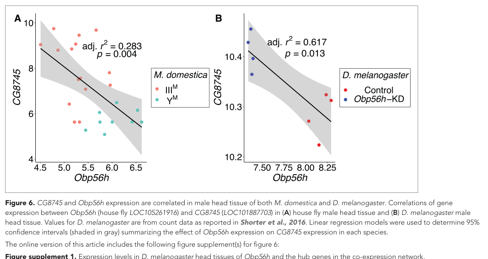

## Question

# Gene Research for Functional Annotation

## ⚠️ CRITICAL: Gene/Protein Identification Context

**BEFORE YOU BEGIN RESEARCH:** You MUST verify you are researching the CORRECT gene/protein. Gene symbols can be ambiguous, especially for less well-characterized genes from non-model organisms.

### Target Gene/Protein Identity (from UniProt):
- **UniProt Accession:** Q9VU95
- **Protein Description:** RecName: Full=Alanine--glyoxylate aminotransferase 2-like {ECO:0000250|UniProtKB:Q8TBG4}; EC=4.2.3.- {ECO:0000305};
- **Gene Information:** ORFNames=CG8745;
- **Organism (full):** Drosophila melanogaster (Fruit fly).
- **Protein Family:** Belongs to the class-III pyridoxal-phosphate-dependent
- **Key Domains:** Aminotrans_3. (IPR005814); Aminotrans_3_PPA_site. (IPR049704); PyrdxlP-dep_Trfase. (IPR015424); PyrdxlP-dep_Trfase_major. (IPR015421); PyrdxlP-dep_Trfase_small. (IPR015422)

### MANDATORY VERIFICATION STEPS:

1. **Check if the gene symbol "CG8745" matches the protein description above**
2. **Verify the organism is correct:** Drosophila melanogaster (Fruit fly).
3. **Check if protein family/domains align with what you find in literature**
4. **If you find literature for a DIFFERENT gene with the same or similar symbol, STOP**

### If Gene Symbol is Ambiguous or You Cannot Find Relevant Literature:

**DO NOT PROCEED WITH RESEARCH ON A DIFFERENT GENE.** Instead:
- State clearly: "The gene symbol 'CG8745' is ambiguous or literature is limited for this specific protein"
- Explain what you found (e.g., "Found extensive literature on a different gene with the same symbol in a different organism")
- Describe the protein based ONLY on the UniProt information provided above
- Suggest that the protein function can be inferred from domain/family information

### Research Target:

Please provide a comprehensive research report on the gene **CG8745** (gene ID: CG8745, UniProt: Q9VU95) in DROME.

The research report should be a detailed narrative explaining the function, biological processes, and localization of the gene product. Citations should be given for all claims.

You should prioritize authoritative reviews and primary scientific literature when conducting research. You can supplement
this with annotations you find in gene/protein databases, but these can be outdated or inaccurate.

We are specifically interested in the primary function of the gene - for enzymes, what reaction is catalyzed, and what is the substrate specificity? For transporters, what is the substrate? For structural proteins or adapters, what is the broader structural role? For signaling molecules, what is the role in the pathway.

We are interested in where in or outside the cell the gene product carries out its function.

We are also interested in the signaling or biochemical pathways in which the gene functions. We are less interested in broad pleiotropic effects, except where these elucidate the precise role.

Include evidence where possible. We are interested in both experimental evidence as well as inference from structure, evolution, or bioinformatic analysis. Precise studies should be prioritized over high-throughput, where available.

## Output

Question: You are an expert researcher providing comprehensive, well-cited information.

Provide detailed information focusing on:
1. Key concepts and definitions with current understanding
2. Recent developments and latest research (prioritize 2023-2024 sources)
3. Current applications and real-world implementations
4. Expert opinions and analysis from authoritative sources
5. Relevant statistics and data from recent studies

Format as a comprehensive research report with proper citations. Include URLs and publication dates where available.
Always prioritize recent, authoritative sources and provide specific citations for all major claims.

# Gene Research for Functional Annotation

## ⚠️ CRITICAL: Gene/Protein Identification Context

**BEFORE YOU BEGIN RESEARCH:** You MUST verify you are researching the CORRECT gene/protein. Gene symbols can be ambiguous, especially for less well-characterized genes from non-model organisms.

### Target Gene/Protein Identity (from UniProt):
- **UniProt Accession:** Q9VU95
- **Protein Description:** RecName: Full=Alanine--glyoxylate aminotransferase 2-like {ECO:0000250|UniProtKB:Q8TBG4}; EC=4.2.3.- {ECO:0000305};
- **Gene Information:** ORFNames=CG8745;
- **Organism (full):** Drosophila melanogaster (Fruit fly).
- **Protein Family:** Belongs to the class-III pyridoxal-phosphate-dependent
- **Key Domains:** Aminotrans_3. (IPR005814); Aminotrans_3_PPA_site. (IPR049704); PyrdxlP-dep_Trfase. (IPR015424); PyrdxlP-dep_Trfase_major. (IPR015421); PyrdxlP-dep_Trfase_small. (IPR015422)

### MANDATORY VERIFICATION STEPS:

1. **Check if the gene symbol "CG8745" matches the protein description above**
2. **Verify the organism is correct:** Drosophila melanogaster (Fruit fly).
3. **Check if protein family/domains align with what you find in literature**
4. **If you find literature for a DIFFERENT gene with the same or similar symbol, STOP**

### If Gene Symbol is Ambiguous or You Cannot Find Relevant Literature:

**DO NOT PROCEED WITH RESEARCH ON A DIFFERENT GENE.** Instead:
- State clearly: "The gene symbol 'CG8745' is ambiguous or literature is limited for this specific protein"
- Explain what you found (e.g., "Found extensive literature on a different gene with the same symbol in a different organism")
- Describe the protein based ONLY on the UniProt information provided above
- Suggest that the protein function can be inferred from domain/family information

### Research Target:

Please provide a comprehensive research report on the gene **CG8745** (gene ID: CG8745, UniProt: Q9VU95) in DROME.

The research report should be a detailed narrative explaining the function, biological processes, and localization of the gene product. Citations should be given for all claims.

You should prioritize authoritative reviews and primary scientific literature when conducting research. You can supplement
this with annotations you find in gene/protein databases, but these can be outdated or inaccurate.

We are specifically interested in the primary function of the gene - for enzymes, what reaction is catalyzed, and what is the substrate specificity? For transporters, what is the substrate? For structural proteins or adapters, what is the broader structural role? For signaling molecules, what is the role in the pathway.

We are interested in where in or outside the cell the gene product carries out its function.

We are also interested in the signaling or biochemical pathways in which the gene functions. We are less interested in broad pleiotropic effects, except where these elucidate the precise role.

Include evidence where possible. We are interested in both experimental evidence as well as inference from structure, evolution, or bioinformatic analysis. Precise studies should be prioritized over high-throughput, where available.

# Functional-annotation report: *Drosophila melanogaster* CG8745 / UniProt Q9VU95

## Executive conclusion

**Identity was verified before functional interpretation.** The target is the *Drosophila melanogaster* gene **CG8745**, corresponding to the supplied UniProt accession **Q9VU95**. A 2024 *eLife* paper independently identifies *D. melanogaster* CG8745 and describes its product as a **predicted ethanolamine-phosphate phospho-lyase**. No conflicting same-symbol protein was identified. The supplied Aminotrans_3 and pyridoxal-phosphate-dependent transferase domains are consistent with the experimentally characterized class-III/fold-type-I PLP-enzyme architecture of human ETNPPL/Q8TBG4, the annotation template cited by UniProt. However, CG8745 itself has not been biochemically characterized. (vettraino2020ofosfoetanolaminafosfoliasidalla pages 21-26, vettraino2020ofosfoetanolaminafosfoliasidalla pages 33-39, delclos2024transregulationof pages 8-10)

The most defensible annotation is therefore:

> **CG8745 encodes a probable PLP-dependent ethanolamine-phosphate phospho-lyase that may catabolize phosphoethanolamine and thereby regulate ethanolamine/Kennedy-pathway metabolism. The reaction, substrate specificity, oligomeric state, pathway role, and localization remain predictions for the fly protein.**

The historical description “alanine–glyoxylate aminotransferase 2-like” should not be interpreted as proof of alanine:glyoxylate transaminase activity. Human ETNPPL is almost inactive as a transaminase and instead catalyzes phosphoethanolamine elimination. (vettraino2020ofosfoetanolaminafosfoliasidalla pages 21-26, vettraino2020ofosfoetanolaminafosfoliasidalla pages 26-29)

## Evidence summary

| Question | Best-supported conclusion | Evidence type | Key evidence and quantitative details | Confidence |
|---|---|---|---|---|
| Identity | **CG8745 is the *Drosophila melanogaster* gene associated with UniProt Q9VU95.** It should not be confused with human ETNPPL/AGXT2L1 (Q8TBG4), which is used only as a functional homolog. | Direct fly; database-predicted | A 2024 *eLife* study explicitly identifies *D. melanogaster* CG8745 and its house-fly ortholog LOC101887703; the latter is the most central gene in the reported co-expression module (delclos2024transregulationof pages 8-10). | High |
| Molecular function and reaction | Q9VU95 is **predicted** to be an ethanolamine-phosphate phospho-lyase-like enzyme, but catalytic activity has not been assayed in the fly protein. The hypothesized reaction is phosphoethanolamine → acetaldehyde + ammonia + inorganic phosphate. | Database-predicted; ortholog biochemical | Human ETNPPL catalyzes irreversible phosphoethanolamine 1,2-elimination and is nearly inactive as an aminotransferase; acetaldehyde formation was measured with an ADH/NADH-coupled assay (vettraino2020ofosfoetanolaminafosfoliasidalla pages 21-26, vettraino2020ofosfoetanolaminafosfoliasidalla pages 29-33). This chemistry remains unverified for CG8745. | Moderate for inferred function; low for fly-specific reaction |
| Substrate specificity | **Phosphoethanolamine is the leading candidate substrate**, but the substrate range and specificity of CG8745 are untested. An aminotransferase reaction with alanine/glyoxylate should not be assumed from the historical protein name. | Ortholog biochemical | Human ETNPPL strongly discriminates against related amino-acid substrates. For human ETNPPL only, phosphoethanolamine kinetics were reported as *K*ₘ = 1.10 ± 0.13 mM, *k*cat = 227 ± 7 s⁻¹, and *k*cat/*K*ₘ = 2.06 × 10⁵ M⁻¹ s⁻¹ (vettraino2020ofosfoetanolaminafosfoliasidalla pages 21-26, vettraino2020ofosfoetanolaminafosfoliasidalla pages 63-68). | Moderate as a hypothesis; low for fly specificity |
| Cofactor, fold, and domains | CG8745/Q9VU95 is predicted to be a **class-III, PLP-dependent aminotransferase-fold protein**, consistent with the supplied Aminotrans_3 and PLP-transferase domain annotations. PLP binding has not been demonstrated experimentally for CG8745. | Database-predicted; ortholog structural/biochemical | Human ETNPPL is a fold-type-I/class-III PLP-family homodimer. Its 2.05 Å structure (PDB 6TOR) contains PMP in both active sites; the catalytic site lies at the dimer interface and includes Lys278. The solution dimer has an approximately 10 nm hydrodynamic diameter (vettraino2020ofosfoetanolaminafosfoliasidalla pages 33-39). | High for family assignment; moderate for shared fly architecture |
| Biochemical pathway | The most plausible role is **phosphoethanolamine catabolism**, potentially regulating substrate availability for the CDP-ethanolamine/Kennedy pathway of phosphatidylethanolamine synthesis. This pathway placement is not directly demonstrated in flies. | Ortholog biochemical and cell-biological inference | In human cells, ETNPPL scavenges phosphoethanolamine, opposing its conversion by PCYT2 to CDP-ethanolamine. ETNPPL overexpression lowered the phosphoethanolamine:CDP-ethanolamine ratio in senescent fibroblasts (tighanimine2024ahomoeostaticswitch pages 12-13). | Moderate for conserved pathway; low-to-moderate in flies |
| Expression and regulatory evidence | CG8745 is reported to be broadly transcribed and is negatively associated with Obp56h expression in adult male head data. Obp56h depletion causes increased CG8745 transcript abundance, establishing regulation of expression but not enzyme function. | Direct fly | In *D. melanogaster*, Obp56h RNAi increased CG8745 expression versus controls: Welch’s *t* = −4.27, *P* = 5.53 × 10⁻³. CG8745 and Obp56h expression were significantly negatively correlated in both *D. melanogaster* and house-fly male heads. The house-fly ortholog was upregulated in IIIM males by log₂ fold-change 2.21, adjusted *P* = 0.016 (delclos2024transregulationof pages 8-10, delclos2024transregulationof media 69947cb6). | High for transcript regulation; low for physiological interpretation |
| Subcellular localization | **Unknown for CG8745.** No fly protein-localization experiment was found, so cytosolic, nuclear, mitochondrial, or organ-specific localization should not be assigned. | Direct fly evidence absent; ortholog cell-model evidence | Transfected HA-tagged human ETNPPL appeared nuclear in Huh7 cells by anti-HA/DAPI/MitoTracker confocal microscopy, but this overexpression result cannot establish localization of endogenous fly CG8745 (holdaway2025alterationsinphosphatidylethanolamine pages 69-79, holdaway2025alterationsinphosphatidylethanolamine pages 59-69). | Low |
| Phenotype and biological role | No CG8745-specific loss-of-function, overexpression, rescue, metabolomic, or viability phenotype was identified. Its correlation with an odorant-binding-protein network does not prove a role in courtship, olfaction, or behavior. | Direct fly evidence limited | The 2024 study manipulated Obp56h, not CG8745; it measured CG8745 transcript responses but did not assay CG8745 biochemical activity, protein localization, or a CG8745-dependent behavioral phenotype (delclos2024transregulationof pages 8-10, delclos2024transregulationof pages 10-12). | High confidence that current direct evidence is insufficient |
| Application or translational relevance | CG8745 currently has **no established real-world, clinical, or biotechnology application**. Its principal value is as a candidate fly model for PLP-dependent phosphoethanolamine metabolism. | Ortholog research application; no fly implementation | Human ETNPPL is being used experimentally to alter phosphoethanolamine flux, lipid-droplet biology, senescence, and hepatic lipid metabolism; these are research applications rather than approved therapies or diagnostics and have not been validated through CG8745 (tighanimine2024ahomoeostaticswitch pages 12-13, tighanimine2024ahomoeostaticswitch pages 1-2, holdaway2025alterationsinphosphatidylethanolamine pages 111-116). | High for absence of established application; low for translational extrapolation |

*Table: Evidence-tier summary for *Drosophila melanogaster* CG8745/Q9VU95, separating direct fly observations from database predictions and human-ortholog experiments. It highlights that the proposed enzymatic reaction and cellular localization remain untested in the fly protein.*

## 1. Identity and annotation verification

### Gene and organism

The literature hit relevant to this exact locus concerns ***D. melanogaster* CG8745**, not mammalian AGXT2, human ETNPPL/AGXT2L1, or an unrelated similarly named gene. Delclos and colleagues explicitly map house-fly LOC101887703 to the *D. melanogaster* ortholog CG8745 and identify CG8745 as a predicted ethanolamine-phosphate phospho-lyase. This agrees with the supplied UniProt record Q9VU95 and organism designation DROME. (delclos2024transregulationof pages 8-10)

### Domain/family consistency

The supplied annotations—Aminotrans_3, Aminotrans_3_PPA_site, PyrdxlP-dep_Trfase, and major/small PLP-transferase domains—place Q9VU95 in the class-III subgroup of fold-type-I PLP-dependent enzymes. Human ETNPPL, UniProt Q8TBG4, is experimentally a dimeric fold-type-I/class-III PLP-family enzyme, providing strong architectural support for the family assignment but not direct proof of the fly reaction. (vettraino2020ofosfoetanolaminafosfoliasidalla pages 21-26, vettraino2020ofosfoetanolaminafosfoliasidalla pages 33-39)

Thus, all three mandatory checks are satisfied: gene and accession are mutually consistent in the supplied record; the organism is *D. melanogaster*; and the literature’s predicted phospholyase function aligns with the stated PLP-enzyme domains. No literature on another “CG8745” was used as though it concerned Q9VU95.

## 2. Probable primary molecular function

### Leading reaction hypothesis

By homology to human ETNPPL, the proposed reaction is an irreversible PLP-dependent 1,2-elimination:

**O-phosphoethanolamine → acetaldehyde + NH₃/NH₄⁺ + inorganic phosphate**

Human ETNPPL produces acetaldehyde from phosphoethanolamine in an alcohol-dehydrogenase/NADH-coupled assay. Mechanistically, phosphoethanolamine forms a PLP external aldimine, Cα deprotonation generates a quinonoid intermediate, phosphate is eliminated, and the resulting ethyleneamine intermediate hydrolyses to acetaldehyde and ammonia. (vettraino2020ofosfoetanolaminafosfoliasidalla pages 21-26, vettraino2020ofosfoetanolaminafosfoliasidalla pages 29-33)

For human ETNPPL, phosphoethanolamine kinetics at 30 °C and pH 8 were reported as **Km = 1.10 ± 0.13 mM**, **kcat = 227 ± 7 s⁻¹**, and **kcat/Km = 2.06 × 10⁵ M⁻¹ s⁻¹**. These values demonstrate efficient phosphoethanolamine turnover by the human homolog, but they must not be assigned to CG8745 without recombinant fly-protein assays. (vettraino2020ofosfoetanolaminafosfoliasidalla pages 63-68)

### Substrate specificity

Phosphoethanolamine is the leading candidate substrate. Human ETNPPL strongly discriminates against structurally related amino compounds and is nearly inactive as a conventional aminotransferase, indicating that the “alanine–glyoxylate aminotransferase 2-like” name reflects sequence history rather than established reaction specificity. No substrate panel, Km, kcat, isotope-tracing experiment, or product analysis has been reported for CG8745. (vettraino2020ofosfoetanolaminafosfoliasidalla pages 21-26, vettraino2020ofosfoetanolaminafosfoliasidalla pages 26-29)

Accordingly, an alanine + glyoxylate transamination reaction should **not** be annotated for Q9VU95 as experimentally established. The safest machine-readable description would be “probable ethanolamine-phosphate phospho-lyase; substrate specificity inferred from homology.”

## 3. Structural and catalytic interpretation

Human ETNPPL offers a well-defined structural template. Its crystal structure was solved at **2.05 Å** resolution and deposited as **PDB 6TOR**. The enzyme is a homodimer; dynamic light scattering gave an approximately **10-nm** solution diameter. Each monomer contains a large PLP-binding domain and smaller terminal lobes, while the active site is assembled at the dimer interface with residues contributed by both subunits. (vettraino2020ofosfoetanolaminafosfoliasidalla pages 29-33, vettraino2020ofosfoetanolaminafosfoliasidalla pages 33-39)

The structure contained PMP in both active sites. Catalytic Lys278 was not covalently continuous with the cofactor density, and spectroscopy showed signals near 410 nm and 330 nm consistent with PLP and PMP states. The human and bacterial phospholyase structures share 39% sequence identity and superimpose with an RMSD of 1.54 Å over 654 Cα atoms. These observations explain why a sequence annotated as an “aminotransferase” can perform elimination chemistry. (vettraino2020ofosfoetanolaminafosfoliasidalla pages 33-39)

For CG8745, this supports—but does not demonstrate—a PLP/PMP catalytic cycle and a likely dimeric architecture. An AlphaFold-like model alone would not resolve substrate specificity; conservation of the catalytic lysine and phosphate-recognition pocket, followed by biochemical testing, would be required.

## 4. Biological process and pathway placement

The probable pathway is **phosphoethanolamine catabolism coupled to regulation of phosphatidylethanolamine synthesis**. In the CDP-ethanolamine branch of the Kennedy pathway, phosphoethanolamine is converted by PCYT2 to CDP-ethanolamine and ultimately phosphatidylethanolamine. ETNPPL consumes the same phosphoethanolamine pool, potentially opposing Kennedy-pathway flux. (vettraino2020ofosfoetanolaminafosfoliasidalla pages 26-29, tighanimine2024ahomoeostaticswitch pages 1-2)

A 2024 *Nature Metabolism* study used human ETNPPL overexpression as a phosphoethanolamine-scavenging intervention in Ras-induced senescent WI38 fibroblasts. ETNPPL lowered the phosphoethanolamine:CDP-ethanolamine ratio and altered senescence-marker expression; the broader study linked phosphoethanolamine and glycerol-3-phosphate accumulation to lipid-droplet biogenesis, triglyceride storage, phospholipid flux, and the senescence programme. Experiments used three biological replicates for the metabolite ratio and ETNPPL-overexpression comparisons, with reported intervention-associated P values in the 10⁻⁵–10⁻³ range for selected metabolic comparisons. Publication: February 2024; DOI/URL: https://doi.org/10.1038/s42255-023-00972-y. (tighanimine2024ahomoeostaticswitch pages 12-13, tighanimine2024ahomoeostaticswitch pages 1-2)

This is important modern evidence for what ETNPPL-family chemistry can do in a cell, but it is not evidence that CG8745 controls senescence in flies. The fly pathway assignment remains a testable metabolic hypothesis.

## 5. Expression and recent direct evidence in flies

The strongest direct CG8745 evidence is transcriptional rather than biochemical. Delclos et al. reported that CG8745 is broadly expressed across *D. melanogaster* tissues and examined its relationship to the odorant-binding-protein gene **Obp56h** in male heads. CG8745 and Obp56h transcript levels were negatively correlated in *D. melanogaster*: the plotted regression had **adjusted R² = 0.617, P = 0.013**. The corresponding house-fly genes also showed a negative relationship, with **adjusted R² = 0.283, P = 0.004**. (delclos2024transregulationof pages 8-10, delclos2024transregulationof media 69947cb6)

More importantly, Obp56h was experimentally depleted by RNAi in *D. melanogaster*. CG8745 expression was higher in Obp56h-knockdown flies than controls (**Welch’s t = −4.27, P = 5.53 × 10⁻³**), supporting a causal effect of Obp56h depletion on CG8745 transcript abundance. In house fly, the CG8745 ortholog LOC101887703 was a central co-expression-network hub and was upregulated in IIIM males by **log₂ fold-change 2.21, adjusted P = 0.016**. Publication: October 2024; DOI/URL: https://doi.org/10.7554/eLife.90349. (delclos2024transregulationof pages 8-10)

The inspected figure directly shows these negative expression relationships in male head samples. (delclos2024transregulationof media 69947cb6)

This evidence does **not** establish that CG8745 is an odorant-binding protein, signaling component, or determinant of courtship. The manipulation targeted Obp56h, not CG8745; no CG8745 knockout, overexpression, rescue, metabolomic analysis, enzyme assay, or behavioral test was reported. At present, the Obp56h result should be interpreted as regulation or co-regulation of CG8745 transcription in male heads, not as proof of CG8745’s physiological role. (delclos2024transregulationof pages 8-10, delclos2024transregulationof pages 10-12)

## 6. Subcellular and tissue localization

### Fly protein

**CG8745 protein localization is unknown.** Broad RNA expression does not establish where the protein acts within a cell. No endogenous tagging, immunofluorescence, organelle fractionation, proximity labeling, signal-peptide analysis validated experimentally, or tissue-specific protein-localization study was found.

It would therefore be inappropriate to label Q9VU95 as mitochondrial, cytosolic, nuclear, secreted, or membrane-associated on the present literature evidence.

### Ortholog evidence and its limitations

HA-tagged human ETNPPL expressed in Huh7 hepatoma cells appeared nuclear by anti-HA fluorescence microscopy with DAPI and MitoTracker controls. This was an overexpression system in cells without detectable endogenous ETNPPL, so it neither determines endogenous human localization with certainty nor transfers a nuclear assignment to CG8745. Mitochondrial metabolic effects of ETNPPL also do not establish mitochondrial residence. (holdaway2025alterationsinphosphatidylethanolamine pages 69-79, holdaway2025alterationsinphosphatidylethanolamine pages 59-69)

## 7. Physiological roles, phenotypes, and applications

No CG8745-specific loss-of-function phenotype, viability defect, developmental phenotype, metabolite alteration, or tissue-autonomous function was identified. Its precise biological process in *Drosophila* therefore remains unresolved.

Human and mouse ETNPPL are being used experimentally to study phosphoethanolamine flux, phosphatidylethanolamine metabolism, senescence, lipid droplets, hepatic lipid handling, mitochondrial energetics, and cancer-associated metabolism. These constitute research applications, not approved diagnostics or therapies. In hepatocyte models, ETNPPL expression selectively reduced radiolabeled phosphoethanolamine, altered lipid storage and phospholipid labeling, reduced proliferation, and affected mitochondrial respiration; mouse knockout hepatocytes showed smaller lipid droplets and less lipid accumulation in the cited thesis work. However, mechanisms and human translation remain uncertain. (holdaway2025alterationsinphosphatidylethanolamine pages 59-69, holdaway2025alterationsinphosphatidylethanolamine pages 83-86, holdaway2025alterationsinphosphatidylethanolamine pages 111-116)

CG8745 currently has **no established real-world clinical or biotechnology application**. Its practical value is as a candidate *Drosophila* model for PLP-dependent phosphoethanolamine metabolism and for testing whether this metabolic node intersects sensory-state-dependent transcription.

## 8. Expert assessment and recommended annotation

The literature supports three evidence tiers:

1. **Directly established in *D. melanogaster*:** CG8745 is transcribed in multiple tissues; its male-head expression is negatively associated with Obp56h; and Obp56h RNAi increases CG8745 RNA.
2. **Strongly predicted from sequence/domain annotation:** Q9VU95 is a class-III PLP-enzyme-family protein and probable ethanolamine-phosphate phospho-lyase.
3. **Established only in the human homolog:** phosphoethanolamine elimination to acetaldehyde, ammonia, and phosphate; PLP/PMP chemistry; homodimeric structure; quantitative kinetics; and effects on Kennedy-pathway-associated metabolite flux.

A conservative functional annotation is therefore:

**Probable ethanolamine-phosphate phospho-lyase-like protein (PLP dependent); putatively catalyzes phosphoethanolamine degradation and modulates phosphatidylethanolamine precursor availability. Reaction, substrate range, physiological pathway, and localization have not been experimentally validated in *D. melanogaster*.**

## 9. Highest-priority experiments

The decisive study would purify recombinant Q9VU95 and measure phosphoethanolamine-dependent acetaldehyde, ammonia, and phosphate production by orthogonal assays, followed by a substrate panel and determination of Km and kcat. Catalytic-lysine mutation would test PLP dependence. Endogenous fluorescent tagging should establish tissue and organelle localization without overexpression. Finally, a clean CG8745 knockout combined with targeted phosphoethanolamine/CDP-ethanolamine/phosphatidylethanolamine metabolomics and tissue-specific rescue would determine whether the predicted reaction operates in vivo. Male-head experiments could then test whether the Obp56h-linked transcriptional relationship has metabolic or behavioral consequences.

References

1. (vettraino2020ofosfoetanolaminafosfoliasidalla pages 21-26): C Vettraino. O-fosfoetanolamina fosfo-liasi: dalla caratterizzazione strutturale ad applicazioni biomediche. Unknown journal, 2020.

2. (vettraino2020ofosfoetanolaminafosfoliasidalla pages 33-39): C Vettraino. O-fosfoetanolamina fosfo-liasi: dalla caratterizzazione strutturale ad applicazioni biomediche. Unknown journal, 2020.

3. (delclos2024transregulationof pages 8-10): Pablo J Delclos, Kiran Adhikari, Alexander B Mai, Oluwatomi Hassan, Alexander A Oderhowho, Vyshnika Sriskantharajah, Tammie Trinh, and Richard Meisel. Trans regulation of an odorant binding protein by a proto-y chromosome affects male courtship in house fly. eLife, Oct 2024. URL: https://doi.org/10.7554/elife.90349, doi:10.7554/elife.90349. This article has 2 citations and is from a domain leading peer-reviewed journal.

4. (vettraino2020ofosfoetanolaminafosfoliasidalla pages 26-29): C Vettraino. O-fosfoetanolamina fosfo-liasi: dalla caratterizzazione strutturale ad applicazioni biomediche. Unknown journal, 2020.

5. (vettraino2020ofosfoetanolaminafosfoliasidalla pages 29-33): C Vettraino. O-fosfoetanolamina fosfo-liasi: dalla caratterizzazione strutturale ad applicazioni biomediche. Unknown journal, 2020.

6. (vettraino2020ofosfoetanolaminafosfoliasidalla pages 63-68): C Vettraino. O-fosfoetanolamina fosfo-liasi: dalla caratterizzazione strutturale ad applicazioni biomediche. Unknown journal, 2020.

7. (tighanimine2024ahomoeostaticswitch pages 12-13): Khaled Tighanimine, José Américo Nabuco Leva Ferreira Freitas, Ivan Nemazanyy, Alexia Bankolé, Delphine Benarroch-Popivker, Susanne Brodesser, Gregory Doré, Lucas Robinson, Paule Benit, Sophia Ladraa, Yara Bou Saada, Bertrand Friguet, Philippe Bertolino, David Bernard, Guillaume Canaud, Pierre Rustin, Eric Gilson, Oliver Bischof, Stefano Fumagalli, and Mario Pende. A homoeostatic switch causing glycerol-3-phosphate and phosphoethanolamine accumulation triggers senescence by rewiring lipid metabolism. Feb 2024. URL: https://doi.org/10.1038/s42255-023-00972-y, doi:10.1038/s42255-023-00972-y. This article has 78 citations and is from a domain leading peer-reviewed journal.

8. (delclos2024transregulationof media 69947cb6): Pablo J Delclos, Kiran Adhikari, Alexander B Mai, Oluwatomi Hassan, Alexander A Oderhowho, Vyshnika Sriskantharajah, Tammie Trinh, and Richard Meisel. Trans regulation of an odorant binding protein by a proto-y chromosome affects male courtship in house fly. eLife, Oct 2024. URL: https://doi.org/10.7554/elife.90349, doi:10.7554/elife.90349. This article has 2 citations and is from a domain leading peer-reviewed journal.

9. (holdaway2025alterationsinphosphatidylethanolamine pages 69-79): C Holdaway. Alterations in phosphatidylethanolamine metabolism impacts lipid storage and metabolism in hepatocytes. Unknown journal, 2025.

10. (holdaway2025alterationsinphosphatidylethanolamine pages 59-69): C Holdaway. Alterations in phosphatidylethanolamine metabolism impacts lipid storage and metabolism in hepatocytes. Unknown journal, 2025.

11. (delclos2024transregulationof pages 10-12): Pablo J Delclos, Kiran Adhikari, Alexander B Mai, Oluwatomi Hassan, Alexander A Oderhowho, Vyshnika Sriskantharajah, Tammie Trinh, and Richard Meisel. Trans regulation of an odorant binding protein by a proto-y chromosome affects male courtship in house fly. eLife, Oct 2024. URL: https://doi.org/10.7554/elife.90349, doi:10.7554/elife.90349. This article has 2 citations and is from a domain leading peer-reviewed journal.

12. (tighanimine2024ahomoeostaticswitch pages 1-2): Khaled Tighanimine, José Américo Nabuco Leva Ferreira Freitas, Ivan Nemazanyy, Alexia Bankolé, Delphine Benarroch-Popivker, Susanne Brodesser, Gregory Doré, Lucas Robinson, Paule Benit, Sophia Ladraa, Yara Bou Saada, Bertrand Friguet, Philippe Bertolino, David Bernard, Guillaume Canaud, Pierre Rustin, Eric Gilson, Oliver Bischof, Stefano Fumagalli, and Mario Pende. A homoeostatic switch causing glycerol-3-phosphate and phosphoethanolamine accumulation triggers senescence by rewiring lipid metabolism. Feb 2024. URL: https://doi.org/10.1038/s42255-023-00972-y, doi:10.1038/s42255-023-00972-y. This article has 78 citations and is from a domain leading peer-reviewed journal.

13. (holdaway2025alterationsinphosphatidylethanolamine pages 111-116): C Holdaway. Alterations in phosphatidylethanolamine metabolism impacts lipid storage and metabolism in hepatocytes. Unknown journal, 2025.

14. (holdaway2025alterationsinphosphatidylethanolamine pages 83-86): C Holdaway. Alterations in phosphatidylethanolamine metabolism impacts lipid storage and metabolism in hepatocytes. Unknown journal, 2025.

## Artifacts

- [Edison artifact artifact-00](CG8745-deep-research-falcon_artifacts/artifact-00.md)

## Citations

1. delclos2024transregulationof pages 8-10
2. vettraino2020ofosfoetanolaminafosfoliasidalla pages 33-39
3. tighanimine2024ahomoeostaticswitch pages 12-13
4. vettraino2020ofosfoetanolaminafosfoliasidalla pages 63-68
5. vettraino2020ofosfoetanolaminafosfoliasidalla pages 21-26
6. vettraino2020ofosfoetanolaminafosfoliasidalla pages 26-29
7. vettraino2020ofosfoetanolaminafosfoliasidalla pages 29-33
8. holdaway2025alterationsinphosphatidylethanolamine pages 69-79
9. holdaway2025alterationsinphosphatidylethanolamine pages 59-69
10. delclos2024transregulationof pages 10-12
11. tighanimine2024ahomoeostaticswitch pages 1-2
12. holdaway2025alterationsinphosphatidylethanolamine pages 111-116
13. holdaway2025alterationsinphosphatidylethanolamine pages 83-86
14. https://doi.org/10.1038/s42255-023-00972-y.
15. https://doi.org/10.7554/eLife.90349.
16. https://doi.org/10.7554/elife.90349,
17. https://doi.org/10.1038/s42255-023-00972-y,