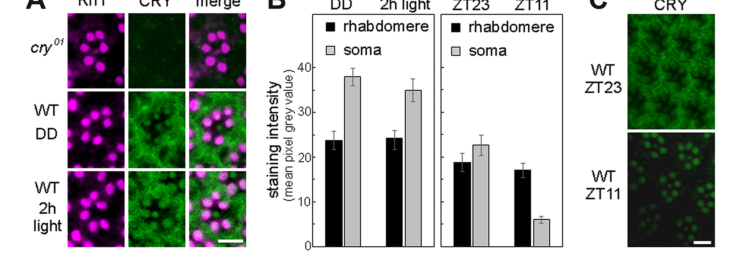

## Question

# Gene Research for Functional Annotation

## ⚠️ CRITICAL: Gene/Protein Identification Context

**BEFORE YOU BEGIN RESEARCH:** You MUST verify you are researching the CORRECT gene/protein. Gene symbols can be ambiguous, especially for less well-characterized genes from non-model organisms.

### Target Gene/Protein Identity (from UniProt):
- **UniProt Accession:** O77059
- **Protein Description:** RecName: Full=Cryptochrome-1; Short=DmCRY1 {ECO:0000312|EMBL:BAA33787.1}; Short=dcry {ECO:0000312|EMBL:BAA35000.1}; AltName: Full=Blue light photoreceptor {ECO:0000312|EMBL:BAA35000.1};
- **Gene Information:** Name=cry {ECO:0000312|EMBL:AAF55649.1, ECO:0000312|FlyBase:FBgn0025680}; ORFNames=CG3772;
- **Organism (full):** Drosophila melanogaster (Fruit fly).
- **Protein Family:** Belongs to the DNA photolyase class-1 family.
- **Key Domains:** Crypto/Photolyase_FAD-like_sf. (IPR036134); Crypto/Photolyase_N_sf. (IPR036155); Cryptochr/Photolyase_FAD-bd. (IPR005101); Cryptochrome/DNA_photolyase_1. (IPR002081); DNA_photolyase_N. (IPR006050)

### MANDATORY VERIFICATION STEPS:

1. **Check if the gene symbol "cry" matches the protein description above**
2. **Verify the organism is correct:** Drosophila melanogaster (Fruit fly).
3. **Check if protein family/domains align with what you find in literature**
4. **If you find literature for a DIFFERENT gene with the same or similar symbol, STOP**

### If Gene Symbol is Ambiguous or You Cannot Find Relevant Literature:

**DO NOT PROCEED WITH RESEARCH ON A DIFFERENT GENE.** Instead:
- State clearly: "The gene symbol 'cry' is ambiguous or literature is limited for this specific protein"
- Explain what you found (e.g., "Found extensive literature on a different gene with the same symbol in a different organism")
- Describe the protein based ONLY on the UniProt information provided above
- Suggest that the protein function can be inferred from domain/family information

### Research Target:

Please provide a comprehensive research report on the gene **cry** (gene ID: CRY, UniProt: O77059) in DROME.

The research report should be a detailed narrative explaining the function, biological processes, and localization of the gene product. Citations should be given for all claims.

You should prioritize authoritative reviews and primary scientific literature when conducting research. You can supplement
this with annotations you find in gene/protein databases, but these can be outdated or inaccurate.

We are specifically interested in the primary function of the gene - for enzymes, what reaction is catalyzed, and what is the substrate specificity? For transporters, what is the substrate? For structural proteins or adapters, what is the broader structural role? For signaling molecules, what is the role in the pathway.

We are interested in where in or outside the cell the gene product carries out its function.

We are also interested in the signaling or biochemical pathways in which the gene functions. We are less interested in broad pleiotropic effects, except where these elucidate the precise role.

Include evidence where possible. We are interested in both experimental evidence as well as inference from structure, evolution, or bioinformatic analysis. Precise studies should be prioritized over high-throughput, where available.

## Output

Question: You are an expert researcher providing comprehensive, well-cited information.

Provide detailed information focusing on:
1. Key concepts and definitions with current understanding
2. Recent developments and latest research (prioritize 2023-2024 sources)
3. Current applications and real-world implementations
4. Expert opinions and analysis from authoritative sources
5. Relevant statistics and data from recent studies

Format as a comprehensive research report with proper citations. Include URLs and publication dates where available.
Always prioritize recent, authoritative sources and provide specific citations for all major claims.

# Gene Research for Functional Annotation

## ⚠️ CRITICAL: Gene/Protein Identification Context

**BEFORE YOU BEGIN RESEARCH:** You MUST verify you are researching the CORRECT gene/protein. Gene symbols can be ambiguous, especially for less well-characterized genes from non-model organisms.

### Target Gene/Protein Identity (from UniProt):
- **UniProt Accession:** O77059
- **Protein Description:** RecName: Full=Cryptochrome-1; Short=DmCRY1 {ECO:0000312|EMBL:BAA33787.1}; Short=dcry {ECO:0000312|EMBL:BAA35000.1}; AltName: Full=Blue light photoreceptor {ECO:0000312|EMBL:BAA35000.1};
- **Gene Information:** Name=cry {ECO:0000312|EMBL:AAF55649.1, ECO:0000312|FlyBase:FBgn0025680}; ORFNames=CG3772;
- **Organism (full):** Drosophila melanogaster (Fruit fly).
- **Protein Family:** Belongs to the DNA photolyase class-1 family.
- **Key Domains:** Crypto/Photolyase_FAD-like_sf. (IPR036134); Crypto/Photolyase_N_sf. (IPR036155); Cryptochr/Photolyase_FAD-bd. (IPR005101); Cryptochrome/DNA_photolyase_1. (IPR002081); DNA_photolyase_N. (IPR006050)

### MANDATORY VERIFICATION STEPS:

1. **Check if the gene symbol "cry" matches the protein description above**
2. **Verify the organism is correct:** Drosophila melanogaster (Fruit fly).
3. **Check if protein family/domains align with what you find in literature**
4. **If you find literature for a DIFFERENT gene with the same or similar symbol, STOP**

### If Gene Symbol is Ambiguous or You Cannot Find Relevant Literature:

**DO NOT PROCEED WITH RESEARCH ON A DIFFERENT GENE.** Instead:
- State clearly: "The gene symbol 'cry' is ambiguous or literature is limited for this specific protein"
- Explain what you found (e.g., "Found extensive literature on a different gene with the same symbol in a different organism")
- Describe the protein based ONLY on the UniProt information provided above
- Suggest that the protein function can be inferred from domain/family information

### Research Target:

Please provide a comprehensive research report on the gene **cry** (gene ID: CRY, UniProt: O77059) in DROME.

The research report should be a detailed narrative explaining the function, biological processes, and localization of the gene product. Citations should be given for all claims.

You should prioritize authoritative reviews and primary scientific literature when conducting research. You can supplement
this with annotations you find in gene/protein databases, but these can be outdated or inaccurate.

We are specifically interested in the primary function of the gene - for enzymes, what reaction is catalyzed, and what is the substrate specificity? For transporters, what is the substrate? For structural proteins or adapters, what is the broader structural role? For signaling molecules, what is the role in the pathway.

We are interested in where in or outside the cell the gene product carries out its function.

We are also interested in the signaling or biochemical pathways in which the gene functions. We are less interested in broad pleiotropic effects, except where these elucidate the precise role.

Include evidence where possible. We are interested in both experimental evidence as well as inference from structure, evolution, or bioinformatic analysis. Precise studies should be prioritized over high-throughput, where available.

## Research report: Functional annotation of **Drosophila melanogaster** cryptochrome (**cry**, CG3772; UniProt **O77059**)

### 1) Target verification (gene/protein identity)
The UniProt accession **O77059** corresponds to **Drosophila melanogaster Cryptochrome-1 (DmCRY; gene symbol cry; ORF CG3772)**, a **Drosophila-type/type I cryptochrome** within the **DNA photolyase/cryptochrome family** that **binds FAD** and functions primarily as a **blue-light photoreceptor** for circadian clock entrainment. In the canonical pathway, light-activated CRY **binds Timeless (TIM)** and triggers **TIM degradation** via recruitment of the **E3 ubiquitin ligase Jetlag (JET)**, thereby resetting the circadian oscillator. This Drosophila light-sensing role is mechanistically distinct from **vertebrate/mammalian-type (type II) cryptochromes**, which are described primarily as **light-independent transcriptional repressors** in the core clock feedback loop. (foley2020drosophilacryptochromevariations pages 1-2, deoliveira2024dualfacetsof pages 1-9, deoliveira2024dualfacetsof pages 35-40)

### 2) Key concepts and definitions (current understanding)

#### 2.1 Cryptochromes and the photolyase relationship
Cryptochromes are structurally related to UV/blue-sensitive **DNA photolyases** but generally lack DNA repair activity and instead serve as **sensory/signaling proteins**. In Drosophila, CRY is best understood as a **cell-autonomous circadian photoreceptor**. (foley2020drosophilacryptochromevariations pages 1-2)

At the structural level, cryptochromes have a conserved **photolyase homology region (PHR)** that binds **FAD** as the principal blue-light chromophore, and a more variable C-terminal region/extension that tunes signaling. A structural review emphasizes a conserved PHR architecture (Rossmann-like α/β domain plus α-helical domain) that positions FAD and provides pockets/surfaces for partner interactions; in Drosophila CRY, the C-terminal segment forms a short **C-terminal tail (CTT)** that docks into a cavity adjacent to the flavin site. (deoliveira2025astructuraldecryption pages 4-5)

#### 2.2 “Photoreduction” and signaling state
A widely supported mechanistic framework is that blue light drives **photoreduction of FAD** in DmCRY via a **Trp triad/tetrad** electron-transfer chain, yielding a reduced flavin state (frequently discussed as an **anionic semiquinone, ASQ**) and promoting structural rearrangements that propagate signaling. (deoliveira2024dualfacetsof pages 35-40, deoliveira2025astructuraldecryption pages 10-11)

#### 2.3 The canonical light-input pathway in flies
The canonical output of CRY photoreception is **light-dependent TIM degradation**, which resets the clock’s PER/TIM negative arm and entrains behavioral rhythms to light/dark cycles. Mechanistically, light promotes a CRY conformational change that exposes binding surfaces for TIM and for ubiquitin ligase components. (foley2020drosophilacryptochromevariations pages 2-4, lin2022mechanisticinsightinto pages 1-3)

### 3) Molecular function and mechanism (primary functional annotation)

#### 3.1 Primary function: blue-light photoreceptor that triggers TIM degradation
A core mechanistic model supported by reviews, biophysics, and structural work is:

1. **Dark state autoinhibition**: the short **CTT** docks into/near the flavin pocket and masks interaction determinants. (foley2020drosophilacryptochromevariations pages 2-4, deoliveira2024dualfacetsof pages 35-40)
2. **Light activation**: blue-light absorption by **FAD** drives photoreduction via a **Trp triad/tetrad**, producing a redox state linked to signaling (commonly ASQ) and promoting **CTT undocking**. (deoliveira2024dualfacetsof pages 35-40, deoliveira2025astructuraldecryption pages 10-11)
3. **TIM binding**: undocking opens the flavin-pocket interface for **TIM binding**, and TIM can insert an N-terminal helix into the same pocket, effectively replacing the CTT. (deoliveira2024dualfacetsof pages 35-40, lin2023mechanismsofcircadian pages 1-3)
4. **Ubiquitin/proteasome targeting**: TIM then associates with CRY and **JET/CUL1**, leading to **TIM ubiquitination and proteasomal degradation**; CRY can also be ubiquitinated and degraded (with **BRWD3/Ramshackle–CUL4** implicated). (foley2020drosophilacryptochromevariations pages 2-4, foley2020drosophilacryptochromevariations pages 1-2)

A quantitative binding study supports the CTT-gating model: WT CRY binds TIM more strongly in light than dark (**KD,dark ≈ 32 µM** vs **KD,light ≈ 9 µM**), while CTT deletion yields **constitutive high-affinity binding** (**KD ≈ 1.7 µM**). (lin2022mechanisticinsightinto pages 3-6)

#### 3.2 Structural basis for light-gated TIM recognition (2023 structural milestone)
A 2023 cryo-EM structure of **CRY bound to TIM** provides an atomic framework for entrainment signaling. The structure indicates:

- **TIM inserts its N-terminus into the CRY flavin pocket**, replacing the CRY CTT and forming a major interface. (lin2023mechanismsofcircadian pages 1-3, lin2023mechanismsofcircadian pages 3-6)
- The interface is substantial, burying about **1862 Ų on TIM** and **1807 Ų on CRY**. (lin2023mechanismsofcircadian pages 1-3, lin2023mechanismsofcircadian pages 3-6)
- Light-state stabilization involves coordinated rearrangements in CRY motifs including the **phosphate-binding loop (PBL; residues 249–263)**, the **protrusion motif**, and the **Ser-rich C-terminal lid** (collectively discussed as a coupled motif), coupled to changes in **FAD geometry**. (lin2023mechanismsofcircadian pages 1-3, deoliveira2024dualfacetsof pages 35-40)
- Specific structural changes include a reported **~1.5 Å shift** of the FAD adenine and refolding/collapse of the PBL into the pocket with repositioned Arg residues and histidine involvement. (lin2023mechanismsofcircadian pages 23-30, lin2023mechanismsofcircadian pages 3-6)

For the peer-reviewed Nature cryo-EM dataset (Apr 2023), the reported reconstruction statistics include **3.3 Å map resolution (2.4–5.5 Å range)** and deposition **PDB 8DD7 / EMDB-27335**, supporting confidence in residue-level interface interpretation. (lin2023cryptochrome–timelessstructurereveals pages 9-13)

#### 3.3 Cofactor dependence and protein biogenesis (2023 single-molecule folding)
A 2023 Nature Communications study used single-molecule optical tweezers to resolve a **multi-intermediate folding pathway** for DmCRY and quantified FAD-dependent steps. FAD binds very rapidly to early folding intermediates with large association rates (e.g., **k3 ≈ 2.8×10^9 M−1·s−1** and **k4 ≈ 1.0×10^10 M−1·s−1**) and sub-nanomolar dissociation constants (~0.25–0.29 nM), consistent with diffusion-limited-like binding. At **10 nM FAD**, the **average folding time** was ~**30 s**, corresponding to an estimated **0.73 probability** of folding by 40 s (and an observed ~0.66 folded fraction). (foroutannejad2023thecofactordependentfolding pages 6-7, foroutannejad2023thecofactordependentfolding pages 12-13)

These data support a functional-annotation view in which **FAD binding is not only photochemical but also a structural requirement** to reach a signaling-competent native fold. (foroutannejad2023thecofactordependentfolding pages 6-7, foroutannejad2023thecofactordependentfolding pages 1-2)

### 4) Biological processes, pathways, and localization

#### 4.1 Canonical circadian pathway context
In the canonical fly clock, CRY mediates light input by binding TIM in response to light and promoting TIM degradation via JET/proteasome pathways, thereby resetting the molecular oscillator and entraining behavior. (foley2020drosophilacryptochromevariations pages 1-2, foley2020drosophilacryptochromevariations pages 2-4)

#### 4.2 Subcellular/tissue localization
**Eyes (photoreceptors):** A key compartmental distinction is between CRY pools in photoreceptor **rhabdomeres** (light-detection compartment) versus **cell bodies (soma)**. In the eye, CRY can localize to rhabdomeres, bind F-actin, and participate in phototransduction-complex organization (see below). (schlichting2018cryptochromeinteractswith pages 1-2, foley2020drosophilacryptochromevariations pages 6-7)

Quantitative imaging in a 2018 study reported that rhabdomeric CRY staining was stable after **2 h of 1000 lux light** (not significantly reduced; **p = 0.404**) and stable between **ZT23** and **ZT11** (**p = 1.0**), while **somatic/cytoplasmic CRY** in photoreceptors was strongly reduced at ZT11 compared with ZT23 (**p < 0.001**). Approximate signal levels (mean pixel gray) were reported, with somatic CRY reaching ~40 after prolonged darkness and rhabdomeric CRY not exceeding ~25. (schlichting2018cryptochromeinteractswith pages 4-7, schlichting2018cryptochromeinteractswith pages 7-8, schlichting2018cryptochromeinteractswith media 14e384c2)

**Clock neurons:** CRY is discussed as showing both nuclear and cytoplasmic localization, with nuclear CRY implicated in morning TIM degradation; however, detailed quantification is often attributed to prior work rather than provided directly in the 2024 heterologous-CRY study excerpt. (chen2024functionalanalysesof pages 10-12)

### 5) Non-canonical and extended functions (physiology beyond TIM degradation)
A widely cited review emphasizes that, beyond entrainment, Drosophila CRY contributes to **arousal/UV avoidance**, **visual photoreception**, and **magnetic field detection**, and can influence circadian amplitude through light-independent mechanisms in a tissue-dependent fashion. (foley2020drosophilacryptochromevariations pages 1-2)

#### 5.1 Neuronal excitability and arousal (ion-channel signaling)
Non-canonical CRY signaling includes light/redox-dependent modulation of neuronal excitability, including CRY-dependent photoresponses in arousal-related neurons. Mechanistic models implicate CRY redox chemistry and the Kvβ-like subunit **Hyperkinetic (HK)** and K+ channel complexes (EAG/ERG/Shaker-associated), operating independently of TIM in some contexts. (foley2020drosophilacryptochromevariations pages 6-7, foley2020drosophilacryptochromevariations pages 5-6, deoliveira2024dualfacetsof pages 91-97)

#### 5.2 Eye “assembling” role in the rhabdomere signalplex (actin/INAD)
In compound eyes, CRY can act as a **structural/assembling factor** in rhabdomeres: it interacts with **actin** and is proposed to maintain the phototransduction “signalplex” near the membrane, enhancing light sensitivity and thereby contributing to eye-mediated clock light input. This rhabdomeric CRY pool is reported as **not degraded by light**, consistent with a stable scaffolding role. (schlichting2018cryptochromeinteractswith pages 1-2)

#### 5.3 Magnetosensitivity (proposed radical-pair mechanisms)
CRY-dependent magnetosensitivity is frequently discussed in Drosophila, with reviews summarizing that cry mutants lose magnetic-field-dependent behaviors and that photochemical mechanisms tied to flavin redox and radical intermediates have been proposed. (foley2020drosophilacryptochromevariations pages 6-7, foley2020drosophilacryptochromevariations pages 10-11)

A 2023 thesis documents experimental implementations expressing full-length DmCRY or its C-terminus in specific neurons (e.g., aCC motor neurons) to test blue-light and magnetic-field sensitivity, and argues that CRY’s C-terminus can be sufficient for magnetic-field effects in that context while also noting assay confounds (e.g., blue-light effects on luciferase reporters). (munro2023investigatingthesensitivity pages 1-5, munro2023investigatingthesensitivity pages 5-9)

#### 5.4 Metabolic regulation (2024)
A 2024 peer-reviewed study reports that loss of CRY (cry01) alters metabolic physiology, including triglyceride dynamics, starvation resistance, and lifespan. Quantitatively, cry01 flies had significantly higher TG during starvation at multiple time points (e.g., 12–24 h; **P < 0.0001**) and a substantially increased median survival time to 50% death (**70.66 ± 1.82 days** in cry01 vs **40.03 ± 1.44 days** in w1118; **P < 0.001**). (gopalakrishnan2024arolefor pages 6-7)

### 6) Recent developments and latest research (prioritizing 2023–2024)

#### 6.1 2023: CRY–TIM structural mechanism for entrainment
The 2023 cryo-EM CRY–TIM structure provides mechanistic clarity for how light can convert CRY into a high-affinity TIM-binding state by **CTT displacement** and **active-site/cofactor-pocket rearrangements**, connecting photochemistry to ubiquitin-mediated proteolysis and timing. (lin2023mechanismsofcircadian pages 1-3, lin2023mechanismsofcircadian pages 3-6, lin2023cryptochrome–timelessstructurereveals pages 9-13)

#### 6.2 2024: Structural synthesis and residue-level activation logic
A 2024 structural review synthesizes evidence that DmCRY activation depends on **FAD photoreduction** (often via Trp triad/tetrad) and that **CTT undocking** is coupled to cofactor state and conformational switches, aligning cryo-EM findings with prior spectroscopy/biophysics. (deoliveira2025astructuraldecryption pages 10-11, deoliveira2025astructuraldecryption pages 9-10)

#### 6.3 2024: Metabolic physiology
The 2024 G3 study extends functional annotation beyond classical entrainment by providing quantitative phenotypes linking cry to triglyceride utilization and survival under dietary and starvation challenges. (gopalakrishnan2024arolefor pages 6-7, gopalakrishnan2024arolefor pages 1-2)

### 7) Current applications and real-world implementations

#### 7.1 CRY2/CIB1 optogenetics (common in practice; not DmCRY)
Cryptochrome-based optogenetic tools widely used in cell and developmental biology typically leverage **Arabidopsis CRY2** and its light-dependent binding partner **CIB1**, exploiting blue-light-induced heterodimerization and CRY2 oligomerization to control signaling and gene expression in engineered systems. A 2024 Scientific Reports paper (Jan 2024) summarizes this principle in the context of developing a blue-light-controlled differentiation tool (Opto-RANK), explicitly noting CRY2–CIB1 binding upon photoexcitation and CRY2 homo-oligomerization as designable behaviors. (takada2024developmentofan pages 1-2)

#### 7.2 DmCRY use cases (circadian and magnetosensitivity research rather than standard optogenetic modules)
By contrast, Drosophila CRY is primarily implemented as a **native photoreceptor/magnetosensor** within circadian/neurobiology research, including behavioral entrainment assays and experimental manipulations of CRY-dependent light responses and proposed magnetic-field effects. The 2023 thesis provides examples of DmCRY implementation in neuronal contexts and discusses limitations relevant to optical readouts and CRY-independent blue-light effects. (munro2023investigatingthesensitivity pages 1-5, munro2023investigatingthesensitivity pages 5-9)

### 8) Expert opinion and analysis (authoritative synthesis)
A 2020 expert review by Foley & Emery frames Drosophila CRY as a multi-functional photoreceptor whose **best-established** role is circadian entrainment via **light-dependent TIM degradation**, while also emphasizing robust evidence for additional roles in neuronal and sensory physiology (arousal/UV avoidance, visual photoreception, magnetic field detection) and tissue-specific regulation. (foley2020drosophilacryptochromevariations pages 1-2, foley2020drosophilacryptochromevariations pages 6-7)

A 2024 structural review argues that cryptochrome function can be most coherently understood through its conserved PHR/FAD architecture plus divergent C-terminal elements that tune partner recognition and signaling outputs, providing a structural rationale for why type I (fly) and type II (mammalian) CRYs differ strongly in light responsiveness and interaction logic. (deoliveira2025astructuraldecryption pages 4-5, deoliveira2025astructuraldecryption pages 9-10)

### 9) Summary functional annotation statement (for databases)
**cry (CG3772; UniProt O77059) encodes an FAD-binding blue-light photoreceptor (DmCRY) that entrains the Drosophila circadian clock by undergoing light-driven conformational switching (CTT undocking) that enables TIM binding and JET-dependent ubiquitination/proteasomal degradation of TIM; DmCRY also participates in tissue-specific, non-canonical functions including modulation of neuronal excitability/arousal via ion-channel-associated pathways, structural organization of phototransduction complexes in eye rhabdomeres, proposed magnetic-field-dependent behaviors, and metabolic regulation affecting triglyceride utilization and lifespan.** (foley2020drosophilacryptochromevariations pages 2-4, lin2023mechanismsofcircadian pages 1-3, schlichting2018cryptochromeinteractswith pages 4-7, foley2020drosophilacryptochromevariations pages 6-7, gopalakrishnan2024arolefor pages 6-7)

---

### Consolidated evidence table
| Biological role/process | Mechanism (molecular events) | Key partners/effectors | Subcellular/tissue localization | Key evidence (with brief quantitative detail where available) | Key citations |
|---|---|---|---|---|---|
| Canonical circadian photoreception and clock entrainment | Blue light is absorbed by FAD in DmCRY, driving photoreduction via the Trp tetrad/triad and release of the autoinhibitory C-terminal tail (CTT). Light-state CRY then binds TIM; JET/CUL1 promotes TIM ubiquitination/proteasomal degradation, while BRWD3/Ramshackle-CUL4 contributes to CRY ubiquitination/self-degradation. | FAD, TIM, JET, CUL1, BRWD3/Ramshackle, proteasome | Clock neurons; nuclear and cytoplasmic pools reported, with nuclear CRY implicated in TIM degradation | CRY:TIM cryo-EM map reached 3.3 Å; primary interface buries ~1862 Ų on TIM and ~1807 Ų on CRY; TIM ARM1 helix replaces the CRY CTT in the flavin pocket; WT CRY binds TIM more strongly in light than dark (KD ~9 µM light vs ~32 µM dark), whereas CTT-deleted CRY binds constitutively (KD ~1.7 µM) (lin2023mechanismsofcircadian pages 1-3, lin2023mechanismsofcircadian pages 3-6, lin2022mechanisticinsightinto pages 3-6, foley2020drosophilacryptochromevariations pages 2-4) | (foley2020drosophilacryptochromevariations pages 1-2, foley2020drosophilacryptochromevariations pages 2-4, deoliveira2025astructuraldecryption pages 9-10, lin2022mechanisticinsightinto pages 3-6, lin2022mechanisticinsightinto pages 1-3, lin2023mechanismsofcircadian pages 1-3, lin2023mechanismsofcircadian pages 3-6) |
| Structural basis of light-gated TIM recognition | TIM inserts an N-terminal helix into the CRY flavin pocket; CRY phosphate-binding loop (PBL), protrusion motif, C-terminal lid, and Arg residues rearrange around FAD to stabilize the signaling state. Histidines H377/H378 help couple FAD redox chemistry to TIM binding. | TIM ARM repeats, TIM N-terminus, FAD, H377, H378, Arg237/Arg258, PBL | CRY photolyase homology region/flavin pocket | TIM-bound CRY shows FAD adenine shift ~1.5 Å; Arg258 replaces a coordinating Mg2+ at the diphosphate region; local density supported TIM insertion at up to ~2.4 Å local resolution; H377L stabilizes TIM-binding conformation and increases TIM binding in pulldown/SWFTI assays (deoliveira2025astructuraldecryption pages 9-10, lin2023mechanismsofcircadian pages 21-23, lin2023mechanismsofcircadian pages 23-30) | (lin2023mechanismsofcircadian pages 6-8, deoliveira2025astructuraldecryption pages 9-10, deoliveira2024dualfacetsof pages 35-40, deoliveira2025astructuraldecryption pages 10-11, lin2023mechanismsofcircadian pages 21-23, lin2023mechanismsofcircadian pages 23-30) |
| Cofactor-dependent folding/biogenesis | dCRY folds through multiple intermediates; early folding steps are FAD-independent, but later steps require FAD binding to largely unfolded intermediates to reach the native signaling-competent state. | FAD, folding intermediates I1/I2/I3, PHR/CTT regions | Intracellular newly synthesized dCRY protein | Single-molecule analysis resolved five states; FAD association rates were extremely fast, k3 ≈ 2.8×10^9 M^-1 s^-1 and k4 ≈ 1.0×10^10 M^-1 s^-1, with sub-nanomolar dissociation constants (~0.25–0.29 nM); at 10 nM FAD the average folding time was ~30 s and folding probability by 40 s was ~0.73 (foroutannejad2023thecofactordependentfolding pages 6-7, foroutannejad2023thecofactordependentfolding pages 12-13) | (foroutannejad2023thecofactordependentfolding pages 6-7, foroutannejad2023thecofactordependentfolding pages 1-2, foroutannejad2023thecofactordependentfolding pages 2-3, foroutannejad2023thecofactordependentfolding pages 12-13, foroutannejad2023thecofactordependentfolding pages 5-6) |
| Non-canonical neuronal photoreception: arousal and rapid membrane depolarization | Light-activated/redox-switched CRY modulates Kvβ-associated potassium-channel signaling, promoting membrane depolarization and firing in light-responsive arousal neurons independently of the canonical TIM-degradation mechanism. | Hyperkinetic (HK/Kvβ), EAG/ERG/Shaker-family K+ channel complexes, flavin redox chemistry | Large ventrolateral neurons (l-LNvs) and other CRY-positive central brain neurons | Reviews and recent analyses place CRY in light-activated arousal neurons; l-LNv photoresponses require potassium-channel modulation and flavin redox chemistry; cry mutants show defective blue/UV-light arousal and UV avoidance phenotypes (foley2020drosophilacryptochromevariations pages 6-7, foley2020drosophilacryptochromevariations pages 5-6, deoliveira2024dualfacetsof pages 91-97) | (foley2020drosophilacryptochromevariations pages 6-7, foley2020drosophilacryptochromevariations pages 5-6, deoliveira2024dualfacetsof pages 91-97) |
| Eye structural/signaling role: actin/signalplex organization and enhanced circadian photosensitivity | In rhabdomeres, CRY acts as a structural/assembling factor rather than a degradable clock photoreceptor pool; it binds F-actin and light-dependently interacts with the scaffold INAD to help maintain the phototransduction signalplex near the membrane, thereby enhancing eye-mediated clock light input. | F-actin, INAD, NINAC/myosin III, TRP channels, phototransduction signalplex | Compound-eye photoreceptor rhabdomeres and photoreceptor cell bodies | Rhabdomeric CRY staining was unchanged after 2 h of 1000 lux light (p = 0.404) and unchanged between ZT23 and ZT11 (p = 1.0), whereas somatic CRY was lower at ZT11 than ZT23 (p < 0.001); rhabdomeric signal never exceeded mean pixel gray ~25, while somatic signal reached ~40 after prolonged darkness (schlichting2018cryptochromeinteractswith pages 4-7, schlichting2018cryptochromeinteractswith pages 7-8, schlichting2018cryptochromeinteractswith media 14e384c2) | (schlichting2018cryptochromeinteractswith pages 1-2, schlichting2018cryptochromeinteractswith pages 4-7, schlichting2018cryptochromeinteractswith pages 7-8, foley2020drosophilacryptochromevariations pages 6-7, schlichting2018cryptochromeinteractswith media 14e384c2) |
| Magnetosensitivity / magnetic-field-dependent behavior | CRY photochemistry has been proposed to generate radical-pair states after light activation, linking blue/UV light sensing to magnetic-field effects on neuronal signaling and behavior. | FAD radical states, Trp electron-transfer chain, possible superoxide/radical-pair intermediates | CRY-expressing neurons; behavioral output circuits | Reviews summarize that cry mutants lose magnetic-field-dependent learning/behavioral effects and that human CRY2 can rescue some fly magnetic phenotypes; magnetic effects also alter geotaxis/locomotion and seizure-like responses under blue/UV light (foley2020drosophilacryptochromevariations pages 6-7, foley2020drosophilacryptochromevariations pages 9-10, foley2020drosophilacryptochromevariations pages 10-11) | (foley2020drosophilacryptochromevariations pages 6-7, foley2020drosophilacryptochromevariations pages 9-10, foley2020drosophilacryptochromevariations pages 10-11) |
| Metabolic regulation: triglyceride storage, starvation resistance, feeding, lifespan | Beyond light resetting, CRY influences metabolic state and diet-responsive triglyceride utilization, likely through circadian/metabolic coupling rather than a simple acute phototransduction effect. | Circadian clock network, triglyceride/glycogen metabolism pathways, diet-response pathways | Metabolically active tissues including gut and fat body; also peripheral clocks | In cry01 mutants, starvation resistance and TG levels increased under LD and LL; TG remained significantly higher than controls at 12, 15, 18, and 24 h post-starvation (P < 0.0001); median time to 50% death increased to 70.66 ± 1.82 d in cry01 vs 40.03 ± 1.44 d in w1118 (P < 0.001) (gopalakrishnan2024arolefor pages 6-7, gopalakrishnan2024arolefor pages 1-2) | (gopalakrishnan2024arolefor pages 1-2, gopalakrishnan2024arolefor pages 6-7) |
| Light-independent modulation of clock amplitude/peripheral clocks | CRY can support molecular rhythm amplitude and peripheral-clock function even outside acute TIM degradation, and can contribute to repression mechanisms in some tissues/contexts. | PER, CLK/CYC, peripheral-clock components | Malpighian tubules, eye, antennae, other peripheral tissues | Reviews summarize tissue-specific light sensitivity and light-independent CRY roles in maintaining oscillation amplitude/peripheral rhythms; effects are context dependent rather than universal across all tissues (foley2020drosophilacryptochromevariations pages 5-6, foley2020drosophilacryptochromevariations pages 1-2, gopalakrishnan2024arolefor pages 1-2) | (foley2020drosophilacryptochromevariations pages 5-6, foley2020drosophilacryptochromevariations pages 1-2, gopalakrishnan2024arolefor pages 1-2) |

*Table: This table summarizes the best-supported functional annotation for Drosophila melanogaster Cryptochrome-1 (cry; UniProt O77059), covering canonical circadian entrainment and major non-canonical roles. It highlights mechanisms, partners, localization, and quantitative findings useful for narrative gene-function annotation.*

### Key source list (publication date + URL)
- Lin et al. **Cryptochrome–Timeless structure reveals circadian clock timing mechanisms**. *Nature* **Apr 2023**. https://doi.org/10.1038/s41586-023-06009-4 (lin2023cryptochrome–timelessstructurereveals pages 9-13)
- Lin et al. **Mechanisms of circadian clock timing and entrainment revealed by the structure of Cryptochrome bound to Timeless**. *Figshare dataset* **Jan 2023**. https://doi.org/10.6084/m9.figshare.22009703 (lin2023mechanismsofcircadian pages 1-3)
- Foroutannejad et al. **The cofactor-dependent folding mechanism of Drosophila cryptochrome revealed by single-molecule pulling experiments**. *Nature Communications* **Feb 2023**. https://doi.org/10.1038/s41467-023-36701-y (foroutannejad2023thecofactordependentfolding pages 6-7)
- DeOliveira & Crane. **A structural decryption of cryptochromes**. *Frontiers in Chemistry* **Aug 2024**. https://doi.org/10.3389/fchem.2024.1436322 (deoliveira2025astructuraldecryption pages 10-11)
- Gopalakrishnan et al. **A role for the circadian photoreceptor CRYPTOCHROME in regulating triglyceride metabolism in Drosophila**. *G3* **Advance Access 12 Sep 2024**. https://doi.org/10.1093/g3journal/jkae220 (gopalakrishnan2024arolefor pages 1-2)
- Foley & Emery. **Drosophila Cryptochrome: Variations in Blue**. *Journal of Biological Rhythms* **Feb 2020**. https://doi.org/10.1177/0748730419878290 (foley2020drosophilacryptochromevariations pages 1-2)
- Schlichting et al. **Cryptochrome interacts with actin and enhances eye-mediated light sensitivity…** *Frontiers in Molecular Neuroscience* **Jul 2018**. https://doi.org/10.3389/fnmol.2018.00238 (schlichting2018cryptochromeinteractswith pages 4-7)
- Takada et al. **Development of an optogenetics tool, Opto-RANK… using blue light**. *Scientific Reports* **Jan 2024**. https://doi.org/10.1038/s41598-024-52056-w (takada2024developmentofan pages 1-2)

References

1. (foley2020drosophilacryptochromevariations pages 1-2): Lauren E. Foley and Patrick Emery. Drosophila cryptochrome: variations in blue. Journal of Biological Rhythms, 35:16-27, Feb 2020. URL: https://doi.org/10.1177/0748730419878290, doi:10.1177/0748730419878290. This article has 34 citations and is from a peer-reviewed journal.

2. (deoliveira2024dualfacetsof pages 1-9): C DeOliveira. Dual facets of drosophila melanogaster cryptochrome: unveiling interactions with jetlag for timeless degradation and …. Unknown journal, 2024.

3. (deoliveira2024dualfacetsof pages 35-40): C DeOliveira. Dual facets of drosophila melanogaster cryptochrome: unveiling interactions with jetlag for timeless degradation and …. Unknown journal, 2024.

4. (deoliveira2025astructuraldecryption pages 4-5): Cristina C. DeOliveira and Brian R. Crane. A structural decryption of cryptochromes. Frontiers in Chemistry, Aug 2024. URL: https://doi.org/10.3389/fchem.2024.1436322, doi:10.3389/fchem.2024.1436322. This article has 18 citations.

5. (deoliveira2025astructuraldecryption pages 10-11): Cristina C. DeOliveira and Brian R. Crane. A structural decryption of cryptochromes. Frontiers in Chemistry, Aug 2024. URL: https://doi.org/10.3389/fchem.2024.1436322, doi:10.3389/fchem.2024.1436322. This article has 18 citations.

6. (foley2020drosophilacryptochromevariations pages 2-4): Lauren E. Foley and Patrick Emery. Drosophila cryptochrome: variations in blue. Journal of Biological Rhythms, 35:16-27, Feb 2020. URL: https://doi.org/10.1177/0748730419878290, doi:10.1177/0748730419878290. This article has 34 citations and is from a peer-reviewed journal.

7. (lin2022mechanisticinsightinto pages 1-3): Changfan Lin, Connor M. Schneps, Siddarth Chandrasekaran, Abir Ganguly, and Brian R. Crane. Mechanistic insight into light-dependent recognition of timeless by drosophila cryptochrome. bioRxiv, Sep 2022. URL: https://doi.org/10.1101/2021.09.10.459772, doi:10.1101/2021.09.10.459772. This article has 29 citations.

8. (lin2023mechanismsofcircadian pages 1-3): Changfan Lin, Shi Feng, Cristina C. DeOliveira, and Brian R. Crane. Mechanisms of circadian clock timing and entrainment revealed by the structure of cryptochrome bound to timeless. Jan 2023. URL: https://doi.org/10.6084/m9.figshare.22009703, doi:10.6084/m9.figshare.22009703. This article has 1 citations.

9. (lin2022mechanisticinsightinto pages 3-6): Changfan Lin, Connor M. Schneps, Siddarth Chandrasekaran, Abir Ganguly, and Brian R. Crane. Mechanistic insight into light-dependent recognition of timeless by drosophila cryptochrome. bioRxiv, Sep 2022. URL: https://doi.org/10.1101/2021.09.10.459772, doi:10.1101/2021.09.10.459772. This article has 29 citations.

10. (lin2023mechanismsofcircadian pages 3-6): Changfan Lin, Shi Feng, Cristina C. DeOliveira, and Brian R. Crane. Mechanisms of circadian clock timing and entrainment revealed by the structure of cryptochrome bound to timeless. Jan 2023. URL: https://doi.org/10.6084/m9.figshare.22009703, doi:10.6084/m9.figshare.22009703. This article has 1 citations.

11. (lin2023mechanismsofcircadian pages 23-30): Changfan Lin, Shi Feng, Cristina C. DeOliveira, and Brian R. Crane. Mechanisms of circadian clock timing and entrainment revealed by the structure of cryptochrome bound to timeless. Jan 2023. URL: https://doi.org/10.6084/m9.figshare.22009703, doi:10.6084/m9.figshare.22009703. This article has 1 citations.

12. (lin2023cryptochrome–timelessstructurereveals pages 9-13): Changfan Lin, Shi Feng, Cristina C. DeOliveira, and Brian R. Crane. Cryptochrome–timeless structure reveals circadian clock timing mechanisms. Nature, 617:194-199, Apr 2023. URL: https://doi.org/10.1038/s41586-023-06009-4, doi:10.1038/s41586-023-06009-4. This article has 55 citations and is from a highest quality peer-reviewed journal.

13. (foroutannejad2023thecofactordependentfolding pages 6-7): Sahar Foroutannejad, Lydia L. Good, Changfan Lin, Zachariah I. Carter, Mahlet G. Tadesse, Aaron L. Lucius, Brian R. Crane, and Rodrigo A. Maillard. The cofactor-dependent folding mechanism of drosophila cryptochrome revealed by single-molecule pulling experiments. Nature Communications, Feb 2023. URL: https://doi.org/10.1038/s41467-023-36701-y, doi:10.1038/s41467-023-36701-y. This article has 10 citations and is from a highest quality peer-reviewed journal.

14. (foroutannejad2023thecofactordependentfolding pages 12-13): Sahar Foroutannejad, Lydia L. Good, Changfan Lin, Zachariah I. Carter, Mahlet G. Tadesse, Aaron L. Lucius, Brian R. Crane, and Rodrigo A. Maillard. The cofactor-dependent folding mechanism of drosophila cryptochrome revealed by single-molecule pulling experiments. Nature Communications, Feb 2023. URL: https://doi.org/10.1038/s41467-023-36701-y, doi:10.1038/s41467-023-36701-y. This article has 10 citations and is from a highest quality peer-reviewed journal.

15. (foroutannejad2023thecofactordependentfolding pages 1-2): Sahar Foroutannejad, Lydia L. Good, Changfan Lin, Zachariah I. Carter, Mahlet G. Tadesse, Aaron L. Lucius, Brian R. Crane, and Rodrigo A. Maillard. The cofactor-dependent folding mechanism of drosophila cryptochrome revealed by single-molecule pulling experiments. Nature Communications, Feb 2023. URL: https://doi.org/10.1038/s41467-023-36701-y, doi:10.1038/s41467-023-36701-y. This article has 10 citations and is from a highest quality peer-reviewed journal.

16. (schlichting2018cryptochromeinteractswith pages 1-2): Matthias Schlichting, Dirk Rieger, Paola Cusumano, Rudi Grebler, Rodolfo Costa, Gabriella M. Mazzotta, and Charlotte Helfrich-Förster. Cryptochrome interacts with actin and enhances eye-mediated light sensitivity of the circadian clock in drosophila melanogaster. Frontiers in Molecular Neuroscience, Jul 2018. URL: https://doi.org/10.3389/fnmol.2018.00238, doi:10.3389/fnmol.2018.00238. This article has 24 citations.

17. (foley2020drosophilacryptochromevariations pages 6-7): Lauren E. Foley and Patrick Emery. Drosophila cryptochrome: variations in blue. Journal of Biological Rhythms, 35:16-27, Feb 2020. URL: https://doi.org/10.1177/0748730419878290, doi:10.1177/0748730419878290. This article has 34 citations and is from a peer-reviewed journal.

18. (schlichting2018cryptochromeinteractswith pages 4-7): Matthias Schlichting, Dirk Rieger, Paola Cusumano, Rudi Grebler, Rodolfo Costa, Gabriella M. Mazzotta, and Charlotte Helfrich-Förster. Cryptochrome interacts with actin and enhances eye-mediated light sensitivity of the circadian clock in drosophila melanogaster. Frontiers in Molecular Neuroscience, Jul 2018. URL: https://doi.org/10.3389/fnmol.2018.00238, doi:10.3389/fnmol.2018.00238. This article has 24 citations.

19. (schlichting2018cryptochromeinteractswith pages 7-8): Matthias Schlichting, Dirk Rieger, Paola Cusumano, Rudi Grebler, Rodolfo Costa, Gabriella M. Mazzotta, and Charlotte Helfrich-Förster. Cryptochrome interacts with actin and enhances eye-mediated light sensitivity of the circadian clock in drosophila melanogaster. Frontiers in Molecular Neuroscience, Jul 2018. URL: https://doi.org/10.3389/fnmol.2018.00238, doi:10.3389/fnmol.2018.00238. This article has 24 citations.

20. (schlichting2018cryptochromeinteractswith media 14e384c2): Matthias Schlichting, Dirk Rieger, Paola Cusumano, Rudi Grebler, Rodolfo Costa, Gabriella M. Mazzotta, and Charlotte Helfrich-Förster. Cryptochrome interacts with actin and enhances eye-mediated light sensitivity of the circadian clock in drosophila melanogaster. Frontiers in Molecular Neuroscience, Jul 2018. URL: https://doi.org/10.3389/fnmol.2018.00238, doi:10.3389/fnmol.2018.00238. This article has 24 citations.

21. (chen2024functionalanalysesof pages 10-12): Chenghao Chen, T. Katherine Tamai, Min Xu, Libero Petrone, Paola Oliveri, David Whitmore, and Ralf Stanewsky. Functional analyses of four cryptochromes from aquatic organisms after heterologous expression in drosophila melanogaster circadian clock cells. Journal of Biological Rhythms, 39:365-378, Mar 2024. URL: https://doi.org/10.1177/07487304241228617, doi:10.1177/07487304241228617. This article has 3 citations and is from a peer-reviewed journal.

22. (foley2020drosophilacryptochromevariations pages 5-6): Lauren E. Foley and Patrick Emery. Drosophila cryptochrome: variations in blue. Journal of Biological Rhythms, 35:16-27, Feb 2020. URL: https://doi.org/10.1177/0748730419878290, doi:10.1177/0748730419878290. This article has 34 citations and is from a peer-reviewed journal.

23. (deoliveira2024dualfacetsof pages 91-97): C DeOliveira. Dual facets of drosophila melanogaster cryptochrome: unveiling interactions with jetlag for timeless degradation and …. Unknown journal, 2024.

24. (foley2020drosophilacryptochromevariations pages 10-11): Lauren E. Foley and Patrick Emery. Drosophila cryptochrome: variations in blue. Journal of Biological Rhythms, 35:16-27, Feb 2020. URL: https://doi.org/10.1177/0748730419878290, doi:10.1177/0748730419878290. This article has 34 citations and is from a peer-reviewed journal.

25. (munro2023investigatingthesensitivity pages 1-5): A Munro. Investigating the sensitivity of drosophila cryptochrome to blue light and magnetic fields. Unknown journal, 2023.

26. (munro2023investigatingthesensitivity pages 5-9): A Munro. Investigating the sensitivity of drosophila cryptochrome to blue light and magnetic fields. Unknown journal, 2023.

27. (gopalakrishnan2024arolefor pages 6-7): Swetha Gopalakrishnan, Sanjay Ramnarayan Yadav, and Nisha N. Kannan. A role for the circadian photoreceptor cryptochrome in regulating triglyceride metabolism in drosophila. G3: Genes | Genomes | Genetics, Sep 2024. URL: https://doi.org/10.1093/g3journal/jkae220, doi:10.1093/g3journal/jkae220. This article has 5 citations.

28. (deoliveira2025astructuraldecryption pages 9-10): Cristina C. DeOliveira and Brian R. Crane. A structural decryption of cryptochromes. Frontiers in Chemistry, Aug 2024. URL: https://doi.org/10.3389/fchem.2024.1436322, doi:10.3389/fchem.2024.1436322. This article has 18 citations.

29. (gopalakrishnan2024arolefor pages 1-2): Swetha Gopalakrishnan, Sanjay Ramnarayan Yadav, and Nisha N. Kannan. A role for the circadian photoreceptor cryptochrome in regulating triglyceride metabolism in drosophila. G3: Genes | Genomes | Genetics, Sep 2024. URL: https://doi.org/10.1093/g3journal/jkae220, doi:10.1093/g3journal/jkae220. This article has 5 citations.

30. (takada2024developmentofan pages 1-2): Aiko Takada, Toshifumi Asano, Ken-ichi Nakahama, Takashi Ono, Takao Nakata, and Tomohiro Ishii. Development of an optogenetics tool, opto-rank, for control of osteoclast differentiation using blue light. Scientific Reports, Jan 2024. URL: https://doi.org/10.1038/s41598-024-52056-w, doi:10.1038/s41598-024-52056-w. This article has 6 citations and is from a peer-reviewed journal.

31. (lin2023mechanismsofcircadian pages 21-23): Changfan Lin, Shi Feng, Cristina C. DeOliveira, and Brian R. Crane. Mechanisms of circadian clock timing and entrainment revealed by the structure of cryptochrome bound to timeless. Jan 2023. URL: https://doi.org/10.6084/m9.figshare.22009703, doi:10.6084/m9.figshare.22009703. This article has 1 citations.

32. (lin2023mechanismsofcircadian pages 6-8): Changfan Lin, Shi Feng, Cristina C. DeOliveira, and Brian R. Crane. Mechanisms of circadian clock timing and entrainment revealed by the structure of cryptochrome bound to timeless. Jan 2023. URL: https://doi.org/10.6084/m9.figshare.22009703, doi:10.6084/m9.figshare.22009703. This article has 1 citations.

33. (foroutannejad2023thecofactordependentfolding pages 2-3): Sahar Foroutannejad, Lydia L. Good, Changfan Lin, Zachariah I. Carter, Mahlet G. Tadesse, Aaron L. Lucius, Brian R. Crane, and Rodrigo A. Maillard. The cofactor-dependent folding mechanism of drosophila cryptochrome revealed by single-molecule pulling experiments. Nature Communications, Feb 2023. URL: https://doi.org/10.1038/s41467-023-36701-y, doi:10.1038/s41467-023-36701-y. This article has 10 citations and is from a highest quality peer-reviewed journal.

34. (foroutannejad2023thecofactordependentfolding pages 5-6): Sahar Foroutannejad, Lydia L. Good, Changfan Lin, Zachariah I. Carter, Mahlet G. Tadesse, Aaron L. Lucius, Brian R. Crane, and Rodrigo A. Maillard. The cofactor-dependent folding mechanism of drosophila cryptochrome revealed by single-molecule pulling experiments. Nature Communications, Feb 2023. URL: https://doi.org/10.1038/s41467-023-36701-y, doi:10.1038/s41467-023-36701-y. This article has 10 citations and is from a highest quality peer-reviewed journal.

35. (foley2020drosophilacryptochromevariations pages 9-10): Lauren E. Foley and Patrick Emery. Drosophila cryptochrome: variations in blue. Journal of Biological Rhythms, 35:16-27, Feb 2020. URL: https://doi.org/10.1177/0748730419878290, doi:10.1177/0748730419878290. This article has 34 citations and is from a peer-reviewed journal.

## Artifacts

- [Edison artifact artifact-00](CRY-deep-research-falcon_artifacts/artifact-00.md)

## Citations

1. foley2020drosophilacryptochromevariations pages 1-2
2. deoliveira2025astructuraldecryption pages 4-5
3. lin2022mechanisticinsightinto pages 3-6
4. chen2024functionalanalysesof pages 10-12
5. schlichting2018cryptochromeinteractswith pages 1-2
6. gopalakrishnan2024arolefor pages 6-7
7. takada2024developmentofan pages 1-2
8. lin2023mechanismsofcircadian pages 1-3
9. foroutannejad2023thecofactordependentfolding pages 6-7
10. deoliveira2025astructuraldecryption pages 10-11
11. gopalakrishnan2024arolefor pages 1-2
12. schlichting2018cryptochromeinteractswith pages 4-7
13. deoliveira2024dualfacetsof pages 1-9
14. deoliveira2024dualfacetsof pages 35-40
15. foley2020drosophilacryptochromevariations pages 2-4
16. lin2022mechanisticinsightinto pages 1-3
17. lin2023mechanismsofcircadian pages 3-6
18. lin2023mechanismsofcircadian pages 23-30
19. foroutannejad2023thecofactordependentfolding pages 12-13
20. foroutannejad2023thecofactordependentfolding pages 1-2
21. foley2020drosophilacryptochromevariations pages 6-7
22. schlichting2018cryptochromeinteractswith pages 7-8
23. foley2020drosophilacryptochromevariations pages 5-6
24. deoliveira2024dualfacetsof pages 91-97
25. foley2020drosophilacryptochromevariations pages 10-11
26. munro2023investigatingthesensitivity pages 1-5
27. munro2023investigatingthesensitivity pages 5-9
28. deoliveira2025astructuraldecryption pages 9-10
29. lin2023mechanismsofcircadian pages 21-23
30. lin2023mechanismsofcircadian pages 6-8
31. foroutannejad2023thecofactordependentfolding pages 2-3
32. foroutannejad2023thecofactordependentfolding pages 5-6
33. foley2020drosophilacryptochromevariations pages 9-10
34. https://doi.org/10.1038/s41586-023-06009-4
35. https://doi.org/10.6084/m9.figshare.22009703
36. https://doi.org/10.1038/s41467-023-36701-y
37. https://doi.org/10.3389/fchem.2024.1436322
38. https://doi.org/10.1093/g3journal/jkae220
39. https://doi.org/10.1177/0748730419878290
40. https://doi.org/10.3389/fnmol.2018.00238
41. https://doi.org/10.1038/s41598-024-52056-w
42. https://doi.org/10.1177/0748730419878290,
43. https://doi.org/10.3389/fchem.2024.1436322,
44. https://doi.org/10.1101/2021.09.10.459772,
45. https://doi.org/10.6084/m9.figshare.22009703,
46. https://doi.org/10.1038/s41586-023-06009-4,
47. https://doi.org/10.1038/s41467-023-36701-y,
48. https://doi.org/10.3389/fnmol.2018.00238,
49. https://doi.org/10.1177/07487304241228617,
50. https://doi.org/10.1093/g3journal/jkae220,
51. https://doi.org/10.1038/s41598-024-52056-w,