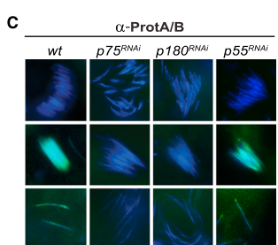

## Question

# Gene Research for Functional Annotation

## ⚠️ CRITICAL: Gene/Protein Identification Context

**BEFORE YOU BEGIN RESEARCH:** You MUST verify you are researching the CORRECT gene/protein. Gene symbols can be ambiguous, especially for less well-characterized genes from non-model organisms.

### Target Gene/Protein Identity (from UniProt):
- **UniProt Accession:** A1Z898
- **Protein Description:** SubName: Full=Chromatin assembly factor 1, p105 subunit {ECO:0000313|EMBL:AAF58788.1};
- **Gene Information:** Name=Caf1-105 {ECO:0000313|EMBL:AAF58788.1, ECO:0000313|FlyBase:FBgn0033526}; Synonyms=CAF p105 {ECO:0000313|EMBL:AAF58788.1}, CAF-1 p105 {ECO:0000313|EMBL:AAF58788.1}, Caf-105 {ECO:0000313|EMBL:AAF58788.1}, CAF1 {ECO:0000313|EMBL:AAF58788.1}, Caf1 {ECO:0000313|EMBL:AAF58788.1}, Caf1-10 {ECO:0000313|EMBL:AAF58788.1}, CAF1-105 {ECO:0000313|EMBL:AAF58788.1}, caf1-105 {ECO:0000313|EMBL:AAF58788.1}, CAF1-p105 {ECO:0000313|EMBL:AAF58788.1}, Caf1-p105 {ECO:0000313|EMBL:AAF58788.1}, CAF1-p75 {ECO:0000313|EMBL:AAF58788.1}, CAF1-p75/p105 {ECO:0000313|EMBL:AAF58788.1}, CAF105/75 {ECO:0000313|EMBL:AAF58788.1}, CAF1p105 {ECO:0000313|EMBL:AAF58788.1}, CAF1p75 {ECO:0000313|EMBL:AAF58788.1}, dCAF-1-p105 {ECO:0000313|EMBL:AAF58788.1}, dCAF1-p105 {ECO:0000313|EMBL:AAF58788.1}, dCAF1-p75 {ECO:0000313|EMBL:AAF58788.1}, Dmel\CG12892 {ECO:0000313|EMBL:AAF58788.1}, P105 {ECO:0000313|EMBL:AAF58788.1}, p105 {ECO:0000313|EMBL:AAF58788.1}, p105/p75 {ECO:0000313|EMBL:AAF58788.1}, p75 {ECO:0000313|EMBL:AAF58788.1}, p75/p105 {ECO:0000313|EMBL:AAF58788.1}; ORFNames=CG12892 {ECO:0000313|EMBL:AAF58788.1, ECO:0000313|FlyBase:FBgn0033526}, Dmel_CG12892 {ECO:0000313|EMBL:AAF58788.1};
- **Organism (full):** Drosophila melanogaster (Fruit fly).
- **Protein Family:** Belongs to the WD repeat HIR1 family.
- **Key Domains:** Beta-prop_CAF1B_HIR1. (IPR055410); PTHR15271. (IPR045145); WD40/YVTN_repeat-like_dom_sf. (IPR015943); WD40_repeat_CS. (IPR019775); WD40_repeat_dom_sf. (IPR036322)

### MANDATORY VERIFICATION STEPS:

1. **Check if the gene symbol "Caf1-105" matches the protein description above**
2. **Verify the organism is correct:** Drosophila melanogaster (Fruit fly).
3. **Check if protein family/domains align with what you find in literature**
4. **If you find literature for a DIFFERENT gene with the same or similar symbol, STOP**

### If Gene Symbol is Ambiguous or You Cannot Find Relevant Literature:

**DO NOT PROCEED WITH RESEARCH ON A DIFFERENT GENE.** Instead:
- State clearly: "The gene symbol 'Caf1-105' is ambiguous or literature is limited for this specific protein"
- Explain what you found (e.g., "Found extensive literature on a different gene with the same symbol in a different organism")
- Describe the protein based ONLY on the UniProt information provided above
- Suggest that the protein function can be inferred from domain/family information

### Research Target:

Please provide a comprehensive research report on the gene **Caf1-105** (gene ID: Caf1-105, UniProt: A1Z898) in DROME.

The research report should be a detailed narrative explaining the function, biological processes, and localization of the gene product. Citations should be given for all claims.

You should prioritize authoritative reviews and primary scientific literature when conducting research. You can supplement
this with annotations you find in gene/protein databases, but these can be outdated or inaccurate.

We are specifically interested in the primary function of the gene - for enzymes, what reaction is catalyzed, and what is the substrate specificity? For transporters, what is the substrate? For structural proteins or adapters, what is the broader structural role? For signaling molecules, what is the role in the pathway.

We are interested in where in or outside the cell the gene product carries out its function.

We are also interested in the signaling or biochemical pathways in which the gene functions. We are less interested in broad pleiotropic effects, except where these elucidate the precise role.

Include evidence where possible. We are interested in both experimental evidence as well as inference from structure, evolution, or bioinformatic analysis. Precise studies should be prioritized over high-throughput, where available.

## Output

Question: You are an expert researcher providing comprehensive, well-cited information.

Provide detailed information focusing on:
1. Key concepts and definitions with current understanding
2. Recent developments and latest research (prioritize 2023-2024 sources)
3. Current applications and real-world implementations
4. Expert opinions and analysis from authoritative sources
5. Relevant statistics and data from recent studies

Format as a comprehensive research report with proper citations. Include URLs and publication dates where available.
Always prioritize recent, authoritative sources and provide specific citations for all major claims.

# Gene Research for Functional Annotation

## ⚠️ CRITICAL: Gene/Protein Identification Context

**BEFORE YOU BEGIN RESEARCH:** You MUST verify you are researching the CORRECT gene/protein. Gene symbols can be ambiguous, especially for less well-characterized genes from non-model organisms.

### Target Gene/Protein Identity (from UniProt):
- **UniProt Accession:** A1Z898
- **Protein Description:** SubName: Full=Chromatin assembly factor 1, p105 subunit {ECO:0000313|EMBL:AAF58788.1};
- **Gene Information:** Name=Caf1-105 {ECO:0000313|EMBL:AAF58788.1, ECO:0000313|FlyBase:FBgn0033526}; Synonyms=CAF p105 {ECO:0000313|EMBL:AAF58788.1}, CAF-1 p105 {ECO:0000313|EMBL:AAF58788.1}, Caf-105 {ECO:0000313|EMBL:AAF58788.1}, CAF1 {ECO:0000313|EMBL:AAF58788.1}, Caf1 {ECO:0000313|EMBL:AAF58788.1}, Caf1-10 {ECO:0000313|EMBL:AAF58788.1}, CAF1-105 {ECO:0000313|EMBL:AAF58788.1}, caf1-105 {ECO:0000313|EMBL:AAF58788.1}, CAF1-p105 {ECO:0000313|EMBL:AAF58788.1}, Caf1-p105 {ECO:0000313|EMBL:AAF58788.1}, CAF1-p75 {ECO:0000313|EMBL:AAF58788.1}, CAF1-p75/p105 {ECO:0000313|EMBL:AAF58788.1}, CAF105/75 {ECO:0000313|EMBL:AAF58788.1}, CAF1p105 {ECO:0000313|EMBL:AAF58788.1}, CAF1p75 {ECO:0000313|EMBL:AAF58788.1}, dCAF-1-p105 {ECO:0000313|EMBL:AAF58788.1}, dCAF1-p105 {ECO:0000313|EMBL:AAF58788.1}, dCAF1-p75 {ECO:0000313|EMBL:AAF58788.1}, Dmel\CG12892 {ECO:0000313|EMBL:AAF58788.1}, P105 {ECO:0000313|EMBL:AAF58788.1}, p105 {ECO:0000313|EMBL:AAF58788.1}, p105/p75 {ECO:0000313|EMBL:AAF58788.1}, p75 {ECO:0000313|EMBL:AAF58788.1}, p75/p105 {ECO:0000313|EMBL:AAF58788.1}; ORFNames=CG12892 {ECO:0000313|EMBL:AAF58788.1, ECO:0000313|FlyBase:FBgn0033526}, Dmel_CG12892 {ECO:0000313|EMBL:AAF58788.1};
- **Organism (full):** Drosophila melanogaster (Fruit fly).
- **Protein Family:** Belongs to the WD repeat HIR1 family.
- **Key Domains:** Beta-prop_CAF1B_HIR1. (IPR055410); PTHR15271. (IPR045145); WD40/YVTN_repeat-like_dom_sf. (IPR015943); WD40_repeat_CS. (IPR019775); WD40_repeat_dom_sf. (IPR036322)

### MANDATORY VERIFICATION STEPS:

1. **Check if the gene symbol "Caf1-105" matches the protein description above**
2. **Verify the organism is correct:** Drosophila melanogaster (Fruit fly).
3. **Check if protein family/domains align with what you find in literature**
4. **If you find literature for a DIFFERENT gene with the same or similar symbol, STOP**

### If Gene Symbol is Ambiguous or You Cannot Find Relevant Literature:

**DO NOT PROCEED WITH RESEARCH ON A DIFFERENT GENE.** Instead:
- State clearly: "The gene symbol 'Caf1-105' is ambiguous or literature is limited for this specific protein"
- Explain what you found (e.g., "Found extensive literature on a different gene with the same symbol in a different organism")
- Describe the protein based ONLY on the UniProt information provided above
- Suggest that the protein function can be inferred from domain/family information

### Research Target:

Please provide a comprehensive research report on the gene **Caf1-105** (gene ID: Caf1-105, UniProt: A1Z898) in DROME.

The research report should be a detailed narrative explaining the function, biological processes, and localization of the gene product. Citations should be given for all claims.

You should prioritize authoritative reviews and primary scientific literature when conducting research. You can supplement
this with annotations you find in gene/protein databases, but these can be outdated or inaccurate.

We are specifically interested in the primary function of the gene - for enzymes, what reaction is catalyzed, and what is the substrate specificity? For transporters, what is the substrate? For structural proteins or adapters, what is the broader structural role? For signaling molecules, what is the role in the pathway.

We are interested in where in or outside the cell the gene product carries out its function.

We are also interested in the signaling or biochemical pathways in which the gene functions. We are less interested in broad pleiotropic effects, except where these elucidate the precise role.

Include evidence where possible. We are interested in both experimental evidence as well as inference from structure, evolution, or bioinformatic analysis. Precise studies should be prioritized over high-throughput, where available.

# Functional annotation report: *Drosophila melanogaster* Caf1-105 (UniProt A1Z898)

## Identity and principal function

**Identity verified.** The supplied accession A1Z898 identifies the *D. melanogaster* gene **Caf1-105/CG12892**, encoding the **p105 middle subunit of chromatin assembly factor 1 (CAF-1)**—not the distinct fly p180 large subunit or p55 small subunit, which is also called Caf1. Primary work purified and cloned fly p105 and identified a **747-amino-acid protein with seven N-terminal WD repeats**, consistent with the supplied WD-repeat/HIR1-family annotations. Peptides from a smaller **p75** protein map to the same gene; antibody recognition and expression patterns support a p105-derived, C-terminally shortened species, although the precise processing mechanism was not established. Human CHAF1B/p60 and yeast Cac2/p60 are corresponding middle subunits, **not** alternative identities for the fly gene. (tyler2001interactionbetweenthe pages 4-6, sauer2018mechanisticinsightsinto pages 3-4, yu2013caf1promotesnotch pages 7-8)

**Primary molecular role:** p105 is a **histone-chaperone/adaptor subunit**, not an enzyme or transporter. Within nuclear CAF-1, it helps assemble chromatin on newly replicated DNA and provides a demonstrated interaction interface for the histone chaperone ASF1. Recombinant fly p180–p105–p55 supported replication-coupled chromatin assembly in a plasmid assay; neither p180 nor p105 alone was active. A p180–p105 preparation was also active, but because the replication extract contained human p48, that result does **not** prove that fly p55 is intrinsically dispensable in an entirely fly-derived system. Pull-downs showed that p180 associates separately with p105 and p55, whereas p105 and p55 did not detectably bind one another. (tyler2001interactionbetweenthe pages 6-8, tyler2001interactionbetweenthe pages 8-10)

The accepted broader CAF-1 model is that ASF1 supplies H3–H4, CAF-1 deposits H3–H4 onto nascent DNA to initiate nucleosome assembly, and subsequent H2A–H2B addition completes the nucleosome. Recruitment through replication-associated PCNA is assigned principally to the **large** CAF-1 subunit. Structural and biochemical synthesis implicates a WD40 middle-subunit architecture and an ASF1-interacting region, but these detailed domain-to-function assignments should not be mistaken for a fly p105 WD-repeat mutagenesis result; likewise, p105 itself has not been shown to catalyze a chemical reaction. (sauer2018mechanisticinsightsinto pages 3-4, sauer2018mechanisticinsightsinto pages 1-2, sauer2018mechanisticinsightsinto pages 2-3)

The principal gene-specific findings and their evidentiary boundaries are summarized below.

| Function/context | Molecular species and cellular site | Decisive direct assays | Interpretation and caveat | Source, date, DOI URL |
|---|---|---|---|---|
| Replication-coupled chromatin assembly; ASF1 cooperation | Full-length p105 in the p180–p105–p55 dCAF-1 complex; p105 and ASF1 on larval salivary-gland polytene chromosomes, including heterochromatic regions | Recombinant-subunit purification showed p180 binds p105 and p55, whereas p105 and p55 did not detectably bind each other. Plasmid-supercoiling and micrococcal-nuclease assays showed activity of p180–p105–p55 and p180–p105, but not either subunit alone. Pull-downs/co-IP established direct p105-dependent ASF1 binding; immunofluorescence showed p105–ASF1 colocalization. | Strong direct evidence that p105 is an essential middle subunit and ASF1 interface. However, the replication assay used human extract containing human p48/RbAp48; its complementation could explain why fly p55 appeared dispensable, so intrinsic sufficiency of p180–p105 alone was not conclusively established. | Tyler et al., **1 October 2001**, [https://doi.org/10.1128/MCB.21.19.6574-6584.2001](https://doi.org/10.1128/MCB.21.19.6574-6584.2001) (tyler2001interactionbetweenthe pages 4-6, tyler2001interactionbetweenthe pages 6-8, tyler2001interactionbetweenthe pages 8-10) |
| Positive regulation of Notch-responsive chromatin | Full-length p105 at the nuclear E(spl)mβ enhancer; association with Su(H) and, after induced signaling, NICD; Cut/Wg expression in wing-disc cells | A 2,480-bp deletion abolished p105 mRNA; ubiquitous HA-p105 rescued lethality and other phenotypes despite the deletion extending into adjacent CG11777. Mutant clones lost Cut and Wg cell-autonomously. Co-IP showed p105–Su(H) and p105–NICD association; ChIP-qPCR showed p105 enrichment and p105-dependent Su(H) occupancy and H4 acetylation at E(spl)mβ. Reporter and qPCR assays measured reduced Notch targets after depletion. | Establishes a locus-level transcriptional role beyond bulk histone deposition. Rescue supports attribution to Caf1-105 rather than CG11777. H4ac was measured with an antibody recognizing several acetylated H4 lysines, so the responsible acetyltransferase and individual lysine modification were not identified. | Yu et al., **1 September 2013**, [https://doi.org/10.1242/dev.094599](https://doi.org/10.1242/dev.094599) (yu2013caf1promotesnotch pages 4-5, yu2013caf1promotesnotch pages 5-7, yu2013caf1promotesnotch pages 7-8) |
| Replication-independent assembly of sperm protamine chromatin | p75, a p105-gene-derived truncated/processed species, appears on paternal chromatin at late-canoe spermatids and persists in mature sperm; full-length p105 was undetectable in testis extracts | Immunoblotting and p105-specific immunostaining distinguished p75 from p105. Protamine co-IP and GST–ProtA pull-downs selectively recovered p75. Germline RNAi against p75 eliminated protamine deposition, while bulk histone eviction, Mst77F incorporation, and protamine abundance remained intact. p180 depletion prevented p75 chromatin association; p75 failed to bind sperm DNA in protamine-null testes. | Direct evidence that p75 is a protamine-loading factor rather than a histone-removal factor. The functional RNAi target derives from the same gene as p105; the study’s protein-level and tissue evidence supports p75 as the operative testis species, but does not define the processing protease or cleavage site. | Doyen et al., **11 July 2013**, [https://doi.org/10.1016/j.celrep.2013.06.002](https://doi.org/10.1016/j.celrep.2013.06.002) (doyen2013subunitsofthe pages 2-3, doyen2013subunitsofthe pages 3-4, doyen2013subunitsofthe pages 4-6, doyen2013subunitsofthe media 8736395f) |
| HP1a-dependent heterochromatin maintenance—subunit-boundary control | p180, not p105, carries the tested HP1-interaction motif (HIM); studied at replicating heterochromatin, polytene chromosomes, and female germline chromatin | Co-IP, recombinant pull-downs, truncation mapping, and ΔHIM transgenic rescue established direct p180–HP1a binding through a conserved 27-residue HIM. Position-effect variegation, heterochromatic-repeat pairing, chromosome-segregation, and HP1a-immunostaining assays tested its function. p105 was detected as a p180-associated CAF-1 subunit, not as an independently tested HP1a ligand. | Prevents erroneous transfer of the p180 mechanism to A1Z898: this paper does **not** identify an HP1a-binding motif in p105 or demonstrate direct p105–HP1a binding. Any p105 contribution is indirect as part of CAF-1 unless separately tested. | Roelens et al., **1 January 2017**, [https://doi.org/10.1534/genetics.116.190785](https://doi.org/10.1534/genetics.116.190785) (roelens2017maintenanceofheterochromatin pages 11-17, roelens2017maintenanceofheterochromatin pages 7-11, roelens2017maintenanceofheterochromatin pages 17-21) |
| Recent chromatin-restoration research | Budding-yeast CAF-1/Rtt106-deficient chromatin; not Drosophila p105 protein or fly cells | Yeast plasmid-topology experiments showed slow, checkpoint-independent restoration of severe replication-coupled assembly defects and tested RNA polymerase II and FACT/Spt16 requirements. The article cites earlier Drosophila Caf1-105 knockdown work as cross-system precedent. | Relevant recent conceptual development, but transcription/FACT dependence was demonstrated in yeast. It must not be reported as a 2023 direct experiment on Drosophila Caf1-105; no direct 2023–2024 fly p105 mechanistic study was verified in this search. | Barrientos-Moreno et al., **14 July 2023**, [https://doi.org/10.1038/s41598-023-38280-w](https://doi.org/10.1038/s41598-023-38280-w) (barrientosmoreno2023transcriptionandfact pages 6-8, barrientosmoreno2023transcriptionandfact pages 1-2, barrientosmoreno2023transcriptionandfact pages 5-6) |

*Table: Evidence-grade summary separating direct Drosophila Caf1-105/p105 and p75 findings from mechanisms belonging to p180 or to yeast. The caveats prevent subunit and cross-species misannotation.*

## Biochemical partners and cellular location

The **p105-containing CAF-1 complex** associates with ASF1 in fly embryo extracts. Purified-subunit experiments identified p105 as necessary for this association and showed that p105 alone can recover ASF1 from extract; binding experiments with purified proteins further support a direct interaction. The p75-containing species was **not** recovered with ASF1 under the reported native co-immunoprecipitation conditions. ASF1 and p105 colocalized on **salivary-gland polytene chromosomes**. p105 and p180, unlike p55, were not excluded from the heterochromatic chromocenter. Because the polytene chromosomes examined were not actively replicating, their staining establishes chromosomal association but does not, by itself, establish p105 occupancy at an active replication fork. The relevant functional compartment for full-length p105 is therefore **nuclear chromatin**; no extracellular function is supported. (tyler2001interactionbetweenthe pages 8-10, tyler2001interactionbetweenthe pages 6-8)

A critical subunit distinction concerns heterochromatin: the conserved, experimentally mapped **HP1a-interaction motif belongs to p180**, not p105. Experiments in that study detected p105 as a p180-associated partner, but did not establish direct p105–HP1a binding or an HP1a-binding motif in p105. Heterochromatin maintenance is a defensible *CAF-1-complex context* for p105, not proof that A1Z898 is itself the HP1a receptor. (roelens2017maintenanceofheterochromatin pages 11-17, roelens2017maintenanceofheterochromatin pages 21-25, roelens2017maintenanceofheterochromatin pages 17-21)

## Defined pathway role: Notch-responsive chromatin

A particularly precise, gene-specific function is **promotion of Notch target-gene transcription** in developing fly tissues. In wing imaginal discs, p105 loss or depletion reduced the Notch-responsive **Cut and Wingless** proteins and the *cut*-lacZ and *E(spl)mβ*-lacZ transcriptional reporters. Embryonic co-immunoprecipitation associated p105 with the Notch transcription factor **Suppressor of Hairless [Su(H)]**; chromatin immunoprecipitation placed p105 at the *E(spl)mβ* enhancer. In p105 mutant larvae, Su(H) occupancy, *E(spl)mβ* transcript abundance and local histone-H4 acetylation all decreased. H4 acetylation remained lower after normalization to histone H3, while the examined *hh* enhancer did not show the same acetylation change. These observations support a **local chromatin-associated role downstream of, or alongside, signal activation**, rather than a demonstrated role in producing the Notch intracellular domain. They do not identify p105 as the acetyltransferase or prove which individual H4 acetylation site is causal. (yu2013caf1promotesnotch pages 4-5, yu2013caf1promotesnotch pages 5-7, yu2013caf1promotesnotch pages 7-8)

In induced S2-cell Notch assays, p105 depletion reduced *E(spl)m3* and *E(spl)m7* transcription without a significant change in control *Gapdh* or *Notch* mRNA; co-immunoprecipitation associated CAF-1 subunits with the Notch intracellular domain. Depletion of p180 or p55 also impaired Cut expression in wing discs, and depletion of either p180 or p105 destabilized the other at the protein level, supporting a **complex-dependent** interpretation rather than an exclusively independent signaling activity of p105. A reported **2,480-bp** p105-loss deletion also affected adjacent *CG11777*, but expression of a p105 transgene rescued the mutant phenotypes, substantially strengthening assignment to **Caf1-105**. As one quantitative genetic readout, adding one mutant p105 copy increased the reported penetrance of a Notch-mutant notched-wing phenotype from **11.8% to 17.9%**; this is a context-specific phenotype, not a measure of CAF-1 biochemical activity. (yu2013caf1promotesnotch pages 4-5, yu2013caf1promotesnotch pages 5-7, yu2013caf1promotesnotch pages 7-8)

## Distinct p105-gene product: p75 in sperm chromatin

**Do not assign the testis findings to abundant full-length p105.** In the reported testis extracts p105 was undetectable, while antibodies recognizing its related **p75** product showed p75 arriving on paternal chromatin at the **late-canoe spermatid stage** and persisting on mature sperm DNA. Protamine co-immunoprecipitation and GST–protamine-A capture selectively recovered p75 rather than full-length p105 or the other CAF-1 subunits. Depleting the p75-gene product prevented protamine deposition on sperm chromatin, although bulk histone removal, Mst77F incorporation and measured protamine abundance were not comparably impaired. p180 acted earlier and was required for p75 association with sperm chromatin; in protamine-null testes p75 likewise failed to associate with sperm DNA. This is evidence for a **replication-independent protamine-loading role of the p75 species encoded by Caf1-105**, spatially distinct from the predominant p105–CAF-1 histone-assembly role. The causal cleavage site and processing enzyme remain unresolved. The original protamine-binding and deposition panels provide visual corroboration. (tyler2001interactionbetweenthe pages 4-6, doyen2013subunitsofthe pages 2-3, doyen2013subunitsofthe pages 3-4, doyen2013subunitsofthe pages 4-6, doyen2013subunitsofthe media 8736395f, doyen2013subunitsofthe media adc284ae)

## Recent research, use, and limits of translation

The strongest retrieved **direct fly p105/p75 mechanistic studies date from 2001 and 2013**; a newly verified **2023–2024 experiment on A1Z898 itself** was not identified. A relevant **2023** study showed that transcription and FACT facilitate restoration of severe replication-coupled chromatin-assembly defects, but its mechanistic interventions were in **budding yeast**. Its discussion of earlier fly *Caf1-105* depletion is cross-species context, **not** evidence that a FACT requirement was established for this fly protein. The resulting research use of Caf1-105 is as a genetically tractable **model for replication-linked chromatin assembly, Notch-enhancer regulation and sperm-chromatin repackaging**, rather than an established clinical target or deployed technology. (barrientosmoreno2023transcriptionandfact pages 6-8, barrientosmoreno2023transcriptionandfact pages 1-2, barrientosmoreno2023transcriptionandfact pages 5-6, yu2013caf1promotesnotch pages 4-5, doyen2013subunitsofthe pages 3-4)

**Assessment.** The most secure annotation is **nuclear WD-repeat CAF-1 middle subunit and ASF1-associated replication-coupled chromatin-assembly factor**, with experimentally supported Notch-enhancer regulation by full-length p105 and a specialized, protamine-binding sperm-chromatin function for the related p75 species. Claims that A1Z898 itself binds PCNA or HP1a through the motifs characterized in p180, that its WD repeats have a particular experimentally proven binding specificity, or that yeast FACT-restoration findings were demonstrated in flies would exceed the gene-specific evidence. (tyler2001interactionbetweenthe pages 4-6, tyler2001interactionbetweenthe pages 6-8, yu2013caf1promotesnotch pages 5-7, doyen2013subunitsofthe pages 3-4, roelens2017maintenanceofheterochromatin pages 11-17, barrientosmoreno2023transcriptionandfact pages 6-8)

### Principal sources and publication dates

- Tyler *et al.*, **October 2001**, *Molecular and Cellular Biology*, “Interaction between the Drosophila CAF-1 and ASF1 chromatin assembly factors.” https://doi.org/10.1128/MCB.21.19.6574-6584.2001. (tyler2001interactionbetweenthe pages 4-6, tyler2001interactionbetweenthe pages 6-8, tyler2001interactionbetweenthe pages 8-10)
- Yu *et al.*, **September 2013**, *Development*, “CAF-1 promotes Notch signaling through epigenetic control of target gene expression during Drosophila development.” https://doi.org/10.1242/dev.094599. (yu2013caf1promotesnotch pages 4-5, yu2013caf1promotesnotch pages 5-7, yu2013caf1promotesnotch pages 7-8)
- Doyen *et al.*, **July 2013**, *Cell Reports*, “Subunits of the histone chaperone CAF1 also mediate assembly of protamine-based chromatin.” https://doi.org/10.1016/j.celrep.2013.06.002. (doyen2013subunitsofthe pages 2-3, doyen2013subunitsofthe pages 3-4, doyen2013subunitsofthe pages 4-6)
- Roelens *et al.*, **January 2017**, *Genetics*, p180–HP1a heterochromatin study. https://doi.org/10.1534/genetics.116.190785. (roelens2017maintenanceofheterochromatin pages 11-17, roelens2017maintenanceofheterochromatin pages 21-25)
- Sauer *et al.*, **September 2018**, *Nucleic Acids Research*, CAF-1 structural and deposition-mechanism synthesis. https://doi.org/10.1093/nar/gky823. (sauer2018mechanisticinsightsinto pages 3-4, sauer2018mechanisticinsightsinto pages 1-2)
- Barrientos-Moreno *et al.*, **July 2023**, *Scientific Reports*, yeast chromatin-restoration study. https://doi.org/10.1038/s41598-023-38280-w. (barrientosmoreno2023transcriptionandfact pages 6-8, barrientosmoreno2023transcriptionandfact pages 1-2)

References

1. (tyler2001interactionbetweenthe pages 4-6): Jessica K. Tyler, Kimberly A. Collins, Jayashree Prasad-Sinha, Elizabeth Amiott, Michael Bulger, Peter J. Harte, Ryuji Kobayashi, and James T. Kadonaga. Interaction between the drosophilacaf-1 and asf1 chromatin assembly factors. Molecular and Cellular Biology, 21:6574-6584, Oct 2001. URL: https://doi.org/10.1128/mcb.21.19.6574-6584.2001, doi:10.1128/mcb.21.19.6574-6584.2001. This article has 308 citations and is from a domain leading peer-reviewed journal.

2. (sauer2018mechanisticinsightsinto pages 3-4): Paul V Sauer, Yajie Gu, Wallace H Liu, Francesca Mattiroli, Daniel Panne, Karolin Luger, and Mair EA Churchill. Mechanistic insights into histone deposition and nucleosome assembly by the chromatin assembly factor-1. Nucleic Acids Research, 46:9907-9917, Sep 2018. URL: https://doi.org/10.1093/nar/gky823, doi:10.1093/nar/gky823. This article has 117 citations and is from a highest quality peer-reviewed journal.

3. (yu2013caf1promotesnotch pages 7-8): Zhongsheng Yu, Honggang Wu, Hanqing Chen, Ruoqi Wang, Xuehong Liang, Jiyong Liu, Changqing Li, Wu-Min Deng, and Renjie Jiao. Caf-1 promotes notch signaling through epigenetic control of target gene expression during drosophila development. Development, 140:3635-3644, Sep 2013. URL: https://doi.org/10.1242/dev.094599, doi:10.1242/dev.094599. This article has 36 citations and is from a domain leading peer-reviewed journal.

4. (tyler2001interactionbetweenthe pages 6-8): Jessica K. Tyler, Kimberly A. Collins, Jayashree Prasad-Sinha, Elizabeth Amiott, Michael Bulger, Peter J. Harte, Ryuji Kobayashi, and James T. Kadonaga. Interaction between the drosophilacaf-1 and asf1 chromatin assembly factors. Molecular and Cellular Biology, 21:6574-6584, Oct 2001. URL: https://doi.org/10.1128/mcb.21.19.6574-6584.2001, doi:10.1128/mcb.21.19.6574-6584.2001. This article has 308 citations and is from a domain leading peer-reviewed journal.

5. (tyler2001interactionbetweenthe pages 8-10): Jessica K. Tyler, Kimberly A. Collins, Jayashree Prasad-Sinha, Elizabeth Amiott, Michael Bulger, Peter J. Harte, Ryuji Kobayashi, and James T. Kadonaga. Interaction between the drosophilacaf-1 and asf1 chromatin assembly factors. Molecular and Cellular Biology, 21:6574-6584, Oct 2001. URL: https://doi.org/10.1128/mcb.21.19.6574-6584.2001, doi:10.1128/mcb.21.19.6574-6584.2001. This article has 308 citations and is from a domain leading peer-reviewed journal.

6. (sauer2018mechanisticinsightsinto pages 1-2): Paul V Sauer, Yajie Gu, Wallace H Liu, Francesca Mattiroli, Daniel Panne, Karolin Luger, and Mair EA Churchill. Mechanistic insights into histone deposition and nucleosome assembly by the chromatin assembly factor-1. Nucleic Acids Research, 46:9907-9917, Sep 2018. URL: https://doi.org/10.1093/nar/gky823, doi:10.1093/nar/gky823. This article has 117 citations and is from a highest quality peer-reviewed journal.

7. (sauer2018mechanisticinsightsinto pages 2-3): Paul V Sauer, Yajie Gu, Wallace H Liu, Francesca Mattiroli, Daniel Panne, Karolin Luger, and Mair EA Churchill. Mechanistic insights into histone deposition and nucleosome assembly by the chromatin assembly factor-1. Nucleic Acids Research, 46:9907-9917, Sep 2018. URL: https://doi.org/10.1093/nar/gky823, doi:10.1093/nar/gky823. This article has 117 citations and is from a highest quality peer-reviewed journal.

8. (yu2013caf1promotesnotch pages 4-5): Zhongsheng Yu, Honggang Wu, Hanqing Chen, Ruoqi Wang, Xuehong Liang, Jiyong Liu, Changqing Li, Wu-Min Deng, and Renjie Jiao. Caf-1 promotes notch signaling through epigenetic control of target gene expression during drosophila development. Development, 140:3635-3644, Sep 2013. URL: https://doi.org/10.1242/dev.094599, doi:10.1242/dev.094599. This article has 36 citations and is from a domain leading peer-reviewed journal.

9. (yu2013caf1promotesnotch pages 5-7): Zhongsheng Yu, Honggang Wu, Hanqing Chen, Ruoqi Wang, Xuehong Liang, Jiyong Liu, Changqing Li, Wu-Min Deng, and Renjie Jiao. Caf-1 promotes notch signaling through epigenetic control of target gene expression during drosophila development. Development, 140:3635-3644, Sep 2013. URL: https://doi.org/10.1242/dev.094599, doi:10.1242/dev.094599. This article has 36 citations and is from a domain leading peer-reviewed journal.

10. (doyen2013subunitsofthe pages 2-3): Cécile M. Doyen, Yuri M. Moshkin, Gillian E. Chalkley, Karel Bezstarosti, Jeroen A.A. Demmers, Christina Rathke, Renate Renkawitz-Pohl, and C. Peter Verrijzer. Subunits of the histone chaperone caf1 also mediate assembly of protamine-based chromatin. Cell reports, 4 1:59-65, Jul 2013. URL: https://doi.org/10.1016/j.celrep.2013.06.002, doi:10.1016/j.celrep.2013.06.002. This article has 42 citations and is from a highest quality peer-reviewed journal.

11. (doyen2013subunitsofthe pages 3-4): Cécile M. Doyen, Yuri M. Moshkin, Gillian E. Chalkley, Karel Bezstarosti, Jeroen A.A. Demmers, Christina Rathke, Renate Renkawitz-Pohl, and C. Peter Verrijzer. Subunits of the histone chaperone caf1 also mediate assembly of protamine-based chromatin. Cell reports, 4 1:59-65, Jul 2013. URL: https://doi.org/10.1016/j.celrep.2013.06.002, doi:10.1016/j.celrep.2013.06.002. This article has 42 citations and is from a highest quality peer-reviewed journal.

12. (doyen2013subunitsofthe pages 4-6): Cécile M. Doyen, Yuri M. Moshkin, Gillian E. Chalkley, Karel Bezstarosti, Jeroen A.A. Demmers, Christina Rathke, Renate Renkawitz-Pohl, and C. Peter Verrijzer. Subunits of the histone chaperone caf1 also mediate assembly of protamine-based chromatin. Cell reports, 4 1:59-65, Jul 2013. URL: https://doi.org/10.1016/j.celrep.2013.06.002, doi:10.1016/j.celrep.2013.06.002. This article has 42 citations and is from a highest quality peer-reviewed journal.

13. (doyen2013subunitsofthe media 8736395f): Cécile M. Doyen, Yuri M. Moshkin, Gillian E. Chalkley, Karel Bezstarosti, Jeroen A.A. Demmers, Christina Rathke, Renate Renkawitz-Pohl, and C. Peter Verrijzer. Subunits of the histone chaperone caf1 also mediate assembly of protamine-based chromatin. Cell reports, 4 1:59-65, Jul 2013. URL: https://doi.org/10.1016/j.celrep.2013.06.002, doi:10.1016/j.celrep.2013.06.002. This article has 42 citations and is from a highest quality peer-reviewed journal.

14. (roelens2017maintenanceofheterochromatin pages 11-17): Baptiste Roelens, Marie Clémot, Mathieu Leroux-Coyau, Benjamin Klapholz, and Nathalie Dostatni. Maintenance of heterochromatin by the large subunit of the caf-1 replication-coupled histone chaperone requires its interaction with hp1a through a conserved motif. Genetics, 205:125-137, Jan 2017. URL: https://doi.org/10.1534/genetics.116.190785, doi:10.1534/genetics.116.190785. This article has 12 citations and is from a domain leading peer-reviewed journal.

15. (roelens2017maintenanceofheterochromatin pages 7-11): Baptiste Roelens, Marie Clémot, Mathieu Leroux-Coyau, Benjamin Klapholz, and Nathalie Dostatni. Maintenance of heterochromatin by the large subunit of the caf-1 replication-coupled histone chaperone requires its interaction with hp1a through a conserved motif. Genetics, 205:125-137, Jan 2017. URL: https://doi.org/10.1534/genetics.116.190785, doi:10.1534/genetics.116.190785. This article has 12 citations and is from a domain leading peer-reviewed journal.

16. (roelens2017maintenanceofheterochromatin pages 17-21): Baptiste Roelens, Marie Clémot, Mathieu Leroux-Coyau, Benjamin Klapholz, and Nathalie Dostatni. Maintenance of heterochromatin by the large subunit of the caf-1 replication-coupled histone chaperone requires its interaction with hp1a through a conserved motif. Genetics, 205:125-137, Jan 2017. URL: https://doi.org/10.1534/genetics.116.190785, doi:10.1534/genetics.116.190785. This article has 12 citations and is from a domain leading peer-reviewed journal.

17. (barrientosmoreno2023transcriptionandfact pages 6-8): Marta Barrientos-Moreno, Douglas Maya-Miles, Marina Murillo-Pineda, Sara Fontalva, Mónica Pérez-Alegre, Eloísa Andujar, and Félix Prado. Transcription and fact facilitate the restoration of replication-coupled chromatin assembly defects. Scientific Reports, Jul 2023. URL: https://doi.org/10.1038/s41598-023-38280-w, doi:10.1038/s41598-023-38280-w. This article has 4 citations and is from a peer-reviewed journal.

18. (barrientosmoreno2023transcriptionandfact pages 1-2): Marta Barrientos-Moreno, Douglas Maya-Miles, Marina Murillo-Pineda, Sara Fontalva, Mónica Pérez-Alegre, Eloísa Andujar, and Félix Prado. Transcription and fact facilitate the restoration of replication-coupled chromatin assembly defects. Scientific Reports, Jul 2023. URL: https://doi.org/10.1038/s41598-023-38280-w, doi:10.1038/s41598-023-38280-w. This article has 4 citations and is from a peer-reviewed journal.

19. (barrientosmoreno2023transcriptionandfact pages 5-6): Marta Barrientos-Moreno, Douglas Maya-Miles, Marina Murillo-Pineda, Sara Fontalva, Mónica Pérez-Alegre, Eloísa Andujar, and Félix Prado. Transcription and fact facilitate the restoration of replication-coupled chromatin assembly defects. Scientific Reports, Jul 2023. URL: https://doi.org/10.1038/s41598-023-38280-w, doi:10.1038/s41598-023-38280-w. This article has 4 citations and is from a peer-reviewed journal.

20. (roelens2017maintenanceofheterochromatin pages 21-25): Baptiste Roelens, Marie Clémot, Mathieu Leroux-Coyau, Benjamin Klapholz, and Nathalie Dostatni. Maintenance of heterochromatin by the large subunit of the caf-1 replication-coupled histone chaperone requires its interaction with hp1a through a conserved motif. Genetics, 205:125-137, Jan 2017. URL: https://doi.org/10.1534/genetics.116.190785, doi:10.1534/genetics.116.190785. This article has 12 citations and is from a domain leading peer-reviewed journal.

21. (doyen2013subunitsofthe media adc284ae): Cécile M. Doyen, Yuri M. Moshkin, Gillian E. Chalkley, Karel Bezstarosti, Jeroen A.A. Demmers, Christina Rathke, Renate Renkawitz-Pohl, and C. Peter Verrijzer. Subunits of the histone chaperone caf1 also mediate assembly of protamine-based chromatin. Cell reports, 4 1:59-65, Jul 2013. URL: https://doi.org/10.1016/j.celrep.2013.06.002, doi:10.1016/j.celrep.2013.06.002. This article has 42 citations and is from a highest quality peer-reviewed journal.

## Artifacts

- [Edison artifact artifact-00](Caf1-105-deep-research-falcon_artifacts/artifact-00.md)

## Citations

1. tyler2001interactionbetweenthe pages 4-6
2. sauer2018mechanisticinsightsinto pages 3-4
3. tyler2001interactionbetweenthe pages 6-8
4. tyler2001interactionbetweenthe pages 8-10
5. sauer2018mechanisticinsightsinto pages 1-2
6. sauer2018mechanisticinsightsinto pages 2-3
7. doyen2013subunitsofthe pages 2-3
8. doyen2013subunitsofthe pages 3-4
9. doyen2013subunitsofthe pages 4-6
10. roelens2017maintenanceofheterochromatin pages 11-17
11. roelens2017maintenanceofheterochromatin pages 7-11
12. roelens2017maintenanceofheterochromatin pages 17-21
13. barrientosmoreno2023transcriptionandfact pages 6-8
14. barrientosmoreno2023transcriptionandfact pages 1-2
15. barrientosmoreno2023transcriptionandfact pages 5-6
16. roelens2017maintenanceofheterochromatin pages 21-25
17. https://doi.org/10.1128/MCB.21.19.6574-6584.2001
18. https://doi.org/10.1242/dev.094599
19. https://doi.org/10.1016/j.celrep.2013.06.002
20. https://doi.org/10.1534/genetics.116.190785
21. https://doi.org/10.1038/s41598-023-38280-w
22. Su(H)
23. https://doi.org/10.1128/MCB.21.19.6574-6584.2001](https://doi.org/10.1128/MCB.21.19.6574-6584.2001
24. https://doi.org/10.1242/dev.094599](https://doi.org/10.1242/dev.094599
25. https://doi.org/10.1016/j.celrep.2013.06.002](https://doi.org/10.1016/j.celrep.2013.06.002
26. https://doi.org/10.1534/genetics.116.190785](https://doi.org/10.1534/genetics.116.190785
27. https://doi.org/10.1038/s41598-023-38280-w](https://doi.org/10.1038/s41598-023-38280-w
28. https://doi.org/10.1128/MCB.21.19.6574-6584.2001.
29. https://doi.org/10.1242/dev.094599.
30. https://doi.org/10.1016/j.celrep.2013.06.002.
31. https://doi.org/10.1534/genetics.116.190785.
32. https://doi.org/10.1093/nar/gky823.
33. https://doi.org/10.1038/s41598-023-38280-w.
34. https://doi.org/10.1128/mcb.21.19.6574-6584.2001,
35. https://doi.org/10.1093/nar/gky823,
36. https://doi.org/10.1242/dev.094599,
37. https://doi.org/10.1016/j.celrep.2013.06.002,
38. https://doi.org/10.1534/genetics.116.190785,
39. https://doi.org/10.1038/s41598-023-38280-w,