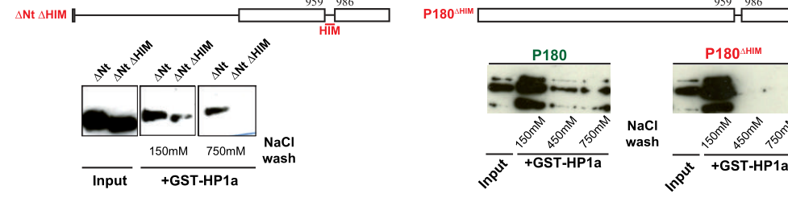

## Question

# Gene Research for Functional Annotation

## ⚠️ CRITICAL: Gene/Protein Identification Context

**BEFORE YOU BEGIN RESEARCH:** You MUST verify you are researching the CORRECT gene/protein. Gene symbols can be ambiguous, especially for less well-characterized genes from non-model organisms.

### Target Gene/Protein Identity (from UniProt):
- **UniProt Accession:** Q9W3D1
- **Protein Description:** SubName: Full=Chromatin assembly factor 1, p180 subunit {ECO:0000313|EMBL:AAF46399.1};
- **Gene Information:** Name=Caf1-180 {ECO:0000313|EMBL:AAF46399.1, ECO:0000313|FlyBase:FBgn0030054}; Synonyms=CAF-1 p180 {ECO:0000313|EMBL:AAF46399.1}, Caf-180 {ECO:0000313|EMBL:AAF46399.1}, Caf1 {ECO:0000313|EMBL:AAF46399.1}, CAF1-180 {ECO:0000313|EMBL:AAF46399.1}, caf1-180 {ECO:0000313|EMBL:AAF46399.1}, CAF1-p180 {ECO:0000313|EMBL:AAF46399.1}, CAF1p180 {ECO:0000313|EMBL:AAF46399.1}, dCAF-1-180 {ECO:0000313|EMBL:AAF46399.1}, dCAF-1-p180 {ECO:0000313|EMBL:AAF46399.1}, Dmel\CG12109 {ECO:0000313|EMBL:AAF46399.1}, NURF {ECO:0000313|EMBL:AAF46399.1}, P180 {ECO:0000313|EMBL:AAF46399.1}, p180 {ECO:0000313|EMBL:AAF46399.1}; ORFNames=CG12109 {ECO:0000313|EMBL:AAF46399.1, ECO:0000313|FlyBase:FBgn0030054}, Dmel_CG12109 {ECO:0000313|EMBL:AAF46399.1};
- **Organism (full):** Drosophila melanogaster (Fruit fly).
- **Protein Family:** Not specified in UniProt
- **Key Domains:** CAF-1_p150_acidic. (IPR021644); CAF1A_DD. (IPR022043); CAF1A_acidic (PF11600); CAF1A_dimeriz (PF12253)

### MANDATORY VERIFICATION STEPS:

1. **Check if the gene symbol "Caf1-180" matches the protein description above**
2. **Verify the organism is correct:** Drosophila melanogaster (Fruit fly).
3. **Check if protein family/domains align with what you find in literature**
4. **If you find literature for a DIFFERENT gene with the same or similar symbol, STOP**

### If Gene Symbol is Ambiguous or You Cannot Find Relevant Literature:

**DO NOT PROCEED WITH RESEARCH ON A DIFFERENT GENE.** Instead:
- State clearly: "The gene symbol 'Caf1-180' is ambiguous or literature is limited for this specific protein"
- Explain what you found (e.g., "Found extensive literature on a different gene with the same symbol in a different organism")
- Describe the protein based ONLY on the UniProt information provided above
- Suggest that the protein function can be inferred from domain/family information

### Research Target:

Please provide a comprehensive research report on the gene **Caf1-180** (gene ID: Caf1-180, UniProt: Q9W3D1) in DROME.

The research report should be a detailed narrative explaining the function, biological processes, and localization of the gene product. Citations should be given for all claims.

You should prioritize authoritative reviews and primary scientific literature when conducting research. You can supplement
this with annotations you find in gene/protein databases, but these can be outdated or inaccurate.

We are specifically interested in the primary function of the gene - for enzymes, what reaction is catalyzed, and what is the substrate specificity? For transporters, what is the substrate? For structural proteins or adapters, what is the broader structural role? For signaling molecules, what is the role in the pathway.

We are interested in where in or outside the cell the gene product carries out its function.

We are also interested in the signaling or biochemical pathways in which the gene functions. We are less interested in broad pleiotropic effects, except where these elucidate the precise role.

Include evidence where possible. We are interested in both experimental evidence as well as inference from structure, evolution, or bioinformatic analysis. Precise studies should be prioritized over high-throughput, where available.

## Output

Question: You are an expert researcher providing comprehensive, well-cited information.

Provide detailed information focusing on:
1. Key concepts and definitions with current understanding
2. Recent developments and latest research (prioritize 2023-2024 sources)
3. Current applications and real-world implementations
4. Expert opinions and analysis from authoritative sources
5. Relevant statistics and data from recent studies

Format as a comprehensive research report with proper citations. Include URLs and publication dates where available.
Always prioritize recent, authoritative sources and provide specific citations for all major claims.

# Gene Research for Functional Annotation

## ⚠️ CRITICAL: Gene/Protein Identification Context

**BEFORE YOU BEGIN RESEARCH:** You MUST verify you are researching the CORRECT gene/protein. Gene symbols can be ambiguous, especially for less well-characterized genes from non-model organisms.

### Target Gene/Protein Identity (from UniProt):
- **UniProt Accession:** Q9W3D1
- **Protein Description:** SubName: Full=Chromatin assembly factor 1, p180 subunit {ECO:0000313|EMBL:AAF46399.1};
- **Gene Information:** Name=Caf1-180 {ECO:0000313|EMBL:AAF46399.1, ECO:0000313|FlyBase:FBgn0030054}; Synonyms=CAF-1 p180 {ECO:0000313|EMBL:AAF46399.1}, Caf-180 {ECO:0000313|EMBL:AAF46399.1}, Caf1 {ECO:0000313|EMBL:AAF46399.1}, CAF1-180 {ECO:0000313|EMBL:AAF46399.1}, caf1-180 {ECO:0000313|EMBL:AAF46399.1}, CAF1-p180 {ECO:0000313|EMBL:AAF46399.1}, CAF1p180 {ECO:0000313|EMBL:AAF46399.1}, dCAF-1-180 {ECO:0000313|EMBL:AAF46399.1}, dCAF-1-p180 {ECO:0000313|EMBL:AAF46399.1}, Dmel\CG12109 {ECO:0000313|EMBL:AAF46399.1}, NURF {ECO:0000313|EMBL:AAF46399.1}, P180 {ECO:0000313|EMBL:AAF46399.1}, p180 {ECO:0000313|EMBL:AAF46399.1}; ORFNames=CG12109 {ECO:0000313|EMBL:AAF46399.1, ECO:0000313|FlyBase:FBgn0030054}, Dmel_CG12109 {ECO:0000313|EMBL:AAF46399.1};
- **Organism (full):** Drosophila melanogaster (Fruit fly).
- **Protein Family:** Not specified in UniProt
- **Key Domains:** CAF-1_p150_acidic. (IPR021644); CAF1A_DD. (IPR022043); CAF1A_acidic (PF11600); CAF1A_dimeriz (PF12253)

### MANDATORY VERIFICATION STEPS:

1. **Check if the gene symbol "Caf1-180" matches the protein description above**
2. **Verify the organism is correct:** Drosophila melanogaster (Fruit fly).
3. **Check if protein family/domains align with what you find in literature**
4. **If you find literature for a DIFFERENT gene with the same or similar symbol, STOP**

### If Gene Symbol is Ambiguous or You Cannot Find Relevant Literature:

**DO NOT PROCEED WITH RESEARCH ON A DIFFERENT GENE.** Instead:
- State clearly: "The gene symbol 'Caf1-180' is ambiguous or literature is limited for this specific protein"
- Explain what you found (e.g., "Found extensive literature on a different gene with the same symbol in a different organism")
- Describe the protein based ONLY on the UniProt information provided above
- Suggest that the protein function can be inferred from domain/family information

### Research Target:

Please provide a comprehensive research report on the gene **Caf1-180** (gene ID: Caf1-180, UniProt: Q9W3D1) in DROME.

The research report should be a detailed narrative explaining the function, biological processes, and localization of the gene product. Citations should be given for all claims.

You should prioritize authoritative reviews and primary scientific literature when conducting research. You can supplement
this with annotations you find in gene/protein databases, but these can be outdated or inaccurate.

We are specifically interested in the primary function of the gene - for enzymes, what reaction is catalyzed, and what is the substrate specificity? For transporters, what is the substrate? For structural proteins or adapters, what is the broader structural role? For signaling molecules, what is the role in the pathway.

We are interested in where in or outside the cell the gene product carries out its function.

We are also interested in the signaling or biochemical pathways in which the gene functions. We are less interested in broad pleiotropic effects, except where these elucidate the precise role.

Include evidence where possible. We are interested in both experimental evidence as well as inference from structure, evolution, or bioinformatic analysis. Precise studies should be prioritized over high-throughput, where available.

# Functional annotation of *Drosophila melanogaster* Caf1-180 (Q9W3D1)

## Identity and principal function

**Caf1-180 encodes p180, the large subunit of chromatin assembly factor 1 (CAF-1).** The supplied UniProt identification maps Q9W3D1 to *D. melanogaster* Caf1-180/CG12109; independent fly studies explicitly identify Caf1-180/p180 as the CAF-1 large subunit. The functional complex also contains p105 and p55. Although “NURF” appears among the supplied aliases, the evidence discussed here concerns **CAF-1**, not an experimentally established role for this protein in a NURF remodeling complex. Human CHAF1A/p150 is a homolog, not the fly protein. (roelens2017maintenanceofheterochromatin pages 1-7, yu2015histonechaperonecaf1 pages 1-2, yu2013caf1promotesnotch pages 7-8)

**Primary molecular role:** CAF-1 is a histone chaperone that deposits newly synthesized histone H3–H4 onto newly synthesized DNA and helps assemble nucleosomes after replication. P180 is a nonenzymatic, interaction-bearing subunit of this complex: there is no reaction it catalyzes or small-molecule substrate to specify. The relevant cargo is H3–H4, and the product is assembled chromatin rather than a chemically modified histone. Fly P180 associates with p105; the attribution of H3–H4 deposition is strongest for the **CAF-1 complex**, rather than for purified fly P180 acting alone. CAF-1 also participates in synthesis-coupled chromatin restoration after repair, but direct repair-specific experiments on this particular fly protein are less well established in the cited evidence. (roelens2017maintenanceofheterochromatin pages 11-17, roelens2017maintenanceofheterochromatin pages 1-7, yu2015histonechaperonecaf1 pages 1-2)

The evidence below separates experiments performed on fly P180 from mechanistic findings obtained with homologous proteins.

| Molecular claim | Direct *Drosophila* evidence and key results | Evidence grade, interpretation, and limitation |
|---|---|---|
| **Caf1-180 encodes p180, the large subunit of heterotrimeric CAF-1** | Fly CAF-1 was identified as a p180/p105/p55 complex. P180 co-immunoprecipitates with p105, and p180 and p105 mutually stabilize one another. CAF-1 is a histone chaperone whose established substrate is newly synthesized H3–H4 for replication-coupled nucleosome assembly. (roelens2017maintenanceofheterochromatin pages 11-17, yu2015histonechaperonecaf1 pages 1-2, yu2013caf1promotesnotch pages 7-8) | **High confidence.** Caf1-180 is a nonenzymatic scaffold/chaperone subunit, not a catalytic enzyme. H3–H4 deposition is a complex-level activity; fly experiments do not assign catalysis to p180 alone. |
| **P180 acts on nuclear, replicating chromatin** | FLAG–P180 was abundant on replicating salivary-gland polytene chromosomes and poorly detected on nonreplicating chromosomes. Its pattern overlapped PCNA and H4K12Ac, a marker of newly incorporated H4. P180 was robust in replicating nurse-cell nuclei but weak or absent from post-replicative oocytes. Independent 2022 iPOND–TMT proteomics detected Caf1-180 among S2-cell nascent-DNA proteins passing corrected *P* < 0.05 and >1.8-fold enrichment criteria. (munden2022identificationofreplication pages 5-5, roelens2017maintenanceofheterochromatin pages 21-25, roelens2017maintenanceofheterochromatin pages 17-21) | **High confidence for nuclear S-phase and nascent-chromatin localization; moderate for physical fork association.** Colocalization and iPOND establish proximity to replication-associated chromatin, but neither is a direct P180–PCNA binding assay. Direct repair-coupled activity has not been demonstrated for fly P180 in these studies. |
| **P180 binds HP1a through a C-terminal HIM** | Recombinant-protein GST pull-downs established direct P180–HP1a binding. Deleting the 27-residue HIM at residues 959–986 abolished the interaction under stringent 450-mM NaCl washes; HP1a hinge and chromoshadow regions contribute to binding. Fly P180 lacks the canonical PxVxL HP1-binding motif. (roelens2017maintenanceofheterochromatin pages 17-21, roelens2017maintenanceofheterochromatin pages 33-38) | **High confidence from direct biochemistry.** The HIM is experimentally mapped in fly P180 and is distinct from the poorly conserved canonical MIR/PxVxL motif described in vertebrate CAF-1 large subunits. |
| **The HIM separates essential chromatin assembly from HP1a-dependent heterochromatin maintenance** | P180ΔHIM rescued hemizygous mutant-male viability at least as efficiently as wild-type P180 and caused no obvious developmental defect. However, it failed to rescue position-effect variegation, oocyte 359-bp heterochromatic-repeat pairing, achiasmate X-chromosome segregation, or normal HP1a accumulation as effectively as wild-type P180. Pairing analyses scored 64–126 oocytes per genotype at stages 2–5 and 57–99 at stages 6–10. (roelens2017maintenanceofheterochromatin pages 21-25, roelens2017maintenanceofheterochromatin pages 33-38) | **High confidence for functional separation.** Core viability-associated CAF-1 function remains when HIM is deleted, whereas several heterochromatin phenotypes require HIM. Exact effect percentages are omitted because the accessible outcomes were plotted rather than unambiguously tabulated. |
| **CAF-1 contributes to Notch-responsive transcription in the wing** | Posterior-wing RNAi against p180 reduced Cut at the dorsoventral boundary and produced notched adult wings; depletion of p105 or p55 gave similar outcomes. All three subunits associated with NICD in induced S2 cells, while p180 and p105 mutually stabilized each other. (yu2013caf1promotesnotch pages 8-9, yu2013caf1promotesnotch pages 7-8) | **Moderate confidence for a p180 requirement; the strongest mechanism is complex-level and p105-centered.** Detailed evidence for Su(H) enhancer occupancy and maintenance of H4 acetylation was obtained principally for p105, not p180. P180 should not independently be annotated as a Su(H)-binding or H4-acetylation factor. |
| **Conserved domains suggest how fly P180 may handle H3–H4 and DNA** | Human CAF-1 cryo-EM showed one p150/p60/p48 complex embracing one H3–H4 heterodimer, with the p150 acidic ED region and p60 forming major contacts; DNA promoted a 2:2 complex poised for H3–H4 tetramerization and right-handed DNA wrapping. In *Schizosaccharomyces pombe*, the large-subunit acidic region folded upon histone binding, whereas the KER helix bound DNA and promoted PCNA association. (liu2023structuralinsightsinto pages 1-3, ouasti2024disorderedregionsand pages 1-2) | **Conservation-based inference only for Q9W3D1.** These 2023–2024 results concern human and fission-yeast CAF-1, not *Drosophila*. They are consistent with Q9W3D1’s annotated acidic and dimerization domains but do not prove identical fly contacts, conformations, or PCNA-coupling mechanisms. |

*Table: Evidence matrix distinguishing direct Drosophila findings for Q9W3D1 from complex-level conclusions and mechanistic inference based on human or fission-yeast CAF-1.*

## Cellular location and replication pathway

P180 functions **inside the nucleus, on replicating chromatin**. In fly salivary-gland polytene chromosomes, tagged P180 was prominent where the replication marker PCNA or newly incorporated H4K12-acetylated histone was detected, but was weak on nonreplicating chromosomes. The same study found strong P180 staining in replicating nurse-cell nuclei and little endogenous signal in post-replicative oocytes. These observations support an S-phase-enriched site of action; overlap with PCNA is not, by itself, a direct P180–PCNA binding measurement. (roelens2017maintenanceofheterochromatin pages 21-25, roelens2017maintenanceofheterochromatin pages 17-21)

An independent application of **iPOND coupled to quantitative mass spectrometry** identified Caf1-180 among proteins associated with nascent DNA in cultured fly S2 cells. The reported network used corrected *P* < 0.05 and enrichment >1.8-fold and contained 99 enriched interactors; the accessible report did not provide a separately verifiable Caf1-180 fold change. Together, imaging and nascent-DNA proteomics support its replication-associated localization without establishing that every detected molecule is physically at the fork. (munden2022identificationofreplication pages 5-5)

## HP1a-dependent heterochromatin maintenance

P180 has a second, experimentally separable role in **HP1a-associated heterochromatin organization**. Co-immunoprecipitation from fly cells and pull-downs using recombinant proteins support a direct P180–HP1a interaction. Mapping identified a **27-residue C-terminal HP1-interacting motif (HIM), approximately residues 959–986**: its deletion disrupted binding under stringent 450 mM NaCl washes. The fly protein does **not** use the canonical PxVxL HP1-binding motif characterized in some vertebrate CAF-1 large subunits. The HIM is conserved across the insect and vertebrate sequences examined. The focused experimental figure shows the wild-type-versus-ΔHIM pull-down and the associated viability-rescue test. (roelens2017maintenanceofheterochromatin pages 11-17, roelens2017maintenanceofheterochromatin pages 17-21, roelens2017maintenanceofheterochromatin pages 33-38, roelens2017maintenanceofheterochromatin media fd15e7e6, roelens2017maintenanceofheterochromatin media b90caa6a)

**The distinction is functionally important.** P180 lacking HIM rescued the viability of p180-mutant males at least as effectively as wild-type transgenic P180, indicating that detectable HIM-dependent HP1a binding is not essential for the viability-associated function tested. In contrast, ΔHIM failed to restore normal position-effect variegation, maintenance of heterochromatic 359-bp-repeat pairing in oocytes, and segregation of nonrecombining chromosomes as effectively as wild-type P180. Reduced p180 dosage also lowered oocyte nuclear HP1a signal; wild-type P180 restored it, whereas ΔHIM provided only partial rescue. Thus, P180 links chromatin assembly to HP1a-dependent heterochromatin maintenance, but the genetic results do not prove that its only effect on HP1a is initial loading rather than subsequent retention. (roelens2017maintenanceofheterochromatin pages 21-25, roelens2017maintenanceofheterochromatin pages 17-21, roelens2017maintenanceofheterochromatin media fd15e7e6, roelens2017maintenanceofheterochromatin media b90caa6a)

For scale, the 359-bp-repeat pairing experiment scored **64, 68, 80 and 126 oocytes** across its four genotypes at stages 2–5, and **75, 63, 57 and 99 oocytes** at stages 6–10. The authors reported significant segregation differences at *P* < 0.05. Exact phenotype percentages should not be inferred from graph images when they are not unambiguously tabulated. (roelens2017maintenanceofheterochromatin pages 33-38)

## Developmental signaling: a qualified Notch connection

CAF-1 also influences **Notch-responsive transcription** in a fly developmental context. RNAi against **p180 itself** in the posterior wing reduced the Notch target Cut at the dorsal–ventral boundary and produced notched adult wings; depleting p105 or p55 produced similar outcomes. All three subunits associated with the Notch intracellular domain in induced S2-cell co-immunoprecipitation experiments, and p180 and p105 stabilized each other at the protein level. This is evidence for a p180-dependent, **complex-level** contribution to the wing phenotype—not evidence that p180 is the Notch receptor or a dedicated signaling enzyme. (yu2013caf1promotesnotch pages 7-8)

The most precise enhancer-level mechanism in that study was established for **p105**: its depletion reduced Su(H) occupancy and H4 acetylation at a Notch-responsive enhancer. Those p105-specific observations should not be reassigned to a direct p180–Su(H) interaction or a p180-catalyzed acetylation reaction. The wing results also should not be generalized to all tissues; the cited Notch study did not provide a corresponding ovarian Notch comparison. (yu2013caf1promotesnotch pages 5-7, yu2013caf1promotesnotch pages 7-8)

## Domains and the 2023–2024 mechanistic update

The supplied Q9W3D1 annotation lists a **CAF-1 large-subunit acidic region** and a **CAF1A dimerization region**. These assignments agree broadly with a conserved large-subunit architecture, but domain labels alone cannot establish the fly protein’s exact histone-, DNA- or PCNA-contact residues. The fly study directly maps **HIM** for HP1a binding and compares conservation of acidic KER/ED, dimerization and PCNA-associated regions; it does not solve the structure of fly P180 bound to H3–H4 or PCNA. (roelens2017maintenanceofheterochromatin pages 17-21, roelens2017maintenanceofheterochromatin pages 33-38)

Recent primary work sharpens the *conservation-based inference*, with an important species boundary. In **human CAF-1**, an August 2023 structural study found that one complex embraces one H3–H4 heterodimer, with major contacts from p60 and the acidic region of p150; DNA favored association of two CAF-1–H3–H4 units poised for histone tetramer formation. In **fission yeast**, a February 2024 reconstitution study found that its large-subunit acidic region folds on histone binding, while a KER helix binds DNA and promotes CAF-1 association with PCNA. These results explain plausible functions of corresponding fly domain annotations, **not experimentally verified atomic contacts or conformational changes in Q9W3D1**. (liu2023structuralinsightsinto pages 1-3, ouasti2024disorderedregionsand pages 1-2, ouasti2024disorderedregionsand pages 2-4)

A July 2025 *Drosophila* **bioRxiv preprint** subsequently listed Caf1-180 among replication-related proteins in a Tip60-regulated acetylome. The accessible report did not establish a specific modified Caf1-180 residue or a functional effect, so this remains a proteomic observation rather than a revision of its primary histone-chaperone annotation. I did not identify a comparably direct 2023–2024 *fly P180* structural study in the retrieved literature. (apostolou2025thetip60acetylome pages 21-23, apostolou2025thetip60acetylome pages 17-21)

## Research use and annotation conclusion

In practice, fly Caf1-180 is a **genetic and cell-biological tool** for separating synthesis-coupled chromatin assembly from HP1a-dependent heterochromatin functions: tagged-protein imaging and nascent-DNA proteomics locate it near replication, while the ΔHIM allele preserves viability yet exposes heterochromatin and meiotic phenotypes. Wing RNAi provides a distinct assay of CAF-1-dependent Notch output, subject to the p180–p105 interdependence noted above. These are experimental implementations, not evidence of a clinical use for fly Q9W3D1. (munden2022identificationofreplication pages 5-5, roelens2017maintenanceofheterochromatin pages 21-25, roelens2017maintenanceofheterochromatin pages 17-21, yu2013caf1promotesnotch pages 7-8)

**Recommended primary annotation:** *Nuclear large subunit of the CAF-1 histone-chaperone complex; supports replication-coupled H3–H4 deposition and nucleosome assembly on newly synthesized DNA. Its C-terminal HIM binds HP1a and contributes to heterochromatin maintenance independently of the viability requirement for CAF-1; the intact complex additionally supports Notch-responsive transcription in the developing wing.* Direct fly evidence is strongest for complex membership, S-phase localization, HP1a binding and HIM-dependent phenotypes. Detailed histone-capture architecture and repair-coupled activity should be labeled as conserved-complex evidence or inference, as appropriate. (roelens2017maintenanceofheterochromatin pages 11-17, roelens2017maintenanceofheterochromatin pages 1-7, yu2013caf1promotesnotch pages 7-8, roelens2017maintenanceofheterochromatin pages 21-25, roelens2017maintenanceofheterochromatin pages 17-21)

### Principal sources and publication dates

- Yu *et al.*, **September 2013**, *Development*, “CAF-1 promotes Notch signaling through epigenetic control of target gene expression during Drosophila development”: https://doi.org/10.1242/dev.094599. (yu2013caf1promotesnotch pages 7-8)
- Roelens *et al.*, **January 2017**, *Genetics*, “Maintenance of Heterochromatin by the Large Subunit of the CAF-1 Replication-Coupled Histone Chaperone Requires Its Interaction with HP1a Through a Conserved Motif”: https://doi.org/10.1534/genetics.116.190785. (roelens2017maintenanceofheterochromatin pages 17-21)
- Munden *et al.*, **April 2022**, *Scientific Reports*, fly replication-fork iPOND proteomics: https://doi.org/10.1038/s41598-022-10821-9. (munden2022identificationofreplication pages 5-5)
- Liu *et al.*, **August 2023**, *Science*, **human**, not fly, CAF-1 structural analysis: https://doi.org/10.1126/science.add8673. (liu2023structuralinsightsinto pages 1-3)
- Ouasti *et al.*, **February 2024**, *eLife*, **fission-yeast**, not fly, CAF-1 reconstitution: https://doi.org/10.7554/elife.91461. (ouasti2024disorderedregionsand pages 1-2)
- Apostolou *et al.*, **July 2025**, *bioRxiv preprint*, fly Tip60 acetylome: https://doi.org/10.1101/2025.07.15.664872. (apostolou2025thetip60acetylome pages 21-23)

References

1. (roelens2017maintenanceofheterochromatin pages 1-7): Baptiste Roelens, Marie Clémot, Mathieu Leroux-Coyau, Benjamin Klapholz, and Nathalie Dostatni. Maintenance of heterochromatin by the large subunit of the caf-1 replication-coupled histone chaperone requires its interaction with hp1a through a conserved motif. Genetics, 205:125-137, Jan 2017. URL: https://doi.org/10.1534/genetics.116.190785, doi:10.1534/genetics.116.190785. This article has 12 citations and is from a domain leading peer-reviewed journal.

2. (yu2015histonechaperonecaf1 pages 1-2): Zhongsheng Yu, Jiyong Liu, Wu-Min Deng, and Renjie Jiao. Histone chaperone caf-1: essential roles in multi-cellular organism development. Cellular and Molecular Life Sciences, 72:327-337, Oct 2015. URL: https://doi.org/10.1007/s00018-014-1748-3, doi:10.1007/s00018-014-1748-3. This article has 33 citations and is from a domain leading peer-reviewed journal.

3. (yu2013caf1promotesnotch pages 7-8): Zhongsheng Yu, Honggang Wu, Hanqing Chen, Ruoqi Wang, Xuehong Liang, Jiyong Liu, Changqing Li, Wu-Min Deng, and Renjie Jiao. Caf-1 promotes notch signaling through epigenetic control of target gene expression during drosophila development. Development, 140:3635-3644, Sep 2013. URL: https://doi.org/10.1242/dev.094599, doi:10.1242/dev.094599. This article has 36 citations and is from a domain leading peer-reviewed journal.

4. (roelens2017maintenanceofheterochromatin pages 11-17): Baptiste Roelens, Marie Clémot, Mathieu Leroux-Coyau, Benjamin Klapholz, and Nathalie Dostatni. Maintenance of heterochromatin by the large subunit of the caf-1 replication-coupled histone chaperone requires its interaction with hp1a through a conserved motif. Genetics, 205:125-137, Jan 2017. URL: https://doi.org/10.1534/genetics.116.190785, doi:10.1534/genetics.116.190785. This article has 12 citations and is from a domain leading peer-reviewed journal.

5. (munden2022identificationofreplication pages 5-5): Alexander Munden, Madison T. Wright, Dongsheng Han, Reyhaneh Tirgar, Lars Plate, and Jared T. Nordman. Identification of replication fork-associated proteins in drosophila embryos and cultured cells using ipond coupled to quantitative mass spectrometry. Scientific Reports, Apr 2022. URL: https://doi.org/10.1038/s41598-022-10821-9, doi:10.1038/s41598-022-10821-9. This article has 11 citations and is from a peer-reviewed journal.

6. (roelens2017maintenanceofheterochromatin pages 21-25): Baptiste Roelens, Marie Clémot, Mathieu Leroux-Coyau, Benjamin Klapholz, and Nathalie Dostatni. Maintenance of heterochromatin by the large subunit of the caf-1 replication-coupled histone chaperone requires its interaction with hp1a through a conserved motif. Genetics, 205:125-137, Jan 2017. URL: https://doi.org/10.1534/genetics.116.190785, doi:10.1534/genetics.116.190785. This article has 12 citations and is from a domain leading peer-reviewed journal.

7. (roelens2017maintenanceofheterochromatin pages 17-21): Baptiste Roelens, Marie Clémot, Mathieu Leroux-Coyau, Benjamin Klapholz, and Nathalie Dostatni. Maintenance of heterochromatin by the large subunit of the caf-1 replication-coupled histone chaperone requires its interaction with hp1a through a conserved motif. Genetics, 205:125-137, Jan 2017. URL: https://doi.org/10.1534/genetics.116.190785, doi:10.1534/genetics.116.190785. This article has 12 citations and is from a domain leading peer-reviewed journal.

8. (roelens2017maintenanceofheterochromatin pages 33-38): Baptiste Roelens, Marie Clémot, Mathieu Leroux-Coyau, Benjamin Klapholz, and Nathalie Dostatni. Maintenance of heterochromatin by the large subunit of the caf-1 replication-coupled histone chaperone requires its interaction with hp1a through a conserved motif. Genetics, 205:125-137, Jan 2017. URL: https://doi.org/10.1534/genetics.116.190785, doi:10.1534/genetics.116.190785. This article has 12 citations and is from a domain leading peer-reviewed journal.

9. (yu2013caf1promotesnotch pages 8-9): Zhongsheng Yu, Honggang Wu, Hanqing Chen, Ruoqi Wang, Xuehong Liang, Jiyong Liu, Changqing Li, Wu-Min Deng, and Renjie Jiao. Caf-1 promotes notch signaling through epigenetic control of target gene expression during drosophila development. Development, 140:3635-3644, Sep 2013. URL: https://doi.org/10.1242/dev.094599, doi:10.1242/dev.094599. This article has 36 citations and is from a domain leading peer-reviewed journal.

10. (liu2023structuralinsightsinto pages 1-3): Chao-Pei Liu, Zhenyu Yu, Jun Xiong, Jie Hu, Aoqun Song, Dongbo Ding, Cong Yu, Na Yang, Mingzhu Wang, Juan Yu, Peini Hou, Kangning Zeng, Zhenyu Li, Zhuqiang Zhang, Xinzheng Zhang, Wei Li, Zhiguo Zhang, Bing Zhu, Guohong Li, and Rui-Ming Xu. Structural insights into histone binding and nucleosome assembly by chromatin assembly factor-1. Science, Aug 2023. URL: https://doi.org/10.1126/science.add8673, doi:10.1126/science.add8673. This article has 54 citations and is from a highest quality peer-reviewed journal.

11. (ouasti2024disorderedregionsand pages 1-2): Fouad Ouasti, Maxime Audin, Karine Fréon, Jean-Pierre Quivy, Mehdi Tachekort, Elizabeth Cesard, Aurélien Thureau, Virginie Ropars, Paloma Fernández Varela, Gwenaelle Moal, Ibrahim Soumana-Amadou, Aleksandra Uryga, Pierre Legrand, Jessica Andreani, Raphaël Guerois, Geneviève Almouzni, Sarah Lambert, and Francoise Ochsenbein. Disordered regions and folded modules in caf-1 promote histone deposition in schizosaccharomyces pombe. eLife, Feb 2024. URL: https://doi.org/10.7554/elife.91461, doi:10.7554/elife.91461. This article has 6 citations and is from a domain leading peer-reviewed journal.

12. (roelens2017maintenanceofheterochromatin media fd15e7e6): Baptiste Roelens, Marie Clémot, Mathieu Leroux-Coyau, Benjamin Klapholz, and Nathalie Dostatni. Maintenance of heterochromatin by the large subunit of the caf-1 replication-coupled histone chaperone requires its interaction with hp1a through a conserved motif. Genetics, 205:125-137, Jan 2017. URL: https://doi.org/10.1534/genetics.116.190785, doi:10.1534/genetics.116.190785. This article has 12 citations and is from a domain leading peer-reviewed journal.

13. (roelens2017maintenanceofheterochromatin media b90caa6a): Baptiste Roelens, Marie Clémot, Mathieu Leroux-Coyau, Benjamin Klapholz, and Nathalie Dostatni. Maintenance of heterochromatin by the large subunit of the caf-1 replication-coupled histone chaperone requires its interaction with hp1a through a conserved motif. Genetics, 205:125-137, Jan 2017. URL: https://doi.org/10.1534/genetics.116.190785, doi:10.1534/genetics.116.190785. This article has 12 citations and is from a domain leading peer-reviewed journal.

14. (yu2013caf1promotesnotch pages 5-7): Zhongsheng Yu, Honggang Wu, Hanqing Chen, Ruoqi Wang, Xuehong Liang, Jiyong Liu, Changqing Li, Wu-Min Deng, and Renjie Jiao. Caf-1 promotes notch signaling through epigenetic control of target gene expression during drosophila development. Development, 140:3635-3644, Sep 2013. URL: https://doi.org/10.1242/dev.094599, doi:10.1242/dev.094599. This article has 36 citations and is from a domain leading peer-reviewed journal.

15. (ouasti2024disorderedregionsand pages 2-4): Fouad Ouasti, Maxime Audin, Karine Fréon, Jean-Pierre Quivy, Mehdi Tachekort, Elizabeth Cesard, Aurélien Thureau, Virginie Ropars, Paloma Fernández Varela, Gwenaelle Moal, Ibrahim Soumana-Amadou, Aleksandra Uryga, Pierre Legrand, Jessica Andreani, Raphaël Guerois, Geneviève Almouzni, Sarah Lambert, and Francoise Ochsenbein. Disordered regions and folded modules in caf-1 promote histone deposition in schizosaccharomyces pombe. eLife, Feb 2024. URL: https://doi.org/10.7554/elife.91461, doi:10.7554/elife.91461. This article has 6 citations and is from a domain leading peer-reviewed journal.

16. (apostolou2025thetip60acetylome pages 21-23): Zivkos Apostolou, Anuroop V Venkatasubramani, Lara C Kopp, Gizem Kars, Alessandro Scacchetti, Aline C Sparr, Tamas Schauer, Axel Imhof, and Peter B Becker. The tip60 acetylome is a hallmark of the proliferative state in drosophila. BioRxiv, Jul 2025. URL: https://doi.org/10.1101/2025.07.15.664872, doi:10.1101/2025.07.15.664872. This article has 3 citations.

17. (apostolou2025thetip60acetylome pages 17-21): Zivkos Apostolou, Anuroop V Venkatasubramani, Lara C Kopp, Gizem Kars, Alessandro Scacchetti, Aline C Sparr, Tamas Schauer, Axel Imhof, and Peter B Becker. The tip60 acetylome is a hallmark of the proliferative state in drosophila. BioRxiv, Jul 2025. URL: https://doi.org/10.1101/2025.07.15.664872, doi:10.1101/2025.07.15.664872. This article has 3 citations.

## Artifacts

- [Edison artifact artifact-00](Caf1-180-deep-research-falcon_artifacts/artifact-00.md)

## Citations

1. munden2022identificationofreplication pages 5-5
2. roelens2017maintenanceofheterochromatin pages 33-38
3. roelens2017maintenanceofheterochromatin pages 17-21
4. liu2023structuralinsightsinto pages 1-3
5. ouasti2024disorderedregionsand pages 1-2
6. roelens2017maintenanceofheterochromatin pages 1-7
7. roelens2017maintenanceofheterochromatin pages 11-17
8. roelens2017maintenanceofheterochromatin pages 21-25
9. ouasti2024disorderedregionsand pages 2-4
10. https://doi.org/10.1242/dev.094599.
11. https://doi.org/10.1534/genetics.116.190785.
12. https://doi.org/10.1038/s41598-022-10821-9.
13. https://doi.org/10.1126/science.add8673.
14. https://doi.org/10.7554/elife.91461.
15. https://doi.org/10.1101/2025.07.15.664872.
16. https://doi.org/10.1534/genetics.116.190785,
17. https://doi.org/10.1007/s00018-014-1748-3,
18. https://doi.org/10.1242/dev.094599,
19. https://doi.org/10.1038/s41598-022-10821-9,
20. https://doi.org/10.1126/science.add8673,
21. https://doi.org/10.7554/elife.91461,
22. https://doi.org/10.1101/2025.07.15.664872,