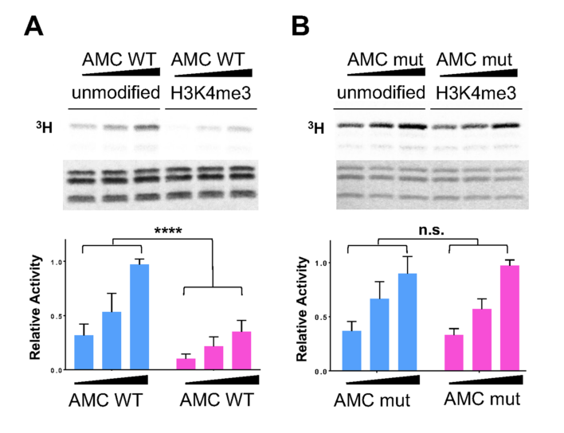

## Question

# Gene Research for Functional Annotation

## ⚠️ CRITICAL: Gene/Protein Identification Context

**BEFORE YOU BEGIN RESEARCH:** You MUST verify you are researching the CORRECT gene/protein. Gene symbols can be ambiguous, especially for less well-characterized genes from non-model organisms.

### Target Gene/Protein Identity (from UniProt):
- **UniProt Accession:** Q24572
- **Protein Description:** RecName: Full=Chromatin assembly factor 1 p55 subunit {ECO:0000303|PubMed:8887645, ECO:0000312|FlyBase:FBgn0263979}; Short=CAF-1 p55 subunit {ECO:0000303|PubMed:8887645}; AltName: Full=CAF-1 {ECO:0000303|PubMed:8887645}; AltName: Full=Nucleosome-remodeling factor 55 kDa subunit {ECO:0000303|PubMed:9419341}; Short=NURF-55 {ECO:0000303|PubMed:9419341};
- **Gene Information:** Name=Caf1-55 {ECO:0000312|FlyBase:FBgn0263979}; Synonyms=Caf1 {ECO:0000312|FlyBase:FBgn0263979}; ORFNames=CG4236 {ECO:0000312|FlyBase:FBgn0263979};
- **Organism (full):** Drosophila melanogaster (Fruit fly).
- **Protein Family:** Belongs to the WD repeat RBAP46/RBAP48/MSI1 family.
- **Key Domains:** Histone-bd_RBBP4-like_N. (IPR022052); WD40/YVTN_repeat-like_dom_sf. (IPR015943); WD40_PAC1. (IPR020472); WD40_repeat_CS. (IPR019775); WD40_repeat_dom_sf. (IPR036322)

### MANDATORY VERIFICATION STEPS:

1. **Check if the gene symbol "Caf1-55" matches the protein description above**
2. **Verify the organism is correct:** Drosophila melanogaster (Fruit fly).
3. **Check if protein family/domains align with what you find in literature**
4. **If you find literature for a DIFFERENT gene with the same or similar symbol, STOP**

### If Gene Symbol is Ambiguous or You Cannot Find Relevant Literature:

**DO NOT PROCEED WITH RESEARCH ON A DIFFERENT GENE.** Instead:
- State clearly: "The gene symbol 'Caf1-55' is ambiguous or literature is limited for this specific protein"
- Explain what you found (e.g., "Found extensive literature on a different gene with the same symbol in a different organism")
- Describe the protein based ONLY on the UniProt information provided above
- Suggest that the protein function can be inferred from domain/family information

### Research Target:

Please provide a comprehensive research report on the gene **Caf1-55** (gene ID: Caf1-55, UniProt: Q24572) in DROME.

The research report should be a detailed narrative explaining the function, biological processes, and localization of the gene product. Citations should be given for all claims.

You should prioritize authoritative reviews and primary scientific literature when conducting research. You can supplement
this with annotations you find in gene/protein databases, but these can be outdated or inaccurate.

We are specifically interested in the primary function of the gene - for enzymes, what reaction is catalyzed, and what is the substrate specificity? For transporters, what is the substrate? For structural proteins or adapters, what is the broader structural role? For signaling molecules, what is the role in the pathway.

We are interested in where in or outside the cell the gene product carries out its function.

We are also interested in the signaling or biochemical pathways in which the gene functions. We are less interested in broad pleiotropic effects, except where these elucidate the precise role.

Include evidence where possible. We are interested in both experimental evidence as well as inference from structure, evolution, or bioinformatic analysis. Precise studies should be prioritized over high-throughput, where available.

## Output

Question: You are an expert researcher providing comprehensive, well-cited information.

Provide detailed information focusing on:
1. Key concepts and definitions with current understanding
2. Recent developments and latest research (prioritize 2023-2024 sources)
3. Current applications and real-world implementations
4. Expert opinions and analysis from authoritative sources
5. Relevant statistics and data from recent studies

Format as a comprehensive research report with proper citations. Include URLs and publication dates where available.
Always prioritize recent, authoritative sources and provide specific citations for all major claims.

# Gene Research for Functional Annotation

## ⚠️ CRITICAL: Gene/Protein Identification Context

**BEFORE YOU BEGIN RESEARCH:** You MUST verify you are researching the CORRECT gene/protein. Gene symbols can be ambiguous, especially for less well-characterized genes from non-model organisms.

### Target Gene/Protein Identity (from UniProt):
- **UniProt Accession:** Q24572
- **Protein Description:** RecName: Full=Chromatin assembly factor 1 p55 subunit {ECO:0000303|PubMed:8887645, ECO:0000312|FlyBase:FBgn0263979}; Short=CAF-1 p55 subunit {ECO:0000303|PubMed:8887645}; AltName: Full=CAF-1 {ECO:0000303|PubMed:8887645}; AltName: Full=Nucleosome-remodeling factor 55 kDa subunit {ECO:0000303|PubMed:9419341}; Short=NURF-55 {ECO:0000303|PubMed:9419341};
- **Gene Information:** Name=Caf1-55 {ECO:0000312|FlyBase:FBgn0263979}; Synonyms=Caf1 {ECO:0000312|FlyBase:FBgn0263979}; ORFNames=CG4236 {ECO:0000312|FlyBase:FBgn0263979};
- **Organism (full):** Drosophila melanogaster (Fruit fly).
- **Protein Family:** Belongs to the WD repeat RBAP46/RBAP48/MSI1 family.
- **Key Domains:** Histone-bd_RBBP4-like_N. (IPR022052); WD40/YVTN_repeat-like_dom_sf. (IPR015943); WD40_PAC1. (IPR020472); WD40_repeat_CS. (IPR019775); WD40_repeat_dom_sf. (IPR036322)

### MANDATORY VERIFICATION STEPS:

1. **Check if the gene symbol "Caf1-55" matches the protein description above**
2. **Verify the organism is correct:** Drosophila melanogaster (Fruit fly).
3. **Check if protein family/domains align with what you find in literature**
4. **If you find literature for a DIFFERENT gene with the same or similar symbol, STOP**

### If Gene Symbol is Ambiguous or You Cannot Find Relevant Literature:

**DO NOT PROCEED WITH RESEARCH ON A DIFFERENT GENE.** Instead:
- State clearly: "The gene symbol 'Caf1-55' is ambiguous or literature is limited for this specific protein"
- Explain what you found (e.g., "Found extensive literature on a different gene with the same symbol in a different organism")
- Describe the protein based ONLY on the UniProt information provided above
- Suggest that the protein function can be inferred from domain/family information

### Research Target:

Please provide a comprehensive research report on the gene **Caf1-55** (gene ID: Caf1-55, UniProt: Q24572) in DROME.

The research report should be a detailed narrative explaining the function, biological processes, and localization of the gene product. Citations should be given for all claims.

You should prioritize authoritative reviews and primary scientific literature when conducting research. You can supplement
this with annotations you find in gene/protein databases, but these can be outdated or inaccurate.

We are specifically interested in the primary function of the gene - for enzymes, what reaction is catalyzed, and what is the substrate specificity? For transporters, what is the substrate? For structural proteins or adapters, what is the broader structural role? For signaling molecules, what is the role in the pathway.

We are interested in where in or outside the cell the gene product carries out its function.

We are also interested in the signaling or biochemical pathways in which the gene functions. We are less interested in broad pleiotropic effects, except where these elucidate the precise role.

Include evidence where possible. We are interested in both experimental evidence as well as inference from structure, evolution, or bioinformatic analysis. Precise studies should be prioritized over high-throughput, where available.

# Functional annotation report: *Drosophila melanogaster* Caf1-55 (UniProt Q24572)

## Identity and principal function

**Caf1-55 encodes p55, also called NURF-55:** a nuclear, WD40-repeat protein that helps assemble and position chromatin-regulatory complexes and recognizes histones or complex-specific partner proteins. It is **not itself an enzyme**. The UniProt accession Q24572 and gene identifier CG4236 are those specified for the target in the question. Independently, purification and sequencing of six peptides from *Drosophila* NURF-55 established that its sequence is identical to the previously characterized fly CAF-1 p55; sequence analysis identified seven WD repeats. This confirms that the CAF-1 p55 and NURF-55 literature concerns the requested fly protein, rather than an unrelated protein called CAF1. (martinezbalbas1998drosophilanurf55a pages 2-4, martinezbalbas1998drosophilanurf55a pages 1-1)

The seven-WD-repeat fold forms a β-propeller with functionally different interaction surfaces. Its **top surface recognizes the histone H3 N terminus**, preferentially when H3 lysine 4 is unmethylated. A **side pocket binds helix 1 of histone H4**, but also accepts partner-protein motifs, including those from SU(Z)12 and Ash1. Thus, describing Caf1-55 solely as an H4 chaperone misses its experimentally demonstrated role as a reusable protein-interaction scaffold and histone-mark sensor. Which surface is available depends on the complex: SU(Z)12 occupies the H4-binding site in PRC2, so H4 binding at that site cannot simply be assumed for PRC2-associated p55. (schmitges2011histonemethylationby pages 2-4, yoon2023caf1regulatesthe pages 3-6)

The following matrix distinguishes experimentally supported roles from functions attributable to other subunits of the same complexes.

| Context or complex | Molecular role and substrate/partner | Direct evidence and caveat | Key source |
|---|---|---|---|
| **Identity / architecture** | Nuclear, seven-WD-repeat β-propeller adaptor; binds histones and partner proteins through distinct surfaces | Peptide sequencing identified NURF-55 as the same *D. melanogaster* protein as CAF-1 p55; sequence analysis found seven WD repeats. This verifies the p55/NURF55/Caf1-55 identity rather than similarly named CAF1 proteins. (martinezbalbas1998drosophilanurf55a pages 4-5) | Martínez-Balbás et al., 1998; [10.1073/pnas.95.1.132](https://doi.org/10.1073/pnas.95.1.132) |
| **CAF-1** | Noncatalytic small subunit of replication-coupled chromatin assembly factor; interacts with p180 and p105/p75 in complexes that assemble chromatin on newly replicated DNA | Embryo co-immunoprecipitation and recombinant-subunit assays support p180–p105–p55 and probable p180–p75–p55 forms. Replication-coupled supercoiling assays directly established essential roles for p180 and p105, but did **not** establish p55 as the catalytic or indispensable deposition subunit. (tyler2001interactionbetweenthe pages 4-6) | Tyler et al., 2001; [10.1128/MCB.21.19.6574-6584.2001](https://doi.org/10.1128/MCB.21.19.6574-6584.2001) |
| **NURF** | Integral adaptor in the approximately 500-kDa ISWI ATP-dependent nucleosome-remodeling complex; supports transcription-factor-dependent local nucleosome disruption | p55 co-fractionated and co-immunoprecipitated with ISWI; p55 immunodepletion reduced GAGA-factor-dependent nucleosome disruption. Immunofluorescence placed p55 predominantly in nuclei and broadly on polytene chromosomes. p55 itself is not the ATPase—ISWI supplies that activity. (martinezbalbas1998drosophilanurf55a pages 4-5) | Martínez-Balbás et al., 1998; [10.1073/pnas.95.1.132](https://doi.org/10.1073/pnas.95.1.132) |
| **PRC2** | Noncatalytic histone/partner-recognition and substrate-engagement subunit; binds SU(Z)12 and unmodified H3, while E(Z) catalyzes H3K27 methylation | Recombinant PRC2 with greatly reduced NURF55 association retained H3K27 mono-, di-, and trimethylation, showing that p55 is dispensable for basal catalytic activity. Consistently, p55-null larvae and clones retained largely normal H3K27me2/3 and Polycomb repression; p55 should therefore not be annotated as the H3K27 methyltransferase or as universally required for PRC2 catalysis. (wen2012thebiologicalfunction pages 5-7, rai2013elementsofthe pages 9-10) | Wen et al., 2012; [10.1002/dvdy.23730](https://doi.org/10.1002/dvdy.23730). Rai et al., 2013; [10.1128/MCB.00307-13](https://doi.org/10.1128/MCB.00307-13) |
| **Ash1–Mrg15–Caf1 (AMC)** | Scaffold and histone-mark sensor regulating Ash1 H3K36 methyltransferase: the side H4 pocket binds Ash1, while the top pocket preferentially recognizes unmodified H3K4 | D362A/D365A abolished Ash1 binding; E235Q/D252K/E279Q abolished discrimination between unmodified and H3K4-methylated oligonucleosome arrays. The effect disappeared on mononucleosomes, supporting an internucleosomal mechanism. Ash1—not Caf1-55—is the catalytic methyltransferase. (yoon2023caf1regulatesthe pages 6-8) | Yoon & Song, 2023; [10.1186/s13072-023-00487-6](https://doi.org/10.1186/s13072-023-00487-6) |
| **dREAM / E2F repression** | Chromatin-associated corepressor/adaptor required at a subset of dE2F2–RBF-regulated promoters | p55 RNAi derepressed several D/E-group targets; ChIP detected p55 at regulated promoters, and HDAC inhibition generally did not reproduce the effect. Depletion of tested CAF-1, NURF and other p55-complex components did not phenocopy p55 depletion broadly, so the repression cannot simply be assigned to canonical CAF-1 or NURF. (taylorharding2004p55thedrosophila pages 7-8) | Taylor-Harding et al., 2004; [10.1128/MCB.24.20.9124-9136.2004](https://doi.org/10.1128/MCB.24.20.9124-9136.2004) |
| **DREAMer–dREAM feedback** | dREAM-associated component recruited to the *e2f1* promoter in salivary glands; participates in repression linked to endoreplication control | ChIP-qPCR showed reduced Caf1-55, E2f2, Myb and Mip130 occupancy at the *e2f1* promoter after DREAMer knockout; RIP and RNA pull-down recovered Caf1-55 with DREAMer-associated dREAM. Because no Caf1-55-specific perturbation established causality here, the result demonstrates complex association and recruitment rather than a uniquely assigned Caf1-55 mechanism. (li2024longnoncodingrna pages 6-8) | Li et al., 2024; [10.1126/sciadv.adr4936](https://doi.org/10.1126/sciadv.adr4936) |
| **Sperm chromatin / protamine transition** | No demonstrated requisite role for p55 in protamine-based chromatin assembly | p55 was not detectably chromatin-bound during spermatogenesis; p55 knockdown did not alter histone removal, Mst77F incorporation, or p180/p75 dynamics. Protamine-deposition functions mapped instead to p180 and p75, so p55 should **not** be annotated as a required protamine loader. (doyen2013subunitsofthe pages 3-4) | Doyen et al., 2013; [10.1016/j.celrep.2013.06.002](https://doi.org/10.1016/j.celrep.2013.06.002) |

*Table: Evidence matrix separating the verified nonenzymatic adaptor and histone-recognition roles of Drosophila Caf1-55 across chromatin complexes from functions attributable to catalytic partner subunits. It also highlights important negative and context-dependent findings.*

## Molecular mechanisms and pathways

**Replication-coupled chromatin assembly—CAF-1.** Drosophila embryo extracts contain a p180–p105–p55 CAF-1 complex; a p180–p75–p55 form is also supported, although its precise composition was inferred rather than directly isolated with a p75-specific reagent. p75 appears to derive from p105. CAF-1 assembles chromatin on newly replicated DNA, and purified-subunit assays established requirements for **p180 and p105** in the measured replication-coupled DNA-supercoiling reaction. Those results establish p55’s membership and interaction with CAF-1 partners, **not** that p55 alone deposits H3–H4 or is indispensable for the reaction in vivo. An independent fly genetic test found no detectable interaction between p55 and p180 in the assays performed; its definitive CAF-1-specific requirement remains unresolved. (tyler2001interactionbetweenthe pages 4-6, wen2012thebiologicalfunction pages 5-7)

**ATP-dependent nucleosome remodeling—NURF.** The approximately 500-kDa NURF complex contains p55 and the ATPase ISWI. p55 coimmunoprecipitated with ISWI, and depleting p55-containing material reduced NURF-dependent, GAGA-factor-mediated disruption of reconstituted nucleosomes. This directly connects p55 to local chromatin remodeling, while assigning ATP hydrolysis to **ISWI**, not to p55. Purified NURF was not itself a histone-acetyltransferase complex, despite separate H4-directed acetyltransferase activity associating with recombinant p55 in extracts. (martinezbalbas1998drosophilanurf55a pages 4-5, martinezbalbas1998drosophilanurf55a pages 1-1)

**Polycomb regulation—PRC2.** Caf1-55/NURF55 is a noncatalytic PRC2 component associated with SU(Z)12; **E(Z)** supplies the SET-domain activity that methylates histone H3 lysine 27. Structural and biochemical work showed that p55 binds the unmodified H3 N terminus and that H3K4 methylation progressively weakens this interaction. In reconstituted PRC2, an H3K4me3 substrate decreased catalytic turnover by about **eightfold** without substantially changing the measured peptide substrate affinity, consistent with regulation beyond simple substrate exclusion. A recombinant PRC2 preparation with greatly reduced NURF55 association nevertheless produced H3K27me1, me2 and me3: p55 is therefore **not an obligatory catalytic subunit**. (schmitges2011histonemethylationby pages 2-4, schmitges2011histonemethylationby pages 4-5, rai2013elementsofthe pages 9-10)

This biochemical role must be reconciled with fly genetics. Unlike E(Z)- or SU(Z)12-deficient controls, p55-null larvae and mutant follicle, germline and imaginal-disc cells retained largely normal measured H3K27me2/3; mutant follicle cells also lacked the ectopic *AbdB* expression observed in the SU(Z)12 control. These observations **do not support a general requirement for p55 in maintaining the assayed PRC2 methylation and Polycomb repression in vivo**. They do not rule out locus-, stage- or context-specific contributions. (wen2012thebiologicalfunction pages 5-7, wen2012thebiologicalfunction pages 7-9, rai2013elementsofthe pages 9-10)

**Ash1-dependent chromatin modification—2023 advance.** In the fly Ash1–Mrg15–Caf1 complex, abbreviated **AMC**, Ash1 is the H3K36 methyltransferase; Caf1-55 regulates its substrate response. Biochemical mapping identified an Ash1 Caf1-binding motif at residues **1582–1616**. Altering Caf1-55’s side-pocket residues **D362A/D365A** eliminated Ash1 binding, whereas altering its separate H3-binding surface did not. On oligonucleosome arrays, wild-type AMC showed lower H3K36 methylation activity when H3K4 was methylated; the Caf1 H3-pocket mutant **E235Q/D252K/E279Q** lost that discrimination. The difference was not observed with the tested mononucleosomes. These results support a model in which Caf1 reads unmodified H3 on one nucleosome while Ash1 modifies another; the **internucleosomal geometry remains a mechanistic interpretation**, not a directly imaged in-cell arrangement. The array assay used **n = 3** and reported **P < 0.0001** for the relevant comparison. The study discusses approximately **600 nM** binding to unmodified H3 peptide versus **>70 µM** for H3K4me3 as prior binding data, not as newly measured affinity constants for intact AMC. (yoon2023caf1regulatesthe pages 3-6, yoon2023caf1regulatesthe pages 6-8, yoon2023caf1regulatesthe media 51592314)

**E2F/RBF transcriptional repression and dREAM.** In fly SL2 cells, p55 depletion derepressed a subset of dE2F2/RBF-regulated genes; chromatin immunoprecipitation detected p55 at affected promoters, and p55 coimmunoprecipitated with RBF proteins. Depleting tested CAF-1, NURF and several other p55-associated complex components generally did **not** reproduce the E-group response, so this phenotype should not be attributed automatically to replication-coupled CAF-1 or ISWI/NURF. Histone deacetylase depletion or inhibition likewise did not generally relieve repression of representative E-group genes. (taylorharding2004p55thedrosophila pages 7-8, taylorharding2004p55thedrosophila pages 8-10, taylorharding2004p55thedrosophila pages 10-11)

A **2024** study refined the developmental setting for a Caf1-55-containing dREAM assembly. In larval salivary glands, ChIP-qPCR detected Caf1-55, E2f2, Myb and Mip130 at the *e2f1* promoter; occupancy of all four declined after loss of the long noncoding RNA **DREAMer**. DREAMer-associated complexes also contained Caf1-55 in RNA-immunoprecipitation and pull-down experiments. DREAMer loss increased *e2f1* transcription and downstream *cycE* and *PCNA* expression, accompanying enhanced endoreplication. Importantly, occupancy at several other assayed dREAM target promoters did **not** decline: the recruitment effect was promoter-specific. The study establishes Caf1-55’s **presence and recruitment in the complex**, but does not independently prove that loss of Caf1-55 causes the DREAMer phenotype. (li2024longnoncodingrna pages 6-8, li2024longnoncodingrna pages 8-10, li2024longnoncodingrna pages 10-12)

## Cellular location and organismal evidence

**Principal site of action: the nucleus and nuclear chromatin.** Fly-cell immunofluorescence localized p55 predominantly to nuclei; staining of salivary-gland polytene chromosomes showed broad chromosomal association. The later genetic study likewise reported predominantly nuclear signal in both somatic and germline cells. Promoter ChIP provides locus-specific evidence for chromatin association. The retrieved experiments provide no comparable evidence for an extracellular or membrane-associated primary function. (martinezbalbas1998drosophilanurf55a pages 4-5, wen2012thebiologicalfunction pages 4-5, li2024longnoncodingrna pages 6-8)

Two independently generated p55-null fly alleles caused severe developmental delay and lethality **before pupariation**. A genomic wild-type transgene rescued survival at approximately **105% of the expected mutant class** in the reported assay, supporting assignment of the phenotype to p55. Follicle-cell mutant clones displayed TUNEL-positive death; wing and eye mutant clones were reduced or absent, indicating requirements for cell survival and proliferation. In one germline-stem-cell experiment, marked p55-null clones were found in **26.7% of germaria at day 4** after clone induction but only **1.8% at day 11**; the corresponding rescued genotype retained clones in **26.7% at day 11**. These are clone-retention frequencies, **not** direct measurements of a nucleosome-deposition rate or a single identified enzymatic pathway. (wen2012thebiologicalfunction pages 2-4, wen2012thebiologicalfunction pages 4-5, wen2012thebiologicalfunction pages 1-2)

A genomic p55 transgene carrying **D362A/D365A** substitutions rescued approximately **33%** of the expected mutant animals; survivors were fertile and could be maintained as a stock. This demonstrates that the disrupted H4/partner-binding surface is **not absolutely necessary for survival under the tested conditions**, although the lower rescue efficiency means it is not equivalent to wild type. Because this surface also binds Ash1 and SU(Z)12, the rescue experiment cannot by itself isolate an exclusively H4-specific physiological function. (wen2012thebiologicalfunction pages 5-7, yoon2023caf1regulatesthe pages 3-6)

A useful boundary on annotation comes from spermatogenesis: although other CAF-1-associated subunits participate in sperm chromatin remodeling, p55 was not detectably chromatin-associated in that assay, and p55 knockdown did not disrupt the assayed histone removal or Mst77F incorporation. It would therefore be misleading to call Caf1-55 an experimentally established protamine-loading factor. (doyen2013subunitsofthe pages 3-4)

## Assessment and applications

The **highest-confidence functional annotation** is: *a predominantly nuclear, noncatalytic WD40 β-propeller adaptor and histone-recognition protein shared among chromatin assembly, nucleosome-remodeling, chromatin-modifying and transcriptional-regulatory complexes*. Its experimentally resolved specificity includes preference for **unmodified H3K4** at the H3-binding surface and recognition of **H4 helix 1 or competing protein motifs** at the side surface. Its effects on ATP-dependent remodeling, H3K27 methylation or H3K36 methylation arise through the particular complex; the corresponding catalytic proteins are ISWI, E(Z) and Ash1, respectively. Fly-null lethality establishes biological importance without identifying which one complex accounts for every essential phenotype. (schmitges2011histonemethylationby pages 2-4, yoon2023caf1regulatesthe pages 3-6, yoon2023caf1regulatesthe pages 6-8, martinezbalbas1998drosophilanurf55a pages 1-1, wen2012thebiologicalfunction pages 2-4)

For practical research, purified Caf1-55 and targeted pocket mutants enable tests of histone recognition and partner competition; genomic rescue, chromatin assays and promoter ChIP can distinguish complex membership from requirement at a particular developmental locus. These are **research uses of a fly chromatin protein**, not evidence of a clinical use or approved therapeutic application. The 2023 AMC study is the clearest recent pocket-specific biochemical advance, while the 2024 DREAMer study extends observed promoter recruitment into a developmental endocycle model. (yoon2023caf1regulatesthe pages 3-6, yoon2023caf1regulatesthe pages 6-8, li2024longnoncodingrna pages 6-8, wen2012thebiologicalfunction pages 5-7)

### Selected primary sources and publication dates

- Martínez-Balbás *et al.*, **January 1998**, protein identity, NURF biochemistry and localization: https://doi.org/10.1073/pnas.95.1.132. (martinezbalbas1998drosophilanurf55a pages 2-4, martinezbalbas1998drosophilanurf55a pages 4-5)
- Tyler *et al.*, **October 2001**, CAF-1 subunit interactions and replication-coupled assembly assays: https://doi.org/10.1128/MCB.21.19.6574-6584.2001. (tyler2001interactionbetweenthe pages 4-6)
- Taylor-Harding *et al.*, **October 2004**, p55-dependent dE2F2/RBF repression: https://doi.org/10.1128/MCB.24.20.9124-9136.2004. (taylorharding2004p55thedrosophila pages 7-8, taylorharding2004p55thedrosophila pages 8-10)
- Schmitges *et al.*, **May 2011**, NURF55/H3 recognition and PRC2 regulation: https://doi.org/10.1016/j.molcel.2011.03.025. (schmitges2011histonemethylationby pages 2-4, schmitges2011histonemethylationby pages 4-5)
- Wen *et al.*, **March 2012**, fly null alleles, rescue and PRC2-output tests: https://doi.org/10.1002/dvdy.23730. (wen2012thebiologicalfunction pages 4-5, wen2012thebiologicalfunction pages 5-7)
- Rai *et al.*, **December 2013**, recombinant PRC2 with diminished NURF55 association: https://doi.org/10.1128/MCB.00307-13. (rai2013elementsofthe pages 9-10)
- Yoon and Song, **April 2023**, Ash1–Mrg15–Caf1 interaction and histone-mark sensing: https://doi.org/10.1186/s13072-023-00487-6. (yoon2023caf1regulatesthe pages 3-6, yoon2023caf1regulatesthe pages 6-8)
- Li *et al.*, **8 November 2024**, DREAMer-dependent dREAM promoter recruitment: https://doi.org/10.1126/sciadv.adr4936. (li2024longnoncodingrna pages 6-8)

References

1. (martinezbalbas1998drosophilanurf55a pages 2-4): Marian A. Martínez-Balbás, Toshio Tsukiyama, David Gdula, and Carl Wu. Drosophila nurf-55, a wd repeat protein involved in histone metabolism. Proceedings of the National Academy of Sciences of the United States of America, 95 1:132-7, Jan 1998. URL: https://doi.org/10.1073/pnas.95.1.132, doi:10.1073/pnas.95.1.132. This article has 224 citations and is from a highest quality peer-reviewed journal.

2. (martinezbalbas1998drosophilanurf55a pages 1-1): Marian A. Martínez-Balbás, Toshio Tsukiyama, David Gdula, and Carl Wu. Drosophila nurf-55, a wd repeat protein involved in histone metabolism. Proceedings of the National Academy of Sciences of the United States of America, 95 1:132-7, Jan 1998. URL: https://doi.org/10.1073/pnas.95.1.132, doi:10.1073/pnas.95.1.132. This article has 224 citations and is from a highest quality peer-reviewed journal.

3. (schmitges2011histonemethylationby pages 2-4): Frank W. Schmitges, Archana B. Prusty, Mahamadou Faty, Alexandra Stützer, Gondichatnahalli M. Lingaraju, Jonathan Aiwazian, Ragna Sack, Daniel Hess, Ling Li, Shaolian Zhou, Richard D. Bunker, Urs Wirth, Tewis Bouwmeester, Andreas Bauer, Nga Ly-Hartig, Kehao Zhao, Homan Chan, Justin Gu, Heinz Gut, Wolfgang Fischle, Jürg Müller, and Nicolas H. Thomä. Histone methylation by prc2 is inhibited by active chromatin marks. Molecular cell, 42 3:330-41, May 2011. URL: https://doi.org/10.1016/j.molcel.2011.03.025, doi:10.1016/j.molcel.2011.03.025. This article has 919 citations and is from a highest quality peer-reviewed journal.

4. (yoon2023caf1regulatesthe pages 3-6): Eojin Yoon and Ji-Joon Song. Caf1 regulates the histone methyltransferase activity of ash1 by sensing unmodified histone h3. Epigenetics & Chromatin, Apr 2023. URL: https://doi.org/10.1186/s13072-023-00487-6, doi:10.1186/s13072-023-00487-6. This article has 2 citations and is from a peer-reviewed journal.

5. (martinezbalbas1998drosophilanurf55a pages 4-5): Marian A. Martínez-Balbás, Toshio Tsukiyama, David Gdula, and Carl Wu. Drosophila nurf-55, a wd repeat protein involved in histone metabolism. Proceedings of the National Academy of Sciences of the United States of America, 95 1:132-7, Jan 1998. URL: https://doi.org/10.1073/pnas.95.1.132, doi:10.1073/pnas.95.1.132. This article has 224 citations and is from a highest quality peer-reviewed journal.

6. (tyler2001interactionbetweenthe pages 4-6): Jessica K. Tyler, Kimberly A. Collins, Jayashree Prasad-Sinha, Elizabeth Amiott, Michael Bulger, Peter J. Harte, Ryuji Kobayashi, and James T. Kadonaga. Interaction between the drosophilacaf-1 and asf1 chromatin assembly factors. Molecular and Cellular Biology, 21:6574-6584, Oct 2001. URL: https://doi.org/10.1128/mcb.21.19.6574-6584.2001, doi:10.1128/mcb.21.19.6574-6584.2001. This article has 308 citations and is from a domain leading peer-reviewed journal.

7. (wen2012thebiologicalfunction pages 5-7): Pei Wen, Zhenghui Quan, and Rongwen Xi. The biological function of the wd40 repeat‐containing protein p55/caf1 in drosophila. Developmental Dynamics, 241:455-464, Mar 2012. URL: https://doi.org/10.1002/dvdy.23730, doi:10.1002/dvdy.23730. This article has 41 citations and is from a peer-reviewed journal.

8. (rai2013elementsofthe pages 9-10): Aswathy N. Rai, Marcus L. Vargas, Liangjun Wang, Erica F. Andersen, Ellen L. Miller, and Jeffrey A. Simon. Elements of the polycomb repressor su(z)12 needed for histone h3-k27 methylation, the interface with e(z), and <i>in vivo</i> function. Molecular and Cellular Biology, 33:4844-4856, Dec 2013. URL: https://doi.org/10.1128/mcb.00307-13, doi:10.1128/mcb.00307-13. This article has 41 citations and is from a domain leading peer-reviewed journal.

9. (yoon2023caf1regulatesthe pages 6-8): Eojin Yoon and Ji-Joon Song. Caf1 regulates the histone methyltransferase activity of ash1 by sensing unmodified histone h3. Epigenetics & Chromatin, Apr 2023. URL: https://doi.org/10.1186/s13072-023-00487-6, doi:10.1186/s13072-023-00487-6. This article has 2 citations and is from a peer-reviewed journal.

10. (taylorharding2004p55thedrosophila pages 7-8): Barbie Taylor-Harding, Ulrich K. Binné, Michael Korenjak, Alexander Brehm, and Nicholas J. Dyson. P55, the drosophila ortholog of rbap46/rbap48, is required for the repression of de2f2/rbf-regulated genes. Molecular and Cellular Biology, 24:9124-9136, Oct 2004. URL: https://doi.org/10.1128/mcb.24.20.9124-9136.2004, doi:10.1128/mcb.24.20.9124-9136.2004. This article has 77 citations and is from a domain leading peer-reviewed journal.

11. (li2024longnoncodingrna pages 6-8): Dong Li, Tianyu Jin, Jun Liu, Chunlin Lu, Xianmei Yang, Haiyan Zhang, Limin Bi, Yuhang Yan, Lijiao Zhang, Yan Sang, Bilian Jin, and Xiaolin Bi. Long noncoding rna dreamer bridges the dream complex and e2f1 to regulate endoreplication in drosophila. Science Advances, Nov 2024. URL: https://doi.org/10.1126/sciadv.adr4936, doi:10.1126/sciadv.adr4936. This article has 2 citations and is from a highest quality peer-reviewed journal.

12. (doyen2013subunitsofthe pages 3-4): Cécile M. Doyen, Yuri M. Moshkin, Gillian E. Chalkley, Karel Bezstarosti, Jeroen A.A. Demmers, Christina Rathke, Renate Renkawitz-Pohl, and C. Peter Verrijzer. Subunits of the histone chaperone caf1 also mediate assembly of protamine-based chromatin. Cell reports, 4 1:59-65, Jul 2013. URL: https://doi.org/10.1016/j.celrep.2013.06.002, doi:10.1016/j.celrep.2013.06.002. This article has 42 citations and is from a highest quality peer-reviewed journal.

13. (schmitges2011histonemethylationby pages 4-5): Frank W. Schmitges, Archana B. Prusty, Mahamadou Faty, Alexandra Stützer, Gondichatnahalli M. Lingaraju, Jonathan Aiwazian, Ragna Sack, Daniel Hess, Ling Li, Shaolian Zhou, Richard D. Bunker, Urs Wirth, Tewis Bouwmeester, Andreas Bauer, Nga Ly-Hartig, Kehao Zhao, Homan Chan, Justin Gu, Heinz Gut, Wolfgang Fischle, Jürg Müller, and Nicolas H. Thomä. Histone methylation by prc2 is inhibited by active chromatin marks. Molecular cell, 42 3:330-41, May 2011. URL: https://doi.org/10.1016/j.molcel.2011.03.025, doi:10.1016/j.molcel.2011.03.025. This article has 919 citations and is from a highest quality peer-reviewed journal.

14. (wen2012thebiologicalfunction pages 7-9): Pei Wen, Zhenghui Quan, and Rongwen Xi. The biological function of the wd40 repeat‐containing protein p55/caf1 in drosophila. Developmental Dynamics, 241:455-464, Mar 2012. URL: https://doi.org/10.1002/dvdy.23730, doi:10.1002/dvdy.23730. This article has 41 citations and is from a peer-reviewed journal.

15. (yoon2023caf1regulatesthe media 51592314): Eojin Yoon and Ji-Joon Song. Caf1 regulates the histone methyltransferase activity of ash1 by sensing unmodified histone h3. Epigenetics & Chromatin, Apr 2023. URL: https://doi.org/10.1186/s13072-023-00487-6, doi:10.1186/s13072-023-00487-6. This article has 2 citations and is from a peer-reviewed journal.

16. (taylorharding2004p55thedrosophila pages 8-10): Barbie Taylor-Harding, Ulrich K. Binné, Michael Korenjak, Alexander Brehm, and Nicholas J. Dyson. P55, the drosophila ortholog of rbap46/rbap48, is required for the repression of de2f2/rbf-regulated genes. Molecular and Cellular Biology, 24:9124-9136, Oct 2004. URL: https://doi.org/10.1128/mcb.24.20.9124-9136.2004, doi:10.1128/mcb.24.20.9124-9136.2004. This article has 77 citations and is from a domain leading peer-reviewed journal.

17. (taylorharding2004p55thedrosophila pages 10-11): Barbie Taylor-Harding, Ulrich K. Binné, Michael Korenjak, Alexander Brehm, and Nicholas J. Dyson. P55, the drosophila ortholog of rbap46/rbap48, is required for the repression of de2f2/rbf-regulated genes. Molecular and Cellular Biology, 24:9124-9136, Oct 2004. URL: https://doi.org/10.1128/mcb.24.20.9124-9136.2004, doi:10.1128/mcb.24.20.9124-9136.2004. This article has 77 citations and is from a domain leading peer-reviewed journal.

18. (li2024longnoncodingrna pages 8-10): Dong Li, Tianyu Jin, Jun Liu, Chunlin Lu, Xianmei Yang, Haiyan Zhang, Limin Bi, Yuhang Yan, Lijiao Zhang, Yan Sang, Bilian Jin, and Xiaolin Bi. Long noncoding rna dreamer bridges the dream complex and e2f1 to regulate endoreplication in drosophila. Science Advances, Nov 2024. URL: https://doi.org/10.1126/sciadv.adr4936, doi:10.1126/sciadv.adr4936. This article has 2 citations and is from a highest quality peer-reviewed journal.

19. (li2024longnoncodingrna pages 10-12): Dong Li, Tianyu Jin, Jun Liu, Chunlin Lu, Xianmei Yang, Haiyan Zhang, Limin Bi, Yuhang Yan, Lijiao Zhang, Yan Sang, Bilian Jin, and Xiaolin Bi. Long noncoding rna dreamer bridges the dream complex and e2f1 to regulate endoreplication in drosophila. Science Advances, Nov 2024. URL: https://doi.org/10.1126/sciadv.adr4936, doi:10.1126/sciadv.adr4936. This article has 2 citations and is from a highest quality peer-reviewed journal.

20. (wen2012thebiologicalfunction pages 4-5): Pei Wen, Zhenghui Quan, and Rongwen Xi. The biological function of the wd40 repeat‐containing protein p55/caf1 in drosophila. Developmental Dynamics, 241:455-464, Mar 2012. URL: https://doi.org/10.1002/dvdy.23730, doi:10.1002/dvdy.23730. This article has 41 citations and is from a peer-reviewed journal.

21. (wen2012thebiologicalfunction pages 2-4): Pei Wen, Zhenghui Quan, and Rongwen Xi. The biological function of the wd40 repeat‐containing protein p55/caf1 in drosophila. Developmental Dynamics, 241:455-464, Mar 2012. URL: https://doi.org/10.1002/dvdy.23730, doi:10.1002/dvdy.23730. This article has 41 citations and is from a peer-reviewed journal.

22. (wen2012thebiologicalfunction pages 1-2): Pei Wen, Zhenghui Quan, and Rongwen Xi. The biological function of the wd40 repeat‐containing protein p55/caf1 in drosophila. Developmental Dynamics, 241:455-464, Mar 2012. URL: https://doi.org/10.1002/dvdy.23730, doi:10.1002/dvdy.23730. This article has 41 citations and is from a peer-reviewed journal.

## Artifacts

- [Edison artifact artifact-00](Caf1-55-deep-research-falcon_artifacts/artifact-00.md)

## Citations

1. tyler2001interactionbetweenthe pages 4-6
2. li2024longnoncodingrna pages 6-8
3. doyen2013subunitsofthe pages 3-4
4. rai2013elementsofthe pages 9-10
5. schmitges2011histonemethylationby pages 2-4
6. wen2012thebiologicalfunction pages 5-7
7. schmitges2011histonemethylationby pages 4-5
8. wen2012thebiologicalfunction pages 7-9
9. li2024longnoncodingrna pages 8-10
10. li2024longnoncodingrna pages 10-12
11. wen2012thebiologicalfunction pages 4-5
12. wen2012thebiologicalfunction pages 2-4
13. wen2012thebiologicalfunction pages 1-2
14. 10.1073/pnas.95.1.132
15. 10.1128/MCB.21.19.6574-6584.2001
16. 10.1002/dvdy.23730
17. 10.1128/MCB.00307-13
18. 10.1186/s13072-023-00487-6
19. 10.1128/MCB.24.20.9124-9136.2004
20. 10.1126/sciadv.adr4936
21. 10.1016/j.celrep.2013.06.002
22. https://doi.org/10.1073/pnas.95.1.132
23. https://doi.org/10.1128/MCB.21.19.6574-6584.2001
24. https://doi.org/10.1002/dvdy.23730
25. https://doi.org/10.1128/MCB.00307-13
26. https://doi.org/10.1186/s13072-023-00487-6
27. https://doi.org/10.1128/MCB.24.20.9124-9136.2004
28. https://doi.org/10.1126/sciadv.adr4936
29. https://doi.org/10.1016/j.celrep.2013.06.002
30. https://doi.org/10.1073/pnas.95.1.132.
31. https://doi.org/10.1128/MCB.21.19.6574-6584.2001.
32. https://doi.org/10.1128/MCB.24.20.9124-9136.2004.
33. https://doi.org/10.1016/j.molcel.2011.03.025.
34. https://doi.org/10.1002/dvdy.23730.
35. https://doi.org/10.1128/MCB.00307-13.
36. https://doi.org/10.1186/s13072-023-00487-6.
37. https://doi.org/10.1126/sciadv.adr4936.
38. https://doi.org/10.1073/pnas.95.1.132,
39. https://doi.org/10.1016/j.molcel.2011.03.025,
40. https://doi.org/10.1186/s13072-023-00487-6,
41. https://doi.org/10.1128/mcb.21.19.6574-6584.2001,
42. https://doi.org/10.1002/dvdy.23730,
43. https://doi.org/10.1128/mcb.00307-13,
44. https://doi.org/10.1128/mcb.24.20.9124-9136.2004,
45. https://doi.org/10.1126/sciadv.adr4936,
46. https://doi.org/10.1016/j.celrep.2013.06.002,