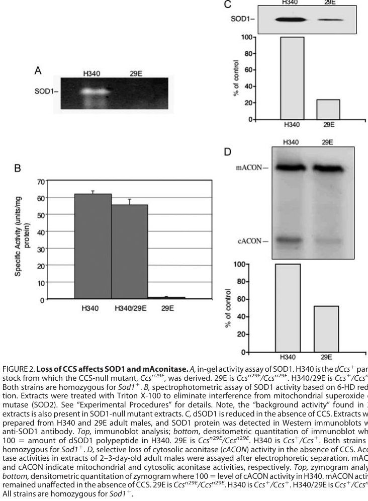

## Question

# Gene Research for Functional Annotation

## ⚠️ CRITICAL: Gene/Protein Identification Context

**BEFORE YOU BEGIN RESEARCH:** You MUST verify you are researching the CORRECT gene/protein. Gene symbols can be ambiguous, especially for less well-characterized genes from non-model organisms.

### Target Gene/Protein Identity (from UniProt):
- **UniProt Accession:** A1Z850
- **Protein Description:** RecName: Full=Superoxide dismutase [Cu-Zn] {ECO:0000256|RuleBase:RU000393}; EC=1.15.1.1 {ECO:0000256|RuleBase:RU000393};
- **Gene Information:** Name=Ccs {ECO:0000313|EMBL:AAF58838.2, ECO:0000313|FlyBase:FBgn0010531}; Synonyms=anon-EST:Posey231 {ECO:0000313|EMBL:AAF58838.2}, CCD {ECO:0000313|EMBL:AAF58838.2}, CCS {ECO:0000313|EMBL:AAF58838.2}, CG-17753 {ECO:0000313|EMBL:AAF58838.2}, dCCS {ECO:0000313|EMBL:AAF58838.2}, DmCCS {ECO:0000313|EMBL:AAF58838.2}, Dmel\CG17753 {ECO:0000313|EMBL:AAF58838.2}, l(2)03221 {ECO:0000313|EMBL:AAF58838.2}; ORFNames=CG17753 {ECO:0000313|EMBL:AAF58838.2, ECO:0000313|FlyBase:FBgn0010531}, Dmel_CG17753 {ECO:0000313|EMBL:AAF58838.2};
- **Organism (full):** Drosophila melanogaster (Fruit fly).
- **Protein Family:** Belongs to the Cu-Zn superoxide dismutase family.
- **Key Domains:** SOD-like_Cu/Zn_dom_sf. (IPR036423); SOD_Cu/Zn_/chaperone. (IPR024134); SOD_Cu/Zn_BS. (IPR018152); SOD_Cu_Zn_dom. (IPR001424); Sod_Cu (PF00080)

### MANDATORY VERIFICATION STEPS:

1. **Check if the gene symbol "Ccs" matches the protein description above**
2. **Verify the organism is correct:** Drosophila melanogaster (Fruit fly).
3. **Check if protein family/domains align with what you find in literature**
4. **If you find literature for a DIFFERENT gene with the same or similar symbol, STOP**

### If Gene Symbol is Ambiguous or You Cannot Find Relevant Literature:

**DO NOT PROCEED WITH RESEARCH ON A DIFFERENT GENE.** Instead:
- State clearly: "The gene symbol 'Ccs' is ambiguous or literature is limited for this specific protein"
- Explain what you found (e.g., "Found extensive literature on a different gene with the same symbol in a different organism")
- Describe the protein based ONLY on the UniProt information provided above
- Suggest that the protein function can be inferred from domain/family information

### Research Target:

Please provide a comprehensive research report on the gene **Ccs** (gene ID: Ccs, UniProt: A1Z850) in DROME.

The research report should be a detailed narrative explaining the function, biological processes, and localization of the gene product. Citations should be given for all claims.

You should prioritize authoritative reviews and primary scientific literature when conducting research. You can supplement
this with annotations you find in gene/protein databases, but these can be outdated or inaccurate.

We are specifically interested in the primary function of the gene - for enzymes, what reaction is catalyzed, and what is the substrate specificity? For transporters, what is the substrate? For structural proteins or adapters, what is the broader structural role? For signaling molecules, what is the role in the pathway.

We are interested in where in or outside the cell the gene product carries out its function.

We are also interested in the signaling or biochemical pathways in which the gene functions. We are less interested in broad pleiotropic effects, except where these elucidate the precise role.

Include evidence where possible. We are interested in both experimental evidence as well as inference from structure, evolution, or bioinformatic analysis. Precise studies should be prioritized over high-throughput, where available.

## Output

Question: You are an expert researcher providing comprehensive, well-cited information.

Provide detailed information focusing on:
1. Key concepts and definitions with current understanding
2. Recent developments and latest research (prioritize 2023-2024 sources)
3. Current applications and real-world implementations
4. Expert opinions and analysis from authoritative sources
5. Relevant statistics and data from recent studies

Format as a comprehensive research report with proper citations. Include URLs and publication dates where available.
Always prioritize recent, authoritative sources and provide specific citations for all major claims.

# Gene Research for Functional Annotation

## ⚠️ CRITICAL: Gene/Protein Identification Context

**BEFORE YOU BEGIN RESEARCH:** You MUST verify you are researching the CORRECT gene/protein. Gene symbols can be ambiguous, especially for less well-characterized genes from non-model organisms.

### Target Gene/Protein Identity (from UniProt):
- **UniProt Accession:** A1Z850
- **Protein Description:** RecName: Full=Superoxide dismutase [Cu-Zn] {ECO:0000256|RuleBase:RU000393}; EC=1.15.1.1 {ECO:0000256|RuleBase:RU000393};
- **Gene Information:** Name=Ccs {ECO:0000313|EMBL:AAF58838.2, ECO:0000313|FlyBase:FBgn0010531}; Synonyms=anon-EST:Posey231 {ECO:0000313|EMBL:AAF58838.2}, CCD {ECO:0000313|EMBL:AAF58838.2}, CCS {ECO:0000313|EMBL:AAF58838.2}, CG-17753 {ECO:0000313|EMBL:AAF58838.2}, dCCS {ECO:0000313|EMBL:AAF58838.2}, DmCCS {ECO:0000313|EMBL:AAF58838.2}, Dmel\CG17753 {ECO:0000313|EMBL:AAF58838.2}, l(2)03221 {ECO:0000313|EMBL:AAF58838.2}; ORFNames=CG17753 {ECO:0000313|EMBL:AAF58838.2, ECO:0000313|FlyBase:FBgn0010531}, Dmel_CG17753 {ECO:0000313|EMBL:AAF58838.2};
- **Organism (full):** Drosophila melanogaster (Fruit fly).
- **Protein Family:** Belongs to the Cu-Zn superoxide dismutase family.
- **Key Domains:** SOD-like_Cu/Zn_dom_sf. (IPR036423); SOD_Cu/Zn_/chaperone. (IPR024134); SOD_Cu/Zn_BS. (IPR018152); SOD_Cu_Zn_dom. (IPR001424); Sod_Cu (PF00080)

### MANDATORY VERIFICATION STEPS:

1. **Check if the gene symbol "Ccs" matches the protein description above**
2. **Verify the organism is correct:** Drosophila melanogaster (Fruit fly).
3. **Check if protein family/domains align with what you find in literature**
4. **If you find literature for a DIFFERENT gene with the same or similar symbol, STOP**

### If Gene Symbol is Ambiguous or You Cannot Find Relevant Literature:

**DO NOT PROCEED WITH RESEARCH ON A DIFFERENT GENE.** Instead:
- State clearly: "The gene symbol 'Ccs' is ambiguous or literature is limited for this specific protein"
- Explain what you found (e.g., "Found extensive literature on a different gene with the same symbol in a different organism")
- Describe the protein based ONLY on the UniProt information provided above
- Suggest that the protein function can be inferred from domain/family information

### Research Target:

Please provide a comprehensive research report on the gene **Ccs** (gene ID: Ccs, UniProt: A1Z850) in DROME.

The research report should be a detailed narrative explaining the function, biological processes, and localization of the gene product. Citations should be given for all claims.

You should prioritize authoritative reviews and primary scientific literature when conducting research. You can supplement
this with annotations you find in gene/protein databases, but these can be outdated or inaccurate.

We are specifically interested in the primary function of the gene - for enzymes, what reaction is catalyzed, and what is the substrate specificity? For transporters, what is the substrate? For structural proteins or adapters, what is the broader structural role? For signaling molecules, what is the role in the pathway.

We are interested in where in or outside the cell the gene product carries out its function.

We are also interested in the signaling or biochemical pathways in which the gene functions. We are less interested in broad pleiotropic effects, except where these elucidate the precise role.

Include evidence where possible. We are interested in both experimental evidence as well as inference from structure, evolution, or bioinformatic analysis. Precise studies should be prioritized over high-throughput, where available.

# Research Report: Functional Annotation of **Ccs** (CG17753; UniProt A1Z850) in *Drosophila melanogaster*

## 1. Gene/protein identity verification and disambiguation
The *Drosophila melanogaster* gene **Ccs** is explicitly identified in primary Drosophila literature as **CG17753** (FlyBase FBgn0010531) and encodes the **copper chaperone for Cu,Zn superoxide dismutase (SOD1)** (kirby2008instabilityofsuperoxide pages 4-5, kirby2008instabilityofsuperoxide pages 1-2). The defining functional connection is that **Ccs loss causes loss of SOD1 activity/protein and oxidative-stress phenotypes**, consistent with a CCS ortholog rather than unrelated “CCS” symbols used in other organisms/contexts (kirby2008instabilityofsuperoxide pages 1-2, kirby2008instabilityofsuperoxide pages 5-6).

## 2. Key concepts and definitions (current understanding)
### 2.1 CCS as a metallochaperone
CCS proteins are **metallochaperones** that support metal cofactor delivery to specific targets; in this case CCS delivers copper to **SOD1** and facilitates acquisition of the mature, active enzyme state (rae2001mechanismofcuznsuperoxide pages 1-2, rae2001mechanismofcuznsuperoxide pages 2-3). In *Drosophila*, Ccs is experimentally supported to have a highly specialized role: **“to mediate the activation of apo-SOD1 by copper”** (kirby2008instabilityofsuperoxide pages 7-8).

### 2.2 CCS-mediated SOD1 maturation: copper insertion and disulfide formation
A widely supported mechanistic model (from highly cited reviews and biochemical studies in other systems) is that CCS promotes **both copper insertion and formation of the SOD1 intramolecular disulfide**, via **transient CCS–SOD1 interactions including an intermolecular disulfide intermediate** (kawamata2010importmaturationand pages 1-3, ge2019exploringtheextended pages 1-2). This framework is consistent with Drosophila experimental results showing that CCS-dependent processes are required for stable/active endogenous dSOD1 (kirby2008instabilityofsuperoxide pages 1-2, kirby2008instabilityofsuperoxide pages 6-6).

### 2.3 CCS domain architecture and copper-binding motifs
Canonical CCS proteins are described as having three functional regions: an N-terminal ATX1-like copper-binding domain, a central SOD1-like docking domain, and a C-terminal copper-binding/activation domain with conserved cysteines (rae2001mechanismofcuznsuperoxide pages 2-3, kirby2008instabilityofsuperoxide pages 1-2). A Drosophila-specific feature highlighted experimentally is that **Drosophila CCS lacks the canonical domain I MXCXXC copper-binding motif**, yet remains capable of supporting SOD1 activation—implying domain III and docking interactions are central and that copper-acquisition strategies differ among taxa (kirby2008instabilityofsuperoxide pages 4-5, kirby2008instabilityofsuperoxide pages 7-8).

## 3. Molecular function and pathway placement (Drosophila-focused)
### 3.1 Primary molecular function (supported in Drosophila)
The primary function of Drosophila Ccs is **post-translational activation and stabilization of cytosolic Cu,Zn-SOD1 (dSOD1)**, via copper delivery and associated maturation chemistry; in CCS-null flies, SOD1 activity becomes essentially undetectable and dSOD1 protein is strongly reduced (kirby2008instabilityofsuperoxide pages 1-2, kirby2008instabilityofsuperoxide pages 5-6).

### 3.2 Pathway context: copper handling → CCS → SOD1 → oxidative-stress defense
Drosophila Ccs sits in the cellular copper utilization pathway specifically feeding the **SOD1-dependent oxidative-stress defense module** (kirby2008instabilityofsuperoxide pages 1-2, kirby2008instabilityofsuperoxide pages 7-8). Loss of Ccs decreases cytosolic protection against oxidative stressors (e.g., paraquat), consistent with reduced mature SOD1 function (kirby2008instabilityofsuperoxide pages 7-8).

### 3.3 CCS-independent SOD1 activation (important nuance)
Although CCS is the principal SOD1 chaperone, both Drosophila and other metazoans exhibit **partial CCS-independent SOD1 activation routes**, often discussed as glutathione-linked in broader literature (kirby2008instabilityofsuperoxide pages 2-3, mercer2016reducedglutathionebiosynthesis pages 1-2). In Drosophila specifically, Kirby et al. report that CCS-null phenotypes are milder than SOD1-null phenotypes in baseline conditions, consistent with **a vanishingly small CCS-independent pool of active SOD1 detectable only with concentrated extracts** (kirby2008instabilityofsuperoxide pages 7-8).

## 4. Subcellular localization
### 4.1 Drosophila-specific evidence (direct vs indirect)
The currently retrieved Drosophila primary paper functionally places Ccs with **cytosolic SOD1** (and links phenotypes to **cytosolic aconitase**), supporting a dominant cytosolic role for the Ccs→SOD1 maturation axis (kirby2008instabilityofsuperoxide pages 4-5, kirby2008instabilityofsuperoxide pages 5-6). However, **direct cellular imaging/localization of Drosophila Ccs protein was not retrieved** in the present evidence set, so localization claims beyond functional inference should be treated cautiously.

### 4.2 Family-level context: mitochondrial intermembrane space (IMS)
Mechanistic reviews in other model systems describe CCS and SOD1 localization to the **mitochondrial intermembrane space (IMS)** and outline how CCS can be imported and retained via the **Mia40/Erv1 disulfide relay**, enabling IMS maturation of apo-SOD1 (kawamata2010importmaturationand pages 1-3, kawamata2010importmaturationand pages 3-4). This provides a plausible subcellular context for Drosophila ortholog biology but remains **inference** without Drosophila-specific localization experiments in-hand.

## 5. Loss-of-function phenotypes and quantitative readouts (primary Drosophila evidence)
### 5.1 Allele and genetic lesion
Kirby et al. generated/characterized a **CCS-null allele Ccs\N{SUPERSCRIPT n29E}** described as a genomic deletion removing upstream and early transcribed regions including the first exon and part of the second exon (kirby2008instabilityofsuperoxide pages 4-5).

### 5.2 Biochemical phenotypes
In CCS-null flies:
- **SOD1 activity**: “unable to detect significant SOD1 activity” using their assays (kirby2008instabilityofsuperoxide pages 5-6); visual evidence for near-absent activity is shown in the paper’s activity panels (kirby2008instabilityofsuperoxide media dd9d1580).
- **SOD1 protein abundance**: steady-state SOD1 polypeptide is reduced to **~25% of wild-type** (kirby2008instabilityofsuperoxide pages 5-6); visual evidence is shown in immunoblot panels (kirby2008instabilityofsuperoxide media dd9d1580).
- **Cytosolic aconitase activity**: selectively depleted by **~50%**, while mitochondrial aconitase is unaffected (kirby2008instabilityofsuperoxide pages 4-5); visual evidence is provided in the same figure set (kirby2008instabilityofsuperoxide media dd9d1580).

### 5.3 Organismal phenotypes
- **Oxidative stress sensitivity**: CCS-null flies show **paraquat hypersensitivity** essentially equivalent to SOD1-null flies; the study reports paraquat exposure at **2 mM** with survival scored after **24 h** (kirby2008instabilityofsuperoxide pages 7-8), and figure evidence for the paraquat survival phenotype is shown (kirby2008instabilityofsuperoxide media 65fdb0bd).
- **Adult lifespan**: CCS-null flies show reduced adult survival; the paper describes an approximately **30% reduction in median adult lifespan** compared with controls (kirby2008instabilityofsuperoxide pages 4-5), and provides survival curves (kirby2008instabilityofsuperoxide media 65fdb0bd). The authors also note that residual CCS-independent activity may be sufficient to extend lifespan to **~30 days beyond the ~10-day median of SOD1-null mutants** under some comparisons (kirby2008instabilityofsuperoxide pages 5-6).

## 6. Recent developments and “latest research” perspective (with emphasis on 2023–2024)
Tool-based literature retrieval did **not** identify Drosophila-*specific* Ccs/CG17753 primary studies from **2023–2024**. Within the retrieved evidence set, the most authoritative, mechanistic consensus references remain foundational biochemistry and cell-biology studies/reviews (2001–2019) that are still actively used to interpret CCS/SOD1 maturation across species (kawamata2010importmaturationand pages 1-3, rae2001mechanismofcuznsuperoxide pages 2-3, ge2019exploringtheextended pages 1-2).

Nevertheless, several mechanistic points emphasized in these authoritative sources reflect a “current” consensus that continues to shape ongoing work:
- CCS is **catalytic** relative to SOD1, being at least **~10× less abundant** (molar) while efficiently maturing SOD1 (kawamata2010importmaturationand pages 1-3).
- CCS-dependent maturation involves **copper insertion** and a **disulfide-chemistry step** involving transient CCS–SOD1 disulfide exchange (kawamata2010importmaturationand pages 1-3, ge2019exploringtheextended pages 1-2).
- Metazoans can show **partial CCS-independent SOD1 activity** (e.g., reported ~10–20% in CCS-knockout mice), which contextualizes why Drosophila CCS-null phenotypes can be milder than complete SOD1-null phenotypes (ge2019exploringtheextended pages 1-2, kirby2008instabilityofsuperoxide pages 7-8).

## 7. Current applications and real-world implementations
### 7.1 Drosophila as an in vivo system for copper–antioxidant biology
Drosophila Ccs mutants are used as a genetic tool to connect copper trafficking to antioxidant defense through:
- **Paraquat oxidative-stress assays** (2 mM paraquat, 24 h survival readout) (kirby2008instabilityofsuperoxide pages 7-8).
- **Lifespan/aging assays** as integrated organism-level redox readouts (kirby2008instabilityofsuperoxide pages 4-5, kirby2008instabilityofsuperoxide media 65fdb0bd).
- **Biochemical enzymology/protein maturation assays** (SOD1 activity gels/spectrophotometry, Western blots) and downstream redox-sensitive enzyme assays (cytosolic aconitase) (kirby2008instabilityofsuperoxide pages 6-6, kirby2008instabilityofsuperoxide media dd9d1580).

### 7.2 Cross-species transgenics and mechanistic dissection
Kirby et al. show that **human SOD1 expressed in CCS-null flies is robustly active and rescues phenotypes**, supporting the fly as a system to probe **species differences in CCS dependence** and CCS-independent maturation routes (kirby2008instabilityofsuperoxide pages 1-2, kirby2008instabilityofsuperoxide pages 5-6, kirby2008instabilityofsuperoxide media dd9d1580). The same study uses a complementary **yeast heterologous system** to separate docking from copper-transfer chemistry and to test CCS cysteine mutants (kirby2008instabilityofsuperoxide pages 6-6).

### 7.3 Copper-deficiency neurobiology and alternative copper delivery routes
Drosophila copper deficiency models implicate glutathione (GSH) in copper buffering and delivery, including the concept that GSH can deliver copper to SOD1 when CCS is absent (mercer2016reducedglutathionebiosynthesis pages 1-2). This enables experimental designs combining genetics (e.g., RNAi knockdown of glutathione synthesis genes), copper supplementation, and neuronal morphology/viability assays to interrogate copper delivery networks intersecting with the Ccs→SOD1 axis (mercer2016reducedglutathionebiosynthesis pages 1-2).

## 8. Evidence summary table
| Topic | Key points | Evidence/source |
|---|---|---|
| Identity | The target is **Drosophila melanogaster Ccs**, also identified as **CG17753**, encoding the conserved **copper chaperone for Cu,Zn-superoxide dismutase (SOD1)**; this matches the UniProt context for fruit-fly CCS and distinguishes it from unrelated CCS genes in other organisms. | (kirby2008instabilityofsuperoxide pages 4-5, kirby2008instabilityofsuperoxide pages 1-2) Kirby et al., 2008, *J Biol Chem* 283:35393-35401. DOI/URL: https://doi.org/10.1074/jbc.m807131200 |
| Molecular function | CCS has a specialized **post-translational maturation role** rather than acting as the SOD catalytic enzyme itself: it **delivers copper to apo-SOD1** and promotes formation of the mature active enzyme. In Drosophila, the primary experimentally supported function is activation/stabilization of SOD1. | (kirby2008instabilityofsuperoxide pages 7-8, kirby2008instabilityofsuperoxide pages 1-2) Kirby et al., 2008, https://doi.org/10.1074/jbc.m807131200 |
| Mechanism/domains | Canonical CCS proteins comprise **three domains**: an N-terminal ATX1-like copper-binding domain, a central **SOD1-homology docking domain**, and a C-terminal **CXC motif-containing domain** required for copper insertion/disulfide chemistry. Drosophila CCS is notable because it **lacks the usual domain I CXXC/MXCXXC motif**, yet still functions in SOD1 activation; the **domain III cysteines are required**, as mutation of the CXC motif abolished stabilization of dSOD1 in yeast assays. | (kirby2008instabilityofsuperoxide pages 4-5, kirby2008instabilityofsuperoxide pages 6-6, kirby2008instabilityofsuperoxide pages 1-2, kirby2008instabilityofsuperoxide pages 7-8) Kirby et al., 2008, https://doi.org/10.1074/jbc.m807131200; Rae et al., 2001, *J Biol Chem* 276:5166-5176, https://doi.org/10.1074/jbc.m008005200 |
| Subcellular localization | Direct Drosophila localization evidence was **not retrieved** in the current evidence set. Functionally, Drosophila CCS acts in the **same compartment as cytosolic SOD1**, supported by the CCS-null effect on **cytosolic aconitase** and SOD1 maturation. Broader CCS-family reviews indicate CCS proteins are mainly **cytosolic**, with additional localization to the **mitochondrial intermembrane space (IMS)** in other systems; this should be treated as **family-level inference**, not direct fly-specific proof. | (kirby2008instabilityofsuperoxide pages 4-5, kirby2008instabilityofsuperoxide pages 1-2, kawamata2010importmaturationand pages 1-3, ge2019exploringtheextended pages 1-2, kawamata2010importmaturationand pages 3-4) Kirby et al., 2008, https://doi.org/10.1074/jbc.m807131200; Kawamata & Manfredi, 2010, *Antioxid Redox Signal* 13:1375-1384, https://doi.org/10.1089/ars.2010.3212; Ge et al., 2019, https://doi.org/10.1007/s10930-019-09824-9 |
| Pathway context | Ccs functions in the **intracellular copper homeostasis/oxidative stress defense pathway**, specifically the branch that matures **Cu,Zn-SOD1**. The pathway relationship is: cellular copper handling → CCS-mediated copper transfer/disulfide maturation → active SOD1 → detoxification of superoxide and protection of cytosolic iron-sulfur enzymes such as aconitase. | (kirby2008instabilityofsuperoxide pages 4-5, kirby2008instabilityofsuperoxide pages 1-2, rae2001mechanismofcuznsuperoxide pages 1-2) Kirby et al., 2008, https://doi.org/10.1074/jbc.m807131200; Rae et al., 2001, https://doi.org/10.1074/jbc.m008005200 |
| Loss-of-function phenotypes | A **CCS-null allele, Ccsn29E**, phenocopies many aspects of SOD1 deficiency: **reduced adult lifespan**, **extreme hypersensitivity to paraquat/oxidative stress**, and **selective loss of cytosolic aconitase activity**. The phenotype is milder than complete Sod1 loss, consistent with **limited CCS-independent activation** of fly SOD1. | (kirby2008instabilityofsuperoxide pages 7-8, kirby2008instabilityofsuperoxide pages 4-5, kirby2008instabilityofsuperoxide pages 1-2, kirby2008instabilityofsuperoxide pages 5-6, kirby2008instabilityofsuperoxide media dd9d1580) Kirby et al., 2008, https://doi.org/10.1074/jbc.m807131200 |
| Quantitative readouts | In CCS-null flies, **SOD1 activity was not detectable** by standard assays, while **steady-state SOD1 polypeptide fell to ~25% of normal**. **Cytosolic aconitase activity decreased by ~50%**, whereas mitochondrial aconitase was unaffected. Median adult lifespan was reduced by **~30% relative to control** in one summary, and the residual activity in CCS-null flies was sufficient to extend lifespan to **~30 days beyond the ~10-day median of SOD1-null mutants**. Paraquat assays used **2 mM paraquat**, with **≥200 flies/genotype** in some tests and **survivors scored after 24 h**. | (kirby2008instabilityofsuperoxide pages 7-8, kirby2008instabilityofsuperoxide pages 4-5, kirby2008instabilityofsuperoxide pages 5-6, kirby2008instabilityofsuperoxide media dd9d1580) Kirby et al., 2008, https://doi.org/10.1074/jbc.m807131200 |
| Cross-species observations | Drosophila CCS shows **species-specific behavior**: it activates **Drosophila SOD1** well and is **nearly as effective as yeast CCS on human SOD1**, but is comparatively poor at activating **yeast SOD1**. Conversely, **human SOD1 expressed in CCS-null flies remains robustly active** and rescues lifespan/oxidative-stress defects, highlighting stronger **CCS-independent activation capacity** for human than endogenous fly SOD1 in this model. | (kirby2008instabilityofsuperoxide pages 7-8, kirby2008instabilityofsuperoxide pages 1-2, kirby2008instabilityofsuperoxide pages 5-6, kirby2008instabilityofsuperoxide media dd9d1580) Kirby et al., 2008, https://doi.org/10.1074/jbc.m807131200 |

*Table: This table summarizes the experimentally supported functional annotation of Drosophila melanogaster Ccs/CG17753, emphasizing molecular role, mechanism, pathway placement, localization evidence, and phenotypic consequences of loss. It is useful as a compact evidence map tied directly to retrieved primary and review sources.*

## 9. Key figures from the primary Drosophila study (visual evidence)
Kirby et al. provide figure panels supporting major quantitative claims, including **near-absent SOD1 activity and reduced SOD1 protein in Ccs-null flies**, the **lifespan reduction**, and **paraquat hypersensitivity** (kirby2008instabilityofsuperoxide media dd9d1580, kirby2008instabilityofsuperoxide media 65fdb0bd, kirby2008instabilityofsuperoxide media 543838bd).

## 10. Practical interpretation for functional annotation
**Best-supported functional annotation (Drosophila-specific):** Ccs/CG17753 is a copper chaperone whose primary role is to enable production of stable/active **Cu,Zn-SOD1**, thereby supporting organismal resistance to oxidative stress (kirby2008instabilityofsuperoxide pages 7-8, kirby2008instabilityofsuperoxide pages 5-6). **Loss of Ccs** produces a functional SOD1-deficiency state—undetectable SOD1 activity by standard assays, reduced SOD1 protein, cytosolic aconitase depletion, shortened lifespan, and strong paraquat sensitivity (kirby2008instabilityofsuperoxide pages 4-5, kirby2008instabilityofsuperoxide pages 5-6, kirby2008instabilityofsuperoxide media dd9d1580, kirby2008instabilityofsuperoxide media 65fdb0bd). **Localization** is most strongly supported as cytosolic by functional linkage, with mitochondrial IMS roles being plausible but not directly demonstrated here for flies (kirby2008instabilityofsuperoxide pages 4-5, kawamata2010importmaturationand pages 3-4).

## References (URLs and dates)
- Kirby K. et al. “Instability of Superoxide Dismutase 1 of *Drosophila* in Mutants Deficient for Its Cognate Copper Chaperone.” *J Biol Chem.* **Dec 2008**. https://doi.org/10.1074/jbc.m807131200 (kirby2008instabilityofsuperoxide pages 1-2)
- Kawamata H., Manfredi G. “Import, maturation, and function of SOD1 and its copper chaperone CCS in the mitochondrial intermembrane space.” *Antioxid Redox Signal.* **Nov 2010**. https://doi.org/10.1089/ars.2010.3212 (kawamata2010importmaturationand pages 1-3)
- Rae T.D. et al. “Mechanism of Cu,Zn-Superoxide Dismutase Activation by the Human Metallochaperone hCCS.” *J Biol Chem.* **Feb 2001**. https://doi.org/10.1074/jbc.m008005200 (rae2001mechanismofcuznsuperoxide pages 2-3)
- Ge Y. et al. “Exploring the Extended Biological Functions of the Human Copper Chaperone of Superoxide Dismutase 1.” *The Protein Journal* **May 2019**. https://doi.org/10.1007/s10930-019-09824-9 (ge2019exploringtheextended pages 1-2)
- Mercer S.W. et al. “Reduced glutathione biosynthesis in *Drosophila melanogaster* causes neuronal defects linked to copper deficiency.” *J Neurochem.* **May 2016**. https://doi.org/10.1111/jnc.13567 (mercer2016reducedglutathionebiosynthesis pages 1-2)
- Tower J. “Superoxide dismutase (SOD) genes and aging in *Drosophila*.” (book chapter via DOI) **2015**. https://doi.org/10.1007/978-3-319-18326-8_3 (tower2015superoxidedismutase(sod) pages 1-4)

References

1. (kirby2008instabilityofsuperoxide pages 4-5): Kim Kirby, Laran T. Jensen, Janet Binnington, Arthur J. Hilliker, Janella Ulloa, Valeria C. Culotta, and John P. Phillips. Instability of superoxide dismutase 1 of drosophila in mutants deficient for its cognate copper chaperone*s⃞. The Journal of Biological Chemistry, 283:35393-35401, Dec 2008. URL: https://doi.org/10.1074/jbc.m807131200, doi:10.1074/jbc.m807131200. This article has 73 citations.

2. (kirby2008instabilityofsuperoxide pages 1-2): Kim Kirby, Laran T. Jensen, Janet Binnington, Arthur J. Hilliker, Janella Ulloa, Valeria C. Culotta, and John P. Phillips. Instability of superoxide dismutase 1 of drosophila in mutants deficient for its cognate copper chaperone*s⃞. The Journal of Biological Chemistry, 283:35393-35401, Dec 2008. URL: https://doi.org/10.1074/jbc.m807131200, doi:10.1074/jbc.m807131200. This article has 73 citations.

3. (kirby2008instabilityofsuperoxide pages 5-6): Kim Kirby, Laran T. Jensen, Janet Binnington, Arthur J. Hilliker, Janella Ulloa, Valeria C. Culotta, and John P. Phillips. Instability of superoxide dismutase 1 of drosophila in mutants deficient for its cognate copper chaperone*s⃞. The Journal of Biological Chemistry, 283:35393-35401, Dec 2008. URL: https://doi.org/10.1074/jbc.m807131200, doi:10.1074/jbc.m807131200. This article has 73 citations.

4. (rae2001mechanismofcuznsuperoxide pages 1-2): Tracey D. Rae, Andrew S. Torres, Robert A. Pufahl, and Thomas V. O'Halloran. Mechanism of cu,zn-superoxide dismutase activation by the human metallochaperone hccs. Journal of Biological Chemistry, 276:5166-5176, Feb 2001. URL: https://doi.org/10.1074/jbc.m008005200, doi:10.1074/jbc.m008005200. This article has 166 citations and is from a domain leading peer-reviewed journal.

5. (rae2001mechanismofcuznsuperoxide pages 2-3): Tracey D. Rae, Andrew S. Torres, Robert A. Pufahl, and Thomas V. O'Halloran. Mechanism of cu,zn-superoxide dismutase activation by the human metallochaperone hccs. Journal of Biological Chemistry, 276:5166-5176, Feb 2001. URL: https://doi.org/10.1074/jbc.m008005200, doi:10.1074/jbc.m008005200. This article has 166 citations and is from a domain leading peer-reviewed journal.

6. (kirby2008instabilityofsuperoxide pages 7-8): Kim Kirby, Laran T. Jensen, Janet Binnington, Arthur J. Hilliker, Janella Ulloa, Valeria C. Culotta, and John P. Phillips. Instability of superoxide dismutase 1 of drosophila in mutants deficient for its cognate copper chaperone*s⃞. The Journal of Biological Chemistry, 283:35393-35401, Dec 2008. URL: https://doi.org/10.1074/jbc.m807131200, doi:10.1074/jbc.m807131200. This article has 73 citations.

7. (kawamata2010importmaturationand pages 1-3): Hibiki Kawamata and Giovanni Manfredi. Import, maturation, and function of sod1 and its copper chaperone ccs in the mitochondrial intermembrane space. Antioxidants & redox signaling, 13 9:1375-84, Nov 2010. URL: https://doi.org/10.1089/ars.2010.3212, doi:10.1089/ars.2010.3212. This article has 215 citations and is from a domain leading peer-reviewed journal.

8. (ge2019exploringtheextended pages 1-2): Yan Ge, Lu Wang, Duanhua Li, Chen Zhao, Jinjun Li, and Tao Liu. Exploring the extended biological functions of the human copper chaperone of superoxide dismutase 1. The Protein Journal, pages 1-9, May 2019. URL: https://doi.org/10.1007/s10930-019-09824-9, doi:10.1007/s10930-019-09824-9. This article has 22 citations.

9. (kirby2008instabilityofsuperoxide pages 6-6): Kim Kirby, Laran T. Jensen, Janet Binnington, Arthur J. Hilliker, Janella Ulloa, Valeria C. Culotta, and John P. Phillips. Instability of superoxide dismutase 1 of drosophila in mutants deficient for its cognate copper chaperone*s⃞. The Journal of Biological Chemistry, 283:35393-35401, Dec 2008. URL: https://doi.org/10.1074/jbc.m807131200, doi:10.1074/jbc.m807131200. This article has 73 citations.

10. (kirby2008instabilityofsuperoxide pages 2-3): Kim Kirby, Laran T. Jensen, Janet Binnington, Arthur J. Hilliker, Janella Ulloa, Valeria C. Culotta, and John P. Phillips. Instability of superoxide dismutase 1 of drosophila in mutants deficient for its cognate copper chaperone*s⃞. The Journal of Biological Chemistry, 283:35393-35401, Dec 2008. URL: https://doi.org/10.1074/jbc.m807131200, doi:10.1074/jbc.m807131200. This article has 73 citations.

11. (mercer2016reducedglutathionebiosynthesis pages 1-2): Stephen W. Mercer, Sharon La Fontaine, Coral G. Warr, and Richard Burke. Reduced glutathione biosynthesis in drosophila melanogaster causes neuronal defects linked to copper deficiency. Journal of Neurochemistry, 137:360-370, May 2016. URL: https://doi.org/10.1111/jnc.13567, doi:10.1111/jnc.13567. This article has 30 citations and is from a domain leading peer-reviewed journal.

12. (kawamata2010importmaturationand pages 3-4): Hibiki Kawamata and Giovanni Manfredi. Import, maturation, and function of sod1 and its copper chaperone ccs in the mitochondrial intermembrane space. Antioxidants & redox signaling, 13 9:1375-84, Nov 2010. URL: https://doi.org/10.1089/ars.2010.3212, doi:10.1089/ars.2010.3212. This article has 215 citations and is from a domain leading peer-reviewed journal.

13. (kirby2008instabilityofsuperoxide media dd9d1580): Kim Kirby, Laran T. Jensen, Janet Binnington, Arthur J. Hilliker, Janella Ulloa, Valeria C. Culotta, and John P. Phillips. Instability of superoxide dismutase 1 of drosophila in mutants deficient for its cognate copper chaperone*s⃞. The Journal of Biological Chemistry, 283:35393-35401, Dec 2008. URL: https://doi.org/10.1074/jbc.m807131200, doi:10.1074/jbc.m807131200. This article has 73 citations.

14. (kirby2008instabilityofsuperoxide media 65fdb0bd): Kim Kirby, Laran T. Jensen, Janet Binnington, Arthur J. Hilliker, Janella Ulloa, Valeria C. Culotta, and John P. Phillips. Instability of superoxide dismutase 1 of drosophila in mutants deficient for its cognate copper chaperone*s⃞. The Journal of Biological Chemistry, 283:35393-35401, Dec 2008. URL: https://doi.org/10.1074/jbc.m807131200, doi:10.1074/jbc.m807131200. This article has 73 citations.

15. (kirby2008instabilityofsuperoxide media 543838bd): Kim Kirby, Laran T. Jensen, Janet Binnington, Arthur J. Hilliker, Janella Ulloa, Valeria C. Culotta, and John P. Phillips. Instability of superoxide dismutase 1 of drosophila in mutants deficient for its cognate copper chaperone*s⃞. The Journal of Biological Chemistry, 283:35393-35401, Dec 2008. URL: https://doi.org/10.1074/jbc.m807131200, doi:10.1074/jbc.m807131200. This article has 73 citations.

16. (tower2015superoxidedismutase(sod) pages 1-4): John Tower. Superoxide dismutase (sod) genes and aging in drosophila. ArXiv, pages 67-81, Jan 2015. URL: https://doi.org/10.1007/978-3-319-18326-8\_3, doi:10.1007/978-3-319-18326-8\_3. This article has 13 citations.

## Artifacts

- [Edison artifact artifact-00](Ccs-deep-research-falcon_artifacts/artifact-00.md)

## Citations

1. kirby2008instabilityofsuperoxide pages 7-8
2. kirby2008instabilityofsuperoxide pages 4-5
3. kirby2008instabilityofsuperoxide pages 5-6
4. kawamata2010importmaturationand pages 1-3
5. kirby2008instabilityofsuperoxide pages 6-6
6. mercer2016reducedglutathionebiosynthesis pages 1-2
7. kirby2008instabilityofsuperoxide pages 1-2
8. rae2001mechanismofcuznsuperoxide pages 2-3
9. ge2019exploringtheextended pages 1-2
10. rae2001mechanismofcuznsuperoxide pages 1-2
11. kirby2008instabilityofsuperoxide pages 2-3
12. kawamata2010importmaturationand pages 3-4
13. Cu-Zn
14. https://doi.org/10.1074/jbc.m807131200
15. https://doi.org/10.1074/jbc.m807131200;
16. https://doi.org/10.1074/jbc.m008005200
17. https://doi.org/10.1089/ars.2010.3212;
18. https://doi.org/10.1007/s10930-019-09824-9
19. https://doi.org/10.1089/ars.2010.3212
20. https://doi.org/10.1111/jnc.13567
21. https://doi.org/10.1007/978-3-319-18326-8_3
22. https://doi.org/10.1074/jbc.m807131200,
23. https://doi.org/10.1074/jbc.m008005200,
24. https://doi.org/10.1089/ars.2010.3212,
25. https://doi.org/10.1007/s10930-019-09824-9,
26. https://doi.org/10.1111/jnc.13567,
27. https://doi.org/10.1007/978-3-319-18326-8\_3,