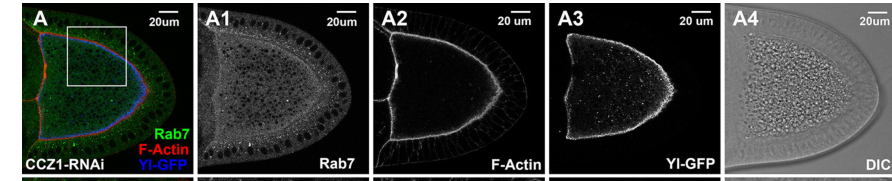

## Question

# Gene Research for Functional Annotation

## ⚠️ CRITICAL: Gene/Protein Identification Context

**BEFORE YOU BEGIN RESEARCH:** You MUST verify you are researching the CORRECT gene/protein. Gene symbols can be ambiguous, especially for less well-characterized genes from non-model organisms.

### Target Gene/Protein Identity (from UniProt):
- **UniProt Accession:** Q9VZL5
- **Protein Description:** RecName: Full=Vacuolar fusion protein CCZ1 homolog {ECO:0000305}; AltName: Full=Caffeine-calcium-zinc sensitivity protein 1 {ECO:0000312|EMBL:AAF47805.3}; Short=Dccz1 {ECO:0000303|PubMed:23418349, ECO:0000312|FlyBase:FBgn0035470};
- **Gene Information:** Name=Ccz1 {ECO:0000312|FlyBase:FBgn0035470}; ORFNames=CG14980 {ECO:0000312|FlyBase:FBgn0035470};
- **Organism (full):** Drosophila melanogaster (Fruit fly).
- **Protein Family:** Belongs to the CCZ1 family. .
- **Key Domains:** Ccz1. (IPR013176); CCZ1/INTU/HSP4_longin_1. (IPR043987); CCZ1/INTU/HSP4_longin_3. (IPR043989); CCZ1/INTU_longin_2. (IPR043988); Intu_longin_1 (PF19031)

### MANDATORY VERIFICATION STEPS:

1. **Check if the gene symbol "Ccz1" matches the protein description above**
2. **Verify the organism is correct:** Drosophila melanogaster (Fruit fly).
3. **Check if protein family/domains align with what you find in literature**
4. **If you find literature for a DIFFERENT gene with the same or similar symbol, STOP**

### If Gene Symbol is Ambiguous or You Cannot Find Relevant Literature:

**DO NOT PROCEED WITH RESEARCH ON A DIFFERENT GENE.** Instead:
- State clearly: "The gene symbol 'Ccz1' is ambiguous or literature is limited for this specific protein"
- Explain what you found (e.g., "Found extensive literature on a different gene with the same symbol in a different organism")
- Describe the protein based ONLY on the UniProt information provided above
- Suggest that the protein function can be inferred from domain/family information

### Research Target:

Please provide a comprehensive research report on the gene **Ccz1** (gene ID: Ccz1, UniProt: Q9VZL5) in DROME.

The research report should be a detailed narrative explaining the function, biological processes, and localization of the gene product. Citations should be given for all claims.

You should prioritize authoritative reviews and primary scientific literature when conducting research. You can supplement
this with annotations you find in gene/protein databases, but these can be outdated or inaccurate.

We are specifically interested in the primary function of the gene - for enzymes, what reaction is catalyzed, and what is the substrate specificity? For transporters, what is the substrate? For structural proteins or adapters, what is the broader structural role? For signaling molecules, what is the role in the pathway.

We are interested in where in or outside the cell the gene product carries out its function.

We are also interested in the signaling or biochemical pathways in which the gene functions. We are less interested in broad pleiotropic effects, except where these elucidate the precise role.

Include evidence where possible. We are interested in both experimental evidence as well as inference from structure, evolution, or bioinformatic analysis. Precise studies should be prioritized over high-throughput, where available.

## Output

Question: You are an expert researcher providing comprehensive, well-cited information.

Provide detailed information focusing on:
1. Key concepts and definitions with current understanding
2. Recent developments and latest research (prioritize 2023-2024 sources)
3. Current applications and real-world implementations
4. Expert opinions and analysis from authoritative sources
5. Relevant statistics and data from recent studies

Format as a comprehensive research report with proper citations. Include URLs and publication dates where available.
Always prioritize recent, authoritative sources and provide specific citations for all major claims.

# Gene Research for Functional Annotation

## ⚠️ CRITICAL: Gene/Protein Identification Context

**BEFORE YOU BEGIN RESEARCH:** You MUST verify you are researching the CORRECT gene/protein. Gene symbols can be ambiguous, especially for less well-characterized genes from non-model organisms.

### Target Gene/Protein Identity (from UniProt):
- **UniProt Accession:** Q9VZL5
- **Protein Description:** RecName: Full=Vacuolar fusion protein CCZ1 homolog {ECO:0000305}; AltName: Full=Caffeine-calcium-zinc sensitivity protein 1 {ECO:0000312|EMBL:AAF47805.3}; Short=Dccz1 {ECO:0000303|PubMed:23418349, ECO:0000312|FlyBase:FBgn0035470};
- **Gene Information:** Name=Ccz1 {ECO:0000312|FlyBase:FBgn0035470}; ORFNames=CG14980 {ECO:0000312|FlyBase:FBgn0035470};
- **Organism (full):** Drosophila melanogaster (Fruit fly).
- **Protein Family:** Belongs to the CCZ1 family. .
- **Key Domains:** Ccz1. (IPR013176); CCZ1/INTU/HSP4_longin_1. (IPR043987); CCZ1/INTU/HSP4_longin_3. (IPR043989); CCZ1/INTU_longin_2. (IPR043988); Intu_longin_1 (PF19031)

### MANDATORY VERIFICATION STEPS:

1. **Check if the gene symbol "Ccz1" matches the protein description above**
2. **Verify the organism is correct:** Drosophila melanogaster (Fruit fly).
3. **Check if protein family/domains align with what you find in literature**
4. **If you find literature for a DIFFERENT gene with the same or similar symbol, STOP**

### If Gene Symbol is Ambiguous or You Cannot Find Relevant Literature:

**DO NOT PROCEED WITH RESEARCH ON A DIFFERENT GENE.** Instead:
- State clearly: "The gene symbol 'Ccz1' is ambiguous or literature is limited for this specific protein"
- Explain what you found (e.g., "Found extensive literature on a different gene with the same symbol in a different organism")
- Describe the protein based ONLY on the UniProt information provided above
- Suggest that the protein function can be inferred from domain/family information

### Research Target:

Please provide a comprehensive research report on the gene **Ccz1** (gene ID: Ccz1, UniProt: Q9VZL5) in DROME.

The research report should be a detailed narrative explaining the function, biological processes, and localization of the gene product. Citations should be given for all claims.

You should prioritize authoritative reviews and primary scientific literature when conducting research. You can supplement
this with annotations you find in gene/protein databases, but these can be outdated or inaccurate.

We are specifically interested in the primary function of the gene - for enzymes, what reaction is catalyzed, and what is the substrate specificity? For transporters, what is the substrate? For structural proteins or adapters, what is the broader structural role? For signaling molecules, what is the role in the pathway.

We are interested in where in or outside the cell the gene product carries out its function.

We are also interested in the signaling or biochemical pathways in which the gene functions. We are less interested in broad pleiotropic effects, except where these elucidate the precise role.

Include evidence where possible. We are interested in both experimental evidence as well as inference from structure, evolution, or bioinformatic analysis. Precise studies should be prioritized over high-throughput, where available.

# Functional annotation report: *Drosophila melanogaster* Ccz1 (Q9VZL5)

## Identity and principal function

**Identity verified.** The specified UniProt record identifies Q9VZL5 as the fruit-fly CCZ1-family protein Ccz1, also called Dccz1, encoded by **CG14980**. Crucially, a fly primary study independently identifies Dccz1 as the *Drosophila* ortholog encoded by CG14980; this report does not substitute experiments on identically named yeast or human proteins for fly evidence. The supplied UniProt annotations assign Ccz1-family and longin-related domains, consistent with experimental descriptions of the fly Mon1–Ccz1 complex. The accession-to-protein mapping itself comes from the UniProt information supplied in the question. (yousefian2013dmon1controlsrecruitment pages 4-5, hegedus2016theccz1mon1rab7module pages 2-3, borchers2023regulatorysitesin pages 2-3)

**Functional assignment:** Ccz1 is a subunit of a **Rab7 guanine-nucleotide exchange factor (GEF)**, rather than a membrane transporter or a protein that directly fuses lipid bilayers. Together with Mon1—and, in the characterized metazoan complex, Bulli/RMC1—it promotes exchange of GDP for GTP on Rab7. Rab7 activation gives maturing endosomes and autophagic structures the identity needed for later trafficking and fusion with lysosomes. Ccz1 contributes to the composite GEF interface; the available evidence does **not** establish that isolated fly Ccz1 catalyzes exchange. (borchers2023regulatorysitesin pages 2-3, borchers2023regulatorysitesin pages 7-8, wilmes2025mechanisticadaptationof pages 1-2)

## Molecular mechanism and substrate

The best-defined biochemical substrate in flies is **Rab7 loaded with GDP and associated with GDP-dissociation inhibitor (GDI)**. In a 2023 membrane-reconstitution experiment, purified *Drosophila* Mon1–Ccz1–Bulli was added to liposomes carrying prenylated Rab5-GTP and a fluorescent GDP-loaded Rab7:GDI preparation. Addition of **6.25 nM** GEF complex produced a nucleotide-release signal from Rab7, providing direct fly-complex evidence for Rab7 exchange activity. The study did not establish an exhaustive specificity ranking against every other fly Rab; Rab5 in this experiment was an upstream membrane-associated regulator, **not** the GEF reaction’s nucleotide-exchange substrate. (borchers2023regulatorysitesin pages 2-3, borchers2023regulatorysitesin pages 7-8)

The first longin domain of **each** Mon1 and Ccz1 contributes to the catalytic interface; their other longin domains help organize membrane association. Structural comparisons show how the assembled complex remodels Rab7-family switch I and destabilizes nucleotide binding, allowing GDP release and subsequent GTP loading. The residue-level exchange mechanism is supported substantially by fungal Ypt7 and human Rab7-family structural work and should not be mistaken for a demonstration that fly Ccz1 works independently of Mon1. Related longin-domain GEFs recognize different Rabs, so a shared fold alone would not establish substrate specificity; the fly Rab7 reconstitution and loss-of-function phenotypes provide the stronger assignment here. (wilmes2025mechanisticadaptationof pages 2-3, borchers2023regulatorysitesin pages 2-3)

**Regulation in endosomes.** Rab5-positive membranes help recruit and stimulate the Mon1–Ccz1-containing GEF during early-to-late endosomal maturation—the *Rab5-to-Rab7 transition*. A 2023 study identified an autoinhibitory, disordered N-terminal region in **Mon1**, not Ccz1: shortening it increased the fly complex’s membrane-associated Rab7-GEF activity by approximately **1.5–3.5-fold**, whereas the tested truncation did not significantly enhance activity in the corresponding soluble-substrate assay. Expression of Mon1Δ100 changed Rab5-positive endosome size in fly nephrocytes (**15 cells from three control animals versus 13 cells from four experimental animals; P < 0.0001**). These results explain regulation of a **Ccz1-containing** complex; they do not identify an autoinhibitory segment within Ccz1. (borchers2023regulatorysitesin pages 1-2, borchers2023regulatorysitesin pages 3-4, borchers2023regulatorysitesin pages 3-3)

## Site of action and biological pathways

Ccz1 acts **inside cells**, principally at the **cytosolic face of trafficking membranes**, rather than in the lysosomal lumen or extracellular space. A tagged Dccz1 protein appeared predominantly cytosolic in the 2013 fly study, which did not detect stable endosomal association. This does not rule out brief or low-abundance membrane residence: purified fly Mon1–Ccz1–Bulli binds negatively charged model membranes, and cellular loss-of-function studies place its essential activity at endosomal and autophagic membranes. In the 2025 measurements, the purified fly trimer had an apparent membrane-binding **Kᵈ of approximately 1.5 μM**; Bulli’s positively charged membrane-binding region and its interface with Ccz1 were important for normal endosomal organization in fly nephrocytes. These data support **regulated, potentially transient recruitment** rather than constitutive insertion of Ccz1 into a membrane. (yousefian2013dmon1controlsrecruitment pages 4-5, wilmes2025mechanisticadaptationof pages 5-7, wilmes2025mechanisticadaptationof pages 3-5)

**Endocytosis and receptor turnover.** Depletion of Dccz1/CG14980 enlarged endosomes positive for Notch, Rab4 and Rab5 and markedly reduced their Rab7 association. Thus the immediate, experimentally supported role is Rab7 recruitment and maturation of cargo-bearing endosomes. Ccz1-null eye tissue also accumulated endocytosed, nondegraded Notch and Boss. Receptor accumulation must **not** automatically be interpreted as Notch pathway activation: the 2013 study found no detectable ectopic or overactive Notch signaling with the corresponding Dmon1 trafficking defect. The precise connection is endosomal trafficking and receptor degradation, not a demonstrated direct action of Ccz1 on Notch transcriptional signaling. (yousefian2013dmon1controlsrecruitment pages 4-5, hegedus2016theccz1mon1rab7module pages 3-4, yousefian2013dmon1controlsrecruitment pages 1-2)

**Autophagy.** In starved larval fat cells, Ccz1 and Mon1 interact in a yeast two-hybrid test, and a Ccz1 null allele disrupted Rab7 association with Atg8a-positive autophagic structures. Mutant cells accumulated autophagosomes and lacked autolysosomes by ultrastructural analysis; wild-type transgene rescue supported the genetic attribution. In controls, endogenous Rab7 overlapped **112 of 200 Atg8a-positive structures (56%; n = 10 animals)**, whereas loss of Ccz1 or Mon1 prevented the overlap. The evidence places Ccz1–Mon1–Rab7 **upstream of autophagosome–lysosome fusion** and hence autophagic cargo clearance; it does not make Ccz1 a SNARE fusogen or a lysosomal hydrolase. (hegedus2016theccz1mon1rab7module pages 4-5, hegedus2016theccz1mon1rab7module pages 3-4)

The pathway has an important context dependence. Although Rab5 regulates **endosomal** recruitment and activation of Mon1–Ccz1, Rab5-null, starved fly fat cells still recruited Rab7 to autophagic structures and formed autolysosomes. Consequently, Rab5 is **not universally required** for the Ccz1–Mon1–Rab7-dependent autophagosome–lysosome fusion step; the 2016 authors assigned Rab5 a distinguishable, later role in degradation of autophagic contents. (hegedus2016theccz1mon1rab7module pages 4-5, hegedus2016theccz1mon1rab7module pages 2-3)

## Recent in-vivo assessment and interpretation

In **2024**, oocyte-specific Ccz1 RNAi provided an independent physiological test: endogenous Rab7 lost much of its cortical enrichment and became diffuse rather than granule-membrane associated. Nevertheless, the examined stage-10 oocytes retained apparently normal Yolkless-receptor and F-actin distributions, PI(3)P-positive structures, and numerous yolk granules. The result refines the annotation: **Rab7 membrane recruitment depends on Ccz1 in this setting, but visually apparent yolk-granule formation does not**. It does not prove that all aspects of granule maturation are normal or that RNAi eliminates all Ccz1 protein. Figure 6 directly illustrates the Rab7-localization phenotype. (yu2024endolysosomaltraffickingcontrols pages 12-14, yu2024endolysosomaltraffickingcontrols media 771a6552)

The table distinguishes primary fly experiments from their interpretive limits and records the principal quantitative observations.

| Primary study (date; URL) | Experimental system / method | Observation | Interpretation / limits |
|---|---|---|---|
| Yousefian et al. (1 April 2013); [Journal of Cell Science](https://doi.org/10.1242/jcs.114934) | Drosophila tissues; RNAi against Dccz1/CG14980, endosomal-marker imaging, and Dccz1-EOS localization | Dccz1 depletion enlarged Notch-, Rab4-, and Rab5-positive endosomes and strongly reduced endosomal Rab7. Dccz1-EOS was predominantly cytosolic, and stable endosomal association was not detected. (yousefian2013dmon1controlsrecruitment pages 4-5) | Supports a transiently membrane-associated role in Rab7 recruitment and early-to-late endosome maturation. It does not directly demonstrate nucleotide exchange, stable membrane residence, or direct Mon1 binding. Notch accumulation reflects defective trafficking and did not establish increased Notch signaling. (yousefian2013dmon1controlsrecruitment pages 4-5, yousefian2013dmon1controlsrecruitment pages 1-2) |
| Hegedűs et al. (15 October 2016); [Molecular Biology of the Cell](https://doi.org/10.1091/mbc.e16-03-0205) | Drosophila larval fat body and eye; Ccz1 null allele, rescue, yeast two-hybrid, fluorescence microscopy, immuno-EM, and ultrastructure | Fly Ccz1 bound Mon1 in yeast two-hybrid assays. Ccz1 mutants lost Rab7 recruitment to Atg8a-positive structures, accumulated autophagosomes, lacked autolysosomes, and accumulated nondegraded Notch and Boss. In controls, Rab7 overlapped with 112/200 (56%) Atg8a-positive structures; Ccz1 or Mon1 loss abolished this overlap. (hegedus2016theccz1mon1rab7module pages 3-4, hegedus2016theccz1mon1rab7module pages 4-5) | Directly establishes a fly Ccz1-Mon1 interaction and a requirement for Rab7 recruitment and autophagosome-lysosome fusion. The study identifies the module as a Rab7 GEF but did not biochemically measure fly nucleotide exchange in these experiments. (hegedus2016theccz1mon1rab7module pages 2-3, hegedus2016theccz1mon1rab7module pages 4-5) |
| Hegedűs et al. (15 October 2016); [Molecular Biology of the Cell](https://doi.org/10.1091/mbc.e16-03-0205) | Rab5-null fat-body clones; Atg8a, Rab7, and Lamp reporters plus electron microscopy | Rab5-null cells still recruited Rab7 to autophagic structures, fused autophagosomes with lysosomes, and formed electron-dense autolysosomes without autophagosome accumulation. The fly Ccz1-Mon1 complex preferentially bound GTP-locked Rab5 and GDP-locked Rab7 in yeast two-hybrid assays. (hegedus2016theccz1mon1rab7module pages 4-5) | Shows pathway-context dependence: Rab5 promotes endosomal Mon1-Ccz1 recruitment but is dispensable for the Ccz1-Mon1-Rab7 fusion step during starvation-induced autophagy. Yeast two-hybrid binding is not equivalent to membrane-reconstituted exchange. (hegedus2016theccz1mon1rab7module pages 2-3, hegedus2016theccz1mon1rab7module pages 4-5) |
| Borchers et al. (18 July 2023); [PNAS](https://doi.org/10.1073/pnas.2303750120) | Purified Drosophila Mon1-Ccz1-Bulli; Rab5-bearing liposomes and Mant-GDP-loaded Rab7:GDI exchange assay | Adding 6.25 nM trimeric GEF to liposomes carrying prenylated Rab5-GTP promoted nucleotide release from Rab7:GDI. Mon1 N-terminal deletions increased membrane-associated GEF activity by approximately 1.5- to 3.5-fold, whereas Mon1Δ100 was not significantly more active with soluble, nonprenylated substrate. LD1 of Mon1 and Ccz1 forms the composite active site; LD2 and LD3 form a membrane-association layer. (borchers2023regulatorysitesin pages 2-3, borchers2023regulatorysitesin pages 3-3) | Direct biochemical evidence that the fly Mon1-Ccz1-Bulli complex is a Rab7 GEF and that Ccz1 contributes to the catalytic interface rather than acting only as a scaffold. It does not show that isolated Ccz1 catalyzes exchange or provide a systematic specificity panel against other fly Rabs. (borchers2023regulatorysitesin pages 7-8, borchers2023regulatorysitesin pages 2-3) |
| Borchers et al. (18 July 2023); [PNAS](https://doi.org/10.1073/pnas.2303750120) | Transgenic Drosophila nephrocytes expressing wild-type Mon1 or Mon1Δ100; endogenous Rab5 imaging | Mon1Δ100 altered Rab5-positive endosome size relative to wild type: 15 cells from three animals versus 13 cells from four animals, P < 0.0001. (borchers2023regulatorysitesin pages 3-4) | Links biochemical autoinhibition of the fly complex to endosomal organization in vivo. Because the manipulated segment belongs to Mon1, this experiment regulates the Ccz1-containing complex but does not identify a Ccz1-specific regulatory site. (borchers2023regulatorysitesin pages 1-2, borchers2023regulatorysitesin pages 3-4) |
| Yu et al. (5 February 2024); [PLOS Genetics](https://doi.org/10.1371/journal.pgen.1011152) | Stage-10 vitellogenic Drosophila oocytes; oocyte-specific Ccz1 RNAi, endogenous Rab7, Yolkless-GFP, FYVE-GFP, F-actin, and granule imaging | Ccz1 depletion substantially reduced cortical Rab7 and made Rab7 diffuse rather than granule-membrane associated. Nevertheless, Yolkless-GFP and F-actin remained normally distributed, PI(3)P-positive structures persisted, and numerous yolk granules formed. The screen tested 36 RNAi lines targeting 22 Rab5 effectors. (yu2024endolysosomaltraffickingcontrols pages 12-14, yu2024endolysosomaltraffickingcontrols media 771a6552) | Recent in-vivo confirmation that Ccz1 is required for membrane recruitment of Rab7. Visible yolk-granule biogenesis can proceed despite Rab7 delocalization in this tissue and stage; RNAi does not prove complete protein loss or exclude subtler granule defects. (yu2024endolysosomaltraffickingcontrols pages 12-14) |
| Wilmes et al. (27 August 2025); [Science Advances](https://doi.org/10.1126/sciadv.adx2893) | Purified Drosophila Mon1-Ccz1-Bulli and anionic supported lipid bilayers measured by QCM-D; Bulli mutant and rescue analysis in fly nephrocytes | The fly trimer bound negatively charged membranes with an apparent Kd of approximately 1.5 μM. Bulli-Ccz1 interface mutations and removal or charge inversion of Bulli's basic β-propeller impaired rescue of endosomal Rab5 organization. (wilmes2025mechanisticadaptationof pages 3-5) | Identifies Bulli/RMC1 as the principal membrane-recruitment module of metazoan Mon1-Ccz1 in this assay and functionally links Bulli to Ccz1. Residue-level Rab7 exchange chemistry is supported mainly by fungal and human structural comparisons and should not be presented as a fly-specific structural measurement. (wilmes2025mechanisticadaptationof pages 5-7, wilmes2025mechanisticadaptationof pages 1-2, wilmes2025mechanisticadaptationof pages 2-3) |

*Table: Direct genetic, cellular, biochemical, and membrane-binding evidence for Drosophila Ccz1/Dccz1 (CG14980; Q9VZL5), with quantitative results and explicit limits on cross-species inference.*

## Evidence-based conclusion

The strongest functional annotation for **Q9VZL5/CG14980** is **a longin-domain Ccz1 subunit of the Mon1–Ccz1(-Bulli) Rab7 GEF**, operating on cytosol-facing endosomal and autophagic membranes. Its central, directly supported outcome is correctly localized Rab7 activation, enabling endosome maturation and autophagosome–lysosome fusion. Precisely how Ccz1 itself contacts membranes in vivo, whether its recruitment differs among tissues, and the complete selectivity of the fly complex across all Rab proteins remain less firmly established than this core function. (yousefian2013dmon1controlsrecruitment pages 4-5, hegedus2016theccz1mon1rab7module pages 4-5, borchers2023regulatorysitesin pages 7-8, borchers2023regulatorysitesin pages 2-3, wilmes2025mechanisticadaptationof pages 5-7)

**Selected primary sources, with publication dates:** Yousefian *et al.*, *Journal of Cell Science*, **April 2013**, https://doi.org/10.1242/jcs.114934; Hegedűs *et al.*, *Molecular Biology of the Cell*, **October 2016**, https://doi.org/10.1091/mbc.e16-03-0205; Borchers *et al.*, *PNAS*, **July 2023**, https://doi.org/10.1073/pnas.2303750120; Yu *et al.*, *PLOS Genetics*, **February 2024**, https://doi.org/10.1371/journal.pgen.1011152; Wilmes *et al.*, *Science Advances*, **August 2025**, https://doi.org/10.1126/sciadv.adx2893. (yousefian2013dmon1controlsrecruitment pages 4-5, hegedus2016theccz1mon1rab7module pages 4-5, borchers2023regulatorysitesin pages 2-3, yu2024endolysosomaltraffickingcontrols pages 12-14, wilmes2025mechanisticadaptationof pages 3-5)

References

1. (yousefian2013dmon1controlsrecruitment pages 4-5): Jahan Yousefian, Tobias Troost, Ferdi Grawe, Takeshi Sasamura, Mark Fortini, and Thomas Klein. Dmon1 controls recruitment of rab7 to maturing endosomes in drosophila. Journal of Cell Science, 126:1583-1594, Apr 2013. URL: https://doi.org/10.1242/jcs.114934, doi:10.1242/jcs.114934. This article has 58 citations and is from a domain leading peer-reviewed journal.

2. (hegedus2016theccz1mon1rab7module pages 2-3): Krisztina Hegedűs, Szabolcs Takáts, Attila Boda, András Jipa, Péter Nagy, Kata Varga, Attila L. Kovács, and Gábor Juhász. The ccz1-mon1-rab7 module and rab5 control distinct steps of autophagy. Molecular Biology of the Cell, 27:3132-3142, Oct 2016. URL: https://doi.org/10.1091/mbc.e16-03-0205, doi:10.1091/mbc.e16-03-0205. This article has 257 citations and is from a domain leading peer-reviewed journal.

3. (borchers2023regulatorysitesin pages 2-3): Ann-Christin Borchers, Maren Janz, Jan-Hannes Schäfer, Arne Moeller, Daniel Kümmel, Achim Paululat, Christian Ungermann, and Lars Langemeyer. Regulatory sites in the mon1–ccz1 complex control rab5 to rab7 transition and endosome maturation. Proceedings of the National Academy of Sciences, Jul 2023. URL: https://doi.org/10.1073/pnas.2303750120, doi:10.1073/pnas.2303750120. This article has 47 citations and is from a highest quality peer-reviewed journal.

4. (borchers2023regulatorysitesin pages 7-8): Ann-Christin Borchers, Maren Janz, Jan-Hannes Schäfer, Arne Moeller, Daniel Kümmel, Achim Paululat, Christian Ungermann, and Lars Langemeyer. Regulatory sites in the mon1–ccz1 complex control rab5 to rab7 transition and endosome maturation. Proceedings of the National Academy of Sciences, Jul 2023. URL: https://doi.org/10.1073/pnas.2303750120, doi:10.1073/pnas.2303750120. This article has 47 citations and is from a highest quality peer-reviewed journal.

5. (wilmes2025mechanisticadaptationof pages 1-2): Stephan Wilmes, Jesse Tönjes, Maik Drechsler, Anita Ruf, Jan-Hannes Schäfer, Anna Lürick, Dovile Januliene, Steven Apelt, Daniele Di Iorio, Seraphine V. Wegner, Martin Loose, Arne Moeller, Achim Paululat, and Daniel Kümmel. Mechanistic adaptation of the metazoan rabgefs mon1-ccz1 and fuzzy-inturned. Science Advances, Aug 2025. URL: https://doi.org/10.1126/sciadv.adx2893, doi:10.1126/sciadv.adx2893. This article has 4 citations and is from a highest quality peer-reviewed journal.

6. (wilmes2025mechanisticadaptationof pages 2-3): Stephan Wilmes, Jesse Tönjes, Maik Drechsler, Anita Ruf, Jan-Hannes Schäfer, Anna Lürick, Dovile Januliene, Steven Apelt, Daniele Di Iorio, Seraphine V. Wegner, Martin Loose, Arne Moeller, Achim Paululat, and Daniel Kümmel. Mechanistic adaptation of the metazoan rabgefs mon1-ccz1 and fuzzy-inturned. Science Advances, Aug 2025. URL: https://doi.org/10.1126/sciadv.adx2893, doi:10.1126/sciadv.adx2893. This article has 4 citations and is from a highest quality peer-reviewed journal.

7. (borchers2023regulatorysitesin pages 1-2): Ann-Christin Borchers, Maren Janz, Jan-Hannes Schäfer, Arne Moeller, Daniel Kümmel, Achim Paululat, Christian Ungermann, and Lars Langemeyer. Regulatory sites in the mon1–ccz1 complex control rab5 to rab7 transition and endosome maturation. Proceedings of the National Academy of Sciences, Jul 2023. URL: https://doi.org/10.1073/pnas.2303750120, doi:10.1073/pnas.2303750120. This article has 47 citations and is from a highest quality peer-reviewed journal.

8. (borchers2023regulatorysitesin pages 3-4): Ann-Christin Borchers, Maren Janz, Jan-Hannes Schäfer, Arne Moeller, Daniel Kümmel, Achim Paululat, Christian Ungermann, and Lars Langemeyer. Regulatory sites in the mon1–ccz1 complex control rab5 to rab7 transition and endosome maturation. Proceedings of the National Academy of Sciences, Jul 2023. URL: https://doi.org/10.1073/pnas.2303750120, doi:10.1073/pnas.2303750120. This article has 47 citations and is from a highest quality peer-reviewed journal.

9. (borchers2023regulatorysitesin pages 3-3): Ann-Christin Borchers, Maren Janz, Jan-Hannes Schäfer, Arne Moeller, Daniel Kümmel, Achim Paululat, Christian Ungermann, and Lars Langemeyer. Regulatory sites in the mon1–ccz1 complex control rab5 to rab7 transition and endosome maturation. Proceedings of the National Academy of Sciences, Jul 2023. URL: https://doi.org/10.1073/pnas.2303750120, doi:10.1073/pnas.2303750120. This article has 47 citations and is from a highest quality peer-reviewed journal.

10. (wilmes2025mechanisticadaptationof pages 5-7): Stephan Wilmes, Jesse Tönjes, Maik Drechsler, Anita Ruf, Jan-Hannes Schäfer, Anna Lürick, Dovile Januliene, Steven Apelt, Daniele Di Iorio, Seraphine V. Wegner, Martin Loose, Arne Moeller, Achim Paululat, and Daniel Kümmel. Mechanistic adaptation of the metazoan rabgefs mon1-ccz1 and fuzzy-inturned. Science Advances, Aug 2025. URL: https://doi.org/10.1126/sciadv.adx2893, doi:10.1126/sciadv.adx2893. This article has 4 citations and is from a highest quality peer-reviewed journal.

11. (wilmes2025mechanisticadaptationof pages 3-5): Stephan Wilmes, Jesse Tönjes, Maik Drechsler, Anita Ruf, Jan-Hannes Schäfer, Anna Lürick, Dovile Januliene, Steven Apelt, Daniele Di Iorio, Seraphine V. Wegner, Martin Loose, Arne Moeller, Achim Paululat, and Daniel Kümmel. Mechanistic adaptation of the metazoan rabgefs mon1-ccz1 and fuzzy-inturned. Science Advances, Aug 2025. URL: https://doi.org/10.1126/sciadv.adx2893, doi:10.1126/sciadv.adx2893. This article has 4 citations and is from a highest quality peer-reviewed journal.

12. (hegedus2016theccz1mon1rab7module pages 3-4): Krisztina Hegedűs, Szabolcs Takáts, Attila Boda, András Jipa, Péter Nagy, Kata Varga, Attila L. Kovács, and Gábor Juhász. The ccz1-mon1-rab7 module and rab5 control distinct steps of autophagy. Molecular Biology of the Cell, 27:3132-3142, Oct 2016. URL: https://doi.org/10.1091/mbc.e16-03-0205, doi:10.1091/mbc.e16-03-0205. This article has 257 citations and is from a domain leading peer-reviewed journal.

13. (yousefian2013dmon1controlsrecruitment pages 1-2): Jahan Yousefian, Tobias Troost, Ferdi Grawe, Takeshi Sasamura, Mark Fortini, and Thomas Klein. Dmon1 controls recruitment of rab7 to maturing endosomes in drosophila. Journal of Cell Science, 126:1583-1594, Apr 2013. URL: https://doi.org/10.1242/jcs.114934, doi:10.1242/jcs.114934. This article has 58 citations and is from a domain leading peer-reviewed journal.

14. (hegedus2016theccz1mon1rab7module pages 4-5): Krisztina Hegedűs, Szabolcs Takáts, Attila Boda, András Jipa, Péter Nagy, Kata Varga, Attila L. Kovács, and Gábor Juhász. The ccz1-mon1-rab7 module and rab5 control distinct steps of autophagy. Molecular Biology of the Cell, 27:3132-3142, Oct 2016. URL: https://doi.org/10.1091/mbc.e16-03-0205, doi:10.1091/mbc.e16-03-0205. This article has 257 citations and is from a domain leading peer-reviewed journal.

15. (yu2024endolysosomaltraffickingcontrols pages 12-14): Yue Yu, Dongsheng Chen, Stephen M. Farmer, Shiyu Xu, Beatriz Rios, Amanda Solbach, Xin Ye, Lili Ye, and Sheng Zhang. Endolysosomal trafficking controls yolk granule biogenesis in vitellogenic drosophila oocytes. PLOS Genetics, 20:e1011152, Feb 2024. URL: https://doi.org/10.1371/journal.pgen.1011152, doi:10.1371/journal.pgen.1011152. This article has 9 citations and is from a domain leading peer-reviewed journal.

16. (yu2024endolysosomaltraffickingcontrols media 771a6552): Yue Yu, Dongsheng Chen, Stephen M. Farmer, Shiyu Xu, Beatriz Rios, Amanda Solbach, Xin Ye, Lili Ye, and Sheng Zhang. Endolysosomal trafficking controls yolk granule biogenesis in vitellogenic drosophila oocytes. PLOS Genetics, 20:e1011152, Feb 2024. URL: https://doi.org/10.1371/journal.pgen.1011152, doi:10.1371/journal.pgen.1011152. This article has 9 citations and is from a domain leading peer-reviewed journal.

## Artifacts

- [Edison artifact artifact-00](Ccz1-deep-research-falcon_artifacts/artifact-00.md)

## Citations

1. borchers2023regulatorysitesin pages 3-4
2. yu2024endolysosomaltraffickingcontrols pages 12-14
3. wilmes2025mechanisticadaptationof pages 3-5
4. borchers2023regulatorysitesin pages 2-3
5. borchers2023regulatorysitesin pages 7-8
6. wilmes2025mechanisticadaptationof pages 1-2
7. wilmes2025mechanisticadaptationof pages 2-3
8. borchers2023regulatorysitesin pages 1-2
9. borchers2023regulatorysitesin pages 3-3
10. wilmes2025mechanisticadaptationof pages 5-7
11. Journal of Cell Science
12. Molecular Biology of the Cell
13. PNAS
14. PLOS Genetics
15. Science Advances
16. https://doi.org/10.1242/jcs.114934
17. https://doi.org/10.1091/mbc.e16-03-0205
18. https://doi.org/10.1073/pnas.2303750120
19. https://doi.org/10.1371/journal.pgen.1011152
20. https://doi.org/10.1126/sciadv.adx2893
21. https://doi.org/10.1242/jcs.114934;
22. https://doi.org/10.1091/mbc.e16-03-0205;
23. https://doi.org/10.1073/pnas.2303750120;
24. https://doi.org/10.1371/journal.pgen.1011152;
25. https://doi.org/10.1126/sciadv.adx2893.
26. https://doi.org/10.1242/jcs.114934,
27. https://doi.org/10.1091/mbc.e16-03-0205,
28. https://doi.org/10.1073/pnas.2303750120,
29. https://doi.org/10.1126/sciadv.adx2893,
30. https://doi.org/10.1371/journal.pgen.1011152,