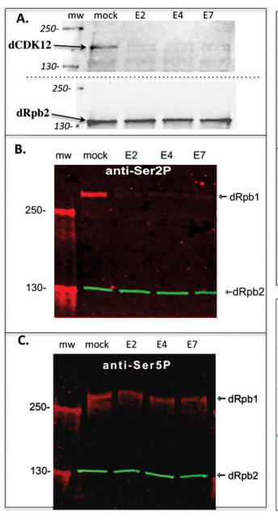

## Question

# Gene Research for Functional Annotation

## ⚠️ CRITICAL: Gene/Protein Identification Context

**BEFORE YOU BEGIN RESEARCH:** You MUST verify you are researching the CORRECT gene/protein. Gene symbols can be ambiguous, especially for less well-characterized genes from non-model organisms.

### Target Gene/Protein Identity (from UniProt):
- **UniProt Accession:** Q9VP22
- **Protein Description:** RecName: Full=Cyclin-dependent kinase 12; EC=2.7.11.22; EC=2.7.11.23; AltName: Full=Cell division protein kinase 12; Short=dCdk12;
- **Gene Information:** Name=Cdk12; ORFNames=CG7597;
- **Organism (full):** Drosophila melanogaster (Fruit fly).
- **Protein Family:** Belongs to the protein kinase superfamily. CMGC Ser/Thr
- **Key Domains:** CDK. (IPR050108); Kinase-like_dom_sf. (IPR011009); Prot_kinase_dom. (IPR000719); Protein_kinase_ATP_BS. (IPR017441); Ser/Thr_kinase_AS. (IPR008271)

### MANDATORY VERIFICATION STEPS:

1. **Check if the gene symbol "Cdk12" matches the protein description above**
2. **Verify the organism is correct:** Drosophila melanogaster (Fruit fly).
3. **Check if protein family/domains align with what you find in literature**
4. **If you find literature for a DIFFERENT gene with the same or similar symbol, STOP**

### If Gene Symbol is Ambiguous or You Cannot Find Relevant Literature:

**DO NOT PROCEED WITH RESEARCH ON A DIFFERENT GENE.** Instead:
- State clearly: "The gene symbol 'Cdk12' is ambiguous or literature is limited for this specific protein"
- Explain what you found (e.g., "Found extensive literature on a different gene with the same symbol in a different organism")
- Describe the protein based ONLY on the UniProt information provided above
- Suggest that the protein function can be inferred from domain/family information

### Research Target:

Please provide a comprehensive research report on the gene **Cdk12** (gene ID: Cdk12, UniProt: Q9VP22) in DROME.

The research report should be a detailed narrative explaining the function, biological processes, and localization of the gene product. Citations should be given for all claims.

You should prioritize authoritative reviews and primary scientific literature when conducting research. You can supplement
this with annotations you find in gene/protein databases, but these can be outdated or inaccurate.

We are specifically interested in the primary function of the gene - for enzymes, what reaction is catalyzed, and what is the substrate specificity? For transporters, what is the substrate? For structural proteins or adapters, what is the broader structural role? For signaling molecules, what is the role in the pathway.

We are interested in where in or outside the cell the gene product carries out its function.

We are also interested in the signaling or biochemical pathways in which the gene functions. We are less interested in broad pleiotropic effects, except where these elucidate the precise role.

Include evidence where possible. We are interested in both experimental evidence as well as inference from structure, evolution, or bioinformatic analysis. Precise studies should be prioritized over high-throughput, where available.

## Output

Question: You are an expert researcher providing comprehensive, well-cited information.

Provide detailed information focusing on:
1. Key concepts and definitions with current understanding
2. Recent developments and latest research (prioritize 2023-2024 sources)
3. Current applications and real-world implementations
4. Expert opinions and analysis from authoritative sources
5. Relevant statistics and data from recent studies

Format as a comprehensive research report with proper citations. Include URLs and publication dates where available.
Always prioritize recent, authoritative sources and provide specific citations for all major claims.

# Gene Research for Functional Annotation

## ⚠️ CRITICAL: Gene/Protein Identification Context

**BEFORE YOU BEGIN RESEARCH:** You MUST verify you are researching the CORRECT gene/protein. Gene symbols can be ambiguous, especially for less well-characterized genes from non-model organisms.

### Target Gene/Protein Identity (from UniProt):
- **UniProt Accession:** Q9VP22
- **Protein Description:** RecName: Full=Cyclin-dependent kinase 12; EC=2.7.11.22; EC=2.7.11.23; AltName: Full=Cell division protein kinase 12; Short=dCdk12;
- **Gene Information:** Name=Cdk12; ORFNames=CG7597;
- **Organism (full):** Drosophila melanogaster (Fruit fly).
- **Protein Family:** Belongs to the protein kinase superfamily. CMGC Ser/Thr
- **Key Domains:** CDK. (IPR050108); Kinase-like_dom_sf. (IPR011009); Prot_kinase_dom. (IPR000719); Protein_kinase_ATP_BS. (IPR017441); Ser/Thr_kinase_AS. (IPR008271)

### MANDATORY VERIFICATION STEPS:

1. **Check if the gene symbol "Cdk12" matches the protein description above**
2. **Verify the organism is correct:** Drosophila melanogaster (Fruit fly).
3. **Check if protein family/domains align with what you find in literature**
4. **If you find literature for a DIFFERENT gene with the same or similar symbol, STOP**

### If Gene Symbol is Ambiguous or You Cannot Find Relevant Literature:

**DO NOT PROCEED WITH RESEARCH ON A DIFFERENT GENE.** Instead:
- State clearly: "The gene symbol 'Cdk12' is ambiguous or literature is limited for this specific protein"
- Explain what you found (e.g., "Found extensive literature on a different gene with the same symbol in a different organism")
- Describe the protein based ONLY on the UniProt information provided above
- Suggest that the protein function can be inferred from domain/family information

### Research Target:

Please provide a comprehensive research report on the gene **Cdk12** (gene ID: Cdk12, UniProt: Q9VP22) in DROME.

The research report should be a detailed narrative explaining the function, biological processes, and localization of the gene product. Citations should be given for all claims.

You should prioritize authoritative reviews and primary scientific literature when conducting research. You can supplement
this with annotations you find in gene/protein databases, but these can be outdated or inaccurate.

We are specifically interested in the primary function of the gene - for enzymes, what reaction is catalyzed, and what is the substrate specificity? For transporters, what is the substrate? For structural proteins or adapters, what is the broader structural role? For signaling molecules, what is the role in the pathway.

We are interested in where in or outside the cell the gene product carries out its function.

We are also interested in the signaling or biochemical pathways in which the gene functions. We are less interested in broad pleiotropic effects, except where these elucidate the precise role.

Include evidence where possible. We are interested in both experimental evidence as well as inference from structure, evolution, or bioinformatic analysis. Precise studies should be prioritized over high-throughput, where available.

# Functional annotation of *Drosophila melanogaster Cdk12* (CG7597; UniProt Q9VP22)

## Identity and principal function

The target is the fruit-fly gene **Cdk12/CG7597**, encoding dCDK12—not fly CDK9, human CDK12, or human CDK13. The primary fly study explicitly identifies CG7597 as dCDK12 and places it in the Ctk1-related family of transcriptional cyclin-dependent kinases. Its measured RNA polymerase II (RNAPII) C-terminal-domain (CTD) kinase activity is consistent with the CMGC serine/threonine kinase and ATP-binding domains specified in the supplied UniProt record. The accession-to-gene mapping itself is supplied by the query; the retrieved primary paper independently confirms the gene, protein description, and organism. (bartkowiak2010cdk12isa pages 1-2, bartkowiak2010cdk12isa pages 2-3)

**The best-supported primary function is nuclear phosphorylation of the CTD of Rpb1, RNAPII’s largest subunit, during productive transcription.** As a protein-kinase reaction, dCDK12 transfers phosphate from ATP to CTD hydroxyl groups, yielding phosphorylated CTD and ADP. Immunopurified fly dCDK12 phosphorylated both a fly-CTD fusion and a yeast-CTD fusion *in vitro*. In fly S2 cells, 48-hour RNAi against three independent CG7597 exons sharply reduced CTD Ser2 phosphorylation, whereas the assayed Ser5-phosphorylation signal did not change significantly. The authors estimated that **more than two-thirds of H5-antibody-detected Ser2 phosphorylation** was lost. Thus Ser2 phosphorylation is the strongest *in-vivo fly* specificity assignment; the purified-protein experiments establish a CTD substrate but do **not** by themselves resolve exclusive Ser2-versus-Ser5 catalytic specificity, kinetic constants, or every physiological substrate. Antibody-dependent estimates should not be read as a residue-by-residue measurement of all CTD repeats. [Bartkowiak *et al.*, *Genes & Development*, October 2010, https://doi.org/10.1101/gad.1968210.] (bartkowiak2010cdk12isa pages 3-5, bartkowiak2010cdk12isa pages 8-9, bartkowiak2010cdk12isa pages 9-10, bartkowiak2010cdk12isa media 0abb6dc1)

Fly dCDK12 is associated with **Cyclin K**: mass spectrometry of endogenous immunopurified nuclear material identified 28 dCDK12 peptides, covering 33% of the kinase, and two Cyclin K peptides; Cyclin L was not detected. This supports a dCDK12–Cyclin K transcriptional complex, although that experiment does not prove Cyclin K is its *only* possible partner. The kinase should not be annotated as an ordinary cell-cycle CDK merely because of its name: its experimentally established principal activity is transcription-associated. [Bartkowiak *et al.*, 2010, https://doi.org/10.1101/gad.1968210.] (bartkowiak2010cdk12isa pages 5-6)

## Where the protein acts

**The demonstrated site of its primary biochemical action is the nucleus, on active, RNAPII-transcribed chromatin.** dCDK12 was isolated from fly-cell nuclear extracts. Immunofluorescence on larval polytene chromosomes showed close correspondence between dCDK12 and hyperphosphorylated RNAPII at normally active loci and induced heat-shock loci. Chromatin immunoprecipitation placed dCDK12 along the transcribed portions of active genes. At *Hsp70*, it was not detected above background with promoter-paused polymerase before heat shock, but appeared across almost the entire transcription unit after 10 minutes of induction; its ratio to RNAPII rose downstream of the promoter and remained relatively sustained through the gene. These observations distinguish dCDK12 from the more 5′-weighted fly CDK9–Cyclin T complex, P-TEFb. Chromosomal association and cellular Ser2P loss together support action on elongating RNAPII, not extracellular secretion or an established primary axonal kinase reaction. [Bartkowiak *et al.*, 2010, https://doi.org/10.1101/gad.1968210.] (bartkowiak2010cdk12isa pages 2-3, bartkowiak2010cdk12isa pages 3-5, bartkowiak2010cdk12isa pages 5-6)

## Biological pathways established in flies

**Transcription-linked chromatin maintenance and learning.** A fly RNAi study found that Cdk12 depletion reduced chromosomal RNAPII Ser2P and redistributed heterochromatin protein 1 (HP1/HP1a) and **H3K9me2** onto normally euchromatic chromosome arms, prominently the X chromosome. ChIP-seq identified **299 peaks with increased HP1 binding** versus 29 with decreased binding, and **540 peaks with increased H3K9me2 binding**. More than 30% of elevated euchromatic HP1 peaks were X-linked; approximately 60% of the increased HP1/H3K9me2 association was in gene bodies, preferentially including long, multi-exon genes. These are redistribution and occupancy findings, not evidence that dCDK12 directly phosphorylates histones or HP1. [Pan *et al.*, *PNAS*, October 2015, https://doi.org/10.1073/pnas.1502943112.] (pan2015heterochromatinremodelingby pages 2-3, pan2015heterochromatinremodelingby pages 1-2)

In one-day-old adult brains, selected neuronal transcripts fell **two- to threefold** following neuron-specific Cdk12 depletion; Cyclin K depletion gave a similar transcriptional effect. Reducing HP1a dosage restored expression of eight tested neuronal genes and suppressed an associated paralysis phenotype. Mushroom-body Cdk12 or Cyclin K depletion impaired **courtship learning**; reducing HP1a dosage suppressed the Cdk12-dependent learning defect, whereas the study did not observe a corresponding clear impairment in the tested courtship-memory intervals. The genetic suppression makes excess HP1-associated heterochromatin a plausible mediator, but the exact molecular step by which CTD phosphorylation prevents heterochromatin accumulation remains a proposed mechanism rather than a directly established dCDK12–histone interaction. The measured silencing mark was **H3K9me2, not H3K9me3**. [Pan *et al.*, 2015, https://doi.org/10.1073/pnas.1502943112.] (pan2015heterochromatinremodelingby pages 3-4, pan2015heterochromatinremodelingby pages 5-6)

**Coupling transcription to glial RNA processing.** Fly work on *Neurexin IV* implicates Cdk12 activity in developmentally timed alternative splicing required for glial septate-junction and blood–brain-barrier formation. A published review of the 2012 primary study proposes that CTD phosphorylation recruits the spliceosomal factor Prp40, which cooperates with Crooked neck and the RNA-binding protein HOW to regulate *nrx-IV* exon choice. Importantly, that detailed recruitment sequence is presented in the review as a **model**—including the possibility that Cdk12 supplies the relevant phosphorylation—not as proof that purified fly Cdk12 directly phosphorylates each proposed component or that all recruitment steps have been established. [Rodrigues *et al.*, *Development*, May 2012, https://doi.org/10.1242/dev.074070; Mohr and Hartmann, *Journal of Neurogenetics*, July 2014, https://doi.org/10.3109/01677063.2014.936437.] (mohr2014alternativesplicingindrosophilaneuronal pages 5-6)

**Adult neuronal metabolism and axon integrity—recent fly evidence.** In a 2023 peer-reviewed study, targeted Cdk12 ablation in adult *Drosophila* neurons caused reduced expression of folate-dependent one-carbon-metabolism genes, increased homocysteine, and abnormal F-actin remodeling near the soma–axon boundary. The supported pathway is **nuclear transcriptional regulation → altered one-carbon metabolism/homocysteine → actin remodeling → proximal axon swelling and organelle-sorting defects**, rather than direct actin phosphorylation by dCDK12. Actin-regulator depletion rescued axonal swelling; Drp1 depletion corrected mitochondrial fragmentation, and myosin-V/*didum* depletion reduced inappropriate peroxisome entry into axons. Mitochondrial fragmentation was not established as the cause of axonal swelling or degeneration. [Townsend *et al.*, *Cell Death Discovery*, September 2023, https://doi.org/10.1038/s41420-023-01642-4.] (townsend2023cdk12maintainsthe pages 3-5, townsend2023cdk12maintainsthe pages 5-7)

In that model, proximal mutant axons were approximately **twofold wider at day 21** after adult emergence; degeneration began around day 28, and approximately **75% of affected axons were lost by day 35**. Re-expressing Cdk12 rescued axon width and degeneration. These figures concern a specific adult-neuron experimental system and should not be generalized as whole-animal penetrance or a biochemical rate constant. [Townsend *et al.*, 2023, https://doi.org/10.1038/s41420-023-01642-4.] (townsend2023cdk12maintainsthe pages 2-3)

## Recent mechanistic developments and interpretation

A **2024 bioRxiv preprint using human proteins and cells**, rather than fly CG7597, reported that purified CDK12–Cyclin K generates CTD **Ser2P–Ser5P double phosphorylation** and that the PAF1 transcription-elongation complex stimulates the enzyme through a CDC73 motif. It also implicated the kinase’s arginine/serine-rich region in CTD binding. This refines the hypothesis that a CDK12-family enzyme may be more than a strictly Ser2-only kinase, but neither dual-site catalysis nor CDC73-dependent activation has been established for this particular fly protein by those experiments. Nor does the fly Ser5P RNAi result rule out context-dependent Ser5 phosphorylation by dCDK12. [Lopez Martinez *et al.*, bioRxiv preprint posted **16 October 2024**, https://doi.org/10.1101/2024.10.14.618141.] (martinez2024paf1callostericallyactivates pages 8-11, martinez2024paf1callostericallyactivates pages 1-5, martinez2024paf1callostericallyactivates pages 5-8)

**Research use and annotation confidence.** Fly CG7597 is a genetically tractable model for dissecting transcription-associated CTD phosphorylation, the coupling of elongation to chromatin state and RNA processing, and downstream neuronal homeostasis. The **highest-confidence annotation** is a nuclear, Cyclin-K-associated RNAPII CTD kinase with a major contribution to fly CTD Ser2 phosphorylation. Chromatin-dependent learning and adult axon protection are experimentally supported *downstream functions*; direct phosphorylation of HP1, histones, actin, Drp1, or folate-pathway enzymes is **not established** by the cited fly studies. Human CDK12 cancer findings and human-only 2024 biochemical mechanisms should therefore not be substituted for direct evidence about fly Q9VP22. (bartkowiak2010cdk12isa pages 5-6, bartkowiak2010cdk12isa pages 9-10, pan2015heterochromatinremodelingby pages 5-6, townsend2023cdk12maintainsthe pages 5-7, martinez2024paf1callostericallyactivates pages 5-8)

The following evidence summary separates direct fly findings from the explicitly labeled human-only hypothesis. (bartkowiak2010cdk12isa pages 5-6, pan2015heterochromatinremodelingby pages 2-3, townsend2023cdk12maintainsthe pages 2-3, martinez2024paf1callostericallyactivates pages 5-8)

| Process/readout | Fly experiment and result | Evidence strength / limitation | Source DOI / year |
|---|---|---|---|
| RNAPII CTD kinase activity | Immunopurified dCDK12 phosphorylated recombinant RNAPII CTD substrates in vitro. In S2 cells, 48-hour RNAi against three independent **Cdk12/CG7597** exons removed more than two-thirds of H5-detected CTD Ser2 phosphorylation, whereas Ser5P was not significantly altered. | **Strong direct fly evidence:** biochemical kinase assay plus cellular depletion. The purified assay established CTD phosphorylation but not residue-specific catalytic selectivity; the Ser2 assignment derives from cellular antibody measurements. | [10.1101/gad.1968210](https://doi.org/10.1101/gad.1968210), 2010 (bartkowiak2010cdk12isa pages 5-6, bartkowiak2010cdk12isa pages 8-9, bartkowiak2010cdk12isa pages 9-10) |
| Cyclin partner and nuclear localization | Mass spectrometry of dCDK12 immunopurified from fly nuclear extract identified dCDK12 with 28 peptides and 33% coverage and Cyclin K with two peptides; neither Cyclin L nor CDK9 was detected. Polytene-chromosome imaging and ChIP placed dCDK12 with hyperphosphorylated RNAPII across active genes, relatively depleted at 5′ ends and enriched through gene bodies and 3′ regions compared with P-TEFb. | **Moderate-to-strong:** direct endogenous purification and chromatin localization. Two Cyclin K peptides support association but do not prove that Cyclin K is the sole activating partner. Localization supports a nuclear elongation role but does not establish catalysis at every occupied locus. | [10.1101/gad.1968210](https://doi.org/10.1101/gad.1968210), 2010 (bartkowiak2010cdk12isa pages 1-2, bartkowiak2010cdk12isa pages 3-5, bartkowiak2010cdk12isa pages 5-6) |
| Glial *Neurexin IV* alternative splicing | The proposed fly model places Cdk12-dependent CTD phosphorylation upstream of Prp40 and spliceosome recruitment. Interactions among Prp40, Crooked neck and HOW then regulate mutually exclusive *nrx-IV* exon usage during subperineurial-glial differentiation and septate-junction formation. | **Limited and indirect here:** based on a secondary review of Rodrigues et al. The HOW/Crn/Prp40 mechanism is explicitly a model; direct Cdk12 phosphorylation of individual components and the complete temporal pathway were not established in the reviewed evidence. | [10.1242/dev.074070](https://doi.org/10.1242/dev.074070), 2012; review: [10.3109/01677063.2014.936437](https://doi.org/10.3109/01677063.2014.936437), 2014 (mohr2014alternativesplicingindrosophilaneuronal pages 5-6) |
| Heterochromatin, neuronal transcription and learning | Cdk12 depletion reduced Ser2P and redistributed HP1 and H3K9me2 onto euchromatic arms, especially X-linked long, multi-exon gene bodies. ChIP-seq found 299 increased HP1 peaks and 540 increased H3K9me2 peaks; about 60% of enrichment occurred in gene bodies, and more than 30% of elevated euchromatic HP1 peaks were X-linked. Adult neuronal transcripts fell two- to threefold. Cdk12 or CycK knockdown impaired courtship learning, while reduced HP1a dosage rescued neuronal-gene expression, paralysis and the learning phenotype. | **Strong genetic and genomic fly evidence:** independent RNAi lines, a CycK phenocopy, ChIP-seq, qPCR and HP1a genetic suppression support causality. The proposed Ser2P-mediated chromatin barrier remains mechanistic inference. The measured histone mark was H3K9me2, not H3K9me3. | [10.1073/pnas.1502943112](https://doi.org/10.1073/pnas.1502943112), 2015 (pan2015heterochromatinremodelingby pages 2-3, pan2015heterochromatinremodelingby pages 5-6, pan2015heterochromatinremodelingby pages 3-4) |
| Adult-neuron one-carbon metabolism and axon maintenance | MARCM-mediated Cdk12 ablation in adult fly sensory and glutamatergic neurons repressed folate-dependent one-carbon-metabolism genes and elevated homocysteine, indirectly increasing F-actin remodeling. Proximal axons widened approximately twofold by day 21; degeneration began around day 28, and 75% of axons were lost by day 35. Profilin or Arp2/3 depletion rescued swelling; Drp1 depletion rescued mitochondrial fragmentation, while Myosin V or *didum* depletion rescued peroxisome mislocalization. Cdk12 re-expression rescued axon width and degeneration. | **Strong recent in-vivo fly evidence:** clonal loss, rescue and pathway epistasis connect nuclear Cdk12-dependent transcription to axonal homeostasis. There is no evidence that Cdk12 directly phosphorylates actin or Drp1; the supported mechanism is transcriptional and metabolic. | [10.1038/s41420-023-01642-4](https://doi.org/10.1038/s41420-023-01642-4), 2023 (townsend2023cdk12maintainsthe pages 3-5, townsend2023cdk12maintainsthe pages 5-7, townsend2023cdk12maintainsthe pages 2-3) |
| PAF1C activation and coupled Ser2/Ser5 phosphorylation | **Not a fly experiment.** Purified human CDK12–Cyclin K preferentially generated Ser2P–Ser5P doubly phosphorylated CTD. PAF1C stimulated the kinase through a CDC73 motif, and the CDK12 RS domain aided CTD binding. | **Ortholog-based hypothesis only for CG7597:** useful for refining substrate-specificity models but not demonstrated in *Drosophila*. The 2024 source was a non-peer-reviewed preprint and used human proteins and cells. | [10.1101/2024.10.14.618141](https://doi.org/10.1101/2024.10.14.618141), 2024 preprint (martinez2024paf1callostericallyactivates pages 8-11, martinez2024paf1callostericallyactivates pages 1-5, martinez2024paf1callostericallyactivates pages 5-8) |

*Table: Fly-specific evidence for Cdk12/CG7597 is ranked by experimental directness, with limitations and cross-species inferences made explicit. The final row is human-only evidence and is included solely as a clearly labeled ortholog-based hypothesis.*

References

1. (bartkowiak2010cdk12isa pages 1-2): Bartlomiej Bartkowiak, Pengda Liu, Hemali P. Phatnani, Nicholas J. Fuda, Jeffrey J. Cooper, David H. Price, Karen Adelman, John T. Lis, and Arno L. Greenleaf. Cdk12 is a transcription elongation-associated ctd kinase, the metazoan ortholog of yeast ctk1. Genes &amp; Development, 24:2303-2316, Oct 2010. URL: https://doi.org/10.1101/gad.1968210, doi:10.1101/gad.1968210. This article has 534 citations and is from a highest quality peer-reviewed journal.

2. (bartkowiak2010cdk12isa pages 2-3): Bartlomiej Bartkowiak, Pengda Liu, Hemali P. Phatnani, Nicholas J. Fuda, Jeffrey J. Cooper, David H. Price, Karen Adelman, John T. Lis, and Arno L. Greenleaf. Cdk12 is a transcription elongation-associated ctd kinase, the metazoan ortholog of yeast ctk1. Genes &amp; Development, 24:2303-2316, Oct 2010. URL: https://doi.org/10.1101/gad.1968210, doi:10.1101/gad.1968210. This article has 534 citations and is from a highest quality peer-reviewed journal.

3. (bartkowiak2010cdk12isa pages 3-5): Bartlomiej Bartkowiak, Pengda Liu, Hemali P. Phatnani, Nicholas J. Fuda, Jeffrey J. Cooper, David H. Price, Karen Adelman, John T. Lis, and Arno L. Greenleaf. Cdk12 is a transcription elongation-associated ctd kinase, the metazoan ortholog of yeast ctk1. Genes &amp; Development, 24:2303-2316, Oct 2010. URL: https://doi.org/10.1101/gad.1968210, doi:10.1101/gad.1968210. This article has 534 citations and is from a highest quality peer-reviewed journal.

4. (bartkowiak2010cdk12isa pages 8-9): Bartlomiej Bartkowiak, Pengda Liu, Hemali P. Phatnani, Nicholas J. Fuda, Jeffrey J. Cooper, David H. Price, Karen Adelman, John T. Lis, and Arno L. Greenleaf. Cdk12 is a transcription elongation-associated ctd kinase, the metazoan ortholog of yeast ctk1. Genes &amp; Development, 24:2303-2316, Oct 2010. URL: https://doi.org/10.1101/gad.1968210, doi:10.1101/gad.1968210. This article has 534 citations and is from a highest quality peer-reviewed journal.

5. (bartkowiak2010cdk12isa pages 9-10): Bartlomiej Bartkowiak, Pengda Liu, Hemali P. Phatnani, Nicholas J. Fuda, Jeffrey J. Cooper, David H. Price, Karen Adelman, John T. Lis, and Arno L. Greenleaf. Cdk12 is a transcription elongation-associated ctd kinase, the metazoan ortholog of yeast ctk1. Genes &amp; Development, 24:2303-2316, Oct 2010. URL: https://doi.org/10.1101/gad.1968210, doi:10.1101/gad.1968210. This article has 534 citations and is from a highest quality peer-reviewed journal.

6. (bartkowiak2010cdk12isa media 0abb6dc1): Bartlomiej Bartkowiak, Pengda Liu, Hemali P. Phatnani, Nicholas J. Fuda, Jeffrey J. Cooper, David H. Price, Karen Adelman, John T. Lis, and Arno L. Greenleaf. Cdk12 is a transcription elongation-associated ctd kinase, the metazoan ortholog of yeast ctk1. Genes &amp; Development, 24:2303-2316, Oct 2010. URL: https://doi.org/10.1101/gad.1968210, doi:10.1101/gad.1968210. This article has 534 citations and is from a highest quality peer-reviewed journal.

7. (bartkowiak2010cdk12isa pages 5-6): Bartlomiej Bartkowiak, Pengda Liu, Hemali P. Phatnani, Nicholas J. Fuda, Jeffrey J. Cooper, David H. Price, Karen Adelman, John T. Lis, and Arno L. Greenleaf. Cdk12 is a transcription elongation-associated ctd kinase, the metazoan ortholog of yeast ctk1. Genes &amp; Development, 24:2303-2316, Oct 2010. URL: https://doi.org/10.1101/gad.1968210, doi:10.1101/gad.1968210. This article has 534 citations and is from a highest quality peer-reviewed journal.

8. (pan2015heterochromatinremodelingby pages 2-3): Lixia Pan, Wenbing Xie, Kai-Le Li, Zhihao Yang, Jiang Xu, Wenhao Zhang, Lu-Ping Liu, Xingjie Ren, Zhimin He, Junyu Wu, Jin Sun, Hui-Min Wei, Daliang Wang, Wei Xie, Wei Li, Jian-Quan Ni, and Fang-Lin Sun. Heterochromatin remodeling by cdk12 contributes to learning in drosophila. Proceedings of the National Academy of Sciences, 112:13988-13993, Oct 2015. URL: https://doi.org/10.1073/pnas.1502943112, doi:10.1073/pnas.1502943112. This article has 26 citations and is from a highest quality peer-reviewed journal.

9. (pan2015heterochromatinremodelingby pages 1-2): Lixia Pan, Wenbing Xie, Kai-Le Li, Zhihao Yang, Jiang Xu, Wenhao Zhang, Lu-Ping Liu, Xingjie Ren, Zhimin He, Junyu Wu, Jin Sun, Hui-Min Wei, Daliang Wang, Wei Xie, Wei Li, Jian-Quan Ni, and Fang-Lin Sun. Heterochromatin remodeling by cdk12 contributes to learning in drosophila. Proceedings of the National Academy of Sciences, 112:13988-13993, Oct 2015. URL: https://doi.org/10.1073/pnas.1502943112, doi:10.1073/pnas.1502943112. This article has 26 citations and is from a highest quality peer-reviewed journal.

10. (pan2015heterochromatinremodelingby pages 3-4): Lixia Pan, Wenbing Xie, Kai-Le Li, Zhihao Yang, Jiang Xu, Wenhao Zhang, Lu-Ping Liu, Xingjie Ren, Zhimin He, Junyu Wu, Jin Sun, Hui-Min Wei, Daliang Wang, Wei Xie, Wei Li, Jian-Quan Ni, and Fang-Lin Sun. Heterochromatin remodeling by cdk12 contributes to learning in drosophila. Proceedings of the National Academy of Sciences, 112:13988-13993, Oct 2015. URL: https://doi.org/10.1073/pnas.1502943112, doi:10.1073/pnas.1502943112. This article has 26 citations and is from a highest quality peer-reviewed journal.

11. (pan2015heterochromatinremodelingby pages 5-6): Lixia Pan, Wenbing Xie, Kai-Le Li, Zhihao Yang, Jiang Xu, Wenhao Zhang, Lu-Ping Liu, Xingjie Ren, Zhimin He, Junyu Wu, Jin Sun, Hui-Min Wei, Daliang Wang, Wei Xie, Wei Li, Jian-Quan Ni, and Fang-Lin Sun. Heterochromatin remodeling by cdk12 contributes to learning in drosophila. Proceedings of the National Academy of Sciences, 112:13988-13993, Oct 2015. URL: https://doi.org/10.1073/pnas.1502943112, doi:10.1073/pnas.1502943112. This article has 26 citations and is from a highest quality peer-reviewed journal.

12. (mohr2014alternativesplicingindrosophilaneuronal pages 5-6): Carmen Mohr and Britta Hartmann. Alternative splicing in<i>drosophila</i>neuronal development. Journal of Neurogenetics, 28:199-215, Jul 2014. URL: https://doi.org/10.3109/01677063.2014.936437, doi:10.3109/01677063.2014.936437. This article has 34 citations and is from a peer-reviewed journal.

13. (townsend2023cdk12maintainsthe pages 3-5): L. N. Townsend, H. Clarke, D. Maddison, K. M. Jones, L. Amadio, ✉. A.Jefferson, U. Chughtai, D. M. Bis, S. Züchner, N. D. Allen, W. V. D. G. V. Naters, O. M. Peters, G. A. Smith, and Dr. John T. Macdonald. Cdk12 maintains the integrity of adult axons by suppressing actin remodeling. Cell Death Discovery, Sep 2023. URL: https://doi.org/10.1038/s41420-023-01642-4, doi:10.1038/s41420-023-01642-4. This article has 7 citations and is from a peer-reviewed journal.

14. (townsend2023cdk12maintainsthe pages 5-7): L. N. Townsend, H. Clarke, D. Maddison, K. M. Jones, L. Amadio, ✉. A.Jefferson, U. Chughtai, D. M. Bis, S. Züchner, N. D. Allen, W. V. D. G. V. Naters, O. M. Peters, G. A. Smith, and Dr. John T. Macdonald. Cdk12 maintains the integrity of adult axons by suppressing actin remodeling. Cell Death Discovery, Sep 2023. URL: https://doi.org/10.1038/s41420-023-01642-4, doi:10.1038/s41420-023-01642-4. This article has 7 citations and is from a peer-reviewed journal.

15. (townsend2023cdk12maintainsthe pages 2-3): L. N. Townsend, H. Clarke, D. Maddison, K. M. Jones, L. Amadio, ✉. A.Jefferson, U. Chughtai, D. M. Bis, S. Züchner, N. D. Allen, W. V. D. G. V. Naters, O. M. Peters, G. A. Smith, and Dr. John T. Macdonald. Cdk12 maintains the integrity of adult axons by suppressing actin remodeling. Cell Death Discovery, Sep 2023. URL: https://doi.org/10.1038/s41420-023-01642-4, doi:10.1038/s41420-023-01642-4. This article has 7 citations and is from a peer-reviewed journal.

16. (martinez2024paf1callostericallyactivates pages 8-11): David Lopez Martinez, Izabela Todorovski, Melvin Noe Gonzalez, Charlotte Rusimbi, Daniel Blears, Nessrine Khallou, Zhong Han, A. Barbara Dirac-Svejstrup, and Jesper Q. Svejstrup. Paf1c allosterically activates cdk12/13 kinase during rnapii transcript elongation. bioRxiv, Oct 2024. URL: https://doi.org/10.1101/2024.10.14.618141, doi:10.1101/2024.10.14.618141. This article has 1 citations.

17. (martinez2024paf1callostericallyactivates pages 1-5): David Lopez Martinez, Izabela Todorovski, Melvin Noe Gonzalez, Charlotte Rusimbi, Daniel Blears, Nessrine Khallou, Zhong Han, A. Barbara Dirac-Svejstrup, and Jesper Q. Svejstrup. Paf1c allosterically activates cdk12/13 kinase during rnapii transcript elongation. bioRxiv, Oct 2024. URL: https://doi.org/10.1101/2024.10.14.618141, doi:10.1101/2024.10.14.618141. This article has 1 citations.

18. (martinez2024paf1callostericallyactivates pages 5-8): David Lopez Martinez, Izabela Todorovski, Melvin Noe Gonzalez, Charlotte Rusimbi, Daniel Blears, Nessrine Khallou, Zhong Han, A. Barbara Dirac-Svejstrup, and Jesper Q. Svejstrup. Paf1c allosterically activates cdk12/13 kinase during rnapii transcript elongation. bioRxiv, Oct 2024. URL: https://doi.org/10.1101/2024.10.14.618141, doi:10.1101/2024.10.14.618141. This article has 1 citations.

## Artifacts

- [Edison artifact artifact-00](Cdk12-deep-research-falcon_artifacts/artifact-00.md)

## Citations

1. mohr2014alternativesplicingindrosophilaneuronal pages 5-6
2. pan2015heterochromatinremodelingby pages 2-3
3. pan2015heterochromatinremodelingby pages 1-2
4. pan2015heterochromatinremodelingby pages 3-4
5. pan2015heterochromatinremodelingby pages 5-6
6. Bartkowiak *et al.*, *Genes & Development*, October 2010, https://doi.org/10.1101/gad.1968210.
7. Bartkowiak *et al.*, 2010, https://doi.org/10.1101/gad.1968210.
8. Pan *et al.*, *PNAS*, October 2015, https://doi.org/10.1073/pnas.1502943112.
9. Pan *et al.*, 2015, https://doi.org/10.1073/pnas.1502943112.
10. Rodrigues *et al.*, *Development*, May 2012, https://doi.org/10.1242/dev.074070; Mohr and Hartmann, *Journal of Neurogenetics*, July 2014, https://doi.org/10.3109/01677063.2014.936437.
11. Townsend *et al.*, *Cell Death Discovery*, September 2023, https://doi.org/10.1038/s41420-023-01642-4.
12. Townsend *et al.*, 2023, https://doi.org/10.1038/s41420-023-01642-4.
13. Lopez Martinez *et al.*, bioRxiv preprint posted **16 October 2024**, https://doi.org/10.1101/2024.10.14.618141.
14. 10.1101/gad.1968210
15. 10.1242/dev.074070
16. 10.3109/01677063.2014.936437
17. 10.1073/pnas.1502943112
18. 10.1038/s41420-023-01642-4
19. 10.1101/2024.10.14.618141
20. https://doi.org/10.1101/gad.1968210.]
21. https://doi.org/10.1073/pnas.1502943112.]
22. https://doi.org/10.1242/dev.074070;
23. https://doi.org/10.3109/01677063.2014.936437.]
24. https://doi.org/10.1038/s41420-023-01642-4.]
25. https://doi.org/10.1101/2024.10.14.618141.]
26. https://doi.org/10.1101/gad.1968210
27. https://doi.org/10.1242/dev.074070
28. https://doi.org/10.3109/01677063.2014.936437
29. https://doi.org/10.1073/pnas.1502943112
30. https://doi.org/10.1038/s41420-023-01642-4
31. https://doi.org/10.1101/2024.10.14.618141
32. https://doi.org/10.1101/gad.1968210,
33. https://doi.org/10.1073/pnas.1502943112,
34. https://doi.org/10.3109/01677063.2014.936437,
35. https://doi.org/10.1038/s41420-023-01642-4,
36. https://doi.org/10.1101/2024.10.14.618141,