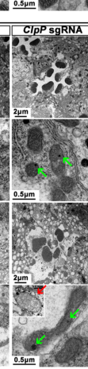

## Question

# Gene Research for Functional Annotation

## ⚠️ CRITICAL: Gene/Protein Identification Context

**BEFORE YOU BEGIN RESEARCH:** You MUST verify you are researching the CORRECT gene/protein. Gene symbols can be ambiguous, especially for less well-characterized genes from non-model organisms.

### Target Gene/Protein Identity (from UniProt):
- **UniProt Accession:** Q9VKY3
- **Protein Description:** RecName: Full=ATP-dependent Clp protease proteolytic subunit {ECO:0000256|RuleBase:RU003567}; EC=3.4.21.92 {ECO:0000256|RuleBase:RU000549};
- **Gene Information:** Name=ClpP {ECO:0000313|EMBL:AAF52923.1, ECO:0000313|FlyBase:FBgn0032229}; Synonyms=dClpP {ECO:0000313|EMBL:AAF52923.1}, Dmel\CG5045 {ECO:0000313|EMBL:AAF52923.1}; ORFNames=CG5045 {ECO:0000313|EMBL:AAF52923.1, ECO:0000313|FlyBase:FBgn0032229}, Dmel_CG5045 {ECO:0000313|EMBL:AAF52923.1};
- **Organism (full):** Drosophila melanogaster (Fruit fly).
- **Protein Family:** Belongs to the peptidase S14 family.
- **Key Domains:** ClpP. (IPR001907); ClpP/crotonase-like_dom_sf. (IPR029045); ClpP/TepA. (IPR023562); ClpP_His_AS. (IPR033135); ClpP_Ser_AS. (IPR018215)

### MANDATORY VERIFICATION STEPS:

1. **Check if the gene symbol "ClpP" matches the protein description above**
2. **Verify the organism is correct:** Drosophila melanogaster (Fruit fly).
3. **Check if protein family/domains align with what you find in literature**
4. **If you find literature for a DIFFERENT gene with the same or similar symbol, STOP**

### If Gene Symbol is Ambiguous or You Cannot Find Relevant Literature:

**DO NOT PROCEED WITH RESEARCH ON A DIFFERENT GENE.** Instead:
- State clearly: "The gene symbol 'ClpP' is ambiguous or literature is limited for this specific protein"
- Explain what you found (e.g., "Found extensive literature on a different gene with the same symbol in a different organism")
- Describe the protein based ONLY on the UniProt information provided above
- Suggest that the protein function can be inferred from domain/family information

### Research Target:

Please provide a comprehensive research report on the gene **ClpP** (gene ID: ClpP, UniProt: Q9VKY3) in DROME.

The research report should be a detailed narrative explaining the function, biological processes, and localization of the gene product. Citations should be given for all claims.

You should prioritize authoritative reviews and primary scientific literature when conducting research. You can supplement
this with annotations you find in gene/protein databases, but these can be outdated or inaccurate.

We are specifically interested in the primary function of the gene - for enzymes, what reaction is catalyzed, and what is the substrate specificity? For transporters, what is the substrate? For structural proteins or adapters, what is the broader structural role? For signaling molecules, what is the role in the pathway.

We are interested in where in or outside the cell the gene product carries out its function.

We are also interested in the signaling or biochemical pathways in which the gene functions. We are less interested in broad pleiotropic effects, except where these elucidate the precise role.

Include evidence where possible. We are interested in both experimental evidence as well as inference from structure, evolution, or bioinformatic analysis. Precise studies should be prioritized over high-throughput, where available.

## Output

Question: You are an expert researcher providing comprehensive, well-cited information.

Provide detailed information focusing on:
1. Key concepts and definitions with current understanding
2. Recent developments and latest research (prioritize 2023-2024 sources)
3. Current applications and real-world implementations
4. Expert opinions and analysis from authoritative sources
5. Relevant statistics and data from recent studies

Format as a comprehensive research report with proper citations. Include URLs and publication dates where available.
Always prioritize recent, authoritative sources and provide specific citations for all major claims.

# Gene Research for Functional Annotation

## ⚠️ CRITICAL: Gene/Protein Identification Context

**BEFORE YOU BEGIN RESEARCH:** You MUST verify you are researching the CORRECT gene/protein. Gene symbols can be ambiguous, especially for less well-characterized genes from non-model organisms.

### Target Gene/Protein Identity (from UniProt):
- **UniProt Accession:** Q9VKY3
- **Protein Description:** RecName: Full=ATP-dependent Clp protease proteolytic subunit {ECO:0000256|RuleBase:RU003567}; EC=3.4.21.92 {ECO:0000256|RuleBase:RU000549};
- **Gene Information:** Name=ClpP {ECO:0000313|EMBL:AAF52923.1, ECO:0000313|FlyBase:FBgn0032229}; Synonyms=dClpP {ECO:0000313|EMBL:AAF52923.1}, Dmel\CG5045 {ECO:0000313|EMBL:AAF52923.1}; ORFNames=CG5045 {ECO:0000313|EMBL:AAF52923.1, ECO:0000313|FlyBase:FBgn0032229}, Dmel_CG5045 {ECO:0000313|EMBL:AAF52923.1};
- **Organism (full):** Drosophila melanogaster (Fruit fly).
- **Protein Family:** Belongs to the peptidase S14 family.
- **Key Domains:** ClpP. (IPR001907); ClpP/crotonase-like_dom_sf. (IPR029045); ClpP/TepA. (IPR023562); ClpP_His_AS. (IPR033135); ClpP_Ser_AS. (IPR018215)

### MANDATORY VERIFICATION STEPS:

1. **Check if the gene symbol "ClpP" matches the protein description above**
2. **Verify the organism is correct:** Drosophila melanogaster (Fruit fly).
3. **Check if protein family/domains align with what you find in literature**
4. **If you find literature for a DIFFERENT gene with the same or similar symbol, STOP**

### If Gene Symbol is Ambiguous or You Cannot Find Relevant Literature:

**DO NOT PROCEED WITH RESEARCH ON A DIFFERENT GENE.** Instead:
- State clearly: "The gene symbol 'ClpP' is ambiguous or literature is limited for this specific protein"
- Explain what you found (e.g., "Found extensive literature on a different gene with the same symbol in a different organism")
- Describe the protein based ONLY on the UniProt information provided above
- Suggest that the protein function can be inferred from domain/family information

### Research Target:

Please provide a comprehensive research report on the gene **ClpP** (gene ID: ClpP, UniProt: Q9VKY3) in DROME.

The research report should be a detailed narrative explaining the function, biological processes, and localization of the gene product. Citations should be given for all claims.

You should prioritize authoritative reviews and primary scientific literature when conducting research. You can supplement
this with annotations you find in gene/protein databases, but these can be outdated or inaccurate.

We are specifically interested in the primary function of the gene - for enzymes, what reaction is catalyzed, and what is the substrate specificity? For transporters, what is the substrate? For structural proteins or adapters, what is the broader structural role? For signaling molecules, what is the role in the pathway.

We are interested in where in or outside the cell the gene product carries out its function.

We are also interested in the signaling or biochemical pathways in which the gene functions. We are less interested in broad pleiotropic effects, except where these elucidate the precise role.

Include evidence where possible. We are interested in both experimental evidence as well as inference from structure, evolution, or bioinformatic analysis. Precise studies should be prioritized over high-throughput, where available.

# Functional annotation report: *Drosophila melanogaster* ClpP

## Identity and principal function

**Identity check.** The target is the fruit-fly gene **ClpP/CG5045**, not the separate fly ATPase **ClpX/CG4538**, the fly protease **Lon/CG8798**, or a bacterial or human CLPP gene. Independent fly studies explicitly identify CG5045 as the proteolytic subunit of mitochondrial ClpXP. **UniProt Q9VKY3**, peptidase family S14, and the supplied InterPro domain identifiers are consistent with that identification, but the accession and individual domain identifiers were supplied in the question rather than independently reported in the examined experimental papers. (matsushima2017drosophilaproteaseclpxp pages 3-4, pareek2018lonproteaseinactivation pages 8-9, shi2026mitochondrialproteasesmaintain pages 2-4, shi2026mitochondrialproteasesmaintain pages 8-10)

**Primary molecular function.** ClpP is the **serine-protease subunit of the mitochondrial ClpXP protein-degradation machine**. Its reaction is hydrolysis of peptide bonds in proteins delivered into its proteolytic chamber, producing peptide fragments. ClpP does **not** itself supply the ATP-dependent motor function: ClpX recognizes and unfolds protein substrates and translocates them into ClpP using ATP. Conserved ClpP proteins contain a Ser–His–Asp catalytic triad; in fly cells, mutation of ClpP’s catalytic **Ser124 to Ala** impairs its function. The detailed triad chemistry and chamber architecture are supported principally by work on homologues, not by a reported purified-CG5045 kinetic or structural determination. (matsushima2017drosophilaproteaseclpxp pages 4-6, ishikawa2024proteindegradationby pages 3-4, isermann2026mitochondrialclppin pages 2-2)

**Where it acts.** The function is assigned to the **mitochondrial matrix**, where the ClpXP complex participates in intramitochondrial protein turnover. Fly-cell experiments show ClpP associating with ClpX; a later fly tissue study reports that overexpressed mitochondrial proteases, including strongly expressed ClpP, generally colocalize with a mitochondrial marker. Matrix-level assignment is supported by the conserved ClpXP system and the experimental context, but these observations should not be mistaken for direct ultrastructural mapping of endogenous CG5045 within a mitochondrion. There is no evidence here for ClpP acting as a secreted, cytosolic, or RNA-cleaving enzyme. (matsushima2017drosophilaproteaseclpxp pages 1-3, matsushima2017drosophilaproteaseclpxp pages 4-6, pareek2022aaa+proteasesthe pages 13-15, shi2026mitochondrialproteasesmaintain pages 10-13)

The evidence table separates direct observations on the fly protein from mechanistic inference and work on other species.

| Annotation | Precise evidence in fly | Confidence and limits | Source date + DOI URL |
|---|---|---|---|
| **Target identity: ClpP/CG5045** | Primary fly studies identify **CG5045** as the proteolytic subunit of the mitochondrial Clp protease and call it **ClpP**. The Q9VKY3 accession is user-provided and was not stated in the examined papers. (matsushima2017drosophilaproteaseclpxp pages 3-4, pareek2018lonproteaseinactivation pages 8-9) | **High** for gene, protein, and organism identity; database-supported rather than independently literature-verified for Q9VKY3 and the listed InterPro identifiers. | Matsushima et al., **August 2017**, [doi:10.1038/s41598-017-08088-6](https://doi.org/10.1038/s41598-017-08088-6); Pareek et al., **October 2018**, [doi:10.1038/s41420-018-0110-1](https://doi.org/10.1038/s41420-018-0110-1) |
| **Mitochondrial-matrix protease; ClpX partner** | Fly ClpP is the proteolytic component of mitochondrial **ClpXP**; ClpX/CG4538 is the separate chaperone-like AAA+ partner. FLAG-ClpX co-immunoprecipitated with ClpP in S2 cells. (matsushima2017drosophilaproteaseclpxp pages 1-3, matsushima2017drosophilaproteaseclpxp pages 4-6) | **High** for partnership and mitochondrial ClpXP assignment. Matrix localization is strongly supported by the conserved system and experimental context, although the 2017 study did not provide direct CG5045 localization microscopy. | Matsushima et al., **August 2017**, [doi:10.1038/s41598-017-08088-6](https://doi.org/10.1038/s41598-017-08088-6) |
| **Catalytic cleavage and Ser124** | ClpP is a serine endopeptidase that hydrolyzes peptide bonds inside its proteolytic chamber. In fly S2 cells, replacing active-site **Ser124 with Ala (S124A)** produced a catalytically inactive, dominant-negative protein; approximately 20-fold S124A overexpression increased ClpXP-regulated proteins, whereas wild-type ClpP did not. (matsushima2017drosophilaproteaseclpxp pages 4-6, matsushima2017drosophilaproteaseclpxp pages 12-13) | **High** that Ser124 is required for fly cellular proteolytic function; the complete Ser-His-Asp acylation/deacylation mechanism is inferred from conserved ClpP chemistry because purified CG5045 kinetics were not reported. | Matsushima et al., **August 2017**, [doi:10.1038/s41598-017-08088-6](https://doi.org/10.1038/s41598-017-08088-6); Ishikawa et al., **July 2024**, [doi:10.1111/gtc.13141](https://doi.org/10.1111/gtc.13141) |
| **ATP dependence and substrate selection** | ClpP supplies peptide-bond cleavage but not ATP-driven recognition or unfolding. By conserved mechanism, ClpX recognizes substrates, hydrolyzes ATP to unfold them, and translocates them into ClpP; fly knockdown of either ClpP or ClpX produced concordant substrate effects. (matsushima2017drosophilaproteaseclpxp pages 4-6, ishikawa2024proteindegradationby pages 3-4) | **High** for the division of labor; detailed motor-cycle and chamber architecture derive mainly from bacterial or ortholog studies rather than a fly CG5045 structure. | Matsushima et al., **August 2017**, [doi:10.1038/s41598-017-08088-6](https://doi.org/10.1038/s41598-017-08088-6); Ishikawa et al., **July 2024**, [doi:10.1111/gtc.13141](https://doi.org/10.1111/gtc.13141) |
| **Strongest fly substrate: DmLRPPRC1** | ClpP or ClpX depletion and ClpP-S124A expression increased **DmLRPPRC1 protein without increasing its mRNA**. ClpX associated with DmLRPPRC1, and DmLRPPRC1 was stabilized after ClpP knockdown, supporting post-translational degradation by ClpXP. (matsushima2017drosophilaproteaseclpxp pages 4-6) | **High cellular evidence** and the best-supported specific substrate. No purified fly ClpXP reconstitution was reported, so direct cleavage kinetics and sequence specificity remain unknown. | Matsushima et al., **August 2017**, [doi:10.1038/s41598-017-08088-6](https://doi.org/10.1038/s41598-017-08088-6) |
| **DmSLIRP1 is not a confirmed direct substrate** | DmSLIRP1 protein rose after ClpP/ClpX depletion, but it did **not** co-immunoprecipitate with FLAG-ClpX, and ClpP depletion did not block its facilitated degradation. Its abundance likely changes indirectly through its stabilizing relationship with DmLRPPRC1. (matsushima2017drosophilaproteaseclpxp pages 4-6, matsushima2017drosophilaproteaseclpxp pages 8-9) | **Moderate-to-high evidence against direct ClpXP degradation** under the tested S2-cell conditions; degradation in other contexts cannot be excluded. | Matsushima et al., **August 2017**, [doi:10.1038/s41598-017-08088-6](https://doi.org/10.1038/s41598-017-08088-6) |
| **Mitochondrial RNA-biogenesis effects** | ClpP depletion increased mitochondrial 12S/16S rRNAs, tRNAs, mtTFB2 expression, and mtDNA copy number by about **1.4-fold**; it also caused non-uniform increases in ND3, ND4/4L, and ND5 mRNAs and accumulation of longer COXIII-ATP6/8 and ND6-CytB transcripts. (matsushima2017drosophilaproteaseclpxp pages 3-4) | **High** for measured downstream changes; **moderate** for causality through DmLRPPRC1 because compensatory responses may contribute. ClpP is a protease, not an RNA-processing enzyme. | Matsushima et al., **August 2017**, [doi:10.1038/s41598-017-08088-6](https://doi.org/10.1038/s41598-017-08088-6) |
| **Mitochondrial translation and ribosome assembly** | ClpP depletion caused a **modest** reduction in mitochondrial translation and shifted mt-mRNAs away from assembled 55S ribosomes. Direct DmLRPPRC1 overexpression produced an approximately eightfold protein increase and reduced translation to **40% of control**; the 40% value applies to DmLRPPRC1 overexpression, **not** ClpP knockdown. (matsushima2017drosophilaproteaseclpxp pages 6-8, matsushima2017drosophilaproteaseclpxp pages 11-12) | **High** for the distinction between perturbations; **moderate-to-high** for the model that excess DmLRPPRC1 impedes joining of small and large mitoribosomal subunits. | Matsushima et al., **August 2017**, [doi:10.1038/s41598-017-08088-6](https://doi.org/10.1038/s41598-017-08088-6) |
| **Proteostasis interaction with Lon** | Neuronal ClpP overexpression rescued a climbing defect caused by Lon knockdown at one tested dosage. Stronger ClpP expression worsened the defect under another condition, indicating dosage sensitivity rather than uniformly beneficial action. (pareek2018lonproteaseinactivation pages 8-9) | **Moderate**; this is genetic and functional interaction evidence, not proof that ClpP and Lon share individual substrates. | Pareek et al., **October 2018**, [doi:10.1038/s41420-018-0110-1](https://doi.org/10.1038/s41420-018-0110-1) |
| **Latest fly knockout and tissue phenotypes** | A 2026 CRISPR screen reported that whole-animal **ClpP knockout is lethal**. Eye-specific loss caused age-dependent photoreceptor loss by day 30, elongated and cristae-deficient mitochondria, and intramitochondrial aggregates. Muscle- and fat-body-specific loss also reduced cristae; ClpP depletion elevated total HTT72Q but did not significantly increase aggregate formation in that assay. (shi2026mitochondrialproteasesmaintain pages 13-15, shi2026mitochondrialproteasesmaintain pages 10-13, shi2026mitochondrialproteasesmaintain pages 6-8, shi2026mitochondrialproteasesmaintain pages 8-10) | **High** for the screen observations; phenotype specificity is **moderate** because tissue-specific CRISPR, selected ages, and small TEM samples were used. These findings establish physiological importance but do not identify new direct substrates. | Shi et al., **June 2026**, [doi:10.1186/s13578-026-01612-0](https://doi.org/10.1186/s13578-026-01612-0) |
| **2025 phosphoserine degron: ortholog only** | Human mitochondrial ClpX preferentially recognized phosphoserine-bearing substrates through an RKL-loop mechanism; activated ClpP alone did not retain this preference, indicating selection by ClpX rather than intrinsic ClpP cleavage specificity. This was **not tested on Drosophila CG5045**. (feng2025serinephosphorylationfacilitates pages 1-2, feng2025serinephosphorylationfacilitates pages 2-3) | **High for human ClpXP; unverified for fly.** It should not be assigned as a fly ClpXP degron without direct testing. | Feng et al., **January 2025**, [doi:10.1073/pnas.2422447122](https://doi.org/10.1073/pnas.2422447122) |
| **2024 mechanistic literature: mostly non-fly** | Reviews describe tetradecameric ClpP chambers, Ser-His-Asp catalysis, gated entry, and AAA+ ATPase-mediated recognition, unfolding, and translocation. These principles fit CG5045's S14/ClpP annotation but were not established using purified fly protein. (franca2024structuralandfunctional pages 27-31, ishikawa2024proteindegradationby pages 3-4) | **Strong evolutionary and structural inference, not direct fly evidence.** The 2024 CLPP-null metabolomics study examined fungus and mouse, not Drosophila CG5045. (key2024clppnulleukaryoteswith pages 4-5) | Ishikawa et al., **July 2024**, [doi:10.1111/gtc.13141](https://doi.org/10.1111/gtc.13141); Key et al., **February 2024**, [doi:10.3390/biom14020241](https://doi.org/10.3390/biom14020241) |

*Table: Evidence-grading summary for Drosophila melanogaster ClpP/CG5045, separating direct fly results from conserved-mechanism and ortholog-only inferences. UniProt Q9VKY3 is treated as user-provided identity information.*

## Substrate specificity and pathway

The **best-supported specific fly substrate is DmLRPPRC1**, a mitochondrial RNA-associated protein. In *Drosophila* Schneider S2 cells, ClpP depletion, ClpX depletion, or expression of catalytically inactive ClpP S124A increased DmLRPPRC1 **protein without a corresponding increase in its mRNA**. DmLRPPRC1 was stabilized after ClpP depletion, and ClpX co-immunoprecipitated with both ClpP and DmLRPPRC1. Together these results make ClpXP-dependent post-translational degradation the strongest interpretation; they do not constitute a purified-enzyme demonstration of a particular DmLRPPRC1 cleavage site or a comprehensive substrate-specificity profile. (matsushima2017drosophilaproteaseclpxp pages 4-6)

**Substrate selection is distinct from peptide-bond chemistry.** The ClpX partner and access to ClpP’s chamber help determine which intact proteins can be degraded; a sequence motif or universal preferred cleavage site for fly ClpP has **not** been established by the cited fly experiments. Although DmSLIRP1 protein also rises after ClpXP depletion, it did not co-immunoprecipitate with ClpX, and the investigators found evidence that its abundance changes indirectly through its association with DmLRPPRC1. It should therefore **not** be annotated as a confirmed direct fly ClpXP substrate on the basis of increased protein abundance alone. (matsushima2017drosophilaproteaseclpxp pages 4-6, matsushima2017drosophilaproteaseclpxp pages 8-9, ishikawa2024proteindegradationby pages 3-4)

The clearest biochemical pathway is **ClpXP proteolysis → control of DmLRPPRC1 abundance → mitochondrial RNA handling and translation**. After ClpP depletion, fly S2 cells showed selective increases in ND3, ND4/4L, and ND5 mitochondrial mRNAs; accumulation of longer, apparently unprocessed COXIII–ATP6/8 and ND6–CytB transcripts; increases in mitochondrial rRNAs and tRNAs; and a modest reduction in mitochondrial protein synthesis. Mitochondrial DNA copy number increased approximately **1.4-fold**, but whether that response is directly mediated by DmLRPPRC1 is unresolved. Excess DmLRPPRC1 appears to interfere with formation of fully assembled **55S mitoribosomes**, providing a mechanistic link to reduced translation. Notably, the reported fall in mitochondrial translation to **40% of control** occurred with approximately **eightfold experimental overexpression of DmLRPPRC1**; it should not be assigned to ClpP knockdown, whose translation effect was described as modest. These RNA and ribosome changes are downstream consequences of proteolysis, **not evidence that ClpP directly processes RNA**. (matsushima2017drosophilaproteaseclpxp pages 6-8, matsushima2017drosophilaproteaseclpxp pages 3-4, matsushima2017drosophilaproteaseclpxp pages 8-9, matsushima2017drosophilaproteaseclpxp pages 11-12)

## Physiological evidence and recent developments

The direct fly substrate study remains the most precise functional evidence: **Matsushima and colleagues, August 2017**, *Scientific Reports*, https://doi.org/10.1038/s41598-017-08088-6. A complementary **October 2018** fly study found that neuronal ClpP overexpression could rescue a climbing defect caused by knockdown of the *different* mitochondrial protease Lon under one condition, whereas stronger expression worsened the defect under another. This indicates dosage-sensitive mitochondrial proteostasis interactions, not proof that Lon and ClpXP degrade the same individual proteins. https://doi.org/10.1038/s41420-018-0110-1. (matsushima2017drosophilaproteaseclpxp pages 3-4, matsushima2017drosophilaproteaseclpxp pages 4-6, pareek2018lonproteaseinactivation pages 8-9)

The most recent retrieved **fly-specific** experimental study, **Shi and colleagues, June 2026**, reports that whole-animal ClpP knockout is **lethal**. Tissue-restricted loss permitted analysis of survivors: eye-specific loss caused age-dependent photoreceptor degeneration by **day 30**, accompanied by elongated, cristae-deficient mitochondria and intramitochondrial aggregates; reduced cristae were also observed after loss in flight muscle and larval fat body. In its Huntington-polyglutamine assay, ClpP depletion increased total HTT72Q protein without increasing visible HTT72Q aggregate formation. These results support an important physiological role in mitochondrial and tissue homeostasis but do **not** establish HTT72Q as a directly cleaved ClpP substrate. https://doi.org/10.1186/s13578-026-01612-0. (shi2026mitochondrialproteasesmaintain pages 13-15, shi2026mitochondrialproteasesmaintain pages 10-13, shi2026mitochondrialproteasesmaintain pages 6-8, shi2026mitochondrialproteasesmaintain pages 8-10, shi2026mitochondrialproteasesmaintain media dc864d90)

**What 2023–2024 and newer ortholog work adds—and does not add.** A **July 2024** ClpXP review summarizes the established ClpP catalytic triad and ATP-dependent substrate delivery, predominantly from bacterial systems; these principles support the conserved-mechanism interpretation of fly CG5045 but are not a fly biochemical assay. https://doi.org/10.1111/gtc.13141. A **February 2024** CLPP-null metabolomics study investigated other eukaryotes, notably fungus and mouse, **not fly CG5045**. https://doi.org/10.3390/biom14020241. A **January 2025** human study identified phosphoserine-dependent substrate recognition involving a ClpX loop, distinguishing recognition by ClpX from intrinsic cleavage preference of ClpP. This intriguing mechanism has **not been demonstrated for fly ClpX–ClpP or DmLRPPRC1**, so it should not be transferred into the fly annotation as an established substrate rule. https://doi.org/10.1073/pnas.2422447122. No directly informative 2023–2024 CG5045-specific mechanistic experiment was identified among the retrieved sources. (ishikawa2024proteindegradationby pages 3-4, feng2025serinephosphorylationfacilitates pages 1-2, feng2025serinephosphorylationfacilitates pages 2-3, key2024clppnulleukaryoteswith pages 4-5)

## Annotation conclusion

The most defensible annotation for **Q9VKY3/CG5045** is **mitochondrial-matrix ClpXP catalytic protease subunit, required for ATP-dependent turnover of selected proteins delivered by ClpX**. Its strongest identified fly substrate is **DmLRPPRC1**; consequently, ClpP helps maintain mitochondrial transcript handling and translation. Its catalytic Ser124, cellular interaction with ClpX, and loss-of-function phenotypes provide direct fly support. Exact peptide-sequence preference, a complete substrate inventory, and whether human phosphoserine recognition operates in flies remain open questions. (matsushima2017drosophilaproteaseclpxp pages 4-6, matsushima2017drosophilaproteaseclpxp pages 11-12, feng2025serinephosphorylationfacilitates pages 1-2, shi2026mitochondrialproteasesmaintain pages 8-10)

References

1. (matsushima2017drosophilaproteaseclpxp pages 3-4): Y. Matsushima, Yuta Hirofuji, Masamune Aihara, Song Yue, T. Uchiumi, L. S. Kaguni, and Dongchon Kang. Drosophila protease clpxp specifically degrades dmlrpprc1 controlling mitochondrial mrna and translation. Scientific Reports, Aug 2017. URL: https://doi.org/10.1038/s41598-017-08088-6, doi:10.1038/s41598-017-08088-6. This article has 22 citations and is from a peer-reviewed journal.

2. (pareek2018lonproteaseinactivation pages 8-9): Gautam Pareek, Ruth E. Thomas, Evelyn S. Vincow, David R. Morris, and Leo J. Pallanck. Lon protease inactivation in drosophila causes unfolded protein stress and inhibition of mitochondrial translation. Cell Death Discovery, Oct 2018. URL: https://doi.org/10.1038/s41420-018-0110-1, doi:10.1038/s41420-018-0110-1. This article has 40 citations and is from a peer-reviewed journal.

3. (shi2026mitochondrialproteasesmaintain pages 2-4): Kexin Shi, Hao Liu, Hong Xu, Weina Shang, Liquan Wang, and Chao Tong. Mitochondrial proteases maintain cellular protein homeostasis and tissue integrity. Cell &amp; Bioscience, Jun 2026. URL: https://doi.org/10.1186/s13578-026-01612-0, doi:10.1186/s13578-026-01612-0. This article has 0 citations and is from a peer-reviewed journal.

4. (shi2026mitochondrialproteasesmaintain pages 8-10): Kexin Shi, Hao Liu, Hong Xu, Weina Shang, Liquan Wang, and Chao Tong. Mitochondrial proteases maintain cellular protein homeostasis and tissue integrity. Cell &amp; Bioscience, Jun 2026. URL: https://doi.org/10.1186/s13578-026-01612-0, doi:10.1186/s13578-026-01612-0. This article has 0 citations and is from a peer-reviewed journal.

5. (matsushima2017drosophilaproteaseclpxp pages 4-6): Y. Matsushima, Yuta Hirofuji, Masamune Aihara, Song Yue, T. Uchiumi, L. S. Kaguni, and Dongchon Kang. Drosophila protease clpxp specifically degrades dmlrpprc1 controlling mitochondrial mrna and translation. Scientific Reports, Aug 2017. URL: https://doi.org/10.1038/s41598-017-08088-6, doi:10.1038/s41598-017-08088-6. This article has 22 citations and is from a peer-reviewed journal.

6. (ishikawa2024proteindegradationby pages 3-4): Fumihiro Ishikawa, Michio Homma, Genzoh Tanabe, and Takayuki Uchihashi. Protein degradation by a component of the chaperonin‐linked protease clpp. Genes to Cells, 29:695-709, Jul 2024. URL: https://doi.org/10.1111/gtc.13141, doi:10.1111/gtc.13141. This article has 13 citations and is from a peer-reviewed journal.

7. (isermann2026mitochondrialclppin pages 2-2): Lea Isermann and Aleksandra Trifunovic. Mitochondrial <scp>clpp</scp> in health and disease: mechanisms, therapeutic duality and emerging opportunities. Journal of Inherited Metabolic Disease, Sep 2026. URL: https://doi.org/10.1002/jimd.70247, doi:10.1002/jimd.70247. This article has 0 citations and is from a peer-reviewed journal.

8. (matsushima2017drosophilaproteaseclpxp pages 1-3): Y. Matsushima, Yuta Hirofuji, Masamune Aihara, Song Yue, T. Uchiumi, L. S. Kaguni, and Dongchon Kang. Drosophila protease clpxp specifically degrades dmlrpprc1 controlling mitochondrial mrna and translation. Scientific Reports, Aug 2017. URL: https://doi.org/10.1038/s41598-017-08088-6, doi:10.1038/s41598-017-08088-6. This article has 22 citations and is from a peer-reviewed journal.

9. (pareek2022aaa+proteasesthe pages 13-15): Gautam Pareek. Aaa+ proteases: the first line of defense against mitochondrial damage. PeerJ, 10:e14350, Nov 2022. URL: https://doi.org/10.7717/peerj.14350, doi:10.7717/peerj.14350. This article has 15 citations and is from a peer-reviewed journal.

10. (shi2026mitochondrialproteasesmaintain pages 10-13): Kexin Shi, Hao Liu, Hong Xu, Weina Shang, Liquan Wang, and Chao Tong. Mitochondrial proteases maintain cellular protein homeostasis and tissue integrity. Cell &amp; Bioscience, Jun 2026. URL: https://doi.org/10.1186/s13578-026-01612-0, doi:10.1186/s13578-026-01612-0. This article has 0 citations and is from a peer-reviewed journal.

11. (matsushima2017drosophilaproteaseclpxp pages 12-13): Y. Matsushima, Yuta Hirofuji, Masamune Aihara, Song Yue, T. Uchiumi, L. S. Kaguni, and Dongchon Kang. Drosophila protease clpxp specifically degrades dmlrpprc1 controlling mitochondrial mrna and translation. Scientific Reports, Aug 2017. URL: https://doi.org/10.1038/s41598-017-08088-6, doi:10.1038/s41598-017-08088-6. This article has 22 citations and is from a peer-reviewed journal.

12. (matsushima2017drosophilaproteaseclpxp pages 8-9): Y. Matsushima, Yuta Hirofuji, Masamune Aihara, Song Yue, T. Uchiumi, L. S. Kaguni, and Dongchon Kang. Drosophila protease clpxp specifically degrades dmlrpprc1 controlling mitochondrial mrna and translation. Scientific Reports, Aug 2017. URL: https://doi.org/10.1038/s41598-017-08088-6, doi:10.1038/s41598-017-08088-6. This article has 22 citations and is from a peer-reviewed journal.

13. (matsushima2017drosophilaproteaseclpxp pages 6-8): Y. Matsushima, Yuta Hirofuji, Masamune Aihara, Song Yue, T. Uchiumi, L. S. Kaguni, and Dongchon Kang. Drosophila protease clpxp specifically degrades dmlrpprc1 controlling mitochondrial mrna and translation. Scientific Reports, Aug 2017. URL: https://doi.org/10.1038/s41598-017-08088-6, doi:10.1038/s41598-017-08088-6. This article has 22 citations and is from a peer-reviewed journal.

14. (matsushima2017drosophilaproteaseclpxp pages 11-12): Y. Matsushima, Yuta Hirofuji, Masamune Aihara, Song Yue, T. Uchiumi, L. S. Kaguni, and Dongchon Kang. Drosophila protease clpxp specifically degrades dmlrpprc1 controlling mitochondrial mrna and translation. Scientific Reports, Aug 2017. URL: https://doi.org/10.1038/s41598-017-08088-6, doi:10.1038/s41598-017-08088-6. This article has 22 citations and is from a peer-reviewed journal.

15. (shi2026mitochondrialproteasesmaintain pages 13-15): Kexin Shi, Hao Liu, Hong Xu, Weina Shang, Liquan Wang, and Chao Tong. Mitochondrial proteases maintain cellular protein homeostasis and tissue integrity. Cell &amp; Bioscience, Jun 2026. URL: https://doi.org/10.1186/s13578-026-01612-0, doi:10.1186/s13578-026-01612-0. This article has 0 citations and is from a peer-reviewed journal.

16. (shi2026mitochondrialproteasesmaintain pages 6-8): Kexin Shi, Hao Liu, Hong Xu, Weina Shang, Liquan Wang, and Chao Tong. Mitochondrial proteases maintain cellular protein homeostasis and tissue integrity. Cell &amp; Bioscience, Jun 2026. URL: https://doi.org/10.1186/s13578-026-01612-0, doi:10.1186/s13578-026-01612-0. This article has 0 citations and is from a peer-reviewed journal.

17. (feng2025serinephosphorylationfacilitates pages 1-2): Yue Feng, Monica M. Goncalves, Yulia Jitkova, Alexander F. A. Keszei, Yongran Yan, Chaitra Sarathy, Jonathan St-Germain, Tristan M. G. Kenney, Matthew Tcheng, Vincent Trudel, Ross S. Mancini, Rahul Upadhyay, Rose Hurren, Marcela Gronda, Matthew Schultz, Kaylen Soriano, Kaitlin Lees, Neil C. Pomroy, S. Quinn W. Currie, Gilbert G. Privé, Mark A. Reed, Andrei K. Yudin, Linda Z. Penn, Cheryl H. Arrowsmith, Brian Raught, Mohammad T. Mazhab-Jafari, Siavash Vahidi, and Aaron D. Schimmer. Serine phosphorylation facilitates protein degradation by the human mitochondrial clpxp protease. Proceedings of the National Academy of Sciences of the United States of America, Jan 2025. URL: https://doi.org/10.1073/pnas.2422447122, doi:10.1073/pnas.2422447122. This article has 18 citations and is from a highest quality peer-reviewed journal.

18. (feng2025serinephosphorylationfacilitates pages 2-3): Yue Feng, Monica M. Goncalves, Yulia Jitkova, Alexander F. A. Keszei, Yongran Yan, Chaitra Sarathy, Jonathan St-Germain, Tristan M. G. Kenney, Matthew Tcheng, Vincent Trudel, Ross S. Mancini, Rahul Upadhyay, Rose Hurren, Marcela Gronda, Matthew Schultz, Kaylen Soriano, Kaitlin Lees, Neil C. Pomroy, S. Quinn W. Currie, Gilbert G. Privé, Mark A. Reed, Andrei K. Yudin, Linda Z. Penn, Cheryl H. Arrowsmith, Brian Raught, Mohammad T. Mazhab-Jafari, Siavash Vahidi, and Aaron D. Schimmer. Serine phosphorylation facilitates protein degradation by the human mitochondrial clpxp protease. Proceedings of the National Academy of Sciences of the United States of America, Jan 2025. URL: https://doi.org/10.1073/pnas.2422447122, doi:10.1073/pnas.2422447122. This article has 18 citations and is from a highest quality peer-reviewed journal.

19. (franca2024structuralandfunctional pages 27-31): B Alves França. Structural and functional aspects of the paradoxical clpp modulation by peptidomimetic boronate compounds. Unknown journal, 2024.

20. (key2024clppnulleukaryoteswith pages 4-5): Jana Key, Suzana Gispert, Arvind Reddy Kandi, Daniela Heinz, Andrea Hamann, Heinz D. Osiewacz, David Meierhofer, and Georg Auburger. Clpp-null eukaryotes with excess heme biosynthesis show reduced l-arginine levels, probably via clpx-mediated oat activation. Biomolecules, 14:241, Feb 2024. URL: https://doi.org/10.3390/biom14020241, doi:10.3390/biom14020241. This article has 4 citations.

21. (shi2026mitochondrialproteasesmaintain media dc864d90): Kexin Shi, Hao Liu, Hong Xu, Weina Shang, Liquan Wang, and Chao Tong. Mitochondrial proteases maintain cellular protein homeostasis and tissue integrity. Cell &amp; Bioscience, Jun 2026. URL: https://doi.org/10.1186/s13578-026-01612-0, doi:10.1186/s13578-026-01612-0. This article has 0 citations and is from a peer-reviewed journal.

## Artifacts

- [Edison artifact artifact-00](ClpP-deep-research-falcon_artifacts/artifact-00.md)

## Citations

1. matsushima2017drosophilaproteaseclpxp pages 4-6
2. matsushima2017drosophilaproteaseclpxp pages 3-4
3. pareek2018lonproteaseinactivation pages 8-9
4. key2024clppnulleukaryoteswith pages 4-5
5. shi2026mitochondrialproteasesmaintain pages 2-4
6. shi2026mitochondrialproteasesmaintain pages 8-10
7. ishikawa2024proteindegradationby pages 3-4
8. isermann2026mitochondrialclppin pages 2-2
9. matsushima2017drosophilaproteaseclpxp pages 1-3
10. shi2026mitochondrialproteasesmaintain pages 10-13
11. matsushima2017drosophilaproteaseclpxp pages 12-13
12. matsushima2017drosophilaproteaseclpxp pages 8-9
13. matsushima2017drosophilaproteaseclpxp pages 6-8
14. matsushima2017drosophilaproteaseclpxp pages 11-12
15. shi2026mitochondrialproteasesmaintain pages 13-15
16. shi2026mitochondrialproteasesmaintain pages 6-8
17. feng2025serinephosphorylationfacilitates pages 1-2
18. feng2025serinephosphorylationfacilitates pages 2-3
19. franca2024structuralandfunctional pages 27-31
20. doi:10.1038/s41598-017-08088-6
21. doi:10.1038/s41420-018-0110-1
22. doi:10.1111/gtc.13141
23. doi:10.1186/s13578-026-01612-0
24. doi:10.1073/pnas.2422447122
25. doi:10.3390/biom14020241
26. https://doi.org/10.1038/s41598-017-08088-6
27. https://doi.org/10.1038/s41420-018-0110-1
28. https://doi.org/10.1111/gtc.13141
29. https://doi.org/10.1186/s13578-026-01612-0
30. https://doi.org/10.1073/pnas.2422447122
31. https://doi.org/10.3390/biom14020241
32. https://doi.org/10.1038/s41598-017-08088-6.
33. https://doi.org/10.1038/s41420-018-0110-1.
34. https://doi.org/10.1186/s13578-026-01612-0.
35. https://doi.org/10.1111/gtc.13141.
36. https://doi.org/10.3390/biom14020241.
37. https://doi.org/10.1073/pnas.2422447122.
38. https://doi.org/10.1038/s41598-017-08088-6,
39. https://doi.org/10.1038/s41420-018-0110-1,
40. https://doi.org/10.1186/s13578-026-01612-0,
41. https://doi.org/10.1111/gtc.13141,
42. https://doi.org/10.1002/jimd.70247,
43. https://doi.org/10.7717/peerj.14350,
44. https://doi.org/10.1073/pnas.2422447122,
45. https://doi.org/10.3390/biom14020241,