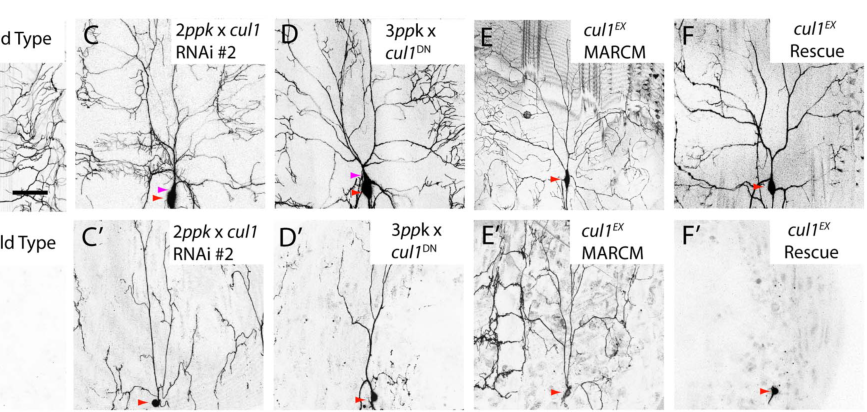

## Question

# Gene Research for Functional Annotation

## ⚠️ CRITICAL: Gene/Protein Identification Context

**BEFORE YOU BEGIN RESEARCH:** You MUST verify you are researching the CORRECT gene/protein. Gene symbols can be ambiguous, especially for less well-characterized genes from non-model organisms.

### Target Gene/Protein Identity (from UniProt):
- **UniProt Accession:** Q24311
- **Protein Description:** RecName: Full=Cullin homolog 1; AltName: Full=Lin-19 homolog protein;
- **Gene Information:** Name=Cul1; Synonyms=cul-1, lin19; ORFNames=CG1877;
- **Organism (full):** Drosophila melanogaster (Fruit fly).
- **Protein Family:** Belongs to the cullin family. {ECO:0000255|PROSITE-
- **Key Domains:** Cullin. (IPR045093); Cullin-like_AB. (IPR059120); Cullin_CS. (IPR016157); Cullin_homology. (IPR016158); Cullin_homology_sf. (IPR036317)

### MANDATORY VERIFICATION STEPS:

1. **Check if the gene symbol "Cul1" matches the protein description above**
2. **Verify the organism is correct:** Drosophila melanogaster (Fruit fly).
3. **Check if protein family/domains align with what you find in literature**
4. **If you find literature for a DIFFERENT gene with the same or similar symbol, STOP**

### If Gene Symbol is Ambiguous or You Cannot Find Relevant Literature:

**DO NOT PROCEED WITH RESEARCH ON A DIFFERENT GENE.** Instead:
- State clearly: "The gene symbol 'Cul1' is ambiguous or literature is limited for this specific protein"
- Explain what you found (e.g., "Found extensive literature on a different gene with the same symbol in a different organism")
- Describe the protein based ONLY on the UniProt information provided above
- Suggest that the protein function can be inferred from domain/family information

### Research Target:

Please provide a comprehensive research report on the gene **Cul1** (gene ID: Cul1, UniProt: Q24311) in DROME.

The research report should be a detailed narrative explaining the function, biological processes, and localization of the gene product. Citations should be given for all claims.

You should prioritize authoritative reviews and primary scientific literature when conducting research. You can supplement
this with annotations you find in gene/protein databases, but these can be outdated or inaccurate.

We are specifically interested in the primary function of the gene - for enzymes, what reaction is catalyzed, and what is the substrate specificity? For transporters, what is the substrate? For structural proteins or adapters, what is the broader structural role? For signaling molecules, what is the role in the pathway.

We are interested in where in or outside the cell the gene product carries out its function.

We are also interested in the signaling or biochemical pathways in which the gene functions. We are less interested in broad pleiotropic effects, except where these elucidate the precise role.

Include evidence where possible. We are interested in both experimental evidence as well as inference from structure, evolution, or bioinformatic analysis. Precise studies should be prioritized over high-throughput, where available.

## Output

Question: You are an expert researcher providing comprehensive, well-cited information.

Provide detailed information focusing on:
1. Key concepts and definitions with current understanding
2. Recent developments and latest research (prioritize 2023-2024 sources)
3. Current applications and real-world implementations
4. Expert opinions and analysis from authoritative sources
5. Relevant statistics and data from recent studies

Format as a comprehensive research report with proper citations. Include URLs and publication dates where available.
Always prioritize recent, authoritative sources and provide specific citations for all major claims.

# Gene Research for Functional Annotation

## ⚠️ CRITICAL: Gene/Protein Identification Context

**BEFORE YOU BEGIN RESEARCH:** You MUST verify you are researching the CORRECT gene/protein. Gene symbols can be ambiguous, especially for less well-characterized genes from non-model organisms.

### Target Gene/Protein Identity (from UniProt):
- **UniProt Accession:** Q24311
- **Protein Description:** RecName: Full=Cullin homolog 1; AltName: Full=Lin-19 homolog protein;
- **Gene Information:** Name=Cul1; Synonyms=cul-1, lin19; ORFNames=CG1877;
- **Organism (full):** Drosophila melanogaster (Fruit fly).
- **Protein Family:** Belongs to the cullin family. {ECO:0000255|PROSITE-
- **Key Domains:** Cullin. (IPR045093); Cullin-like_AB. (IPR059120); Cullin_CS. (IPR016157); Cullin_homology. (IPR016158); Cullin_homology_sf. (IPR036317)

### MANDATORY VERIFICATION STEPS:

1. **Check if the gene symbol "Cul1" matches the protein description above**
2. **Verify the organism is correct:** Drosophila melanogaster (Fruit fly).
3. **Check if protein family/domains align with what you find in literature**
4. **If you find literature for a DIFFERENT gene with the same or similar symbol, STOP**

### If Gene Symbol is Ambiguous or You Cannot Find Relevant Literature:

**DO NOT PROCEED WITH RESEARCH ON A DIFFERENT GENE.** Instead:
- State clearly: "The gene symbol 'Cul1' is ambiguous or literature is limited for this specific protein"
- Explain what you found (e.g., "Found extensive literature on a different gene with the same symbol in a different organism")
- Describe the protein based ONLY on the UniProt information provided above
- Suggest that the protein function can be inferred from domain/family information

### Research Target:

Please provide a comprehensive research report on the gene **Cul1** (gene ID: Cul1, UniProt: Q24311) in DROME.

The research report should be a detailed narrative explaining the function, biological processes, and localization of the gene product. Citations should be given for all claims.

You should prioritize authoritative reviews and primary scientific literature when conducting research. You can supplement
this with annotations you find in gene/protein databases, but these can be outdated or inaccurate.

We are specifically interested in the primary function of the gene - for enzymes, what reaction is catalyzed, and what is the substrate specificity? For transporters, what is the substrate? For structural proteins or adapters, what is the broader structural role? For signaling molecules, what is the role in the pathway.

We are interested in where in or outside the cell the gene product carries out its function.

We are also interested in the signaling or biochemical pathways in which the gene functions. We are less interested in broad pleiotropic effects, except where these elucidate the precise role.

Include evidence where possible. We are interested in both experimental evidence as well as inference from structure, evolution, or bioinformatic analysis. Precise studies should be prioritized over high-throughput, where available.

# Functional annotation report: *Cul1* in *Drosophila melanogaster*

## Identity and principal function

**Identity check.** The target specified as UniProt [Q24311](https://www.uniprot.org/uniprotkb/Q24311/entry), gene *Cul1*/*cul-1*/*lin19*, ORF CG1877, is the fruit-fly cullin homolog 1—not *Cul3*, a plant *CUL1*, or human CUL1. Fly experiments explicitly identify *cul1* as *lin19* and place its product in a cullin-based SCF complex. The accession, CG1877 assignment, and listed cullin-domain identifiers are supplied in the question; the retrieved primary papers independently corroborate the fly gene name, organism, and cullin-scaffold function, but do not independently establish the accession-to-ORF mapping. (wong2013acullin1basedscf pages 3-5, ou2002distinctproteindegradation pages 1-2)

**Primary molecular role.** Cul1 is an **intracellular scaffold for SCF (Skp1–Cullin1–F-box) cullin–RING E3 ubiquitin ligases**, not a stand-alone enzyme with a fixed substrate. Its N-terminal region supports recruitment of the Skp1-like adaptor **SkpA** and an interchangeable F-box substrate receptor, whereas its C-terminal region engages the RING protein **Roc1a**, which positions a ubiquitin-loaded E2 near the recruited substrate. The cullin, cullin-like and cullin-homology domains provided for Q24311 fit this structural assignment. For the experimentally well-characterized **SCF^Slimb** complex, Slimb selects substrates; Cul1 supplies the scaffold. Consequently, it is more accurate to describe *Cul1* as enabling substrate-selective **protein ubiquitination**, often followed by proteasomal turnover, than to assign Cul1 an intrinsic catalytic reaction or a single substrate specificity. Fly genetic studies identify all four components, and fly-ovary Slimb affinity purification detects SkpA, Cul1, and Roc1a together. (wong2013acullin1basedscf pages 3-5, silva2021ubiquitinligasesregulate pages 122-127, wong2013acullin1basedscf pages 1-2)

Fly Cul1 is **Nedd8-modified**: biochemical experiments detected the modified Cul1 species and its loss in *Nedd8* mutants. Neddylation regulates productive SCF activity; the COP9 signalosome removes Nedd8 and helps regulate Cul1-containing ligases during oogenesis. A Cul1 dominant-negative construct lacking the putative C-terminal Roc1-binding region and neddylation site disrupts neuronal pruning. These observations support regulated complex assembly and activity, rather than an unvarying ubiquitination rate. (ou2002distinctproteindegradation pages 4-6, doronkin2003thecop9signalosome pages 1-2, wong2013acullin1basedscf pages 3-5)

## Substrates and pathways: strength of the evidence

The following table separates fly Cul1 interventions from conclusions based primarily on another SCF component or on biochemical assays outside the fly.

| Substrate or pathway | Cul1/SCF mechanism | Strongest fly-specific evidence and qualification | Publication year and DOI URL |
|---|---|---|---|
| **Cubitus interruptus (Ci); Hedgehog** | Nedd8-activated SCF^Slimb promotes Ci processing/degradation anterior to the eye-disc morphogenetic furrow. | *cul1*, *Nedd8*, and *slimb* mutant clones accumulate full-length Ci anteriorly. Posterior Ci turnover instead requires Cul3, preventing attribution of all Ci degradation to Cul1. **Direct genetic/biochemical support.** (ou2002distinctproteindegradation pages 4-6, ou2002distinctproteindegradation pages 6-7) | Ou et al., 2002 — [10.1101/gad.1011402](https://doi.org/10.1101/gad.1011402) |
| **Armadillo (Arm); Wingless/Wnt** | SCF^Slimb ubiquitinates phosphorylated Arm, limiting Wingless signaling. | Arm accumulates in the cytosol of *Nedd8* or *cul1* mutant cells; Dcul1 overexpression reduces stabilized Arm in wing discs. Hipk reverses this effect by acting directly on Slimb rather than Cul1 itself. **Strong genetic; Cul1–Arm biochemical contact not shown.** (ou2002distinctproteindegradation pages 2-3, ou2002distinctproteindegradation pages 6-7, swarup2011drosophilahomeodomaininteractingprotein pages 1-3) | Ou et al., 2002 — [10.1101/gad.1011402](https://doi.org/10.1101/gad.1011402); Swarup & Verheyen, 2011 — [10.1073/pnas.1017548108](https://doi.org/10.1073/pnas.1017548108) |
| **Akt; InR/PI3K/TOR and neuronal pruning** | SCF^Slimb binds and polyubiquitinates Akt, reducing Akt abundance/activity so metamorphic dendrite pruning can proceed. | *cul1* loss/RNAi elevates Akt and phospho-Akt; Slimb–Akt association and WD40-dependent ubiquitination were demonstrated. Akt knockdown reduced retained dendrites after *cul1* RNAi from 8.1 to 0.2 per neuron. **Direct genetic, biochemical, and epistasis support.** (wong2013acullin1basedscf pages 15-16, wong2013acullin1basedscf pages 10-13) | Wong et al., 2013 — [10.1371/journal.pbio.1001657](https://doi.org/10.1371/journal.pbio.1001657) |
| **dIRS1; insulin signaling and sensory neuropathy** | Activated CUL1–RBX1–NEDD8 promotes dIRS1 ubiquitination; neuronal Cul1 suppression increases Akt signaling and opposes diabetic sensory phenotypes. | CUL1 ubiquitinated expressed dIRS1 in HEK293E cells, with major candidate sites K538, K551/552, K754, K868, and K950. Sensory-neuron Cul1 RNAi rescued neuron/axon loss, heat-response defects, and hyperglycemia in *UCH* mutants or high-sugar-fed flies. **Strong functional fly evidence, but no demonstration of endogenous dIRS1 ubiquitination in flies.** (lee2024diabeticsensoryneuropathy pages 10-11) | Lee et al., 2024 — [10.1038/s41467-024-44747-9](https://doi.org/10.1038/s41467-024-44747-9) |
| **Cyclin E; cell-cycle control** | An SCF containing the F-box protein Archipelago is implicated in Cyclin E turnover; Cul1 activity is regulated by Nedd8/COP9 cycling. | Cyclin E accumulates in *Nedd8* mutant eye cells. During oogenesis, COP9 or SCF defects phenocopy Cyclin E excess, and CSN4/CSN5 loss impairs Cul1 deneddylation. **Strong pathway-level genetics; direct Cul1–Archipelago–Cyclin E biochemistry is limited in these studies.** (ou2002distinctproteindegradation pages 2-3, doronkin2003thecop9signalosome pages 1-2) | Ou et al., 2002 — [10.1101/gad.1011402](https://doi.org/10.1101/gad.1011402); Doronkin et al., 2003 — [10.1016/S1534-5807(03)00121-7](https://doi.org/10.1016/S1534-5807(03)00121-7) |
| **E2F; G1/S transition** | Phosphorylated E2F is recognized by Slimb and eliminated by SCF during S-phase entry. | Partial Cul1 inhibition delays E2F loss; *slimb* reduction abolishes normal E2F cycling, and Slimb binds E2F in vitro in a phosphorylation-dependent manner. Initial interference used overexpressed mouse Cul1 as a dominant negative in fly wing discs. **Supportive genetics/biochemistry with perturbation caveat.** (heriche2003involvementofan pages 1-2, heriche2003involvementofan pages 9-11) | Hériché et al., 2003 — [10.1186/1471-2156-4-9](https://doi.org/10.1186/1471-2156-4-9) |
| **Expanded (Ex); Crumbs/Hippo** | Crumbs recruits Ex apically and promotes phosphodegron-dependent recognition and ubiquitination by SCF^Slimb, relieving inhibition of Yorkie. | Slimb depletion or Ex-S453 mutation blocks Crumbs-induced Ex ubiquitination; *slimb* clones accumulate Ex. Cul1/Lin19 co-purified with Ex–Slimb–SkpA, but no Cul1-specific depletion or rescue established an independent requirement. **Direct for Slimb/Ex; Cul1 assignment is complex-level inference.** (ribeiro2014crumbspromotesexpanded pages 6-7, ribeiro2014crumbspromotesexpanded pages 3-4) | Ribeiro et al., 2014 — [10.1073/pnas.1315508111](https://doi.org/10.1073/pnas.1315508111) |

*Table: Evidence-tiered summary of experimentally supported Cul1/SCF substrates and pathways in Drosophila melanogaster. Qualifications distinguish direct Cul1 evidence from SCF-complex inference, heterologous biochemistry, and Cul3-dependent mechanisms.*

**Hedgehog and Wingless.** In developing eye discs, loss of *cul1* causes full-length Cubitus interruptus (Ci) to accumulate **anterior** to the morphogenetic furrow, consistent with SCF^Slimb-dependent Ci processing when Hedgehog signaling is low. Ci accumulation **posterior** to that boundary instead follows *cul3* loss; these are spatially distinct cullin mechanisms, not interchangeable annotations for Cul1. Cul1 and Nedd8 perturbations also increase Armadillo (Arm, fly β-catenin), linking Cul1-SCF to restraint of Wingless signaling. In wing discs, Dcul1 overexpression reduces stabilized Arm, while Hipk counteracts this effect by acting on Slimb and suppressing Slimb-mediated Arm ubiquitination. The evidence for Hipk’s direct biochemical interaction is with **Slimb**, not Cul1. (ou2002distinctproteindegradation pages 4-6, ou2002distinctproteindegradation pages 6-7, swarup2011drosophilahomeodomaininteractingprotein pages 1-3)

**Neuronal insulin signaling.** During metamorphosis, a Cul1–Roc1a–SkpA–Slimb ligase enables pruning of dendrites in ddaC sensory neurons. Slimb binds Akt and promotes its ubiquitination; *cul1* depletion increases Akt abundance and phosphorylation, and Akt reduction suppresses the pruning defect. This places the complex downstream of ecdysone-responsive EcR-B1/Sox14 and upstream of reduced **InR–PI3K–Akt–TOR** signaling in this particular pruning program. Mushroom-body axon pruning also requires SCF components, but the investigators did **not** establish the same Akt-dependent mechanism for that second mode of pruning. (wong2013acullin1basedscf pages 1-2, wong2013acullin1basedscf pages 15-16, wong2013acullin1basedscf pages 10-13)

**Cell-cycle and epithelial contexts.** Fly genetic and biochemical work implicates Cul1-associated SCF ligases in turnover of Cyclin E, with Archipelago as the implicated F-box receptor, and in phosphorylation-dependent disappearance of E2F at S-phase entry, with Slimb binding E2F *in vitro*. Some E2F interference experiments used overexpressed **mouse** Cul1 as a dominant-negative reagent in fly tissue; this should not be mistaken for a study of mouse E2F in vivo. In wing epithelia, Crumbs-dependent recognition and ubiquitination of the Hippo regulator Expanded are well supported for **Slimb**; Cul1 co-purifies with the complex, but a Cul1-specific requirement for Expanded degradation was not independently established in that study. (ou2002distinctproteindegradation pages 2-3, heriche2003involvementofan pages 1-2, doronkin2003thecop9signalosome pages 1-2, ribeiro2014crumbspromotesexpanded pages 3-4, ribeiro2014crumbspromotesexpanded pages 6-7)

## Where the protein functions

Cul1’s demonstrated function is **inside cells**, in ubiquitin-ligase complexes acting in eye and wing imaginal-disc cells, ovarian tissue, and neurons; it is not characterized here as a secreted protein or transmembrane transporter. Its relevant *tissue* locations are experimentally clear, but the examined fly studies do **not** establish a definitive, universal nucleus-versus-cytoplasm distribution for **endogenous Cul1 protein**. For example, an expressed SkpA marker appears across neuronal somas and processes, and Cul1-dependent Akt changes occur in neuronal somas and processes; neither observation directly images Cul1. Likewise, Expanded’s apical-membrane localization suggests a site for Crumbs-associated substrate recognition, **not proof that Cul1 itself is anchored at the plasma membrane**. Nuclear accumulation measured for mammalian CUL1 cannot simply be transferred to fly Q24311. Cul1 is thus best annotated as an intracellular SCF scaffold whose effective site of action depends on its receptor and substrate, with fly-protein subcellular localization remaining less precisely resolved than its genetic function. (ou2002distinctproteindegradation pages 6-7, ribeiro2014crumbspromotesexpanded pages 6-7, furukawa2000thecul1cterminal pages 1-2, lee2024diabeticsensoryneuropathy pages 12-13, wong2013acullin1basedscf pages 10-13)

## Recent research and experimental applications

A **January 2024** study connected fly Cul1 to insulin resistance and sensory-neuron degeneration. In flies deficient in the deubiquitinase UCH, sensory-neuron-directed *Cul1* knockdown improved neuron and axon preservation, heat-evoked behavior, and elevated hemolymph glucose; suppression also benefited high-sugar-diet models. In a **heterologous HEK293E biochemical assay**, activated CUL1–RBX1–NEDD8 increased ubiquitination of both human IRS1 and expressed **Drosophila dIRS1**, whereas active UCHL1 opposed that effect. The study therefore supports an antagonistic UCHL1–CUL1–IRS1-family mechanism and a functional role for fly Cul1, while **not directly demonstrating ubiquitination of endogenous dIRS1 by Cul1 inside fly neurons**. High-sucrose feeding raised fly *Cul1* transcript abundance approximately **fourfold**; genetic tests implicated Snail in this induction. Transcript detected in isolated neuronal nuclei must not be interpreted as nuclear localization of Cul1 protein. (lee2024diabeticsensoryneuropathy pages 10-11, lee2024diabeticsensoryneuropathy pages 12-13)

The fly also provides a quantitative model for mechanism and intervention: at **16 hours after puparium formation**, *cul1* null ddaC clones retained an average **15.8** primary/secondary dendrites per neuron (**n = 6**), and full-length Cul1 rescued the defect (**n = 8**). In a separate epistasis experiment, reducing Akt lowered the average retained dendrites in a *cul1*-RNAi condition from **8.1 to 0.2**. These are experimental-model results, **not evidence of a clinical Cul1-directed treatment**. A September 2023 virus–circadian study should not be cited as direct evidence that fly Cul1 targets Timeless: its CUL1–Timeless mechanism was demonstrated primarily in a **planthopper**, whereas transgenic flies were used to examine viral-protein-associated behavior. (wong2013acullin1basedscf pages 3-5, wong2013acullin1basedscf media 2bd35fd3, wong2013acullin1basedscf pages 10-13, gao2023aplantcytorhabdovirus pages 1-2)

**Overall assessment.** The high-confidence annotation for Q24311 is a **Nedd8-regulated Cul1 scaffold of intracellular SCF ubiquitin ligases**, with substrate choice supplied by F-box receptors. Especially strong fly-specific mechanistic evidence links it to spatially restricted Ci regulation and to Slimb–Akt-dependent neuronal pruning. Arm regulation, Cyclin E/E2F turnover, and the recent insulin-signaling model broaden the supported pathway range, but evidence for direct Cul1 action varies across these substrates; Expanded illustrates why co-purification with an SCF complex should not be presented as a Cul1-specific loss-of-function result. (ou2002distinctproteindegradation pages 4-6, ou2002distinctproteindegradation pages 6-7, wong2013acullin1basedscf pages 15-16, lee2024diabeticsensoryneuropathy pages 10-11, ribeiro2014crumbspromotesexpanded pages 3-4)

### Principal sources and publication dates

- Ou *et al.*, **September 2002**, *Genes & Development*: [Cul1 versus Cul3 in fly Ci degradation](https://doi.org/10.1101/gad.1011402). (ou2002distinctproteindegradation pages 1-2)
- Hériché *et al.*, **June 2003**, *BMC Genetics*: [SCF^Slimb and fly E2F](https://doi.org/10.1186/1471-2156-4-9). (heriche2003involvementofan pages 1-2)
- Doronkin *et al.*, **May 2003**, *Developmental Cell*: [COP9 and Cyclin E in oogenesis](https://doi.org/10.1016/S1534-5807(03)00121-7). (doronkin2003thecop9signalosome pages 1-2)
- Swarup and Verheyen, **May 2011**, *PNAS*: [Hipk, SCF and Wingless/Hedgehog signaling](https://doi.org/10.1073/pnas.1017548108). (swarup2011drosophilahomeodomaininteractingprotein pages 1-3)
- Wong *et al.*, **September 2013**, *PLoS Biology*: [Cul1–SCF, Akt and neuronal pruning](https://doi.org/10.1371/journal.pbio.1001657). (wong2013acullin1basedscf pages 1-2)
- Ribeiro *et al.*, **April 2014**, *PNAS*: [Crumbs, Expanded and SCF^Slimb](https://doi.org/10.1073/pnas.1315508111). (ribeiro2014crumbspromotesexpanded pages 3-4)
- Lee *et al.*, **January 2024**, *Nature Communications*: [UCHL1, Cul1 and sensory insulin signaling](https://doi.org/10.1038/s41467-024-44747-9). (lee2024diabeticsensoryneuropathy pages 10-11)

References

1. (wong2013acullin1basedscf pages 3-5): Jack Jing Lin Wong, Song Li, Edwin Kok Hao Lim, Yan Wang, Cheng Wang, Heng Zhang, Daniel Kirilly, Chunlai Wu, Yih-Cherng Liou, Hongyan Wang, and Fengwei Yu. A cullin1-based scf e3 ubiquitin ligase targets the inr/pi3k/tor pathway to regulate neuronal pruning. PLoS Biology, 11:e1001657, Sep 2013. URL: https://doi.org/10.1371/journal.pbio.1001657, doi:10.1371/journal.pbio.1001657. This article has 107 citations and is from a highest quality peer-reviewed journal.

2. (ou2002distinctproteindegradation pages 1-2): Chan-Yen Ou, Yi-Fan Lin, Ying-Jiun Chen, and Cheng-Ting Chien. Distinct protein degradation mechanisms mediated by cul1 and cul3 controlling ci stability in drosophila eye development. Genes & development, 16 18:2403-14, Sep 2002. URL: https://doi.org/10.1101/gad.1011402, doi:10.1101/gad.1011402. This article has 220 citations and is from a highest quality peer-reviewed journal.

3. (silva2021ubiquitinligasesregulate pages 122-127): Pedro Barbosa Silva and Pedro Barbosa Silva. Ubiquitin ligases regulate chromatin organisation during meiotic prophase in drosophila melanogaster. ArXiv, Jul 2021. URL: https://doi.org/10.7488/era/1383, doi:10.7488/era/1383. This article has 0 citations.

4. (wong2013acullin1basedscf pages 1-2): Jack Jing Lin Wong, Song Li, Edwin Kok Hao Lim, Yan Wang, Cheng Wang, Heng Zhang, Daniel Kirilly, Chunlai Wu, Yih-Cherng Liou, Hongyan Wang, and Fengwei Yu. A cullin1-based scf e3 ubiquitin ligase targets the inr/pi3k/tor pathway to regulate neuronal pruning. PLoS Biology, 11:e1001657, Sep 2013. URL: https://doi.org/10.1371/journal.pbio.1001657, doi:10.1371/journal.pbio.1001657. This article has 107 citations and is from a highest quality peer-reviewed journal.

5. (ou2002distinctproteindegradation pages 4-6): Chan-Yen Ou, Yi-Fan Lin, Ying-Jiun Chen, and Cheng-Ting Chien. Distinct protein degradation mechanisms mediated by cul1 and cul3 controlling ci stability in drosophila eye development. Genes & development, 16 18:2403-14, Sep 2002. URL: https://doi.org/10.1101/gad.1011402, doi:10.1101/gad.1011402. This article has 220 citations and is from a highest quality peer-reviewed journal.

6. (doronkin2003thecop9signalosome pages 1-2): Sergey Doronkin, Inna Djagaeva, and Steven K Beckendorf. The cop9 signalosome promotes degradation of cyclin e during early drosophila oogenesis. Developmental cell, 4 5:699-710, May 2003. URL: https://doi.org/10.1016/s1534-5807(03)00121-7, doi:10.1016/s1534-5807(03)00121-7. This article has 148 citations and is from a highest quality peer-reviewed journal.

7. (ou2002distinctproteindegradation pages 6-7): Chan-Yen Ou, Yi-Fan Lin, Ying-Jiun Chen, and Cheng-Ting Chien. Distinct protein degradation mechanisms mediated by cul1 and cul3 controlling ci stability in drosophila eye development. Genes & development, 16 18:2403-14, Sep 2002. URL: https://doi.org/10.1101/gad.1011402, doi:10.1101/gad.1011402. This article has 220 citations and is from a highest quality peer-reviewed journal.

8. (ou2002distinctproteindegradation pages 2-3): Chan-Yen Ou, Yi-Fan Lin, Ying-Jiun Chen, and Cheng-Ting Chien. Distinct protein degradation mechanisms mediated by cul1 and cul3 controlling ci stability in drosophila eye development. Genes & development, 16 18:2403-14, Sep 2002. URL: https://doi.org/10.1101/gad.1011402, doi:10.1101/gad.1011402. This article has 220 citations and is from a highest quality peer-reviewed journal.

9. (swarup2011drosophilahomeodomaininteractingprotein pages 1-3): Sharan Swarup and Esther M. Verheyen. Drosophila homeodomain-interacting protein kinase inhibits the skp1-cul1-f-box e3 ligase complex to dually promote wingless and hedgehog signaling. Proceedings of the National Academy of Sciences, 108:9887-9892, May 2011. URL: https://doi.org/10.1073/pnas.1017548108, doi:10.1073/pnas.1017548108. This article has 60 citations and is from a highest quality peer-reviewed journal.

10. (wong2013acullin1basedscf pages 15-16): Jack Jing Lin Wong, Song Li, Edwin Kok Hao Lim, Yan Wang, Cheng Wang, Heng Zhang, Daniel Kirilly, Chunlai Wu, Yih-Cherng Liou, Hongyan Wang, and Fengwei Yu. A cullin1-based scf e3 ubiquitin ligase targets the inr/pi3k/tor pathway to regulate neuronal pruning. PLoS Biology, 11:e1001657, Sep 2013. URL: https://doi.org/10.1371/journal.pbio.1001657, doi:10.1371/journal.pbio.1001657. This article has 107 citations and is from a highest quality peer-reviewed journal.

11. (wong2013acullin1basedscf pages 10-13): Jack Jing Lin Wong, Song Li, Edwin Kok Hao Lim, Yan Wang, Cheng Wang, Heng Zhang, Daniel Kirilly, Chunlai Wu, Yih-Cherng Liou, Hongyan Wang, and Fengwei Yu. A cullin1-based scf e3 ubiquitin ligase targets the inr/pi3k/tor pathway to regulate neuronal pruning. PLoS Biology, 11:e1001657, Sep 2013. URL: https://doi.org/10.1371/journal.pbio.1001657, doi:10.1371/journal.pbio.1001657. This article has 107 citations and is from a highest quality peer-reviewed journal.

12. (lee2024diabeticsensoryneuropathy pages 10-11): Daewon Lee, Eunju Yoon, Su Jin Ham, Kunwoo Lee, Hansaem Jang, Daihn Woo, Da Hyun Lee, Sehyeon Kim, Sekyu Choi, and Jongkyeong Chung. Diabetic sensory neuropathy and insulin resistance are induced by loss of uchl1 in drosophila. Nature Communications, Jan 2024. URL: https://doi.org/10.1038/s41467-024-44747-9, doi:10.1038/s41467-024-44747-9. This article has 17 citations and is from a highest quality peer-reviewed journal.

13. (heriche2003involvementofan pages 1-2): Jean-Karim Hériché, Dan Ang, Ethan Bier, and Patrick H O'Farrell. Involvement of an scfslmb complex in timely elimination of e2f upon initiation of dna replication in drosophila. BMC Genetics, 4:9-9, Jun 2003. URL: https://doi.org/10.1186/1471-2156-4-9, doi:10.1186/1471-2156-4-9. This article has 40 citations.

14. (heriche2003involvementofan pages 9-11): Jean-Karim Hériché, Dan Ang, Ethan Bier, and Patrick H O'Farrell. Involvement of an scfslmb complex in timely elimination of e2f upon initiation of dna replication in drosophila. BMC Genetics, 4:9-9, Jun 2003. URL: https://doi.org/10.1186/1471-2156-4-9, doi:10.1186/1471-2156-4-9. This article has 40 citations.

15. (ribeiro2014crumbspromotesexpanded pages 6-7): Paulo Ribeiro, Maxine Holder, David Frith, Ambrosius P. Snijders, and Nicolas Tapon. Crumbs promotes expanded recognition and degradation by the scfslimb/β-trcp ubiquitin ligase. Proceedings of the National Academy of Sciences, 111:E1980-E1989, Apr 2014. URL: https://doi.org/10.1073/pnas.1315508111, doi:10.1073/pnas.1315508111. This article has 67 citations and is from a highest quality peer-reviewed journal.

16. (ribeiro2014crumbspromotesexpanded pages 3-4): Paulo Ribeiro, Maxine Holder, David Frith, Ambrosius P. Snijders, and Nicolas Tapon. Crumbs promotes expanded recognition and degradation by the scfslimb/β-trcp ubiquitin ligase. Proceedings of the National Academy of Sciences, 111:E1980-E1989, Apr 2014. URL: https://doi.org/10.1073/pnas.1315508111, doi:10.1073/pnas.1315508111. This article has 67 citations and is from a highest quality peer-reviewed journal.

17. (furukawa2000thecul1cterminal pages 1-2): Manabu Furukawa, Yanping Zhang, Joseph McCarville, Tomohiko Ohta, and Yue Xiong. The cul1 c-terminal sequence and roc1 are required for efficient nuclear accumulation, nedd8 modification, and ubiquitin ligase activity of cul1. Molecular and Cellular Biology, 20:8185-8197, Nov 2000. URL: https://doi.org/10.1128/mcb.20.21.8185-8197.2000, doi:10.1128/mcb.20.21.8185-8197.2000. This article has 188 citations and is from a domain leading peer-reviewed journal.

18. (lee2024diabeticsensoryneuropathy pages 12-13): Daewon Lee, Eunju Yoon, Su Jin Ham, Kunwoo Lee, Hansaem Jang, Daihn Woo, Da Hyun Lee, Sehyeon Kim, Sekyu Choi, and Jongkyeong Chung. Diabetic sensory neuropathy and insulin resistance are induced by loss of uchl1 in drosophila. Nature Communications, Jan 2024. URL: https://doi.org/10.1038/s41467-024-44747-9, doi:10.1038/s41467-024-44747-9. This article has 17 citations and is from a highest quality peer-reviewed journal.

19. (wong2013acullin1basedscf media 2bd35fd3): Jack Jing Lin Wong, Song Li, Edwin Kok Hao Lim, Yan Wang, Cheng Wang, Heng Zhang, Daniel Kirilly, Chunlai Wu, Yih-Cherng Liou, Hongyan Wang, and Fengwei Yu. A cullin1-based scf e3 ubiquitin ligase targets the inr/pi3k/tor pathway to regulate neuronal pruning. PLoS Biology, 11:e1001657, Sep 2013. URL: https://doi.org/10.1371/journal.pbio.1001657, doi:10.1371/journal.pbio.1001657. This article has 107 citations and is from a highest quality peer-reviewed journal.

20. (gao2023aplantcytorhabdovirus pages 1-2): Dong-Min Gao, Ji-Hui Qiao, Qiang Gao, Jiawen Zhang, Ying Zang, Liang Xie, Yan Zhang, Ying Wang, Jingyan Fu, Hua Zhang, Chenggui Han, and Xian-Bing Wang. A plant cytorhabdovirus modulates locomotor activity of insect vectors to enhance virus transmission. Nature Communications, Sep 2023. URL: https://doi.org/10.1038/s41467-023-41503-3, doi:10.1038/s41467-023-41503-3. This article has 36 citations and is from a highest quality peer-reviewed journal.

## Artifacts

- [Edison artifact artifact-00](Cul1-deep-research-falcon_artifacts/artifact-00.md)

## Citations

1. lee2024diabeticsensoryneuropathy pages 10-11
2. ou2002distinctproteindegradation pages 1-2
3. heriche2003involvementofan pages 1-2
4. swarup2011drosophilahomeodomaininteractingprotein pages 1-3
5. ribeiro2014crumbspromotesexpanded pages 3-4
6. silva2021ubiquitinligasesregulate pages 122-127
7. ou2002distinctproteindegradation pages 4-6
8. ou2002distinctproteindegradation pages 6-7
9. ou2002distinctproteindegradation pages 2-3
10. heriche2003involvementofan pages 9-11
11. ribeiro2014crumbspromotesexpanded pages 6-7
12. lee2024diabeticsensoryneuropathy pages 12-13
13. gao2023aplantcytorhabdovirus pages 1-2
14. Q24311
15. 10.1101/gad.1011402
16. 10.1073/pnas.1017548108
17. 10.1371/journal.pbio.1001657
18. 10.1038/s41467-024-44747-9
19. 10.1016/S1534-5807(03)00121-7
20. 10.1186/1471-2156-4-9
21. 10.1073/pnas.1315508111
22. Cul1 versus Cul3 in fly Ci degradation
23. SCF^Slimb and fly E2F
24. COP9 and Cyclin E in oogenesis
25. Hipk, SCF and Wingless/Hedgehog signaling
26. Cul1–SCF, Akt and neuronal pruning
27. Crumbs, Expanded and SCF^Slimb
28. UCHL1, Cul1 and sensory insulin signaling
29. https://www.uniprot.org/uniprotkb/Q24311/entry
30. https://doi.org/10.1101/gad.1011402
31. https://doi.org/10.1073/pnas.1017548108
32. https://doi.org/10.1371/journal.pbio.1001657
33. https://doi.org/10.1038/s41467-024-44747-9
34. https://doi.org/10.1016/S1534-5807(03
35. https://doi.org/10.1186/1471-2156-4-9
36. https://doi.org/10.1073/pnas.1315508111
37. https://doi.org/10.1371/journal.pbio.1001657,
38. https://doi.org/10.1101/gad.1011402,
39. https://doi.org/10.7488/era/1383,
40. https://doi.org/10.1016/s1534-5807(03
41. https://doi.org/10.1073/pnas.1017548108,
42. https://doi.org/10.1038/s41467-024-44747-9,
43. https://doi.org/10.1186/1471-2156-4-9,
44. https://doi.org/10.1073/pnas.1315508111,
45. https://doi.org/10.1128/mcb.20.21.8185-8197.2000,
46. https://doi.org/10.1038/s41467-023-41503-3,